# Opinion Poll by Ipsos, 24–26 July 2020

<a href="#voting-intentions">Voting Intentions</a> | <a href="#seats">Seats</a> | <a href="#coalitions">Coalitions</a> | <a href="#technical-information">Technical Information</a>

## Voting Intentions

### Confidence Intervals

| Party | Last Result | Poll Result | 80% Confidence Interval | 90% Confidence Interval | 95% Confidence Interval | 99% Confidence Interval |
|:-----:|:-----------:|:-----------:|:-----------------------:|:-----------------------:|:-----------------------:|:-----------------------:|
| Volkspartij voor Vrijheid en Democratie | 21.3% | 26.0% | 24.3–27.8% |23.8–28.3% |23.4–28.7% |22.6–29.6% |
| Christen-Democratisch Appèl | 12.4% | 11.3% | 10.1–12.6% |9.8–13.0% |9.5–13.4% |9.0–14.0% |
| Partij voor de Vrijheid | 13.1% | 10.0% | 8.9–11.2% |8.6–11.6% |8.3–11.9% |7.8–12.6% |
| Democraten 66 | 12.2% | 8.6% | 7.6–9.8% |7.3–10.2% |7.1–10.5% |6.6–11.1% |
| GroenLinks | 9.1% | 8.6% | 7.6–9.8% |7.3–10.2% |7.1–10.5% |6.6–11.1% |
| Partij van de Arbeid | 5.7% | 8.6% | 7.6–9.8% |7.3–10.2% |7.1–10.5% |6.6–11.1% |
| Socialistische Partij | 9.1% | 7.3% | 6.4–8.4% |6.1–8.8% |5.9–9.0% |5.5–9.6% |
| Forum voor Democratie | 1.8% | 6.6% | 5.7–7.7% |5.5–8.0% |5.3–8.3% |4.9–8.9% |
| ChristenUnie | 3.4% | 4.0% | 3.3–4.9% |3.1–5.1% |3.0–5.3% |2.7–5.8% |
| Partij voor de Dieren | 3.2% | 4.0% | 3.3–4.9% |3.1–5.1% |3.0–5.3% |2.7–5.8% |
| Staatkundig Gereformeerde Partij | 2.1% | 2.0% | 1.5–2.7% |1.4–2.9% |1.3–3.0% |1.1–3.4% |
| 50Plus | 3.1% | 1.3% | 1.0–1.9% |0.9–2.1% |0.8–2.2% |0.7–2.5% |
| DENK | 2.1% | 0.7% | 0.4–1.1% |0.4–1.2% |0.3–1.4% |0.2–1.6% |
| Partij voor de Toekomst | 0.0% | 0.7% | 0.4–1.1% |0.4–1.2% |0.3–1.4% |0.2–1.6% |

*Note:* The poll result column reflects the actual value used in the calculations. Published results may vary slightly, and in addition be rounded to fewer digits.

## Seats

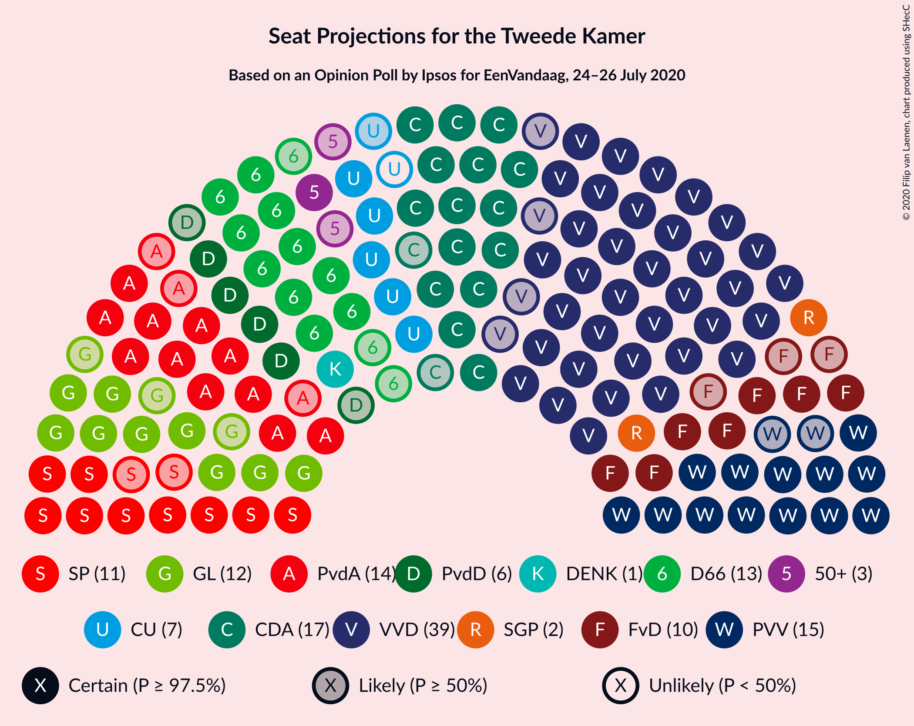

### Confidence Intervals

| Party | Last Result | Median | 80% Confidence Interval | 90% Confidence Interval | 95% Confidence Interval | 99% Confidence Interval |
|:-----:|:-----------:|:------:|:-----------------------:|:-----------------------:|:-----------------------:|:-----------------------:|
| <a href="#volkspartij-voor-vrijheid-en-democratie">Volkspartij voor Vrijheid en Democratie</a> | 33 | 38 | 38–39 |38–41 |37–43 |36–43 |
| <a href="#christen-democratisch-appèl">Christen-Democratisch Appèl</a> | 19 | 17 | 17–19 |16–19 |15–19 |14–19 |
| <a href="#partij-voor-de-vrijheid">Partij voor de Vrijheid</a> | 20 | 16 | 14–16 |14–16 |14–18 |12–18 |
| <a href="#democraten-66">Democraten 66</a> | 19 | 14 | 13–15 |12–15 |12–15 |11–16 |
| <a href="#groenlinks">GroenLinks</a> | 14 | 13 | 12–14 |12–14 |11–15 |10–15 |
| <a href="#partij-van-de-arbeid">Partij van de Arbeid</a> | 9 | 13 | 11–15 |10–15 |10–15 |10–16 |
| <a href="#socialistische-partij">Socialistische Partij</a> | 14 | 13 | 11–13 |9–13 |9–13 |9–13 |
| <a href="#forum-voor-democratie">Forum voor Democratie</a> | 2 | 9 | 8–11 |8–13 |8–13 |8–14 |
| <a href="#christenunie">ChristenUnie</a> | 5 | 6 | 4–6 |4–7 |4–7 |3–7 |
| <a href="#partij-voor-de-dieren">Partij voor de Dieren</a> | 5 | 6 | 5–7 |5–7 |5–8 |4–8 |
| <a href="#staatkundig-gereformeerde-partij">Staatkundig Gereformeerde Partij</a> | 3 | 2 | 2–3 |2–4 |2–4 |1–4 |
| <a href="#50plus">50Plus</a> | 4 | 1 | 1–2 |1–3 |1–3 |1–3 |
| <a href="#denk">DENK</a> | 3 | 1 | 1–2 |1–2 |1–2 |0–2 |
| <a href="#partij-voor-de-toekomst">Partij voor de Toekomst</a> | 0 | 1 | 0–1 |0–1 |0–1 |0–2 |

### Volkspartij voor Vrijheid en Democratie

*For a full overview of the results for this party, see the [Volkspartij voor Vrijheid en Democratie](party-volkspartijvoorvrijheidendemocratie.html) page.*

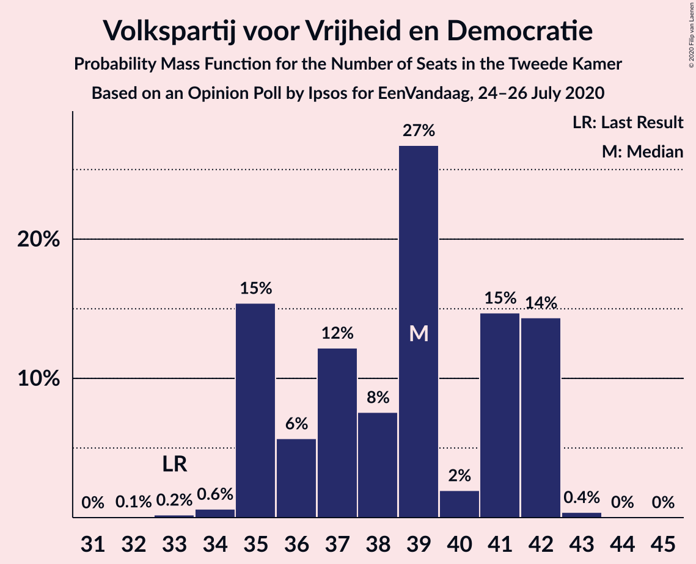

| Number of Seats | Probability | Accumulated | Special Marks |
|:---------------:|:-----------:|:-----------:|:-------------:|
| 33 | 0% | 100% | Last Result |
| 34 | 0.1% | 100% |  |
| 35 | 0.1% | 99.9% |  |
| 36 | 0.5% | 99.8% |  |
| 37 | 4% | 99.4% |  |
| 38 | 59% | 95% | Median |
| 39 | 30% | 36% |  |
| 40 | 1.3% | 6% |  |
| 41 | 0.3% | 5% |  |
| 42 | 2% | 5% |  |
| 43 | 2% | 3% |  |
| 44 | 0.1% | 0.4% |  |
| 45 | 0.3% | 0.3% |  |
| 46 | 0% | 0.1% |  |
| 47 | 0% | 0% |  |

### Christen-Democratisch Appèl

*For a full overview of the results for this party, see the [Christen-Democratisch Appèl](party-christen-democratischappèl.html) page.*

| Number of Seats | Probability | Accumulated | Special Marks |
|:---------------:|:-----------:|:-----------:|:-------------:|
| 14 | 2% | 100% |  |
| 15 | 1.0% | 98% |  |
| 16 | 3% | 97% |  |
| 17 | 66% | 95% | Median |
| 18 | 7% | 28% |  |
| 19 | 21% | 22% | Last Result |
| 20 | 0.2% | 0.5% |  |
| 21 | 0.3% | 0.3% |  |
| 22 | 0% | 0% |  |

### Partij voor de Vrijheid

*For a full overview of the results for this party, see the [Partij voor de Vrijheid](party-partijvoordevrijheid.html) page.*

| Number of Seats | Probability | Accumulated | Special Marks |
|:---------------:|:-----------:|:-----------:|:-------------:|
| 12 | 2% | 100% |  |
| 13 | 0.2% | 98% |  |
| 14 | 8% | 98% |  |
| 15 | 17% | 90% |  |
| 16 | 70% | 73% | Median |
| 17 | 0.5% | 3% |  |
| 18 | 2% | 3% |  |
| 19 | 0.2% | 0.2% |  |
| 20 | 0% | 0.1% | Last Result |
| 21 | 0% | 0% |  |

### Democraten 66

*For a full overview of the results for this party, see the [Democraten 66](party-democraten66.html) page.*

| Number of Seats | Probability | Accumulated | Special Marks |
|:---------------:|:-----------:|:-----------:|:-------------:|
| 10 | 0.1% | 100% |  |
| 11 | 0.5% | 99.9% |  |
| 12 | 7% | 99.4% |  |
| 13 | 18% | 93% |  |
| 14 | 51% | 74% | Median |
| 15 | 22% | 24% |  |
| 16 | 2% | 2% |  |
| 17 | 0.3% | 0.3% |  |
| 18 | 0% | 0% |  |
| 19 | 0% | 0% | Last Result |

### GroenLinks

*For a full overview of the results for this party, see the [GroenLinks](party-groenlinks.html) page.*

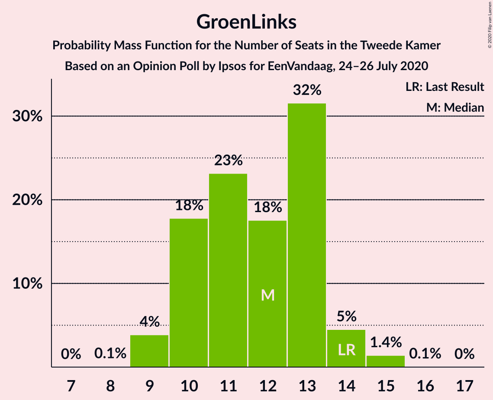

| Number of Seats | Probability | Accumulated | Special Marks |
|:---------------:|:-----------:|:-----------:|:-------------:|
| 9 | 0.1% | 100% |  |
| 10 | 2% | 99.9% |  |
| 11 | 2% | 98% |  |
| 12 | 27% | 96% |  |
| 13 | 52% | 68% | Median |
| 14 | 13% | 16% | Last Result |
| 15 | 3% | 4% |  |
| 16 | 0.1% | 0.4% |  |
| 17 | 0.3% | 0.3% |  |
| 18 | 0% | 0% |  |

### Partij van de Arbeid

*For a full overview of the results for this party, see the [Partij van de Arbeid](party-partijvandearbeid.html) page.*

| Number of Seats | Probability | Accumulated | Special Marks |
|:---------------:|:-----------:|:-----------:|:-------------:|
| 9 | 0% | 100% | Last Result |
| 10 | 5% | 100% |  |
| 11 | 12% | 95% |  |
| 12 | 6% | 83% |  |
| 13 | 56% | 77% | Median |
| 14 | 1.3% | 21% |  |
| 15 | 17% | 20% |  |
| 16 | 2% | 2% |  |
| 17 | 0.1% | 0.2% |  |
| 18 | 0.1% | 0.1% |  |
| 19 | 0% | 0% |  |

### Socialistische Partij

*For a full overview of the results for this party, see the [Socialistische Partij](party-socialistischepartij.html) page.*

| Number of Seats | Probability | Accumulated | Special Marks |
|:---------------:|:-----------:|:-----------:|:-------------:|
| 7 | 0.3% | 100% |  |
| 8 | 0.1% | 99.7% |  |
| 9 | 5% | 99.7% |  |
| 10 | 4% | 95% |  |
| 11 | 22% | 91% |  |
| 12 | 1.0% | 68% |  |
| 13 | 67% | 67% | Median |
| 14 | 0.3% | 0.3% | Last Result |
| 15 | 0% | 0% |  |

### Forum voor Democratie

*For a full overview of the results for this party, see the [Forum voor Democratie](party-forumvoordemocratie.html) page.*

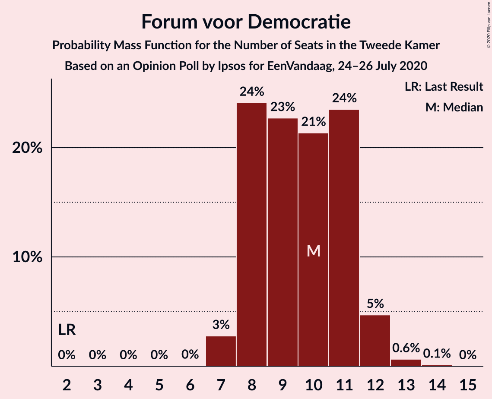

| Number of Seats | Probability | Accumulated | Special Marks |
|:---------------:|:-----------:|:-----------:|:-------------:|
| 2 | 0% | 100% | Last Result |
| 3 | 0% | 100% |  |
| 4 | 0% | 100% |  |
| 5 | 0% | 100% |  |
| 6 | 0% | 100% |  |
| 7 | 0.3% | 100% |  |
| 8 | 17% | 99.7% |  |
| 9 | 55% | 83% | Median |
| 10 | 8% | 28% |  |
| 11 | 11% | 20% |  |
| 12 | 0.2% | 9% |  |
| 13 | 8% | 9% |  |
| 14 | 0.5% | 0.6% |  |
| 15 | 0% | 0% |  |

### ChristenUnie

*For a full overview of the results for this party, see the [ChristenUnie](party-christenunie.html) page.*

| Number of Seats | Probability | Accumulated | Special Marks |
|:---------------:|:-----------:|:-----------:|:-------------:|
| 3 | 2% | 100% |  |
| 4 | 21% | 98% |  |
| 5 | 17% | 77% | Last Result |
| 6 | 52% | 60% | Median |
| 7 | 8% | 8% |  |
| 8 | 0.3% | 0.3% |  |
| 9 | 0% | 0% |  |

### Partij voor de Dieren

*For a full overview of the results for this party, see the [Partij voor de Dieren](party-partijvoordedieren.html) page.*

| Number of Seats | Probability | Accumulated | Special Marks |
|:---------------:|:-----------:|:-----------:|:-------------:|
| 4 | 0.7% | 100% |  |
| 5 | 18% | 99.3% | Last Result |
| 6 | 71% | 82% | Median |
| 7 | 7% | 10% |  |
| 8 | 3% | 3% |  |
| 9 | 0.2% | 0.2% |  |
| 10 | 0% | 0% |  |

### Staatkundig Gereformeerde Partij

*For a full overview of the results for this party, see the [Staatkundig Gereformeerde Partij](party-staatkundiggereformeerdepartij.html) page.*

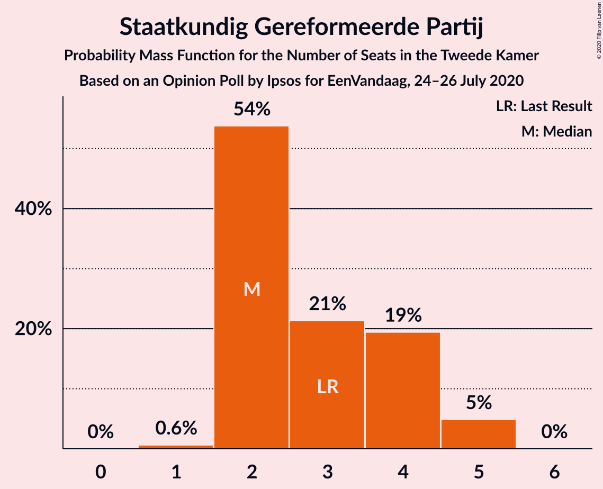

| Number of Seats | Probability | Accumulated | Special Marks |
|:---------------:|:-----------:|:-----------:|:-------------:|
| 1 | 0.6% | 100% |  |
| 2 | 61% | 99.4% | Median |
| 3 | 30% | 39% | Last Result |
| 4 | 9% | 9% |  |
| 5 | 0.1% | 0.1% |  |
| 6 | 0% | 0% |  |

### 50Plus

*For a full overview of the results for this party, see the [50Plus](party-50plus.html) page.*

| Number of Seats | Probability | Accumulated | Special Marks |
|:---------------:|:-----------:|:-----------:|:-------------:|
| 0 | 0.1% | 100% |  |
| 1 | 74% | 99.9% | Median |
| 2 | 20% | 25% |  |
| 3 | 5% | 5% |  |
| 4 | 0.1% | 0.1% | Last Result |
| 5 | 0% | 0% |  |

### DENK

*For a full overview of the results for this party, see the [DENK](party-denk.html) page.*

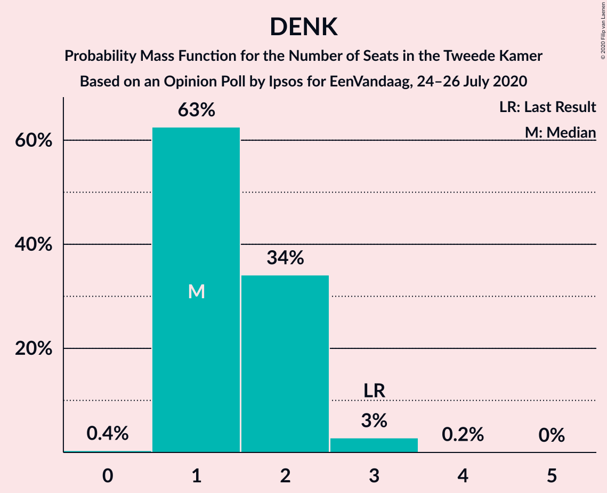

| Number of Seats | Probability | Accumulated | Special Marks |
|:---------------:|:-----------:|:-----------:|:-------------:|
| 0 | 2% | 100% |  |
| 1 | 80% | 98% | Median |
| 2 | 18% | 18% |  |
| 3 | 0% | 0% | Last Result |

### Partij voor de Toekomst

*For a full overview of the results for this party, see the [Partij voor de Toekomst](party-partijvoordetoekomst.html) page.*

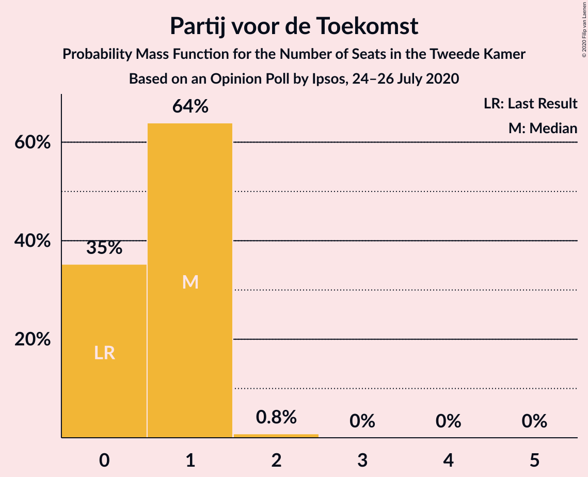

| Number of Seats | Probability | Accumulated | Special Marks |
|:---------------:|:-----------:|:-----------:|:-------------:|
| 0 | 35% | 100% | Last Result |
| 1 | 64% | 65% | Median |
| 2 | 0.8% | 0.8% |  |
| 3 | 0% | 0% |  |

## Coalitions

### Confidence Intervals

| Coalition | Last Result | Median | Majority? | 80% Confidence Interval | 90% Confidence Interval | 95% Confidence Interval | 99% Confidence Interval |
|:---------:|:-----------:|:------:|:---------:|:-----------------------:|:-----------------------:|:-----------------------:|:-----------------------:|
| Volkspartij voor Vrijheid en Democratie – Christen-Democratisch Appèl – Democraten 66 – Partij van de Arbeid – ChristenUnie | 85 | 88 | 100% | 86–90 | 85–90 | 85–93 | 84–94 |
| Volkspartij voor Vrijheid en Democratie – Christen-Democratisch Appèl – Democraten 66 – GroenLinks – ChristenUnie | 90 | 88 | 100% | 87–89 | 87–92 | 86–92 | 84–93 |
| Volkspartij voor Vrijheid en Democratie – Christen-Democratisch Appèl – Partij voor de Vrijheid – Forum voor Democratie – Staatkundig Gereformeerde Partij | 77 | 82 | 100% | 82–86 | 82–88 | 82–88 | 80–89 |
| Volkspartij voor Vrijheid en Democratie – Christen-Democratisch Appèl – Partij voor de Vrijheid – Forum voor Democratie | 74 | 80 | 99.9% | 80–83 | 80–84 | 80–84 | 77–86 |
| Volkspartij voor Vrijheid en Democratie – Christen-Democratisch Appèl – Democraten 66 – ChristenUnie | 76 | 75 | 15% | 75–76 | 73–80 | 72–81 | 71–81 |
| Volkspartij voor Vrijheid en Democratie – Christen-Democratisch Appèl – Forum voor Democratie – Staatkundig Gereformeerde Partij – 50Plus | 61 | 67 | 5% | 67–73 | 67–76 | 67–77 | 67–77 |
| Christen-Democratisch Appèl – Democraten 66 – GroenLinks – Partij van de Arbeid – Socialistische Partij – ChristenUnie | 80 | 76 | 65% | 72–76 | 71–76 | 70–76 | 69–76 |
| Volkspartij voor Vrijheid en Democratie – Christen-Democratisch Appèl – Partij voor de Vrijheid | 72 | 71 | 0.6% | 70–74 | 70–74 | 69–74 | 68–76 |
| Volkspartij voor Vrijheid en Democratie – Christen-Democratisch Appèl – Democraten 66 | 71 | 69 | 0.3% | 69–72 | 68–73 | 66–74 | 65–75 |
| Volkspartij voor Vrijheid en Democratie – Christen-Democratisch Appèl – Forum voor Democratie – Staatkundig Gereformeerde Partij | 57 | 66 | 0.1% | 66–71 | 66–74 | 66–74 | 65–74 |
| Volkspartij voor Vrijheid en Democratie – Christen-Democratisch Appèl – Partij van de Arbeid | 61 | 68 | 0.3% | 66–73 | 66–73 | 66–73 | 65–74 |
| Volkspartij voor Vrijheid en Democratie – Christen-Democratisch Appèl – Forum voor Democratie – 50Plus | 58 | 65 | 0% | 65–70 | 65–72 | 65–73 | 63–73 |
| Volkspartij voor Vrijheid en Democratie – Christen-Democratisch Appèl – Forum voor Democratie | 54 | 64 | 0% | 64–68 | 64–70 | 64–70 | 62–71 |
| Volkspartij voor Vrijheid en Democratie – Democraten 66 – Partij van de Arbeid | 61 | 65 | 0% | 64–67 | 64–67 | 63–70 | 61–71 |
| Christen-Democratisch Appèl – Democraten 66 – GroenLinks – Partij van de Arbeid – ChristenUnie | 66 | 63 | 0% | 62–63 | 60–63 | 60–63 | 58–66 |
| Volkspartij voor Vrijheid en Democratie – Christen-Democratisch Appèl | 52 | 55 | 0% | 55–58 | 54–58 | 54–60 | 53–60 |
| Volkspartij voor Vrijheid en Democratie – Partij van de Arbeid | 42 | 51 | 0% | 49–54 | 49–54 | 49–56 | 49–56 |
| Christen-Democratisch Appèl – Democraten 66 – Partij van de Arbeid | 47 | 44 | 0% | 43–47 | 41–47 | 40–47 | 40–47 |
| Christen-Democratisch Appèl – Partij van de Arbeid – ChristenUnie | 33 | 36 | 0% | 33–38 | 33–38 | 32–38 | 29–39 |
| Christen-Democratisch Appèl – Democraten 66 | 38 | 31 | 0% | 31–33 | 29–34 | 28–34 | 28–34 |
| Christen-Democratisch Appèl – Partij van de Arbeid | 28 | 30 | 0% | 28–34 | 28–34 | 27–34 | 26–34 |

### Volkspartij voor Vrijheid en Democratie – Christen-Democratisch Appèl – Democraten 66 – Partij van de Arbeid – ChristenUnie

| Number of Seats | Probability | Accumulated | Special Marks |
|:---------------:|:-----------:|:-----------:|:-------------:|
| 81 | 0.1% | 100% |  |
| 82 | 0% | 99.9% |  |
| 83 | 0% | 99.9% |  |
| 84 | 2% | 99.9% |  |
| 85 | 4% | 98% | Last Result |
| 86 | 10% | 94% |  |
| 87 | 3% | 84% |  |
| 88 | 50% | 81% | Median |
| 89 | 5% | 31% |  |
| 90 | 22% | 26% |  |
| 91 | 0.6% | 3% |  |
| 92 | 0.2% | 3% |  |
| 93 | 0.5% | 3% |  |
| 94 | 2% | 2% |  |
| 95 | 0% | 0% |  |

### Volkspartij voor Vrijheid en Democratie – Christen-Democratisch Appèl – Democraten 66 – GroenLinks – ChristenUnie

| Number of Seats | Probability | Accumulated | Special Marks |
|:---------------:|:-----------:|:-----------:|:-------------:|
| 82 | 0% | 100% |  |
| 83 | 0.1% | 99.9% |  |
| 84 | 2% | 99.9% |  |
| 85 | 0.1% | 98% |  |
| 86 | 2% | 98% |  |
| 87 | 20% | 95% |  |
| 88 | 55% | 75% | Median |
| 89 | 12% | 20% |  |
| 90 | 0.3% | 8% | Last Result |
| 91 | 2% | 8% |  |
| 92 | 6% | 6% |  |
| 93 | 0.2% | 0.6% |  |
| 94 | 0.1% | 0.4% |  |
| 95 | 0.3% | 0.3% |  |
| 96 | 0% | 0% |  |

### Volkspartij voor Vrijheid en Democratie – Christen-Democratisch Appèl – Partij voor de Vrijheid – Forum voor Democratie – Staatkundig Gereformeerde Partij

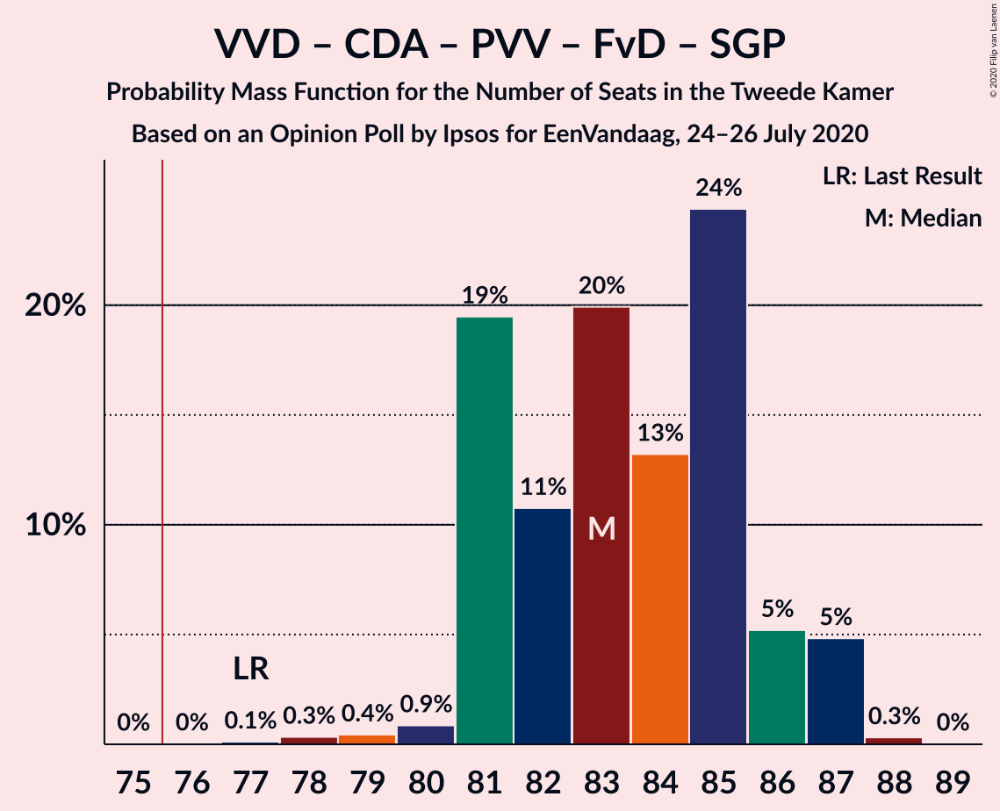

| Number of Seats | Probability | Accumulated | Special Marks |
|:---------------:|:-----------:|:-----------:|:-------------:|
| 77 | 0% | 100% | Last Result |
| 78 | 0% | 100% |  |
| 79 | 0.1% | 99.9% |  |
| 80 | 0.4% | 99.8% |  |
| 81 | 0.6% | 99.5% |  |
| 82 | 49% | 98.9% | Median |
| 83 | 0.4% | 50% |  |
| 84 | 19% | 49% |  |
| 85 | 20% | 30% |  |
| 86 | 3% | 10% |  |
| 87 | 2% | 8% |  |
| 88 | 5% | 5% |  |
| 89 | 0.1% | 0.5% |  |
| 90 | 0.1% | 0.4% |  |
| 91 | 0.3% | 0.4% |  |
| 92 | 0% | 0% |  |

### Volkspartij voor Vrijheid en Democratie – Christen-Democratisch Appèl – Partij voor de Vrijheid – Forum voor Democratie

| Number of Seats | Probability | Accumulated | Special Marks |
|:---------------:|:-----------:|:-----------:|:-------------:|
| 74 | 0% | 100% | Last Result |
| 75 | 0% | 100% |  |
| 76 | 0.1% | 99.9% | Majority |
| 77 | 0.3% | 99.8% |  |
| 78 | 0.2% | 99.5% |  |
| 79 | 0.4% | 99.3% |  |
| 80 | 49% | 98.9% | Median |
| 81 | 11% | 50% |  |
| 82 | 27% | 38% |  |
| 83 | 4% | 11% |  |
| 84 | 6% | 7% |  |
| 85 | 0.1% | 0.7% |  |
| 86 | 0.1% | 0.6% |  |
| 87 | 0.1% | 0.5% |  |
| 88 | 0.3% | 0.4% |  |
| 89 | 0.1% | 0.1% |  |
| 90 | 0% | 0% |  |

### Volkspartij voor Vrijheid en Democratie – Christen-Democratisch Appèl – Democraten 66 – ChristenUnie

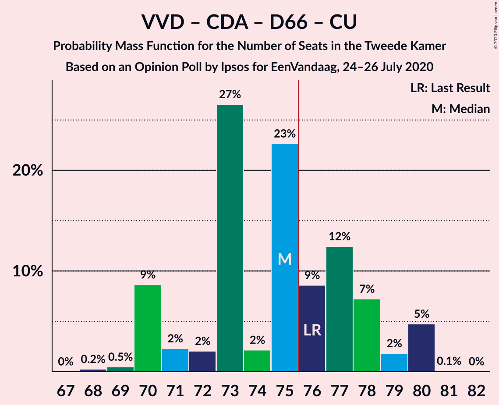

| Number of Seats | Probability | Accumulated | Special Marks |
|:---------------:|:-----------:|:-----------:|:-------------:|
| 68 | 0% | 100% |  |
| 69 | 0.1% | 99.9% |  |
| 70 | 0.1% | 99.9% |  |
| 71 | 2% | 99.8% |  |
| 72 | 2% | 98% |  |
| 73 | 5% | 96% |  |
| 74 | 0.3% | 91% |  |
| 75 | 76% | 91% | Median |
| 76 | 5% | 15% | Last Result, Majority |
| 77 | 1.5% | 10% |  |
| 78 | 0.2% | 8% |  |
| 79 | 0.1% | 8% |  |
| 80 | 6% | 8% |  |
| 81 | 2% | 3% |  |
| 82 | 0% | 0% |  |

### Volkspartij voor Vrijheid en Democratie – Christen-Democratisch Appèl – Forum voor Democratie – Staatkundig Gereformeerde Partij – 50Plus

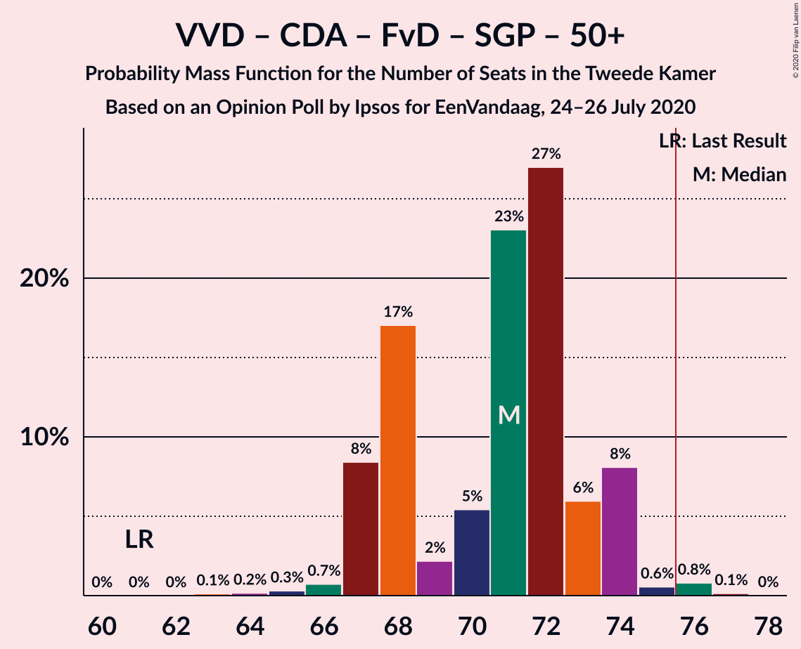

| Number of Seats | Probability | Accumulated | Special Marks |
|:---------------:|:-----------:|:-----------:|:-------------:|
| 61 | 0% | 100% | Last Result |
| 62 | 0% | 100% |  |
| 63 | 0% | 100% |  |
| 64 | 0% | 100% |  |
| 65 | 0.3% | 100% |  |
| 66 | 0.1% | 99.7% |  |
| 67 | 52% | 99.6% | Median |
| 68 | 0.3% | 48% |  |
| 69 | 0.3% | 48% |  |
| 70 | 17% | 47% |  |
| 71 | 17% | 30% |  |
| 72 | 2% | 12% |  |
| 73 | 0.3% | 10% |  |
| 74 | 5% | 10% |  |
| 75 | 0% | 5% |  |
| 76 | 0.1% | 5% | Majority |
| 77 | 5% | 5% |  |
| 78 | 0% | 0.1% |  |
| 79 | 0% | 0% |  |

### Christen-Democratisch Appèl – Democraten 66 – GroenLinks – Partij van de Arbeid – Socialistische Partij – ChristenUnie

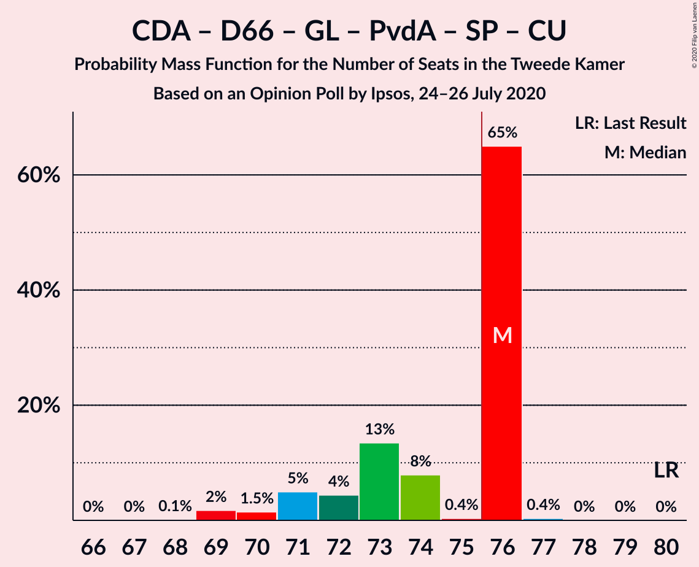

| Number of Seats | Probability | Accumulated | Special Marks |
|:---------------:|:-----------:|:-----------:|:-------------:|
| 66 | 0% | 100% |  |
| 67 | 0% | 99.9% |  |
| 68 | 0.1% | 99.9% |  |
| 69 | 2% | 99.8% |  |
| 70 | 1.5% | 98% |  |
| 71 | 5% | 97% |  |
| 72 | 4% | 92% |  |
| 73 | 13% | 87% |  |
| 74 | 8% | 74% |  |
| 75 | 0.4% | 66% |  |
| 76 | 65% | 65% | Median, Majority |
| 77 | 0.4% | 0.4% |  |
| 78 | 0% | 0.1% |  |
| 79 | 0% | 0% |  |
| 80 | 0% | 0% | Last Result |

### Volkspartij voor Vrijheid en Democratie – Christen-Democratisch Appèl – Partij voor de Vrijheid

| Number of Seats | Probability | Accumulated | Special Marks |
|:---------------:|:-----------:|:-----------:|:-------------:|
| 65 | 0% | 100% |  |
| 66 | 0% | 99.9% |  |
| 67 | 0% | 99.9% |  |
| 68 | 2% | 99.8% |  |
| 69 | 0.5% | 98% |  |
| 70 | 13% | 97% |  |
| 71 | 54% | 85% | Median |
| 72 | 6% | 31% | Last Result |
| 73 | 8% | 25% |  |
| 74 | 16% | 17% |  |
| 75 | 0.4% | 0.9% |  |
| 76 | 0.2% | 0.6% | Majority |
| 77 | 0.1% | 0.4% |  |
| 78 | 0.1% | 0.3% |  |
| 79 | 0% | 0.3% |  |
| 80 | 0.3% | 0.3% |  |
| 81 | 0% | 0% |  |

### Volkspartij voor Vrijheid en Democratie – Christen-Democratisch Appèl – Democraten 66

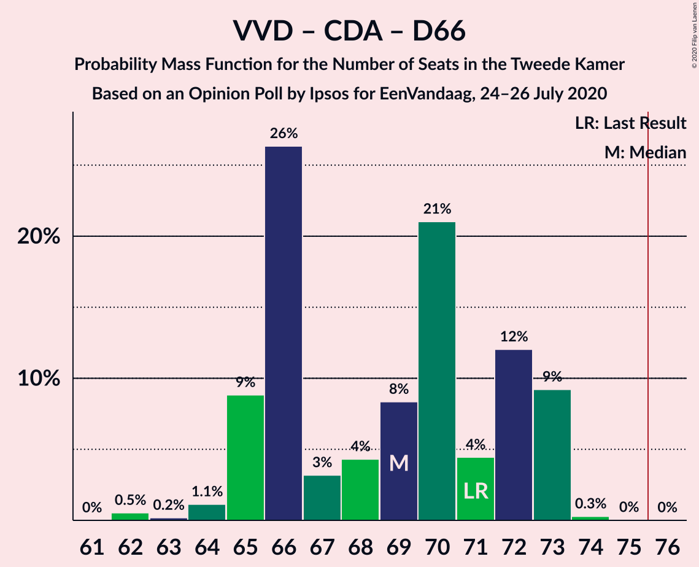

| Number of Seats | Probability | Accumulated | Special Marks |
|:---------------:|:-----------:|:-----------:|:-------------:|
| 63 | 0.1% | 100% |  |
| 64 | 0.1% | 99.9% |  |
| 65 | 2% | 99.9% |  |
| 66 | 2% | 98% |  |
| 67 | 0.6% | 96% |  |
| 68 | 3% | 95% |  |
| 69 | 49% | 92% | Median |
| 70 | 13% | 43% |  |
| 71 | 16% | 30% | Last Result |
| 72 | 5% | 14% |  |
| 73 | 6% | 9% |  |
| 74 | 0.2% | 3% |  |
| 75 | 2% | 2% |  |
| 76 | 0.3% | 0.3% | Majority |
| 77 | 0% | 0.1% |  |
| 78 | 0% | 0% |  |

### Volkspartij voor Vrijheid en Democratie – Christen-Democratisch Appèl – Forum voor Democratie – Staatkundig Gereformeerde Partij

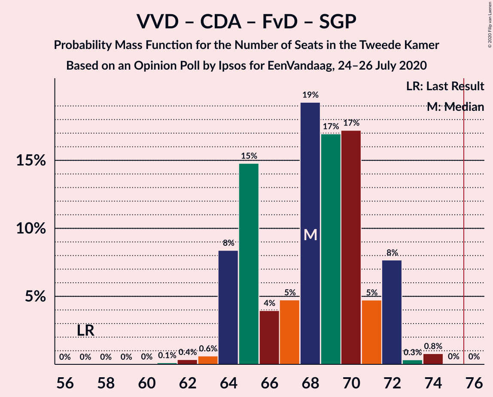

| Number of Seats | Probability | Accumulated | Special Marks |
|:---------------:|:-----------:|:-----------:|:-------------:|
| 57 | 0% | 100% | Last Result |
| 58 | 0% | 100% |  |
| 59 | 0% | 100% |  |
| 60 | 0% | 100% |  |
| 61 | 0% | 100% |  |
| 62 | 0% | 100% |  |
| 63 | 0.3% | 100% |  |
| 64 | 0.1% | 99.7% |  |
| 65 | 0.6% | 99.6% |  |
| 66 | 51% | 99.0% | Median |
| 67 | 0.5% | 48% |  |
| 68 | 2% | 47% |  |
| 69 | 31% | 45% |  |
| 70 | 5% | 15% |  |
| 71 | 0.5% | 10% |  |
| 72 | 0.1% | 10% |  |
| 73 | 5% | 10% |  |
| 74 | 5% | 5% |  |
| 75 | 0.3% | 0.4% |  |
| 76 | 0.1% | 0.1% | Majority |
| 77 | 0% | 0% |  |

### Volkspartij voor Vrijheid en Democratie – Christen-Democratisch Appèl – Partij van de Arbeid

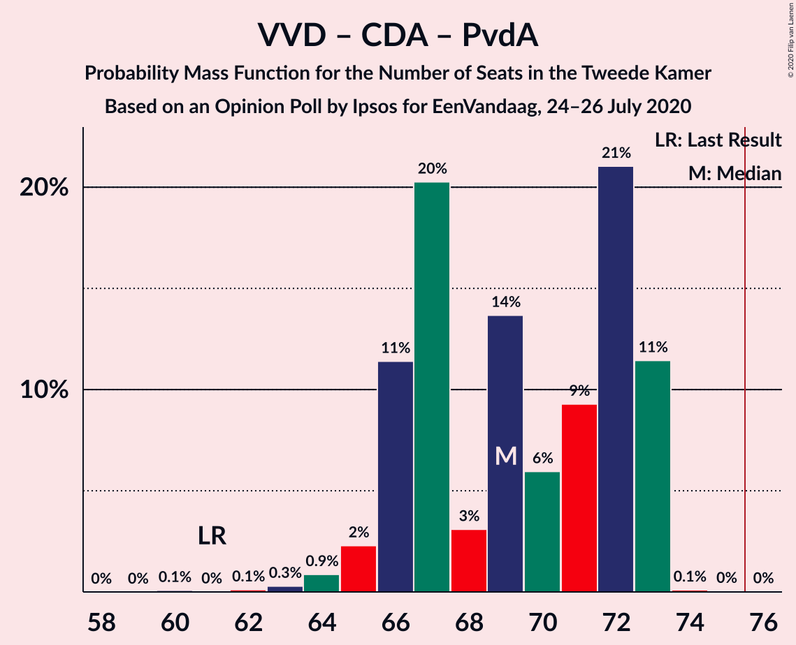

| Number of Seats | Probability | Accumulated | Special Marks |
|:---------------:|:-----------:|:-----------:|:-------------:|
| 61 | 0% | 100% | Last Result |
| 62 | 0% | 100% |  |
| 63 | 0.1% | 100% |  |
| 64 | 0.1% | 99.9% |  |
| 65 | 2% | 99.8% |  |
| 66 | 10% | 98% |  |
| 67 | 0.4% | 88% |  |
| 68 | 59% | 87% | Median |
| 69 | 0.8% | 28% |  |
| 70 | 7% | 27% |  |
| 71 | 0.3% | 20% |  |
| 72 | 2% | 20% |  |
| 73 | 18% | 19% |  |
| 74 | 0.1% | 0.5% |  |
| 75 | 0.1% | 0.4% |  |
| 76 | 0.3% | 0.3% | Majority |
| 77 | 0% | 0.1% |  |
| 78 | 0% | 0% |  |

### Volkspartij voor Vrijheid en Democratie – Christen-Democratisch Appèl – Forum voor Democratie – 50Plus

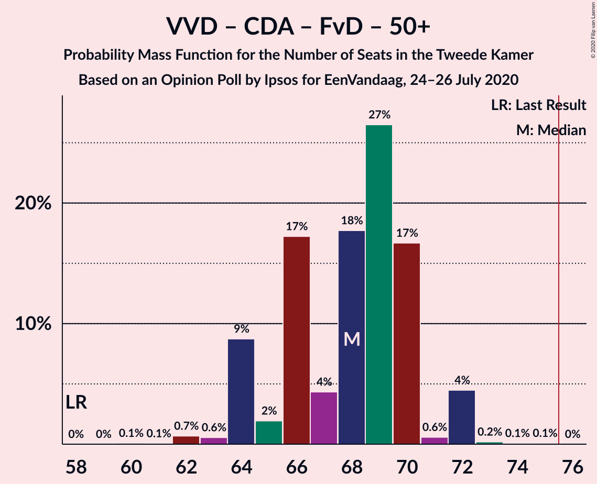

| Number of Seats | Probability | Accumulated | Special Marks |
|:---------------:|:-----------:|:-----------:|:-------------:|
| 58 | 0% | 100% | Last Result |
| 59 | 0% | 100% |  |
| 60 | 0% | 100% |  |
| 61 | 0% | 100% |  |
| 62 | 0.3% | 99.9% |  |
| 63 | 0.2% | 99.7% |  |
| 64 | 0.1% | 99.4% |  |
| 65 | 51% | 99.3% | Median |
| 66 | 0.5% | 48% |  |
| 67 | 17% | 47% |  |
| 68 | 12% | 30% |  |
| 69 | 6% | 18% |  |
| 70 | 4% | 12% |  |
| 71 | 2% | 8% |  |
| 72 | 0.2% | 5% |  |
| 73 | 5% | 5% |  |
| 74 | 0.3% | 0.3% |  |
| 75 | 0% | 0.1% |  |
| 76 | 0% | 0% | Majority |

### Volkspartij voor Vrijheid en Democratie – Christen-Democratisch Appèl – Forum voor Democratie

| Number of Seats | Probability | Accumulated | Special Marks |
|:---------------:|:-----------:|:-----------:|:-------------:|
| 54 | 0% | 100% | Last Result |
| 55 | 0% | 100% |  |
| 56 | 0% | 100% |  |
| 57 | 0% | 100% |  |
| 58 | 0% | 100% |  |
| 59 | 0% | 100% |  |
| 60 | 0.3% | 99.9% |  |
| 61 | 0.1% | 99.7% |  |
| 62 | 0.2% | 99.6% |  |
| 63 | 0.3% | 99.3% |  |
| 64 | 52% | 99.1% | Median |
| 65 | 0.5% | 47% |  |
| 66 | 28% | 47% |  |
| 67 | 6% | 19% |  |
| 68 | 2% | 12% |  |
| 69 | 3% | 10% |  |
| 70 | 7% | 7% |  |
| 71 | 0.1% | 0.5% |  |
| 72 | 0.3% | 0.4% |  |
| 73 | 0% | 0.1% |  |
| 74 | 0% | 0% |  |

### Volkspartij voor Vrijheid en Democratie – Democraten 66 – Partij van de Arbeid

| Number of Seats | Probability | Accumulated | Special Marks |
|:---------------:|:-----------:|:-----------:|:-------------:|
| 59 | 0% | 100% |  |
| 60 | 0% | 99.9% |  |
| 61 | 2% | 99.9% | Last Result |
| 62 | 0.1% | 98% |  |
| 63 | 3% | 98% |  |
| 64 | 15% | 95% |  |
| 65 | 52% | 80% | Median |
| 66 | 0.6% | 29% |  |
| 67 | 23% | 28% |  |
| 68 | 2% | 5% |  |
| 69 | 0.1% | 3% |  |
| 70 | 0.3% | 3% |  |
| 71 | 2% | 2% |  |
| 72 | 0% | 0.1% |  |
| 73 | 0% | 0% |  |

### Christen-Democratisch Appèl – Democraten 66 – GroenLinks – Partij van de Arbeid – ChristenUnie

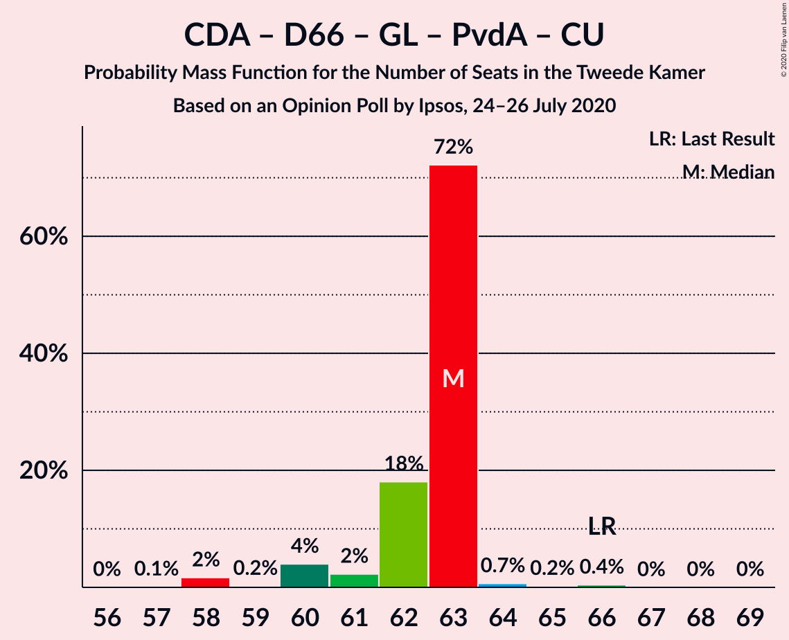

| Number of Seats | Probability | Accumulated | Special Marks |
|:---------------:|:-----------:|:-----------:|:-------------:|
| 56 | 0% | 100% |  |
| 57 | 0.1% | 99.9% |  |
| 58 | 2% | 99.8% |  |
| 59 | 0.2% | 98% |  |
| 60 | 4% | 98% |  |
| 61 | 2% | 94% |  |
| 62 | 18% | 92% |  |
| 63 | 72% | 74% | Median |
| 64 | 0.7% | 1.4% |  |
| 65 | 0.2% | 0.7% |  |
| 66 | 0.4% | 0.5% | Last Result |
| 67 | 0% | 0.1% |  |
| 68 | 0% | 0.1% |  |
| 69 | 0% | 0% |  |

### Volkspartij voor Vrijheid en Democratie – Christen-Democratisch Appèl

| Number of Seats | Probability | Accumulated | Special Marks |
|:---------------:|:-----------:|:-----------:|:-------------:|
| 50 | 0.1% | 100% |  |
| 51 | 0.1% | 99.9% |  |
| 52 | 0.1% | 99.9% | Last Result |
| 53 | 2% | 99.7% |  |
| 54 | 3% | 98% |  |
| 55 | 59% | 95% | Median |
| 56 | 4% | 36% |  |
| 57 | 7% | 31% |  |
| 58 | 21% | 24% |  |
| 59 | 0.2% | 3% |  |
| 60 | 2% | 3% |  |
| 61 | 0.1% | 0.5% |  |
| 62 | 0% | 0.4% |  |
| 63 | 0.1% | 0.3% |  |
| 64 | 0.3% | 0.3% |  |
| 65 | 0% | 0% |  |

### Volkspartij voor Vrijheid en Democratie – Partij van de Arbeid

| Number of Seats | Probability | Accumulated | Special Marks |
|:---------------:|:-----------:|:-----------:|:-------------:|
| 42 | 0% | 100% | Last Result |
| 43 | 0% | 100% |  |
| 44 | 0% | 100% |  |
| 45 | 0% | 100% |  |
| 46 | 0% | 100% |  |
| 47 | 0% | 100% |  |
| 48 | 0.3% | 99.9% |  |
| 49 | 17% | 99.7% |  |
| 50 | 0.5% | 83% |  |
| 51 | 53% | 82% | Median |
| 52 | 5% | 29% |  |
| 53 | 3% | 25% |  |
| 54 | 19% | 22% |  |
| 55 | 0.4% | 3% |  |
| 56 | 2% | 3% |  |
| 57 | 0.1% | 0.5% |  |
| 58 | 0.3% | 0.4% |  |
| 59 | 0% | 0.1% |  |
| 60 | 0% | 0.1% |  |
| 61 | 0% | 0% |  |

### Christen-Democratisch Appèl – Democraten 66 – Partij van de Arbeid

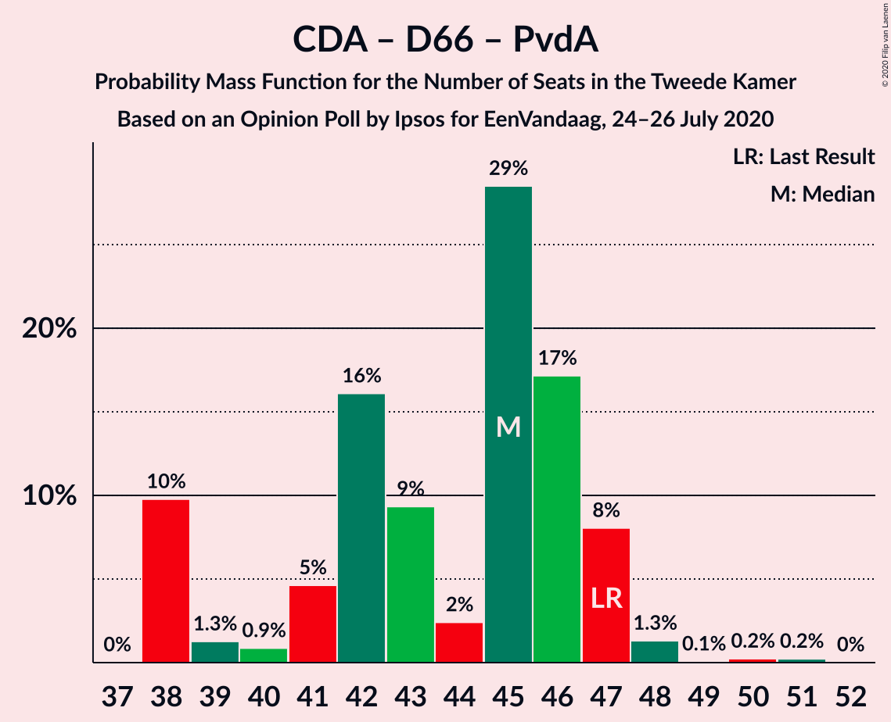

| Number of Seats | Probability | Accumulated | Special Marks |
|:---------------:|:-----------:|:-----------:|:-------------:|
| 37 | 0% | 100% |  |
| 38 | 0% | 99.9% |  |
| 39 | 0.2% | 99.9% |  |
| 40 | 4% | 99.7% |  |
| 41 | 3% | 96% |  |
| 42 | 0.4% | 94% |  |
| 43 | 10% | 93% |  |
| 44 | 55% | 83% | Median |
| 45 | 5% | 27% |  |
| 46 | 6% | 22% |  |
| 47 | 16% | 16% | Last Result |
| 48 | 0.1% | 0.4% |  |
| 49 | 0.3% | 0.3% |  |
| 50 | 0% | 0% |  |

### Christen-Democratisch Appèl – Partij van de Arbeid – ChristenUnie

| Number of Seats | Probability | Accumulated | Special Marks |
|:---------------:|:-----------:|:-----------:|:-------------:|
| 29 | 2% | 100% |  |
| 30 | 0% | 98% |  |
| 31 | 0.1% | 98% |  |
| 32 | 1.4% | 98% |  |
| 33 | 10% | 97% | Last Result |
| 34 | 3% | 87% |  |
| 35 | 6% | 84% |  |
| 36 | 56% | 77% | Median |
| 37 | 0.8% | 21% |  |
| 38 | 20% | 20% |  |
| 39 | 0.1% | 0.5% |  |
| 40 | 0.3% | 0.4% |  |
| 41 | 0% | 0.1% |  |
| 42 | 0% | 0.1% |  |
| 43 | 0% | 0% |  |

### Christen-Democratisch Appèl – Democraten 66

| Number of Seats | Probability | Accumulated | Special Marks |
|:---------------:|:-----------:|:-----------:|:-------------:|
| 25 | 0% | 100% |  |
| 26 | 0% | 99.9% |  |
| 27 | 0.3% | 99.9% |  |
| 28 | 4% | 99.6% |  |
| 29 | 5% | 96% |  |
| 30 | 0.4% | 91% |  |
| 31 | 51% | 90% | Median |
| 32 | 28% | 39% |  |
| 33 | 6% | 12% |  |
| 34 | 5% | 6% |  |
| 35 | 0.3% | 0.4% |  |
| 36 | 0% | 0% |  |
| 37 | 0% | 0% |  |
| 38 | 0% | 0% | Last Result |

### Christen-Democratisch Appèl – Partij van de Arbeid

| Number of Seats | Probability | Accumulated | Special Marks |
|:---------------:|:-----------:|:-----------:|:-------------:|
| 26 | 2% | 100% |  |
| 27 | 1.1% | 98% |  |
| 28 | 12% | 97% | Last Result |
| 29 | 8% | 85% |  |
| 30 | 51% | 77% | Median |
| 31 | 5% | 25% |  |
| 32 | 0.7% | 21% |  |
| 33 | 4% | 20% |  |
| 34 | 16% | 16% |  |
| 35 | 0% | 0.1% |  |
| 36 | 0% | 0% |  |

## Technical Information

### Opinion Poll

+ **Polling firm:** Ipsos
+ **Commissioner(s):** —
+ **Fieldwork period:** 24–26 July 2020

### Calculations

+ **Sample size:** 1054
+ **Simulations done:** 1,048,576
+ **Error estimate:** 1.54%

