# Opinion Poll by I&O Research, 9 August 2020

<a href="#voting-intentions">Voting Intentions</a> | <a href="#seats">Seats</a> | <a href="#coalitions">Coalitions</a> | <a href="#technical-information">Technical Information</a>

## Voting Intentions

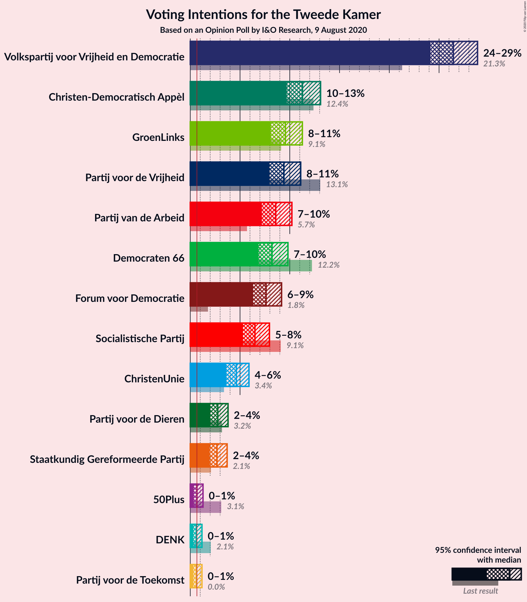

### Confidence Intervals

| Party | Last Result | Poll Result | 80% Confidence Interval | 90% Confidence Interval | 95% Confidence Interval | 99% Confidence Interval |
|:-----:|:-----------:|:-----------:|:-----------------------:|:-----------------------:|:-----------------------:|:-----------------------:|
| Volkspartij voor Vrijheid en Democratie | 21.3% | 26.4% | 24.9–28.0% |24.5–28.5% |24.1–28.9% |23.4–29.6% |
| Christen-Democratisch Appèl | 12.4% | 11.3% | 10.2–12.5% |9.9–12.8% |9.7–13.1% |9.2–13.7% |
| GroenLinks | 9.1% | 9.6% | 8.6–10.7% |8.3–11.0% |8.1–11.3% |7.7–11.8% |
| Partij voor de Vrijheid | 13.1% | 9.4% | 8.5–10.5% |8.2–10.8% |8.0–11.1% |7.5–11.6% |
| Partij van de Arbeid | 5.7% | 8.6% | 7.7–9.6% |7.4–10.0% |7.2–10.2% |6.8–10.7% |
| Democraten 66 | 12.2% | 8.2% | 7.3–9.3% |7.1–9.6% |6.9–9.8% |6.4–10.3% |
| Forum voor Democratie | 1.8% | 7.6% | 6.8–8.6% |6.5–8.9% |6.3–9.2% |5.9–9.7% |
| Socialistische Partij | 9.1% | 6.5% | 5.7–7.5% |5.5–7.7% |5.3–8.0% |4.9–8.4% |
| ChristenUnie | 3.4% | 4.6% | 4.0–5.5% |3.8–5.7% |3.6–5.9% |3.3–6.3% |
| Partij voor de Dieren | 3.2% | 2.8% | 2.3–3.4% |2.1–3.6% |2.0–3.8% |1.8–4.1% |
| Staatkundig Gereformeerde Partij | 2.1% | 2.7% | 2.2–3.4% |2.1–3.5% |2.0–3.7% |1.7–4.1% |
| 50Plus | 3.1% | 0.7% | 0.5–1.1% |0.4–1.2% |0.4–1.3% |0.3–1.5% |
| DENK | 2.1% | 0.6% | 0.4–1.0% |0.4–1.1% |0.3–1.2% |0.2–1.4% |
| Partij voor de Toekomst | 0.0% | 0.6% | 0.4–1.0% |0.4–1.1% |0.3–1.2% |0.2–1.4% |

*Note:* The poll result column reflects the actual value used in the calculations. Published results may vary slightly, and in addition be rounded to fewer digits.

## Seats

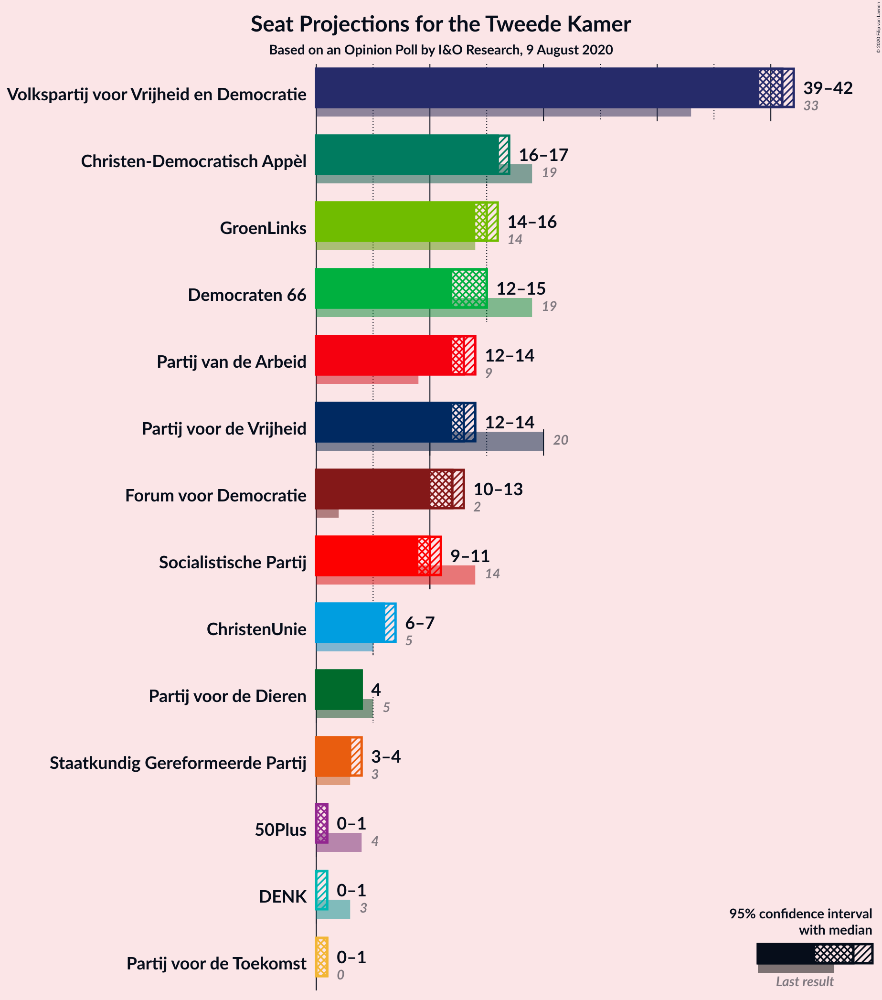

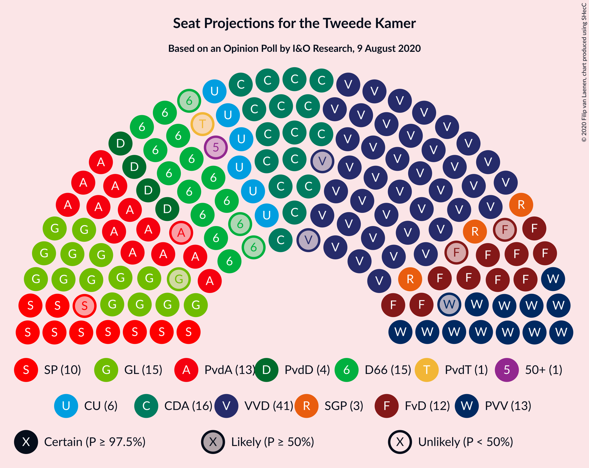

### Confidence Intervals

| Party | Last Result | Median | 80% Confidence Interval | 90% Confidence Interval | 95% Confidence Interval | 99% Confidence Interval |
|:-----:|:-----------:|:------:|:-----------------------:|:-----------------------:|:-----------------------:|:-----------------------:|
| <a href="#volkspartij-voor-vrijheid-en-democratie">Volkspartij voor Vrijheid en Democratie</a> | 33 | 41 | 41 |41 |39–42 |37–44 |
| <a href="#christen-democratisch-appèl">Christen-Democratisch Appèl</a> | 19 | 16 | 16 |16–17 |16–17 |15–19 |
| <a href="#groenlinks">GroenLinks</a> | 14 | 15 | 15 |15 |14–16 |12–17 |
| <a href="#partij-voor-de-vrijheid">Partij voor de Vrijheid</a> | 20 | 13 | 13 |13 |12–14 |12–15 |
| <a href="#partij-van-de-arbeid">Partij van de Arbeid</a> | 9 | 13 | 13 |13 |12–14 |11–16 |
| <a href="#democraten-66">Democraten 66</a> | 19 | 15 | 15 |13–15 |12–15 |11–15 |
| <a href="#forum-voor-democratie">Forum voor Democratie</a> | 2 | 12 | 12 |12 |10–13 |9–15 |
| <a href="#socialistische-partij">Socialistische Partij</a> | 14 | 10 | 10 |10 |9–11 |8–12 |
| <a href="#christenunie">ChristenUnie</a> | 5 | 6 | 6 |6 |6–7 |5–8 |
| <a href="#partij-voor-de-dieren">Partij voor de Dieren</a> | 5 | 4 | 4 |4 |4 |2–6 |
| <a href="#staatkundig-gereformeerde-partij">Staatkundig Gereformeerde Partij</a> | 3 | 3 | 3 |3 |3–4 |3–5 |
| <a href="#50plus">50Plus</a> | 4 | 1 | 1 |1 |0–1 |0–1 |
| <a href="#denk">DENK</a> | 3 | 0 | 0 |0 |0–1 |0–1 |
| <a href="#partij-voor-de-toekomst">Partij voor de Toekomst</a> | 0 | 1 | 1 |0–1 |0–1 |0–2 |

### Volkspartij voor Vrijheid en Democratie

*For a full overview of the results for this party, see the [Volkspartij voor Vrijheid en Democratie](party-volkspartijvoorvrijheidendemocratie.html) page.*

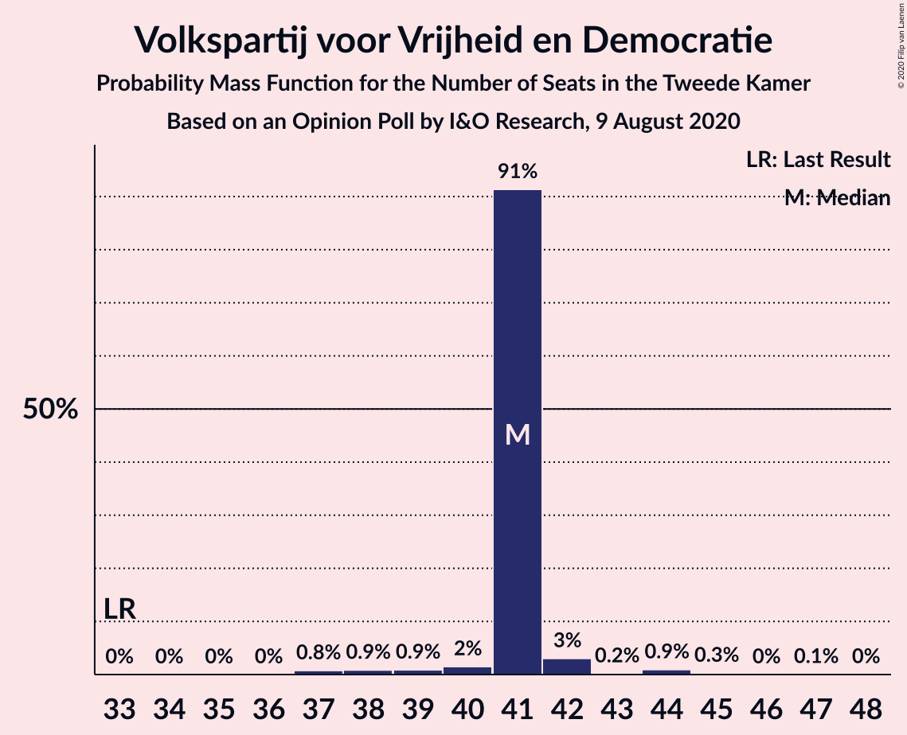

| Number of Seats | Probability | Accumulated | Special Marks |
|:---------------:|:-----------:|:-----------:|:-------------:|
| 33 | 0% | 100% | Last Result |
| 34 | 0% | 100% |  |
| 35 | 0% | 100% |  |
| 36 | 0% | 100% |  |
| 37 | 0.8% | 100% |  |
| 38 | 0.9% | 99.2% |  |
| 39 | 0.9% | 98% |  |
| 40 | 2% | 97% |  |
| 41 | 91% | 96% | Median |
| 42 | 3% | 5% |  |
| 43 | 0.2% | 2% |  |
| 44 | 0.9% | 1.4% |  |
| 45 | 0.3% | 0.4% |  |
| 46 | 0% | 0.1% |  |
| 47 | 0.1% | 0.1% |  |
| 48 | 0% | 0% |  |

### Christen-Democratisch Appèl

*For a full overview of the results for this party, see the [Christen-Democratisch Appèl](party-christen-democratischappèl.html) page.*

| Number of Seats | Probability | Accumulated | Special Marks |
|:---------------:|:-----------:|:-----------:|:-------------:|
| 14 | 0.1% | 100% |  |
| 15 | 2% | 99.9% |  |
| 16 | 92% | 98% | Median |
| 17 | 4% | 6% |  |
| 18 | 1.3% | 2% |  |
| 19 | 0.4% | 0.9% | Last Result |
| 20 | 0.2% | 0.5% |  |
| 21 | 0.3% | 0.3% |  |
| 22 | 0% | 0% |  |

### GroenLinks

*For a full overview of the results for this party, see the [GroenLinks](party-groenlinks.html) page.*

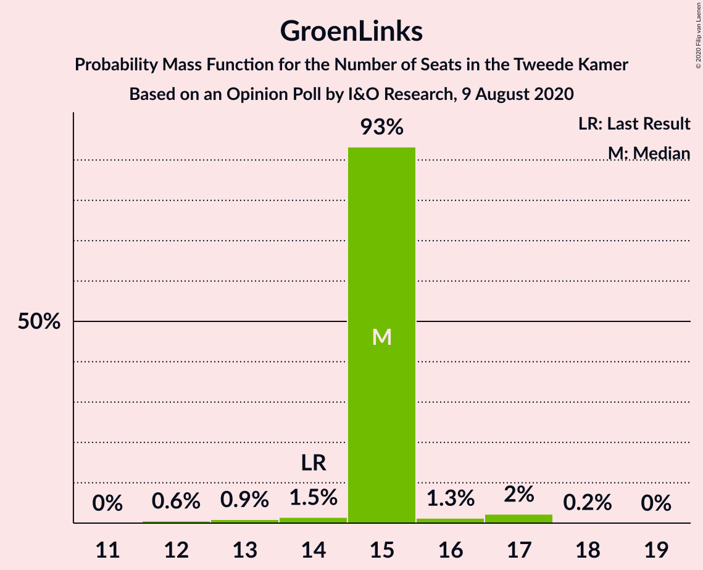

| Number of Seats | Probability | Accumulated | Special Marks |
|:---------------:|:-----------:|:-----------:|:-------------:|
| 12 | 0.6% | 100% |  |
| 13 | 0.9% | 99.4% |  |
| 14 | 1.5% | 98% | Last Result |
| 15 | 93% | 97% | Median |
| 16 | 1.3% | 4% |  |
| 17 | 2% | 2% |  |
| 18 | 0.2% | 0.2% |  |
| 19 | 0% | 0% |  |

### Partij voor de Vrijheid

*For a full overview of the results for this party, see the [Partij voor de Vrijheid](party-partijvoordevrijheid.html) page.*

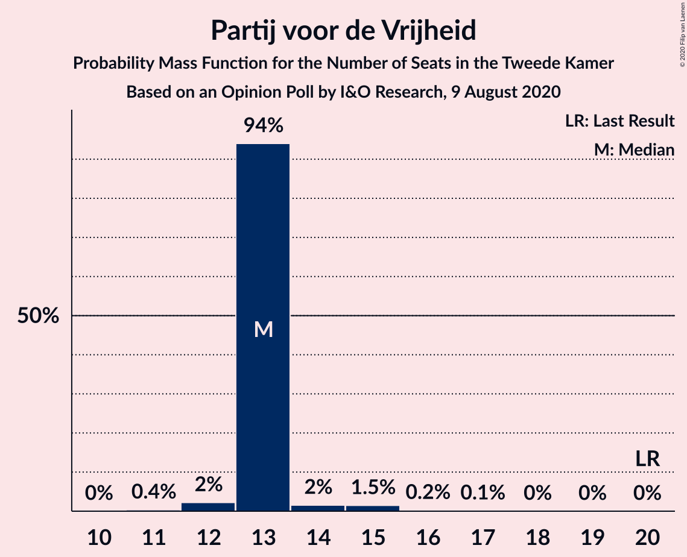

| Number of Seats | Probability | Accumulated | Special Marks |
|:---------------:|:-----------:|:-----------:|:-------------:|
| 11 | 0.4% | 100% |  |
| 12 | 2% | 99.6% |  |
| 13 | 94% | 97% | Median |
| 14 | 2% | 3% |  |
| 15 | 1.5% | 2% |  |
| 16 | 0.2% | 0.4% |  |
| 17 | 0.1% | 0.1% |  |
| 18 | 0% | 0% |  |
| 19 | 0% | 0% |  |
| 20 | 0% | 0% | Last Result |

### Partij van de Arbeid

*For a full overview of the results for this party, see the [Partij van de Arbeid](party-partijvandearbeid.html) page.*

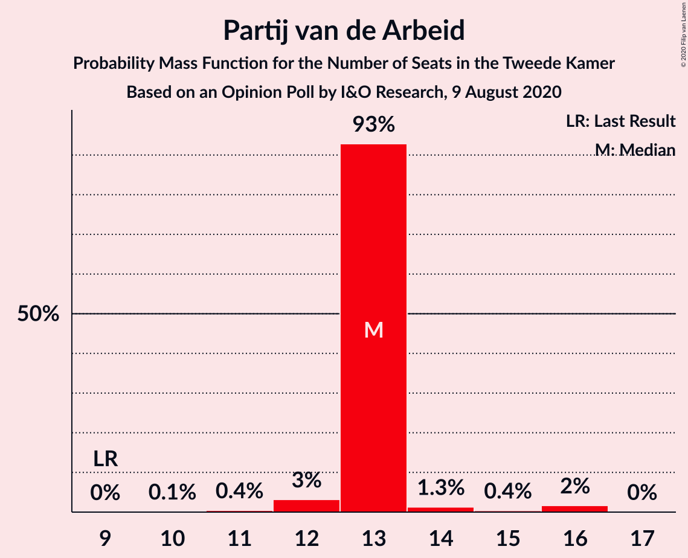

| Number of Seats | Probability | Accumulated | Special Marks |
|:---------------:|:-----------:|:-----------:|:-------------:|
| 9 | 0% | 100% | Last Result |
| 10 | 0.1% | 100% |  |
| 11 | 0.4% | 99.9% |  |
| 12 | 3% | 99.4% |  |
| 13 | 93% | 96% | Median |
| 14 | 1.3% | 3% |  |
| 15 | 0.4% | 2% |  |
| 16 | 2% | 2% |  |
| 17 | 0% | 0% |  |

### Democraten 66

*For a full overview of the results for this party, see the [Democraten 66](party-democraten66.html) page.*

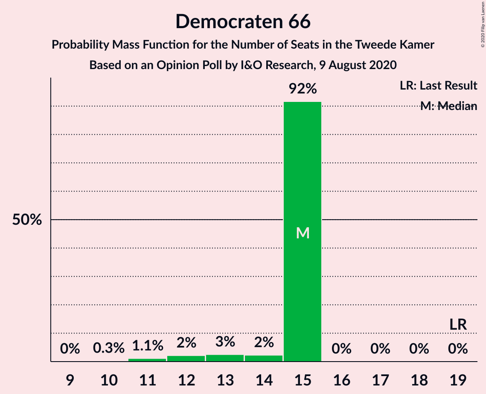

| Number of Seats | Probability | Accumulated | Special Marks |
|:---------------:|:-----------:|:-----------:|:-------------:|
| 10 | 0.3% | 100% |  |
| 11 | 1.1% | 99.7% |  |
| 12 | 2% | 98.6% |  |
| 13 | 3% | 96% |  |
| 14 | 2% | 94% |  |
| 15 | 92% | 92% | Median |
| 16 | 0% | 0% |  |
| 17 | 0% | 0% |  |
| 18 | 0% | 0% |  |
| 19 | 0% | 0% | Last Result |

### Forum voor Democratie

*For a full overview of the results for this party, see the [Forum voor Democratie](party-forumvoordemocratie.html) page.*

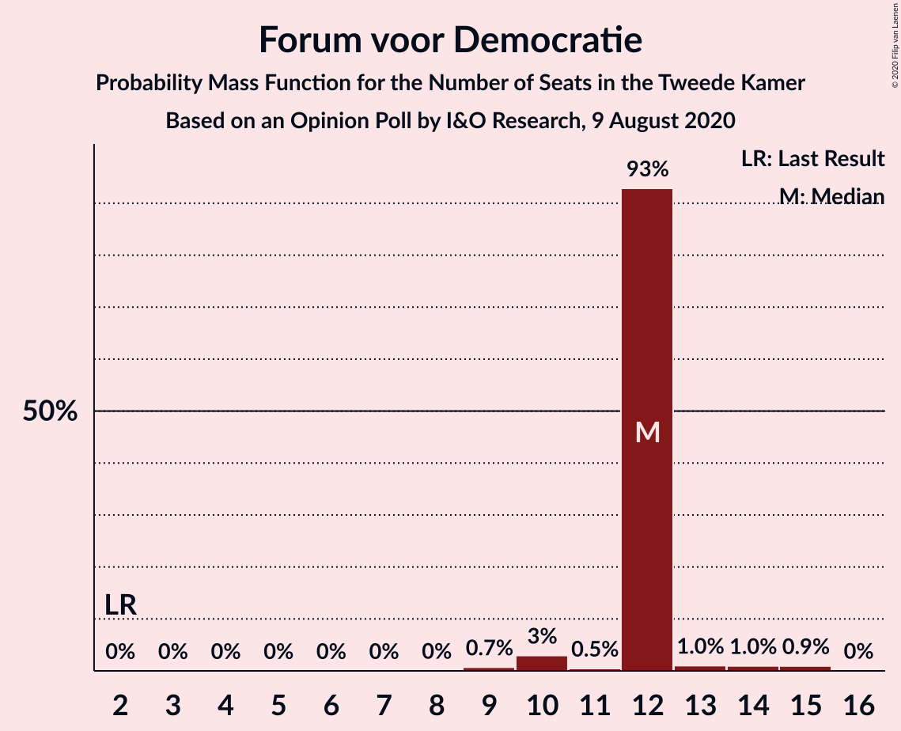

| Number of Seats | Probability | Accumulated | Special Marks |
|:---------------:|:-----------:|:-----------:|:-------------:|
| 2 | 0% | 100% | Last Result |
| 3 | 0% | 100% |  |
| 4 | 0% | 100% |  |
| 5 | 0% | 100% |  |
| 6 | 0% | 100% |  |
| 7 | 0% | 100% |  |
| 8 | 0% | 100% |  |
| 9 | 0.7% | 100% |  |
| 10 | 3% | 99.3% |  |
| 11 | 0.5% | 96% |  |
| 12 | 93% | 96% | Median |
| 13 | 1.0% | 3% |  |
| 14 | 1.0% | 2% |  |
| 15 | 0.9% | 1.0% |  |
| 16 | 0% | 0% |  |

### Socialistische Partij

*For a full overview of the results for this party, see the [Socialistische Partij](party-socialistischepartij.html) page.*

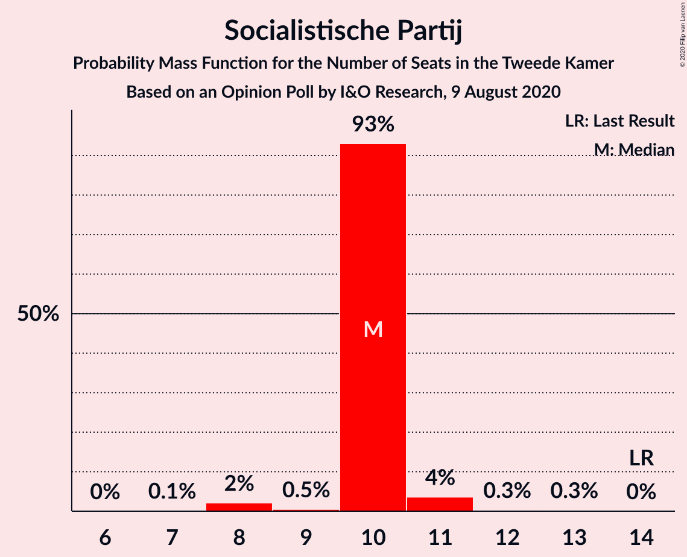

| Number of Seats | Probability | Accumulated | Special Marks |
|:---------------:|:-----------:|:-----------:|:-------------:|
| 7 | 0.1% | 100% |  |
| 8 | 2% | 99.9% |  |
| 9 | 0.5% | 98% |  |
| 10 | 93% | 97% | Median |
| 11 | 4% | 4% |  |
| 12 | 0.3% | 0.6% |  |
| 13 | 0.3% | 0.3% |  |
| 14 | 0% | 0% | Last Result |

### ChristenUnie

*For a full overview of the results for this party, see the [ChristenUnie](party-christenunie.html) page.*

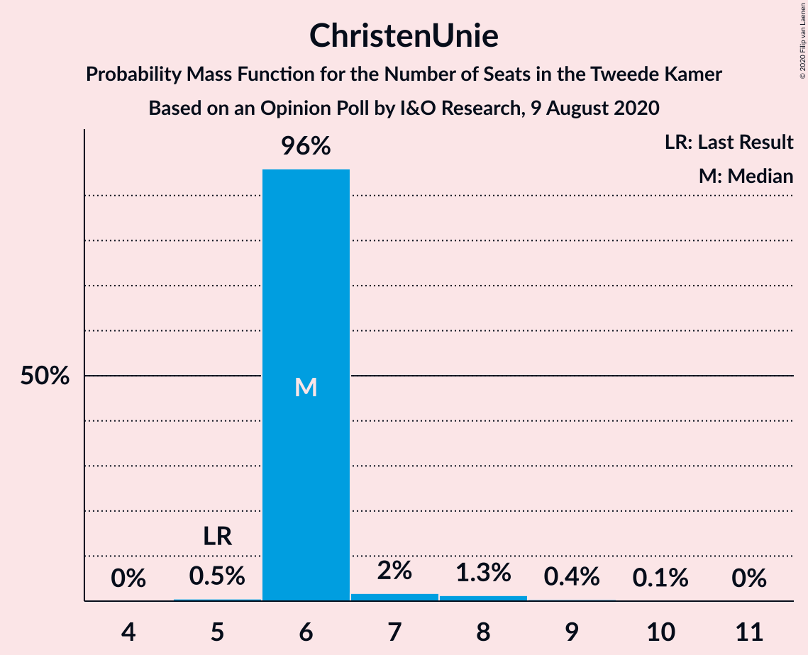

| Number of Seats | Probability | Accumulated | Special Marks |
|:---------------:|:-----------:|:-----------:|:-------------:|
| 5 | 0.5% | 100% | Last Result |
| 6 | 96% | 99.5% | Median |
| 7 | 2% | 4% |  |
| 8 | 1.3% | 2% |  |
| 9 | 0.4% | 0.5% |  |
| 10 | 0.1% | 0.1% |  |
| 11 | 0% | 0% |  |

### Partij voor de Dieren

*For a full overview of the results for this party, see the [Partij voor de Dieren](party-partijvoordedieren.html) page.*

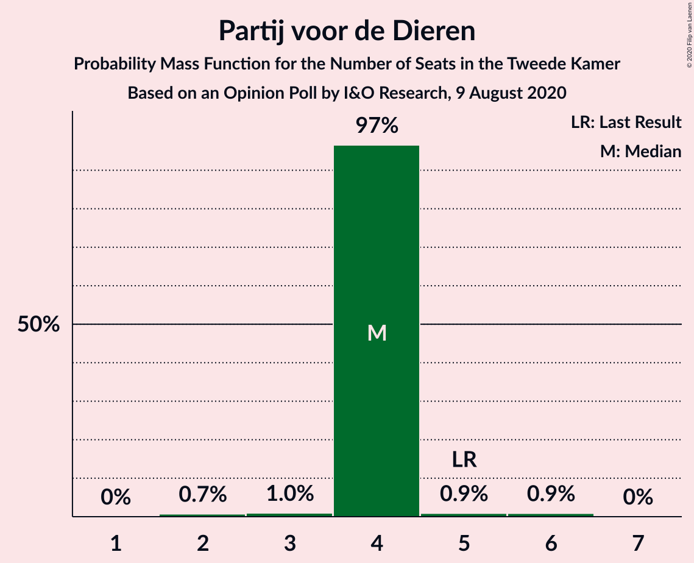

| Number of Seats | Probability | Accumulated | Special Marks |
|:---------------:|:-----------:|:-----------:|:-------------:|
| 2 | 0.7% | 100% |  |
| 3 | 1.0% | 99.3% |  |
| 4 | 97% | 98% | Median |
| 5 | 0.9% | 2% | Last Result |
| 6 | 0.9% | 0.9% |  |
| 7 | 0% | 0% |  |

### Staatkundig Gereformeerde Partij

*For a full overview of the results for this party, see the [Staatkundig Gereformeerde Partij](party-staatkundiggereformeerdepartij.html) page.*

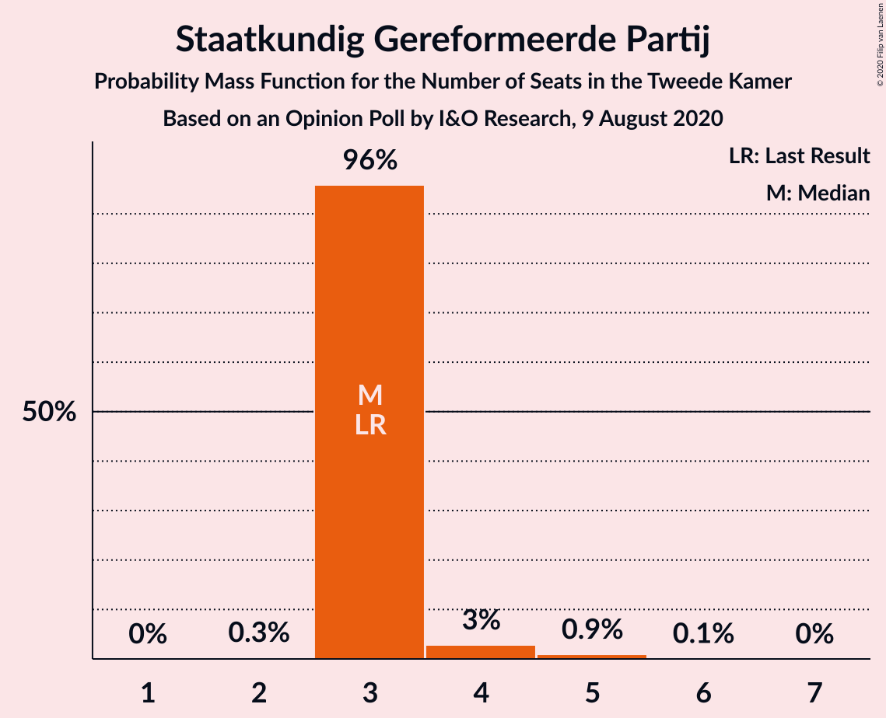

| Number of Seats | Probability | Accumulated | Special Marks |
|:---------------:|:-----------:|:-----------:|:-------------:|
| 2 | 0.3% | 100% |  |
| 3 | 96% | 99.7% | Last Result, Median |
| 4 | 3% | 4% |  |
| 5 | 0.9% | 1.0% |  |
| 6 | 0.1% | 0.1% |  |
| 7 | 0% | 0% |  |

### 50Plus

*For a full overview of the results for this party, see the [50Plus](party-50plus.html) page.*

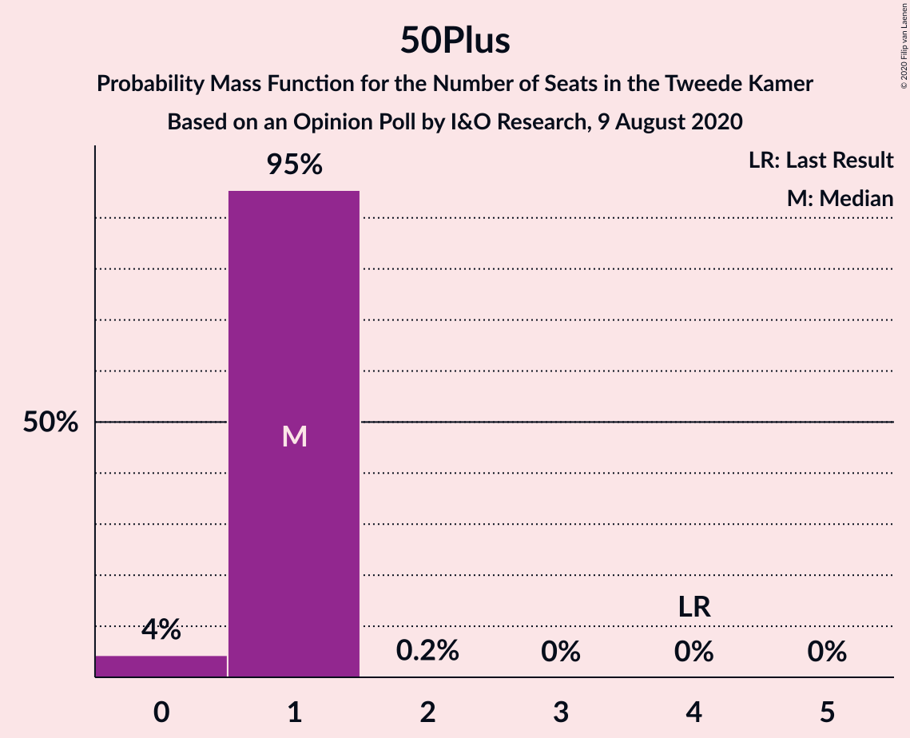

| Number of Seats | Probability | Accumulated | Special Marks |
|:---------------:|:-----------:|:-----------:|:-------------:|
| 0 | 4% | 100% |  |
| 1 | 95% | 96% | Median |
| 2 | 0.2% | 0.2% |  |
| 3 | 0% | 0% |  |
| 4 | 0% | 0% | Last Result |

### DENK

*For a full overview of the results for this party, see the [DENK](party-denk.html) page.*

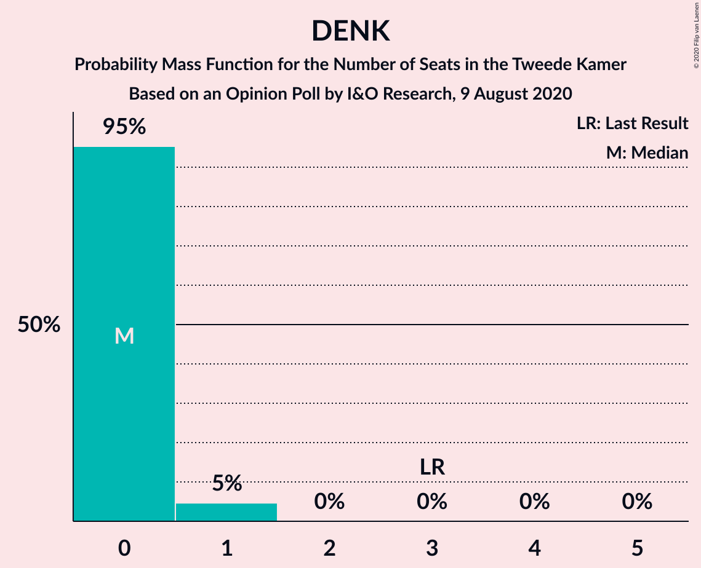

| Number of Seats | Probability | Accumulated | Special Marks |
|:---------------:|:-----------:|:-----------:|:-------------:|
| 0 | 95% | 100% | Median |
| 1 | 5% | 5% |  |
| 2 | 0% | 0% |  |
| 3 | 0% | 0% | Last Result |

### Partij voor de Toekomst

*For a full overview of the results for this party, see the [Partij voor de Toekomst](party-partijvoordetoekomst.html) page.*

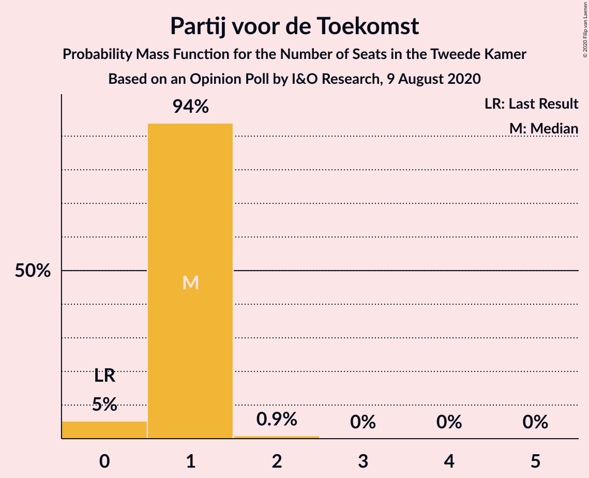

| Number of Seats | Probability | Accumulated | Special Marks |
|:---------------:|:-----------:|:-----------:|:-------------:|
| 0 | 5% | 100% | Last Result |
| 1 | 94% | 95% | Median |
| 2 | 0.9% | 0.9% |  |
| 3 | 0% | 0% |  |

## Coalitions

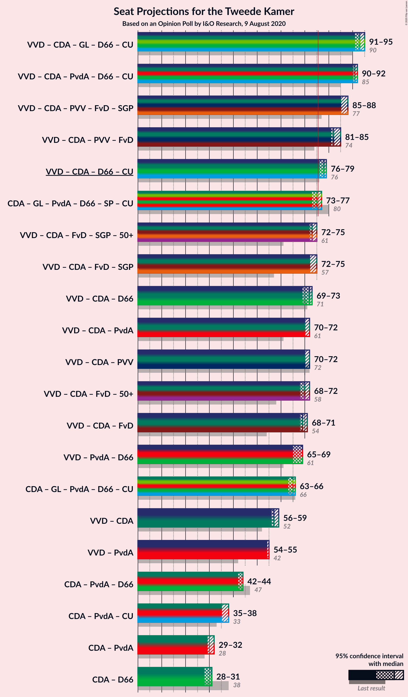

### Confidence Intervals

| Coalition | Last Result | Median | Majority? | 80% Confidence Interval | 90% Confidence Interval | 95% Confidence Interval | 99% Confidence Interval |
|:---------:|:-----------:|:------:|:---------:|:-----------------------:|:-----------------------:|:-----------------------:|:-----------------------:|
| Volkspartij voor Vrijheid en Democratie – Christen-Democratisch Appèl – GroenLinks – Democraten 66 – ChristenUnie | 90 | 93 | 100% | 93 | 93 | 91–95 | 87–96 |
| Volkspartij voor Vrijheid en Democratie – Christen-Democratisch Appèl – Partij van de Arbeid – Democraten 66 – ChristenUnie | 85 | 91 | 100% | 91 | 91 | 90–92 | 83–94 |
| Volkspartij voor Vrijheid en Democratie – Christen-Democratisch Appèl – Partij voor de Vrijheid – Forum voor Democratie – Staatkundig Gereformeerde Partij | 77 | 85 | 100% | 85 | 85–86 | 85–88 | 82–90 |
| Volkspartij voor Vrijheid en Democratie – Christen-Democratisch Appèl – Partij voor de Vrijheid – Forum voor Democratie | 74 | 82 | 100% | 82 | 82 | 81–85 | 79–87 |
| Volkspartij voor Vrijheid en Democratie – Christen-Democratisch Appèl – Democraten 66 – ChristenUnie | 76 | 78 | 98% | 78 | 78 | 76–79 | 71–81 |
| Christen-Democratisch Appèl – GroenLinks – Partij van de Arbeid – Democraten 66 – Socialistische Partij – ChristenUnie | 80 | 75 | 4% | 75 | 75 | 73–77 | 71–78 |
| Volkspartij voor Vrijheid en Democratie – Christen-Democratisch Appèl – Forum voor Democratie – Staatkundig Gereformeerde Partij – 50Plus | 61 | 73 | 2% | 73 | 73 | 72–75 | 67–78 |
| Volkspartij voor Vrijheid en Democratie – Christen-Democratisch Appèl – Forum voor Democratie – Staatkundig Gereformeerde Partij | 57 | 72 | 2% | 72 | 72 | 72–75 | 67–77 |
| Volkspartij voor Vrijheid en Democratie – Christen-Democratisch Appèl – Democraten 66 | 71 | 72 | 0.2% | 72 | 72 | 69–73 | 65–74 |
| Volkspartij voor Vrijheid en Democratie – Christen-Democratisch Appèl – Partij van de Arbeid | 61 | 70 | 0.1% | 70 | 70–71 | 70–72 | 64–75 |
| Volkspartij voor Vrijheid en Democratie – Christen-Democratisch Appèl – Partij voor de Vrijheid | 72 | 70 | 0.4% | 70 | 70–71 | 70–72 | 67–75 |
| Volkspartij voor Vrijheid en Democratie – Christen-Democratisch Appèl – Forum voor Democratie – 50Plus | 58 | 70 | 0.1% | 70 | 70 | 68–72 | 64–75 |
| Volkspartij voor Vrijheid en Democratie – Christen-Democratisch Appèl – Forum voor Democratie | 54 | 69 | 0.1% | 69 | 69 | 68–71 | 64–74 |
| Volkspartij voor Vrijheid en Democratie – Partij van de Arbeid – Democraten 66 | 61 | 69 | 0% | 69 | 68–69 | 65–69 | 62–70 |
| Christen-Democratisch Appèl – GroenLinks – Partij van de Arbeid – Democraten 66 – ChristenUnie | 66 | 65 | 0% | 65 | 65 | 63–66 | 61–67 |
| Volkspartij voor Vrijheid en Democratie – Christen-Democratisch Appèl | 52 | 57 | 0% | 57 | 57–58 | 56–59 | 52–62 |
| Volkspartij voor Vrijheid en Democratie – Partij van de Arbeid | 42 | 54 | 0% | 54 | 54 | 54–55 | 49–58 |
| Christen-Democratisch Appèl – Partij van de Arbeid – Democraten 66 | 47 | 44 | 0% | 44 | 43–44 | 42–44 | 40–47 |
| Christen-Democratisch Appèl – Partij van de Arbeid – ChristenUnie | 33 | 35 | 0% | 35 | 35–37 | 35–38 | 33–40 |
| Christen-Democratisch Appèl – Partij van de Arbeid | 28 | 29 | 0% | 29 | 29–30 | 29–32 | 27–33 |
| Christen-Democratisch Appèl – Democraten 66 | 38 | 31 | 0% | 31 | 30–31 | 28–31 | 27–32 |

### Volkspartij voor Vrijheid en Democratie – Christen-Democratisch Appèl – GroenLinks – Democraten 66 – ChristenUnie

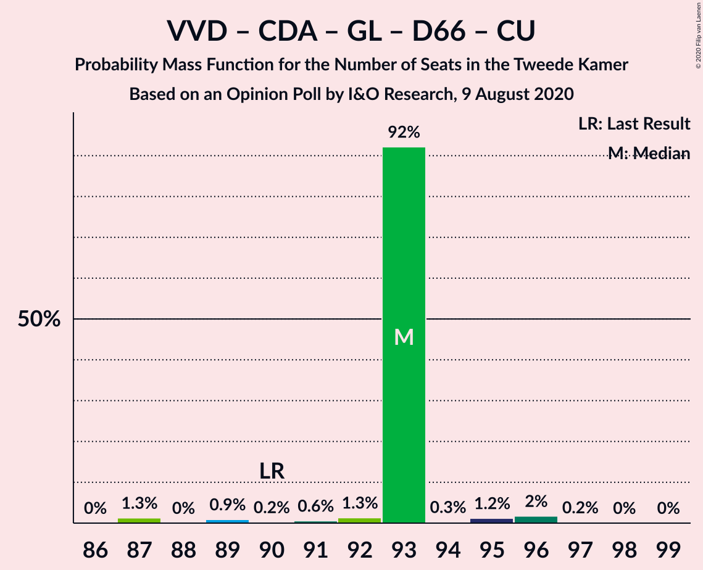

| Number of Seats | Probability | Accumulated | Special Marks |
|:---------------:|:-----------:|:-----------:|:-------------:|
| 86 | 0% | 100% |  |
| 87 | 1.3% | 99.9% |  |
| 88 | 0% | 98.7% |  |
| 89 | 0.9% | 98.6% |  |
| 90 | 0.2% | 98% | Last Result |
| 91 | 0.6% | 98% |  |
| 92 | 1.3% | 97% |  |
| 93 | 92% | 96% | Median |
| 94 | 0.3% | 3% |  |
| 95 | 1.2% | 3% |  |
| 96 | 2% | 2% |  |
| 97 | 0.2% | 0.2% |  |
| 98 | 0% | 0.1% |  |
| 99 | 0% | 0% |  |

### Volkspartij voor Vrijheid en Democratie – Christen-Democratisch Appèl – Partij van de Arbeid – Democraten 66 – ChristenUnie

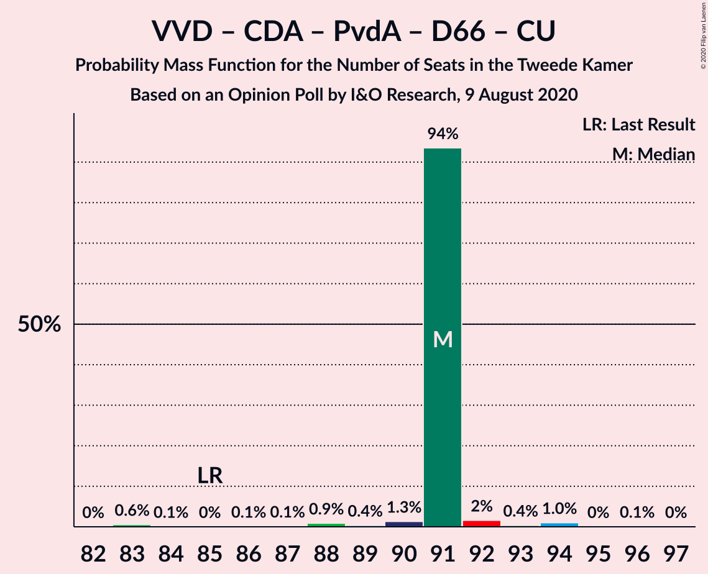

| Number of Seats | Probability | Accumulated | Special Marks |
|:---------------:|:-----------:|:-----------:|:-------------:|
| 83 | 0.6% | 100% |  |
| 84 | 0.1% | 99.4% |  |
| 85 | 0% | 99.4% | Last Result |
| 86 | 0.1% | 99.4% |  |
| 87 | 0.1% | 99.3% |  |
| 88 | 0.9% | 99.2% |  |
| 89 | 0.4% | 98% |  |
| 90 | 1.3% | 98% |  |
| 91 | 94% | 97% | Median |
| 92 | 2% | 3% |  |
| 93 | 0.4% | 1.5% |  |
| 94 | 1.0% | 1.1% |  |
| 95 | 0% | 0.1% |  |
| 96 | 0.1% | 0.1% |  |
| 97 | 0% | 0% |  |

### Volkspartij voor Vrijheid en Democratie – Christen-Democratisch Appèl – Partij voor de Vrijheid – Forum voor Democratie – Staatkundig Gereformeerde Partij

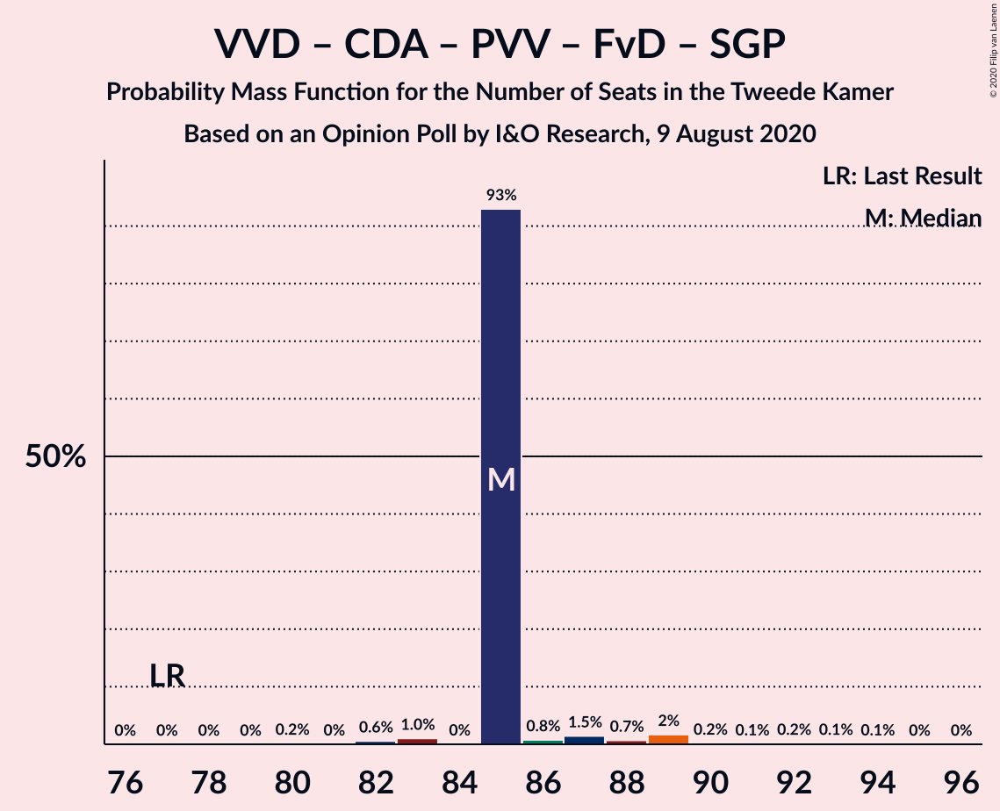

| Number of Seats | Probability | Accumulated | Special Marks |
|:---------------:|:-----------:|:-----------:|:-------------:|
| 77 | 0% | 100% | Last Result |
| 78 | 0% | 100% |  |
| 79 | 0% | 100% |  |
| 80 | 0.2% | 100% |  |
| 81 | 0% | 99.8% |  |
| 82 | 0.6% | 99.8% |  |
| 83 | 1.0% | 99.2% |  |
| 84 | 0% | 98% |  |
| 85 | 93% | 98% | Median |
| 86 | 0.8% | 5% |  |
| 87 | 1.5% | 4% |  |
| 88 | 0.7% | 3% |  |
| 89 | 2% | 2% |  |
| 90 | 0.2% | 0.6% |  |
| 91 | 0.1% | 0.4% |  |
| 92 | 0.2% | 0.4% |  |
| 93 | 0.1% | 0.2% |  |
| 94 | 0.1% | 0.1% |  |
| 95 | 0% | 0% |  |

### Volkspartij voor Vrijheid en Democratie – Christen-Democratisch Appèl – Partij voor de Vrijheid – Forum voor Democratie

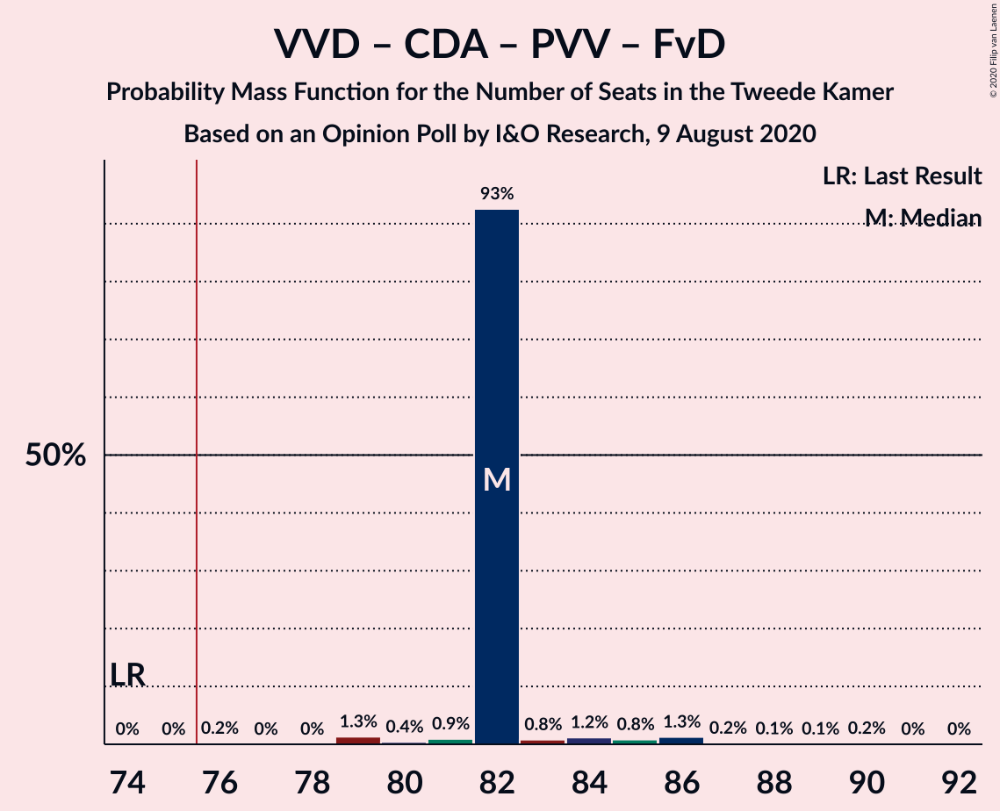

| Number of Seats | Probability | Accumulated | Special Marks |
|:---------------:|:-----------:|:-----------:|:-------------:|
| 74 | 0% | 100% | Last Result |
| 75 | 0% | 100% |  |
| 76 | 0.2% | 100% | Majority |
| 77 | 0% | 99.8% |  |
| 78 | 0% | 99.8% |  |
| 79 | 1.3% | 99.8% |  |
| 80 | 0.4% | 98% |  |
| 81 | 0.9% | 98% |  |
| 82 | 93% | 97% | Median |
| 83 | 0.8% | 5% |  |
| 84 | 1.2% | 4% |  |
| 85 | 0.8% | 3% |  |
| 86 | 1.3% | 2% |  |
| 87 | 0.2% | 0.5% |  |
| 88 | 0.1% | 0.3% |  |
| 89 | 0.1% | 0.2% |  |
| 90 | 0.2% | 0.2% |  |
| 91 | 0% | 0% |  |

### Volkspartij voor Vrijheid en Democratie – Christen-Democratisch Appèl – Democraten 66 – ChristenUnie

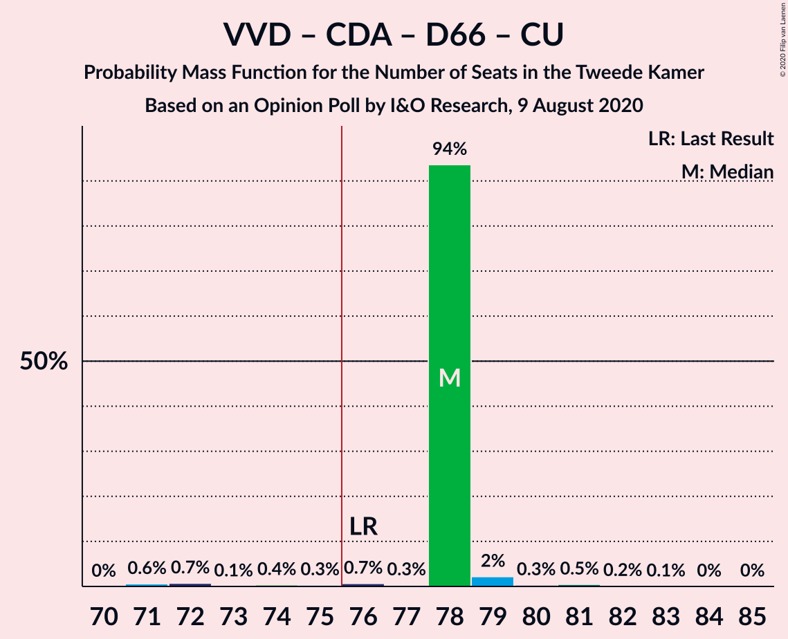

| Number of Seats | Probability | Accumulated | Special Marks |
|:---------------:|:-----------:|:-----------:|:-------------:|
| 71 | 0.6% | 100% |  |
| 72 | 0.7% | 99.4% |  |
| 73 | 0.1% | 98.7% |  |
| 74 | 0.4% | 98.6% |  |
| 75 | 0.3% | 98% |  |
| 76 | 0.7% | 98% | Last Result, Majority |
| 77 | 0.3% | 97% |  |
| 78 | 94% | 97% | Median |
| 79 | 2% | 3% |  |
| 80 | 0.3% | 1.1% |  |
| 81 | 0.5% | 0.8% |  |
| 82 | 0.2% | 0.3% |  |
| 83 | 0.1% | 0.1% |  |
| 84 | 0% | 0.1% |  |
| 85 | 0% | 0% |  |

### Christen-Democratisch Appèl – GroenLinks – Partij van de Arbeid – Democraten 66 – Socialistische Partij – ChristenUnie

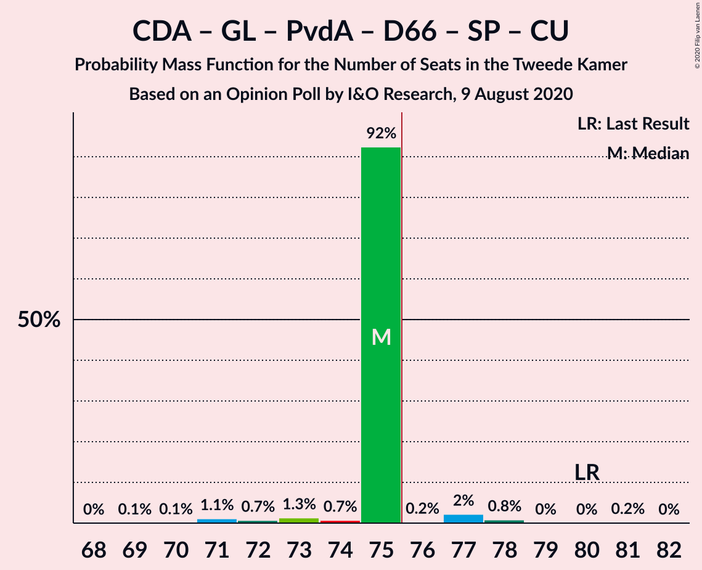

| Number of Seats | Probability | Accumulated | Special Marks |
|:---------------:|:-----------:|:-----------:|:-------------:|
| 69 | 0.1% | 100% |  |
| 70 | 0.1% | 99.9% |  |
| 71 | 1.1% | 99.8% |  |
| 72 | 0.7% | 98.7% |  |
| 73 | 1.3% | 98% |  |
| 74 | 0.7% | 97% |  |
| 75 | 92% | 96% | Median |
| 76 | 0.2% | 4% | Majority |
| 77 | 2% | 3% |  |
| 78 | 0.8% | 1.1% |  |
| 79 | 0% | 0.2% |  |
| 80 | 0% | 0.2% | Last Result |
| 81 | 0.2% | 0.2% |  |
| 82 | 0% | 0% |  |

### Volkspartij voor Vrijheid en Democratie – Christen-Democratisch Appèl – Forum voor Democratie – Staatkundig Gereformeerde Partij – 50Plus

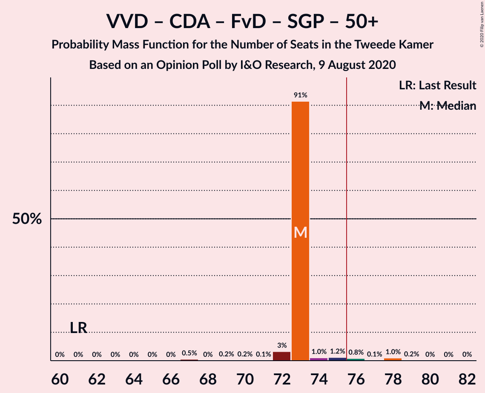

| Number of Seats | Probability | Accumulated | Special Marks |
|:---------------:|:-----------:|:-----------:|:-------------:|
| 61 | 0% | 100% | Last Result |
| 62 | 0% | 100% |  |
| 63 | 0% | 100% |  |
| 64 | 0% | 100% |  |
| 65 | 0% | 100% |  |
| 66 | 0% | 100% |  |
| 67 | 0.5% | 100% |  |
| 68 | 0% | 99.5% |  |
| 69 | 0.2% | 99.4% |  |
| 70 | 0.2% | 99.3% |  |
| 71 | 0.1% | 99.1% |  |
| 72 | 3% | 99.0% |  |
| 73 | 91% | 96% | Median |
| 74 | 1.0% | 4% |  |
| 75 | 1.2% | 3% |  |
| 76 | 0.8% | 2% | Majority |
| 77 | 0.1% | 1.3% |  |
| 78 | 1.0% | 1.2% |  |
| 79 | 0.2% | 0.3% |  |
| 80 | 0% | 0.1% |  |
| 81 | 0% | 0% |  |

### Volkspartij voor Vrijheid en Democratie – Christen-Democratisch Appèl – Forum voor Democratie – Staatkundig Gereformeerde Partij

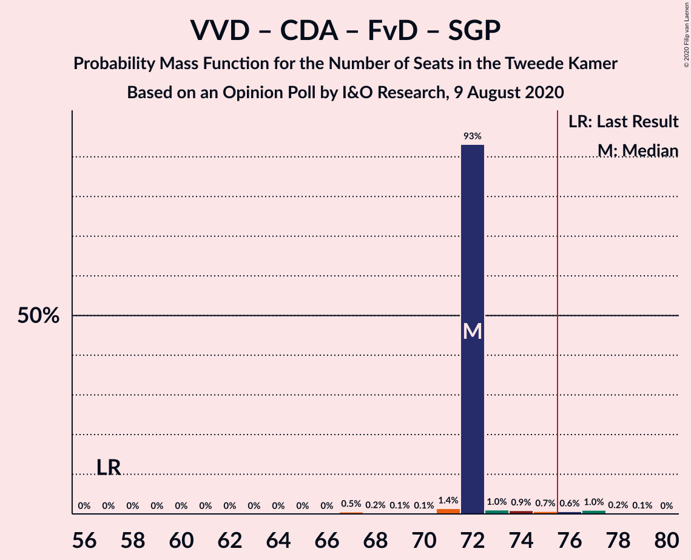

| Number of Seats | Probability | Accumulated | Special Marks |
|:---------------:|:-----------:|:-----------:|:-------------:|
| 57 | 0% | 100% | Last Result |
| 58 | 0% | 100% |  |
| 59 | 0% | 100% |  |
| 60 | 0% | 100% |  |
| 61 | 0% | 100% |  |
| 62 | 0% | 100% |  |
| 63 | 0% | 100% |  |
| 64 | 0% | 100% |  |
| 65 | 0% | 100% |  |
| 66 | 0% | 100% |  |
| 67 | 0.5% | 100% |  |
| 68 | 0.2% | 99.4% |  |
| 69 | 0.1% | 99.3% |  |
| 70 | 0.1% | 99.1% |  |
| 71 | 1.4% | 99.1% |  |
| 72 | 93% | 98% | Median |
| 73 | 1.0% | 4% |  |
| 74 | 0.9% | 3% |  |
| 75 | 0.7% | 3% |  |
| 76 | 0.6% | 2% | Majority |
| 77 | 1.0% | 1.3% |  |
| 78 | 0.2% | 0.3% |  |
| 79 | 0.1% | 0.1% |  |
| 80 | 0% | 0% |  |

### Volkspartij voor Vrijheid en Democratie – Christen-Democratisch Appèl – Democraten 66

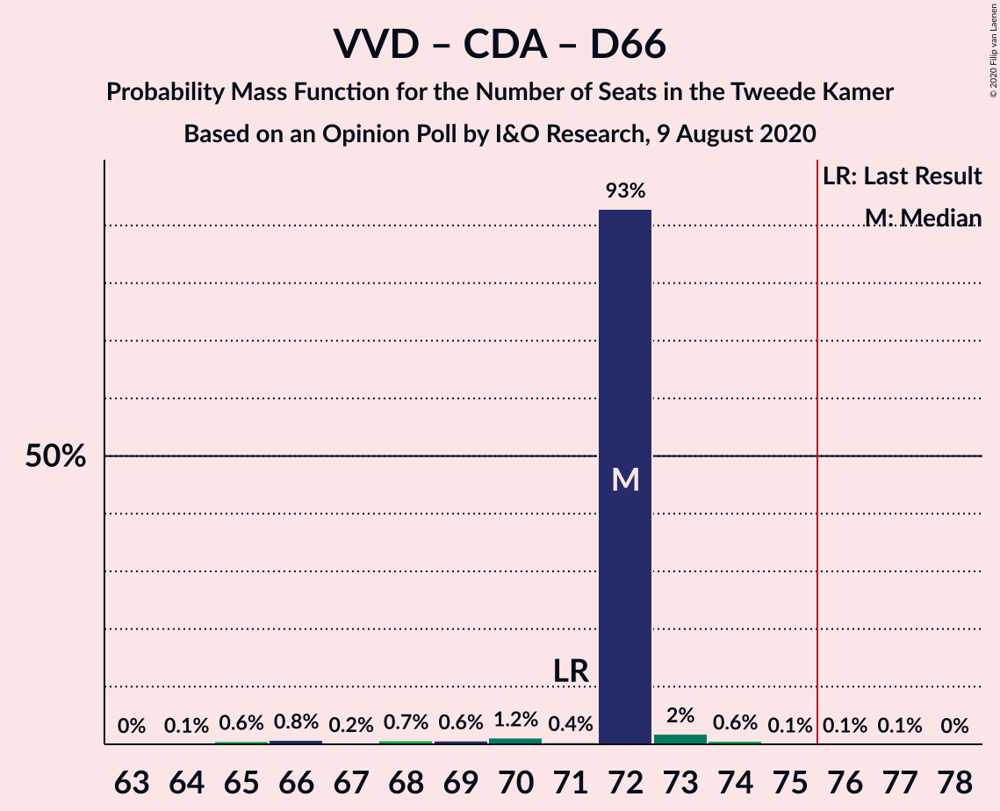

| Number of Seats | Probability | Accumulated | Special Marks |
|:---------------:|:-----------:|:-----------:|:-------------:|
| 64 | 0.1% | 100% |  |
| 65 | 0.6% | 99.9% |  |
| 66 | 0.8% | 99.4% |  |
| 67 | 0.2% | 98.6% |  |
| 68 | 0.7% | 98% |  |
| 69 | 0.6% | 98% |  |
| 70 | 1.2% | 97% |  |
| 71 | 0.4% | 96% | Last Result |
| 72 | 93% | 96% | Median |
| 73 | 2% | 3% |  |
| 74 | 0.6% | 0.9% |  |
| 75 | 0.1% | 0.3% |  |
| 76 | 0.1% | 0.2% | Majority |
| 77 | 0.1% | 0.1% |  |
| 78 | 0% | 0% |  |

### Volkspartij voor Vrijheid en Democratie – Christen-Democratisch Appèl – Partij van de Arbeid

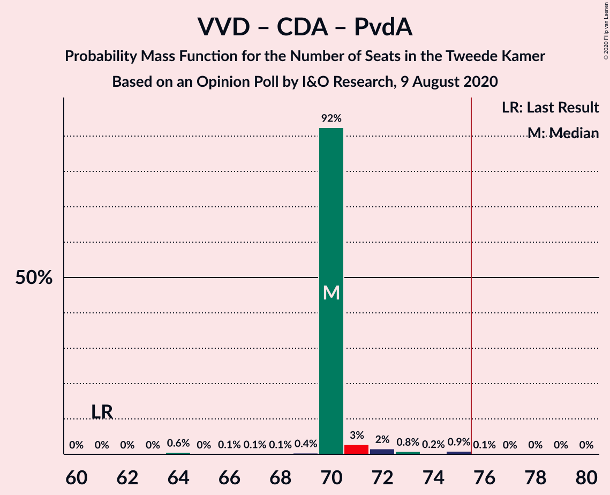

| Number of Seats | Probability | Accumulated | Special Marks |
|:---------------:|:-----------:|:-----------:|:-------------:|
| 61 | 0% | 100% | Last Result |
| 62 | 0% | 100% |  |
| 63 | 0% | 100% |  |
| 64 | 0.6% | 100% |  |
| 65 | 0% | 99.4% |  |
| 66 | 0.1% | 99.4% |  |
| 67 | 0.1% | 99.3% |  |
| 68 | 0.1% | 99.2% |  |
| 69 | 0.4% | 99.1% |  |
| 70 | 92% | 98.8% | Median |
| 71 | 3% | 6% |  |
| 72 | 2% | 4% |  |
| 73 | 0.8% | 2% |  |
| 74 | 0.2% | 1.2% |  |
| 75 | 0.9% | 1.0% |  |
| 76 | 0.1% | 0.1% | Majority |
| 77 | 0% | 0.1% |  |
| 78 | 0% | 0.1% |  |
| 79 | 0% | 0% |  |

### Volkspartij voor Vrijheid en Democratie – Christen-Democratisch Appèl – Partij voor de Vrijheid

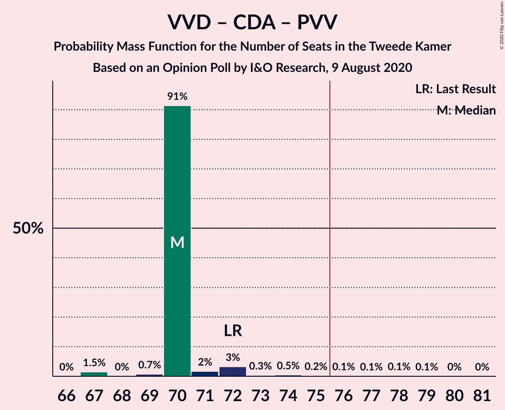

| Number of Seats | Probability | Accumulated | Special Marks |
|:---------------:|:-----------:|:-----------:|:-------------:|
| 67 | 1.5% | 100% |  |
| 68 | 0% | 98% |  |
| 69 | 0.7% | 98% |  |
| 70 | 91% | 98% | Median |
| 71 | 2% | 6% |  |
| 72 | 3% | 5% | Last Result |
| 73 | 0.3% | 1.4% |  |
| 74 | 0.5% | 1.1% |  |
| 75 | 0.2% | 0.6% |  |
| 76 | 0.1% | 0.4% | Majority |
| 77 | 0.1% | 0.3% |  |
| 78 | 0.1% | 0.3% |  |
| 79 | 0.1% | 0.1% |  |
| 80 | 0% | 0.1% |  |
| 81 | 0% | 0% |  |

### Volkspartij voor Vrijheid en Democratie – Christen-Democratisch Appèl – Forum voor Democratie – 50Plus

| Number of Seats | Probability | Accumulated | Special Marks |
|:---------------:|:-----------:|:-----------:|:-------------:|
| 58 | 0% | 100% | Last Result |
| 59 | 0% | 100% |  |
| 60 | 0% | 100% |  |
| 61 | 0% | 100% |  |
| 62 | 0% | 100% |  |
| 63 | 0% | 100% |  |
| 64 | 0.5% | 100% |  |
| 65 | 0.2% | 99.5% |  |
| 66 | 0% | 99.2% |  |
| 67 | 0.7% | 99.2% |  |
| 68 | 1.2% | 98.5% |  |
| 69 | 2% | 97% |  |
| 70 | 91% | 96% | Median |
| 71 | 2% | 4% |  |
| 72 | 0.9% | 3% |  |
| 73 | 0.4% | 2% |  |
| 74 | 0.1% | 1.2% |  |
| 75 | 1.1% | 1.2% |  |
| 76 | 0% | 0.1% | Majority |
| 77 | 0% | 0.1% |  |
| 78 | 0% | 0% |  |

### Volkspartij voor Vrijheid en Democratie – Christen-Democratisch Appèl – Forum voor Democratie

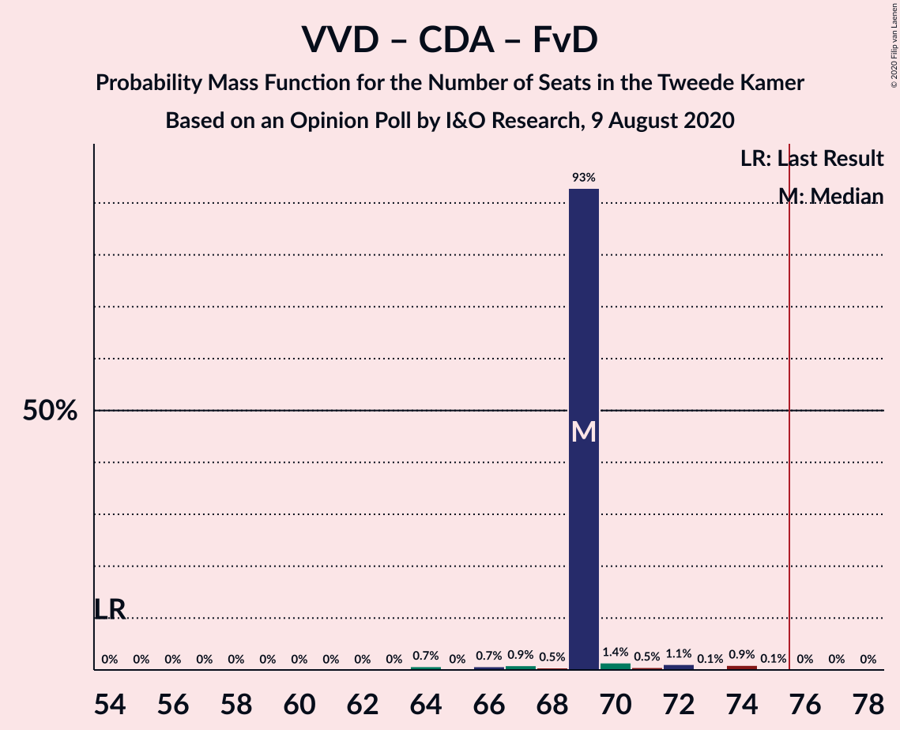

| Number of Seats | Probability | Accumulated | Special Marks |
|:---------------:|:-----------:|:-----------:|:-------------:|
| 54 | 0% | 100% | Last Result |
| 55 | 0% | 100% |  |
| 56 | 0% | 100% |  |
| 57 | 0% | 100% |  |
| 58 | 0% | 100% |  |
| 59 | 0% | 100% |  |
| 60 | 0% | 100% |  |
| 61 | 0% | 100% |  |
| 62 | 0% | 100% |  |
| 63 | 0% | 100% |  |
| 64 | 0.7% | 100% |  |
| 65 | 0% | 99.3% |  |
| 66 | 0.7% | 99.2% |  |
| 67 | 0.9% | 98.5% |  |
| 68 | 0.5% | 98% |  |
| 69 | 93% | 97% | Median |
| 70 | 1.4% | 4% |  |
| 71 | 0.5% | 3% |  |
| 72 | 1.1% | 2% |  |
| 73 | 0.1% | 1.3% |  |
| 74 | 0.9% | 1.2% |  |
| 75 | 0.1% | 0.2% |  |
| 76 | 0% | 0.1% | Majority |
| 77 | 0% | 0% |  |

### Volkspartij voor Vrijheid en Democratie – Partij van de Arbeid – Democraten 66

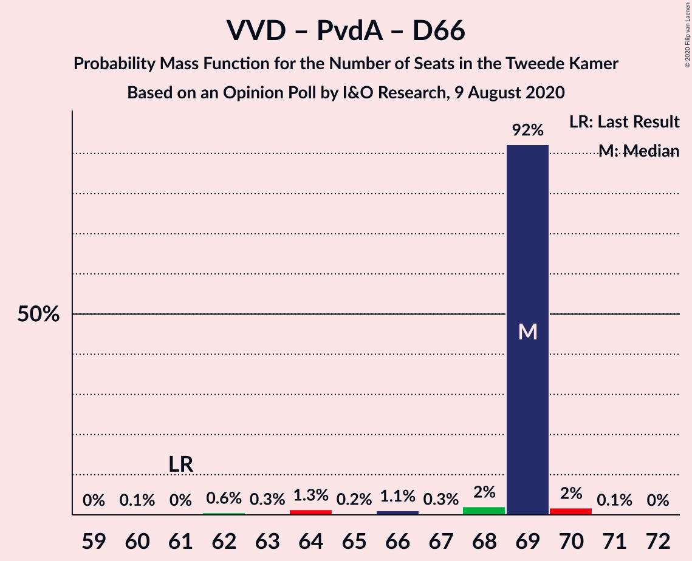

| Number of Seats | Probability | Accumulated | Special Marks |
|:---------------:|:-----------:|:-----------:|:-------------:|
| 60 | 0.1% | 100% |  |
| 61 | 0% | 99.9% | Last Result |
| 62 | 0.6% | 99.9% |  |
| 63 | 0.3% | 99.3% |  |
| 64 | 1.3% | 99.1% |  |
| 65 | 0.2% | 98% |  |
| 66 | 1.1% | 97% |  |
| 67 | 0.3% | 96% |  |
| 68 | 2% | 96% |  |
| 69 | 92% | 94% | Median |
| 70 | 2% | 2% |  |
| 71 | 0.1% | 0.1% |  |
| 72 | 0% | 0% |  |

### Christen-Democratisch Appèl – GroenLinks – Partij van de Arbeid – Democraten 66 – ChristenUnie

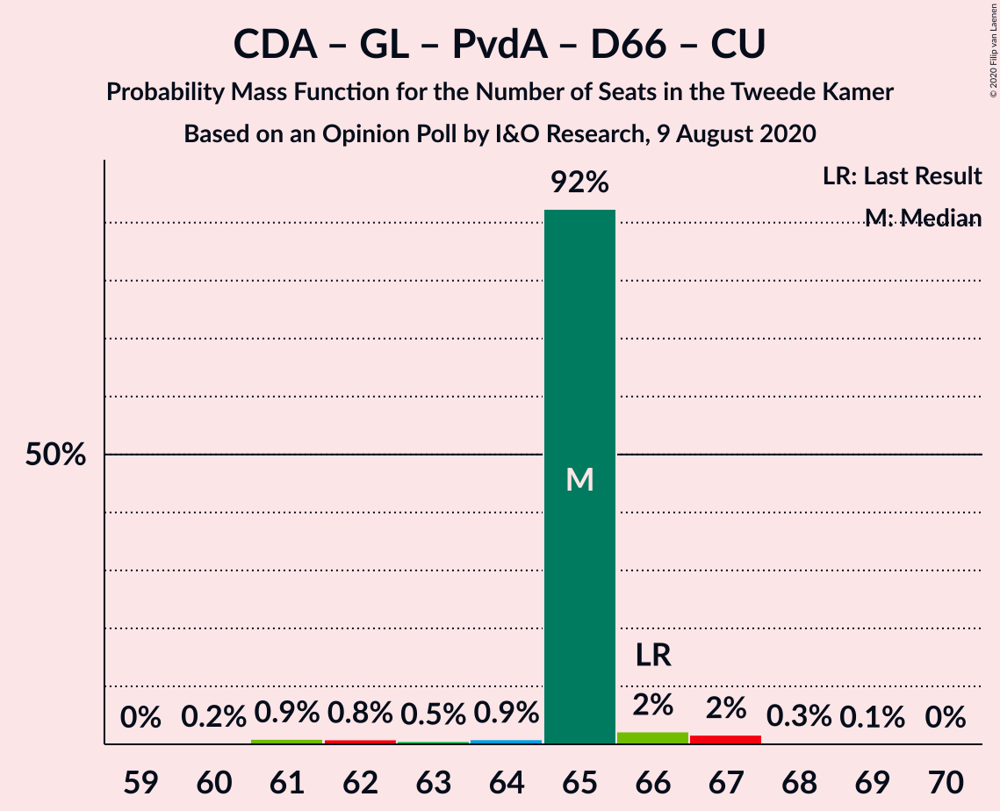

| Number of Seats | Probability | Accumulated | Special Marks |
|:---------------:|:-----------:|:-----------:|:-------------:|
| 59 | 0% | 100% |  |
| 60 | 0.2% | 99.9% |  |
| 61 | 0.9% | 99.8% |  |
| 62 | 0.8% | 98.9% |  |
| 63 | 0.5% | 98% |  |
| 64 | 0.9% | 97% |  |
| 65 | 92% | 97% | Median |
| 66 | 2% | 4% | Last Result |
| 67 | 2% | 2% |  |
| 68 | 0.3% | 0.4% |  |
| 69 | 0.1% | 0.1% |  |
| 70 | 0% | 0% |  |

### Volkspartij voor Vrijheid en Democratie – Christen-Democratisch Appèl

| Number of Seats | Probability | Accumulated | Special Marks |
|:---------------:|:-----------:|:-----------:|:-------------:|
| 52 | 0.6% | 100% | Last Result |
| 53 | 0.1% | 99.4% |  |
| 54 | 0.6% | 99.4% |  |
| 55 | 1.0% | 98.8% |  |
| 56 | 0.4% | 98% |  |
| 57 | 91% | 97% | Median |
| 58 | 2% | 6% |  |
| 59 | 4% | 5% |  |
| 60 | 0.2% | 1.0% |  |
| 61 | 0.3% | 0.9% |  |
| 62 | 0.4% | 0.6% |  |
| 63 | 0.1% | 0.2% |  |
| 64 | 0% | 0.1% |  |
| 65 | 0% | 0.1% |  |
| 66 | 0% | 0.1% |  |
| 67 | 0% | 0% |  |

### Volkspartij voor Vrijheid en Democratie – Partij van de Arbeid

| Number of Seats | Probability | Accumulated | Special Marks |
|:---------------:|:-----------:|:-----------:|:-------------:|
| 42 | 0% | 100% | Last Result |
| 43 | 0% | 100% |  |
| 44 | 0% | 100% |  |
| 45 | 0% | 100% |  |
| 46 | 0% | 100% |  |
| 47 | 0% | 100% |  |
| 48 | 0.1% | 100% |  |
| 49 | 0.6% | 99.9% |  |
| 50 | 0% | 99.3% |  |
| 51 | 0.2% | 99.2% |  |
| 52 | 1.1% | 99.1% |  |
| 53 | 0.4% | 98% |  |
| 54 | 94% | 98% | Median |
| 55 | 1.3% | 4% |  |
| 56 | 0.8% | 2% |  |
| 57 | 1.0% | 2% |  |
| 58 | 0.6% | 0.7% |  |
| 59 | 0.1% | 0.1% |  |
| 60 | 0% | 0% |  |

### Christen-Democratisch Appèl – Partij van de Arbeid – Democraten 66

| Number of Seats | Probability | Accumulated | Special Marks |
|:---------------:|:-----------:|:-----------:|:-------------:|
| 37 | 0% | 100% |  |
| 38 | 0% | 99.9% |  |
| 39 | 0.1% | 99.9% |  |
| 40 | 0.8% | 99.8% |  |
| 41 | 1.3% | 99.0% |  |
| 42 | 1.3% | 98% |  |
| 43 | 3% | 96% |  |
| 44 | 92% | 94% | Median |
| 45 | 1.0% | 2% |  |
| 46 | 0.7% | 1.3% |  |
| 47 | 0.5% | 0.6% | Last Result |
| 48 | 0.1% | 0.1% |  |
| 49 | 0% | 0% |  |

### Christen-Democratisch Appèl – Partij van de Arbeid – ChristenUnie

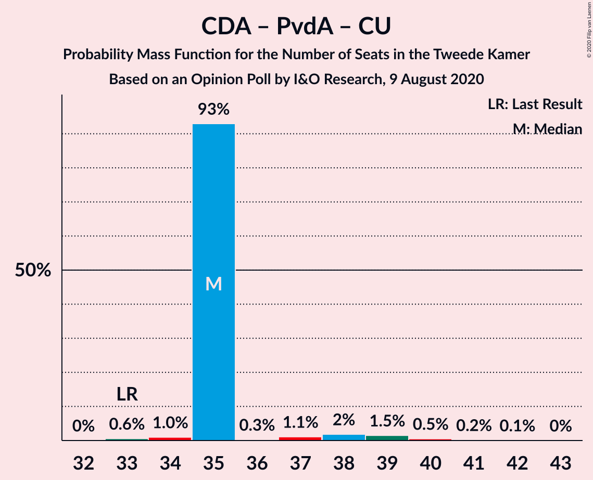

| Number of Seats | Probability | Accumulated | Special Marks |
|:---------------:|:-----------:|:-----------:|:-------------:|
| 33 | 0.6% | 100% | Last Result |
| 34 | 1.0% | 99.4% |  |
| 35 | 93% | 98% | Median |
| 36 | 0.3% | 5% |  |
| 37 | 1.1% | 5% |  |
| 38 | 2% | 4% |  |
| 39 | 1.5% | 2% |  |
| 40 | 0.5% | 0.8% |  |
| 41 | 0.2% | 0.2% |  |
| 42 | 0.1% | 0.1% |  |
| 43 | 0% | 0% |  |

### Christen-Democratisch Appèl – Partij van de Arbeid

| Number of Seats | Probability | Accumulated | Special Marks |
|:---------------:|:-----------:|:-----------:|:-------------:|
| 26 | 0.1% | 100% |  |
| 27 | 0.6% | 99.9% |  |
| 28 | 1.1% | 99.3% | Last Result |
| 29 | 93% | 98% | Median |
| 30 | 2% | 5% |  |
| 31 | 0.9% | 4% |  |
| 32 | 2% | 3% |  |
| 33 | 0.5% | 1.0% |  |
| 34 | 0.3% | 0.5% |  |
| 35 | 0.1% | 0.2% |  |
| 36 | 0% | 0% |  |

### Christen-Democratisch Appèl – Democraten 66

| Number of Seats | Probability | Accumulated | Special Marks |
|:---------------:|:-----------:|:-----------:|:-------------:|
| 25 | 0.1% | 100% |  |
| 26 | 0.1% | 99.9% |  |
| 27 | 1.1% | 99.9% |  |
| 28 | 2% | 98.8% |  |
| 29 | 0.7% | 97% |  |
| 30 | 2% | 96% |  |
| 31 | 94% | 94% | Median |
| 32 | 0.6% | 1.0% |  |
| 33 | 0.1% | 0.4% |  |
| 34 | 0.2% | 0.2% |  |
| 35 | 0% | 0% |  |
| 36 | 0% | 0% |  |
| 37 | 0% | 0% |  |
| 38 | 0% | 0% | Last Result |

## Technical Information

### Opinion Poll

+ **Polling firm:** I&O Research
+ **Commissioner(s):** —
+ **Fieldwork period:** 9 August 2020

### Calculations

+ **Sample size:** 1339
+ **Simulations done:** 1,048,576
+ **Error estimate:** 1.91%

