# Opinion Poll by Peil.nl, 23 August 2020

<a href="#voting-intentions">Voting Intentions</a> | <a href="#seats">Seats</a> | <a href="#coalitions">Coalitions</a> | <a href="#technical-information">Technical Information</a>

## Voting Intentions

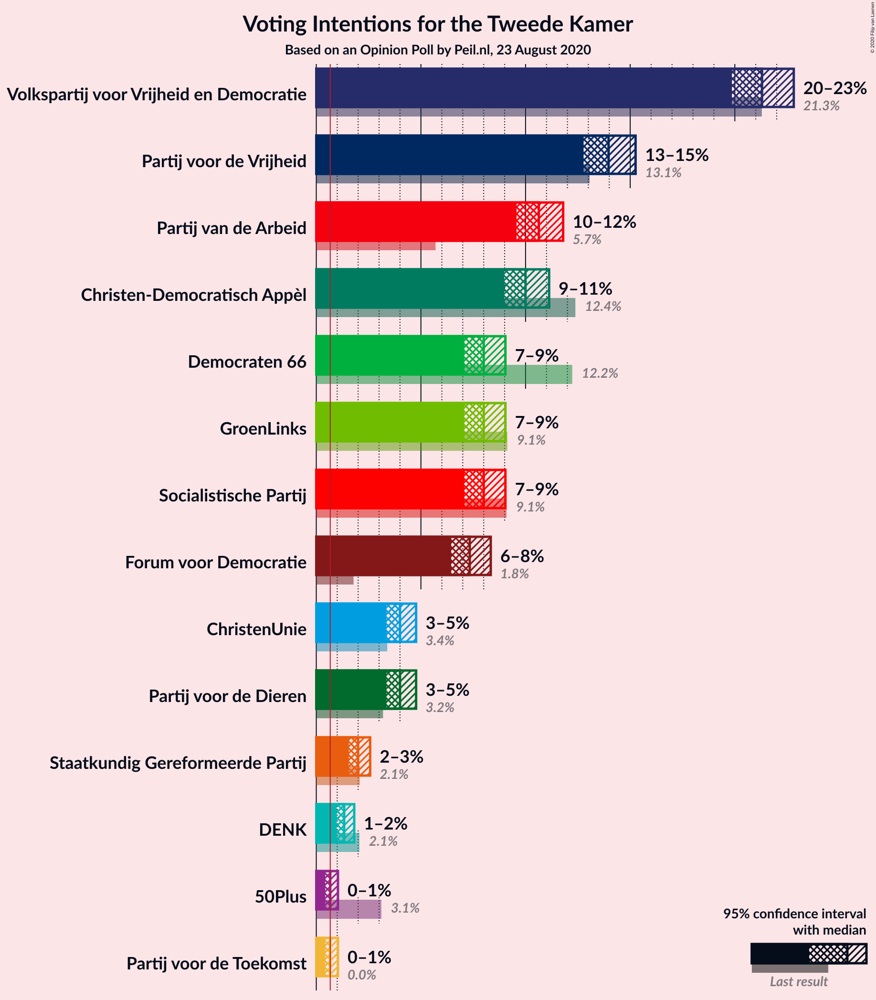

### Confidence Intervals

| Party | Last Result | Poll Result | 80% Confidence Interval | 90% Confidence Interval | 95% Confidence Interval | 99% Confidence Interval |
|:-----:|:-----------:|:-----------:|:-----------------------:|:-----------------------:|:-----------------------:|:-----------------------:|
| Volkspartij voor Vrijheid en Democratie | 21.3% | 21.3% | 20.4–22.3% |20.1–22.6% |19.9–22.8% |19.4–23.3% |
| Partij voor de Vrijheid | 13.1% | 14.0% | 13.2–14.8% |13.0–15.1% |12.8–15.3% |12.4–15.7% |
| Partij van de Arbeid | 5.7% | 10.6% | 9.9–11.4% |9.7–11.6% |9.6–11.8% |9.3–12.2% |
| Christen-Democratisch Appèl | 12.4% | 10.0% | 9.3–10.7% |9.1–10.9% |9.0–11.1% |8.7–11.5% |
| Democraten 66 | 12.2% | 8.0% | 7.4–8.7% |7.2–8.9% |7.1–9.0% |6.8–9.4% |
| GroenLinks | 9.1% | 8.0% | 7.4–8.7% |7.2–8.9% |7.1–9.0% |6.8–9.4% |
| Socialistische Partij | 9.1% | 8.0% | 7.4–8.7% |7.2–8.9% |7.1–9.0% |6.8–9.4% |
| Forum voor Democratie | 1.8% | 7.3% | 6.8–8.0% |6.6–8.2% |6.4–8.3% |6.2–8.6% |
| ChristenUnie | 3.4% | 4.0% | 3.6–4.5% |3.4–4.6% |3.4–4.8% |3.2–5.0% |
| Partij voor de Dieren | 3.2% | 4.0% | 3.6–4.5% |3.4–4.6% |3.4–4.8% |3.2–5.0% |
| Staatkundig Gereformeerde Partij | 2.1% | 2.0% | 1.7–2.4% |1.6–2.5% |1.6–2.6% |1.4–2.8% |
| DENK | 2.1% | 1.3% | 1.1–1.6% |1.0–1.7% |1.0–1.8% |0.9–2.0% |
| 50Plus | 3.1% | 0.7% | 0.5–0.9% |0.5–1.0% |0.4–1.0% |0.4–1.2% |
| Partij voor de Toekomst | 0.0% | 0.7% | 0.5–0.9% |0.5–1.0% |0.4–1.0% |0.4–1.2% |

*Note:* The poll result column reflects the actual value used in the calculations. Published results may vary slightly, and in addition be rounded to fewer digits.

## Seats

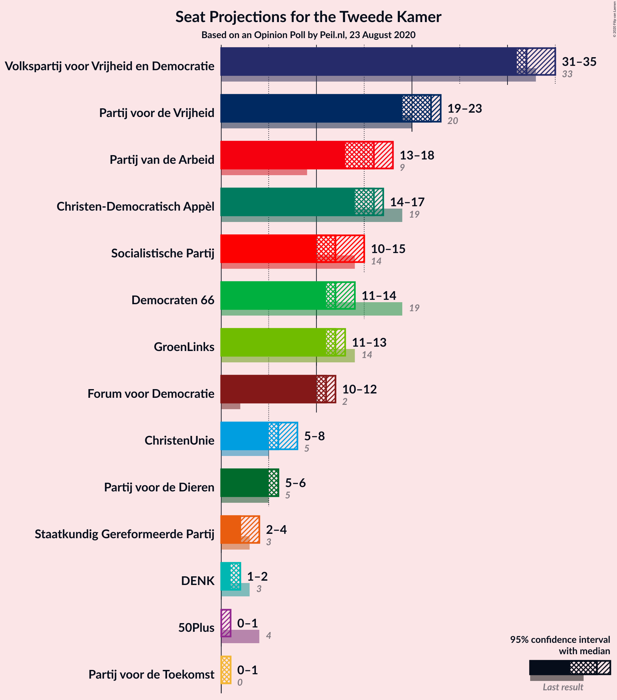

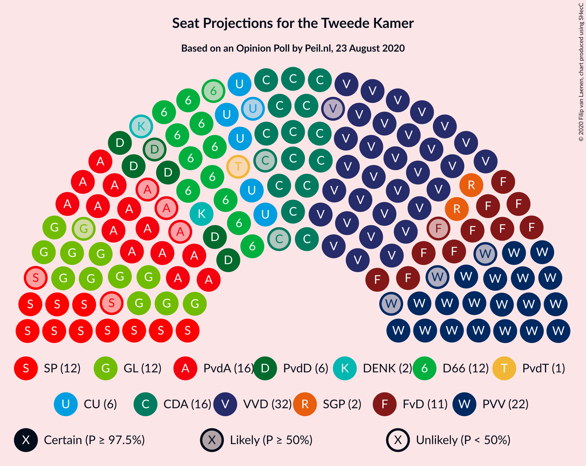

### Confidence Intervals

| Party | Last Result | Median | 80% Confidence Interval | 90% Confidence Interval | 95% Confidence Interval | 99% Confidence Interval |
|:-----:|:-----------:|:------:|:-----------------------:|:-----------------------:|:-----------------------:|:-----------------------:|
| <a href="#volkspartij-voor-vrijheid-en-democratie">Volkspartij voor Vrijheid en Democratie</a> | 33 | 32 | 31–34 |31–35 |31–35 |30–35 |
| <a href="#partij-voor-de-vrijheid">Partij voor de Vrijheid</a> | 20 | 22 | 20–23 |19–23 |19–23 |19–25 |
| <a href="#partij-van-de-arbeid">Partij van de Arbeid</a> | 9 | 16 | 14–18 |13–18 |13–18 |13–18 |
| <a href="#christen-democratisch-appèl">Christen-Democratisch Appèl</a> | 19 | 16 | 14–17 |14–17 |14–17 |13–17 |
| <a href="#democraten-66">Democraten 66</a> | 19 | 12 | 12–13 |11–14 |11–14 |11–14 |
| <a href="#groenlinks">GroenLinks</a> | 14 | 12 | 11–13 |11–13 |11–13 |10–15 |
| <a href="#socialistische-partij">Socialistische Partij</a> | 14 | 12 | 10–12 |10–14 |10–15 |10–15 |
| <a href="#forum-voor-democratie">Forum voor Democratie</a> | 2 | 11 | 10–12 |10–12 |10–12 |9–13 |
| <a href="#christenunie">ChristenUnie</a> | 5 | 6 | 6–7 |5–7 |5–8 |5–8 |
| <a href="#partij-voor-de-dieren">Partij voor de Dieren</a> | 5 | 6 | 5–6 |5–6 |5–6 |5–7 |
| <a href="#staatkundig-gereformeerde-partij">Staatkundig Gereformeerde Partij</a> | 3 | 2 | 2–3 |2–3 |2–4 |2–4 |
| <a href="#denk">DENK</a> | 3 | 2 | 1–2 |1–2 |1–2 |1–2 |
| <a href="#50plus">50Plus</a> | 4 | 0 | 0–1 |0–1 |0–1 |0–2 |
| <a href="#partij-voor-de-toekomst">Partij voor de Toekomst</a> | 0 | 1 | 0–1 |0–1 |0–1 |0–1 |

### Volkspartij voor Vrijheid en Democratie

*For a full overview of the results for this party, see the [Volkspartij voor Vrijheid en Democratie](party-volkspartijvoorvrijheidendemocratie.html) page.*

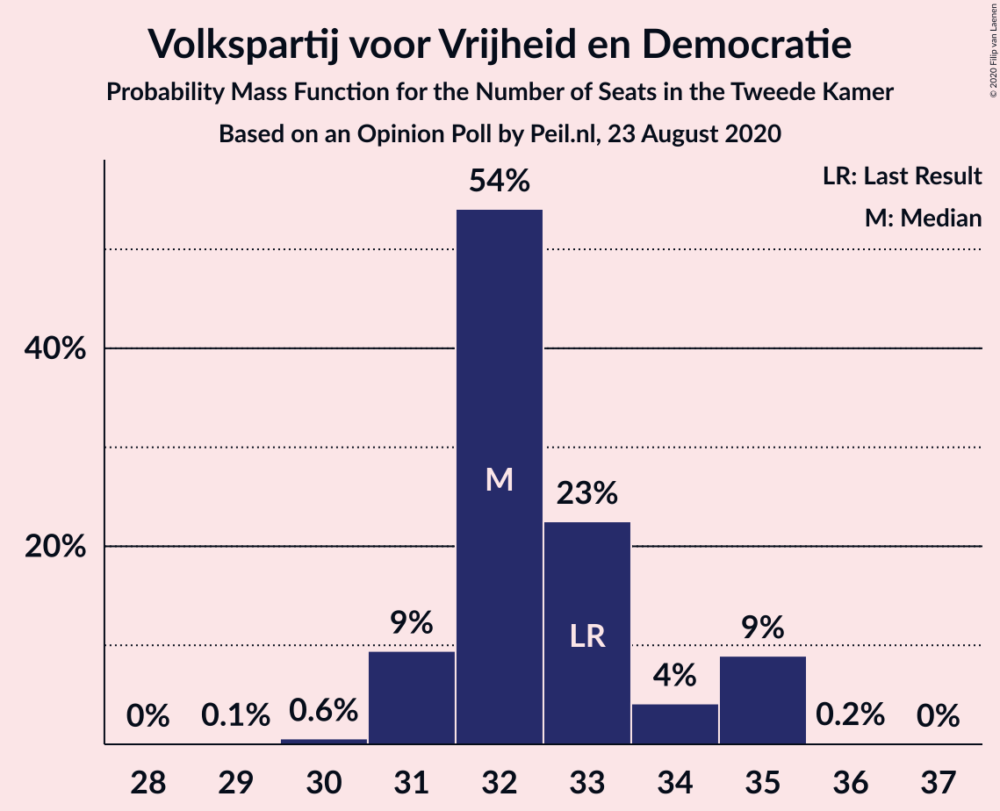

| Number of Seats | Probability | Accumulated | Special Marks |
|:---------------:|:-----------:|:-----------:|:-------------:|
| 29 | 0.1% | 100% |  |
| 30 | 0.6% | 99.9% |  |
| 31 | 9% | 99.3% |  |
| 32 | 54% | 90% | Median |
| 33 | 23% | 36% | Last Result |
| 34 | 4% | 13% |  |
| 35 | 9% | 9% |  |
| 36 | 0.2% | 0.2% |  |
| 37 | 0% | 0% |  |

### Partij voor de Vrijheid

*For a full overview of the results for this party, see the [Partij voor de Vrijheid](party-partijvoordevrijheid.html) page.*

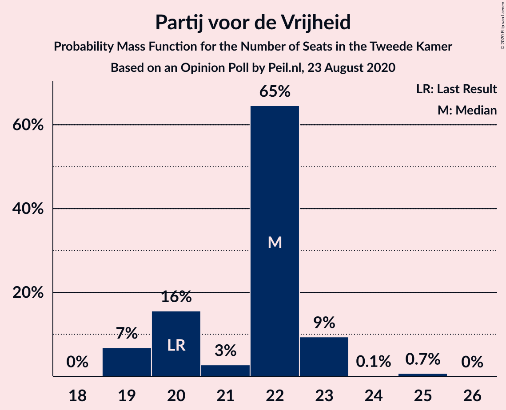

| Number of Seats | Probability | Accumulated | Special Marks |
|:---------------:|:-----------:|:-----------:|:-------------:|
| 19 | 7% | 100% |  |
| 20 | 16% | 93% | Last Result |
| 21 | 3% | 78% |  |
| 22 | 65% | 75% | Median |
| 23 | 9% | 10% |  |
| 24 | 0.1% | 0.8% |  |
| 25 | 0.7% | 0.7% |  |
| 26 | 0% | 0% |  |

### Partij van de Arbeid

*For a full overview of the results for this party, see the [Partij van de Arbeid](party-partijvandearbeid.html) page.*

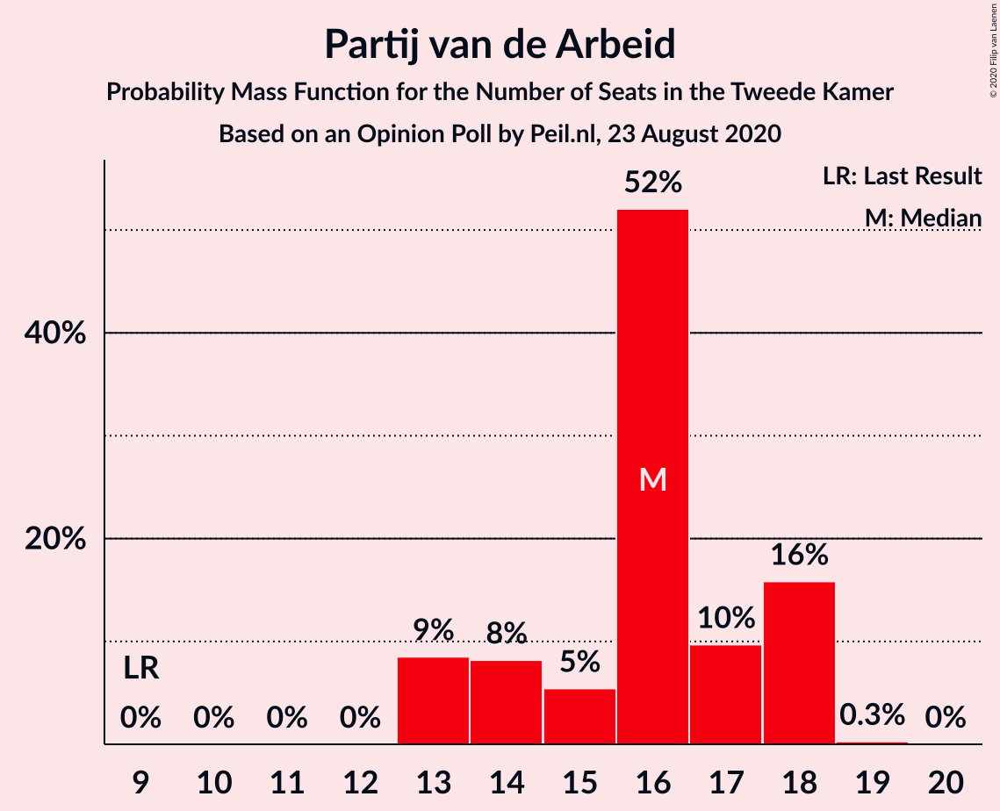

| Number of Seats | Probability | Accumulated | Special Marks |
|:---------------:|:-----------:|:-----------:|:-------------:|
| 9 | 0% | 100% | Last Result |
| 10 | 0% | 100% |  |
| 11 | 0% | 100% |  |
| 12 | 0% | 100% |  |
| 13 | 9% | 100% |  |
| 14 | 8% | 91% |  |
| 15 | 5% | 83% |  |
| 16 | 52% | 78% | Median |
| 17 | 10% | 26% |  |
| 18 | 16% | 16% |  |
| 19 | 0.3% | 0.3% |  |
| 20 | 0% | 0% |  |

### Christen-Democratisch Appèl

*For a full overview of the results for this party, see the [Christen-Democratisch Appèl](party-christen-democratischappèl.html) page.*

| Number of Seats | Probability | Accumulated | Special Marks |
|:---------------:|:-----------:|:-----------:|:-------------:|
| 12 | 0.2% | 100% |  |
| 13 | 0.6% | 99.8% |  |
| 14 | 13% | 99.2% |  |
| 15 | 14% | 86% |  |
| 16 | 59% | 72% | Median |
| 17 | 13% | 13% |  |
| 18 | 0.3% | 0.4% |  |
| 19 | 0% | 0% | Last Result |

### Democraten 66

*For a full overview of the results for this party, see the [Democraten 66](party-democraten66.html) page.*

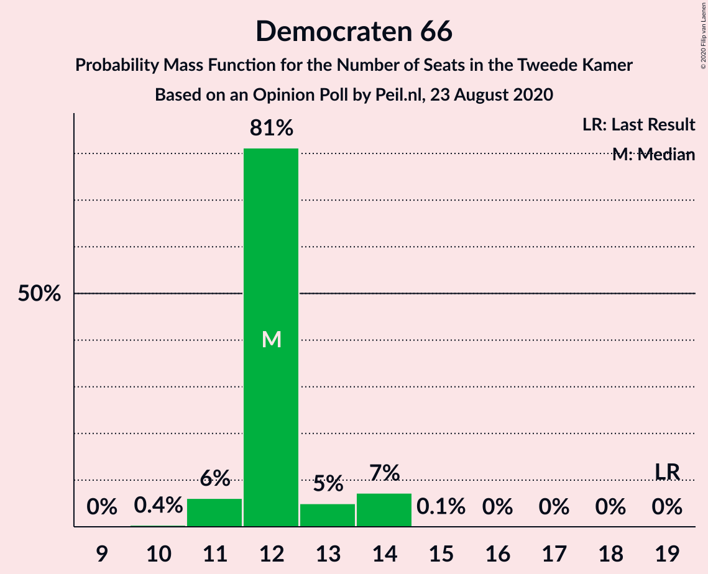

| Number of Seats | Probability | Accumulated | Special Marks |
|:---------------:|:-----------:|:-----------:|:-------------:|
| 10 | 0.4% | 100% |  |
| 11 | 6% | 99.6% |  |
| 12 | 81% | 94% | Median |
| 13 | 5% | 12% |  |
| 14 | 7% | 7% |  |
| 15 | 0.1% | 0.1% |  |
| 16 | 0% | 0% |  |
| 17 | 0% | 0% |  |
| 18 | 0% | 0% |  |
| 19 | 0% | 0% | Last Result |

### GroenLinks

*For a full overview of the results for this party, see the [GroenLinks](party-groenlinks.html) page.*

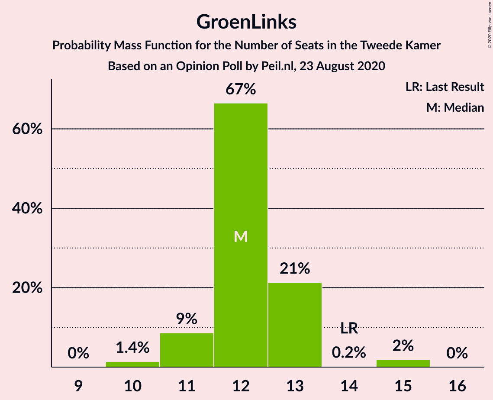

| Number of Seats | Probability | Accumulated | Special Marks |
|:---------------:|:-----------:|:-----------:|:-------------:|
| 10 | 1.4% | 100% |  |
| 11 | 9% | 98.6% |  |
| 12 | 67% | 90% | Median |
| 13 | 21% | 23% |  |
| 14 | 0.2% | 2% | Last Result |
| 15 | 2% | 2% |  |
| 16 | 0% | 0% |  |

### Socialistische Partij

*For a full overview of the results for this party, see the [Socialistische Partij](party-socialistischepartij.html) page.*

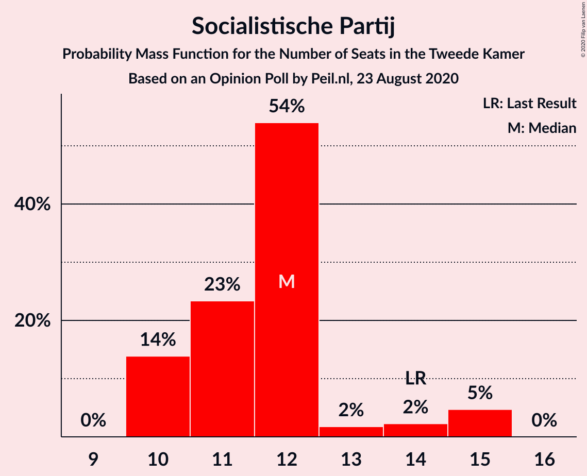

| Number of Seats | Probability | Accumulated | Special Marks |
|:---------------:|:-----------:|:-----------:|:-------------:|
| 10 | 14% | 100% |  |
| 11 | 23% | 86% |  |
| 12 | 54% | 63% | Median |
| 13 | 2% | 9% |  |
| 14 | 2% | 7% | Last Result |
| 15 | 5% | 5% |  |
| 16 | 0% | 0% |  |

### Forum voor Democratie

*For a full overview of the results for this party, see the [Forum voor Democratie](party-forumvoordemocratie.html) page.*

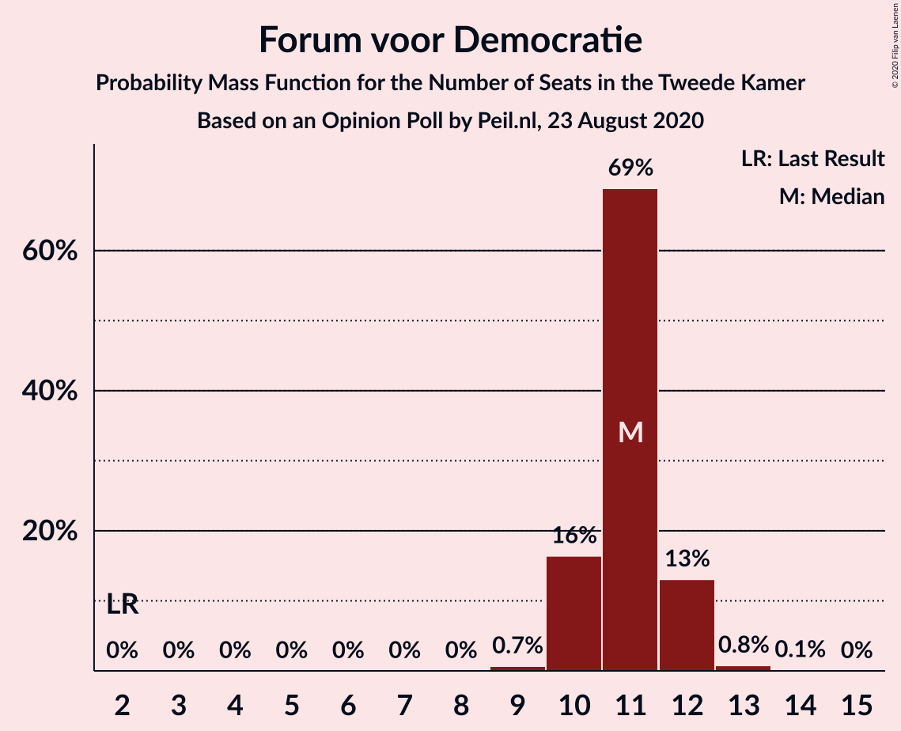

| Number of Seats | Probability | Accumulated | Special Marks |
|:---------------:|:-----------:|:-----------:|:-------------:|
| 2 | 0% | 100% | Last Result |
| 3 | 0% | 100% |  |
| 4 | 0% | 100% |  |
| 5 | 0% | 100% |  |
| 6 | 0% | 100% |  |
| 7 | 0% | 100% |  |
| 8 | 0% | 100% |  |
| 9 | 0.7% | 100% |  |
| 10 | 16% | 99.3% |  |
| 11 | 69% | 83% | Median |
| 12 | 13% | 14% |  |
| 13 | 0.8% | 0.9% |  |
| 14 | 0.1% | 0.1% |  |
| 15 | 0% | 0% |  |

### ChristenUnie

*For a full overview of the results for this party, see the [ChristenUnie](party-christenunie.html) page.*

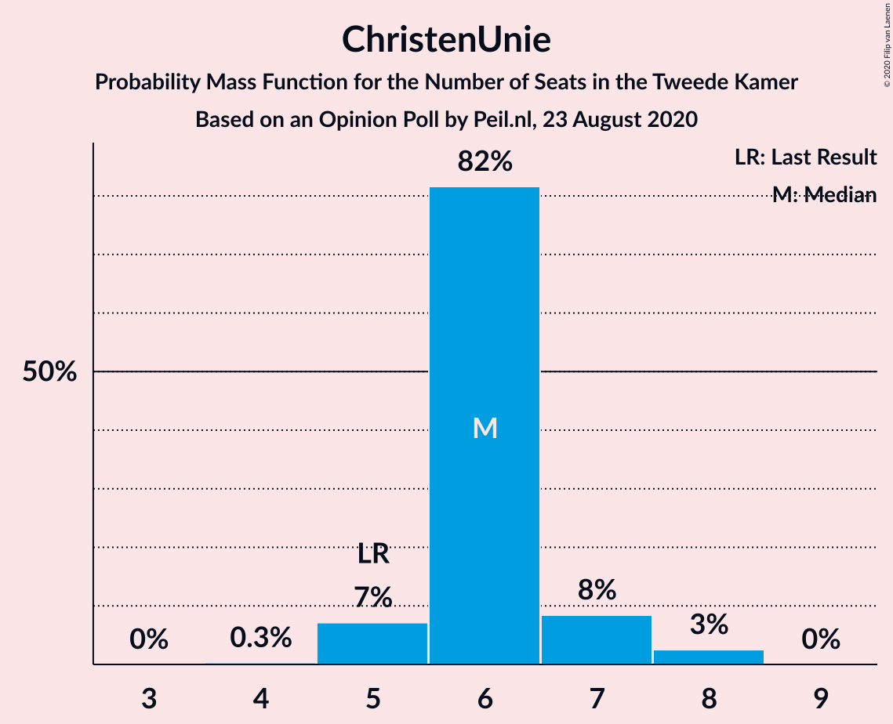

| Number of Seats | Probability | Accumulated | Special Marks |
|:---------------:|:-----------:|:-----------:|:-------------:|
| 4 | 0.3% | 100% |  |
| 5 | 7% | 99.7% | Last Result |
| 6 | 82% | 93% | Median |
| 7 | 8% | 11% |  |
| 8 | 3% | 3% |  |
| 9 | 0% | 0% |  |

### Partij voor de Dieren

*For a full overview of the results for this party, see the [Partij voor de Dieren](party-partijvoordedieren.html) page.*

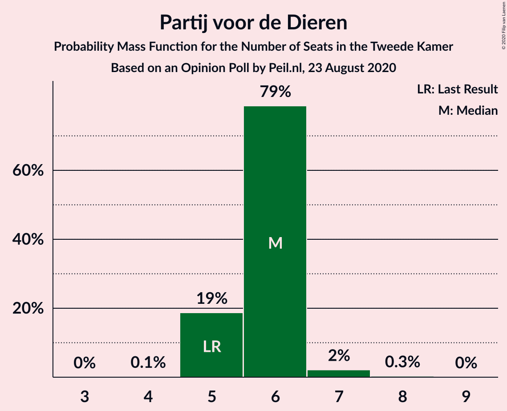

| Number of Seats | Probability | Accumulated | Special Marks |
|:---------------:|:-----------:|:-----------:|:-------------:|
| 4 | 0.1% | 100% |  |
| 5 | 19% | 99.9% | Last Result |
| 6 | 79% | 81% | Median |
| 7 | 2% | 2% |  |
| 8 | 0.3% | 0.3% |  |
| 9 | 0% | 0% |  |

### Staatkundig Gereformeerde Partij

*For a full overview of the results for this party, see the [Staatkundig Gereformeerde Partij](party-staatkundiggereformeerdepartij.html) page.*

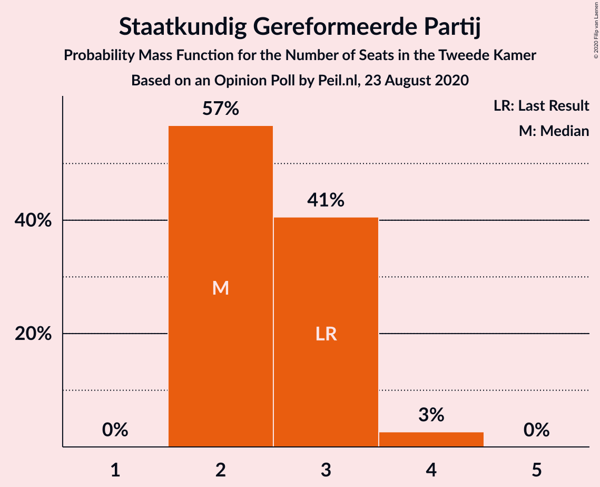

| Number of Seats | Probability | Accumulated | Special Marks |
|:---------------:|:-----------:|:-----------:|:-------------:|
| 2 | 57% | 100% | Median |
| 3 | 41% | 43% | Last Result |
| 4 | 3% | 3% |  |
| 5 | 0% | 0% |  |

### DENK

*For a full overview of the results for this party, see the [DENK](party-denk.html) page.*

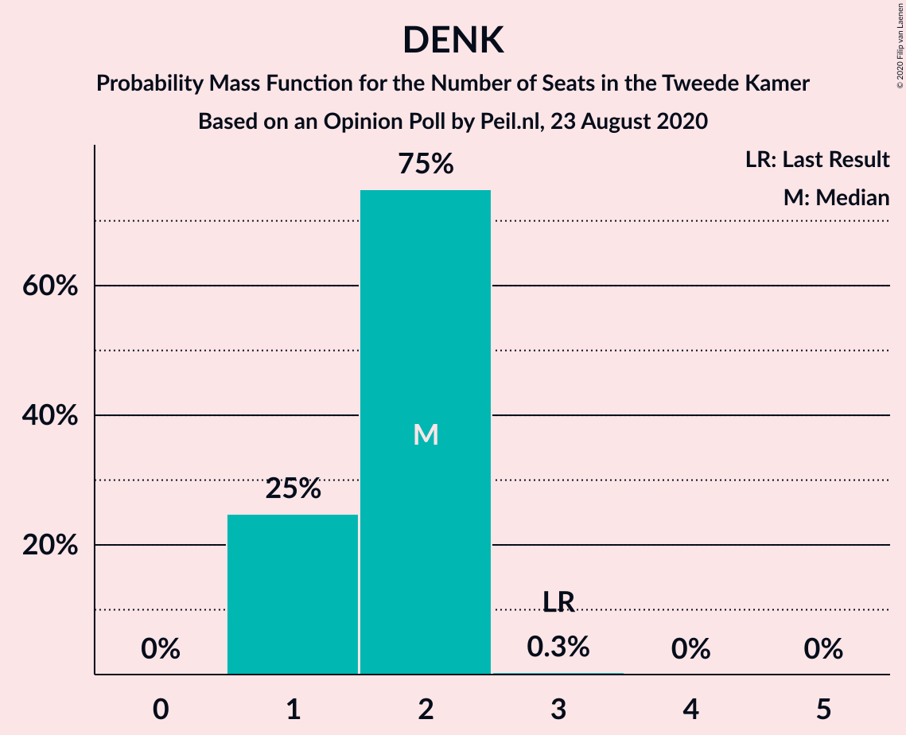

| Number of Seats | Probability | Accumulated | Special Marks |
|:---------------:|:-----------:|:-----------:|:-------------:|
| 1 | 25% | 100% |  |
| 2 | 75% | 75% | Median |
| 3 | 0.3% | 0.3% | Last Result |
| 4 | 0% | 0% |  |

### 50Plus

*For a full overview of the results for this party, see the [50Plus](party-50plus.html) page.*

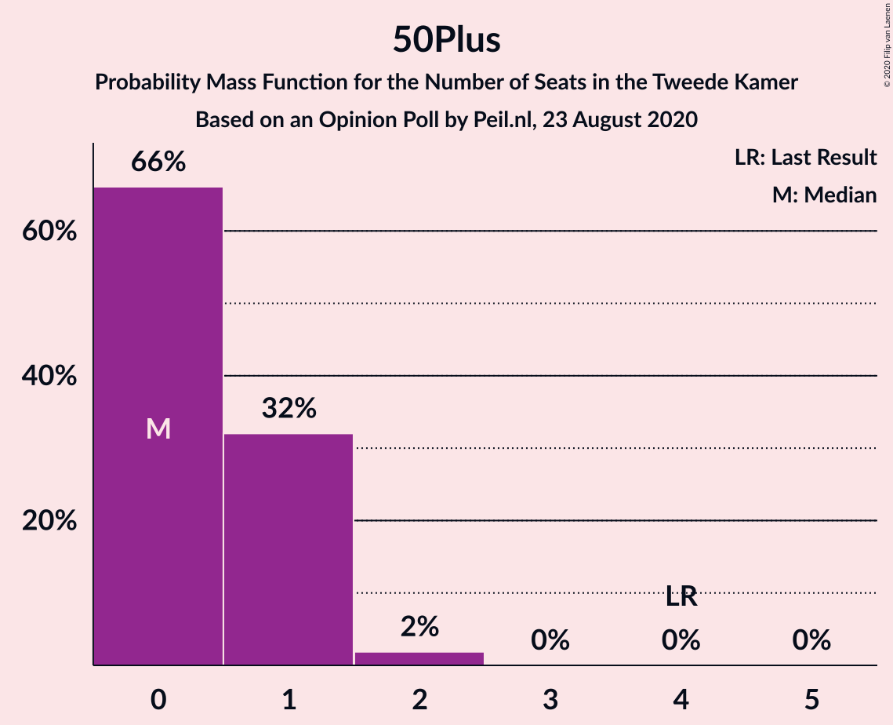

| Number of Seats | Probability | Accumulated | Special Marks |
|:---------------:|:-----------:|:-----------:|:-------------:|
| 0 | 66% | 100% | Median |
| 1 | 32% | 34% |  |
| 2 | 2% | 2% |  |
| 3 | 0% | 0% |  |
| 4 | 0% | 0% | Last Result |

### Partij voor de Toekomst

*For a full overview of the results for this party, see the [Partij voor de Toekomst](party-partijvoordetoekomst.html) page.*

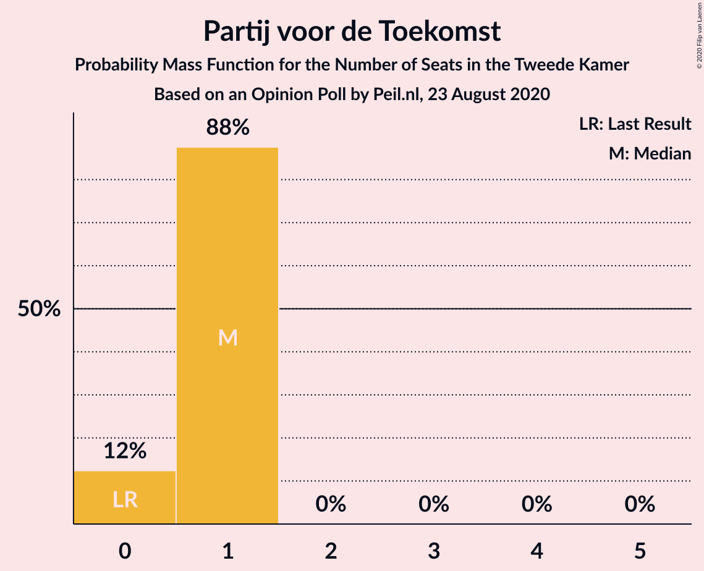

| Number of Seats | Probability | Accumulated | Special Marks |
|:---------------:|:-----------:|:-----------:|:-------------:|
| 0 | 12% | 100% | Last Result |
| 1 | 88% | 88% | Median |
| 2 | 0% | 0% |  |

## Coalitions

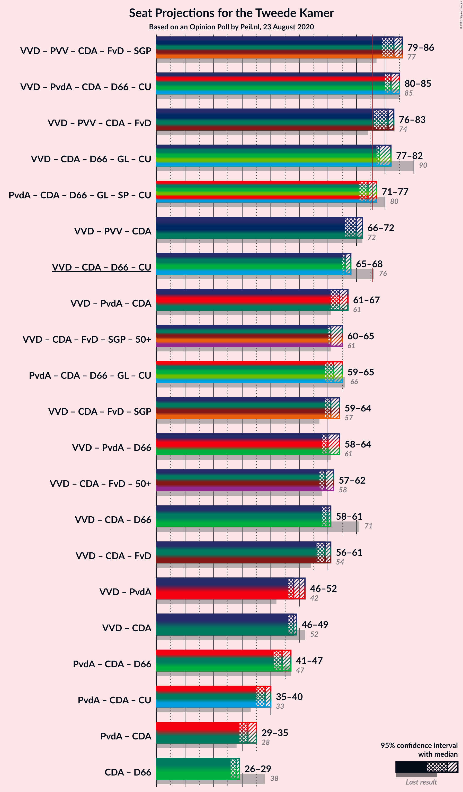

### Confidence Intervals

| Coalition | Last Result | Median | Majority? | 80% Confidence Interval | 90% Confidence Interval | 95% Confidence Interval | 99% Confidence Interval |
|:---------:|:-----------:|:------:|:---------:|:-----------------------:|:-----------------------:|:-----------------------:|:-----------------------:|
| Volkspartij voor Vrijheid en Democratie – Partij voor de Vrijheid – Christen-Democratisch Appèl – Forum voor Democratie – Staatkundig Gereformeerde Partij | 77 | 83 | 100% | 81–85 | 81–86 | 79–86 | 79–87 |
| Volkspartij voor Vrijheid en Democratie – Partij van de Arbeid – Christen-Democratisch Appèl – Democraten 66 – ChristenUnie | 85 | 82 | 100% | 80–84 | 80–85 | 80–85 | 78–86 |
| Volkspartij voor Vrijheid en Democratie – Partij voor de Vrijheid – Christen-Democratisch Appèl – Forum voor Democratie | 74 | 81 | 100% | 79–83 | 78–83 | 76–83 | 76–84 |
| Volkspartij voor Vrijheid en Democratie – Christen-Democratisch Appèl – Democraten 66 – GroenLinks – ChristenUnie | 90 | 78 | 98.8% | 78–80 | 77–80 | 77–82 | 75–82 |
| Partij van de Arbeid – Christen-Democratisch Appèl – Democraten 66 – GroenLinks – Socialistische Partij – ChristenUnie | 80 | 74 | 8% | 71–75 | 71–76 | 71–77 | 69–77 |
| Volkspartij voor Vrijheid en Democratie – Partij voor de Vrijheid – Christen-Democratisch Appèl | 72 | 70 | 0% | 68–71 | 67–72 | 66–72 | 65–73 |
| Volkspartij voor Vrijheid en Democratie – Christen-Democratisch Appèl – Democraten 66 – ChristenUnie | 76 | 66 | 0% | 66–67 | 65–67 | 65–68 | 63–70 |
| Volkspartij voor Vrijheid en Democratie – Partij van de Arbeid – Christen-Democratisch Appèl | 61 | 64 | 0% | 62–67 | 62–67 | 61–67 | 61–67 |
| Volkspartij voor Vrijheid en Democratie – Christen-Democratisch Appèl – Forum voor Democratie – Staatkundig Gereformeerde Partij – 50Plus | 61 | 61 | 0% | 61–64 | 60–65 | 60–65 | 59–66 |
| Partij van de Arbeid – Christen-Democratisch Appèl – Democraten 66 – GroenLinks – ChristenUnie | 66 | 62 | 0% | 59–65 | 59–65 | 59–65 | 58–65 |
| Volkspartij voor Vrijheid en Democratie – Christen-Democratisch Appèl – Forum voor Democratie – Staatkundig Gereformeerde Partij | 57 | 61 | 0% | 60–64 | 59–64 | 59–64 | 59–65 |
| Volkspartij voor Vrijheid en Democratie – Partij van de Arbeid – Democraten 66 | 61 | 60 | 0% | 58–63 | 58–64 | 58–64 | 57–64 |
| Volkspartij voor Vrijheid en Democratie – Christen-Democratisch Appèl – Forum voor Democratie – 50Plus | 58 | 59 | 0% | 58–61 | 58–62 | 57–62 | 56–63 |
| Volkspartij voor Vrijheid en Democratie – Christen-Democratisch Appèl – Democraten 66 | 71 | 60 | 0% | 60–61 | 60–61 | 58–61 | 57–63 |
| Volkspartij voor Vrijheid en Democratie – Christen-Democratisch Appèl – Forum voor Democratie | 54 | 59 | 0% | 57–60 | 56–61 | 56–61 | 56–62 |
| Volkspartij voor Vrijheid en Democratie – Partij van de Arbeid | 42 | 48 | 0% | 46–51 | 46–52 | 46–52 | 45–52 |
| Volkspartij voor Vrijheid en Democratie – Christen-Democratisch Appèl | 52 | 48 | 0% | 46–49 | 46–49 | 46–49 | 45–51 |
| Partij van de Arbeid – Christen-Democratisch Appèl – Democraten 66 | 47 | 44 | 0% | 42–46 | 41–46 | 41–47 | 40–47 |
| Partij van de Arbeid – Christen-Democratisch Appèl – ChristenUnie | 33 | 38 | 0% | 35–40 | 35–40 | 35–40 | 33–40 |
| Partij van de Arbeid – Christen-Democratisch Appèl | 28 | 32 | 0% | 29–34 | 29–34 | 29–35 | 28–35 |
| Christen-Democratisch Appèl – Democraten 66 | 38 | 28 | 0% | 26–29 | 26–29 | 26–29 | 25–30 |

### Volkspartij voor Vrijheid en Democratie – Partij voor de Vrijheid – Christen-Democratisch Appèl – Forum voor Democratie – Staatkundig Gereformeerde Partij

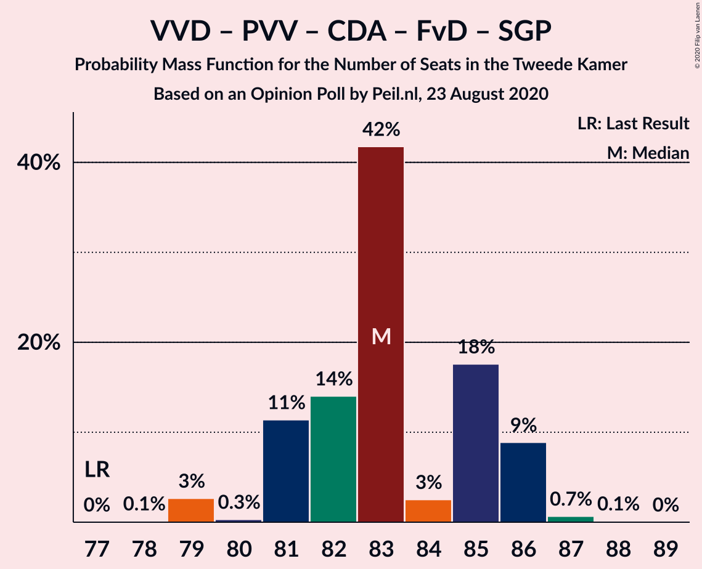

| Number of Seats | Probability | Accumulated | Special Marks |
|:---------------:|:-----------:|:-----------:|:-------------:|
| 77 | 0% | 100% | Last Result |
| 78 | 0.1% | 100% |  |
| 79 | 3% | 99.9% |  |
| 80 | 0.3% | 97% |  |
| 81 | 11% | 97% |  |
| 82 | 14% | 86% |  |
| 83 | 42% | 72% | Median |
| 84 | 3% | 30% |  |
| 85 | 18% | 27% |  |
| 86 | 9% | 10% |  |
| 87 | 0.7% | 0.8% |  |
| 88 | 0.1% | 0.1% |  |
| 89 | 0% | 0% |  |

### Volkspartij voor Vrijheid en Democratie – Partij van de Arbeid – Christen-Democratisch Appèl – Democraten 66 – ChristenUnie

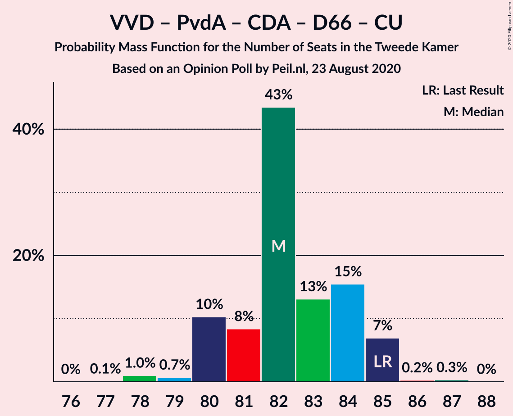

| Number of Seats | Probability | Accumulated | Special Marks |
|:---------------:|:-----------:|:-----------:|:-------------:|
| 77 | 0.1% | 100% |  |
| 78 | 1.0% | 99.9% |  |
| 79 | 0.7% | 98.9% |  |
| 80 | 10% | 98% |  |
| 81 | 8% | 88% |  |
| 82 | 43% | 80% | Median |
| 83 | 13% | 36% |  |
| 84 | 15% | 23% |  |
| 85 | 7% | 7% | Last Result |
| 86 | 0.2% | 0.6% |  |
| 87 | 0.3% | 0.3% |  |
| 88 | 0% | 0% |  |

### Volkspartij voor Vrijheid en Democratie – Partij voor de Vrijheid – Christen-Democratisch Appèl – Forum voor Democratie

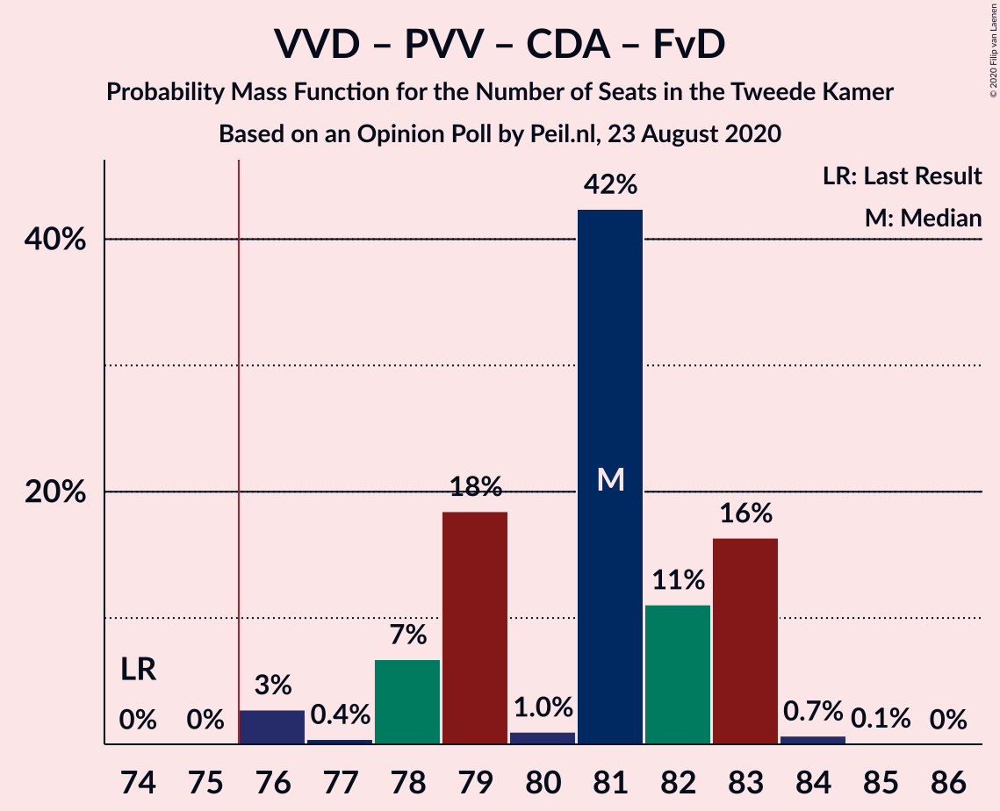

| Number of Seats | Probability | Accumulated | Special Marks |
|:---------------:|:-----------:|:-----------:|:-------------:|
| 74 | 0% | 100% | Last Result |
| 75 | 0% | 100% |  |
| 76 | 3% | 100% | Majority |
| 77 | 0.4% | 97% |  |
| 78 | 7% | 97% |  |
| 79 | 18% | 90% |  |
| 80 | 1.0% | 72% |  |
| 81 | 42% | 71% | Median |
| 82 | 11% | 28% |  |
| 83 | 16% | 17% |  |
| 84 | 0.7% | 0.8% |  |
| 85 | 0.1% | 0.1% |  |
| 86 | 0% | 0% |  |

### Volkspartij voor Vrijheid en Democratie – Christen-Democratisch Appèl – Democraten 66 – GroenLinks – ChristenUnie

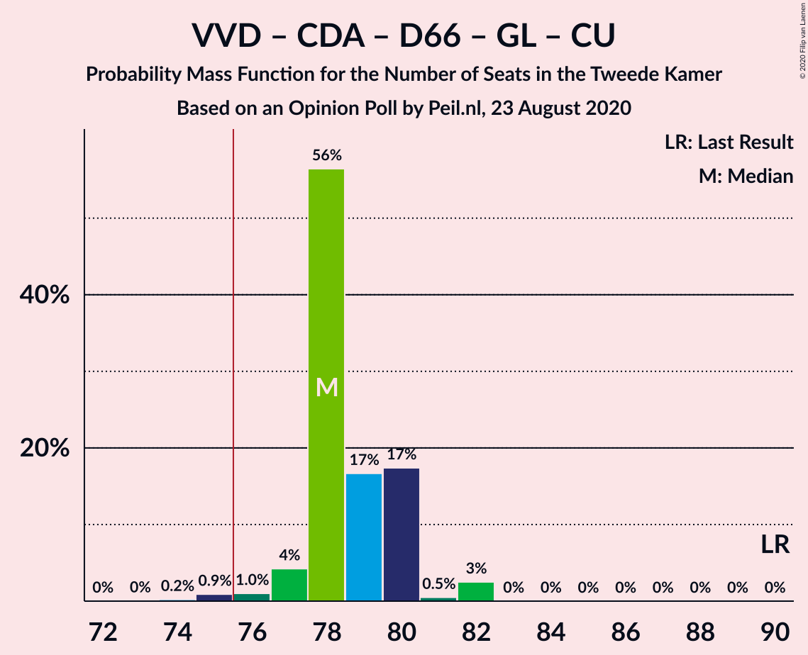

| Number of Seats | Probability | Accumulated | Special Marks |
|:---------------:|:-----------:|:-----------:|:-------------:|
| 73 | 0% | 100% |  |
| 74 | 0.2% | 99.9% |  |
| 75 | 0.9% | 99.7% |  |
| 76 | 1.0% | 98.8% | Majority |
| 77 | 4% | 98% |  |
| 78 | 56% | 94% | Median |
| 79 | 17% | 37% |  |
| 80 | 17% | 20% |  |
| 81 | 0.5% | 3% |  |
| 82 | 3% | 3% |  |
| 83 | 0% | 0% |  |
| 84 | 0% | 0% |  |
| 85 | 0% | 0% |  |
| 86 | 0% | 0% |  |
| 87 | 0% | 0% |  |
| 88 | 0% | 0% |  |
| 89 | 0% | 0% |  |
| 90 | 0% | 0% | Last Result |

### Partij van de Arbeid – Christen-Democratisch Appèl – Democraten 66 – GroenLinks – Socialistische Partij – ChristenUnie

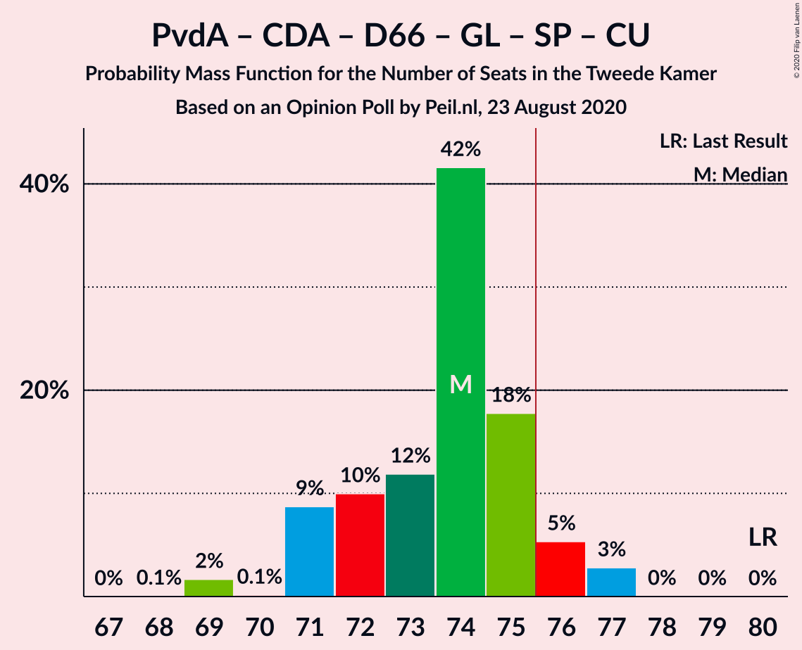

| Number of Seats | Probability | Accumulated | Special Marks |
|:---------------:|:-----------:|:-----------:|:-------------:|
| 68 | 0.1% | 100% |  |
| 69 | 2% | 99.9% |  |
| 70 | 0.1% | 98% |  |
| 71 | 9% | 98% |  |
| 72 | 10% | 89% |  |
| 73 | 12% | 79% |  |
| 74 | 42% | 68% | Median |
| 75 | 18% | 26% |  |
| 76 | 5% | 8% | Majority |
| 77 | 3% | 3% |  |
| 78 | 0% | 0% |  |
| 79 | 0% | 0% |  |
| 80 | 0% | 0% | Last Result |

### Volkspartij voor Vrijheid en Democratie – Partij voor de Vrijheid – Christen-Democratisch Appèl

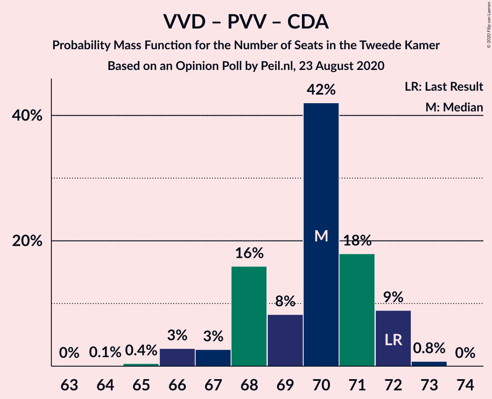

| Number of Seats | Probability | Accumulated | Special Marks |
|:---------------:|:-----------:|:-----------:|:-------------:|
| 64 | 0.1% | 100% |  |
| 65 | 0.4% | 99.8% |  |
| 66 | 3% | 99.4% |  |
| 67 | 3% | 97% |  |
| 68 | 16% | 94% |  |
| 69 | 8% | 78% |  |
| 70 | 42% | 70% | Median |
| 71 | 18% | 28% |  |
| 72 | 9% | 10% | Last Result |
| 73 | 0.8% | 0.8% |  |
| 74 | 0% | 0% |  |

### Volkspartij voor Vrijheid en Democratie – Christen-Democratisch Appèl – Democraten 66 – ChristenUnie

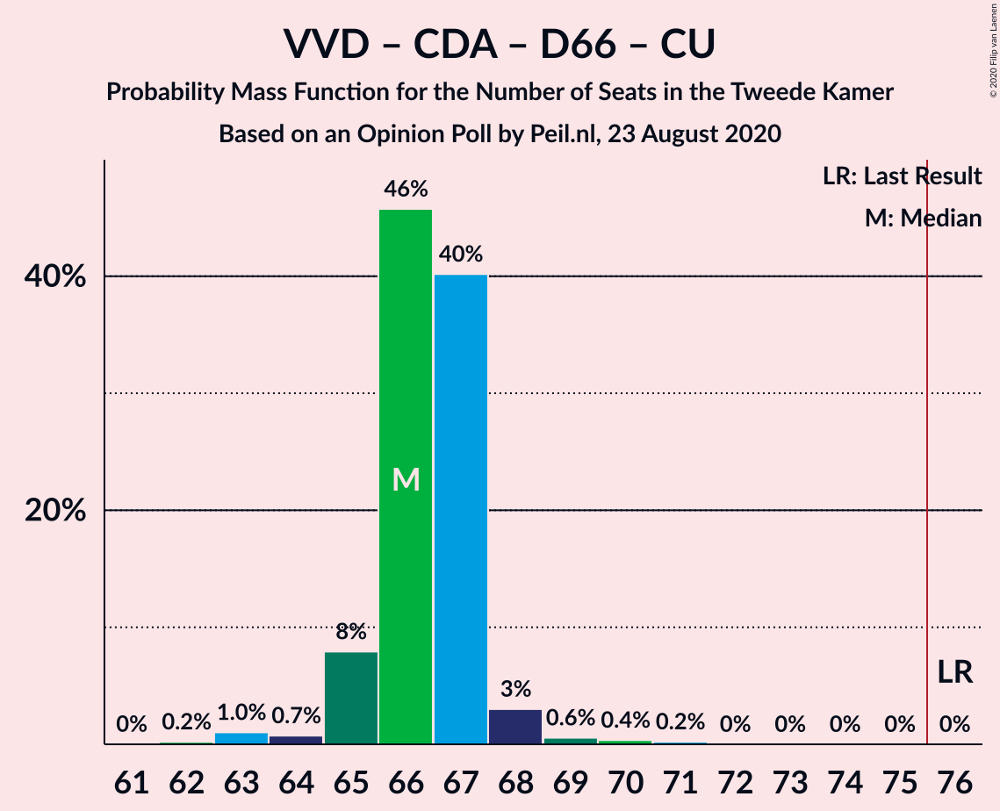

| Number of Seats | Probability | Accumulated | Special Marks |
|:---------------:|:-----------:|:-----------:|:-------------:|
| 62 | 0.2% | 100% |  |
| 63 | 1.0% | 99.8% |  |
| 64 | 0.7% | 98.7% |  |
| 65 | 8% | 98% |  |
| 66 | 46% | 90% | Median |
| 67 | 40% | 44% |  |
| 68 | 3% | 4% |  |
| 69 | 0.6% | 1.1% |  |
| 70 | 0.4% | 0.6% |  |
| 71 | 0.2% | 0.2% |  |
| 72 | 0% | 0% |  |
| 73 | 0% | 0% |  |
| 74 | 0% | 0% |  |
| 75 | 0% | 0% |  |
| 76 | 0% | 0% | Last Result, Majority |

### Volkspartij voor Vrijheid en Democratie – Partij van de Arbeid – Christen-Democratisch Appèl

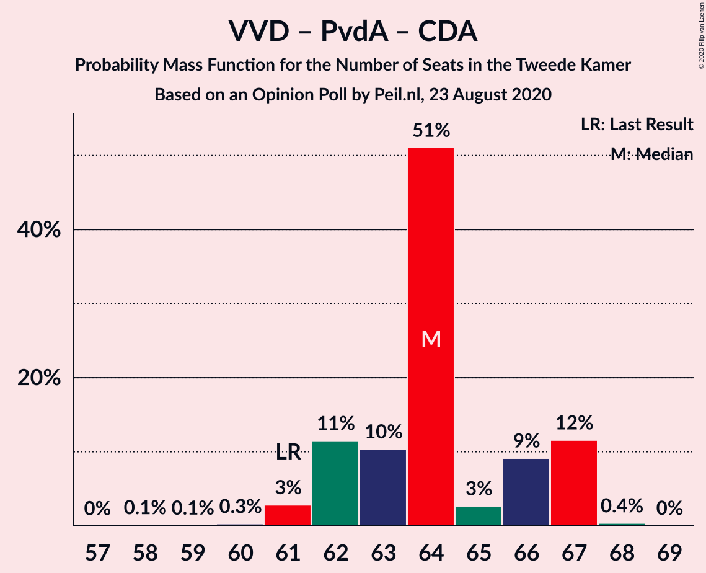

| Number of Seats | Probability | Accumulated | Special Marks |
|:---------------:|:-----------:|:-----------:|:-------------:|
| 58 | 0.1% | 100% |  |
| 59 | 0.1% | 99.9% |  |
| 60 | 0.3% | 99.8% |  |
| 61 | 3% | 99.5% | Last Result |
| 62 | 11% | 97% |  |
| 63 | 10% | 85% |  |
| 64 | 51% | 75% | Median |
| 65 | 3% | 24% |  |
| 66 | 9% | 21% |  |
| 67 | 12% | 12% |  |
| 68 | 0.4% | 0.4% |  |
| 69 | 0% | 0% |  |

### Volkspartij voor Vrijheid en Democratie – Christen-Democratisch Appèl – Forum voor Democratie – Staatkundig Gereformeerde Partij – 50Plus

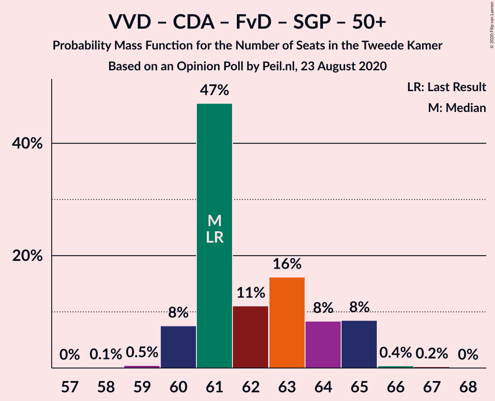

| Number of Seats | Probability | Accumulated | Special Marks |
|:---------------:|:-----------:|:-----------:|:-------------:|
| 58 | 0.1% | 100% |  |
| 59 | 0.5% | 99.9% |  |
| 60 | 8% | 99.4% |  |
| 61 | 47% | 92% | Last Result, Median |
| 62 | 11% | 45% |  |
| 63 | 16% | 34% |  |
| 64 | 8% | 18% |  |
| 65 | 8% | 9% |  |
| 66 | 0.4% | 0.7% |  |
| 67 | 0.2% | 0.3% |  |
| 68 | 0% | 0% |  |

### Partij van de Arbeid – Christen-Democratisch Appèl – Democraten 66 – GroenLinks – ChristenUnie

| Number of Seats | Probability | Accumulated | Special Marks |
|:---------------:|:-----------:|:-----------:|:-------------:|
| 56 | 0% | 100% |  |
| 57 | 0.4% | 99.9% |  |
| 58 | 0.9% | 99.6% |  |
| 59 | 9% | 98.7% |  |
| 60 | 1.1% | 90% |  |
| 61 | 18% | 88% |  |
| 62 | 49% | 70% | Median |
| 63 | 3% | 21% |  |
| 64 | 5% | 19% |  |
| 65 | 14% | 14% |  |
| 66 | 0.1% | 0.1% | Last Result |
| 67 | 0% | 0% |  |

### Volkspartij voor Vrijheid en Democratie – Christen-Democratisch Appèl – Forum voor Democratie – Staatkundig Gereformeerde Partij

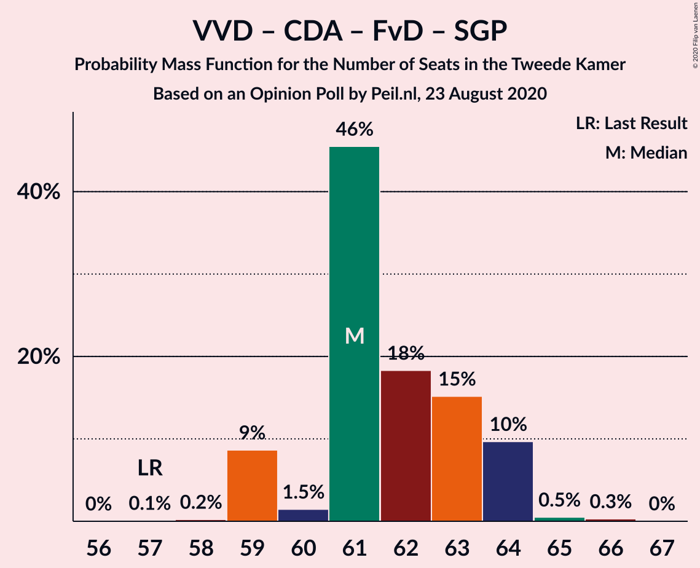

| Number of Seats | Probability | Accumulated | Special Marks |
|:---------------:|:-----------:|:-----------:|:-------------:|
| 57 | 0.1% | 100% | Last Result |
| 58 | 0.2% | 99.9% |  |
| 59 | 9% | 99.6% |  |
| 60 | 1.5% | 91% |  |
| 61 | 46% | 90% | Median |
| 62 | 18% | 44% |  |
| 63 | 15% | 26% |  |
| 64 | 10% | 11% |  |
| 65 | 0.5% | 0.9% |  |
| 66 | 0.3% | 0.3% |  |
| 67 | 0% | 0% |  |

### Volkspartij voor Vrijheid en Democratie – Partij van de Arbeid – Democraten 66

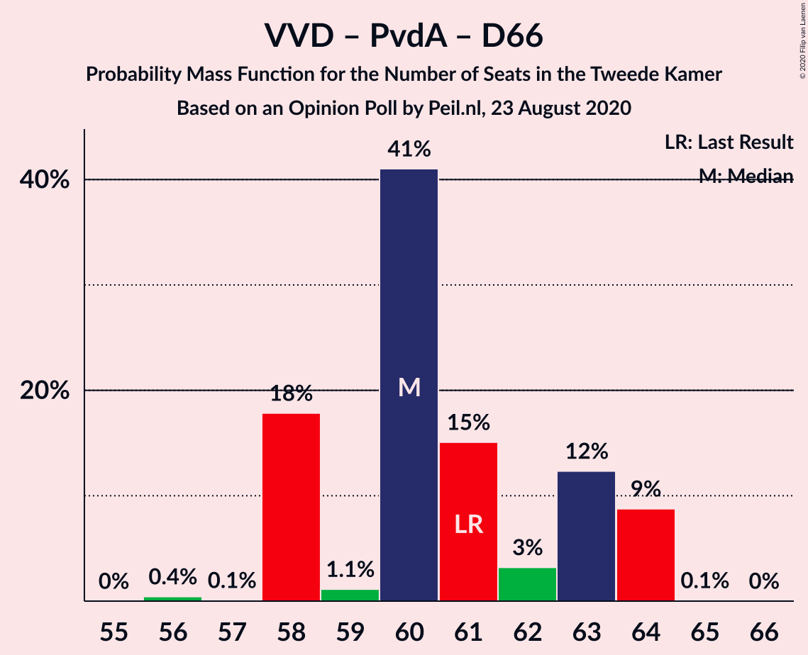

| Number of Seats | Probability | Accumulated | Special Marks |
|:---------------:|:-----------:|:-----------:|:-------------:|
| 56 | 0.4% | 100% |  |
| 57 | 0.1% | 99.6% |  |
| 58 | 18% | 99.5% |  |
| 59 | 1.1% | 82% |  |
| 60 | 41% | 81% | Median |
| 61 | 15% | 39% | Last Result |
| 62 | 3% | 24% |  |
| 63 | 12% | 21% |  |
| 64 | 9% | 9% |  |
| 65 | 0.1% | 0.1% |  |
| 66 | 0% | 0% |  |

### Volkspartij voor Vrijheid en Democratie – Christen-Democratisch Appèl – Forum voor Democratie – 50Plus

| Number of Seats | Probability | Accumulated | Special Marks |
|:---------------:|:-----------:|:-----------:|:-------------:|
| 55 | 0.1% | 100% |  |
| 56 | 0.5% | 99.8% |  |
| 57 | 3% | 99.3% |  |
| 58 | 12% | 96% | Last Result |
| 59 | 41% | 85% | Median |
| 60 | 28% | 44% |  |
| 61 | 7% | 16% |  |
| 62 | 8% | 9% |  |
| 63 | 0.6% | 0.9% |  |
| 64 | 0.2% | 0.3% |  |
| 65 | 0% | 0% |  |

### Volkspartij voor Vrijheid en Democratie – Christen-Democratisch Appèl – Democraten 66

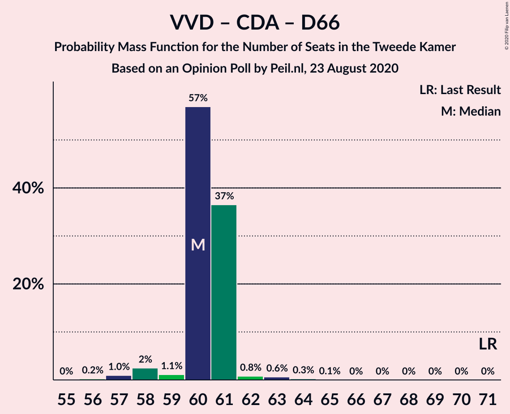

| Number of Seats | Probability | Accumulated | Special Marks |
|:---------------:|:-----------:|:-----------:|:-------------:|
| 56 | 0.2% | 100% |  |
| 57 | 1.0% | 99.7% |  |
| 58 | 2% | 98.8% |  |
| 59 | 1.1% | 96% |  |
| 60 | 57% | 95% | Median |
| 61 | 37% | 38% |  |
| 62 | 0.8% | 2% |  |
| 63 | 0.6% | 0.9% |  |
| 64 | 0.3% | 0.3% |  |
| 65 | 0.1% | 0.1% |  |
| 66 | 0% | 0% |  |
| 67 | 0% | 0% |  |
| 68 | 0% | 0% |  |
| 69 | 0% | 0% |  |
| 70 | 0% | 0% |  |
| 71 | 0% | 0% | Last Result |

### Volkspartij voor Vrijheid en Democratie – Christen-Democratisch Appèl – Forum voor Democratie

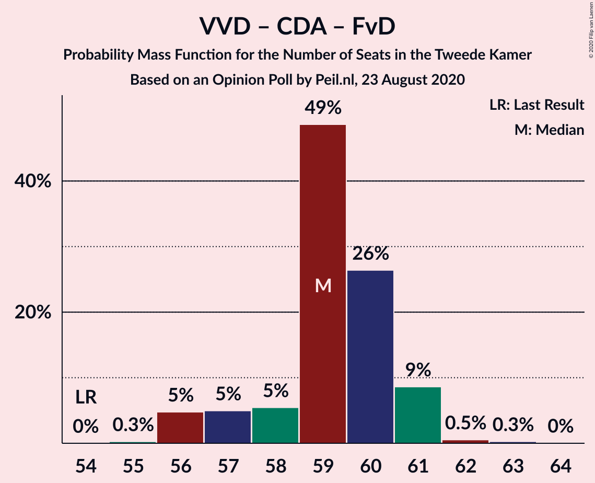

| Number of Seats | Probability | Accumulated | Special Marks |
|:---------------:|:-----------:|:-----------:|:-------------:|
| 54 | 0% | 100% | Last Result |
| 55 | 0.3% | 100% |  |
| 56 | 5% | 99.7% |  |
| 57 | 5% | 95% |  |
| 58 | 5% | 90% |  |
| 59 | 49% | 85% | Median |
| 60 | 26% | 36% |  |
| 61 | 9% | 9% |  |
| 62 | 0.5% | 0.9% |  |
| 63 | 0.3% | 0.3% |  |
| 64 | 0% | 0% |  |

### Volkspartij voor Vrijheid en Democratie – Partij van de Arbeid

| Number of Seats | Probability | Accumulated | Special Marks |
|:---------------:|:-----------:|:-----------:|:-------------:|
| 42 | 0% | 100% | Last Result |
| 43 | 0% | 100% |  |
| 44 | 0% | 100% |  |
| 45 | 0.5% | 100% |  |
| 46 | 18% | 99.5% |  |
| 47 | 4% | 82% |  |
| 48 | 42% | 78% | Median |
| 49 | 14% | 36% |  |
| 50 | 6% | 22% |  |
| 51 | 7% | 16% |  |
| 52 | 9% | 9% |  |
| 53 | 0.1% | 0.1% |  |
| 54 | 0% | 0% |  |

### Volkspartij voor Vrijheid en Democratie – Christen-Democratisch Appèl

| Number of Seats | Probability | Accumulated | Special Marks |
|:---------------:|:-----------:|:-----------:|:-------------:|
| 43 | 0.1% | 100% |  |
| 44 | 0.3% | 99.9% |  |
| 45 | 0.8% | 99.5% |  |
| 46 | 9% | 98.8% |  |
| 47 | 1.3% | 90% |  |
| 48 | 50% | 89% | Median |
| 49 | 37% | 39% |  |
| 50 | 0.8% | 2% |  |
| 51 | 0.8% | 1.0% |  |
| 52 | 0.2% | 0.3% | Last Result |
| 53 | 0% | 0% |  |

### Partij van de Arbeid – Christen-Democratisch Appèl – Democraten 66

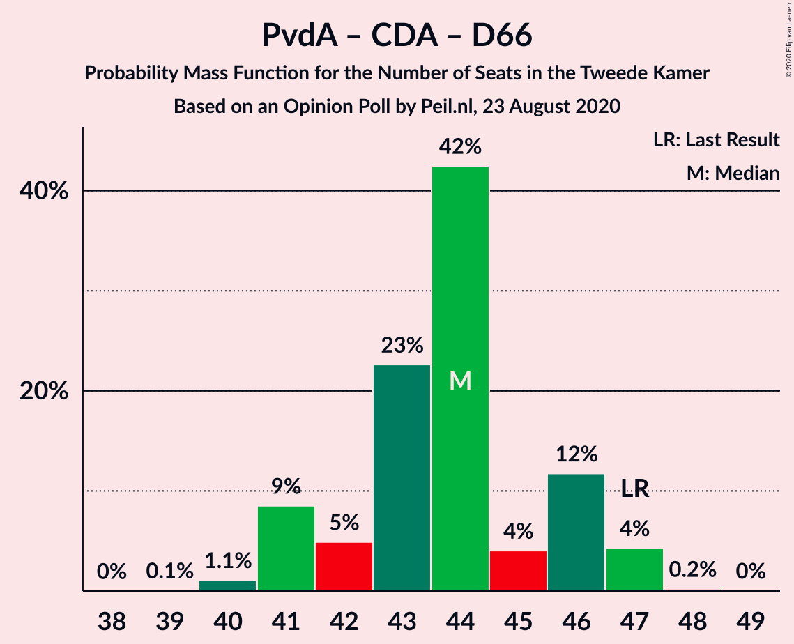

| Number of Seats | Probability | Accumulated | Special Marks |
|:---------------:|:-----------:|:-----------:|:-------------:|
| 39 | 0.1% | 100% |  |
| 40 | 1.1% | 99.9% |  |
| 41 | 9% | 98.8% |  |
| 42 | 5% | 90% |  |
| 43 | 23% | 85% |  |
| 44 | 42% | 63% | Median |
| 45 | 4% | 20% |  |
| 46 | 12% | 16% |  |
| 47 | 4% | 5% | Last Result |
| 48 | 0.2% | 0.3% |  |
| 49 | 0% | 0% |  |

### Partij van de Arbeid – Christen-Democratisch Appèl – ChristenUnie

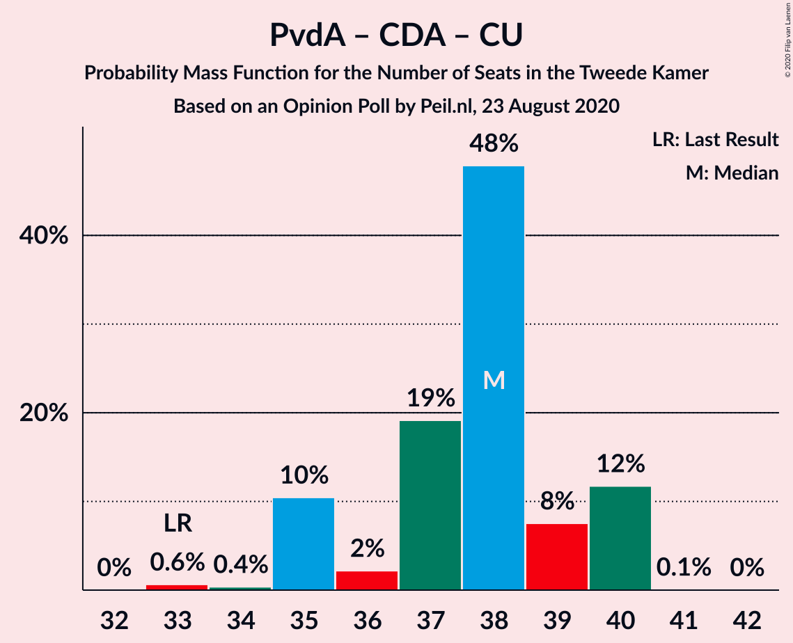

| Number of Seats | Probability | Accumulated | Special Marks |
|:---------------:|:-----------:|:-----------:|:-------------:|
| 33 | 0.6% | 100% | Last Result |
| 34 | 0.4% | 99.3% |  |
| 35 | 10% | 99.0% |  |
| 36 | 2% | 89% |  |
| 37 | 19% | 86% |  |
| 38 | 48% | 67% | Median |
| 39 | 8% | 19% |  |
| 40 | 12% | 12% |  |
| 41 | 0.1% | 0.1% |  |
| 42 | 0% | 0% |  |

### Partij van de Arbeid – Christen-Democratisch Appèl

| Number of Seats | Probability | Accumulated | Special Marks |
|:---------------:|:-----------:|:-----------:|:-------------:|
| 27 | 0.1% | 100% |  |
| 28 | 1.0% | 99.9% | Last Result |
| 29 | 11% | 98.9% |  |
| 30 | 4% | 88% |  |
| 31 | 24% | 85% |  |
| 32 | 44% | 61% | Median |
| 33 | 5% | 17% |  |
| 34 | 7% | 12% |  |
| 35 | 5% | 5% |  |
| 36 | 0.1% | 0.1% |  |
| 37 | 0% | 0% |  |

### Christen-Democratisch Appèl – Democraten 66

| Number of Seats | Probability | Accumulated | Special Marks |
|:---------------:|:-----------:|:-----------:|:-------------:|
| 23 | 0.1% | 100% |  |
| 24 | 0.1% | 99.9% |  |
| 25 | 0.8% | 99.9% |  |
| 26 | 10% | 99.0% |  |
| 27 | 10% | 89% |  |
| 28 | 63% | 79% | Median |
| 29 | 15% | 16% |  |
| 30 | 0.5% | 0.7% |  |
| 31 | 0.2% | 0.2% |  |
| 32 | 0% | 0.1% |  |
| 33 | 0% | 0% |  |
| 34 | 0% | 0% |  |
| 35 | 0% | 0% |  |
| 36 | 0% | 0% |  |
| 37 | 0% | 0% |  |
| 38 | 0% | 0% | Last Result |

## Technical Information

### Opinion Poll

+ **Polling firm:** Peil.nl
+ **Commissioner(s):** —
+ **Fieldwork period:** 23 August 2020

### Calculations

+ **Sample size:** 3000
+ **Simulations done:** 1,048,576
+ **Error estimate:** 2.18%

