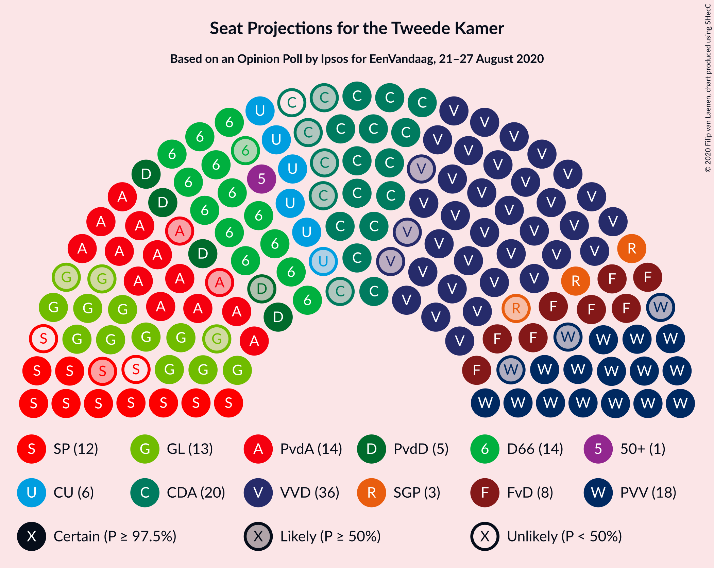
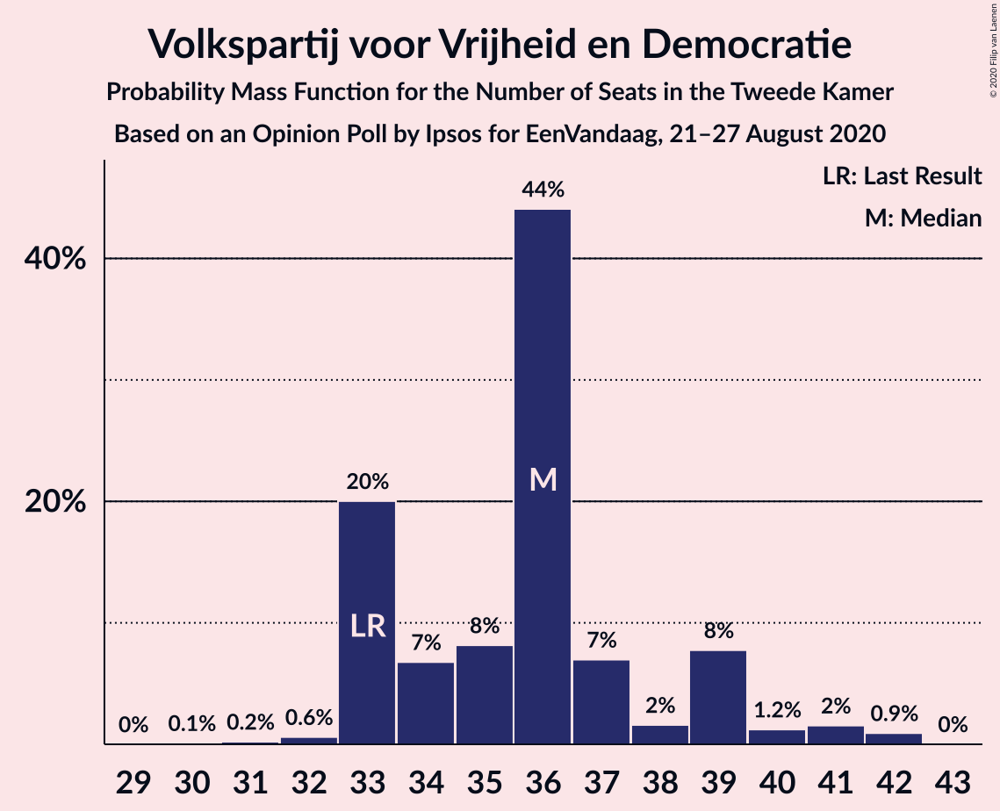
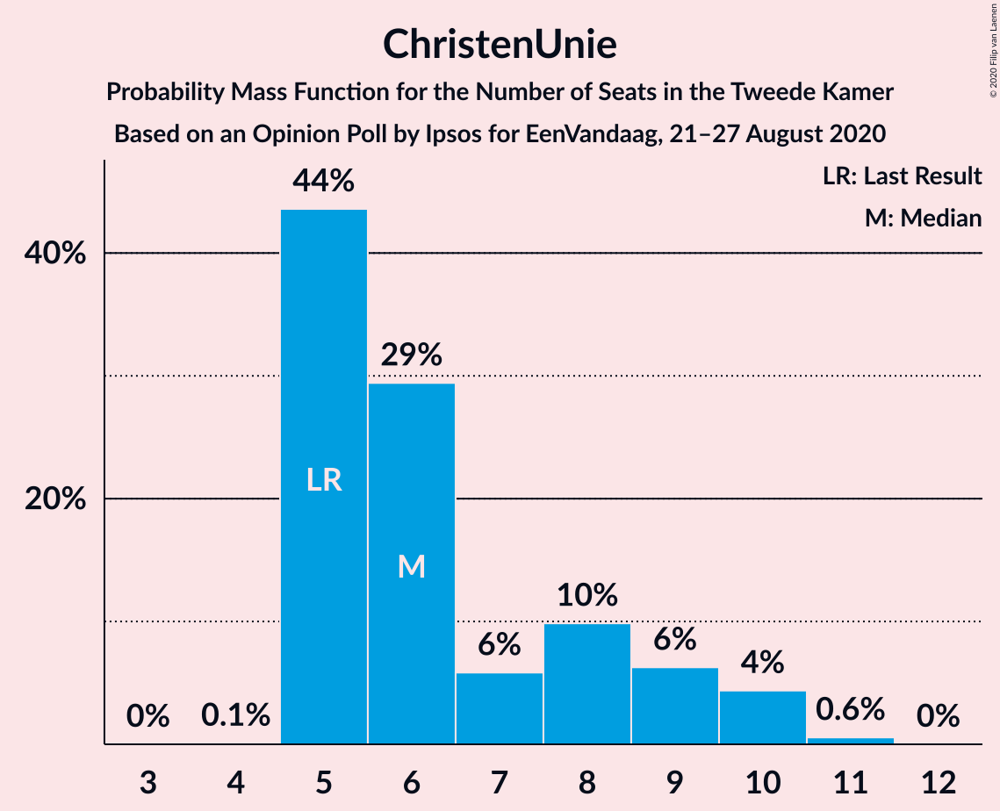
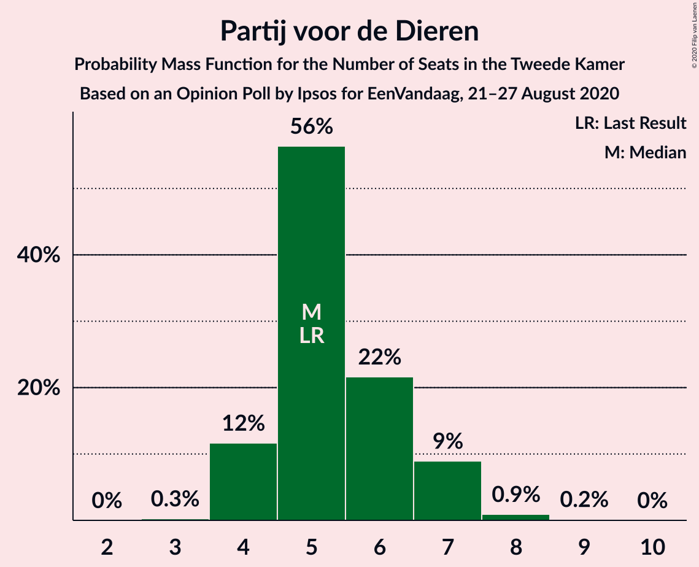
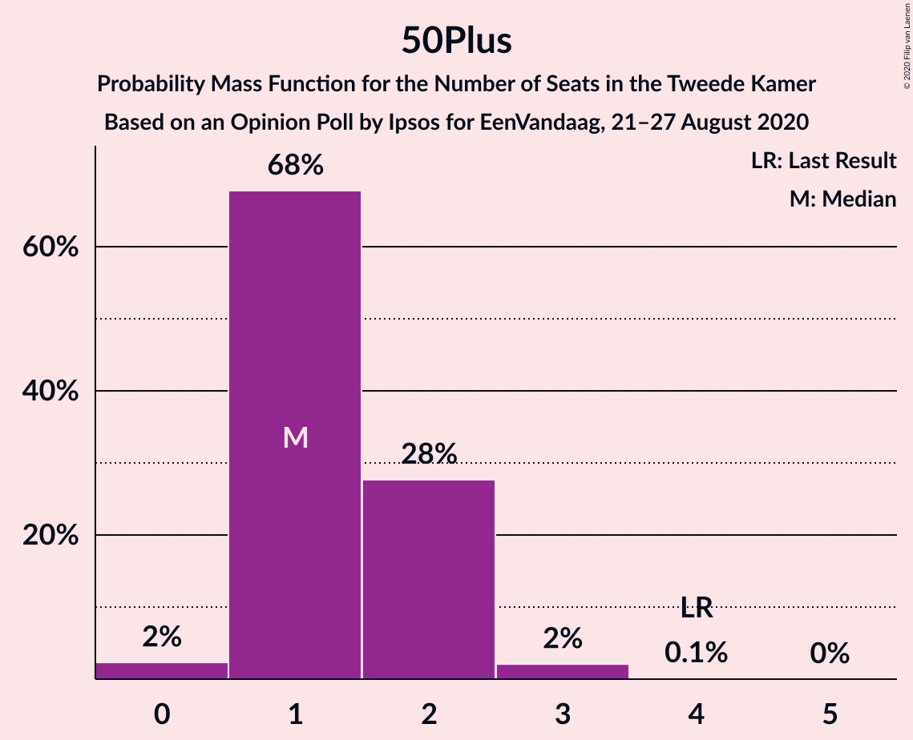
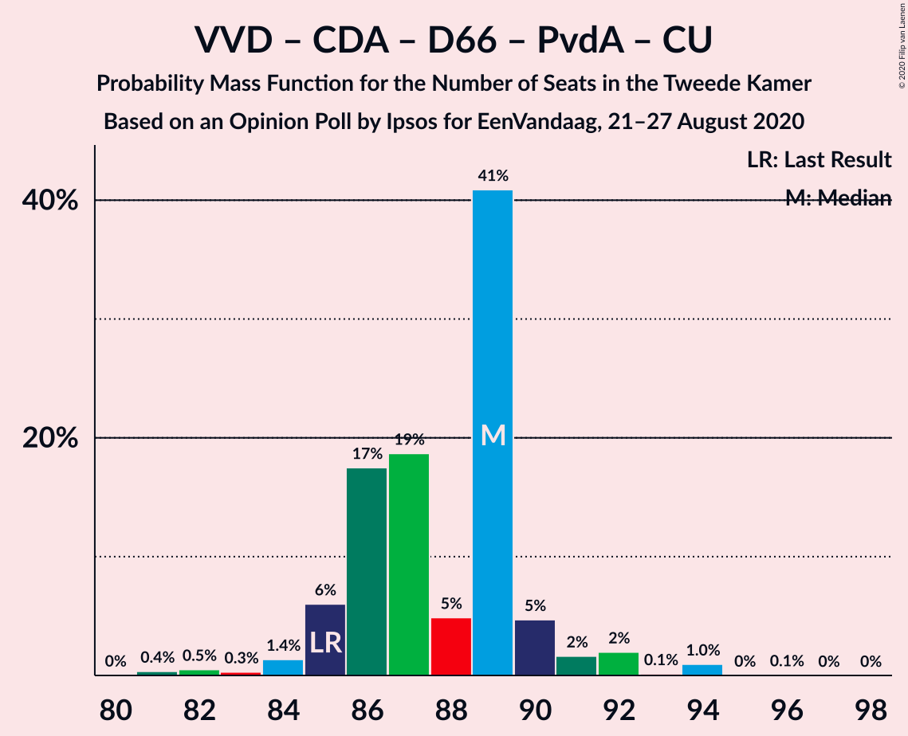
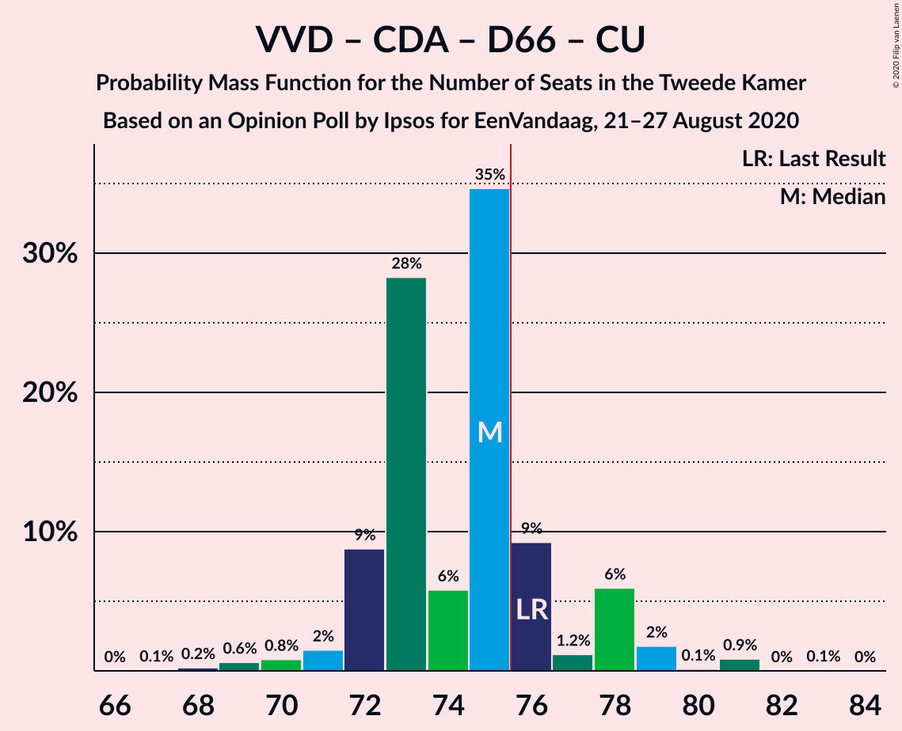
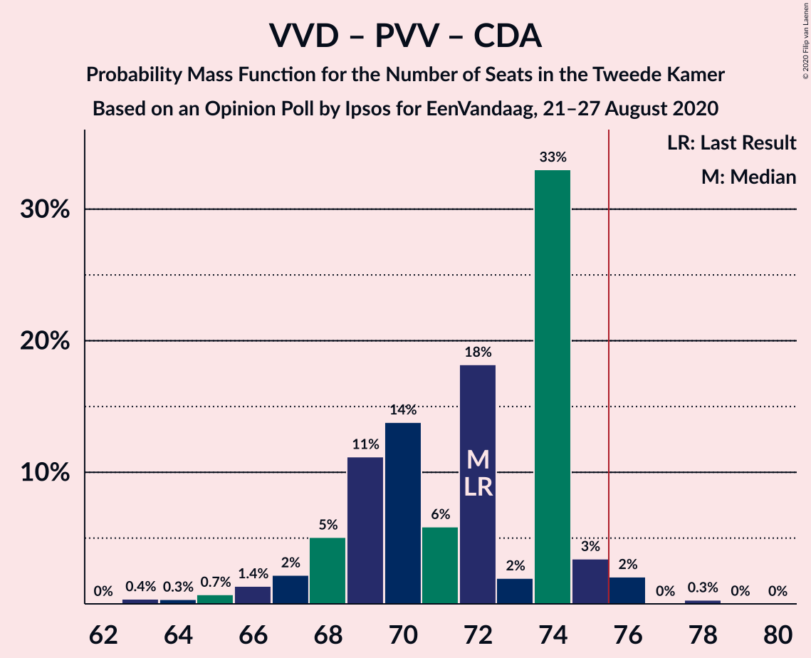
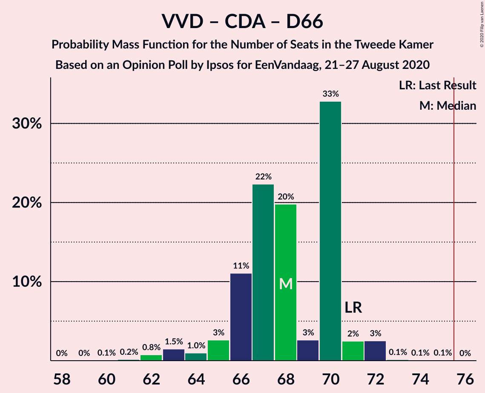
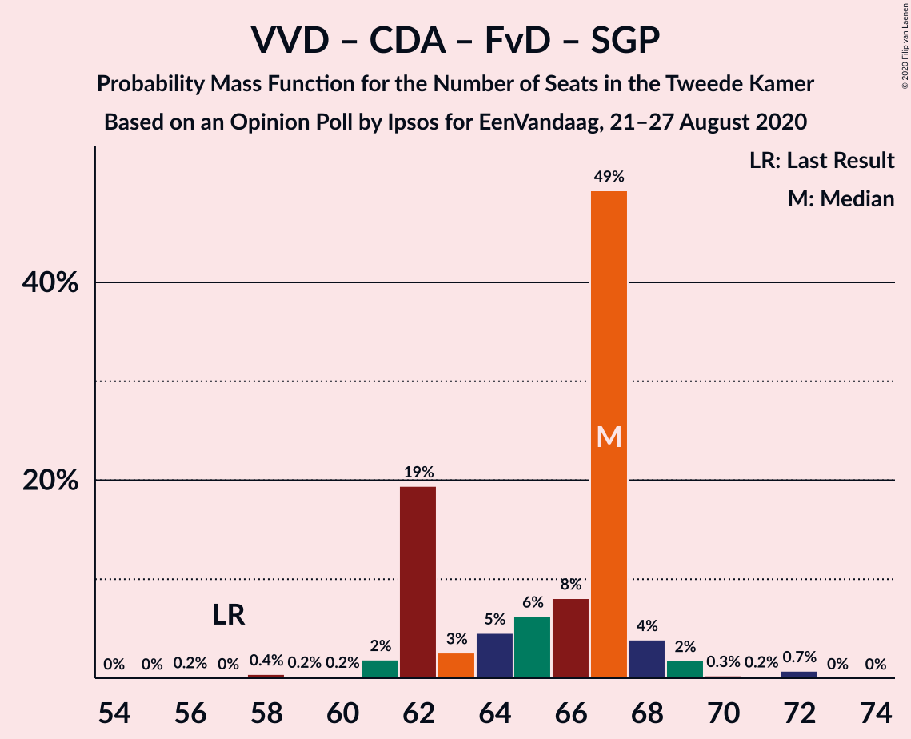

# Opinion Poll by Ipsos for EenVandaag, 21–27 August 2020

<a href="#voting-intentions">Voting Intentions</a> | <a href="#seats">Seats</a> | <a href="#coalitions">Coalitions</a> | <a href="#technical-information">Technical Information</a>

## Voting Intentions

### Confidence Intervals

| Party | Last Result | Poll Result | 80% Confidence Interval | 90% Confidence Interval | 95% Confidence Interval | 99% Confidence Interval |
|:-----:|:-----------:|:-----------:|:-----------------------:|:-----------------------:|:-----------------------:|:-----------------------:|
| Volkspartij voor Vrijheid en Democratie | 21.3% | 23.7% | 22.1–25.5% |21.6–26.0% |21.2–26.4% |20.5–27.2% |
| Partij voor de Vrijheid | 13.1% | 11.6% | 10.4–13.0% |10.1–13.4% |9.8–13.7% |9.3–14.4% |
| Christen-Democratisch Appèl | 12.4% | 10.8% | 9.6–12.1% |9.3–12.5% |9.0–12.8% |8.5–13.5% |
| Democraten 66 | 12.2% | 9.5% | 8.5–10.8% |8.2–11.2% |7.9–11.5% |7.4–12.1% |
| Partij van de Arbeid | 5.7% | 8.9% | 7.8–10.1% |7.6–10.5% |7.3–10.8% |6.8–11.4% |
| GroenLinks | 9.1% | 8.7% | 7.7–9.9% |7.4–10.3% |7.1–10.6% |6.7–11.2% |
| Socialistische Partij | 9.1% | 7.0% | 6.1–8.1% |5.8–8.4% |5.6–8.7% |5.2–9.3% |
| Forum voor Democratie | 1.8% | 6.2% | 5.4–7.3% |5.1–7.6% |4.9–7.9% |4.5–8.4% |
| ChristenUnie | 3.4% | 4.8% | 4.1–5.8% |3.9–6.1% |3.7–6.3% |3.4–6.8% |
| Partij voor de Dieren | 3.2% | 3.8% | 3.1–4.6% |2.9–4.9% |2.8–5.1% |2.5–5.6% |
| Staatkundig Gereformeerde Partij | 2.1% | 1.9% | 1.4–2.5% |1.3–2.7% |1.2–2.9% |1.0–3.3% |
| 50Plus | 3.1% | 1.2% | 0.9–1.8% |0.8–2.0% |0.7–2.1% |0.6–2.4% |
| DENK | 2.1% | 0.8% | 0.5–1.2% |0.4–1.4% |0.4–1.5% |0.3–1.8% |

*Note:* The poll result column reflects the actual value used in the calculations. Published results may vary slightly, and in addition be rounded to fewer digits.

## Seats

### Confidence Intervals

| Party | Last Result | Median | 80% Confidence Interval | 90% Confidence Interval | 95% Confidence Interval | 99% Confidence Interval |
|:-----:|:-----------:|:------:|:-----------------------:|:-----------------------:|:-----------------------:|:-----------------------:|
| <a href="#volkspartij-voor-vrijheid-en-democratie">Volkspartij voor Vrijheid en Democratie</a> | 33 | 37 | 32–39 |32–39 |32–39 |32–42 |
| <a href="#partij-voor-de-vrijheid">Partij voor de Vrijheid</a> | 20 | 18 | 15–21 |15–21 |15–21 |14–21 |
| <a href="#christen-democratisch-appèl">Christen-Democratisch Appèl</a> | 19 | 16 | 15–17 |15–18 |14–19 |12–20 |
| <a href="#democraten-66">Democraten 66</a> | 19 | 14 | 13–17 |13–17 |12–17 |10–17 |
| <a href="#partij-van-de-arbeid">Partij van de Arbeid</a> | 9 | 14 | 11–15 |11–15 |11–15 |10–16 |
| <a href="#groenlinks">GroenLinks</a> | 14 | 12 | 11–16 |10–16 |10–16 |10–18 |
| <a href="#socialistische-partij">Socialistische Partij</a> | 14 | 12 | 9–12 |9–13 |9–13 |8–14 |
| <a href="#forum-voor-democratie">Forum voor Democratie</a> | 2 | 8 | 6–10 |6–12 |6–12 |6–13 |
| <a href="#christenunie">ChristenUnie</a> | 5 | 6 | 6–8 |5–9 |5–10 |5–10 |
| <a href="#partij-voor-de-dieren">Partij voor de Dieren</a> | 5 | 5 | 4–6 |4–7 |4–7 |3–8 |
| <a href="#staatkundig-gereformeerde-partij">Staatkundig Gereformeerde Partij</a> | 3 | 3 | 2–4 |2–4 |1–4 |1–5 |
| <a href="#50plus">50Plus</a> | 4 | 1 | 0–3 |0–3 |0–3 |0–3 |
| <a href="#denk">DENK</a> | 3 | 1 | 0–1 |0–2 |0–2 |0–2 |

### Volkspartij voor Vrijheid en Democratie

*For a full overview of the results for this party, see the [Volkspartij voor Vrijheid en Democratie](party-volkspartijvoorvrijheidendemocratie.html) page.*

| Number of Seats | Probability | Accumulated | Special Marks |
|:---------------:|:-----------:|:-----------:|:-------------:|
| 31 | 0.2% | 100% |  |
| 32 | 10% | 99.8% |  |
| 33 | 5% | 90% | Last Result |
| 34 | 0.9% | 85% |  |
| 35 | 2% | 84% |  |
| 36 | 6% | 82% |  |
| 37 | 29% | 75% | Median |
| 38 | 1.2% | 46% |  |
| 39 | 44% | 45% |  |
| 40 | 0.2% | 1.3% |  |
| 41 | 0.4% | 1.1% |  |
| 42 | 0.5% | 0.7% |  |
| 43 | 0% | 0.2% |  |
| 44 | 0.2% | 0.2% |  |
| 45 | 0% | 0% |  |

### Partij voor de Vrijheid

*For a full overview of the results for this party, see the [Partij voor de Vrijheid](party-partijvoordevrijheid.html) page.*

| Number of Seats | Probability | Accumulated | Special Marks |
|:---------------:|:-----------:|:-----------:|:-------------:|
| 12 | 0.1% | 100% |  |
| 13 | 0% | 99.9% |  |
| 14 | 0.8% | 99.9% |  |
| 15 | 11% | 99.1% |  |
| 16 | 6% | 88% |  |
| 17 | 12% | 82% |  |
| 18 | 23% | 70% | Median |
| 19 | 2% | 47% |  |
| 20 | 3% | 44% | Last Result |
| 21 | 41% | 42% |  |
| 22 | 0.1% | 0.1% |  |
| 23 | 0% | 0% |  |

### Christen-Democratisch Appèl

*For a full overview of the results for this party, see the [Christen-Democratisch Appèl](party-christen-democratischappèl.html) page.*

| Number of Seats | Probability | Accumulated | Special Marks |
|:---------------:|:-----------:|:-----------:|:-------------:|
| 11 | 0.2% | 100% |  |
| 12 | 0.4% | 99.8% |  |
| 13 | 0.4% | 99.4% |  |
| 14 | 2% | 99.0% |  |
| 15 | 23% | 97% |  |
| 16 | 53% | 74% | Median |
| 17 | 16% | 21% |  |
| 18 | 2% | 5% |  |
| 19 | 1.5% | 3% | Last Result |
| 20 | 0.9% | 1.1% |  |
| 21 | 0.1% | 0.2% |  |
| 22 | 0.1% | 0.1% |  |
| 23 | 0% | 0% |  |

### Democraten 66

*For a full overview of the results for this party, see the [Democraten 66](party-democraten66.html) page.*

| Number of Seats | Probability | Accumulated | Special Marks |
|:---------------:|:-----------:|:-----------:|:-------------:|
| 10 | 0.6% | 100% |  |
| 11 | 1.3% | 99.4% |  |
| 12 | 0.9% | 98% |  |
| 13 | 19% | 97% |  |
| 14 | 46% | 78% | Median |
| 15 | 4% | 33% |  |
| 16 | 3% | 29% |  |
| 17 | 25% | 25% |  |
| 18 | 0.1% | 0.2% |  |
| 19 | 0.1% | 0.1% | Last Result |
| 20 | 0% | 0% |  |

### Partij van de Arbeid

*For a full overview of the results for this party, see the [Partij van de Arbeid](party-partijvandearbeid.html) page.*

| Number of Seats | Probability | Accumulated | Special Marks |
|:---------------:|:-----------:|:-----------:|:-------------:|
| 9 | 0% | 100% | Last Result |
| 10 | 1.2% | 100% |  |
| 11 | 12% | 98.8% |  |
| 12 | 6% | 87% |  |
| 13 | 8% | 81% |  |
| 14 | 62% | 73% | Median |
| 15 | 10% | 11% |  |
| 16 | 0.8% | 1.0% |  |
| 17 | 0.2% | 0.2% |  |
| 18 | 0% | 0% |  |

### GroenLinks

*For a full overview of the results for this party, see the [GroenLinks](party-groenlinks.html) page.*

| Number of Seats | Probability | Accumulated | Special Marks |
|:---------------:|:-----------:|:-----------:|:-------------:|
| 9 | 0.4% | 100% |  |
| 10 | 5% | 99.6% |  |
| 11 | 42% | 95% |  |
| 12 | 15% | 52% | Median |
| 13 | 5% | 38% |  |
| 14 | 2% | 33% | Last Result |
| 15 | 12% | 31% |  |
| 16 | 19% | 19% |  |
| 17 | 0.2% | 0.7% |  |
| 18 | 0.2% | 0.6% |  |
| 19 | 0.4% | 0.4% |  |
| 20 | 0% | 0% |  |

### Socialistische Partij

*For a full overview of the results for this party, see the [Socialistische Partij](party-socialistischepartij.html) page.*

| Number of Seats | Probability | Accumulated | Special Marks |
|:---------------:|:-----------:|:-----------:|:-------------:|
| 7 | 0.3% | 100% |  |
| 8 | 0.5% | 99.7% |  |
| 9 | 30% | 99.2% |  |
| 10 | 3% | 69% |  |
| 11 | 5% | 66% |  |
| 12 | 52% | 61% | Median |
| 13 | 7% | 9% |  |
| 14 | 1.4% | 1.4% | Last Result |
| 15 | 0% | 0% |  |

### Forum voor Democratie

*For a full overview of the results for this party, see the [Forum voor Democratie](party-forumvoordemocratie.html) page.*

| Number of Seats | Probability | Accumulated | Special Marks |
|:---------------:|:-----------:|:-----------:|:-------------:|
| 2 | 0% | 100% | Last Result |
| 3 | 0% | 100% |  |
| 4 | 0% | 100% |  |
| 5 | 0% | 100% |  |
| 6 | 16% | 100% |  |
| 7 | 0.3% | 84% |  |
| 8 | 56% | 84% | Median |
| 9 | 5% | 28% |  |
| 10 | 18% | 24% |  |
| 11 | 0.4% | 6% |  |
| 12 | 5% | 5% |  |
| 13 | 0.6% | 0.6% |  |
| 14 | 0% | 0% |  |

### ChristenUnie

*For a full overview of the results for this party, see the [ChristenUnie](party-christenunie.html) page.*

| Number of Seats | Probability | Accumulated | Special Marks |
|:---------------:|:-----------:|:-----------:|:-------------:|
| 4 | 0.3% | 100% |  |
| 5 | 7% | 99.7% | Last Result |
| 6 | 47% | 93% | Median |
| 7 | 14% | 46% |  |
| 8 | 26% | 32% |  |
| 9 | 3% | 6% |  |
| 10 | 4% | 4% |  |
| 11 | 0% | 0% |  |

### Partij voor de Dieren

*For a full overview of the results for this party, see the [Partij voor de Dieren](party-partijvoordedieren.html) page.*

| Number of Seats | Probability | Accumulated | Special Marks |
|:---------------:|:-----------:|:-----------:|:-------------:|
| 3 | 2% | 100% |  |
| 4 | 17% | 98% |  |
| 5 | 59% | 81% | Last Result, Median |
| 6 | 17% | 23% |  |
| 7 | 5% | 6% |  |
| 8 | 0.4% | 0.6% |  |
| 9 | 0.2% | 0.2% |  |
| 10 | 0% | 0% |  |

### Staatkundig Gereformeerde Partij

*For a full overview of the results for this party, see the [Staatkundig Gereformeerde Partij](party-staatkundiggereformeerdepartij.html) page.*

| Number of Seats | Probability | Accumulated | Special Marks |
|:---------------:|:-----------:|:-----------:|:-------------:|
| 1 | 3% | 100% |  |
| 2 | 15% | 97% |  |
| 3 | 64% | 82% | Last Result, Median |
| 4 | 16% | 18% |  |
| 5 | 2% | 2% |  |
| 6 | 0% | 0% |  |

### 50Plus

*For a full overview of the results for this party, see the [50Plus](party-50plus.html) page.*

| Number of Seats | Probability | Accumulated | Special Marks |
|:---------------:|:-----------:|:-----------:|:-------------:|
| 0 | 41% | 100% |  |
| 1 | 9% | 59% | Median |
| 2 | 39% | 50% |  |
| 3 | 10% | 11% |  |
| 4 | 0.2% | 0.2% | Last Result |
| 5 | 0% | 0% |  |

### DENK

*For a full overview of the results for this party, see the [DENK](party-denk.html) page.*

| Number of Seats | Probability | Accumulated | Special Marks |
|:---------------:|:-----------:|:-----------:|:-------------:|
| 0 | 50% | 100% |  |
| 1 | 45% | 50% | Median |
| 2 | 5% | 5% |  |
| 3 | 0.1% | 0.1% | Last Result |
| 4 | 0% | 0% |  |

## Coalitions

### Confidence Intervals

| Coalition | Last Result | Median | Majority? | 80% Confidence Interval | 90% Confidence Interval | 95% Confidence Interval | 99% Confidence Interval |
|:---------:|:-----------:|:------:|:---------:|:-----------------------:|:-----------------------:|:-----------------------:|:-----------------------:|
| Volkspartij voor Vrijheid en Democratie – Christen-Democratisch Appèl – Democraten 66 – Partij van de Arbeid – ChristenUnie | 85 | 89 | 100% | 85–89 | 84–90 | 84–91 | 82–93 |
| Volkspartij voor Vrijheid en Democratie – Christen-Democratisch Appèl – Democraten 66 – GroenLinks – ChristenUnie | 90 | 86 | 100% | 85–90 | 84–90 | 84–90 | 80–92 |
| Volkspartij voor Vrijheid en Democratie – Partij voor de Vrijheid – Christen-Democratisch Appèl – Forum voor Democratie – Staatkundig Gereformeerde Partij | 77 | 85 | 91% | 77–87 | 73–87 | 73–87 | 73–88 |
| Volkspartij voor Vrijheid en Democratie – Partij voor de Vrijheid – Christen-Democratisch Appèl – Forum voor Democratie | 74 | 81 | 86% | 74–84 | 71–84 | 71–84 | 71–85 |
| Christen-Democratisch Appèl – Democraten 66 – Partij van de Arbeid – GroenLinks – Socialistische Partij – ChristenUnie | 80 | 73 | 18% | 73–80 | 72–83 | 72–83 | 68–83 |
| Volkspartij voor Vrijheid en Democratie – Christen-Democratisch Appèl – Democraten 66 – ChristenUnie | 76 | 75 | 16% | 73–78 | 72–78 | 70–78 | 68–79 |
| Volkspartij voor Vrijheid en Democratie – Partij voor de Vrijheid – Christen-Democratisch Appèl | 72 | 71 | 41% | 65–76 | 63–76 | 63–76 | 63–76 |
| Volkspartij voor Vrijheid en Democratie – Christen-Democratisch Appèl – Democraten 66 | 71 | 69 | 0% | 65–71 | 65–71 | 63–71 | 61–71 |
| Volkspartij voor Vrijheid en Democratie – Christen-Democratisch Appèl – Forum voor Democratie – Staatkundig Gereformeerde Partij – 50Plus | 61 | 66 | 0.1% | 63–70 | 61–70 | 61–71 | 61–72 |
| Christen-Democratisch Appèl – Democraten 66 – Partij van de Arbeid – GroenLinks – ChristenUnie | 66 | 63 | 0% | 61–68 | 61–71 | 61–71 | 58–71 |
| Volkspartij voor Vrijheid en Democratie – Christen-Democratisch Appèl – Partij van de Arbeid | 61 | 66 | 0% | 63–69 | 63–69 | 61–69 | 60–71 |
| Volkspartij voor Vrijheid en Democratie – Christen-Democratisch Appèl – Forum voor Democratie – Staatkundig Gereformeerde Partij | 57 | 66 | 0% | 61–68 | 58–68 | 58–69 | 58–71 |
| Volkspartij voor Vrijheid en Democratie – Christen-Democratisch Appèl – Forum voor Democratie – 50Plus | 58 | 63 | 0% | 59–66 | 59–67 | 59–68 | 58–70 |
| Volkspartij voor Vrijheid en Democratie – Democraten 66 – Partij van de Arbeid | 61 | 65 | 0% | 63–67 | 61–67 | 61–67 | 58–69 |
| Volkspartij voor Vrijheid en Democratie – Christen-Democratisch Appèl – Forum voor Democratie | 54 | 63 | 0% | 58–64 | 56–65 | 56–66 | 56–69 |
| Volkspartij voor Vrijheid en Democratie – Christen-Democratisch Appèl | 52 | 54 | 0% | 49–55 | 48–55 | 48–55 | 47–57 |
| Volkspartij voor Vrijheid en Democratie – Partij van de Arbeid | 42 | 51 | 0% | 47–53 | 47–53 | 45–53 | 45–55 |
| Christen-Democratisch Appèl – Democraten 66 – Partij van de Arbeid | 47 | 44 | 0% | 42–48 | 41–48 | 40–48 | 39–49 |
| Christen-Democratisch Appèl – Partij van de Arbeid – ChristenUnie | 33 | 36 | 0% | 35–39 | 34–39 | 34–39 | 31–41 |
| Christen-Democratisch Appèl – Democraten 66 | 38 | 30 | 0% | 28–34 | 28–34 | 28–34 | 25–36 |
| Christen-Democratisch Appèl – Partij van de Arbeid | 28 | 30 | 0% | 28–31 | 28–31 | 26–32 | 25–34 |

### Volkspartij voor Vrijheid en Democratie – Christen-Democratisch Appèl – Democraten 66 – Partij van de Arbeid – ChristenUnie

| Number of Seats | Probability | Accumulated | Special Marks |
|:---------------:|:-----------:|:-----------:|:-------------:|
| 79 | 0% | 100% |  |
| 80 | 0.1% | 99.9% |  |
| 81 | 0.1% | 99.9% |  |
| 82 | 0.6% | 99.7% |  |
| 83 | 0.1% | 99.1% |  |
| 84 | 5% | 99.0% |  |
| 85 | 7% | 94% | Last Result |
| 86 | 0.8% | 88% |  |
| 87 | 19% | 87% | Median |
| 88 | 10% | 68% |  |
| 89 | 52% | 57% |  |
| 90 | 1.0% | 5% |  |
| 91 | 4% | 4% |  |
| 92 | 0% | 0.5% |  |
| 93 | 0.3% | 0.5% |  |
| 94 | 0.2% | 0.2% |  |
| 95 | 0% | 0.1% |  |
| 96 | 0% | 0% |  |

### Volkspartij voor Vrijheid en Democratie – Christen-Democratisch Appèl – Democraten 66 – GroenLinks – ChristenUnie

| Number of Seats | Probability | Accumulated | Special Marks |
|:---------------:|:-----------:|:-----------:|:-------------:|
| 79 | 0.4% | 100% |  |
| 80 | 0.2% | 99.5% |  |
| 81 | 0% | 99.4% |  |
| 82 | 0.2% | 99.3% |  |
| 83 | 1.2% | 99.2% |  |
| 84 | 5% | 98% |  |
| 85 | 4% | 93% | Median |
| 86 | 44% | 89% |  |
| 87 | 2% | 45% |  |
| 88 | 9% | 43% |  |
| 89 | 18% | 34% |  |
| 90 | 14% | 16% | Last Result |
| 91 | 0.7% | 2% |  |
| 92 | 0.8% | 1.3% |  |
| 93 | 0.3% | 0.5% |  |
| 94 | 0.2% | 0.2% |  |
| 95 | 0.1% | 0.1% |  |
| 96 | 0% | 0% |  |

### Volkspartij voor Vrijheid en Democratie – Partij voor de Vrijheid – Christen-Democratisch Appèl – Forum voor Democratie – Staatkundig Gereformeerde Partij

| Number of Seats | Probability | Accumulated | Special Marks |
|:---------------:|:-----------:|:-----------:|:-------------:|
| 73 | 9% | 100% |  |
| 74 | 0.2% | 91% |  |
| 75 | 0% | 91% |  |
| 76 | 0.4% | 91% | Majority |
| 77 | 2% | 91% | Last Result |
| 78 | 3% | 88% |  |
| 79 | 15% | 85% |  |
| 80 | 0.9% | 70% |  |
| 81 | 5% | 70% |  |
| 82 | 4% | 64% | Median |
| 83 | 0.4% | 60% |  |
| 84 | 2% | 60% |  |
| 85 | 13% | 58% |  |
| 86 | 0.9% | 45% |  |
| 87 | 44% | 45% |  |
| 88 | 0.3% | 0.7% |  |
| 89 | 0.3% | 0.4% |  |
| 90 | 0% | 0.1% |  |
| 91 | 0.1% | 0.1% |  |
| 92 | 0% | 0% |  |

### Volkspartij voor Vrijheid en Democratie – Partij voor de Vrijheid – Christen-Democratisch Appèl – Forum voor Democratie

| Number of Seats | Probability | Accumulated | Special Marks |
|:---------------:|:-----------:|:-----------:|:-------------:|
| 71 | 9% | 100% |  |
| 72 | 0.6% | 91% |  |
| 73 | 0% | 91% |  |
| 74 | 3% | 91% | Last Result |
| 75 | 2% | 88% |  |
| 76 | 15% | 86% | Majority |
| 77 | 0.2% | 71% |  |
| 78 | 6% | 70% |  |
| 79 | 1.4% | 64% | Median |
| 80 | 0.3% | 63% |  |
| 81 | 14% | 63% |  |
| 82 | 4% | 49% |  |
| 83 | 2% | 45% |  |
| 84 | 42% | 43% |  |
| 85 | 0.5% | 0.7% |  |
| 86 | 0.1% | 0.2% |  |
| 87 | 0.1% | 0.1% |  |
| 88 | 0% | 0% |  |

### Christen-Democratisch Appèl – Democraten 66 – Partij van de Arbeid – GroenLinks – Socialistische Partij – ChristenUnie

| Number of Seats | Probability | Accumulated | Special Marks |
|:---------------:|:-----------:|:-----------:|:-------------:|
| 65 | 0.1% | 100% |  |
| 66 | 0% | 99.9% |  |
| 67 | 0.1% | 99.9% |  |
| 68 | 0.6% | 99.9% |  |
| 69 | 0.3% | 99.3% |  |
| 70 | 0.8% | 99.0% |  |
| 71 | 0.5% | 98% |  |
| 72 | 3% | 98% |  |
| 73 | 51% | 95% |  |
| 74 | 10% | 44% | Median |
| 75 | 15% | 34% |  |
| 76 | 0.8% | 18% | Majority |
| 77 | 3% | 18% |  |
| 78 | 0.9% | 15% |  |
| 79 | 3% | 14% |  |
| 80 | 2% | 11% | Last Result |
| 81 | 0.1% | 9% |  |
| 82 | 0% | 9% |  |
| 83 | 9% | 9% |  |
| 84 | 0% | 0% |  |

### Volkspartij voor Vrijheid en Democratie – Christen-Democratisch Appèl – Democraten 66 – ChristenUnie

| Number of Seats | Probability | Accumulated | Special Marks |
|:---------------:|:-----------:|:-----------:|:-------------:|
| 67 | 0.5% | 100% |  |
| 68 | 0.3% | 99.5% |  |
| 69 | 0.5% | 99.2% |  |
| 70 | 3% | 98.7% |  |
| 71 | 0.6% | 96% |  |
| 72 | 2% | 95% |  |
| 73 | 30% | 94% | Median |
| 74 | 6% | 64% |  |
| 75 | 42% | 58% |  |
| 76 | 0.9% | 16% | Last Result, Majority |
| 77 | 2% | 15% |  |
| 78 | 12% | 13% |  |
| 79 | 0.4% | 0.7% |  |
| 80 | 0.2% | 0.3% |  |
| 81 | 0.1% | 0.1% |  |
| 82 | 0% | 0% |  |

### Volkspartij voor Vrijheid en Democratie – Partij voor de Vrijheid – Christen-Democratisch Appèl

| Number of Seats | Probability | Accumulated | Special Marks |
|:---------------:|:-----------:|:-----------:|:-------------:|
| 63 | 9% | 100% |  |
| 64 | 0.8% | 91% |  |
| 65 | 3% | 91% |  |
| 66 | 3% | 88% |  |
| 67 | 0.1% | 85% |  |
| 68 | 1.1% | 85% |  |
| 69 | 7% | 84% |  |
| 70 | 16% | 77% |  |
| 71 | 12% | 60% | Median |
| 72 | 5% | 49% | Last Result |
| 73 | 0.1% | 44% |  |
| 74 | 0.9% | 44% |  |
| 75 | 1.4% | 43% |  |
| 76 | 41% | 41% | Majority |
| 77 | 0% | 0% |  |

### Volkspartij voor Vrijheid en Democratie – Christen-Democratisch Appèl – Democraten 66

| Number of Seats | Probability | Accumulated | Special Marks |
|:---------------:|:-----------:|:-----------:|:-------------:|
| 60 | 0.2% | 100% |  |
| 61 | 0.6% | 99.8% |  |
| 62 | 0.2% | 99.1% |  |
| 63 | 2% | 99.0% |  |
| 64 | 1.0% | 97% |  |
| 65 | 28% | 96% |  |
| 66 | 1.0% | 68% |  |
| 67 | 5% | 67% | Median |
| 68 | 7% | 62% |  |
| 69 | 42% | 55% |  |
| 70 | 0.9% | 13% |  |
| 71 | 12% | 12% | Last Result |
| 72 | 0.2% | 0.5% |  |
| 73 | 0.3% | 0.3% |  |
| 74 | 0% | 0% |  |

### Volkspartij voor Vrijheid en Democratie – Christen-Democratisch Appèl – Forum voor Democratie – Staatkundig Gereformeerde Partij – 50Plus

| Number of Seats | Probability | Accumulated | Special Marks |
|:---------------:|:-----------:|:-----------:|:-------------:|
| 59 | 0.2% | 100% |  |
| 60 | 0.2% | 99.7% |  |
| 61 | 9% | 99.5% | Last Result |
| 62 | 0.5% | 91% |  |
| 63 | 21% | 90% |  |
| 64 | 1.2% | 69% |  |
| 65 | 5% | 68% | Median |
| 66 | 42% | 63% |  |
| 67 | 1.1% | 21% |  |
| 68 | 0.2% | 20% |  |
| 69 | 4% | 20% |  |
| 70 | 13% | 16% |  |
| 71 | 2% | 3% |  |
| 72 | 0.3% | 0.8% |  |
| 73 | 0.3% | 0.4% |  |
| 74 | 0% | 0.1% |  |
| 75 | 0% | 0.1% |  |
| 76 | 0.1% | 0.1% | Majority |
| 77 | 0% | 0% |  |

### Christen-Democratisch Appèl – Democraten 66 – Partij van de Arbeid – GroenLinks – ChristenUnie

| Number of Seats | Probability | Accumulated | Special Marks |
|:---------------:|:-----------:|:-----------:|:-------------:|
| 56 | 0.1% | 100% |  |
| 57 | 0.2% | 99.9% |  |
| 58 | 1.0% | 99.7% |  |
| 59 | 0.6% | 98.8% |  |
| 60 | 0.6% | 98% |  |
| 61 | 47% | 98% |  |
| 62 | 0.6% | 51% | Median |
| 63 | 2% | 50% |  |
| 64 | 12% | 48% |  |
| 65 | 4% | 36% |  |
| 66 | 18% | 31% | Last Result |
| 67 | 2% | 13% |  |
| 68 | 2% | 11% |  |
| 69 | 0.4% | 10% |  |
| 70 | 0.4% | 9% |  |
| 71 | 9% | 9% |  |
| 72 | 0.1% | 0.1% |  |
| 73 | 0% | 0% |  |

### Volkspartij voor Vrijheid en Democratie – Christen-Democratisch Appèl – Partij van de Arbeid

| Number of Seats | Probability | Accumulated | Special Marks |
|:---------------:|:-----------:|:-----------:|:-------------:|
| 58 | 0.1% | 100% |  |
| 59 | 0.1% | 99.9% |  |
| 60 | 0.4% | 99.8% |  |
| 61 | 2% | 99.4% | Last Result |
| 62 | 2% | 97% |  |
| 63 | 11% | 95% |  |
| 64 | 7% | 85% |  |
| 65 | 12% | 78% |  |
| 66 | 18% | 67% |  |
| 67 | 2% | 48% | Median |
| 68 | 3% | 46% |  |
| 69 | 42% | 43% |  |
| 70 | 0.7% | 2% |  |
| 71 | 0.6% | 0.9% |  |
| 72 | 0.1% | 0.3% |  |
| 73 | 0.2% | 0.2% |  |
| 74 | 0% | 0% |  |

### Volkspartij voor Vrijheid en Democratie – Christen-Democratisch Appèl – Forum voor Democratie – Staatkundig Gereformeerde Partij

| Number of Seats | Probability | Accumulated | Special Marks |
|:---------------:|:-----------:|:-----------:|:-------------:|
| 57 | 0.2% | 100% | Last Result |
| 58 | 9% | 99.8% |  |
| 59 | 0.1% | 91% |  |
| 60 | 0.8% | 91% |  |
| 61 | 17% | 90% |  |
| 62 | 5% | 74% |  |
| 63 | 5% | 68% |  |
| 64 | 1.1% | 63% | Median |
| 65 | 1.3% | 62% |  |
| 66 | 42% | 61% |  |
| 67 | 3% | 19% |  |
| 68 | 12% | 16% |  |
| 69 | 3% | 4% |  |
| 70 | 0% | 0.7% |  |
| 71 | 0.3% | 0.7% |  |
| 72 | 0.2% | 0.4% |  |
| 73 | 0% | 0.1% |  |
| 74 | 0% | 0.1% |  |
| 75 | 0.1% | 0.1% |  |
| 76 | 0% | 0% | Majority |

### Volkspartij voor Vrijheid en Democratie – Christen-Democratisch Appèl – Forum voor Democratie – 50Plus

| Number of Seats | Probability | Accumulated | Special Marks |
|:---------------:|:-----------:|:-----------:|:-------------:|
| 57 | 0.3% | 100% |  |
| 58 | 0.5% | 99.7% | Last Result |
| 59 | 13% | 99.2% |  |
| 60 | 15% | 86% |  |
| 61 | 3% | 72% |  |
| 62 | 5% | 69% | Median |
| 63 | 42% | 64% |  |
| 64 | 1.4% | 22% |  |
| 65 | 0.7% | 20% |  |
| 66 | 13% | 19% |  |
| 67 | 3% | 6% |  |
| 68 | 2% | 3% |  |
| 69 | 0% | 0.8% |  |
| 70 | 0.5% | 0.7% |  |
| 71 | 0.2% | 0.3% |  |
| 72 | 0% | 0% |  |

### Volkspartij voor Vrijheid en Democratie – Democraten 66 – Partij van de Arbeid

| Number of Seats | Probability | Accumulated | Special Marks |
|:---------------:|:-----------:|:-----------:|:-------------:|
| 56 | 0% | 100% |  |
| 57 | 0.1% | 99.9% |  |
| 58 | 0.9% | 99.8% |  |
| 59 | 0.1% | 98.9% |  |
| 60 | 1.1% | 98.8% |  |
| 61 | 3% | 98% | Last Result |
| 62 | 4% | 94% |  |
| 63 | 4% | 90% |  |
| 64 | 24% | 86% |  |
| 65 | 13% | 62% | Median |
| 66 | 7% | 49% |  |
| 67 | 41% | 42% |  |
| 68 | 0.3% | 1.3% |  |
| 69 | 0.9% | 1.0% |  |
| 70 | 0% | 0.1% |  |
| 71 | 0.1% | 0.1% |  |
| 72 | 0% | 0% |  |

### Volkspartij voor Vrijheid en Democratie – Christen-Democratisch Appèl – Forum voor Democratie

| Number of Seats | Probability | Accumulated | Special Marks |
|:---------------:|:-----------:|:-----------:|:-------------:|
| 54 | 0% | 100% | Last Result |
| 55 | 0.2% | 100% |  |
| 56 | 9% | 99.7% |  |
| 57 | 0.3% | 91% |  |
| 58 | 19% | 91% |  |
| 59 | 2% | 72% |  |
| 60 | 5% | 70% |  |
| 61 | 1.3% | 64% | Median |
| 62 | 1.2% | 63% |  |
| 63 | 42% | 62% |  |
| 64 | 14% | 20% |  |
| 65 | 1.3% | 5% |  |
| 66 | 3% | 4% |  |
| 67 | 0.1% | 0.7% |  |
| 68 | 0% | 0.7% |  |
| 69 | 0.5% | 0.7% |  |
| 70 | 0.2% | 0.2% |  |
| 71 | 0% | 0% |  |

### Volkspartij voor Vrijheid en Democratie – Christen-Democratisch Appèl

| Number of Seats | Probability | Accumulated | Special Marks |
|:---------------:|:-----------:|:-----------:|:-------------:|
| 45 | 0.1% | 100% |  |
| 46 | 0.1% | 99.8% |  |
| 47 | 0.5% | 99.8% |  |
| 48 | 9% | 99.3% |  |
| 49 | 2% | 90% |  |
| 50 | 5% | 88% |  |
| 51 | 5% | 83% |  |
| 52 | 15% | 78% | Last Result |
| 53 | 1.2% | 63% | Median |
| 54 | 17% | 61% |  |
| 55 | 42% | 44% |  |
| 56 | 2% | 2% |  |
| 57 | 0.4% | 0.8% |  |
| 58 | 0.1% | 0.4% |  |
| 59 | 0.1% | 0.3% |  |
| 60 | 0.2% | 0.2% |  |
| 61 | 0% | 0% |  |

### Volkspartij voor Vrijheid en Democratie – Partij van de Arbeid

| Number of Seats | Probability | Accumulated | Special Marks |
|:---------------:|:-----------:|:-----------:|:-------------:|
| 42 | 0% | 100% | Last Result |
| 43 | 0% | 100% |  |
| 44 | 0.1% | 100% |  |
| 45 | 3% | 99.8% |  |
| 46 | 0.7% | 97% |  |
| 47 | 13% | 96% |  |
| 48 | 14% | 84% |  |
| 49 | 8% | 70% |  |
| 50 | 1.0% | 62% |  |
| 51 | 17% | 61% | Median |
| 52 | 0.3% | 45% |  |
| 53 | 43% | 44% |  |
| 54 | 0.1% | 1.0% |  |
| 55 | 0.6% | 0.9% |  |
| 56 | 0.2% | 0.3% |  |
| 57 | 0.2% | 0.2% |  |
| 58 | 0% | 0% |  |

### Christen-Democratisch Appèl – Democraten 66 – Partij van de Arbeid

| Number of Seats | Probability | Accumulated | Special Marks |
|:---------------:|:-----------:|:-----------:|:-------------:|
| 35 | 0.1% | 100% |  |
| 36 | 0% | 99.9% |  |
| 37 | 0.1% | 99.9% |  |
| 38 | 0.1% | 99.8% |  |
| 39 | 0.6% | 99.7% |  |
| 40 | 3% | 99.1% |  |
| 41 | 2% | 96% |  |
| 42 | 17% | 95% |  |
| 43 | 3% | 77% |  |
| 44 | 44% | 74% | Median |
| 45 | 15% | 30% |  |
| 46 | 3% | 15% |  |
| 47 | 0.3% | 12% | Last Result |
| 48 | 9% | 12% |  |
| 49 | 2% | 2% |  |
| 50 | 0.3% | 0.3% |  |
| 51 | 0% | 0.1% |  |
| 52 | 0% | 0% |  |

### Christen-Democratisch Appèl – Partij van de Arbeid – ChristenUnie

| Number of Seats | Probability | Accumulated | Special Marks |
|:---------------:|:-----------:|:-----------:|:-------------:|
| 31 | 0.5% | 100% |  |
| 32 | 1.1% | 99.5% |  |
| 33 | 0.3% | 98% | Last Result |
| 34 | 6% | 98% |  |
| 35 | 12% | 92% |  |
| 36 | 47% | 80% | Median |
| 37 | 17% | 32% |  |
| 38 | 2% | 16% |  |
| 39 | 12% | 14% |  |
| 40 | 1.1% | 2% |  |
| 41 | 0.6% | 0.8% |  |
| 42 | 0.1% | 0.2% |  |
| 43 | 0.1% | 0.1% |  |
| 44 | 0% | 0% |  |

### Christen-Democratisch Appèl – Democraten 66

| Number of Seats | Probability | Accumulated | Special Marks |
|:---------------:|:-----------:|:-----------:|:-------------:|
| 23 | 0.1% | 100% |  |
| 24 | 0% | 99.9% |  |
| 25 | 0.5% | 99.9% |  |
| 26 | 0.1% | 99.4% |  |
| 27 | 0.7% | 99.3% |  |
| 28 | 19% | 98.5% |  |
| 29 | 2% | 80% |  |
| 30 | 42% | 78% | Median |
| 31 | 4% | 36% |  |
| 32 | 9% | 32% |  |
| 33 | 10% | 22% |  |
| 34 | 11% | 12% |  |
| 35 | 0.4% | 2% |  |
| 36 | 1.4% | 1.4% |  |
| 37 | 0.1% | 0.1% |  |
| 38 | 0% | 0% | Last Result |

### Christen-Democratisch Appèl – Partij van de Arbeid

| Number of Seats | Probability | Accumulated | Special Marks |
|:---------------:|:-----------:|:-----------:|:-------------:|
| 24 | 0.3% | 100% |  |
| 25 | 0.9% | 99.6% |  |
| 26 | 2% | 98.8% |  |
| 27 | 2% | 97% |  |
| 28 | 16% | 95% | Last Result |
| 29 | 20% | 79% |  |
| 30 | 42% | 59% | Median |
| 31 | 14% | 17% |  |
| 32 | 1.4% | 3% |  |
| 33 | 0.7% | 2% |  |
| 34 | 0.5% | 0.9% |  |
| 35 | 0% | 0.5% |  |
| 36 | 0.4% | 0.4% |  |
| 37 | 0% | 0% |  |

## Technical Information

### Opinion Poll

+ **Polling firm:** Ipsos
+ **Commissioner(s):** EenVandaag
+ **Fieldwork period:** 21–27 August 2020

### Calculations

+ **Sample size:** 1058
+ **Simulations done:** 131,072
+ **Error estimate:** 2.62%

