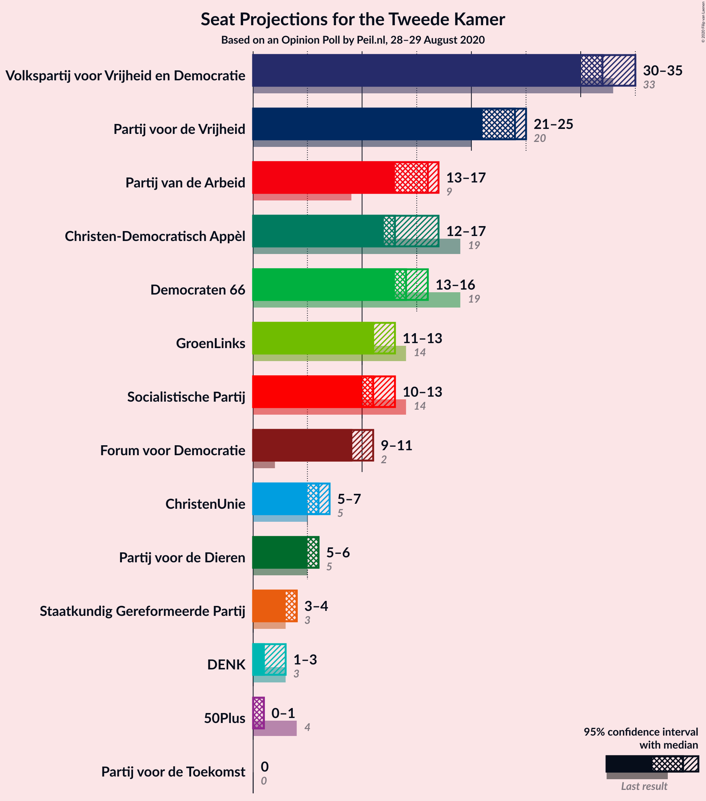
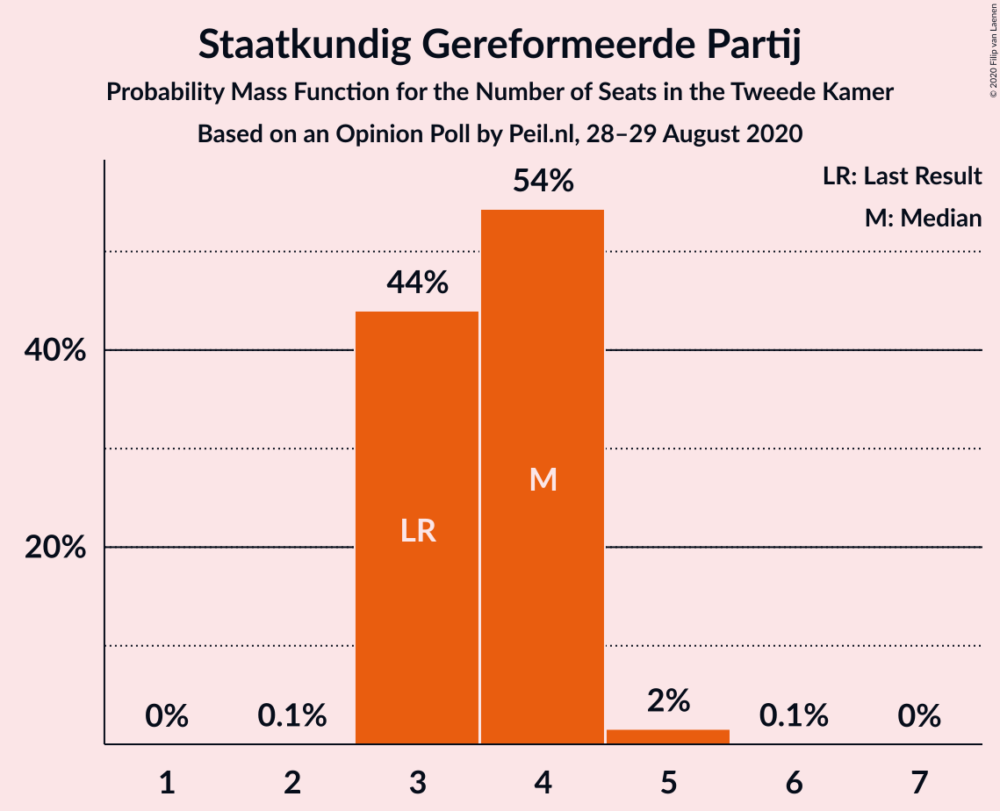
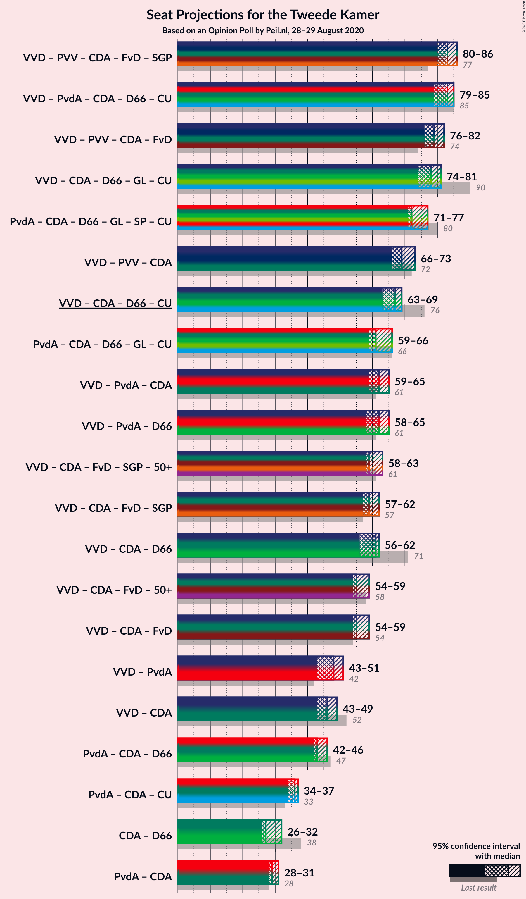
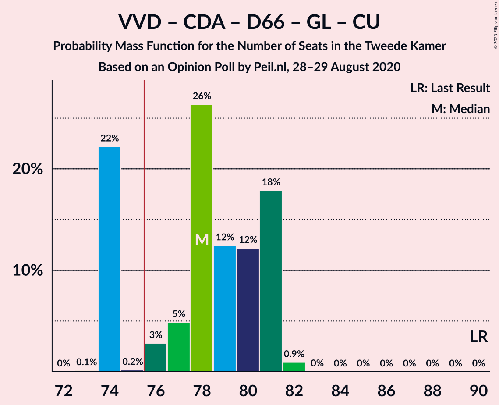
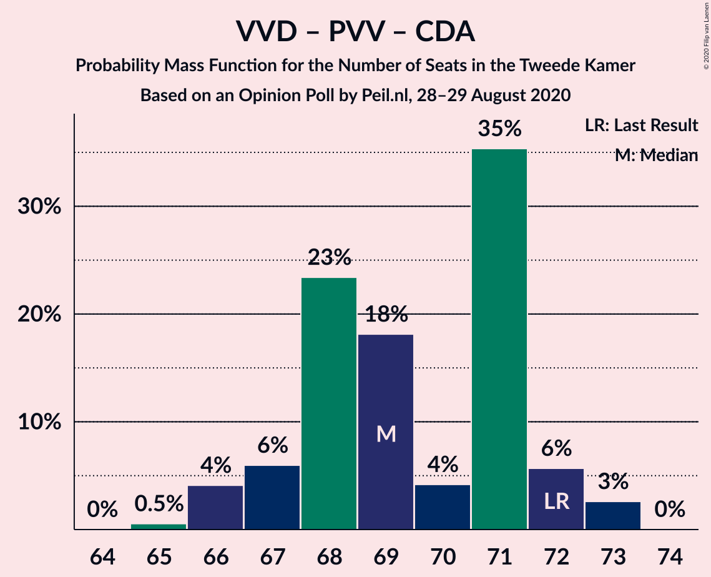
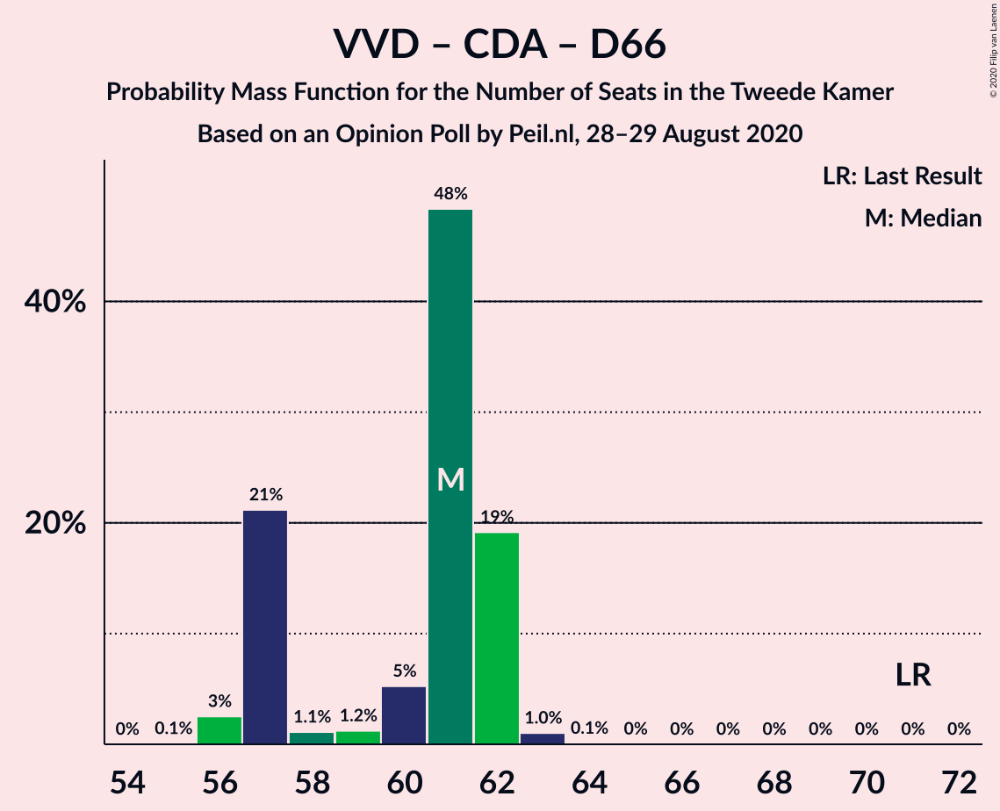

# Opinion Poll by Peil.nl, 28–29 August 2020

<a href="#voting-intentions">Voting Intentions</a> | <a href="#seats">Seats</a> | <a href="#coalitions">Coalitions</a> | <a href="#technical-information">Technical Information</a>

## Voting Intentions

### Confidence Intervals

| Party | Last Result | Poll Result | 80% Confidence Interval | 90% Confidence Interval | 95% Confidence Interval | 99% Confidence Interval |
|:-----:|:-----------:|:-----------:|:-----------------------:|:-----------------------:|:-----------------------:|:-----------------------:|
| Volkspartij voor Vrijheid en Democratie | 21.3% | 20.6% | 19.7–21.6% |19.4–21.9% |19.2–22.1% |18.7–22.6% |
| Partij voor de Vrijheid | 13.1% | 15.3% | 14.4–16.1% |14.2–16.4% |14.0–16.6% |13.6–17.0% |
| Partij van de Arbeid | 5.7% | 10.0% | 9.3–10.7% |9.1–10.9% |8.9–11.1% |8.6–11.5% |
| Christen-Democratisch Appèl | 12.4% | 9.3% | 8.6–10.0% |8.5–10.2% |8.3–10.4% |8.0–10.7% |
| Democraten 66 | 12.2% | 9.3% | 8.6–10.0% |8.5–10.2% |8.3–10.4% |8.0–10.7% |
| GroenLinks | 9.1% | 8.0% | 7.4–8.6% |7.2–8.8% |7.0–9.0% |6.8–9.3% |
| Socialistische Partij | 9.1% | 8.0% | 7.4–8.6% |7.2–8.8% |7.0–9.0% |6.8–9.3% |
| Forum voor Democratie | 1.8% | 6.6% | 6.1–7.3% |5.9–7.4% |5.8–7.6% |5.5–7.9% |
| ChristenUnie | 3.4% | 4.0% | 3.6–4.5% |3.4–4.6% |3.4–4.8% |3.2–5.0% |
| Partij voor de Dieren | 3.2% | 4.0% | 3.6–4.5% |3.4–4.6% |3.4–4.8% |3.2–5.0% |
| Staatkundig Gereformeerde Partij | 2.1% | 2.7% | 2.3–3.1% |2.2–3.2% |2.1–3.3% |2.0–3.5% |
| DENK | 2.1% | 1.3% | 1.1–1.6% |1.0–1.7% |1.0–1.8% |0.9–2.0% |
| 50Plus | 3.1% | 0.7% | 0.5–0.9% |0.5–1.0% |0.4–1.0% |0.4–1.2% |
| Partij voor de Toekomst | 0.0% | 0.2% | 0.1–0.3% |0.1–0.4% |0.1–0.4% |0.0–0.5% |

*Note:* The poll result column reflects the actual value used in the calculations. Published results may vary slightly, and in addition be rounded to fewer digits.

## Seats

### Confidence Intervals

| Party | Last Result | Median | 80% Confidence Interval | 90% Confidence Interval | 95% Confidence Interval | 99% Confidence Interval |
|:-----:|:-----------:|:------:|:-----------------------:|:-----------------------:|:-----------------------:|:-----------------------:|
| <a href="#volkspartij-voor-vrijheid-en-democratie">Volkspartij voor Vrijheid en Democratie</a> | 33 | 30 | 29–34 |29–34 |29–34 |28–35 |
| <a href="#partij-voor-de-vrijheid">Partij voor de Vrijheid</a> | 20 | 24 | 23–27 |22–27 |21–27 |20–27 |
| <a href="#partij-van-de-arbeid">Partij van de Arbeid</a> | 9 | 15 | 13–18 |13–18 |13–18 |12–18 |
| <a href="#christen-democratisch-appèl">Christen-Democratisch Appèl</a> | 19 | 14 | 12–15 |12–16 |12–16 |12–17 |
| <a href="#democraten-66">Democraten 66</a> | 19 | 14 | 12–16 |12–16 |12–16 |12–17 |
| <a href="#groenlinks">GroenLinks</a> | 14 | 13 | 11–14 |11–14 |11–14 |10–14 |
| <a href="#socialistische-partij">Socialistische Partij</a> | 14 | 13 | 11–14 |10–14 |10–14 |10–14 |
| <a href="#forum-voor-democratie">Forum voor Democratie</a> | 2 | 9 | 9–10 |9–10 |8–11 |8–13 |
| <a href="#christenunie">ChristenUnie</a> | 5 | 6 | 4–7 |4–7 |4–7 |4–7 |
| <a href="#partij-voor-de-dieren">Partij voor de Dieren</a> | 5 | 6 | 5–6 |5–7 |4–7 |4–8 |
| <a href="#staatkundig-gereformeerde-partij">Staatkundig Gereformeerde Partij</a> | 3 | 4 | 3–5 |3–5 |3–5 |2–5 |
| <a href="#denk">DENK</a> | 3 | 2 | 1–2 |1–3 |1–3 |1–3 |
| <a href="#50plus">50Plus</a> | 4 | 1 | 0–1 |0–1 |0–1 |0–1 |
| <a href="#partij-voor-de-toekomst">Partij voor de Toekomst</a> | 0 | 0 | 0 |0 |0 |0 |

### Volkspartij voor Vrijheid en Democratie

*For a full overview of the results for this party, see the [Volkspartij voor Vrijheid en Democratie](party-volkspartijvoorvrijheidendemocratie.html) page.*

| Number of Seats | Probability | Accumulated | Special Marks |
|:---------------:|:-----------:|:-----------:|:-------------:|
| 27 | 0.3% | 100% |  |
| 28 | 0.5% | 99.7% |  |
| 29 | 15% | 99.2% |  |
| 30 | 38% | 84% | Median |
| 31 | 7% | 46% |  |
| 32 | 15% | 39% |  |
| 33 | 8% | 24% | Last Result |
| 34 | 14% | 16% |  |
| 35 | 2% | 2% |  |
| 36 | 0.4% | 0.5% |  |
| 37 | 0% | 0.1% |  |
| 38 | 0.1% | 0.1% |  |
| 39 | 0% | 0% |  |

### Partij voor de Vrijheid

*For a full overview of the results for this party, see the [Partij voor de Vrijheid](party-partijvoordevrijheid.html) page.*

| Number of Seats | Probability | Accumulated | Special Marks |
|:---------------:|:-----------:|:-----------:|:-------------:|
| 19 | 0.1% | 100% |  |
| 20 | 2% | 99.9% | Last Result |
| 21 | 3% | 98% |  |
| 22 | 2% | 95% |  |
| 23 | 33% | 94% |  |
| 24 | 28% | 61% | Median |
| 25 | 4% | 33% |  |
| 26 | 5% | 29% |  |
| 27 | 24% | 24% |  |
| 28 | 0% | 0% |  |

### Partij van de Arbeid

*For a full overview of the results for this party, see the [Partij van de Arbeid](party-partijvandearbeid.html) page.*

| Number of Seats | Probability | Accumulated | Special Marks |
|:---------------:|:-----------:|:-----------:|:-------------:|
| 9 | 0% | 100% | Last Result |
| 10 | 0% | 100% |  |
| 11 | 0% | 100% |  |
| 12 | 0.5% | 100% |  |
| 13 | 15% | 99.5% |  |
| 14 | 24% | 85% |  |
| 15 | 15% | 61% | Median |
| 16 | 29% | 46% |  |
| 17 | 0.6% | 17% |  |
| 18 | 16% | 16% |  |
| 19 | 0% | 0% |  |

### Christen-Democratisch Appèl

*For a full overview of the results for this party, see the [Christen-Democratisch Appèl](party-christen-democratischappèl.html) page.*

| Number of Seats | Probability | Accumulated | Special Marks |
|:---------------:|:-----------:|:-----------:|:-------------:|
| 11 | 0.1% | 100% |  |
| 12 | 25% | 99.9% |  |
| 13 | 10% | 75% |  |
| 14 | 39% | 65% | Median |
| 15 | 21% | 26% |  |
| 16 | 5% | 5% |  |
| 17 | 0.6% | 0.6% |  |
| 18 | 0% | 0% |  |
| 19 | 0% | 0% | Last Result |

### Democraten 66

*For a full overview of the results for this party, see the [Democraten 66](party-democraten66.html) page.*

| Number of Seats | Probability | Accumulated | Special Marks |
|:---------------:|:-----------:|:-----------:|:-------------:|
| 12 | 26% | 100% |  |
| 13 | 17% | 74% |  |
| 14 | 42% | 57% | Median |
| 15 | 4% | 15% |  |
| 16 | 11% | 12% |  |
| 17 | 1.3% | 1.3% |  |
| 18 | 0% | 0% |  |
| 19 | 0% | 0% | Last Result |

### GroenLinks

*For a full overview of the results for this party, see the [GroenLinks](party-groenlinks.html) page.*

| Number of Seats | Probability | Accumulated | Special Marks |
|:---------------:|:-----------:|:-----------:|:-------------:|
| 9 | 0.4% | 100% |  |
| 10 | 0.6% | 99.6% |  |
| 11 | 28% | 99.0% |  |
| 12 | 20% | 71% |  |
| 13 | 37% | 51% | Median |
| 14 | 14% | 14% | Last Result |
| 15 | 0% | 0% |  |

### Socialistische Partij

*For a full overview of the results for this party, see the [Socialistische Partij](party-socialistischepartij.html) page.*

| Number of Seats | Probability | Accumulated | Special Marks |
|:---------------:|:-----------:|:-----------:|:-------------:|
| 9 | 0.4% | 100% |  |
| 10 | 5% | 99.6% |  |
| 11 | 14% | 95% |  |
| 12 | 22% | 80% |  |
| 13 | 32% | 59% | Median |
| 14 | 27% | 27% | Last Result |
| 15 | 0% | 0.1% |  |
| 16 | 0.1% | 0.1% |  |
| 17 | 0% | 0% |  |

### Forum voor Democratie

*For a full overview of the results for this party, see the [Forum voor Democratie](party-forumvoordemocratie.html) page.*

| Number of Seats | Probability | Accumulated | Special Marks |
|:---------------:|:-----------:|:-----------:|:-------------:|
| 2 | 0% | 100% | Last Result |
| 3 | 0% | 100% |  |
| 4 | 0% | 100% |  |
| 5 | 0% | 100% |  |
| 6 | 0% | 100% |  |
| 7 | 0.1% | 100% |  |
| 8 | 4% | 99.9% |  |
| 9 | 60% | 96% | Median |
| 10 | 32% | 36% |  |
| 11 | 2% | 4% |  |
| 12 | 0.7% | 1.2% |  |
| 13 | 0.6% | 0.6% |  |
| 14 | 0% | 0% |  |

### ChristenUnie

*For a full overview of the results for this party, see the [ChristenUnie](party-christenunie.html) page.*

| Number of Seats | Probability | Accumulated | Special Marks |
|:---------------:|:-----------:|:-----------:|:-------------:|
| 4 | 14% | 100% |  |
| 5 | 16% | 86% | Last Result |
| 6 | 39% | 70% | Median |
| 7 | 30% | 31% |  |
| 8 | 0.3% | 0.3% |  |
| 9 | 0% | 0% |  |

### Partij voor de Dieren

*For a full overview of the results for this party, see the [Partij voor de Dieren](party-partijvoordedieren.html) page.*

| Number of Seats | Probability | Accumulated | Special Marks |
|:---------------:|:-----------:|:-----------:|:-------------:|
| 4 | 4% | 100% |  |
| 5 | 17% | 96% | Last Result |
| 6 | 71% | 79% | Median |
| 7 | 6% | 8% |  |
| 8 | 1.4% | 1.4% |  |
| 9 | 0% | 0% |  |

### Staatkundig Gereformeerde Partij

*For a full overview of the results for this party, see the [Staatkundig Gereformeerde Partij](party-staatkundiggereformeerdepartij.html) page.*

| Number of Seats | Probability | Accumulated | Special Marks |
|:---------------:|:-----------:|:-----------:|:-------------:|
| 2 | 0.8% | 100% |  |
| 3 | 30% | 99.2% | Last Result |
| 4 | 58% | 69% | Median |
| 5 | 11% | 11% |  |
| 6 | 0% | 0% |  |

### DENK

*For a full overview of the results for this party, see the [DENK](party-denk.html) page.*

| Number of Seats | Probability | Accumulated | Special Marks |
|:---------------:|:-----------:|:-----------:|:-------------:|
| 1 | 42% | 100% |  |
| 2 | 52% | 58% | Median |
| 3 | 7% | 7% | Last Result |
| 4 | 0% | 0% |  |

### 50Plus

*For a full overview of the results for this party, see the [50Plus](party-50plus.html) page.*

| Number of Seats | Probability | Accumulated | Special Marks |
|:---------------:|:-----------:|:-----------:|:-------------:|
| 0 | 49% | 100% |  |
| 1 | 51% | 51% | Median |
| 2 | 0.4% | 0.4% |  |
| 3 | 0% | 0% |  |
| 4 | 0% | 0% | Last Result |

### Partij voor de Toekomst

*For a full overview of the results for this party, see the [Partij voor de Toekomst](party-partijvoordetoekomst.html) page.*

| Number of Seats | Probability | Accumulated | Special Marks |
|:---------------:|:-----------:|:-----------:|:-------------:|
| 0 | 100% | 100% | Last Result, Median |

## Coalitions

### Confidence Intervals

| Coalition | Last Result | Median | Majority? | 80% Confidence Interval | 90% Confidence Interval | 95% Confidence Interval | 99% Confidence Interval |
|:---------:|:-----------:|:------:|:---------:|:-----------------------:|:-----------------------:|:-----------------------:|:-----------------------:|
| Volkspartij voor Vrijheid en Democratie – Partij voor de Vrijheid – Christen-Democratisch Appèl – Forum voor Democratie – Staatkundig Gereformeerde Partij | 77 | 82 | 100% | 79–85 | 79–86 | 79–86 | 78–88 |
| Volkspartij voor Vrijheid en Democratie – Partij van de Arbeid – Christen-Democratisch Appèl – Democraten 66 – ChristenUnie | 85 | 79 | 100% | 78–83 | 78–83 | 78–84 | 78–86 |
| Volkspartij voor Vrijheid en Democratie – Partij voor de Vrijheid – Christen-Democratisch Appèl – Forum voor Democratie | 74 | 78 | 85% | 75–82 | 75–82 | 75–82 | 73–83 |
| Volkspartij voor Vrijheid en Democratie – Christen-Democratisch Appèl – Democraten 66 – GroenLinks – ChristenUnie | 90 | 76 | 60% | 73–82 | 73–82 | 73–82 | 73–85 |
| Partij van de Arbeid – Christen-Democratisch Appèl – Democraten 66 – GroenLinks – Socialistische Partij – ChristenUnie | 80 | 73 | 18% | 72–77 | 70–77 | 70–77 | 68–77 |
| Volkspartij voor Vrijheid en Democratie – Partij voor de Vrijheid – Christen-Democratisch Appèl | 72 | 69 | 0% | 66–72 | 66–72 | 65–73 | 64–74 |
| Volkspartij voor Vrijheid en Democratie – Christen-Democratisch Appèl – Democraten 66 – ChristenUnie | 76 | 63 | 0% | 62–69 | 62–69 | 62–70 | 61–71 |
| Partij van de Arbeid – Christen-Democratisch Appèl – Democraten 66 – GroenLinks – ChristenUnie | 66 | 60 | 0% | 59–65 | 58–65 | 58–65 | 57–66 |
| Volkspartij voor Vrijheid en Democratie – Christen-Democratisch Appèl – Democraten 66 | 71 | 56 | 0% | 55–65 | 55–65 | 55–65 | 55–65 |
| Volkspartij voor Vrijheid en Democratie – Partij van de Arbeid – Christen-Democratisch Appèl | 61 | 60 | 0% | 58–63 | 58–63 | 58–64 | 58–65 |
| Volkspartij voor Vrijheid en Democratie – Partij van de Arbeid – Democraten 66 | 61 | 60 | 0% | 57–64 | 57–64 | 57–64 | 56–66 |
| Volkspartij voor Vrijheid en Democratie – Christen-Democratisch Appèl – Forum voor Democratie – Staatkundig Gereformeerde Partij – 50Plus | 61 | 58 | 0% | 55–62 | 55–62 | 55–63 | 55–65 |
| Volkspartij voor Vrijheid en Democratie – Christen-Democratisch Appèl – Forum voor Democratie – Staatkundig Gereformeerde Partij | 57 | 57 | 0% | 55–62 | 55–62 | 55–62 | 55–64 |
| Volkspartij voor Vrijheid en Democratie – Christen-Democratisch Appèl – Forum voor Democratie – 50Plus | 58 | 54 | 0% | 51–59 | 51–59 | 51–60 | 51–61 |
| Volkspartij voor Vrijheid en Democratie – Christen-Democratisch Appèl – Forum voor Democratie | 54 | 53 | 0% | 51–59 | 51–59 | 51–59 | 51–60 |
| Volkspartij voor Vrijheid en Democratie – Christen-Democratisch Appèl | 52 | 44 | 0% | 42–49 | 42–49 | 42–50 | 42–51 |
| Volkspartij voor Vrijheid en Democratie – Partij van de Arbeid | 42 | 46 | 0% | 45–48 | 45–48 | 45–49 | 44–51 |
| Partij van de Arbeid – Christen-Democratisch Appèl – Democraten 66 | 47 | 42 | 0% | 41–45 | 40–45 | 39–45 | 39–46 |
| Partij van de Arbeid – Christen-Democratisch Appèl – ChristenUnie | 33 | 34 | 0% | 33–39 | 32–39 | 32–39 | 32–39 |
| Partij van de Arbeid – Christen-Democratisch Appèl | 28 | 28 | 0% | 28–32 | 26–32 | 26–32 | 26–32 |
| Christen-Democratisch Appèl – Democraten 66 | 38 | 26 | 0% | 26–31 | 26–31 | 26–31 | 25–31 |

### Volkspartij voor Vrijheid en Democratie – Partij voor de Vrijheid – Christen-Democratisch Appèl – Forum voor Democratie – Staatkundig Gereformeerde Partij

| Number of Seats | Probability | Accumulated | Special Marks |
|:---------------:|:-----------:|:-----------:|:-------------:|
| 77 | 0% | 100% | Last Result |
| 78 | 2% | 100% |  |
| 79 | 13% | 98% |  |
| 80 | 4% | 85% |  |
| 81 | 14% | 81% | Median |
| 82 | 30% | 67% |  |
| 83 | 3% | 38% |  |
| 84 | 12% | 34% |  |
| 85 | 16% | 22% |  |
| 86 | 5% | 6% |  |
| 87 | 0% | 0.7% |  |
| 88 | 0.7% | 0.7% |  |
| 89 | 0% | 0% |  |

### Volkspartij voor Vrijheid en Democratie – Partij van de Arbeid – Christen-Democratisch Appèl – Democraten 66 – ChristenUnie

| Number of Seats | Probability | Accumulated | Special Marks |
|:---------------:|:-----------:|:-----------:|:-------------:|
| 76 | 0.3% | 100% | Majority |
| 77 | 0% | 99.6% |  |
| 78 | 43% | 99.6% |  |
| 79 | 16% | 56% | Median |
| 80 | 19% | 40% |  |
| 81 | 5% | 21% |  |
| 82 | 2% | 16% |  |
| 83 | 11% | 14% |  |
| 84 | 1.3% | 3% |  |
| 85 | 0.1% | 1.4% | Last Result |
| 86 | 1.4% | 1.4% |  |
| 87 | 0% | 0% |  |

### Volkspartij voor Vrijheid en Democratie – Partij voor de Vrijheid – Christen-Democratisch Appèl – Forum voor Democratie

| Number of Seats | Probability | Accumulated | Special Marks |
|:---------------:|:-----------:|:-----------:|:-------------:|
| 73 | 1.2% | 100% |  |
| 74 | 0.6% | 98.8% | Last Result |
| 75 | 13% | 98% |  |
| 76 | 0.8% | 85% | Majority |
| 77 | 15% | 84% | Median |
| 78 | 30% | 69% |  |
| 79 | 5% | 39% |  |
| 80 | 5% | 34% |  |
| 81 | 16% | 29% |  |
| 82 | 11% | 13% |  |
| 83 | 2% | 2% |  |
| 84 | 0% | 0.4% |  |
| 85 | 0.4% | 0.4% |  |
| 86 | 0% | 0% |  |

### Volkspartij voor Vrijheid en Democratie – Christen-Democratisch Appèl – Democraten 66 – GroenLinks – ChristenUnie

| Number of Seats | Probability | Accumulated | Special Marks |
|:---------------:|:-----------:|:-----------:|:-------------:|
| 71 | 0.2% | 100% |  |
| 72 | 0% | 99.8% |  |
| 73 | 24% | 99.8% |  |
| 74 | 0.1% | 76% |  |
| 75 | 16% | 76% |  |
| 76 | 15% | 60% | Majority |
| 77 | 8% | 45% | Median |
| 78 | 11% | 37% |  |
| 79 | 11% | 26% |  |
| 80 | 2% | 15% |  |
| 81 | 0.7% | 14% |  |
| 82 | 12% | 13% |  |
| 83 | 0.2% | 0.9% |  |
| 84 | 0.1% | 0.7% |  |
| 85 | 0.6% | 0.6% |  |
| 86 | 0% | 0% |  |
| 87 | 0% | 0% |  |
| 88 | 0% | 0% |  |
| 89 | 0% | 0% |  |
| 90 | 0% | 0% | Last Result |

### Partij van de Arbeid – Christen-Democratisch Appèl – Democraten 66 – GroenLinks – Socialistische Partij – ChristenUnie

| Number of Seats | Probability | Accumulated | Special Marks |
|:---------------:|:-----------:|:-----------:|:-------------:|
| 68 | 0.5% | 100% |  |
| 69 | 0.4% | 99.5% |  |
| 70 | 5% | 99.1% |  |
| 71 | 3% | 94% |  |
| 72 | 35% | 91% |  |
| 73 | 12% | 56% |  |
| 74 | 24% | 45% |  |
| 75 | 2% | 21% | Median |
| 76 | 6% | 18% | Majority |
| 77 | 13% | 13% |  |
| 78 | 0.1% | 0.3% |  |
| 79 | 0.2% | 0.2% |  |
| 80 | 0% | 0% | Last Result |

### Volkspartij voor Vrijheid en Democratie – Partij voor de Vrijheid – Christen-Democratisch Appèl

| Number of Seats | Probability | Accumulated | Special Marks |
|:---------------:|:-----------:|:-----------:|:-------------:|
| 64 | 0.8% | 100% |  |
| 65 | 3% | 99.2% |  |
| 66 | 12% | 97% |  |
| 67 | 4% | 85% |  |
| 68 | 12% | 80% | Median |
| 69 | 33% | 68% |  |
| 70 | 3% | 35% |  |
| 71 | 18% | 33% |  |
| 72 | 11% | 14% | Last Result |
| 73 | 2% | 4% |  |
| 74 | 2% | 2% |  |
| 75 | 0% | 0% |  |

### Volkspartij voor Vrijheid en Democratie – Christen-Democratisch Appèl – Democraten 66 – ChristenUnie

| Number of Seats | Probability | Accumulated | Special Marks |
|:---------------:|:-----------:|:-----------:|:-------------:|
| 60 | 0.2% | 100% |  |
| 61 | 0.4% | 99.8% |  |
| 62 | 39% | 99.4% |  |
| 63 | 12% | 60% |  |
| 64 | 4% | 48% | Median |
| 65 | 14% | 43% |  |
| 66 | 12% | 30% |  |
| 67 | 3% | 17% |  |
| 68 | 0.5% | 14% |  |
| 69 | 11% | 13% |  |
| 70 | 2% | 3% |  |
| 71 | 0.7% | 0.8% |  |
| 72 | 0.1% | 0.1% |  |
| 73 | 0% | 0% |  |
| 74 | 0% | 0% |  |
| 75 | 0% | 0% |  |
| 76 | 0% | 0% | Last Result, Majority |

### Partij van de Arbeid – Christen-Democratisch Appèl – Democraten 66 – GroenLinks – ChristenUnie

| Number of Seats | Probability | Accumulated | Special Marks |
|:---------------:|:-----------:|:-----------:|:-------------:|
| 56 | 0.4% | 100% |  |
| 57 | 0.8% | 99.6% |  |
| 58 | 5% | 98.8% |  |
| 59 | 30% | 94% |  |
| 60 | 28% | 64% |  |
| 61 | 0.8% | 36% |  |
| 62 | 15% | 35% | Median |
| 63 | 3% | 20% |  |
| 64 | 4% | 17% |  |
| 65 | 12% | 13% |  |
| 66 | 0.6% | 0.7% | Last Result |
| 67 | 0% | 0% |  |

### Volkspartij voor Vrijheid en Democratie – Christen-Democratisch Appèl – Democraten 66

| Number of Seats | Probability | Accumulated | Special Marks |
|:---------------:|:-----------:|:-----------:|:-------------:|
| 54 | 0.3% | 100% |  |
| 55 | 12% | 99.7% |  |
| 56 | 39% | 88% |  |
| 57 | 0.9% | 48% |  |
| 58 | 5% | 47% | Median |
| 59 | 8% | 42% |  |
| 60 | 6% | 35% |  |
| 61 | 13% | 28% |  |
| 62 | 2% | 16% |  |
| 63 | 0.9% | 14% |  |
| 64 | 2% | 13% |  |
| 65 | 11% | 11% |  |
| 66 | 0.1% | 0.1% |  |
| 67 | 0% | 0% |  |
| 68 | 0% | 0% |  |
| 69 | 0% | 0% |  |
| 70 | 0% | 0% |  |
| 71 | 0% | 0% | Last Result |

### Volkspartij voor Vrijheid en Democratie – Partij van de Arbeid – Christen-Democratisch Appèl

| Number of Seats | Probability | Accumulated | Special Marks |
|:---------------:|:-----------:|:-----------:|:-------------:|
| 56 | 0.3% | 100% |  |
| 57 | 0% | 99.7% |  |
| 58 | 24% | 99.6% |  |
| 59 | 22% | 75% | Median |
| 60 | 17% | 53% |  |
| 61 | 18% | 36% | Last Result |
| 62 | 3% | 19% |  |
| 63 | 11% | 16% |  |
| 64 | 3% | 5% |  |
| 65 | 2% | 2% |  |
| 66 | 0% | 0% |  |

### Volkspartij voor Vrijheid en Democratie – Partij van de Arbeid – Democraten 66

| Number of Seats | Probability | Accumulated | Special Marks |
|:---------------:|:-----------:|:-----------:|:-------------:|
| 55 | 0.3% | 100% |  |
| 56 | 0.2% | 99.7% |  |
| 57 | 11% | 99.4% |  |
| 58 | 4% | 88% |  |
| 59 | 27% | 84% | Median |
| 60 | 37% | 57% |  |
| 61 | 2% | 19% | Last Result |
| 62 | 2% | 17% |  |
| 63 | 3% | 15% |  |
| 64 | 11% | 12% |  |
| 65 | 0.1% | 1.4% |  |
| 66 | 1.2% | 1.3% |  |
| 67 | 0.1% | 0.1% |  |
| 68 | 0% | 0% |  |

### Volkspartij voor Vrijheid en Democratie – Christen-Democratisch Appèl – Forum voor Democratie – Staatkundig Gereformeerde Partij – 50Plus

| Number of Seats | Probability | Accumulated | Special Marks |
|:---------------:|:-----------:|:-----------:|:-------------:|
| 55 | 24% | 100% |  |
| 56 | 3% | 76% |  |
| 57 | 15% | 73% |  |
| 58 | 13% | 59% | Median |
| 59 | 7% | 45% |  |
| 60 | 5% | 39% |  |
| 61 | 16% | 34% | Last Result |
| 62 | 13% | 18% |  |
| 63 | 3% | 4% |  |
| 64 | 0% | 1.2% |  |
| 65 | 0.8% | 1.2% |  |
| 66 | 0.3% | 0.3% |  |
| 67 | 0% | 0% |  |

### Volkspartij voor Vrijheid en Democratie – Christen-Democratisch Appèl – Forum voor Democratie – Staatkundig Gereformeerde Partij

| Number of Seats | Probability | Accumulated | Special Marks |
|:---------------:|:-----------:|:-----------:|:-------------:|
| 55 | 24% | 100% |  |
| 56 | 16% | 76% |  |
| 57 | 15% | 60% | Last Result, Median |
| 58 | 2% | 45% |  |
| 59 | 10% | 43% |  |
| 60 | 12% | 34% |  |
| 61 | 7% | 22% |  |
| 62 | 13% | 15% |  |
| 63 | 0.6% | 2% |  |
| 64 | 0.8% | 1.2% |  |
| 65 | 0.3% | 0.4% |  |
| 66 | 0% | 0% |  |

### Volkspartij voor Vrijheid en Democratie – Christen-Democratisch Appèl – Forum voor Democratie – 50Plus

| Number of Seats | Probability | Accumulated | Special Marks |
|:---------------:|:-----------:|:-----------:|:-------------:|
| 51 | 24% | 100% |  |
| 52 | 0% | 76% |  |
| 53 | 18% | 76% |  |
| 54 | 17% | 58% | Median |
| 55 | 1.1% | 42% |  |
| 56 | 10% | 41% |  |
| 57 | 4% | 31% |  |
| 58 | 11% | 27% | Last Result |
| 59 | 13% | 16% |  |
| 60 | 3% | 4% |  |
| 61 | 0.3% | 0.7% |  |
| 62 | 0.4% | 0.4% |  |
| 63 | 0% | 0% |  |

### Volkspartij voor Vrijheid en Democratie – Christen-Democratisch Appèl – Forum voor Democratie

| Number of Seats | Probability | Accumulated | Special Marks |
|:---------------:|:-----------:|:-----------:|:-------------:|
| 51 | 24% | 100% |  |
| 52 | 14% | 76% |  |
| 53 | 16% | 62% | Median |
| 54 | 5% | 46% | Last Result |
| 55 | 7% | 41% |  |
| 56 | 7% | 34% |  |
| 57 | 11% | 27% |  |
| 58 | 3% | 17% |  |
| 59 | 13% | 14% |  |
| 60 | 1.0% | 1.4% |  |
| 61 | 0.4% | 0.4% |  |
| 62 | 0% | 0% |  |

### Volkspartij voor Vrijheid en Democratie – Christen-Democratisch Appèl

| Number of Seats | Probability | Accumulated | Special Marks |
|:---------------:|:-----------:|:-----------:|:-------------:|
| 41 | 0.3% | 100% |  |
| 42 | 25% | 99.7% |  |
| 43 | 16% | 75% |  |
| 44 | 13% | 59% | Median |
| 45 | 6% | 46% |  |
| 46 | 12% | 40% |  |
| 47 | 12% | 28% |  |
| 48 | 0.9% | 16% |  |
| 49 | 12% | 15% |  |
| 50 | 2% | 3% |  |
| 51 | 0.6% | 0.7% |  |
| 52 | 0% | 0% | Last Result |

### Volkspartij voor Vrijheid en Democratie – Partij van de Arbeid

| Number of Seats | Probability | Accumulated | Special Marks |
|:---------------:|:-----------:|:-----------:|:-------------:|
| 42 | 0.3% | 100% | Last Result |
| 43 | 0.1% | 99.6% |  |
| 44 | 0.9% | 99.5% |  |
| 45 | 25% | 98.6% | Median |
| 46 | 35% | 73% |  |
| 47 | 20% | 38% |  |
| 48 | 15% | 18% |  |
| 49 | 0.9% | 3% |  |
| 50 | 0.6% | 2% |  |
| 51 | 2% | 2% |  |
| 52 | 0.1% | 0.1% |  |
| 53 | 0% | 0% |  |

### Partij van de Arbeid – Christen-Democratisch Appèl – Democraten 66

| Number of Seats | Probability | Accumulated | Special Marks |
|:---------------:|:-----------:|:-----------:|:-------------:|
| 37 | 0.4% | 100% |  |
| 38 | 0% | 99.6% |  |
| 39 | 4% | 99.6% |  |
| 40 | 2% | 95% |  |
| 41 | 17% | 93% |  |
| 42 | 40% | 76% |  |
| 43 | 2% | 36% | Median |
| 44 | 15% | 34% |  |
| 45 | 17% | 19% |  |
| 46 | 2% | 2% |  |
| 47 | 0.3% | 0.4% | Last Result |
| 48 | 0% | 0.1% |  |
| 49 | 0% | 0% |  |

### Partij van de Arbeid – Christen-Democratisch Appèl – ChristenUnie

| Number of Seats | Probability | Accumulated | Special Marks |
|:---------------:|:-----------:|:-----------:|:-------------:|
| 31 | 0% | 100% |  |
| 32 | 9% | 99.9% |  |
| 33 | 23% | 91% | Last Result |
| 34 | 27% | 68% |  |
| 35 | 6% | 42% | Median |
| 36 | 17% | 35% |  |
| 37 | 2% | 18% |  |
| 38 | 4% | 16% |  |
| 39 | 12% | 12% |  |
| 40 | 0.1% | 0.1% |  |
| 41 | 0% | 0% |  |

### Partij van de Arbeid – Christen-Democratisch Appèl

| Number of Seats | Probability | Accumulated | Special Marks |
|:---------------:|:-----------:|:-----------:|:-------------:|
| 25 | 0.4% | 100% |  |
| 26 | 5% | 99.6% |  |
| 27 | 2% | 95% |  |
| 28 | 44% | 93% | Last Result |
| 29 | 25% | 49% | Median |
| 30 | 6% | 24% |  |
| 31 | 1.4% | 18% |  |
| 32 | 17% | 17% |  |
| 33 | 0.1% | 0.1% |  |
| 34 | 0% | 0% |  |

### Christen-Democratisch Appèl – Democraten 66

| Number of Seats | Probability | Accumulated | Special Marks |
|:---------------:|:-----------:|:-----------:|:-------------:|
| 24 | 0.4% | 100% |  |
| 25 | 1.2% | 99.6% |  |
| 26 | 54% | 98% |  |
| 27 | 9% | 44% |  |
| 28 | 7% | 35% | Median |
| 29 | 13% | 28% |  |
| 30 | 3% | 15% |  |
| 31 | 11% | 11% |  |
| 32 | 0.3% | 0.3% |  |
| 33 | 0% | 0% |  |
| 34 | 0% | 0% |  |
| 35 | 0% | 0% |  |
| 36 | 0% | 0% |  |
| 37 | 0% | 0% |  |
| 38 | 0% | 0% | Last Result |

## Technical Information

### Opinion Poll

+ **Polling firm:** Peil.nl
+ **Commissioner(s):** —
+ **Fieldwork period:** 28–29 August 2020

### Calculations

+ **Sample size:** 3000
+ **Simulations done:** 131,072
+ **Error estimate:** 2.67%

