# Opinion Poll by Peil.nl, 4–5 September 2020

<a href="#voting-intentions">Voting Intentions</a> | <a href="#seats">Seats</a> | <a href="#coalitions">Coalitions</a> | <a href="#technical-information">Technical Information</a>

## Voting Intentions

### Confidence Intervals

| Party | Last Result | Poll Result | 80% Confidence Interval | 90% Confidence Interval | 95% Confidence Interval | 99% Confidence Interval |
|:-----:|:-----------:|:-----------:|:-----------------------:|:-----------------------:|:-----------------------:|:-----------------------:|
| Volkspartij voor Vrijheid en Democratie | 21.3% | 21.3% | 20.3–22.3% |20.1–22.5% |19.8–22.8% |19.4–23.3% |
| Partij voor de Vrijheid | 13.1% | 15.9% | 15.1–16.8% |14.9–17.1% |14.7–17.3% |14.3–17.7% |
| Democraten 66 | 12.2% | 9.3% | 8.6–10.0% |8.5–10.2% |8.3–10.4% |8.0–10.7% |
| Partij van de Arbeid | 5.7% | 9.3% | 8.6–10.0% |8.5–10.2% |8.3–10.4% |8.0–10.7% |
| Christen-Democratisch Appèl | 12.4% | 8.6% | 8.0–9.3% |7.8–9.5% |7.7–9.7% |7.4–10.0% |
| GroenLinks | 9.1% | 8.0% | 7.4–8.6% |7.2–8.8% |7.0–9.0% |6.8–9.3% |
| Socialistische Partij | 9.1% | 7.3% | 6.7–8.0% |6.6–8.1% |6.4–8.3% |6.1–8.6% |
| Forum voor Democratie | 1.8% | 6.6% | 6.1–7.3% |5.9–7.4% |5.8–7.6% |5.5–7.9% |
| Partij voor de Dieren | 3.2% | 4.7% | 4.2–5.2% |4.1–5.3% |4.0–5.5% |3.7–5.8% |
| ChristenUnie | 3.4% | 4.0% | 3.6–4.5% |3.4–4.6% |3.4–4.8% |3.2–5.0% |
| Staatkundig Gereformeerde Partij | 2.1% | 2.7% | 2.3–3.1% |2.2–3.2% |2.1–3.3% |2.0–3.5% |
| DENK | 2.1% | 1.3% | 1.1–1.6% |1.0–1.7% |1.0–1.8% |0.9–2.0% |
| 50Plus | 3.1% | 0.7% | 0.5–0.9% |0.5–1.0% |0.4–1.0% |0.4–1.2% |
| Partij voor de Toekomst | 0.0% | 0.2% | 0.1–0.3% |0.1–0.4% |0.1–0.4% |0.0–0.5% |

*Note:* The poll result column reflects the actual value used in the calculations. Published results may vary slightly, and in addition be rounded to fewer digits.

## Seats

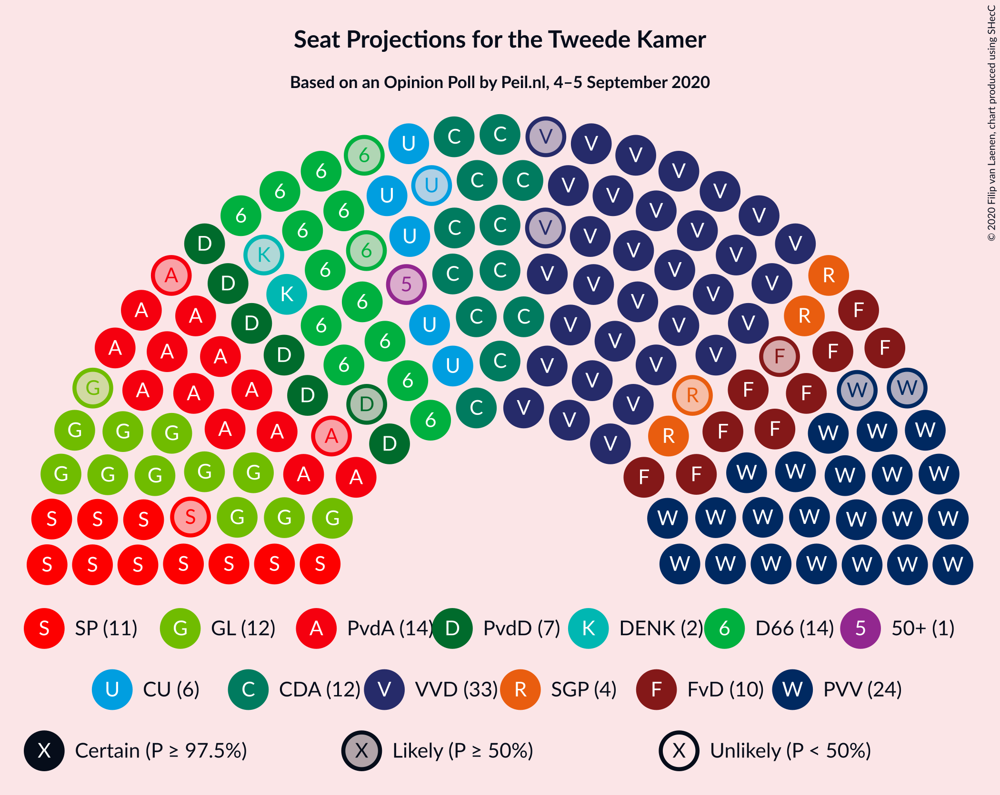

### Confidence Intervals

| Party | Last Result | Median | 80% Confidence Interval | 90% Confidence Interval | 95% Confidence Interval | 99% Confidence Interval |
|:-----:|:-----------:|:------:|:-----------------------:|:-----------------------:|:-----------------------:|:-----------------------:|
| <a href="#volkspartij-voor-vrijheid-en-democratie">Volkspartij voor Vrijheid en Democratie</a> | 33 | 31 | 31–35 |31–35 |30–35 |30–36 |
| <a href="#partij-voor-de-vrijheid">Partij voor de Vrijheid</a> | 20 | 26 | 23–27 |23–27 |22–27 |22–28 |
| <a href="#democraten-66">Democraten 66</a> | 19 | 14 | 12–15 |12–15 |12–16 |12–16 |
| <a href="#partij-van-de-arbeid">Partij van de Arbeid</a> | 9 | 14 | 12–15 |12–15 |12–15 |12–16 |
| <a href="#christen-democratisch-appèl">Christen-Democratisch Appèl</a> | 19 | 14 | 12–14 |12–15 |12–15 |11–16 |
| <a href="#groenlinks">GroenLinks</a> | 14 | 12 | 11–13 |11–14 |11–14 |10–14 |
| <a href="#socialistische-partij">Socialistische Partij</a> | 14 | 11 | 10–13 |10–13 |10–13 |10–13 |
| <a href="#forum-voor-democratie">Forum voor Democratie</a> | 2 | 9 | 8–10 |8–11 |8–12 |8–12 |
| <a href="#partij-voor-de-dieren">Partij voor de Dieren</a> | 5 | 7 | 5–7 |5–7 |5–8 |5–8 |
| <a href="#christenunie">ChristenUnie</a> | 5 | 6 | 5–6 |5–6 |5–7 |3–7 |
| <a href="#staatkundig-gereformeerde-partij">Staatkundig Gereformeerde Partij</a> | 3 | 3 | 3–5 |3–5 |3–5 |2–6 |
| <a href="#denk">DENK</a> | 3 | 1 | 1–2 |1–2 |1–3 |1–3 |
| <a href="#50plus">50Plus</a> | 4 | 1 | 0–1 |0–1 |0–1 |0–2 |
| <a href="#partij-voor-de-toekomst">Partij voor de Toekomst</a> | 0 | 0 | 0 |0 |0 |0 |

### Volkspartij voor Vrijheid en Democratie

*For a full overview of the results for this party, see the [Volkspartij voor Vrijheid en Democratie](party-volkspartijvoorvrijheidendemocratie.html) page.*

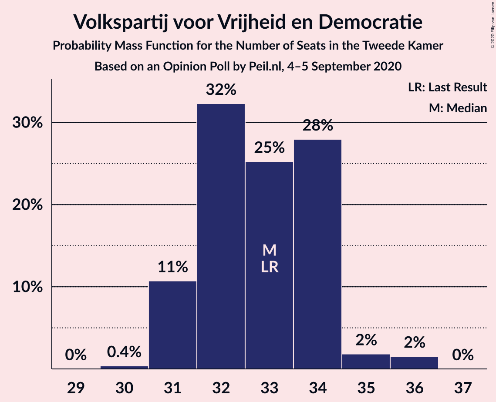

| Number of Seats | Probability | Accumulated | Special Marks |
|:---------------:|:-----------:|:-----------:|:-------------:|
| 29 | 0.1% | 100% |  |
| 30 | 3% | 99.9% |  |
| 31 | 49% | 97% | Median |
| 32 | 9% | 48% |  |
| 33 | 3% | 39% | Last Result |
| 34 | 20% | 36% |  |
| 35 | 16% | 16% |  |
| 36 | 0.3% | 0.7% |  |
| 37 | 0.1% | 0.4% |  |
| 38 | 0.3% | 0.3% |  |
| 39 | 0% | 0% |  |

### Partij voor de Vrijheid

*For a full overview of the results for this party, see the [Partij voor de Vrijheid](party-partijvoordevrijheid.html) page.*

| Number of Seats | Probability | Accumulated | Special Marks |
|:---------------:|:-----------:|:-----------:|:-------------:|
| 20 | 0% | 100% | Last Result |
| 21 | 0% | 100% |  |
| 22 | 4% | 99.9% |  |
| 23 | 14% | 96% |  |
| 24 | 14% | 82% |  |
| 25 | 14% | 68% |  |
| 26 | 33% | 54% | Median |
| 27 | 20% | 21% |  |
| 28 | 0.4% | 0.5% |  |
| 29 | 0.1% | 0.1% |  |
| 30 | 0% | 0% |  |

### Democraten 66

*For a full overview of the results for this party, see the [Democraten 66](party-democraten66.html) page.*

| Number of Seats | Probability | Accumulated | Special Marks |
|:---------------:|:-----------:|:-----------:|:-------------:|
| 11 | 0.3% | 100% |  |
| 12 | 11% | 99.7% |  |
| 13 | 5% | 89% |  |
| 14 | 69% | 84% | Median |
| 15 | 12% | 15% |  |
| 16 | 3% | 3% |  |
| 17 | 0.1% | 0.1% |  |
| 18 | 0% | 0% |  |
| 19 | 0% | 0% | Last Result |

### Partij van de Arbeid

*For a full overview of the results for this party, see the [Partij van de Arbeid](party-partijvandearbeid.html) page.*

| Number of Seats | Probability | Accumulated | Special Marks |
|:---------------:|:-----------:|:-----------:|:-------------:|
| 9 | 0% | 100% | Last Result |
| 10 | 0% | 100% |  |
| 11 | 0% | 100% |  |
| 12 | 17% | 100% |  |
| 13 | 33% | 83% |  |
| 14 | 10% | 50% | Median |
| 15 | 40% | 41% |  |
| 16 | 0.7% | 1.0% |  |
| 17 | 0.3% | 0.4% |  |
| 18 | 0% | 0% |  |

### Christen-Democratisch Appèl

*For a full overview of the results for this party, see the [Christen-Democratisch Appèl](party-christen-democratischappèl.html) page.*

| Number of Seats | Probability | Accumulated | Special Marks |
|:---------------:|:-----------:|:-----------:|:-------------:|
| 10 | 0.1% | 100% |  |
| 11 | 0.8% | 99.9% |  |
| 12 | 21% | 99.1% |  |
| 13 | 5% | 78% |  |
| 14 | 67% | 73% | Median |
| 15 | 6% | 7% |  |
| 16 | 0.8% | 0.8% |  |
| 17 | 0% | 0% |  |
| 18 | 0% | 0% |  |
| 19 | 0% | 0% | Last Result |

### GroenLinks

*For a full overview of the results for this party, see the [GroenLinks](party-groenlinks.html) page.*

| Number of Seats | Probability | Accumulated | Special Marks |
|:---------------:|:-----------:|:-----------:|:-------------:|
| 10 | 1.1% | 100% |  |
| 11 | 15% | 98.9% |  |
| 12 | 37% | 84% | Median |
| 13 | 37% | 47% |  |
| 14 | 10% | 10% | Last Result |
| 15 | 0% | 0.1% |  |
| 16 | 0% | 0% |  |

### Socialistische Partij

*For a full overview of the results for this party, see the [Socialistische Partij](party-socialistischepartij.html) page.*

| Number of Seats | Probability | Accumulated | Special Marks |
|:---------------:|:-----------:|:-----------:|:-------------:|
| 8 | 0.1% | 100% |  |
| 9 | 0.1% | 99.9% |  |
| 10 | 14% | 99.8% |  |
| 11 | 36% | 85% | Median |
| 12 | 14% | 49% |  |
| 13 | 36% | 36% |  |
| 14 | 0% | 0% | Last Result |

### Forum voor Democratie

*For a full overview of the results for this party, see the [Forum voor Democratie](party-forumvoordemocratie.html) page.*

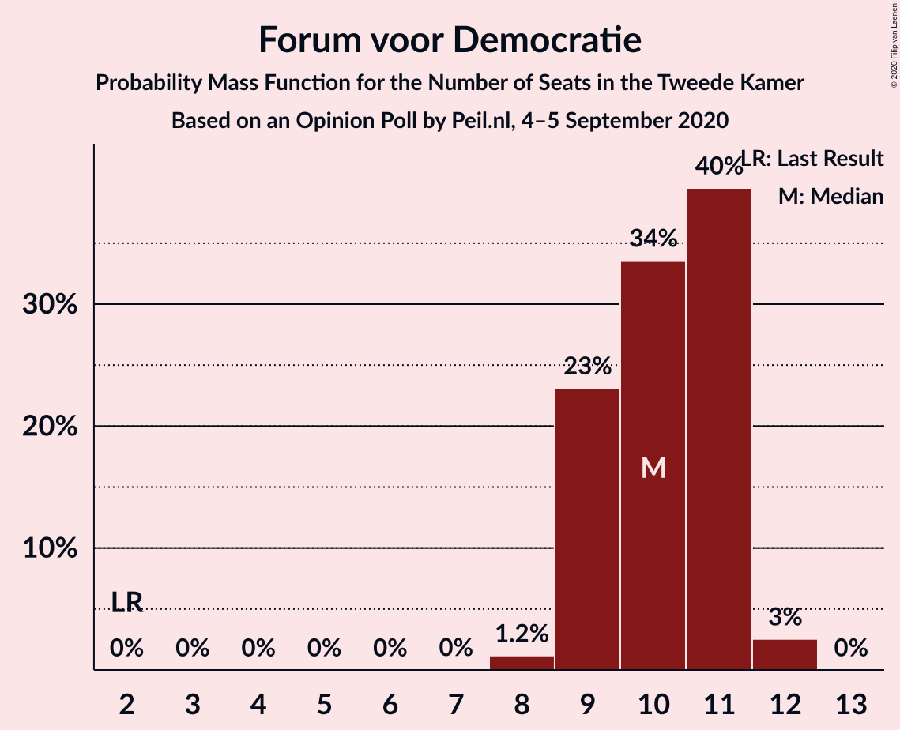

| Number of Seats | Probability | Accumulated | Special Marks |
|:---------------:|:-----------:|:-----------:|:-------------:|
| 2 | 0% | 100% | Last Result |
| 3 | 0% | 100% |  |
| 4 | 0% | 100% |  |
| 5 | 0% | 100% |  |
| 6 | 0% | 100% |  |
| 7 | 0.1% | 100% |  |
| 8 | 22% | 99.9% |  |
| 9 | 33% | 78% | Median |
| 10 | 35% | 45% |  |
| 11 | 6% | 10% |  |
| 12 | 4% | 4% |  |
| 13 | 0% | 0% |  |

### Partij voor de Dieren

*For a full overview of the results for this party, see the [Partij voor de Dieren](party-partijvoordedieren.html) page.*

| Number of Seats | Probability | Accumulated | Special Marks |
|:---------------:|:-----------:|:-----------:|:-------------:|
| 5 | 26% | 100% | Last Result |
| 6 | 13% | 74% |  |
| 7 | 56% | 61% | Median |
| 8 | 5% | 5% |  |
| 9 | 0.3% | 0.3% |  |
| 10 | 0% | 0% |  |

### ChristenUnie

*For a full overview of the results for this party, see the [ChristenUnie](party-christenunie.html) page.*

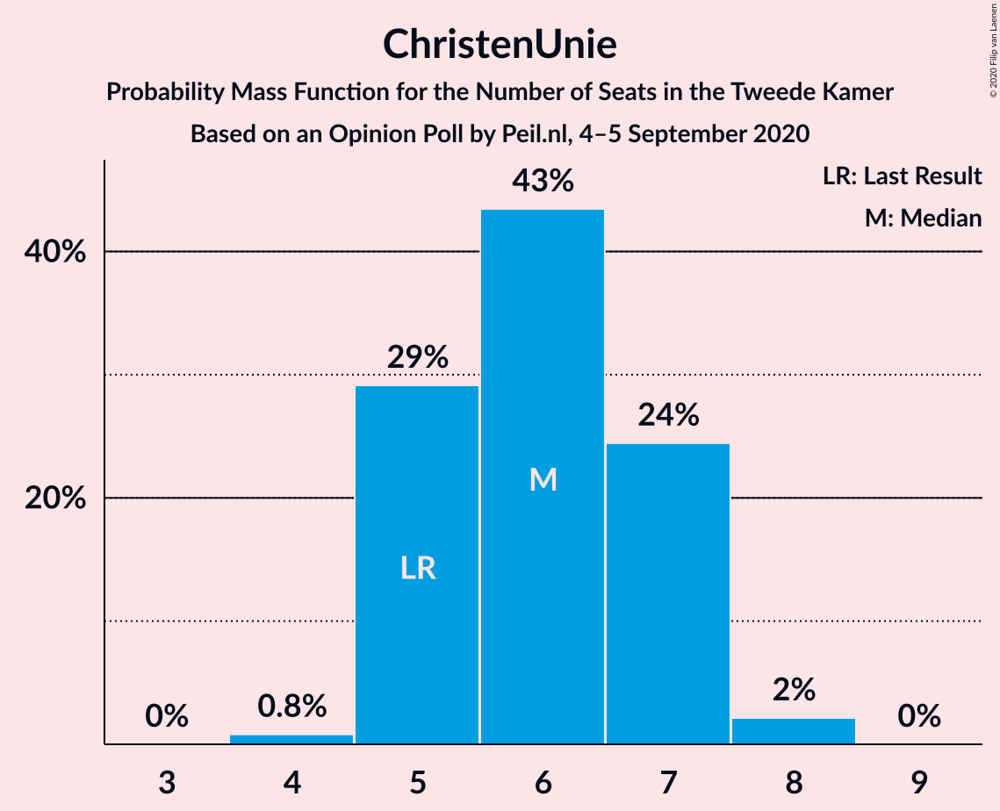

| Number of Seats | Probability | Accumulated | Special Marks |
|:---------------:|:-----------:|:-----------:|:-------------:|
| 3 | 0.7% | 100% |  |
| 4 | 0.3% | 99.3% |  |
| 5 | 39% | 99.0% | Last Result |
| 6 | 55% | 60% | Median |
| 7 | 5% | 5% |  |
| 8 | 0% | 0% |  |

### Staatkundig Gereformeerde Partij

*For a full overview of the results for this party, see the [Staatkundig Gereformeerde Partij](party-staatkundiggereformeerdepartij.html) page.*

| Number of Seats | Probability | Accumulated | Special Marks |
|:---------------:|:-----------:|:-----------:|:-------------:|
| 2 | 0.6% | 100% |  |
| 3 | 64% | 99.4% | Last Result, Median |
| 4 | 22% | 35% |  |
| 5 | 11% | 13% |  |
| 6 | 2% | 2% |  |
| 7 | 0% | 0% |  |

### DENK

*For a full overview of the results for this party, see the [DENK](party-denk.html) page.*

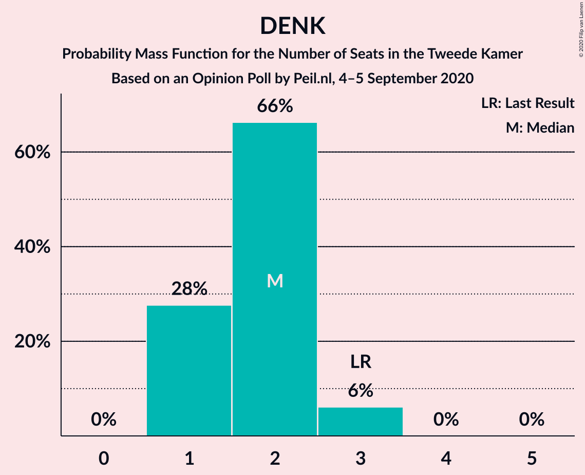

| Number of Seats | Probability | Accumulated | Special Marks |
|:---------------:|:-----------:|:-----------:|:-------------:|
| 1 | 72% | 100% | Median |
| 2 | 24% | 28% |  |
| 3 | 4% | 4% | Last Result |
| 4 | 0% | 0% |  |

### 50Plus

*For a full overview of the results for this party, see the [50Plus](party-50plus.html) page.*

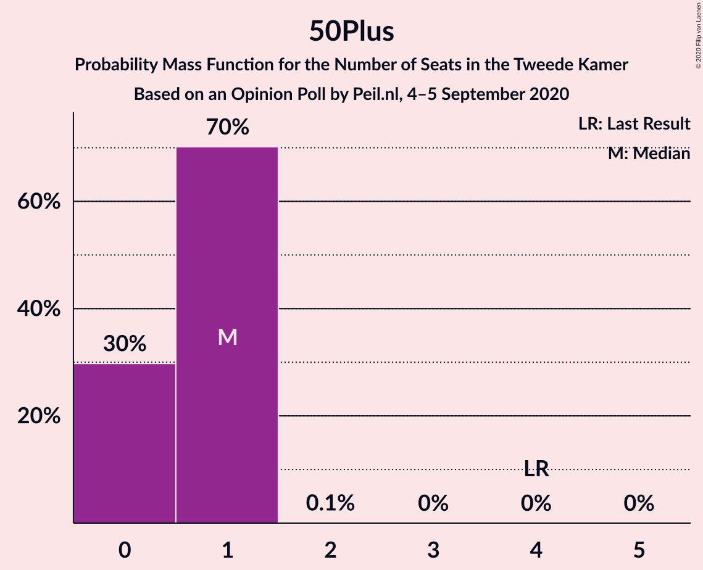

| Number of Seats | Probability | Accumulated | Special Marks |
|:---------------:|:-----------:|:-----------:|:-------------:|
| 0 | 15% | 100% |  |
| 1 | 85% | 85% | Median |
| 2 | 0.6% | 0.6% |  |
| 3 | 0% | 0% |  |
| 4 | 0% | 0% | Last Result |

### Partij voor de Toekomst

*For a full overview of the results for this party, see the [Partij voor de Toekomst](party-partijvoordetoekomst.html) page.*

| Number of Seats | Probability | Accumulated | Special Marks |
|:---------------:|:-----------:|:-----------:|:-------------:|
| 0 | 100% | 100% | Last Result, Median |

## Coalitions

### Confidence Intervals

| Coalition | Last Result | Median | Majority? | 80% Confidence Interval | 90% Confidence Interval | 95% Confidence Interval | 99% Confidence Interval |
|:---------:|:-----------:|:------:|:---------:|:-----------------------:|:-----------------------:|:-----------------------:|:-----------------------:|
| Volkspartij voor Vrijheid en Democratie – Partij voor de Vrijheid – Christen-Democratisch Appèl – Forum voor Democratie – Staatkundig Gereformeerde Partij | 77 | 84 | 100% | 83–86 | 82–86 | 82–87 | 79–89 |
| Volkspartij voor Vrijheid en Democratie – Democraten 66 – Christen-Democratisch Appèl – GroenLinks – ChristenUnie | 90 | 77 | 99.4% | 76–81 | 76–82 | 76–84 | 75–84 |
| Volkspartij voor Vrijheid en Democratie – Partij voor de Vrijheid – Christen-Democratisch Appèl – Forum voor Democratie | 74 | 80 | 99.3% | 79–82 | 79–82 | 77–83 | 75–85 |
| Volkspartij voor Vrijheid en Democratie – Democraten 66 – Partij van de Arbeid – Christen-Democratisch Appèl – ChristenUnie | 85 | 79 | 99.0% | 77–82 | 77–82 | 76–83 | 75–83 |
| Volkspartij voor Vrijheid en Democratie – Partij voor de Vrijheid – Christen-Democratisch Appèl | 72 | 71 | 0.6% | 69–74 | 69–74 | 67–74 | 66–76 |
| Democraten 66 – Partij van de Arbeid – Christen-Democratisch Appèl – GroenLinks – Socialistische Partij – ChristenUnie | 80 | 70 | 0% | 68–74 | 67–74 | 66–74 | 66–74 |
| Volkspartij voor Vrijheid en Democratie – Democraten 66 – Christen-Democratisch Appèl – ChristenUnie | 76 | 65 | 0% | 64–70 | 63–70 | 63–70 | 63–70 |
| Volkspartij voor Vrijheid en Democratie – Democraten 66 – Christen-Democratisch Appèl | 71 | 59 | 0% | 58–64 | 58–64 | 58–64 | 57–64 |
| Volkspartij voor Vrijheid en Democratie – Partij van de Arbeid – Christen-Democratisch Appèl | 61 | 60 | 0% | 58–61 | 57–63 | 56–63 | 55–64 |
| Volkspartij voor Vrijheid en Democratie – Democraten 66 – Partij van de Arbeid | 61 | 60 | 0% | 58–62 | 58–62 | 58–62 | 57–64 |
| Volkspartij voor Vrijheid en Democratie – Christen-Democratisch Appèl – Forum voor Democratie – Staatkundig Gereformeerde Partij – 50Plus | 61 | 59 | 0% | 58–62 | 58–62 | 56–62 | 56–63 |
| Democraten 66 – Partij van de Arbeid – Christen-Democratisch Appèl – GroenLinks – ChristenUnie | 66 | 59 | 0% | 57–61 | 57–62 | 55–62 | 55–63 |
| Volkspartij voor Vrijheid en Democratie – Christen-Democratisch Appèl – Forum voor Democratie – Staatkundig Gereformeerde Partij | 57 | 58 | 0% | 57–61 | 57–61 | 56–61 | 56–63 |
| Volkspartij voor Vrijheid en Democratie – Christen-Democratisch Appèl – Forum voor Democratie – 50Plus | 58 | 56 | 0% | 55–58 | 54–58 | 52–58 | 52–59 |
| Volkspartij voor Vrijheid en Democratie – Christen-Democratisch Appèl – Forum voor Democratie | 54 | 55 | 0% | 54–57 | 54–58 | 52–58 | 52–59 |
| Volkspartij voor Vrijheid en Democratie – Christen-Democratisch Appèl | 52 | 45 | 0% | 45–49 | 44–49 | 44–50 | 43–50 |
| Volkspartij voor Vrijheid en Democratie – Partij van de Arbeid | 42 | 46 | 0% | 44–48 | 44–49 | 43–49 | 42–51 |
| Democraten 66 – Partij van de Arbeid – Christen-Democratisch Appèl | 47 | 41 | 0% | 39–43 | 39–43 | 39–43 | 38–44 |
| Partij van de Arbeid – Christen-Democratisch Appèl – ChristenUnie | 33 | 32 | 0% | 31–35 | 31–35 | 30–35 | 29–36 |
| Partij van de Arbeid – Christen-Democratisch Appèl | 28 | 27 | 0% | 26–29 | 26–29 | 25–29 | 24–30 |
| Democraten 66 – Christen-Democratisch Appèl | 38 | 28 | 0% | 26–29 | 24–29 | 24–29 | 23–30 |

### Volkspartij voor Vrijheid en Democratie – Partij voor de Vrijheid – Christen-Democratisch Appèl – Forum voor Democratie – Staatkundig Gereformeerde Partij

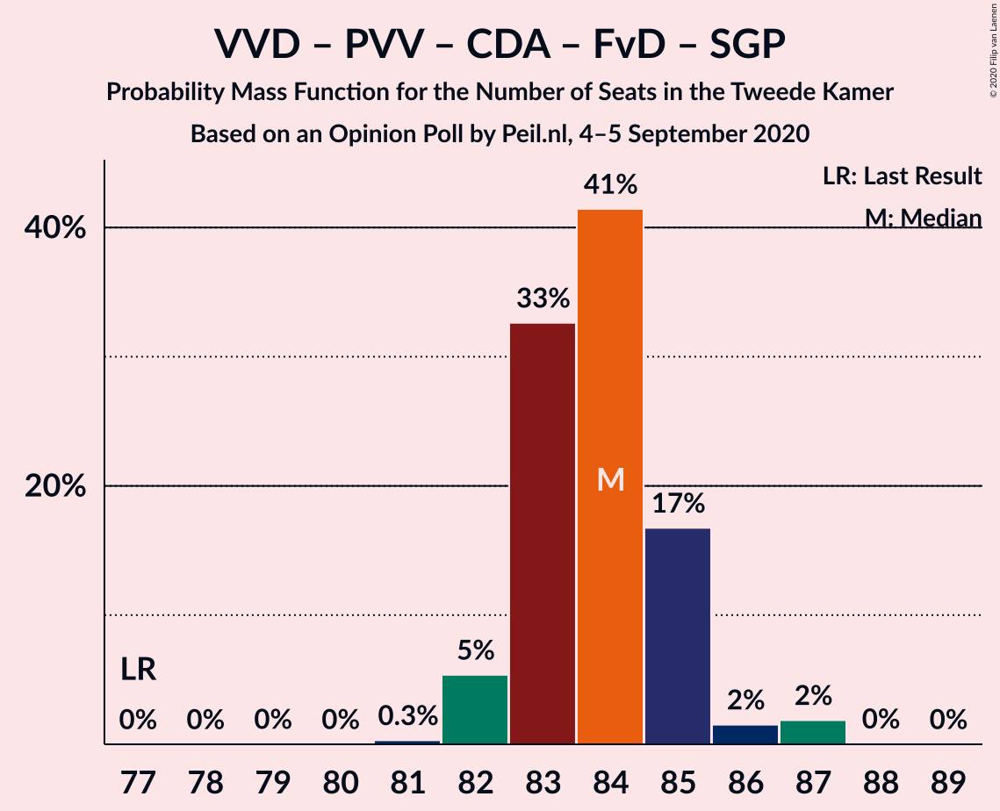

| Number of Seats | Probability | Accumulated | Special Marks |
|:---------------:|:-----------:|:-----------:|:-------------:|
| 77 | 0% | 100% | Last Result |
| 78 | 0% | 100% |  |
| 79 | 0.5% | 100% |  |
| 80 | 0.1% | 99.5% |  |
| 81 | 0.8% | 99.4% |  |
| 82 | 5% | 98.6% |  |
| 83 | 38% | 93% | Median |
| 84 | 20% | 56% |  |
| 85 | 20% | 36% |  |
| 86 | 11% | 16% |  |
| 87 | 4% | 4% |  |
| 88 | 0.1% | 0.7% |  |
| 89 | 0.5% | 0.6% |  |
| 90 | 0% | 0% |  |

### Volkspartij voor Vrijheid en Democratie – Democraten 66 – Christen-Democratisch Appèl – GroenLinks – ChristenUnie

| Number of Seats | Probability | Accumulated | Special Marks |
|:---------------:|:-----------:|:-----------:|:-------------:|
| 73 | 0.1% | 100% |  |
| 74 | 0.4% | 99.9% |  |
| 75 | 0.2% | 99.5% |  |
| 76 | 13% | 99.4% | Majority |
| 77 | 48% | 86% | Median |
| 78 | 17% | 38% |  |
| 79 | 3% | 20% |  |
| 80 | 0.9% | 17% |  |
| 81 | 11% | 16% |  |
| 82 | 0.4% | 5% |  |
| 83 | 0.2% | 5% |  |
| 84 | 4% | 4% |  |
| 85 | 0% | 0% |  |
| 86 | 0% | 0% |  |
| 87 | 0% | 0% |  |
| 88 | 0% | 0% |  |
| 89 | 0% | 0% |  |
| 90 | 0% | 0% | Last Result |

### Volkspartij voor Vrijheid en Democratie – Partij voor de Vrijheid – Christen-Democratisch Appèl – Forum voor Democratie

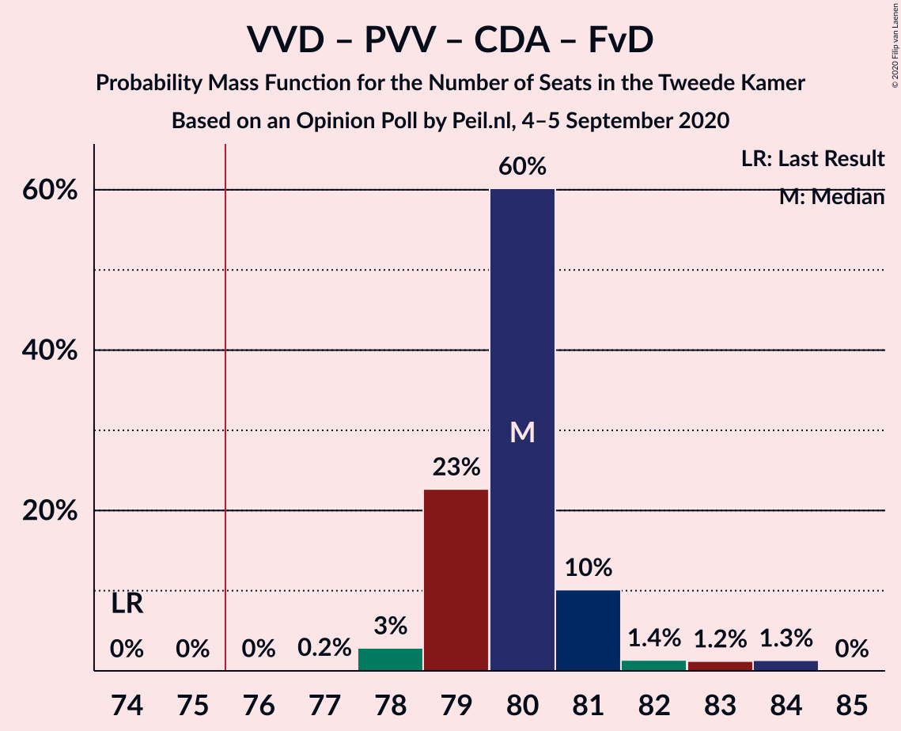

| Number of Seats | Probability | Accumulated | Special Marks |
|:---------------:|:-----------:|:-----------:|:-------------:|
| 74 | 0% | 100% | Last Result |
| 75 | 0.7% | 100% |  |
| 76 | 0.1% | 99.3% | Majority |
| 77 | 2% | 99.2% |  |
| 78 | 2% | 97% |  |
| 79 | 16% | 95% |  |
| 80 | 35% | 79% | Median |
| 81 | 9% | 44% |  |
| 82 | 30% | 35% |  |
| 83 | 4% | 5% |  |
| 84 | 0.3% | 0.8% |  |
| 85 | 0.5% | 0.6% |  |
| 86 | 0.1% | 0.1% |  |
| 87 | 0% | 0% |  |

### Volkspartij voor Vrijheid en Democratie – Democraten 66 – Partij van de Arbeid – Christen-Democratisch Appèl – ChristenUnie

| Number of Seats | Probability | Accumulated | Special Marks |
|:---------------:|:-----------:|:-----------:|:-------------:|
| 74 | 0.1% | 100% |  |
| 75 | 0.9% | 99.9% |  |
| 76 | 2% | 99.0% | Majority |
| 77 | 17% | 97% |  |
| 78 | 14% | 80% |  |
| 79 | 19% | 66% | Median |
| 80 | 30% | 47% |  |
| 81 | 0.5% | 17% |  |
| 82 | 12% | 17% |  |
| 83 | 5% | 5% |  |
| 84 | 0% | 0% |  |
| 85 | 0% | 0% | Last Result |

### Volkspartij voor Vrijheid en Democratie – Partij voor de Vrijheid – Christen-Democratisch Appèl

| Number of Seats | Probability | Accumulated | Special Marks |
|:---------------:|:-----------:|:-----------:|:-------------:|
| 66 | 2% | 100% |  |
| 67 | 0.7% | 98% |  |
| 68 | 1.3% | 97% |  |
| 69 | 14% | 96% |  |
| 70 | 10% | 82% |  |
| 71 | 35% | 72% | Median |
| 72 | 17% | 37% | Last Result |
| 73 | 4% | 20% |  |
| 74 | 15% | 15% |  |
| 75 | 0.1% | 0.7% |  |
| 76 | 0.3% | 0.6% | Majority |
| 77 | 0.3% | 0.4% |  |
| 78 | 0% | 0% |  |

### Democraten 66 – Partij van de Arbeid – Christen-Democratisch Appèl – GroenLinks – Socialistische Partij – ChristenUnie

| Number of Seats | Probability | Accumulated | Special Marks |
|:---------------:|:-----------:|:-----------:|:-------------:|
| 65 | 0.1% | 100% |  |
| 66 | 3% | 99.9% |  |
| 67 | 2% | 96% |  |
| 68 | 11% | 94% |  |
| 69 | 2% | 83% |  |
| 70 | 35% | 81% |  |
| 71 | 11% | 47% | Median |
| 72 | 2% | 36% |  |
| 73 | 7% | 33% |  |
| 74 | 27% | 27% |  |
| 75 | 0% | 0% |  |
| 76 | 0% | 0% | Majority |
| 77 | 0% | 0% |  |
| 78 | 0% | 0% |  |
| 79 | 0% | 0% |  |
| 80 | 0% | 0% | Last Result |

### Volkspartij voor Vrijheid en Democratie – Democraten 66 – Christen-Democratisch Appèl – ChristenUnie

| Number of Seats | Probability | Accumulated | Special Marks |
|:---------------:|:-----------:|:-----------:|:-------------:|
| 61 | 0.1% | 100% |  |
| 62 | 0.1% | 99.8% |  |
| 63 | 5% | 99.7% |  |
| 64 | 27% | 95% |  |
| 65 | 46% | 67% | Median |
| 66 | 2% | 22% |  |
| 67 | 3% | 20% |  |
| 68 | 1.0% | 17% |  |
| 69 | 0.1% | 15% |  |
| 70 | 15% | 15% |  |
| 71 | 0% | 0% |  |
| 72 | 0% | 0% |  |
| 73 | 0% | 0% |  |
| 74 | 0% | 0% |  |
| 75 | 0% | 0% |  |
| 76 | 0% | 0% | Last Result, Majority |

### Volkspartij voor Vrijheid en Democratie – Democraten 66 – Christen-Democratisch Appèl

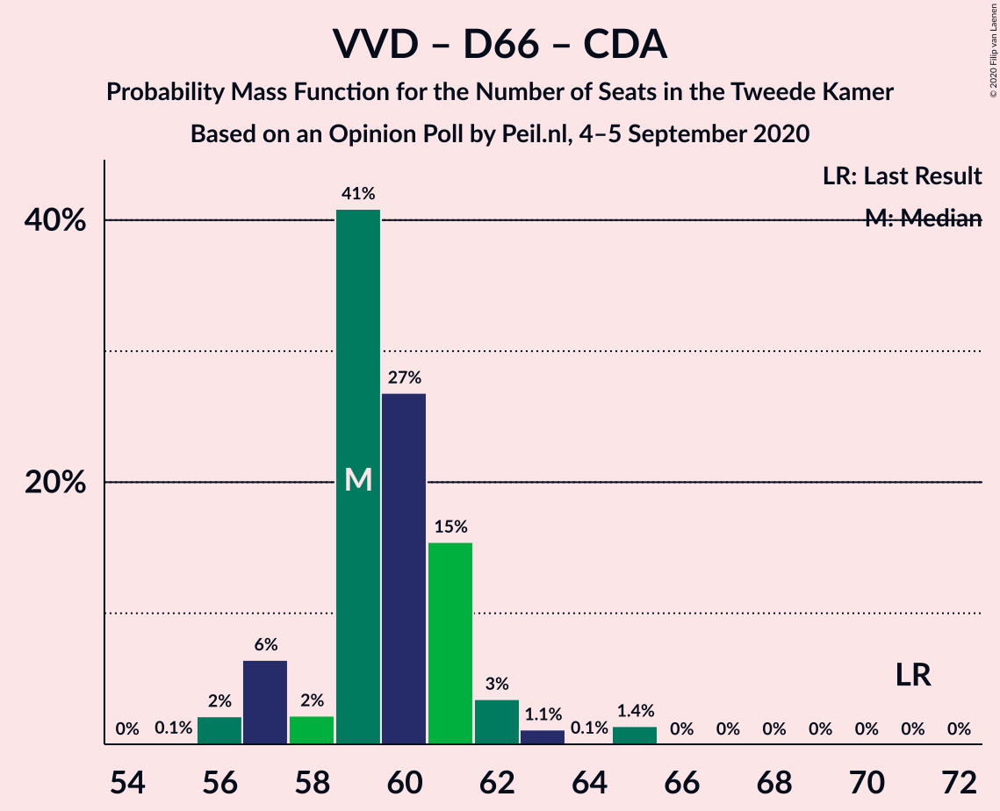

| Number of Seats | Probability | Accumulated | Special Marks |
|:---------------:|:-----------:|:-----------:|:-------------:|
| 54 | 0.1% | 100% |  |
| 55 | 0% | 99.9% |  |
| 56 | 0.3% | 99.9% |  |
| 57 | 0.3% | 99.6% |  |
| 58 | 12% | 99.2% |  |
| 59 | 50% | 87% | Median |
| 60 | 20% | 37% |  |
| 61 | 2% | 18% |  |
| 62 | 0.3% | 16% |  |
| 63 | 0.2% | 15% |  |
| 64 | 15% | 15% |  |
| 65 | 0.4% | 0.4% |  |
| 66 | 0% | 0% |  |
| 67 | 0% | 0% |  |
| 68 | 0% | 0% |  |
| 69 | 0% | 0% |  |
| 70 | 0% | 0% |  |
| 71 | 0% | 0% | Last Result |

### Volkspartij voor Vrijheid en Democratie – Partij van de Arbeid – Christen-Democratisch Appèl

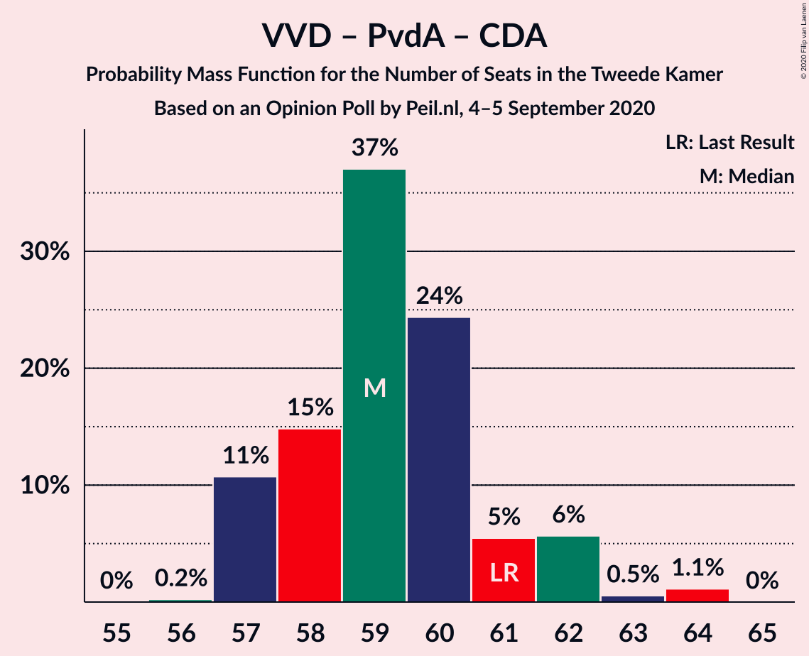

| Number of Seats | Probability | Accumulated | Special Marks |
|:---------------:|:-----------:|:-----------:|:-------------:|
| 55 | 0.9% | 100% |  |
| 56 | 2% | 99.1% |  |
| 57 | 3% | 97% |  |
| 58 | 22% | 95% |  |
| 59 | 7% | 72% | Median |
| 60 | 35% | 66% |  |
| 61 | 23% | 30% | Last Result |
| 62 | 0.7% | 7% |  |
| 63 | 5% | 6% |  |
| 64 | 0.6% | 0.7% |  |
| 65 | 0.1% | 0.1% |  |
| 66 | 0% | 0% |  |

### Volkspartij voor Vrijheid en Democratie – Democraten 66 – Partij van de Arbeid

| Number of Seats | Probability | Accumulated | Special Marks |
|:---------------:|:-----------:|:-----------:|:-------------:|
| 56 | 0% | 100% |  |
| 57 | 2% | 99.9% |  |
| 58 | 23% | 98% |  |
| 59 | 10% | 76% | Median |
| 60 | 28% | 65% |  |
| 61 | 11% | 37% | Last Result |
| 62 | 24% | 26% |  |
| 63 | 0.3% | 2% |  |
| 64 | 0.9% | 1.3% |  |
| 65 | 0.3% | 0.4% |  |
| 66 | 0% | 0.1% |  |
| 67 | 0% | 0% |  |

### Volkspartij voor Vrijheid en Democratie – Christen-Democratisch Appèl – Forum voor Democratie – Staatkundig Gereformeerde Partij – 50Plus

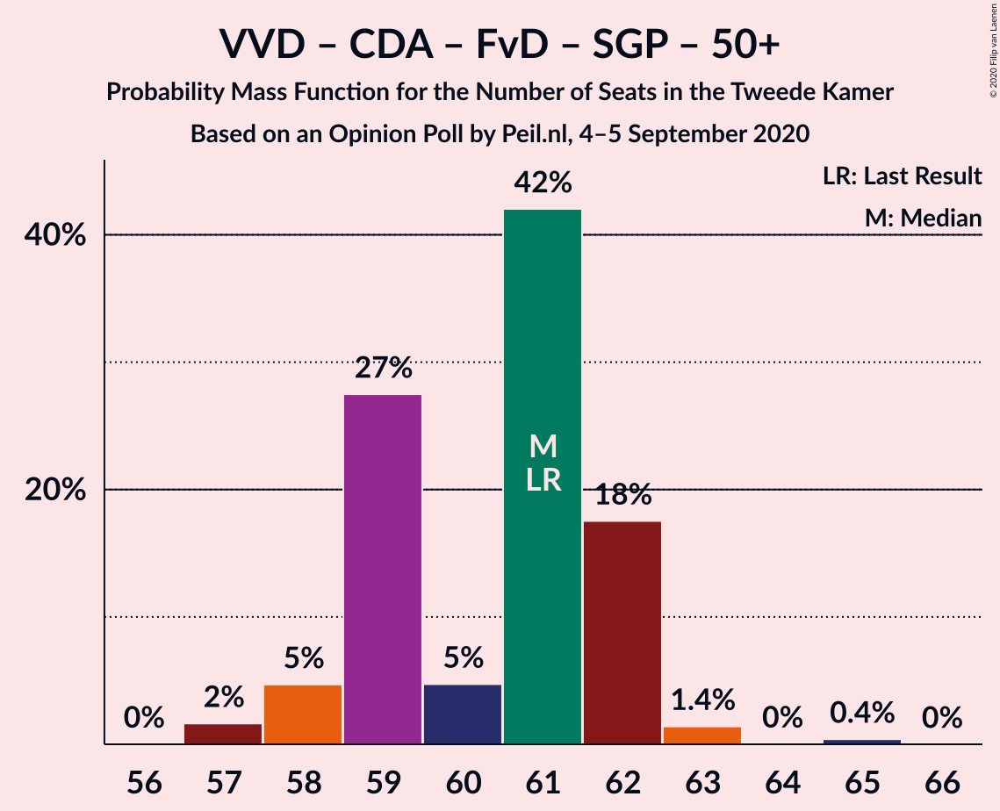

| Number of Seats | Probability | Accumulated | Special Marks |
|:---------------:|:-----------:|:-----------:|:-------------:|
| 56 | 4% | 100% |  |
| 57 | 0.8% | 96% |  |
| 58 | 30% | 96% | Median |
| 59 | 19% | 66% |  |
| 60 | 11% | 47% |  |
| 61 | 11% | 36% | Last Result |
| 62 | 23% | 25% |  |
| 63 | 1.1% | 1.4% |  |
| 64 | 0.2% | 0.3% |  |
| 65 | 0.1% | 0.1% |  |
| 66 | 0% | 0% |  |

### Democraten 66 – Partij van de Arbeid – Christen-Democratisch Appèl – GroenLinks – ChristenUnie

| Number of Seats | Probability | Accumulated | Special Marks |
|:---------------:|:-----------:|:-----------:|:-------------:|
| 55 | 4% | 100% |  |
| 56 | 1.3% | 96% |  |
| 57 | 10% | 95% |  |
| 58 | 21% | 85% |  |
| 59 | 22% | 65% |  |
| 60 | 8% | 43% | Median |
| 61 | 28% | 35% |  |
| 62 | 6% | 7% |  |
| 63 | 0.6% | 0.7% |  |
| 64 | 0.1% | 0.1% |  |
| 65 | 0% | 0% |  |
| 66 | 0% | 0% | Last Result |

### Volkspartij voor Vrijheid en Democratie – Christen-Democratisch Appèl – Forum voor Democratie – Staatkundig Gereformeerde Partij

| Number of Seats | Probability | Accumulated | Special Marks |
|:---------------:|:-----------:|:-----------:|:-------------:|
| 55 | 0.1% | 100% |  |
| 56 | 4% | 99.9% |  |
| 57 | 29% | 96% | Last Result, Median |
| 58 | 19% | 67% |  |
| 59 | 10% | 48% |  |
| 60 | 8% | 38% |  |
| 61 | 28% | 30% |  |
| 62 | 0.9% | 2% |  |
| 63 | 1.1% | 1.3% |  |
| 64 | 0.2% | 0.2% |  |
| 65 | 0% | 0.1% |  |
| 66 | 0% | 0% |  |

### Volkspartij voor Vrijheid en Democratie – Christen-Democratisch Appèl – Forum voor Democratie – 50Plus

| Number of Seats | Probability | Accumulated | Special Marks |
|:---------------:|:-----------:|:-----------:|:-------------:|
| 51 | 0.1% | 100% |  |
| 52 | 3% | 99.9% |  |
| 53 | 0.9% | 96% |  |
| 54 | 1.2% | 96% |  |
| 55 | 31% | 94% | Median |
| 56 | 21% | 64% |  |
| 57 | 18% | 42% |  |
| 58 | 23% | 25% | Last Result |
| 59 | 1.3% | 1.5% |  |
| 60 | 0.1% | 0.2% |  |
| 61 | 0.1% | 0.1% |  |
| 62 | 0% | 0.1% |  |
| 63 | 0% | 0% |  |

### Volkspartij voor Vrijheid en Democratie – Christen-Democratisch Appèl – Forum voor Democratie

| Number of Seats | Probability | Accumulated | Special Marks |
|:---------------:|:-----------:|:-----------:|:-------------:|
| 51 | 0.1% | 100% |  |
| 52 | 4% | 99.9% |  |
| 53 | 0.9% | 96% |  |
| 54 | 31% | 95% | Last Result, Median |
| 55 | 20% | 64% |  |
| 56 | 18% | 44% |  |
| 57 | 19% | 26% |  |
| 58 | 5% | 6% |  |
| 59 | 1.2% | 1.4% |  |
| 60 | 0% | 0.2% |  |
| 61 | 0.1% | 0.1% |  |
| 62 | 0% | 0% |  |

### Volkspartij voor Vrijheid en Democratie – Christen-Democratisch Appèl

| Number of Seats | Probability | Accumulated | Special Marks |
|:---------------:|:-----------:|:-----------:|:-------------:|
| 41 | 0.1% | 100% |  |
| 42 | 0.1% | 99.9% |  |
| 43 | 1.2% | 99.8% |  |
| 44 | 7% | 98.7% |  |
| 45 | 49% | 92% | Median |
| 46 | 20% | 43% |  |
| 47 | 2% | 22% |  |
| 48 | 5% | 21% |  |
| 49 | 11% | 16% |  |
| 50 | 5% | 5% |  |
| 51 | 0.5% | 0.5% |  |
| 52 | 0% | 0% | Last Result |

### Volkspartij voor Vrijheid en Democratie – Partij van de Arbeid

| Number of Seats | Probability | Accumulated | Special Marks |
|:---------------:|:-----------:|:-----------:|:-------------:|
| 42 | 2% | 100% | Last Result |
| 43 | 0.2% | 98% |  |
| 44 | 22% | 97% |  |
| 45 | 6% | 75% | Median |
| 46 | 28% | 69% |  |
| 47 | 19% | 41% |  |
| 48 | 14% | 23% |  |
| 49 | 8% | 9% |  |
| 50 | 0.7% | 1.4% |  |
| 51 | 0.4% | 0.7% |  |
| 52 | 0.3% | 0.3% |  |
| 53 | 0% | 0% |  |

### Democraten 66 – Partij van de Arbeid – Christen-Democratisch Appèl

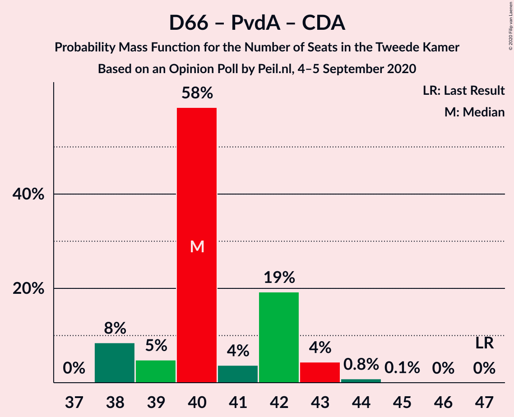

| Number of Seats | Probability | Accumulated | Special Marks |
|:---------------:|:-----------:|:-----------:|:-------------:|
| 37 | 0.1% | 100% |  |
| 38 | 2% | 99.9% |  |
| 39 | 12% | 98% |  |
| 40 | 10% | 85% |  |
| 41 | 38% | 75% |  |
| 42 | 8% | 37% | Median |
| 43 | 28% | 29% |  |
| 44 | 0.9% | 0.9% |  |
| 45 | 0% | 0% |  |
| 46 | 0% | 0% |  |
| 47 | 0% | 0% | Last Result |

### Partij van de Arbeid – Christen-Democratisch Appèl – ChristenUnie

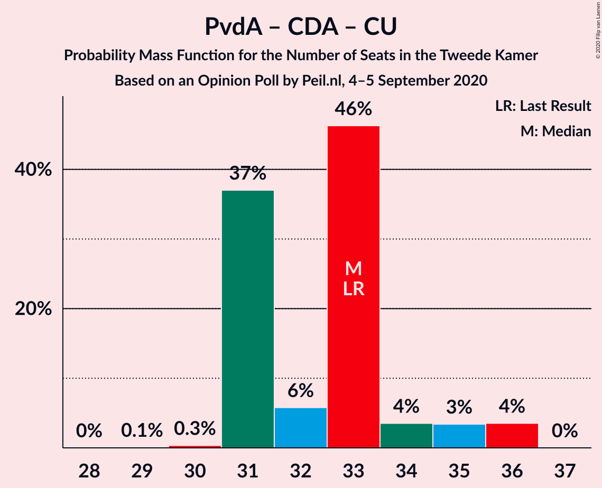

| Number of Seats | Probability | Accumulated | Special Marks |
|:---------------:|:-----------:|:-----------:|:-------------:|
| 28 | 0.1% | 100% |  |
| 29 | 2% | 99.9% |  |
| 30 | 1.2% | 98% |  |
| 31 | 9% | 97% |  |
| 32 | 39% | 88% |  |
| 33 | 14% | 49% | Last Result |
| 34 | 6% | 35% | Median |
| 35 | 28% | 29% |  |
| 36 | 1.1% | 1.1% |  |
| 37 | 0% | 0% |  |

### Partij van de Arbeid – Christen-Democratisch Appèl

| Number of Seats | Probability | Accumulated | Special Marks |
|:---------------:|:-----------:|:-----------:|:-------------:|
| 24 | 2% | 100% |  |
| 25 | 2% | 98% |  |
| 26 | 22% | 96% |  |
| 27 | 38% | 74% |  |
| 28 | 7% | 36% | Last Result, Median |
| 29 | 28% | 29% |  |
| 30 | 2% | 2% |  |
| 31 | 0% | 0% |  |

### Democraten 66 – Christen-Democratisch Appèl

| Number of Seats | Probability | Accumulated | Special Marks |
|:---------------:|:-----------:|:-----------:|:-------------:|
| 23 | 0.5% | 100% |  |
| 24 | 7% | 99.5% |  |
| 25 | 1.0% | 93% |  |
| 26 | 18% | 92% |  |
| 27 | 3% | 74% |  |
| 28 | 52% | 71% | Median |
| 29 | 17% | 19% |  |
| 30 | 2% | 2% |  |
| 31 | 0% | 0% |  |
| 32 | 0% | 0% |  |
| 33 | 0% | 0% |  |
| 34 | 0% | 0% |  |
| 35 | 0% | 0% |  |
| 36 | 0% | 0% |  |
| 37 | 0% | 0% |  |
| 38 | 0% | 0% | Last Result |

## Technical Information

### Opinion Poll

+ **Polling firm:** Peil.nl
+ **Commissioner(s):** —
+ **Fieldwork period:** 4–5 September 2020

### Calculations

+ **Sample size:** 3000
+ **Simulations done:** 131,072
+ **Error estimate:** 1.13%

