# Opinion Poll by I&O Research, 3–7 September 2020

<a href="#voting-intentions">Voting Intentions</a> | <a href="#seats">Seats</a> | <a href="#coalitions">Coalitions</a> | <a href="#technical-information">Technical Information</a>

## Voting Intentions

### Confidence Intervals

| Party | Last Result | Poll Result | 80% Confidence Interval | 90% Confidence Interval | 95% Confidence Interval | 99% Confidence Interval |
|:-----:|:-----------:|:-----------:|:-----------------------:|:-----------------------:|:-----------------------:|:-----------------------:|
| Volkspartij voor Vrijheid en Democratie | 21.3% | 26.0% | 24.8–27.3% |24.4–27.6% |24.2–28.0% |23.6–28.6% |
| Partij voor de Vrijheid | 13.1% | 12.5% | 11.6–13.5% |11.4–13.8% |11.2–14.0% |10.7–14.5% |
| GroenLinks | 9.1% | 10.1% | 9.3–11.0% |9.0–11.2% |8.8–11.5% |8.5–11.9% |
| Christen-Democratisch Appèl | 12.4% | 8.7% | 8.0–9.6% |7.7–9.8% |7.6–10.0% |7.2–10.4% |
| Democraten 66 | 12.2% | 8.6% | 7.9–9.5% |7.7–9.7% |7.5–9.9% |7.1–10.3% |
| Partij van de Arbeid | 5.7% | 8.4% | 7.6–9.2% |7.4–9.4% |7.3–9.7% |6.9–10.1% |
| Forum voor Democratie | 1.8% | 6.7% | 6.1–7.5% |5.9–7.7% |5.7–7.9% |5.4–8.3% |
| Socialistische Partij | 9.1% | 6.5% | 5.8–7.2% |5.6–7.5% |5.5–7.6% |5.2–8.0% |
| ChristenUnie | 3.4% | 4.6% | 4.0–5.2% |3.9–5.4% |3.7–5.6% |3.5–5.9% |
| Partij voor de Dieren | 3.2% | 3.2% | 2.8–3.8% |2.6–3.9% |2.5–4.1% |2.3–4.4% |
| Staatkundig Gereformeerde Partij | 2.1% | 2.2% | 1.8–2.7% |1.7–2.8% |1.6–2.9% |1.5–3.2% |
| 50Plus | 3.1% | 1.3% | 1.0–1.7% |1.0–1.8% |0.9–1.9% |0.8–2.1% |
| DENK | 2.1% | 0.7% | 0.5–1.0% |0.4–1.1% |0.4–1.1% |0.3–1.3% |
| Partij voor de Toekomst | 0.0% | 0.1% | 0.0–0.3% |0.0–0.3% |0.0–0.4% |0.0–0.5% |

*Note:* The poll result column reflects the actual value used in the calculations. Published results may vary slightly, and in addition be rounded to fewer digits.

## Seats

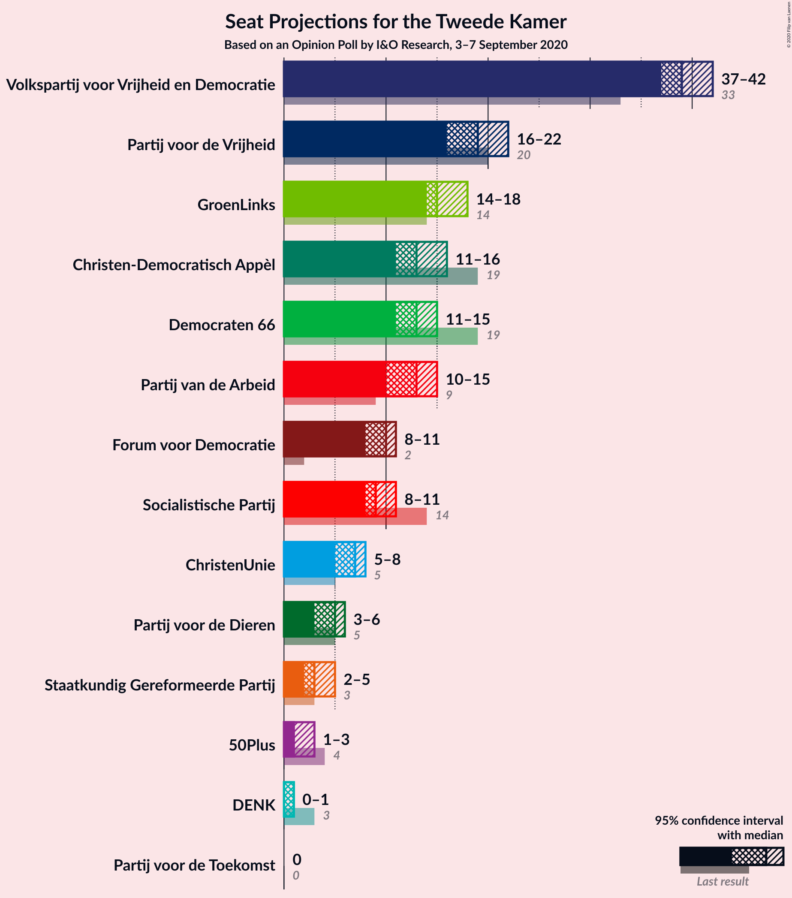

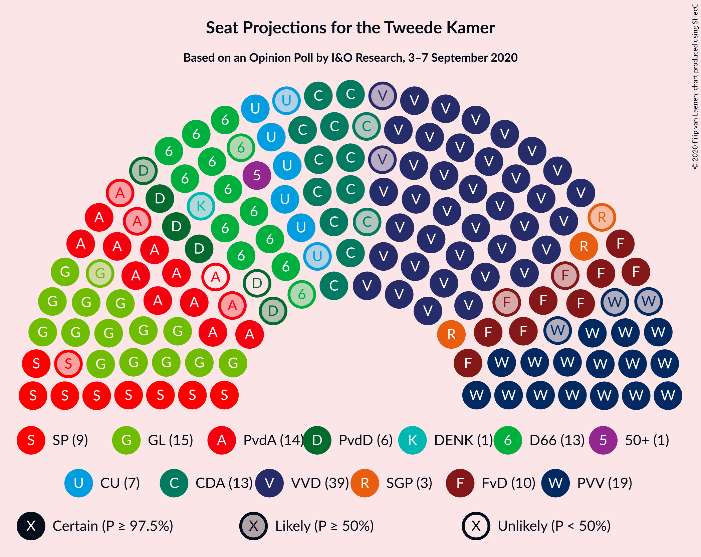

### Confidence Intervals

| Party | Last Result | Median | 80% Confidence Interval | 90% Confidence Interval | 95% Confidence Interval | 99% Confidence Interval |
|:-----:|:-----------:|:------:|:-----------------------:|:-----------------------:|:-----------------------:|:-----------------------:|
| <a href="#volkspartij-voor-vrijheid-en-democratie">Volkspartij voor Vrijheid en Democratie</a> | 33 | 39 | 38–41 |38–42 |37–42 |36–43 |
| <a href="#partij-voor-de-vrijheid">Partij voor de Vrijheid</a> | 20 | 19 | 18–22 |17–22 |16–22 |16–22 |
| <a href="#groenlinks">GroenLinks</a> | 14 | 15 | 15–16 |15–17 |14–18 |13–19 |
| <a href="#christen-democratisch-appèl">Christen-Democratisch Appèl</a> | 19 | 13 | 12–15 |11–16 |11–16 |11–17 |
| <a href="#democraten-66">Democraten 66</a> | 19 | 13 | 12–14 |12–15 |11–15 |11–16 |
| <a href="#partij-van-de-arbeid">Partij van de Arbeid</a> | 9 | 13 | 12–14 |11–14 |10–15 |10–15 |
| <a href="#forum-voor-democratie">Forum voor Democratie</a> | 2 | 10 | 9–11 |8–11 |8–11 |8–13 |
| <a href="#socialistische-partij">Socialistische Partij</a> | 14 | 9 | 9–10 |9–10 |8–11 |8–11 |
| <a href="#christenunie">ChristenUnie</a> | 5 | 7 | 6–8 |5–8 |5–8 |5–9 |
| <a href="#partij-voor-de-dieren">Partij voor de Dieren</a> | 5 | 5 | 4–6 |4–6 |3–6 |3–6 |
| <a href="#staatkundig-gereformeerde-partij">Staatkundig Gereformeerde Partij</a> | 3 | 3 | 3–4 |2–4 |2–5 |2–5 |
| <a href="#50plus">50Plus</a> | 4 | 1 | 1–2 |1–3 |1–3 |1–3 |
| <a href="#denk">DENK</a> | 3 | 1 | 0–1 |0–1 |0–1 |0–1 |
| <a href="#partij-voor-de-toekomst">Partij voor de Toekomst</a> | 0 | 0 | 0 |0 |0 |0 |

### Volkspartij voor Vrijheid en Democratie

*For a full overview of the results for this party, see the [Volkspartij voor Vrijheid en Democratie](party-volkspartijvoorvrijheidendemocratie.html) page.*

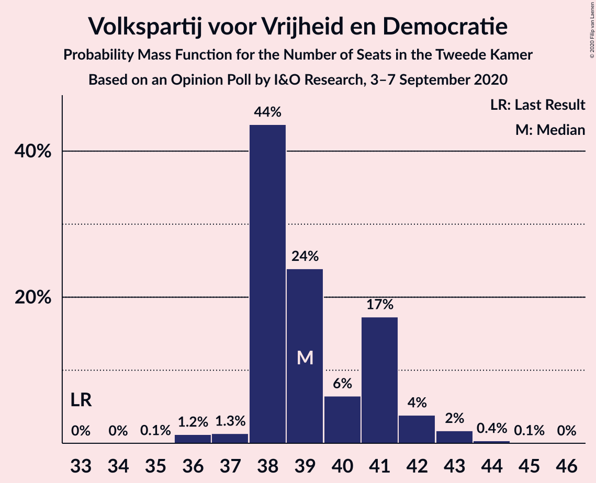

| Number of Seats | Probability | Accumulated | Special Marks |
|:---------------:|:-----------:|:-----------:|:-------------:|
| 33 | 0% | 100% | Last Result |
| 34 | 0% | 100% |  |
| 35 | 0.1% | 100% |  |
| 36 | 1.2% | 99.9% |  |
| 37 | 1.3% | 98.7% |  |
| 38 | 44% | 97% |  |
| 39 | 24% | 54% | Median |
| 40 | 6% | 30% |  |
| 41 | 17% | 23% |  |
| 42 | 4% | 6% |  |
| 43 | 2% | 2% |  |
| 44 | 0.4% | 0.4% |  |
| 45 | 0.1% | 0.1% |  |
| 46 | 0% | 0% |  |

### Partij voor de Vrijheid

*For a full overview of the results for this party, see the [Partij voor de Vrijheid](party-partijvoordevrijheid.html) page.*

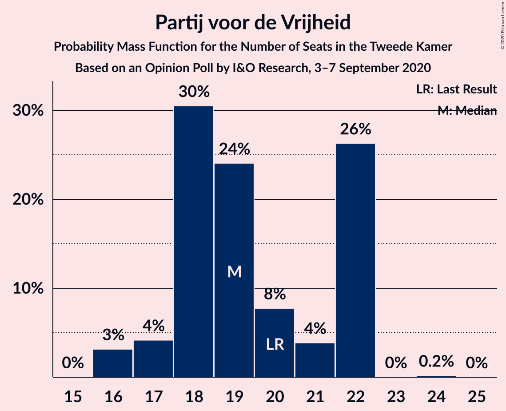

| Number of Seats | Probability | Accumulated | Special Marks |
|:---------------:|:-----------:|:-----------:|:-------------:|
| 16 | 3% | 100% |  |
| 17 | 4% | 97% |  |
| 18 | 30% | 93% |  |
| 19 | 24% | 62% | Median |
| 20 | 8% | 38% | Last Result |
| 21 | 4% | 30% |  |
| 22 | 26% | 26% |  |
| 23 | 0% | 0.2% |  |
| 24 | 0.2% | 0.2% |  |
| 25 | 0% | 0% |  |

### GroenLinks

*For a full overview of the results for this party, see the [GroenLinks](party-groenlinks.html) page.*

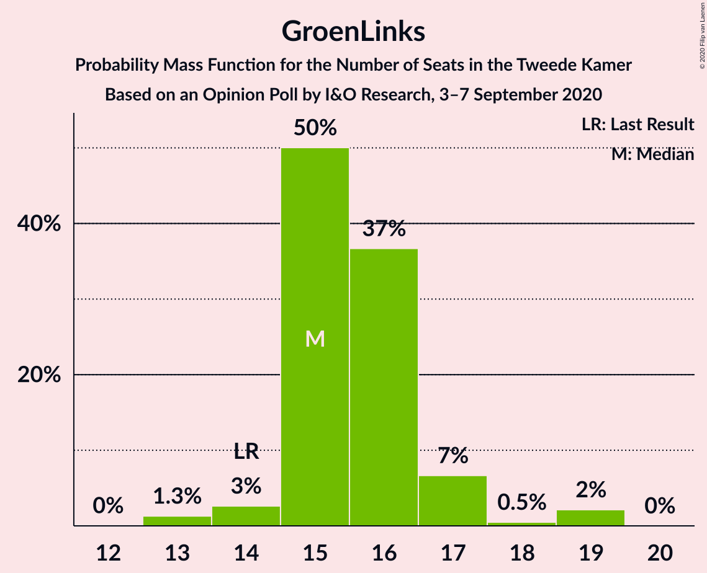

| Number of Seats | Probability | Accumulated | Special Marks |
|:---------------:|:-----------:|:-----------:|:-------------:|
| 13 | 1.3% | 100% |  |
| 14 | 3% | 98.7% | Last Result |
| 15 | 50% | 96% | Median |
| 16 | 37% | 46% |  |
| 17 | 7% | 9% |  |
| 18 | 0.5% | 3% |  |
| 19 | 2% | 2% |  |
| 20 | 0% | 0% |  |

### Christen-Democratisch Appèl

*For a full overview of the results for this party, see the [Christen-Democratisch Appèl](party-christen-democratischappèl.html) page.*

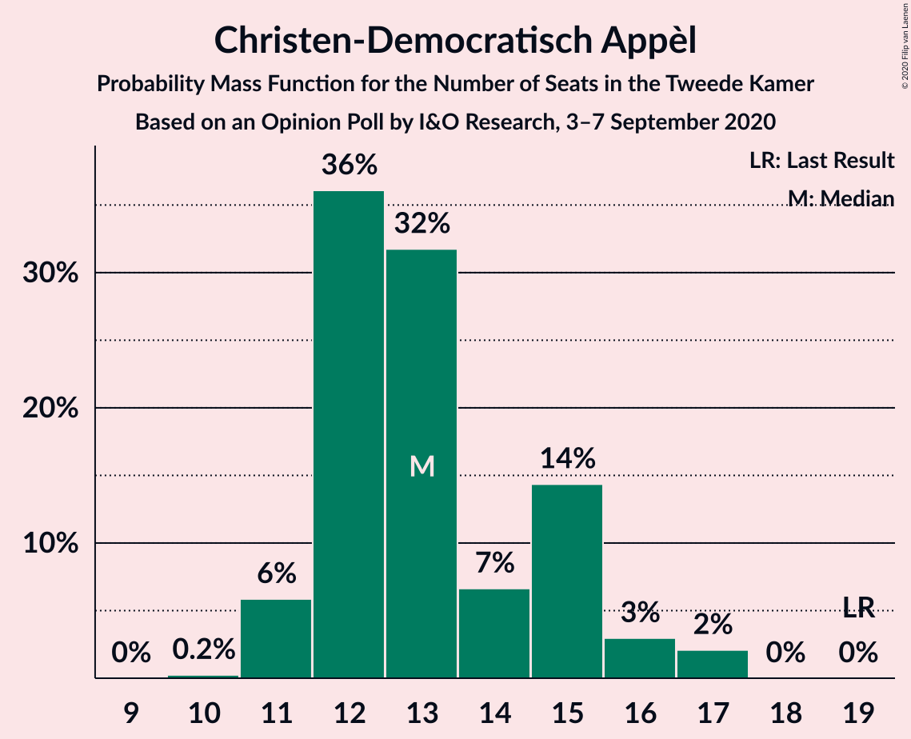

| Number of Seats | Probability | Accumulated | Special Marks |
|:---------------:|:-----------:|:-----------:|:-------------:|
| 10 | 0.2% | 100% |  |
| 11 | 6% | 99.8% |  |
| 12 | 36% | 94% |  |
| 13 | 32% | 58% | Median |
| 14 | 7% | 26% |  |
| 15 | 14% | 19% |  |
| 16 | 3% | 5% |  |
| 17 | 2% | 2% |  |
| 18 | 0% | 0% |  |
| 19 | 0% | 0% | Last Result |

### Democraten 66

*For a full overview of the results for this party, see the [Democraten 66](party-democraten66.html) page.*

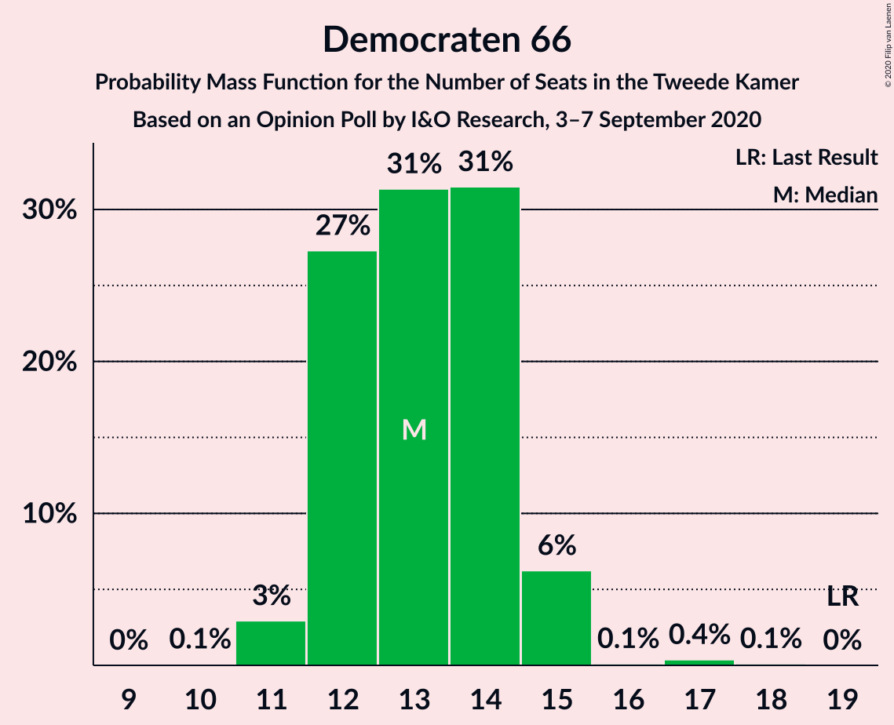

| Number of Seats | Probability | Accumulated | Special Marks |
|:---------------:|:-----------:|:-----------:|:-------------:|
| 10 | 0.1% | 100% |  |
| 11 | 3% | 99.9% |  |
| 12 | 27% | 97% |  |
| 13 | 31% | 70% | Median |
| 14 | 31% | 38% |  |
| 15 | 6% | 7% |  |
| 16 | 0.1% | 0.6% |  |
| 17 | 0.4% | 0.5% |  |
| 18 | 0.1% | 0.1% |  |
| 19 | 0% | 0% | Last Result |

### Partij van de Arbeid

*For a full overview of the results for this party, see the [Partij van de Arbeid](party-partijvandearbeid.html) page.*

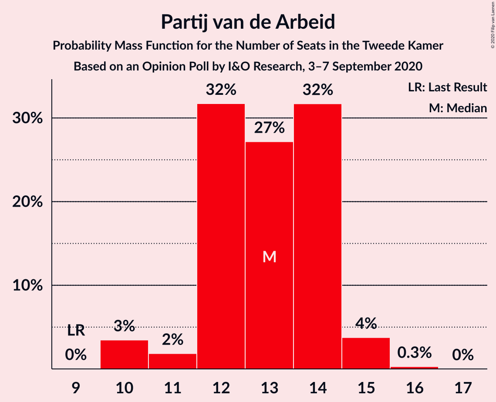

| Number of Seats | Probability | Accumulated | Special Marks |
|:---------------:|:-----------:|:-----------:|:-------------:|
| 9 | 0% | 100% | Last Result |
| 10 | 3% | 100% |  |
| 11 | 2% | 97% |  |
| 12 | 32% | 95% |  |
| 13 | 27% | 63% | Median |
| 14 | 32% | 36% |  |
| 15 | 4% | 4% |  |
| 16 | 0.3% | 0.3% |  |
| 17 | 0% | 0% |  |

### Forum voor Democratie

*For a full overview of the results for this party, see the [Forum voor Democratie](party-forumvoordemocratie.html) page.*

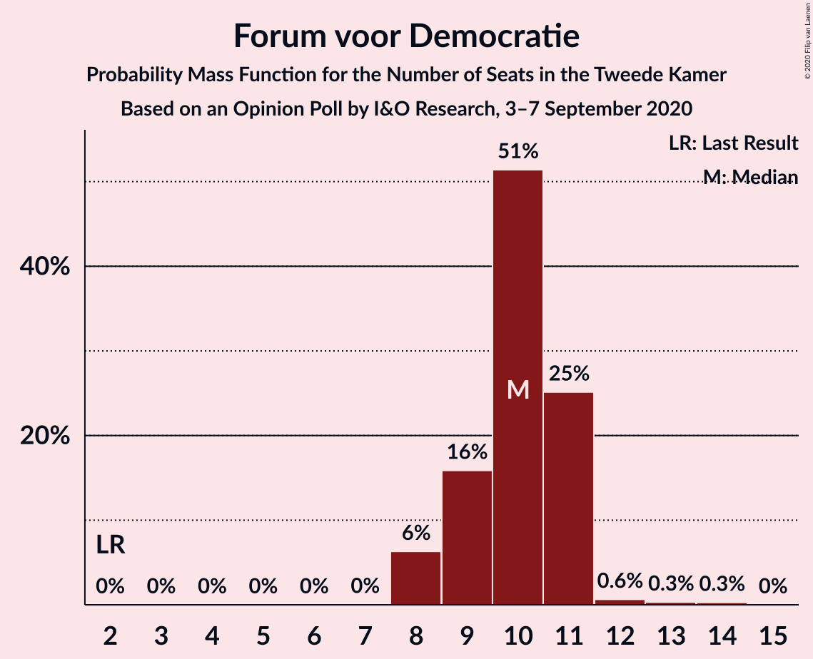

| Number of Seats | Probability | Accumulated | Special Marks |
|:---------------:|:-----------:|:-----------:|:-------------:|
| 2 | 0% | 100% | Last Result |
| 3 | 0% | 100% |  |
| 4 | 0% | 100% |  |
| 5 | 0% | 100% |  |
| 6 | 0% | 100% |  |
| 7 | 0% | 100% |  |
| 8 | 6% | 100% |  |
| 9 | 16% | 94% |  |
| 10 | 51% | 78% | Median |
| 11 | 25% | 26% |  |
| 12 | 0.6% | 1.2% |  |
| 13 | 0.3% | 0.6% |  |
| 14 | 0.3% | 0.3% |  |
| 15 | 0% | 0% |  |

### Socialistische Partij

*For a full overview of the results for this party, see the [Socialistische Partij](party-socialistischepartij.html) page.*

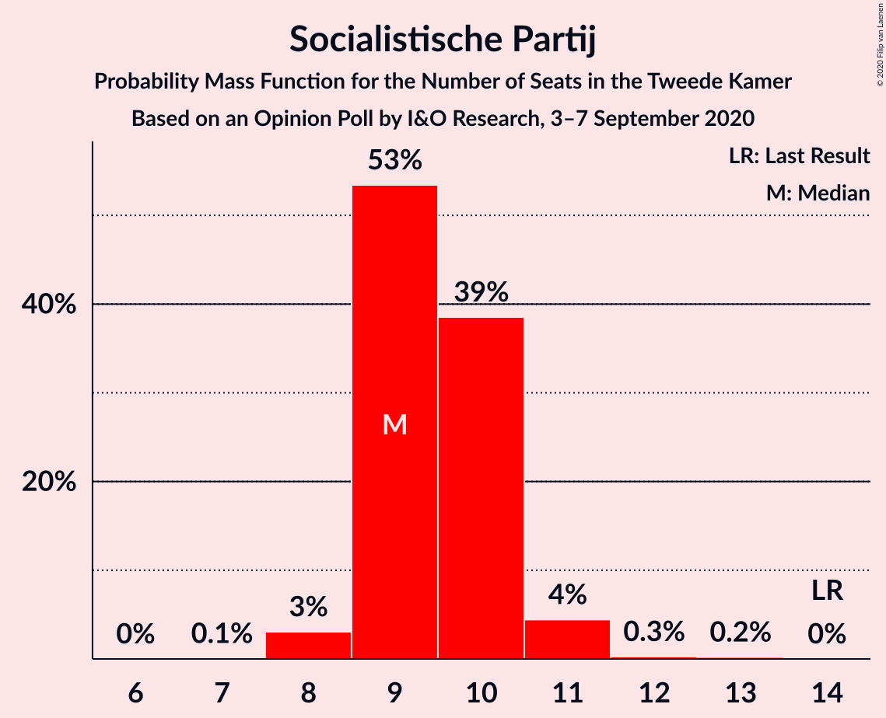

| Number of Seats | Probability | Accumulated | Special Marks |
|:---------------:|:-----------:|:-----------:|:-------------:|
| 7 | 0.1% | 100% |  |
| 8 | 3% | 99.9% |  |
| 9 | 53% | 97% | Median |
| 10 | 39% | 43% |  |
| 11 | 4% | 5% |  |
| 12 | 0.3% | 0.5% |  |
| 13 | 0.2% | 0.2% |  |
| 14 | 0% | 0% | Last Result |

### ChristenUnie

*For a full overview of the results for this party, see the [ChristenUnie](party-christenunie.html) page.*

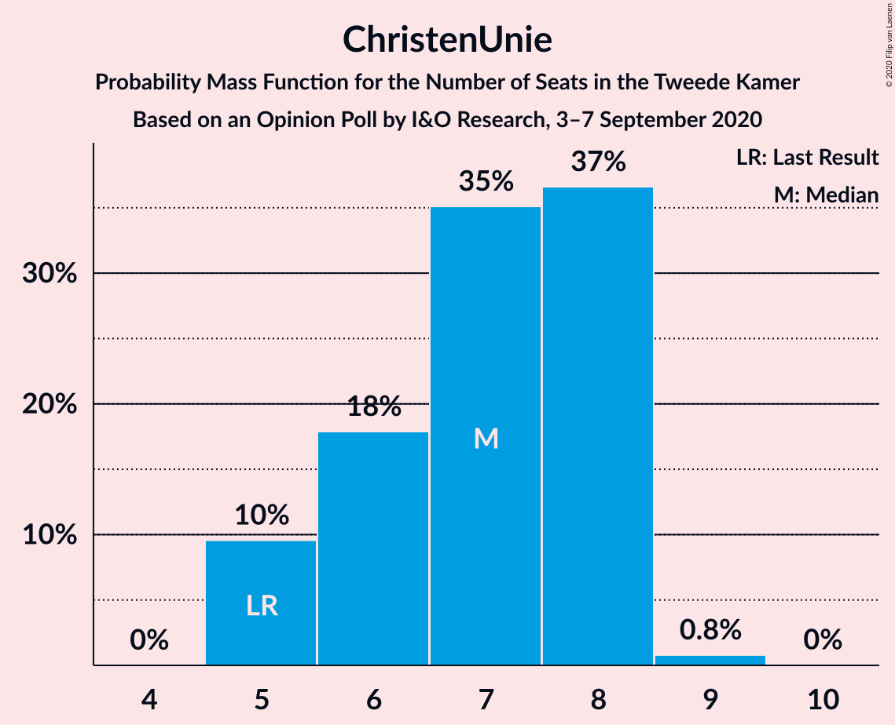

| Number of Seats | Probability | Accumulated | Special Marks |
|:---------------:|:-----------:|:-----------:|:-------------:|
| 5 | 10% | 100% | Last Result |
| 6 | 18% | 90% |  |
| 7 | 35% | 73% | Median |
| 8 | 37% | 37% |  |
| 9 | 0.8% | 0.8% |  |
| 10 | 0% | 0% |  |

### Partij voor de Dieren

*For a full overview of the results for this party, see the [Partij voor de Dieren](party-partijvoordedieren.html) page.*

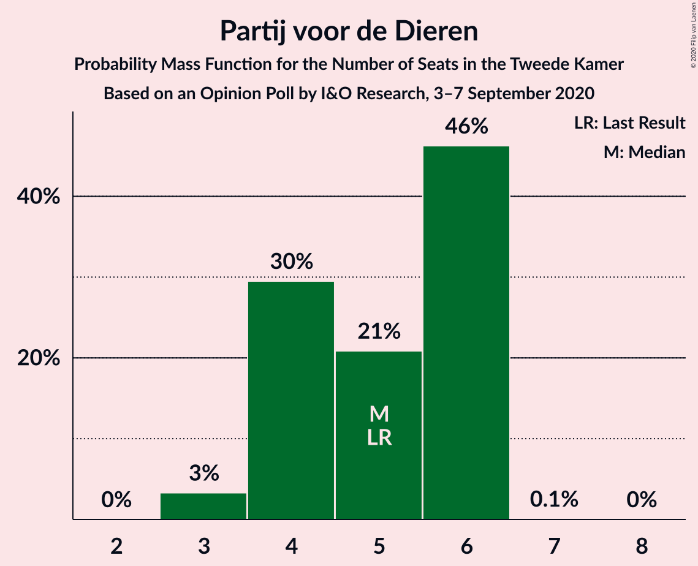

| Number of Seats | Probability | Accumulated | Special Marks |
|:---------------:|:-----------:|:-----------:|:-------------:|
| 3 | 3% | 100% |  |
| 4 | 30% | 97% |  |
| 5 | 21% | 67% | Last Result, Median |
| 6 | 46% | 46% |  |
| 7 | 0.1% | 0.1% |  |
| 8 | 0% | 0% |  |

### Staatkundig Gereformeerde Partij

*For a full overview of the results for this party, see the [Staatkundig Gereformeerde Partij](party-staatkundiggereformeerdepartij.html) page.*

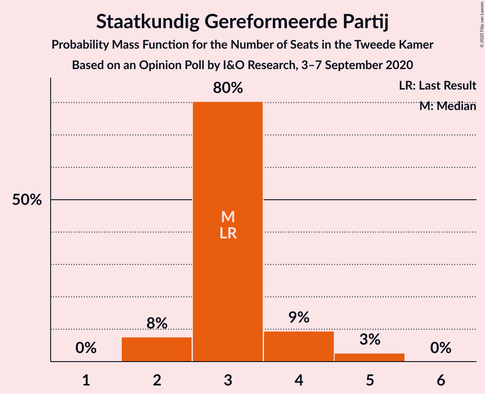

| Number of Seats | Probability | Accumulated | Special Marks |
|:---------------:|:-----------:|:-----------:|:-------------:|
| 2 | 8% | 100% |  |
| 3 | 80% | 92% | Last Result, Median |
| 4 | 9% | 12% |  |
| 5 | 3% | 3% |  |
| 6 | 0% | 0% |  |

### 50Plus

*For a full overview of the results for this party, see the [50Plus](party-50plus.html) page.*

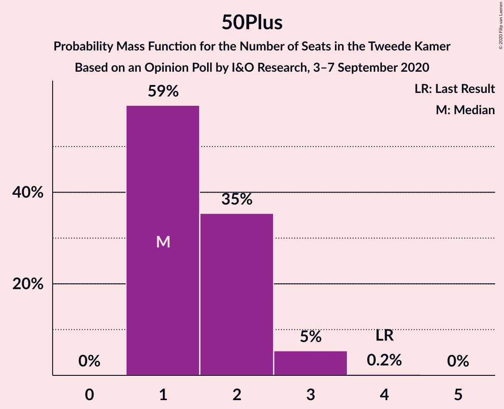

| Number of Seats | Probability | Accumulated | Special Marks |
|:---------------:|:-----------:|:-----------:|:-------------:|
| 1 | 59% | 100% | Median |
| 2 | 35% | 41% |  |
| 3 | 5% | 6% |  |
| 4 | 0.2% | 0.2% | Last Result |
| 5 | 0% | 0% |  |

### DENK

*For a full overview of the results for this party, see the [DENK](party-denk.html) page.*

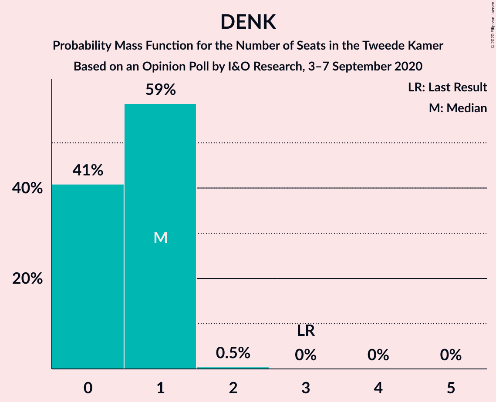

| Number of Seats | Probability | Accumulated | Special Marks |
|:---------------:|:-----------:|:-----------:|:-------------:|
| 0 | 41% | 100% |  |
| 1 | 59% | 59% | Median |
| 2 | 0.5% | 0.5% |  |
| 3 | 0% | 0% | Last Result |

### Partij voor de Toekomst

*For a full overview of the results for this party, see the [Partij voor de Toekomst](party-partijvoordetoekomst.html) page.*

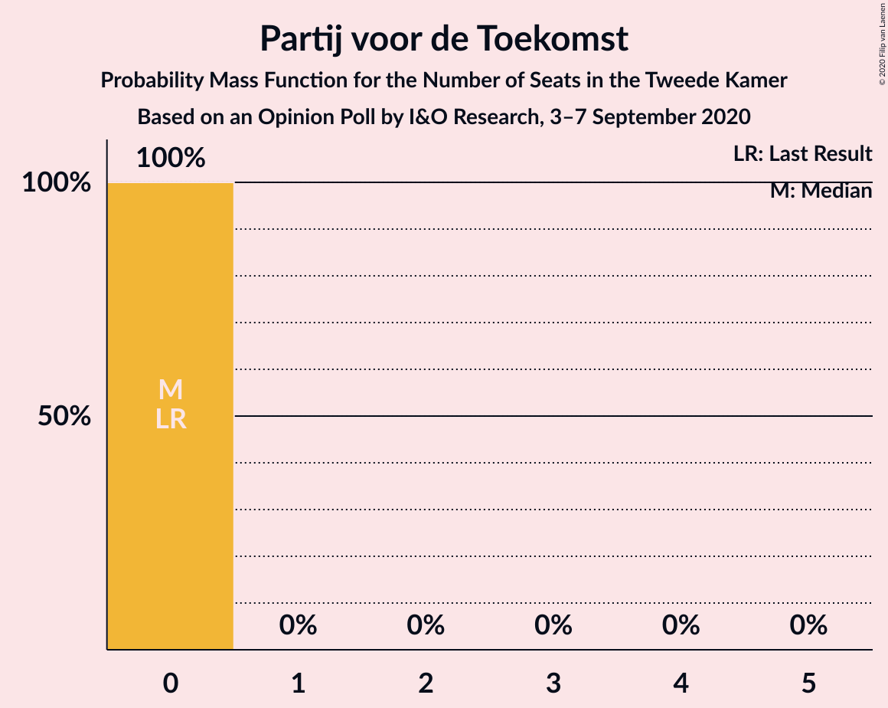

| Number of Seats | Probability | Accumulated | Special Marks |
|:---------------:|:-----------:|:-----------:|:-------------:|
| 0 | 100% | 100% | Last Result, Median |

## Coalitions

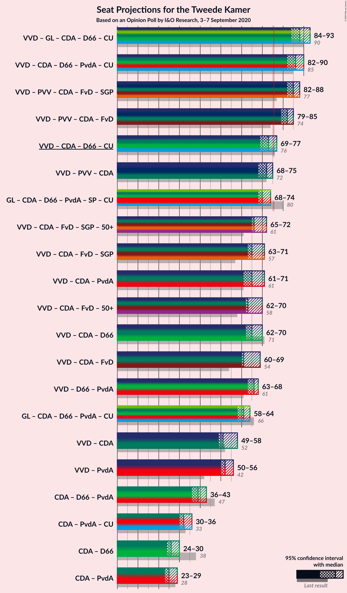

### Confidence Intervals

| Coalition | Last Result | Median | Majority? | 80% Confidence Interval | 90% Confidence Interval | 95% Confidence Interval | 99% Confidence Interval |
|:---------:|:-----------:|:------:|:---------:|:-----------------------:|:-----------------------:|:-----------------------:|:-----------------------:|
| Volkspartij voor Vrijheid en Democratie – GroenLinks – Christen-Democratisch Appèl – Democraten 66 – ChristenUnie | 90 | 88 | 100% | 86–90 | 85–93 | 84–93 | 83–93 |
| Volkspartij voor Vrijheid en Democratie – Christen-Democratisch Appèl – Democraten 66 – Partij van de Arbeid – ChristenUnie | 85 | 86 | 100% | 83–87 | 82–89 | 82–90 | 81–90 |
| Volkspartij voor Vrijheid en Democratie – Partij voor de Vrijheid – Christen-Democratisch Appèl – Forum voor Democratie – Staatkundig Gereformeerde Partij | 77 | 85 | 100% | 82–87 | 82–87 | 82–88 | 81–89 |
| Volkspartij voor Vrijheid en Democratie – Partij voor de Vrijheid – Christen-Democratisch Appèl – Forum voor Democratie | 74 | 82 | 100% | 79–83 | 79–85 | 79–85 | 78–86 |
| Volkspartij voor Vrijheid en Democratie – Christen-Democratisch Appèl – Democraten 66 – ChristenUnie | 76 | 73 | 5% | 70–74 | 70–76 | 69–77 | 68–78 |
| Volkspartij voor Vrijheid en Democratie – Partij voor de Vrijheid – Christen-Democratisch Appèl | 72 | 72 | 2% | 69–73 | 69–74 | 68–75 | 68–77 |
| GroenLinks – Christen-Democratisch Appèl – Democraten 66 – Partij van de Arbeid – Socialistische Partij – ChristenUnie | 80 | 70 | 0.3% | 69–74 | 69–74 | 68–74 | 67–75 |
| Volkspartij voor Vrijheid en Democratie – Christen-Democratisch Appèl – Forum voor Democratie – Staatkundig Gereformeerde Partij – 50Plus | 61 | 66 | 0% | 65–69 | 65–70 | 65–72 | 64–72 |
| Volkspartij voor Vrijheid en Democratie – Christen-Democratisch Appèl – Forum voor Democratie – Staatkundig Gereformeerde Partij | 57 | 65 | 0% | 64–67 | 63–68 | 63–71 | 63–71 |
| Volkspartij voor Vrijheid en Democratie – Christen-Democratisch Appèl – Partij van de Arbeid | 61 | 65 | 0% | 63–67 | 63–70 | 61–71 | 61–71 |
| Volkspartij voor Vrijheid en Democratie – Christen-Democratisch Appèl – Forum voor Democratie – 50Plus | 58 | 63 | 0% | 62–66 | 62–67 | 62–70 | 60–70 |
| Volkspartij voor Vrijheid en Democratie – Christen-Democratisch Appèl – Democraten 66 | 71 | 65 | 0% | 63–67 | 63–68 | 62–70 | 62–71 |
| Volkspartij voor Vrijheid en Democratie – Christen-Democratisch Appèl – Forum voor Democratie | 54 | 61 | 0% | 61–64 | 60–65 | 60–69 | 59–69 |
| Volkspartij voor Vrijheid en Democratie – Democraten 66 – Partij van de Arbeid | 61 | 66 | 0% | 63–66 | 63–67 | 63–68 | 62–70 |
| GroenLinks – Christen-Democratisch Appèl – Democraten 66 – Partij van de Arbeid – ChristenUnie | 66 | 61 | 0% | 60–64 | 60–64 | 58–64 | 57–65 |
| Volkspartij voor Vrijheid en Democratie – Christen-Democratisch Appèl | 52 | 51 | 0% | 51–54 | 50–56 | 49–58 | 49–58 |
| Volkspartij voor Vrijheid en Democratie – Partij van de Arbeid | 42 | 52 | 0% | 50–53 | 50–55 | 50–56 | 48–57 |
| Christen-Democratisch Appèl – Democraten 66 – Partij van de Arbeid | 47 | 39 | 0% | 37–43 | 36–43 | 36–43 | 35–44 |
| Christen-Democratisch Appèl – Partij van de Arbeid – ChristenUnie | 33 | 32 | 0% | 30–35 | 30–35 | 30–36 | 28–36 |
| Christen-Democratisch Appèl – Democraten 66 | 38 | 26 | 0% | 24–29 | 24–29 | 24–30 | 22–30 |
| Christen-Democratisch Appèl – Partij van de Arbeid | 28 | 25 | 0% | 24–29 | 23–29 | 23–29 | 23–30 |

### Volkspartij voor Vrijheid en Democratie – GroenLinks – Christen-Democratisch Appèl – Democraten 66 – ChristenUnie

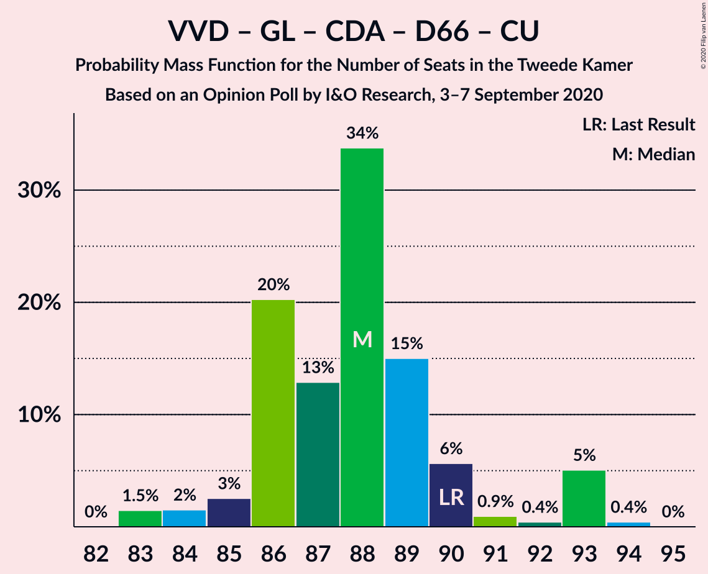

| Number of Seats | Probability | Accumulated | Special Marks |
|:---------------:|:-----------:|:-----------:|:-------------:|
| 83 | 1.5% | 100% |  |
| 84 | 2% | 98.5% |  |
| 85 | 3% | 97% |  |
| 86 | 20% | 94% |  |
| 87 | 13% | 74% | Median |
| 88 | 34% | 61% |  |
| 89 | 15% | 28% |  |
| 90 | 6% | 13% | Last Result |
| 91 | 0.9% | 7% |  |
| 92 | 0.4% | 6% |  |
| 93 | 5% | 6% |  |
| 94 | 0.4% | 0.5% |  |
| 95 | 0% | 0% |  |

### Volkspartij voor Vrijheid en Democratie – Christen-Democratisch Appèl – Democraten 66 – Partij van de Arbeid – ChristenUnie

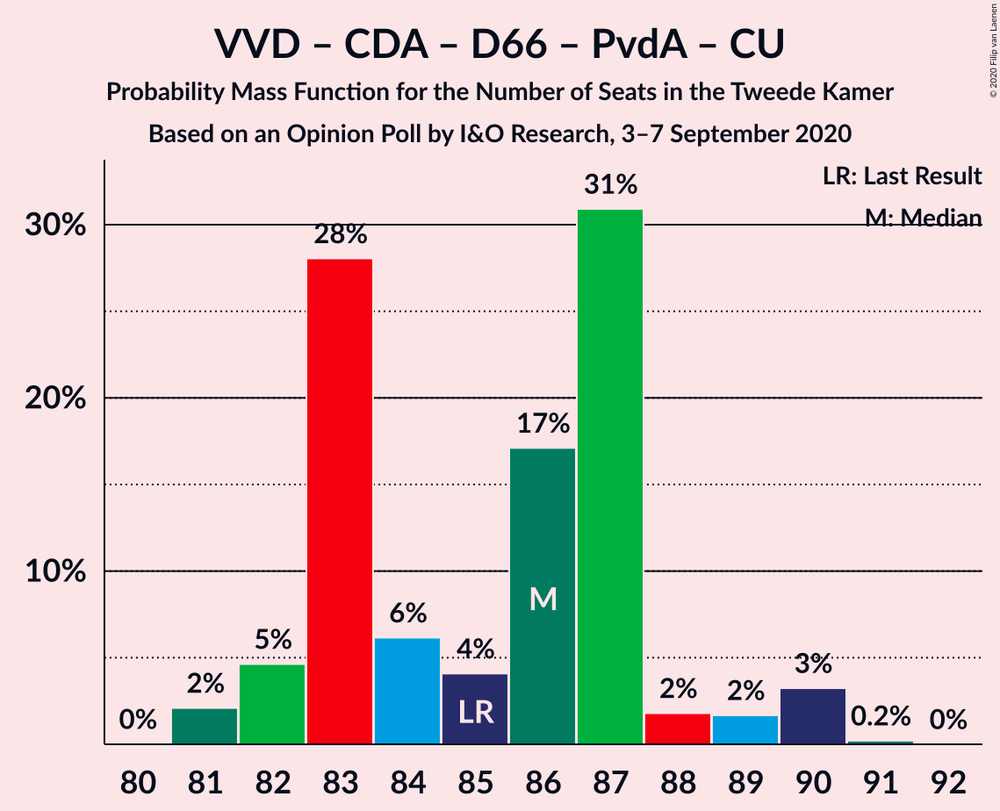

| Number of Seats | Probability | Accumulated | Special Marks |
|:---------------:|:-----------:|:-----------:|:-------------:|
| 81 | 2% | 100% |  |
| 82 | 5% | 98% |  |
| 83 | 28% | 93% |  |
| 84 | 6% | 65% |  |
| 85 | 4% | 59% | Last Result, Median |
| 86 | 17% | 55% |  |
| 87 | 31% | 38% |  |
| 88 | 2% | 7% |  |
| 89 | 2% | 5% |  |
| 90 | 3% | 3% |  |
| 91 | 0.2% | 0.2% |  |
| 92 | 0% | 0% |  |

### Volkspartij voor Vrijheid en Democratie – Partij voor de Vrijheid – Christen-Democratisch Appèl – Forum voor Democratie – Staatkundig Gereformeerde Partij

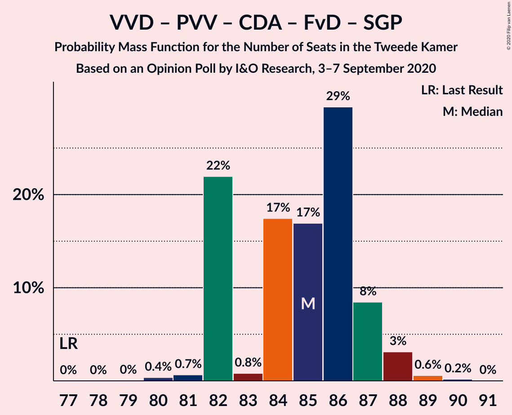

| Number of Seats | Probability | Accumulated | Special Marks |
|:---------------:|:-----------:|:-----------:|:-------------:|
| 77 | 0% | 100% | Last Result |
| 78 | 0% | 100% |  |
| 79 | 0% | 100% |  |
| 80 | 0.4% | 100% |  |
| 81 | 0.7% | 99.6% |  |
| 82 | 22% | 98.9% |  |
| 83 | 0.8% | 77% |  |
| 84 | 17% | 76% | Median |
| 85 | 17% | 59% |  |
| 86 | 29% | 42% |  |
| 87 | 8% | 12% |  |
| 88 | 3% | 4% |  |
| 89 | 0.6% | 0.8% |  |
| 90 | 0.2% | 0.2% |  |
| 91 | 0% | 0% |  |

### Volkspartij voor Vrijheid en Democratie – Partij voor de Vrijheid – Christen-Democratisch Appèl – Forum voor Democratie

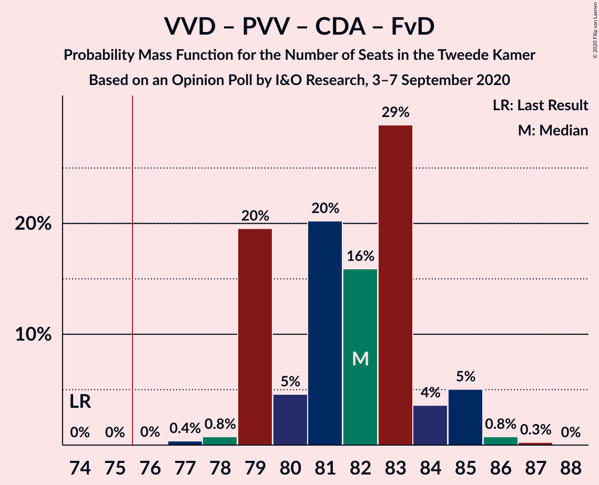

| Number of Seats | Probability | Accumulated | Special Marks |
|:---------------:|:-----------:|:-----------:|:-------------:|
| 74 | 0% | 100% | Last Result |
| 75 | 0% | 100% |  |
| 76 | 0% | 100% | Majority |
| 77 | 0.4% | 100% |  |
| 78 | 0.8% | 99.6% |  |
| 79 | 20% | 98.8% |  |
| 80 | 5% | 79% |  |
| 81 | 20% | 75% | Median |
| 82 | 16% | 54% |  |
| 83 | 29% | 39% |  |
| 84 | 4% | 10% |  |
| 85 | 5% | 6% |  |
| 86 | 0.8% | 1.0% |  |
| 87 | 0.3% | 0.3% |  |
| 88 | 0% | 0% |  |

### Volkspartij voor Vrijheid en Democratie – Christen-Democratisch Appèl – Democraten 66 – ChristenUnie

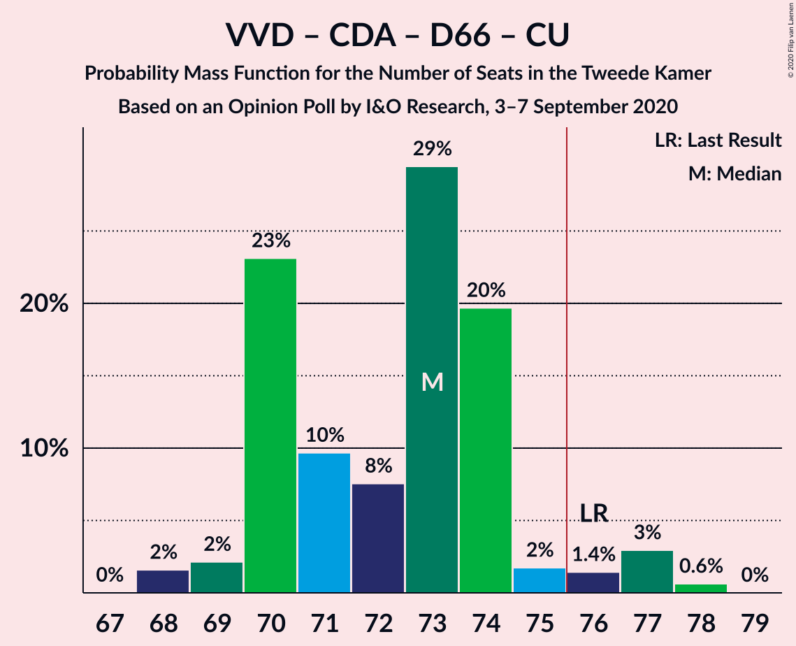

| Number of Seats | Probability | Accumulated | Special Marks |
|:---------------:|:-----------:|:-----------:|:-------------:|
| 68 | 2% | 100% |  |
| 69 | 2% | 98% |  |
| 70 | 23% | 96% |  |
| 71 | 10% | 73% |  |
| 72 | 8% | 63% | Median |
| 73 | 29% | 56% |  |
| 74 | 20% | 26% |  |
| 75 | 2% | 7% |  |
| 76 | 1.4% | 5% | Last Result, Majority |
| 77 | 3% | 4% |  |
| 78 | 0.6% | 0.7% |  |
| 79 | 0% | 0% |  |

### Volkspartij voor Vrijheid en Democratie – Partij voor de Vrijheid – Christen-Democratisch Appèl

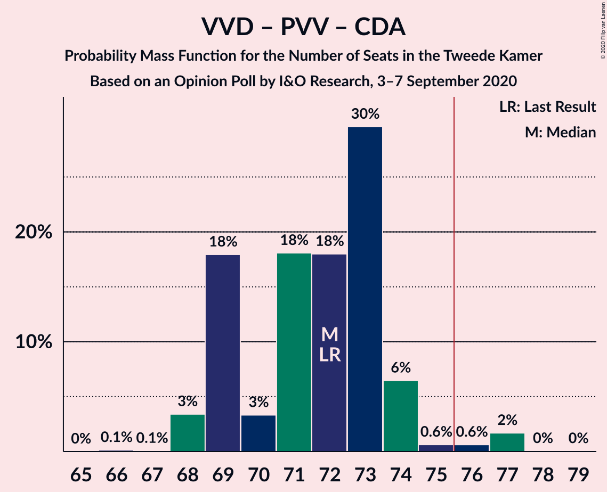

| Number of Seats | Probability | Accumulated | Special Marks |
|:---------------:|:-----------:|:-----------:|:-------------:|
| 66 | 0.1% | 100% |  |
| 67 | 0.1% | 99.9% |  |
| 68 | 3% | 99.8% |  |
| 69 | 18% | 96% |  |
| 70 | 3% | 78% |  |
| 71 | 18% | 75% | Median |
| 72 | 18% | 57% | Last Result |
| 73 | 30% | 39% |  |
| 74 | 6% | 9% |  |
| 75 | 0.6% | 3% |  |
| 76 | 0.6% | 2% | Majority |
| 77 | 2% | 2% |  |
| 78 | 0% | 0.1% |  |
| 79 | 0% | 0% |  |

### GroenLinks – Christen-Democratisch Appèl – Democraten 66 – Partij van de Arbeid – Socialistische Partij – ChristenUnie

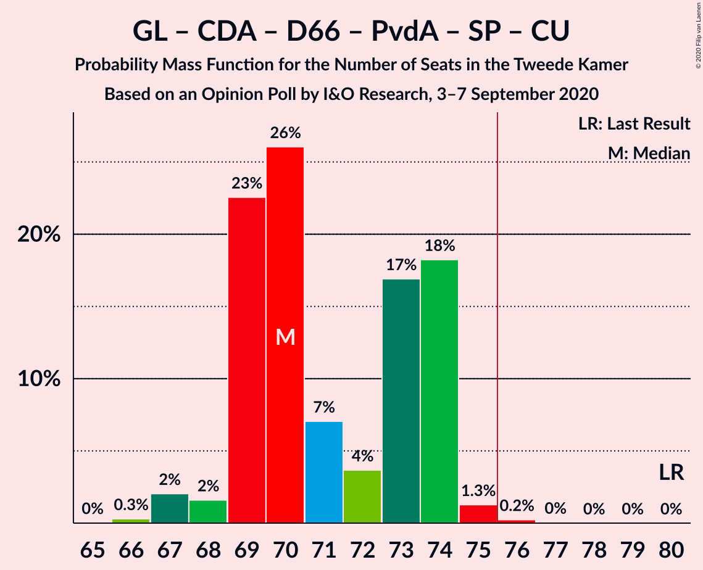

| Number of Seats | Probability | Accumulated | Special Marks |
|:---------------:|:-----------:|:-----------:|:-------------:|
| 66 | 0.3% | 100% |  |
| 67 | 2% | 99.7% |  |
| 68 | 2% | 98% |  |
| 69 | 23% | 96% |  |
| 70 | 26% | 73% | Median |
| 71 | 7% | 47% |  |
| 72 | 4% | 40% |  |
| 73 | 17% | 37% |  |
| 74 | 18% | 20% |  |
| 75 | 1.3% | 2% |  |
| 76 | 0.2% | 0.3% | Majority |
| 77 | 0% | 0.1% |  |
| 78 | 0% | 0% |  |
| 79 | 0% | 0% |  |
| 80 | 0% | 0% | Last Result |

### Volkspartij voor Vrijheid en Democratie – Christen-Democratisch Appèl – Forum voor Democratie – Staatkundig Gereformeerde Partij – 50Plus

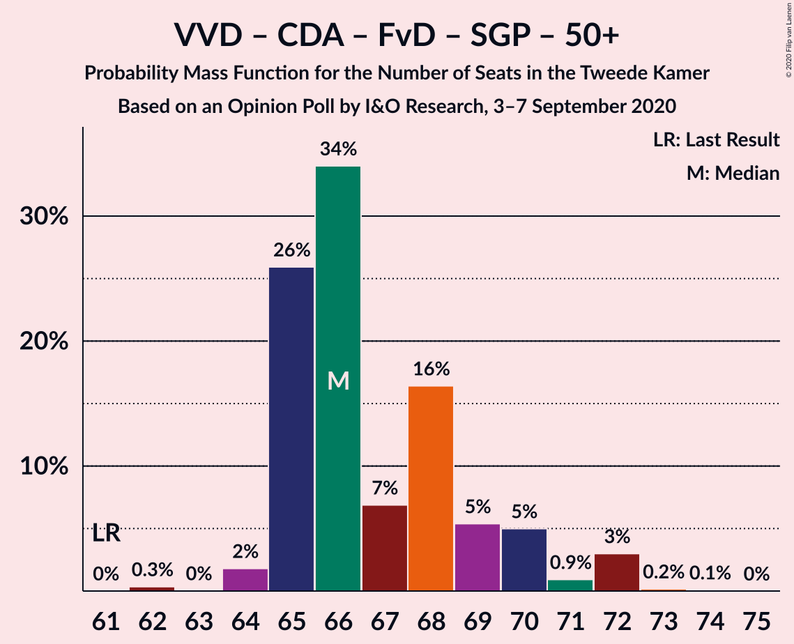

| Number of Seats | Probability | Accumulated | Special Marks |
|:---------------:|:-----------:|:-----------:|:-------------:|
| 61 | 0% | 100% | Last Result |
| 62 | 0.3% | 100% |  |
| 63 | 0% | 99.6% |  |
| 64 | 2% | 99.6% |  |
| 65 | 26% | 98% |  |
| 66 | 34% | 72% | Median |
| 67 | 7% | 38% |  |
| 68 | 16% | 31% |  |
| 69 | 5% | 15% |  |
| 70 | 5% | 9% |  |
| 71 | 0.9% | 4% |  |
| 72 | 3% | 3% |  |
| 73 | 0.2% | 0.3% |  |
| 74 | 0.1% | 0.1% |  |
| 75 | 0% | 0% |  |

### Volkspartij voor Vrijheid en Democratie – Christen-Democratisch Appèl – Forum voor Democratie – Staatkundig Gereformeerde Partij

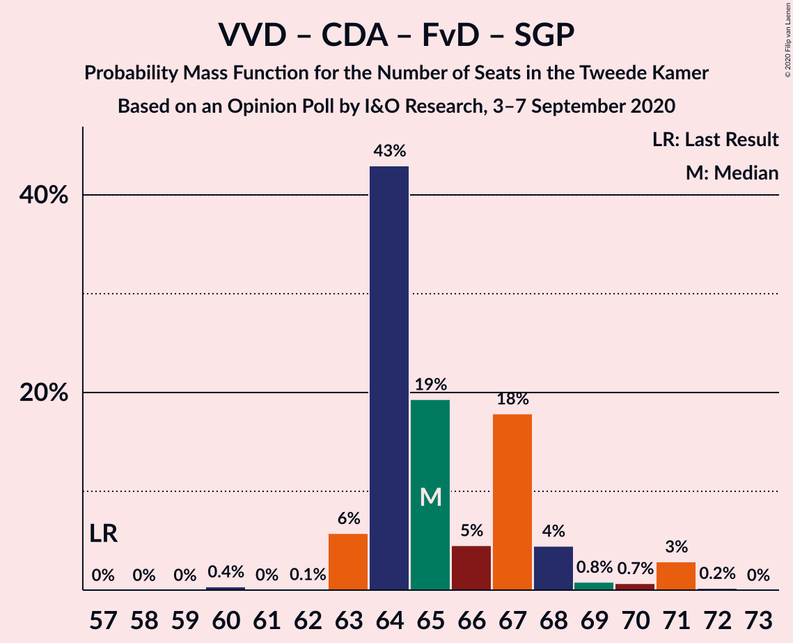

| Number of Seats | Probability | Accumulated | Special Marks |
|:---------------:|:-----------:|:-----------:|:-------------:|
| 57 | 0% | 100% | Last Result |
| 58 | 0% | 100% |  |
| 59 | 0% | 100% |  |
| 60 | 0.4% | 100% |  |
| 61 | 0% | 99.6% |  |
| 62 | 0.1% | 99.6% |  |
| 63 | 6% | 99.5% |  |
| 64 | 43% | 94% |  |
| 65 | 19% | 51% | Median |
| 66 | 5% | 31% |  |
| 67 | 18% | 27% |  |
| 68 | 4% | 9% |  |
| 69 | 0.8% | 5% |  |
| 70 | 0.7% | 4% |  |
| 71 | 3% | 3% |  |
| 72 | 0.2% | 0.2% |  |
| 73 | 0% | 0% |  |

### Volkspartij voor Vrijheid en Democratie – Christen-Democratisch Appèl – Partij van de Arbeid

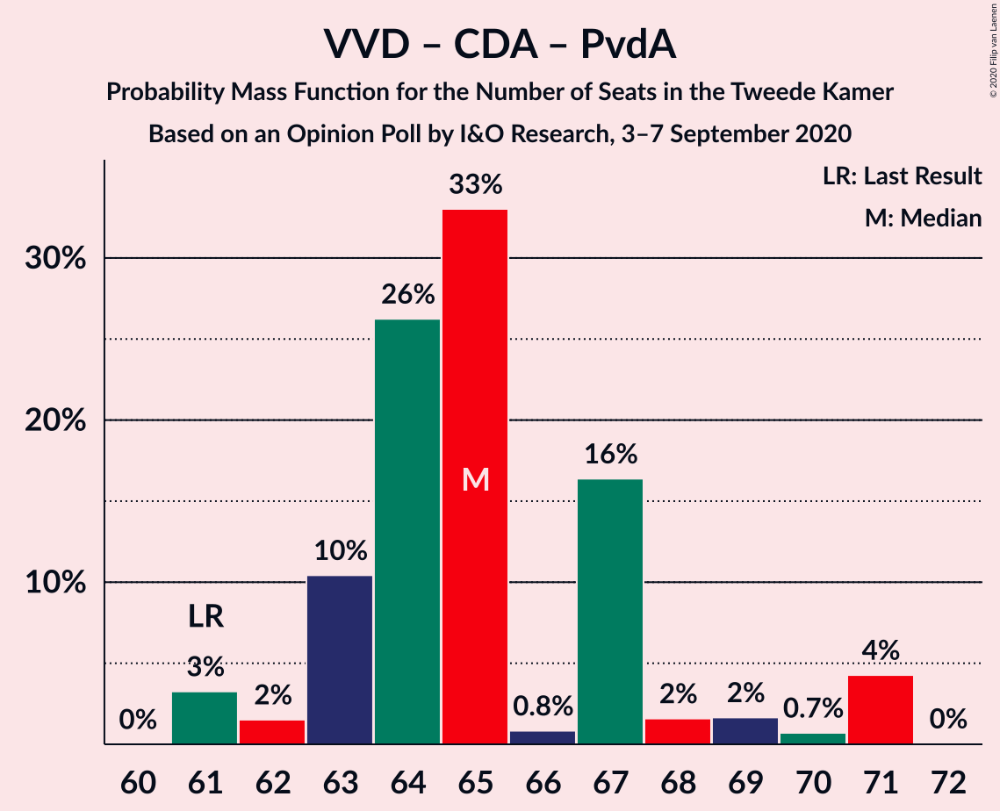

| Number of Seats | Probability | Accumulated | Special Marks |
|:---------------:|:-----------:|:-----------:|:-------------:|
| 61 | 3% | 100% | Last Result |
| 62 | 2% | 97% |  |
| 63 | 10% | 95% |  |
| 64 | 26% | 85% |  |
| 65 | 33% | 59% | Median |
| 66 | 0.8% | 26% |  |
| 67 | 16% | 25% |  |
| 68 | 2% | 8% |  |
| 69 | 2% | 7% |  |
| 70 | 0.7% | 5% |  |
| 71 | 4% | 4% |  |
| 72 | 0% | 0% |  |

### Volkspartij voor Vrijheid en Democratie – Christen-Democratisch Appèl – Forum voor Democratie – 50Plus

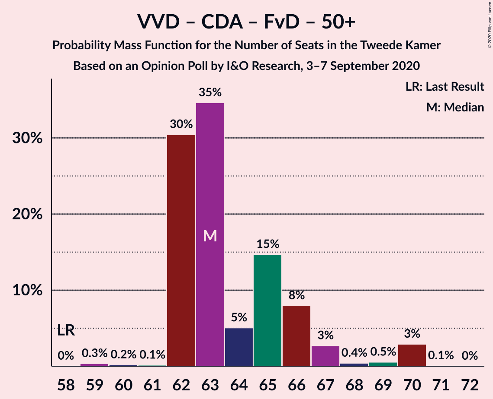

| Number of Seats | Probability | Accumulated | Special Marks |
|:---------------:|:-----------:|:-----------:|:-------------:|
| 58 | 0% | 100% | Last Result |
| 59 | 0.3% | 100% |  |
| 60 | 0.2% | 99.6% |  |
| 61 | 0.1% | 99.5% |  |
| 62 | 30% | 99.3% |  |
| 63 | 35% | 69% | Median |
| 64 | 5% | 34% |  |
| 65 | 15% | 29% |  |
| 66 | 8% | 15% |  |
| 67 | 3% | 7% |  |
| 68 | 0.4% | 4% |  |
| 69 | 0.5% | 3% |  |
| 70 | 3% | 3% |  |
| 71 | 0.1% | 0.1% |  |
| 72 | 0% | 0% |  |

### Volkspartij voor Vrijheid en Democratie – Christen-Democratisch Appèl – Democraten 66

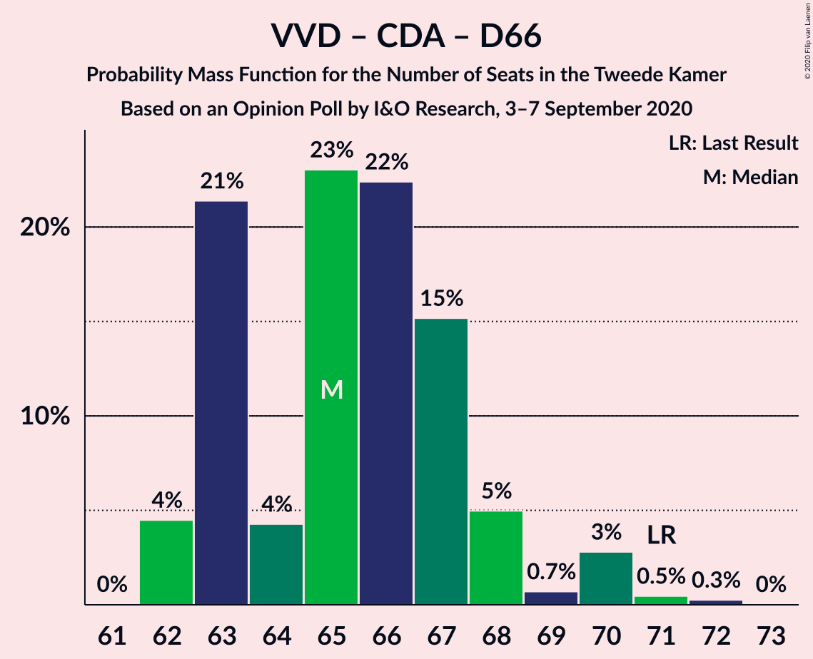

| Number of Seats | Probability | Accumulated | Special Marks |
|:---------------:|:-----------:|:-----------:|:-------------:|
| 62 | 4% | 100% |  |
| 63 | 21% | 95% |  |
| 64 | 4% | 74% |  |
| 65 | 23% | 70% | Median |
| 66 | 22% | 47% |  |
| 67 | 15% | 24% |  |
| 68 | 5% | 9% |  |
| 69 | 0.7% | 4% |  |
| 70 | 3% | 4% |  |
| 71 | 0.5% | 0.7% | Last Result |
| 72 | 0.3% | 0.3% |  |
| 73 | 0% | 0% |  |

### Volkspartij voor Vrijheid en Democratie – Christen-Democratisch Appèl – Forum voor Democratie

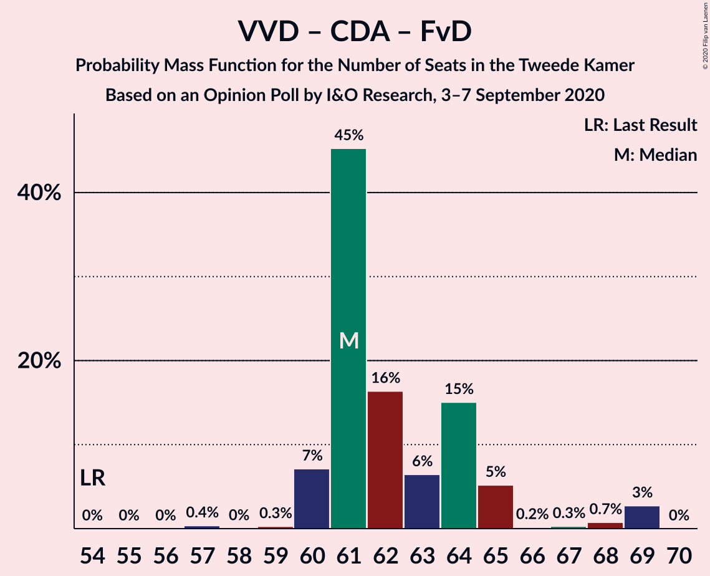

| Number of Seats | Probability | Accumulated | Special Marks |
|:---------------:|:-----------:|:-----------:|:-------------:|
| 54 | 0% | 100% | Last Result |
| 55 | 0% | 100% |  |
| 56 | 0% | 100% |  |
| 57 | 0.4% | 100% |  |
| 58 | 0% | 99.6% |  |
| 59 | 0.3% | 99.6% |  |
| 60 | 7% | 99.3% |  |
| 61 | 45% | 92% |  |
| 62 | 16% | 47% | Median |
| 63 | 6% | 31% |  |
| 64 | 15% | 24% |  |
| 65 | 5% | 9% |  |
| 66 | 0.2% | 4% |  |
| 67 | 0.3% | 4% |  |
| 68 | 0.7% | 3% |  |
| 69 | 3% | 3% |  |
| 70 | 0% | 0% |  |

### Volkspartij voor Vrijheid en Democratie – Democraten 66 – Partij van de Arbeid

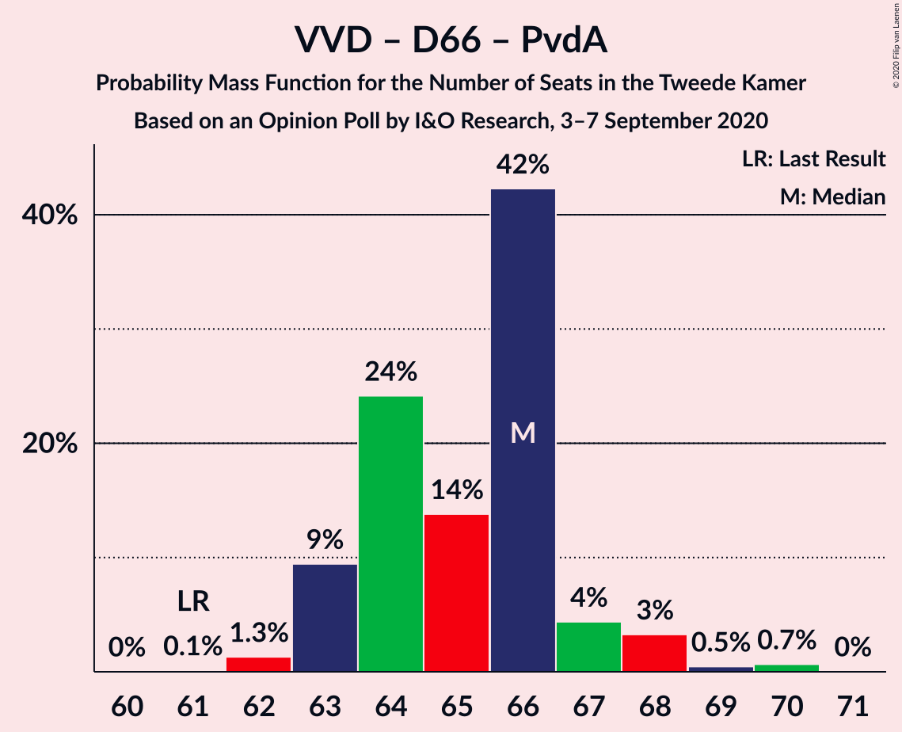

| Number of Seats | Probability | Accumulated | Special Marks |
|:---------------:|:-----------:|:-----------:|:-------------:|
| 61 | 0.1% | 100% | Last Result |
| 62 | 1.3% | 99.8% |  |
| 63 | 9% | 98.5% |  |
| 64 | 24% | 89% |  |
| 65 | 14% | 65% | Median |
| 66 | 42% | 51% |  |
| 67 | 4% | 9% |  |
| 68 | 3% | 4% |  |
| 69 | 0.5% | 1.2% |  |
| 70 | 0.7% | 0.7% |  |
| 71 | 0% | 0% |  |

### GroenLinks – Christen-Democratisch Appèl – Democraten 66 – Partij van de Arbeid – ChristenUnie

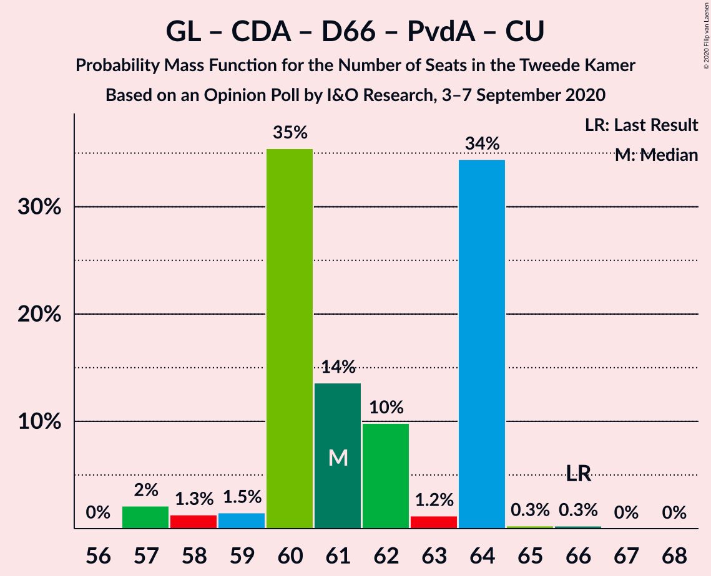

| Number of Seats | Probability | Accumulated | Special Marks |
|:---------------:|:-----------:|:-----------:|:-------------:|
| 56 | 0% | 100% |  |
| 57 | 2% | 99.9% |  |
| 58 | 1.3% | 98% |  |
| 59 | 1.5% | 97% |  |
| 60 | 35% | 95% |  |
| 61 | 14% | 60% | Median |
| 62 | 10% | 46% |  |
| 63 | 1.2% | 36% |  |
| 64 | 34% | 35% |  |
| 65 | 0.3% | 0.6% |  |
| 66 | 0.3% | 0.3% | Last Result |
| 67 | 0% | 0.1% |  |
| 68 | 0% | 0% |  |

### Volkspartij voor Vrijheid en Democratie – Christen-Democratisch Appèl

| Number of Seats | Probability | Accumulated | Special Marks |
|:---------------:|:-----------:|:-----------:|:-------------:|
| 49 | 5% | 100% |  |
| 50 | 0.8% | 95% |  |
| 51 | 46% | 94% |  |
| 52 | 6% | 48% | Last Result, Median |
| 53 | 28% | 42% |  |
| 54 | 5% | 14% |  |
| 55 | 3% | 9% |  |
| 56 | 0.5% | 5% |  |
| 57 | 2% | 5% |  |
| 58 | 3% | 3% |  |
| 59 | 0% | 0% |  |

### Volkspartij voor Vrijheid en Democratie – Partij van de Arbeid

| Number of Seats | Probability | Accumulated | Special Marks |
|:---------------:|:-----------:|:-----------:|:-------------:|
| 42 | 0% | 100% | Last Result |
| 43 | 0% | 100% |  |
| 44 | 0% | 100% |  |
| 45 | 0% | 100% |  |
| 46 | 0% | 100% |  |
| 47 | 0% | 100% |  |
| 48 | 2% | 100% |  |
| 49 | 0.3% | 98% |  |
| 50 | 14% | 98% |  |
| 51 | 5% | 84% |  |
| 52 | 55% | 79% | Median |
| 53 | 15% | 24% |  |
| 54 | 1.2% | 9% |  |
| 55 | 4% | 8% |  |
| 56 | 1.4% | 4% |  |
| 57 | 2% | 2% |  |
| 58 | 0% | 0.1% |  |
| 59 | 0% | 0% |  |

### Christen-Democratisch Appèl – Democraten 66 – Partij van de Arbeid

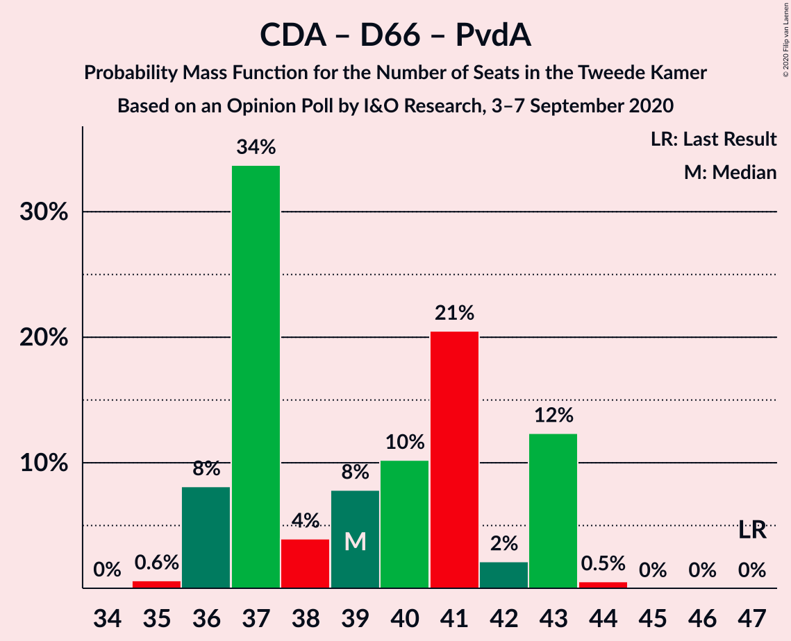

| Number of Seats | Probability | Accumulated | Special Marks |
|:---------------:|:-----------:|:-----------:|:-------------:|
| 34 | 0% | 100% |  |
| 35 | 0.6% | 99.9% |  |
| 36 | 8% | 99.3% |  |
| 37 | 34% | 91% |  |
| 38 | 4% | 57% |  |
| 39 | 8% | 54% | Median |
| 40 | 10% | 46% |  |
| 41 | 21% | 36% |  |
| 42 | 2% | 15% |  |
| 43 | 12% | 13% |  |
| 44 | 0.5% | 0.5% |  |
| 45 | 0% | 0% |  |
| 46 | 0% | 0% |  |
| 47 | 0% | 0% | Last Result |

### Christen-Democratisch Appèl – Partij van de Arbeid – ChristenUnie

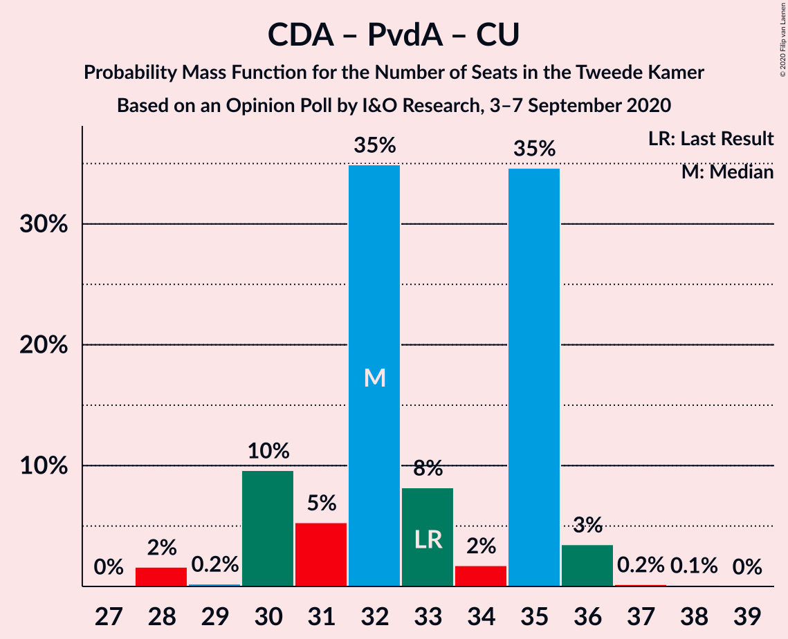

| Number of Seats | Probability | Accumulated | Special Marks |
|:---------------:|:-----------:|:-----------:|:-------------:|
| 28 | 2% | 100% |  |
| 29 | 0.2% | 98% |  |
| 30 | 10% | 98% |  |
| 31 | 5% | 89% |  |
| 32 | 35% | 83% |  |
| 33 | 8% | 48% | Last Result, Median |
| 34 | 2% | 40% |  |
| 35 | 35% | 38% |  |
| 36 | 3% | 4% |  |
| 37 | 0.2% | 0.3% |  |
| 38 | 0.1% | 0.1% |  |
| 39 | 0% | 0% |  |

### Christen-Democratisch Appèl – Democraten 66

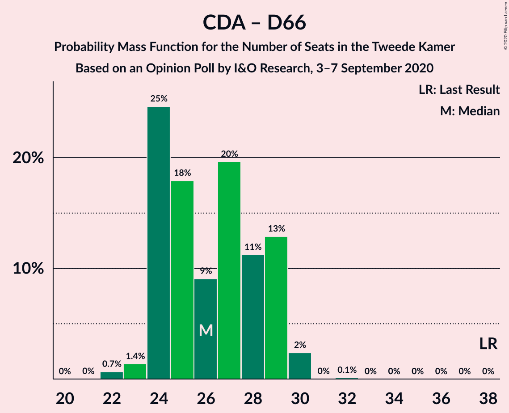

| Number of Seats | Probability | Accumulated | Special Marks |
|:---------------:|:-----------:|:-----------:|:-------------:|
| 22 | 0.7% | 100% |  |
| 23 | 1.4% | 99.3% |  |
| 24 | 25% | 98% |  |
| 25 | 18% | 73% |  |
| 26 | 9% | 55% | Median |
| 27 | 20% | 46% |  |
| 28 | 11% | 27% |  |
| 29 | 13% | 15% |  |
| 30 | 2% | 3% |  |
| 31 | 0% | 0.1% |  |
| 32 | 0.1% | 0.1% |  |
| 33 | 0% | 0% |  |
| 34 | 0% | 0% |  |
| 35 | 0% | 0% |  |
| 36 | 0% | 0% |  |
| 37 | 0% | 0% |  |
| 38 | 0% | 0% | Last Result |

### Christen-Democratisch Appèl – Partij van de Arbeid

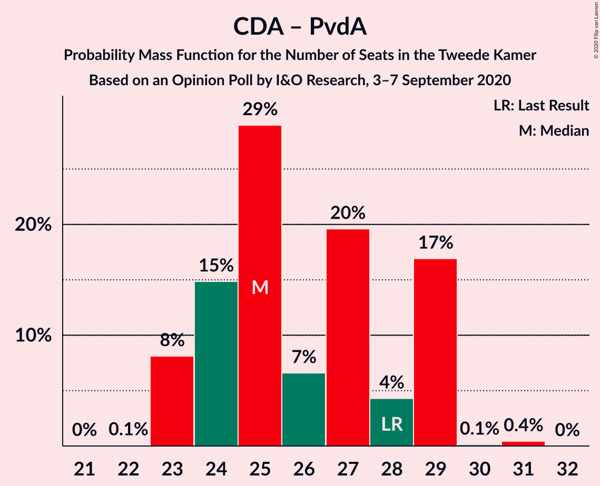

| Number of Seats | Probability | Accumulated | Special Marks |
|:---------------:|:-----------:|:-----------:|:-------------:|
| 22 | 0.1% | 100% |  |
| 23 | 8% | 99.9% |  |
| 24 | 15% | 92% |  |
| 25 | 29% | 77% |  |
| 26 | 7% | 48% | Median |
| 27 | 20% | 41% |  |
| 28 | 4% | 22% | Last Result |
| 29 | 17% | 17% |  |
| 30 | 0.1% | 0.6% |  |
| 31 | 0.4% | 0.4% |  |
| 32 | 0% | 0% |  |

## Technical Information

### Opinion Poll

+ **Polling firm:** I&O Research
+ **Commissioner(s):** —
+ **Fieldwork period:** 3–7 September 2020

### Calculations

+ **Sample size:** 2053
+ **Simulations done:** 1,048,576
+ **Error estimate:** 2.29%

