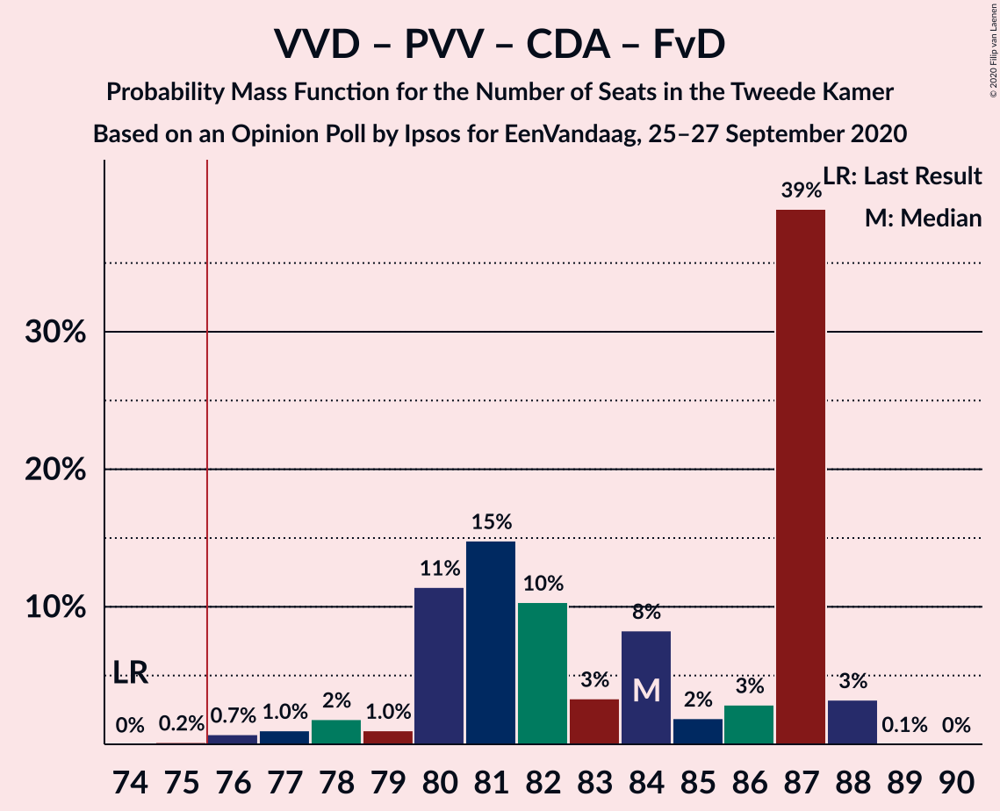

# Opinion Poll by Ipsos for EenVandaag, 25–27 September 2020

<a href="#voting-intentions">Voting Intentions</a> | <a href="#seats">Seats</a> | <a href="#coalitions">Coalitions</a> | <a href="#technical-information">Technical Information</a>

## Voting Intentions

### Confidence Intervals

| Party | Last Result | Poll Result | 80% Confidence Interval | 90% Confidence Interval | 95% Confidence Interval | 99% Confidence Interval |
|:-----:|:-----------:|:-----------:|:-----------------------:|:-----------------------:|:-----------------------:|:-----------------------:|
| Volkspartij voor Vrijheid en Democratie | 21.3% | 25.6% | 24.0–27.4% |23.5–27.9% |23.1–28.4% |22.3–29.2% |
| Partij voor de Vrijheid | 13.1% | 12.9% | 11.6–14.3% |11.3–14.7% |11.0–15.0% |10.4–15.7% |
| Christen-Democratisch Appèl | 12.4% | 10.8% | 9.6–12.1% |9.3–12.5% |9.1–12.8% |8.5–13.5% |
| Partij van de Arbeid | 5.7% | 8.8% | 7.8–10.0% |7.5–10.4% |7.2–10.7% |6.8–11.3% |
| Democraten 66 | 12.2% | 8.6% | 7.6–9.8% |7.3–10.2% |7.1–10.5% |6.6–11.1% |
| GroenLinks | 9.1% | 8.1% | 7.1–9.3% |6.9–9.6% |6.6–10.0% |6.2–10.5% |
| Socialistische Partij | 9.1% | 6.7% | 5.8–7.8% |5.6–8.1% |5.3–8.4% |5.0–8.9% |
| Forum voor Democratie | 1.8% | 5.0% | 4.3–6.0% |4.0–6.3% |3.9–6.5% |3.5–7.0% |
| Partij voor de Dieren | 3.2% | 4.4% | 3.7–5.4% |3.5–5.6% |3.4–5.9% |3.0–6.3% |
| ChristenUnie | 3.4% | 3.9% | 3.2–4.8% |3.0–5.0% |2.9–5.2% |2.6–5.7% |
| Staatkundig Gereformeerde Partij | 2.1% | 1.9% | 1.4–2.6% |1.3–2.7% |1.2–2.9% |1.0–3.3% |
| 50Plus | 3.1% | 1.5% | 1.1–2.1% |1.0–2.3% |0.9–2.5% |0.8–2.8% |
| DENK | 2.1% | 1.0% | 0.7–1.6% |0.7–1.7% |0.6–1.9% |0.5–2.1% |

*Note:* The poll result column reflects the actual value used in the calculations. Published results may vary slightly, and in addition be rounded to fewer digits.

## Seats

### Confidence Intervals

| Party | Last Result | Median | 80% Confidence Interval | 90% Confidence Interval | 95% Confidence Interval | 99% Confidence Interval |
|:-----:|:-----------:|:------:|:-----------------------:|:-----------------------:|:-----------------------:|:-----------------------:|
| <a href="#volkspartij-voor-vrijheid-en-democratie">Volkspartij voor Vrijheid en Democratie</a> | 33 | 38 | 36–41 |36–42 |34–43 |33–44 |
| <a href="#partij-voor-de-vrijheid">Partij voor de Vrijheid</a> | 20 | 22 | 19–23 |18–23 |18–23 |17–24 |
| <a href="#christen-democratisch-appèl">Christen-Democratisch Appèl</a> | 19 | 17 | 15–19 |15–19 |13–19 |13–21 |
| <a href="#partij-van-de-arbeid">Partij van de Arbeid</a> | 9 | 13 | 12–15 |11–16 |11–16 |11–17 |
| <a href="#democraten-66">Democraten 66</a> | 19 | 12 | 11–14 |11–14 |11–15 |10–17 |
| <a href="#groenlinks">GroenLinks</a> | 14 | 12 | 11–14 |10–14 |10–14 |9–15 |
| <a href="#socialistische-partij">Socialistische Partij</a> | 14 | 10 | 9–12 |9–12 |8–12 |7–14 |
| <a href="#forum-voor-democratie">Forum voor Democratie</a> | 2 | 8 | 6–9 |6–9 |6–9 |5–10 |
| <a href="#partij-voor-de-dieren">Partij voor de Dieren</a> | 5 | 6 | 6–7 |5–8 |5–8 |4–9 |
| <a href="#christenunie">ChristenUnie</a> | 5 | 5 | 5–7 |4–7 |4–7 |3–8 |
| <a href="#staatkundig-gereformeerde-partij">Staatkundig Gereformeerde Partij</a> | 3 | 3 | 1–4 |1–4 |1–4 |1–5 |
| <a href="#50plus">50Plus</a> | 4 | 1 | 1–2 |1–3 |1–3 |1–4 |
| <a href="#denk">DENK</a> | 3 | 1 | 1–2 |1–2 |0–2 |0–3 |

### Volkspartij voor Vrijheid en Democratie

*For a full overview of the results for this party, see the [Volkspartij voor Vrijheid en Democratie](party-volkspartijvoorvrijheidendemocratie.html) page.*

| Number of Seats | Probability | Accumulated | Special Marks |
|:---------------:|:-----------:|:-----------:|:-------------:|
| 33 | 1.0% | 100% | Last Result |
| 34 | 3% | 99.0% |  |
| 35 | 0.5% | 96% |  |
| 36 | 18% | 95% |  |
| 37 | 5% | 78% |  |
| 38 | 37% | 73% | Median |
| 39 | 12% | 36% |  |
| 40 | 7% | 24% |  |
| 41 | 9% | 17% |  |
| 42 | 3% | 8% |  |
| 43 | 3% | 4% |  |
| 44 | 0.8% | 0.9% |  |
| 45 | 0% | 0.1% |  |
| 46 | 0.1% | 0.1% |  |
| 47 | 0% | 0% |  |

### Partij voor de Vrijheid

*For a full overview of the results for this party, see the [Partij voor de Vrijheid](party-partijvoordevrijheid.html) page.*

| Number of Seats | Probability | Accumulated | Special Marks |
|:---------------:|:-----------:|:-----------:|:-------------:|
| 15 | 0% | 100% |  |
| 16 | 0.4% | 99.9% |  |
| 17 | 2% | 99.6% |  |
| 18 | 5% | 98% |  |
| 19 | 20% | 93% |  |
| 20 | 16% | 73% | Last Result |
| 21 | 5% | 57% |  |
| 22 | 42% | 52% | Median |
| 23 | 10% | 10% |  |
| 24 | 0.4% | 0.6% |  |
| 25 | 0.2% | 0.2% |  |
| 26 | 0% | 0% |  |

### Christen-Democratisch Appèl

*For a full overview of the results for this party, see the [Christen-Democratisch Appèl](party-christen-democratischappèl.html) page.*

| Number of Seats | Probability | Accumulated | Special Marks |
|:---------------:|:-----------:|:-----------:|:-------------:|
| 12 | 0.1% | 100% |  |
| 13 | 3% | 99.9% |  |
| 14 | 2% | 97% |  |
| 15 | 10% | 95% |  |
| 16 | 30% | 85% |  |
| 17 | 4% | 54% | Median |
| 18 | 9% | 50% |  |
| 19 | 40% | 41% | Last Result |
| 20 | 0.4% | 1.2% |  |
| 21 | 0.8% | 0.8% |  |
| 22 | 0% | 0% |  |

### Partij van de Arbeid

*For a full overview of the results for this party, see the [Partij van de Arbeid](party-partijvandearbeid.html) page.*

| Number of Seats | Probability | Accumulated | Special Marks |
|:---------------:|:-----------:|:-----------:|:-------------:|
| 9 | 0.1% | 100% | Last Result |
| 10 | 0.2% | 99.9% |  |
| 11 | 8% | 99.7% |  |
| 12 | 12% | 92% |  |
| 13 | 37% | 80% | Median |
| 14 | 11% | 43% |  |
| 15 | 22% | 32% |  |
| 16 | 9% | 10% |  |
| 17 | 0.8% | 0.9% |  |
| 18 | 0.1% | 0.1% |  |
| 19 | 0% | 0% |  |

### Democraten 66

*For a full overview of the results for this party, see the [Democraten 66](party-democraten66.html) page.*

| Number of Seats | Probability | Accumulated | Special Marks |
|:---------------:|:-----------:|:-----------:|:-------------:|
| 9 | 0.1% | 100% |  |
| 10 | 2% | 99.9% |  |
| 11 | 19% | 98% |  |
| 12 | 38% | 80% | Median |
| 13 | 28% | 41% |  |
| 14 | 9% | 13% |  |
| 15 | 3% | 4% |  |
| 16 | 0.8% | 1.3% |  |
| 17 | 0.1% | 0.5% |  |
| 18 | 0.4% | 0.4% |  |
| 19 | 0% | 0% | Last Result |

### GroenLinks

*For a full overview of the results for this party, see the [GroenLinks](party-groenlinks.html) page.*

| Number of Seats | Probability | Accumulated | Special Marks |
|:---------------:|:-----------:|:-----------:|:-------------:|
| 9 | 2% | 100% |  |
| 10 | 8% | 98% |  |
| 11 | 35% | 90% |  |
| 12 | 22% | 55% | Median |
| 13 | 18% | 32% |  |
| 14 | 12% | 14% | Last Result |
| 15 | 2% | 2% |  |
| 16 | 0.2% | 0.3% |  |
| 17 | 0.1% | 0.1% |  |
| 18 | 0% | 0% |  |

### Socialistische Partij

*For a full overview of the results for this party, see the [Socialistische Partij](party-socialistischepartij.html) page.*

| Number of Seats | Probability | Accumulated | Special Marks |
|:---------------:|:-----------:|:-----------:|:-------------:|
| 7 | 0.5% | 100% |  |
| 8 | 3% | 99.5% |  |
| 9 | 29% | 97% |  |
| 10 | 22% | 68% | Median |
| 11 | 35% | 46% |  |
| 12 | 9% | 11% |  |
| 13 | 0.7% | 1.4% |  |
| 14 | 0.7% | 0.7% | Last Result |
| 15 | 0% | 0% |  |

### Forum voor Democratie

*For a full overview of the results for this party, see the [Forum voor Democratie](party-forumvoordemocratie.html) page.*

| Number of Seats | Probability | Accumulated | Special Marks |
|:---------------:|:-----------:|:-----------:|:-------------:|
| 2 | 0% | 100% | Last Result |
| 3 | 0% | 100% |  |
| 4 | 0.1% | 100% |  |
| 5 | 2% | 99.9% |  |
| 6 | 16% | 98% |  |
| 7 | 20% | 82% |  |
| 8 | 52% | 62% | Median |
| 9 | 9% | 10% |  |
| 10 | 0.9% | 1.2% |  |
| 11 | 0.3% | 0.3% |  |
| 12 | 0% | 0% |  |

### Partij voor de Dieren

*For a full overview of the results for this party, see the [Partij voor de Dieren](party-partijvoordedieren.html) page.*

| Number of Seats | Probability | Accumulated | Special Marks |
|:---------------:|:-----------:|:-----------:|:-------------:|
| 4 | 1.1% | 100% |  |
| 5 | 4% | 98.9% | Last Result |
| 6 | 56% | 95% | Median |
| 7 | 32% | 38% |  |
| 8 | 6% | 6% |  |
| 9 | 0.4% | 0.5% |  |
| 10 | 0% | 0.1% |  |
| 11 | 0% | 0% |  |

### ChristenUnie

*For a full overview of the results for this party, see the [ChristenUnie](party-christenunie.html) page.*

| Number of Seats | Probability | Accumulated | Special Marks |
|:---------------:|:-----------:|:-----------:|:-------------:|
| 3 | 0.7% | 100% |  |
| 4 | 5% | 99.3% |  |
| 5 | 45% | 94% | Last Result, Median |
| 6 | 34% | 49% |  |
| 7 | 13% | 15% |  |
| 8 | 2% | 2% |  |
| 9 | 0.3% | 0.3% |  |
| 10 | 0% | 0% |  |

### Staatkundig Gereformeerde Partij

*For a full overview of the results for this party, see the [Staatkundig Gereformeerde Partij](party-staatkundiggereformeerdepartij.html) page.*

| Number of Seats | Probability | Accumulated | Special Marks |
|:---------------:|:-----------:|:-----------:|:-------------:|
| 1 | 11% | 100% |  |
| 2 | 17% | 89% |  |
| 3 | 56% | 72% | Last Result, Median |
| 4 | 15% | 15% |  |
| 5 | 0.7% | 0.7% |  |
| 6 | 0% | 0% |  |

### 50Plus

*For a full overview of the results for this party, see the [50Plus](party-50plus.html) page.*

| Number of Seats | Probability | Accumulated | Special Marks |
|:---------------:|:-----------:|:-----------:|:-------------:|
| 1 | 56% | 100% | Median |
| 2 | 35% | 44% |  |
| 3 | 6% | 8% |  |
| 4 | 2% | 2% | Last Result |
| 5 | 0% | 0% |  |

### DENK

*For a full overview of the results for this party, see the [DENK](party-denk.html) page.*

| Number of Seats | Probability | Accumulated | Special Marks |
|:---------------:|:-----------:|:-----------:|:-------------:|
| 0 | 4% | 100% |  |
| 1 | 66% | 96% | Median |
| 2 | 29% | 30% |  |
| 3 | 0.9% | 0.9% | Last Result |
| 4 | 0% | 0% |  |

## Coalitions

### Confidence Intervals

| Coalition | Last Result | Median | Majority? | 80% Confidence Interval | 90% Confidence Interval | 95% Confidence Interval | 99% Confidence Interval |
|:---------:|:-----------:|:------:|:---------:|:-----------------------:|:-----------------------:|:-----------------------:|:-----------------------:|
| Volkspartij voor Vrijheid en Democratie – Christen-Democratisch Appèl – Partij van de Arbeid – Democraten 66 – ChristenUnie | 85 | 87 | 100% | 84–90 | 82–91 | 80–92 | 80–95 |
| Volkspartij voor Vrijheid en Democratie – Partij voor de Vrijheid – Christen-Democratisch Appèl – Forum voor Democratie – Staatkundig Gereformeerde Partij | 77 | 87 | 100% | 82–90 | 82–90 | 81–91 | 79–91 |
| Volkspartij voor Vrijheid en Democratie – Christen-Democratisch Appèl – Democraten 66 – GroenLinks – ChristenUnie | 90 | 85 | 100% | 83–89 | 81–91 | 79–91 | 79–91 |
| Volkspartij voor Vrijheid en Democratie – Partij voor de Vrijheid – Christen-Democratisch Appèl – Forum voor Democratie | 74 | 84 | 99.8% | 80–87 | 80–87 | 78–88 | 76–88 |
| Volkspartij voor Vrijheid en Democratie – Partij voor de Vrijheid – Christen-Democratisch Appèl | 72 | 78 | 55% | 73–79 | 72–79 | 70–79 | 69–80 |
| Volkspartij voor Vrijheid en Democratie – Christen-Democratisch Appèl – Democraten 66 – ChristenUnie | 76 | 74 | 14% | 69–77 | 69–78 | 66–79 | 66–81 |
| Christen-Democratisch Appèl – Partij van de Arbeid – Democraten 66 – GroenLinks – Socialistische Partij – ChristenUnie | 80 | 71 | 1.4% | 67–74 | 66–75 | 65–75 | 65–77 |
| Volkspartij voor Vrijheid en Democratie – Christen-Democratisch Appèl – Partij van de Arbeid | 61 | 70 | 0.1% | 66–71 | 64–72 | 64–74 | 62–74 |
| Volkspartij voor Vrijheid en Democratie – Christen-Democratisch Appèl – Democraten 66 | 71 | 69 | 0.1% | 63–72 | 63–72 | 61–73 | 61–75 |
| Volkspartij voor Vrijheid en Democratie – Christen-Democratisch Appèl – Forum voor Democratie – Staatkundig Gereformeerde Partij – 50Plus | 61 | 68 | 0% | 64–70 | 63–72 | 63–72 | 61–73 |
| Volkspartij voor Vrijheid en Democratie – Christen-Democratisch Appèl – Forum voor Democratie – Staatkundig Gereformeerde Partij | 57 | 66 | 0% | 62–68 | 61–70 | 60–71 | 60–71 |
| Volkspartij voor Vrijheid en Democratie – Partij van de Arbeid – Democraten 66 | 61 | 63 | 0% | 62–67 | 61–68 | 59–70 | 59–73 |
| Volkspartij voor Vrijheid en Democratie – Christen-Democratisch Appèl – Forum voor Democratie – 50Plus | 58 | 66 | 0% | 60–67 | 60–68 | 59–69 | 57–70 |
| Volkspartij voor Vrijheid en Democratie – Christen-Democratisch Appèl – Forum voor Democratie | 54 | 64 | 0% | 58–66 | 58–67 | 58–68 | 56–68 |
| Christen-Democratisch Appèl – Partij van de Arbeid – Democraten 66 – GroenLinks – ChristenUnie | 66 | 60 | 0% | 56–64 | 56–66 | 56–66 | 54–66 |
| Volkspartij voor Vrijheid en Democratie – Christen-Democratisch Appèl | 52 | 56 | 0% | 52–58 | 50–59 | 50–60 | 49–60 |
| Volkspartij voor Vrijheid en Democratie – Partij van de Arbeid | 42 | 51 | 0% | 50–54 | 48–55 | 48–57 | 46–58 |
| Christen-Democratisch Appèl – Partij van de Arbeid – Democraten 66 | 47 | 44 | 0% | 40–46 | 37–48 | 37–48 | 37–49 |
| Christen-Democratisch Appèl – Partij van de Arbeid – ChristenUnie | 33 | 37 | 0% | 33–39 | 32–41 | 32–41 | 29–41 |
| Christen-Democratisch Appèl – Partij van de Arbeid | 28 | 31 | 0% | 28–33 | 26–35 | 26–35 | 25–35 |
| Christen-Democratisch Appèl – Democraten 66 | 38 | 31 | 0% | 27–32 | 26–32 | 26–32 | 25–34 |

### Volkspartij voor Vrijheid en Democratie – Christen-Democratisch Appèl – Partij van de Arbeid – Democraten 66 – ChristenUnie

| Number of Seats | Probability | Accumulated | Special Marks |
|:---------------:|:-----------:|:-----------:|:-------------:|
| 79 | 0.3% | 100% |  |
| 80 | 3% | 99.7% |  |
| 81 | 0.6% | 97% |  |
| 82 | 1.2% | 96% |  |
| 83 | 2% | 95% |  |
| 84 | 17% | 93% |  |
| 85 | 3% | 76% | Last Result, Median |
| 86 | 3% | 73% |  |
| 87 | 34% | 70% |  |
| 88 | 3% | 36% |  |
| 89 | 5% | 33% |  |
| 90 | 23% | 28% |  |
| 91 | 1.2% | 5% |  |
| 92 | 2% | 4% |  |
| 93 | 0.7% | 2% |  |
| 94 | 0.1% | 1.4% |  |
| 95 | 1.3% | 1.3% |  |
| 96 | 0.1% | 0.1% |  |
| 97 | 0% | 0% |  |

### Volkspartij voor Vrijheid en Democratie – Partij voor de Vrijheid – Christen-Democratisch Appèl – Forum voor Democratie – Staatkundig Gereformeerde Partij

| Number of Seats | Probability | Accumulated | Special Marks |
|:---------------:|:-----------:|:-----------:|:-------------:|
| 77 | 0% | 100% | Last Result |
| 78 | 0.2% | 100% |  |
| 79 | 0.8% | 99.8% |  |
| 80 | 0.1% | 99.0% |  |
| 81 | 2% | 98.9% |  |
| 82 | 12% | 97% |  |
| 83 | 7% | 85% |  |
| 84 | 9% | 78% |  |
| 85 | 11% | 69% |  |
| 86 | 3% | 58% |  |
| 87 | 9% | 55% |  |
| 88 | 2% | 46% | Median |
| 89 | 8% | 44% |  |
| 90 | 33% | 36% |  |
| 91 | 3% | 3% |  |
| 92 | 0% | 0% |  |

### Volkspartij voor Vrijheid en Democratie – Christen-Democratisch Appèl – Democraten 66 – GroenLinks – ChristenUnie

| Number of Seats | Probability | Accumulated | Special Marks |
|:---------------:|:-----------:|:-----------:|:-------------:|
| 78 | 0.3% | 100% |  |
| 79 | 3% | 99.7% |  |
| 80 | 0.2% | 97% |  |
| 81 | 2% | 96% |  |
| 82 | 2% | 95% |  |
| 83 | 12% | 93% |  |
| 84 | 5% | 82% | Median |
| 85 | 34% | 77% |  |
| 86 | 16% | 43% |  |
| 87 | 14% | 27% |  |
| 88 | 2% | 12% |  |
| 89 | 3% | 10% |  |
| 90 | 0.9% | 8% | Last Result |
| 91 | 6% | 7% |  |
| 92 | 0.3% | 0.4% |  |
| 93 | 0% | 0.1% |  |
| 94 | 0% | 0% |  |

### Volkspartij voor Vrijheid en Democratie – Partij voor de Vrijheid – Christen-Democratisch Appèl – Forum voor Democratie

| Number of Seats | Probability | Accumulated | Special Marks |
|:---------------:|:-----------:|:-----------:|:-------------:|
| 74 | 0% | 100% | Last Result |
| 75 | 0.2% | 100% |  |
| 76 | 0.7% | 99.8% | Majority |
| 77 | 1.0% | 99.1% |  |
| 78 | 2% | 98% |  |
| 79 | 1.0% | 96% |  |
| 80 | 11% | 95% |  |
| 81 | 15% | 84% |  |
| 82 | 10% | 69% |  |
| 83 | 3% | 59% |  |
| 84 | 8% | 55% |  |
| 85 | 2% | 47% | Median |
| 86 | 3% | 45% |  |
| 87 | 39% | 42% |  |
| 88 | 3% | 3% |  |
| 89 | 0.1% | 0.1% |  |
| 90 | 0% | 0% |  |

### Volkspartij voor Vrijheid en Democratie – Partij voor de Vrijheid – Christen-Democratisch Appèl

| Number of Seats | Probability | Accumulated | Special Marks |
|:---------------:|:-----------:|:-----------:|:-------------:|
| 68 | 0.1% | 100% |  |
| 69 | 0.9% | 99.9% |  |
| 70 | 3% | 99.0% |  |
| 71 | 0.1% | 96% |  |
| 72 | 2% | 96% | Last Result |
| 73 | 6% | 94% |  |
| 74 | 30% | 88% |  |
| 75 | 4% | 59% |  |
| 76 | 0.9% | 55% | Majority |
| 77 | 2% | 54% | Median |
| 78 | 9% | 52% |  |
| 79 | 41% | 43% |  |
| 80 | 2% | 2% |  |
| 81 | 0% | 0.4% |  |
| 82 | 0.3% | 0.3% |  |
| 83 | 0% | 0% |  |

### Volkspartij voor Vrijheid en Democratie – Christen-Democratisch Appèl – Democraten 66 – ChristenUnie

| Number of Seats | Probability | Accumulated | Special Marks |
|:---------------:|:-----------:|:-----------:|:-------------:|
| 66 | 3% | 100% |  |
| 67 | 0.1% | 97% |  |
| 68 | 0.1% | 97% |  |
| 69 | 11% | 96% |  |
| 70 | 0.8% | 86% |  |
| 71 | 6% | 85% |  |
| 72 | 0.8% | 79% | Median |
| 73 | 9% | 78% |  |
| 74 | 41% | 69% |  |
| 75 | 14% | 28% |  |
| 76 | 2% | 14% | Last Result, Majority |
| 77 | 4% | 12% |  |
| 78 | 5% | 7% |  |
| 79 | 1.1% | 3% |  |
| 80 | 0.1% | 2% |  |
| 81 | 1.4% | 1.5% |  |
| 82 | 0.1% | 0.1% |  |
| 83 | 0% | 0% |  |

### Christen-Democratisch Appèl – Partij van de Arbeid – Democraten 66 – GroenLinks – Socialistische Partij – ChristenUnie

| Number of Seats | Probability | Accumulated | Special Marks |
|:---------------:|:-----------:|:-----------:|:-------------:|
| 64 | 0.4% | 100% |  |
| 65 | 3% | 99.6% |  |
| 66 | 7% | 97% |  |
| 67 | 3% | 90% |  |
| 68 | 3% | 87% |  |
| 69 | 1.5% | 84% | Median |
| 70 | 5% | 83% |  |
| 71 | 37% | 77% |  |
| 72 | 26% | 40% |  |
| 73 | 2% | 14% |  |
| 74 | 3% | 12% |  |
| 75 | 8% | 9% |  |
| 76 | 0.5% | 1.4% | Majority |
| 77 | 0.8% | 0.9% |  |
| 78 | 0% | 0% |  |
| 79 | 0% | 0% |  |
| 80 | 0% | 0% | Last Result |

### Volkspartij voor Vrijheid en Democratie – Christen-Democratisch Appèl – Partij van de Arbeid

| Number of Seats | Probability | Accumulated | Special Marks |
|:---------------:|:-----------:|:-----------:|:-------------:|
| 61 | 0% | 100% | Last Result |
| 62 | 1.2% | 100% |  |
| 63 | 0.3% | 98.7% |  |
| 64 | 5% | 98% |  |
| 65 | 2% | 93% |  |
| 66 | 3% | 91% |  |
| 67 | 17% | 88% |  |
| 68 | 2% | 71% | Median |
| 69 | 2% | 69% |  |
| 70 | 48% | 67% |  |
| 71 | 12% | 19% |  |
| 72 | 2% | 7% |  |
| 73 | 1.1% | 5% |  |
| 74 | 4% | 4% |  |
| 75 | 0.1% | 0.1% |  |
| 76 | 0% | 0.1% | Majority |
| 77 | 0% | 0.1% |  |
| 78 | 0% | 0% |  |

### Volkspartij voor Vrijheid en Democratie – Christen-Democratisch Appèl – Democraten 66

| Number of Seats | Probability | Accumulated | Special Marks |
|:---------------:|:-----------:|:-----------:|:-------------:|
| 61 | 3% | 100% |  |
| 62 | 1.1% | 97% |  |
| 63 | 8% | 96% |  |
| 64 | 2% | 87% |  |
| 65 | 3% | 85% |  |
| 66 | 2% | 83% |  |
| 67 | 9% | 80% | Median |
| 68 | 21% | 71% |  |
| 69 | 33% | 51% |  |
| 70 | 6% | 18% |  |
| 71 | 2% | 12% | Last Result |
| 72 | 8% | 10% |  |
| 73 | 1.4% | 3% |  |
| 74 | 0.2% | 1.2% |  |
| 75 | 0.8% | 0.9% |  |
| 76 | 0.1% | 0.1% | Majority |
| 77 | 0% | 0% |  |

### Volkspartij voor Vrijheid en Democratie – Christen-Democratisch Appèl – Forum voor Democratie – Staatkundig Gereformeerde Partij – 50Plus

| Number of Seats | Probability | Accumulated | Special Marks |
|:---------------:|:-----------:|:-----------:|:-------------:|
| 60 | 0% | 100% |  |
| 61 | 0.9% | 99.9% | Last Result |
| 62 | 0.7% | 99.0% |  |
| 63 | 6% | 98% |  |
| 64 | 9% | 93% |  |
| 65 | 13% | 84% |  |
| 66 | 2% | 71% |  |
| 67 | 11% | 68% | Median |
| 68 | 11% | 57% |  |
| 69 | 34% | 45% |  |
| 70 | 5% | 11% |  |
| 71 | 1.4% | 7% |  |
| 72 | 5% | 5% |  |
| 73 | 0.5% | 0.6% |  |
| 74 | 0.1% | 0.1% |  |
| 75 | 0% | 0% |  |

### Volkspartij voor Vrijheid en Democratie – Christen-Democratisch Appèl – Forum voor Democratie – Staatkundig Gereformeerde Partij

| Number of Seats | Probability | Accumulated | Special Marks |
|:---------------:|:-----------:|:-----------:|:-------------:|
| 57 | 0% | 100% | Last Result |
| 58 | 0% | 100% |  |
| 59 | 0.1% | 99.9% |  |
| 60 | 4% | 99.9% |  |
| 61 | 2% | 96% |  |
| 62 | 12% | 94% |  |
| 63 | 13% | 82% |  |
| 64 | 3% | 70% |  |
| 65 | 2% | 67% |  |
| 66 | 15% | 65% | Median |
| 67 | 7% | 50% |  |
| 68 | 34% | 43% |  |
| 69 | 4% | 9% |  |
| 70 | 2% | 5% |  |
| 71 | 3% | 3% |  |
| 72 | 0% | 0.1% |  |
| 73 | 0% | 0% |  |

### Volkspartij voor Vrijheid en Democratie – Partij van de Arbeid – Democraten 66

| Number of Seats | Probability | Accumulated | Special Marks |
|:---------------:|:-----------:|:-----------:|:-------------:|
| 59 | 4% | 100% |  |
| 60 | 0.7% | 96% |  |
| 61 | 1.1% | 95% | Last Result |
| 62 | 9% | 94% |  |
| 63 | 39% | 85% | Median |
| 64 | 3% | 45% |  |
| 65 | 12% | 42% |  |
| 66 | 8% | 29% |  |
| 67 | 11% | 21% |  |
| 68 | 6% | 10% |  |
| 69 | 1.0% | 4% |  |
| 70 | 2% | 3% |  |
| 71 | 0.1% | 0.8% |  |
| 72 | 0.1% | 0.7% |  |
| 73 | 0.6% | 0.6% |  |
| 74 | 0% | 0% |  |

### Volkspartij voor Vrijheid en Democratie – Christen-Democratisch Appèl – Forum voor Democratie – 50Plus

| Number of Seats | Probability | Accumulated | Special Marks |
|:---------------:|:-----------:|:-----------:|:-------------:|
| 57 | 0.9% | 100% |  |
| 58 | 0.1% | 99.1% | Last Result |
| 59 | 2% | 99.0% |  |
| 60 | 10% | 97% |  |
| 61 | 4% | 88% |  |
| 62 | 2% | 83% |  |
| 63 | 3% | 81% |  |
| 64 | 19% | 78% | Median |
| 65 | 8% | 59% |  |
| 66 | 40% | 51% |  |
| 67 | 2% | 12% |  |
| 68 | 5% | 10% |  |
| 69 | 4% | 5% |  |
| 70 | 0.4% | 0.6% |  |
| 71 | 0.2% | 0.3% |  |
| 72 | 0% | 0% |  |

### Volkspartij voor Vrijheid en Democratie – Christen-Democratisch Appèl – Forum voor Democratie

| Number of Seats | Probability | Accumulated | Special Marks |
|:---------------:|:-----------:|:-----------:|:-------------:|
| 54 | 0% | 100% | Last Result |
| 55 | 0% | 100% |  |
| 56 | 0.9% | 100% |  |
| 57 | 0.5% | 99.0% |  |
| 58 | 14% | 98.5% |  |
| 59 | 3% | 85% |  |
| 60 | 2% | 82% |  |
| 61 | 2% | 80% |  |
| 62 | 12% | 78% |  |
| 63 | 10% | 67% | Median |
| 64 | 13% | 56% |  |
| 65 | 32% | 43% |  |
| 66 | 4% | 10% |  |
| 67 | 3% | 6% |  |
| 68 | 3% | 3% |  |
| 69 | 0% | 0.1% |  |
| 70 | 0% | 0% |  |

### Christen-Democratisch Appèl – Partij van de Arbeid – Democraten 66 – GroenLinks – ChristenUnie

| Number of Seats | Probability | Accumulated | Special Marks |
|:---------------:|:-----------:|:-----------:|:-------------:|
| 54 | 0.6% | 100% |  |
| 55 | 0.4% | 99.4% |  |
| 56 | 9% | 99.0% |  |
| 57 | 2% | 90% |  |
| 58 | 5% | 88% |  |
| 59 | 7% | 83% | Median |
| 60 | 36% | 76% |  |
| 61 | 1.0% | 40% |  |
| 62 | 10% | 39% |  |
| 63 | 17% | 29% |  |
| 64 | 3% | 12% |  |
| 65 | 0.2% | 9% |  |
| 66 | 8% | 9% | Last Result |
| 67 | 0.1% | 0.3% |  |
| 68 | 0.2% | 0.2% |  |
| 69 | 0% | 0% |  |

### Volkspartij voor Vrijheid en Democratie – Christen-Democratisch Appèl

| Number of Seats | Probability | Accumulated | Special Marks |
|:---------------:|:-----------:|:-----------:|:-------------:|
| 49 | 1.2% | 100% |  |
| 50 | 4% | 98.7% |  |
| 51 | 1.1% | 94% |  |
| 52 | 11% | 93% | Last Result |
| 53 | 3% | 83% |  |
| 54 | 3% | 80% |  |
| 55 | 21% | 77% | Median |
| 56 | 8% | 56% |  |
| 57 | 33% | 48% |  |
| 58 | 8% | 15% |  |
| 59 | 3% | 7% |  |
| 60 | 3% | 4% |  |
| 61 | 0.4% | 0.4% |  |
| 62 | 0% | 0.1% |  |
| 63 | 0% | 0% |  |

### Volkspartij voor Vrijheid en Democratie – Partij van de Arbeid

| Number of Seats | Probability | Accumulated | Special Marks |
|:---------------:|:-----------:|:-----------:|:-------------:|
| 42 | 0% | 100% | Last Result |
| 43 | 0% | 100% |  |
| 44 | 0% | 100% |  |
| 45 | 0% | 100% |  |
| 46 | 1.1% | 100% |  |
| 47 | 0.4% | 98.9% |  |
| 48 | 4% | 98% |  |
| 49 | 0.7% | 94% |  |
| 50 | 5% | 93% |  |
| 51 | 42% | 88% | Median |
| 52 | 19% | 46% |  |
| 53 | 3% | 27% |  |
| 54 | 14% | 24% |  |
| 55 | 6% | 10% |  |
| 56 | 1.1% | 4% |  |
| 57 | 0.4% | 3% |  |
| 58 | 2% | 2% |  |
| 59 | 0% | 0.1% |  |
| 60 | 0.1% | 0.1% |  |
| 61 | 0% | 0% |  |

### Christen-Democratisch Appèl – Partij van de Arbeid – Democraten 66

| Number of Seats | Probability | Accumulated | Special Marks |
|:---------------:|:-----------:|:-----------:|:-------------:|
| 36 | 0% | 100% |  |
| 37 | 6% | 99.9% |  |
| 38 | 1.1% | 94% |  |
| 39 | 2% | 93% |  |
| 40 | 2% | 91% |  |
| 41 | 11% | 89% |  |
| 42 | 12% | 78% | Median |
| 43 | 2% | 66% |  |
| 44 | 50% | 64% |  |
| 45 | 2% | 15% |  |
| 46 | 4% | 12% |  |
| 47 | 0.2% | 8% | Last Result |
| 48 | 8% | 8% |  |
| 49 | 0.6% | 0.7% |  |
| 50 | 0.1% | 0.1% |  |
| 51 | 0% | 0% |  |

### Christen-Democratisch Appèl – Partij van de Arbeid – ChristenUnie

| Number of Seats | Probability | Accumulated | Special Marks |
|:---------------:|:-----------:|:-----------:|:-------------:|
| 29 | 0.6% | 100% |  |
| 30 | 0.1% | 99.4% |  |
| 31 | 0.8% | 99.3% |  |
| 32 | 8% | 98.5% |  |
| 33 | 6% | 91% | Last Result |
| 34 | 5% | 84% |  |
| 35 | 7% | 80% | Median |
| 36 | 8% | 73% |  |
| 37 | 41% | 65% |  |
| 38 | 13% | 23% |  |
| 39 | 1.3% | 10% |  |
| 40 | 0.5% | 9% |  |
| 41 | 8% | 9% |  |
| 42 | 0.1% | 0.1% |  |
| 43 | 0.1% | 0.1% |  |
| 44 | 0% | 0% |  |

### Christen-Democratisch Appèl – Partij van de Arbeid

| Number of Seats | Probability | Accumulated | Special Marks |
|:---------------:|:-----------:|:-----------:|:-------------:|
| 24 | 0.1% | 100% |  |
| 25 | 0.8% | 99.9% |  |
| 26 | 6% | 99.1% |  |
| 27 | 3% | 93% |  |
| 28 | 8% | 90% | Last Result |
| 29 | 5% | 82% |  |
| 30 | 11% | 78% | Median |
| 31 | 20% | 67% |  |
| 32 | 35% | 46% |  |
| 33 | 2% | 11% |  |
| 34 | 0.4% | 8% |  |
| 35 | 8% | 8% |  |
| 36 | 0.1% | 0.1% |  |
| 37 | 0.1% | 0.1% |  |
| 38 | 0% | 0% |  |

### Christen-Democratisch Appèl – Democraten 66

| Number of Seats | Probability | Accumulated | Special Marks |
|:---------------:|:-----------:|:-----------:|:-------------:|
| 23 | 0.1% | 100% |  |
| 24 | 0.1% | 99.9% |  |
| 25 | 1.1% | 99.9% |  |
| 26 | 7% | 98.8% |  |
| 27 | 15% | 92% |  |
| 28 | 6% | 77% |  |
| 29 | 17% | 70% | Median |
| 30 | 3% | 54% |  |
| 31 | 34% | 51% |  |
| 32 | 15% | 17% |  |
| 33 | 1.3% | 2% |  |
| 34 | 0.8% | 1.1% |  |
| 35 | 0.1% | 0.2% |  |
| 36 | 0.2% | 0.2% |  |
| 37 | 0% | 0% |  |
| 38 | 0% | 0% | Last Result |

## Technical Information

### Opinion Poll

+ **Polling firm:** Ipsos
+ **Commissioner(s):** EenVandaag
+ **Fieldwork period:** 25–27 September 2020

### Calculations

+ **Sample size:** 1057
+ **Simulations done:** 1,048,576
+ **Error estimate:** 2.23%

