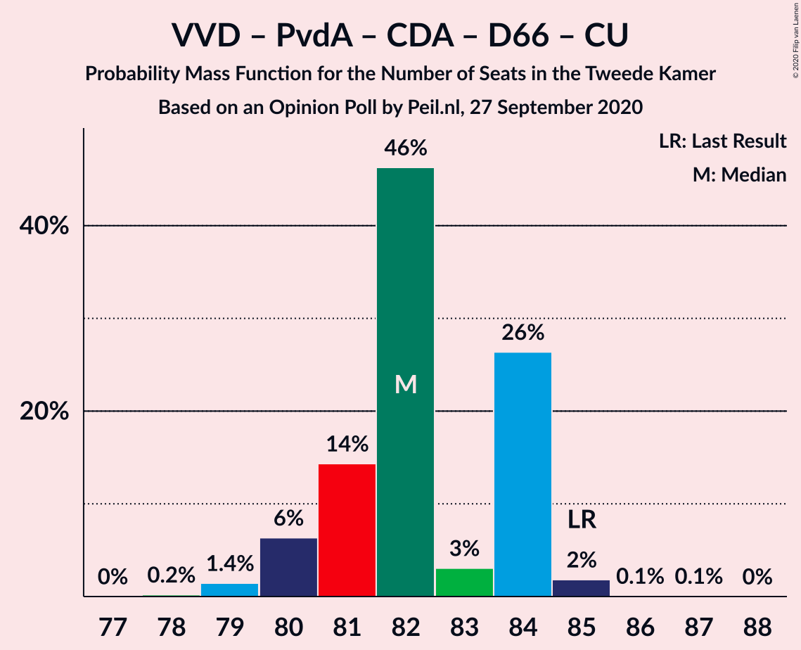

# Opinion Poll by Peil.nl, 27 September 2020

<a href="#voting-intentions">Voting Intentions</a> | <a href="#seats">Seats</a> | <a href="#coalitions">Coalitions</a> | <a href="#technical-information">Technical Information</a>

## Voting Intentions

### Confidence Intervals

| Party | Last Result | Poll Result | 80% Confidence Interval | 90% Confidence Interval | 95% Confidence Interval | 99% Confidence Interval |
|:-----:|:-----------:|:-----------:|:-----------------------:|:-----------------------:|:-----------------------:|:-----------------------:|
| Volkspartij voor Vrijheid en Democratie | 21.3% | 21.9% | 21.0–22.9% |20.7–23.2% |20.5–23.5% |20.0–23.9% |
| Partij voor de Vrijheid | 13.1% | 15.3% | 14.4–16.1% |14.2–16.4% |14.0–16.6% |13.6–17.0% |
| Partij van de Arbeid | 5.7% | 10.6% | 9.9–11.4% |9.7–11.6% |9.6–11.8% |9.3–12.2% |
| Christen-Democratisch Appèl | 12.4% | 8.6% | 8.0–9.3% |7.8–9.5% |7.7–9.7% |7.4–10.0% |
| Democraten 66 | 12.2% | 8.6% | 8.0–9.3% |7.8–9.5% |7.7–9.7% |7.4–10.0% |
| Socialistische Partij | 9.1% | 8.0% | 7.4–8.6% |7.2–8.8% |7.0–9.0% |6.8–9.3% |
| GroenLinks | 9.1% | 7.3% | 6.7–8.0% |6.6–8.1% |6.4–8.3% |6.1–8.6% |
| Forum voor Democratie | 1.8% | 6.6% | 6.1–7.3% |5.9–7.4% |5.8–7.6% |5.5–7.9% |
| ChristenUnie | 3.4% | 4.0% | 3.6–4.5% |3.4–4.6% |3.4–4.8% |3.2–5.0% |
| Partij voor de Dieren | 3.2% | 3.3% | 2.9–3.8% |2.8–3.9% |2.7–4.0% |2.6–4.3% |
| Staatkundig Gereformeerde Partij | 2.1% | 2.7% | 2.3–3.1% |2.2–3.2% |2.1–3.3% |2.0–3.5% |
| 50Plus | 3.1% | 1.3% | 1.1–1.6% |1.0–1.7% |1.0–1.8% |0.9–2.0% |
| DENK | 2.1% | 1.3% | 1.1–1.6% |1.0–1.7% |1.0–1.8% |0.9–2.0% |
| Partij voor de Toekomst | 0.0% | 0.2% | 0.1–0.3% |0.1–0.4% |0.1–0.4% |0.0–0.5% |

*Note:* The poll result column reflects the actual value used in the calculations. Published results may vary slightly, and in addition be rounded to fewer digits.

## Seats

### Confidence Intervals

| Party | Last Result | Median | 80% Confidence Interval | 90% Confidence Interval | 95% Confidence Interval | 99% Confidence Interval |
|:-----:|:-----------:|:------:|:-----------------------:|:-----------------------:|:-----------------------:|:-----------------------:|
| <a href="#volkspartij-voor-vrijheid-en-democratie">Volkspartij voor Vrijheid en Democratie</a> | 33 | 32 | 32–36 |32–36 |32–36 |32–36 |
| <a href="#partij-voor-de-vrijheid">Partij voor de Vrijheid</a> | 20 | 23 | 23–24 |22–24 |22–25 |21–27 |
| <a href="#partij-van-de-arbeid">Partij van de Arbeid</a> | 9 | 17 | 15–18 |14–18 |14–18 |14–18 |
| <a href="#christen-democratisch-appèl">Christen-Democratisch Appèl</a> | 19 | 13 | 12–13 |11–14 |11–15 |11–16 |
| <a href="#democraten-66">Democraten 66</a> | 19 | 14 | 12–14 |12–14 |12–15 |11–15 |
| <a href="#socialistische-partij">Socialistische Partij</a> | 14 | 12 | 12 |12 |11–13 |10–13 |
| <a href="#groenlinks">GroenLinks</a> | 14 | 11 | 10–12 |10–13 |9–13 |9–13 |
| <a href="#forum-voor-democratie">Forum voor Democratie</a> | 2 | 9 | 9–10 |9–11 |9–11 |8–12 |
| <a href="#christenunie">ChristenUnie</a> | 5 | 6 | 5–6 |5–6 |5–6 |4–7 |
| <a href="#partij-voor-de-dieren">Partij voor de Dieren</a> | 5 | 6 | 4–6 |4–6 |4–6 |4–6 |
| <a href="#staatkundig-gereformeerde-partij">Staatkundig Gereformeerde Partij</a> | 3 | 4 | 3–4 |3–4 |3–4 |3–5 |
| <a href="#50plus">50Plus</a> | 4 | 1 | 1–2 |1–2 |1–2 |1–3 |
| <a href="#denk">DENK</a> | 3 | 2 | 1–2 |1–2 |1–2 |1–2 |
| <a href="#partij-voor-de-toekomst">Partij voor de Toekomst</a> | 0 | 0 | 0 |0 |0 |0 |

### Volkspartij voor Vrijheid en Democratie

*For a full overview of the results for this party, see the [Volkspartij voor Vrijheid en Democratie](party-volkspartijvoorvrijheidendemocratie.html) page.*

| Number of Seats | Probability | Accumulated | Special Marks |
|:---------------:|:-----------:|:-----------:|:-------------:|
| 31 | 0.4% | 100% |  |
| 32 | 60% | 99.6% | Median |
| 33 | 2% | 40% | Last Result |
| 34 | 8% | 38% |  |
| 35 | 9% | 30% |  |
| 36 | 21% | 21% |  |
| 37 | 0.1% | 0.1% |  |
| 38 | 0% | 0% |  |

### Partij voor de Vrijheid

*For a full overview of the results for this party, see the [Partij voor de Vrijheid](party-partijvoordevrijheid.html) page.*

| Number of Seats | Probability | Accumulated | Special Marks |
|:---------------:|:-----------:|:-----------:|:-------------:|
| 20 | 0% | 100% | Last Result |
| 21 | 2% | 100% |  |
| 22 | 5% | 98% |  |
| 23 | 75% | 93% | Median |
| 24 | 14% | 19% |  |
| 25 | 4% | 5% |  |
| 26 | 0.1% | 0.6% |  |
| 27 | 0.5% | 0.5% |  |
| 28 | 0% | 0% |  |

### Partij van de Arbeid

*For a full overview of the results for this party, see the [Partij van de Arbeid](party-partijvandearbeid.html) page.*

| Number of Seats | Probability | Accumulated | Special Marks |
|:---------------:|:-----------:|:-----------:|:-------------:|
| 9 | 0% | 100% | Last Result |
| 10 | 0% | 100% |  |
| 11 | 0% | 100% |  |
| 12 | 0% | 100% |  |
| 13 | 0% | 100% |  |
| 14 | 6% | 100% |  |
| 15 | 4% | 94% |  |
| 16 | 9% | 90% |  |
| 17 | 53% | 81% | Median |
| 18 | 28% | 28% |  |
| 19 | 0% | 0% |  |

### Christen-Democratisch Appèl

*For a full overview of the results for this party, see the [Christen-Democratisch Appèl](party-christen-democratischappèl.html) page.*

| Number of Seats | Probability | Accumulated | Special Marks |
|:---------------:|:-----------:|:-----------:|:-------------:|
| 11 | 9% | 100% |  |
| 12 | 22% | 91% |  |
| 13 | 60% | 69% | Median |
| 14 | 6% | 9% |  |
| 15 | 1.1% | 3% |  |
| 16 | 2% | 2% |  |
| 17 | 0% | 0% |  |
| 18 | 0% | 0% |  |
| 19 | 0% | 0% | Last Result |

### Democraten 66

*For a full overview of the results for this party, see the [Democraten 66](party-democraten66.html) page.*

| Number of Seats | Probability | Accumulated | Special Marks |
|:---------------:|:-----------:|:-----------:|:-------------:|
| 11 | 0.5% | 100% |  |
| 12 | 26% | 99.5% |  |
| 13 | 4% | 74% |  |
| 14 | 66% | 69% | Median |
| 15 | 4% | 4% |  |
| 16 | 0% | 0% |  |
| 17 | 0% | 0% |  |
| 18 | 0% | 0% |  |
| 19 | 0% | 0% | Last Result |

### Socialistische Partij

*For a full overview of the results for this party, see the [Socialistische Partij](party-socialistischepartij.html) page.*

| Number of Seats | Probability | Accumulated | Special Marks |
|:---------------:|:-----------:|:-----------:|:-------------:|
| 10 | 0.6% | 100% |  |
| 11 | 4% | 99.4% |  |
| 12 | 93% | 95% | Median |
| 13 | 2% | 3% |  |
| 14 | 0.4% | 0.4% | Last Result |
| 15 | 0% | 0% |  |

### GroenLinks

*For a full overview of the results for this party, see the [GroenLinks](party-groenlinks.html) page.*

| Number of Seats | Probability | Accumulated | Special Marks |
|:---------------:|:-----------:|:-----------:|:-------------:|
| 9 | 3% | 100% |  |
| 10 | 21% | 97% |  |
| 11 | 55% | 76% | Median |
| 12 | 14% | 21% |  |
| 13 | 7% | 7% |  |
| 14 | 0.1% | 0.1% | Last Result |
| 15 | 0% | 0% |  |

### Forum voor Democratie

*For a full overview of the results for this party, see the [Forum voor Democratie](party-forumvoordemocratie.html) page.*

| Number of Seats | Probability | Accumulated | Special Marks |
|:---------------:|:-----------:|:-----------:|:-------------:|
| 2 | 0% | 100% | Last Result |
| 3 | 0% | 100% |  |
| 4 | 0% | 100% |  |
| 5 | 0% | 100% |  |
| 6 | 0% | 100% |  |
| 7 | 0% | 100% |  |
| 8 | 0.6% | 100% |  |
| 9 | 63% | 99.4% | Median |
| 10 | 31% | 37% |  |
| 11 | 5% | 6% |  |
| 12 | 0.8% | 0.8% |  |
| 13 | 0.1% | 0.1% |  |
| 14 | 0% | 0% |  |

### ChristenUnie

*For a full overview of the results for this party, see the [ChristenUnie](party-christenunie.html) page.*

| Number of Seats | Probability | Accumulated | Special Marks |
|:---------------:|:-----------:|:-----------:|:-------------:|
| 4 | 0.6% | 100% |  |
| 5 | 10% | 99.4% | Last Result |
| 6 | 89% | 90% | Median |
| 7 | 0.8% | 0.9% |  |
| 8 | 0.1% | 0.1% |  |
| 9 | 0% | 0% |  |

### Partij voor de Dieren

*For a full overview of the results for this party, see the [Partij voor de Dieren](party-partijvoordedieren.html) page.*

| Number of Seats | Probability | Accumulated | Special Marks |
|:---------------:|:-----------:|:-----------:|:-------------:|
| 3 | 0.1% | 100% |  |
| 4 | 28% | 99.9% |  |
| 5 | 17% | 72% | Last Result |
| 6 | 55% | 55% | Median |
| 7 | 0.1% | 0.1% |  |
| 8 | 0% | 0% |  |

### Staatkundig Gereformeerde Partij

*For a full overview of the results for this party, see the [Staatkundig Gereformeerde Partij](party-staatkundiggereformeerdepartij.html) page.*

| Number of Seats | Probability | Accumulated | Special Marks |
|:---------------:|:-----------:|:-----------:|:-------------:|
| 3 | 38% | 100% | Last Result |
| 4 | 61% | 62% | Median |
| 5 | 1.0% | 1.0% |  |
| 6 | 0% | 0% |  |

### 50Plus

*For a full overview of the results for this party, see the [50Plus](party-50plus.html) page.*

| Number of Seats | Probability | Accumulated | Special Marks |
|:---------------:|:-----------:|:-----------:|:-------------:|
| 1 | 56% | 100% | Median |
| 2 | 44% | 44% |  |
| 3 | 0.9% | 0.9% |  |
| 4 | 0% | 0% | Last Result |

### DENK

*For a full overview of the results for this party, see the [DENK](party-denk.html) page.*

| Number of Seats | Probability | Accumulated | Special Marks |
|:---------------:|:-----------:|:-----------:|:-------------:|
| 1 | 25% | 100% |  |
| 2 | 75% | 75% | Median |
| 3 | 0.5% | 0.5% | Last Result |
| 4 | 0% | 0% |  |

### Partij voor de Toekomst

*For a full overview of the results for this party, see the [Partij voor de Toekomst](party-partijvoordetoekomst.html) page.*

| Number of Seats | Probability | Accumulated | Special Marks |
|:---------------:|:-----------:|:-----------:|:-------------:|
| 0 | 100% | 100% | Last Result, Median |

## Coalitions

### Confidence Intervals

| Coalition | Last Result | Median | Majority? | 80% Confidence Interval | 90% Confidence Interval | 95% Confidence Interval | 99% Confidence Interval |
|:---------:|:-----------:|:------:|:---------:|:-----------------------:|:-----------------------:|:-----------------------:|:-----------------------:|
| Volkspartij voor Vrijheid en Democratie – Partij voor de Vrijheid – Christen-Democratisch Appèl – Forum voor Democratie – Staatkundig Gereformeerde Partij | 77 | 81 | 100% | 81–84 | 79–85 | 79–86 | 79–87 |
| Volkspartij voor Vrijheid en Democratie – Partij van de Arbeid – Christen-Democratisch Appèl – Democraten 66 – ChristenUnie | 85 | 82 | 100% | 81–84 | 80–84 | 80–84 | 79–85 |
| Volkspartij voor Vrijheid en Democratie – Partij voor de Vrijheid – Christen-Democratisch Appèl – Forum voor Democratie | 74 | 77 | 100% | 77–81 | 76–81 | 76–82 | 76–83 |
| Volkspartij voor Vrijheid en Democratie – Christen-Democratisch Appèl – Democraten 66 – GroenLinks – ChristenUnie | 90 | 76 | 89% | 75–78 | 75–80 | 75–80 | 74–80 |
| Partij van de Arbeid – Christen-Democratisch Appèl – Democraten 66 – Socialistische Partij – GroenLinks – ChristenUnie | 80 | 73 | 0% | 70–73 | 70–73 | 70–73 | 68–74 |
| Volkspartij voor Vrijheid en Democratie – Partij voor de Vrijheid – Christen-Democratisch Appèl | 72 | 68 | 0% | 68–71 | 67–71 | 67–73 | 67–74 |
| Volkspartij voor Vrijheid en Democratie – Christen-Democratisch Appèl – Democraten 66 – ChristenUnie | 76 | 65 | 0% | 64–67 | 63–67 | 63–69 | 63–69 |
| Volkspartij voor Vrijheid en Democratie – Partij van de Arbeid – Christen-Democratisch Appèl | 61 | 62 | 0% | 61–66 | 61–66 | 61–66 | 61–67 |
| Volkspartij voor Vrijheid en Democratie – Partij van de Arbeid – Democraten 66 | 61 | 63 | 0% | 62–66 | 61–66 | 61–66 | 59–66 |
| Volkspartij voor Vrijheid en Democratie – Christen-Democratisch Appèl – Forum voor Democratie – Staatkundig Gereformeerde Partij – 50Plus | 61 | 59 | 0% | 59–63 | 57–64 | 57–64 | 57–65 |
| Volkspartij voor Vrijheid en Democratie – Christen-Democratisch Appèl – Democraten 66 | 71 | 59 | 0% | 59–61 | 57–62 | 57–63 | 57–63 |
| Volkspartij voor Vrijheid en Democratie – Christen-Democratisch Appèl – Forum voor Democratie – Staatkundig Gereformeerde Partij | 57 | 58 | 0% | 58–61 | 55–62 | 55–62 | 55–63 |
| Partij van de Arbeid – Christen-Democratisch Appèl – Democraten 66 – GroenLinks – ChristenUnie | 66 | 61 | 0% | 58–61 | 58–61 | 57–61 | 55–62 |
| Volkspartij voor Vrijheid en Democratie – Christen-Democratisch Appèl – Forum voor Democratie – 50Plus | 58 | 55 | 0% | 55–60 | 54–60 | 54–60 | 54–61 |
| Volkspartij voor Vrijheid en Democratie – Christen-Democratisch Appèl – Forum voor Democratie | 54 | 54 | 0% | 54–58 | 52–58 | 52–58 | 52–59 |
| Volkspartij voor Vrijheid en Democratie – Partij van de Arbeid | 42 | 49 | 0% | 49–54 | 48–54 | 48–54 | 47–54 |
| Volkspartij voor Vrijheid en Democratie – Christen-Democratisch Appèl | 52 | 45 | 0% | 45–48 | 43–49 | 43–49 | 43–50 |
| Partij van de Arbeid – Christen-Democratisch Appèl – Democraten 66 | 47 | 44 | 0% | 42–44 | 40–44 | 40–44 | 40–46 |
| Partij van de Arbeid – Christen-Democratisch Appèl – ChristenUnie | 33 | 36 | 0% | 34–36 | 34–36 | 33–36 | 32–38 |
| Partij van de Arbeid – Christen-Democratisch Appèl | 28 | 30 | 0% | 28–30 | 28–30 | 27–31 | 27–32 |
| Christen-Democratisch Appèl – Democraten 66 | 38 | 27 | 0% | 24–27 | 24–28 | 24–28 | 24–30 |

### Volkspartij voor Vrijheid en Democratie – Partij voor de Vrijheid – Christen-Democratisch Appèl – Forum voor Democratie – Staatkundig Gereformeerde Partij

| Number of Seats | Probability | Accumulated | Special Marks |
|:---------------:|:-----------:|:-----------:|:-------------:|
| 77 | 0% | 100% | Last Result |
| 78 | 0% | 100% |  |
| 79 | 8% | 100% |  |
| 80 | 0.2% | 92% |  |
| 81 | 46% | 92% | Median |
| 82 | 0.4% | 46% |  |
| 83 | 8% | 45% |  |
| 84 | 30% | 37% |  |
| 85 | 4% | 7% |  |
| 86 | 2% | 3% |  |
| 87 | 1.1% | 1.1% |  |
| 88 | 0% | 0% |  |

### Volkspartij voor Vrijheid en Democratie – Partij van de Arbeid – Christen-Democratisch Appèl – Democraten 66 – ChristenUnie

| Number of Seats | Probability | Accumulated | Special Marks |
|:---------------:|:-----------:|:-----------:|:-------------:|
| 78 | 0.2% | 100% |  |
| 79 | 1.4% | 99.8% |  |
| 80 | 6% | 98% |  |
| 81 | 14% | 92% |  |
| 82 | 46% | 78% | Median |
| 83 | 3% | 31% |  |
| 84 | 26% | 28% |  |
| 85 | 2% | 2% | Last Result |
| 86 | 0.1% | 0.1% |  |
| 87 | 0.1% | 0.1% |  |
| 88 | 0% | 0% |  |

### Volkspartij voor Vrijheid en Democratie – Partij voor de Vrijheid – Christen-Democratisch Appèl – Forum voor Democratie

| Number of Seats | Probability | Accumulated | Special Marks |
|:---------------:|:-----------:|:-----------:|:-------------:|
| 74 | 0% | 100% | Last Result |
| 75 | 0% | 100% |  |
| 76 | 8% | 100% | Majority |
| 77 | 46% | 92% | Median |
| 78 | 0.3% | 46% |  |
| 79 | 2% | 45% |  |
| 80 | 16% | 43% |  |
| 81 | 23% | 28% |  |
| 82 | 4% | 5% |  |
| 83 | 0.8% | 1.1% |  |
| 84 | 0.2% | 0.3% |  |
| 85 | 0% | 0% |  |

### Volkspartij voor Vrijheid en Democratie – Christen-Democratisch Appèl – Democraten 66 – GroenLinks – ChristenUnie

| Number of Seats | Probability | Accumulated | Special Marks |
|:---------------:|:-----------:|:-----------:|:-------------:|
| 72 | 0.1% | 100% |  |
| 73 | 0.3% | 99.9% |  |
| 74 | 1.0% | 99.6% |  |
| 75 | 9% | 98.6% |  |
| 76 | 70% | 89% | Median, Majority |
| 77 | 1.4% | 19% |  |
| 78 | 9% | 18% |  |
| 79 | 3% | 8% |  |
| 80 | 5% | 5% |  |
| 81 | 0.1% | 0.1% |  |
| 82 | 0% | 0% |  |
| 83 | 0% | 0% |  |
| 84 | 0% | 0% |  |
| 85 | 0% | 0% |  |
| 86 | 0% | 0% |  |
| 87 | 0% | 0% |  |
| 88 | 0% | 0% |  |
| 89 | 0% | 0% |  |
| 90 | 0% | 0% | Last Result |

### Partij van de Arbeid – Christen-Democratisch Appèl – Democraten 66 – Socialistische Partij – GroenLinks – ChristenUnie

| Number of Seats | Probability | Accumulated | Special Marks |
|:---------------:|:-----------:|:-----------:|:-------------:|
| 67 | 0.5% | 100% |  |
| 68 | 1.0% | 99.5% |  |
| 69 | 0.4% | 98.5% |  |
| 70 | 24% | 98% |  |
| 71 | 7% | 74% |  |
| 72 | 4% | 67% |  |
| 73 | 61% | 63% | Median |
| 74 | 2% | 2% |  |
| 75 | 0.1% | 0.1% |  |
| 76 | 0% | 0% | Majority |
| 77 | 0% | 0% |  |
| 78 | 0% | 0% |  |
| 79 | 0% | 0% |  |
| 80 | 0% | 0% | Last Result |

### Volkspartij voor Vrijheid en Democratie – Partij voor de Vrijheid – Christen-Democratisch Appèl

| Number of Seats | Probability | Accumulated | Special Marks |
|:---------------:|:-----------:|:-----------:|:-------------:|
| 66 | 0.1% | 100% |  |
| 67 | 9% | 99.9% |  |
| 68 | 46% | 91% | Median |
| 69 | 5% | 45% |  |
| 70 | 8% | 40% |  |
| 71 | 27% | 32% |  |
| 72 | 2% | 5% | Last Result |
| 73 | 2% | 3% |  |
| 74 | 0.5% | 0.7% |  |
| 75 | 0.2% | 0.2% |  |
| 76 | 0% | 0% | Majority |

### Volkspartij voor Vrijheid en Democratie – Christen-Democratisch Appèl – Democraten 66 – ChristenUnie

| Number of Seats | Probability | Accumulated | Special Marks |
|:---------------:|:-----------:|:-----------:|:-------------:|
| 62 | 0.3% | 100% |  |
| 63 | 9% | 99.7% |  |
| 64 | 5% | 91% |  |
| 65 | 49% | 86% | Median |
| 66 | 21% | 37% |  |
| 67 | 12% | 16% |  |
| 68 | 0.1% | 4% |  |
| 69 | 4% | 4% |  |
| 70 | 0.1% | 0.1% |  |
| 71 | 0% | 0% |  |
| 72 | 0% | 0% |  |
| 73 | 0% | 0% |  |
| 74 | 0% | 0% |  |
| 75 | 0% | 0% |  |
| 76 | 0% | 0% | Last Result, Majority |

### Volkspartij voor Vrijheid en Democratie – Partij van de Arbeid – Christen-Democratisch Appèl

| Number of Seats | Probability | Accumulated | Special Marks |
|:---------------:|:-----------:|:-----------:|:-------------:|
| 59 | 0% | 100% |  |
| 60 | 0.3% | 99.9% |  |
| 61 | 14% | 99.7% | Last Result |
| 62 | 48% | 86% | Median |
| 63 | 9% | 38% |  |
| 64 | 8% | 29% |  |
| 65 | 2% | 21% |  |
| 66 | 19% | 20% |  |
| 67 | 0.6% | 0.6% |  |
| 68 | 0% | 0% |  |

### Volkspartij voor Vrijheid en Democratie – Partij van de Arbeid – Democraten 66

| Number of Seats | Probability | Accumulated | Special Marks |
|:---------------:|:-----------:|:-----------:|:-------------:|
| 58 | 0.1% | 100% |  |
| 59 | 0.6% | 99.9% |  |
| 60 | 2% | 99.3% |  |
| 61 | 5% | 98% | Last Result |
| 62 | 5% | 93% |  |
| 63 | 48% | 88% | Median |
| 64 | 10% | 39% |  |
| 65 | 8% | 29% |  |
| 66 | 21% | 21% |  |
| 67 | 0% | 0% |  |

### Volkspartij voor Vrijheid en Democratie – Christen-Democratisch Appèl – Forum voor Democratie – Staatkundig Gereformeerde Partij – 50Plus

| Number of Seats | Probability | Accumulated | Special Marks |
|:---------------:|:-----------:|:-----------:|:-------------:|
| 57 | 8% | 100% |  |
| 58 | 0.1% | 92% |  |
| 59 | 46% | 92% | Median |
| 60 | 1.3% | 46% |  |
| 61 | 7% | 44% | Last Result |
| 62 | 7% | 38% |  |
| 63 | 23% | 31% |  |
| 64 | 6% | 8% |  |
| 65 | 2% | 2% |  |
| 66 | 0.2% | 0.2% |  |
| 67 | 0% | 0% |  |

### Volkspartij voor Vrijheid en Democratie – Christen-Democratisch Appèl – Democraten 66

| Number of Seats | Probability | Accumulated | Special Marks |
|:---------------:|:-----------:|:-----------:|:-------------:|
| 55 | 0.1% | 100% |  |
| 56 | 0.1% | 99.9% |  |
| 57 | 9% | 99.7% |  |
| 58 | 1.0% | 91% |  |
| 59 | 52% | 90% | Median |
| 60 | 21% | 38% |  |
| 61 | 12% | 17% |  |
| 62 | 2% | 6% |  |
| 63 | 4% | 4% |  |
| 64 | 0% | 0.1% |  |
| 65 | 0% | 0% |  |
| 66 | 0% | 0% |  |
| 67 | 0% | 0% |  |
| 68 | 0% | 0% |  |
| 69 | 0% | 0% |  |
| 70 | 0% | 0% |  |
| 71 | 0% | 0% | Last Result |

### Volkspartij voor Vrijheid en Democratie – Christen-Democratisch Appèl – Forum voor Democratie – Staatkundig Gereformeerde Partij

| Number of Seats | Probability | Accumulated | Special Marks |
|:---------------:|:-----------:|:-----------:|:-------------:|
| 55 | 8% | 100% |  |
| 56 | 0.2% | 92% |  |
| 57 | 0.2% | 92% | Last Result |
| 58 | 46% | 91% | Median |
| 59 | 2% | 45% |  |
| 60 | 12% | 44% |  |
| 61 | 22% | 31% |  |
| 62 | 7% | 9% |  |
| 63 | 2% | 2% |  |
| 64 | 0.1% | 0.2% |  |
| 65 | 0% | 0% |  |

### Partij van de Arbeid – Christen-Democratisch Appèl – Democraten 66 – GroenLinks – ChristenUnie

| Number of Seats | Probability | Accumulated | Special Marks |
|:---------------:|:-----------:|:-----------:|:-------------:|
| 55 | 0.6% | 100% |  |
| 56 | 0.5% | 99.4% |  |
| 57 | 2% | 98.8% |  |
| 58 | 22% | 97% |  |
| 59 | 9% | 76% |  |
| 60 | 4% | 67% |  |
| 61 | 60% | 63% | Median |
| 62 | 2% | 2% |  |
| 63 | 0% | 0.1% |  |
| 64 | 0.1% | 0.1% |  |
| 65 | 0% | 0% |  |
| 66 | 0% | 0% | Last Result |

### Volkspartij voor Vrijheid en Democratie – Christen-Democratisch Appèl – Forum voor Democratie – 50Plus

| Number of Seats | Probability | Accumulated | Special Marks |
|:---------------:|:-----------:|:-----------:|:-------------:|
| 53 | 0.1% | 100% |  |
| 54 | 8% | 99.9% |  |
| 55 | 46% | 92% | Median |
| 56 | 1.1% | 46% |  |
| 57 | 1.1% | 45% |  |
| 58 | 12% | 44% | Last Result |
| 59 | 3% | 32% |  |
| 60 | 27% | 29% |  |
| 61 | 2% | 2% |  |
| 62 | 0.1% | 0.2% |  |
| 63 | 0% | 0% |  |

### Volkspartij voor Vrijheid en Democratie – Christen-Democratisch Appèl – Forum voor Democratie

| Number of Seats | Probability | Accumulated | Special Marks |
|:---------------:|:-----------:|:-----------:|:-------------:|
| 52 | 8% | 100% |  |
| 53 | 0.1% | 92% |  |
| 54 | 46% | 92% | Last Result, Median |
| 55 | 1.4% | 45% |  |
| 56 | 5% | 44% |  |
| 57 | 10% | 39% |  |
| 58 | 27% | 29% |  |
| 59 | 2% | 2% |  |
| 60 | 0.1% | 0.2% |  |
| 61 | 0% | 0% |  |

### Volkspartij voor Vrijheid en Democratie – Partij van de Arbeid

| Number of Seats | Probability | Accumulated | Special Marks |
|:---------------:|:-----------:|:-----------:|:-------------:|
| 42 | 0% | 100% | Last Result |
| 43 | 0% | 100% |  |
| 44 | 0% | 100% |  |
| 45 | 0% | 100% |  |
| 46 | 0% | 100% |  |
| 47 | 2% | 100% |  |
| 48 | 5% | 98% |  |
| 49 | 51% | 93% | Median |
| 50 | 12% | 42% |  |
| 51 | 9% | 29% |  |
| 52 | 0.9% | 21% |  |
| 53 | 1.0% | 20% |  |
| 54 | 19% | 19% |  |
| 55 | 0% | 0% |  |

### Volkspartij voor Vrijheid en Democratie – Christen-Democratisch Appèl

| Number of Seats | Probability | Accumulated | Special Marks |
|:---------------:|:-----------:|:-----------:|:-------------:|
| 43 | 8% | 100% |  |
| 44 | 0.3% | 92% |  |
| 45 | 50% | 91% | Median |
| 46 | 2% | 41% |  |
| 47 | 9% | 39% |  |
| 48 | 23% | 30% |  |
| 49 | 6% | 7% |  |
| 50 | 0.8% | 0.9% |  |
| 51 | 0% | 0.1% |  |
| 52 | 0% | 0% | Last Result |

### Partij van de Arbeid – Christen-Democratisch Appèl – Democraten 66

| Number of Seats | Probability | Accumulated | Special Marks |
|:---------------:|:-----------:|:-----------:|:-------------:|
| 38 | 0.1% | 100% |  |
| 39 | 0.2% | 99.9% |  |
| 40 | 7% | 99.7% |  |
| 41 | 2% | 93% |  |
| 42 | 20% | 91% |  |
| 43 | 14% | 70% |  |
| 44 | 56% | 56% | Median |
| 45 | 0.2% | 0.9% |  |
| 46 | 0.8% | 0.8% |  |
| 47 | 0% | 0% | Last Result |

### Partij van de Arbeid – Christen-Democratisch Appèl – ChristenUnie

| Number of Seats | Probability | Accumulated | Special Marks |
|:---------------:|:-----------:|:-----------:|:-------------:|
| 32 | 2% | 100% |  |
| 33 | 2% | 98% | Last Result |
| 34 | 11% | 96% |  |
| 35 | 11% | 85% |  |
| 36 | 73% | 74% | Median |
| 37 | 0.2% | 1.1% |  |
| 38 | 0.8% | 0.8% |  |
| 39 | 0% | 0.1% |  |
| 40 | 0% | 0% |  |

### Partij van de Arbeid – Christen-Democratisch Appèl

| Number of Seats | Probability | Accumulated | Special Marks |
|:---------------:|:-----------:|:-----------:|:-------------:|
| 26 | 0.1% | 100% |  |
| 27 | 3% | 99.9% |  |
| 28 | 7% | 97% | Last Result |
| 29 | 15% | 90% |  |
| 30 | 71% | 75% | Median |
| 31 | 3% | 3% |  |
| 32 | 0.5% | 0.5% |  |
| 33 | 0% | 0% |  |

### Christen-Democratisch Appèl – Democraten 66

| Number of Seats | Probability | Accumulated | Special Marks |
|:---------------:|:-----------:|:-----------:|:-------------:|
| 24 | 21% | 100% |  |
| 25 | 10% | 79% |  |
| 26 | 7% | 69% |  |
| 27 | 57% | 62% | Median |
| 28 | 3% | 5% |  |
| 29 | 1.4% | 2% |  |
| 30 | 0.8% | 0.8% |  |
| 31 | 0% | 0% |  |
| 32 | 0% | 0% |  |
| 33 | 0% | 0% |  |
| 34 | 0% | 0% |  |
| 35 | 0% | 0% |  |
| 36 | 0% | 0% |  |
| 37 | 0% | 0% |  |
| 38 | 0% | 0% | Last Result |

## Technical Information

### Opinion Poll

+ **Polling firm:** Peil.nl
+ **Commissioner(s):** —
+ **Fieldwork period:** 27 September 2020

### Calculations

+ **Sample size:** 3000
+ **Simulations done:** 1,048,576
+ **Error estimate:** 2.09%

