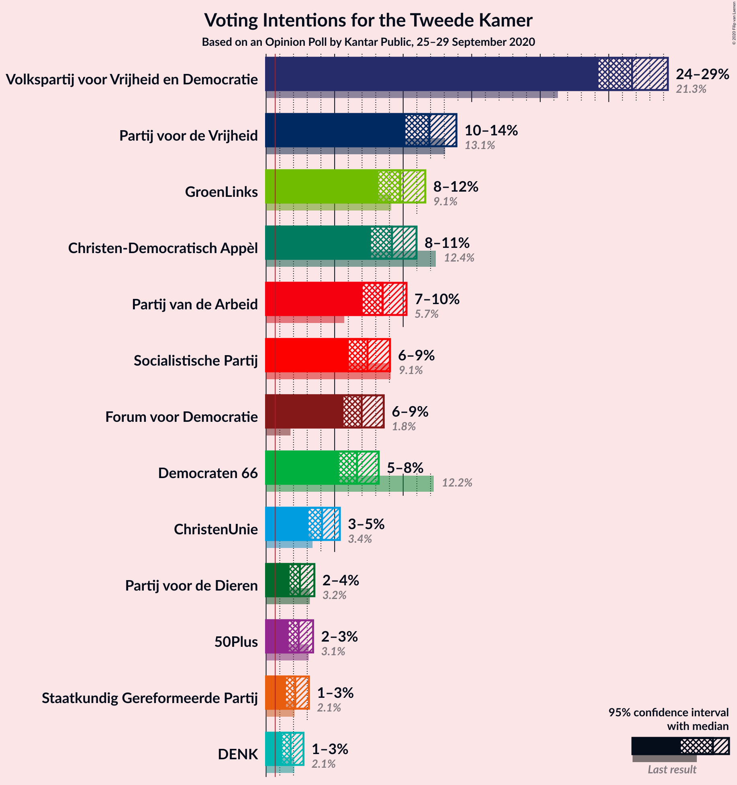
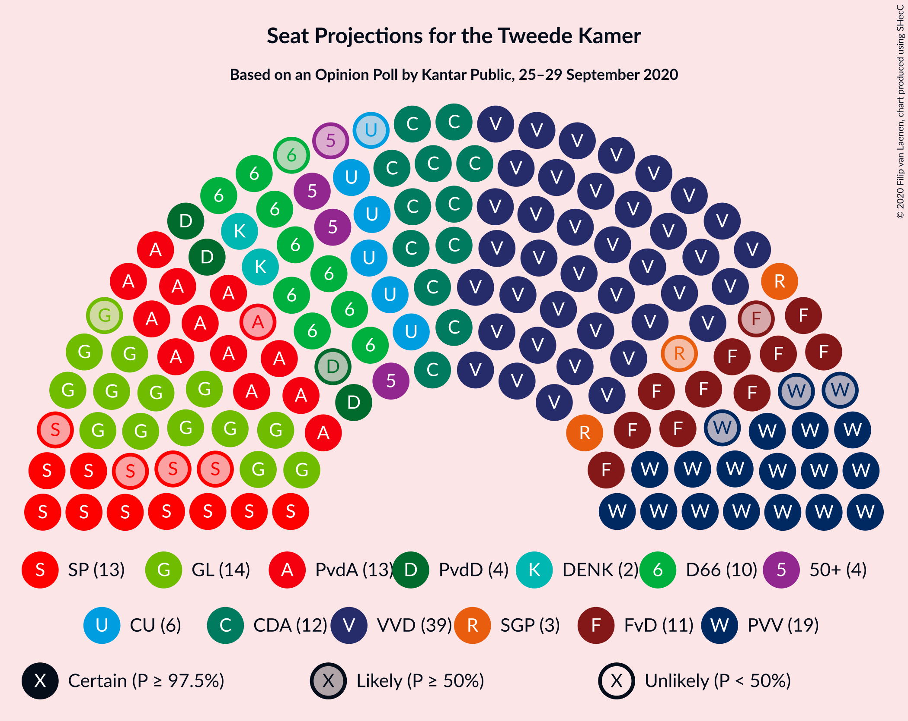
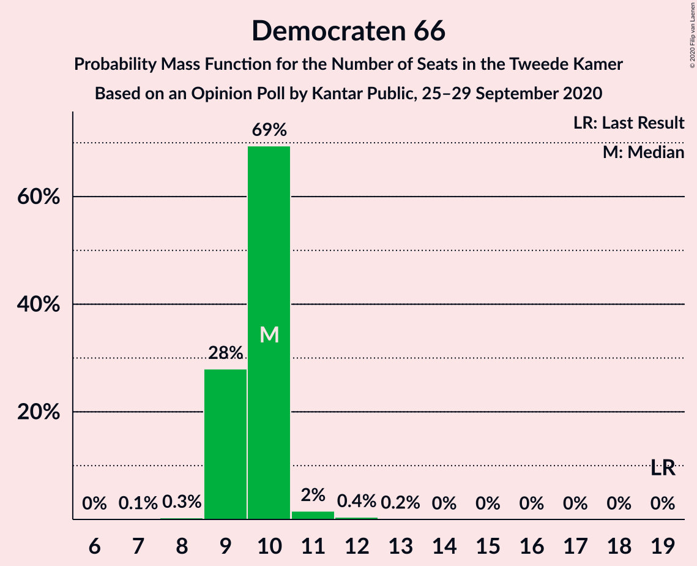
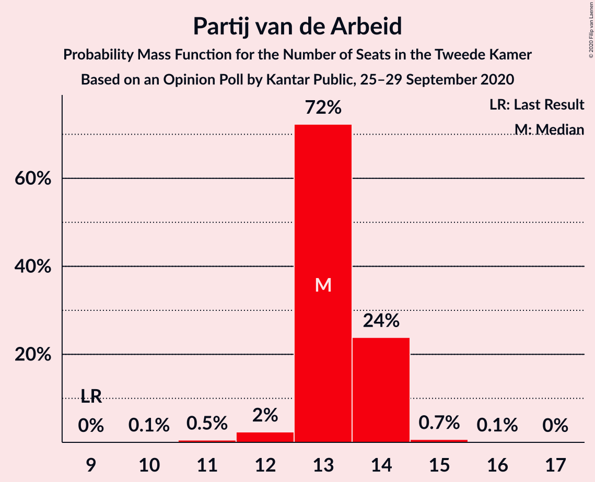
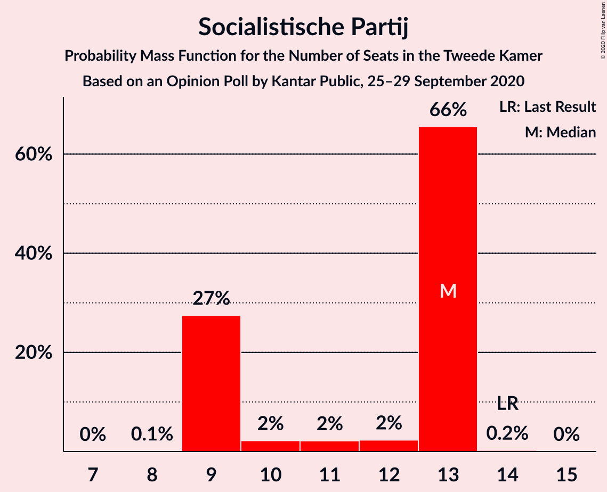
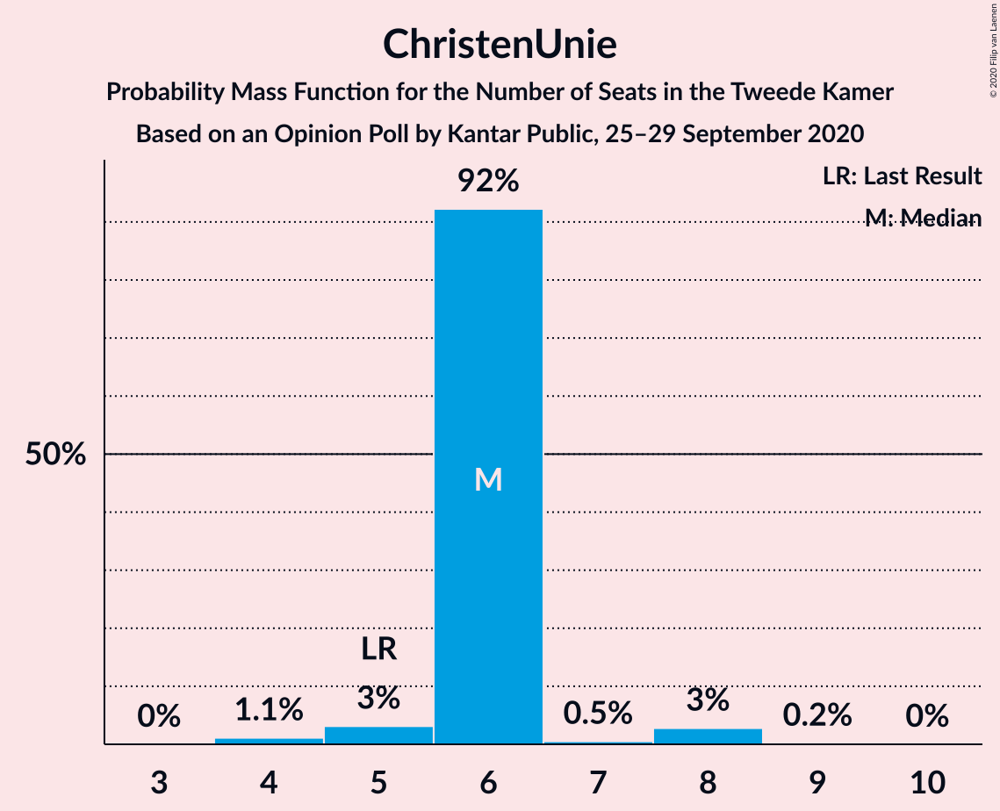
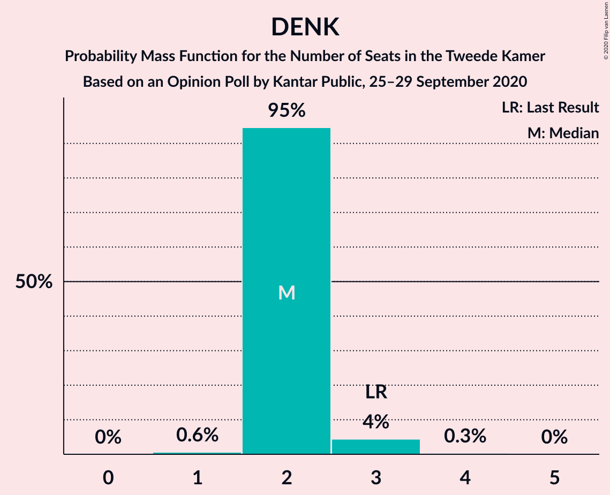
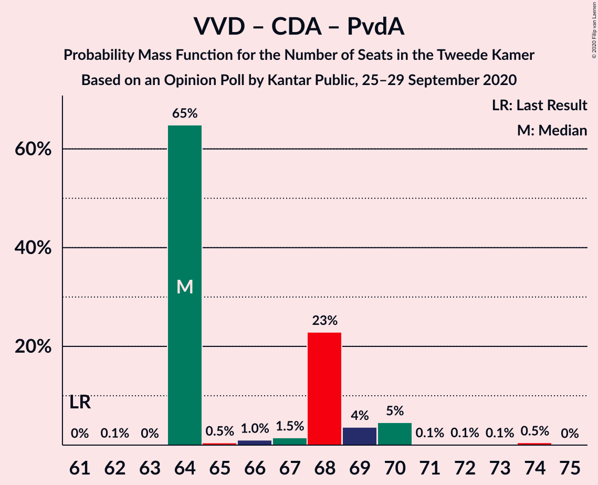
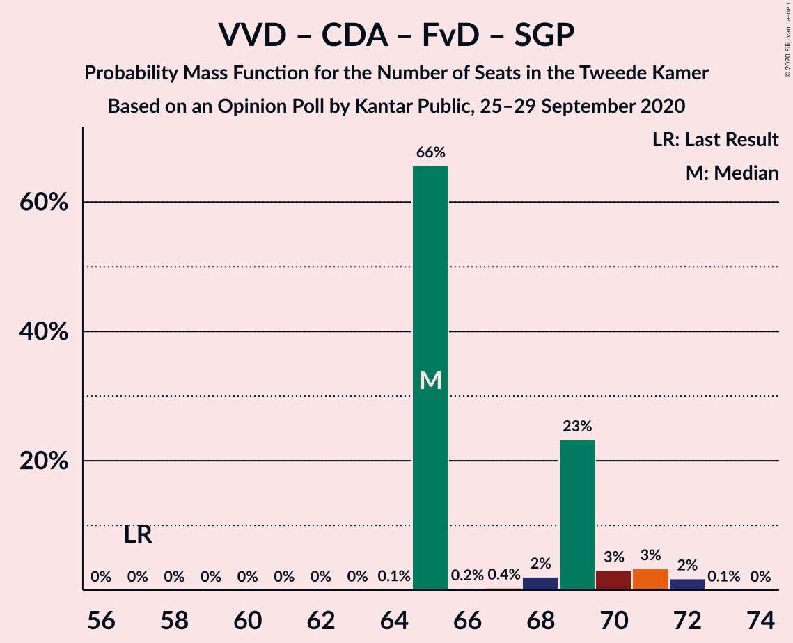

# Opinion Poll by Kantar Public, 25–29 September 2020

<a href="#voting-intentions">Voting Intentions</a> | <a href="#seats">Seats</a> | <a href="#coalitions">Coalitions</a> | <a href="#technical-information">Technical Information</a>

## Voting Intentions

### Confidence Intervals

| Party | Last Result | Poll Result | 80% Confidence Interval | 90% Confidence Interval | 95% Confidence Interval | 99% Confidence Interval |
|:-----:|:-----------:|:-----------:|:-----------------------:|:-----------------------:|:-----------------------:|:-----------------------:|
| Volkspartij voor Vrijheid en Democratie | 21.3% | 25.9% | 24.3–27.6% |23.9–28.1% |23.5–28.5% |22.8–29.3% |
| Partij voor de Vrijheid | 13.1% | 17.3% | 15.9–18.7% |15.5–19.2% |15.2–19.5% |14.6–20.3% |
| Democraten 66 | 12.2% | 9.3% | 8.3–10.4% |8.0–10.8% |7.7–11.1% |7.3–11.7% |
| GroenLinks | 9.1% | 9.3% | 8.3–10.4% |8.0–10.8% |7.7–11.1% |7.3–11.7% |
| Christen-Democratisch Appèl | 12.4% | 7.3% | 6.4–8.4% |6.2–8.7% |6.0–8.9% |5.5–9.5% |
| Partij van de Arbeid | 5.7% | 7.3% | 6.4–8.4% |6.2–8.7% |6.0–8.9% |5.5–9.5% |
| Socialistische Partij | 9.1% | 6.6% | 5.8–7.7% |5.5–8.0% |5.3–8.2% |5.0–8.7% |
| Partij voor de Dieren | 3.2% | 5.4% | 4.6–6.3% |4.4–6.6% |4.2–6.8% |3.9–7.3% |
| Forum voor Democratie | 1.8% | 4.0% | 3.4–4.8% |3.2–5.1% |3.0–5.3% |2.7–5.7% |
| ChristenUnie | 3.4% | 2.0% | 1.5–2.6% |1.4–2.8% |1.3–2.9% |1.1–3.3% |
| Staatkundig Gereformeerde Partij | 2.1% | 2.0% | 1.5–2.6% |1.4–2.8% |1.3–2.9% |1.1–3.3% |
| DENK | 2.1% | 2.0% | 1.5–2.6% |1.4–2.8% |1.3–2.9% |1.1–3.3% |
| 50Plus | 3.1% | 1.4% | 1.0–1.9% |0.9–2.1% |0.8–2.2% |0.7–2.5% |
| Partij voor de Toekomst | 0.0% | 0.2% | 0.1–0.5% |0.1–0.5% |0.0–0.6% |0.0–0.8% |

*Note:* The poll result column reflects the actual value used in the calculations. Published results may vary slightly, and in addition be rounded to fewer digits.

## Seats

### Confidence Intervals

| Party | Last Result | Median | 80% Confidence Interval | 90% Confidence Interval | 95% Confidence Interval | 99% Confidence Interval |
|:-----:|:-----------:|:------:|:-----------------------:|:-----------------------:|:-----------------------:|:-----------------------:|
| <a href="#volkspartij-voor-vrijheid-en-democratie">Volkspartij voor Vrijheid en Democratie</a> | 33 | 41 | 38–42 |36–43 |36–44 |35–46 |
| <a href="#partij-voor-de-vrijheid">Partij voor de Vrijheid</a> | 20 | 29 | 25–29 |25–29 |24–31 |22–31 |
| <a href="#democraten-66">Democraten 66</a> | 19 | 12 | 11–14 |11–15 |11–15 |11–17 |
| <a href="#groenlinks">GroenLinks</a> | 14 | 13 | 13–14 |13–15 |13–16 |12–17 |
| <a href="#christen-democratisch-appèl">Christen-Democratisch Appèl</a> | 19 | 12 | 10–12 |9–13 |9–13 |8–14 |
| <a href="#partij-van-de-arbeid">Partij van de Arbeid</a> | 9 | 11 | 9–13 |9–13 |9–13 |8–15 |
| <a href="#socialistische-partij">Socialistische Partij</a> | 14 | 11 | 9–13 |8–13 |8–13 |8–13 |
| <a href="#partij-voor-de-dieren">Partij voor de Dieren</a> | 5 | 9 | 7–9 |7–9 |6–10 |5–10 |
| <a href="#forum-voor-democratie">Forum voor Democratie</a> | 2 | 5 | 5–6 |5–7 |5–8 |4–8 |
| <a href="#christenunie">ChristenUnie</a> | 5 | 3 | 2–4 |2–4 |2–4 |1–5 |
| <a href="#staatkundig-gereformeerde-partij">Staatkundig Gereformeerde Partij</a> | 3 | 2 | 2–3 |2–4 |2–4 |1–4 |
| <a href="#denk">DENK</a> | 3 | 2 | 2–4 |2–4 |1–4 |1–5 |
| <a href="#50plus">50Plus</a> | 4 | 1 | 1–2 |1–2 |1–2 |1–3 |
| <a href="#partij-voor-de-toekomst">Partij voor de Toekomst</a> | 0 | 0 | 0 |0–1 |0–1 |0–1 |

### Volkspartij voor Vrijheid en Democratie

*For a full overview of the results for this party, see the [Volkspartij voor Vrijheid en Democratie](party-volkspartijvoorvrijheidendemocratie.html) page.*

| Number of Seats | Probability | Accumulated | Special Marks |
|:---------------:|:-----------:|:-----------:|:-------------:|
| 33 | 0.1% | 100% | Last Result |
| 34 | 0.2% | 99.9% |  |
| 35 | 0.3% | 99.7% |  |
| 36 | 7% | 99.4% |  |
| 37 | 2% | 93% |  |
| 38 | 15% | 91% |  |
| 39 | 1.1% | 76% |  |
| 40 | 5% | 75% |  |
| 41 | 58% | 70% | Median |
| 42 | 5% | 12% |  |
| 43 | 2% | 7% |  |
| 44 | 3% | 5% |  |
| 45 | 0.1% | 2% |  |
| 46 | 1.4% | 1.4% |  |
| 47 | 0% | 0% |  |

### Partij voor de Vrijheid

*For a full overview of the results for this party, see the [Partij voor de Vrijheid](party-partijvoordevrijheid.html) page.*

| Number of Seats | Probability | Accumulated | Special Marks |
|:---------------:|:-----------:|:-----------:|:-------------:|
| 20 | 0% | 100% | Last Result |
| 21 | 0% | 100% |  |
| 22 | 0.7% | 100% |  |
| 23 | 0.6% | 99.3% |  |
| 24 | 1.2% | 98.7% |  |
| 25 | 15% | 97% |  |
| 26 | 9% | 82% |  |
| 27 | 4% | 73% |  |
| 28 | 17% | 69% |  |
| 29 | 48% | 52% | Median |
| 30 | 2% | 4% |  |
| 31 | 2% | 3% |  |
| 32 | 0.1% | 0.2% |  |
| 33 | 0.1% | 0.1% |  |
| 34 | 0% | 0% |  |

### Democraten 66

*For a full overview of the results for this party, see the [Democraten 66](party-democraten66.html) page.*

| Number of Seats | Probability | Accumulated | Special Marks |
|:---------------:|:-----------:|:-----------:|:-------------:|
| 11 | 49% | 100% |  |
| 12 | 12% | 51% | Median |
| 13 | 15% | 39% |  |
| 14 | 15% | 24% |  |
| 15 | 7% | 9% |  |
| 16 | 2% | 2% |  |
| 17 | 0.2% | 0.5% |  |
| 18 | 0.3% | 0.4% |  |
| 19 | 0% | 0% | Last Result |

### GroenLinks

*For a full overview of the results for this party, see the [GroenLinks](party-groenlinks.html) page.*

| Number of Seats | Probability | Accumulated | Special Marks |
|:---------------:|:-----------:|:-----------:|:-------------:|
| 11 | 0.1% | 100% |  |
| 12 | 0.5% | 99.8% |  |
| 13 | 69% | 99.3% | Median |
| 14 | 22% | 31% | Last Result |
| 15 | 5% | 9% |  |
| 16 | 2% | 3% |  |
| 17 | 1.1% | 1.5% |  |
| 18 | 0.1% | 0.4% |  |
| 19 | 0.3% | 0.3% |  |
| 20 | 0% | 0% |  |

### Christen-Democratisch Appèl

*For a full overview of the results for this party, see the [Christen-Democratisch Appèl](party-christen-democratischappèl.html) page.*

| Number of Seats | Probability | Accumulated | Special Marks |
|:---------------:|:-----------:|:-----------:|:-------------:|
| 8 | 2% | 100% |  |
| 9 | 5% | 98% |  |
| 10 | 18% | 93% |  |
| 11 | 5% | 75% |  |
| 12 | 61% | 70% | Median |
| 13 | 9% | 9% |  |
| 14 | 0.5% | 0.6% |  |
| 15 | 0.1% | 0.1% |  |
| 16 | 0% | 0% |  |
| 17 | 0% | 0% |  |
| 18 | 0% | 0% |  |
| 19 | 0% | 0% | Last Result |

### Partij van de Arbeid

*For a full overview of the results for this party, see the [Partij van de Arbeid](party-partijvandearbeid.html) page.*

| Number of Seats | Probability | Accumulated | Special Marks |
|:---------------:|:-----------:|:-----------:|:-------------:|
| 8 | 2% | 100% |  |
| 9 | 11% | 98% | Last Result |
| 10 | 11% | 87% |  |
| 11 | 50% | 76% | Median |
| 12 | 10% | 26% |  |
| 13 | 15% | 16% |  |
| 14 | 0.2% | 1.1% |  |
| 15 | 0.8% | 0.9% |  |
| 16 | 0% | 0% |  |

### Socialistische Partij

*For a full overview of the results for this party, see the [Socialistische Partij](party-socialistischepartij.html) page.*

| Number of Seats | Probability | Accumulated | Special Marks |
|:---------------:|:-----------:|:-----------:|:-------------:|
| 7 | 0.1% | 100% |  |
| 8 | 8% | 99.9% |  |
| 9 | 19% | 92% |  |
| 10 | 9% | 73% |  |
| 11 | 52% | 65% | Median |
| 12 | 0.8% | 13% |  |
| 13 | 12% | 12% |  |
| 14 | 0.2% | 0.2% | Last Result |
| 15 | 0% | 0% |  |

### Partij voor de Dieren

*For a full overview of the results for this party, see the [Partij voor de Dieren](party-partijvoordedieren.html) page.*

| Number of Seats | Probability | Accumulated | Special Marks |
|:---------------:|:-----------:|:-----------:|:-------------:|
| 5 | 1.4% | 100% | Last Result |
| 6 | 1.4% | 98.6% |  |
| 7 | 20% | 97% |  |
| 8 | 22% | 77% |  |
| 9 | 52% | 55% | Median |
| 10 | 2% | 3% |  |
| 11 | 0.2% | 0.3% |  |
| 12 | 0.1% | 0.1% |  |
| 13 | 0% | 0% |  |

### Forum voor Democratie

*For a full overview of the results for this party, see the [Forum voor Democratie](party-forumvoordemocratie.html) page.*

| Number of Seats | Probability | Accumulated | Special Marks |
|:---------------:|:-----------:|:-----------:|:-------------:|
| 2 | 0% | 100% | Last Result |
| 3 | 0% | 100% |  |
| 4 | 2% | 100% |  |
| 5 | 53% | 98% | Median |
| 6 | 38% | 45% |  |
| 7 | 3% | 6% |  |
| 8 | 3% | 3% |  |
| 9 | 0.4% | 0.4% |  |
| 10 | 0% | 0% |  |

### ChristenUnie

*For a full overview of the results for this party, see the [ChristenUnie](party-christenunie.html) page.*

| Number of Seats | Probability | Accumulated | Special Marks |
|:---------------:|:-----------:|:-----------:|:-------------:|
| 1 | 1.3% | 100% |  |
| 2 | 17% | 98.7% |  |
| 3 | 69% | 82% | Median |
| 4 | 11% | 12% |  |
| 5 | 0.9% | 0.9% | Last Result |
| 6 | 0% | 0% |  |

### Staatkundig Gereformeerde Partij

*For a full overview of the results for this party, see the [Staatkundig Gereformeerde Partij](party-staatkundiggereformeerdepartij.html) page.*

| Number of Seats | Probability | Accumulated | Special Marks |
|:---------------:|:-----------:|:-----------:|:-------------:|
| 1 | 0.6% | 100% |  |
| 2 | 52% | 99.4% | Median |
| 3 | 40% | 47% | Last Result |
| 4 | 7% | 7% |  |
| 5 | 0.4% | 0.4% |  |
| 6 | 0% | 0% |  |

### DENK

*For a full overview of the results for this party, see the [DENK](party-denk.html) page.*

| Number of Seats | Probability | Accumulated | Special Marks |
|:---------------:|:-----------:|:-----------:|:-------------:|
| 1 | 4% | 100% |  |
| 2 | 70% | 96% | Median |
| 3 | 7% | 26% | Last Result |
| 4 | 18% | 19% |  |
| 5 | 2% | 2% |  |
| 6 | 0% | 0% |  |

### 50Plus

*For a full overview of the results for this party, see the [50Plus](party-50plus.html) page.*

| Number of Seats | Probability | Accumulated | Special Marks |
|:---------------:|:-----------:|:-----------:|:-------------:|
| 1 | 78% | 100% | Median |
| 2 | 20% | 22% |  |
| 3 | 2% | 2% |  |
| 4 | 0% | 0% | Last Result |

### Partij voor de Toekomst

*For a full overview of the results for this party, see the [Partij voor de Toekomst](party-partijvoordetoekomst.html) page.*

| Number of Seats | Probability | Accumulated | Special Marks |
|:---------------:|:-----------:|:-----------:|:-------------:|
| 0 | 91% | 100% | Last Result, Median |
| 1 | 9% | 9% |  |
| 2 | 0% | 0% |  |

## Coalitions

### Confidence Intervals

| Coalition | Last Result | Median | Majority? | 80% Confidence Interval | 90% Confidence Interval | 95% Confidence Interval | 99% Confidence Interval |
|:---------:|:-----------:|:------:|:---------:|:-----------------------:|:-----------------------:|:-----------------------:|:-----------------------:|
| Volkspartij voor Vrijheid en Democratie – Partij voor de Vrijheid – Christen-Democratisch Appèl – Forum voor Democratie – Staatkundig Gereformeerde Partij | 77 | 89 | 100% | 84–89 | 84–91 | 82–91 | 80–93 |
| Volkspartij voor Vrijheid en Democratie – Partij voor de Vrijheid – Christen-Democratisch Appèl – Forum voor Democratie | 74 | 87 | 100% | 81–87 | 80–88 | 79–89 | 78–90 |
| Volkspartij voor Vrijheid en Democratie – Democraten 66 – GroenLinks – Christen-Democratisch Appèl – ChristenUnie | 90 | 80 | 99.6% | 79–83 | 79–85 | 79–85 | 76–86 |
| Volkspartij voor Vrijheid en Democratie – Democraten 66 – Christen-Democratisch Appèl – Partij van de Arbeid – ChristenUnie | 85 | 78 | 90% | 76–80 | 75–83 | 75–83 | 73–83 |
| Volkspartij voor Vrijheid en Democratie – Partij voor de Vrijheid – Christen-Democratisch Appèl | 72 | 82 | 82% | 75–82 | 74–82 | 73–82 | 73–82 |
| Volkspartij voor Vrijheid en Democratie – Democraten 66 – Christen-Democratisch Appèl – ChristenUnie | 76 | 67 | 0.1% | 65–69 | 65–71 | 64–71 | 62–71 |
| Volkspartij voor Vrijheid en Democratie – Democraten 66 – Partij van de Arbeid | 61 | 63 | 0% | 62–67 | 58–69 | 58–71 | 58–71 |
| Volkspartij voor Vrijheid en Democratie – Democraten 66 – Christen-Democratisch Appèl | 71 | 64 | 0% | 63–67 | 61–67 | 61–67 | 59–68 |
| Democraten 66 – GroenLinks – Christen-Democratisch Appèl – Partij van de Arbeid – Socialistische Partij – ChristenUnie | 80 | 61 | 0% | 58–67 | 58–67 | 57–67 | 56–67 |
| Volkspartij voor Vrijheid en Democratie – Christen-Democratisch Appèl – Partij van de Arbeid | 61 | 64 | 0% | 59–64 | 59–65 | 59–66 | 57–69 |
| Volkspartij voor Vrijheid en Democratie – Christen-Democratisch Appèl – Forum voor Democratie – Staatkundig Gereformeerde Partij – 50Plus | 61 | 61 | 0% | 59–63 | 59–64 | 58–64 | 56–67 |
| Volkspartij voor Vrijheid en Democratie – Christen-Democratisch Appèl – Forum voor Democratie – Staatkundig Gereformeerde Partij | 57 | 60 | 0% | 58–61 | 58–62 | 57–62 | 54–66 |
| Volkspartij voor Vrijheid en Democratie – Christen-Democratisch Appèl – Forum voor Democratie – 50Plus | 58 | 59 | 0% | 56–59 | 56–61 | 56–61 | 54–64 |
| Volkspartij voor Vrijheid en Democratie – Christen-Democratisch Appèl – Forum voor Democratie | 54 | 58 | 0% | 55–58 | 55–59 | 54–59 | 52–63 |
| Volkspartij voor Vrijheid en Democratie – Partij van de Arbeid | 42 | 52 | 0% | 48–53 | 46–54 | 46–57 | 46–57 |
| Democraten 66 – GroenLinks – Christen-Democratisch Appèl – Partij van de Arbeid – ChristenUnie | 66 | 50 | 0% | 49–54 | 49–55 | 48–55 | 47–56 |
| Volkspartij voor Vrijheid en Democratie – Christen-Democratisch Appèl | 52 | 53 | 0% | 49–53 | 49–53 | 48–53 | 47–56 |
| Democraten 66 – Christen-Democratisch Appèl – Partij van de Arbeid | 47 | 34 | 0% | 33–38 | 33–38 | 31–39 | 30–40 |
| Christen-Democratisch Appèl – Partij van de Arbeid – ChristenUnie | 33 | 26 | 0% | 21–28 | 21–28 | 21–28 | 21–29 |
| Democraten 66 – Christen-Democratisch Appèl | 38 | 23 | 0% | 23–25 | 22–25 | 22–27 | 20–29 |
| Christen-Democratisch Appèl – Partij van de Arbeid | 28 | 23 | 0% | 19–25 | 19–25 | 19–25 | 18–27 |

### Volkspartij voor Vrijheid en Democratie – Partij voor de Vrijheid – Christen-Democratisch Appèl – Forum voor Democratie – Staatkundig Gereformeerde Partij

| Number of Seats | Probability | Accumulated | Special Marks |
|:---------------:|:-----------:|:-----------:|:-------------:|
| 77 | 0% | 100% | Last Result |
| 78 | 0% | 100% |  |
| 79 | 0.1% | 100% |  |
| 80 | 0.8% | 99.9% |  |
| 81 | 0.2% | 99.1% |  |
| 82 | 2% | 98.9% |  |
| 83 | 1.1% | 97% |  |
| 84 | 15% | 96% |  |
| 85 | 2% | 81% |  |
| 86 | 7% | 79% |  |
| 87 | 5% | 72% |  |
| 88 | 14% | 68% |  |
| 89 | 48% | 54% | Median |
| 90 | 0.8% | 6% |  |
| 91 | 3% | 6% |  |
| 92 | 0% | 2% |  |
| 93 | 2% | 2% |  |
| 94 | 0% | 0% |  |

### Volkspartij voor Vrijheid en Democratie – Partij voor de Vrijheid – Christen-Democratisch Appèl – Forum voor Democratie

| Number of Seats | Probability | Accumulated | Special Marks |
|:---------------:|:-----------:|:-----------:|:-------------:|
| 74 | 0% | 100% | Last Result |
| 75 | 0% | 100% |  |
| 76 | 0% | 100% | Majority |
| 77 | 0.1% | 99.9% |  |
| 78 | 1.0% | 99.9% |  |
| 79 | 2% | 98.8% |  |
| 80 | 2% | 97% |  |
| 81 | 14% | 95% |  |
| 82 | 0.7% | 81% |  |
| 83 | 8% | 80% |  |
| 84 | 9% | 73% |  |
| 85 | 10% | 64% |  |
| 86 | 1.0% | 54% |  |
| 87 | 47% | 53% | Median |
| 88 | 3% | 6% |  |
| 89 | 0.4% | 3% |  |
| 90 | 2% | 2% |  |
| 91 | 0% | 0% |  |

### Volkspartij voor Vrijheid en Democratie – Democraten 66 – GroenLinks – Christen-Democratisch Appèl – ChristenUnie

| Number of Seats | Probability | Accumulated | Special Marks |
|:---------------:|:-----------:|:-----------:|:-------------:|
| 74 | 0.3% | 100% |  |
| 75 | 0.1% | 99.7% |  |
| 76 | 0.2% | 99.6% | Majority |
| 77 | 0.1% | 99.3% |  |
| 78 | 1.1% | 99.3% |  |
| 79 | 22% | 98% |  |
| 80 | 51% | 77% |  |
| 81 | 14% | 26% | Median |
| 82 | 2% | 12% |  |
| 83 | 1.1% | 10% |  |
| 84 | 3% | 9% |  |
| 85 | 4% | 6% |  |
| 86 | 1.4% | 2% |  |
| 87 | 0.1% | 0.2% |  |
| 88 | 0% | 0.1% |  |
| 89 | 0% | 0.1% |  |
| 90 | 0% | 0% | Last Result |

### Volkspartij voor Vrijheid en Democratie – Democraten 66 – Christen-Democratisch Appèl – Partij van de Arbeid – ChristenUnie

| Number of Seats | Probability | Accumulated | Special Marks |
|:---------------:|:-----------:|:-----------:|:-------------:|
| 71 | 0.2% | 100% |  |
| 72 | 0% | 99.8% |  |
| 73 | 0.6% | 99.8% |  |
| 74 | 0.3% | 99.2% |  |
| 75 | 9% | 98.9% |  |
| 76 | 12% | 90% | Majority |
| 77 | 3% | 78% |  |
| 78 | 51% | 75% |  |
| 79 | 14% | 25% | Median |
| 80 | 3% | 11% |  |
| 81 | 0.3% | 8% |  |
| 82 | 3% | 8% |  |
| 83 | 5% | 5% |  |
| 84 | 0.1% | 0.2% |  |
| 85 | 0.1% | 0.1% | Last Result |
| 86 | 0% | 0% |  |

### Volkspartij voor Vrijheid en Democratie – Partij voor de Vrijheid – Christen-Democratisch Appèl

| Number of Seats | Probability | Accumulated | Special Marks |
|:---------------:|:-----------:|:-----------:|:-------------:|
| 70 | 0.1% | 100% |  |
| 71 | 0% | 99.9% |  |
| 72 | 0.4% | 99.9% | Last Result |
| 73 | 3% | 99.5% |  |
| 74 | 2% | 97% |  |
| 75 | 13% | 95% |  |
| 76 | 2% | 82% | Majority |
| 77 | 7% | 80% |  |
| 78 | 6% | 73% |  |
| 79 | 13% | 67% |  |
| 80 | 1.2% | 55% |  |
| 81 | 0.9% | 53% |  |
| 82 | 52% | 53% | Median |
| 83 | 0.1% | 0.1% |  |
| 84 | 0% | 0.1% |  |
| 85 | 0.1% | 0.1% |  |
| 86 | 0% | 0% |  |

### Volkspartij voor Vrijheid en Democratie – Democraten 66 – Christen-Democratisch Appèl – ChristenUnie

| Number of Seats | Probability | Accumulated | Special Marks |
|:---------------:|:-----------:|:-----------:|:-------------:|
| 61 | 0.3% | 100% |  |
| 62 | 0.6% | 99.7% |  |
| 63 | 0.2% | 99.1% |  |
| 64 | 2% | 98.9% |  |
| 65 | 8% | 97% |  |
| 66 | 17% | 89% |  |
| 67 | 59% | 73% |  |
| 68 | 3% | 14% | Median |
| 69 | 4% | 11% |  |
| 70 | 2% | 7% |  |
| 71 | 5% | 5% |  |
| 72 | 0.2% | 0.3% |  |
| 73 | 0% | 0.1% |  |
| 74 | 0% | 0.1% |  |
| 75 | 0% | 0.1% |  |
| 76 | 0.1% | 0.1% | Last Result, Majority |
| 77 | 0% | 0% |  |

### Volkspartij voor Vrijheid en Democratie – Democraten 66 – Partij van de Arbeid

| Number of Seats | Probability | Accumulated | Special Marks |
|:---------------:|:-----------:|:-----------:|:-------------:|
| 58 | 7% | 100% |  |
| 59 | 0.1% | 93% |  |
| 60 | 0.4% | 93% |  |
| 61 | 0.7% | 93% | Last Result |
| 62 | 5% | 92% |  |
| 63 | 50% | 87% |  |
| 64 | 22% | 37% | Median |
| 65 | 1.3% | 16% |  |
| 66 | 2% | 14% |  |
| 67 | 4% | 12% |  |
| 68 | 0.6% | 8% |  |
| 69 | 5% | 8% |  |
| 70 | 0.2% | 3% |  |
| 71 | 3% | 3% |  |
| 72 | 0% | 0% |  |

### Volkspartij voor Vrijheid en Democratie – Democraten 66 – Christen-Democratisch Appèl

| Number of Seats | Probability | Accumulated | Special Marks |
|:---------------:|:-----------:|:-----------:|:-------------:|
| 58 | 0.1% | 100% |  |
| 59 | 0.6% | 99.9% |  |
| 60 | 0.3% | 99.3% |  |
| 61 | 8% | 99.1% |  |
| 62 | 0.5% | 91% |  |
| 63 | 17% | 90% |  |
| 64 | 49% | 73% |  |
| 65 | 13% | 25% | Median |
| 66 | 2% | 12% |  |
| 67 | 9% | 10% |  |
| 68 | 1.1% | 1.4% |  |
| 69 | 0.1% | 0.3% |  |
| 70 | 0.1% | 0.2% |  |
| 71 | 0% | 0.1% | Last Result |
| 72 | 0% | 0.1% |  |
| 73 | 0% | 0.1% |  |
| 74 | 0% | 0% |  |

### Democraten 66 – GroenLinks – Christen-Democratisch Appèl – Partij van de Arbeid – Socialistische Partij – ChristenUnie

| Number of Seats | Probability | Accumulated | Special Marks |
|:---------------:|:-----------:|:-----------:|:-------------:|
| 56 | 2% | 100% |  |
| 57 | 2% | 98% |  |
| 58 | 10% | 96% |  |
| 59 | 1.0% | 86% |  |
| 60 | 2% | 85% |  |
| 61 | 49% | 83% |  |
| 62 | 4% | 33% | Median |
| 63 | 12% | 29% |  |
| 64 | 2% | 17% |  |
| 65 | 1.4% | 15% |  |
| 66 | 0.2% | 14% |  |
| 67 | 13% | 14% |  |
| 68 | 0.2% | 0.4% |  |
| 69 | 0.1% | 0.2% |  |
| 70 | 0.1% | 0.1% |  |
| 71 | 0% | 0% |  |
| 72 | 0% | 0% |  |
| 73 | 0% | 0% |  |
| 74 | 0% | 0% |  |
| 75 | 0% | 0% |  |
| 76 | 0% | 0% | Majority |
| 77 | 0% | 0% |  |
| 78 | 0% | 0% |  |
| 79 | 0% | 0% |  |
| 80 | 0% | 0% | Last Result |

### Volkspartij voor Vrijheid en Democratie – Christen-Democratisch Appèl – Partij van de Arbeid

| Number of Seats | Probability | Accumulated | Special Marks |
|:---------------:|:-----------:|:-----------:|:-------------:|
| 54 | 0.2% | 100% |  |
| 55 | 0% | 99.8% |  |
| 56 | 0.1% | 99.8% |  |
| 57 | 0.2% | 99.7% |  |
| 58 | 0.4% | 99.5% |  |
| 59 | 10% | 99.1% |  |
| 60 | 11% | 90% |  |
| 61 | 6% | 79% | Last Result |
| 62 | 0.9% | 73% |  |
| 63 | 14% | 72% |  |
| 64 | 52% | 58% | Median |
| 65 | 0.5% | 5% |  |
| 66 | 4% | 5% |  |
| 67 | 0% | 0.6% |  |
| 68 | 0% | 0.6% |  |
| 69 | 0.5% | 0.5% |  |
| 70 | 0.1% | 0.1% |  |
| 71 | 0% | 0% |  |

### Volkspartij voor Vrijheid en Democratie – Christen-Democratisch Appèl – Forum voor Democratie – Staatkundig Gereformeerde Partij – 50Plus

| Number of Seats | Probability | Accumulated | Special Marks |
|:---------------:|:-----------:|:-----------:|:-------------:|
| 55 | 0.3% | 100% |  |
| 56 | 0.2% | 99.7% |  |
| 57 | 0.3% | 99.4% |  |
| 58 | 3% | 99.1% |  |
| 59 | 7% | 96% |  |
| 60 | 14% | 89% |  |
| 61 | 50% | 75% | Last Result, Median |
| 62 | 13% | 25% |  |
| 63 | 6% | 12% |  |
| 64 | 3% | 6% |  |
| 65 | 0% | 2% |  |
| 66 | 2% | 2% |  |
| 67 | 0.5% | 0.6% |  |
| 68 | 0% | 0.1% |  |
| 69 | 0% | 0% |  |

### Volkspartij voor Vrijheid en Democratie – Christen-Democratisch Appèl – Forum voor Democratie – Staatkundig Gereformeerde Partij

| Number of Seats | Probability | Accumulated | Special Marks |
|:---------------:|:-----------:|:-----------:|:-------------:|
| 52 | 0% | 100% |  |
| 53 | 0.3% | 99.9% |  |
| 54 | 0.4% | 99.7% |  |
| 55 | 0.2% | 99.3% |  |
| 56 | 1.2% | 99.1% |  |
| 57 | 2% | 98% | Last Result |
| 58 | 9% | 95% |  |
| 59 | 14% | 87% |  |
| 60 | 58% | 72% | Median |
| 61 | 5% | 15% |  |
| 62 | 7% | 10% |  |
| 63 | 0.4% | 2% |  |
| 64 | 0.1% | 2% |  |
| 65 | 1.5% | 2% |  |
| 66 | 0.5% | 0.5% |  |
| 67 | 0% | 0% |  |

### Volkspartij voor Vrijheid en Democratie – Christen-Democratisch Appèl – Forum voor Democratie – 50Plus

| Number of Seats | Probability | Accumulated | Special Marks |
|:---------------:|:-----------:|:-----------:|:-------------:|
| 52 | 0.1% | 100% |  |
| 53 | 0.2% | 99.8% |  |
| 54 | 0.3% | 99.6% |  |
| 55 | 1.2% | 99.3% |  |
| 56 | 9% | 98% |  |
| 57 | 15% | 89% |  |
| 58 | 0.7% | 74% | Last Result |
| 59 | 65% | 73% | Median |
| 60 | 2% | 8% |  |
| 61 | 4% | 6% |  |
| 62 | 0.4% | 2% |  |
| 63 | 1.5% | 2% |  |
| 64 | 0.5% | 0.6% |  |
| 65 | 0% | 0.1% |  |
| 66 | 0% | 0% |  |

### Volkspartij voor Vrijheid en Democratie – Christen-Democratisch Appèl – Forum voor Democratie

| Number of Seats | Probability | Accumulated | Special Marks |
|:---------------:|:-----------:|:-----------:|:-------------:|
| 50 | 0.2% | 100% |  |
| 51 | 0.2% | 99.8% |  |
| 52 | 0.4% | 99.6% |  |
| 53 | 0.3% | 99.2% |  |
| 54 | 2% | 98.8% | Last Result |
| 55 | 10% | 96% |  |
| 56 | 13% | 86% |  |
| 57 | 11% | 73% |  |
| 58 | 57% | 62% | Median |
| 59 | 3% | 6% |  |
| 60 | 0.1% | 2% |  |
| 61 | 0.4% | 2% |  |
| 62 | 1.5% | 2% |  |
| 63 | 0.5% | 0.5% |  |
| 64 | 0% | 0% |  |

### Volkspartij voor Vrijheid en Democratie – Partij van de Arbeid

| Number of Seats | Probability | Accumulated | Special Marks |
|:---------------:|:-----------:|:-----------:|:-------------:|
| 42 | 0% | 100% | Last Result |
| 43 | 0% | 100% |  |
| 44 | 0.2% | 100% |  |
| 45 | 0.1% | 99.8% |  |
| 46 | 7% | 99.8% |  |
| 47 | 0.4% | 93% |  |
| 48 | 4% | 93% |  |
| 49 | 0.9% | 89% |  |
| 50 | 11% | 88% |  |
| 51 | 14% | 77% |  |
| 52 | 51% | 63% | Median |
| 53 | 2% | 12% |  |
| 54 | 5% | 10% |  |
| 55 | 0.5% | 5% |  |
| 56 | 1.5% | 4% |  |
| 57 | 3% | 3% |  |
| 58 | 0.1% | 0.1% |  |
| 59 | 0% | 0% |  |

### Democraten 66 – GroenLinks – Christen-Democratisch Appèl – Partij van de Arbeid – ChristenUnie

| Number of Seats | Probability | Accumulated | Special Marks |
|:---------------:|:-----------:|:-----------:|:-------------:|
| 47 | 2% | 100% |  |
| 48 | 2% | 98% |  |
| 49 | 9% | 96% |  |
| 50 | 51% | 87% |  |
| 51 | 3% | 36% | Median |
| 52 | 1.0% | 33% |  |
| 53 | 11% | 32% |  |
| 54 | 13% | 21% |  |
| 55 | 7% | 9% |  |
| 56 | 1.2% | 2% |  |
| 57 | 0.2% | 0.5% |  |
| 58 | 0.1% | 0.3% |  |
| 59 | 0.1% | 0.1% |  |
| 60 | 0% | 0% |  |
| 61 | 0% | 0% |  |
| 62 | 0% | 0% |  |
| 63 | 0% | 0% |  |
| 64 | 0% | 0% |  |
| 65 | 0% | 0% |  |
| 66 | 0% | 0% | Last Result |

### Volkspartij voor Vrijheid en Democratie – Christen-Democratisch Appèl

| Number of Seats | Probability | Accumulated | Special Marks |
|:---------------:|:-----------:|:-----------:|:-------------:|
| 44 | 0.1% | 100% |  |
| 45 | 0.2% | 99.8% |  |
| 46 | 0.1% | 99.6% |  |
| 47 | 0.6% | 99.5% |  |
| 48 | 3% | 99.0% |  |
| 49 | 8% | 96% |  |
| 50 | 14% | 88% |  |
| 51 | 14% | 74% |  |
| 52 | 7% | 61% | Last Result |
| 53 | 51% | 53% | Median |
| 54 | 0.1% | 2% |  |
| 55 | 0.1% | 2% |  |
| 56 | 2% | 2% |  |
| 57 | 0.1% | 0.1% |  |
| 58 | 0% | 0% |  |

### Democraten 66 – Christen-Democratisch Appèl – Partij van de Arbeid

| Number of Seats | Probability | Accumulated | Special Marks |
|:---------------:|:-----------:|:-----------:|:-------------:|
| 29 | 0.3% | 100% |  |
| 30 | 0.4% | 99.7% |  |
| 31 | 3% | 99.3% |  |
| 32 | 1.5% | 97% |  |
| 33 | 11% | 95% |  |
| 34 | 49% | 84% |  |
| 35 | 10% | 35% | Median |
| 36 | 4% | 25% |  |
| 37 | 6% | 22% |  |
| 38 | 13% | 16% |  |
| 39 | 1.4% | 3% |  |
| 40 | 1.1% | 1.3% |  |
| 41 | 0.1% | 0.2% |  |
| 42 | 0.1% | 0.1% |  |
| 43 | 0% | 0% |  |
| 44 | 0% | 0% |  |
| 45 | 0% | 0% |  |
| 46 | 0% | 0% |  |
| 47 | 0% | 0% | Last Result |

### Christen-Democratisch Appèl – Partij van de Arbeid – ChristenUnie

| Number of Seats | Probability | Accumulated | Special Marks |
|:---------------:|:-----------:|:-----------:|:-------------:|
| 20 | 0.4% | 100% |  |
| 21 | 12% | 99.6% |  |
| 22 | 1.5% | 87% |  |
| 23 | 5% | 86% |  |
| 24 | 4% | 81% |  |
| 25 | 0.7% | 77% |  |
| 26 | 54% | 76% | Median |
| 27 | 9% | 23% |  |
| 28 | 13% | 14% |  |
| 29 | 0.6% | 0.6% |  |
| 30 | 0% | 0.1% |  |
| 31 | 0% | 0.1% |  |
| 32 | 0% | 0% |  |
| 33 | 0% | 0% | Last Result |

### Democraten 66 – Christen-Democratisch Appèl

| Number of Seats | Probability | Accumulated | Special Marks |
|:---------------:|:-----------:|:-----------:|:-------------:|
| 20 | 0.7% | 100% |  |
| 21 | 2% | 99.3% |  |
| 22 | 3% | 98% |  |
| 23 | 54% | 95% |  |
| 24 | 10% | 40% | Median |
| 25 | 26% | 30% |  |
| 26 | 1.0% | 4% |  |
| 27 | 1.2% | 3% |  |
| 28 | 0.3% | 2% |  |
| 29 | 1.1% | 1.2% |  |
| 30 | 0.1% | 0.1% |  |
| 31 | 0% | 0% |  |
| 32 | 0% | 0% |  |
| 33 | 0% | 0% |  |
| 34 | 0% | 0% |  |
| 35 | 0% | 0% |  |
| 36 | 0% | 0% |  |
| 37 | 0% | 0% |  |
| 38 | 0% | 0% | Last Result |

### Christen-Democratisch Appèl – Partij van de Arbeid

| Number of Seats | Probability | Accumulated | Special Marks |
|:---------------:|:-----------:|:-----------:|:-------------:|
| 18 | 2% | 100% |  |
| 19 | 11% | 98% |  |
| 20 | 5% | 87% |  |
| 21 | 1.5% | 82% |  |
| 22 | 8% | 80% |  |
| 23 | 56% | 72% | Median |
| 24 | 1.5% | 16% |  |
| 25 | 14% | 15% |  |
| 26 | 0.1% | 0.6% |  |
| 27 | 0.5% | 0.5% |  |
| 28 | 0% | 0% | Last Result |

## Technical Information

### Opinion Poll

+ **Polling firm:** Kantar Public
+ **Commissioner(s):** —
+ **Fieldwork period:** 25–29 September 2020

### Calculations

+ **Sample size:** 1176
+ **Simulations done:** 1,048,576
+ **Error estimate:** 2.00%

