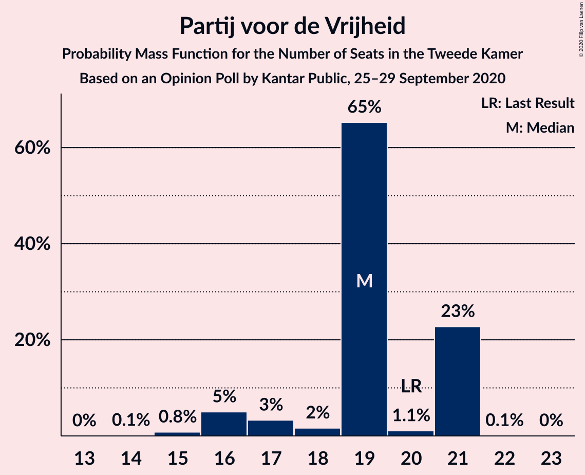
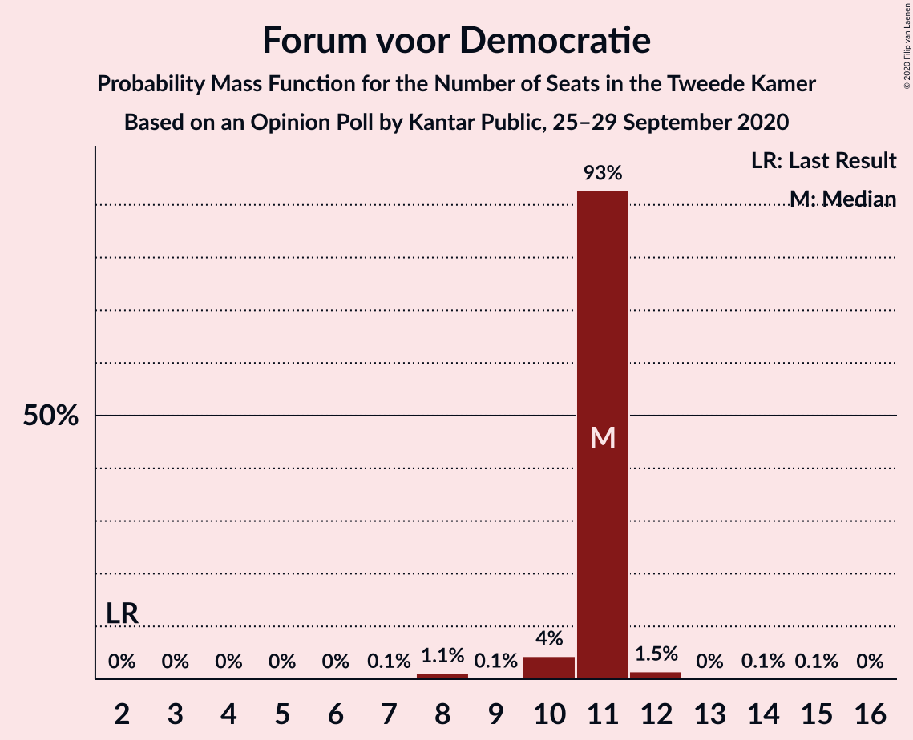
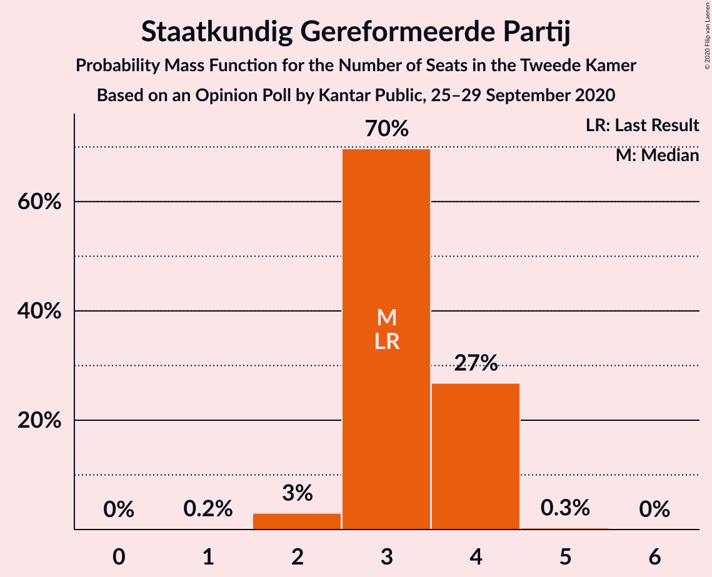
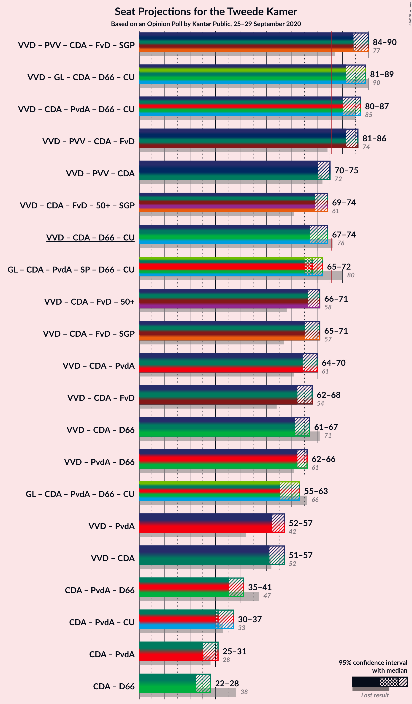
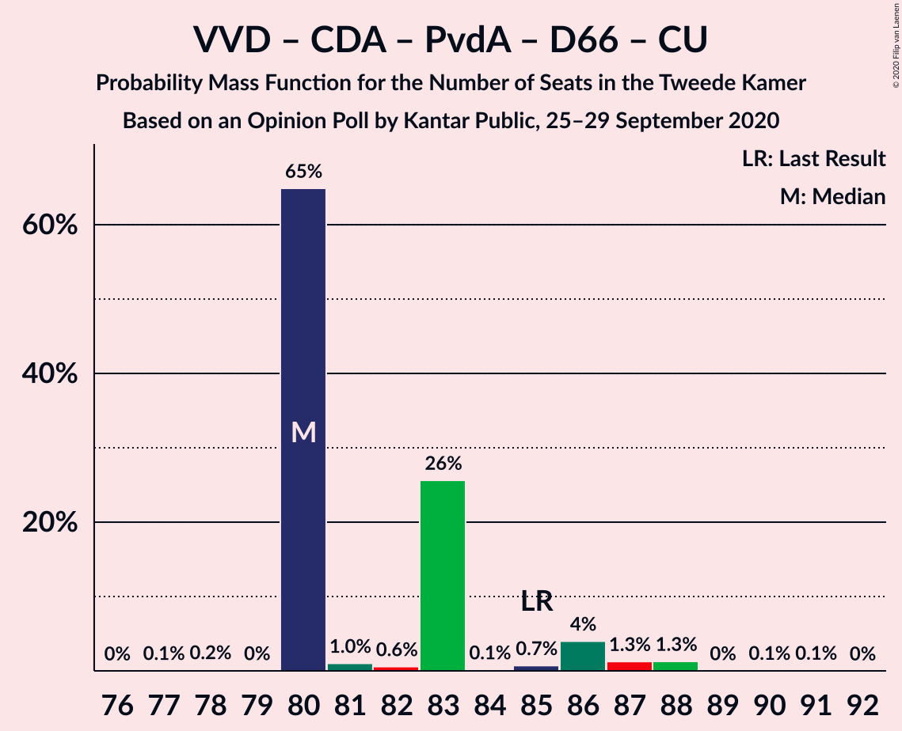
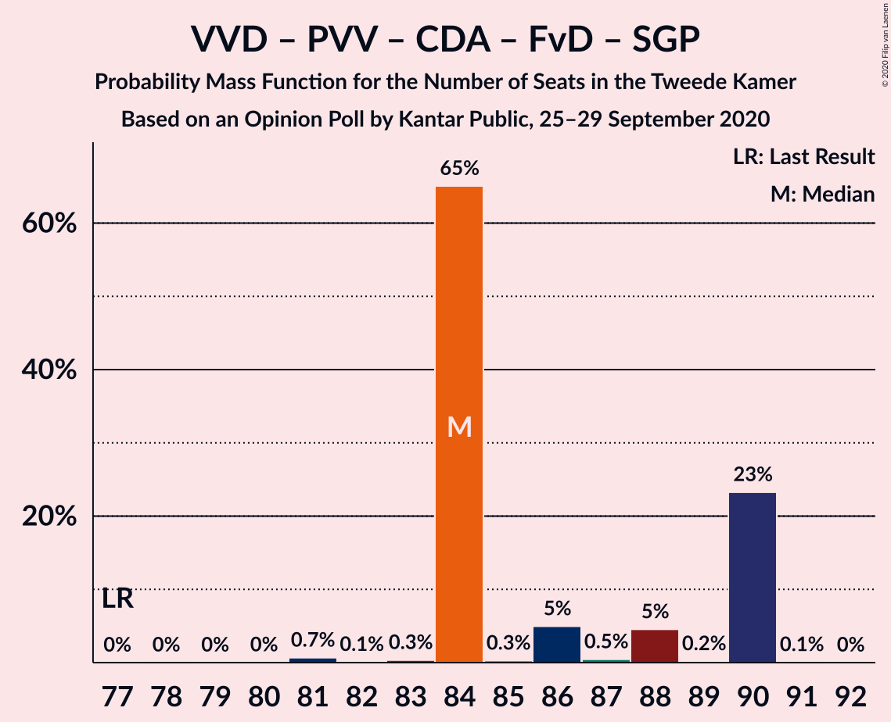
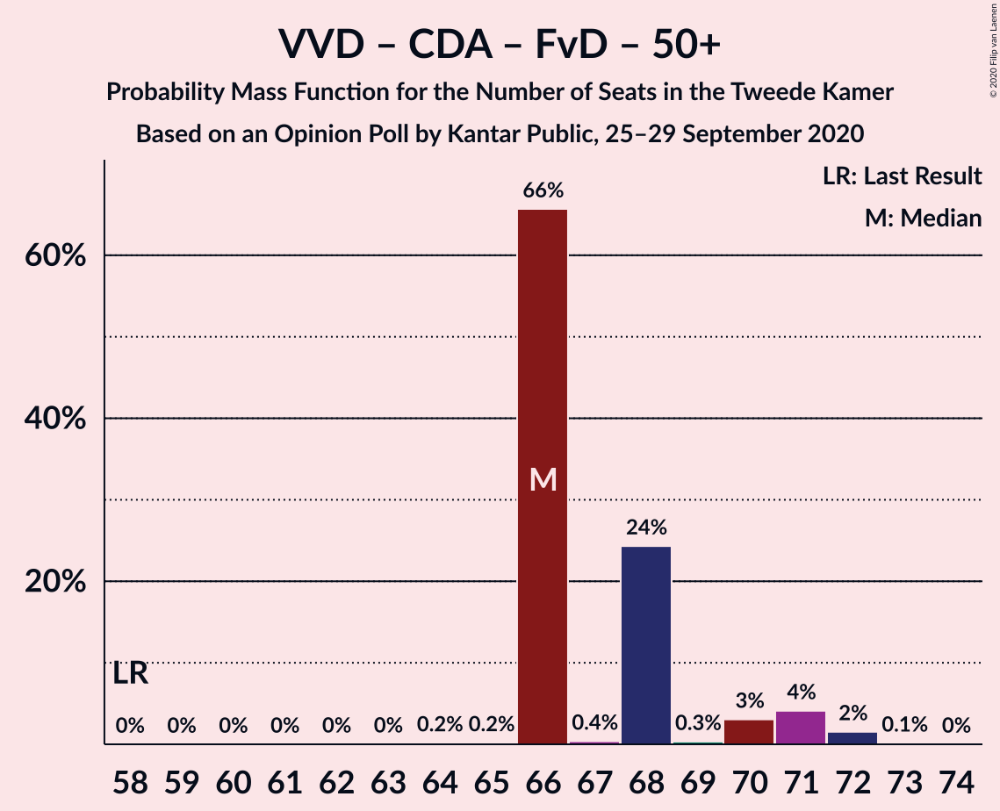
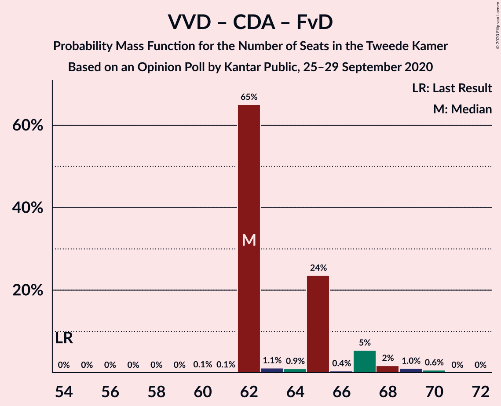
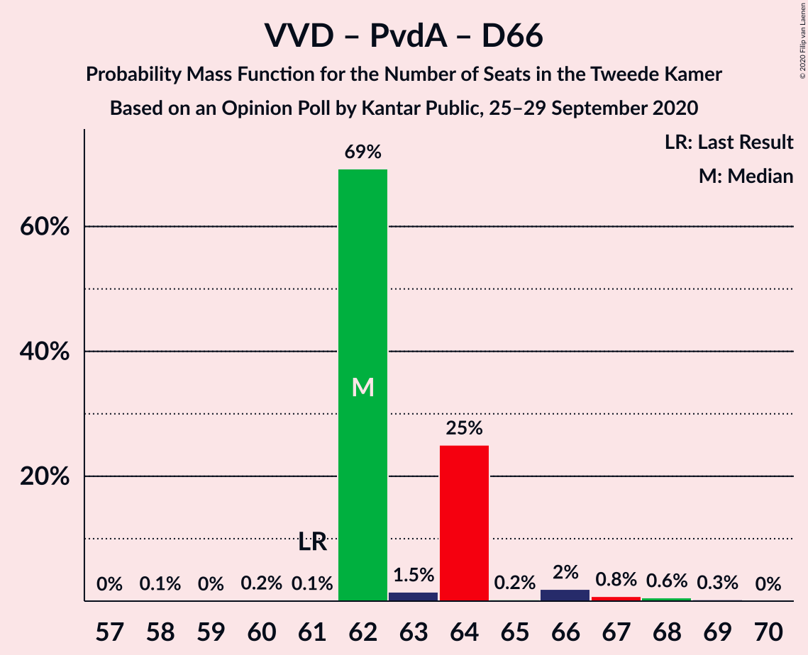
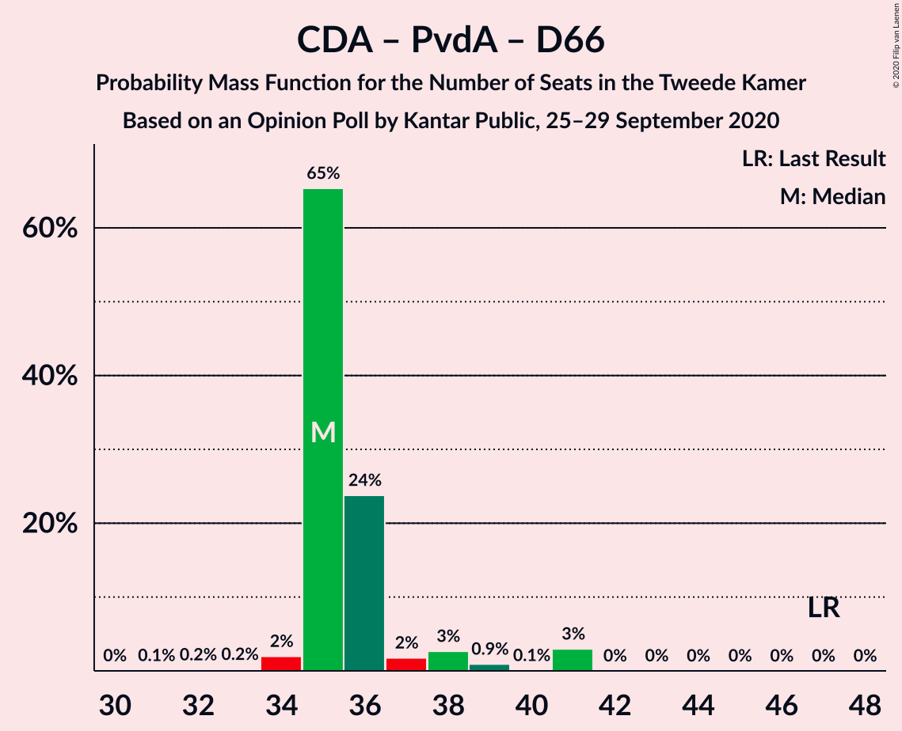

# Opinion Poll by Kantar Public, 25–29 September 2020

<a href="#voting-intentions">Voting Intentions</a> | <a href="#seats">Seats</a> | <a href="#coalitions">Coalitions</a> | <a href="#technical-information">Technical Information</a>

## Voting Intentions

### Confidence Intervals

| Party | Last Result | Poll Result | 80% Confidence Interval | 90% Confidence Interval | 95% Confidence Interval | 99% Confidence Interval |
|:-----:|:-----------:|:-----------:|:-----------------------:|:-----------------------:|:-----------------------:|:-----------------------:|
| Volkspartij voor Vrijheid en Democratie | 21.3% | 26.7% | 25.1–28.4% |24.6–28.9% |24.2–29.3% |23.5–30.1% |
| Partij voor de Vrijheid | 13.1% | 11.9% | 10.8–13.2% |10.4–13.6% |10.2–13.9% |9.6–14.5% |
| GroenLinks | 9.1% | 9.8% | 8.7–11.0% |8.5–11.3% |8.2–11.6% |7.7–12.2% |
| Christen-Democratisch Appèl | 12.4% | 9.2% | 8.2–10.3% |7.9–10.7% |7.7–11.0% |7.2–11.6% |
| Partij van de Arbeid | 5.7% | 8.5% | 7.5–9.6% |7.3–10.0% |7.0–10.2% |6.6–10.8% |
| Socialistische Partij | 9.1% | 7.4% | 6.5–8.5% |6.2–8.8% |6.0–9.0% |5.6–9.6% |
| Forum voor Democratie | 1.8% | 7.0% | 6.1–8.0% |5.9–8.3% |5.7–8.6% |5.3–9.1% |
| Democraten 66 | 12.2% | 6.6% | 5.8–7.7% |5.5–8.0% |5.3–8.2% |5.0–8.7% |
| ChristenUnie | 3.4% | 4.1% | 3.4–4.9% |3.2–5.2% |3.1–5.4% |2.8–5.8% |
| Partij voor de Dieren | 3.2% | 2.5% | 2.0–3.2% |1.8–3.4% |1.7–3.5% |1.5–3.9% |
| 50Plus | 3.1% | 2.4% | 1.9–3.1% |1.8–3.3% |1.6–3.4% |1.4–3.8% |
| Staatkundig Gereformeerde Partij | 2.1% | 2.1% | 1.7–2.8% |1.5–3.0% |1.4–3.1% |1.2–3.5% |
| DENK | 2.1% | 1.8% | 1.4–2.4% |1.3–2.6% |1.2–2.7% |1.0–3.0% |

*Note:* The poll result column reflects the actual value used in the calculations. Published results may vary slightly, and in addition be rounded to fewer digits.

## Seats

### Confidence Intervals

| Party | Last Result | Median | 80% Confidence Interval | 90% Confidence Interval | 95% Confidence Interval | 99% Confidence Interval |
|:-----:|:-----------:|:------:|:-----------------------:|:-----------------------:|:-----------------------:|:-----------------------:|
| <a href="#volkspartij-voor-vrijheid-en-democratie">Volkspartij voor Vrijheid en Democratie</a> | 33 | 42 | 38–42 |38–46 |38–46 |36–46 |
| <a href="#partij-voor-de-vrijheid">Partij voor de Vrijheid</a> | 20 | 16 | 16–18 |16–20 |16–20 |15–21 |
| <a href="#groenlinks">GroenLinks</a> | 14 | 14 | 14–16 |13–17 |11–17 |11–17 |
| <a href="#christen-democratisch-appèl">Christen-Democratisch Appèl</a> | 19 | 15 | 14–15 |12–16 |12–16 |11–16 |
| <a href="#partij-van-de-arbeid">Partij van de Arbeid</a> | 9 | 13 | 13 |11–13 |11–14 |11–16 |
| <a href="#socialistische-partij">Socialistische Partij</a> | 14 | 11 | 11–12 |11–13 |11–13 |10–13 |
| <a href="#forum-voor-democratie">Forum voor Democratie</a> | 2 | 11 | 10–11 |8–11 |8–11 |8–14 |
| <a href="#democraten-66">Democraten 66</a> | 19 | 9 | 9 |9–11 |9–12 |8–12 |
| <a href="#christenunie">ChristenUnie</a> | 5 | 8 | 4–8 |4–8 |4–8 |4–8 |
| <a href="#partij-voor-de-dieren">Partij voor de Dieren</a> | 5 | 2 | 2–4 |2–4 |2–4 |2–5 |
| <a href="#50plus">50Plus</a> | 4 | 3 | 3–4 |3–4 |3–4 |2–6 |
| <a href="#staatkundig-gereformeerde-partij">Staatkundig Gereformeerde Partij</a> | 3 | 4 | 3–4 |2–4 |2–4 |2–5 |
| <a href="#denk">DENK</a> | 3 | 2 | 2–3 |1–4 |1–4 |1–4 |

### Volkspartij voor Vrijheid en Democratie

*For a full overview of the results for this party, see the [Volkspartij voor Vrijheid en Democratie](party-volkspartijvoorvrijheidendemocratie.html) page.*

| Number of Seats | Probability | Accumulated | Special Marks |
|:---------------:|:-----------:|:-----------:|:-------------:|
| 33 | 0% | 100% | Last Result |
| 34 | 0% | 100% |  |
| 35 | 0.1% | 100% |  |
| 36 | 0.4% | 99.8% |  |
| 37 | 2% | 99.5% |  |
| 38 | 10% | 98% |  |
| 39 | 2% | 88% |  |
| 40 | 0.3% | 87% |  |
| 41 | 0.2% | 86% |  |
| 42 | 79% | 86% | Median |
| 43 | 1.2% | 7% |  |
| 44 | 0.1% | 6% |  |
| 45 | 0.5% | 6% |  |
| 46 | 5% | 5% |  |
| 47 | 0% | 0.1% |  |
| 48 | 0.1% | 0.1% |  |
| 49 | 0% | 0% |  |

### Partij voor de Vrijheid

*For a full overview of the results for this party, see the [Partij voor de Vrijheid](party-partijvoordevrijheid.html) page.*

| Number of Seats | Probability | Accumulated | Special Marks |
|:---------------:|:-----------:|:-----------:|:-------------:|
| 14 | 0.3% | 100% |  |
| 15 | 0.6% | 99.6% |  |
| 16 | 85% | 99.0% | Median |
| 17 | 0.3% | 14% |  |
| 18 | 6% | 13% |  |
| 19 | 0.7% | 7% |  |
| 20 | 6% | 7% | Last Result |
| 21 | 0.5% | 0.6% |  |
| 22 | 0.1% | 0.1% |  |
| 23 | 0% | 0% |  |

### GroenLinks

*For a full overview of the results for this party, see the [GroenLinks](party-groenlinks.html) page.*

| Number of Seats | Probability | Accumulated | Special Marks |
|:---------------:|:-----------:|:-----------:|:-------------:|
| 10 | 0.1% | 100% |  |
| 11 | 4% | 99.9% |  |
| 12 | 0.3% | 96% |  |
| 13 | 2% | 96% |  |
| 14 | 77% | 94% | Last Result, Median |
| 15 | 6% | 16% |  |
| 16 | 0.6% | 10% |  |
| 17 | 10% | 10% |  |
| 18 | 0.1% | 0.1% |  |
| 19 | 0% | 0% |  |

### Christen-Democratisch Appèl

*For a full overview of the results for this party, see the [Christen-Democratisch Appèl](party-christen-democratischappèl.html) page.*

| Number of Seats | Probability | Accumulated | Special Marks |
|:---------------:|:-----------:|:-----------:|:-------------:|
| 10 | 0.1% | 100% |  |
| 11 | 0.5% | 99.9% |  |
| 12 | 6% | 99.4% |  |
| 13 | 1.1% | 93% |  |
| 14 | 10% | 92% |  |
| 15 | 76% | 82% | Median |
| 16 | 5% | 6% |  |
| 17 | 0.3% | 0.4% |  |
| 18 | 0% | 0% |  |
| 19 | 0% | 0% | Last Result |

### Partij van de Arbeid

*For a full overview of the results for this party, see the [Partij van de Arbeid](party-partijvandearbeid.html) page.*

| Number of Seats | Probability | Accumulated | Special Marks |
|:---------------:|:-----------:|:-----------:|:-------------:|
| 9 | 0.1% | 100% | Last Result |
| 10 | 0.1% | 99.9% |  |
| 11 | 7% | 99.8% |  |
| 12 | 0.8% | 93% |  |
| 13 | 89% | 92% | Median |
| 14 | 0.4% | 3% |  |
| 15 | 1.4% | 2% |  |
| 16 | 0.9% | 1.1% |  |
| 17 | 0% | 0.1% |  |
| 18 | 0.1% | 0.1% |  |
| 19 | 0% | 0% |  |

### Socialistische Partij

*For a full overview of the results for this party, see the [Socialistische Partij](party-socialistischepartij.html) page.*

| Number of Seats | Probability | Accumulated | Special Marks |
|:---------------:|:-----------:|:-----------:|:-------------:|
| 8 | 0% | 100% |  |
| 9 | 0.4% | 99.9% |  |
| 10 | 0.9% | 99.5% |  |
| 11 | 81% | 98.6% | Median |
| 12 | 11% | 17% |  |
| 13 | 5% | 6% |  |
| 14 | 0.2% | 0.3% | Last Result |
| 15 | 0.1% | 0.1% |  |
| 16 | 0% | 0% |  |

### Forum voor Democratie

*For a full overview of the results for this party, see the [Forum voor Democratie](party-forumvoordemocratie.html) page.*

| Number of Seats | Probability | Accumulated | Special Marks |
|:---------------:|:-----------:|:-----------:|:-------------:|
| 2 | 0% | 100% | Last Result |
| 3 | 0% | 100% |  |
| 4 | 0% | 100% |  |
| 5 | 0% | 100% |  |
| 6 | 0% | 100% |  |
| 7 | 0.1% | 100% |  |
| 8 | 9% | 99.9% |  |
| 9 | 0.5% | 91% |  |
| 10 | 1.4% | 90% |  |
| 11 | 88% | 89% | Median |
| 12 | 0.8% | 2% |  |
| 13 | 0% | 0.7% |  |
| 14 | 0.6% | 0.7% |  |
| 15 | 0.1% | 0.1% |  |
| 16 | 0% | 0% |  |

### Democraten 66

*For a full overview of the results for this party, see the [Democraten 66](party-democraten66.html) page.*

| Number of Seats | Probability | Accumulated | Special Marks |
|:---------------:|:-----------:|:-----------:|:-------------:|
| 7 | 0.4% | 100% |  |
| 8 | 2% | 99.6% |  |
| 9 | 91% | 98% | Median |
| 10 | 1.2% | 7% |  |
| 11 | 0.9% | 5% |  |
| 12 | 4% | 5% |  |
| 13 | 0.1% | 0.3% |  |
| 14 | 0.2% | 0.2% |  |
| 15 | 0% | 0% |  |
| 16 | 0% | 0% |  |
| 17 | 0% | 0% |  |
| 18 | 0% | 0% |  |
| 19 | 0% | 0% | Last Result |

### ChristenUnie

*For a full overview of the results for this party, see the [ChristenUnie](party-christenunie.html) page.*

| Number of Seats | Probability | Accumulated | Special Marks |
|:---------------:|:-----------:|:-----------:|:-------------:|
| 4 | 10% | 100% |  |
| 5 | 6% | 90% | Last Result |
| 6 | 2% | 83% |  |
| 7 | 4% | 81% |  |
| 8 | 77% | 77% | Median |
| 9 | 0% | 0.1% |  |
| 10 | 0.1% | 0.1% |  |
| 11 | 0% | 0% |  |

### Partij voor de Dieren

*For a full overview of the results for this party, see the [Partij voor de Dieren](party-partijvoordedieren.html) page.*

| Number of Seats | Probability | Accumulated | Special Marks |
|:---------------:|:-----------:|:-----------:|:-------------:|
| 2 | 76% | 100% | Median |
| 3 | 6% | 24% |  |
| 4 | 17% | 18% |  |
| 5 | 1.1% | 1.1% | Last Result |
| 6 | 0% | 0% |  |

### 50Plus

*For a full overview of the results for this party, see the [50Plus](party-50plus.html) page.*

| Number of Seats | Probability | Accumulated | Special Marks |
|:---------------:|:-----------:|:-----------:|:-------------:|
| 1 | 0.2% | 100% |  |
| 2 | 0.6% | 99.8% |  |
| 3 | 77% | 99.2% | Median |
| 4 | 20% | 22% | Last Result |
| 5 | 1.3% | 2% |  |
| 6 | 1.0% | 1.0% |  |
| 7 | 0% | 0% |  |

### Staatkundig Gereformeerde Partij

*For a full overview of the results for this party, see the [Staatkundig Gereformeerde Partij](party-staatkundiggereformeerdepartij.html) page.*

| Number of Seats | Probability | Accumulated | Special Marks |
|:---------------:|:-----------:|:-----------:|:-------------:|
| 2 | 6% | 100% |  |
| 3 | 7% | 94% | Last Result |
| 4 | 86% | 87% | Median |
| 5 | 0.8% | 0.8% |  |
| 6 | 0% | 0% |  |

### DENK

*For a full overview of the results for this party, see the [DENK](party-denk.html) page.*

| Number of Seats | Probability | Accumulated | Special Marks |
|:---------------:|:-----------:|:-----------:|:-------------:|
| 1 | 7% | 100% |  |
| 2 | 81% | 93% | Median |
| 3 | 2% | 12% | Last Result |
| 4 | 10% | 10% |  |
| 5 | 0.1% | 0.1% |  |
| 6 | 0% | 0% |  |

## Coalitions

### Confidence Intervals

| Coalition | Last Result | Median | Majority? | 80% Confidence Interval | 90% Confidence Interval | 95% Confidence Interval | 99% Confidence Interval |
|:---------:|:-----------:|:------:|:---------:|:-----------------------:|:-----------------------:|:-----------------------:|:-----------------------:|
| Volkspartij voor Vrijheid en Democratie – Christen-Democratisch Appèl – Partij van de Arbeid – Democraten 66 – ChristenUnie | 85 | 87 | 100% | 78–87 | 78–87 | 78–90 | 78–90 |
| Volkspartij voor Vrijheid en Democratie – Partij voor de Vrijheid – Christen-Democratisch Appèl – Forum voor Democratie – Staatkundig Gereformeerde Partij | 77 | 88 | 100% | 83–88 | 83–88 | 83–88 | 82–90 |
| Volkspartij voor Vrijheid en Democratie – GroenLinks – Christen-Democratisch Appèl – Democraten 66 – ChristenUnie | 90 | 88 | 100% | 82–88 | 82–88 | 82–88 | 80–88 |
| Volkspartij voor Vrijheid en Democratie – Partij voor de Vrijheid – Christen-Democratisch Appèl – Forum voor Democratie | 74 | 84 | 100% | 79–84 | 79–86 | 79–86 | 78–86 |
| Volkspartij voor Vrijheid en Democratie – Partij voor de Vrijheid – Christen-Democratisch Appèl | 72 | 73 | 9% | 68–75 | 68–77 | 68–78 | 66–78 |
| Volkspartij voor Vrijheid en Democratie – Christen-Democratisch Appèl – Democraten 66 – ChristenUnie | 76 | 74 | 4% | 65–74 | 65–74 | 65–77 | 65–77 |
| Volkspartij voor Vrijheid en Democratie – Christen-Democratisch Appèl – Forum voor Democratie – 50Plus – Staatkundig Gereformeerde Partij | 61 | 75 | 0.4% | 71–75 | 71–75 | 71–75 | 68–75 |
| Volkspartij voor Vrijheid en Democratie – Christen-Democratisch Appèl – Forum voor Democratie – Staatkundig Gereformeerde Partij | 57 | 72 | 0.2% | 67–72 | 67–72 | 66–72 | 65–72 |
| Volkspartij voor Vrijheid en Democratie – Christen-Democratisch Appèl – Forum voor Democratie – 50Plus | 58 | 71 | 0.3% | 67–71 | 67–71 | 67–71 | 65–72 |
| GroenLinks – Christen-Democratisch Appèl – Partij van de Arbeid – Socialistische Partij – Democraten 66 – ChristenUnie | 80 | 70 | 0.1% | 69–70 | 65–70 | 65–71 | 61–73 |
| Volkspartij voor Vrijheid en Democratie – Christen-Democratisch Appèl – Partij van de Arbeid | 61 | 70 | 0% | 65–70 | 65–70 | 65–71 | 63–73 |
| Volkspartij voor Vrijheid en Democratie – Christen-Democratisch Appèl – Democraten 66 | 71 | 66 | 0% | 61–66 | 61–67 | 61–70 | 59–70 |
| Volkspartij voor Vrijheid en Democratie – Christen-Democratisch Appèl – Forum voor Democratie | 54 | 68 | 0% | 63–68 | 63–68 | 63–68 | 61–68 |
| Volkspartij voor Vrijheid en Democratie – Partij van de Arbeid – Democraten 66 | 61 | 64 | 0% | 60–65 | 60–66 | 60–67 | 59–67 |
| GroenLinks – Christen-Democratisch Appèl – Partij van de Arbeid – Democraten 66 – ChristenUnie | 66 | 59 | 0% | 57–59 | 52–59 | 52–59 | 50–61 |
| Volkspartij voor Vrijheid en Democratie – Christen-Democratisch Appèl | 52 | 57 | 0% | 52–57 | 52–58 | 52–58 | 49–59 |
| Volkspartij voor Vrijheid en Democratie – Partij van de Arbeid | 42 | 55 | 0% | 51–55 | 51–57 | 51–57 | 49–58 |
| Christen-Democratisch Appèl – Partij van de Arbeid – Democraten 66 | 47 | 37 | 0% | 36–37 | 32–39 | 32–41 | 32–41 |
| Christen-Democratisch Appèl – Partij van de Arbeid – ChristenUnie | 33 | 36 | 0% | 31–36 | 28–36 | 28–36 | 28–39 |
| Christen-Democratisch Appèl – Partij van de Arbeid | 28 | 28 | 0% | 27–28 | 23–29 | 23–29 | 23–31 |
| Christen-Democratisch Appèl – Democraten 66 | 38 | 24 | 0% | 23–24 | 21–25 | 21–28 | 21–28 |

### Volkspartij voor Vrijheid en Democratie – Christen-Democratisch Appèl – Partij van de Arbeid – Democraten 66 – ChristenUnie

| Number of Seats | Probability | Accumulated | Special Marks |
|:---------------:|:-----------:|:-----------:|:-------------:|
| 76 | 0% | 100% | Majority |
| 77 | 0.4% | 99.9% |  |
| 78 | 10% | 99.6% |  |
| 79 | 0% | 90% |  |
| 80 | 1.2% | 90% |  |
| 81 | 0.2% | 88% |  |
| 82 | 0.5% | 88% |  |
| 83 | 5% | 88% |  |
| 84 | 2% | 83% |  |
| 85 | 0.1% | 80% | Last Result |
| 86 | 0.9% | 80% |  |
| 87 | 76% | 79% | Median |
| 88 | 0% | 4% |  |
| 89 | 0.3% | 4% |  |
| 90 | 3% | 3% |  |
| 91 | 0% | 0% |  |

### Volkspartij voor Vrijheid en Democratie – Partij voor de Vrijheid – Christen-Democratisch Appèl – Forum voor Democratie – Staatkundig Gereformeerde Partij

| Number of Seats | Probability | Accumulated | Special Marks |
|:---------------:|:-----------:|:-----------:|:-------------:|
| 77 | 0% | 100% | Last Result |
| 78 | 0% | 100% |  |
| 79 | 0.3% | 100% |  |
| 80 | 0% | 99.7% |  |
| 81 | 0.1% | 99.7% |  |
| 82 | 0.3% | 99.6% |  |
| 83 | 10% | 99.3% |  |
| 84 | 2% | 90% |  |
| 85 | 1.0% | 88% |  |
| 86 | 0.6% | 87% |  |
| 87 | 4% | 86% |  |
| 88 | 80% | 82% | Median |
| 89 | 1.4% | 2% |  |
| 90 | 0.2% | 0.6% |  |
| 91 | 0.1% | 0.4% |  |
| 92 | 0% | 0.3% |  |
| 93 | 0.3% | 0.3% |  |
| 94 | 0% | 0% |  |

### Volkspartij voor Vrijheid en Democratie – GroenLinks – Christen-Democratisch Appèl – Democraten 66 – ChristenUnie

| Number of Seats | Probability | Accumulated | Special Marks |
|:---------------:|:-----------:|:-----------:|:-------------:|
| 79 | 0.2% | 100% |  |
| 80 | 0.8% | 99.8% |  |
| 81 | 0.8% | 99.0% |  |
| 82 | 11% | 98% |  |
| 83 | 1.4% | 88% |  |
| 84 | 0% | 86% |  |
| 85 | 0.2% | 86% |  |
| 86 | 0.8% | 86% |  |
| 87 | 6% | 85% |  |
| 88 | 79% | 79% | Median |
| 89 | 0.4% | 0.4% |  |
| 90 | 0% | 0% | Last Result |

### Volkspartij voor Vrijheid en Democratie – Partij voor de Vrijheid – Christen-Democratisch Appèl – Forum voor Democratie

| Number of Seats | Probability | Accumulated | Special Marks |
|:---------------:|:-----------:|:-----------:|:-------------:|
| 74 | 0% | 100% | Last Result |
| 75 | 0% | 100% |  |
| 76 | 0% | 100% | Majority |
| 77 | 0.5% | 100% |  |
| 78 | 0.1% | 99.5% |  |
| 79 | 10% | 99.4% |  |
| 80 | 0.1% | 89% |  |
| 81 | 2% | 89% |  |
| 82 | 0.7% | 88% |  |
| 83 | 0.6% | 87% |  |
| 84 | 79% | 86% | Median |
| 85 | 0.2% | 7% |  |
| 86 | 7% | 7% |  |
| 87 | 0% | 0.4% |  |
| 88 | 0.1% | 0.4% |  |
| 89 | 0.3% | 0.3% |  |
| 90 | 0% | 0% |  |

### Volkspartij voor Vrijheid en Democratie – Partij voor de Vrijheid – Christen-Democratisch Appèl

| Number of Seats | Probability | Accumulated | Special Marks |
|:---------------:|:-----------:|:-----------:|:-------------:|
| 66 | 0.5% | 100% |  |
| 67 | 0.3% | 99.5% |  |
| 68 | 10% | 99.2% |  |
| 69 | 0.1% | 89% |  |
| 70 | 0% | 89% |  |
| 71 | 2% | 89% |  |
| 72 | 0.3% | 87% | Last Result |
| 73 | 76% | 87% | Median |
| 74 | 0.6% | 11% |  |
| 75 | 2% | 11% |  |
| 76 | 3% | 9% | Majority |
| 77 | 0.4% | 5% |  |
| 78 | 5% | 5% |  |
| 79 | 0% | 0% |  |

### Volkspartij voor Vrijheid en Democratie – Christen-Democratisch Appèl – Democraten 66 – ChristenUnie

| Number of Seats | Probability | Accumulated | Special Marks |
|:---------------:|:-----------:|:-----------:|:-------------:|
| 63 | 0% | 100% |  |
| 64 | 0.1% | 99.9% |  |
| 65 | 10% | 99.8% |  |
| 66 | 0.3% | 90% |  |
| 67 | 0.1% | 89% |  |
| 68 | 0.4% | 89% |  |
| 69 | 2% | 89% |  |
| 70 | 0.7% | 86% |  |
| 71 | 0.4% | 86% |  |
| 72 | 5% | 85% |  |
| 73 | 0.2% | 80% |  |
| 74 | 76% | 80% | Median |
| 75 | 0.3% | 4% |  |
| 76 | 0.3% | 4% | Last Result, Majority |
| 77 | 3% | 3% |  |
| 78 | 0% | 0% |  |

### Volkspartij voor Vrijheid en Democratie – Christen-Democratisch Appèl – Forum voor Democratie – 50Plus – Staatkundig Gereformeerde Partij

| Number of Seats | Probability | Accumulated | Special Marks |
|:---------------:|:-----------:|:-----------:|:-------------:|
| 61 | 0% | 100% | Last Result |
| 62 | 0% | 100% |  |
| 63 | 0% | 100% |  |
| 64 | 0% | 100% |  |
| 65 | 0.1% | 100% |  |
| 66 | 0.2% | 99.9% |  |
| 67 | 0.1% | 99.7% |  |
| 68 | 0.2% | 99.6% |  |
| 69 | 0.5% | 99.4% |  |
| 70 | 0.9% | 98.9% |  |
| 71 | 11% | 98% |  |
| 72 | 6% | 87% |  |
| 73 | 4% | 81% |  |
| 74 | 0.3% | 77% |  |
| 75 | 76% | 77% | Median |
| 76 | 0% | 0.4% | Majority |
| 77 | 0% | 0.4% |  |
| 78 | 0% | 0.3% |  |
| 79 | 0.1% | 0.3% |  |
| 80 | 0.3% | 0.3% |  |
| 81 | 0% | 0% |  |

### Volkspartij voor Vrijheid en Democratie – Christen-Democratisch Appèl – Forum voor Democratie – Staatkundig Gereformeerde Partij

| Number of Seats | Probability | Accumulated | Special Marks |
|:---------------:|:-----------:|:-----------:|:-------------:|
| 57 | 0% | 100% | Last Result |
| 58 | 0% | 100% |  |
| 59 | 0% | 100% |  |
| 60 | 0% | 100% |  |
| 61 | 0% | 100% |  |
| 62 | 0% | 99.9% |  |
| 63 | 0.2% | 99.9% |  |
| 64 | 0.1% | 99.8% |  |
| 65 | 0.6% | 99.6% |  |
| 66 | 2% | 99.0% |  |
| 67 | 10% | 97% |  |
| 68 | 6% | 87% |  |
| 69 | 5% | 81% |  |
| 70 | 0.7% | 77% |  |
| 71 | 0.2% | 76% |  |
| 72 | 76% | 76% | Median |
| 73 | 0% | 0.4% |  |
| 74 | 0% | 0.4% |  |
| 75 | 0.1% | 0.3% |  |
| 76 | 0% | 0.2% | Majority |
| 77 | 0.2% | 0.2% |  |
| 78 | 0% | 0% |  |

### Volkspartij voor Vrijheid en Democratie – Christen-Democratisch Appèl – Forum voor Democratie – 50Plus

| Number of Seats | Probability | Accumulated | Special Marks |
|:---------------:|:-----------:|:-----------:|:-------------:|
| 58 | 0% | 100% | Last Result |
| 59 | 0% | 100% |  |
| 60 | 0% | 100% |  |
| 61 | 0.1% | 100% |  |
| 62 | 0.1% | 99.8% |  |
| 63 | 0% | 99.8% |  |
| 64 | 0% | 99.7% |  |
| 65 | 0.6% | 99.7% |  |
| 66 | 0.2% | 99.1% |  |
| 67 | 11% | 99.0% |  |
| 68 | 1.5% | 88% |  |
| 69 | 0.8% | 87% |  |
| 70 | 8% | 86% |  |
| 71 | 76% | 77% | Median |
| 72 | 1.0% | 1.3% |  |
| 73 | 0% | 0.4% |  |
| 74 | 0% | 0.4% |  |
| 75 | 0.1% | 0.3% |  |
| 76 | 0.2% | 0.3% | Majority |
| 77 | 0% | 0% |  |

### GroenLinks – Christen-Democratisch Appèl – Partij van de Arbeid – Socialistische Partij – Democraten 66 – ChristenUnie

| Number of Seats | Probability | Accumulated | Special Marks |
|:---------------:|:-----------:|:-----------:|:-------------:|
| 58 | 0.1% | 100% |  |
| 59 | 0% | 99.9% |  |
| 60 | 0% | 99.9% |  |
| 61 | 0.9% | 99.9% |  |
| 62 | 0.1% | 99.0% |  |
| 63 | 0.3% | 98.9% |  |
| 64 | 0.3% | 98.6% |  |
| 65 | 5% | 98% |  |
| 66 | 0.7% | 93% |  |
| 67 | 0.1% | 93% |  |
| 68 | 0.8% | 92% |  |
| 69 | 10% | 92% |  |
| 70 | 79% | 82% | Median |
| 71 | 0.9% | 3% |  |
| 72 | 0% | 2% |  |
| 73 | 1.3% | 2% |  |
| 74 | 0.4% | 0.5% |  |
| 75 | 0% | 0.1% |  |
| 76 | 0.1% | 0.1% | Majority |
| 77 | 0% | 0% |  |
| 78 | 0% | 0% |  |
| 79 | 0% | 0% |  |
| 80 | 0% | 0% | Last Result |

### Volkspartij voor Vrijheid en Democratie – Christen-Democratisch Appèl – Partij van de Arbeid

| Number of Seats | Probability | Accumulated | Special Marks |
|:---------------:|:-----------:|:-----------:|:-------------:|
| 61 | 0% | 100% | Last Result |
| 62 | 0.4% | 99.9% |  |
| 63 | 0.2% | 99.6% |  |
| 64 | 0.4% | 99.3% |  |
| 65 | 10% | 98.9% |  |
| 66 | 1.4% | 89% |  |
| 67 | 0.5% | 88% |  |
| 68 | 2% | 87% |  |
| 69 | 5% | 85% |  |
| 70 | 76% | 80% | Median |
| 71 | 4% | 4% |  |
| 72 | 0.1% | 0.6% |  |
| 73 | 0.5% | 0.5% |  |
| 74 | 0% | 0% |  |

### Volkspartij voor Vrijheid en Democratie – Christen-Democratisch Appèl – Democraten 66

| Number of Seats | Probability | Accumulated | Special Marks |
|:---------------:|:-----------:|:-----------:|:-------------:|
| 58 | 0% | 100% |  |
| 59 | 0.5% | 99.9% |  |
| 60 | 0.2% | 99.5% |  |
| 61 | 11% | 99.3% |  |
| 62 | 0.4% | 88% |  |
| 63 | 0.5% | 88% |  |
| 64 | 1.5% | 87% |  |
| 65 | 0.2% | 86% |  |
| 66 | 76% | 86% | Median |
| 67 | 5% | 10% |  |
| 68 | 0.9% | 5% |  |
| 69 | 0% | 4% |  |
| 70 | 4% | 4% |  |
| 71 | 0.1% | 0.1% | Last Result |
| 72 | 0% | 0% |  |

### Volkspartij voor Vrijheid en Democratie – Christen-Democratisch Appèl – Forum voor Democratie

| Number of Seats | Probability | Accumulated | Special Marks |
|:---------------:|:-----------:|:-----------:|:-------------:|
| 54 | 0% | 100% | Last Result |
| 55 | 0% | 100% |  |
| 56 | 0% | 100% |  |
| 57 | 0% | 100% |  |
| 58 | 0.2% | 100% |  |
| 59 | 0% | 99.8% |  |
| 60 | 0% | 99.8% |  |
| 61 | 0.4% | 99.7% |  |
| 62 | 0.3% | 99.4% |  |
| 63 | 12% | 99.1% |  |
| 64 | 0.2% | 87% |  |
| 65 | 0.9% | 87% |  |
| 66 | 9% | 86% |  |
| 67 | 0.6% | 77% |  |
| 68 | 76% | 76% | Median |
| 69 | 0% | 0.4% |  |
| 70 | 0% | 0.4% |  |
| 71 | 0.1% | 0.4% |  |
| 72 | 0.1% | 0.3% |  |
| 73 | 0.2% | 0.2% |  |
| 74 | 0% | 0% |  |

### Volkspartij voor Vrijheid en Democratie – Partij van de Arbeid – Democraten 66

| Number of Seats | Probability | Accumulated | Special Marks |
|:---------------:|:-----------:|:-----------:|:-------------:|
| 58 | 0.4% | 100% |  |
| 59 | 0.4% | 99.6% |  |
| 60 | 11% | 99.2% |  |
| 61 | 0.2% | 88% | Last Result |
| 62 | 0.5% | 88% |  |
| 63 | 2% | 88% |  |
| 64 | 76% | 86% | Median |
| 65 | 0.4% | 10% |  |
| 66 | 5% | 10% |  |
| 67 | 4% | 4% |  |
| 68 | 0.3% | 0.5% |  |
| 69 | 0.1% | 0.2% |  |
| 70 | 0% | 0% |  |

### GroenLinks – Christen-Democratisch Appèl – Partij van de Arbeid – Democraten 66 – ChristenUnie

| Number of Seats | Probability | Accumulated | Special Marks |
|:---------------:|:-----------:|:-----------:|:-------------:|
| 48 | 0.1% | 100% |  |
| 49 | 0% | 99.9% |  |
| 50 | 1.0% | 99.9% |  |
| 51 | 0% | 98.9% |  |
| 52 | 5% | 98.9% |  |
| 53 | 0.1% | 94% |  |
| 54 | 0.5% | 94% |  |
| 55 | 0.3% | 93% |  |
| 56 | 0.2% | 93% |  |
| 57 | 11% | 93% |  |
| 58 | 0.7% | 82% |  |
| 59 | 79% | 81% | Median |
| 60 | 0.4% | 2% |  |
| 61 | 1.4% | 2% |  |
| 62 | 0.1% | 0.5% |  |
| 63 | 0.3% | 0.4% |  |
| 64 | 0% | 0% |  |
| 65 | 0% | 0% |  |
| 66 | 0% | 0% | Last Result |

### Volkspartij voor Vrijheid en Democratie – Christen-Democratisch Appèl

| Number of Seats | Probability | Accumulated | Special Marks |
|:---------------:|:-----------:|:-----------:|:-------------:|
| 47 | 0.1% | 100% |  |
| 48 | 0% | 99.8% |  |
| 49 | 0.3% | 99.8% |  |
| 50 | 0.4% | 99.5% |  |
| 51 | 0.1% | 99.1% |  |
| 52 | 10% | 99.0% | Last Result |
| 53 | 2% | 89% |  |
| 54 | 0.5% | 87% |  |
| 55 | 1.1% | 86% |  |
| 56 | 0.4% | 85% |  |
| 57 | 76% | 85% | Median |
| 58 | 9% | 9% |  |
| 59 | 0.1% | 0.6% |  |
| 60 | 0.3% | 0.5% |  |
| 61 | 0.2% | 0.2% |  |
| 62 | 0% | 0% |  |

### Volkspartij voor Vrijheid en Democratie – Partij van de Arbeid

| Number of Seats | Probability | Accumulated | Special Marks |
|:---------------:|:-----------:|:-----------:|:-------------:|
| 42 | 0% | 100% | Last Result |
| 43 | 0% | 100% |  |
| 44 | 0% | 100% |  |
| 45 | 0% | 100% |  |
| 46 | 0% | 100% |  |
| 47 | 0% | 100% |  |
| 48 | 0.1% | 100% |  |
| 49 | 0.4% | 99.9% |  |
| 50 | 0.5% | 99.5% |  |
| 51 | 11% | 99.0% |  |
| 52 | 1.4% | 88% |  |
| 53 | 0.4% | 87% |  |
| 54 | 1.1% | 87% |  |
| 55 | 80% | 86% | Median |
| 56 | 0.1% | 6% |  |
| 57 | 5% | 6% |  |
| 58 | 0.5% | 0.6% |  |
| 59 | 0.1% | 0.1% |  |
| 60 | 0% | 0.1% |  |
| 61 | 0% | 0% |  |

### Christen-Democratisch Appèl – Partij van de Arbeid – Democraten 66

| Number of Seats | Probability | Accumulated | Special Marks |
|:---------------:|:-----------:|:-----------:|:-------------:|
| 29 | 0.1% | 100% |  |
| 30 | 0% | 99.9% |  |
| 31 | 0% | 99.9% |  |
| 32 | 6% | 99.9% |  |
| 33 | 0.4% | 94% |  |
| 34 | 0.2% | 94% |  |
| 35 | 0.4% | 93% |  |
| 36 | 10% | 93% |  |
| 37 | 76% | 83% | Median |
| 38 | 0.5% | 7% |  |
| 39 | 2% | 6% |  |
| 40 | 0.5% | 5% |  |
| 41 | 4% | 4% |  |
| 42 | 0% | 0% |  |
| 43 | 0% | 0% |  |
| 44 | 0% | 0% |  |
| 45 | 0% | 0% |  |
| 46 | 0% | 0% |  |
| 47 | 0% | 0% | Last Result |

### Christen-Democratisch Appèl – Partij van de Arbeid – ChristenUnie

| Number of Seats | Probability | Accumulated | Special Marks |
|:---------------:|:-----------:|:-----------:|:-------------:|
| 26 | 0.1% | 100% |  |
| 27 | 0.1% | 99.9% |  |
| 28 | 6% | 99.8% |  |
| 29 | 0.2% | 94% |  |
| 30 | 0.7% | 94% |  |
| 31 | 10% | 93% |  |
| 32 | 0.4% | 83% |  |
| 33 | 0.7% | 83% | Last Result |
| 34 | 0.5% | 82% |  |
| 35 | 0.6% | 82% |  |
| 36 | 80% | 81% | Median |
| 37 | 0.1% | 1.4% |  |
| 38 | 0% | 1.3% |  |
| 39 | 1.2% | 1.2% |  |
| 40 | 0% | 0% |  |

### Christen-Democratisch Appèl – Partij van de Arbeid

| Number of Seats | Probability | Accumulated | Special Marks |
|:---------------:|:-----------:|:-----------:|:-------------:|
| 20 | 0.1% | 100% |  |
| 21 | 0% | 99.9% |  |
| 22 | 0% | 99.9% |  |
| 23 | 6% | 99.9% |  |
| 24 | 0.1% | 94% |  |
| 25 | 0.4% | 94% |  |
| 26 | 0.8% | 93% |  |
| 27 | 10% | 92% |  |
| 28 | 76% | 82% | Last Result, Median |
| 29 | 4% | 6% |  |
| 30 | 0.4% | 2% |  |
| 31 | 1.4% | 1.4% |  |
| 32 | 0% | 0% |  |

### Christen-Democratisch Appèl – Democraten 66

| Number of Seats | Probability | Accumulated | Special Marks |
|:---------------:|:-----------:|:-----------:|:-------------:|
| 20 | 0.3% | 100% |  |
| 21 | 6% | 99.7% |  |
| 22 | 0.5% | 94% |  |
| 23 | 11% | 93% |  |
| 24 | 77% | 83% | Median |
| 25 | 0.6% | 5% |  |
| 26 | 0.1% | 4% |  |
| 27 | 0.4% | 4% |  |
| 28 | 4% | 4% |  |
| 29 | 0.4% | 0.4% |  |
| 30 | 0% | 0% |  |
| 31 | 0% | 0% |  |
| 32 | 0% | 0% |  |
| 33 | 0% | 0% |  |
| 34 | 0% | 0% |  |
| 35 | 0% | 0% |  |
| 36 | 0% | 0% |  |
| 37 | 0% | 0% |  |
| 38 | 0% | 0% | Last Result |

## Technical Information

### Opinion Poll

+ **Polling firm:** Kantar Public
+ **Commissioner(s):** —
+ **Fieldwork period:** 25–29 September 2020

### Calculations

+ **Sample size:** 1176
+ **Simulations done:** 131,072
+ **Error estimate:** 2.73%

