# Opinion Poll by I&O Research, 9–12 October 2020

<a href="#voting-intentions">Voting Intentions</a> | <a href="#seats">Seats</a> | <a href="#coalitions">Coalitions</a> | <a href="#technical-information">Technical Information</a>

## Voting Intentions

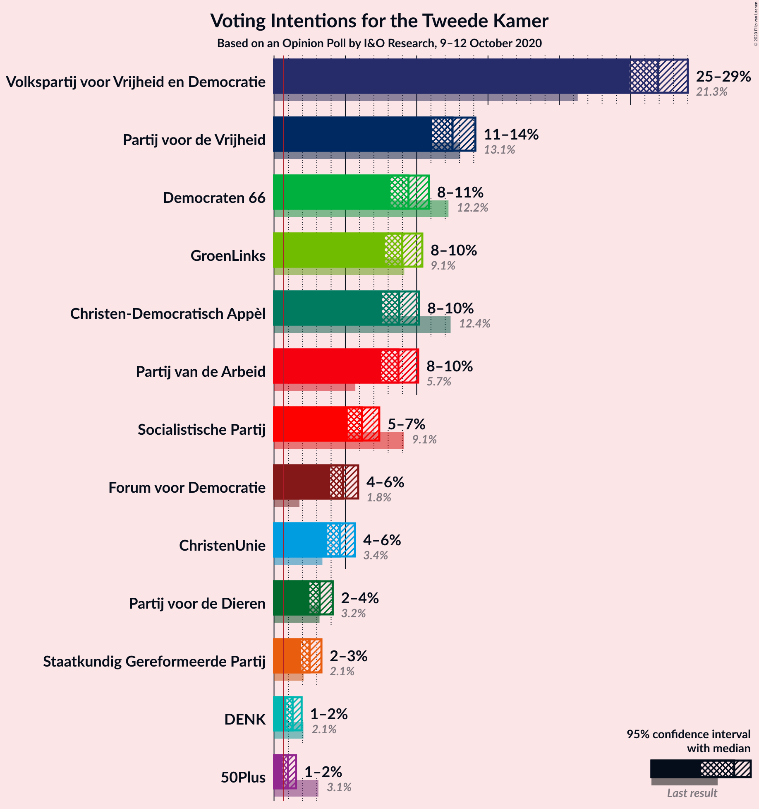

### Confidence Intervals

| Party | Last Result | Poll Result | 80% Confidence Interval | 90% Confidence Interval | 95% Confidence Interval | 99% Confidence Interval |
|:-----:|:-----------:|:-----------:|:-----------------------:|:-----------------------:|:-----------------------:|:-----------------------:|
| Volkspartij voor Vrijheid en Democratie | 21.3% | 26.9% | 25.6–28.3% |25.3–28.7% |24.9–29.0% |24.3–29.7% |
| Partij voor de Vrijheid | 13.1% | 12.5% | 11.6–13.6% |11.3–13.9% |11.1–14.1% |10.6–14.6% |
| Democraten 66 | 12.2% | 9.4% | 8.6–10.4% |8.4–10.6% |8.2–10.9% |7.8–11.3% |
| GroenLinks | 9.1% | 9.0% | 8.2–9.9% |8.0–10.2% |7.8–10.4% |7.4–10.8% |
| Christen-Democratisch Appèl | 12.4% | 8.8% | 8.0–9.7% |7.8–9.9% |7.6–10.2% |7.2–10.6% |
| Partij van de Arbeid | 5.7% | 8.7% | 7.9–9.6% |7.7–9.9% |7.5–10.1% |7.1–10.5% |
| Socialistische Partij | 9.1% | 6.2% | 5.5–7.0% |5.3–7.2% |5.2–7.4% |4.9–7.8% |
| Forum voor Democratie | 1.8% | 4.8% | 4.2–5.5% |4.1–5.7% |3.9–5.9% |3.7–6.3% |
| ChristenUnie | 3.4% | 4.6% | 4.0–5.3% |3.9–5.5% |3.7–5.7% |3.5–6.0% |
| Partij voor de Dieren | 3.2% | 3.2% | 2.7–3.8% |2.6–4.0% |2.5–4.1% |2.3–4.4% |
| Staatkundig Gereformeerde Partij | 2.1% | 2.5% | 2.1–3.0% |2.0–3.2% |1.9–3.3% |1.7–3.6% |
| DENK | 2.1% | 1.3% | 1.0–1.7% |0.9–1.8% |0.9–1.9% |0.7–2.1% |
| 50Plus | 3.1% | 1.0% | 0.7–1.3% |0.7–1.4% |0.6–1.5% |0.5–1.7% |

*Note:* The poll result column reflects the actual value used in the calculations. Published results may vary slightly, and in addition be rounded to fewer digits.

## Seats

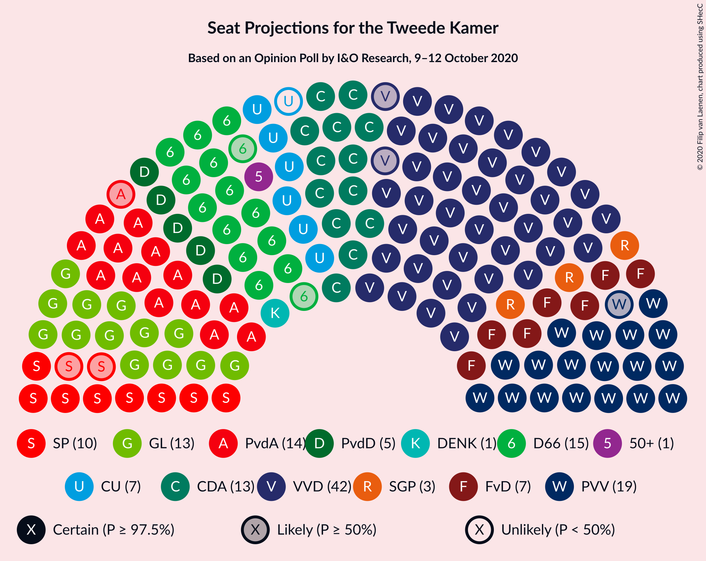

### Confidence Intervals

| Party | Last Result | Median | 80% Confidence Interval | 90% Confidence Interval | 95% Confidence Interval | 99% Confidence Interval |
|:-----:|:-----------:|:------:|:-----------------------:|:-----------------------:|:-----------------------:|:-----------------------:|
| <a href="#volkspartij-voor-vrijheid-en-democratie">Volkspartij voor Vrijheid en Democratie</a> | 33 | 42 | 42 |42 |40–44 |39–44 |
| <a href="#partij-voor-de-vrijheid">Partij voor de Vrijheid</a> | 20 | 19 | 19 |19 |18–19 |18–21 |
| <a href="#democraten-66">Democraten 66</a> | 19 | 15 | 15 |13–15 |13–15 |13–16 |
| <a href="#groenlinks">GroenLinks</a> | 14 | 13 | 13 |13 |13–14 |12–15 |
| <a href="#christen-democratisch-appèl">Christen-Democratisch Appèl</a> | 19 | 13 | 13 |13 |13–14 |11–14 |
| <a href="#partij-van-de-arbeid">Partij van de Arbeid</a> | 9 | 14 | 14 |13–14 |13–14 |12–14 |
| <a href="#socialistische-partij">Socialistische Partij</a> | 14 | 10 | 10 |8–10 |8–10 |8–11 |
| <a href="#forum-voor-democratie">Forum voor Democratie</a> | 2 | 7 | 7 |7–8 |7–9 |6–9 |
| <a href="#christenunie">ChristenUnie</a> | 5 | 6 | 6 |6–7 |6–7 |6–8 |
| <a href="#partij-voor-de-dieren">Partij voor de Dieren</a> | 5 | 5 | 5 |5 |5 |4–6 |
| <a href="#staatkundig-gereformeerde-partij">Staatkundig Gereformeerde Partij</a> | 3 | 3 | 3 |3 |3 |3–4 |
| <a href="#denk">DENK</a> | 3 | 1 | 1 |1 |1–2 |1–3 |
| <a href="#50plus">50Plus</a> | 4 | 1 | 1 |1 |1 |1–2 |

### Volkspartij voor Vrijheid en Democratie

*For a full overview of the results for this party, see the [Volkspartij voor Vrijheid en Democratie](party-volkspartijvoorvrijheidendemocratie.html) page.*

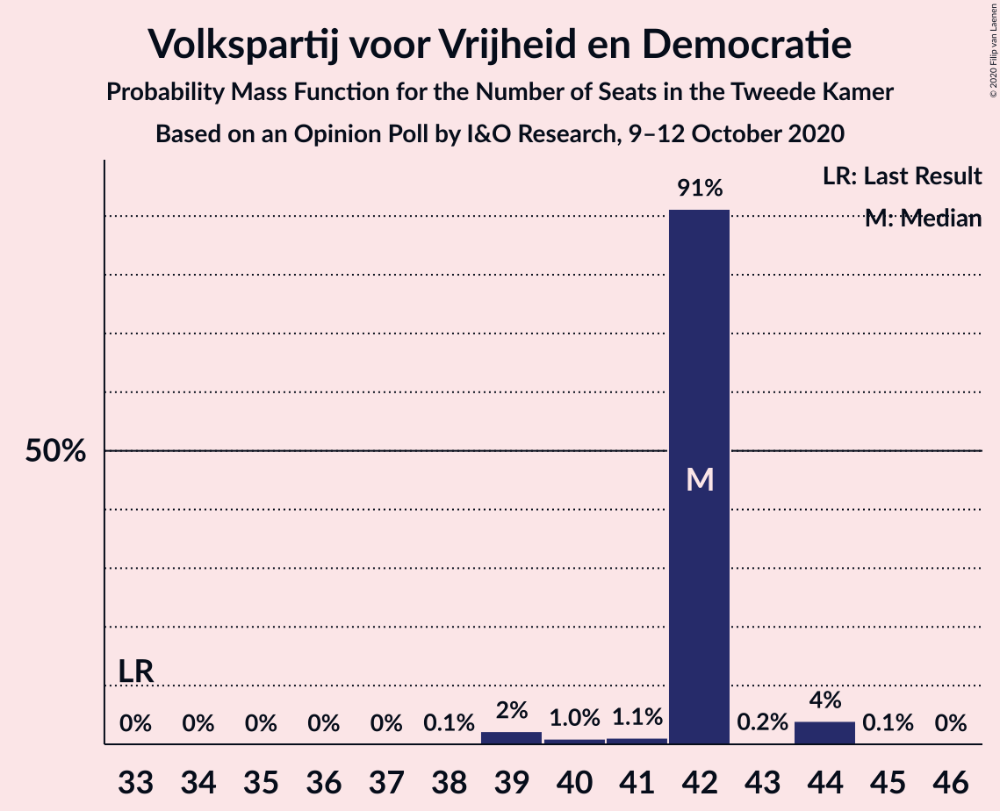

| Number of Seats | Probability | Accumulated | Special Marks |
|:---------------:|:-----------:|:-----------:|:-------------:|
| 33 | 0% | 100% | Last Result |
| 34 | 0% | 100% |  |
| 35 | 0% | 100% |  |
| 36 | 0% | 100% |  |
| 37 | 0% | 100% |  |
| 38 | 0.1% | 100% |  |
| 39 | 2% | 99.9% |  |
| 40 | 1.0% | 98% |  |
| 41 | 1.1% | 97% |  |
| 42 | 91% | 96% | Median |
| 43 | 0.2% | 4% |  |
| 44 | 4% | 4% |  |
| 45 | 0.1% | 0.2% |  |
| 46 | 0% | 0% |  |

### Partij voor de Vrijheid

*For a full overview of the results for this party, see the [Partij voor de Vrijheid](party-partijvoordevrijheid.html) page.*

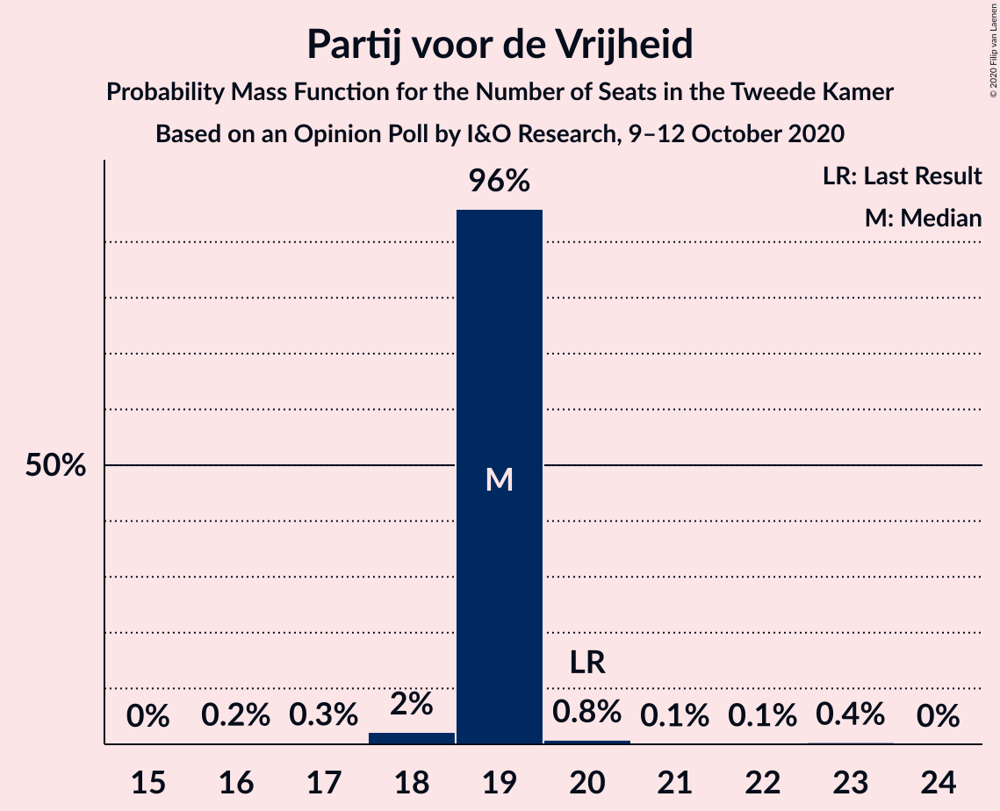

| Number of Seats | Probability | Accumulated | Special Marks |
|:---------------:|:-----------:|:-----------:|:-------------:|
| 16 | 0.2% | 100% |  |
| 17 | 0.3% | 99.8% |  |
| 18 | 2% | 99.5% |  |
| 19 | 96% | 97% | Median |
| 20 | 0.8% | 1.4% | Last Result |
| 21 | 0.1% | 0.6% |  |
| 22 | 0.1% | 0.5% |  |
| 23 | 0.4% | 0.4% |  |
| 24 | 0% | 0% |  |

### Democraten 66

*For a full overview of the results for this party, see the [Democraten 66](party-democraten66.html) page.*

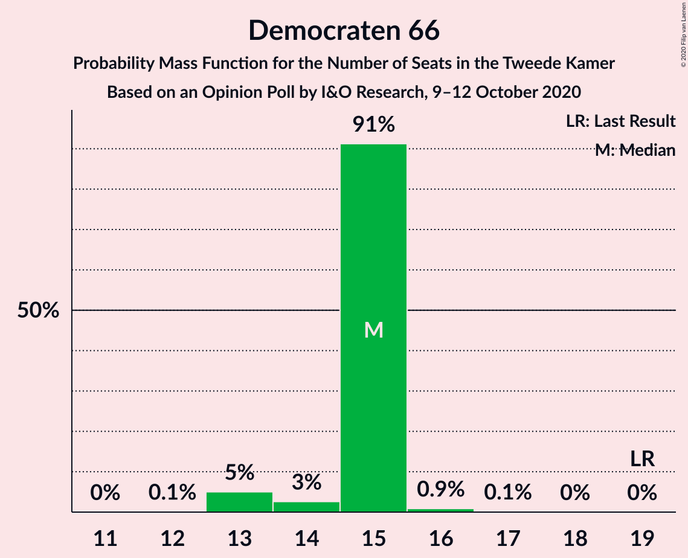

| Number of Seats | Probability | Accumulated | Special Marks |
|:---------------:|:-----------:|:-----------:|:-------------:|
| 12 | 0.1% | 100% |  |
| 13 | 5% | 99.9% |  |
| 14 | 3% | 95% |  |
| 15 | 91% | 92% | Median |
| 16 | 0.9% | 1.0% |  |
| 17 | 0.1% | 0.1% |  |
| 18 | 0% | 0% |  |
| 19 | 0% | 0% | Last Result |

### GroenLinks

*For a full overview of the results for this party, see the [GroenLinks](party-groenlinks.html) page.*

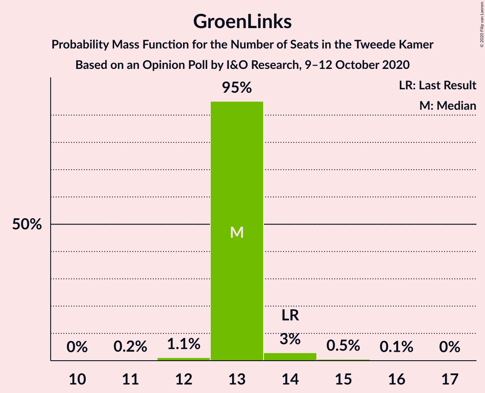

| Number of Seats | Probability | Accumulated | Special Marks |
|:---------------:|:-----------:|:-----------:|:-------------:|
| 11 | 0.2% | 100% |  |
| 12 | 1.1% | 99.8% |  |
| 13 | 95% | 98.6% | Median |
| 14 | 3% | 4% | Last Result |
| 15 | 0.5% | 0.6% |  |
| 16 | 0.1% | 0.1% |  |
| 17 | 0% | 0% |  |

### Christen-Democratisch Appèl

*For a full overview of the results for this party, see the [Christen-Democratisch Appèl](party-christen-democratischappèl.html) page.*

| Number of Seats | Probability | Accumulated | Special Marks |
|:---------------:|:-----------:|:-----------:|:-------------:|
| 11 | 1.1% | 100% |  |
| 12 | 1.0% | 98.8% |  |
| 13 | 95% | 98% | Median |
| 14 | 3% | 3% |  |
| 15 | 0.3% | 0.4% |  |
| 16 | 0% | 0% |  |
| 17 | 0% | 0% |  |
| 18 | 0% | 0% |  |
| 19 | 0% | 0% | Last Result |

### Partij van de Arbeid

*For a full overview of the results for this party, see the [Partij van de Arbeid](party-partijvandearbeid.html) page.*

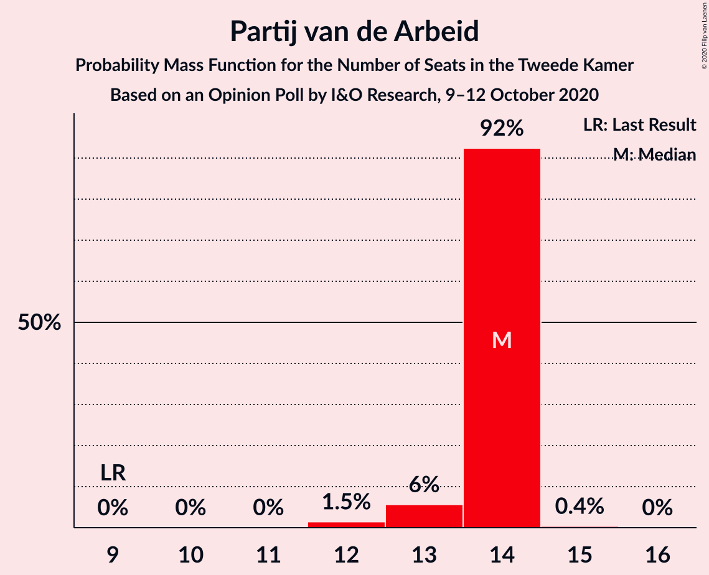

| Number of Seats | Probability | Accumulated | Special Marks |
|:---------------:|:-----------:|:-----------:|:-------------:|
| 9 | 0% | 100% | Last Result |
| 10 | 0% | 100% |  |
| 11 | 0% | 100% |  |
| 12 | 1.5% | 99.9% |  |
| 13 | 6% | 98% |  |
| 14 | 92% | 93% | Median |
| 15 | 0.4% | 0.4% |  |
| 16 | 0% | 0% |  |

### Socialistische Partij

*For a full overview of the results for this party, see the [Socialistische Partij](party-socialistischepartij.html) page.*

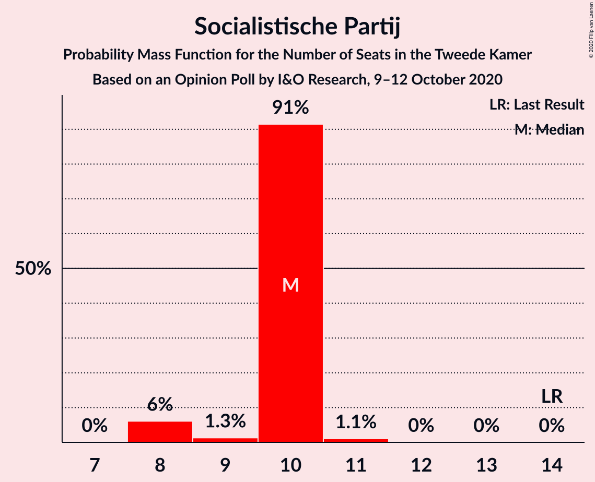

| Number of Seats | Probability | Accumulated | Special Marks |
|:---------------:|:-----------:|:-----------:|:-------------:|
| 8 | 6% | 100% |  |
| 9 | 1.3% | 94% |  |
| 10 | 91% | 93% | Median |
| 11 | 1.1% | 1.1% |  |
| 12 | 0% | 0% |  |
| 13 | 0% | 0% |  |
| 14 | 0% | 0% | Last Result |

### Forum voor Democratie

*For a full overview of the results for this party, see the [Forum voor Democratie](party-forumvoordemocratie.html) page.*

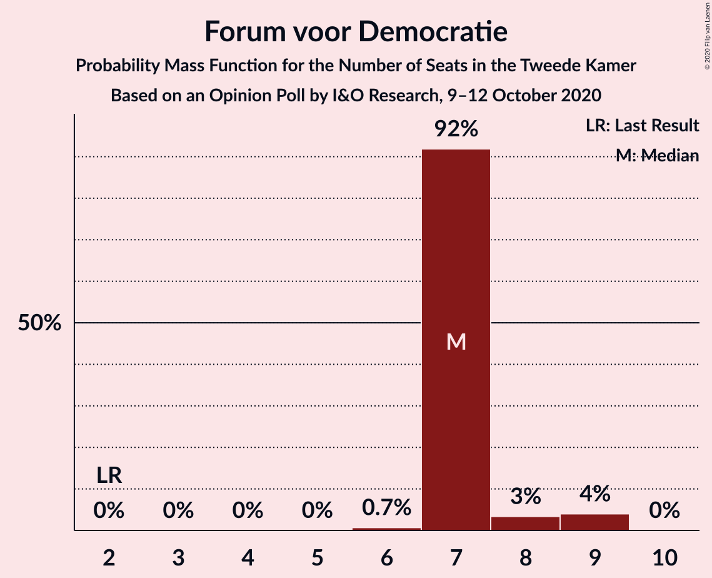

| Number of Seats | Probability | Accumulated | Special Marks |
|:---------------:|:-----------:|:-----------:|:-------------:|
| 2 | 0% | 100% | Last Result |
| 3 | 0% | 100% |  |
| 4 | 0% | 100% |  |
| 5 | 0% | 100% |  |
| 6 | 0.7% | 100% |  |
| 7 | 92% | 99.3% | Median |
| 8 | 3% | 7% |  |
| 9 | 4% | 4% |  |
| 10 | 0% | 0% |  |

### ChristenUnie

*For a full overview of the results for this party, see the [ChristenUnie](party-christenunie.html) page.*

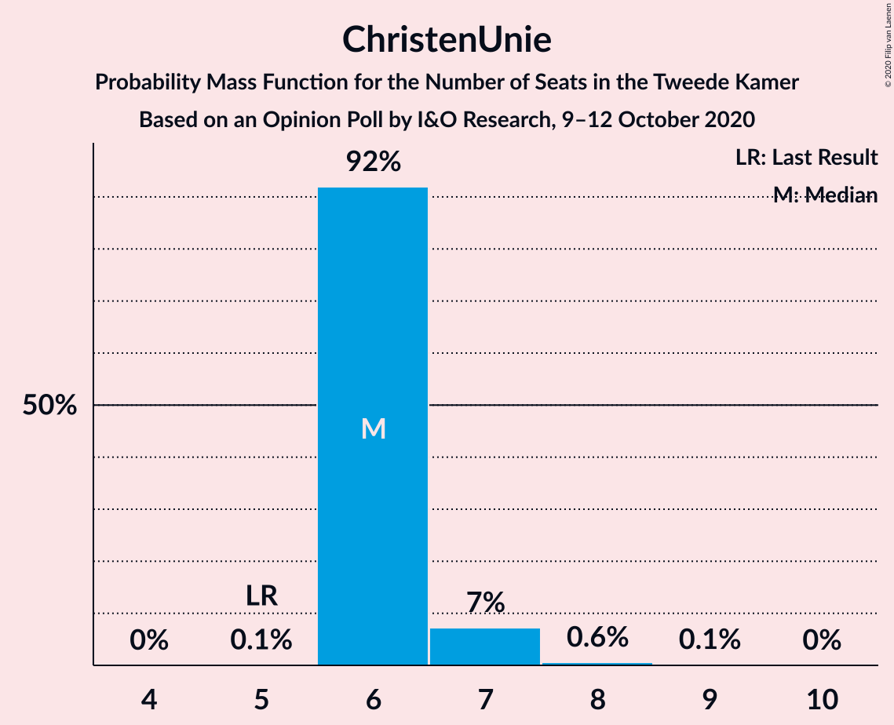

| Number of Seats | Probability | Accumulated | Special Marks |
|:---------------:|:-----------:|:-----------:|:-------------:|
| 5 | 0.1% | 100% | Last Result |
| 6 | 92% | 99.9% | Median |
| 7 | 7% | 8% |  |
| 8 | 0.6% | 0.7% |  |
| 9 | 0.1% | 0.1% |  |
| 10 | 0% | 0% |  |

### Partij voor de Dieren

*For a full overview of the results for this party, see the [Partij voor de Dieren](party-partijvoordedieren.html) page.*

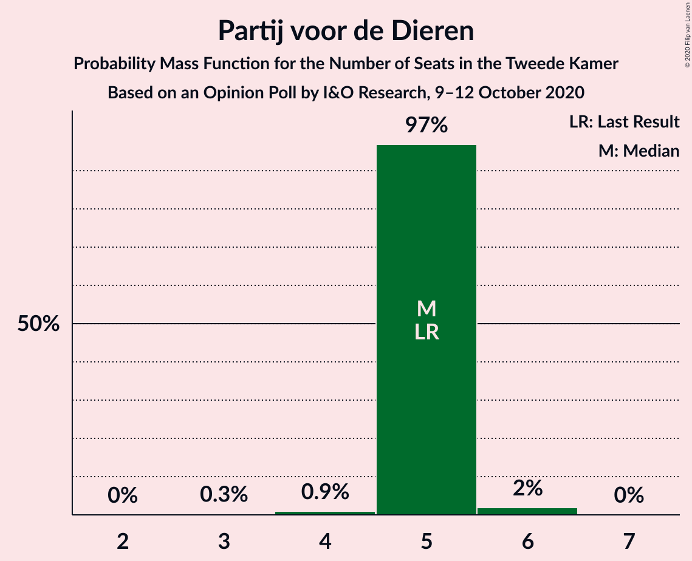

| Number of Seats | Probability | Accumulated | Special Marks |
|:---------------:|:-----------:|:-----------:|:-------------:|
| 3 | 0.3% | 100% |  |
| 4 | 0.9% | 99.7% |  |
| 5 | 97% | 98.8% | Last Result, Median |
| 6 | 2% | 2% |  |
| 7 | 0% | 0% |  |

### Staatkundig Gereformeerde Partij

*For a full overview of the results for this party, see the [Staatkundig Gereformeerde Partij](party-staatkundiggereformeerdepartij.html) page.*

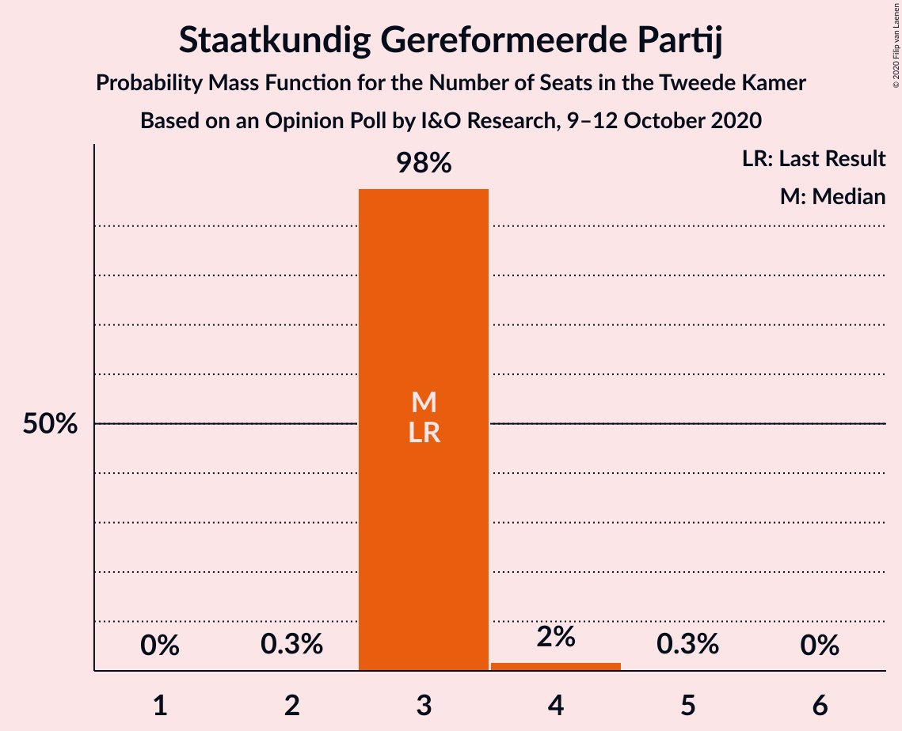

| Number of Seats | Probability | Accumulated | Special Marks |
|:---------------:|:-----------:|:-----------:|:-------------:|
| 2 | 0.3% | 100% |  |
| 3 | 98% | 99.7% | Last Result, Median |
| 4 | 2% | 2% |  |
| 5 | 0.3% | 0.3% |  |
| 6 | 0% | 0% |  |

### DENK

*For a full overview of the results for this party, see the [DENK](party-denk.html) page.*

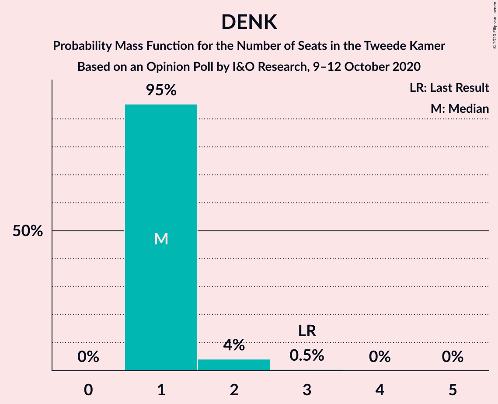

| Number of Seats | Probability | Accumulated | Special Marks |
|:---------------:|:-----------:|:-----------:|:-------------:|
| 1 | 95% | 100% | Median |
| 2 | 4% | 5% |  |
| 3 | 0.5% | 0.5% | Last Result |
| 4 | 0% | 0% |  |

### 50Plus

*For a full overview of the results for this party, see the [50Plus](party-50plus.html) page.*

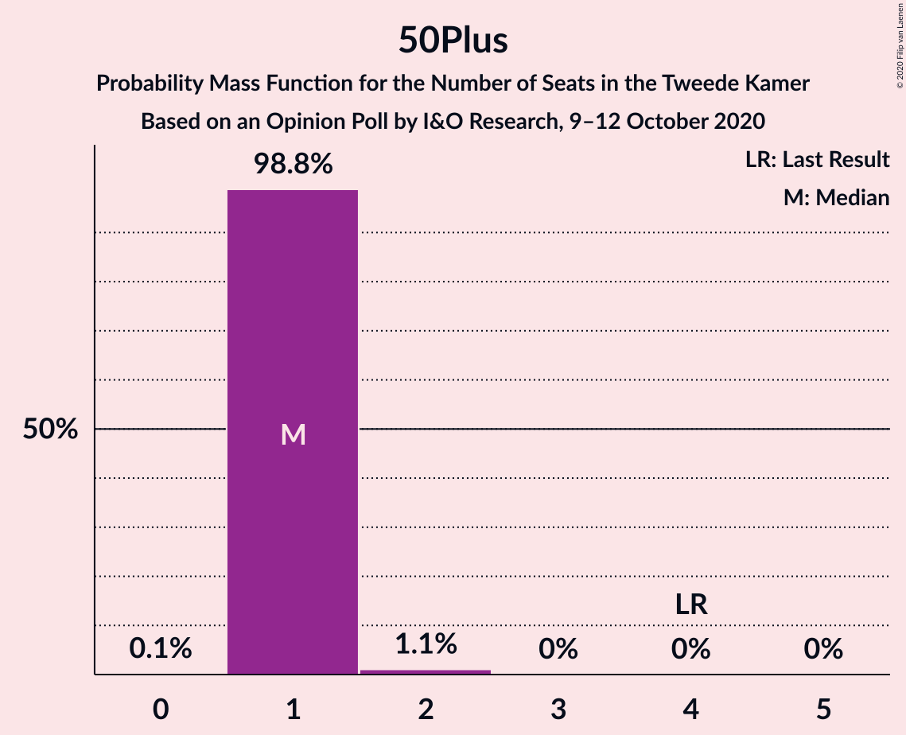

| Number of Seats | Probability | Accumulated | Special Marks |
|:---------------:|:-----------:|:-----------:|:-------------:|
| 0 | 0.1% | 100% |  |
| 1 | 98.8% | 99.9% | Median |
| 2 | 1.1% | 1.1% |  |
| 3 | 0% | 0% |  |
| 4 | 0% | 0% | Last Result |

## Coalitions

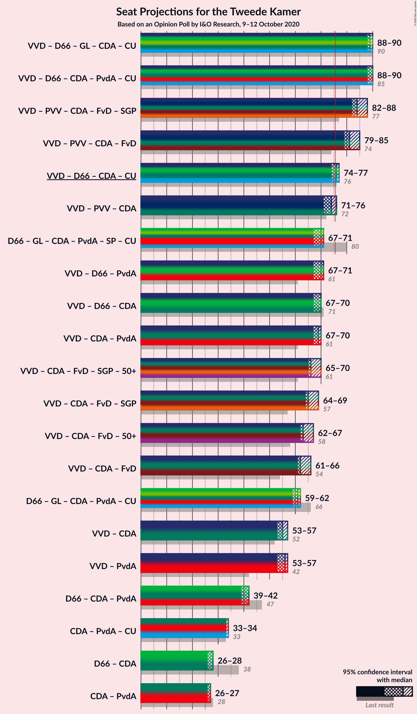

### Confidence Intervals

| Coalition | Last Result | Median | Majority? | 80% Confidence Interval | 90% Confidence Interval | 95% Confidence Interval | 99% Confidence Interval |
|:---------:|:-----------:|:------:|:---------:|:-----------------------:|:-----------------------:|:-----------------------:|:-----------------------:|
| Volkspartij voor Vrijheid en Democratie – Democraten 66 – GroenLinks – Christen-Democratisch Appèl – ChristenUnie | 90 | 89 | 100% | 89 | 89 | 88–90 | 85–91 |
| Volkspartij voor Vrijheid en Democratie – Democraten 66 – Christen-Democratisch Appèl – Partij van de Arbeid – ChristenUnie | 85 | 90 | 100% | 90 | 90 | 88–90 | 84–91 |
| Volkspartij voor Vrijheid en Democratie – Partij voor de Vrijheid – Christen-Democratisch Appèl – Forum voor Democratie – Staatkundig Gereformeerde Partij | 77 | 84 | 100% | 84 | 84–85 | 82–88 | 81–88 |
| Volkspartij voor Vrijheid en Democratie – Partij voor de Vrijheid – Christen-Democratisch Appèl – Forum voor Democratie | 74 | 81 | 100% | 81 | 81–82 | 79–85 | 78–85 |
| Volkspartij voor Vrijheid en Democratie – Democraten 66 – Christen-Democratisch Appèl – ChristenUnie | 76 | 76 | 96% | 76 | 76 | 74–77 | 72–78 |
| Volkspartij voor Vrijheid en Democratie – Partij voor de Vrijheid – Christen-Democratisch Appèl | 72 | 74 | 4% | 74 | 74 | 71–76 | 71–76 |
| Democraten 66 – GroenLinks – Christen-Democratisch Appèl – Partij van de Arbeid – Socialistische Partij – ChristenUnie | 80 | 71 | 0% | 71 | 69–71 | 67–71 | 67–73 |
| Volkspartij voor Vrijheid en Democratie – Democraten 66 – Partij van de Arbeid | 61 | 71 | 0% | 71 | 70–71 | 67–71 | 65–71 |
| Volkspartij voor Vrijheid en Democratie – Democraten 66 – Christen-Democratisch Appèl | 71 | 70 | 0% | 70 | 70 | 67–70 | 65–71 |
| Volkspartij voor Vrijheid en Democratie – Christen-Democratisch Appèl – Partij van de Arbeid | 61 | 69 | 0% | 69 | 69 | 67–70 | 64–70 |
| Volkspartij voor Vrijheid en Democratie – Christen-Democratisch Appèl – Forum voor Democratie – Staatkundig Gereformeerde Partij – 50Plus | 61 | 66 | 0% | 66 | 66 | 65–70 | 64–70 |
| Volkspartij voor Vrijheid en Democratie – Christen-Democratisch Appèl – Forum voor Democratie – Staatkundig Gereformeerde Partij | 57 | 65 | 0% | 65 | 65 | 64–69 | 62–69 |
| Volkspartij voor Vrijheid en Democratie – Christen-Democratisch Appèl – Forum voor Democratie – 50Plus | 58 | 63 | 0% | 63 | 63 | 62–67 | 60–67 |
| Volkspartij voor Vrijheid en Democratie – Christen-Democratisch Appèl – Forum voor Democratie | 54 | 62 | 0% | 62 | 62 | 61–66 | 59–66 |
| Democraten 66 – GroenLinks – Christen-Democratisch Appèl – Partij van de Arbeid – ChristenUnie | 66 | 61 | 0% | 61 | 59–61 | 59–62 | 57–63 |
| Volkspartij voor Vrijheid en Democratie – Christen-Democratisch Appèl | 52 | 55 | 0% | 55 | 55 | 53–57 | 51–57 |
| Volkspartij voor Vrijheid en Democratie – Partij van de Arbeid | 42 | 56 | 0% | 56 | 56 | 53–57 | 51–57 |
| Democraten 66 – Christen-Democratisch Appèl – Partij van de Arbeid | 47 | 42 | 0% | 42 | 39–42 | 39–42 | 37–42 |
| Christen-Democratisch Appèl – Partij van de Arbeid – ChristenUnie | 33 | 33 | 0% | 33 | 33 | 33–34 | 30–35 |
| Democraten 66 – Christen-Democratisch Appèl | 38 | 28 | 0% | 28 | 26–28 | 26–28 | 25–29 |
| Christen-Democratisch Appèl – Partij van de Arbeid | 28 | 27 | 0% | 27 | 26–27 | 26–27 | 24–28 |

### Volkspartij voor Vrijheid en Democratie – Democraten 66 – GroenLinks – Christen-Democratisch Appèl – ChristenUnie

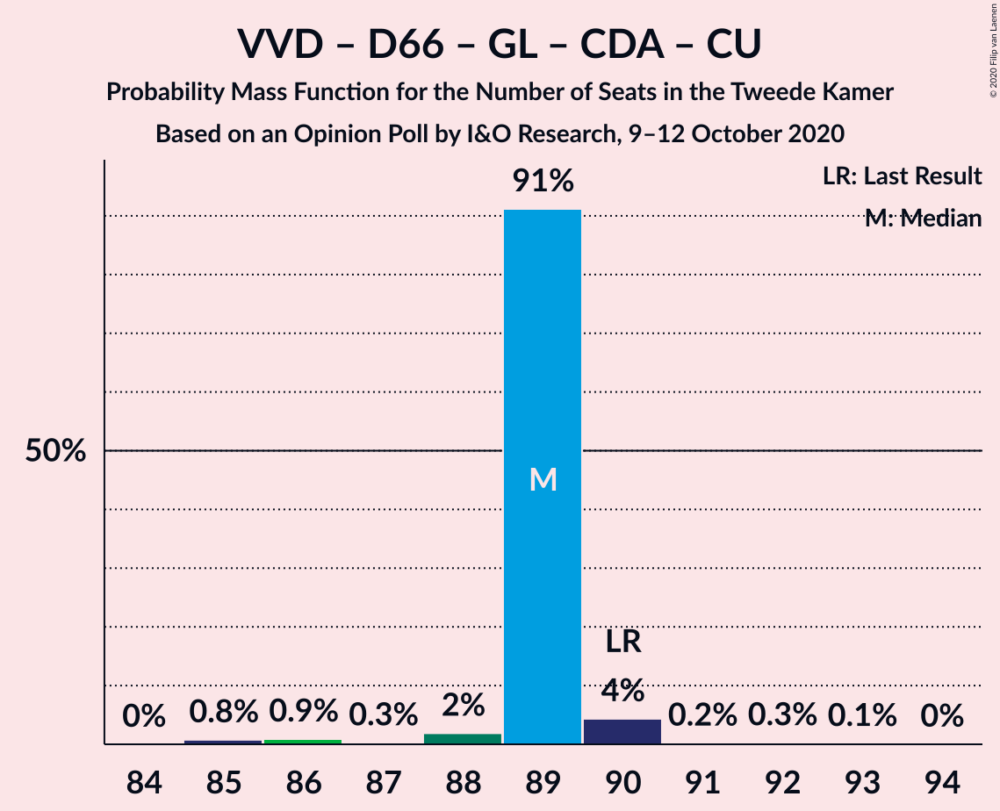

| Number of Seats | Probability | Accumulated | Special Marks |
|:---------------:|:-----------:|:-----------:|:-------------:|
| 85 | 0.8% | 100% |  |
| 86 | 0.9% | 99.2% |  |
| 87 | 0.3% | 98% |  |
| 88 | 2% | 98% |  |
| 89 | 91% | 96% | Median |
| 90 | 4% | 5% | Last Result |
| 91 | 0.2% | 0.6% |  |
| 92 | 0.3% | 0.4% |  |
| 93 | 0.1% | 0.2% |  |
| 94 | 0% | 0% |  |

### Volkspartij voor Vrijheid en Democratie – Democraten 66 – Christen-Democratisch Appèl – Partij van de Arbeid – ChristenUnie

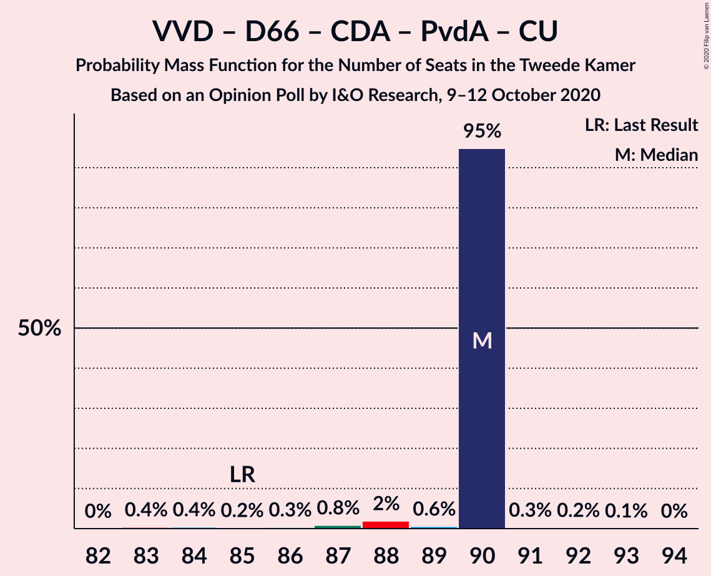

| Number of Seats | Probability | Accumulated | Special Marks |
|:---------------:|:-----------:|:-----------:|:-------------:|
| 83 | 0.4% | 100% |  |
| 84 | 0.4% | 99.6% |  |
| 85 | 0.2% | 99.2% | Last Result |
| 86 | 0.3% | 99.1% |  |
| 87 | 0.8% | 98.7% |  |
| 88 | 2% | 98% |  |
| 89 | 0.6% | 96% |  |
| 90 | 95% | 95% | Median |
| 91 | 0.3% | 0.6% |  |
| 92 | 0.2% | 0.3% |  |
| 93 | 0.1% | 0.1% |  |
| 94 | 0% | 0% |  |

### Volkspartij voor Vrijheid en Democratie – Partij voor de Vrijheid – Christen-Democratisch Appèl – Forum voor Democratie – Staatkundig Gereformeerde Partij

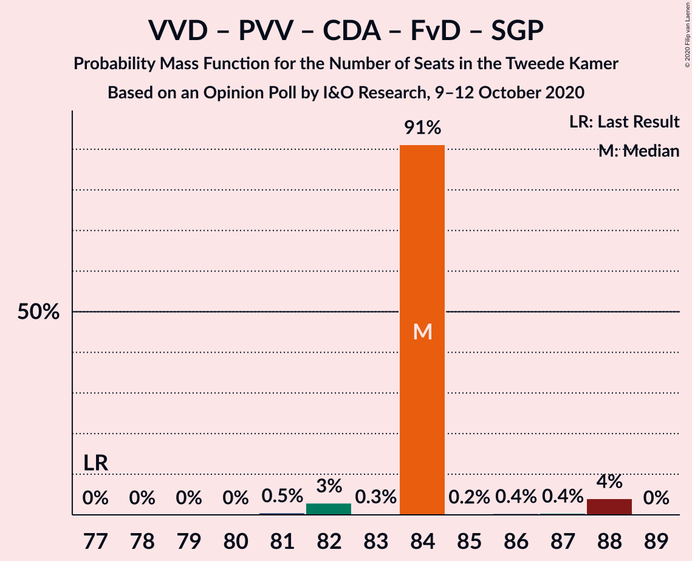

| Number of Seats | Probability | Accumulated | Special Marks |
|:---------------:|:-----------:|:-----------:|:-------------:|
| 77 | 0% | 100% | Last Result |
| 78 | 0% | 100% |  |
| 79 | 0% | 100% |  |
| 80 | 0% | 100% |  |
| 81 | 0.5% | 99.9% |  |
| 82 | 3% | 99.4% |  |
| 83 | 0.3% | 96% |  |
| 84 | 91% | 96% | Median |
| 85 | 0.2% | 5% |  |
| 86 | 0.4% | 5% |  |
| 87 | 0.4% | 5% |  |
| 88 | 4% | 4% |  |
| 89 | 0% | 0% |  |

### Volkspartij voor Vrijheid en Democratie – Partij voor de Vrijheid – Christen-Democratisch Appèl – Forum voor Democratie

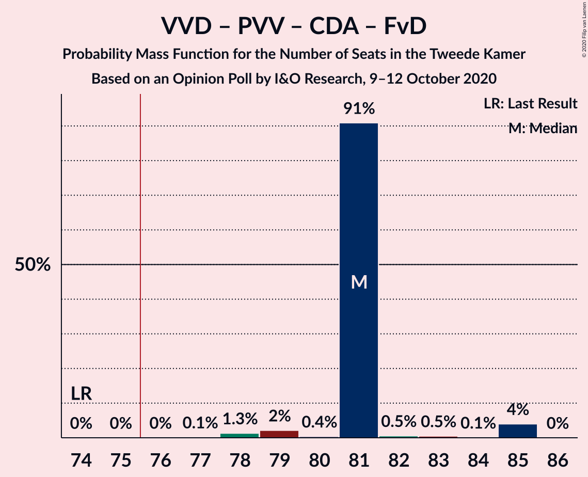

| Number of Seats | Probability | Accumulated | Special Marks |
|:---------------:|:-----------:|:-----------:|:-------------:|
| 74 | 0% | 100% | Last Result |
| 75 | 0% | 100% |  |
| 76 | 0% | 100% | Majority |
| 77 | 0.1% | 100% |  |
| 78 | 1.3% | 99.8% |  |
| 79 | 2% | 98.5% |  |
| 80 | 0.4% | 96% |  |
| 81 | 91% | 96% | Median |
| 82 | 0.5% | 5% |  |
| 83 | 0.5% | 5% |  |
| 84 | 0.1% | 4% |  |
| 85 | 4% | 4% |  |
| 86 | 0% | 0% |  |

### Volkspartij voor Vrijheid en Democratie – Democraten 66 – Christen-Democratisch Appèl – ChristenUnie

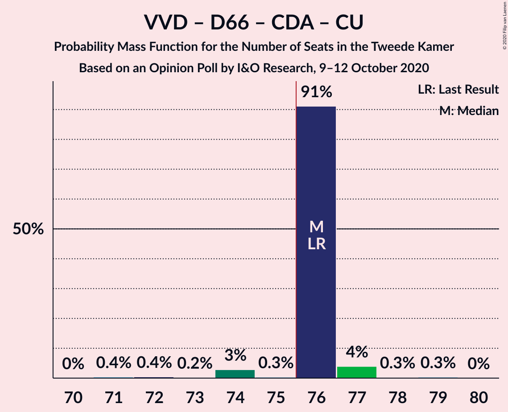

| Number of Seats | Probability | Accumulated | Special Marks |
|:---------------:|:-----------:|:-----------:|:-------------:|
| 71 | 0.4% | 100% |  |
| 72 | 0.4% | 99.6% |  |
| 73 | 0.2% | 99.2% |  |
| 74 | 3% | 99.0% |  |
| 75 | 0.3% | 96% |  |
| 76 | 91% | 96% | Last Result, Median, Majority |
| 77 | 4% | 5% |  |
| 78 | 0.3% | 0.7% |  |
| 79 | 0.3% | 0.4% |  |
| 80 | 0% | 0% |  |

### Volkspartij voor Vrijheid en Democratie – Partij voor de Vrijheid – Christen-Democratisch Appèl

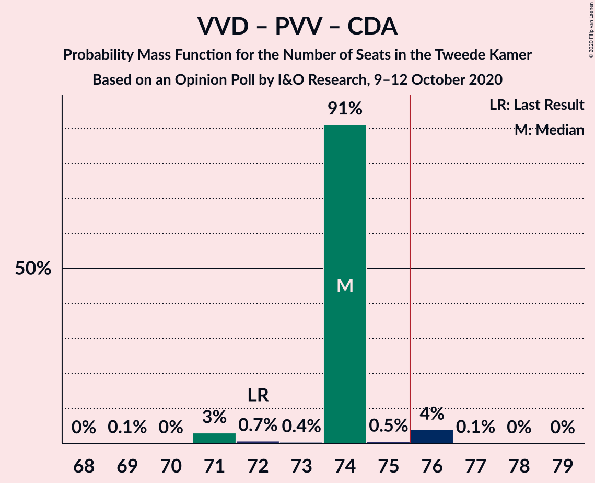

| Number of Seats | Probability | Accumulated | Special Marks |
|:---------------:|:-----------:|:-----------:|:-------------:|
| 69 | 0.1% | 100% |  |
| 70 | 0% | 99.9% |  |
| 71 | 3% | 99.9% |  |
| 72 | 0.7% | 97% | Last Result |
| 73 | 0.4% | 96% |  |
| 74 | 91% | 96% | Median |
| 75 | 0.5% | 5% |  |
| 76 | 4% | 4% | Majority |
| 77 | 0.1% | 0.2% |  |
| 78 | 0% | 0.1% |  |
| 79 | 0% | 0% |  |

### Democraten 66 – GroenLinks – Christen-Democratisch Appèl – Partij van de Arbeid – Socialistische Partij – ChristenUnie

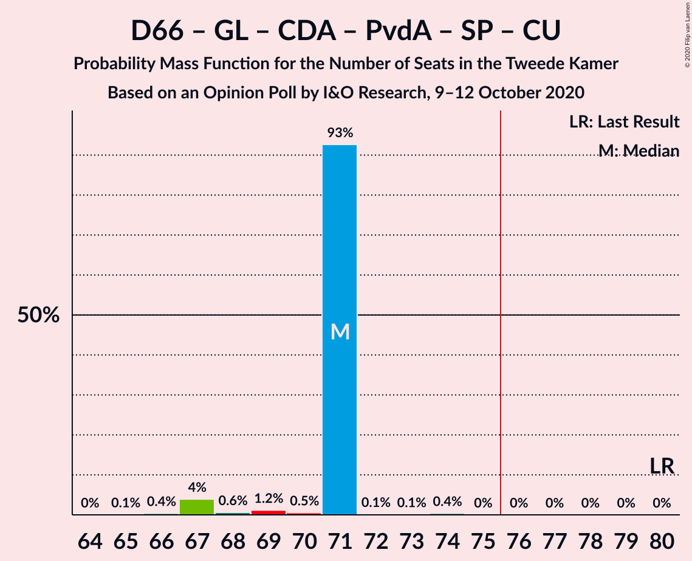

| Number of Seats | Probability | Accumulated | Special Marks |
|:---------------:|:-----------:|:-----------:|:-------------:|
| 65 | 0.1% | 100% |  |
| 66 | 0.4% | 99.9% |  |
| 67 | 4% | 99.5% |  |
| 68 | 0.6% | 96% |  |
| 69 | 1.2% | 95% |  |
| 70 | 0.5% | 94% |  |
| 71 | 93% | 93% | Median |
| 72 | 0.1% | 0.7% |  |
| 73 | 0.1% | 0.5% |  |
| 74 | 0.4% | 0.4% |  |
| 75 | 0% | 0% |  |
| 76 | 0% | 0% | Majority |
| 77 | 0% | 0% |  |
| 78 | 0% | 0% |  |
| 79 | 0% | 0% |  |
| 80 | 0% | 0% | Last Result |

### Volkspartij voor Vrijheid en Democratie – Democraten 66 – Partij van de Arbeid

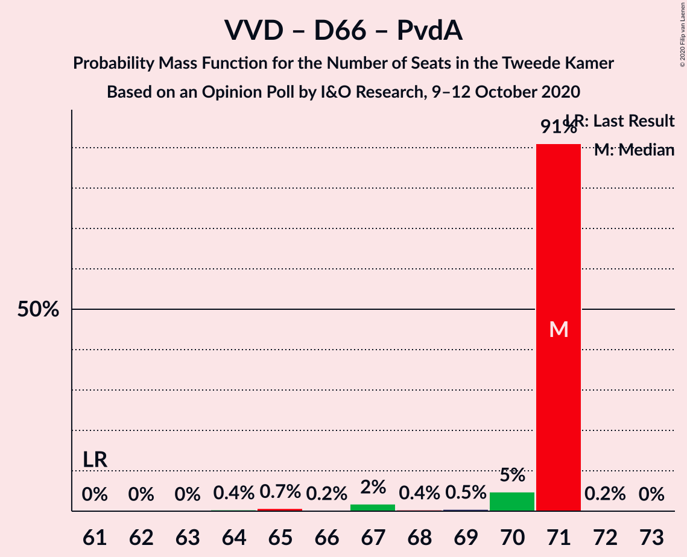

| Number of Seats | Probability | Accumulated | Special Marks |
|:---------------:|:-----------:|:-----------:|:-------------:|
| 61 | 0% | 100% | Last Result |
| 62 | 0% | 100% |  |
| 63 | 0% | 100% |  |
| 64 | 0.4% | 100% |  |
| 65 | 0.7% | 99.6% |  |
| 66 | 0.2% | 98.9% |  |
| 67 | 2% | 98.7% |  |
| 68 | 0.4% | 97% |  |
| 69 | 0.5% | 97% |  |
| 70 | 5% | 96% |  |
| 71 | 91% | 91% | Median |
| 72 | 0.2% | 0.2% |  |
| 73 | 0% | 0% |  |

### Volkspartij voor Vrijheid en Democratie – Democraten 66 – Christen-Democratisch Appèl

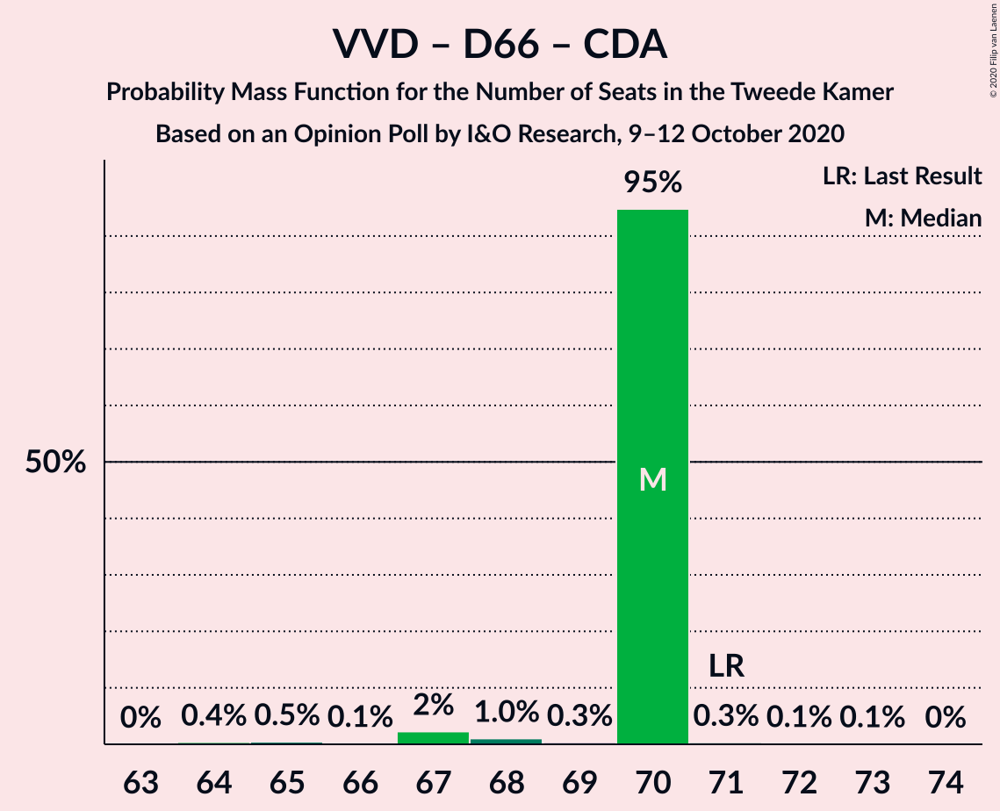

| Number of Seats | Probability | Accumulated | Special Marks |
|:---------------:|:-----------:|:-----------:|:-------------:|
| 64 | 0.4% | 100% |  |
| 65 | 0.5% | 99.6% |  |
| 66 | 0.1% | 99.1% |  |
| 67 | 2% | 99.0% |  |
| 68 | 1.0% | 97% |  |
| 69 | 0.3% | 96% |  |
| 70 | 95% | 95% | Median |
| 71 | 0.3% | 0.6% | Last Result |
| 72 | 0.1% | 0.2% |  |
| 73 | 0.1% | 0.1% |  |
| 74 | 0% | 0% |  |

### Volkspartij voor Vrijheid en Democratie – Christen-Democratisch Appèl – Partij van de Arbeid

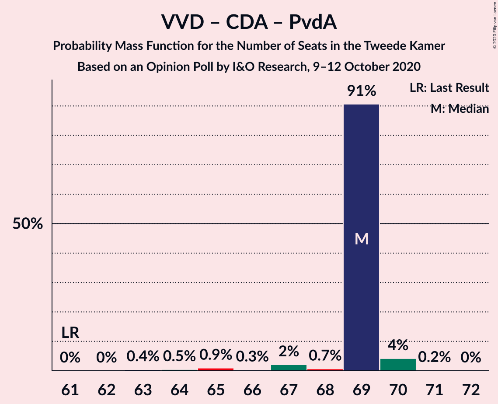

| Number of Seats | Probability | Accumulated | Special Marks |
|:---------------:|:-----------:|:-----------:|:-------------:|
| 61 | 0% | 100% | Last Result |
| 62 | 0% | 100% |  |
| 63 | 0.4% | 100% |  |
| 64 | 0.5% | 99.6% |  |
| 65 | 0.9% | 99.1% |  |
| 66 | 0.3% | 98% |  |
| 67 | 2% | 98% |  |
| 68 | 0.7% | 96% |  |
| 69 | 91% | 95% | Median |
| 70 | 4% | 4% |  |
| 71 | 0.2% | 0.2% |  |
| 72 | 0% | 0% |  |

### Volkspartij voor Vrijheid en Democratie – Christen-Democratisch Appèl – Forum voor Democratie – Staatkundig Gereformeerde Partij – 50Plus

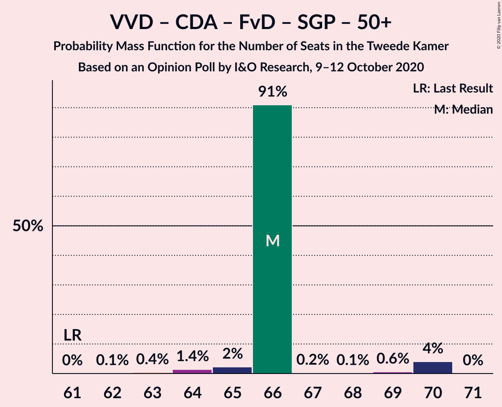

| Number of Seats | Probability | Accumulated | Special Marks |
|:---------------:|:-----------:|:-----------:|:-------------:|
| 61 | 0% | 100% | Last Result |
| 62 | 0.1% | 100% |  |
| 63 | 0.4% | 99.9% |  |
| 64 | 1.4% | 99.6% |  |
| 65 | 2% | 98% |  |
| 66 | 91% | 96% | Median |
| 67 | 0.2% | 5% |  |
| 68 | 0.1% | 5% |  |
| 69 | 0.6% | 5% |  |
| 70 | 4% | 4% |  |
| 71 | 0% | 0% |  |

### Volkspartij voor Vrijheid en Democratie – Christen-Democratisch Appèl – Forum voor Democratie – Staatkundig Gereformeerde Partij

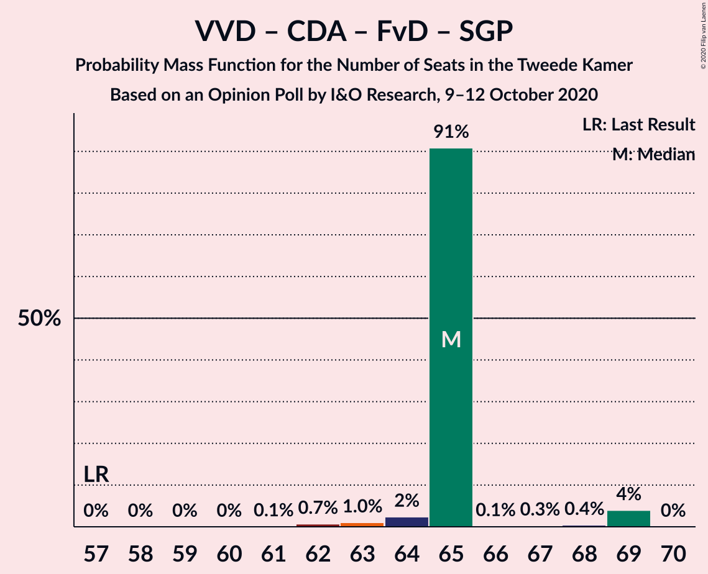

| Number of Seats | Probability | Accumulated | Special Marks |
|:---------------:|:-----------:|:-----------:|:-------------:|
| 57 | 0% | 100% | Last Result |
| 58 | 0% | 100% |  |
| 59 | 0% | 100% |  |
| 60 | 0% | 100% |  |
| 61 | 0.1% | 100% |  |
| 62 | 0.7% | 99.9% |  |
| 63 | 1.0% | 99.2% |  |
| 64 | 2% | 98% |  |
| 65 | 91% | 96% | Median |
| 66 | 0.1% | 5% |  |
| 67 | 0.3% | 5% |  |
| 68 | 0.4% | 4% |  |
| 69 | 4% | 4% |  |
| 70 | 0% | 0% |  |

### Volkspartij voor Vrijheid en Democratie – Christen-Democratisch Appèl – Forum voor Democratie – 50Plus

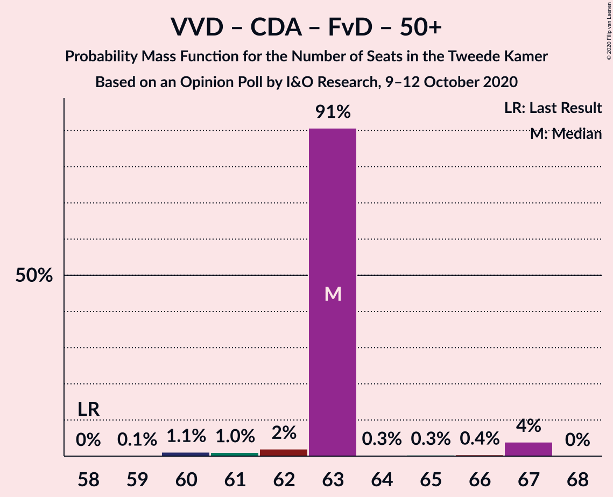

| Number of Seats | Probability | Accumulated | Special Marks |
|:---------------:|:-----------:|:-----------:|:-------------:|
| 58 | 0% | 100% | Last Result |
| 59 | 0.1% | 100% |  |
| 60 | 1.1% | 99.9% |  |
| 61 | 1.0% | 98.7% |  |
| 62 | 2% | 98% |  |
| 63 | 91% | 96% | Median |
| 64 | 0.3% | 5% |  |
| 65 | 0.3% | 5% |  |
| 66 | 0.4% | 4% |  |
| 67 | 4% | 4% |  |
| 68 | 0% | 0% |  |

### Volkspartij voor Vrijheid en Democratie – Christen-Democratisch Appèl – Forum voor Democratie

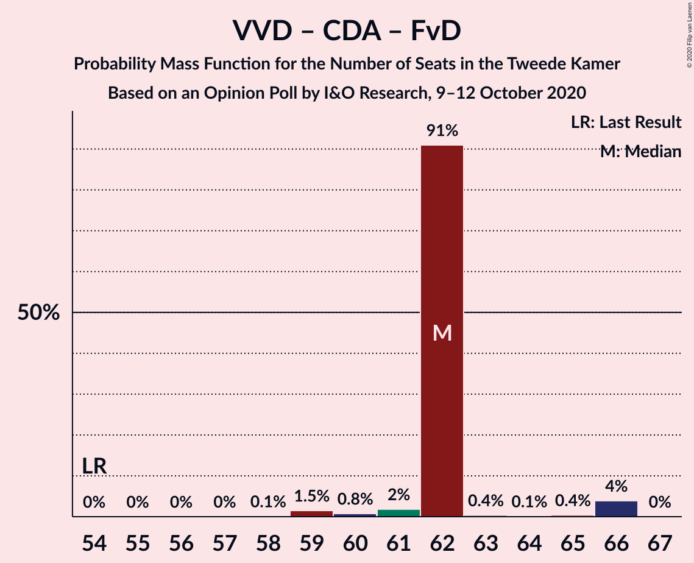

| Number of Seats | Probability | Accumulated | Special Marks |
|:---------------:|:-----------:|:-----------:|:-------------:|
| 54 | 0% | 100% | Last Result |
| 55 | 0% | 100% |  |
| 56 | 0% | 100% |  |
| 57 | 0% | 100% |  |
| 58 | 0.1% | 100% |  |
| 59 | 1.5% | 99.9% |  |
| 60 | 0.8% | 98% |  |
| 61 | 2% | 98% |  |
| 62 | 91% | 96% | Median |
| 63 | 0.4% | 5% |  |
| 64 | 0.1% | 4% |  |
| 65 | 0.4% | 4% |  |
| 66 | 4% | 4% |  |
| 67 | 0% | 0% |  |

### Democraten 66 – GroenLinks – Christen-Democratisch Appèl – Partij van de Arbeid – ChristenUnie

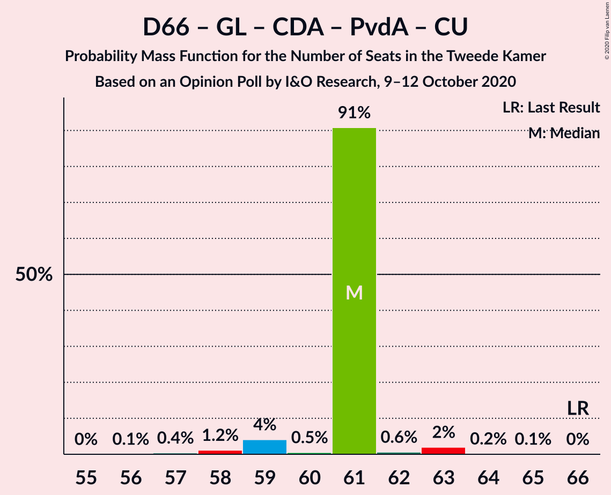

| Number of Seats | Probability | Accumulated | Special Marks |
|:---------------:|:-----------:|:-----------:|:-------------:|
| 56 | 0.1% | 100% |  |
| 57 | 0.4% | 99.9% |  |
| 58 | 1.2% | 99.5% |  |
| 59 | 4% | 98% |  |
| 60 | 0.5% | 94% |  |
| 61 | 91% | 94% | Median |
| 62 | 0.6% | 3% |  |
| 63 | 2% | 2% |  |
| 64 | 0.2% | 0.3% |  |
| 65 | 0.1% | 0.1% |  |
| 66 | 0% | 0% | Last Result |

### Volkspartij voor Vrijheid en Democratie – Christen-Democratisch Appèl

| Number of Seats | Probability | Accumulated | Special Marks |
|:---------------:|:-----------:|:-----------:|:-------------:|
| 51 | 0.5% | 100% |  |
| 52 | 1.2% | 99.5% | Last Result |
| 53 | 2% | 98% |  |
| 54 | 0.7% | 96% |  |
| 55 | 91% | 95% | Median |
| 56 | 0.1% | 5% |  |
| 57 | 4% | 4% |  |
| 58 | 0.1% | 0.2% |  |
| 59 | 0% | 0% |  |

### Volkspartij voor Vrijheid en Democratie – Partij van de Arbeid

| Number of Seats | Probability | Accumulated | Special Marks |
|:---------------:|:-----------:|:-----------:|:-------------:|
| 42 | 0% | 100% | Last Result |
| 43 | 0% | 100% |  |
| 44 | 0% | 100% |  |
| 45 | 0% | 100% |  |
| 46 | 0% | 100% |  |
| 47 | 0% | 100% |  |
| 48 | 0% | 100% |  |
| 49 | 0% | 100% |  |
| 50 | 0.1% | 100% |  |
| 51 | 0.5% | 99.9% |  |
| 52 | 0.8% | 99.4% |  |
| 53 | 2% | 98.7% |  |
| 54 | 1.3% | 97% |  |
| 55 | 0.2% | 95% |  |
| 56 | 91% | 95% | Median |
| 57 | 4% | 4% |  |
| 58 | 0.1% | 0.2% |  |
| 59 | 0% | 0% |  |

### Democraten 66 – Christen-Democratisch Appèl – Partij van de Arbeid

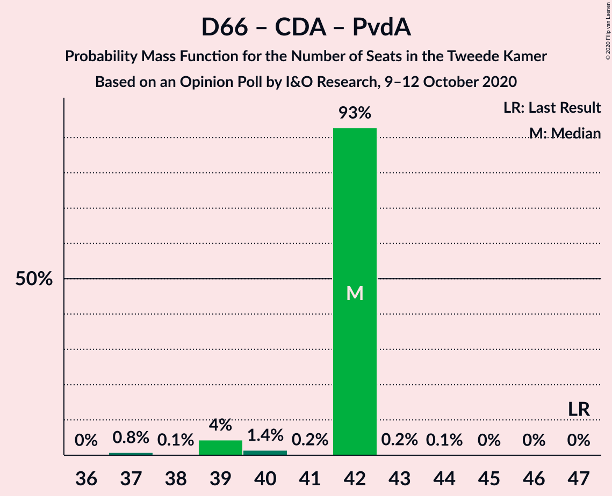

| Number of Seats | Probability | Accumulated | Special Marks |
|:---------------:|:-----------:|:-----------:|:-------------:|
| 37 | 0.8% | 100% |  |
| 38 | 0.1% | 99.2% |  |
| 39 | 4% | 99.1% |  |
| 40 | 1.4% | 95% |  |
| 41 | 0.2% | 93% |  |
| 42 | 93% | 93% | Median |
| 43 | 0.2% | 0.3% |  |
| 44 | 0.1% | 0.1% |  |
| 45 | 0% | 0% |  |
| 46 | 0% | 0% |  |
| 47 | 0% | 0% | Last Result |

### Christen-Democratisch Appèl – Partij van de Arbeid – ChristenUnie

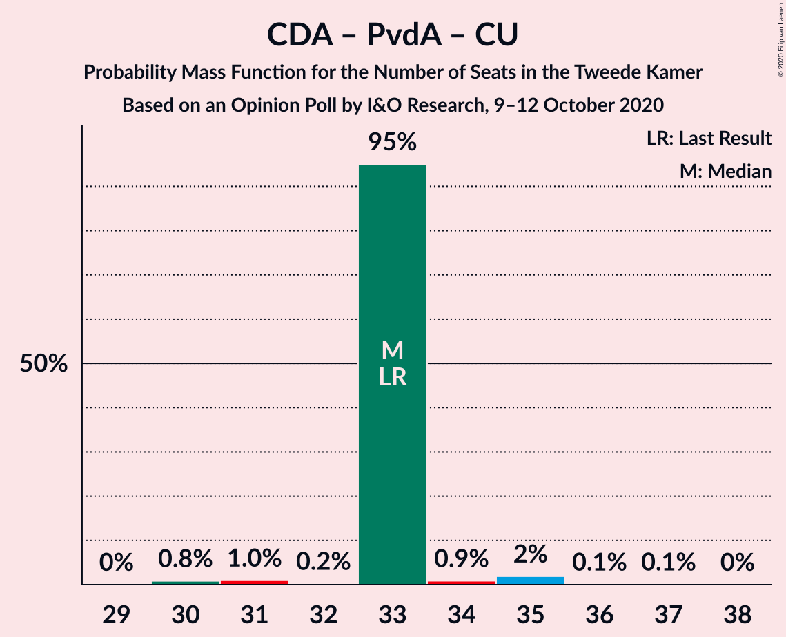

| Number of Seats | Probability | Accumulated | Special Marks |
|:---------------:|:-----------:|:-----------:|:-------------:|
| 30 | 0.8% | 100% |  |
| 31 | 1.0% | 99.1% |  |
| 32 | 0.2% | 98% |  |
| 33 | 95% | 98% | Last Result, Median |
| 34 | 0.9% | 3% |  |
| 35 | 2% | 2% |  |
| 36 | 0.1% | 0.1% |  |
| 37 | 0.1% | 0.1% |  |
| 38 | 0% | 0% |  |

### Democraten 66 – Christen-Democratisch Appèl

| Number of Seats | Probability | Accumulated | Special Marks |
|:---------------:|:-----------:|:-----------:|:-------------:|
| 24 | 0.1% | 100% |  |
| 25 | 1.1% | 99.9% |  |
| 26 | 4% | 98.8% |  |
| 27 | 1.4% | 95% |  |
| 28 | 92% | 93% | Median |
| 29 | 0.7% | 0.9% |  |
| 30 | 0.2% | 0.3% |  |
| 31 | 0.1% | 0.1% |  |
| 32 | 0% | 0% |  |
| 33 | 0% | 0% |  |
| 34 | 0% | 0% |  |
| 35 | 0% | 0% |  |
| 36 | 0% | 0% |  |
| 37 | 0% | 0% |  |
| 38 | 0% | 0% | Last Result |

### Christen-Democratisch Appèl – Partij van de Arbeid

| Number of Seats | Probability | Accumulated | Special Marks |
|:---------------:|:-----------:|:-----------:|:-------------:|
| 23 | 0.1% | 100% |  |
| 24 | 2% | 99.9% |  |
| 25 | 0.4% | 98% |  |
| 26 | 5% | 98% |  |
| 27 | 91% | 93% | Median |
| 28 | 2% | 2% | Last Result |
| 29 | 0.1% | 0.2% |  |
| 30 | 0% | 0% |  |

## Technical Information

### Opinion Poll

+ **Polling firm:** I&O Research
+ **Commissioner(s):** —
+ **Fieldwork period:** 9–12 October 2020

### Calculations

+ **Sample size:** 1846
+ **Simulations done:** 1,048,576
+ **Error estimate:** 1.11%

