# Opinion Poll by Peil.nl, 16–17 October 2020

<a href="#voting-intentions">Voting Intentions</a> | <a href="#seats">Seats</a> | <a href="#coalitions">Coalitions</a> | <a href="#technical-information">Technical Information</a>

## Voting Intentions

### Confidence Intervals

| Party | Last Result | Poll Result | 80% Confidence Interval | 90% Confidence Interval | 95% Confidence Interval | 99% Confidence Interval |
|:-----:|:-----------:|:-----------:|:-----------------------:|:-----------------------:|:-----------------------:|:-----------------------:|
| Volkspartij voor Vrijheid en Democratie | 21.3% | 22.0% | 21.0–23.0% |20.7–23.2% |20.5–23.5% |20.1–24.0% |
| Partij voor de Vrijheid | 13.1% | 16.0% | 15.1–16.9% |14.9–17.1% |14.7–17.3% |14.3–17.8% |
| Partij van de Arbeid | 5.7% | 9.3% | 8.7–10.1% |8.5–10.3% |8.3–10.4% |8.0–10.8% |
| Christen-Democratisch Appèl | 12.4% | 8.7% | 8.0–9.4% |7.8–9.6% |7.7–9.7% |7.4–10.1% |
| Democraten 66 | 12.2% | 8.0% | 7.4–8.7% |7.2–8.9% |7.1–9.0% |6.8–9.4% |
| GroenLinks | 9.1% | 8.0% | 7.4–8.7% |7.2–8.9% |7.1–9.0% |6.8–9.4% |
| Socialistische Partij | 9.1% | 7.3% | 6.8–8.0% |6.6–8.2% |6.4–8.3% |6.2–8.6% |
| Forum voor Democratie | 1.8% | 6.7% | 6.1–7.3% |6.0–7.5% |5.8–7.6% |5.6–7.9% |
| ChristenUnie | 3.4% | 4.0% | 3.6–4.5% |3.4–4.6% |3.4–4.8% |3.2–5.0% |
| Partij voor de Dieren | 3.2% | 3.3% | 2.9–3.8% |2.8–3.9% |2.7–4.0% |2.6–4.3% |
| Staatkundig Gereformeerde Partij | 2.1% | 2.7% | 2.3–3.1% |2.2–3.2% |2.1–3.3% |2.0–3.5% |
| DENK | 2.1% | 2.0% | 1.7–2.4% |1.6–2.5% |1.6–2.6% |1.4–2.8% |
| 50Plus | 3.1% | 1.3% | 1.1–1.6% |1.0–1.7% |1.0–1.8% |0.9–2.0% |
| Partij voor de Toekomst | 0.0% | 0.2% | 0.1–0.3% |0.1–0.4% |0.1–0.4% |0.0–0.5% |

*Note:* The poll result column reflects the actual value used in the calculations. Published results may vary slightly, and in addition be rounded to fewer digits.

## Seats

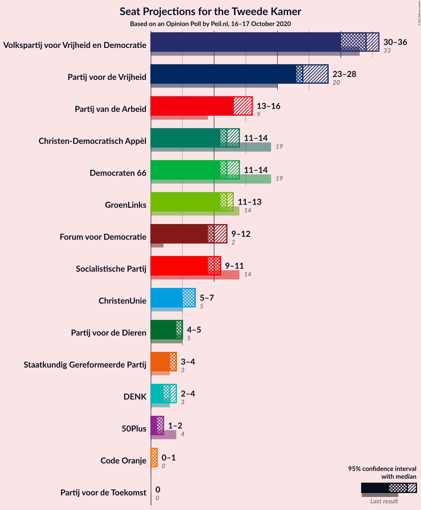

### Confidence Intervals

| Party | Last Result | Median | 80% Confidence Interval | 90% Confidence Interval | 95% Confidence Interval | 99% Confidence Interval |
|:-----:|:-----------:|:------:|:-----------------------:|:-----------------------:|:-----------------------:|:-----------------------:|
| <a href="#volkspartij-voor-vrijheid-en-democratie">Volkspartij voor Vrijheid en Democratie</a> | 33 | 33 | 33–35 |32–36 |32–37 |31–38 |
| <a href="#partij-voor-de-vrijheid">Partij voor de Vrijheid</a> | 20 | 26 | 24–28 |23–28 |23–28 |22–28 |
| <a href="#partij-van-de-arbeid">Partij van de Arbeid</a> | 9 | 14 | 13–15 |13–15 |12–16 |12–16 |
| <a href="#christen-democratisch-appèl">Christen-Democratisch Appèl</a> | 19 | 13 | 12–14 |12–14 |12–15 |11–16 |
| <a href="#democraten-66">Democraten 66</a> | 19 | 13 | 12–13 |11–13 |10–13 |10–14 |
| <a href="#groenlinks">GroenLinks</a> | 14 | 12 | 11–13 |11–13 |11–13 |10–15 |
| <a href="#socialistische-partij">Socialistische Partij</a> | 14 | 10 | 9–12 |9–13 |9–13 |9–13 |
| <a href="#forum-voor-democratie">Forum voor Democratie</a> | 2 | 10 | 9–11 |9–11 |8–12 |8–13 |
| <a href="#christenunie">ChristenUnie</a> | 5 | 6 | 5–6 |5–7 |5–7 |4–8 |
| <a href="#partij-voor-de-dieren">Partij voor de Dieren</a> | 5 | 5 | 4–5 |4–5 |4–6 |4–6 |
| <a href="#staatkundig-gereformeerde-partij">Staatkundig Gereformeerde Partij</a> | 3 | 3 | 3–4 |3–4 |2–5 |2–5 |
| <a href="#denk">DENK</a> | 3 | 3 | 2–3 |2–4 |2–4 |2–4 |
| <a href="#50plus">50Plus</a> | 4 | 2 | 1–2 |1–2 |1–2 |1–2 |
| <a href="#partij-voor-de-toekomst">Partij voor de Toekomst</a> | 0 | 0 | 0 |0 |0 |0 |

### Volkspartij voor Vrijheid en Democratie

*For a full overview of the results for this party, see the [Volkspartij voor Vrijheid en Democratie](party-volkspartijvoorvrijheidendemocratie.html) page.*

| Number of Seats | Probability | Accumulated | Special Marks |
|:---------------:|:-----------:|:-----------:|:-------------:|
| 30 | 0.2% | 100% |  |
| 31 | 2% | 99.8% |  |
| 32 | 6% | 98% |  |
| 33 | 45% | 92% | Last Result, Median |
| 34 | 11% | 47% |  |
| 35 | 32% | 37% |  |
| 36 | 3% | 5% |  |
| 37 | 1.4% | 3% |  |
| 38 | 1.1% | 1.2% |  |
| 39 | 0% | 0% |  |

### Partij voor de Vrijheid

*For a full overview of the results for this party, see the [Partij voor de Vrijheid](party-partijvoordevrijheid.html) page.*

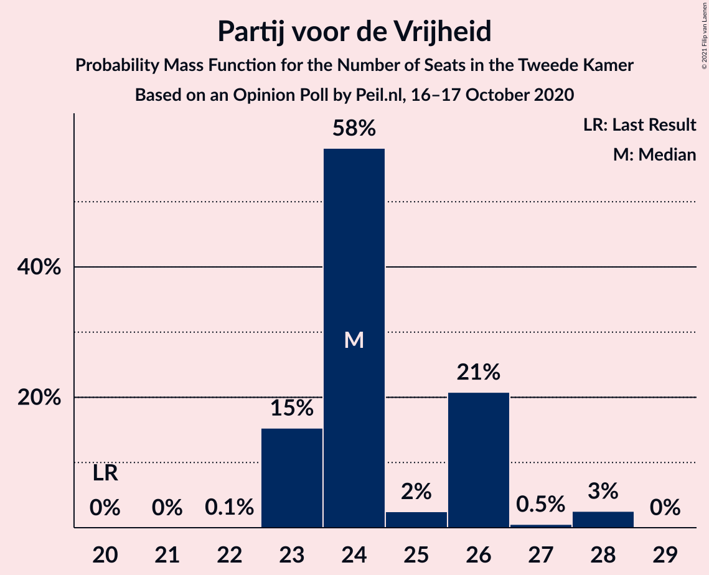

| Number of Seats | Probability | Accumulated | Special Marks |
|:---------------:|:-----------:|:-----------:|:-------------:|
| 20 | 0% | 100% | Last Result |
| 21 | 0.1% | 100% |  |
| 22 | 2% | 99.9% |  |
| 23 | 6% | 98% |  |
| 24 | 22% | 92% |  |
| 25 | 17% | 70% |  |
| 26 | 5% | 53% | Median |
| 27 | 19% | 48% |  |
| 28 | 29% | 29% |  |
| 29 | 0% | 0% |  |

### Partij van de Arbeid

*For a full overview of the results for this party, see the [Partij van de Arbeid](party-partijvandearbeid.html) page.*

| Number of Seats | Probability | Accumulated | Special Marks |
|:---------------:|:-----------:|:-----------:|:-------------:|
| 9 | 0% | 100% | Last Result |
| 10 | 0% | 100% |  |
| 11 | 0% | 100% |  |
| 12 | 4% | 100% |  |
| 13 | 44% | 96% |  |
| 14 | 10% | 52% | Median |
| 15 | 39% | 42% |  |
| 16 | 3% | 4% |  |
| 17 | 0.3% | 0.4% |  |
| 18 | 0% | 0% |  |

### Christen-Democratisch Appèl

*For a full overview of the results for this party, see the [Christen-Democratisch Appèl](party-christen-democratischappèl.html) page.*

| Number of Seats | Probability | Accumulated | Special Marks |
|:---------------:|:-----------:|:-----------:|:-------------:|
| 10 | 0.1% | 100% |  |
| 11 | 1.3% | 99.9% |  |
| 12 | 40% | 98.7% |  |
| 13 | 19% | 59% | Median |
| 14 | 37% | 40% |  |
| 15 | 0.7% | 3% |  |
| 16 | 2% | 2% |  |
| 17 | 0% | 0% |  |
| 18 | 0% | 0% |  |
| 19 | 0% | 0% | Last Result |

### Democraten 66

*For a full overview of the results for this party, see the [Democraten 66](party-democraten66.html) page.*

| Number of Seats | Probability | Accumulated | Special Marks |
|:---------------:|:-----------:|:-----------:|:-------------:|
| 10 | 4% | 100% |  |
| 11 | 4% | 96% |  |
| 12 | 29% | 92% |  |
| 13 | 62% | 63% | Median |
| 14 | 1.3% | 1.4% |  |
| 15 | 0.1% | 0.1% |  |
| 16 | 0% | 0% |  |
| 17 | 0% | 0% |  |
| 18 | 0% | 0% |  |
| 19 | 0% | 0% | Last Result |

### GroenLinks

*For a full overview of the results for this party, see the [GroenLinks](party-groenlinks.html) page.*

| Number of Seats | Probability | Accumulated | Special Marks |
|:---------------:|:-----------:|:-----------:|:-------------:|
| 10 | 1.4% | 100% |  |
| 11 | 46% | 98.6% |  |
| 12 | 33% | 52% | Median |
| 13 | 16% | 19% |  |
| 14 | 2% | 2% | Last Result |
| 15 | 0.7% | 0.7% |  |
| 16 | 0% | 0% |  |

### Socialistische Partij

*For a full overview of the results for this party, see the [Socialistische Partij](party-socialistischepartij.html) page.*

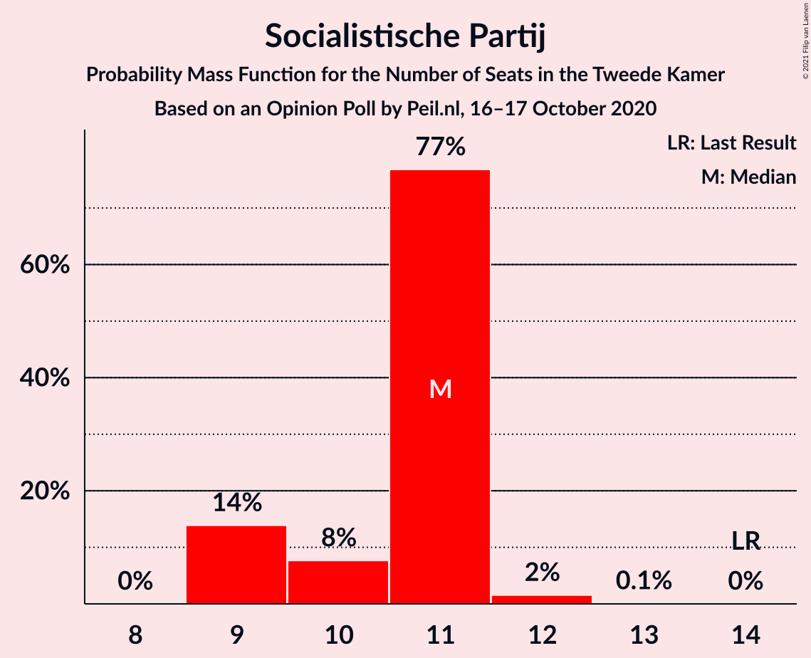

| Number of Seats | Probability | Accumulated | Special Marks |
|:---------------:|:-----------:|:-----------:|:-------------:|
| 9 | 15% | 100% |  |
| 10 | 40% | 85% | Median |
| 11 | 25% | 45% |  |
| 12 | 12% | 20% |  |
| 13 | 8% | 8% |  |
| 14 | 0.1% | 0.1% | Last Result |
| 15 | 0% | 0% |  |

### Forum voor Democratie

*For a full overview of the results for this party, see the [Forum voor Democratie](party-forumvoordemocratie.html) page.*

| Number of Seats | Probability | Accumulated | Special Marks |
|:---------------:|:-----------:|:-----------:|:-------------:|
| 2 | 0% | 100% | Last Result |
| 3 | 0% | 100% |  |
| 4 | 0% | 100% |  |
| 5 | 0% | 100% |  |
| 6 | 0% | 100% |  |
| 7 | 0% | 100% |  |
| 8 | 3% | 100% |  |
| 9 | 35% | 97% |  |
| 10 | 50% | 62% | Median |
| 11 | 9% | 13% |  |
| 12 | 3% | 4% |  |
| 13 | 0.7% | 0.7% |  |
| 14 | 0% | 0% |  |

### ChristenUnie

*For a full overview of the results for this party, see the [ChristenUnie](party-christenunie.html) page.*

| Number of Seats | Probability | Accumulated | Special Marks |
|:---------------:|:-----------:|:-----------:|:-------------:|
| 4 | 2% | 100% |  |
| 5 | 38% | 98% | Last Result |
| 6 | 54% | 61% | Median |
| 7 | 6% | 7% |  |
| 8 | 0.6% | 0.7% |  |
| 9 | 0% | 0% |  |

### Partij voor de Dieren

*For a full overview of the results for this party, see the [Partij voor de Dieren](party-partijvoordedieren.html) page.*

| Number of Seats | Probability | Accumulated | Special Marks |
|:---------------:|:-----------:|:-----------:|:-------------:|
| 3 | 0.2% | 100% |  |
| 4 | 30% | 99.8% |  |
| 5 | 66% | 70% | Last Result, Median |
| 6 | 3% | 3% |  |
| 7 | 0.2% | 0.2% |  |
| 8 | 0% | 0% |  |

### Staatkundig Gereformeerde Partij

*For a full overview of the results for this party, see the [Staatkundig Gereformeerde Partij](party-staatkundiggereformeerdepartij.html) page.*

| Number of Seats | Probability | Accumulated | Special Marks |
|:---------------:|:-----------:|:-----------:|:-------------:|
| 2 | 3% | 100% |  |
| 3 | 47% | 97% | Last Result, Median |
| 4 | 46% | 50% |  |
| 5 | 3% | 3% |  |
| 6 | 0% | 0% |  |

### DENK

*For a full overview of the results for this party, see the [DENK](party-denk.html) page.*

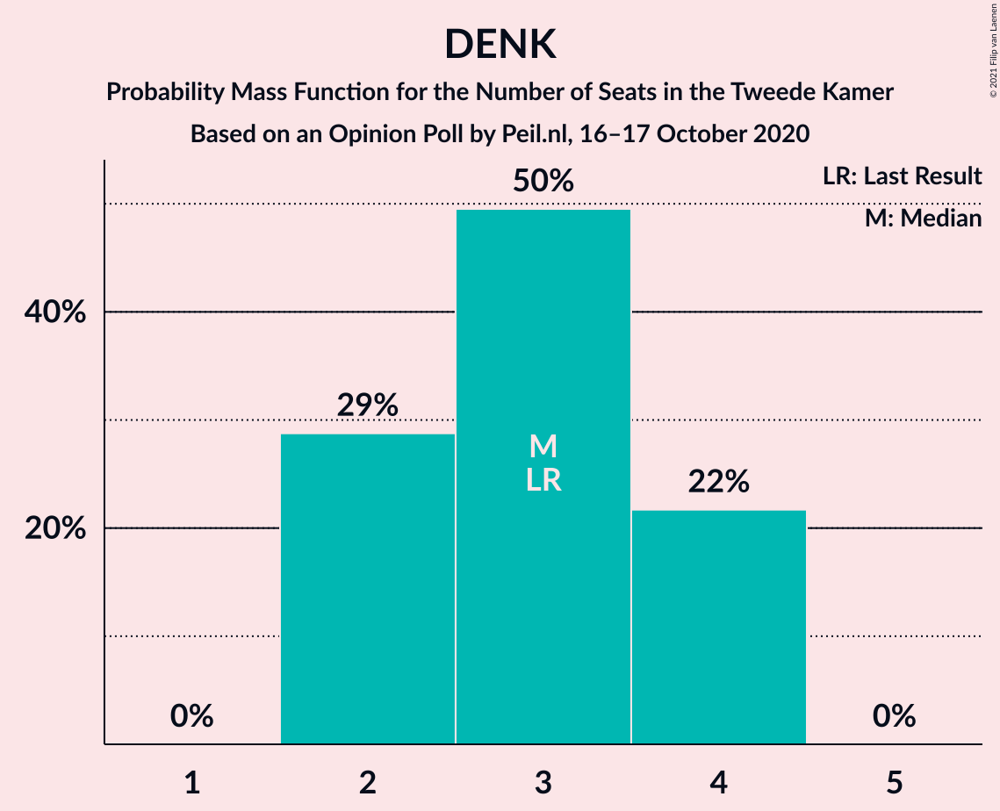

| Number of Seats | Probability | Accumulated | Special Marks |
|:---------------:|:-----------:|:-----------:|:-------------:|
| 2 | 25% | 100% |  |
| 3 | 70% | 75% | Last Result, Median |
| 4 | 5% | 5% |  |
| 5 | 0% | 0% |  |

### 50Plus

*For a full overview of the results for this party, see the [50Plus](party-50plus.html) page.*

| Number of Seats | Probability | Accumulated | Special Marks |
|:---------------:|:-----------:|:-----------:|:-------------:|
| 1 | 49% | 100% |  |
| 2 | 51% | 51% | Median |
| 3 | 0.4% | 0.4% |  |
| 4 | 0% | 0% | Last Result |

### Partij voor de Toekomst

*For a full overview of the results for this party, see the [Partij voor de Toekomst](party-partijvoordetoekomst.html) page.*

| Number of Seats | Probability | Accumulated | Special Marks |
|:---------------:|:-----------:|:-----------:|:-------------:|
| 0 | 100% | 100% | Last Result, Median |

## Coalitions

### Confidence Intervals

| Coalition | Last Result | Median | Majority? | 80% Confidence Interval | 90% Confidence Interval | 95% Confidence Interval | 99% Confidence Interval |
|:---------:|:-----------:|:------:|:---------:|:-----------------------:|:-----------------------:|:-----------------------:|:-----------------------:|
| Volkspartij voor Vrijheid en Democratie – Partij voor de Vrijheid – Christen-Democratisch Appèl – Forum voor Democratie – Staatkundig Gereformeerde Partij | 77 | 86 | 100% | 84–88 | 83–88 | 83–88 | 82–89 |
| Volkspartij voor Vrijheid en Democratie – Partij voor de Vrijheid – Christen-Democratisch Appèl – Forum voor Democratie | 74 | 83 | 100% | 80–85 | 79–85 | 79–85 | 78–86 |
| Volkspartij voor Vrijheid en Democratie – Partij van de Arbeid – Christen-Democratisch Appèl – Democraten 66 – ChristenUnie | 85 | 78 | 98% | 78–81 | 77–81 | 76–82 | 75–83 |
| Volkspartij voor Vrijheid en Democratie – Christen-Democratisch Appèl – Democraten 66 – GroenLinks – ChristenUnie | 90 | 77 | 91% | 76–78 | 75–79 | 74–80 | 73–81 |
| Volkspartij voor Vrijheid en Democratie – Partij voor de Vrijheid – Christen-Democratisch Appèl | 72 | 73 | 0.1% | 70–75 | 70–75 | 69–75 | 68–75 |
| Partij van de Arbeid – Christen-Democratisch Appèl – Democraten 66 – GroenLinks – Socialistische Partij – ChristenUnie | 80 | 68 | 0% | 64–71 | 64–71 | 64–72 | 64–73 |
| Volkspartij voor Vrijheid en Democratie – Christen-Democratisch Appèl – Democraten 66 – ChristenUnie | 76 | 65 | 0% | 64–66 | 63–67 | 62–68 | 61–69 |
| Volkspartij voor Vrijheid en Democratie – Christen-Democratisch Appèl – Forum voor Democratie – Staatkundig Gereformeerde Partij – 50Plus | 61 | 62 | 0% | 60–64 | 59–64 | 59–65 | 59–66 |
| Volkspartij voor Vrijheid en Democratie – Partij van de Arbeid – Christen-Democratisch Appèl | 61 | 60 | 0% | 59–62 | 59–63 | 58–64 | 58–65 |
| Volkspartij voor Vrijheid en Democratie – Christen-Democratisch Appèl – Forum voor Democratie – Staatkundig Gereformeerde Partij | 57 | 60 | 0% | 59–62 | 58–63 | 58–63 | 57–64 |
| Volkspartij voor Vrijheid en Democratie – Partij van de Arbeid – Democraten 66 | 61 | 61 | 0% | 58–61 | 58–62 | 57–63 | 57–64 |
| Volkspartij voor Vrijheid en Democratie – Christen-Democratisch Appèl – Democraten 66 | 71 | 60 | 0% | 58–60 | 57–61 | 56–61 | 56–63 |
| Volkspartij voor Vrijheid en Democratie – Christen-Democratisch Appèl – Forum voor Democratie – 50Plus | 58 | 58 | 0% | 57–60 | 56–61 | 55–61 | 55–62 |
| Partij van de Arbeid – Christen-Democratisch Appèl – Democraten 66 – GroenLinks – ChristenUnie | 66 | 57 | 0% | 54–59 | 54–60 | 54–61 | 53–62 |
| Volkspartij voor Vrijheid en Democratie – Christen-Democratisch Appèl – Forum voor Democratie | 54 | 57 | 0% | 56–58 | 55–59 | 54–60 | 54–60 |
| Volkspartij voor Vrijheid en Democratie – Partij van de Arbeid | 42 | 48 | 0% | 46–49 | 45–50 | 45–50 | 45–52 |
| Volkspartij voor Vrijheid en Democratie – Christen-Democratisch Appèl | 52 | 47 | 0% | 46–48 | 45–48 | 45–49 | 44–51 |
| Partij van de Arbeid – Christen-Democratisch Appèl – Democraten 66 | 47 | 39 | 0% | 38–42 | 38–42 | 36–42 | 35–42 |
| Partij van de Arbeid – Christen-Democratisch Appèl – ChristenUnie | 33 | 33 | 0% | 30–35 | 30–35 | 30–35 | 30–37 |
| Partij van de Arbeid – Christen-Democratisch Appèl | 28 | 26 | 0% | 25–29 | 25–29 | 25–29 | 24–30 |
| Christen-Democratisch Appèl – Democraten 66 | 38 | 25 | 0% | 24–27 | 24–27 | 23–27 | 22–29 |

### Volkspartij voor Vrijheid en Democratie – Partij voor de Vrijheid – Christen-Democratisch Appèl – Forum voor Democratie – Staatkundig Gereformeerde Partij

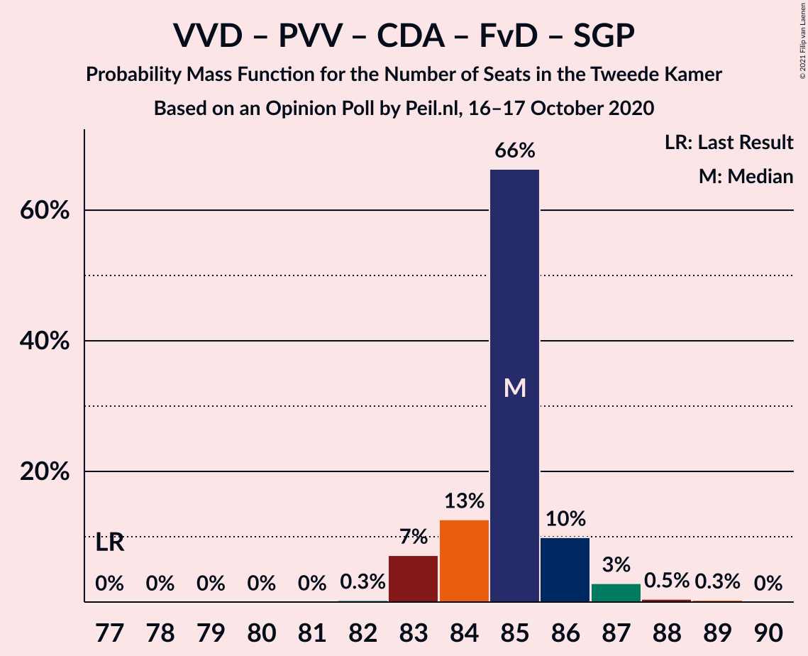

| Number of Seats | Probability | Accumulated | Special Marks |
|:---------------:|:-----------:|:-----------:|:-------------:|
| 77 | 0% | 100% | Last Result |
| 78 | 0% | 100% |  |
| 79 | 0% | 100% |  |
| 80 | 0% | 100% |  |
| 81 | 0.3% | 99.9% |  |
| 82 | 0.4% | 99.6% |  |
| 83 | 9% | 99.3% |  |
| 84 | 21% | 90% |  |
| 85 | 11% | 70% | Median |
| 86 | 9% | 59% |  |
| 87 | 17% | 50% |  |
| 88 | 32% | 33% |  |
| 89 | 0.7% | 0.7% |  |
| 90 | 0.1% | 0.1% |  |
| 91 | 0% | 0% |  |

### Volkspartij voor Vrijheid en Democratie – Partij voor de Vrijheid – Christen-Democratisch Appèl – Forum voor Democratie

| Number of Seats | Probability | Accumulated | Special Marks |
|:---------------:|:-----------:|:-----------:|:-------------:|
| 74 | 0% | 100% | Last Result |
| 75 | 0% | 100% |  |
| 76 | 0% | 100% | Majority |
| 77 | 0.2% | 100% |  |
| 78 | 0.6% | 99.8% |  |
| 79 | 5% | 99.2% |  |
| 80 | 16% | 94% |  |
| 81 | 17% | 78% |  |
| 82 | 5% | 61% | Median |
| 83 | 22% | 55% |  |
| 84 | 4% | 34% |  |
| 85 | 29% | 30% |  |
| 86 | 0.5% | 0.6% |  |
| 87 | 0% | 0.1% |  |
| 88 | 0% | 0% |  |

### Volkspartij voor Vrijheid en Democratie – Partij van de Arbeid – Christen-Democratisch Appèl – Democraten 66 – ChristenUnie

| Number of Seats | Probability | Accumulated | Special Marks |
|:---------------:|:-----------:|:-----------:|:-------------:|
| 74 | 0.2% | 100% |  |
| 75 | 2% | 99.8% |  |
| 76 | 2% | 98% | Majority |
| 77 | 2% | 96% |  |
| 78 | 44% | 94% |  |
| 79 | 12% | 50% | Median |
| 80 | 18% | 38% |  |
| 81 | 15% | 19% |  |
| 82 | 3% | 4% |  |
| 83 | 0.7% | 1.0% |  |
| 84 | 0.3% | 0.3% |  |
| 85 | 0% | 0% | Last Result |

### Volkspartij voor Vrijheid en Democratie – Christen-Democratisch Appèl – Democraten 66 – GroenLinks – ChristenUnie

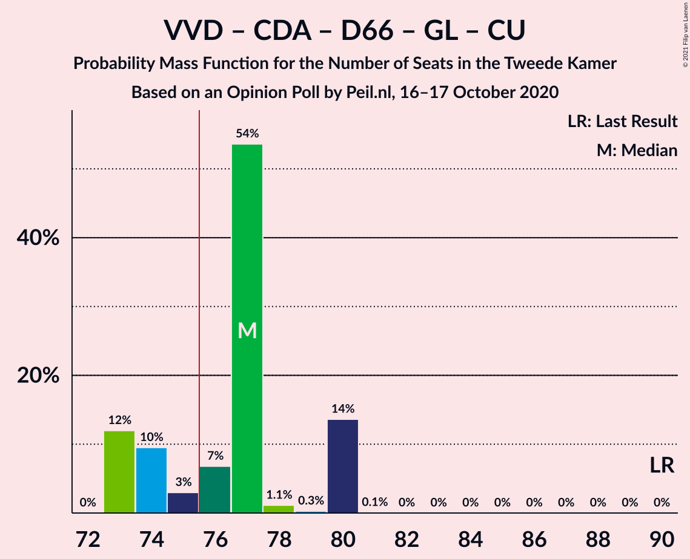

| Number of Seats | Probability | Accumulated | Special Marks |
|:---------------:|:-----------:|:-----------:|:-------------:|
| 73 | 1.0% | 100% |  |
| 74 | 3% | 99.0% |  |
| 75 | 6% | 96% |  |
| 76 | 31% | 91% | Majority |
| 77 | 38% | 59% | Median |
| 78 | 14% | 21% |  |
| 79 | 2% | 6% |  |
| 80 | 3% | 4% |  |
| 81 | 1.2% | 1.3% |  |
| 82 | 0.1% | 0.1% |  |
| 83 | 0% | 0% |  |
| 84 | 0% | 0% |  |
| 85 | 0% | 0% |  |
| 86 | 0% | 0% |  |
| 87 | 0% | 0% |  |
| 88 | 0% | 0% |  |
| 89 | 0% | 0% |  |
| 90 | 0% | 0% | Last Result |

### Volkspartij voor Vrijheid en Democratie – Partij voor de Vrijheid – Christen-Democratisch Appèl

| Number of Seats | Probability | Accumulated | Special Marks |
|:---------------:|:-----------:|:-----------:|:-------------:|
| 67 | 0.1% | 100% |  |
| 68 | 0.6% | 99.9% |  |
| 69 | 3% | 99.3% |  |
| 70 | 8% | 96% |  |
| 71 | 28% | 88% |  |
| 72 | 4% | 60% | Last Result, Median |
| 73 | 9% | 56% |  |
| 74 | 17% | 47% |  |
| 75 | 29% | 29% |  |
| 76 | 0.1% | 0.1% | Majority |
| 77 | 0% | 0% |  |

### Partij van de Arbeid – Christen-Democratisch Appèl – Democraten 66 – GroenLinks – Socialistische Partij – ChristenUnie

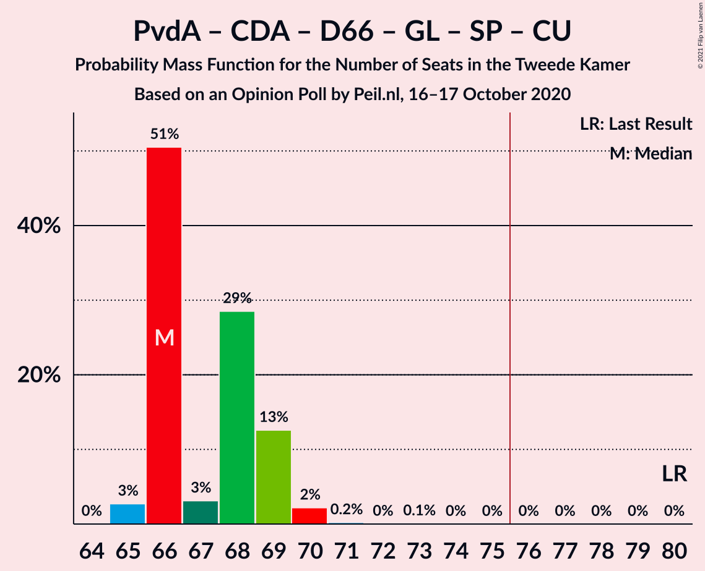

| Number of Seats | Probability | Accumulated | Special Marks |
|:---------------:|:-----------:|:-----------:|:-------------:|
| 63 | 0.4% | 100% |  |
| 64 | 30% | 99.6% |  |
| 65 | 0.4% | 69% |  |
| 66 | 4% | 69% |  |
| 67 | 5% | 65% |  |
| 68 | 23% | 60% | Median |
| 69 | 7% | 37% |  |
| 70 | 19% | 30% |  |
| 71 | 6% | 11% |  |
| 72 | 4% | 5% |  |
| 73 | 1.2% | 1.2% |  |
| 74 | 0% | 0% |  |
| 75 | 0% | 0% |  |
| 76 | 0% | 0% | Majority |
| 77 | 0% | 0% |  |
| 78 | 0% | 0% |  |
| 79 | 0% | 0% |  |
| 80 | 0% | 0% | Last Result |

### Volkspartij voor Vrijheid en Democratie – Christen-Democratisch Appèl – Democraten 66 – ChristenUnie

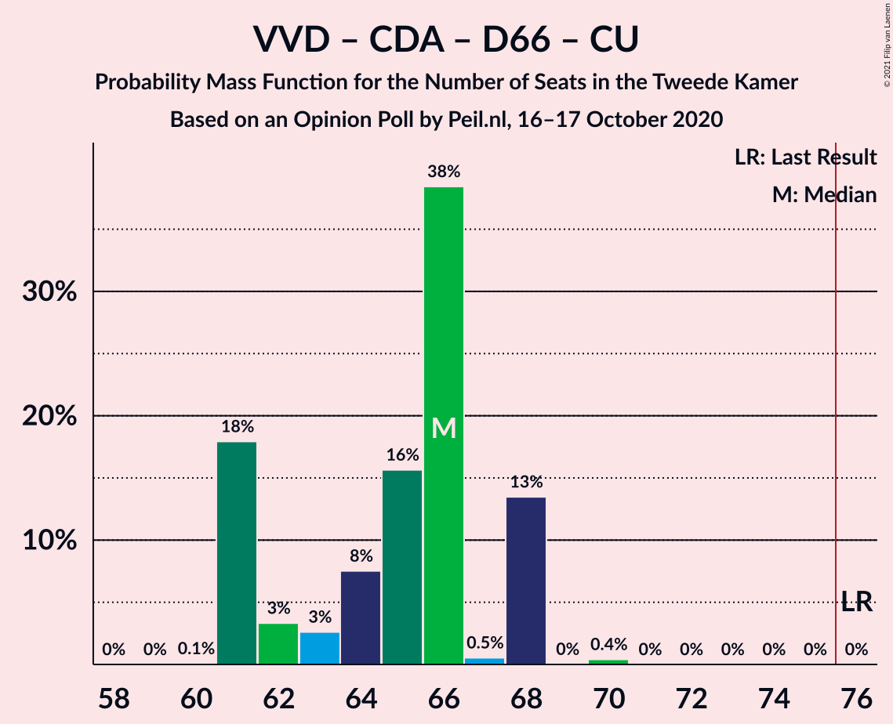

| Number of Seats | Probability | Accumulated | Special Marks |
|:---------------:|:-----------:|:-----------:|:-------------:|
| 60 | 0% | 100% |  |
| 61 | 1.2% | 99.9% |  |
| 62 | 3% | 98.7% |  |
| 63 | 4% | 96% |  |
| 64 | 12% | 91% |  |
| 65 | 51% | 79% | Median |
| 66 | 20% | 29% |  |
| 67 | 6% | 8% |  |
| 68 | 2% | 3% |  |
| 69 | 0.7% | 0.7% |  |
| 70 | 0% | 0% |  |
| 71 | 0% | 0% |  |
| 72 | 0% | 0% |  |
| 73 | 0% | 0% |  |
| 74 | 0% | 0% |  |
| 75 | 0% | 0% |  |
| 76 | 0% | 0% | Last Result, Majority |

### Volkspartij voor Vrijheid en Democratie – Christen-Democratisch Appèl – Forum voor Democratie – Staatkundig Gereformeerde Partij – 50Plus

| Number of Seats | Probability | Accumulated | Special Marks |
|:---------------:|:-----------:|:-----------:|:-------------:|
| 58 | 0.3% | 100% |  |
| 59 | 6% | 99.7% |  |
| 60 | 7% | 94% |  |
| 61 | 34% | 86% | Last Result, Median |
| 62 | 38% | 53% |  |
| 63 | 4% | 15% |  |
| 64 | 7% | 11% |  |
| 65 | 2% | 4% |  |
| 66 | 1.0% | 1.0% |  |
| 67 | 0.1% | 0.1% |  |
| 68 | 0% | 0% |  |

### Volkspartij voor Vrijheid en Democratie – Partij van de Arbeid – Christen-Democratisch Appèl

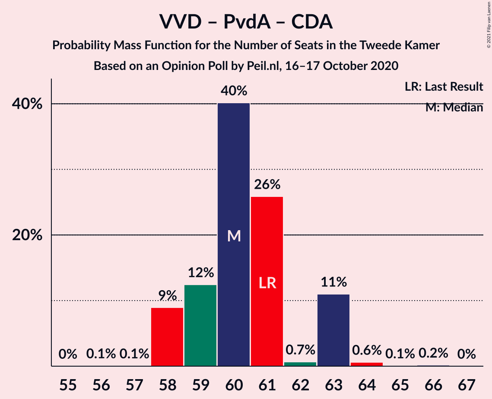

| Number of Seats | Probability | Accumulated | Special Marks |
|:---------------:|:-----------:|:-----------:|:-------------:|
| 56 | 0% | 100% |  |
| 57 | 0.4% | 99.9% |  |
| 58 | 2% | 99.5% |  |
| 59 | 10% | 97% |  |
| 60 | 39% | 88% | Median |
| 61 | 13% | 49% | Last Result |
| 62 | 30% | 36% |  |
| 63 | 3% | 6% |  |
| 64 | 3% | 3% |  |
| 65 | 0.2% | 0.5% |  |
| 66 | 0.2% | 0.3% |  |
| 67 | 0.1% | 0.1% |  |
| 68 | 0% | 0% |  |

### Volkspartij voor Vrijheid en Democratie – Christen-Democratisch Appèl – Forum voor Democratie – Staatkundig Gereformeerde Partij

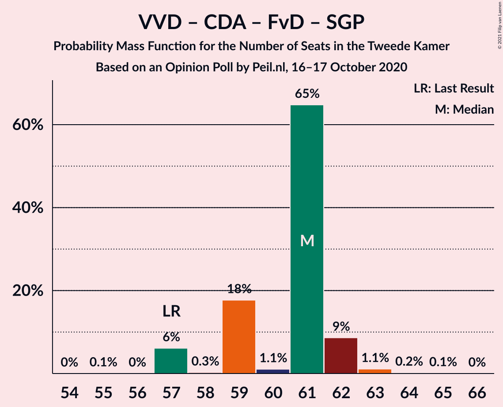

| Number of Seats | Probability | Accumulated | Special Marks |
|:---------------:|:-----------:|:-----------:|:-------------:|
| 56 | 0.1% | 100% |  |
| 57 | 0.8% | 99.9% | Last Result |
| 58 | 6% | 99.1% |  |
| 59 | 13% | 93% | Median |
| 60 | 59% | 80% |  |
| 61 | 8% | 21% |  |
| 62 | 7% | 13% |  |
| 63 | 4% | 6% |  |
| 64 | 1.3% | 2% |  |
| 65 | 0.2% | 0.2% |  |
| 66 | 0% | 0% |  |

### Volkspartij voor Vrijheid en Democratie – Partij van de Arbeid – Democraten 66

| Number of Seats | Probability | Accumulated | Special Marks |
|:---------------:|:-----------:|:-----------:|:-------------:|
| 55 | 0% | 100% |  |
| 56 | 0.2% | 99.9% |  |
| 57 | 3% | 99.8% |  |
| 58 | 8% | 97% |  |
| 59 | 7% | 89% |  |
| 60 | 31% | 81% | Median |
| 61 | 42% | 50% | Last Result |
| 62 | 4% | 8% |  |
| 63 | 2% | 4% |  |
| 64 | 1.3% | 2% |  |
| 65 | 0.2% | 0.2% |  |
| 66 | 0% | 0% |  |

### Volkspartij voor Vrijheid en Democratie – Christen-Democratisch Appèl – Democraten 66

| Number of Seats | Probability | Accumulated | Special Marks |
|:---------------:|:-----------:|:-----------:|:-------------:|
| 54 | 0.1% | 100% |  |
| 55 | 0.4% | 99.9% |  |
| 56 | 3% | 99.6% |  |
| 57 | 3% | 97% |  |
| 58 | 13% | 94% |  |
| 59 | 23% | 81% | Median |
| 60 | 50% | 57% |  |
| 61 | 6% | 7% |  |
| 62 | 1.0% | 2% |  |
| 63 | 0.6% | 0.8% |  |
| 64 | 0.2% | 0.2% |  |
| 65 | 0% | 0% |  |
| 66 | 0% | 0% |  |
| 67 | 0% | 0% |  |
| 68 | 0% | 0% |  |
| 69 | 0% | 0% |  |
| 70 | 0% | 0% |  |
| 71 | 0% | 0% | Last Result |

### Volkspartij voor Vrijheid en Democratie – Christen-Democratisch Appèl – Forum voor Democratie – 50Plus

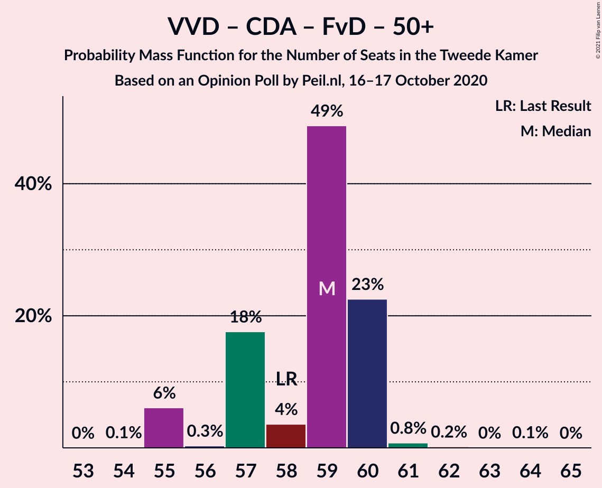

| Number of Seats | Probability | Accumulated | Special Marks |
|:---------------:|:-----------:|:-----------:|:-------------:|
| 54 | 0.1% | 100% |  |
| 55 | 3% | 99.9% |  |
| 56 | 2% | 96% |  |
| 57 | 38% | 95% |  |
| 58 | 12% | 57% | Last Result, Median |
| 59 | 32% | 45% |  |
| 60 | 6% | 13% |  |
| 61 | 4% | 6% |  |
| 62 | 2% | 2% |  |
| 63 | 0.2% | 0.2% |  |
| 64 | 0% | 0.1% |  |
| 65 | 0% | 0% |  |

### Partij van de Arbeid – Christen-Democratisch Appèl – Democraten 66 – GroenLinks – ChristenUnie

| Number of Seats | Probability | Accumulated | Special Marks |
|:---------------:|:-----------:|:-----------:|:-------------:|
| 52 | 0.4% | 100% |  |
| 53 | 1.5% | 99.6% |  |
| 54 | 29% | 98% |  |
| 55 | 1.4% | 69% |  |
| 56 | 5% | 67% |  |
| 57 | 16% | 62% |  |
| 58 | 8% | 47% | Median |
| 59 | 33% | 38% |  |
| 60 | 3% | 5% |  |
| 61 | 2% | 3% |  |
| 62 | 0.6% | 0.7% |  |
| 63 | 0.1% | 0.1% |  |
| 64 | 0% | 0% |  |
| 65 | 0% | 0% |  |
| 66 | 0% | 0% | Last Result |

### Volkspartij voor Vrijheid en Democratie – Christen-Democratisch Appèl – Forum voor Democratie

| Number of Seats | Probability | Accumulated | Special Marks |
|:---------------:|:-----------:|:-----------:|:-------------:|
| 52 | 0.1% | 100% |  |
| 53 | 0.2% | 99.9% |  |
| 54 | 5% | 99.8% | Last Result |
| 55 | 4% | 95% |  |
| 56 | 41% | 91% | Median |
| 57 | 37% | 50% |  |
| 58 | 4% | 13% |  |
| 59 | 5% | 9% |  |
| 60 | 4% | 4% |  |
| 61 | 0.2% | 0.3% |  |
| 62 | 0.1% | 0.1% |  |
| 63 | 0% | 0% |  |

### Volkspartij voor Vrijheid en Democratie – Partij van de Arbeid

| Number of Seats | Probability | Accumulated | Special Marks |
|:---------------:|:-----------:|:-----------:|:-------------:|
| 42 | 0% | 100% | Last Result |
| 43 | 0.1% | 100% |  |
| 44 | 0.1% | 99.9% |  |
| 45 | 8% | 99.8% |  |
| 46 | 5% | 92% |  |
| 47 | 12% | 87% | Median |
| 48 | 63% | 75% |  |
| 49 | 3% | 12% |  |
| 50 | 6% | 9% |  |
| 51 | 1.3% | 2% |  |
| 52 | 1.0% | 1.1% |  |
| 53 | 0% | 0% |  |

### Volkspartij voor Vrijheid en Democratie – Christen-Democratisch Appèl

| Number of Seats | Probability | Accumulated | Special Marks |
|:---------------:|:-----------:|:-----------:|:-------------:|
| 42 | 0% | 100% |  |
| 43 | 0.1% | 99.9% |  |
| 44 | 1.2% | 99.9% |  |
| 45 | 8% | 98.7% |  |
| 46 | 13% | 91% | Median |
| 47 | 66% | 78% |  |
| 48 | 7% | 12% |  |
| 49 | 2% | 4% |  |
| 50 | 1.4% | 2% |  |
| 51 | 0.5% | 0.5% |  |
| 52 | 0% | 0% | Last Result |

### Partij van de Arbeid – Christen-Democratisch Appèl – Democraten 66

| Number of Seats | Probability | Accumulated | Special Marks |
|:---------------:|:-----------:|:-----------:|:-------------:|
| 35 | 2% | 100% |  |
| 36 | 0.8% | 98% |  |
| 37 | 2% | 97% |  |
| 38 | 32% | 95% |  |
| 39 | 18% | 64% |  |
| 40 | 12% | 46% | Median |
| 41 | 17% | 34% |  |
| 42 | 16% | 17% |  |
| 43 | 0.1% | 0.3% |  |
| 44 | 0.2% | 0.2% |  |
| 45 | 0% | 0% |  |
| 46 | 0% | 0% |  |
| 47 | 0% | 0% | Last Result |

### Partij van de Arbeid – Christen-Democratisch Appèl – ChristenUnie

| Number of Seats | Probability | Accumulated | Special Marks |
|:---------------:|:-----------:|:-----------:|:-------------:|
| 29 | 0.4% | 100% |  |
| 30 | 30% | 99.6% |  |
| 31 | 3% | 70% |  |
| 32 | 16% | 67% |  |
| 33 | 9% | 50% | Last Result, Median |
| 34 | 8% | 42% |  |
| 35 | 31% | 33% |  |
| 36 | 2% | 2% |  |
| 37 | 0.5% | 0.6% |  |
| 38 | 0% | 0.1% |  |
| 39 | 0.1% | 0.1% |  |
| 40 | 0% | 0% |  |

### Partij van de Arbeid – Christen-Democratisch Appèl

| Number of Seats | Probability | Accumulated | Special Marks |
|:---------------:|:-----------:|:-----------:|:-------------:|
| 24 | 0.5% | 100% |  |
| 25 | 32% | 99.4% |  |
| 26 | 18% | 68% |  |
| 27 | 4% | 50% | Median |
| 28 | 13% | 46% | Last Result |
| 29 | 31% | 33% |  |
| 30 | 1.1% | 1.3% |  |
| 31 | 0.1% | 0.2% |  |
| 32 | 0.2% | 0.2% |  |
| 33 | 0% | 0% |  |

### Christen-Democratisch Appèl – Democraten 66

| Number of Seats | Probability | Accumulated | Special Marks |
|:---------------:|:-----------:|:-----------:|:-------------:|
| 22 | 2% | 100% |  |
| 23 | 2% | 98% |  |
| 24 | 8% | 95% |  |
| 25 | 37% | 87% |  |
| 26 | 28% | 50% | Median |
| 27 | 19% | 22% |  |
| 28 | 0.9% | 2% |  |
| 29 | 2% | 2% |  |
| 30 | 0% | 0% |  |
| 31 | 0% | 0% |  |
| 32 | 0% | 0% |  |
| 33 | 0% | 0% |  |
| 34 | 0% | 0% |  |
| 35 | 0% | 0% |  |
| 36 | 0% | 0% |  |
| 37 | 0% | 0% |  |
| 38 | 0% | 0% | Last Result |

## Technical Information

### Opinion Poll

+ **Polling firm:** Peil.nl
+ **Commissioner(s):** —
+ **Fieldwork period:** 16–17 October 2020

### Calculations

+ **Sample size:** 3000
+ **Simulations done:** 1,048,576
+ **Error estimate:** 1.31%

