# Opinion Poll by Peil.nl, 1 November 2020

<a href="#voting-intentions">Voting Intentions</a> | <a href="#seats">Seats</a> | <a href="#coalitions">Coalitions</a> | <a href="#technical-information">Technical Information</a>

## Voting Intentions

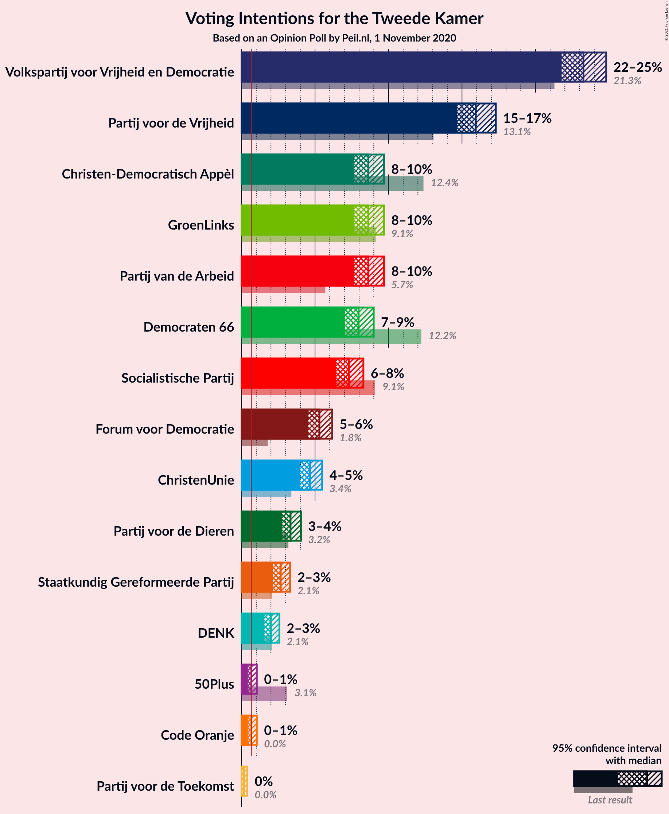

### Confidence Intervals

| Party | Last Result | Poll Result | 80% Confidence Interval | 90% Confidence Interval | 95% Confidence Interval | 99% Confidence Interval |
|:-----:|:-----------:|:-----------:|:-----------------------:|:-----------------------:|:-----------------------:|:-----------------------:|
| Volkspartij voor Vrijheid en Democratie | 21.3% | 23.3% | 22.3–24.3% |22.1–24.6% |21.8–24.9% |21.4–25.3% |
| Partij voor de Vrijheid | 13.1% | 16.0% | 15.1–16.9% |14.9–17.1% |14.7–17.3% |14.3–17.8% |
| Christen-Democratisch Appèl | 12.4% | 8.7% | 8.0–9.4% |7.8–9.6% |7.7–9.7% |7.4–10.1% |
| GroenLinks | 9.1% | 8.7% | 8.0–9.4% |7.8–9.6% |7.7–9.7% |7.4–10.1% |
| Partij van de Arbeid | 5.7% | 8.7% | 8.0–9.4% |7.8–9.6% |7.7–9.7% |7.4–10.1% |
| Democraten 66 | 12.2% | 8.0% | 7.4–8.7% |7.2–8.9% |7.1–9.0% |6.8–9.4% |
| Socialistische Partij | 9.1% | 7.3% | 6.8–8.0% |6.6–8.2% |6.4–8.3% |6.2–8.6% |
| Forum voor Democratie | 1.8% | 5.3% | 4.8–5.9% |4.7–6.1% |4.6–6.2% |4.4–6.5% |
| ChristenUnie | 3.4% | 4.7% | 4.2–5.2% |4.1–5.3% |4.0–5.5% |3.7–5.8% |
| Partij voor de Dieren | 3.2% | 3.3% | 2.9–3.8% |2.8–3.9% |2.7–4.0% |2.6–4.3% |
| Staatkundig Gereformeerde Partij | 2.1% | 2.7% | 2.3–3.1% |2.2–3.2% |2.1–3.3% |2.0–3.5% |
| DENK | 2.1% | 2.0% | 1.7–2.4% |1.6–2.5% |1.6–2.6% |1.4–2.8% |
| 50Plus | 3.1% | 0.7% | 0.5–0.9% |0.5–1.0% |0.4–1.0% |0.4–1.2% |
| Partij voor de Toekomst | 0.0% | 0.2% | 0.1–0.3% |0.1–0.4% |0.1–0.4% |0.0–0.5% |

*Note:* The poll result column reflects the actual value used in the calculations. Published results may vary slightly, and in addition be rounded to fewer digits.

## Seats

### Confidence Intervals

| Party | Last Result | Median | 80% Confidence Interval | 90% Confidence Interval | 95% Confidence Interval | 99% Confidence Interval |
|:-----:|:-----------:|:------:|:-----------------------:|:-----------------------:|:-----------------------:|:-----------------------:|
| <a href="#volkspartij-voor-vrijheid-en-democratie">Volkspartij voor Vrijheid en Democratie</a> | 33 | 36 | 35–38 |35–39 |34–39 |34–39 |
| <a href="#partij-voor-de-vrijheid">Partij voor de Vrijheid</a> | 20 | 24 | 22–26 |22–26 |22–26 |22–28 |
| <a href="#christen-democratisch-appèl">Christen-Democratisch Appèl</a> | 19 | 13 | 12–13 |11–14 |11–15 |11–16 |
| <a href="#groenlinks">GroenLinks</a> | 14 | 13 | 11–14 |11–15 |11–15 |11–16 |
| <a href="#partij-van-de-arbeid">Partij van de Arbeid</a> | 9 | 13 | 12–14 |11–14 |11–15 |11–15 |
| <a href="#democraten-66">Democraten 66</a> | 19 | 13 | 12–14 |12–14 |11–14 |11–14 |
| <a href="#socialistische-partij">Socialistische Partij</a> | 14 | 11 | 10–12 |10–13 |10–13 |10–13 |
| <a href="#forum-voor-democratie">Forum voor Democratie</a> | 2 | 8 | 7–9 |7–9 |7–9 |7–10 |
| <a href="#christenunie">ChristenUnie</a> | 5 | 7 | 6–7 |5–8 |5–8 |5–9 |
| <a href="#partij-voor-de-dieren">Partij voor de Dieren</a> | 5 | 5 | 4–5 |4–5 |4–5 |4–6 |
| <a href="#staatkundig-gereformeerde-partij">Staatkundig Gereformeerde Partij</a> | 3 | 4 | 3–4 |3–5 |3–5 |3–5 |
| <a href="#denk">DENK</a> | 3 | 3 | 2–4 |2–4 |2–4 |2–4 |
| <a href="#50plus">50Plus</a> | 4 | 1 | 0–1 |0–1 |0–1 |0–1 |
| <a href="#partij-voor-de-toekomst">Partij voor de Toekomst</a> | 0 | 0 | 0 |0 |0 |0 |

### Volkspartij voor Vrijheid en Democratie

*For a full overview of the results for this party, see the [Volkspartij voor Vrijheid en Democratie](party-volkspartijvoorvrijheidendemocratie.html) page.*

| Number of Seats | Probability | Accumulated | Special Marks |
|:---------------:|:-----------:|:-----------:|:-------------:|
| 32 | 0.1% | 100% |  |
| 33 | 0.3% | 99.9% | Last Result |
| 34 | 3% | 99.6% |  |
| 35 | 36% | 97% |  |
| 36 | 18% | 61% | Median |
| 37 | 9% | 43% |  |
| 38 | 27% | 34% |  |
| 39 | 6% | 7% |  |
| 40 | 0.1% | 0.1% |  |
| 41 | 0% | 0% |  |

### Partij voor de Vrijheid

*For a full overview of the results for this party, see the [Partij voor de Vrijheid](party-partijvoordevrijheid.html) page.*

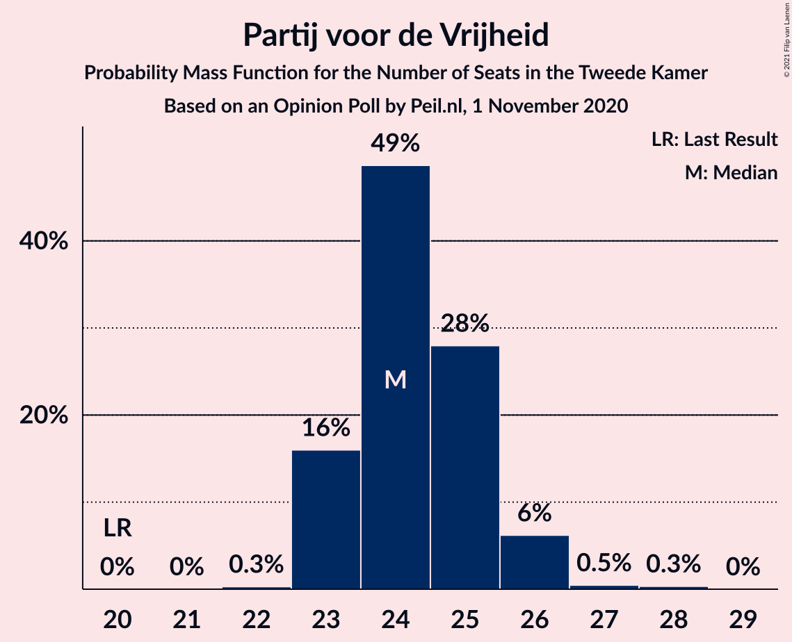

| Number of Seats | Probability | Accumulated | Special Marks |
|:---------------:|:-----------:|:-----------:|:-------------:|
| 20 | 0% | 100% | Last Result |
| 21 | 0.1% | 100% |  |
| 22 | 13% | 99.9% |  |
| 23 | 15% | 87% |  |
| 24 | 48% | 72% | Median |
| 25 | 13% | 23% |  |
| 26 | 8% | 10% |  |
| 27 | 1.2% | 2% |  |
| 28 | 0.7% | 0.7% |  |
| 29 | 0% | 0% |  |

### Christen-Democratisch Appèl

*For a full overview of the results for this party, see the [Christen-Democratisch Appèl](party-christen-democratischappèl.html) page.*

| Number of Seats | Probability | Accumulated | Special Marks |
|:---------------:|:-----------:|:-----------:|:-------------:|
| 10 | 0.3% | 100% |  |
| 11 | 5% | 99.7% |  |
| 12 | 42% | 95% |  |
| 13 | 47% | 53% | Median |
| 14 | 3% | 7% |  |
| 15 | 1.2% | 3% |  |
| 16 | 2% | 2% |  |
| 17 | 0% | 0% |  |
| 18 | 0% | 0% |  |
| 19 | 0% | 0% | Last Result |

### GroenLinks

*For a full overview of the results for this party, see the [GroenLinks](party-groenlinks.html) page.*

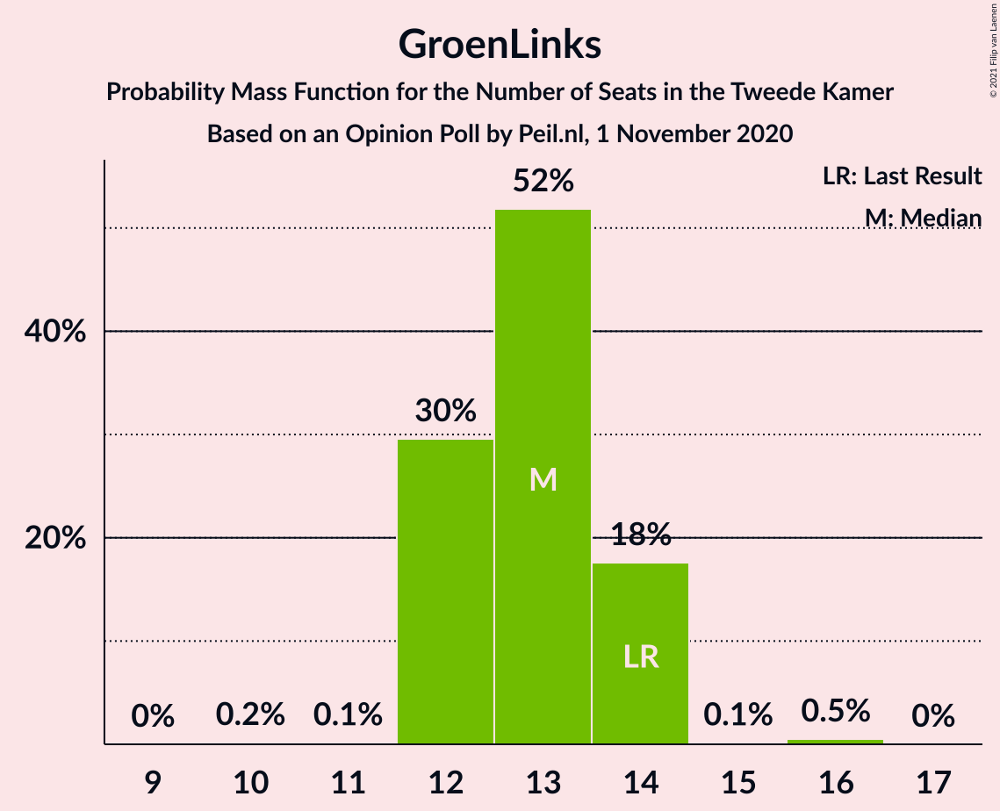

| Number of Seats | Probability | Accumulated | Special Marks |
|:---------------:|:-----------:|:-----------:|:-------------:|
| 10 | 0.1% | 100% |  |
| 11 | 18% | 99.9% |  |
| 12 | 8% | 82% |  |
| 13 | 46% | 73% | Median |
| 14 | 22% | 27% | Last Result |
| 15 | 4% | 5% |  |
| 16 | 1.3% | 1.3% |  |
| 17 | 0% | 0% |  |

### Partij van de Arbeid

*For a full overview of the results for this party, see the [Partij van de Arbeid](party-partijvandearbeid.html) page.*

| Number of Seats | Probability | Accumulated | Special Marks |
|:---------------:|:-----------:|:-----------:|:-------------:|
| 9 | 0% | 100% | Last Result |
| 10 | 0% | 100% |  |
| 11 | 7% | 100% |  |
| 12 | 30% | 93% |  |
| 13 | 45% | 63% | Median |
| 14 | 14% | 18% |  |
| 15 | 4% | 4% |  |
| 16 | 0.1% | 0.1% |  |
| 17 | 0% | 0% |  |

### Democraten 66

*For a full overview of the results for this party, see the [Democraten 66](party-democraten66.html) page.*

| Number of Seats | Probability | Accumulated | Special Marks |
|:---------------:|:-----------:|:-----------:|:-------------:|
| 10 | 0.3% | 100% |  |
| 11 | 4% | 99.7% |  |
| 12 | 28% | 96% |  |
| 13 | 56% | 68% | Median |
| 14 | 12% | 12% |  |
| 15 | 0.1% | 0.1% |  |
| 16 | 0% | 0% |  |
| 17 | 0% | 0% |  |
| 18 | 0% | 0% |  |
| 19 | 0% | 0% | Last Result |

### Socialistische Partij

*For a full overview of the results for this party, see the [Socialistische Partij](party-socialistischepartij.html) page.*

| Number of Seats | Probability | Accumulated | Special Marks |
|:---------------:|:-----------:|:-----------:|:-------------:|
| 9 | 0.2% | 100% |  |
| 10 | 27% | 99.7% |  |
| 11 | 26% | 73% | Median |
| 12 | 37% | 47% |  |
| 13 | 9% | 10% |  |
| 14 | 0% | 0% | Last Result |

### Forum voor Democratie

*For a full overview of the results for this party, see the [Forum voor Democratie](party-forumvoordemocratie.html) page.*

| Number of Seats | Probability | Accumulated | Special Marks |
|:---------------:|:-----------:|:-----------:|:-------------:|
| 2 | 0% | 100% | Last Result |
| 3 | 0% | 100% |  |
| 4 | 0% | 100% |  |
| 5 | 0% | 100% |  |
| 6 | 0.2% | 100% |  |
| 7 | 19% | 99.8% |  |
| 8 | 68% | 81% | Median |
| 9 | 12% | 12% |  |
| 10 | 0.5% | 0.5% |  |
| 11 | 0% | 0% |  |

### ChristenUnie

*For a full overview of the results for this party, see the [ChristenUnie](party-christenunie.html) page.*

| Number of Seats | Probability | Accumulated | Special Marks |
|:---------------:|:-----------:|:-----------:|:-------------:|
| 5 | 5% | 100% | Last Result |
| 6 | 38% | 95% |  |
| 7 | 49% | 57% | Median |
| 8 | 7% | 8% |  |
| 9 | 0.5% | 0.5% |  |
| 10 | 0% | 0% |  |

### Partij voor de Dieren

*For a full overview of the results for this party, see the [Partij voor de Dieren](party-partijvoordedieren.html) page.*

| Number of Seats | Probability | Accumulated | Special Marks |
|:---------------:|:-----------:|:-----------:|:-------------:|
| 3 | 0.3% | 100% |  |
| 4 | 34% | 99.7% |  |
| 5 | 64% | 66% | Last Result, Median |
| 6 | 2% | 2% |  |
| 7 | 0% | 0% |  |

### Staatkundig Gereformeerde Partij

*For a full overview of the results for this party, see the [Staatkundig Gereformeerde Partij](party-staatkundiggereformeerdepartij.html) page.*

| Number of Seats | Probability | Accumulated | Special Marks |
|:---------------:|:-----------:|:-----------:|:-------------:|
| 2 | 0.1% | 100% |  |
| 3 | 28% | 99.9% | Last Result |
| 4 | 67% | 72% | Median |
| 5 | 5% | 5% |  |
| 6 | 0% | 0% |  |

### DENK

*For a full overview of the results for this party, see the [DENK](party-denk.html) page.*

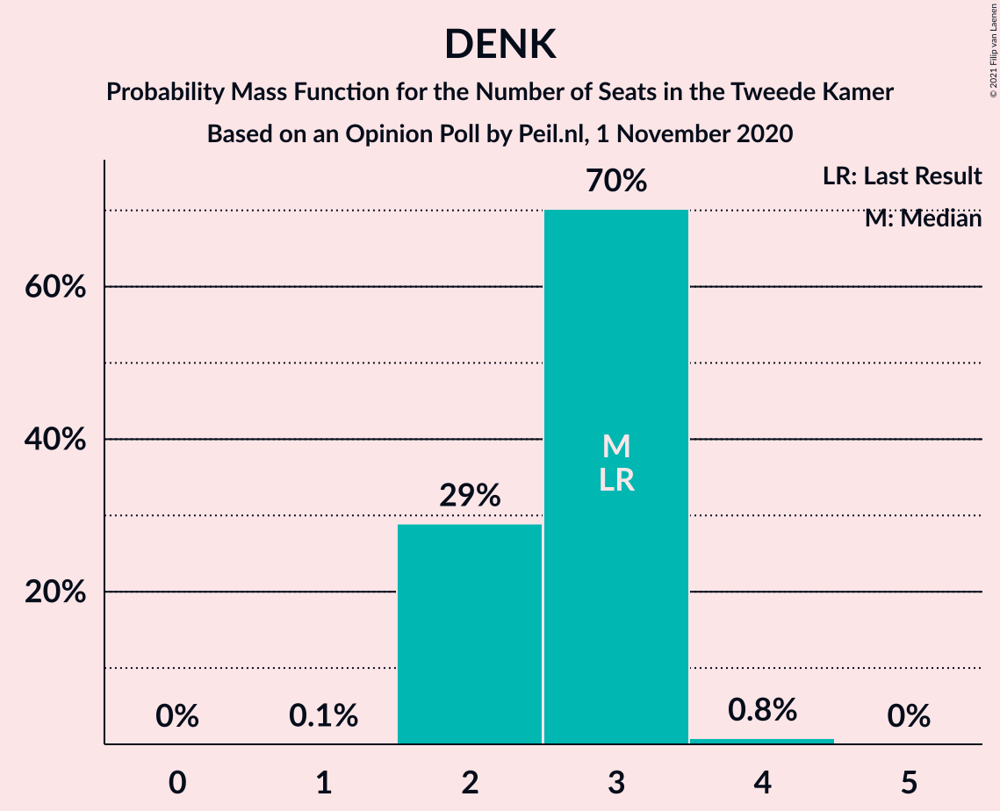

| Number of Seats | Probability | Accumulated | Special Marks |
|:---------------:|:-----------:|:-----------:|:-------------:|
| 1 | 0.4% | 100% |  |
| 2 | 18% | 99.6% |  |
| 3 | 50% | 82% | Last Result, Median |
| 4 | 32% | 32% |  |
| 5 | 0% | 0% |  |

### 50Plus

*For a full overview of the results for this party, see the [50Plus](party-50plus.html) page.*

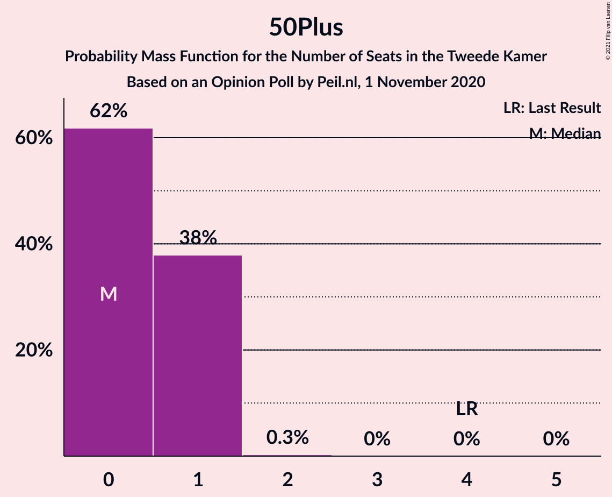

| Number of Seats | Probability | Accumulated | Special Marks |
|:---------------:|:-----------:|:-----------:|:-------------:|
| 0 | 13% | 100% |  |
| 1 | 87% | 87% | Median |
| 2 | 0.2% | 0.2% |  |
| 3 | 0% | 0% |  |
| 4 | 0% | 0% | Last Result |

### Partij voor de Toekomst

*For a full overview of the results for this party, see the [Partij voor de Toekomst](party-partijvoordetoekomst.html) page.*

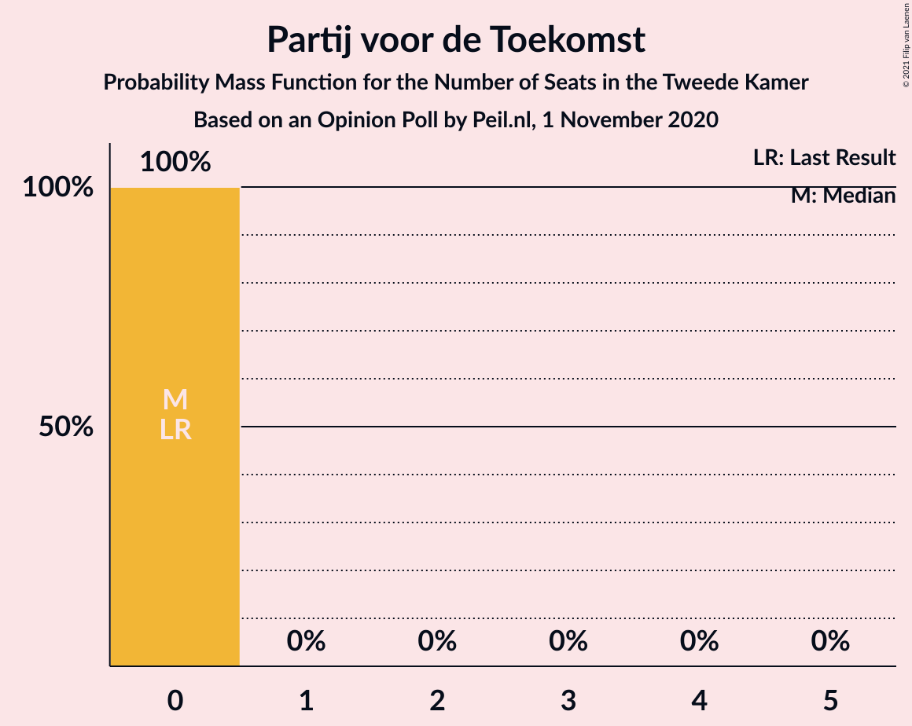

| Number of Seats | Probability | Accumulated | Special Marks |
|:---------------:|:-----------:|:-----------:|:-------------:|
| 0 | 99.9% | 100% | Last Result, Median |
| 1 | 0.1% | 0.1% |  |
| 2 | 0% | 0% |  |

## Coalitions

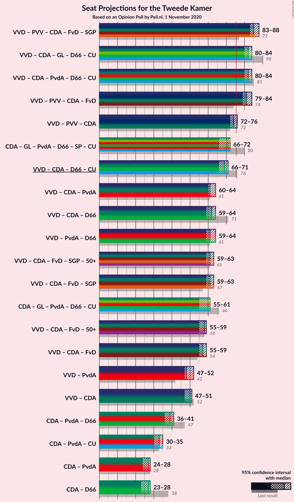

### Confidence Intervals

| Coalition | Last Result | Median | Majority? | 80% Confidence Interval | 90% Confidence Interval | 95% Confidence Interval | 99% Confidence Interval |
|:---------:|:-----------:|:------:|:---------:|:-----------------------:|:-----------------------:|:-----------------------:|:-----------------------:|
| Volkspartij voor Vrijheid en Democratie – Partij voor de Vrijheid – Christen-Democratisch Appèl – Forum voor Democratie – Staatkundig Gereformeerde Partij | 77 | 84 | 100% | 83–87 | 83–88 | 83–90 | 83–90 |
| Volkspartij voor Vrijheid en Democratie – Partij voor de Vrijheid – Christen-Democratisch Appèl – Forum voor Democratie | 74 | 80 | 100% | 79–84 | 79–84 | 78–86 | 78–86 |
| Volkspartij voor Vrijheid en Democratie – Christen-Democratisch Appèl – GroenLinks – Democraten 66 – ChristenUnie | 90 | 81 | 100% | 79–84 | 79–84 | 79–84 | 77–84 |
| Volkspartij voor Vrijheid en Democratie – Christen-Democratisch Appèl – Partij van de Arbeid – Democraten 66 – ChristenUnie | 85 | 82 | 100% | 79–84 | 79–84 | 79–84 | 78–86 |
| Volkspartij voor Vrijheid en Democratie – Partij voor de Vrijheid – Christen-Democratisch Appèl | 72 | 72 | 13% | 71–76 | 71–77 | 70–77 | 70–78 |
| Christen-Democratisch Appèl – GroenLinks – Partij van de Arbeid – Democraten 66 – Socialistische Partij – ChristenUnie | 80 | 69 | 0% | 67–72 | 66–72 | 66–72 | 65–73 |
| Volkspartij voor Vrijheid en Democratie – Christen-Democratisch Appèl – Democraten 66 – ChristenUnie | 76 | 69 | 0% | 66–71 | 66–72 | 66–72 | 64–72 |
| Volkspartij voor Vrijheid en Democratie – Christen-Democratisch Appèl – Democraten 66 | 71 | 62 | 0% | 60–64 | 60–65 | 60–65 | 58–65 |
| Volkspartij voor Vrijheid en Democratie – Christen-Democratisch Appèl – Forum voor Democratie – Staatkundig Gereformeerde Partij – 50Plus | 61 | 62 | 0% | 60–63 | 60–63 | 59–65 | 59–66 |
| Volkspartij voor Vrijheid en Democratie – Christen-Democratisch Appèl – Forum voor Democratie – Staatkundig Gereformeerde Partij | 57 | 61 | 0% | 59–62 | 59–62 | 59–65 | 58–65 |
| Volkspartij voor Vrijheid en Democratie – Christen-Democratisch Appèl – Partij van de Arbeid | 61 | 62 | 0% | 60–64 | 60–64 | 59–65 | 58–66 |
| Volkspartij voor Vrijheid en Democratie – Partij van de Arbeid – Democraten 66 | 61 | 62 | 0% | 61–64 | 60–64 | 60–64 | 59–67 |
| Volkspartij voor Vrijheid en Democratie – Christen-Democratisch Appèl – Forum voor Democratie – 50Plus | 58 | 58 | 0% | 56–60 | 56–60 | 56–61 | 55–62 |
| Volkspartij voor Vrijheid en Democratie – Christen-Democratisch Appèl – Forum voor Democratie | 54 | 57 | 0% | 55–59 | 55–59 | 55–61 | 54–61 |
| Christen-Democratisch Appèl – GroenLinks – Partij van de Arbeid – Democraten 66 – ChristenUnie | 66 | 57 | 0% | 56–59 | 55–60 | 55–60 | 54–63 |
| Volkspartij voor Vrijheid en Democratie – Christen-Democratisch Appèl | 52 | 49 | 0% | 47–51 | 47–51 | 47–52 | 46–52 |
| Volkspartij voor Vrijheid en Democratie – Partij van de Arbeid | 42 | 49 | 0% | 48–51 | 47–51 | 47–51 | 46–53 |
| Christen-Democratisch Appèl – Partij van de Arbeid – Democraten 66 | 47 | 38 | 0% | 37–40 | 35–40 | 35–41 | 35–42 |
| Christen-Democratisch Appèl – Partij van de Arbeid – ChristenUnie | 33 | 32 | 0% | 31–34 | 31–34 | 31–35 | 29–36 |
| Christen-Democratisch Appèl – Democraten 66 | 38 | 25 | 0% | 24–27 | 24–27 | 24–28 | 23–28 |
| Christen-Democratisch Appèl – Partij van de Arbeid | 28 | 25 | 0% | 25–27 | 23–28 | 23–28 | 23–29 |

### Volkspartij voor Vrijheid en Democratie – Partij voor de Vrijheid – Christen-Democratisch Appèl – Forum voor Democratie – Staatkundig Gereformeerde Partij

| Number of Seats | Probability | Accumulated | Special Marks |
|:---------------:|:-----------:|:-----------:|:-------------:|
| 77 | 0% | 100% | Last Result |
| 78 | 0% | 100% |  |
| 79 | 0% | 100% |  |
| 80 | 0% | 100% |  |
| 81 | 0.2% | 100% |  |
| 82 | 0.2% | 99.8% |  |
| 83 | 48% | 99.6% |  |
| 84 | 4% | 52% |  |
| 85 | 19% | 48% | Median |
| 86 | 9% | 29% |  |
| 87 | 11% | 20% |  |
| 88 | 6% | 9% |  |
| 89 | 0.4% | 3% |  |
| 90 | 2% | 3% |  |
| 91 | 0.1% | 0.5% |  |
| 92 | 0.4% | 0.4% |  |
| 93 | 0% | 0% |  |

### Volkspartij voor Vrijheid en Democratie – Partij voor de Vrijheid – Christen-Democratisch Appèl – Forum voor Democratie

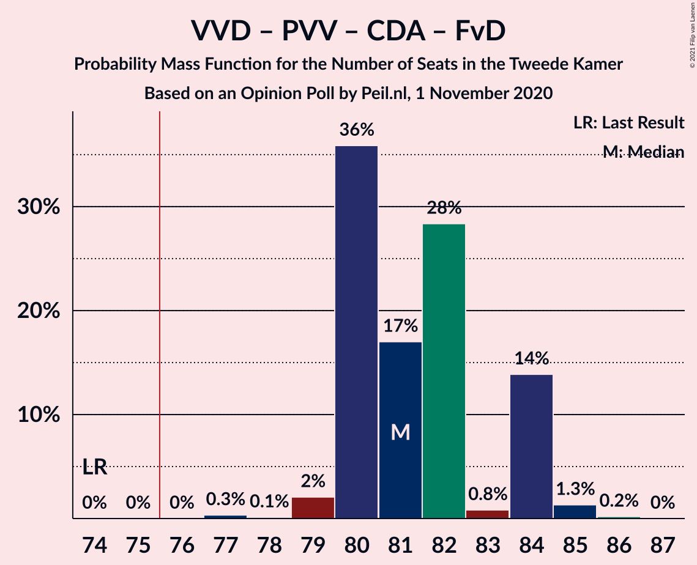

| Number of Seats | Probability | Accumulated | Special Marks |
|:---------------:|:-----------:|:-----------:|:-------------:|
| 74 | 0% | 100% | Last Result |
| 75 | 0% | 100% |  |
| 76 | 0% | 100% | Majority |
| 77 | 0.1% | 100% |  |
| 78 | 3% | 99.9% |  |
| 79 | 44% | 96% |  |
| 80 | 3% | 52% |  |
| 81 | 5% | 49% | Median |
| 82 | 24% | 44% |  |
| 83 | 2% | 20% |  |
| 84 | 16% | 19% |  |
| 85 | 0.3% | 3% |  |
| 86 | 2% | 3% |  |
| 87 | 0% | 0.4% |  |
| 88 | 0.4% | 0.4% |  |
| 89 | 0% | 0% |  |

### Volkspartij voor Vrijheid en Democratie – Christen-Democratisch Appèl – GroenLinks – Democraten 66 – ChristenUnie

| Number of Seats | Probability | Accumulated | Special Marks |
|:---------------:|:-----------:|:-----------:|:-------------:|
| 77 | 0.9% | 100% |  |
| 78 | 0.8% | 99.0% |  |
| 79 | 32% | 98% |  |
| 80 | 7% | 66% |  |
| 81 | 11% | 60% |  |
| 82 | 13% | 48% | Median |
| 83 | 20% | 36% |  |
| 84 | 16% | 16% |  |
| 85 | 0.1% | 0.2% |  |
| 86 | 0.1% | 0.2% |  |
| 87 | 0% | 0% |  |
| 88 | 0% | 0% |  |
| 89 | 0% | 0% |  |
| 90 | 0% | 0% | Last Result |

### Volkspartij voor Vrijheid en Democratie – Christen-Democratisch Appèl – Partij van de Arbeid – Democraten 66 – ChristenUnie

| Number of Seats | Probability | Accumulated | Special Marks |
|:---------------:|:-----------:|:-----------:|:-------------:|
| 77 | 0.3% | 100% |  |
| 78 | 1.5% | 99.7% |  |
| 79 | 33% | 98% |  |
| 80 | 9% | 65% |  |
| 81 | 5% | 56% |  |
| 82 | 30% | 51% | Median |
| 83 | 4% | 21% |  |
| 84 | 16% | 18% |  |
| 85 | 0.7% | 2% | Last Result |
| 86 | 1.2% | 1.2% |  |
| 87 | 0% | 0% |  |

### Volkspartij voor Vrijheid en Democratie – Partij voor de Vrijheid – Christen-Democratisch Appèl

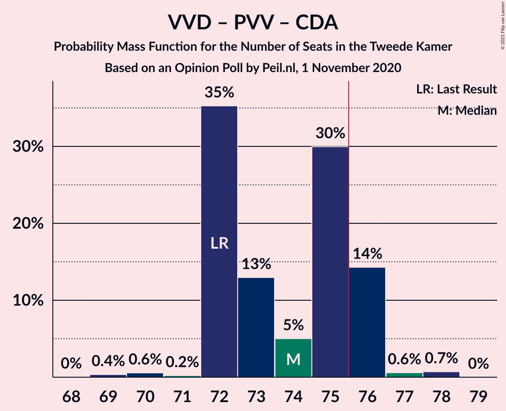

| Number of Seats | Probability | Accumulated | Special Marks |
|:---------------:|:-----------:|:-----------:|:-------------:|
| 69 | 0.1% | 100% |  |
| 70 | 4% | 99.9% |  |
| 71 | 44% | 96% |  |
| 72 | 5% | 53% | Last Result |
| 73 | 3% | 48% | Median |
| 74 | 16% | 45% |  |
| 75 | 17% | 29% |  |
| 76 | 4% | 13% | Majority |
| 77 | 9% | 9% |  |
| 78 | 0.4% | 0.7% |  |
| 79 | 0.3% | 0.3% |  |
| 80 | 0% | 0% |  |

### Christen-Democratisch Appèl – GroenLinks – Partij van de Arbeid – Democraten 66 – Socialistische Partij – ChristenUnie

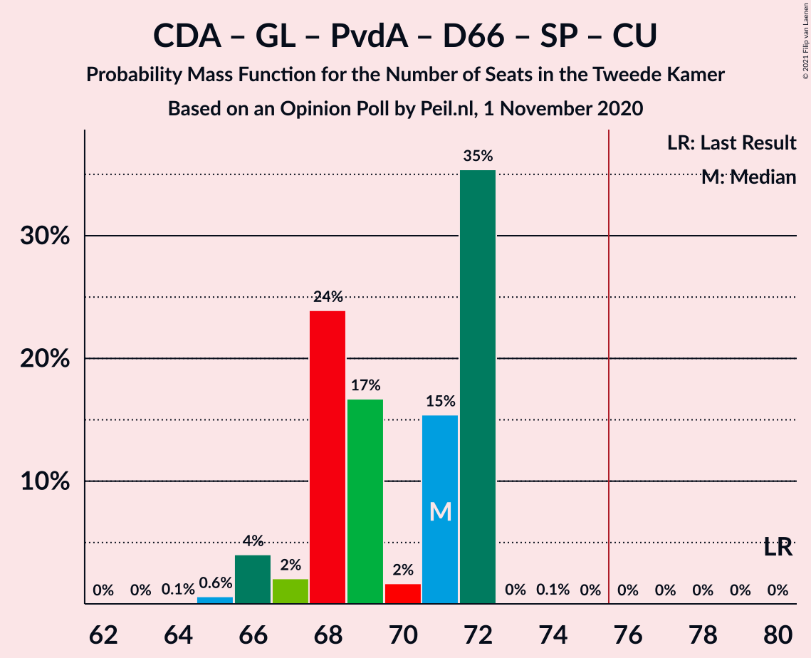

| Number of Seats | Probability | Accumulated | Special Marks |
|:---------------:|:-----------:|:-----------:|:-------------:|
| 64 | 0.1% | 100% |  |
| 65 | 0.5% | 99.9% |  |
| 66 | 9% | 99.4% |  |
| 67 | 1.4% | 90% |  |
| 68 | 30% | 89% |  |
| 69 | 38% | 58% |  |
| 70 | 5% | 21% | Median |
| 71 | 2% | 16% |  |
| 72 | 13% | 14% |  |
| 73 | 0.4% | 0.9% |  |
| 74 | 0.5% | 0.5% |  |
| 75 | 0% | 0% |  |
| 76 | 0% | 0% | Majority |
| 77 | 0% | 0% |  |
| 78 | 0% | 0% |  |
| 79 | 0% | 0% |  |
| 80 | 0% | 0% | Last Result |

### Volkspartij voor Vrijheid en Democratie – Christen-Democratisch Appèl – Democraten 66 – ChristenUnie

| Number of Seats | Probability | Accumulated | Special Marks |
|:---------------:|:-----------:|:-----------:|:-------------:|
| 63 | 0.2% | 100% |  |
| 64 | 0.9% | 99.8% |  |
| 65 | 0.3% | 98.9% |  |
| 66 | 37% | 98.6% |  |
| 67 | 3% | 61% |  |
| 68 | 8% | 59% |  |
| 69 | 10% | 50% | Median |
| 70 | 22% | 40% |  |
| 71 | 10% | 18% |  |
| 72 | 9% | 9% |  |
| 73 | 0% | 0% |  |
| 74 | 0% | 0% |  |
| 75 | 0% | 0% |  |
| 76 | 0% | 0% | Last Result, Majority |

### Volkspartij voor Vrijheid en Democratie – Christen-Democratisch Appèl – Democraten 66

| Number of Seats | Probability | Accumulated | Special Marks |
|:---------------:|:-----------:|:-----------:|:-------------:|
| 57 | 0.3% | 100% |  |
| 58 | 0.3% | 99.7% |  |
| 59 | 1.3% | 99.4% |  |
| 60 | 36% | 98% |  |
| 61 | 9% | 62% |  |
| 62 | 10% | 52% | Median |
| 63 | 30% | 42% |  |
| 64 | 4% | 13% |  |
| 65 | 9% | 9% |  |
| 66 | 0% | 0% |  |
| 67 | 0% | 0% |  |
| 68 | 0% | 0% |  |
| 69 | 0% | 0% |  |
| 70 | 0% | 0% |  |
| 71 | 0% | 0% | Last Result |

### Volkspartij voor Vrijheid en Democratie – Christen-Democratisch Appèl – Forum voor Democratie – Staatkundig Gereformeerde Partij – 50Plus

| Number of Seats | Probability | Accumulated | Special Marks |
|:---------------:|:-----------:|:-----------:|:-------------:|
| 57 | 0.1% | 100% |  |
| 58 | 0.2% | 99.9% |  |
| 59 | 3% | 99.7% |  |
| 60 | 37% | 97% |  |
| 61 | 4% | 60% | Last Result |
| 62 | 20% | 56% | Median |
| 63 | 32% | 36% |  |
| 64 | 0.9% | 4% |  |
| 65 | 0.7% | 3% |  |
| 66 | 2% | 2% |  |
| 67 | 0.2% | 0.2% |  |
| 68 | 0% | 0% |  |

### Volkspartij voor Vrijheid en Democratie – Christen-Democratisch Appèl – Forum voor Democratie – Staatkundig Gereformeerde Partij

| Number of Seats | Probability | Accumulated | Special Marks |
|:---------------:|:-----------:|:-----------:|:-------------:|
| 56 | 0.1% | 100% |  |
| 57 | 0.1% | 99.9% | Last Result |
| 58 | 2% | 99.8% |  |
| 59 | 36% | 98% |  |
| 60 | 4% | 62% |  |
| 61 | 16% | 58% | Median |
| 62 | 38% | 42% |  |
| 63 | 1.1% | 4% |  |
| 64 | 0.3% | 3% |  |
| 65 | 3% | 3% |  |
| 66 | 0.1% | 0.2% |  |
| 67 | 0.1% | 0.1% |  |
| 68 | 0% | 0% |  |

### Volkspartij voor Vrijheid en Democratie – Christen-Democratisch Appèl – Partij van de Arbeid

| Number of Seats | Probability | Accumulated | Special Marks |
|:---------------:|:-----------:|:-----------:|:-------------:|
| 58 | 1.3% | 100% |  |
| 59 | 1.3% | 98.7% |  |
| 60 | 34% | 97% |  |
| 61 | 5% | 63% | Last Result |
| 62 | 18% | 59% | Median |
| 63 | 26% | 41% |  |
| 64 | 12% | 15% |  |
| 65 | 2% | 3% |  |
| 66 | 0.3% | 0.5% |  |
| 67 | 0.2% | 0.2% |  |
| 68 | 0% | 0% |  |

### Volkspartij voor Vrijheid en Democratie – Partij van de Arbeid – Democraten 66

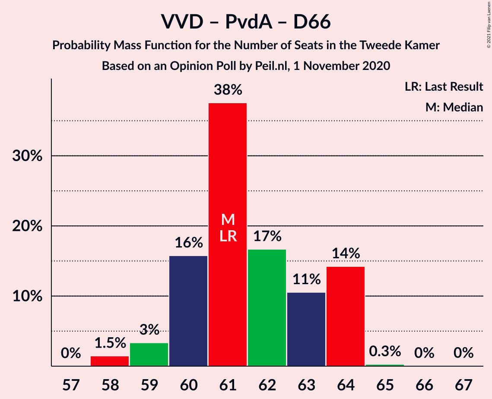

| Number of Seats | Probability | Accumulated | Special Marks |
|:---------------:|:-----------:|:-----------:|:-------------:|
| 58 | 0.3% | 100% |  |
| 59 | 1.0% | 99.7% |  |
| 60 | 8% | 98.7% |  |
| 61 | 34% | 91% | Last Result |
| 62 | 32% | 57% | Median |
| 63 | 8% | 25% |  |
| 64 | 16% | 17% |  |
| 65 | 0.5% | 2% |  |
| 66 | 0.2% | 1.3% |  |
| 67 | 1.1% | 1.1% |  |
| 68 | 0% | 0% |  |

### Volkspartij voor Vrijheid en Democratie – Christen-Democratisch Appèl – Forum voor Democratie – 50Plus

| Number of Seats | Probability | Accumulated | Special Marks |
|:---------------:|:-----------:|:-----------:|:-------------:|
| 53 | 0.2% | 100% |  |
| 54 | 0.1% | 99.8% |  |
| 55 | 2% | 99.7% |  |
| 56 | 38% | 98% |  |
| 57 | 6% | 61% |  |
| 58 | 12% | 54% | Last Result, Median |
| 59 | 22% | 42% |  |
| 60 | 17% | 20% |  |
| 61 | 0.9% | 3% |  |
| 62 | 2% | 2% |  |
| 63 | 0% | 0% |  |

### Volkspartij voor Vrijheid en Democratie – Christen-Democratisch Appèl – Forum voor Democratie

| Number of Seats | Probability | Accumulated | Special Marks |
|:---------------:|:-----------:|:-----------:|:-------------:|
| 52 | 0.1% | 100% |  |
| 53 | 0.1% | 99.9% |  |
| 54 | 0.5% | 99.8% | Last Result |
| 55 | 37% | 99.3% |  |
| 56 | 6% | 62% |  |
| 57 | 14% | 56% | Median |
| 58 | 16% | 43% |  |
| 59 | 24% | 27% |  |
| 60 | 0.4% | 3% |  |
| 61 | 3% | 3% |  |
| 62 | 0.1% | 0.1% |  |
| 63 | 0% | 0% |  |

### Christen-Democratisch Appèl – GroenLinks – Partij van de Arbeid – Democraten 66 – ChristenUnie

| Number of Seats | Probability | Accumulated | Special Marks |
|:---------------:|:-----------:|:-----------:|:-------------:|
| 54 | 0.6% | 100% |  |
| 55 | 6% | 99.4% |  |
| 56 | 4% | 93% |  |
| 57 | 41% | 89% |  |
| 58 | 30% | 49% |  |
| 59 | 12% | 19% | Median |
| 60 | 5% | 7% |  |
| 61 | 2% | 2% |  |
| 62 | 0.3% | 0.9% |  |
| 63 | 0.6% | 0.6% |  |
| 64 | 0% | 0% |  |
| 65 | 0% | 0% |  |
| 66 | 0% | 0% | Last Result |

### Volkspartij voor Vrijheid en Democratie – Christen-Democratisch Appèl

| Number of Seats | Probability | Accumulated | Special Marks |
|:---------------:|:-----------:|:-----------:|:-------------:|
| 45 | 0.2% | 100% |  |
| 46 | 2% | 99.8% |  |
| 47 | 35% | 98% |  |
| 48 | 6% | 63% |  |
| 49 | 13% | 57% | Median |
| 50 | 10% | 44% |  |
| 51 | 31% | 34% |  |
| 52 | 3% | 3% | Last Result |
| 53 | 0.2% | 0.3% |  |
| 54 | 0% | 0% |  |

### Volkspartij voor Vrijheid en Democratie – Partij van de Arbeid

| Number of Seats | Probability | Accumulated | Special Marks |
|:---------------:|:-----------:|:-----------:|:-------------:|
| 42 | 0% | 100% | Last Result |
| 43 | 0% | 100% |  |
| 44 | 0% | 100% |  |
| 45 | 0% | 100% |  |
| 46 | 1.3% | 99.9% |  |
| 47 | 5% | 98.6% |  |
| 48 | 34% | 94% |  |
| 49 | 12% | 60% | Median |
| 50 | 36% | 48% |  |
| 51 | 11% | 13% |  |
| 52 | 0.7% | 2% |  |
| 53 | 1.5% | 2% |  |
| 54 | 0% | 0.1% |  |
| 55 | 0% | 0% |  |

### Christen-Democratisch Appèl – Partij van de Arbeid – Democraten 66

| Number of Seats | Probability | Accumulated | Special Marks |
|:---------------:|:-----------:|:-----------:|:-------------:|
| 34 | 0% | 100% |  |
| 35 | 7% | 99.9% |  |
| 36 | 2% | 93% |  |
| 37 | 15% | 91% |  |
| 38 | 42% | 76% |  |
| 39 | 21% | 34% | Median |
| 40 | 10% | 13% |  |
| 41 | 2% | 3% |  |
| 42 | 0.9% | 1.1% |  |
| 43 | 0.2% | 0.2% |  |
| 44 | 0% | 0% |  |
| 45 | 0% | 0% |  |
| 46 | 0% | 0% |  |
| 47 | 0% | 0% | Last Result |

### Christen-Democratisch Appèl – Partij van de Arbeid – ChristenUnie

| Number of Seats | Probability | Accumulated | Special Marks |
|:---------------:|:-----------:|:-----------:|:-------------:|
| 29 | 1.2% | 100% |  |
| 30 | 0.2% | 98.7% |  |
| 31 | 46% | 98.5% |  |
| 32 | 28% | 53% |  |
| 33 | 11% | 25% | Last Result, Median |
| 34 | 9% | 14% |  |
| 35 | 4% | 5% |  |
| 36 | 0.7% | 1.2% |  |
| 37 | 0% | 0.5% |  |
| 38 | 0.4% | 0.4% |  |
| 39 | 0% | 0% |  |

### Christen-Democratisch Appèl – Democraten 66

| Number of Seats | Probability | Accumulated | Special Marks |
|:---------------:|:-----------:|:-----------:|:-------------:|
| 21 | 0.1% | 100% |  |
| 22 | 0.2% | 99.9% |  |
| 23 | 2% | 99.7% |  |
| 24 | 12% | 98% |  |
| 25 | 51% | 86% |  |
| 26 | 23% | 35% | Median |
| 27 | 10% | 13% |  |
| 28 | 3% | 3% |  |
| 29 | 0.1% | 0.1% |  |
| 30 | 0% | 0% |  |
| 31 | 0% | 0% |  |
| 32 | 0% | 0% |  |
| 33 | 0% | 0% |  |
| 34 | 0% | 0% |  |
| 35 | 0% | 0% |  |
| 36 | 0% | 0% |  |
| 37 | 0% | 0% |  |
| 38 | 0% | 0% | Last Result |

### Christen-Democratisch Appèl – Partij van de Arbeid

| Number of Seats | Probability | Accumulated | Special Marks |
|:---------------:|:-----------:|:-----------:|:-------------:|
| 23 | 7% | 100% |  |
| 24 | 3% | 93% |  |
| 25 | 61% | 90% |  |
| 26 | 13% | 29% | Median |
| 27 | 10% | 16% |  |
| 28 | 5% | 6% | Last Result |
| 29 | 1.3% | 2% |  |
| 30 | 0.4% | 0.4% |  |
| 31 | 0% | 0% |  |

## Technical Information

### Opinion Poll

+ **Polling firm:** Peil.nl
+ **Commissioner(s):** —
+ **Fieldwork period:** 1 November 2020

### Calculations

+ **Sample size:** 3000
+ **Simulations done:** 524,288
+ **Error estimate:** 1.60%

