# Opinion Poll by Peil.nl, 8 November 2020

<a href="#voting-intentions">Voting Intentions</a> | <a href="#seats">Seats</a> | <a href="#coalitions">Coalitions</a> | <a href="#technical-information">Technical Information</a>

## Voting Intentions

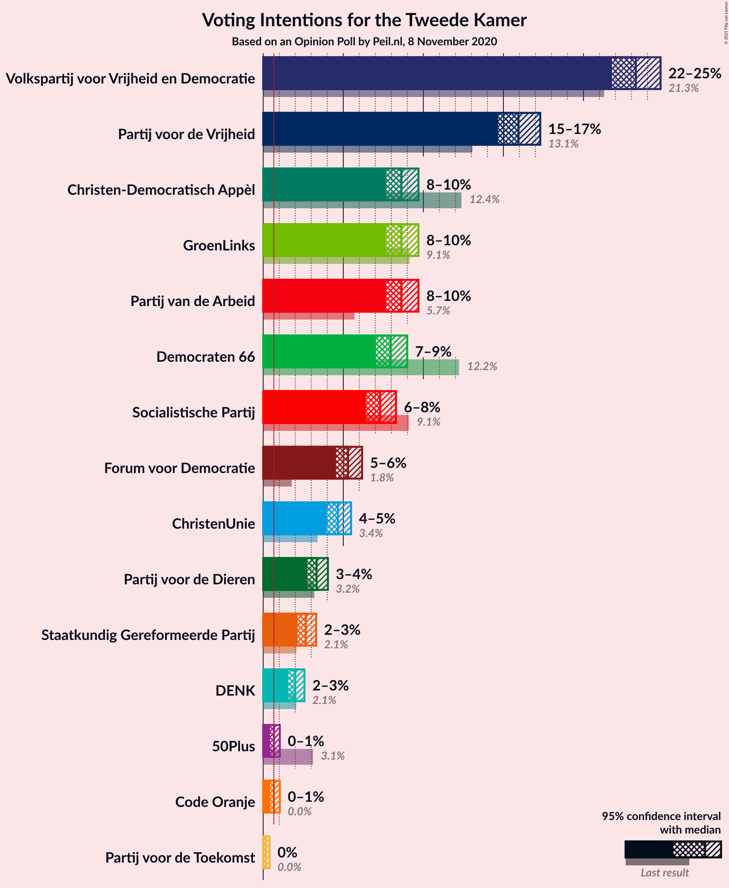

### Confidence Intervals

| Party | Last Result | Poll Result | 80% Confidence Interval | 90% Confidence Interval | 95% Confidence Interval | 99% Confidence Interval |
|:-----:|:-----------:|:-----------:|:-----------------------:|:-----------------------:|:-----------------------:|:-----------------------:|
| Volkspartij voor Vrijheid en Democratie | 21.3% | 23.3% | 22.3–24.3% |22.1–24.6% |21.8–24.9% |21.4–25.3% |
| Partij voor de Vrijheid | 13.1% | 16.0% | 15.1–16.9% |14.9–17.1% |14.7–17.3% |14.3–17.8% |
| Christen-Democratisch Appèl | 12.4% | 8.7% | 8.0–9.4% |7.8–9.6% |7.7–9.7% |7.4–10.1% |
| GroenLinks | 9.1% | 8.7% | 8.0–9.4% |7.8–9.6% |7.7–9.7% |7.4–10.1% |
| Partij van de Arbeid | 5.7% | 8.7% | 8.0–9.4% |7.8–9.6% |7.7–9.7% |7.4–10.1% |
| Democraten 66 | 12.2% | 8.0% | 7.4–8.7% |7.2–8.9% |7.1–9.0% |6.8–9.4% |
| Socialistische Partij | 9.1% | 7.3% | 6.8–8.0% |6.6–8.2% |6.4–8.3% |6.2–8.6% |
| Forum voor Democratie | 1.8% | 5.3% | 4.8–5.9% |4.7–6.1% |4.6–6.2% |4.4–6.5% |
| ChristenUnie | 3.4% | 4.7% | 4.2–5.2% |4.1–5.3% |4.0–5.5% |3.7–5.8% |
| Partij voor de Dieren | 3.2% | 3.3% | 2.9–3.8% |2.8–3.9% |2.7–4.0% |2.6–4.3% |
| Staatkundig Gereformeerde Partij | 2.1% | 2.7% | 2.3–3.1% |2.2–3.2% |2.1–3.3% |2.0–3.5% |
| DENK | 2.1% | 2.0% | 1.7–2.4% |1.6–2.5% |1.6–2.6% |1.4–2.8% |
| 50Plus | 3.1% | 0.7% | 0.5–0.9% |0.5–1.0% |0.4–1.0% |0.4–1.2% |
| Partij voor de Toekomst | 0.0% | 0.2% | 0.1–0.3% |0.1–0.4% |0.1–0.4% |0.0–0.5% |

*Note:* The poll result column reflects the actual value used in the calculations. Published results may vary slightly, and in addition be rounded to fewer digits.

## Seats

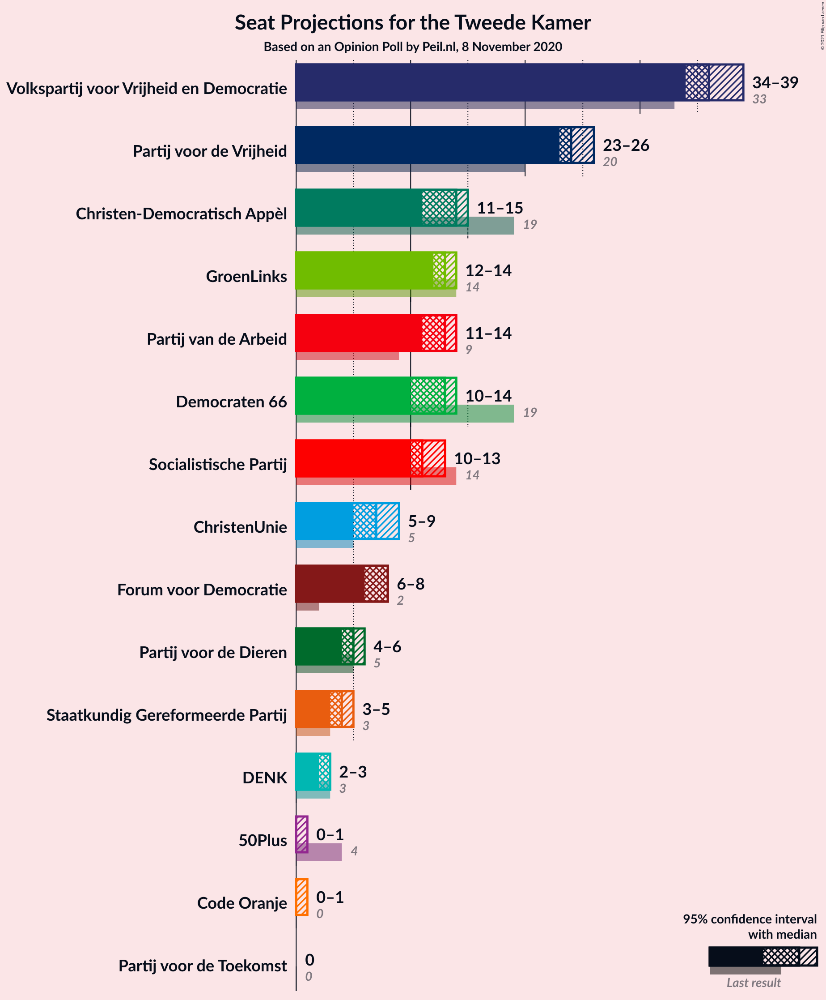

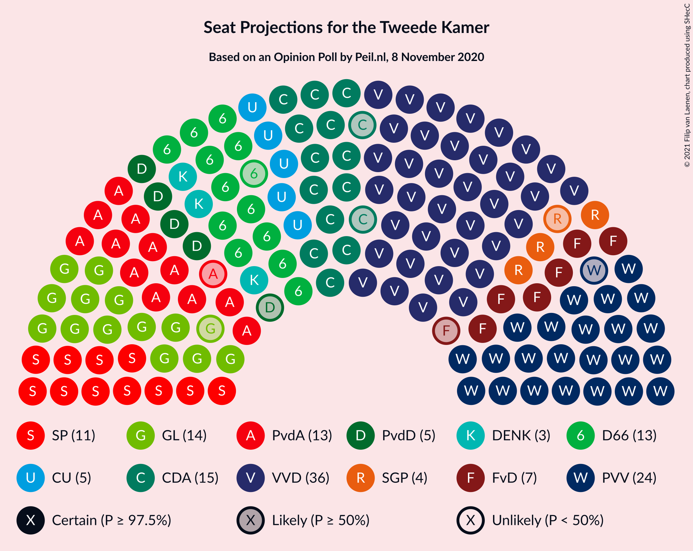

### Confidence Intervals

| Party | Last Result | Median | 80% Confidence Interval | 90% Confidence Interval | 95% Confidence Interval | 99% Confidence Interval |
|:-----:|:-----------:|:------:|:-----------------------:|:-----------------------:|:-----------------------:|:-----------------------:|
| <a href="#volkspartij-voor-vrijheid-en-democratie">Volkspartij voor Vrijheid en Democratie</a> | 33 | 36 | 35–38 |34–38 |34–39 |32–39 |
| <a href="#partij-voor-de-vrijheid">Partij voor de Vrijheid</a> | 20 | 24 | 22–27 |22–27 |22–27 |22–27 |
| <a href="#christen-democratisch-appèl">Christen-Democratisch Appèl</a> | 19 | 13 | 12–14 |12–14 |11–15 |11–16 |
| <a href="#groenlinks">GroenLinks</a> | 14 | 13 | 11–14 |11–15 |11–15 |11–16 |
| <a href="#partij-van-de-arbeid">Partij van de Arbeid</a> | 9 | 13 | 12–14 |11–15 |11–15 |11–15 |
| <a href="#democraten-66">Democraten 66</a> | 19 | 12 | 11–13 |11–14 |10–14 |10–14 |
| <a href="#socialistische-partij">Socialistische Partij</a> | 14 | 12 | 10–13 |10–13 |10–13 |9–13 |
| <a href="#forum-voor-democratie">Forum voor Democratie</a> | 2 | 8 | 7–9 |7–10 |7–10 |6–10 |
| <a href="#christenunie">ChristenUnie</a> | 5 | 7 | 6–8 |6–8 |5–8 |5–9 |
| <a href="#partij-voor-de-dieren">Partij voor de Dieren</a> | 5 | 5 | 4–5 |4–5 |4–6 |4–6 |
| <a href="#staatkundig-gereformeerde-partij">Staatkundig Gereformeerde Partij</a> | 3 | 4 | 3–4 |3–5 |3–5 |3–5 |
| <a href="#denk">DENK</a> | 3 | 3 | 2–4 |2–4 |2–4 |2–4 |
| <a href="#50plus">50Plus</a> | 4 | 1 | 0–1 |0–1 |0–1 |0–1 |
| <a href="#partij-voor-de-toekomst">Partij voor de Toekomst</a> | 0 | 0 | 0 |0 |0 |0 |

### Volkspartij voor Vrijheid en Democratie

*For a full overview of the results for this party, see the [Volkspartij voor Vrijheid en Democratie](party-volkspartijvoorvrijheidendemocratie.html) page.*

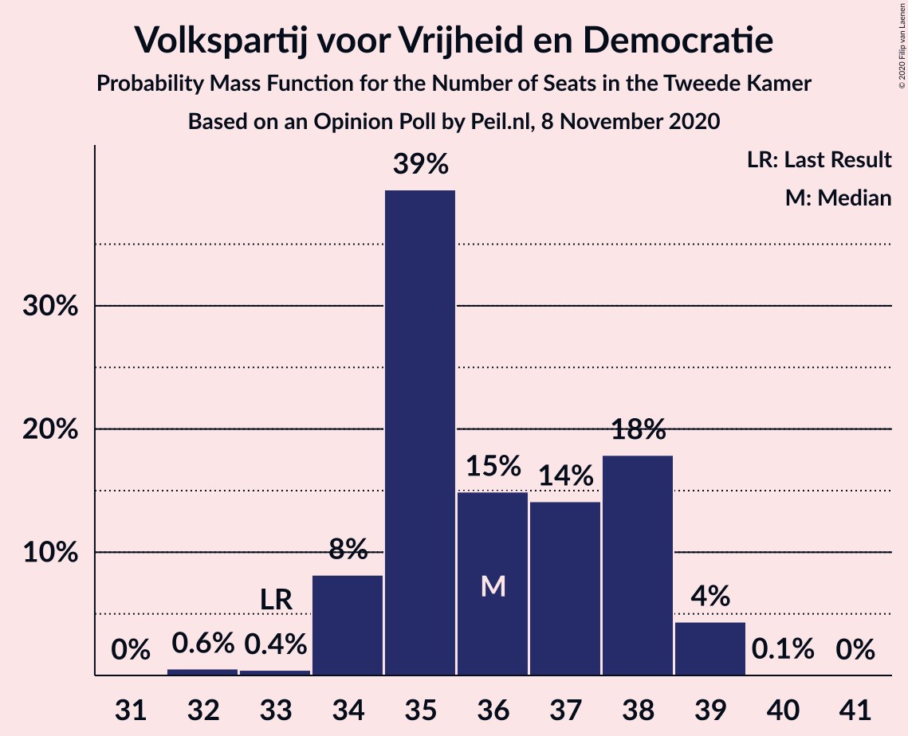

| Number of Seats | Probability | Accumulated | Special Marks |
|:---------------:|:-----------:|:-----------:|:-------------:|
| 32 | 0.6% | 100% |  |
| 33 | 0.4% | 99.4% | Last Result |
| 34 | 8% | 99.0% |  |
| 35 | 39% | 91% |  |
| 36 | 15% | 51% | Median |
| 37 | 14% | 36% |  |
| 38 | 18% | 22% |  |
| 39 | 4% | 4% |  |
| 40 | 0.1% | 0.1% |  |
| 41 | 0% | 0% |  |

### Partij voor de Vrijheid

*For a full overview of the results for this party, see the [Partij voor de Vrijheid](party-partijvoordevrijheid.html) page.*

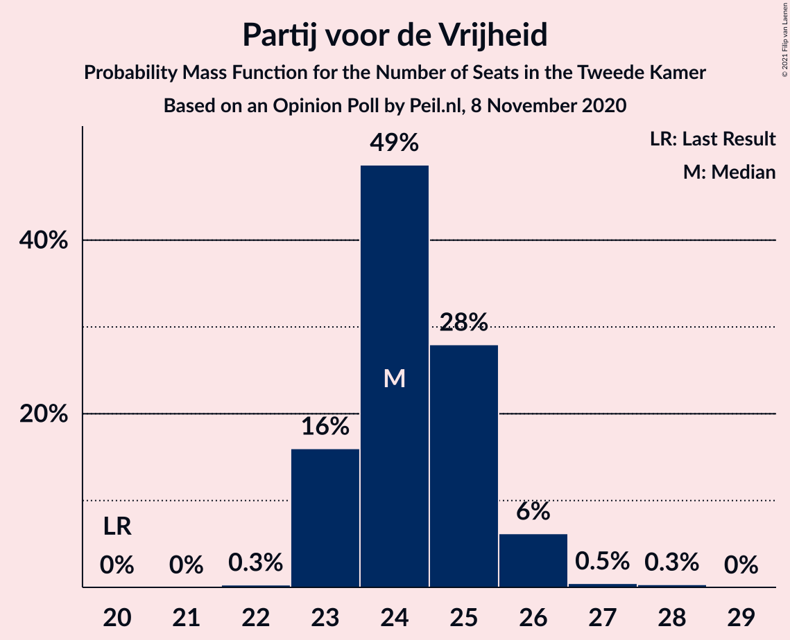

| Number of Seats | Probability | Accumulated | Special Marks |
|:---------------:|:-----------:|:-----------:|:-------------:|
| 20 | 0.1% | 100% | Last Result |
| 21 | 0.2% | 99.9% |  |
| 22 | 12% | 99.7% |  |
| 23 | 18% | 88% |  |
| 24 | 33% | 69% | Median |
| 25 | 15% | 37% |  |
| 26 | 8% | 22% |  |
| 27 | 13% | 14% |  |
| 28 | 0.5% | 0.5% |  |
| 29 | 0% | 0% |  |

### Christen-Democratisch Appèl

*For a full overview of the results for this party, see the [Christen-Democratisch Appèl](party-christen-democratischappèl.html) page.*

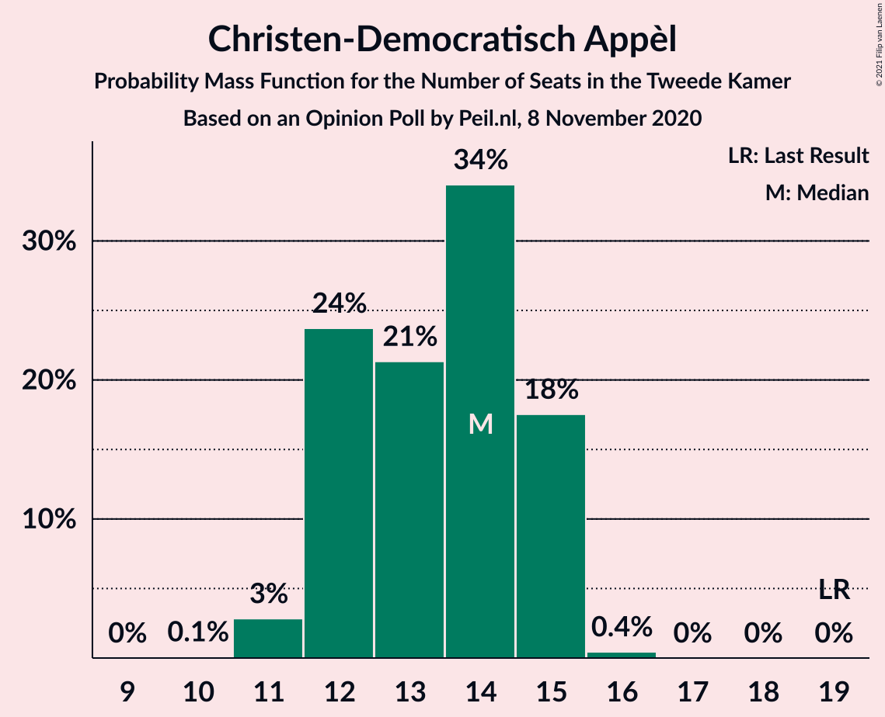

| Number of Seats | Probability | Accumulated | Special Marks |
|:---------------:|:-----------:|:-----------:|:-------------:|
| 10 | 0.2% | 100% |  |
| 11 | 4% | 99.8% |  |
| 12 | 39% | 96% |  |
| 13 | 35% | 57% | Median |
| 14 | 18% | 22% |  |
| 15 | 2% | 3% |  |
| 16 | 1.3% | 2% |  |
| 17 | 0.2% | 0.2% |  |
| 18 | 0% | 0% |  |
| 19 | 0% | 0% | Last Result |

### GroenLinks

*For a full overview of the results for this party, see the [GroenLinks](party-groenlinks.html) page.*

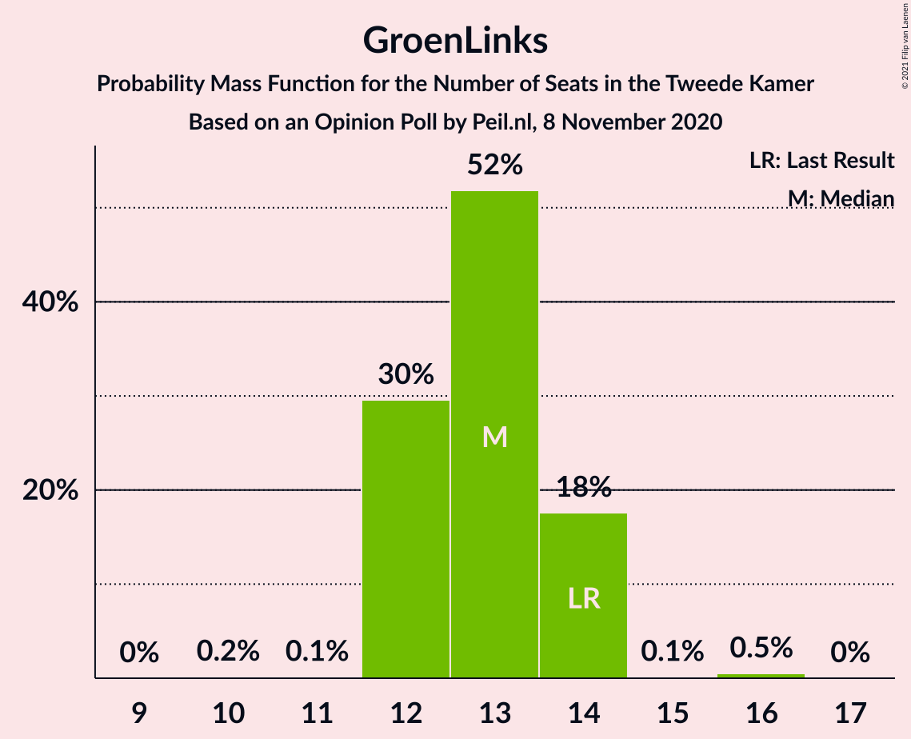

| Number of Seats | Probability | Accumulated | Special Marks |
|:---------------:|:-----------:|:-----------:|:-------------:|
| 10 | 0.1% | 100% |  |
| 11 | 12% | 99.9% |  |
| 12 | 28% | 88% |  |
| 13 | 36% | 61% | Median |
| 14 | 15% | 25% | Last Result |
| 15 | 8% | 10% |  |
| 16 | 0.9% | 1.2% |  |
| 17 | 0.2% | 0.2% |  |
| 18 | 0% | 0% |  |

### Partij van de Arbeid

*For a full overview of the results for this party, see the [Partij van de Arbeid](party-partijvandearbeid.html) page.*

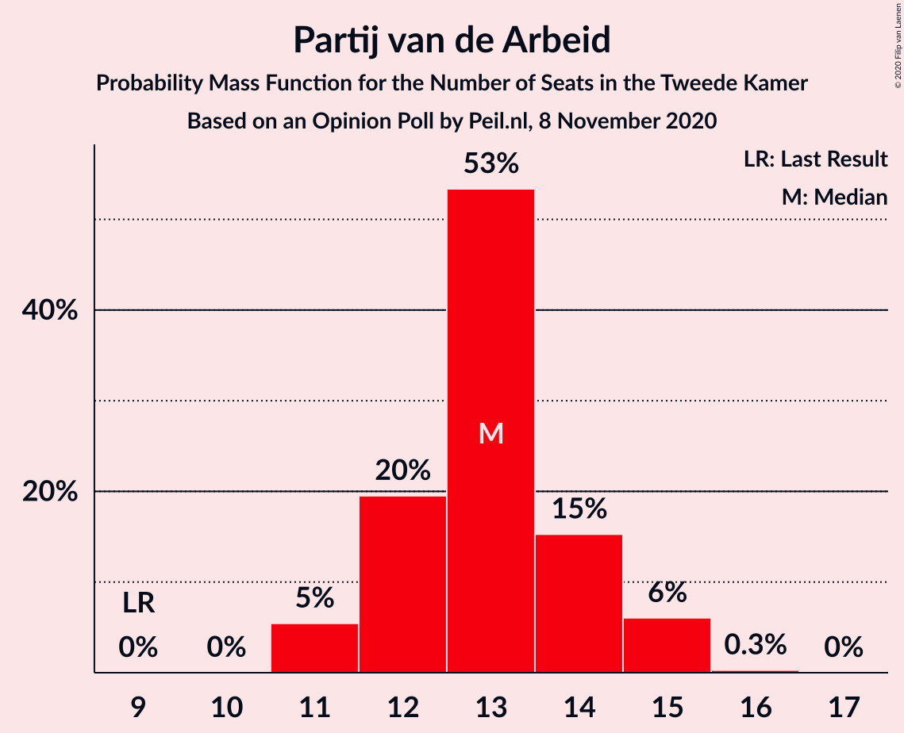

| Number of Seats | Probability | Accumulated | Special Marks |
|:---------------:|:-----------:|:-----------:|:-------------:|
| 9 | 0% | 100% | Last Result |
| 10 | 0% | 100% |  |
| 11 | 5% | 100% |  |
| 12 | 20% | 95% |  |
| 13 | 53% | 75% | Median |
| 14 | 15% | 22% |  |
| 15 | 6% | 6% |  |
| 16 | 0.3% | 0.3% |  |
| 17 | 0% | 0% |  |

### Democraten 66

*For a full overview of the results for this party, see the [Democraten 66](party-democraten66.html) page.*

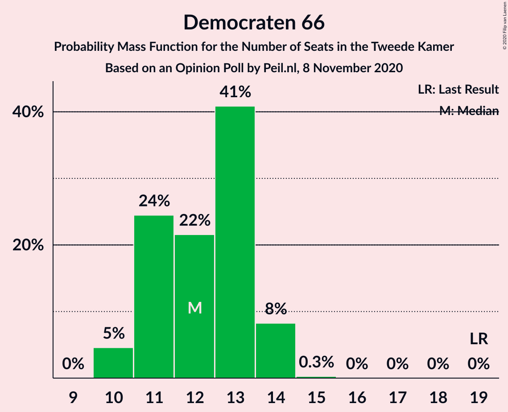

| Number of Seats | Probability | Accumulated | Special Marks |
|:---------------:|:-----------:|:-----------:|:-------------:|
| 10 | 5% | 100% |  |
| 11 | 24% | 95% |  |
| 12 | 22% | 71% | Median |
| 13 | 41% | 49% |  |
| 14 | 8% | 9% |  |
| 15 | 0.3% | 0.3% |  |
| 16 | 0% | 0% |  |
| 17 | 0% | 0% |  |
| 18 | 0% | 0% |  |
| 19 | 0% | 0% | Last Result |

### Socialistische Partij

*For a full overview of the results for this party, see the [Socialistische Partij](party-socialistischepartij.html) page.*

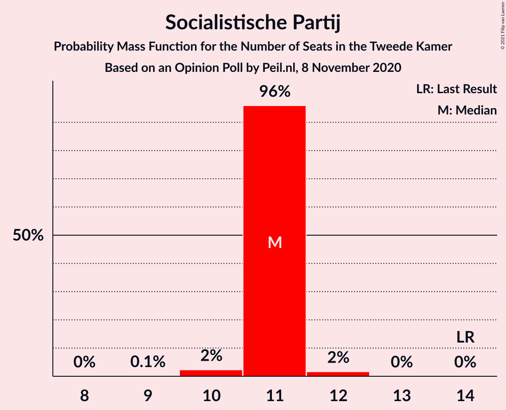

| Number of Seats | Probability | Accumulated | Special Marks |
|:---------------:|:-----------:|:-----------:|:-------------:|
| 9 | 0.7% | 100% |  |
| 10 | 21% | 99.2% |  |
| 11 | 24% | 78% |  |
| 12 | 41% | 54% | Median |
| 13 | 13% | 13% |  |
| 14 | 0% | 0% | Last Result |

### Forum voor Democratie

*For a full overview of the results for this party, see the [Forum voor Democratie](party-forumvoordemocratie.html) page.*

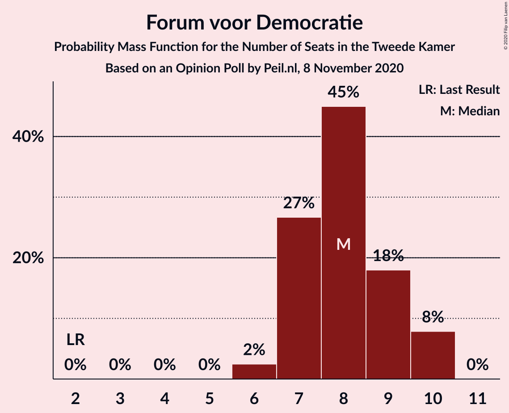

| Number of Seats | Probability | Accumulated | Special Marks |
|:---------------:|:-----------:|:-----------:|:-------------:|
| 2 | 0% | 100% | Last Result |
| 3 | 0% | 100% |  |
| 4 | 0% | 100% |  |
| 5 | 0% | 100% |  |
| 6 | 2% | 100% |  |
| 7 | 27% | 98% |  |
| 8 | 45% | 71% | Median |
| 9 | 18% | 26% |  |
| 10 | 8% | 8% |  |
| 11 | 0% | 0% |  |

### ChristenUnie

*For a full overview of the results for this party, see the [ChristenUnie](party-christenunie.html) page.*

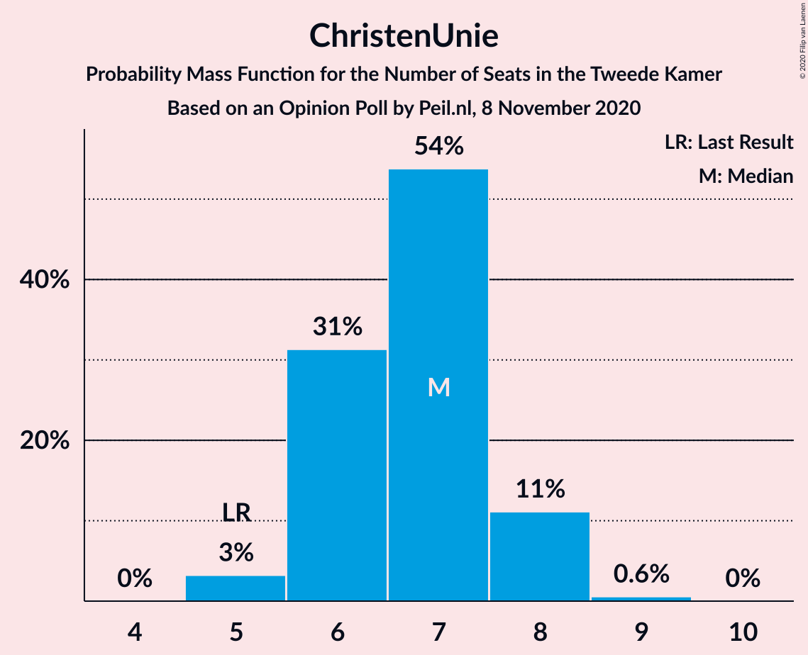

| Number of Seats | Probability | Accumulated | Special Marks |
|:---------------:|:-----------:|:-----------:|:-------------:|
| 5 | 3% | 100% | Last Result |
| 6 | 31% | 97% |  |
| 7 | 54% | 65% | Median |
| 8 | 11% | 12% |  |
| 9 | 0.6% | 0.6% |  |
| 10 | 0% | 0% |  |

### Partij voor de Dieren

*For a full overview of the results for this party, see the [Partij voor de Dieren](party-partijvoordedieren.html) page.*

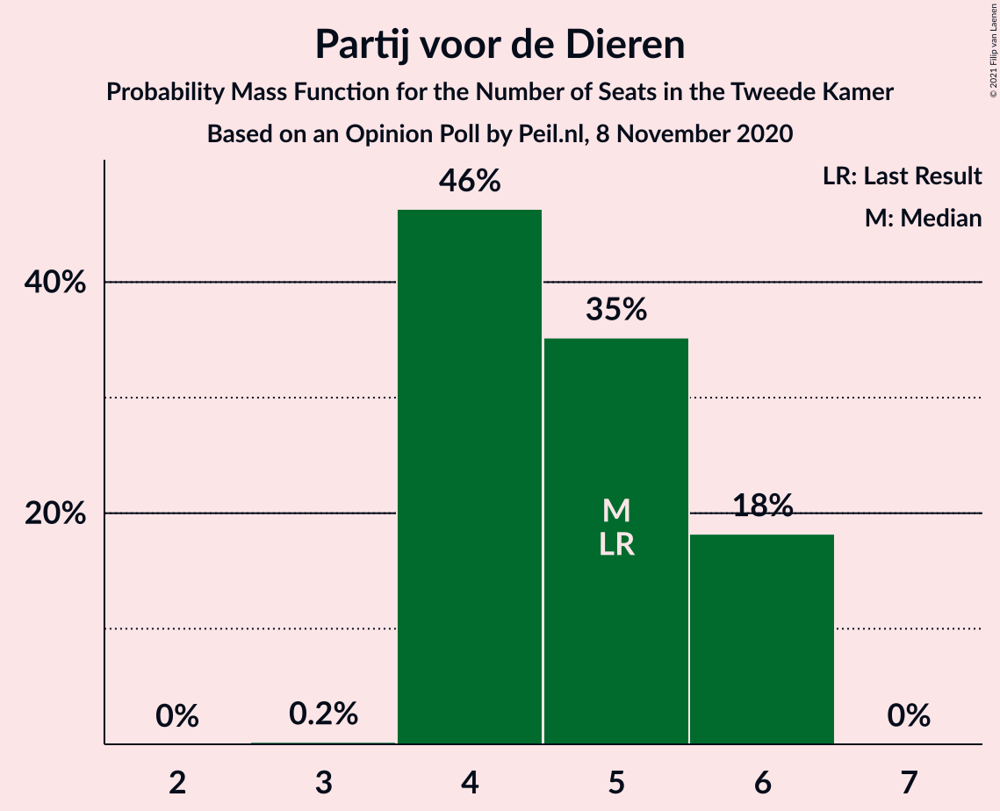

| Number of Seats | Probability | Accumulated | Special Marks |
|:---------------:|:-----------:|:-----------:|:-------------:|
| 3 | 0.3% | 100% |  |
| 4 | 28% | 99.7% |  |
| 5 | 68% | 72% | Last Result, Median |
| 6 | 4% | 4% |  |
| 7 | 0.1% | 0.1% |  |
| 8 | 0% | 0% |  |

### Staatkundig Gereformeerde Partij

*For a full overview of the results for this party, see the [Staatkundig Gereformeerde Partij](party-staatkundiggereformeerdepartij.html) page.*

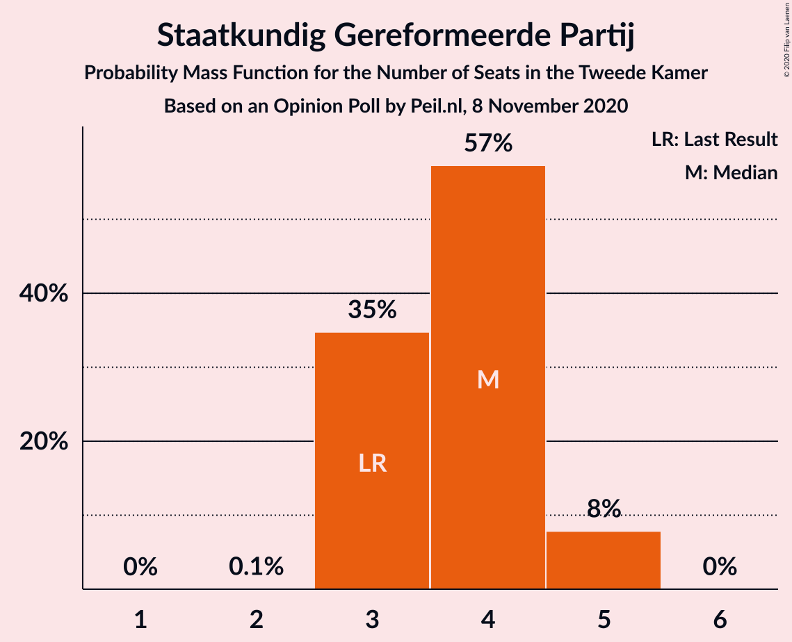

| Number of Seats | Probability | Accumulated | Special Marks |
|:---------------:|:-----------:|:-----------:|:-------------:|
| 2 | 0.1% | 100% |  |
| 3 | 35% | 99.9% | Last Result |
| 4 | 57% | 65% | Median |
| 5 | 8% | 8% |  |
| 6 | 0% | 0% |  |

### DENK

*For a full overview of the results for this party, see the [DENK](party-denk.html) page.*

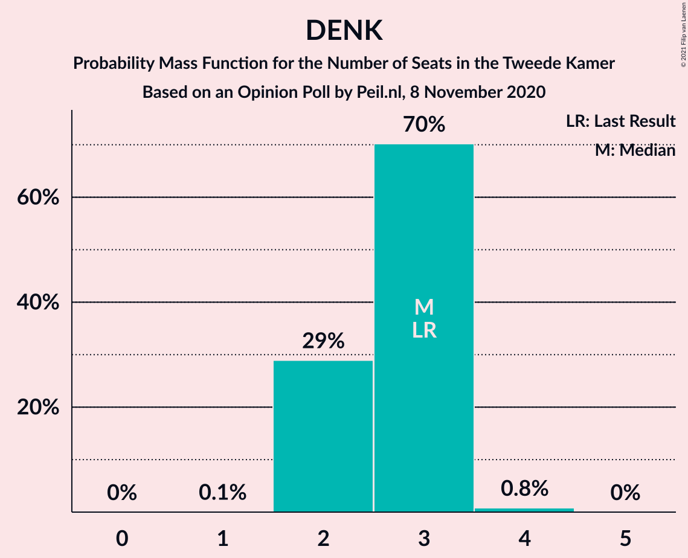

| Number of Seats | Probability | Accumulated | Special Marks |
|:---------------:|:-----------:|:-----------:|:-------------:|
| 1 | 0.2% | 100% |  |
| 2 | 26% | 99.8% |  |
| 3 | 54% | 74% | Last Result, Median |
| 4 | 20% | 20% |  |
| 5 | 0% | 0% |  |

### 50Plus

*For a full overview of the results for this party, see the [50Plus](party-50plus.html) page.*

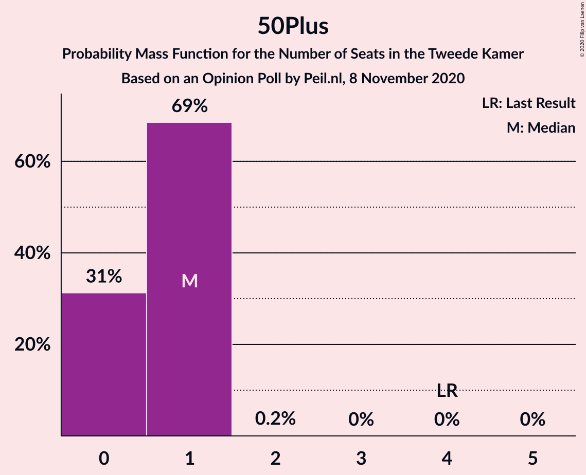

| Number of Seats | Probability | Accumulated | Special Marks |
|:---------------:|:-----------:|:-----------:|:-------------:|
| 0 | 31% | 100% |  |
| 1 | 69% | 69% | Median |
| 2 | 0.2% | 0.2% |  |
| 3 | 0% | 0% |  |
| 4 | 0% | 0% | Last Result |

### Partij voor de Toekomst

*For a full overview of the results for this party, see the [Partij voor de Toekomst](party-partijvoordetoekomst.html) page.*

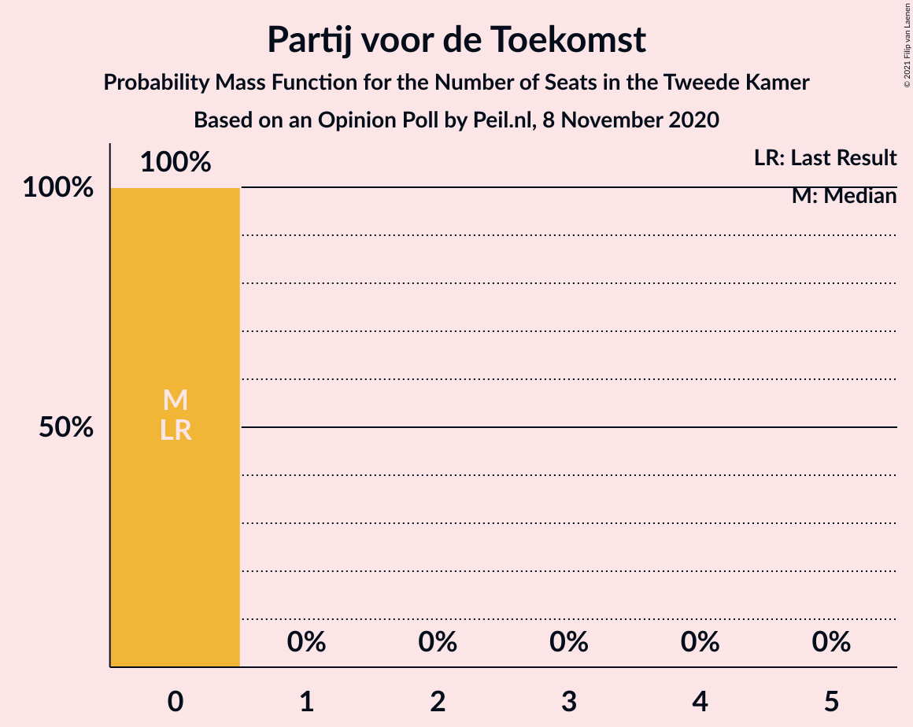

| Number of Seats | Probability | Accumulated | Special Marks |
|:---------------:|:-----------:|:-----------:|:-------------:|
| 0 | 99.9% | 100% | Last Result, Median |
| 1 | 0.1% | 0.1% |  |
| 2 | 0% | 0% |  |

## Coalitions

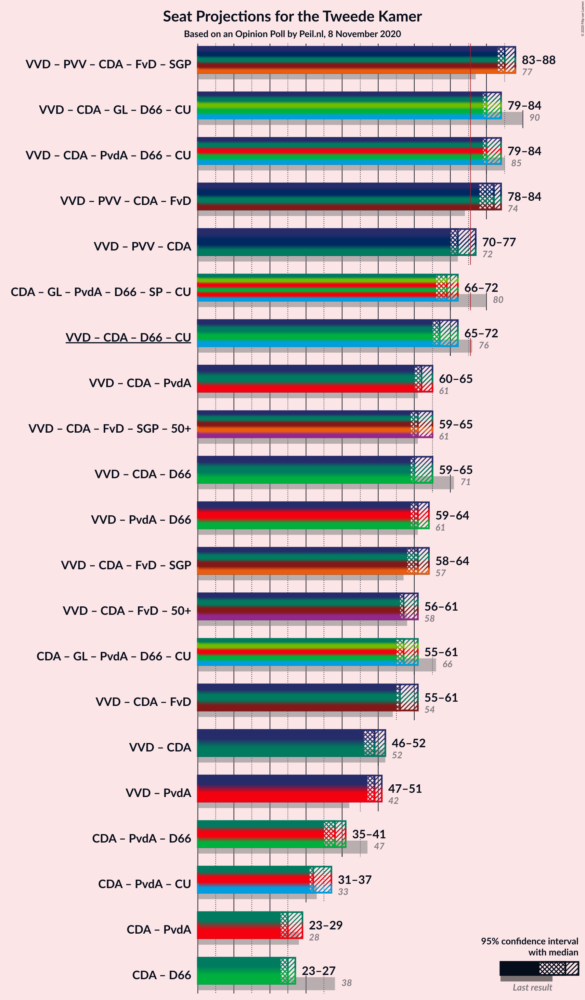

### Confidence Intervals

| Coalition | Last Result | Median | Majority? | 80% Confidence Interval | 90% Confidence Interval | 95% Confidence Interval | 99% Confidence Interval |
|:---------:|:-----------:|:------:|:---------:|:-----------------------:|:-----------------------:|:-----------------------:|:-----------------------:|
| Volkspartij voor Vrijheid en Democratie – Partij voor de Vrijheid – Christen-Democratisch Appèl – Forum voor Democratie – Staatkundig Gereformeerde Partij | 77 | 85 | 100% | 83–87 | 83–88 | 83–88 | 82–90 |
| Volkspartij voor Vrijheid en Democratie – Christen-Democratisch Appèl – GroenLinks – Democraten 66 – ChristenUnie | 90 | 80 | 100% | 79–84 | 79–84 | 79–84 | 77–84 |
| Volkspartij voor Vrijheid en Democratie – Christen-Democratisch Appèl – Partij van de Arbeid – Democraten 66 – ChristenUnie | 85 | 80 | 100% | 79–84 | 79–84 | 79–84 | 78–86 |
| Volkspartij voor Vrijheid en Democratie – Partij voor de Vrijheid – Christen-Democratisch Appèl – Forum voor Democratie | 74 | 82 | 100% | 79–84 | 79–84 | 78–84 | 78–86 |
| Volkspartij voor Vrijheid en Democratie – Partij voor de Vrijheid – Christen-Democratisch Appèl | 72 | 72 | 21% | 71–76 | 71–77 | 70–77 | 70–78 |
| Christen-Democratisch Appèl – GroenLinks – Partij van de Arbeid – Democraten 66 – Socialistische Partij – ChristenUnie | 80 | 69 | 0% | 68–72 | 66–72 | 66–72 | 66–74 |
| Volkspartij voor Vrijheid en Democratie – Christen-Democratisch Appèl – Democraten 66 – ChristenUnie | 76 | 67 | 0% | 66–71 | 65–72 | 65–72 | 64–72 |
| Volkspartij voor Vrijheid en Democratie – Christen-Democratisch Appèl – Partij van de Arbeid | 61 | 62 | 0% | 60–64 | 60–64 | 60–65 | 58–65 |
| Volkspartij voor Vrijheid en Democratie – Christen-Democratisch Appèl – Forum voor Democratie – Staatkundig Gereformeerde Partij – 50Plus | 61 | 61 | 0% | 59–63 | 59–64 | 59–65 | 58–66 |
| Volkspartij voor Vrijheid en Democratie – Christen-Democratisch Appèl – Democraten 66 | 71 | 60 | 0% | 59–63 | 59–65 | 59–65 | 57–65 |
| Volkspartij voor Vrijheid en Democratie – Partij van de Arbeid – Democraten 66 | 61 | 61 | 0% | 59–64 | 59–64 | 59–64 | 57–67 |
| Volkspartij voor Vrijheid en Democratie – Christen-Democratisch Appèl – Forum voor Democratie – Staatkundig Gereformeerde Partij | 57 | 61 | 0% | 59–63 | 59–63 | 58–64 | 58–65 |
| Volkspartij voor Vrijheid en Democratie – Christen-Democratisch Appèl – Forum voor Democratie – 50Plus | 58 | 57 | 0% | 56–60 | 56–60 | 56–61 | 54–62 |
| Christen-Democratisch Appèl – GroenLinks – Partij van de Arbeid – Democraten 66 – ChristenUnie | 66 | 57 | 0% | 55–60 | 55–60 | 55–61 | 55–63 |
| Volkspartij voor Vrijheid en Democratie – Christen-Democratisch Appèl – Forum voor Democratie | 54 | 56 | 0% | 55–59 | 55–59 | 55–61 | 54–61 |
| Volkspartij voor Vrijheid en Democratie – Christen-Democratisch Appèl | 52 | 49 | 0% | 47–51 | 46–51 | 46–52 | 46–52 |
| Volkspartij voor Vrijheid en Democratie – Partij van de Arbeid | 42 | 49 | 0% | 48–50 | 47–51 | 47–51 | 46–53 |
| Christen-Democratisch Appèl – Partij van de Arbeid – Democraten 66 | 47 | 38 | 0% | 36–40 | 36–40 | 35–41 | 35–42 |
| Christen-Democratisch Appèl – Partij van de Arbeid – ChristenUnie | 33 | 32 | 0% | 31–34 | 31–35 | 31–37 | 29–37 |
| Christen-Democratisch Appèl – Partij van de Arbeid | 28 | 25 | 0% | 25–27 | 24–28 | 23–29 | 23–30 |
| Christen-Democratisch Appèl – Democraten 66 | 38 | 25 | 0% | 23–26 | 23–27 | 23–27 | 23–28 |

### Volkspartij voor Vrijheid en Democratie – Partij voor de Vrijheid – Christen-Democratisch Appèl – Forum voor Democratie – Staatkundig Gereformeerde Partij

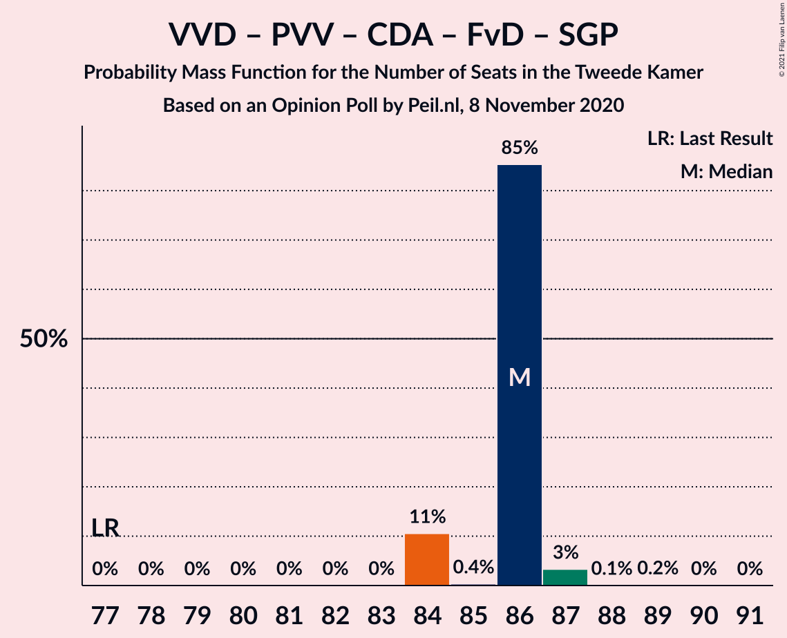

| Number of Seats | Probability | Accumulated | Special Marks |
|:---------------:|:-----------:|:-----------:|:-------------:|
| 77 | 0% | 100% | Last Result |
| 78 | 0% | 100% |  |
| 79 | 0% | 100% |  |
| 80 | 0% | 100% |  |
| 81 | 0.4% | 99.9% |  |
| 82 | 0.8% | 99.6% |  |
| 83 | 31% | 98.7% |  |
| 84 | 10% | 68% |  |
| 85 | 17% | 58% | Median |
| 86 | 27% | 41% |  |
| 87 | 7% | 14% |  |
| 88 | 4% | 6% |  |
| 89 | 0.3% | 2% |  |
| 90 | 1.5% | 2% |  |
| 91 | 0.1% | 0.3% |  |
| 92 | 0.2% | 0.2% |  |
| 93 | 0% | 0% |  |

### Volkspartij voor Vrijheid en Democratie – Christen-Democratisch Appèl – GroenLinks – Democraten 66 – ChristenUnie

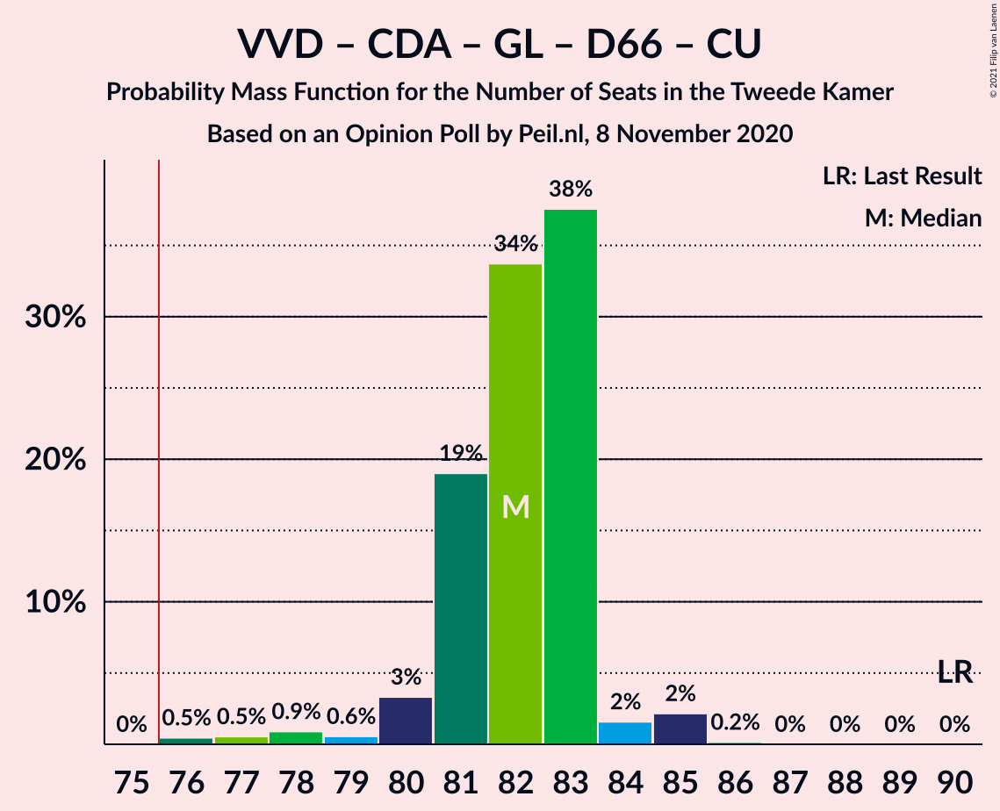

| Number of Seats | Probability | Accumulated | Special Marks |
|:---------------:|:-----------:|:-----------:|:-------------:|
| 76 | 0.2% | 100% | Majority |
| 77 | 0.8% | 99.8% |  |
| 78 | 1.1% | 99.0% |  |
| 79 | 40% | 98% |  |
| 80 | 14% | 58% |  |
| 81 | 10% | 44% | Median |
| 82 | 10% | 34% |  |
| 83 | 14% | 24% |  |
| 84 | 10% | 10% |  |
| 85 | 0.1% | 0.2% |  |
| 86 | 0.1% | 0.1% |  |
| 87 | 0% | 0% |  |
| 88 | 0% | 0% |  |
| 89 | 0% | 0% |  |
| 90 | 0% | 0% | Last Result |

### Volkspartij voor Vrijheid en Democratie – Christen-Democratisch Appèl – Partij van de Arbeid – Democraten 66 – ChristenUnie

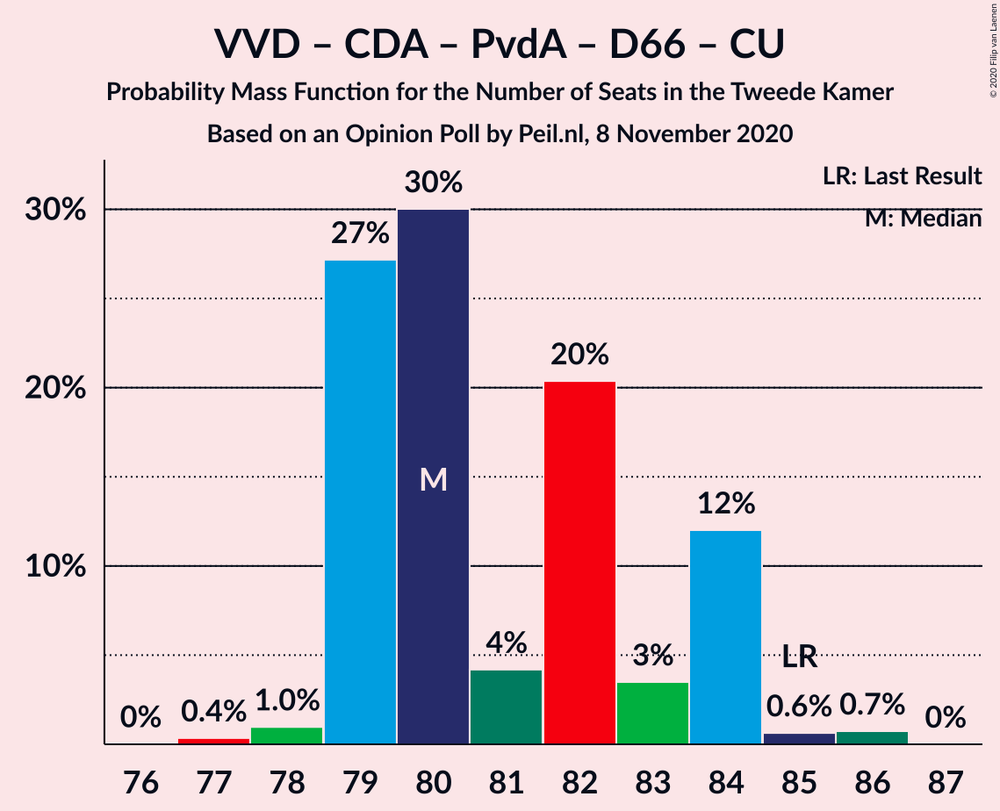

| Number of Seats | Probability | Accumulated | Special Marks |
|:---------------:|:-----------:|:-----------:|:-------------:|
| 77 | 0.4% | 100% |  |
| 78 | 1.0% | 99.6% |  |
| 79 | 27% | 98.6% |  |
| 80 | 30% | 71% |  |
| 81 | 4% | 41% | Median |
| 82 | 20% | 37% |  |
| 83 | 3% | 17% |  |
| 84 | 12% | 13% |  |
| 85 | 0.6% | 1.4% | Last Result |
| 86 | 0.7% | 0.7% |  |
| 87 | 0% | 0% |  |

### Volkspartij voor Vrijheid en Democratie – Partij voor de Vrijheid – Christen-Democratisch Appèl – Forum voor Democratie

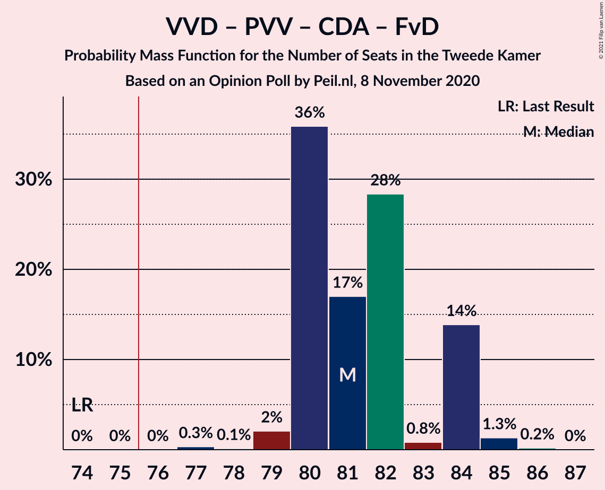

| Number of Seats | Probability | Accumulated | Special Marks |
|:---------------:|:-----------:|:-----------:|:-------------:|
| 74 | 0% | 100% | Last Result |
| 75 | 0% | 100% |  |
| 76 | 0% | 100% | Majority |
| 77 | 0.3% | 100% |  |
| 78 | 3% | 99.7% |  |
| 79 | 28% | 97% |  |
| 80 | 13% | 69% |  |
| 81 | 5% | 56% | Median |
| 82 | 24% | 51% |  |
| 83 | 15% | 27% |  |
| 84 | 10% | 12% |  |
| 85 | 0.3% | 2% |  |
| 86 | 2% | 2% |  |
| 87 | 0% | 0.3% |  |
| 88 | 0.3% | 0.3% |  |
| 89 | 0% | 0% |  |

### Volkspartij voor Vrijheid en Democratie – Partij voor de Vrijheid – Christen-Democratisch Appèl

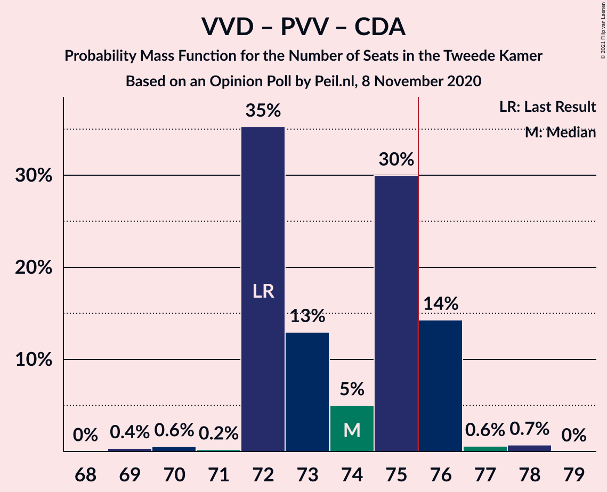

| Number of Seats | Probability | Accumulated | Special Marks |
|:---------------:|:-----------:|:-----------:|:-------------:|
| 69 | 0.1% | 100% |  |
| 70 | 3% | 99.9% |  |
| 71 | 37% | 97% |  |
| 72 | 11% | 60% | Last Result |
| 73 | 3% | 49% | Median |
| 74 | 12% | 46% |  |
| 75 | 13% | 34% |  |
| 76 | 15% | 21% | Majority |
| 77 | 5% | 6% |  |
| 78 | 0.4% | 0.6% |  |
| 79 | 0.2% | 0.2% |  |
| 80 | 0% | 0% |  |

### Christen-Democratisch Appèl – GroenLinks – Partij van de Arbeid – Democraten 66 – Socialistische Partij – ChristenUnie

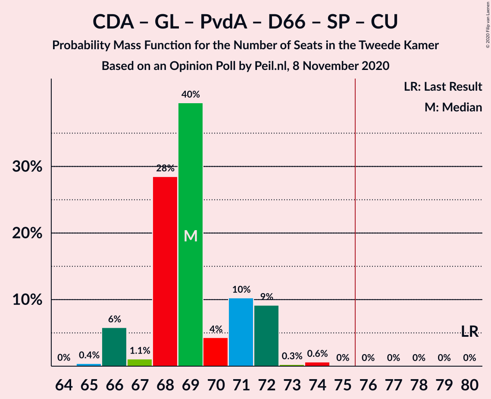

| Number of Seats | Probability | Accumulated | Special Marks |
|:---------------:|:-----------:|:-----------:|:-------------:|
| 64 | 0% | 100% |  |
| 65 | 0.4% | 99.9% |  |
| 66 | 6% | 99.5% |  |
| 67 | 1.1% | 94% |  |
| 68 | 28% | 93% |  |
| 69 | 40% | 64% |  |
| 70 | 4% | 25% | Median |
| 71 | 10% | 20% |  |
| 72 | 9% | 10% |  |
| 73 | 0.3% | 0.9% |  |
| 74 | 0.6% | 0.6% |  |
| 75 | 0% | 0% |  |
| 76 | 0% | 0% | Majority |
| 77 | 0% | 0% |  |
| 78 | 0% | 0% |  |
| 79 | 0% | 0% |  |
| 80 | 0% | 0% | Last Result |

### Volkspartij voor Vrijheid en Democratie – Christen-Democratisch Appèl – Democraten 66 – ChristenUnie

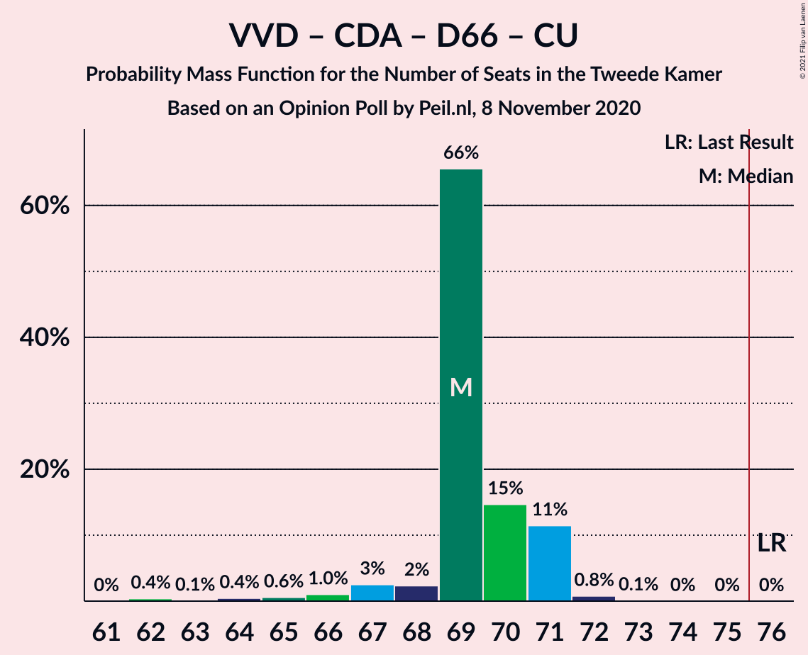

| Number of Seats | Probability | Accumulated | Special Marks |
|:---------------:|:-----------:|:-----------:|:-------------:|
| 63 | 0.3% | 100% |  |
| 64 | 1.0% | 99.7% |  |
| 65 | 6% | 98.7% |  |
| 66 | 25% | 93% |  |
| 67 | 25% | 68% |  |
| 68 | 6% | 43% | Median |
| 69 | 11% | 37% |  |
| 70 | 14% | 26% |  |
| 71 | 6% | 12% |  |
| 72 | 6% | 6% |  |
| 73 | 0% | 0% |  |
| 74 | 0% | 0% |  |
| 75 | 0% | 0% |  |
| 76 | 0% | 0% | Last Result, Majority |

### Volkspartij voor Vrijheid en Democratie – Christen-Democratisch Appèl – Partij van de Arbeid

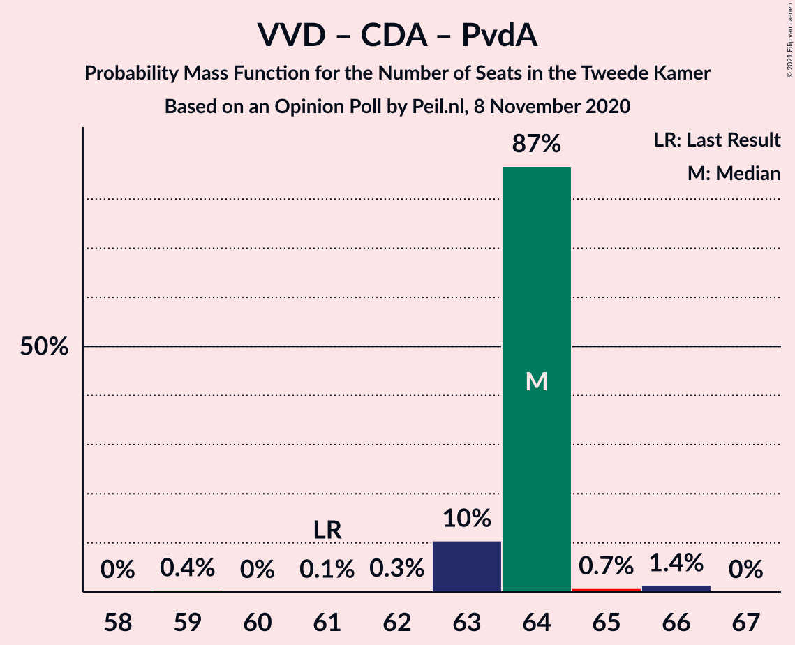

| Number of Seats | Probability | Accumulated | Special Marks |
|:---------------:|:-----------:|:-----------:|:-------------:|
| 58 | 0.8% | 100% |  |
| 59 | 1.0% | 99.2% |  |
| 60 | 27% | 98% |  |
| 61 | 5% | 71% | Last Result |
| 62 | 36% | 66% | Median |
| 63 | 17% | 30% |  |
| 64 | 10% | 13% |  |
| 65 | 3% | 3% |  |
| 66 | 0.3% | 0.4% |  |
| 67 | 0.1% | 0.1% |  |
| 68 | 0% | 0% |  |

### Volkspartij voor Vrijheid en Democratie – Christen-Democratisch Appèl – Forum voor Democratie – Staatkundig Gereformeerde Partij – 50Plus

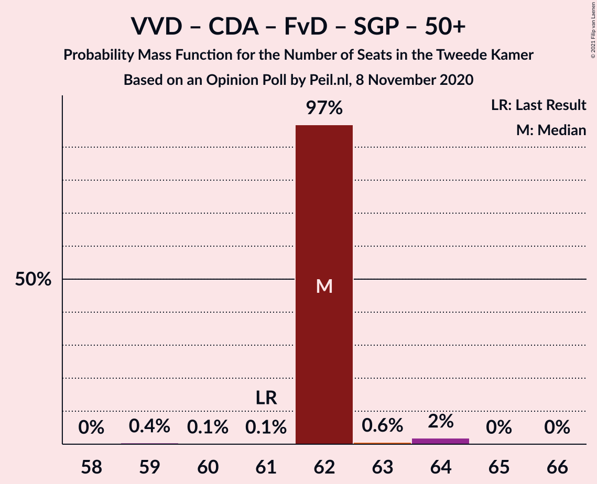

| Number of Seats | Probability | Accumulated | Special Marks |
|:---------------:|:-----------:|:-----------:|:-------------:|
| 57 | 0.3% | 100% |  |
| 58 | 0.3% | 99.7% |  |
| 59 | 17% | 99.4% |  |
| 60 | 30% | 82% |  |
| 61 | 4% | 52% | Last Result |
| 62 | 14% | 48% | Median |
| 63 | 28% | 35% |  |
| 64 | 4% | 7% |  |
| 65 | 1.3% | 3% |  |
| 66 | 1.4% | 2% |  |
| 67 | 0.1% | 0.1% |  |
| 68 | 0% | 0% |  |

### Volkspartij voor Vrijheid en Democratie – Christen-Democratisch Appèl – Democraten 66

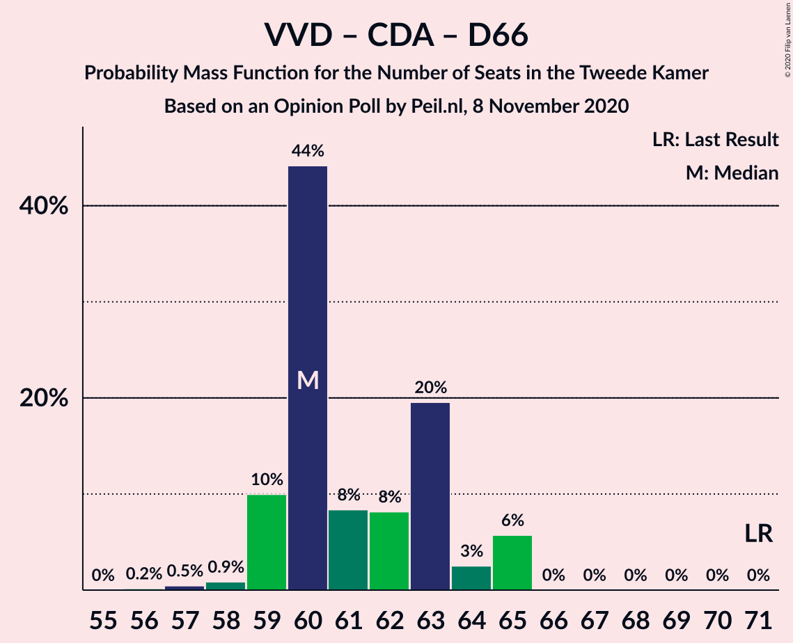

| Number of Seats | Probability | Accumulated | Special Marks |
|:---------------:|:-----------:|:-----------:|:-------------:|
| 56 | 0.2% | 100% |  |
| 57 | 0.5% | 99.8% |  |
| 58 | 0.9% | 99.4% |  |
| 59 | 10% | 98.5% |  |
| 60 | 44% | 89% |  |
| 61 | 8% | 44% | Median |
| 62 | 8% | 36% |  |
| 63 | 20% | 28% |  |
| 64 | 3% | 8% |  |
| 65 | 6% | 6% |  |
| 66 | 0% | 0% |  |
| 67 | 0% | 0% |  |
| 68 | 0% | 0% |  |
| 69 | 0% | 0% |  |
| 70 | 0% | 0% |  |
| 71 | 0% | 0% | Last Result |

### Volkspartij voor Vrijheid en Democratie – Partij van de Arbeid – Democraten 66

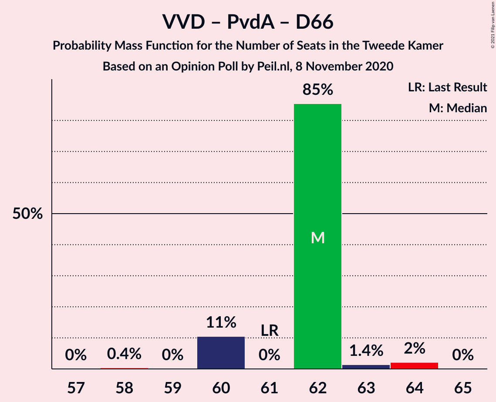

| Number of Seats | Probability | Accumulated | Special Marks |
|:---------------:|:-----------:|:-----------:|:-------------:|
| 56 | 0.2% | 100% |  |
| 57 | 0.4% | 99.8% |  |
| 58 | 0.5% | 99.4% |  |
| 59 | 17% | 98.9% |  |
| 60 | 6% | 82% |  |
| 61 | 35% | 75% | Last Result, Median |
| 62 | 24% | 40% |  |
| 63 | 5% | 17% |  |
| 64 | 10% | 11% |  |
| 65 | 0.6% | 1.4% |  |
| 66 | 0.1% | 0.8% |  |
| 67 | 0.7% | 0.7% |  |
| 68 | 0% | 0% |  |

### Volkspartij voor Vrijheid en Democratie – Christen-Democratisch Appèl – Forum voor Democratie – Staatkundig Gereformeerde Partij

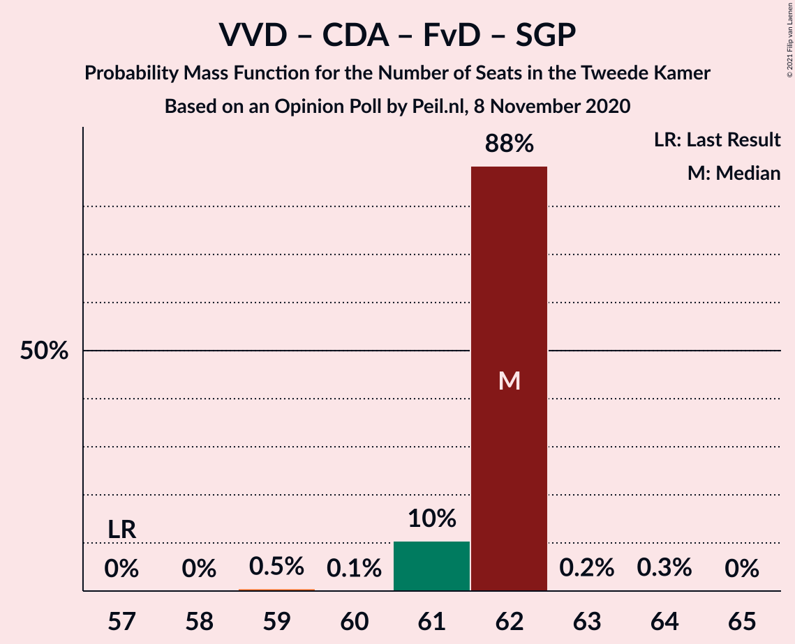

| Number of Seats | Probability | Accumulated | Special Marks |
|:---------------:|:-----------:|:-----------:|:-------------:|
| 56 | 0.1% | 100% |  |
| 57 | 0.3% | 99.9% | Last Result |
| 58 | 3% | 99.7% |  |
| 59 | 42% | 96% |  |
| 60 | 4% | 54% |  |
| 61 | 11% | 50% | Median |
| 62 | 25% | 39% |  |
| 63 | 12% | 15% |  |
| 64 | 1.0% | 3% |  |
| 65 | 2% | 2% |  |
| 66 | 0.1% | 0.1% |  |
| 67 | 0% | 0% |  |

### Volkspartij voor Vrijheid en Democratie – Christen-Democratisch Appèl – Forum voor Democratie – 50Plus

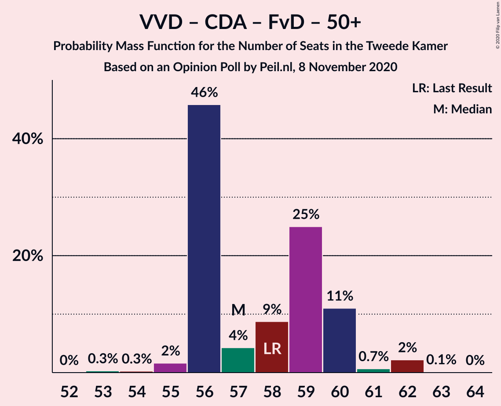

| Number of Seats | Probability | Accumulated | Special Marks |
|:---------------:|:-----------:|:-----------:|:-------------:|
| 53 | 0.3% | 100% |  |
| 54 | 0.3% | 99.7% |  |
| 55 | 2% | 99.4% |  |
| 56 | 46% | 98% |  |
| 57 | 4% | 52% |  |
| 58 | 9% | 48% | Last Result, Median |
| 59 | 25% | 39% |  |
| 60 | 11% | 14% |  |
| 61 | 0.7% | 3% |  |
| 62 | 2% | 2% |  |
| 63 | 0.1% | 0.1% |  |
| 64 | 0% | 0% |  |

### Christen-Democratisch Appèl – GroenLinks – Partij van de Arbeid – Democraten 66 – ChristenUnie

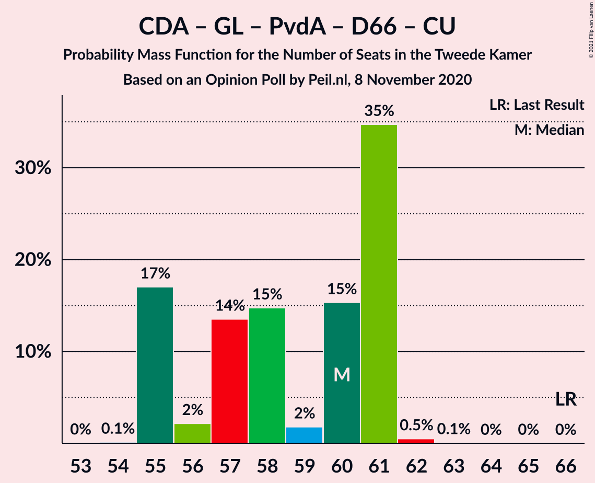

| Number of Seats | Probability | Accumulated | Special Marks |
|:---------------:|:-----------:|:-----------:|:-------------:|
| 53 | 0.1% | 100% |  |
| 54 | 0.4% | 99.9% |  |
| 55 | 11% | 99.6% |  |
| 56 | 3% | 88% |  |
| 57 | 42% | 85% |  |
| 58 | 20% | 43% | Median |
| 59 | 8% | 23% |  |
| 60 | 11% | 16% |  |
| 61 | 4% | 5% |  |
| 62 | 0.2% | 0.9% |  |
| 63 | 0.7% | 0.7% |  |
| 64 | 0% | 0% |  |
| 65 | 0% | 0% |  |
| 66 | 0% | 0% | Last Result |

### Volkspartij voor Vrijheid en Democratie – Christen-Democratisch Appèl – Forum voor Democratie

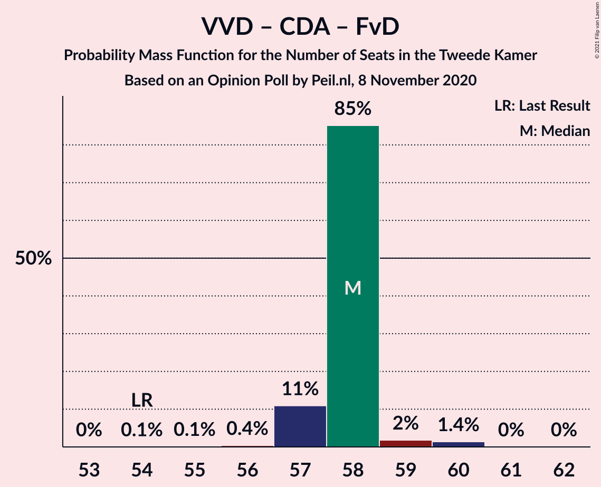

| Number of Seats | Probability | Accumulated | Special Marks |
|:---------------:|:-----------:|:-----------:|:-------------:|
| 52 | 0.1% | 100% |  |
| 53 | 0.3% | 99.9% |  |
| 54 | 0.5% | 99.6% | Last Result |
| 55 | 32% | 99.1% |  |
| 56 | 18% | 67% |  |
| 57 | 10% | 49% | Median |
| 58 | 14% | 40% |  |
| 59 | 23% | 26% |  |
| 60 | 0.5% | 3% |  |
| 61 | 3% | 3% |  |
| 62 | 0.2% | 0.2% |  |
| 63 | 0% | 0% |  |

### Volkspartij voor Vrijheid en Democratie – Christen-Democratisch Appèl

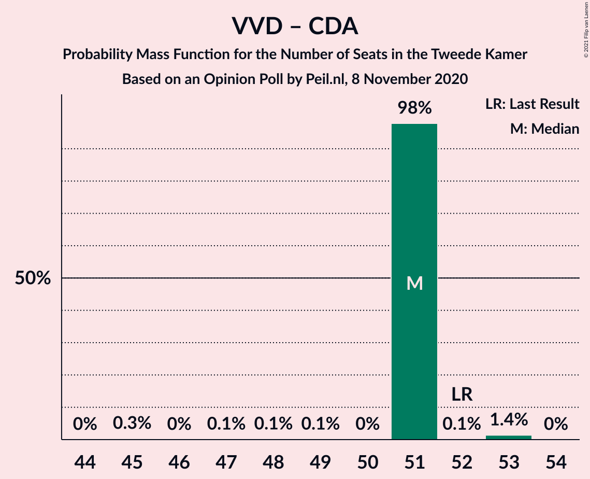

| Number of Seats | Probability | Accumulated | Special Marks |
|:---------------:|:-----------:|:-----------:|:-------------:|
| 45 | 0.1% | 100% |  |
| 46 | 7% | 99.9% |  |
| 47 | 23% | 93% |  |
| 48 | 5% | 70% |  |
| 49 | 34% | 64% | Median |
| 50 | 7% | 30% |  |
| 51 | 20% | 23% |  |
| 52 | 3% | 3% | Last Result |
| 53 | 0.2% | 0.2% |  |
| 54 | 0% | 0% |  |

### Volkspartij voor Vrijheid en Democratie – Partij van de Arbeid

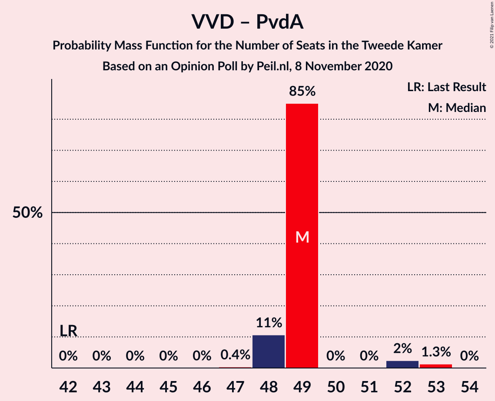

| Number of Seats | Probability | Accumulated | Special Marks |
|:---------------:|:-----------:|:-----------:|:-------------:|
| 42 | 0% | 100% | Last Result |
| 43 | 0% | 100% |  |
| 44 | 0% | 100% |  |
| 45 | 0% | 100% |  |
| 46 | 1.5% | 99.9% |  |
| 47 | 4% | 98% |  |
| 48 | 41% | 95% |  |
| 49 | 12% | 54% | Median |
| 50 | 33% | 42% |  |
| 51 | 8% | 10% |  |
| 52 | 0.7% | 2% |  |
| 53 | 0.9% | 1.0% |  |
| 54 | 0% | 0.1% |  |
| 55 | 0% | 0% |  |

### Christen-Democratisch Appèl – Partij van de Arbeid – Democraten 66

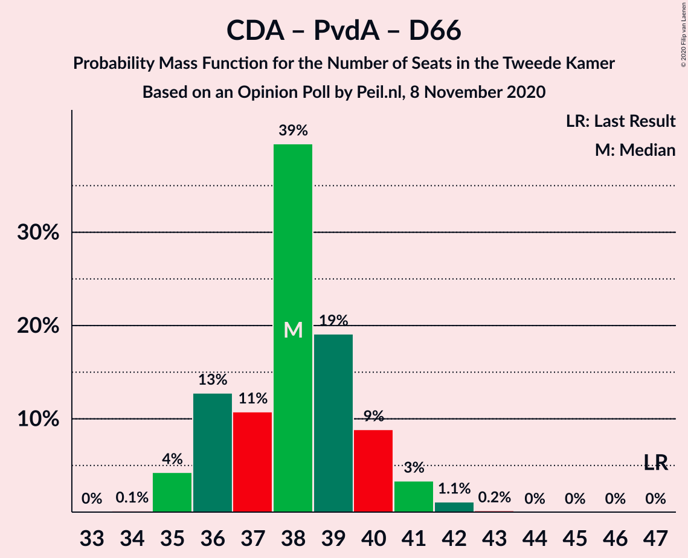

| Number of Seats | Probability | Accumulated | Special Marks |
|:---------------:|:-----------:|:-----------:|:-------------:|
| 34 | 0.1% | 100% |  |
| 35 | 4% | 99.8% |  |
| 36 | 13% | 96% |  |
| 37 | 11% | 83% |  |
| 38 | 39% | 72% | Median |
| 39 | 19% | 33% |  |
| 40 | 9% | 13% |  |
| 41 | 3% | 5% |  |
| 42 | 1.1% | 1.3% |  |
| 43 | 0.2% | 0.2% |  |
| 44 | 0% | 0% |  |
| 45 | 0% | 0% |  |
| 46 | 0% | 0% |  |
| 47 | 0% | 0% | Last Result |

### Christen-Democratisch Appèl – Partij van de Arbeid – ChristenUnie

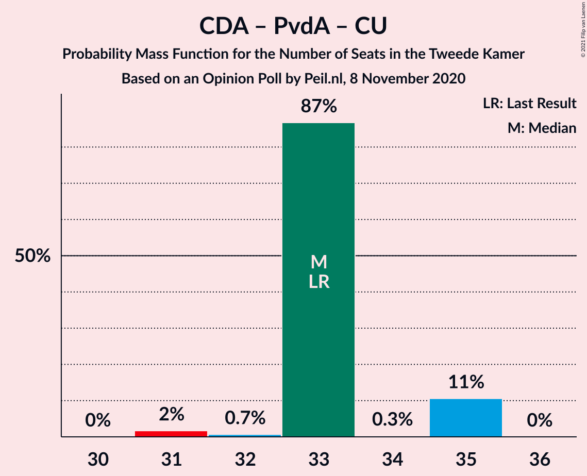

| Number of Seats | Probability | Accumulated | Special Marks |
|:---------------:|:-----------:|:-----------:|:-------------:|
| 29 | 0.8% | 100% |  |
| 30 | 0.2% | 99.1% |  |
| 31 | 29% | 99.0% |  |
| 32 | 30% | 70% |  |
| 33 | 8% | 39% | Last Result, Median |
| 34 | 23% | 31% |  |
| 35 | 4% | 8% |  |
| 36 | 1.2% | 4% |  |
| 37 | 2% | 3% |  |
| 38 | 0.3% | 0.3% |  |
| 39 | 0% | 0% |  |

### Christen-Democratisch Appèl – Partij van de Arbeid

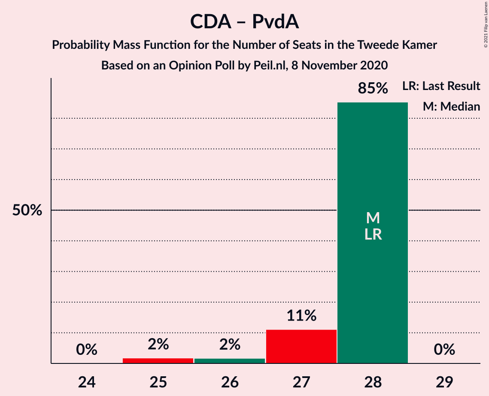

| Number of Seats | Probability | Accumulated | Special Marks |
|:---------------:|:-----------:|:-----------:|:-------------:|
| 23 | 5% | 100% |  |
| 24 | 3% | 95% |  |
| 25 | 46% | 93% |  |
| 26 | 18% | 47% | Median |
| 27 | 21% | 29% |  |
| 28 | 4% | 8% | Last Result |
| 29 | 4% | 4% |  |
| 30 | 0.5% | 0.5% |  |
| 31 | 0% | 0% |  |

### Christen-Democratisch Appèl – Democraten 66

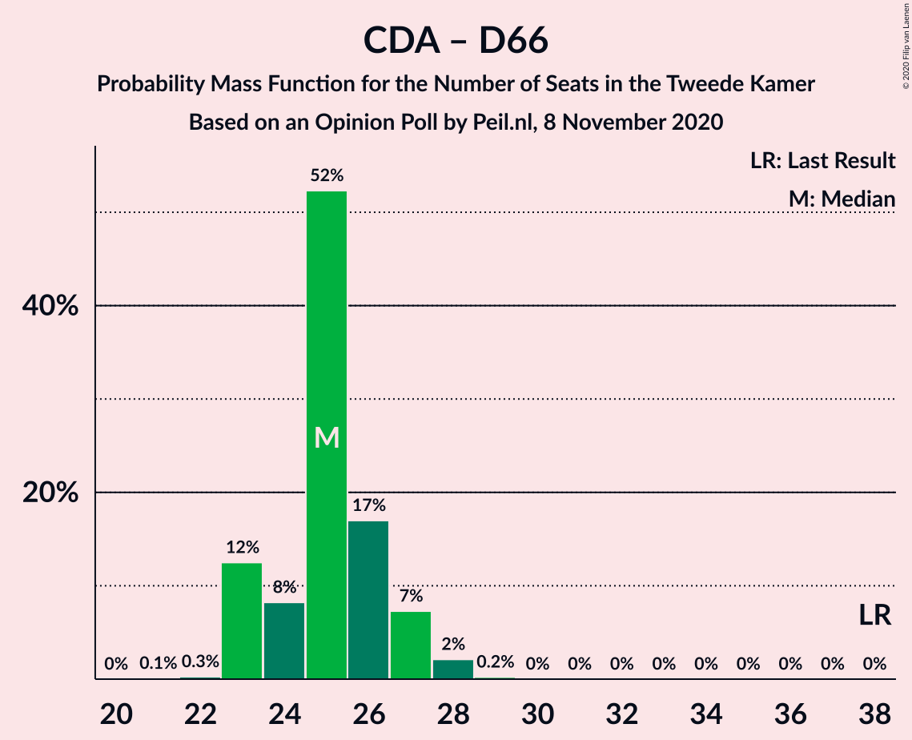

| Number of Seats | Probability | Accumulated | Special Marks |
|:---------------:|:-----------:|:-----------:|:-------------:|
| 21 | 0.1% | 100% |  |
| 22 | 0.3% | 99.9% |  |
| 23 | 12% | 99.6% |  |
| 24 | 8% | 87% |  |
| 25 | 52% | 79% | Median |
| 26 | 17% | 27% |  |
| 27 | 7% | 10% |  |
| 28 | 2% | 2% |  |
| 29 | 0.2% | 0.2% |  |
| 30 | 0% | 0% |  |
| 31 | 0% | 0% |  |
| 32 | 0% | 0% |  |
| 33 | 0% | 0% |  |
| 34 | 0% | 0% |  |
| 35 | 0% | 0% |  |
| 36 | 0% | 0% |  |
| 37 | 0% | 0% |  |
| 38 | 0% | 0% | Last Result |

## Technical Information

### Opinion Poll

+ **Polling firm:** Peil.nl
+ **Commissioner(s):** —
+ **Fieldwork period:** 8 November 2020

### Calculations

+ **Sample size:** 3000
+ **Simulations done:** 1,048,576
+ **Error estimate:** 2.07%

