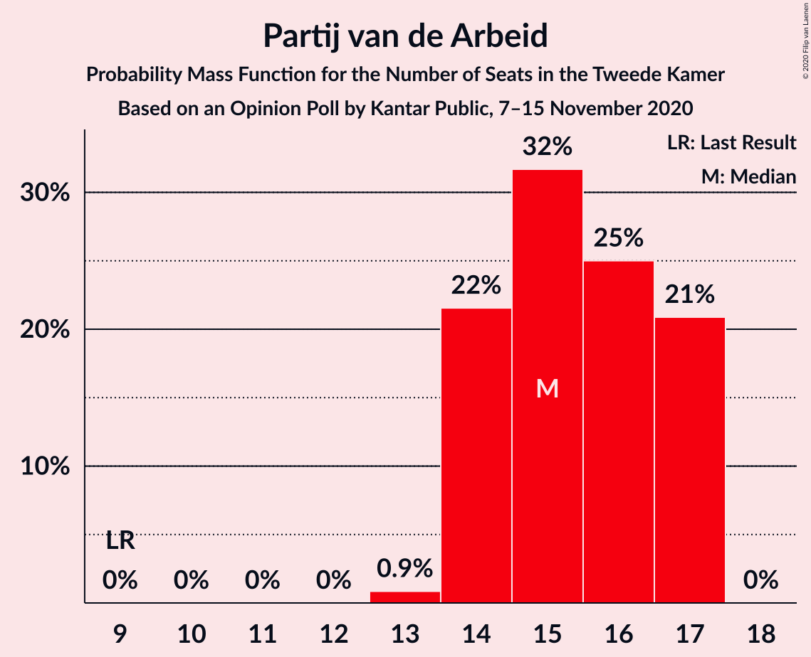
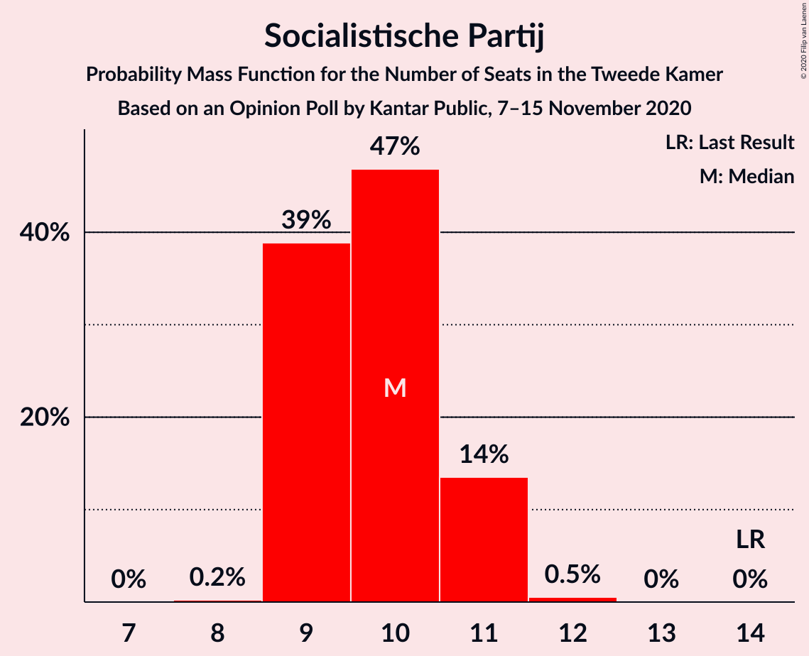
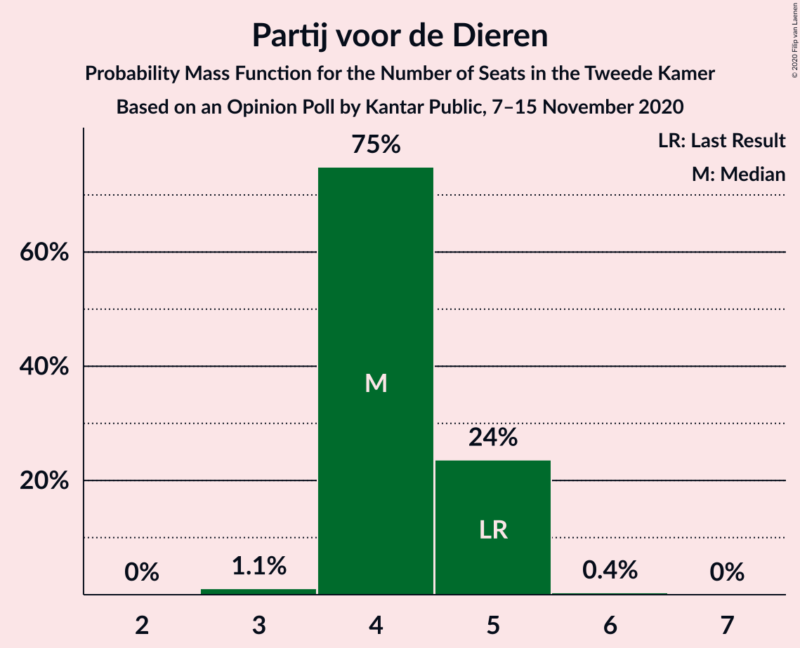
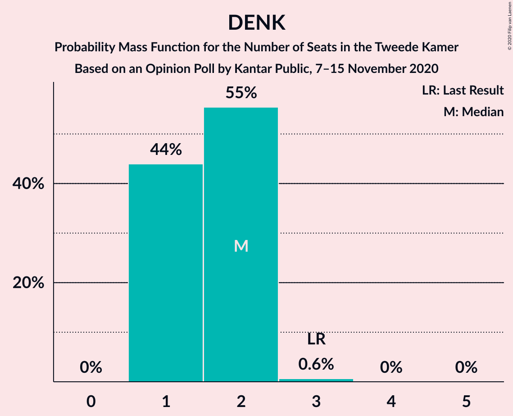
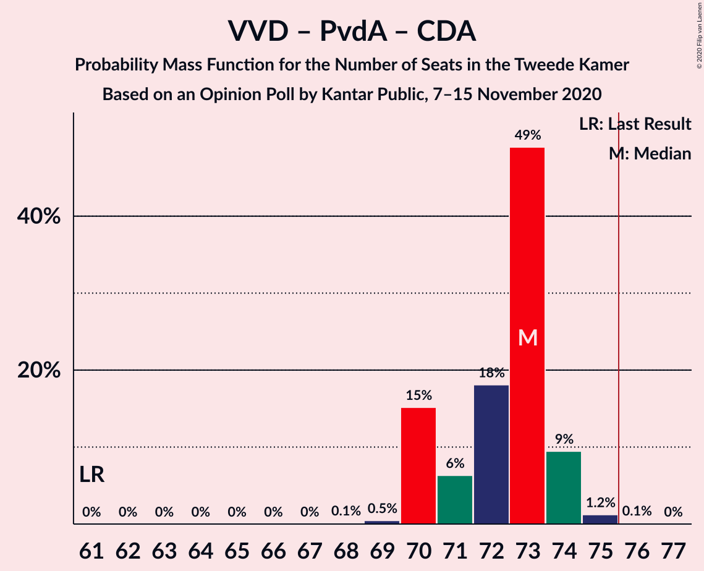
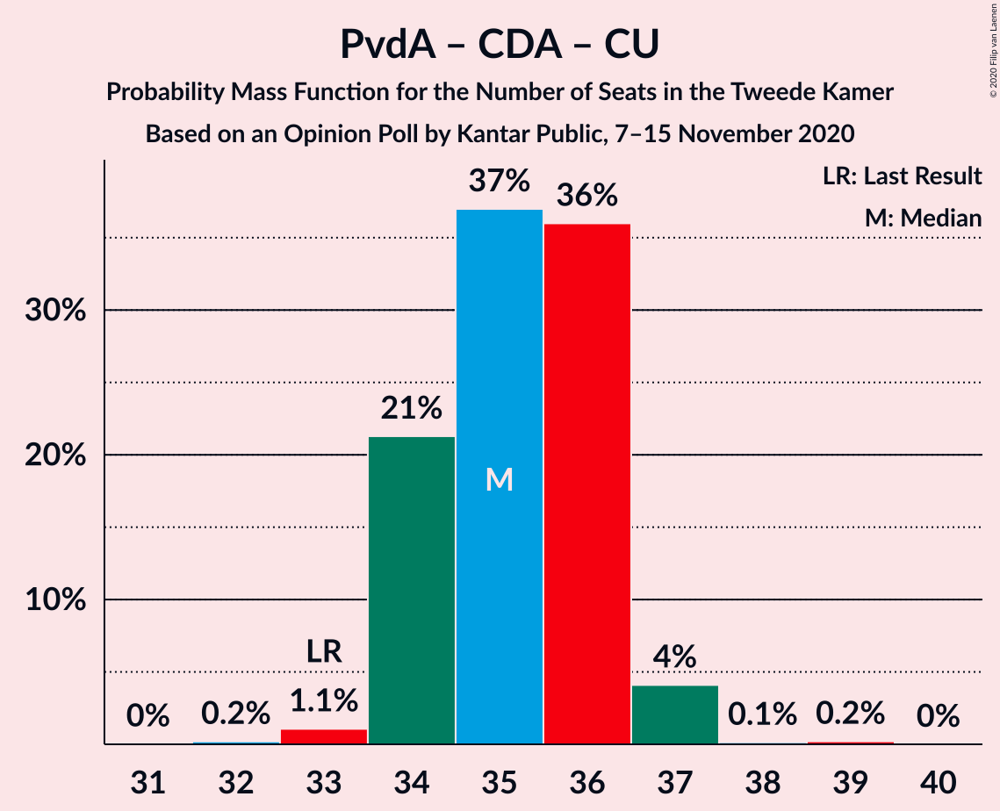

# Opinion Poll by Kantar Public, 7–15 November 2020

<a href="#voting-intentions">Voting Intentions</a> | <a href="#seats">Seats</a> | <a href="#coalitions">Coalitions</a> | <a href="#technical-information">Technical Information</a>

## Voting Intentions

### Confidence Intervals

| Party | Last Result | Poll Result | 80% Confidence Interval | 90% Confidence Interval | 95% Confidence Interval | 99% Confidence Interval |
|:-----:|:-----------:|:-----------:|:-----------------------:|:-----------------------:|:-----------------------:|:-----------------------:|
| Volkspartij voor Vrijheid en Democratie | 21.3% | 28.0% | 27.2–28.9% |26.9–29.1% |26.7–29.3% |26.3–29.7% |
| Partij voor de Vrijheid | 13.1% | 13.1% | 12.5–13.8% |12.3–13.9% |12.1–14.1% |11.9–14.4% |
| Partij van de Arbeid | 5.7% | 9.9% | 9.4–10.5% |9.2–10.7% |9.1–10.8% |8.8–11.1% |
| Christen-Democratisch Appèl | 12.4% | 9.1% | 8.6–9.7% |8.4–9.8% |8.3–10.0% |8.0–10.3% |
| GroenLinks | 9.1% | 8.7% | 8.2–9.3% |8.0–9.4% |7.9–9.6% |7.7–9.8% |
| Democraten 66 | 12.2% | 7.3% | 6.8–7.8% |6.7–8.0% |6.6–8.1% |6.4–8.4% |
| Socialistische Partij | 9.1% | 6.7% | 6.2–7.2% |6.1–7.3% |6.0–7.5% |5.8–7.7% |
| ChristenUnie | 3.4% | 4.2% | 3.8–4.6% |3.7–4.7% |3.6–4.8% |3.5–5.0% |
| Forum voor Democratie | 1.8% | 3.8% | 3.5–4.2% |3.4–4.3% |3.3–4.4% |3.1–4.6% |
| Partij voor de Dieren | 3.2% | 3.0% | 2.7–3.4% |2.6–3.4% |2.5–3.5% |2.4–3.7% |
| Staatkundig Gereformeerde Partij | 2.1% | 2.2% | 1.9–2.5% |1.9–2.6% |1.8–2.7% |1.7–2.8% |
| 50Plus | 3.1% | 1.9% | 1.6–2.2% |1.6–2.3% |1.5–2.3% |1.4–2.5% |
| DENK | 2.1% | 1.4% | 1.2–1.6% |1.1–1.7% |1.1–1.8% |1.0–1.9% |

*Note:* The poll result column reflects the actual value used in the calculations. Published results may vary slightly, and in addition be rounded to fewer digits.

## Seats

### Confidence Intervals

| Party | Last Result | Median | 80% Confidence Interval | 90% Confidence Interval | 95% Confidence Interval | 99% Confidence Interval |
|:-----:|:-----------:|:------:|:-----------------------:|:-----------------------:|:-----------------------:|:-----------------------:|
| <a href="#volkspartij-voor-vrijheid-en-democratie">Volkspartij voor Vrijheid en Democratie</a> | 33 | 43 | 42–45 |41–45 |41–45 |41–46 |
| <a href="#partij-voor-de-vrijheid">Partij voor de Vrijheid</a> | 20 | 21 | 19–21 |19–21 |18–21 |18–22 |
| <a href="#partij-van-de-arbeid">Partij van de Arbeid</a> | 9 | 15 | 14–17 |14–17 |14–17 |13–17 |
| <a href="#christen-democratisch-appèl">Christen-Democratisch Appèl</a> | 19 | 14 | 13–15 |13–15 |13–15 |13–15 |
| <a href="#groenlinks">GroenLinks</a> | 14 | 13 | 12–14 |12–14 |12–15 |12–15 |
| <a href="#democraten-66">Democraten 66</a> | 19 | 11 | 10–12 |10–12 |10–12 |10–12 |
| <a href="#socialistische-partij">Socialistische Partij</a> | 14 | 10 | 9–11 |9–11 |9–11 |9–12 |
| <a href="#christenunie">ChristenUnie</a> | 5 | 6 | 5–7 |5–7 |5–7 |5–7 |
| <a href="#forum-voor-democratie">Forum voor Democratie</a> | 2 | 6 | 5–6 |5–6 |5–7 |4–7 |
| <a href="#partij-voor-de-dieren">Partij voor de Dieren</a> | 5 | 4 | 4–5 |4–5 |4–5 |3–5 |
| <a href="#staatkundig-gereformeerde-partij">Staatkundig Gereformeerde Partij</a> | 3 | 3 | 2–4 |2–4 |2–4 |2–4 |
| <a href="#50plus">50Plus</a> | 4 | 2 | 2–3 |2–3 |2–3 |2–3 |
| <a href="#denk">DENK</a> | 3 | 2 | 1–2 |1–2 |1–2 |1–3 |

### Volkspartij voor Vrijheid en Democratie

*For a full overview of the results for this party, see the [Volkspartij voor Vrijheid en Democratie](party-volkspartijvoorvrijheidendemocratie.html) page.*

| Number of Seats | Probability | Accumulated | Special Marks |
|:---------------:|:-----------:|:-----------:|:-------------:|
| 33 | 0% | 100% | Last Result |
| 34 | 0% | 100% |  |
| 35 | 0% | 100% |  |
| 36 | 0% | 100% |  |
| 37 | 0% | 100% |  |
| 38 | 0% | 100% |  |
| 39 | 0% | 100% |  |
| 40 | 0.1% | 100% |  |
| 41 | 5% | 99.9% |  |
| 42 | 17% | 95% |  |
| 43 | 38% | 78% | Median |
| 44 | 30% | 40% |  |
| 45 | 10% | 10% |  |
| 46 | 0.6% | 0.7% |  |
| 47 | 0.1% | 0.1% |  |
| 48 | 0% | 0% |  |

### Partij voor de Vrijheid

*For a full overview of the results for this party, see the [Partij voor de Vrijheid](party-partijvoordevrijheid.html) page.*

| Number of Seats | Probability | Accumulated | Special Marks |
|:---------------:|:-----------:|:-----------:|:-------------:|
| 18 | 5% | 100% |  |
| 19 | 9% | 95% |  |
| 20 | 29% | 86% | Last Result |
| 21 | 55% | 57% | Median |
| 22 | 2% | 2% |  |
| 23 | 0.1% | 0.1% |  |
| 24 | 0% | 0% |  |

### Partij van de Arbeid

*For a full overview of the results for this party, see the [Partij van de Arbeid](party-partijvandearbeid.html) page.*

| Number of Seats | Probability | Accumulated | Special Marks |
|:---------------:|:-----------:|:-----------:|:-------------:|
| 9 | 0% | 100% | Last Result |
| 10 | 0% | 100% |  |
| 11 | 0% | 100% |  |
| 12 | 0% | 100% |  |
| 13 | 0.9% | 100% |  |
| 14 | 22% | 99.1% |  |
| 15 | 32% | 78% | Median |
| 16 | 25% | 46% |  |
| 17 | 21% | 21% |  |
| 18 | 0% | 0% |  |

### Christen-Democratisch Appèl

*For a full overview of the results for this party, see the [Christen-Democratisch Appèl](party-christen-democratischappèl.html) page.*

| Number of Seats | Probability | Accumulated | Special Marks |
|:---------------:|:-----------:|:-----------:|:-------------:|
| 11 | 0.1% | 100% |  |
| 12 | 0.3% | 99.9% |  |
| 13 | 45% | 99.6% |  |
| 14 | 44% | 55% | Median |
| 15 | 11% | 11% |  |
| 16 | 0.2% | 0.2% |  |
| 17 | 0% | 0% |  |
| 18 | 0% | 0% |  |
| 19 | 0% | 0% | Last Result |

### GroenLinks

*For a full overview of the results for this party, see the [GroenLinks](party-groenlinks.html) page.*

| Number of Seats | Probability | Accumulated | Special Marks |
|:---------------:|:-----------:|:-----------:|:-------------:|
| 11 | 0.4% | 100% |  |
| 12 | 22% | 99.6% |  |
| 13 | 49% | 78% | Median |
| 14 | 26% | 28% | Last Result |
| 15 | 3% | 3% |  |
| 16 | 0% | 0% |  |

### Democraten 66

*For a full overview of the results for this party, see the [Democraten 66](party-democraten66.html) page.*

| Number of Seats | Probability | Accumulated | Special Marks |
|:---------------:|:-----------:|:-----------:|:-------------:|
| 9 | 0.5% | 100% |  |
| 10 | 30% | 99.5% |  |
| 11 | 39% | 69% | Median |
| 12 | 30% | 30% |  |
| 13 | 0.2% | 0.2% |  |
| 14 | 0% | 0% |  |
| 15 | 0% | 0% |  |
| 16 | 0% | 0% |  |
| 17 | 0% | 0% |  |
| 18 | 0% | 0% |  |
| 19 | 0% | 0% | Last Result |

### Socialistische Partij

*For a full overview of the results for this party, see the [Socialistische Partij](party-socialistischepartij.html) page.*

| Number of Seats | Probability | Accumulated | Special Marks |
|:---------------:|:-----------:|:-----------:|:-------------:|
| 8 | 0.2% | 100% |  |
| 9 | 39% | 99.8% |  |
| 10 | 47% | 61% | Median |
| 11 | 14% | 14% |  |
| 12 | 0.5% | 0.5% |  |
| 13 | 0% | 0% |  |
| 14 | 0% | 0% | Last Result |

### ChristenUnie

*For a full overview of the results for this party, see the [ChristenUnie](party-christenunie.html) page.*

| Number of Seats | Probability | Accumulated | Special Marks |
|:---------------:|:-----------:|:-----------:|:-------------:|
| 4 | 0.1% | 100% |  |
| 5 | 11% | 99.9% | Last Result |
| 6 | 65% | 89% | Median |
| 7 | 23% | 23% |  |
| 8 | 0.1% | 0.1% |  |
| 9 | 0% | 0% |  |

### Forum voor Democratie

*For a full overview of the results for this party, see the [Forum voor Democratie](party-forumvoordemocratie.html) page.*

| Number of Seats | Probability | Accumulated | Special Marks |
|:---------------:|:-----------:|:-----------:|:-------------:|
| 2 | 0% | 100% | Last Result |
| 3 | 0% | 100% |  |
| 4 | 0.6% | 100% |  |
| 5 | 43% | 99.4% |  |
| 6 | 54% | 57% | Median |
| 7 | 3% | 3% |  |
| 8 | 0% | 0% |  |

### Partij voor de Dieren

*For a full overview of the results for this party, see the [Partij voor de Dieren](party-partijvoordedieren.html) page.*

| Number of Seats | Probability | Accumulated | Special Marks |
|:---------------:|:-----------:|:-----------:|:-------------:|
| 3 | 1.1% | 100% |  |
| 4 | 75% | 98.9% | Median |
| 5 | 24% | 24% | Last Result |
| 6 | 0.4% | 0.4% |  |
| 7 | 0% | 0% |  |

### Staatkundig Gereformeerde Partij

*For a full overview of the results for this party, see the [Staatkundig Gereformeerde Partij](party-staatkundiggereformeerdepartij.html) page.*

| Number of Seats | Probability | Accumulated | Special Marks |
|:---------------:|:-----------:|:-----------:|:-------------:|
| 2 | 15% | 100% |  |
| 3 | 73% | 85% | Last Result, Median |
| 4 | 12% | 12% |  |
| 5 | 0% | 0% |  |

### 50Plus

*For a full overview of the results for this party, see the [50Plus](party-50plus.html) page.*

| Number of Seats | Probability | Accumulated | Special Marks |
|:---------------:|:-----------:|:-----------:|:-------------:|
| 2 | 66% | 100% | Median |
| 3 | 34% | 34% |  |
| 4 | 0.1% | 0.1% | Last Result |
| 5 | 0% | 0% |  |

### DENK

*For a full overview of the results for this party, see the [DENK](party-denk.html) page.*

| Number of Seats | Probability | Accumulated | Special Marks |
|:---------------:|:-----------:|:-----------:|:-------------:|
| 1 | 44% | 100% |  |
| 2 | 55% | 56% | Median |
| 3 | 0.6% | 0.6% | Last Result |
| 4 | 0% | 0% |  |

## Coalitions

### Confidence Intervals

| Coalition | Last Result | Median | Majority? | 80% Confidence Interval | 90% Confidence Interval | 95% Confidence Interval | 99% Confidence Interval |
|:---------:|:-----------:|:------:|:---------:|:-----------------------:|:-----------------------:|:-----------------------:|:-----------------------:|
| Volkspartij voor Vrijheid en Democratie – Partij van de Arbeid – Christen-Democratisch Appèl – Democraten 66 – ChristenUnie | 85 | 89 | 100% | 88–91 | 87–92 | 87–92 | 86–92 |
| Volkspartij voor Vrijheid en Democratie – Christen-Democratisch Appèl – GroenLinks – Democraten 66 – ChristenUnie | 90 | 88 | 100% | 85–89 | 85–89 | 85–91 | 83–91 |
| Volkspartij voor Vrijheid en Democratie – Partij voor de Vrijheid – Christen-Democratisch Appèl – Forum voor Democratie – Staatkundig Gereformeerde Partij | 77 | 86 | 100% | 84–87 | 84–89 | 83–89 | 82–89 |
| Volkspartij voor Vrijheid en Democratie – Partij voor de Vrijheid – Christen-Democratisch Appèl – Forum voor Democratie | 74 | 83 | 100% | 81–84 | 81–86 | 80–86 | 79–86 |
| Volkspartij voor Vrijheid en Democratie – Partij voor de Vrijheid – Christen-Democratisch Appèl | 72 | 77 | 89% | 75–79 | 75–80 | 75–80 | 74–80 |
| Volkspartij voor Vrijheid en Democratie – Christen-Democratisch Appèl – Democraten 66 – ChristenUnie | 76 | 74 | 17% | 72–76 | 72–76 | 72–78 | 71–78 |
| Volkspartij voor Vrijheid en Democratie – Partij van de Arbeid – Christen-Democratisch Appèl | 61 | 73 | 0.1% | 70–74 | 70–74 | 70–74 | 69–75 |
| Partij van de Arbeid – Christen-Democratisch Appèl – GroenLinks – Democraten 66 – Socialistische Partij – ChristenUnie | 80 | 69 | 0% | 67–71 | 66–72 | 66–72 | 66–72 |
| Volkspartij voor Vrijheid en Democratie – Partij van de Arbeid – Democraten 66 | 61 | 70 | 0% | 68–71 | 68–71 | 67–71 | 67–73 |
| Volkspartij voor Vrijheid en Democratie – Christen-Democratisch Appèl – Forum voor Democratie – Staatkundig Gereformeerde Partij – 50Plus | 61 | 67 | 0% | 66–70 | 66–71 | 66–71 | 64–71 |
| Volkspartij voor Vrijheid en Democratie – Christen-Democratisch Appèl – Democraten 66 | 71 | 68 | 0% | 66–70 | 66–70 | 66–71 | 65–72 |
| Volkspartij voor Vrijheid en Democratie – Christen-Democratisch Appèl – Forum voor Democratie – Staatkundig Gereformeerde Partij | 57 | 65 | 0% | 64–67 | 64–68 | 63–69 | 62–69 |
| Volkspartij voor Vrijheid en Democratie – Christen-Democratisch Appèl – Forum voor Democratie – 50Plus | 58 | 64 | 0% | 64–67 | 63–68 | 63–68 | 62–68 |
| Volkspartij voor Vrijheid en Democratie – Christen-Democratisch Appèl – Forum voor Democratie | 54 | 62 | 0% | 61–64 | 61–65 | 60–66 | 60–66 |
| Partij van de Arbeid – Christen-Democratisch Appèl – GroenLinks – Democraten 66 – ChristenUnie | 66 | 59 | 0% | 57–61 | 57–61 | 57–62 | 57–62 |
| Volkspartij voor Vrijheid en Democratie – Partij van de Arbeid | 42 | 59 | 0% | 56–60 | 56–60 | 56–60 | 56–61 |
| Volkspartij voor Vrijheid en Democratie – Christen-Democratisch Appèl | 52 | 57 | 0% | 56–59 | 55–60 | 55–60 | 54–60 |
| Partij van de Arbeid – Christen-Democratisch Appèl – Democraten 66 | 47 | 40 | 0% | 39–41 | 39–42 | 38–42 | 38–42 |
| Partij van de Arbeid – Christen-Democratisch Appèl – ChristenUnie | 33 | 35 | 0% | 34–36 | 34–36 | 34–37 | 33–37 |
| Partij van de Arbeid – Christen-Democratisch Appèl | 28 | 29 | 0% | 28–30 | 28–30 | 27–30 | 27–31 |
| Christen-Democratisch Appèl – Democraten 66 | 38 | 25 | 0% | 23–26 | 23–26 | 23–27 | 23–27 |

### Volkspartij voor Vrijheid en Democratie – Partij van de Arbeid – Christen-Democratisch Appèl – Democraten 66 – ChristenUnie

| Number of Seats | Probability | Accumulated | Special Marks |
|:---------------:|:-----------:|:-----------:|:-------------:|
| 85 | 0% | 100% | Last Result |
| 86 | 0.8% | 100% |  |
| 87 | 4% | 99.1% |  |
| 88 | 6% | 95% |  |
| 89 | 50% | 89% | Median |
| 90 | 21% | 38% |  |
| 91 | 11% | 17% |  |
| 92 | 6% | 6% |  |
| 93 | 0.1% | 0.1% |  |
| 94 | 0% | 0% |  |

### Volkspartij voor Vrijheid en Democratie – Christen-Democratisch Appèl – GroenLinks – Democraten 66 – ChristenUnie

| Number of Seats | Probability | Accumulated | Special Marks |
|:---------------:|:-----------:|:-----------:|:-------------:|
| 83 | 0.8% | 100% |  |
| 84 | 0.6% | 99.2% |  |
| 85 | 25% | 98.6% |  |
| 86 | 12% | 74% |  |
| 87 | 11% | 62% | Median |
| 88 | 31% | 50% |  |
| 89 | 16% | 20% |  |
| 90 | 2% | 4% | Last Result |
| 91 | 3% | 3% |  |
| 92 | 0% | 0% |  |

### Volkspartij voor Vrijheid en Democratie – Partij voor de Vrijheid – Christen-Democratisch Appèl – Forum voor Democratie – Staatkundig Gereformeerde Partij

| Number of Seats | Probability | Accumulated | Special Marks |
|:---------------:|:-----------:|:-----------:|:-------------:|
| 77 | 0% | 100% | Last Result |
| 78 | 0% | 100% |  |
| 79 | 0% | 100% |  |
| 80 | 0% | 100% |  |
| 81 | 0% | 100% |  |
| 82 | 0.5% | 100% |  |
| 83 | 4% | 99.4% |  |
| 84 | 13% | 95% |  |
| 85 | 10% | 82% |  |
| 86 | 46% | 72% |  |
| 87 | 20% | 26% | Median |
| 88 | 0.5% | 6% |  |
| 89 | 5% | 5% |  |
| 90 | 0.1% | 0.1% |  |
| 91 | 0% | 0% |  |

### Volkspartij voor Vrijheid en Democratie – Partij voor de Vrijheid – Christen-Democratisch Appèl – Forum voor Democratie

| Number of Seats | Probability | Accumulated | Special Marks |
|:---------------:|:-----------:|:-----------:|:-------------:|
| 74 | 0% | 100% | Last Result |
| 75 | 0% | 100% |  |
| 76 | 0% | 100% | Majority |
| 77 | 0% | 100% |  |
| 78 | 0% | 100% |  |
| 79 | 0.5% | 100% |  |
| 80 | 4% | 99.4% |  |
| 81 | 8% | 95% |  |
| 82 | 12% | 88% |  |
| 83 | 55% | 75% |  |
| 84 | 15% | 21% | Median |
| 85 | 0.3% | 5% |  |
| 86 | 5% | 5% |  |
| 87 | 0.1% | 0.1% |  |
| 88 | 0% | 0% |  |

### Volkspartij voor Vrijheid en Democratie – Partij voor de Vrijheid – Christen-Democratisch Appèl

| Number of Seats | Probability | Accumulated | Special Marks |
|:---------------:|:-----------:|:-----------:|:-------------:|
| 72 | 0% | 100% | Last Result |
| 73 | 0.1% | 100% |  |
| 74 | 0.7% | 99.9% |  |
| 75 | 10% | 99.3% |  |
| 76 | 5% | 89% | Majority |
| 77 | 48% | 85% |  |
| 78 | 22% | 37% | Median |
| 79 | 10% | 15% |  |
| 80 | 5% | 5% |  |
| 81 | 0.2% | 0.2% |  |
| 82 | 0% | 0% |  |

### Volkspartij voor Vrijheid en Democratie – Christen-Democratisch Appèl – Democraten 66 – ChristenUnie

| Number of Seats | Probability | Accumulated | Special Marks |
|:---------------:|:-----------:|:-----------:|:-------------:|
| 70 | 0.4% | 100% |  |
| 71 | 2% | 99.6% |  |
| 72 | 24% | 98% |  |
| 73 | 6% | 74% |  |
| 74 | 29% | 68% | Median |
| 75 | 21% | 39% |  |
| 76 | 14% | 17% | Last Result, Majority |
| 77 | 0.7% | 3% |  |
| 78 | 3% | 3% |  |
| 79 | 0% | 0% |  |

### Volkspartij voor Vrijheid en Democratie – Partij van de Arbeid – Christen-Democratisch Appèl

| Number of Seats | Probability | Accumulated | Special Marks |
|:---------------:|:-----------:|:-----------:|:-------------:|
| 61 | 0% | 100% | Last Result |
| 62 | 0% | 100% |  |
| 63 | 0% | 100% |  |
| 64 | 0% | 100% |  |
| 65 | 0% | 100% |  |
| 66 | 0% | 100% |  |
| 67 | 0% | 100% |  |
| 68 | 0.1% | 100% |  |
| 69 | 0.5% | 99.8% |  |
| 70 | 15% | 99.4% |  |
| 71 | 6% | 84% |  |
| 72 | 18% | 78% | Median |
| 73 | 49% | 60% |  |
| 74 | 9% | 11% |  |
| 75 | 1.2% | 1.4% |  |
| 76 | 0.1% | 0.1% | Majority |
| 77 | 0% | 0% |  |

### Partij van de Arbeid – Christen-Democratisch Appèl – GroenLinks – Democraten 66 – Socialistische Partij – ChristenUnie

| Number of Seats | Probability | Accumulated | Special Marks |
|:---------------:|:-----------:|:-----------:|:-------------:|
| 65 | 0.2% | 100% |  |
| 66 | 5% | 99.8% |  |
| 67 | 9% | 95% |  |
| 68 | 32% | 85% |  |
| 69 | 14% | 53% | Median |
| 70 | 16% | 39% |  |
| 71 | 15% | 23% |  |
| 72 | 9% | 9% |  |
| 73 | 0.1% | 0.1% |  |
| 74 | 0% | 0% |  |
| 75 | 0% | 0% |  |
| 76 | 0% | 0% | Majority |
| 77 | 0% | 0% |  |
| 78 | 0% | 0% |  |
| 79 | 0% | 0% |  |
| 80 | 0% | 0% | Last Result |

### Volkspartij voor Vrijheid en Democratie – Partij van de Arbeid – Democraten 66

| Number of Seats | Probability | Accumulated | Special Marks |
|:---------------:|:-----------:|:-----------:|:-------------:|
| 61 | 0% | 100% | Last Result |
| 62 | 0% | 100% |  |
| 63 | 0% | 100% |  |
| 64 | 0% | 100% |  |
| 65 | 0.1% | 100% |  |
| 66 | 0.4% | 99.9% |  |
| 67 | 3% | 99.5% |  |
| 68 | 20% | 97% |  |
| 69 | 9% | 77% | Median |
| 70 | 43% | 68% |  |
| 71 | 23% | 24% |  |
| 72 | 0.5% | 1.0% |  |
| 73 | 0.5% | 0.5% |  |
| 74 | 0% | 0% |  |

### Volkspartij voor Vrijheid en Democratie – Christen-Democratisch Appèl – Forum voor Democratie – Staatkundig Gereformeerde Partij – 50Plus

| Number of Seats | Probability | Accumulated | Special Marks |
|:---------------:|:-----------:|:-----------:|:-------------:|
| 61 | 0% | 100% | Last Result |
| 62 | 0% | 100% |  |
| 63 | 0% | 100% |  |
| 64 | 0.6% | 100% |  |
| 65 | 0.4% | 99.4% |  |
| 66 | 15% | 98.9% |  |
| 67 | 36% | 84% |  |
| 68 | 17% | 47% | Median |
| 69 | 19% | 31% |  |
| 70 | 4% | 12% |  |
| 71 | 7% | 7% |  |
| 72 | 0.1% | 0.1% |  |
| 73 | 0% | 0% |  |

### Volkspartij voor Vrijheid en Democratie – Christen-Democratisch Appèl – Democraten 66

| Number of Seats | Probability | Accumulated | Special Marks |
|:---------------:|:-----------:|:-----------:|:-------------:|
| 64 | 0.1% | 100% |  |
| 65 | 2% | 99.9% |  |
| 66 | 24% | 98% |  |
| 67 | 10% | 74% |  |
| 68 | 39% | 64% | Median |
| 69 | 5% | 26% |  |
| 70 | 18% | 21% |  |
| 71 | 1.1% | 3% | Last Result |
| 72 | 2% | 2% |  |
| 73 | 0% | 0% |  |

### Volkspartij voor Vrijheid en Democratie – Christen-Democratisch Appèl – Forum voor Democratie – Staatkundig Gereformeerde Partij

| Number of Seats | Probability | Accumulated | Special Marks |
|:---------------:|:-----------:|:-----------:|:-------------:|
| 57 | 0% | 100% | Last Result |
| 58 | 0% | 100% |  |
| 59 | 0% | 100% |  |
| 60 | 0% | 100% |  |
| 61 | 0% | 100% |  |
| 62 | 0.7% | 100% |  |
| 63 | 4% | 99.3% |  |
| 64 | 12% | 95% |  |
| 65 | 47% | 83% |  |
| 66 | 16% | 36% | Median |
| 67 | 11% | 19% |  |
| 68 | 3% | 8% |  |
| 69 | 5% | 5% |  |
| 70 | 0% | 0% |  |

### Volkspartij voor Vrijheid en Democratie – Christen-Democratisch Appèl – Forum voor Democratie – 50Plus

| Number of Seats | Probability | Accumulated | Special Marks |
|:---------------:|:-----------:|:-----------:|:-------------:|
| 58 | 0% | 100% | Last Result |
| 59 | 0% | 100% |  |
| 60 | 0% | 100% |  |
| 61 | 0% | 100% |  |
| 62 | 0.9% | 100% |  |
| 63 | 7% | 99.1% |  |
| 64 | 45% | 92% |  |
| 65 | 20% | 46% | Median |
| 66 | 15% | 26% |  |
| 67 | 2% | 11% |  |
| 68 | 9% | 9% |  |
| 69 | 0.1% | 0.1% |  |
| 70 | 0% | 0% |  |

### Volkspartij voor Vrijheid en Democratie – Christen-Democratisch Appèl – Forum voor Democratie

| Number of Seats | Probability | Accumulated | Special Marks |
|:---------------:|:-----------:|:-----------:|:-------------:|
| 54 | 0% | 100% | Last Result |
| 55 | 0% | 100% |  |
| 56 | 0% | 100% |  |
| 57 | 0% | 100% |  |
| 58 | 0% | 100% |  |
| 59 | 0.1% | 100% |  |
| 60 | 4% | 99.9% |  |
| 61 | 8% | 96% |  |
| 62 | 52% | 89% |  |
| 63 | 23% | 36% | Median |
| 64 | 3% | 13% |  |
| 65 | 5% | 10% |  |
| 66 | 5% | 5% |  |
| 67 | 0% | 0% |  |

### Partij van de Arbeid – Christen-Democratisch Appèl – GroenLinks – Democraten 66 – ChristenUnie

| Number of Seats | Probability | Accumulated | Special Marks |
|:---------------:|:-----------:|:-----------:|:-------------:|
| 55 | 0.3% | 100% |  |
| 56 | 0.2% | 99.7% |  |
| 57 | 14% | 99.6% |  |
| 58 | 7% | 86% |  |
| 59 | 40% | 79% | Median |
| 60 | 14% | 38% |  |
| 61 | 22% | 25% |  |
| 62 | 2% | 3% |  |
| 63 | 0.2% | 0.2% |  |
| 64 | 0% | 0% |  |
| 65 | 0% | 0% |  |
| 66 | 0% | 0% | Last Result |

### Volkspartij voor Vrijheid en Democratie – Partij van de Arbeid

| Number of Seats | Probability | Accumulated | Special Marks |
|:---------------:|:-----------:|:-----------:|:-------------:|
| 42 | 0% | 100% | Last Result |
| 43 | 0% | 100% |  |
| 44 | 0% | 100% |  |
| 45 | 0% | 100% |  |
| 46 | 0% | 100% |  |
| 47 | 0% | 100% |  |
| 48 | 0% | 100% |  |
| 49 | 0% | 100% |  |
| 50 | 0% | 100% |  |
| 51 | 0% | 100% |  |
| 52 | 0% | 100% |  |
| 53 | 0% | 100% |  |
| 54 | 0% | 100% |  |
| 55 | 0.5% | 100% |  |
| 56 | 13% | 99.5% |  |
| 57 | 9% | 87% |  |
| 58 | 8% | 78% | Median |
| 59 | 41% | 71% |  |
| 60 | 29% | 30% |  |
| 61 | 0.5% | 1.0% |  |
| 62 | 0.4% | 0.4% |  |
| 63 | 0% | 0% |  |

### Volkspartij voor Vrijheid en Democratie – Christen-Democratisch Appèl

| Number of Seats | Probability | Accumulated | Special Marks |
|:---------------:|:-----------:|:-----------:|:-------------:|
| 52 | 0% | 100% | Last Result |
| 53 | 0% | 100% |  |
| 54 | 2% | 100% |  |
| 55 | 4% | 98% |  |
| 56 | 38% | 94% |  |
| 57 | 32% | 56% | Median |
| 58 | 12% | 24% |  |
| 59 | 4% | 11% |  |
| 60 | 7% | 7% |  |
| 61 | 0% | 0.1% |  |
| 62 | 0% | 0% |  |

### Partij van de Arbeid – Christen-Democratisch Appèl – Democraten 66

| Number of Seats | Probability | Accumulated | Special Marks |
|:---------------:|:-----------:|:-----------:|:-------------:|
| 37 | 0.3% | 100% |  |
| 38 | 3% | 99.7% |  |
| 39 | 21% | 97% |  |
| 40 | 45% | 76% | Median |
| 41 | 26% | 31% |  |
| 42 | 5% | 5% |  |
| 43 | 0.1% | 0.1% |  |
| 44 | 0% | 0% |  |
| 45 | 0% | 0% |  |
| 46 | 0% | 0% |  |
| 47 | 0% | 0% | Last Result |

### Partij van de Arbeid – Christen-Democratisch Appèl – ChristenUnie

| Number of Seats | Probability | Accumulated | Special Marks |
|:---------------:|:-----------:|:-----------:|:-------------:|
| 32 | 0.2% | 100% |  |
| 33 | 1.1% | 99.8% | Last Result |
| 34 | 21% | 98.7% |  |
| 35 | 37% | 77% | Median |
| 36 | 36% | 40% |  |
| 37 | 4% | 4% |  |
| 38 | 0.1% | 0.3% |  |
| 39 | 0.2% | 0.2% |  |
| 40 | 0% | 0% |  |

### Partij van de Arbeid – Christen-Democratisch Appèl

| Number of Seats | Probability | Accumulated | Special Marks |
|:---------------:|:-----------:|:-----------:|:-------------:|
| 26 | 0.3% | 100% |  |
| 27 | 2% | 99.7% |  |
| 28 | 25% | 97% | Last Result |
| 29 | 34% | 72% | Median |
| 30 | 37% | 38% |  |
| 31 | 1.1% | 1.4% |  |
| 32 | 0.3% | 0.3% |  |
| 33 | 0% | 0% |  |

### Christen-Democratisch Appèl – Democraten 66

| Number of Seats | Probability | Accumulated | Special Marks |
|:---------------:|:-----------:|:-----------:|:-------------:|
| 22 | 0.2% | 100% |  |
| 23 | 22% | 99.8% |  |
| 24 | 24% | 78% |  |
| 25 | 23% | 54% | Median |
| 26 | 27% | 30% |  |
| 27 | 3% | 4% |  |
| 28 | 0.1% | 0.1% |  |
| 29 | 0% | 0% |  |
| 30 | 0% | 0% |  |
| 31 | 0% | 0% |  |
| 32 | 0% | 0% |  |
| 33 | 0% | 0% |  |
| 34 | 0% | 0% |  |
| 35 | 0% | 0% |  |
| 36 | 0% | 0% |  |
| 37 | 0% | 0% |  |
| 38 | 0% | 0% | Last Result |

## Technical Information

### Opinion Poll

+ **Polling firm:** Kantar Public
+ **Commissioner(s):** —
+ **Fieldwork period:** 7–15 November 2020

### Calculations

+ **Sample size:** 4604
+ **Simulations done:** 1,048,576
+ **Error estimate:** 1.48%

