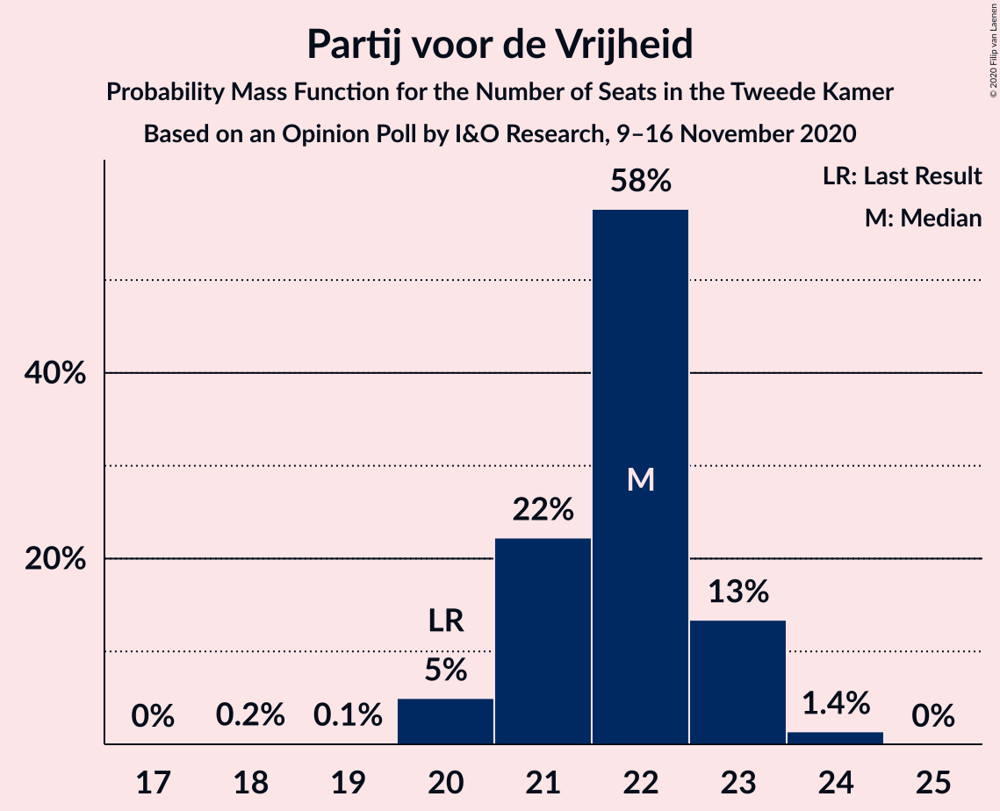
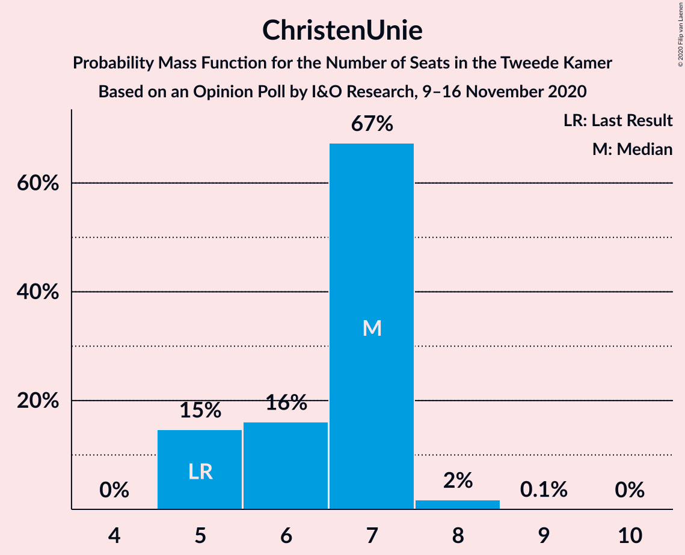
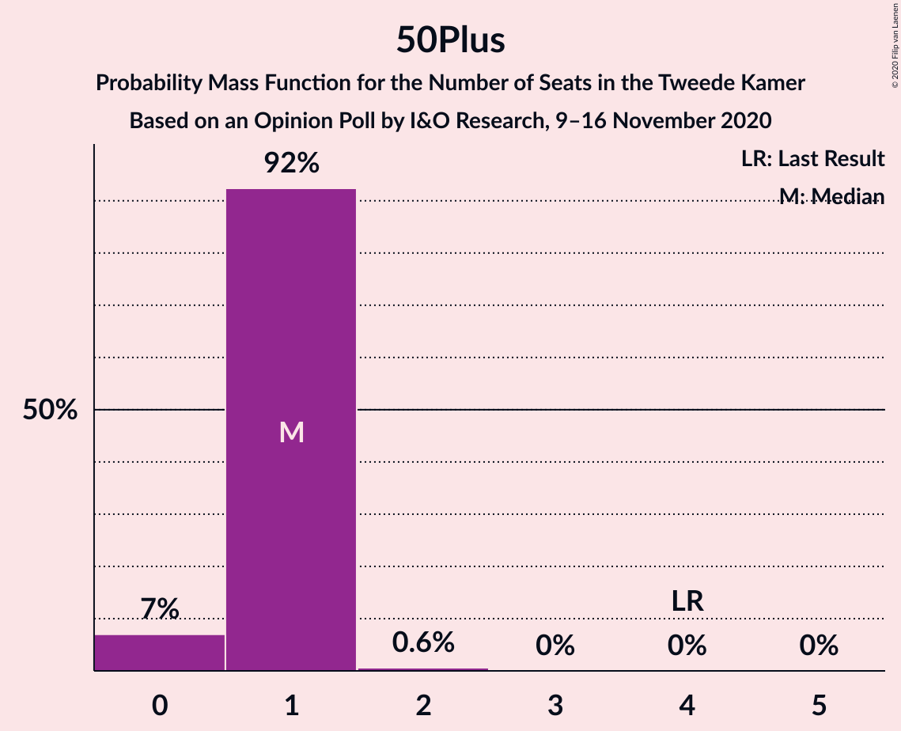
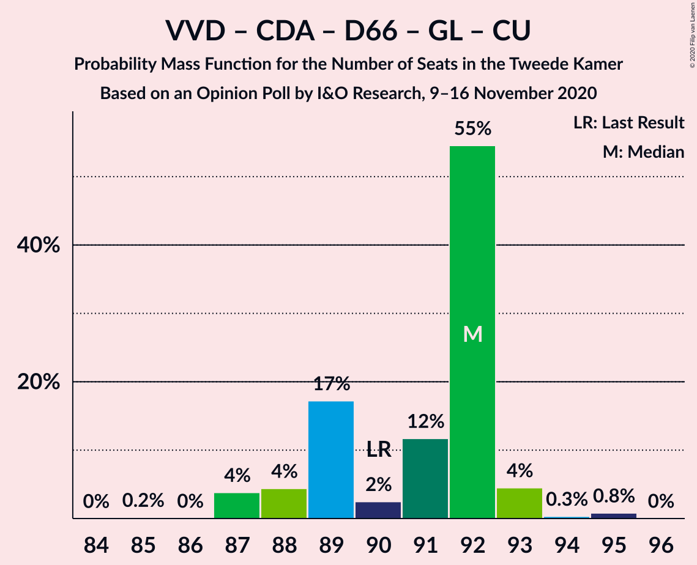
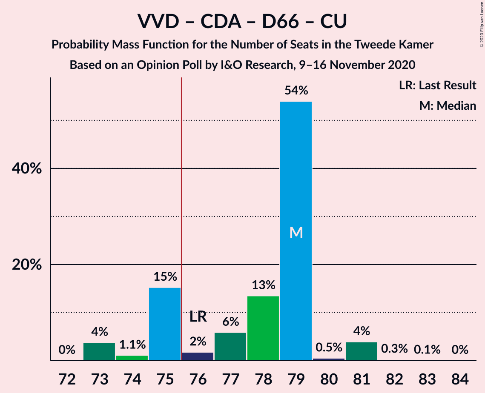
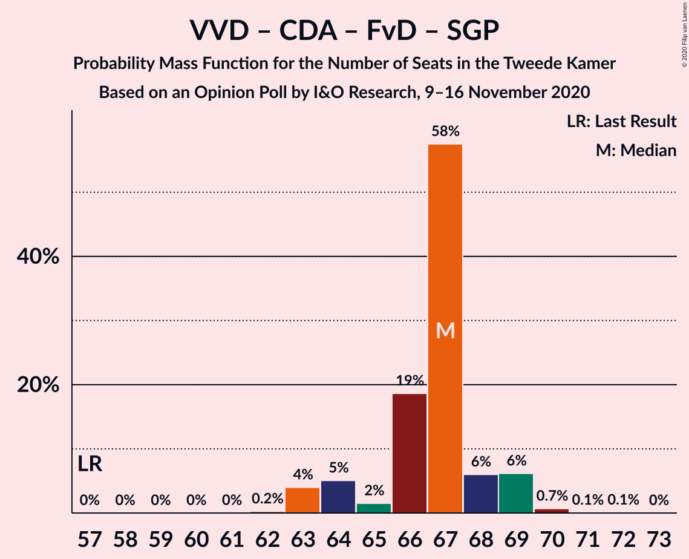

# Opinion Poll by I&O Research, 9–16 November 2020

<a href="#voting-intentions">Voting Intentions</a> | <a href="#seats">Seats</a> | <a href="#coalitions">Coalitions</a> | <a href="#technical-information">Technical Information</a>

## Voting Intentions

### Confidence Intervals

| Party | Last Result | Poll Result | 80% Confidence Interval | 90% Confidence Interval | 95% Confidence Interval | 99% Confidence Interval |
|:-----:|:-----------:|:-----------:|:-----------------------:|:-----------------------:|:-----------------------:|:-----------------------:|
| Volkspartij voor Vrijheid en Democratie | 21.3% | 29.3% | 28.1–30.5% |27.7–30.8% |27.4–31.2% |26.9–31.8% |
| Partij voor de Vrijheid | 13.1% | 14.0% | 13.1–15.0% |12.8–15.2% |12.6–15.5% |12.2–15.9% |
| Christen-Democratisch Appèl | 12.4% | 8.6% | 7.9–9.4% |7.7–9.7% |7.6–9.9% |7.2–10.3% |
| Democraten 66 | 12.2% | 8.6% | 7.9–9.4% |7.7–9.7% |7.6–9.9% |7.2–10.3% |
| GroenLinks | 9.1% | 8.6% | 7.9–9.4% |7.7–9.7% |7.6–9.9% |7.2–10.3% |
| Partij van de Arbeid | 5.7% | 8.6% | 7.9–9.4% |7.7–9.7% |7.6–9.9% |7.2–10.3% |
| Socialistische Partij | 9.1% | 6.6% | 6.0–7.4% |5.8–7.6% |5.7–7.7% |5.4–8.1% |
| ChristenUnie | 3.4% | 4.7% | 4.1–5.3% |4.0–5.5% |3.9–5.6% |3.6–5.9% |
| Forum voor Democratie | 1.8% | 4.0% | 3.5–4.6% |3.4–4.7% |3.2–4.9% |3.0–5.2% |
| Partij voor de Dieren | 3.2% | 2.7% | 2.3–3.2% |2.2–3.3% |2.1–3.4% |1.9–3.7% |
| Staatkundig Gereformeerde Partij | 2.1% | 2.0% | 1.7–2.4% |1.6–2.6% |1.5–2.7% |1.4–2.9% |
| DENK | 2.1% | 1.3% | 1.1–1.7% |1.0–1.8% |0.9–1.9% |0.8–2.1% |
| 50Plus | 3.1% | 0.7% | 0.5–0.9% |0.4–1.0% |0.4–1.1% |0.3–1.2% |
| Partij voor de Toekomst | 0.0% | 0.2% | 0.1–0.4% |0.1–0.4% |0.1–0.5% |0.0–0.5% |

*Note:* The poll result column reflects the actual value used in the calculations. Published results may vary slightly, and in addition be rounded to fewer digits.

## Seats

### Confidence Intervals

| Party | Last Result | Median | 80% Confidence Interval | 90% Confidence Interval | 95% Confidence Interval | 99% Confidence Interval |
|:-----:|:-----------:|:------:|:-----------------------:|:-----------------------:|:-----------------------:|:-----------------------:|
| <a href="#volkspartij-voor-vrijheid-en-democratie">Volkspartij voor Vrijheid en Democratie</a> | 33 | 47 | 45–47 |43–47 |43–47 |43–49 |
| <a href="#partij-voor-de-vrijheid">Partij voor de Vrijheid</a> | 20 | 22 | 21–23 |21–23 |21–23 |20–24 |
| <a href="#christen-democratisch-appèl">Christen-Democratisch Appèl</a> | 19 | 12 | 11–13 |11–14 |11–14 |11–14 |
| <a href="#democraten-66">Democraten 66</a> | 19 | 13 | 13–14 |12–14 |12–14 |11–14 |
| <a href="#groenlinks">GroenLinks</a> | 14 | 13 | 12–14 |11–14 |10–14 |10–15 |
| <a href="#partij-van-de-arbeid">Partij van de Arbeid</a> | 9 | 13 | 13–14 |13–14 |13–15 |12–16 |
| <a href="#socialistische-partij">Socialistische Partij</a> | 14 | 8 | 8–12 |8–12 |8–12 |8–12 |
| <a href="#christenunie">ChristenUnie</a> | 5 | 7 | 5–7 |5–7 |5–7 |5–8 |
| <a href="#forum-voor-democratie">Forum voor Democratie</a> | 2 | 5 | 5–7 |4–7 |4–7 |4–7 |
| <a href="#partij-voor-de-dieren">Partij voor de Dieren</a> | 5 | 4 | 3–4 |3–5 |3–5 |2–5 |
| <a href="#staatkundig-gereformeerde-partij">Staatkundig Gereformeerde Partij</a> | 3 | 3 | 2–3 |2–3 |2–4 |2–4 |
| <a href="#denk">DENK</a> | 3 | 2 | 1–2 |1–2 |1–2 |1–2 |
| <a href="#50plus">50Plus</a> | 4 | 1 | 1 |1 |0–1 |0–2 |
| <a href="#partij-voor-de-toekomst">Partij voor de Toekomst</a> | 0 | 0 | 0 |0 |0 |0 |

### Volkspartij voor Vrijheid en Democratie

*For a full overview of the results for this party, see the [Volkspartij voor Vrijheid en Democratie](party-volkspartijvoorvrijheidendemocratie.html) page.*

| Number of Seats | Probability | Accumulated | Special Marks |
|:---------------:|:-----------:|:-----------:|:-------------:|
| 33 | 0% | 100% | Last Result |
| 34 | 0% | 100% |  |
| 35 | 0% | 100% |  |
| 36 | 0% | 100% |  |
| 37 | 0% | 100% |  |
| 38 | 0% | 100% |  |
| 39 | 0% | 100% |  |
| 40 | 0% | 100% |  |
| 41 | 0% | 100% |  |
| 42 | 0% | 100% |  |
| 43 | 9% | 99.9% |  |
| 44 | 1.3% | 91% |  |
| 45 | 0.4% | 90% |  |
| 46 | 20% | 90% |  |
| 47 | 68% | 69% | Median |
| 48 | 0.4% | 1.1% |  |
| 49 | 0.6% | 0.7% |  |
| 50 | 0% | 0.1% |  |
| 51 | 0.1% | 0.1% |  |
| 52 | 0% | 0% |  |

### Partij voor de Vrijheid

*For a full overview of the results for this party, see the [Partij voor de Vrijheid](party-partijvoordevrijheid.html) page.*

| Number of Seats | Probability | Accumulated | Special Marks |
|:---------------:|:-----------:|:-----------:|:-------------:|
| 18 | 0.1% | 100% |  |
| 19 | 0.1% | 99.8% |  |
| 20 | 2% | 99.8% | Last Result |
| 21 | 20% | 98% |  |
| 22 | 66% | 78% | Median |
| 23 | 11% | 12% |  |
| 24 | 0.8% | 0.8% |  |
| 25 | 0% | 0% |  |

### Christen-Democratisch Appèl

*For a full overview of the results for this party, see the [Christen-Democratisch Appèl](party-christen-democratischappèl.html) page.*

| Number of Seats | Probability | Accumulated | Special Marks |
|:---------------:|:-----------:|:-----------:|:-------------:|
| 11 | 16% | 100% |  |
| 12 | 67% | 84% | Median |
| 13 | 8% | 17% |  |
| 14 | 8% | 9% |  |
| 15 | 0.2% | 0.4% |  |
| 16 | 0.2% | 0.2% |  |
| 17 | 0% | 0% |  |
| 18 | 0% | 0% |  |
| 19 | 0% | 0% | Last Result |

### Democraten 66

*For a full overview of the results for this party, see the [Democraten 66](party-democraten66.html) page.*

| Number of Seats | Probability | Accumulated | Special Marks |
|:---------------:|:-----------:|:-----------:|:-------------:|
| 11 | 2% | 100% |  |
| 12 | 8% | 98% |  |
| 13 | 79% | 90% | Median |
| 14 | 11% | 11% |  |
| 15 | 0.1% | 0.1% |  |
| 16 | 0% | 0% |  |
| 17 | 0% | 0% |  |
| 18 | 0% | 0% |  |
| 19 | 0% | 0% | Last Result |

### GroenLinks

*For a full overview of the results for this party, see the [GroenLinks](party-groenlinks.html) page.*

| Number of Seats | Probability | Accumulated | Special Marks |
|:---------------:|:-----------:|:-----------:|:-------------:|
| 10 | 4% | 100% |  |
| 11 | 3% | 96% |  |
| 12 | 5% | 93% |  |
| 13 | 69% | 88% | Median |
| 14 | 19% | 20% | Last Result |
| 15 | 0.4% | 0.6% |  |
| 16 | 0.2% | 0.2% |  |
| 17 | 0% | 0% |  |

### Partij van de Arbeid

*For a full overview of the results for this party, see the [Partij van de Arbeid](party-partijvandearbeid.html) page.*

| Number of Seats | Probability | Accumulated | Special Marks |
|:---------------:|:-----------:|:-----------:|:-------------:|
| 9 | 0% | 100% | Last Result |
| 10 | 0% | 100% |  |
| 11 | 0.2% | 100% |  |
| 12 | 2% | 99.7% |  |
| 13 | 77% | 98% | Median |
| 14 | 17% | 21% |  |
| 15 | 3% | 4% |  |
| 16 | 1.0% | 1.0% |  |
| 17 | 0% | 0% |  |

### Socialistische Partij

*For a full overview of the results for this party, see the [Socialistische Partij](party-socialistischepartij.html) page.*

| Number of Seats | Probability | Accumulated | Special Marks |
|:---------------:|:-----------:|:-----------:|:-------------:|
| 8 | 63% | 100% | Median |
| 9 | 7% | 37% |  |
| 10 | 12% | 30% |  |
| 11 | 2% | 18% |  |
| 12 | 16% | 16% |  |
| 13 | 0% | 0% |  |
| 14 | 0% | 0% | Last Result |

### ChristenUnie

*For a full overview of the results for this party, see the [ChristenUnie](party-christenunie.html) page.*

| Number of Seats | Probability | Accumulated | Special Marks |
|:---------------:|:-----------:|:-----------:|:-------------:|
| 5 | 17% | 100% | Last Result |
| 6 | 5% | 83% |  |
| 7 | 77% | 79% | Median |
| 8 | 2% | 2% |  |
| 9 | 0% | 0.1% |  |
| 10 | 0% | 0% |  |

### Forum voor Democratie

*For a full overview of the results for this party, see the [Forum voor Democratie](party-forumvoordemocratie.html) page.*

| Number of Seats | Probability | Accumulated | Special Marks |
|:---------------:|:-----------:|:-----------:|:-------------:|
| 2 | 0% | 100% | Last Result |
| 3 | 0% | 100% |  |
| 4 | 9% | 100% |  |
| 5 | 62% | 91% | Median |
| 6 | 10% | 29% |  |
| 7 | 19% | 19% |  |
| 8 | 0.1% | 0.1% |  |
| 9 | 0% | 0% |  |

### Partij voor de Dieren

*For a full overview of the results for this party, see the [Partij voor de Dieren](party-partijvoordedieren.html) page.*

| Number of Seats | Probability | Accumulated | Special Marks |
|:---------------:|:-----------:|:-----------:|:-------------:|
| 2 | 0.5% | 100% |  |
| 3 | 25% | 99.5% |  |
| 4 | 68% | 75% | Median |
| 5 | 7% | 7% | Last Result |
| 6 | 0% | 0% |  |

### Staatkundig Gereformeerde Partij

*For a full overview of the results for this party, see the [Staatkundig Gereformeerde Partij](party-staatkundiggereformeerdepartij.html) page.*

| Number of Seats | Probability | Accumulated | Special Marks |
|:---------------:|:-----------:|:-----------:|:-------------:|
| 1 | 0.2% | 100% |  |
| 2 | 22% | 99.8% |  |
| 3 | 76% | 78% | Last Result, Median |
| 4 | 3% | 3% |  |
| 5 | 0% | 0% |  |

### DENK

*For a full overview of the results for this party, see the [DENK](party-denk.html) page.*

| Number of Seats | Probability | Accumulated | Special Marks |
|:---------------:|:-----------:|:-----------:|:-------------:|
| 0 | 0.1% | 100% |  |
| 1 | 26% | 99.9% |  |
| 2 | 74% | 74% | Median |
| 3 | 0.3% | 0.3% | Last Result |
| 4 | 0% | 0% |  |

### 50Plus

*For a full overview of the results for this party, see the [50Plus](party-50plus.html) page.*

| Number of Seats | Probability | Accumulated | Special Marks |
|:---------------:|:-----------:|:-----------:|:-------------:|
| 0 | 3% | 100% |  |
| 1 | 96% | 97% | Median |
| 2 | 0.5% | 0.5% |  |
| 3 | 0% | 0% |  |
| 4 | 0% | 0% | Last Result |

### Partij voor de Toekomst

*For a full overview of the results for this party, see the [Partij voor de Toekomst](party-partijvoordetoekomst.html) page.*

| Number of Seats | Probability | Accumulated | Special Marks |
|:---------------:|:-----------:|:-----------:|:-------------:|
| 0 | 99.9% | 100% | Last Result, Median |
| 1 | 0.1% | 0.1% |  |
| 2 | 0% | 0% |  |

## Coalitions

### Confidence Intervals

| Coalition | Last Result | Median | Majority? | 80% Confidence Interval | 90% Confidence Interval | 95% Confidence Interval | 99% Confidence Interval |
|:---------:|:-----------:|:------:|:---------:|:-----------------------:|:-----------------------:|:-----------------------:|:-----------------------:|
| Volkspartij voor Vrijheid en Democratie – Christen-Democratisch Appèl – Democraten 66 – Partij van de Arbeid – ChristenUnie | 85 | 92 | 100% | 89–92 | 89–92 | 89–94 | 89–94 |
| Volkspartij voor Vrijheid en Democratie – Christen-Democratisch Appèl – Democraten 66 – GroenLinks – ChristenUnie | 90 | 92 | 100% | 89–92 | 88–92 | 88–92 | 88–94 |
| Volkspartij voor Vrijheid en Democratie – Partij voor de Vrijheid – Christen-Democratisch Appèl – Forum voor Democratie – Staatkundig Gereformeerde Partij | 77 | 89 | 100% | 87–89 | 87–90 | 87–90 | 85–93 |
| Volkspartij voor Vrijheid en Democratie – Partij voor de Vrijheid – Christen-Democratisch Appèl – Forum voor Democratie | 74 | 86 | 100% | 85–86 | 84–88 | 84–88 | 83–90 |
| Volkspartij voor Vrijheid en Democratie – Partij voor de Vrijheid – Christen-Democratisch Appèl | 72 | 81 | 99.7% | 78–81 | 78–82 | 78–82 | 77–85 |
| Volkspartij voor Vrijheid en Democratie – Christen-Democratisch Appèl – Democraten 66 – ChristenUnie | 76 | 79 | 83% | 75–79 | 75–79 | 75–81 | 74–81 |
| Volkspartij voor Vrijheid en Democratie – Christen-Democratisch Appèl – Democraten 66 | 71 | 72 | 0.1% | 70–72 | 70–72 | 70–74 | 67–74 |
| Volkspartij voor Vrijheid en Democratie – Christen-Democratisch Appèl – Partij van de Arbeid | 61 | 72 | 0.1% | 71–72 | 70–73 | 70–74 | 69–74 |
| Volkspartij voor Vrijheid en Democratie – Democraten 66 – Partij van de Arbeid | 61 | 73 | 0.1% | 70–73 | 70–73 | 70–74 | 69–74 |
| Christen-Democratisch Appèl – Democraten 66 – GroenLinks – Partij van de Arbeid – Socialistische Partij – ChristenUnie | 80 | 66 | 0% | 66–69 | 66–71 | 66–71 | 65–71 |
| Volkspartij voor Vrijheid en Democratie – Christen-Democratisch Appèl – Forum voor Democratie – Staatkundig Gereformeerde Partij – 50Plus | 61 | 68 | 0% | 67–68 | 65–69 | 65–70 | 65–70 |
| Volkspartij voor Vrijheid en Democratie – Christen-Democratisch Appèl – Forum voor Democratie – Staatkundig Gereformeerde Partij | 57 | 67 | 0% | 66–67 | 64–68 | 64–69 | 64–69 |
| Volkspartij voor Vrijheid en Democratie – Christen-Democratisch Appèl – Forum voor Democratie – 50Plus | 58 | 65 | 0% | 64–65 | 62–66 | 62–67 | 62–67 |
| Volkspartij voor Vrijheid en Democratie – Christen-Democratisch Appèl – Forum voor Democratie | 54 | 64 | 0% | 63–64 | 61–66 | 61–66 | 61–66 |
| Christen-Democratisch Appèl – Democraten 66 – GroenLinks – Partij van de Arbeid – ChristenUnie | 66 | 58 | 0% | 57–59 | 57–61 | 56–61 | 55–62 |
| Volkspartij voor Vrijheid en Democratie – Partij van de Arbeid | 42 | 60 | 0% | 59–60 | 56–60 | 56–61 | 56–62 |
| Volkspartij voor Vrijheid en Democratie – Christen-Democratisch Appèl | 52 | 59 | 0% | 57–59 | 57–60 | 57–60 | 56–61 |
| Christen-Democratisch Appèl – Democraten 66 – Partij van de Arbeid | 47 | 38 | 0% | 38–40 | 37–41 | 37–41 | 36–41 |
| Christen-Democratisch Appèl – Partij van de Arbeid – ChristenUnie | 33 | 32 | 0% | 30–34 | 30–34 | 30–34 | 30–36 |
| Christen-Democratisch Appèl – Partij van de Arbeid | 28 | 25 | 0% | 25–27 | 25–27 | 25–28 | 25–29 |
| Christen-Democratisch Appèl – Democraten 66 | 38 | 25 | 0% | 24–27 | 24–28 | 24–28 | 24–28 |

### Volkspartij voor Vrijheid en Democratie – Christen-Democratisch Appèl – Democraten 66 – Partij van de Arbeid – ChristenUnie

| Number of Seats | Probability | Accumulated | Special Marks |
|:---------------:|:-----------:|:-----------:|:-------------:|
| 85 | 0% | 100% | Last Result |
| 86 | 0% | 100% |  |
| 87 | 0% | 100% |  |
| 88 | 0.2% | 99.9% |  |
| 89 | 18% | 99.8% |  |
| 90 | 2% | 82% |  |
| 91 | 10% | 79% |  |
| 92 | 66% | 70% | Median |
| 93 | 0.1% | 4% |  |
| 94 | 4% | 4% |  |
| 95 | 0.1% | 0.1% |  |
| 96 | 0% | 0% |  |

### Volkspartij voor Vrijheid en Democratie – Christen-Democratisch Appèl – Democraten 66 – GroenLinks – ChristenUnie

| Number of Seats | Probability | Accumulated | Special Marks |
|:---------------:|:-----------:|:-----------:|:-------------:|
| 88 | 5% | 100% |  |
| 89 | 17% | 95% |  |
| 90 | 2% | 78% | Last Result |
| 91 | 12% | 76% |  |
| 92 | 63% | 64% | Median |
| 93 | 0.2% | 0.7% |  |
| 94 | 0.1% | 0.6% |  |
| 95 | 0.4% | 0.4% |  |
| 96 | 0% | 0% |  |

### Volkspartij voor Vrijheid en Democratie – Partij voor de Vrijheid – Christen-Democratisch Appèl – Forum voor Democratie – Staatkundig Gereformeerde Partij

| Number of Seats | Probability | Accumulated | Special Marks |
|:---------------:|:-----------:|:-----------:|:-------------:|
| 77 | 0% | 100% | Last Result |
| 78 | 0% | 100% |  |
| 79 | 0% | 100% |  |
| 80 | 0% | 100% |  |
| 81 | 0% | 100% |  |
| 82 | 0% | 100% |  |
| 83 | 0% | 100% |  |
| 84 | 0.3% | 100% |  |
| 85 | 0.3% | 99.6% |  |
| 86 | 1.5% | 99.4% |  |
| 87 | 22% | 98% |  |
| 88 | 1.3% | 76% |  |
| 89 | 66% | 75% | Median |
| 90 | 7% | 8% |  |
| 91 | 0.3% | 2% |  |
| 92 | 0.8% | 1.4% |  |
| 93 | 0.5% | 0.6% |  |
| 94 | 0% | 0% |  |

### Volkspartij voor Vrijheid en Democratie – Partij voor de Vrijheid – Christen-Democratisch Appèl – Forum voor Democratie

| Number of Seats | Probability | Accumulated | Special Marks |
|:---------------:|:-----------:|:-----------:|:-------------:|
| 74 | 0% | 100% | Last Result |
| 75 | 0% | 100% |  |
| 76 | 0% | 100% | Majority |
| 77 | 0% | 100% |  |
| 78 | 0% | 100% |  |
| 79 | 0% | 100% |  |
| 80 | 0% | 100% |  |
| 81 | 0% | 100% |  |
| 82 | 0.4% | 99.9% |  |
| 83 | 2% | 99.6% |  |
| 84 | 6% | 98% |  |
| 85 | 17% | 92% |  |
| 86 | 68% | 75% | Median |
| 87 | 0.8% | 7% |  |
| 88 | 5% | 6% |  |
| 89 | 0.7% | 1.4% |  |
| 90 | 0.6% | 0.6% |  |
| 91 | 0.1% | 0.1% |  |
| 92 | 0% | 0% |  |

### Volkspartij voor Vrijheid en Democratie – Partij voor de Vrijheid – Christen-Democratisch Appèl

| Number of Seats | Probability | Accumulated | Special Marks |
|:---------------:|:-----------:|:-----------:|:-------------:|
| 72 | 0% | 100% | Last Result |
| 73 | 0% | 100% |  |
| 74 | 0% | 100% |  |
| 75 | 0.2% | 100% |  |
| 76 | 0.1% | 99.7% | Majority |
| 77 | 1.5% | 99.7% |  |
| 78 | 17% | 98% |  |
| 79 | 2% | 82% |  |
| 80 | 9% | 79% |  |
| 81 | 62% | 71% | Median |
| 82 | 8% | 9% |  |
| 83 | 0.4% | 1.1% |  |
| 84 | 0.1% | 0.6% |  |
| 85 | 0.5% | 0.5% |  |
| 86 | 0% | 0% |  |

### Volkspartij voor Vrijheid en Democratie – Christen-Democratisch Appèl – Democraten 66 – ChristenUnie

| Number of Seats | Probability | Accumulated | Special Marks |
|:---------------:|:-----------:|:-----------:|:-------------:|
| 74 | 1.0% | 100% |  |
| 75 | 16% | 99.0% |  |
| 76 | 2% | 83% | Last Result, Majority |
| 77 | 3% | 81% |  |
| 78 | 10% | 78% |  |
| 79 | 62% | 67% | Median |
| 80 | 0.3% | 5% |  |
| 81 | 4% | 4% |  |
| 82 | 0.2% | 0.2% |  |
| 83 | 0% | 0.1% |  |
| 84 | 0% | 0% |  |

### Volkspartij voor Vrijheid en Democratie – Christen-Democratisch Appèl – Democraten 66

| Number of Seats | Probability | Accumulated | Special Marks |
|:---------------:|:-----------:|:-----------:|:-------------:|
| 67 | 1.0% | 100% |  |
| 68 | 0.3% | 98.9% |  |
| 69 | 0.2% | 98.7% |  |
| 70 | 18% | 98% |  |
| 71 | 14% | 80% | Last Result |
| 72 | 61% | 66% | Median |
| 73 | 0.6% | 5% |  |
| 74 | 4% | 4% |  |
| 75 | 0.1% | 0.2% |  |
| 76 | 0% | 0.1% | Majority |
| 77 | 0% | 0% |  |

### Volkspartij voor Vrijheid en Democratie – Christen-Democratisch Appèl – Partij van de Arbeid

| Number of Seats | Probability | Accumulated | Special Marks |
|:---------------:|:-----------:|:-----------:|:-------------:|
| 61 | 0% | 100% | Last Result |
| 62 | 0% | 100% |  |
| 63 | 0% | 100% |  |
| 64 | 0% | 100% |  |
| 65 | 0% | 100% |  |
| 66 | 0.1% | 100% |  |
| 67 | 0% | 99.9% |  |
| 68 | 0.3% | 99.9% |  |
| 69 | 0.1% | 99.6% |  |
| 70 | 9% | 99.5% |  |
| 71 | 18% | 91% |  |
| 72 | 65% | 73% | Median |
| 73 | 4% | 8% |  |
| 74 | 4% | 4% |  |
| 75 | 0% | 0.2% |  |
| 76 | 0.1% | 0.1% | Majority |
| 77 | 0% | 0% |  |

### Volkspartij voor Vrijheid en Democratie – Democraten 66 – Partij van de Arbeid

| Number of Seats | Probability | Accumulated | Special Marks |
|:---------------:|:-----------:|:-----------:|:-------------:|
| 61 | 0% | 100% | Last Result |
| 62 | 0% | 100% |  |
| 63 | 0% | 100% |  |
| 64 | 0% | 100% |  |
| 65 | 0% | 100% |  |
| 66 | 0% | 100% |  |
| 67 | 0% | 100% |  |
| 68 | 0.1% | 99.9% |  |
| 69 | 2% | 99.8% |  |
| 70 | 8% | 98% |  |
| 71 | 2% | 90% |  |
| 72 | 3% | 88% |  |
| 73 | 80% | 85% | Median |
| 74 | 5% | 5% |  |
| 75 | 0% | 0.1% |  |
| 76 | 0.1% | 0.1% | Majority |
| 77 | 0% | 0% |  |

### Christen-Democratisch Appèl – Democraten 66 – GroenLinks – Partij van de Arbeid – Socialistische Partij – ChristenUnie

| Number of Seats | Probability | Accumulated | Special Marks |
|:---------------:|:-----------:|:-----------:|:-------------:|
| 63 | 0.1% | 100% |  |
| 64 | 0.1% | 99.9% |  |
| 65 | 0.8% | 99.9% |  |
| 66 | 69% | 99.1% | Median |
| 67 | 4% | 30% |  |
| 68 | 0.2% | 26% |  |
| 69 | 17% | 26% |  |
| 70 | 2% | 9% |  |
| 71 | 7% | 7% |  |
| 72 | 0.2% | 0.3% |  |
| 73 | 0% | 0% |  |
| 74 | 0% | 0% |  |
| 75 | 0% | 0% |  |
| 76 | 0% | 0% | Majority |
| 77 | 0% | 0% |  |
| 78 | 0% | 0% |  |
| 79 | 0% | 0% |  |
| 80 | 0% | 0% | Last Result |

### Volkspartij voor Vrijheid en Democratie – Christen-Democratisch Appèl – Forum voor Democratie – Staatkundig Gereformeerde Partij – 50Plus

| Number of Seats | Probability | Accumulated | Special Marks |
|:---------------:|:-----------:|:-----------:|:-------------:|
| 61 | 0% | 100% | Last Result |
| 62 | 0% | 100% |  |
| 63 | 0.2% | 100% |  |
| 64 | 0.1% | 99.8% |  |
| 65 | 7% | 99.7% |  |
| 66 | 0.3% | 93% |  |
| 67 | 21% | 93% |  |
| 68 | 61% | 71% | Median |
| 69 | 7% | 10% |  |
| 70 | 2% | 3% |  |
| 71 | 0.1% | 0.1% |  |
| 72 | 0% | 0.1% |  |
| 73 | 0% | 0% |  |

### Volkspartij voor Vrijheid en Democratie – Christen-Democratisch Appèl – Forum voor Democratie – Staatkundig Gereformeerde Partij

| Number of Seats | Probability | Accumulated | Special Marks |
|:---------------:|:-----------:|:-----------:|:-------------:|
| 57 | 0% | 100% | Last Result |
| 58 | 0% | 100% |  |
| 59 | 0% | 100% |  |
| 60 | 0% | 100% |  |
| 61 | 0% | 100% |  |
| 62 | 0.2% | 100% |  |
| 63 | 0% | 99.8% |  |
| 64 | 6% | 99.7% |  |
| 65 | 1.3% | 94% |  |
| 66 | 21% | 93% |  |
| 67 | 62% | 71% | Median |
| 68 | 6% | 10% |  |
| 69 | 4% | 4% |  |
| 70 | 0.1% | 0.2% |  |
| 71 | 0.1% | 0.1% |  |
| 72 | 0% | 0% |  |

### Volkspartij voor Vrijheid en Democratie – Christen-Democratisch Appèl – Forum voor Democratie – 50Plus

| Number of Seats | Probability | Accumulated | Special Marks |
|:---------------:|:-----------:|:-----------:|:-------------:|
| 58 | 0% | 100% | Last Result |
| 59 | 0% | 100% |  |
| 60 | 0% | 100% |  |
| 61 | 0.1% | 99.9% |  |
| 62 | 7% | 99.9% |  |
| 63 | 0.3% | 93% |  |
| 64 | 4% | 93% |  |
| 65 | 78% | 88% | Median |
| 66 | 5% | 10% |  |
| 67 | 5% | 5% |  |
| 68 | 0.1% | 0.2% |  |
| 69 | 0% | 0.1% |  |
| 70 | 0% | 0% |  |

### Volkspartij voor Vrijheid en Democratie – Christen-Democratisch Appèl – Forum voor Democratie

| Number of Seats | Probability | Accumulated | Special Marks |
|:---------------:|:-----------:|:-----------:|:-------------:|
| 54 | 0% | 100% | Last Result |
| 55 | 0% | 100% |  |
| 56 | 0% | 100% |  |
| 57 | 0% | 100% |  |
| 58 | 0% | 100% |  |
| 59 | 0% | 100% |  |
| 60 | 0% | 100% |  |
| 61 | 6% | 99.9% |  |
| 62 | 1.3% | 94% |  |
| 63 | 4% | 93% |  |
| 64 | 79% | 88% | Median |
| 65 | 4% | 9% |  |
| 66 | 5% | 6% |  |
| 67 | 0.4% | 0.5% |  |
| 68 | 0.1% | 0.1% |  |
| 69 | 0% | 0% |  |

### Christen-Democratisch Appèl – Democraten 66 – GroenLinks – Partij van de Arbeid – ChristenUnie

| Number of Seats | Probability | Accumulated | Special Marks |
|:---------------:|:-----------:|:-----------:|:-------------:|
| 53 | 0.1% | 100% |  |
| 54 | 0.1% | 99.9% |  |
| 55 | 1.2% | 99.9% |  |
| 56 | 3% | 98.6% |  |
| 57 | 24% | 96% |  |
| 58 | 61% | 72% | Median |
| 59 | 2% | 10% |  |
| 60 | 0.2% | 9% |  |
| 61 | 7% | 9% |  |
| 62 | 2% | 2% |  |
| 63 | 0% | 0% |  |
| 64 | 0% | 0% |  |
| 65 | 0% | 0% |  |
| 66 | 0% | 0% | Last Result |

### Volkspartij voor Vrijheid en Democratie – Partij van de Arbeid

| Number of Seats | Probability | Accumulated | Special Marks |
|:---------------:|:-----------:|:-----------:|:-------------:|
| 42 | 0% | 100% | Last Result |
| 43 | 0% | 100% |  |
| 44 | 0% | 100% |  |
| 45 | 0% | 100% |  |
| 46 | 0% | 100% |  |
| 47 | 0% | 100% |  |
| 48 | 0% | 100% |  |
| 49 | 0% | 100% |  |
| 50 | 0% | 100% |  |
| 51 | 0% | 100% |  |
| 52 | 0% | 100% |  |
| 53 | 0% | 100% |  |
| 54 | 0% | 99.9% |  |
| 55 | 0.1% | 99.9% |  |
| 56 | 8% | 99.9% |  |
| 57 | 0.4% | 91% |  |
| 58 | 0.5% | 91% |  |
| 59 | 2% | 91% |  |
| 60 | 85% | 88% | Median |
| 61 | 3% | 4% |  |
| 62 | 0.5% | 0.6% |  |
| 63 | 0% | 0.1% |  |
| 64 | 0.1% | 0.1% |  |
| 65 | 0% | 0% |  |

### Volkspartij voor Vrijheid en Democratie – Christen-Democratisch Appèl

| Number of Seats | Probability | Accumulated | Special Marks |
|:---------------:|:-----------:|:-----------:|:-------------:|
| 52 | 0% | 100% | Last Result |
| 53 | 0% | 100% |  |
| 54 | 0.1% | 100% |  |
| 55 | 0.3% | 99.9% |  |
| 56 | 1.2% | 99.6% |  |
| 57 | 24% | 98% |  |
| 58 | 2% | 75% |  |
| 59 | 67% | 72% | Median |
| 60 | 4% | 5% |  |
| 61 | 0.8% | 1.1% |  |
| 62 | 0.2% | 0.3% |  |
| 63 | 0.1% | 0.1% |  |
| 64 | 0% | 0% |  |

### Christen-Democratisch Appèl – Democraten 66 – Partij van de Arbeid

| Number of Seats | Probability | Accumulated | Special Marks |
|:---------------:|:-----------:|:-----------:|:-------------:|
| 36 | 0.6% | 100% |  |
| 37 | 5% | 99.4% |  |
| 38 | 78% | 94% | Median |
| 39 | 1.2% | 16% |  |
| 40 | 8% | 15% |  |
| 41 | 7% | 7% |  |
| 42 | 0.2% | 0.3% |  |
| 43 | 0% | 0% |  |
| 44 | 0% | 0% |  |
| 45 | 0% | 0% |  |
| 46 | 0% | 0% |  |
| 47 | 0% | 0% | Last Result |

### Christen-Democratisch Appèl – Partij van de Arbeid – ChristenUnie

| Number of Seats | Probability | Accumulated | Special Marks |
|:---------------:|:-----------:|:-----------:|:-------------:|
| 29 | 0.1% | 100% |  |
| 30 | 16% | 99.9% |  |
| 31 | 2% | 84% |  |
| 32 | 64% | 82% | Median |
| 33 | 6% | 18% | Last Result |
| 34 | 10% | 12% |  |
| 35 | 0.1% | 1.3% |  |
| 36 | 1.2% | 1.2% |  |
| 37 | 0% | 0% |  |

### Christen-Democratisch Appèl – Partij van de Arbeid

| Number of Seats | Probability | Accumulated | Special Marks |
|:---------------:|:-----------:|:-----------:|:-------------:|
| 23 | 0.1% | 100% |  |
| 24 | 0.3% | 99.9% |  |
| 25 | 83% | 99.6% | Median |
| 26 | 5% | 17% |  |
| 27 | 7% | 11% |  |
| 28 | 3% | 4% | Last Result |
| 29 | 1.0% | 1.2% |  |
| 30 | 0% | 0.2% |  |
| 31 | 0.2% | 0.2% |  |
| 32 | 0% | 0% |  |

### Christen-Democratisch Appèl – Democraten 66

| Number of Seats | Probability | Accumulated | Special Marks |
|:---------------:|:-----------:|:-----------:|:-------------:|
| 24 | 23% | 100% |  |
| 25 | 64% | 77% | Median |
| 26 | 0% | 13% |  |
| 27 | 6% | 13% |  |
| 28 | 7% | 7% |  |
| 29 | 0% | 0% |  |
| 30 | 0% | 0% |  |
| 31 | 0% | 0% |  |
| 32 | 0% | 0% |  |
| 33 | 0% | 0% |  |
| 34 | 0% | 0% |  |
| 35 | 0% | 0% |  |
| 36 | 0% | 0% |  |
| 37 | 0% | 0% |  |
| 38 | 0% | 0% | Last Result |

## Technical Information

### Opinion Poll

+ **Polling firm:** I&O Research
+ **Commissioner(s):** —
+ **Fieldwork period:** 9–16 November 2020

### Calculations

+ **Sample size:** 2290
+ **Simulations done:** 524,288
+ **Error estimate:** 1.83%

