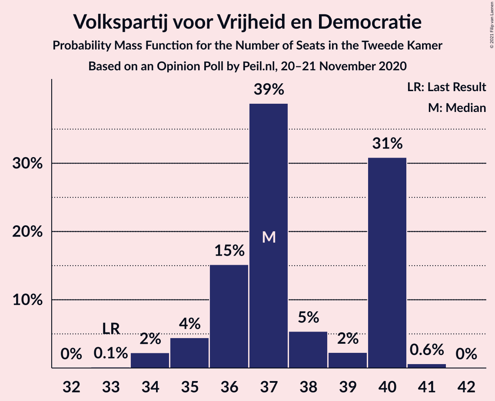
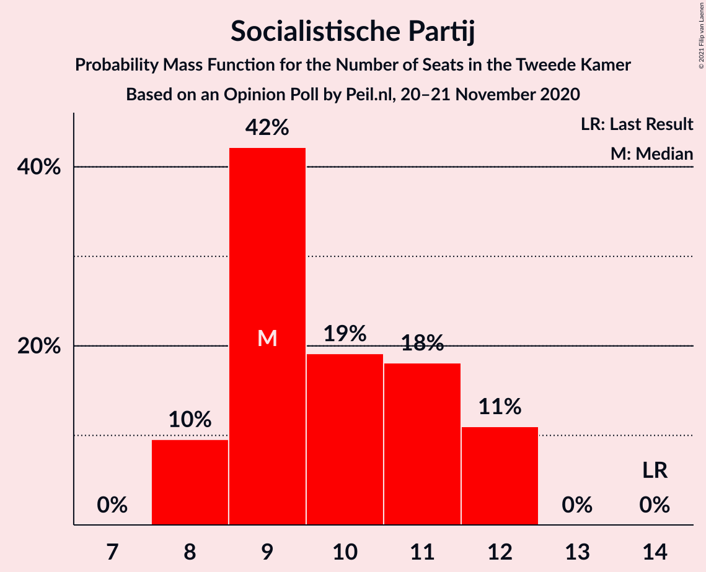
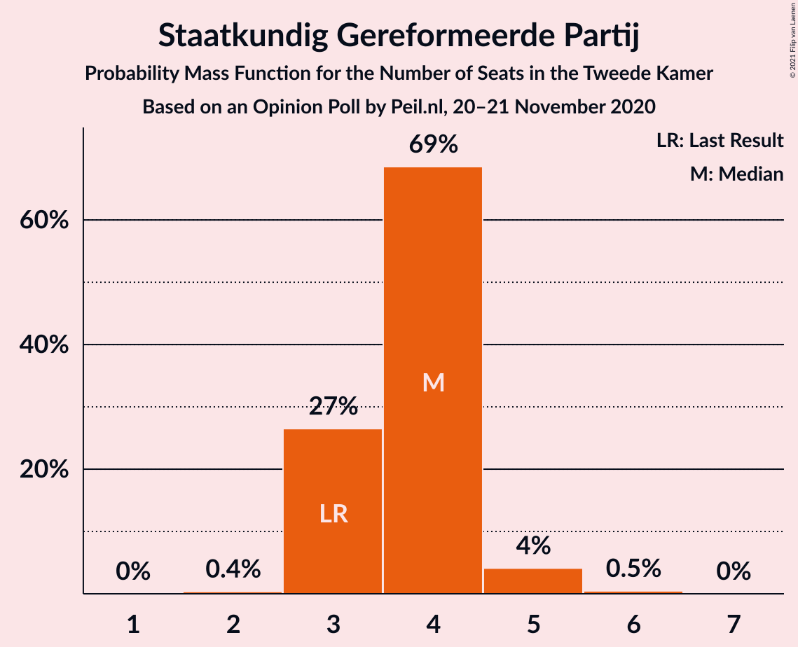
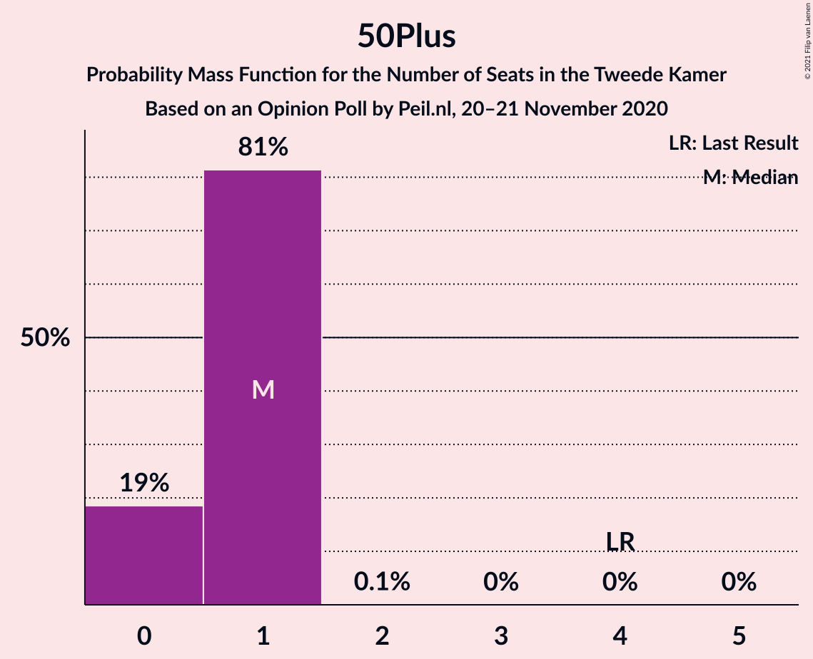
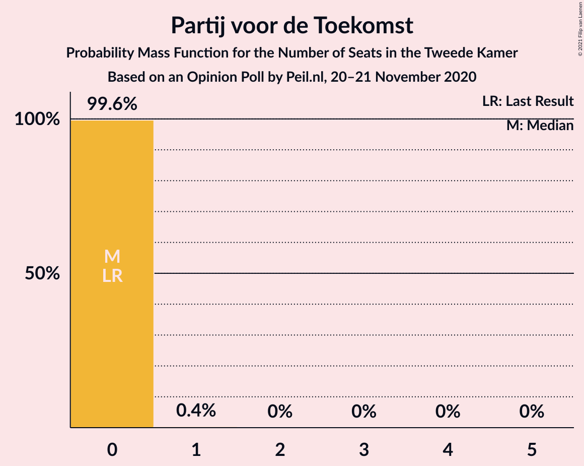
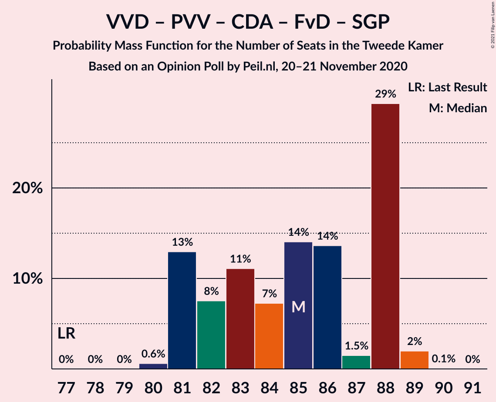
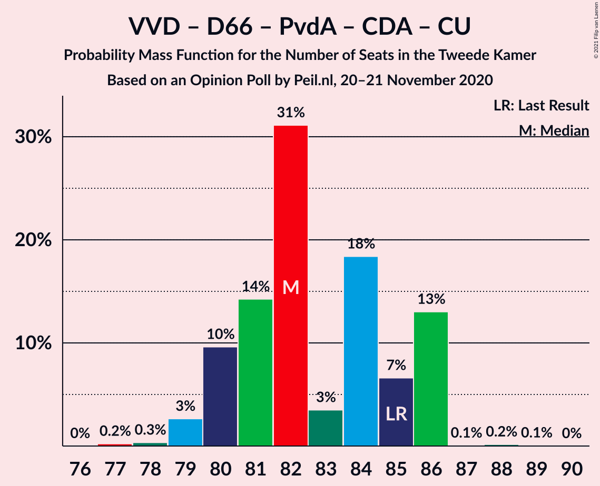
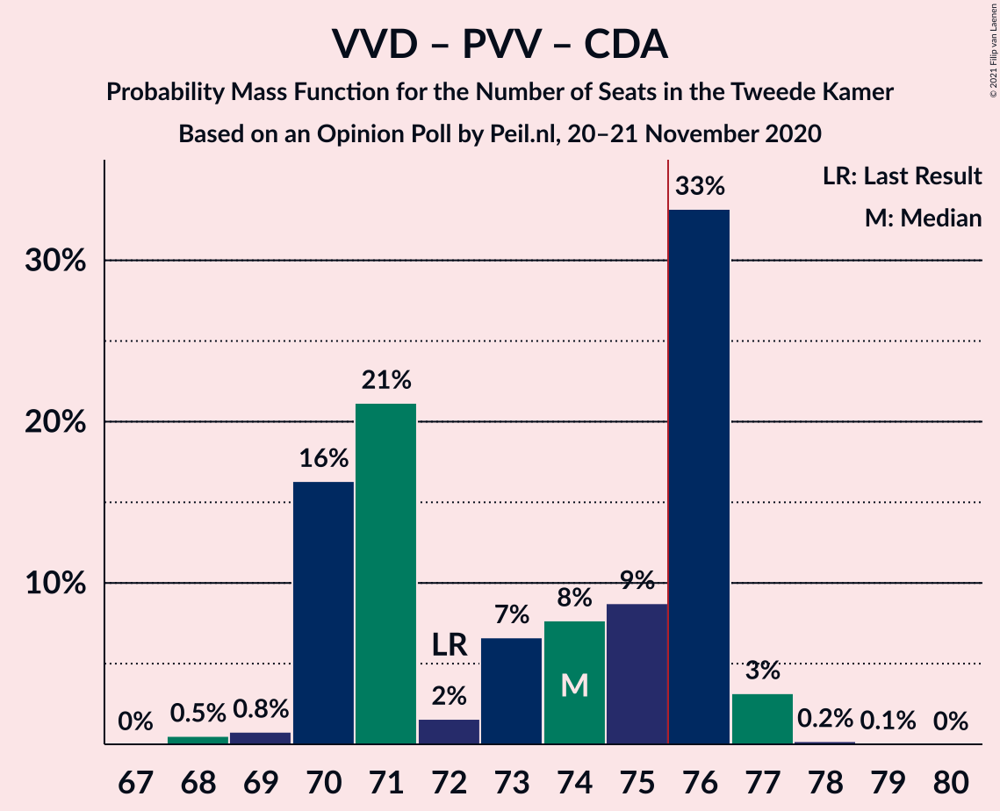

# Opinion Poll by Peil.nl, 20–21 November 2020

<a href="#voting-intentions">Voting Intentions</a> | <a href="#seats">Seats</a> | <a href="#coalitions">Coalitions</a> | <a href="#technical-information">Technical Information</a>

## Voting Intentions

### Confidence Intervals

| Party | Last Result | Poll Result | 80% Confidence Interval | 90% Confidence Interval | 95% Confidence Interval | 99% Confidence Interval |
|:-----:|:-----------:|:-----------:|:-----------------------:|:-----------------------:|:-----------------------:|:-----------------------:|
| Volkspartij voor Vrijheid en Democratie | 21.3% | 23.9% | 23.0–25.0% |22.7–25.3% |22.4–25.5% |22.0–26.0% |
| Partij voor de Vrijheid | 13.1% | 15.9% | 15.1–16.8% |14.9–17.1% |14.7–17.3% |14.3–17.7% |
| Democraten 66 | 12.2% | 8.6% | 8.0–9.3% |7.8–9.5% |7.7–9.7% |7.4–10.0% |
| Partij van de Arbeid | 5.7% | 8.6% | 8.0–9.3% |7.8–9.5% |7.7–9.7% |7.4–10.0% |
| Christen-Democratisch Appèl | 12.4% | 8.0% | 7.4–8.6% |7.2–8.8% |7.0–9.0% |6.8–9.3% |
| GroenLinks | 9.1% | 8.0% | 7.4–8.6% |7.2–8.8% |7.0–9.0% |6.8–9.3% |
| Socialistische Partij | 9.1% | 6.6% | 6.1–7.3% |5.9–7.4% |5.8–7.6% |5.5–7.9% |
| Forum voor Democratie | 1.8% | 5.3% | 4.8–5.9% |4.7–6.0% |4.5–6.2% |4.3–6.4% |
| ChristenUnie | 3.4% | 4.7% | 4.2–5.2% |4.1–5.3% |4.0–5.5% |3.7–5.8% |
| Partij voor de Dieren | 3.2% | 4.0% | 3.6–4.5% |3.4–4.6% |3.4–4.8% |3.2–5.0% |
| Staatkundig Gereformeerde Partij | 2.1% | 2.7% | 2.3–3.1% |2.2–3.2% |2.1–3.3% |2.0–3.5% |
| DENK | 2.1% | 2.0% | 1.7–2.4% |1.6–2.5% |1.6–2.6% |1.4–2.8% |
| 50Plus | 3.1% | 0.7% | 0.5–0.9% |0.5–1.0% |0.4–1.0% |0.4–1.2% |
| Code Oranje | 0.0% | 0.7% | 0.5–0.9% |0.5–1.0% |0.4–1.0% |0.4–1.2% |
| Partij voor de Toekomst | 0.0% | 0.2% | 0.1–0.3% |0.1–0.4% |0.1–0.4% |0.0–0.5% |

*Note:* The poll result column reflects the actual value used in the calculations. Published results may vary slightly, and in addition be rounded to fewer digits.

## Seats

### Confidence Intervals

| Party | Last Result | Median | 80% Confidence Interval | 90% Confidence Interval | 95% Confidence Interval | 99% Confidence Interval |
|:-----:|:-----------:|:------:|:-----------------------:|:-----------------------:|:-----------------------:|:-----------------------:|
| <a href="#volkspartij-voor-vrijheid-en-democratie">Volkspartij voor Vrijheid en Democratie</a> | 33 | 37 | 36–40 |35–40 |35–40 |34–41 |
| <a href="#partij-voor-de-vrijheid">Partij voor de Vrijheid</a> | 20 | 24 | 21–26 |21–26 |21–27 |21–27 |
| <a href="#democraten-66">Democraten 66</a> | 19 | 13 | 12–15 |12–16 |12–16 |11–16 |
| <a href="#partij-van-de-arbeid">Partij van de Arbeid</a> | 9 | 13 | 13–14 |12–14 |12–14 |11–15 |
| <a href="#christen-democratisch-appèl">Christen-Democratisch Appèl</a> | 19 | 11 | 10–14 |10–14 |10–14 |10–15 |
| <a href="#groenlinks">GroenLinks</a> | 14 | 12 | 10–13 |10–13 |10–14 |10–14 |
| <a href="#socialistische-partij">Socialistische Partij</a> | 14 | 9 | 9–12 |8–12 |8–12 |8–12 |
| <a href="#forum-voor-democratie">Forum voor Democratie</a> | 2 | 8 | 7–9 |7–9 |6–10 |6–10 |
| <a href="#christenunie">ChristenUnie</a> | 5 | 7 | 6–8 |6–8 |6–8 |5–9 |
| <a href="#partij-voor-de-dieren">Partij voor de Dieren</a> | 5 | 6 | 5–7 |5–7 |4–7 |4–7 |
| <a href="#staatkundig-gereformeerde-partij">Staatkundig Gereformeerde Partij</a> | 3 | 4 | 3–4 |3–4 |3–5 |3–5 |
| <a href="#denk">DENK</a> | 3 | 3 | 2–3 |2–4 |2–4 |2–4 |
| <a href="#50plus">50Plus</a> | 4 | 1 | 0–1 |0–1 |0–1 |0–1 |
| <a href="#code-oranje">Code Oranje</a> | 0 | 1 | 0–1 |0–1 |0–1 |0–1 |
| <a href="#partij-voor-de-toekomst">Partij voor de Toekomst</a> | 0 | 0 | 0 |0 |0 |0 |

### Volkspartij voor Vrijheid en Democratie

*For a full overview of the results for this party, see the [Volkspartij voor Vrijheid en Democratie](party-volkspartijvoorvrijheidendemocratie.html) page.*

| Number of Seats | Probability | Accumulated | Special Marks |
|:---------------:|:-----------:|:-----------:|:-------------:|
| 33 | 0.1% | 100% | Last Result |
| 34 | 2% | 99.8% |  |
| 35 | 4% | 98% |  |
| 36 | 15% | 93% |  |
| 37 | 39% | 78% | Median |
| 38 | 5% | 39% |  |
| 39 | 2% | 34% |  |
| 40 | 31% | 32% |  |
| 41 | 0.6% | 0.7% |  |
| 42 | 0% | 0% |  |

### Partij voor de Vrijheid

*For a full overview of the results for this party, see the [Partij voor de Vrijheid](party-partijvoordevrijheid.html) page.*

| Number of Seats | Probability | Accumulated | Special Marks |
|:---------------:|:-----------:|:-----------:|:-------------:|
| 20 | 0% | 100% | Last Result |
| 21 | 13% | 100% |  |
| 22 | 9% | 87% |  |
| 23 | 17% | 78% |  |
| 24 | 14% | 61% | Median |
| 25 | 36% | 47% |  |
| 26 | 7% | 11% |  |
| 27 | 3% | 4% |  |
| 28 | 0.4% | 0.4% |  |
| 29 | 0% | 0% |  |

### Democraten 66

*For a full overview of the results for this party, see the [Democraten 66](party-democraten66.html) page.*

| Number of Seats | Probability | Accumulated | Special Marks |
|:---------------:|:-----------:|:-----------:|:-------------:|
| 10 | 0.1% | 100% |  |
| 11 | 2% | 99.9% |  |
| 12 | 39% | 98% |  |
| 13 | 18% | 58% | Median |
| 14 | 18% | 41% |  |
| 15 | 14% | 23% |  |
| 16 | 9% | 9% |  |
| 17 | 0.2% | 0.2% |  |
| 18 | 0% | 0% |  |
| 19 | 0% | 0% | Last Result |

### Partij van de Arbeid

*For a full overview of the results for this party, see the [Partij van de Arbeid](party-partijvandearbeid.html) page.*

| Number of Seats | Probability | Accumulated | Special Marks |
|:---------------:|:-----------:|:-----------:|:-------------:|
| 9 | 0% | 100% | Last Result |
| 10 | 0% | 100% |  |
| 11 | 0.7% | 100% |  |
| 12 | 9% | 99.3% |  |
| 13 | 57% | 90% | Median |
| 14 | 31% | 33% |  |
| 15 | 2% | 2% |  |
| 16 | 0.4% | 0.4% |  |
| 17 | 0% | 0% |  |

### Christen-Democratisch Appèl

*For a full overview of the results for this party, see the [Christen-Democratisch Appèl](party-christen-democratischappèl.html) page.*

| Number of Seats | Probability | Accumulated | Special Marks |
|:---------------:|:-----------:|:-----------:|:-------------:|
| 9 | 0.1% | 100% |  |
| 10 | 15% | 99.9% |  |
| 11 | 38% | 84% | Median |
| 12 | 11% | 46% |  |
| 13 | 24% | 35% |  |
| 14 | 10% | 11% |  |
| 15 | 1.2% | 1.2% |  |
| 16 | 0% | 0% |  |
| 17 | 0% | 0% |  |
| 18 | 0% | 0% |  |
| 19 | 0% | 0% | Last Result |

### GroenLinks

*For a full overview of the results for this party, see the [GroenLinks](party-groenlinks.html) page.*

| Number of Seats | Probability | Accumulated | Special Marks |
|:---------------:|:-----------:|:-----------:|:-------------:|
| 10 | 29% | 100% |  |
| 11 | 12% | 71% |  |
| 12 | 34% | 59% | Median |
| 13 | 22% | 25% |  |
| 14 | 3% | 3% | Last Result |
| 15 | 0.1% | 0.1% |  |
| 16 | 0% | 0% |  |

### Socialistische Partij

*For a full overview of the results for this party, see the [Socialistische Partij](party-socialistischepartij.html) page.*

| Number of Seats | Probability | Accumulated | Special Marks |
|:---------------:|:-----------:|:-----------:|:-------------:|
| 8 | 10% | 100% |  |
| 9 | 42% | 90% | Median |
| 10 | 19% | 48% |  |
| 11 | 18% | 29% |  |
| 12 | 11% | 11% |  |
| 13 | 0% | 0% |  |
| 14 | 0% | 0% | Last Result |

### Forum voor Democratie

*For a full overview of the results for this party, see the [Forum voor Democratie](party-forumvoordemocratie.html) page.*

| Number of Seats | Probability | Accumulated | Special Marks |
|:---------------:|:-----------:|:-----------:|:-------------:|
| 2 | 0% | 100% | Last Result |
| 3 | 0% | 100% |  |
| 4 | 0% | 100% |  |
| 5 | 0% | 100% |  |
| 6 | 5% | 100% |  |
| 7 | 28% | 95% |  |
| 8 | 45% | 67% | Median |
| 9 | 17% | 22% |  |
| 10 | 4% | 4% |  |
| 11 | 0% | 0% |  |

### ChristenUnie

*For a full overview of the results for this party, see the [ChristenUnie](party-christenunie.html) page.*

| Number of Seats | Probability | Accumulated | Special Marks |
|:---------------:|:-----------:|:-----------:|:-------------:|
| 5 | 1.0% | 100% | Last Result |
| 6 | 48% | 99.0% |  |
| 7 | 38% | 51% | Median |
| 8 | 12% | 13% |  |
| 9 | 1.3% | 1.3% |  |
| 10 | 0% | 0% |  |

### Partij voor de Dieren

*For a full overview of the results for this party, see the [Partij voor de Dieren](party-partijvoordedieren.html) page.*

| Number of Seats | Probability | Accumulated | Special Marks |
|:---------------:|:-----------:|:-----------:|:-------------:|
| 4 | 3% | 100% |  |
| 5 | 18% | 97% | Last Result |
| 6 | 48% | 80% | Median |
| 7 | 31% | 31% |  |
| 8 | 0.4% | 0.4% |  |
| 9 | 0% | 0% |  |

### Staatkundig Gereformeerde Partij

*For a full overview of the results for this party, see the [Staatkundig Gereformeerde Partij](party-staatkundiggereformeerdepartij.html) page.*

| Number of Seats | Probability | Accumulated | Special Marks |
|:---------------:|:-----------:|:-----------:|:-------------:|
| 2 | 0.4% | 100% |  |
| 3 | 27% | 99.6% | Last Result |
| 4 | 69% | 73% | Median |
| 5 | 4% | 5% |  |
| 6 | 0.5% | 0.5% |  |
| 7 | 0% | 0% |  |

### DENK

*For a full overview of the results for this party, see the [DENK](party-denk.html) page.*

| Number of Seats | Probability | Accumulated | Special Marks |
|:---------------:|:-----------:|:-----------:|:-------------:|
| 1 | 0.1% | 100% |  |
| 2 | 28% | 99.9% |  |
| 3 | 62% | 71% | Last Result, Median |
| 4 | 9% | 9% |  |
| 5 | 0% | 0% |  |

### 50Plus

*For a full overview of the results for this party, see the [50Plus](party-50plus.html) page.*

| Number of Seats | Probability | Accumulated | Special Marks |
|:---------------:|:-----------:|:-----------:|:-------------:|
| 0 | 19% | 100% |  |
| 1 | 81% | 81% | Median |
| 2 | 0.1% | 0.1% |  |
| 3 | 0% | 0% |  |
| 4 | 0% | 0% | Last Result |

### Code Oranje

*For a full overview of the results for this party, see the [Code Oranje](party-codeoranje.html) page.*

| Number of Seats | Probability | Accumulated | Special Marks |
|:---------------:|:-----------:|:-----------:|:-------------:|
| 0 | 34% | 100% | Last Result |
| 1 | 66% | 66% | Median |
| 2 | 0.1% | 0.1% |  |
| 3 | 0% | 0% |  |

### Partij voor de Toekomst

*For a full overview of the results for this party, see the [Partij voor de Toekomst](party-partijvoordetoekomst.html) page.*

| Number of Seats | Probability | Accumulated | Special Marks |
|:---------------:|:-----------:|:-----------:|:-------------:|
| 0 | 99.6% | 100% | Last Result, Median |
| 1 | 0.4% | 0.4% |  |
| 2 | 0% | 0% |  |

## Coalitions

### Confidence Intervals

| Coalition | Last Result | Median | Majority? | 80% Confidence Interval | 90% Confidence Interval | 95% Confidence Interval | 99% Confidence Interval |
|:---------:|:-----------:|:------:|:---------:|:-----------------------:|:-----------------------:|:-----------------------:|:-----------------------:|
| Volkspartij voor Vrijheid en Democratie – Partij voor de Vrijheid – Christen-Democratisch Appèl – Forum voor Democratie – Staatkundig Gereformeerde Partij | 77 | 85 | 100% | 81–88 | 81–88 | 81–88 | 80–89 |
| Volkspartij voor Vrijheid en Democratie – Democraten 66 – Partij van de Arbeid – Christen-Democratisch Appèl – ChristenUnie | 85 | 82 | 100% | 80–86 | 80–86 | 79–86 | 78–86 |
| Volkspartij voor Vrijheid en Democratie – Democraten 66 – Christen-Democratisch Appèl – GroenLinks – ChristenUnie | 90 | 81 | 99.7% | 79–84 | 79–84 | 78–84 | 77–85 |
| Volkspartij voor Vrijheid en Democratie – Partij voor de Vrijheid – Christen-Democratisch Appèl – Forum voor Democratie | 74 | 81 | 99.5% | 78–84 | 78–84 | 78–84 | 76–85 |
| Volkspartij voor Vrijheid en Democratie – Partij voor de Vrijheid – Christen-Democratisch Appèl | 72 | 74 | 37% | 70–76 | 70–76 | 70–77 | 68–77 |
| Volkspartij voor Vrijheid en Democratie – Democraten 66 – Christen-Democratisch Appèl – ChristenUnie | 76 | 69 | 0.2% | 67–72 | 67–73 | 66–73 | 65–73 |
| Democraten 66 – Partij van de Arbeid – Christen-Democratisch Appèl – GroenLinks – Socialistische Partij – ChristenUnie | 80 | 67 | 0% | 61–72 | 61–72 | 61–72 | 61–72 |
| Volkspartij voor Vrijheid en Democratie – Democraten 66 – Partij van de Arbeid | 61 | 65 | 0% | 62–67 | 62–67 | 60–67 | 58–67 |
| Volkspartij voor Vrijheid en Democratie – Democraten 66 – Christen-Democratisch Appèl | 71 | 63 | 0% | 61–65 | 60–65 | 60–65 | 58–67 |
| Volkspartij voor Vrijheid en Democratie – Partij van de Arbeid – Christen-Democratisch Appèl | 61 | 64 | 0% | 60–64 | 60–64 | 60–65 | 58–66 |
| Volkspartij voor Vrijheid en Democratie – Christen-Democratisch Appèl – Forum voor Democratie – Staatkundig Gereformeerde Partij – 50Plus | 61 | 61 | 0% | 60–64 | 59–64 | 59–64 | 57–67 |
| Volkspartij voor Vrijheid en Democratie – Christen-Democratisch Appèl – Forum voor Democratie – Staatkundig Gereformeerde Partij | 57 | 60 | 0% | 59–63 | 59–63 | 58–63 | 56–67 |
| Democraten 66 – Partij van de Arbeid – Christen-Democratisch Appèl – GroenLinks – ChristenUnie | 66 | 58 | 0% | 52–61 | 52–61 | 52–61 | 52–62 |
| Volkspartij voor Vrijheid en Democratie – Christen-Democratisch Appèl – Forum voor Democratie – 50Plus | 58 | 58 | 0% | 56–60 | 56–60 | 55–60 | 52–63 |
| Volkspartij voor Vrijheid en Democratie – Christen-Democratisch Appèl – Forum voor Democratie | 54 | 57 | 0% | 56–59 | 55–59 | 54–59 | 52–63 |
| Volkspartij voor Vrijheid en Democratie – Partij van de Arbeid | 42 | 51 | 0% | 49–53 | 49–53 | 48–53 | 47–54 |
| Volkspartij voor Vrijheid en Democratie – Christen-Democratisch Appèl | 52 | 50 | 0% | 47–51 | 47–51 | 47–51 | 44–53 |
| Democraten 66 – Partij van de Arbeid – Christen-Democratisch Appèl | 47 | 38 | 0% | 36–42 | 36–42 | 36–42 | 34–44 |
| Partij van de Arbeid – Christen-Democratisch Appèl – ChristenUnie | 33 | 31 | 0% | 30–34 | 29–34 | 29–34 | 29–35 |
| Democraten 66 – Christen-Democratisch Appèl | 38 | 25 | 0% | 23–28 | 23–28 | 23–28 | 22–30 |
| Partij van de Arbeid – Christen-Democratisch Appèl | 28 | 24 | 0% | 24–27 | 23–27 | 23–27 | 23–29 |

### Volkspartij voor Vrijheid en Democratie – Partij voor de Vrijheid – Christen-Democratisch Appèl – Forum voor Democratie – Staatkundig Gereformeerde Partij

| Number of Seats | Probability | Accumulated | Special Marks |
|:---------------:|:-----------:|:-----------:|:-------------:|
| 77 | 0% | 100% | Last Result |
| 78 | 0% | 100% |  |
| 79 | 0% | 100% |  |
| 80 | 0.6% | 100% |  |
| 81 | 13% | 99.4% |  |
| 82 | 8% | 86% |  |
| 83 | 11% | 79% |  |
| 84 | 7% | 68% | Median |
| 85 | 14% | 61% |  |
| 86 | 14% | 47% |  |
| 87 | 1.5% | 33% |  |
| 88 | 29% | 31% |  |
| 89 | 2% | 2% |  |
| 90 | 0.1% | 0.1% |  |
| 91 | 0% | 0% |  |

### Volkspartij voor Vrijheid en Democratie – Democraten 66 – Partij van de Arbeid – Christen-Democratisch Appèl – ChristenUnie

| Number of Seats | Probability | Accumulated | Special Marks |
|:---------------:|:-----------:|:-----------:|:-------------:|
| 77 | 0.2% | 100% |  |
| 78 | 0.3% | 99.8% |  |
| 79 | 3% | 99.4% |  |
| 80 | 10% | 97% |  |
| 81 | 14% | 87% | Median |
| 82 | 31% | 73% |  |
| 83 | 3% | 42% |  |
| 84 | 18% | 38% |  |
| 85 | 7% | 20% | Last Result |
| 86 | 13% | 13% |  |
| 87 | 0.1% | 0.3% |  |
| 88 | 0.2% | 0.2% |  |
| 89 | 0.1% | 0.1% |  |
| 90 | 0% | 0% |  |

### Volkspartij voor Vrijheid en Democratie – Democraten 66 – Christen-Democratisch Appèl – GroenLinks – ChristenUnie

| Number of Seats | Probability | Accumulated | Special Marks |
|:---------------:|:-----------:|:-----------:|:-------------:|
| 74 | 0.2% | 100% |  |
| 75 | 0.1% | 99.8% |  |
| 76 | 0.1% | 99.7% | Majority |
| 77 | 0.2% | 99.6% |  |
| 78 | 3% | 99.4% |  |
| 79 | 34% | 97% |  |
| 80 | 10% | 63% | Median |
| 81 | 10% | 53% |  |
| 82 | 15% | 42% |  |
| 83 | 5% | 27% |  |
| 84 | 21% | 22% |  |
| 85 | 0.5% | 0.7% |  |
| 86 | 0% | 0.2% |  |
| 87 | 0.1% | 0.2% |  |
| 88 | 0.1% | 0.1% |  |
| 89 | 0% | 0% |  |
| 90 | 0% | 0% | Last Result |

### Volkspartij voor Vrijheid en Democratie – Partij voor de Vrijheid – Christen-Democratisch Appèl – Forum voor Democratie

| Number of Seats | Probability | Accumulated | Special Marks |
|:---------------:|:-----------:|:-----------:|:-------------:|
| 74 | 0% | 100% | Last Result |
| 75 | 0.5% | 100% |  |
| 76 | 0% | 99.5% | Majority |
| 77 | 0.9% | 99.5% |  |
| 78 | 20% | 98.6% |  |
| 79 | 10% | 78% |  |
| 80 | 9% | 68% | Median |
| 81 | 11% | 60% |  |
| 82 | 7% | 49% |  |
| 83 | 11% | 42% |  |
| 84 | 29% | 31% |  |
| 85 | 2% | 2% |  |
| 86 | 0.1% | 0.1% |  |
| 87 | 0% | 0% |  |

### Volkspartij voor Vrijheid en Democratie – Partij voor de Vrijheid – Christen-Democratisch Appèl

| Number of Seats | Probability | Accumulated | Special Marks |
|:---------------:|:-----------:|:-----------:|:-------------:|
| 68 | 0.5% | 100% |  |
| 69 | 0.8% | 99.5% |  |
| 70 | 16% | 98.7% |  |
| 71 | 21% | 82% |  |
| 72 | 2% | 61% | Last Result, Median |
| 73 | 7% | 60% |  |
| 74 | 8% | 53% |  |
| 75 | 9% | 45% |  |
| 76 | 33% | 37% | Majority |
| 77 | 3% | 3% |  |
| 78 | 0.2% | 0.3% |  |
| 79 | 0.1% | 0.1% |  |
| 80 | 0% | 0% |  |

### Volkspartij voor Vrijheid en Democratie – Democraten 66 – Christen-Democratisch Appèl – ChristenUnie

| Number of Seats | Probability | Accumulated | Special Marks |
|:---------------:|:-----------:|:-----------:|:-------------:|
| 63 | 0.2% | 100% |  |
| 64 | 0.1% | 99.8% |  |
| 65 | 0.7% | 99.7% |  |
| 66 | 2% | 99.0% |  |
| 67 | 15% | 97% |  |
| 68 | 10% | 82% | Median |
| 69 | 32% | 73% |  |
| 70 | 13% | 41% |  |
| 71 | 9% | 28% |  |
| 72 | 13% | 19% |  |
| 73 | 6% | 6% |  |
| 74 | 0% | 0.2% |  |
| 75 | 0% | 0.2% |  |
| 76 | 0.2% | 0.2% | Last Result, Majority |
| 77 | 0% | 0% |  |

### Democraten 66 – Partij van de Arbeid – Christen-Democratisch Appèl – GroenLinks – Socialistische Partij – ChristenUnie

| Number of Seats | Probability | Accumulated | Special Marks |
|:---------------:|:-----------:|:-----------:|:-------------:|
| 61 | 28% | 100% |  |
| 62 | 0.2% | 72% |  |
| 63 | 0.4% | 72% |  |
| 64 | 0.4% | 71% |  |
| 65 | 2% | 71% | Median |
| 66 | 12% | 68% |  |
| 67 | 17% | 57% |  |
| 68 | 6% | 40% |  |
| 69 | 11% | 34% |  |
| 70 | 9% | 23% |  |
| 71 | 0.2% | 13% |  |
| 72 | 13% | 13% |  |
| 73 | 0% | 0% |  |
| 74 | 0% | 0% |  |
| 75 | 0% | 0% |  |
| 76 | 0% | 0% | Majority |
| 77 | 0% | 0% |  |
| 78 | 0% | 0% |  |
| 79 | 0% | 0% |  |
| 80 | 0% | 0% | Last Result |

### Volkspartij voor Vrijheid en Democratie – Democraten 66 – Partij van de Arbeid

| Number of Seats | Probability | Accumulated | Special Marks |
|:---------------:|:-----------:|:-----------:|:-------------:|
| 58 | 0.8% | 100% |  |
| 59 | 0.4% | 99.2% |  |
| 60 | 1.4% | 98.8% |  |
| 61 | 1.4% | 97% | Last Result |
| 62 | 14% | 96% |  |
| 63 | 18% | 82% | Median |
| 64 | 9% | 64% |  |
| 65 | 30% | 55% |  |
| 66 | 14% | 25% |  |
| 67 | 10% | 11% |  |
| 68 | 0.4% | 0.5% |  |
| 69 | 0.1% | 0.1% |  |
| 70 | 0% | 0% |  |

### Volkspartij voor Vrijheid en Democratie – Democraten 66 – Christen-Democratisch Appèl

| Number of Seats | Probability | Accumulated | Special Marks |
|:---------------:|:-----------:|:-----------:|:-------------:|
| 57 | 0.2% | 100% |  |
| 58 | 0.8% | 99.8% |  |
| 59 | 1.3% | 99.0% |  |
| 60 | 4% | 98% |  |
| 61 | 22% | 94% | Median |
| 62 | 4% | 72% |  |
| 63 | 42% | 68% |  |
| 64 | 5% | 26% |  |
| 65 | 21% | 22% |  |
| 66 | 0.1% | 0.6% |  |
| 67 | 0.3% | 0.5% |  |
| 68 | 0.2% | 0.2% |  |
| 69 | 0% | 0% |  |
| 70 | 0% | 0% |  |
| 71 | 0% | 0% | Last Result |

### Volkspartij voor Vrijheid en Democratie – Partij van de Arbeid – Christen-Democratisch Appèl

| Number of Seats | Probability | Accumulated | Special Marks |
|:---------------:|:-----------:|:-----------:|:-------------:|
| 56 | 0.1% | 100% |  |
| 57 | 0% | 99.9% |  |
| 58 | 1.0% | 99.9% |  |
| 59 | 0.6% | 98.9% |  |
| 60 | 11% | 98% |  |
| 61 | 18% | 87% | Last Result, Median |
| 62 | 6% | 70% |  |
| 63 | 10% | 64% |  |
| 64 | 50% | 53% |  |
| 65 | 2% | 3% |  |
| 66 | 2% | 2% |  |
| 67 | 0.2% | 0.2% |  |
| 68 | 0% | 0% |  |

### Volkspartij voor Vrijheid en Democratie – Christen-Democratisch Appèl – Forum voor Democratie – Staatkundig Gereformeerde Partij – 50Plus

| Number of Seats | Probability | Accumulated | Special Marks |
|:---------------:|:-----------:|:-----------:|:-------------:|
| 57 | 0.8% | 100% |  |
| 58 | 0.6% | 99.2% |  |
| 59 | 6% | 98.6% |  |
| 60 | 8% | 93% |  |
| 61 | 36% | 85% | Last Result, Median |
| 62 | 11% | 49% |  |
| 63 | 8% | 39% |  |
| 64 | 29% | 31% |  |
| 65 | 0.1% | 2% |  |
| 66 | 0.1% | 2% |  |
| 67 | 1.4% | 1.4% |  |
| 68 | 0% | 0% |  |

### Volkspartij voor Vrijheid en Democratie – Christen-Democratisch Appèl – Forum voor Democratie – Staatkundig Gereformeerde Partij

| Number of Seats | Probability | Accumulated | Special Marks |
|:---------------:|:-----------:|:-----------:|:-------------:|
| 56 | 0.6% | 100% |  |
| 57 | 0.3% | 99.4% | Last Result |
| 58 | 3% | 99.2% |  |
| 59 | 7% | 96% |  |
| 60 | 39% | 89% | Median |
| 61 | 5% | 50% |  |
| 62 | 12% | 45% |  |
| 63 | 31% | 33% |  |
| 64 | 0.2% | 2% |  |
| 65 | 0.2% | 2% |  |
| 66 | 0.3% | 1.4% |  |
| 67 | 1.1% | 1.1% |  |
| 68 | 0% | 0% |  |

### Democraten 66 – Partij van de Arbeid – Christen-Democratisch Appèl – GroenLinks – ChristenUnie

| Number of Seats | Probability | Accumulated | Special Marks |
|:---------------:|:-----------:|:-----------:|:-------------:|
| 52 | 28% | 100% |  |
| 53 | 0.4% | 72% |  |
| 54 | 2% | 71% |  |
| 55 | 0.9% | 69% |  |
| 56 | 11% | 69% | Median |
| 57 | 6% | 58% |  |
| 58 | 16% | 51% |  |
| 59 | 19% | 35% |  |
| 60 | 2% | 16% |  |
| 61 | 13% | 14% |  |
| 62 | 0.5% | 0.5% |  |
| 63 | 0% | 0% |  |
| 64 | 0% | 0% |  |
| 65 | 0% | 0% |  |
| 66 | 0% | 0% | Last Result |

### Volkspartij voor Vrijheid en Democratie – Christen-Democratisch Appèl – Forum voor Democratie – 50Plus

| Number of Seats | Probability | Accumulated | Special Marks |
|:---------------:|:-----------:|:-----------:|:-------------:|
| 52 | 0.5% | 100% |  |
| 53 | 0.5% | 99.5% |  |
| 54 | 0.5% | 99.0% |  |
| 55 | 3% | 98% |  |
| 56 | 7% | 96% |  |
| 57 | 27% | 89% | Median |
| 58 | 20% | 62% | Last Result |
| 59 | 11% | 42% |  |
| 60 | 29% | 31% |  |
| 61 | 0.3% | 2% |  |
| 62 | 0.3% | 2% |  |
| 63 | 1.4% | 1.4% |  |
| 64 | 0% | 0% |  |

### Volkspartij voor Vrijheid en Democratie – Christen-Democratisch Appèl – Forum voor Democratie

| Number of Seats | Probability | Accumulated | Special Marks |
|:---------------:|:-----------:|:-----------:|:-------------:|
| 51 | 0.5% | 100% |  |
| 52 | 0.1% | 99.5% |  |
| 53 | 0.7% | 99.4% |  |
| 54 | 2% | 98.7% | Last Result |
| 55 | 3% | 97% |  |
| 56 | 28% | 93% | Median |
| 57 | 21% | 65% |  |
| 58 | 9% | 44% |  |
| 59 | 33% | 36% |  |
| 60 | 0.4% | 2% |  |
| 61 | 0.3% | 2% |  |
| 62 | 0.4% | 2% |  |
| 63 | 1.1% | 1.1% |  |
| 64 | 0% | 0% |  |

### Volkspartij voor Vrijheid en Democratie – Partij van de Arbeid

| Number of Seats | Probability | Accumulated | Special Marks |
|:---------------:|:-----------:|:-----------:|:-------------:|
| 42 | 0% | 100% | Last Result |
| 43 | 0% | 100% |  |
| 44 | 0% | 100% |  |
| 45 | 0.3% | 100% |  |
| 46 | 0% | 99.7% |  |
| 47 | 2% | 99.7% |  |
| 48 | 1.3% | 98% |  |
| 49 | 20% | 96% |  |
| 50 | 14% | 76% | Median |
| 51 | 30% | 63% |  |
| 52 | 1.3% | 33% |  |
| 53 | 30% | 32% |  |
| 54 | 2% | 2% |  |
| 55 | 0% | 0% |  |

### Volkspartij voor Vrijheid en Democratie – Christen-Democratisch Appèl

| Number of Seats | Probability | Accumulated | Special Marks |
|:---------------:|:-----------:|:-----------:|:-------------:|
| 44 | 0.6% | 100% |  |
| 45 | 0.6% | 99.4% |  |
| 46 | 0.1% | 98.8% |  |
| 47 | 20% | 98.6% |  |
| 48 | 11% | 78% | Median |
| 49 | 7% | 67% |  |
| 50 | 17% | 61% |  |
| 51 | 42% | 44% |  |
| 52 | 0.4% | 2% | Last Result |
| 53 | 1.5% | 2% |  |
| 54 | 0.1% | 0.2% |  |
| 55 | 0.1% | 0.1% |  |
| 56 | 0% | 0% |  |

### Democraten 66 – Partij van de Arbeid – Christen-Democratisch Appèl

| Number of Seats | Probability | Accumulated | Special Marks |
|:---------------:|:-----------:|:-----------:|:-------------:|
| 34 | 1.1% | 100% |  |
| 35 | 0.7% | 98.8% |  |
| 36 | 29% | 98% |  |
| 37 | 9% | 69% | Median |
| 38 | 19% | 60% |  |
| 39 | 7% | 41% |  |
| 40 | 21% | 35% |  |
| 41 | 0.4% | 14% |  |
| 42 | 13% | 14% |  |
| 43 | 0% | 0.6% |  |
| 44 | 0.5% | 0.5% |  |
| 45 | 0% | 0% |  |
| 46 | 0% | 0% |  |
| 47 | 0% | 0% | Last Result |

### Partij van de Arbeid – Christen-Democratisch Appèl – ChristenUnie

| Number of Seats | Probability | Accumulated | Special Marks |
|:---------------:|:-----------:|:-----------:|:-------------:|
| 27 | 0.1% | 100% |  |
| 28 | 0.1% | 99.9% |  |
| 29 | 6% | 99.9% |  |
| 30 | 33% | 94% |  |
| 31 | 14% | 60% | Median |
| 32 | 12% | 47% |  |
| 33 | 6% | 35% | Last Result |
| 34 | 27% | 29% |  |
| 35 | 2% | 2% |  |
| 36 | 0.1% | 0.1% |  |
| 37 | 0% | 0% |  |

### Democraten 66 – Christen-Democratisch Appèl

| Number of Seats | Probability | Accumulated | Special Marks |
|:---------------:|:-----------:|:-----------:|:-------------:|
| 22 | 2% | 100% |  |
| 23 | 29% | 98% |  |
| 24 | 11% | 69% | Median |
| 25 | 22% | 58% |  |
| 26 | 13% | 36% |  |
| 27 | 4% | 24% |  |
| 28 | 19% | 19% |  |
| 29 | 0.2% | 0.8% |  |
| 30 | 0.5% | 0.5% |  |
| 31 | 0% | 0% |  |
| 32 | 0% | 0% |  |
| 33 | 0% | 0% |  |
| 34 | 0% | 0% |  |
| 35 | 0% | 0% |  |
| 36 | 0% | 0% |  |
| 37 | 0% | 0% |  |
| 38 | 0% | 0% | Last Result |

### Partij van de Arbeid – Christen-Democratisch Appèl

| Number of Seats | Probability | Accumulated | Special Marks |
|:---------------:|:-----------:|:-----------:|:-------------:|
| 21 | 0.1% | 100% |  |
| 22 | 0.2% | 99.9% |  |
| 23 | 8% | 99.7% |  |
| 24 | 44% | 92% | Median |
| 25 | 10% | 47% |  |
| 26 | 12% | 37% |  |
| 27 | 23% | 24% |  |
| 28 | 0.5% | 2% | Last Result |
| 29 | 1.1% | 1.1% |  |
| 30 | 0% | 0% |  |

## Technical Information

### Opinion Poll

+ **Polling firm:** Peil.nl
+ **Commissioner(s):** —
+ **Fieldwork period:** 20–21 November 2020

### Calculations

+ **Sample size:** 3000
+ **Simulations done:** 1,048,576
+ **Error estimate:** 2.27%

