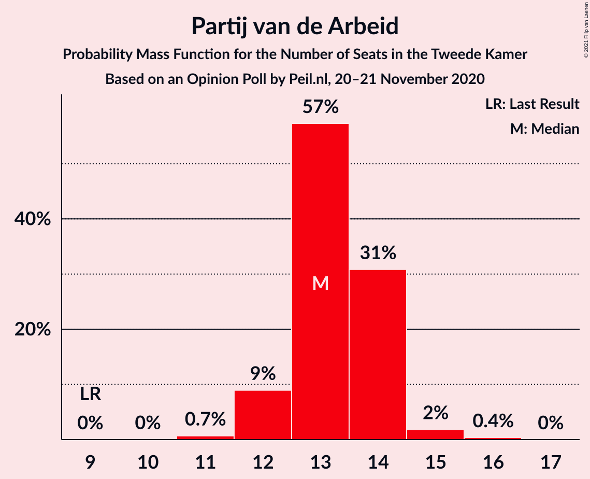
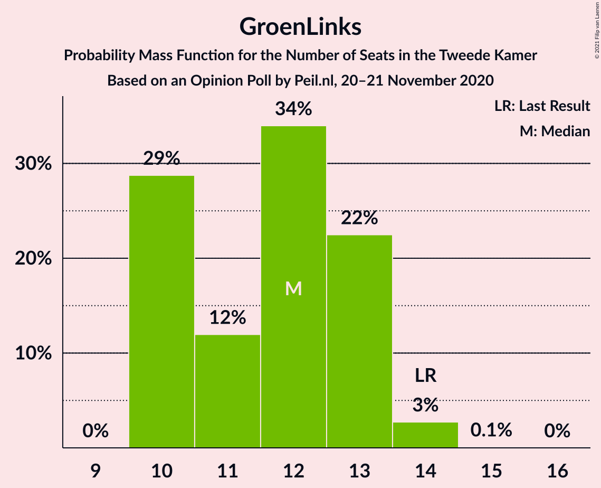
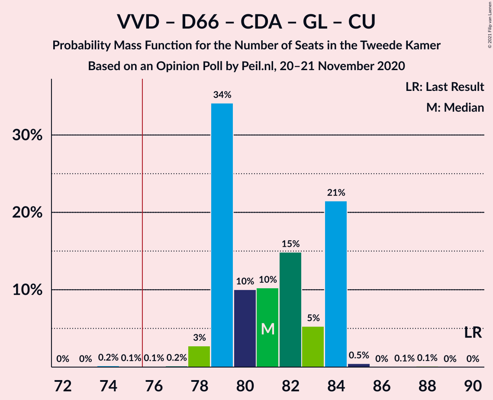
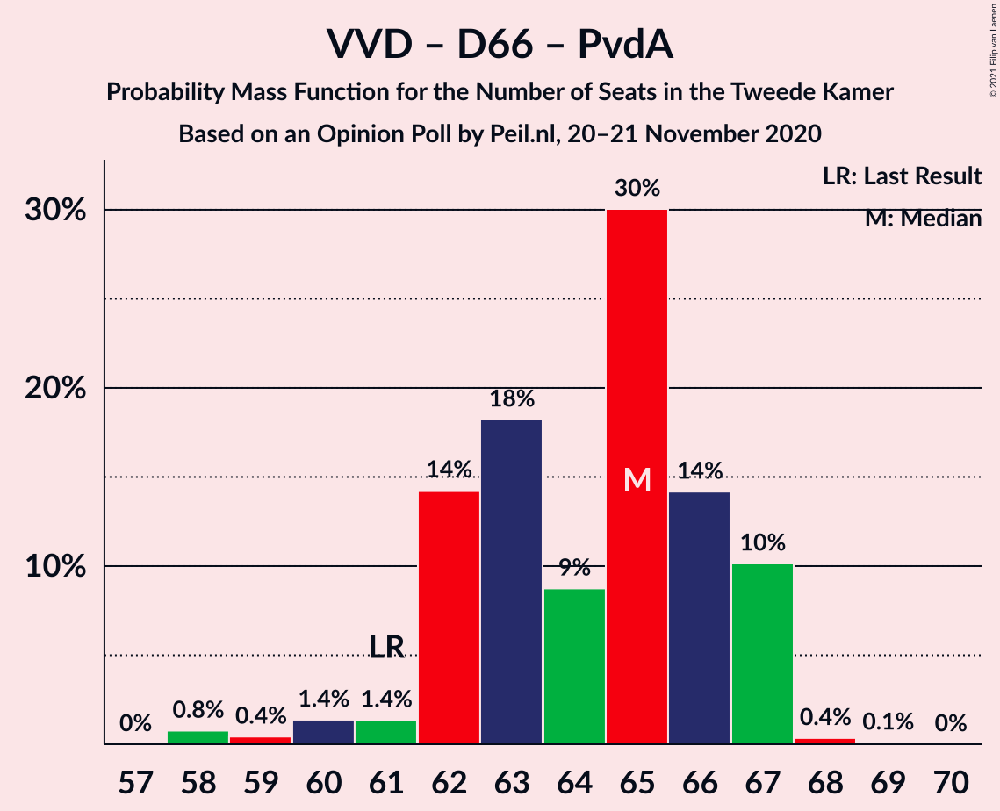
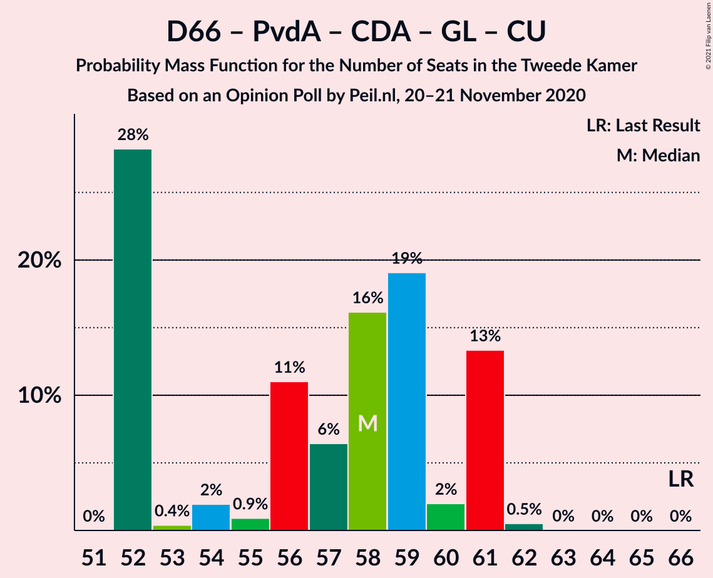
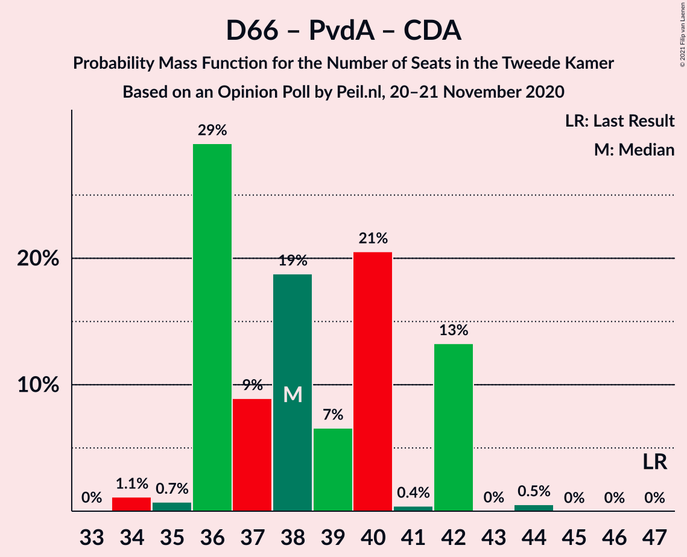

# Opinion Poll by Peil.nl, 20–21 November 2020

<a href="#voting-intentions">Voting Intentions</a> | <a href="#seats">Seats</a> | <a href="#coalitions">Coalitions</a> | <a href="#technical-information">Technical Information</a>

## Voting Intentions

### Confidence Intervals

| Party | Last Result | Poll Result | 80% Confidence Interval | 90% Confidence Interval | 95% Confidence Interval | 99% Confidence Interval |
|:-----:|:-----------:|:-----------:|:-----------------------:|:-----------------------:|:-----------------------:|:-----------------------:|
| Volkspartij voor Vrijheid en Democratie | 21.3% | 23.9% | 23.0–25.0% |22.7–25.3% |22.4–25.5% |22.0–26.0% |
| Partij voor de Vrijheid | 13.1% | 15.9% | 15.1–16.8% |14.9–17.1% |14.7–17.3% |14.3–17.7% |
| Democraten 66 | 12.2% | 8.6% | 8.0–9.3% |7.8–9.5% |7.7–9.7% |7.4–10.0% |
| Partij van de Arbeid | 5.7% | 8.6% | 8.0–9.3% |7.8–9.5% |7.7–9.7% |7.4–10.0% |
| Christen-Democratisch Appèl | 12.4% | 8.0% | 7.4–8.6% |7.2–8.8% |7.0–9.0% |6.8–9.3% |
| GroenLinks | 9.1% | 8.0% | 7.4–8.6% |7.2–8.8% |7.0–9.0% |6.8–9.3% |
| Socialistische Partij | 9.1% | 6.6% | 6.1–7.3% |5.9–7.4% |5.8–7.6% |5.5–7.9% |
| Forum voor Democratie | 1.8% | 5.3% | 4.8–5.9% |4.7–6.0% |4.5–6.2% |4.3–6.4% |
| ChristenUnie | 3.4% | 4.7% | 4.2–5.2% |4.1–5.3% |4.0–5.5% |3.7–5.8% |
| Partij voor de Dieren | 3.2% | 4.0% | 3.6–4.5% |3.4–4.6% |3.4–4.8% |3.2–5.0% |
| Staatkundig Gereformeerde Partij | 2.1% | 2.7% | 2.3–3.1% |2.2–3.2% |2.1–3.3% |2.0–3.5% |
| DENK | 2.1% | 2.0% | 1.7–2.4% |1.6–2.5% |1.6–2.6% |1.4–2.8% |
| 50Plus | 3.1% | 0.7% | 0.5–0.9% |0.5–1.0% |0.4–1.0% |0.4–1.2% |
| Code Oranje | 0.0% | 0.7% | 0.5–0.9% |0.5–1.0% |0.4–1.0% |0.4–1.2% |
| Partij voor de Toekomst | 0.0% | 0.2% | 0.1–0.3% |0.1–0.4% |0.1–0.4% |0.0–0.5% |

*Note:* The poll result column reflects the actual value used in the calculations. Published results may vary slightly, and in addition be rounded to fewer digits.

## Seats

### Confidence Intervals

| Party | Last Result | Median | 80% Confidence Interval | 90% Confidence Interval | 95% Confidence Interval | 99% Confidence Interval |
|:-----:|:-----------:|:------:|:-----------------------:|:-----------------------:|:-----------------------:|:-----------------------:|
| <a href="#volkspartij-voor-vrijheid-en-democratie">Volkspartij voor Vrijheid en Democratie</a> | 33 | 37 | 36–40 |34–40 |34–40 |34–41 |
| <a href="#partij-voor-de-vrijheid">Partij voor de Vrijheid</a> | 20 | 23 | 22–24 |22–25 |22–26 |22–26 |
| <a href="#democraten-66">Democraten 66</a> | 19 | 14 | 12–14 |12–14 |12–14 |11–14 |
| <a href="#partij-van-de-arbeid">Partij van de Arbeid</a> | 9 | 12 | 12–14 |12–14 |12–15 |12–16 |
| <a href="#christen-democratisch-appèl">Christen-Democratisch Appèl</a> | 19 | 14 | 11–14 |10–14 |10–14 |10–14 |
| <a href="#groenlinks">GroenLinks</a> | 14 | 11 | 11–13 |11–13 |11–13 |11–13 |
| <a href="#socialistische-partij">Socialistische Partij</a> | 14 | 10 | 10–11 |9–11 |9–12 |9–12 |
| <a href="#forum-voor-democratie">Forum voor Democratie</a> | 2 | 7 | 7–10 |7–10 |7–10 |7–10 |
| <a href="#christenunie">ChristenUnie</a> | 5 | 8 | 6–8 |6–8 |6–8 |5–8 |
| <a href="#partij-voor-de-dieren">Partij voor de Dieren</a> | 5 | 6 | 5–6 |5–6 |4–6 |4–7 |
| <a href="#staatkundig-gereformeerde-partij">Staatkundig Gereformeerde Partij</a> | 3 | 4 | 4–5 |4–5 |3–6 |3–6 |
| <a href="#denk">DENK</a> | 3 | 3 | 2–3 |2–4 |2–4 |2–4 |
| <a href="#50plus">50Plus</a> | 4 | 1 | 0–1 |0–1 |0–1 |0–1 |
| <a href="#code-oranje">Code Oranje</a> | 0 | 0 | 0–1 |0–1 |0–1 |0–1 |
| <a href="#partij-voor-de-toekomst">Partij voor de Toekomst</a> | 0 | 0 | 0 |0 |0 |0 |

### Volkspartij voor Vrijheid en Democratie

*For a full overview of the results for this party, see the [Volkspartij voor Vrijheid en Democratie](party-volkspartijvoorvrijheidendemocratie.html) page.*

| Number of Seats | Probability | Accumulated | Special Marks |
|:---------------:|:-----------:|:-----------:|:-------------:|
| 32 | 0.1% | 100% |  |
| 33 | 0.1% | 99.9% | Last Result |
| 34 | 6% | 99.8% |  |
| 35 | 2% | 93% |  |
| 36 | 2% | 92% |  |
| 37 | 66% | 89% | Median |
| 38 | 4% | 23% |  |
| 39 | 0.3% | 19% |  |
| 40 | 18% | 19% |  |
| 41 | 1.2% | 1.3% |  |
| 42 | 0% | 0% |  |

### Partij voor de Vrijheid

*For a full overview of the results for this party, see the [Partij voor de Vrijheid](party-partijvoordevrijheid.html) page.*

| Number of Seats | Probability | Accumulated | Special Marks |
|:---------------:|:-----------:|:-----------:|:-------------:|
| 20 | 0% | 100% | Last Result |
| 21 | 0.1% | 100% |  |
| 22 | 15% | 99.9% |  |
| 23 | 70% | 85% | Median |
| 24 | 8% | 15% |  |
| 25 | 2% | 7% |  |
| 26 | 4% | 4% |  |
| 27 | 0.2% | 0.2% |  |
| 28 | 0% | 0% |  |

### Democraten 66

*For a full overview of the results for this party, see the [Democraten 66](party-democraten66.html) page.*

| Number of Seats | Probability | Accumulated | Special Marks |
|:---------------:|:-----------:|:-----------:|:-------------:|
| 11 | 0.6% | 100% |  |
| 12 | 22% | 99.4% |  |
| 13 | 2% | 77% |  |
| 14 | 75% | 75% | Median |
| 15 | 0.3% | 0.4% |  |
| 16 | 0.1% | 0.1% |  |
| 17 | 0% | 0% |  |
| 18 | 0% | 0% |  |
| 19 | 0% | 0% | Last Result |

### Partij van de Arbeid

*For a full overview of the results for this party, see the [Partij van de Arbeid](party-partijvandearbeid.html) page.*

| Number of Seats | Probability | Accumulated | Special Marks |
|:---------------:|:-----------:|:-----------:|:-------------:|
| 9 | 0% | 100% | Last Result |
| 10 | 0% | 100% |  |
| 11 | 0.1% | 100% |  |
| 12 | 70% | 99.8% | Median |
| 13 | 16% | 29% |  |
| 14 | 10% | 14% |  |
| 15 | 3% | 4% |  |
| 16 | 1.3% | 1.4% |  |
| 17 | 0% | 0% |  |

### Christen-Democratisch Appèl

*For a full overview of the results for this party, see the [Christen-Democratisch Appèl](party-christen-democratischappèl.html) page.*

| Number of Seats | Probability | Accumulated | Special Marks |
|:---------------:|:-----------:|:-----------:|:-------------:|
| 10 | 10% | 100% |  |
| 11 | 5% | 90% |  |
| 12 | 2% | 85% |  |
| 13 | 17% | 83% |  |
| 14 | 66% | 66% | Median |
| 15 | 0% | 0% |  |
| 16 | 0% | 0% |  |
| 17 | 0% | 0% |  |
| 18 | 0% | 0% |  |
| 19 | 0% | 0% | Last Result |

### GroenLinks

*For a full overview of the results for this party, see the [GroenLinks](party-groenlinks.html) page.*

| Number of Seats | Probability | Accumulated | Special Marks |
|:---------------:|:-----------:|:-----------:|:-------------:|
| 10 | 0.4% | 100% |  |
| 11 | 72% | 99.6% | Median |
| 12 | 15% | 27% |  |
| 13 | 13% | 13% |  |
| 14 | 0% | 0% | Last Result |

### Socialistische Partij

*For a full overview of the results for this party, see the [Socialistische Partij](party-socialistischepartij.html) page.*

| Number of Seats | Probability | Accumulated | Special Marks |
|:---------------:|:-----------:|:-----------:|:-------------:|
| 8 | 0.1% | 100% |  |
| 9 | 7% | 99.9% |  |
| 10 | 81% | 93% | Median |
| 11 | 8% | 12% |  |
| 12 | 4% | 4% |  |
| 13 | 0% | 0% |  |
| 14 | 0% | 0% | Last Result |

### Forum voor Democratie

*For a full overview of the results for this party, see the [Forum voor Democratie](party-forumvoordemocratie.html) page.*

| Number of Seats | Probability | Accumulated | Special Marks |
|:---------------:|:-----------:|:-----------:|:-------------:|
| 2 | 0% | 100% | Last Result |
| 3 | 0% | 100% |  |
| 4 | 0% | 100% |  |
| 5 | 0% | 100% |  |
| 6 | 0.1% | 100% |  |
| 7 | 77% | 99.9% | Median |
| 8 | 7% | 23% |  |
| 9 | 0.2% | 17% |  |
| 10 | 16% | 17% |  |
| 11 | 0.3% | 0.3% |  |
| 12 | 0% | 0% |  |

### ChristenUnie

*For a full overview of the results for this party, see the [ChristenUnie](party-christenunie.html) page.*

| Number of Seats | Probability | Accumulated | Special Marks |
|:---------------:|:-----------:|:-----------:|:-------------:|
| 5 | 0.5% | 100% | Last Result |
| 6 | 18% | 99.5% |  |
| 7 | 15% | 82% |  |
| 8 | 67% | 67% | Median |
| 9 | 0% | 0% |  |

### Partij voor de Dieren

*For a full overview of the results for this party, see the [Partij voor de Dieren](party-partijvoordedieren.html) page.*

| Number of Seats | Probability | Accumulated | Special Marks |
|:---------------:|:-----------:|:-----------:|:-------------:|
| 4 | 3% | 100% |  |
| 5 | 20% | 97% | Last Result |
| 6 | 77% | 77% | Median |
| 7 | 0.4% | 0.5% |  |
| 8 | 0.1% | 0.1% |  |
| 9 | 0% | 0% |  |

### Staatkundig Gereformeerde Partij

*For a full overview of the results for this party, see the [Staatkundig Gereformeerde Partij](party-staatkundiggereformeerdepartij.html) page.*

| Number of Seats | Probability | Accumulated | Special Marks |
|:---------------:|:-----------:|:-----------:|:-------------:|
| 2 | 0.1% | 100% |  |
| 3 | 5% | 99.9% | Last Result |
| 4 | 81% | 95% | Median |
| 5 | 10% | 14% |  |
| 6 | 4% | 4% |  |
| 7 | 0% | 0% |  |

### DENK

*For a full overview of the results for this party, see the [DENK](party-denk.html) page.*

| Number of Seats | Probability | Accumulated | Special Marks |
|:---------------:|:-----------:|:-----------:|:-------------:|
| 1 | 0.1% | 100% |  |
| 2 | 22% | 99.9% |  |
| 3 | 72% | 78% | Last Result, Median |
| 4 | 6% | 6% |  |
| 5 | 0% | 0% |  |

### 50Plus

*For a full overview of the results for this party, see the [50Plus](party-50plus.html) page.*

| Number of Seats | Probability | Accumulated | Special Marks |
|:---------------:|:-----------:|:-----------:|:-------------:|
| 0 | 23% | 100% |  |
| 1 | 77% | 77% | Median |
| 2 | 0% | 0% |  |
| 3 | 0% | 0% |  |
| 4 | 0% | 0% | Last Result |

### Code Oranje

*For a full overview of the results for this party, see the [Code Oranje](party-codeoranje.html) page.*

| Number of Seats | Probability | Accumulated | Special Marks |
|:---------------:|:-----------:|:-----------:|:-------------:|
| 0 | 77% | 100% | Last Result, Median |
| 1 | 23% | 23% |  |
| 2 | 0% | 0% |  |

### Partij voor de Toekomst

*For a full overview of the results for this party, see the [Partij voor de Toekomst](party-partijvoordetoekomst.html) page.*

| Number of Seats | Probability | Accumulated | Special Marks |
|:---------------:|:-----------:|:-----------:|:-------------:|
| 0 | 100% | 100% | Last Result, Median |

## Coalitions

### Confidence Intervals

| Coalition | Last Result | Median | Majority? | 80% Confidence Interval | 90% Confidence Interval | 95% Confidence Interval | 99% Confidence Interval |
|:---------:|:-----------:|:------:|:---------:|:-----------------------:|:-----------------------:|:-----------------------:|:-----------------------:|
| Volkspartij voor Vrijheid en Democratie – Partij voor de Vrijheid – Christen-Democratisch Appèl – Forum voor Democratie – Staatkundig Gereformeerde Partij | 77 | 85 | 100% | 85–89 | 80–89 | 80–89 | 80–89 |
| Volkspartij voor Vrijheid en Democratie – Democraten 66 – Partij van de Arbeid – Christen-Democratisch Appèl – ChristenUnie | 85 | 85 | 100% | 80–85 | 79–85 | 79–85 | 79–89 |
| Volkspartij voor Vrijheid en Democratie – Partij voor de Vrijheid – Christen-Democratisch Appèl – Forum voor Democratie | 74 | 81 | 94% | 79–85 | 75–85 | 75–85 | 75–85 |
| Volkspartij voor Vrijheid en Democratie – Democraten 66 – Christen-Democratisch Appèl – GroenLinks – ChristenUnie | 90 | 84 | 99.7% | 80–84 | 78–84 | 78–84 | 78–87 |
| Volkspartij voor Vrijheid en Democratie – Partij voor de Vrijheid – Christen-Democratisch Appèl | 72 | 74 | 5% | 72–75 | 68–76 | 68–76 | 68–77 |
| Volkspartij voor Vrijheid en Democratie – Democraten 66 – Christen-Democratisch Appèl – ChristenUnie | 76 | 73 | 0.8% | 68–73 | 65–73 | 65–73 | 65–76 |
| Democraten 66 – Partij van de Arbeid – Christen-Democratisch Appèl – GroenLinks – Socialistische Partij – ChristenUnie | 80 | 69 | 0% | 66–69 | 65–69 | 63–69 | 63–70 |
| Volkspartij voor Vrijheid en Democratie – Christen-Democratisch Appèl – Forum voor Democratie – Staatkundig Gereformeerde Partij – 50Plus | 61 | 63 | 0% | 62–67 | 57–67 | 57–67 | 57–67 |
| Volkspartij voor Vrijheid en Democratie – Christen-Democratisch Appèl – Forum voor Democratie – Staatkundig Gereformeerde Partij | 57 | 62 | 0% | 61–67 | 56–67 | 56–67 | 56–67 |
| Volkspartij voor Vrijheid en Democratie – Democraten 66 – Partij van de Arbeid | 61 | 63 | 0% | 62–65 | 62–66 | 62–66 | 60–68 |
| Volkspartij voor Vrijheid en Democratie – Partij van de Arbeid – Christen-Democratisch Appèl | 61 | 63 | 0% | 61–66 | 58–66 | 58–66 | 58–67 |
| Volkspartij voor Vrijheid en Democratie – Democraten 66 – Christen-Democratisch Appèl | 71 | 65 | 0% | 61–65 | 58–65 | 58–65 | 58–68 |
| Volkspartij voor Vrijheid en Democratie – Christen-Democratisch Appèl – Forum voor Democratie – 50Plus | 58 | 59 | 0% | 56–63 | 52–63 | 52–63 | 52–63 |
| Volkspartij voor Vrijheid en Democratie – Christen-Democratisch Appèl – Forum voor Democratie | 54 | 58 | 0% | 56–63 | 51–63 | 51–63 | 51–63 |
| Democraten 66 – Partij van de Arbeid – Christen-Democratisch Appèl – GroenLinks – ChristenUnie | 66 | 59 | 0% | 56–59 | 55–59 | 54–59 | 54–60 |
| Volkspartij voor Vrijheid en Democratie – Partij van de Arbeid | 42 | 49 | 0% | 49–53 | 48–54 | 48–54 | 48–54 |
| Volkspartij voor Vrijheid en Democratie – Christen-Democratisch Appèl | 52 | 51 | 0% | 48–53 | 44–53 | 44–53 | 44–54 |
| Democraten 66 – Partij van de Arbeid – Christen-Democratisch Appèl | 47 | 40 | 0% | 38–40 | 36–40 | 35–41 | 35–42 |
| Partij van de Arbeid – Christen-Democratisch Appèl – ChristenUnie | 33 | 34 | 0% | 31–34 | 31–34 | 30–34 | 29–35 |
| Democraten 66 – Christen-Democratisch Appèl | 38 | 28 | 0% | 24–28 | 23–28 | 22–28 | 22–28 |
| Partij van de Arbeid – Christen-Democratisch Appèl | 28 | 26 | 0% | 24–26 | 24–26 | 23–27 | 23–29 |

### Volkspartij voor Vrijheid en Democratie – Partij voor de Vrijheid – Christen-Democratisch Appèl – Forum voor Democratie – Staatkundig Gereformeerde Partij

| Number of Seats | Probability | Accumulated | Special Marks |
|:---------------:|:-----------:|:-----------:|:-------------:|
| 77 | 0% | 100% | Last Result |
| 78 | 0% | 100% |  |
| 79 | 0% | 100% |  |
| 80 | 6% | 100% |  |
| 81 | 0% | 94% |  |
| 82 | 0.3% | 94% |  |
| 83 | 0.1% | 94% |  |
| 84 | 2% | 94% |  |
| 85 | 73% | 92% | Median |
| 86 | 0.1% | 20% |  |
| 87 | 2% | 19% |  |
| 88 | 0% | 18% |  |
| 89 | 18% | 18% |  |
| 90 | 0.1% | 0.1% |  |
| 91 | 0% | 0% |  |

### Volkspartij voor Vrijheid en Democratie – Democraten 66 – Partij van de Arbeid – Christen-Democratisch Appèl – ChristenUnie

| Number of Seats | Probability | Accumulated | Special Marks |
|:---------------:|:-----------:|:-----------:|:-------------:|
| 77 | 0.1% | 100% |  |
| 78 | 0.3% | 99.9% |  |
| 79 | 6% | 99.6% |  |
| 80 | 5% | 94% |  |
| 81 | 0.1% | 89% |  |
| 82 | 0.3% | 89% |  |
| 83 | 8% | 89% |  |
| 84 | 14% | 81% |  |
| 85 | 66% | 67% | Last Result, Median |
| 86 | 0.1% | 0.9% |  |
| 87 | 0.1% | 0.8% |  |
| 88 | 0% | 0.8% |  |
| 89 | 0.8% | 0.8% |  |
| 90 | 0% | 0% |  |

### Volkspartij voor Vrijheid en Democratie – Partij voor de Vrijheid – Christen-Democratisch Appèl – Forum voor Democratie

| Number of Seats | Probability | Accumulated | Special Marks |
|:---------------:|:-----------:|:-----------:|:-------------:|
| 74 | 0% | 100% | Last Result |
| 75 | 6% | 100% |  |
| 76 | 0% | 94% | Majority |
| 77 | 0% | 94% |  |
| 78 | 0.2% | 94% |  |
| 79 | 4% | 94% |  |
| 80 | 0.7% | 90% |  |
| 81 | 68% | 89% | Median |
| 82 | 2% | 22% |  |
| 83 | 0.5% | 20% |  |
| 84 | 5% | 19% |  |
| 85 | 14% | 14% |  |
| 86 | 0% | 0.1% |  |
| 87 | 0.1% | 0.1% |  |
| 88 | 0% | 0% |  |

### Volkspartij voor Vrijheid en Democratie – Democraten 66 – Christen-Democratisch Appèl – GroenLinks – ChristenUnie

| Number of Seats | Probability | Accumulated | Special Marks |
|:---------------:|:-----------:|:-----------:|:-------------:|
| 75 | 0.3% | 100% |  |
| 76 | 0% | 99.7% | Majority |
| 77 | 0.2% | 99.7% |  |
| 78 | 8% | 99.5% |  |
| 79 | 0% | 92% |  |
| 80 | 4% | 92% |  |
| 81 | 6% | 88% |  |
| 82 | 0.8% | 82% |  |
| 83 | 14% | 81% |  |
| 84 | 66% | 67% | Median |
| 85 | 0.1% | 0.9% |  |
| 86 | 0% | 0.8% |  |
| 87 | 0.8% | 0.8% |  |
| 88 | 0% | 0% |  |
| 89 | 0% | 0% |  |
| 90 | 0% | 0% | Last Result |

### Volkspartij voor Vrijheid en Democratie – Partij voor de Vrijheid – Christen-Democratisch Appèl

| Number of Seats | Probability | Accumulated | Special Marks |
|:---------------:|:-----------:|:-----------:|:-------------:|
| 68 | 6% | 100% |  |
| 69 | 0% | 94% |  |
| 70 | 0.3% | 94% |  |
| 71 | 0.3% | 94% |  |
| 72 | 7% | 94% | Last Result |
| 73 | 2% | 87% |  |
| 74 | 66% | 85% | Median |
| 75 | 14% | 19% |  |
| 76 | 5% | 5% | Majority |
| 77 | 0.5% | 0.6% |  |
| 78 | 0% | 0% |  |

### Volkspartij voor Vrijheid en Democratie – Democraten 66 – Christen-Democratisch Appèl – ChristenUnie

| Number of Seats | Probability | Accumulated | Special Marks |
|:---------------:|:-----------:|:-----------:|:-------------:|
| 65 | 7% | 100% |  |
| 66 | 0.1% | 93% |  |
| 67 | 1.4% | 93% |  |
| 68 | 6% | 92% |  |
| 69 | 4% | 86% |  |
| 70 | 0.8% | 82% |  |
| 71 | 14% | 81% |  |
| 72 | 0% | 67% |  |
| 73 | 66% | 67% | Median |
| 74 | 0% | 0.8% |  |
| 75 | 0% | 0.8% |  |
| 76 | 0.8% | 0.8% | Last Result, Majority |
| 77 | 0% | 0% |  |

### Democraten 66 – Partij van de Arbeid – Christen-Democratisch Appèl – GroenLinks – Socialistische Partij – ChristenUnie

| Number of Seats | Probability | Accumulated | Special Marks |
|:---------------:|:-----------:|:-----------:|:-------------:|
| 62 | 0.1% | 100% |  |
| 63 | 4% | 99.9% |  |
| 64 | 0.4% | 96% |  |
| 65 | 0.3% | 95% |  |
| 66 | 14% | 95% |  |
| 67 | 4% | 81% |  |
| 68 | 0.1% | 77% |  |
| 69 | 75% | 77% | Median |
| 70 | 2% | 2% |  |
| 71 | 0.1% | 0.1% |  |
| 72 | 0% | 0% |  |
| 73 | 0% | 0% |  |
| 74 | 0% | 0% |  |
| 75 | 0% | 0% |  |
| 76 | 0% | 0% | Majority |
| 77 | 0% | 0% |  |
| 78 | 0% | 0% |  |
| 79 | 0% | 0% |  |
| 80 | 0% | 0% | Last Result |

### Volkspartij voor Vrijheid en Democratie – Christen-Democratisch Appèl – Forum voor Democratie – Staatkundig Gereformeerde Partij – 50Plus

| Number of Seats | Probability | Accumulated | Special Marks |
|:---------------:|:-----------:|:-----------:|:-------------:|
| 57 | 6% | 100% |  |
| 58 | 0% | 94% |  |
| 59 | 0% | 94% |  |
| 60 | 2% | 94% |  |
| 61 | 0.4% | 92% | Last Result |
| 62 | 6% | 92% |  |
| 63 | 70% | 85% | Median |
| 64 | 0.2% | 15% |  |
| 65 | 0.9% | 15% |  |
| 66 | 0% | 14% |  |
| 67 | 14% | 14% |  |
| 68 | 0% | 0% |  |

### Volkspartij voor Vrijheid en Democratie – Christen-Democratisch Appèl – Forum voor Democratie – Staatkundig Gereformeerde Partij

| Number of Seats | Probability | Accumulated | Special Marks |
|:---------------:|:-----------:|:-----------:|:-------------:|
| 56 | 6% | 100% |  |
| 57 | 0.1% | 94% | Last Result |
| 58 | 0.1% | 94% |  |
| 59 | 1.4% | 94% |  |
| 60 | 0.8% | 93% |  |
| 61 | 3% | 92% |  |
| 62 | 70% | 89% | Median |
| 63 | 4% | 19% |  |
| 64 | 0% | 15% |  |
| 65 | 0.9% | 15% |  |
| 66 | 0% | 14% |  |
| 67 | 14% | 14% |  |
| 68 | 0% | 0% |  |

### Volkspartij voor Vrijheid en Democratie – Democraten 66 – Partij van de Arbeid

| Number of Seats | Probability | Accumulated | Special Marks |
|:---------------:|:-----------:|:-----------:|:-------------:|
| 57 | 0.1% | 100% |  |
| 58 | 0% | 99.9% |  |
| 59 | 0.2% | 99.9% |  |
| 60 | 0.8% | 99.7% |  |
| 61 | 0.1% | 99.0% | Last Result |
| 62 | 10% | 98.9% |  |
| 63 | 66% | 89% | Median |
| 64 | 1.4% | 23% |  |
| 65 | 16% | 21% |  |
| 66 | 4% | 5% |  |
| 67 | 0.5% | 1.4% |  |
| 68 | 0.8% | 0.8% |  |
| 69 | 0% | 0.1% |  |
| 70 | 0.1% | 0.1% |  |
| 71 | 0% | 0% |  |

### Volkspartij voor Vrijheid en Democratie – Partij van de Arbeid – Christen-Democratisch Appèl

| Number of Seats | Probability | Accumulated | Special Marks |
|:---------------:|:-----------:|:-----------:|:-------------:|
| 57 | 0.1% | 100% |  |
| 58 | 6% | 99.9% |  |
| 59 | 0.5% | 94% |  |
| 60 | 0.2% | 93% |  |
| 61 | 4% | 93% | Last Result |
| 62 | 0.6% | 89% |  |
| 63 | 68% | 89% | Median |
| 64 | 5% | 21% |  |
| 65 | 0.6% | 15% |  |
| 66 | 14% | 15% |  |
| 67 | 0.8% | 0.8% |  |
| 68 | 0% | 0% |  |

### Volkspartij voor Vrijheid en Democratie – Democraten 66 – Christen-Democratisch Appèl

| Number of Seats | Probability | Accumulated | Special Marks |
|:---------------:|:-----------:|:-----------:|:-------------:|
| 58 | 7% | 100% |  |
| 59 | 0% | 93% |  |
| 60 | 0.1% | 93% |  |
| 61 | 5% | 93% |  |
| 62 | 6% | 88% |  |
| 63 | 0.1% | 82% |  |
| 64 | 0.3% | 82% |  |
| 65 | 80% | 81% | Median |
| 66 | 0.1% | 0.9% |  |
| 67 | 0% | 0.8% |  |
| 68 | 0.8% | 0.8% |  |
| 69 | 0% | 0% |  |
| 70 | 0% | 0% |  |
| 71 | 0% | 0% | Last Result |

### Volkspartij voor Vrijheid en Democratie – Christen-Democratisch Appèl – Forum voor Democratie – 50Plus

| Number of Seats | Probability | Accumulated | Special Marks |
|:---------------:|:-----------:|:-----------:|:-------------:|
| 52 | 6% | 100% |  |
| 53 | 0% | 94% |  |
| 54 | 0.1% | 94% |  |
| 55 | 0.5% | 94% |  |
| 56 | 4% | 94% |  |
| 57 | 2% | 89% |  |
| 58 | 4% | 88% | Last Result |
| 59 | 68% | 83% | Median |
| 60 | 0.7% | 15% |  |
| 61 | 0% | 15% |  |
| 62 | 0.9% | 15% |  |
| 63 | 14% | 14% |  |
| 64 | 0% | 0% |  |

### Volkspartij voor Vrijheid en Democratie – Christen-Democratisch Appèl – Forum voor Democratie

| Number of Seats | Probability | Accumulated | Special Marks |
|:---------------:|:-----------:|:-----------:|:-------------:|
| 51 | 6% | 100% |  |
| 52 | 0% | 94% |  |
| 53 | 0.1% | 94% |  |
| 54 | 0% | 94% | Last Result |
| 55 | 0.6% | 94% |  |
| 56 | 6% | 93% |  |
| 57 | 0.6% | 88% |  |
| 58 | 72% | 87% | Median |
| 59 | 0.7% | 15% |  |
| 60 | 0% | 15% |  |
| 61 | 0% | 15% |  |
| 62 | 0.9% | 15% |  |
| 63 | 14% | 14% |  |
| 64 | 0% | 0% |  |

### Democraten 66 – Partij van de Arbeid – Christen-Democratisch Appèl – GroenLinks – ChristenUnie

| Number of Seats | Probability | Accumulated | Special Marks |
|:---------------:|:-----------:|:-----------:|:-------------:|
| 53 | 0.4% | 100% |  |
| 54 | 4% | 99.6% |  |
| 55 | 4% | 95% |  |
| 56 | 14% | 91% |  |
| 57 | 0.1% | 77% |  |
| 58 | 6% | 77% |  |
| 59 | 69% | 71% | Median |
| 60 | 2% | 2% |  |
| 61 | 0% | 0% |  |
| 62 | 0% | 0% |  |
| 63 | 0% | 0% |  |
| 64 | 0% | 0% |  |
| 65 | 0% | 0% |  |
| 66 | 0% | 0% | Last Result |

### Volkspartij voor Vrijheid en Democratie – Partij van de Arbeid

| Number of Seats | Probability | Accumulated | Special Marks |
|:---------------:|:-----------:|:-----------:|:-------------:|
| 42 | 0% | 100% | Last Result |
| 43 | 0% | 100% |  |
| 44 | 0% | 100% |  |
| 45 | 0.2% | 100% |  |
| 46 | 0.1% | 99.8% |  |
| 47 | 0.1% | 99.8% |  |
| 48 | 6% | 99.7% |  |
| 49 | 66% | 93% | Median |
| 50 | 4% | 27% |  |
| 51 | 4% | 23% |  |
| 52 | 0.1% | 19% |  |
| 53 | 14% | 19% |  |
| 54 | 5% | 5% |  |
| 55 | 0% | 0% |  |

### Volkspartij voor Vrijheid en Democratie – Christen-Democratisch Appèl

| Number of Seats | Probability | Accumulated | Special Marks |
|:---------------:|:-----------:|:-----------:|:-------------:|
| 44 | 6% | 100% |  |
| 45 | 0.1% | 94% |  |
| 46 | 0.5% | 94% |  |
| 47 | 0.5% | 94% |  |
| 48 | 3% | 93% |  |
| 49 | 4% | 90% |  |
| 50 | 4% | 85% |  |
| 51 | 66% | 81% | Median |
| 52 | 0.5% | 15% | Last Result |
| 53 | 14% | 15% |  |
| 54 | 0.8% | 0.8% |  |
| 55 | 0% | 0% |  |

### Democraten 66 – Partij van de Arbeid – Christen-Democratisch Appèl

| Number of Seats | Probability | Accumulated | Special Marks |
|:---------------:|:-----------:|:-----------:|:-------------:|
| 34 | 0.1% | 100% |  |
| 35 | 4% | 99.9% |  |
| 36 | 4% | 96% |  |
| 37 | 0.7% | 92% |  |
| 38 | 20% | 91% |  |
| 39 | 0.8% | 71% |  |
| 40 | 67% | 70% | Median |
| 41 | 2% | 4% |  |
| 42 | 1.4% | 1.5% |  |
| 43 | 0% | 0% |  |
| 44 | 0% | 0% |  |
| 45 | 0% | 0% |  |
| 46 | 0% | 0% |  |
| 47 | 0% | 0% | Last Result |

### Partij van de Arbeid – Christen-Democratisch Appèl – ChristenUnie

| Number of Seats | Probability | Accumulated | Special Marks |
|:---------------:|:-----------:|:-----------:|:-------------:|
| 28 | 0.2% | 100% |  |
| 29 | 0.5% | 99.8% |  |
| 30 | 4% | 99.3% |  |
| 31 | 10% | 95% |  |
| 32 | 14% | 85% |  |
| 33 | 2% | 71% | Last Result |
| 34 | 67% | 69% | Median |
| 35 | 2% | 2% |  |
| 36 | 0% | 0.1% |  |
| 37 | 0% | 0% |  |

### Democraten 66 – Christen-Democratisch Appèl

| Number of Seats | Probability | Accumulated | Special Marks |
|:---------------:|:-----------:|:-----------:|:-------------:|
| 22 | 4% | 100% |  |
| 23 | 4% | 96% |  |
| 24 | 7% | 92% |  |
| 25 | 14% | 85% |  |
| 26 | 4% | 71% |  |
| 27 | 0.9% | 67% |  |
| 28 | 66% | 66% | Median |
| 29 | 0% | 0% |  |
| 30 | 0% | 0% |  |
| 31 | 0% | 0% |  |
| 32 | 0% | 0% |  |
| 33 | 0% | 0% |  |
| 34 | 0% | 0% |  |
| 35 | 0% | 0% |  |
| 36 | 0% | 0% |  |
| 37 | 0% | 0% |  |
| 38 | 0% | 0% | Last Result |

### Partij van de Arbeid – Christen-Democratisch Appèl

| Number of Seats | Probability | Accumulated | Special Marks |
|:---------------:|:-----------:|:-----------:|:-------------:|
| 22 | 0.2% | 100% |  |
| 23 | 4% | 99.8% |  |
| 24 | 11% | 96% |  |
| 25 | 0.2% | 85% |  |
| 26 | 81% | 85% | Median |
| 27 | 2% | 4% |  |
| 28 | 0.6% | 2% | Last Result |
| 29 | 1.4% | 1.4% |  |
| 30 | 0% | 0% |  |

## Technical Information

### Opinion Poll

+ **Polling firm:** Peil.nl
+ **Commissioner(s):** —
+ **Fieldwork period:** 20–21 November 2020

### Calculations

+ **Sample size:** 3000
+ **Simulations done:** 131,072
+ **Error estimate:** 1.80%

