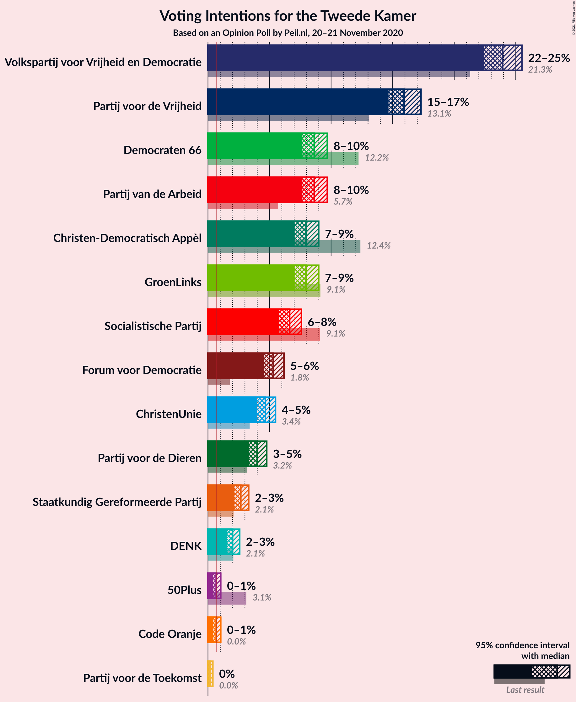
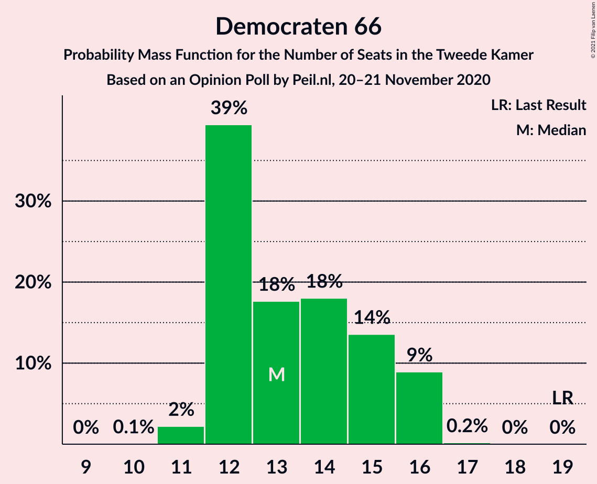
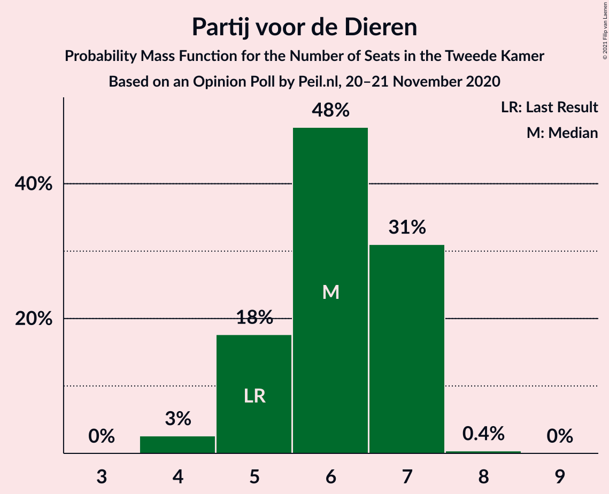
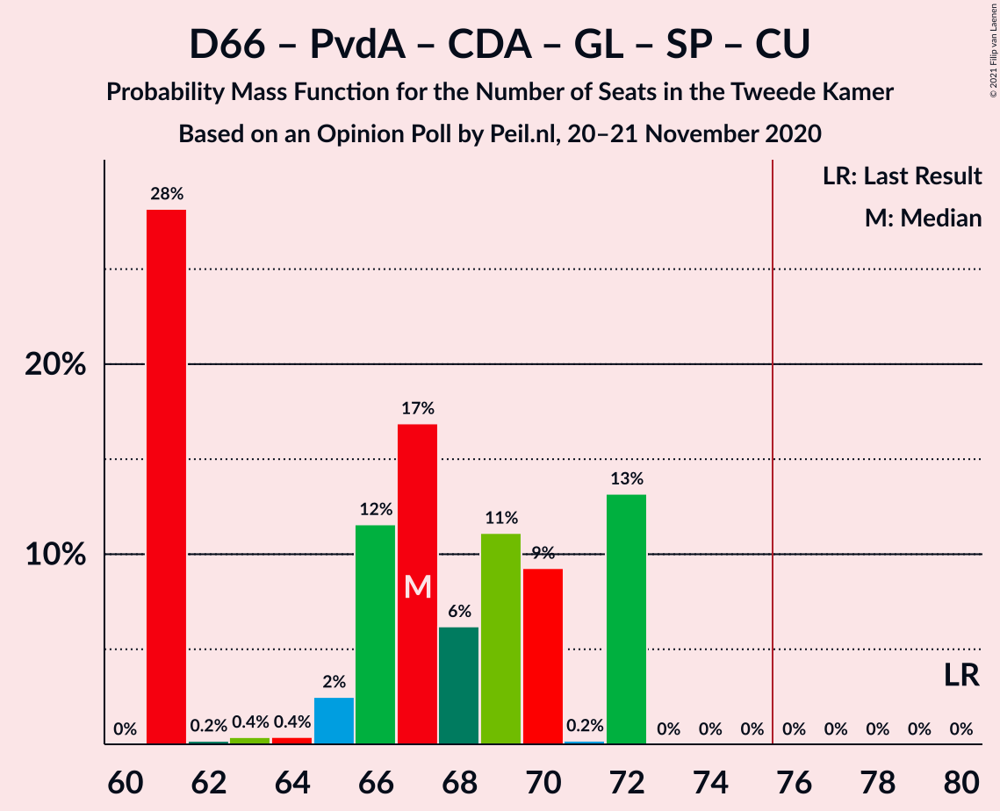
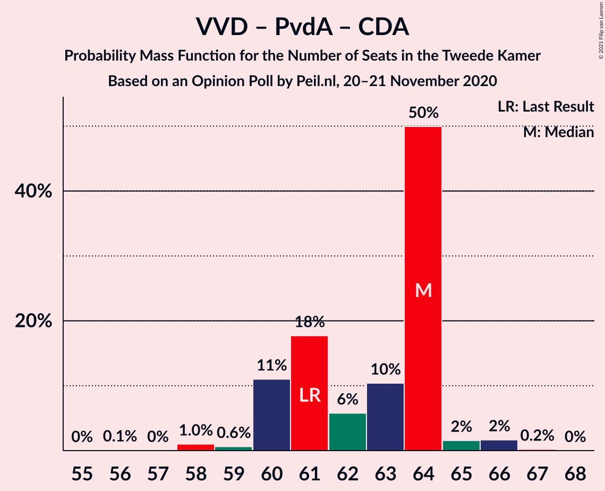

# Opinion Poll by Peil.nl, 20–21 November 2020

<a href="#voting-intentions">Voting Intentions</a> | <a href="#seats">Seats</a> | <a href="#coalitions">Coalitions</a> | <a href="#technical-information">Technical Information</a>

## Voting Intentions

### Confidence Intervals

| Party | Last Result | Poll Result | 80% Confidence Interval | 90% Confidence Interval | 95% Confidence Interval | 99% Confidence Interval |
|:-----:|:-----------:|:-----------:|:-----------------------:|:-----------------------:|:-----------------------:|:-----------------------:|
| Volkspartij voor Vrijheid en Democratie | 21.3% | 23.9% | 23.0–25.0% |22.7–25.3% |22.4–25.5% |22.0–26.0% |
| Partij voor de Vrijheid | 13.1% | 15.9% | 15.1–16.8% |14.9–17.1% |14.7–17.3% |14.3–17.7% |
| Democraten 66 | 12.2% | 8.6% | 8.0–9.3% |7.8–9.5% |7.7–9.7% |7.4–10.0% |
| Partij van de Arbeid | 5.7% | 8.6% | 8.0–9.3% |7.8–9.5% |7.7–9.7% |7.4–10.0% |
| Christen-Democratisch Appèl | 12.4% | 8.0% | 7.4–8.6% |7.2–8.8% |7.0–9.0% |6.8–9.3% |
| GroenLinks | 9.1% | 8.0% | 7.4–8.6% |7.2–8.8% |7.0–9.0% |6.8–9.3% |
| Socialistische Partij | 9.1% | 6.6% | 6.1–7.3% |5.9–7.4% |5.8–7.6% |5.5–7.9% |
| Forum voor Democratie | 1.8% | 5.3% | 4.8–5.9% |4.7–6.0% |4.5–6.2% |4.3–6.4% |
| ChristenUnie | 3.4% | 4.7% | 4.2–5.2% |4.1–5.3% |4.0–5.5% |3.7–5.8% |
| Partij voor de Dieren | 3.2% | 4.0% | 3.6–4.5% |3.4–4.6% |3.4–4.8% |3.2–5.0% |
| Staatkundig Gereformeerde Partij | 2.1% | 2.7% | 2.3–3.1% |2.2–3.2% |2.1–3.3% |2.0–3.5% |
| DENK | 2.1% | 2.0% | 1.7–2.4% |1.6–2.5% |1.6–2.6% |1.4–2.8% |
| 50Plus | 3.1% | 0.7% | 0.5–0.9% |0.5–1.0% |0.4–1.0% |0.4–1.2% |
| Code Oranje | 0.0% | 0.7% | 0.5–0.9% |0.5–1.0% |0.4–1.0% |0.4–1.2% |
| Partij voor de Toekomst | 0.0% | 0.2% | 0.1–0.3% |0.1–0.4% |0.1–0.4% |0.0–0.5% |

*Note:* The poll result column reflects the actual value used in the calculations. Published results may vary slightly, and in addition be rounded to fewer digits.

## Seats

### Confidence Intervals

| Party | Last Result | Median | 80% Confidence Interval | 90% Confidence Interval | 95% Confidence Interval | 99% Confidence Interval |
|:-----:|:-----------:|:------:|:-----------------------:|:-----------------------:|:-----------------------:|:-----------------------:|
| <a href="#volkspartij-voor-vrijheid-en-democratie">Volkspartij voor Vrijheid en Democratie</a> | 33 | 35 | 35–39 |33–39 |33–39 |33–39 |
| <a href="#partij-voor-de-vrijheid">Partij voor de Vrijheid</a> | 20 | 26 | 22–26 |22–26 |22–26 |21–27 |
| <a href="#democraten-66">Democraten 66</a> | 19 | 12 | 12–14 |11–14 |11–14 |11–15 |
| <a href="#partij-van-de-arbeid">Partij van de Arbeid</a> | 9 | 13 | 12–15 |12–17 |12–17 |11–17 |
| <a href="#christen-democratisch-appèl">Christen-Democratisch Appèl</a> | 19 | 11 | 11–12 |11–14 |11–15 |11–15 |
| <a href="#groenlinks">GroenLinks</a> | 14 | 10 | 10–12 |10–12 |10–13 |10–14 |
| <a href="#socialistische-partij">Socialistische Partij</a> | 14 | 11 | 10–11 |8–11 |8–11 |8–12 |
| <a href="#forum-voor-democratie">Forum voor Democratie</a> | 2 | 11 | 7–11 |7–11 |7–11 |7–11 |
| <a href="#christenunie">ChristenUnie</a> | 5 | 7 | 6–7 |6–7 |6–8 |6–9 |
| <a href="#partij-voor-de-dieren">Partij voor de Dieren</a> | 5 | 5 | 5–8 |5–8 |5–8 |5–8 |
| <a href="#staatkundig-gereformeerde-partij">Staatkundig Gereformeerde Partij</a> | 3 | 4 | 4 |4 |3–4 |2–5 |
| <a href="#denk">DENK</a> | 3 | 3 | 3 |2–3 |2–4 |2–4 |
| <a href="#50plus">50Plus</a> | 4 | 1 | 0–1 |0–1 |0–1 |0–1 |
| <a href="#code-oranje">Code Oranje</a> | 0 | 1 | 0–1 |0–1 |0–1 |0–1 |
| <a href="#partij-voor-de-toekomst">Partij voor de Toekomst</a> | 0 | 0 | 0 |0 |0 |0 |

### Volkspartij voor Vrijheid en Democratie

*For a full overview of the results for this party, see the [Volkspartij voor Vrijheid en Democratie](party-volkspartijvoorvrijheidendemocratie.html) page.*

| Number of Seats | Probability | Accumulated | Special Marks |
|:---------------:|:-----------:|:-----------:|:-------------:|
| 33 | 10% | 100% | Last Result |
| 34 | 0.1% | 90% |  |
| 35 | 64% | 90% | Median |
| 36 | 2% | 26% |  |
| 37 | 0.5% | 24% |  |
| 38 | 2% | 24% |  |
| 39 | 22% | 22% |  |
| 40 | 0% | 0.1% |  |
| 41 | 0% | 0% |  |

### Partij voor de Vrijheid

*For a full overview of the results for this party, see the [Partij voor de Vrijheid](party-partijvoordevrijheid.html) page.*

| Number of Seats | Probability | Accumulated | Special Marks |
|:---------------:|:-----------:|:-----------:|:-------------:|
| 20 | 0.4% | 100% | Last Result |
| 21 | 0.1% | 99.6% |  |
| 22 | 17% | 99.5% |  |
| 23 | 4% | 82% |  |
| 24 | 3% | 78% |  |
| 25 | 10% | 75% |  |
| 26 | 65% | 65% | Median |
| 27 | 0.5% | 0.5% |  |
| 28 | 0.1% | 0.1% |  |
| 29 | 0% | 0% |  |

### Democraten 66

*For a full overview of the results for this party, see the [Democraten 66](party-democraten66.html) page.*

| Number of Seats | Probability | Accumulated | Special Marks |
|:---------------:|:-----------:|:-----------:|:-------------:|
| 11 | 6% | 100% |  |
| 12 | 64% | 94% | Median |
| 13 | 0.4% | 30% |  |
| 14 | 29% | 30% |  |
| 15 | 0.8% | 0.8% |  |
| 16 | 0% | 0% |  |
| 17 | 0% | 0% |  |
| 18 | 0% | 0% |  |
| 19 | 0% | 0% | Last Result |

### Partij van de Arbeid

*For a full overview of the results for this party, see the [Partij van de Arbeid](party-partijvandearbeid.html) page.*

| Number of Seats | Probability | Accumulated | Special Marks |
|:---------------:|:-----------:|:-----------:|:-------------:|
| 9 | 0% | 100% | Last Result |
| 10 | 0.1% | 100% |  |
| 11 | 0.4% | 99.9% |  |
| 12 | 20% | 99.4% |  |
| 13 | 65% | 79% | Median |
| 14 | 3% | 14% |  |
| 15 | 4% | 12% |  |
| 16 | 0.1% | 8% |  |
| 17 | 7% | 7% |  |
| 18 | 0% | 0% |  |

### Christen-Democratisch Appèl

*For a full overview of the results for this party, see the [Christen-Democratisch Appèl](party-christen-democratischappèl.html) page.*

| Number of Seats | Probability | Accumulated | Special Marks |
|:---------------:|:-----------:|:-----------:|:-------------:|
| 10 | 0.4% | 100% |  |
| 11 | 64% | 99.6% | Median |
| 12 | 25% | 35% |  |
| 13 | 2% | 10% |  |
| 14 | 5% | 8% |  |
| 15 | 3% | 3% |  |
| 16 | 0% | 0% |  |
| 17 | 0% | 0% |  |
| 18 | 0% | 0% |  |
| 19 | 0% | 0% | Last Result |

### GroenLinks

*For a full overview of the results for this party, see the [GroenLinks](party-groenlinks.html) page.*

| Number of Seats | Probability | Accumulated | Special Marks |
|:---------------:|:-----------:|:-----------:|:-------------:|
| 10 | 69% | 100% | Median |
| 11 | 19% | 31% |  |
| 12 | 8% | 13% |  |
| 13 | 3% | 4% |  |
| 14 | 0.3% | 0.6% | Last Result |
| 15 | 0.3% | 0.3% |  |
| 16 | 0% | 0% |  |

### Socialistische Partij

*For a full overview of the results for this party, see the [Socialistische Partij](party-socialistischepartij.html) page.*

| Number of Seats | Probability | Accumulated | Special Marks |
|:---------------:|:-----------:|:-----------:|:-------------:|
| 8 | 8% | 100% |  |
| 9 | 0.2% | 92% |  |
| 10 | 21% | 91% |  |
| 11 | 70% | 71% | Median |
| 12 | 0.5% | 0.6% |  |
| 13 | 0.1% | 0.1% |  |
| 14 | 0% | 0% | Last Result |

### Forum voor Democratie

*For a full overview of the results for this party, see the [Forum voor Democratie](party-forumvoordemocratie.html) page.*

| Number of Seats | Probability | Accumulated | Special Marks |
|:---------------:|:-----------:|:-----------:|:-------------:|
| 2 | 0% | 100% | Last Result |
| 3 | 0% | 100% |  |
| 4 | 0% | 100% |  |
| 5 | 0% | 100% |  |
| 6 | 0.4% | 100% |  |
| 7 | 26% | 99.6% |  |
| 8 | 8% | 74% |  |
| 9 | 1.0% | 65% |  |
| 10 | 0.2% | 64% |  |
| 11 | 64% | 64% | Median |
| 12 | 0% | 0% |  |

### ChristenUnie

*For a full overview of the results for this party, see the [ChristenUnie](party-christenunie.html) page.*

| Number of Seats | Probability | Accumulated | Special Marks |
|:---------------:|:-----------:|:-----------:|:-------------:|
| 5 | 0.1% | 100% | Last Result |
| 6 | 18% | 99.9% |  |
| 7 | 79% | 81% | Median |
| 8 | 0.6% | 3% |  |
| 9 | 2% | 2% |  |
| 10 | 0% | 0% |  |

### Partij voor de Dieren

*For a full overview of the results for this party, see the [Partij voor de Dieren](party-partijvoordedieren.html) page.*

| Number of Seats | Probability | Accumulated | Special Marks |
|:---------------:|:-----------:|:-----------:|:-------------:|
| 4 | 0.3% | 100% |  |
| 5 | 71% | 99.7% | Last Result, Median |
| 6 | 3% | 29% |  |
| 7 | 8% | 26% |  |
| 8 | 18% | 18% |  |
| 9 | 0% | 0% |  |

### Staatkundig Gereformeerde Partij

*For a full overview of the results for this party, see the [Staatkundig Gereformeerde Partij](party-staatkundiggereformeerdepartij.html) page.*

| Number of Seats | Probability | Accumulated | Special Marks |
|:---------------:|:-----------:|:-----------:|:-------------:|
| 2 | 1.5% | 100% |  |
| 3 | 3% | 98.5% | Last Result |
| 4 | 95% | 95% | Median |
| 5 | 0.8% | 0.8% |  |
| 6 | 0% | 0% |  |

### DENK

*For a full overview of the results for this party, see the [DENK](party-denk.html) page.*

| Number of Seats | Probability | Accumulated | Special Marks |
|:---------------:|:-----------:|:-----------:|:-------------:|
| 1 | 0.4% | 100% |  |
| 2 | 5% | 99.6% |  |
| 3 | 92% | 95% | Last Result, Median |
| 4 | 2% | 3% |  |
| 5 | 0% | 0% |  |

### 50Plus

*For a full overview of the results for this party, see the [50Plus](party-50plus.html) page.*

| Number of Seats | Probability | Accumulated | Special Marks |
|:---------------:|:-----------:|:-----------:|:-------------:|
| 0 | 12% | 100% |  |
| 1 | 88% | 88% | Median |
| 2 | 0.4% | 0.4% |  |
| 3 | 0% | 0% |  |
| 4 | 0% | 0% | Last Result |

### Code Oranje

*For a full overview of the results for this party, see the [Code Oranje](party-codeoranje.html) page.*

| Number of Seats | Probability | Accumulated | Special Marks |
|:---------------:|:-----------:|:-----------:|:-------------:|
| 0 | 15% | 100% | Last Result |
| 1 | 85% | 85% | Median |
| 2 | 0% | 0% |  |

### Partij voor de Toekomst

*For a full overview of the results for this party, see the [Partij voor de Toekomst](party-partijvoordetoekomst.html) page.*

| Number of Seats | Probability | Accumulated | Special Marks |
|:---------------:|:-----------:|:-----------:|:-------------:|
| 0 | 100% | 100% | Last Result, Median |

## Coalitions

### Confidence Intervals

| Coalition | Last Result | Median | Majority? | 80% Confidence Interval | 90% Confidence Interval | 95% Confidence Interval | 99% Confidence Interval |
|:---------:|:-----------:|:------:|:---------:|:-----------------------:|:-----------------------:|:-----------------------:|:-----------------------:|
| Volkspartij voor Vrijheid en Democratie – Partij voor de Vrijheid – Christen-Democratisch Appèl – Forum voor Democratie – Staatkundig Gereformeerde Partij | 77 | 87 | 100% | 83–87 | 82–87 | 82–88 | 80–89 |
| Volkspartij voor Vrijheid en Democratie – Democraten 66 – Partij van de Arbeid – Christen-Democratisch Appèl – ChristenUnie | 85 | 78 | 100% | 78–83 | 78–84 | 78–87 | 78–88 |
| Volkspartij voor Vrijheid en Democratie – Partij voor de Vrijheid – Christen-Democratisch Appèl – Forum voor Democratie | 74 | 83 | 99.5% | 79–83 | 78–83 | 78–84 | 75–85 |
| Volkspartij voor Vrijheid en Democratie – Democraten 66 – Christen-Democratisch Appèl – GroenLinks – ChristenUnie | 90 | 75 | 36% | 75–82 | 75–82 | 75–83 | 75–84 |
| Volkspartij voor Vrijheid en Democratie – Partij voor de Vrijheid – Christen-Democratisch Appèl | 72 | 72 | 5% | 72–73 | 70–76 | 70–77 | 69–77 |
| Volkspartij voor Vrijheid en Democratie – Democraten 66 – Christen-Democratisch Appèl – ChristenUnie | 76 | 65 | 0% | 65–71 | 65–71 | 65–72 | 65–73 |
| Democraten 66 – Partij van de Arbeid – Christen-Democratisch Appèl – GroenLinks – Socialistische Partij – ChristenUnie | 80 | 64 | 0% | 64–70 | 64–70 | 64–72 | 64–72 |
| Volkspartij voor Vrijheid en Democratie – Partij van de Arbeid – Christen-Democratisch Appèl | 61 | 59 | 0% | 59–63 | 59–64 | 59–67 | 59–69 |
| Volkspartij voor Vrijheid en Democratie – Democraten 66 – Partij van de Arbeid | 61 | 60 | 0% | 60–65 | 60–65 | 60–65 | 60–68 |
| Volkspartij voor Vrijheid en Democratie – Democraten 66 – Christen-Democratisch Appèl | 71 | 58 | 0% | 58–65 | 58–65 | 58–65 | 58–66 |
| Volkspartij voor Vrijheid en Democratie – Christen-Democratisch Appèl – Forum voor Democratie – Staatkundig Gereformeerde Partij – 50Plus | 61 | 62 | 0% | 59–63 | 57–63 | 57–64 | 57–66 |
| Volkspartij voor Vrijheid en Democratie – Christen-Democratisch Appèl – Forum voor Democratie – Staatkundig Gereformeerde Partij | 57 | 61 | 0% | 58–62 | 57–62 | 57–64 | 57–65 |
| Democraten 66 – Partij van de Arbeid – Christen-Democratisch Appèl – GroenLinks – ChristenUnie | 66 | 53 | 0% | 53–60 | 53–62 | 53–62 | 53–62 |
| Volkspartij voor Vrijheid en Democratie – Christen-Democratisch Appèl – Forum voor Democratie – 50Plus | 58 | 58 | 0% | 55–59 | 53–60 | 53–60 | 53–62 |
| Volkspartij voor Vrijheid en Democratie – Christen-Democratisch Appèl – Forum voor Democratie | 54 | 57 | 0% | 55–58 | 53–59 | 53–59 | 53–61 |
| Volkspartij voor Vrijheid en Democratie – Partij van de Arbeid | 42 | 48 | 0% | 48–51 | 48–51 | 47–54 | 47–54 |
| Volkspartij voor Vrijheid en Democratie – Christen-Democratisch Appèl | 52 | 46 | 0% | 46–51 | 45–52 | 45–52 | 45–54 |
| Democraten 66 – Partij van de Arbeid – Christen-Democratisch Appèl | 47 | 36 | 0% | 36–42 | 36–43 | 36–43 | 35–43 |
| Partij van de Arbeid – Christen-Democratisch Appèl – ChristenUnie | 33 | 31 | 0% | 30–36 | 30–36 | 30–37 | 30–37 |
| Partij van de Arbeid – Christen-Democratisch Appèl | 28 | 24 | 0% | 24–28 | 24–29 | 24–29 | 24–30 |
| Democraten 66 – Christen-Democratisch Appèl | 38 | 23 | 0% | 23–26 | 23–26 | 23–28 | 23–28 |

### Volkspartij voor Vrijheid en Democratie – Partij voor de Vrijheid – Christen-Democratisch Appèl – Forum voor Democratie – Staatkundig Gereformeerde Partij

| Number of Seats | Probability | Accumulated | Special Marks |
|:---------------:|:-----------:|:-----------:|:-------------:|
| 77 | 0% | 100% | Last Result |
| 78 | 0% | 100% |  |
| 79 | 0.5% | 100% |  |
| 80 | 0.1% | 99.5% |  |
| 81 | 0.1% | 99.4% |  |
| 82 | 8% | 99.4% |  |
| 83 | 2% | 92% |  |
| 84 | 19% | 90% |  |
| 85 | 0.3% | 71% |  |
| 86 | 3% | 70% |  |
| 87 | 64% | 68% | Median |
| 88 | 3% | 3% |  |
| 89 | 0.2% | 0.6% |  |
| 90 | 0.4% | 0.4% |  |
| 91 | 0% | 0% |  |

### Volkspartij voor Vrijheid en Democratie – Democraten 66 – Partij van de Arbeid – Christen-Democratisch Appèl – ChristenUnie

| Number of Seats | Probability | Accumulated | Special Marks |
|:---------------:|:-----------:|:-----------:|:-------------:|
| 77 | 0.1% | 100% |  |
| 78 | 64% | 99.9% | Median |
| 79 | 0.1% | 36% |  |
| 80 | 0.7% | 36% |  |
| 81 | 0.9% | 35% |  |
| 82 | 2% | 34% |  |
| 83 | 26% | 32% |  |
| 84 | 2% | 6% |  |
| 85 | 0.2% | 4% | Last Result |
| 86 | 0% | 4% |  |
| 87 | 2% | 4% |  |
| 88 | 1.5% | 1.5% |  |
| 89 | 0% | 0% |  |

### Volkspartij voor Vrijheid en Democratie – Partij voor de Vrijheid – Christen-Democratisch Appèl – Forum voor Democratie

| Number of Seats | Probability | Accumulated | Special Marks |
|:---------------:|:-----------:|:-----------:|:-------------:|
| 74 | 0% | 100% | Last Result |
| 75 | 0.5% | 100% |  |
| 76 | 0% | 99.5% | Majority |
| 77 | 0.1% | 99.4% |  |
| 78 | 7% | 99.4% |  |
| 79 | 2% | 92% |  |
| 80 | 17% | 90% |  |
| 81 | 0.3% | 72% |  |
| 82 | 2% | 72% |  |
| 83 | 67% | 70% | Median |
| 84 | 3% | 3% |  |
| 85 | 0.2% | 0.6% |  |
| 86 | 0.4% | 0.4% |  |
| 87 | 0% | 0% |  |

### Volkspartij voor Vrijheid en Democratie – Democraten 66 – Christen-Democratisch Appèl – GroenLinks – ChristenUnie

| Number of Seats | Probability | Accumulated | Special Marks |
|:---------------:|:-----------:|:-----------:|:-------------:|
| 74 | 0.1% | 100% |  |
| 75 | 64% | 99.9% | Median |
| 76 | 0.1% | 36% | Majority |
| 77 | 0.1% | 36% |  |
| 78 | 8% | 36% |  |
| 79 | 0.1% | 28% |  |
| 80 | 3% | 28% |  |
| 81 | 0.3% | 25% |  |
| 82 | 20% | 25% |  |
| 83 | 3% | 5% |  |
| 84 | 2% | 2% |  |
| 85 | 0.1% | 0.1% |  |
| 86 | 0% | 0% |  |
| 87 | 0% | 0% |  |
| 88 | 0% | 0% |  |
| 89 | 0% | 0% |  |
| 90 | 0% | 0% | Last Result |

### Volkspartij voor Vrijheid en Democratie – Partij voor de Vrijheid – Christen-Democratisch Appèl

| Number of Seats | Probability | Accumulated | Special Marks |
|:---------------:|:-----------:|:-----------:|:-------------:|
| 68 | 0.5% | 100% |  |
| 69 | 0.2% | 99.5% |  |
| 70 | 7% | 99.3% |  |
| 71 | 0.1% | 92% |  |
| 72 | 66% | 92% | Last Result, Median |
| 73 | 18% | 25% |  |
| 74 | 0.9% | 8% |  |
| 75 | 2% | 7% |  |
| 76 | 2% | 5% | Majority |
| 77 | 3% | 3% |  |
| 78 | 0.4% | 0.4% |  |
| 79 | 0% | 0% |  |

### Volkspartij voor Vrijheid en Democratie – Democraten 66 – Christen-Democratisch Appèl – ChristenUnie

| Number of Seats | Probability | Accumulated | Special Marks |
|:---------------:|:-----------:|:-----------:|:-------------:|
| 62 | 0.1% | 100% |  |
| 63 | 0% | 99.9% |  |
| 64 | 0% | 99.9% |  |
| 65 | 64% | 99.9% | Median |
| 66 | 8% | 36% |  |
| 67 | 0.1% | 28% |  |
| 68 | 0.9% | 28% |  |
| 69 | 0.2% | 27% |  |
| 70 | 5% | 27% |  |
| 71 | 18% | 22% |  |
| 72 | 2% | 4% |  |
| 73 | 1.5% | 2% |  |
| 74 | 0% | 0% |  |
| 75 | 0% | 0% |  |
| 76 | 0% | 0% | Last Result, Majority |

### Democraten 66 – Partij van de Arbeid – Christen-Democratisch Appèl – GroenLinks – Socialistische Partij – ChristenUnie

| Number of Seats | Probability | Accumulated | Special Marks |
|:---------------:|:-----------:|:-----------:|:-------------:|
| 63 | 0.4% | 100% |  |
| 64 | 64% | 99.5% | Median |
| 65 | 17% | 35% |  |
| 66 | 0.2% | 18% |  |
| 67 | 0.9% | 18% |  |
| 68 | 5% | 17% |  |
| 69 | 0.1% | 12% |  |
| 70 | 8% | 12% |  |
| 71 | 2% | 4% |  |
| 72 | 2% | 3% |  |
| 73 | 0.1% | 0.1% |  |
| 74 | 0% | 0% |  |
| 75 | 0% | 0% |  |
| 76 | 0% | 0% | Majority |
| 77 | 0% | 0% |  |
| 78 | 0% | 0% |  |
| 79 | 0% | 0% |  |
| 80 | 0% | 0% | Last Result |

### Volkspartij voor Vrijheid en Democratie – Partij van de Arbeid – Christen-Democratisch Appèl

| Number of Seats | Probability | Accumulated | Special Marks |
|:---------------:|:-----------:|:-----------:|:-------------:|
| 58 | 0.3% | 100% |  |
| 59 | 64% | 99.7% | Median |
| 60 | 0.1% | 36% |  |
| 61 | 3% | 35% | Last Result |
| 62 | 9% | 33% |  |
| 63 | 18% | 24% |  |
| 64 | 2% | 6% |  |
| 65 | 0.1% | 4% |  |
| 66 | 0.1% | 4% |  |
| 67 | 1.5% | 4% |  |
| 68 | 0% | 2% |  |
| 69 | 2% | 2% |  |
| 70 | 0% | 0% |  |

### Volkspartij voor Vrijheid en Democratie – Democraten 66 – Partij van de Arbeid

| Number of Seats | Probability | Accumulated | Special Marks |
|:---------------:|:-----------:|:-----------:|:-------------:|
| 58 | 0.1% | 100% |  |
| 59 | 0.3% | 99.9% |  |
| 60 | 64% | 99.7% | Median |
| 61 | 4% | 35% | Last Result |
| 62 | 1.2% | 31% |  |
| 63 | 0.4% | 30% |  |
| 64 | 8% | 29% |  |
| 65 | 20% | 21% |  |
| 66 | 0.1% | 2% |  |
| 67 | 0% | 2% |  |
| 68 | 1.5% | 2% |  |
| 69 | 0% | 0% |  |

### Volkspartij voor Vrijheid en Democratie – Democraten 66 – Christen-Democratisch Appèl

| Number of Seats | Probability | Accumulated | Special Marks |
|:---------------:|:-----------:|:-----------:|:-------------:|
| 56 | 0.1% | 100% |  |
| 57 | 0% | 99.9% |  |
| 58 | 64% | 99.9% | Median |
| 59 | 8% | 36% |  |
| 60 | 0.1% | 28% |  |
| 61 | 2% | 28% |  |
| 62 | 1.2% | 26% |  |
| 63 | 3% | 25% |  |
| 64 | 0.7% | 22% |  |
| 65 | 20% | 21% |  |
| 66 | 1.5% | 1.5% |  |
| 67 | 0% | 0% |  |
| 68 | 0% | 0% |  |
| 69 | 0% | 0% |  |
| 70 | 0% | 0% |  |
| 71 | 0% | 0% | Last Result |

### Volkspartij voor Vrijheid en Democratie – Christen-Democratisch Appèl – Forum voor Democratie – Staatkundig Gereformeerde Partij – 50Plus

| Number of Seats | Probability | Accumulated | Special Marks |
|:---------------:|:-----------:|:-----------:|:-------------:|
| 56 | 0.1% | 100% |  |
| 57 | 8% | 99.9% |  |
| 58 | 2% | 92% |  |
| 59 | 0.7% | 90% |  |
| 60 | 0.3% | 89% |  |
| 61 | 0.3% | 89% | Last Result |
| 62 | 66% | 89% | Median |
| 63 | 20% | 23% |  |
| 64 | 0.7% | 3% |  |
| 65 | 0.1% | 2% |  |
| 66 | 2% | 2% |  |
| 67 | 0% | 0% |  |

### Volkspartij voor Vrijheid en Democratie – Christen-Democratisch Appèl – Forum voor Democratie – Staatkundig Gereformeerde Partij

| Number of Seats | Probability | Accumulated | Special Marks |
|:---------------:|:-----------:|:-----------:|:-------------:|
| 55 | 0.1% | 100% |  |
| 56 | 0% | 99.9% |  |
| 57 | 8% | 99.9% | Last Result |
| 58 | 2% | 92% |  |
| 59 | 0.6% | 90% |  |
| 60 | 0.2% | 89% |  |
| 61 | 66% | 89% | Median |
| 62 | 19% | 23% |  |
| 63 | 0.6% | 4% |  |
| 64 | 0.5% | 3% |  |
| 65 | 2% | 2% |  |
| 66 | 0% | 0% |  |

### Democraten 66 – Partij van de Arbeid – Christen-Democratisch Appèl – GroenLinks – ChristenUnie

| Number of Seats | Probability | Accumulated | Special Marks |
|:---------------:|:-----------:|:-----------:|:-------------:|
| 53 | 64% | 100% | Median |
| 54 | 0.1% | 36% |  |
| 55 | 17% | 35% |  |
| 56 | 0.2% | 18% |  |
| 57 | 3% | 18% |  |
| 58 | 2% | 15% |  |
| 59 | 0.4% | 13% |  |
| 60 | 3% | 12% |  |
| 61 | 2% | 10% |  |
| 62 | 7% | 8% |  |
| 63 | 0% | 0.1% |  |
| 64 | 0.1% | 0.1% |  |
| 65 | 0% | 0% |  |
| 66 | 0% | 0% | Last Result |

### Volkspartij voor Vrijheid en Democratie – Christen-Democratisch Appèl – Forum voor Democratie – 50Plus

| Number of Seats | Probability | Accumulated | Special Marks |
|:---------------:|:-----------:|:-----------:|:-------------:|
| 51 | 0.1% | 100% |  |
| 52 | 0% | 99.9% |  |
| 53 | 8% | 99.9% |  |
| 54 | 2% | 92% |  |
| 55 | 0.8% | 90% |  |
| 56 | 0.2% | 89% |  |
| 57 | 0.3% | 89% |  |
| 58 | 64% | 89% | Last Result, Median |
| 59 | 18% | 25% |  |
| 60 | 4% | 7% |  |
| 61 | 0.1% | 2% |  |
| 62 | 2% | 2% |  |
| 63 | 0% | 0% |  |

### Volkspartij voor Vrijheid en Democratie – Christen-Democratisch Appèl – Forum voor Democratie

| Number of Seats | Probability | Accumulated | Special Marks |
|:---------------:|:-----------:|:-----------:|:-------------:|
| 50 | 0.1% | 100% |  |
| 51 | 0% | 99.9% |  |
| 52 | 0% | 99.9% |  |
| 53 | 7% | 99.9% |  |
| 54 | 2% | 92% | Last Result |
| 55 | 0.8% | 90% |  |
| 56 | 0.1% | 89% |  |
| 57 | 64% | 89% | Median |
| 58 | 18% | 25% |  |
| 59 | 5% | 7% |  |
| 60 | 0% | 2% |  |
| 61 | 2% | 2% |  |
| 62 | 0% | 0% |  |

### Volkspartij voor Vrijheid en Democratie – Partij van de Arbeid

| Number of Seats | Probability | Accumulated | Special Marks |
|:---------------:|:-----------:|:-----------:|:-------------:|
| 42 | 0% | 100% | Last Result |
| 43 | 0% | 100% |  |
| 44 | 0% | 100% |  |
| 45 | 0.1% | 100% |  |
| 46 | 0% | 99.9% |  |
| 47 | 2% | 99.9% |  |
| 48 | 65% | 97% | Median |
| 49 | 1.0% | 33% |  |
| 50 | 10% | 32% |  |
| 51 | 18% | 22% |  |
| 52 | 0.3% | 4% |  |
| 53 | 0.1% | 4% |  |
| 54 | 4% | 4% |  |
| 55 | 0% | 0% |  |

### Volkspartij voor Vrijheid en Democratie – Christen-Democratisch Appèl

| Number of Seats | Probability | Accumulated | Special Marks |
|:---------------:|:-----------:|:-----------:|:-------------:|
| 44 | 0.1% | 100% |  |
| 45 | 8% | 99.9% |  |
| 46 | 64% | 92% | Median |
| 47 | 2% | 28% |  |
| 48 | 0.9% | 26% |  |
| 49 | 0.2% | 25% |  |
| 50 | 0.6% | 25% |  |
| 51 | 18% | 24% |  |
| 52 | 4% | 6% | Last Result |
| 53 | 0% | 2% |  |
| 54 | 2% | 2% |  |
| 55 | 0% | 0% |  |

### Democraten 66 – Partij van de Arbeid – Christen-Democratisch Appèl

| Number of Seats | Probability | Accumulated | Special Marks |
|:---------------:|:-----------:|:-----------:|:-------------:|
| 34 | 0.1% | 100% |  |
| 35 | 0.6% | 99.9% |  |
| 36 | 64% | 99.4% | Median |
| 37 | 2% | 35% |  |
| 38 | 17% | 33% |  |
| 39 | 0.5% | 15% |  |
| 40 | 1.2% | 15% |  |
| 41 | 2% | 14% |  |
| 42 | 4% | 11% |  |
| 43 | 8% | 8% |  |
| 44 | 0.1% | 0.1% |  |
| 45 | 0% | 0% |  |
| 46 | 0% | 0% |  |
| 47 | 0% | 0% | Last Result |

### Partij van de Arbeid – Christen-Democratisch Appèl – ChristenUnie

| Number of Seats | Probability | Accumulated | Special Marks |
|:---------------:|:-----------:|:-----------:|:-------------:|
| 28 | 0.1% | 100% |  |
| 29 | 0.2% | 99.9% |  |
| 30 | 18% | 99.7% |  |
| 31 | 64% | 82% | Median |
| 32 | 0.6% | 18% |  |
| 33 | 3% | 17% | Last Result |
| 34 | 0.5% | 14% |  |
| 35 | 2% | 14% |  |
| 36 | 8% | 12% |  |
| 37 | 4% | 4% |  |
| 38 | 0% | 0% |  |

### Partij van de Arbeid – Christen-Democratisch Appèl

| Number of Seats | Probability | Accumulated | Special Marks |
|:---------------:|:-----------:|:-----------:|:-------------:|
| 21 | 0.1% | 100% |  |
| 22 | 0.1% | 99.9% |  |
| 23 | 0.1% | 99.8% |  |
| 24 | 82% | 99.7% | Median |
| 25 | 0.8% | 18% |  |
| 26 | 3% | 17% |  |
| 27 | 0.1% | 14% |  |
| 28 | 4% | 14% | Last Result |
| 29 | 8% | 10% |  |
| 30 | 2% | 2% |  |
| 31 | 0% | 0% |  |

### Democraten 66 – Christen-Democratisch Appèl

| Number of Seats | Probability | Accumulated | Special Marks |
|:---------------:|:-----------:|:-----------:|:-------------:|
| 21 | 0.2% | 100% |  |
| 22 | 0.1% | 99.8% |  |
| 23 | 64% | 99.7% | Median |
| 24 | 0.2% | 35% |  |
| 25 | 2% | 35% |  |
| 26 | 28% | 33% |  |
| 27 | 2% | 5% |  |
| 28 | 3% | 3% |  |
| 29 | 0.1% | 0.1% |  |
| 30 | 0% | 0% |  |
| 31 | 0% | 0% |  |
| 32 | 0% | 0% |  |
| 33 | 0% | 0% |  |
| 34 | 0% | 0% |  |
| 35 | 0% | 0% |  |
| 36 | 0% | 0% |  |
| 37 | 0% | 0% |  |
| 38 | 0% | 0% | Last Result |

## Technical Information

### Opinion Poll

+ **Polling firm:** Peil.nl
+ **Commissioner(s):** —
+ **Fieldwork period:** 20–21 November 2020

### Calculations

+ **Sample size:** 3000
+ **Simulations done:** 32,768
+ **Error estimate:** 2.68%

