# Opinion Poll by Peil.nl, 26–27 November 2020

<a href="#voting-intentions">Voting Intentions</a> | <a href="#seats">Seats</a> | <a href="#coalitions">Coalitions</a> | <a href="#technical-information">Technical Information</a>

## Voting Intentions

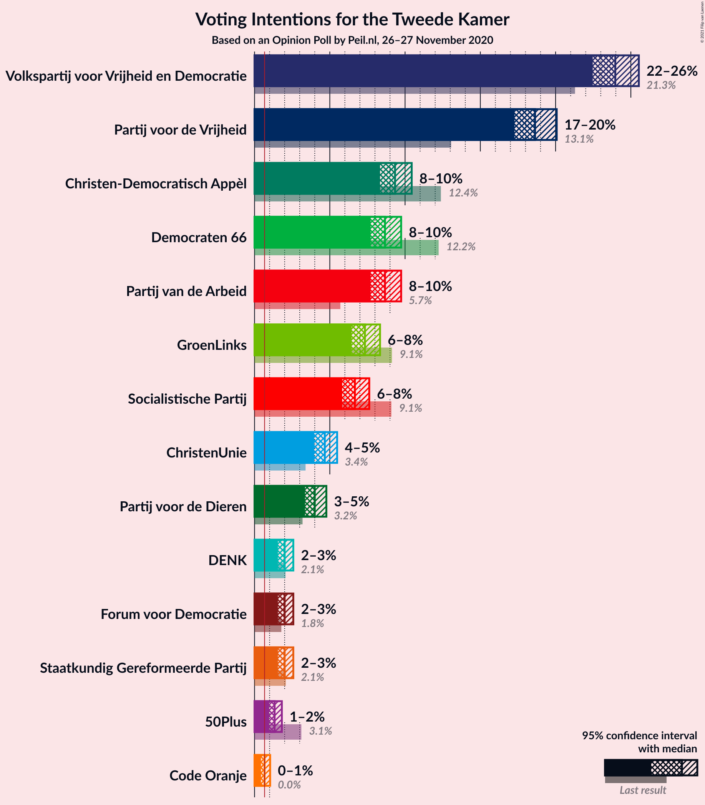

### Confidence Intervals

| Party | Last Result | Poll Result | 80% Confidence Interval | 90% Confidence Interval | 95% Confidence Interval | 99% Confidence Interval |
|:-----:|:-----------:|:-----------:|:-----------------------:|:-----------------------:|:-----------------------:|:-----------------------:|
| Volkspartij voor Vrijheid en Democratie | 21.3% | 24.0% | 23.0–25.0% |22.7–25.3% |22.5–25.5% |22.0–26.0% |
| Partij voor de Vrijheid | 13.1% | 18.6% | 17.7–19.6% |17.5–19.8% |17.3–20.1% |16.9–20.5% |
| Christen-Democratisch Appèl | 12.4% | 9.3% | 8.7–10.1% |8.5–10.3% |8.3–10.4% |8.0–10.8% |
| Democraten 66 | 12.2% | 8.7% | 8.0–9.4% |7.8–9.6% |7.7–9.7% |7.4–10.1% |
| Partij van de Arbeid | 5.7% | 8.7% | 8.0–9.4% |7.8–9.6% |7.7–9.7% |7.4–10.1% |
| GroenLinks | 9.1% | 7.3% | 6.8–8.0% |6.6–8.2% |6.4–8.3% |6.2–8.6% |
| Socialistische Partij | 9.1% | 6.7% | 6.1–7.3% |6.0–7.5% |5.8–7.6% |5.6–7.9% |
| ChristenUnie | 3.4% | 4.7% | 4.2–5.2% |4.1–5.3% |4.0–5.5% |3.7–5.8% |
| Partij voor de Dieren | 3.2% | 4.0% | 3.6–4.5% |3.4–4.6% |3.4–4.8% |3.2–5.0% |
| Staatkundig Gereformeerde Partij | 2.1% | 2.0% | 1.7–2.4% |1.6–2.5% |1.6–2.6% |1.4–2.8% |
| DENK | 2.1% | 2.0% | 1.7–2.4% |1.6–2.5% |1.6–2.6% |1.4–2.8% |
| Forum voor Democratie | 1.8% | 2.0% | 1.7–2.4% |1.6–2.5% |1.6–2.6% |1.4–2.8% |
| 50Plus | 3.1% | 1.3% | 1.1–1.6% |1.0–1.7% |1.0–1.8% |0.9–2.0% |
| Code Oranje | 0.0% | 0.7% | 0.5–0.9% |0.5–1.0% |0.4–1.0% |0.4–1.2% |

*Note:* The poll result column reflects the actual value used in the calculations. Published results may vary slightly, and in addition be rounded to fewer digits.

## Seats

### Confidence Intervals

| Party | Last Result | Median | 80% Confidence Interval | 90% Confidence Interval | 95% Confidence Interval | 99% Confidence Interval |
|:-----:|:-----------:|:------:|:-----------------------:|:-----------------------:|:-----------------------:|:-----------------------:|
| <a href="#volkspartij-voor-vrijheid-en-democratie">Volkspartij voor Vrijheid en Democratie</a> | 33 | 37 | 35–37 |35–37 |35–39 |34–39 |
| <a href="#partij-voor-de-vrijheid">Partij voor de Vrijheid</a> | 20 | 29 | 27–31 |27–31 |27–31 |27–31 |
| <a href="#christen-democratisch-appèl">Christen-Democratisch Appèl</a> | 19 | 14 | 14–15 |13–15 |12–15 |12–16 |
| <a href="#democraten-66">Democraten 66</a> | 19 | 13 | 13–15 |13–15 |13–15 |11–15 |
| <a href="#partij-van-de-arbeid">Partij van de Arbeid</a> | 9 | 14 | 13–15 |13–16 |12–16 |12–16 |
| <a href="#groenlinks">GroenLinks</a> | 14 | 11 | 9–12 |9–12 |9–12 |9–13 |
| <a href="#socialistische-partij">Socialistische Partij</a> | 14 | 10 | 10 |10 |9–11 |8–11 |
| <a href="#christenunie">ChristenUnie</a> | 5 | 7 | 6–7 |6–7 |5–8 |5–9 |
| <a href="#partij-voor-de-dieren">Partij voor de Dieren</a> | 5 | 6 | 5–6 |5–6 |5–6 |4–7 |
| <a href="#staatkundig-gereformeerde-partij">Staatkundig Gereformeerde Partij</a> | 3 | 2 | 2–3 |2–3 |2–3 |2–4 |
| <a href="#denk">DENK</a> | 3 | 2 | 2–3 |2–3 |2–3 |2–4 |
| <a href="#forum-voor-democratie">Forum voor Democratie</a> | 2 | 3 | 2–3 |2–3 |2–4 |2–4 |
| <a href="#50plus">50Plus</a> | 4 | 2 | 1–2 |1–2 |1–2 |1–2 |
| <a href="#code-oranje">Code Oranje</a> | 0 | 0 | 0–1 |0–1 |0–1 |0–1 |

### Volkspartij voor Vrijheid en Democratie

*For a full overview of the results for this party, see the [Volkspartij voor Vrijheid en Democratie](party-volkspartijvoorvrijheidendemocratie.html) page.*

| Number of Seats | Probability | Accumulated | Special Marks |
|:---------------:|:-----------:|:-----------:|:-------------:|
| 32 | 0.2% | 100% |  |
| 33 | 0.1% | 99.8% | Last Result |
| 34 | 0.2% | 99.6% |  |
| 35 | 43% | 99.4% |  |
| 36 | 2% | 57% |  |
| 37 | 51% | 55% | Median |
| 38 | 0% | 4% |  |
| 39 | 4% | 4% |  |
| 40 | 0.1% | 0.1% |  |
| 41 | 0% | 0% |  |

### Partij voor de Vrijheid

*For a full overview of the results for this party, see the [Partij voor de Vrijheid](party-partijvoordevrijheid.html) page.*

| Number of Seats | Probability | Accumulated | Special Marks |
|:---------------:|:-----------:|:-----------:|:-------------:|
| 20 | 0% | 100% | Last Result |
| 21 | 0% | 100% |  |
| 22 | 0% | 100% |  |
| 23 | 0% | 100% |  |
| 24 | 0% | 100% |  |
| 25 | 0% | 100% |  |
| 26 | 0.4% | 100% |  |
| 27 | 13% | 99.6% |  |
| 28 | 0.8% | 86% |  |
| 29 | 71% | 86% | Median |
| 30 | 1.3% | 15% |  |
| 31 | 13% | 13% |  |
| 32 | 0.2% | 0.2% |  |
| 33 | 0% | 0% |  |

### Christen-Democratisch Appèl

*For a full overview of the results for this party, see the [Christen-Democratisch Appèl](party-christen-democratischappèl.html) page.*

| Number of Seats | Probability | Accumulated | Special Marks |
|:---------------:|:-----------:|:-----------:|:-------------:|
| 12 | 4% | 100% |  |
| 13 | 2% | 96% |  |
| 14 | 56% | 94% | Median |
| 15 | 37% | 38% |  |
| 16 | 0.6% | 1.1% |  |
| 17 | 0.4% | 0.4% |  |
| 18 | 0% | 0% |  |
| 19 | 0% | 0% | Last Result |

### Democraten 66

*For a full overview of the results for this party, see the [Democraten 66](party-democraten66.html) page.*

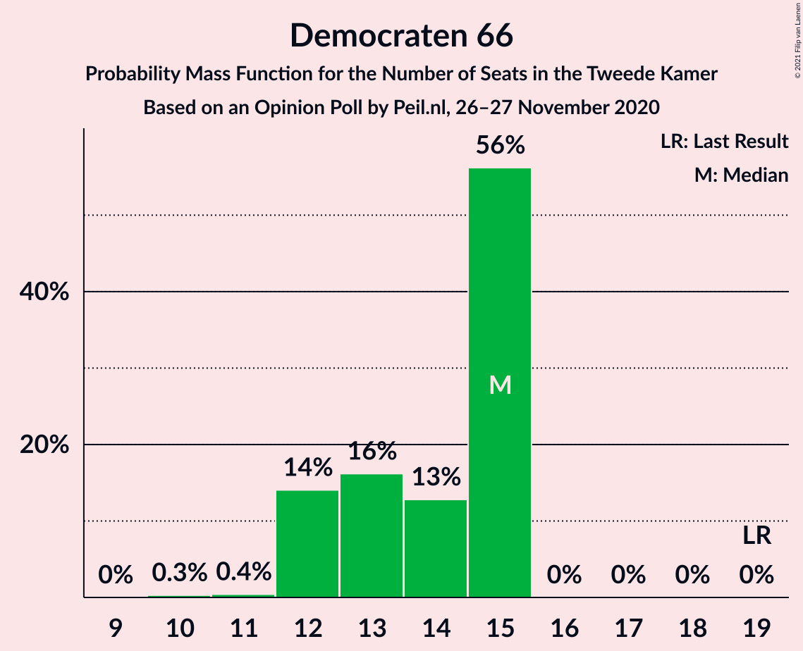

| Number of Seats | Probability | Accumulated | Special Marks |
|:---------------:|:-----------:|:-----------:|:-------------:|
| 11 | 0.5% | 100% |  |
| 12 | 2% | 99.5% |  |
| 13 | 82% | 98% | Median |
| 14 | 2% | 15% |  |
| 15 | 13% | 13% |  |
| 16 | 0% | 0% |  |
| 17 | 0% | 0% |  |
| 18 | 0% | 0% |  |
| 19 | 0% | 0% | Last Result |

### Partij van de Arbeid

*For a full overview of the results for this party, see the [Partij van de Arbeid](party-partijvandearbeid.html) page.*

| Number of Seats | Probability | Accumulated | Special Marks |
|:---------------:|:-----------:|:-----------:|:-------------:|
| 9 | 0% | 100% | Last Result |
| 10 | 0% | 100% |  |
| 11 | 0.4% | 100% |  |
| 12 | 4% | 99.6% |  |
| 13 | 15% | 96% |  |
| 14 | 70% | 81% | Median |
| 15 | 2% | 11% |  |
| 16 | 9% | 9% |  |
| 17 | 0% | 0% |  |

### GroenLinks

*For a full overview of the results for this party, see the [GroenLinks](party-groenlinks.html) page.*

| Number of Seats | Probability | Accumulated | Special Marks |
|:---------------:|:-----------:|:-----------:|:-------------:|
| 9 | 13% | 100% |  |
| 10 | 0.4% | 87% |  |
| 11 | 39% | 86% | Median |
| 12 | 45% | 47% |  |
| 13 | 2% | 2% |  |
| 14 | 0% | 0% | Last Result |

### Socialistische Partij

*For a full overview of the results for this party, see the [Socialistische Partij](party-socialistischepartij.html) page.*

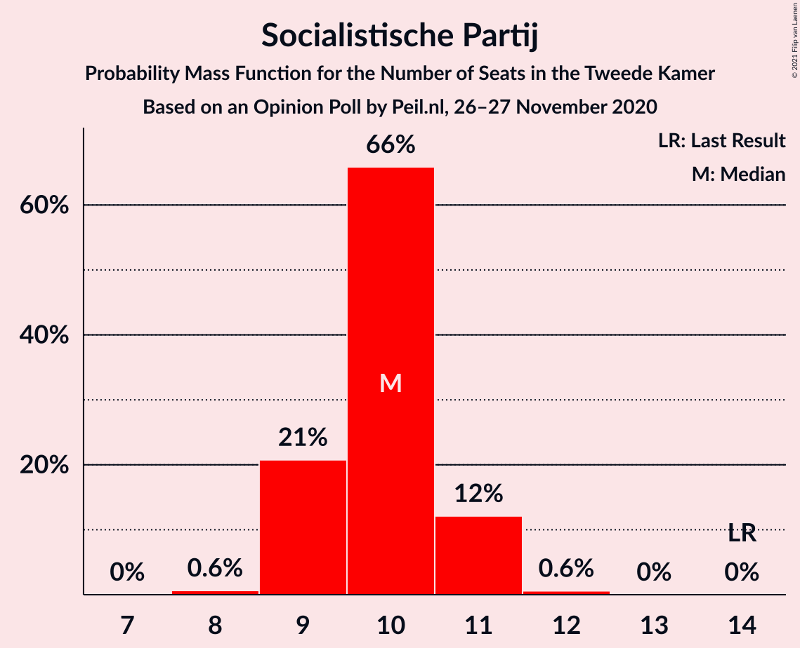

| Number of Seats | Probability | Accumulated | Special Marks |
|:---------------:|:-----------:|:-----------:|:-------------:|
| 7 | 0.1% | 100% |  |
| 8 | 1.1% | 99.9% |  |
| 9 | 2% | 98.8% |  |
| 10 | 94% | 97% | Median |
| 11 | 3% | 3% |  |
| 12 | 0.1% | 0.1% |  |
| 13 | 0% | 0% |  |
| 14 | 0% | 0% | Last Result |

### ChristenUnie

*For a full overview of the results for this party, see the [ChristenUnie](party-christenunie.html) page.*

| Number of Seats | Probability | Accumulated | Special Marks |
|:---------------:|:-----------:|:-----------:|:-------------:|
| 5 | 3% | 100% | Last Result |
| 6 | 10% | 97% |  |
| 7 | 83% | 87% | Median |
| 8 | 2% | 3% |  |
| 9 | 2% | 2% |  |
| 10 | 0% | 0% |  |

### Partij voor de Dieren

*For a full overview of the results for this party, see the [Partij voor de Dieren](party-partijvoordedieren.html) page.*

| Number of Seats | Probability | Accumulated | Special Marks |
|:---------------:|:-----------:|:-----------:|:-------------:|
| 4 | 0.6% | 100% |  |
| 5 | 15% | 99.4% | Last Result |
| 6 | 82% | 84% | Median |
| 7 | 2% | 2% |  |
| 8 | 0.2% | 0.2% |  |
| 9 | 0% | 0% |  |

### Staatkundig Gereformeerde Partij

*For a full overview of the results for this party, see the [Staatkundig Gereformeerde Partij](party-staatkundiggereformeerdepartij.html) page.*

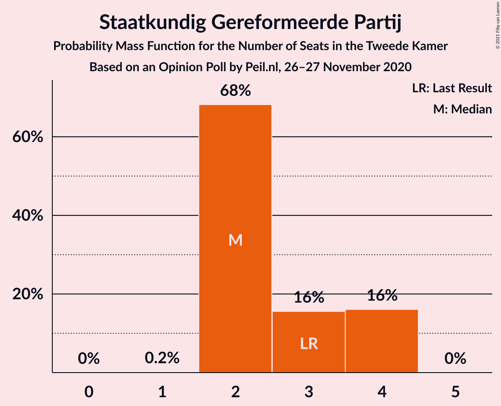

| Number of Seats | Probability | Accumulated | Special Marks |
|:---------------:|:-----------:|:-----------:|:-------------:|
| 2 | 58% | 100% | Median |
| 3 | 41% | 42% | Last Result |
| 4 | 1.0% | 1.0% |  |
| 5 | 0% | 0% |  |

### DENK

*For a full overview of the results for this party, see the [DENK](party-denk.html) page.*

| Number of Seats | Probability | Accumulated | Special Marks |
|:---------------:|:-----------:|:-----------:|:-------------:|
| 2 | 53% | 100% | Median |
| 3 | 47% | 47% | Last Result |
| 4 | 0.4% | 0.7% |  |
| 5 | 0.3% | 0.3% |  |
| 6 | 0% | 0% |  |

### Forum voor Democratie

*For a full overview of the results for this party, see the [Forum voor Democratie](party-forumvoordemocratie.html) page.*

| Number of Seats | Probability | Accumulated | Special Marks |
|:---------------:|:-----------:|:-----------:|:-------------:|
| 2 | 48% | 100% | Last Result |
| 3 | 47% | 52% | Median |
| 4 | 5% | 5% |  |
| 5 | 0% | 0% |  |

### 50Plus

*For a full overview of the results for this party, see the [50Plus](party-50plus.html) page.*

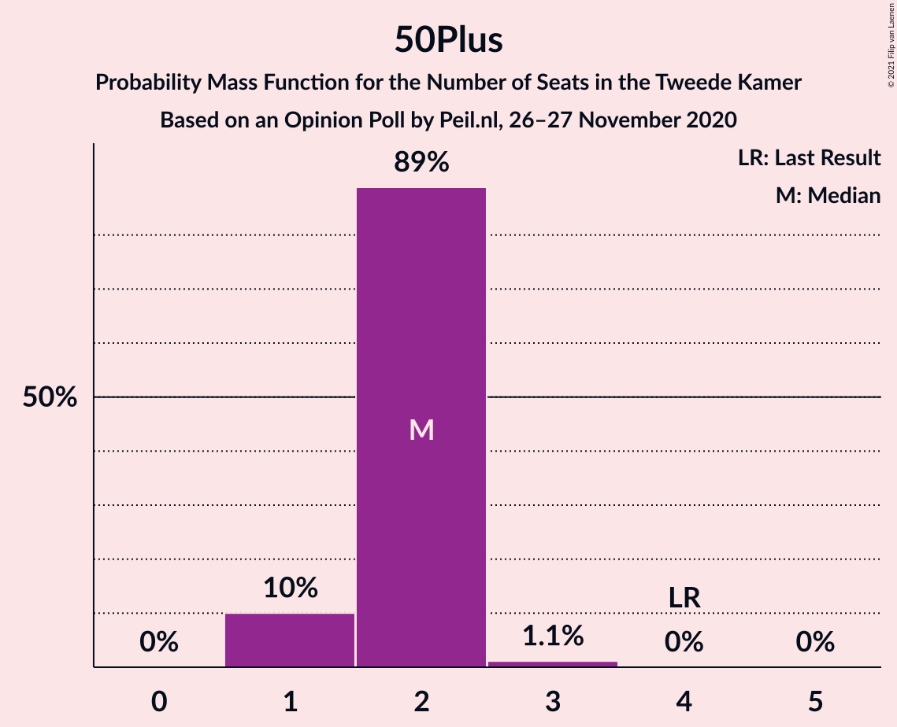

| Number of Seats | Probability | Accumulated | Special Marks |
|:---------------:|:-----------:|:-----------:|:-------------:|
| 1 | 40% | 100% |  |
| 2 | 60% | 60% | Median |
| 3 | 0.1% | 0.1% |  |
| 4 | 0% | 0% | Last Result |

### Code Oranje

*For a full overview of the results for this party, see the [Code Oranje](party-codeoranje.html) page.*

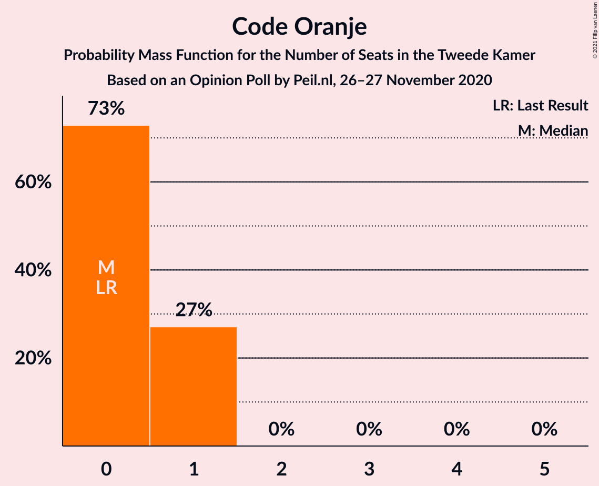

| Number of Seats | Probability | Accumulated | Special Marks |
|:---------------:|:-----------:|:-----------:|:-------------:|
| 0 | 73% | 100% | Last Result, Median |
| 1 | 27% | 27% |  |
| 2 | 0% | 0% |  |

## Coalitions

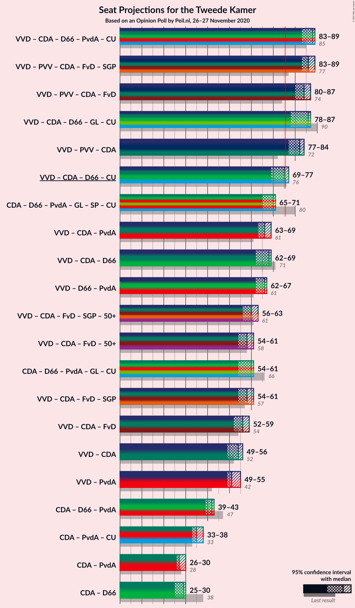

### Confidence Intervals

| Coalition | Last Result | Median | Majority? | 80% Confidence Interval | 90% Confidence Interval | 95% Confidence Interval | 99% Confidence Interval |
|:---------:|:-----------:|:------:|:---------:|:-----------------------:|:-----------------------:|:-----------------------:|:-----------------------:|
| Volkspartij voor Vrijheid en Democratie – Christen-Democratisch Appèl – Democraten 66 – Partij van de Arbeid – ChristenUnie | 85 | 85 | 100% | 83–86 | 83–86 | 83–86 | 81–86 |
| Volkspartij voor Vrijheid en Democratie – Partij voor de Vrijheid – Christen-Democratisch Appèl – Forum voor Democratie – Staatkundig Gereformeerde Partij | 77 | 86 | 100% | 83–86 | 81–86 | 81–86 | 81–88 |
| Volkspartij voor Vrijheid en Democratie – Partij voor de Vrijheid – Christen-Democratisch Appèl – Forum voor Democratie | 74 | 84 | 100% | 80–84 | 79–84 | 79–84 | 79–85 |
| Volkspartij voor Vrijheid en Democratie – Christen-Democratisch Appèl – Democraten 66 – GroenLinks – ChristenUnie | 90 | 82 | 100% | 81–83 | 80–83 | 80–83 | 80–85 |
| Volkspartij voor Vrijheid en Democratie – Partij voor de Vrijheid – Christen-Democratisch Appèl | 72 | 81 | 99.8% | 77–82 | 76–82 | 76–82 | 76–82 |
| Volkspartij voor Vrijheid en Democratie – Christen-Democratisch Appèl – Democraten 66 – ChristenUnie | 76 | 72 | 0% | 69–73 | 68–73 | 68–73 | 68–74 |
| Christen-Democratisch Appèl – Democraten 66 – Partij van de Arbeid – GroenLinks – Socialistische Partij – ChristenUnie | 80 | 70 | 0% | 68–70 | 67–71 | 67–71 | 66–71 |
| Volkspartij voor Vrijheid en Democratie – Christen-Democratisch Appèl – Democraten 66 | 71 | 65 | 0% | 62–66 | 62–66 | 62–66 | 61–69 |
| Volkspartij voor Vrijheid en Democratie – Christen-Democratisch Appèl – Partij van de Arbeid | 61 | 64 | 0% | 63–66 | 63–66 | 62–66 | 60–67 |
| Volkspartij voor Vrijheid en Democratie – Democraten 66 – Partij van de Arbeid | 61 | 64 | 0% | 62–65 | 62–65 | 61–65 | 59–67 |
| Christen-Democratisch Appèl – Democraten 66 – Partij van de Arbeid – GroenLinks – ChristenUnie | 66 | 60 | 0% | 58–60 | 58–61 | 57–61 | 56–61 |
| Volkspartij voor Vrijheid en Democratie – Christen-Democratisch Appèl – Forum voor Democratie – Staatkundig Gereformeerde Partij – 50Plus | 61 | 57 | 0% | 56–58 | 56–59 | 56–59 | 56–62 |
| Volkspartij voor Vrijheid en Democratie – Christen-Democratisch Appèl – Forum voor Democratie – Staatkundig Gereformeerde Partij | 57 | 55 | 0% | 54–57 | 54–57 | 54–58 | 54–61 |
| Volkspartij voor Vrijheid en Democratie – Christen-Democratisch Appèl – Forum voor Democratie – 50Plus | 58 | 55 | 0% | 53–56 | 53–56 | 53–56 | 53–59 |
| Volkspartij voor Vrijheid en Democratie – Christen-Democratisch Appèl – Forum voor Democratie | 54 | 53 | 0% | 51–55 | 51–55 | 51–55 | 51–58 |
| Volkspartij voor Vrijheid en Democratie – Christen-Democratisch Appèl | 52 | 51 | 0% | 49–52 | 49–52 | 49–52 | 48–55 |
| Volkspartij voor Vrijheid en Democratie – Partij van de Arbeid | 42 | 50 | 0% | 49–51 | 49–51 | 49–52 | 46–54 |
| Christen-Democratisch Appèl – Democraten 66 – Partij van de Arbeid | 47 | 42 | 0% | 41–42 | 40–43 | 38–43 | 37–43 |
| Christen-Democratisch Appèl – Partij van de Arbeid – ChristenUnie | 33 | 35 | 0% | 34–36 | 33–36 | 32–36 | 31–36 |
| Christen-Democratisch Appèl – Partij van de Arbeid | 28 | 28 | 0% | 27–29 | 27–30 | 25–30 | 24–30 |
| Christen-Democratisch Appèl – Democraten 66 | 38 | 28 | 0% | 27–29 | 26–29 | 25–29 | 25–30 |

### Volkspartij voor Vrijheid en Democratie – Christen-Democratisch Appèl – Democraten 66 – Partij van de Arbeid – ChristenUnie

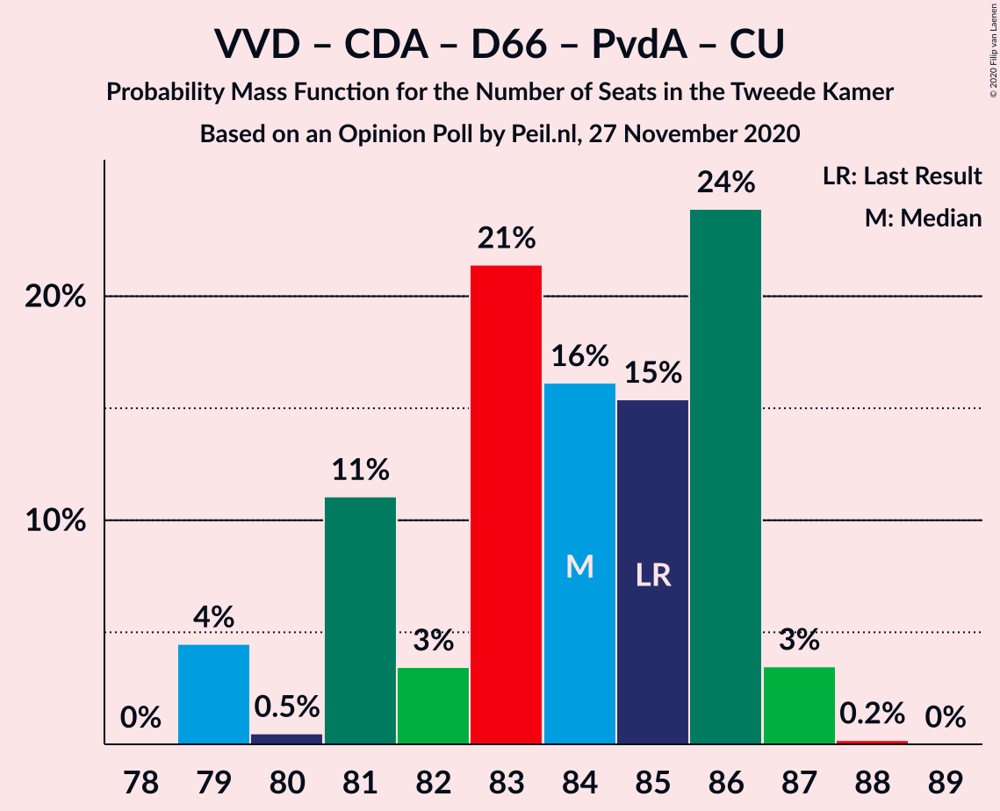

| Number of Seats | Probability | Accumulated | Special Marks |
|:---------------:|:-----------:|:-----------:|:-------------:|
| 80 | 0.2% | 100% |  |
| 81 | 0.6% | 99.8% |  |
| 82 | 2% | 99.2% |  |
| 83 | 36% | 98% |  |
| 84 | 12% | 62% |  |
| 85 | 0.7% | 50% | Last Result, Median |
| 86 | 49% | 50% |  |
| 87 | 0.1% | 0.2% |  |
| 88 | 0% | 0.1% |  |
| 89 | 0.1% | 0.1% |  |
| 90 | 0% | 0% |  |

### Volkspartij voor Vrijheid en Democratie – Partij voor de Vrijheid – Christen-Democratisch Appèl – Forum voor Democratie – Staatkundig Gereformeerde Partij

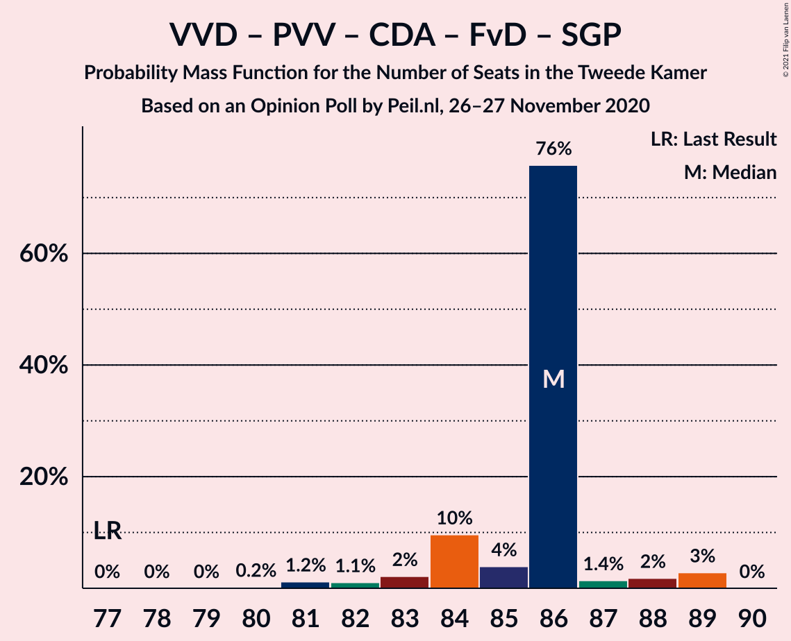

| Number of Seats | Probability | Accumulated | Special Marks |
|:---------------:|:-----------:|:-----------:|:-------------:|
| 77 | 0% | 100% | Last Result |
| 78 | 0% | 100% |  |
| 79 | 0% | 100% |  |
| 80 | 0.2% | 100% |  |
| 81 | 9% | 99.8% |  |
| 82 | 0.3% | 91% |  |
| 83 | 34% | 91% |  |
| 84 | 3% | 57% |  |
| 85 | 2% | 54% | Median |
| 86 | 49% | 52% |  |
| 87 | 1.0% | 2% |  |
| 88 | 0.7% | 1.2% |  |
| 89 | 0.4% | 0.4% |  |
| 90 | 0% | 0% |  |

### Volkspartij voor Vrijheid en Democratie – Partij voor de Vrijheid – Christen-Democratisch Appèl – Forum voor Democratie

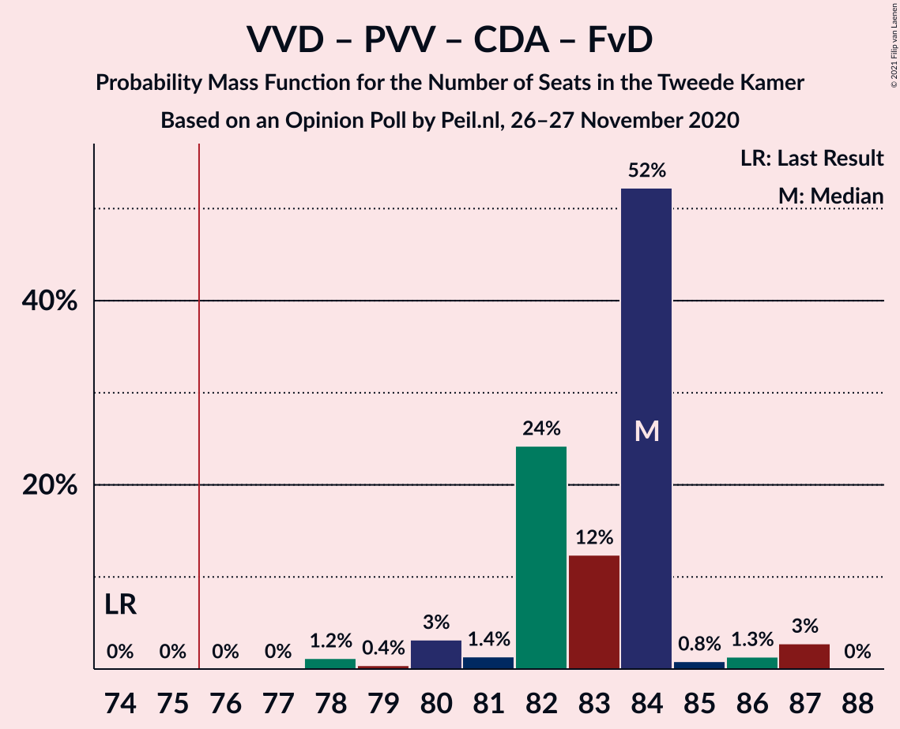

| Number of Seats | Probability | Accumulated | Special Marks |
|:---------------:|:-----------:|:-----------:|:-------------:|
| 74 | 0% | 100% | Last Result |
| 75 | 0% | 100% |  |
| 76 | 0% | 100% | Majority |
| 77 | 0% | 100% |  |
| 78 | 0.2% | 100% |  |
| 79 | 9% | 99.8% |  |
| 80 | 33% | 91% |  |
| 81 | 3% | 57% |  |
| 82 | 2% | 54% |  |
| 83 | 0.8% | 51% | Median |
| 84 | 49% | 51% |  |
| 85 | 0.7% | 1.2% |  |
| 86 | 0.4% | 0.4% |  |
| 87 | 0% | 0% |  |

### Volkspartij voor Vrijheid en Democratie – Christen-Democratisch Appèl – Democraten 66 – GroenLinks – ChristenUnie

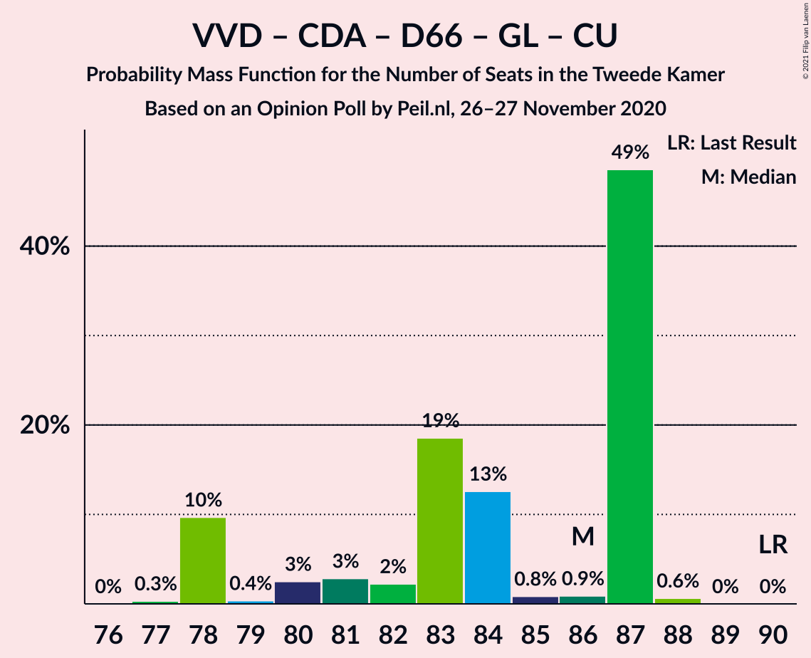

| Number of Seats | Probability | Accumulated | Special Marks |
|:---------------:|:-----------:|:-----------:|:-------------:|
| 78 | 0.1% | 100% |  |
| 79 | 0.3% | 99.9% |  |
| 80 | 9% | 99.6% |  |
| 81 | 37% | 90% |  |
| 82 | 15% | 53% | Median |
| 83 | 37% | 38% |  |
| 84 | 0.1% | 1.2% |  |
| 85 | 0.9% | 1.1% |  |
| 86 | 0.1% | 0.2% |  |
| 87 | 0.1% | 0.1% |  |
| 88 | 0% | 0% |  |
| 89 | 0% | 0% |  |
| 90 | 0% | 0% | Last Result |

### Volkspartij voor Vrijheid en Democratie – Partij voor de Vrijheid – Christen-Democratisch Appèl

| Number of Seats | Probability | Accumulated | Special Marks |
|:---------------:|:-----------:|:-----------:|:-------------:|
| 72 | 0% | 100% | Last Result |
| 73 | 0% | 100% |  |
| 74 | 0% | 100% |  |
| 75 | 0.2% | 100% |  |
| 76 | 9% | 99.8% | Majority |
| 77 | 3% | 91% |  |
| 78 | 36% | 88% |  |
| 79 | 0.6% | 52% |  |
| 80 | 0.5% | 52% | Median |
| 81 | 37% | 51% |  |
| 82 | 14% | 14% |  |
| 83 | 0% | 0% |  |

### Volkspartij voor Vrijheid en Democratie – Christen-Democratisch Appèl – Democraten 66 – ChristenUnie

| Number of Seats | Probability | Accumulated | Special Marks |
|:---------------:|:-----------:|:-----------:|:-------------:|
| 68 | 9% | 100% |  |
| 69 | 36% | 91% |  |
| 70 | 2% | 55% |  |
| 71 | 2% | 52% | Median |
| 72 | 36% | 50% |  |
| 73 | 13% | 14% |  |
| 74 | 0.6% | 0.8% |  |
| 75 | 0.1% | 0.2% |  |
| 76 | 0% | 0% | Last Result, Majority |

### Christen-Democratisch Appèl – Democraten 66 – Partij van de Arbeid – GroenLinks – Socialistische Partij – ChristenUnie

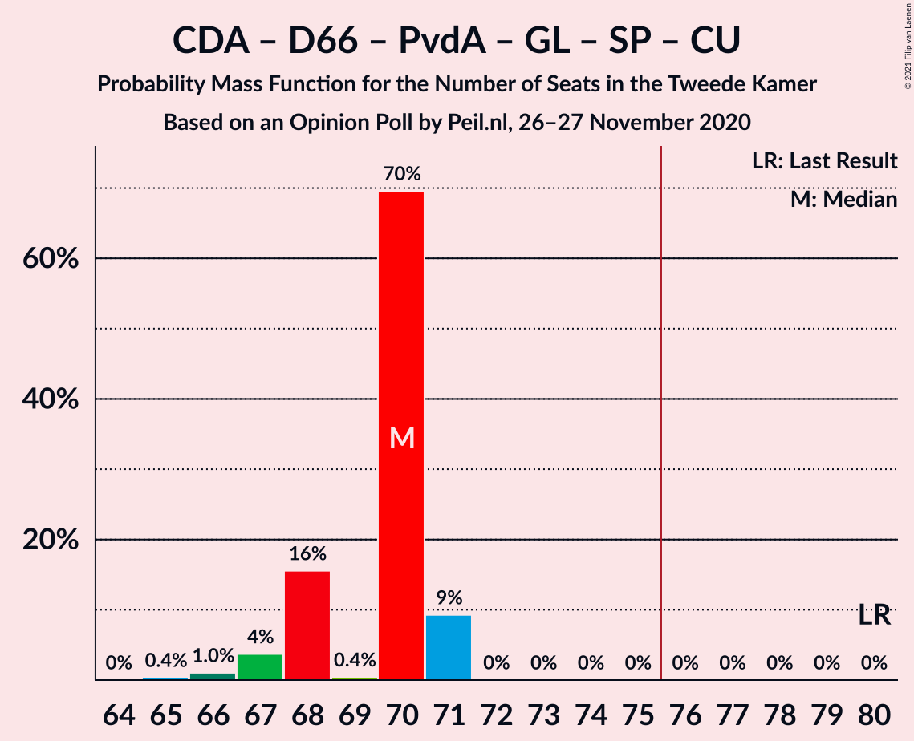

| Number of Seats | Probability | Accumulated | Special Marks |
|:---------------:|:-----------:|:-----------:|:-------------:|
| 65 | 0.4% | 100% |  |
| 66 | 1.0% | 99.6% |  |
| 67 | 4% | 98.6% |  |
| 68 | 16% | 95% |  |
| 69 | 0.4% | 79% | Median |
| 70 | 70% | 79% |  |
| 71 | 9% | 9% |  |
| 72 | 0% | 0% |  |
| 73 | 0% | 0% |  |
| 74 | 0% | 0% |  |
| 75 | 0% | 0% |  |
| 76 | 0% | 0% | Majority |
| 77 | 0% | 0% |  |
| 78 | 0% | 0% |  |
| 79 | 0% | 0% |  |
| 80 | 0% | 0% | Last Result |

### Volkspartij voor Vrijheid en Democratie – Christen-Democratisch Appèl – Democraten 66

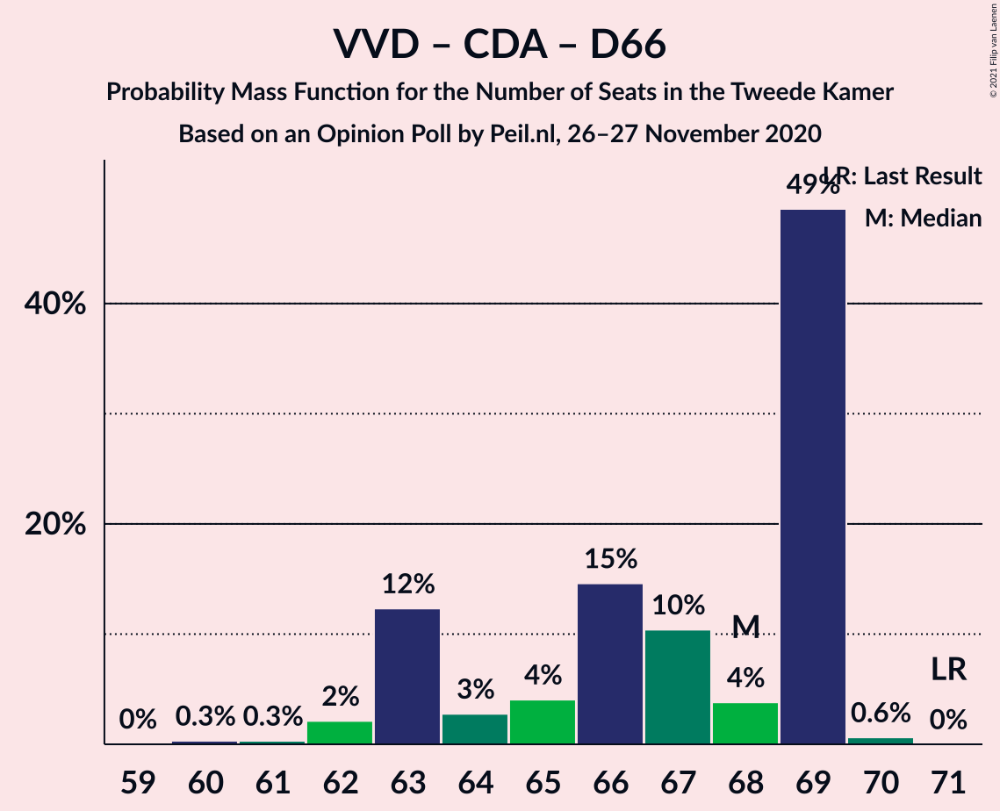

| Number of Seats | Probability | Accumulated | Special Marks |
|:---------------:|:-----------:|:-----------:|:-------------:|
| 60 | 0.3% | 100% |  |
| 61 | 0.3% | 99.7% |  |
| 62 | 45% | 99.4% |  |
| 63 | 0.7% | 55% |  |
| 64 | 4% | 54% | Median |
| 65 | 36% | 50% |  |
| 66 | 13% | 14% |  |
| 67 | 0% | 0.7% |  |
| 68 | 0.1% | 0.7% |  |
| 69 | 0.6% | 0.6% |  |
| 70 | 0% | 0% |  |
| 71 | 0% | 0% | Last Result |

### Volkspartij voor Vrijheid en Democratie – Christen-Democratisch Appèl – Partij van de Arbeid

| Number of Seats | Probability | Accumulated | Special Marks |
|:---------------:|:-----------:|:-----------:|:-------------:|
| 59 | 0.2% | 100% |  |
| 60 | 1.0% | 99.8% |  |
| 61 | 0.4% | 98.8% | Last Result |
| 62 | 2% | 98% |  |
| 63 | 34% | 97% |  |
| 64 | 15% | 63% |  |
| 65 | 9% | 48% | Median |
| 66 | 38% | 39% |  |
| 67 | 1.0% | 1.1% |  |
| 68 | 0.1% | 0.1% |  |
| 69 | 0% | 0% |  |

### Volkspartij voor Vrijheid en Democratie – Democraten 66 – Partij van de Arbeid

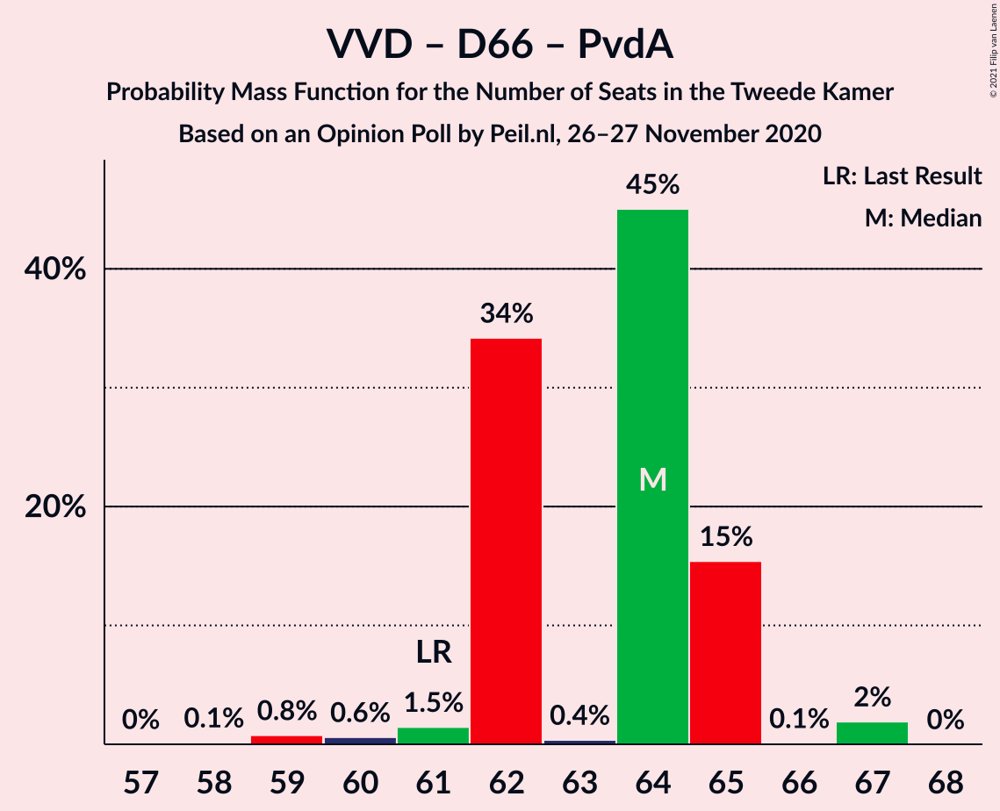

| Number of Seats | Probability | Accumulated | Special Marks |
|:---------------:|:-----------:|:-----------:|:-------------:|
| 58 | 0.1% | 100% |  |
| 59 | 0.8% | 99.8% |  |
| 60 | 0.6% | 99.1% |  |
| 61 | 1.5% | 98% | Last Result |
| 62 | 34% | 97% |  |
| 63 | 0.4% | 63% |  |
| 64 | 45% | 62% | Median |
| 65 | 15% | 17% |  |
| 66 | 0.1% | 2% |  |
| 67 | 2% | 2% |  |
| 68 | 0% | 0% |  |

### Christen-Democratisch Appèl – Democraten 66 – Partij van de Arbeid – GroenLinks – ChristenUnie

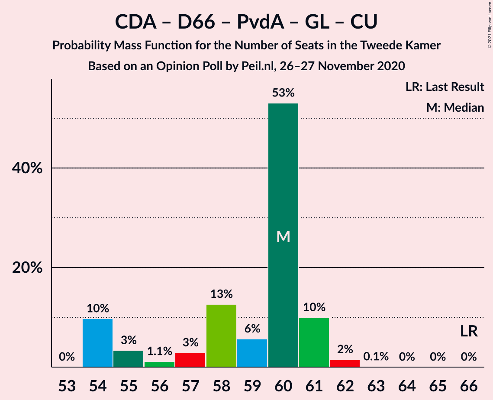

| Number of Seats | Probability | Accumulated | Special Marks |
|:---------------:|:-----------:|:-----------:|:-------------:|
| 54 | 0.4% | 100% |  |
| 55 | 0% | 99.6% |  |
| 56 | 0.5% | 99.6% |  |
| 57 | 4% | 99.1% |  |
| 58 | 15% | 95% |  |
| 59 | 1.5% | 80% | Median |
| 60 | 69% | 79% |  |
| 61 | 9% | 9% |  |
| 62 | 0.2% | 0.2% |  |
| 63 | 0% | 0% |  |
| 64 | 0% | 0% |  |
| 65 | 0% | 0% |  |
| 66 | 0% | 0% | Last Result |

### Volkspartij voor Vrijheid en Democratie – Christen-Democratisch Appèl – Forum voor Democratie – Staatkundig Gereformeerde Partij – 50Plus

| Number of Seats | Probability | Accumulated | Special Marks |
|:---------------:|:-----------:|:-----------:|:-------------:|
| 53 | 0.2% | 100% |  |
| 54 | 0% | 99.8% |  |
| 55 | 0.2% | 99.8% |  |
| 56 | 42% | 99.6% |  |
| 57 | 15% | 57% |  |
| 58 | 37% | 43% | Median |
| 59 | 4% | 5% |  |
| 60 | 0.4% | 2% |  |
| 61 | 0.1% | 1.2% | Last Result |
| 62 | 1.0% | 1.0% |  |
| 63 | 0% | 0% |  |

### Volkspartij voor Vrijheid en Democratie – Christen-Democratisch Appèl – Forum voor Democratie – Staatkundig Gereformeerde Partij

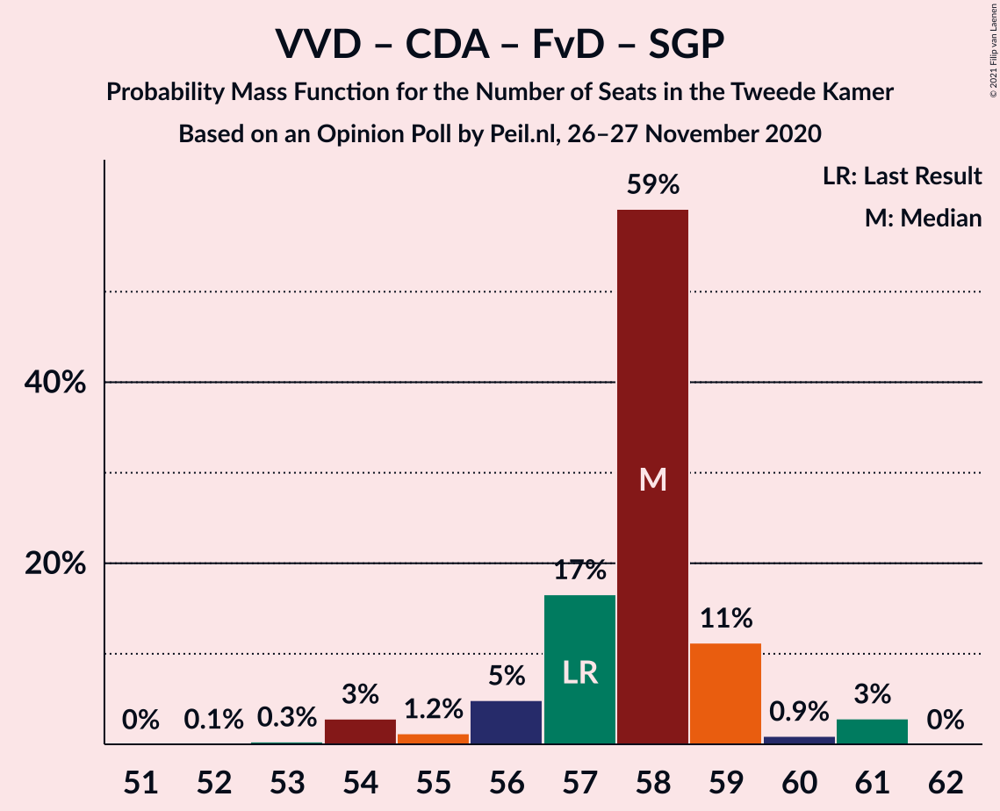

| Number of Seats | Probability | Accumulated | Special Marks |
|:---------------:|:-----------:|:-----------:|:-------------:|
| 51 | 0.2% | 100% |  |
| 52 | 0% | 99.8% |  |
| 53 | 0% | 99.8% |  |
| 54 | 42% | 99.8% |  |
| 55 | 14% | 57% |  |
| 56 | 1.3% | 43% | Median |
| 57 | 38% | 42% | Last Result |
| 58 | 2% | 4% |  |
| 59 | 0.1% | 1.2% |  |
| 60 | 0.5% | 1.0% |  |
| 61 | 0.6% | 0.6% |  |
| 62 | 0% | 0% |  |

### Volkspartij voor Vrijheid en Democratie – Christen-Democratisch Appèl – Forum voor Democratie – 50Plus

| Number of Seats | Probability | Accumulated | Special Marks |
|:---------------:|:-----------:|:-----------:|:-------------:|
| 51 | 0.2% | 100% |  |
| 52 | 0.2% | 99.8% |  |
| 53 | 34% | 99.6% |  |
| 54 | 11% | 66% |  |
| 55 | 14% | 55% |  |
| 56 | 39% | 41% | Median |
| 57 | 0.7% | 2% |  |
| 58 | 0.1% | 1.2% | Last Result |
| 59 | 1.0% | 1.1% |  |
| 60 | 0% | 0% |  |

### Volkspartij voor Vrijheid en Democratie – Christen-Democratisch Appèl – Forum voor Democratie

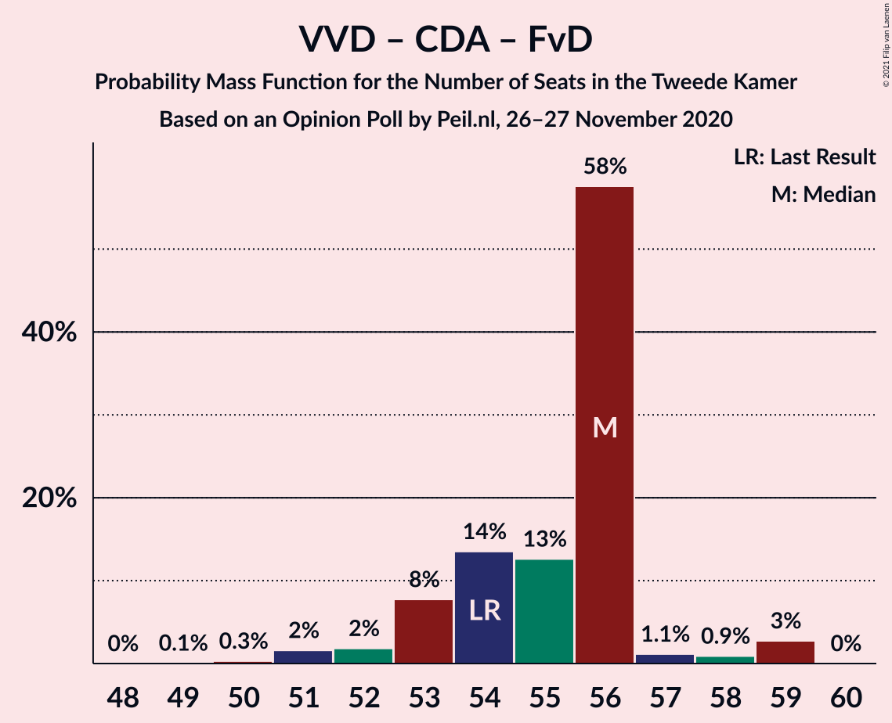

| Number of Seats | Probability | Accumulated | Special Marks |
|:---------------:|:-----------:|:-----------:|:-------------:|
| 49 | 0.2% | 100% |  |
| 50 | 0% | 99.8% |  |
| 51 | 33% | 99.8% |  |
| 52 | 11% | 66% |  |
| 53 | 15% | 56% |  |
| 54 | 1.5% | 41% | Last Result, Median |
| 55 | 38% | 40% |  |
| 56 | 0.1% | 1.2% |  |
| 57 | 0.4% | 1.1% |  |
| 58 | 0.6% | 0.6% |  |
| 59 | 0% | 0% |  |

### Volkspartij voor Vrijheid en Democratie – Christen-Democratisch Appèl

| Number of Seats | Probability | Accumulated | Special Marks |
|:---------------:|:-----------:|:-----------:|:-------------:|
| 46 | 0.2% | 100% |  |
| 47 | 0% | 99.8% |  |
| 48 | 1.0% | 99.8% |  |
| 49 | 42% | 98.7% |  |
| 50 | 3% | 56% |  |
| 51 | 16% | 54% | Median |
| 52 | 37% | 38% | Last Result |
| 53 | 0.5% | 1.2% |  |
| 54 | 0.1% | 0.7% |  |
| 55 | 0.6% | 0.6% |  |
| 56 | 0% | 0% |  |

### Volkspartij voor Vrijheid en Democratie – Partij van de Arbeid

| Number of Seats | Probability | Accumulated | Special Marks |
|:---------------:|:-----------:|:-----------:|:-------------:|
| 42 | 0% | 100% | Last Result |
| 43 | 0% | 100% |  |
| 44 | 0% | 100% |  |
| 45 | 0.3% | 100% |  |
| 46 | 0.2% | 99.6% |  |
| 47 | 0.4% | 99.4% |  |
| 48 | 1.0% | 99.0% |  |
| 49 | 36% | 98% |  |
| 50 | 13% | 62% |  |
| 51 | 46% | 49% | Median |
| 52 | 1.5% | 3% |  |
| 53 | 0.1% | 2% |  |
| 54 | 2% | 2% |  |
| 55 | 0% | 0% |  |

### Christen-Democratisch Appèl – Democraten 66 – Partij van de Arbeid

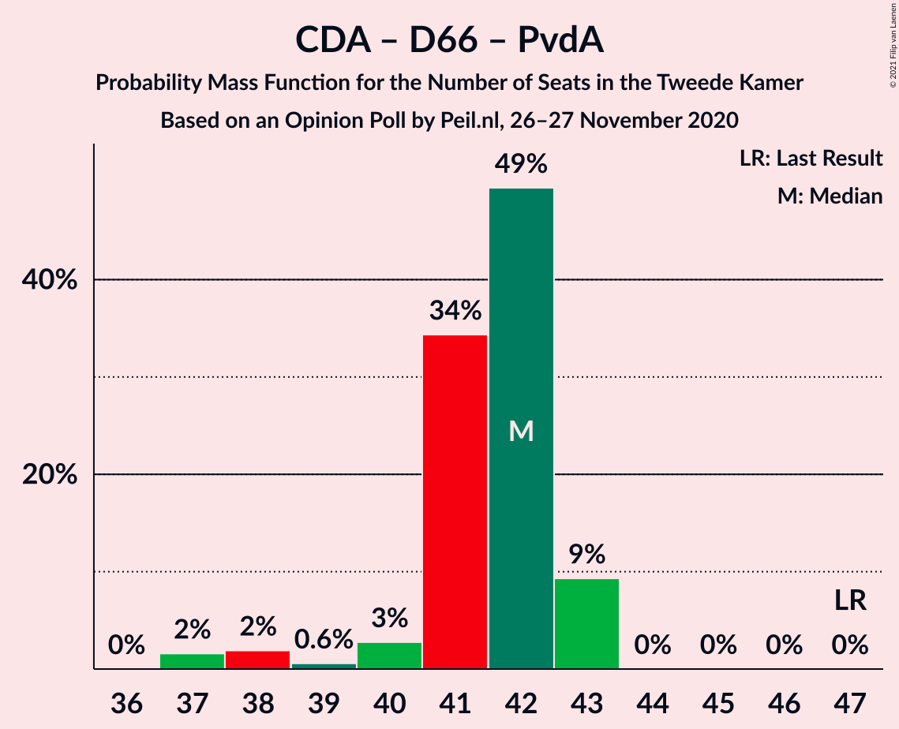

| Number of Seats | Probability | Accumulated | Special Marks |
|:---------------:|:-----------:|:-----------:|:-------------:|
| 37 | 2% | 100% |  |
| 38 | 2% | 98% |  |
| 39 | 0.6% | 96% |  |
| 40 | 3% | 96% |  |
| 41 | 34% | 93% | Median |
| 42 | 49% | 59% |  |
| 43 | 9% | 9% |  |
| 44 | 0% | 0% |  |
| 45 | 0% | 0% |  |
| 46 | 0% | 0% |  |
| 47 | 0% | 0% | Last Result |

### Christen-Democratisch Appèl – Partij van de Arbeid – ChristenUnie

| Number of Seats | Probability | Accumulated | Special Marks |
|:---------------:|:-----------:|:-----------:|:-------------:|
| 30 | 0.4% | 100% |  |
| 31 | 0.3% | 99.6% |  |
| 32 | 4% | 99.3% |  |
| 33 | 1.3% | 96% | Last Result |
| 34 | 15% | 95% |  |
| 35 | 34% | 80% | Median |
| 36 | 45% | 45% |  |
| 37 | 0.1% | 0.1% |  |
| 38 | 0.1% | 0.1% |  |
| 39 | 0% | 0% |  |

### Christen-Democratisch Appèl – Partij van de Arbeid

| Number of Seats | Probability | Accumulated | Special Marks |
|:---------------:|:-----------:|:-----------:|:-------------:|
| 24 | 0.9% | 100% |  |
| 25 | 3% | 99.1% |  |
| 26 | 0.3% | 96% |  |
| 27 | 16% | 96% |  |
| 28 | 34% | 80% | Last Result, Median |
| 29 | 36% | 46% |  |
| 30 | 10% | 10% |  |
| 31 | 0% | 0% |  |

### Christen-Democratisch Appèl – Democraten 66

| Number of Seats | Probability | Accumulated | Special Marks |
|:---------------:|:-----------:|:-----------:|:-------------:|
| 25 | 4% | 100% |  |
| 26 | 1.4% | 96% |  |
| 27 | 43% | 94% | Median |
| 28 | 38% | 51% |  |
| 29 | 13% | 14% |  |
| 30 | 0.6% | 0.6% |  |
| 31 | 0% | 0% |  |
| 32 | 0% | 0% |  |
| 33 | 0% | 0% |  |
| 34 | 0% | 0% |  |
| 35 | 0% | 0% |  |
| 36 | 0% | 0% |  |
| 37 | 0% | 0% |  |
| 38 | 0% | 0% | Last Result |

## Technical Information

### Opinion Poll

+ **Polling firm:** Peil.nl
+ **Commissioner(s):** —
+ **Fieldwork period:** 26–27 November 2020

### Calculations

+ **Sample size:** 3000
+ **Simulations done:** 131,072
+ **Error estimate:** 1.22%

