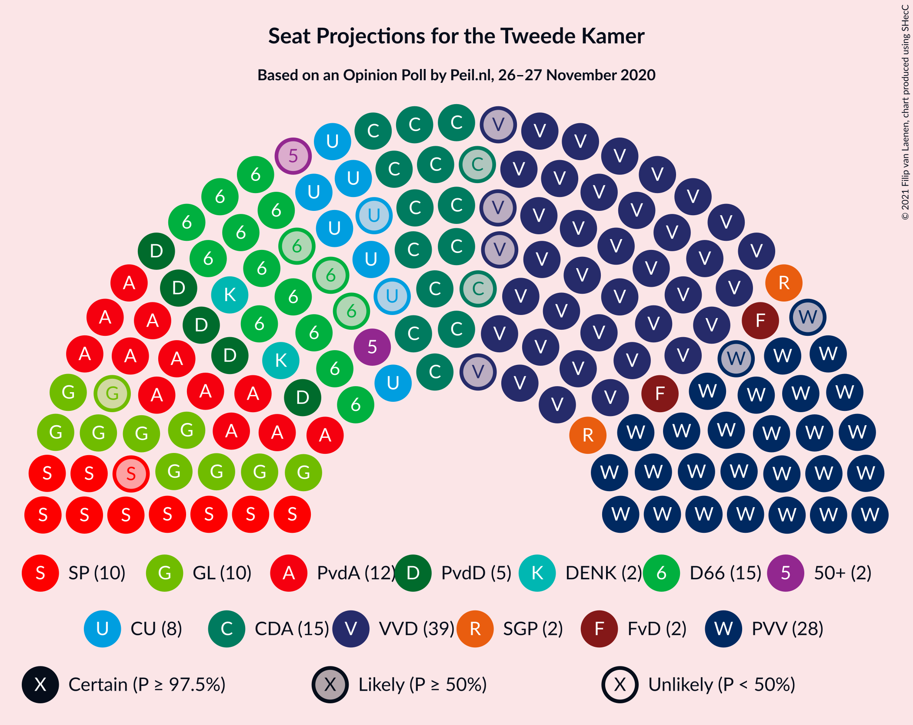
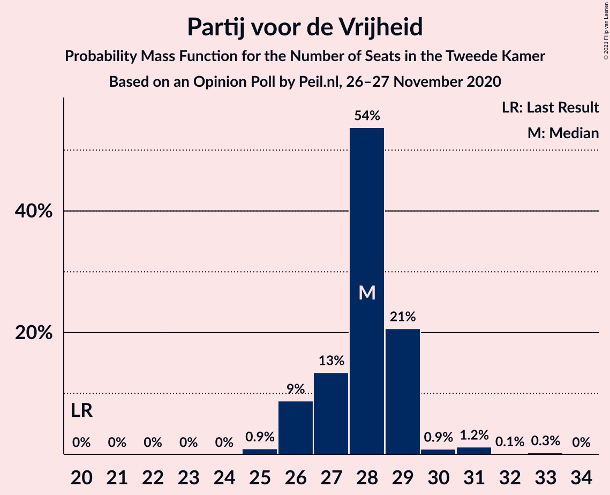
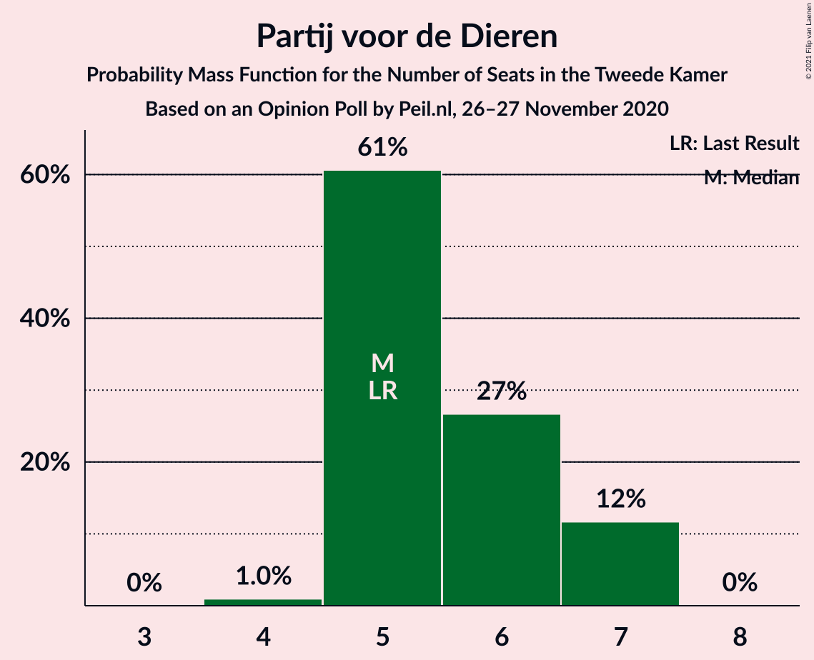
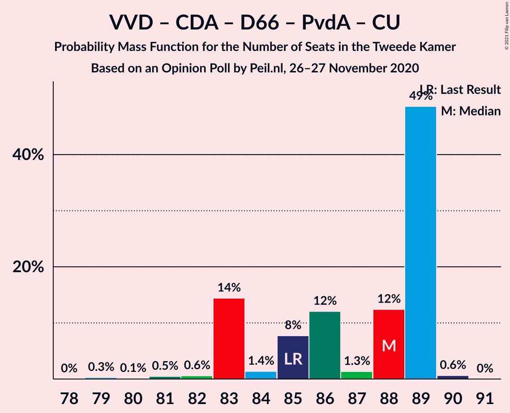
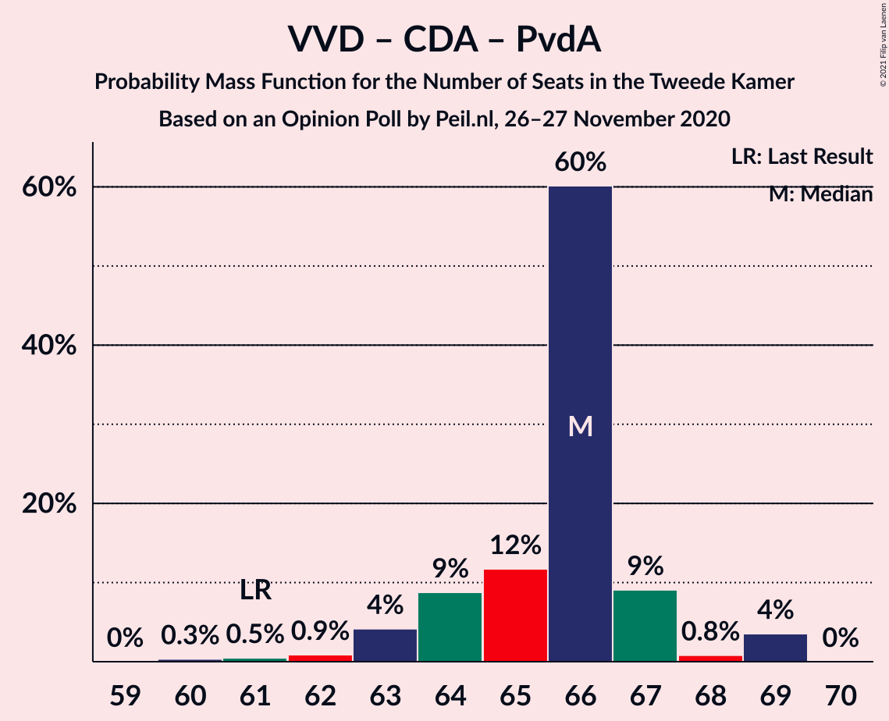

# Opinion Poll by Peil.nl, 27 November 2020

<a href="#voting-intentions">Voting Intentions</a> | <a href="#seats">Seats</a> | <a href="#coalitions">Coalitions</a> | <a href="#technical-information">Technical Information</a>

## Voting Intentions

### Confidence Intervals

| Party | Last Result | Poll Result | 80% Confidence Interval | 90% Confidence Interval | 95% Confidence Interval | 99% Confidence Interval |
|:-----:|:-----------:|:-----------:|:-----------------------:|:-----------------------:|:-----------------------:|:-----------------------:|
| Volkspartij voor Vrijheid en Democratie | 21.3% | 24.0% | 23.0–25.0% |22.7–25.3% |22.5–25.6% |22.0–26.1% |
| Partij voor de Vrijheid | 13.1% | 18.7% | 17.8–19.6% |17.5–19.9% |17.3–20.1% |16.9–20.6% |
| Christen-Democratisch Appèl | 12.4% | 9.3% | 8.7–10.1% |8.5–10.3% |8.3–10.4% |8.0–10.8% |
| Democraten 66 | 12.2% | 8.7% | 8.0–9.4% |7.8–9.6% |7.7–9.7% |7.4–10.1% |
| Partij van de Arbeid | 5.7% | 8.7% | 8.0–9.4% |7.8–9.6% |7.7–9.7% |7.4–10.1% |
| GroenLinks | 9.1% | 7.3% | 6.8–8.0% |6.6–8.2% |6.4–8.3% |6.2–8.6% |
| Socialistische Partij | 9.1% | 6.7% | 6.1–7.3% |6.0–7.5% |5.8–7.6% |5.6–7.9% |
| ChristenUnie | 3.4% | 4.7% | 4.2–5.2% |4.1–5.3% |4.0–5.5% |3.7–5.8% |
| Partij voor de Dieren | 3.2% | 4.0% | 3.6–4.5% |3.4–4.6% |3.4–4.8% |3.2–5.0% |
| Staatkundig Gereformeerde Partij | 2.1% | 2.0% | 1.7–2.4% |1.6–2.5% |1.6–2.6% |1.4–2.8% |
| DENK | 2.1% | 2.0% | 1.7–2.4% |1.6–2.5% |1.6–2.6% |1.4–2.8% |
| Forum voor Democratie | 1.8% | 2.0% | 1.7–2.4% |1.6–2.5% |1.6–2.6% |1.4–2.8% |
| 50Plus | 3.1% | 1.3% | 1.1–1.6% |1.0–1.7% |1.0–1.8% |0.9–2.0% |

*Note:* The poll result column reflects the actual value used in the calculations. Published results may vary slightly, and in addition be rounded to fewer digits.

## Seats

### Confidence Intervals

| Party | Last Result | Median | 80% Confidence Interval | 90% Confidence Interval | 95% Confidence Interval | 99% Confidence Interval |
|:-----:|:-----------:|:------:|:-----------------------:|:-----------------------:|:-----------------------:|:-----------------------:|
| <a href="#volkspartij-voor-vrijheid-en-democratie">Volkspartij voor Vrijheid en Democratie</a> | 33 | 38 | 35–39 |35–39 |34–39 |34–40 |
| <a href="#partij-voor-de-vrijheid">Partij voor de Vrijheid</a> | 20 | 28 | 27–31 |27–31 |26–31 |26–31 |
| <a href="#christen-democratisch-appèl">Christen-Democratisch Appèl</a> | 19 | 14 | 13–15 |13–16 |12–16 |12–16 |
| <a href="#democraten-66">Democraten 66</a> | 19 | 13 | 12–14 |11–14 |11–15 |11–15 |
| <a href="#partij-van-de-arbeid">Partij van de Arbeid</a> | 9 | 13 | 12–14 |12–15 |11–15 |11–15 |
| <a href="#groenlinks">GroenLinks</a> | 14 | 11 | 10–12 |10–13 |10–13 |9–13 |
| <a href="#socialistische-partij">Socialistische Partij</a> | 14 | 10 | 9–11 |9–11 |9–11 |8–12 |
| <a href="#christenunie">ChristenUnie</a> | 5 | 7 | 6–8 |6–8 |6–8 |5–8 |
| <a href="#partij-voor-de-dieren">Partij voor de Dieren</a> | 5 | 6 | 5–7 |5–7 |5–7 |5–7 |
| <a href="#staatkundig-gereformeerde-partij">Staatkundig Gereformeerde Partij</a> | 3 | 3 | 3 |2–4 |2–4 |2–4 |
| <a href="#denk">DENK</a> | 3 | 3 | 2–3 |2–3 |2–3 |2–4 |
| <a href="#forum-voor-democratie">Forum voor Democratie</a> | 2 | 3 | 2–3 |2–3 |2–4 |2–4 |
| <a href="#50plus">50Plus</a> | 4 | 1 | 1–2 |1–3 |1–3 |1–3 |

### Volkspartij voor Vrijheid en Democratie

*For a full overview of the results for this party, see the [Volkspartij voor Vrijheid en Democratie](party-volkspartijvoorvrijheidendemocratie.html) page.*

| Number of Seats | Probability | Accumulated | Special Marks |
|:---------------:|:-----------:|:-----------:|:-------------:|
| 33 | 0.1% | 100% | Last Result |
| 34 | 4% | 99.9% |  |
| 35 | 16% | 96% |  |
| 36 | 19% | 80% |  |
| 37 | 9% | 61% |  |
| 38 | 29% | 52% | Median |
| 39 | 21% | 23% |  |
| 40 | 2% | 2% |  |
| 41 | 0.1% | 0.1% |  |
| 42 | 0% | 0% |  |

### Partij voor de Vrijheid

*For a full overview of the results for this party, see the [Partij voor de Vrijheid](party-partijvoordevrijheid.html) page.*

| Number of Seats | Probability | Accumulated | Special Marks |
|:---------------:|:-----------:|:-----------:|:-------------:|
| 20 | 0% | 100% | Last Result |
| 21 | 0% | 100% |  |
| 22 | 0% | 100% |  |
| 23 | 0% | 100% |  |
| 24 | 0% | 100% |  |
| 25 | 0.3% | 100% |  |
| 26 | 2% | 99.7% |  |
| 27 | 32% | 97% |  |
| 28 | 16% | 65% | Median |
| 29 | 16% | 49% |  |
| 30 | 21% | 33% |  |
| 31 | 11% | 12% |  |
| 32 | 0.2% | 0.2% |  |
| 33 | 0% | 0% |  |

### Christen-Democratisch Appèl

*For a full overview of the results for this party, see the [Christen-Democratisch Appèl](party-christen-democratischappèl.html) page.*

| Number of Seats | Probability | Accumulated | Special Marks |
|:---------------:|:-----------:|:-----------:|:-------------:|
| 12 | 3% | 100% |  |
| 13 | 36% | 97% |  |
| 14 | 29% | 62% | Median |
| 15 | 23% | 32% |  |
| 16 | 9% | 9% |  |
| 17 | 0.3% | 0.4% |  |
| 18 | 0% | 0% |  |
| 19 | 0% | 0% | Last Result |

### Democraten 66

*For a full overview of the results for this party, see the [Democraten 66](party-democraten66.html) page.*

| Number of Seats | Probability | Accumulated | Special Marks |
|:---------------:|:-----------:|:-----------:|:-------------:|
| 11 | 9% | 100% |  |
| 12 | 26% | 91% |  |
| 13 | 29% | 65% | Median |
| 14 | 32% | 36% |  |
| 15 | 4% | 4% |  |
| 16 | 0.1% | 0.1% |  |
| 17 | 0% | 0% |  |
| 18 | 0% | 0% |  |
| 19 | 0% | 0% | Last Result |

### Partij van de Arbeid

*For a full overview of the results for this party, see the [Partij van de Arbeid](party-partijvandearbeid.html) page.*

| Number of Seats | Probability | Accumulated | Special Marks |
|:---------------:|:-----------:|:-----------:|:-------------:|
| 9 | 0% | 100% | Last Result |
| 10 | 0% | 100% |  |
| 11 | 3% | 100% |  |
| 12 | 29% | 97% |  |
| 13 | 39% | 69% | Median |
| 14 | 22% | 30% |  |
| 15 | 8% | 8% |  |
| 16 | 0.1% | 0.2% |  |
| 17 | 0% | 0% |  |

### GroenLinks

*For a full overview of the results for this party, see the [GroenLinks](party-groenlinks.html) page.*

| Number of Seats | Probability | Accumulated | Special Marks |
|:---------------:|:-----------:|:-----------:|:-------------:|
| 9 | 0.9% | 100% |  |
| 10 | 31% | 99.1% |  |
| 11 | 34% | 68% | Median |
| 12 | 24% | 34% |  |
| 13 | 10% | 10% |  |
| 14 | 0.4% | 0.4% | Last Result |
| 15 | 0% | 0% |  |

### Socialistische Partij

*For a full overview of the results for this party, see the [Socialistische Partij](party-socialistischepartij.html) page.*

| Number of Seats | Probability | Accumulated | Special Marks |
|:---------------:|:-----------:|:-----------:|:-------------:|
| 8 | 1.5% | 100% |  |
| 9 | 43% | 98.5% |  |
| 10 | 28% | 55% | Median |
| 11 | 26% | 27% |  |
| 12 | 0.6% | 0.9% |  |
| 13 | 0.2% | 0.2% |  |
| 14 | 0% | 0% | Last Result |

### ChristenUnie

*For a full overview of the results for this party, see the [ChristenUnie](party-christenunie.html) page.*

| Number of Seats | Probability | Accumulated | Special Marks |
|:---------------:|:-----------:|:-----------:|:-------------:|
| 5 | 0.7% | 100% | Last Result |
| 6 | 38% | 99.3% |  |
| 7 | 47% | 61% | Median |
| 8 | 13% | 14% |  |
| 9 | 0.4% | 0.4% |  |
| 10 | 0% | 0% |  |

### Partij voor de Dieren

*For a full overview of the results for this party, see the [Partij voor de Dieren](party-partijvoordedieren.html) page.*

| Number of Seats | Probability | Accumulated | Special Marks |
|:---------------:|:-----------:|:-----------:|:-------------:|
| 4 | 0.3% | 100% |  |
| 5 | 38% | 99.7% | Last Result |
| 6 | 47% | 62% | Median |
| 7 | 15% | 16% |  |
| 8 | 0.2% | 0.2% |  |
| 9 | 0% | 0% |  |

### Staatkundig Gereformeerde Partij

*For a full overview of the results for this party, see the [Staatkundig Gereformeerde Partij](party-staatkundiggereformeerdepartij.html) page.*

| Number of Seats | Probability | Accumulated | Special Marks |
|:---------------:|:-----------:|:-----------:|:-------------:|
| 2 | 8% | 100% |  |
| 3 | 86% | 92% | Last Result, Median |
| 4 | 6% | 6% |  |
| 5 | 0% | 0% |  |

### DENK

*For a full overview of the results for this party, see the [DENK](party-denk.html) page.*

| Number of Seats | Probability | Accumulated | Special Marks |
|:---------------:|:-----------:|:-----------:|:-------------:|
| 2 | 21% | 100% |  |
| 3 | 77% | 79% | Last Result, Median |
| 4 | 2% | 2% |  |
| 5 | 0% | 0% |  |

### Forum voor Democratie

*For a full overview of the results for this party, see the [Forum voor Democratie](party-forumvoordemocratie.html) page.*

| Number of Seats | Probability | Accumulated | Special Marks |
|:---------------:|:-----------:|:-----------:|:-------------:|
| 2 | 22% | 100% | Last Result |
| 3 | 75% | 78% | Median |
| 4 | 4% | 4% |  |
| 5 | 0% | 0% |  |

### 50Plus

*For a full overview of the results for this party, see the [50Plus](party-50plus.html) page.*

| Number of Seats | Probability | Accumulated | Special Marks |
|:---------------:|:-----------:|:-----------:|:-------------:|
| 1 | 54% | 100% | Median |
| 2 | 41% | 46% |  |
| 3 | 6% | 6% |  |
| 4 | 0% | 0% | Last Result |

## Coalitions

### Confidence Intervals

| Coalition | Last Result | Median | Majority? | 80% Confidence Interval | 90% Confidence Interval | 95% Confidence Interval | 99% Confidence Interval |
|:---------:|:-----------:|:------:|:---------:|:-----------------------:|:-----------------------:|:-----------------------:|:-----------------------:|
| Volkspartij voor Vrijheid en Democratie – Partij voor de Vrijheid – Christen-Democratisch Appèl – Forum voor Democratie – Staatkundig Gereformeerde Partij | 77 | 85 | 100% | 84–88 | 83–89 | 83–89 | 81–89 |
| Volkspartij voor Vrijheid en Democratie – Christen-Democratisch Appèl – Democraten 66 – Partij van de Arbeid – ChristenUnie | 85 | 84 | 100% | 81–86 | 81–86 | 79–87 | 79–87 |
| Volkspartij voor Vrijheid en Democratie – Partij voor de Vrijheid – Christen-Democratisch Appèl – Forum voor Democratie | 74 | 82 | 100% | 81–85 | 80–86 | 80–86 | 78–86 |
| Volkspartij voor Vrijheid en Democratie – Christen-Democratisch Appèl – Democraten 66 – GroenLinks – ChristenUnie | 90 | 82 | 100% | 78–85 | 78–85 | 78–85 | 78–85 |
| Volkspartij voor Vrijheid en Democratie – Partij voor de Vrijheid – Christen-Democratisch Appèl | 72 | 79 | 99.8% | 78–83 | 77–83 | 77–83 | 76–83 |
| Volkspartij voor Vrijheid en Democratie – Christen-Democratisch Appèl – Democraten 66 – ChristenUnie | 76 | 71 | 0% | 68–73 | 68–74 | 67–74 | 67–75 |
| Christen-Democratisch Appèl – Democraten 66 – Partij van de Arbeid – GroenLinks – Socialistische Partij – ChristenUnie | 80 | 67 | 0% | 66–69 | 66–71 | 66–71 | 64–72 |
| Volkspartij voor Vrijheid en Democratie – Christen-Democratisch Appèl – Democraten 66 | 71 | 64 | 0% | 62–66 | 61–67 | 61–67 | 61–68 |
| Volkspartij voor Vrijheid en Democratie – Christen-Democratisch Appèl – Partij van de Arbeid | 61 | 64 | 0% | 61–67 | 61–67 | 61–67 | 60–68 |
| Volkspartij voor Vrijheid en Democratie – Democraten 66 – Partij van de Arbeid | 61 | 64 | 0% | 61–64 | 60–65 | 59–65 | 59–66 |
| Volkspartij voor Vrijheid en Democratie – Christen-Democratisch Appèl – Forum voor Democratie – Staatkundig Gereformeerde Partij – 50Plus | 61 | 59 | 0% | 56–60 | 55–62 | 55–62 | 55–63 |
| Christen-Democratisch Appèl – Democraten 66 – Partij van de Arbeid – GroenLinks – ChristenUnie | 66 | 58 | 0% | 55–60 | 55–60 | 55–62 | 54–63 |
| Volkspartij voor Vrijheid en Democratie – Christen-Democratisch Appèl – Forum voor Democratie – Staatkundig Gereformeerde Partij | 57 | 57 | 0% | 55–59 | 54–61 | 54–61 | 53–61 |
| Volkspartij voor Vrijheid en Democratie – Christen-Democratisch Appèl – Forum voor Democratie – 50Plus | 58 | 56 | 0% | 53–57 | 52–59 | 52–59 | 52–60 |
| Volkspartij voor Vrijheid en Democratie – Christen-Democratisch Appèl – Forum voor Democratie | 54 | 54 | 0% | 52–56 | 51–58 | 51–58 | 50–58 |
| Volkspartij voor Vrijheid en Democratie – Christen-Democratisch Appèl | 52 | 52 | 0% | 49–53 | 48–55 | 48–55 | 48–55 |
| Volkspartij voor Vrijheid en Democratie – Partij van de Arbeid | 42 | 51 | 0% | 48–52 | 47–52 | 47–53 | 47–53 |
| Christen-Democratisch Appèl – Democraten 66 – Partij van de Arbeid | 47 | 40 | 0% | 37–41 | 37–43 | 37–43 | 37–45 |
| Christen-Democratisch Appèl – Partij van de Arbeid – ChristenUnie | 33 | 33 | 0% | 32–36 | 32–36 | 32–37 | 31–38 |
| Christen-Democratisch Appèl – Partij van de Arbeid | 28 | 27 | 0% | 25–29 | 25–29 | 25–30 | 24–31 |
| Christen-Democratisch Appèl – Democraten 66 | 38 | 27 | 0% | 25–28 | 24–29 | 24–30 | 24–31 |

### Volkspartij voor Vrijheid en Democratie – Partij voor de Vrijheid – Christen-Democratisch Appèl – Forum voor Democratie – Staatkundig Gereformeerde Partij

| Number of Seats | Probability | Accumulated | Special Marks |
|:---------------:|:-----------:|:-----------:|:-------------:|
| 77 | 0% | 100% | Last Result |
| 78 | 0% | 100% |  |
| 79 | 0% | 100% |  |
| 80 | 0.1% | 100% |  |
| 81 | 0.9% | 99.9% |  |
| 82 | 1.3% | 99.1% |  |
| 83 | 6% | 98% |  |
| 84 | 9% | 92% |  |
| 85 | 40% | 83% |  |
| 86 | 25% | 43% | Median |
| 87 | 4% | 17% |  |
| 88 | 8% | 13% |  |
| 89 | 5% | 5% |  |
| 90 | 0.1% | 0.1% |  |
| 91 | 0% | 0% |  |

### Volkspartij voor Vrijheid en Democratie – Christen-Democratisch Appèl – Democraten 66 – Partij van de Arbeid – ChristenUnie

| Number of Seats | Probability | Accumulated | Special Marks |
|:---------------:|:-----------:|:-----------:|:-------------:|
| 79 | 4% | 100% |  |
| 80 | 0.5% | 96% |  |
| 81 | 11% | 95% |  |
| 82 | 3% | 84% |  |
| 83 | 21% | 81% |  |
| 84 | 16% | 59% |  |
| 85 | 15% | 43% | Last Result, Median |
| 86 | 24% | 28% |  |
| 87 | 3% | 4% |  |
| 88 | 0.2% | 0.2% |  |
| 89 | 0% | 0% |  |

### Volkspartij voor Vrijheid en Democratie – Partij voor de Vrijheid – Christen-Democratisch Appèl – Forum voor Democratie

| Number of Seats | Probability | Accumulated | Special Marks |
|:---------------:|:-----------:|:-----------:|:-------------:|
| 74 | 0% | 100% | Last Result |
| 75 | 0% | 100% |  |
| 76 | 0% | 100% | Majority |
| 77 | 0% | 100% |  |
| 78 | 0.9% | 100% |  |
| 79 | 1.3% | 99.1% |  |
| 80 | 5% | 98% |  |
| 81 | 8% | 92% |  |
| 82 | 47% | 85% |  |
| 83 | 18% | 38% | Median |
| 84 | 7% | 20% |  |
| 85 | 6% | 13% |  |
| 86 | 7% | 7% |  |
| 87 | 0.3% | 0.4% |  |
| 88 | 0.1% | 0.1% |  |
| 89 | 0% | 0% |  |

### Volkspartij voor Vrijheid en Democratie – Christen-Democratisch Appèl – Democraten 66 – GroenLinks – ChristenUnie

| Number of Seats | Probability | Accumulated | Special Marks |
|:---------------:|:-----------:|:-----------:|:-------------:|
| 77 | 0.3% | 100% |  |
| 78 | 12% | 99.7% |  |
| 79 | 0.5% | 88% |  |
| 80 | 23% | 88% |  |
| 81 | 5% | 65% |  |
| 82 | 12% | 60% |  |
| 83 | 19% | 49% | Median |
| 84 | 12% | 29% |  |
| 85 | 17% | 18% |  |
| 86 | 0.1% | 0.3% |  |
| 87 | 0.2% | 0.2% |  |
| 88 | 0% | 0% |  |
| 89 | 0% | 0% |  |
| 90 | 0% | 0% | Last Result |

### Volkspartij voor Vrijheid en Democratie – Partij voor de Vrijheid – Christen-Democratisch Appèl

| Number of Seats | Probability | Accumulated | Special Marks |
|:---------------:|:-----------:|:-----------:|:-------------:|
| 72 | 0% | 100% | Last Result |
| 73 | 0% | 100% |  |
| 74 | 0% | 100% |  |
| 75 | 0.1% | 100% |  |
| 76 | 1.3% | 99.8% | Majority |
| 77 | 6% | 98.5% |  |
| 78 | 8% | 92% |  |
| 79 | 38% | 84% |  |
| 80 | 26% | 46% | Median |
| 81 | 5% | 21% |  |
| 82 | 4% | 16% |  |
| 83 | 11% | 12% |  |
| 84 | 0.4% | 0.4% |  |
| 85 | 0% | 0.1% |  |
| 86 | 0% | 0% |  |

### Volkspartij voor Vrijheid en Democratie – Christen-Democratisch Appèl – Democraten 66 – ChristenUnie

| Number of Seats | Probability | Accumulated | Special Marks |
|:---------------:|:-----------:|:-----------:|:-------------:|
| 66 | 0.3% | 100% |  |
| 67 | 5% | 99.7% |  |
| 68 | 11% | 95% |  |
| 69 | 15% | 84% |  |
| 70 | 17% | 69% |  |
| 71 | 5% | 52% |  |
| 72 | 18% | 47% | Median |
| 73 | 22% | 30% |  |
| 74 | 6% | 7% |  |
| 75 | 1.1% | 1.1% |  |
| 76 | 0% | 0% | Last Result, Majority |

### Christen-Democratisch Appèl – Democraten 66 – Partij van de Arbeid – GroenLinks – Socialistische Partij – ChristenUnie

| Number of Seats | Probability | Accumulated | Special Marks |
|:---------------:|:-----------:|:-----------:|:-------------:|
| 63 | 0.1% | 100% |  |
| 64 | 0.9% | 99.9% |  |
| 65 | 1.1% | 99.0% |  |
| 66 | 20% | 98% |  |
| 67 | 35% | 78% |  |
| 68 | 7% | 43% | Median |
| 69 | 27% | 35% |  |
| 70 | 2% | 8% |  |
| 71 | 5% | 6% |  |
| 72 | 2% | 2% |  |
| 73 | 0% | 0% |  |
| 74 | 0% | 0% |  |
| 75 | 0% | 0% |  |
| 76 | 0% | 0% | Majority |
| 77 | 0% | 0% |  |
| 78 | 0% | 0% |  |
| 79 | 0% | 0% |  |
| 80 | 0% | 0% | Last Result |

### Volkspartij voor Vrijheid en Democratie – Christen-Democratisch Appèl – Democraten 66

| Number of Seats | Probability | Accumulated | Special Marks |
|:---------------:|:-----------:|:-----------:|:-------------:|
| 59 | 0.3% | 100% |  |
| 60 | 0.2% | 99.7% |  |
| 61 | 8% | 99.5% |  |
| 62 | 9% | 92% |  |
| 63 | 29% | 83% |  |
| 64 | 14% | 54% |  |
| 65 | 5% | 40% | Median |
| 66 | 26% | 34% |  |
| 67 | 7% | 8% |  |
| 68 | 0.9% | 1.0% |  |
| 69 | 0% | 0% |  |
| 70 | 0% | 0% |  |
| 71 | 0% | 0% | Last Result |

### Volkspartij voor Vrijheid en Democratie – Christen-Democratisch Appèl – Partij van de Arbeid

| Number of Seats | Probability | Accumulated | Special Marks |
|:---------------:|:-----------:|:-----------:|:-------------:|
| 60 | 0.6% | 100% |  |
| 61 | 14% | 99.4% | Last Result |
| 62 | 5% | 86% |  |
| 63 | 19% | 81% |  |
| 64 | 19% | 62% |  |
| 65 | 9% | 43% | Median |
| 66 | 23% | 35% |  |
| 67 | 10% | 11% |  |
| 68 | 2% | 2% |  |
| 69 | 0.1% | 0.1% |  |
| 70 | 0% | 0% |  |

### Volkspartij voor Vrijheid en Democratie – Democraten 66 – Partij van de Arbeid

| Number of Seats | Probability | Accumulated | Special Marks |
|:---------------:|:-----------:|:-----------:|:-------------:|
| 59 | 4% | 100% |  |
| 60 | 3% | 96% |  |
| 61 | 7% | 92% | Last Result |
| 62 | 8% | 85% |  |
| 63 | 23% | 77% |  |
| 64 | 47% | 54% | Median |
| 65 | 5% | 7% |  |
| 66 | 2% | 2% |  |
| 67 | 0.2% | 0.2% |  |
| 68 | 0% | 0% |  |

### Volkspartij voor Vrijheid en Democratie – Christen-Democratisch Appèl – Forum voor Democratie – Staatkundig Gereformeerde Partij – 50Plus

| Number of Seats | Probability | Accumulated | Special Marks |
|:---------------:|:-----------:|:-----------:|:-------------:|
| 53 | 0.1% | 100% |  |
| 54 | 0.1% | 99.9% |  |
| 55 | 8% | 99.8% |  |
| 56 | 18% | 92% |  |
| 57 | 4% | 75% |  |
| 58 | 19% | 70% |  |
| 59 | 6% | 52% | Median |
| 60 | 39% | 45% |  |
| 61 | 1.0% | 7% | Last Result |
| 62 | 5% | 6% |  |
| 63 | 0.6% | 0.6% |  |
| 64 | 0% | 0% |  |

### Christen-Democratisch Appèl – Democraten 66 – Partij van de Arbeid – GroenLinks – ChristenUnie

| Number of Seats | Probability | Accumulated | Special Marks |
|:---------------:|:-----------:|:-----------:|:-------------:|
| 53 | 0.3% | 100% |  |
| 54 | 0.5% | 99.7% |  |
| 55 | 12% | 99.2% |  |
| 56 | 9% | 88% |  |
| 57 | 20% | 78% |  |
| 58 | 26% | 58% | Median |
| 59 | 9% | 32% |  |
| 60 | 20% | 24% |  |
| 61 | 0.8% | 4% |  |
| 62 | 2% | 3% |  |
| 63 | 0.9% | 0.9% |  |
| 64 | 0% | 0% |  |
| 65 | 0% | 0% |  |
| 66 | 0% | 0% | Last Result |

### Volkspartij voor Vrijheid en Democratie – Christen-Democratisch Appèl – Forum voor Democratie – Staatkundig Gereformeerde Partij

| Number of Seats | Probability | Accumulated | Special Marks |
|:---------------:|:-----------:|:-----------:|:-------------:|
| 52 | 0.1% | 100% |  |
| 53 | 1.2% | 99.9% |  |
| 54 | 7% | 98.6% |  |
| 55 | 25% | 92% |  |
| 56 | 9% | 66% |  |
| 57 | 11% | 58% | Last Result |
| 58 | 24% | 47% | Median |
| 59 | 17% | 23% |  |
| 60 | 0.5% | 6% |  |
| 61 | 5% | 5% |  |
| 62 | 0% | 0% |  |

### Volkspartij voor Vrijheid en Democratie – Christen-Democratisch Appèl – Forum voor Democratie – 50Plus

| Number of Seats | Probability | Accumulated | Special Marks |
|:---------------:|:-----------:|:-----------:|:-------------:|
| 50 | 0.1% | 100% |  |
| 51 | 0.1% | 99.9% |  |
| 52 | 7% | 99.9% |  |
| 53 | 18% | 93% |  |
| 54 | 7% | 75% |  |
| 55 | 17% | 69% |  |
| 56 | 7% | 51% | Median |
| 57 | 36% | 45% |  |
| 58 | 3% | 9% | Last Result |
| 59 | 5% | 6% |  |
| 60 | 0.8% | 0.8% |  |
| 61 | 0% | 0% |  |

### Volkspartij voor Vrijheid en Democratie – Christen-Democratisch Appèl – Forum voor Democratie

| Number of Seats | Probability | Accumulated | Special Marks |
|:---------------:|:-----------:|:-----------:|:-------------:|
| 49 | 0.1% | 100% |  |
| 50 | 1.1% | 99.9% |  |
| 51 | 7% | 98.9% |  |
| 52 | 27% | 92% |  |
| 53 | 8% | 65% |  |
| 54 | 12% | 58% | Last Result |
| 55 | 19% | 45% | Median |
| 56 | 20% | 26% |  |
| 57 | 0.7% | 6% |  |
| 58 | 5% | 6% |  |
| 59 | 0% | 0% |  |

### Volkspartij voor Vrijheid en Democratie – Christen-Democratisch Appèl

| Number of Seats | Probability | Accumulated | Special Marks |
|:---------------:|:-----------:|:-----------:|:-------------:|
| 46 | 0.1% | 100% |  |
| 47 | 0.2% | 99.9% |  |
| 48 | 8% | 99.7% |  |
| 49 | 26% | 91% |  |
| 50 | 3% | 66% |  |
| 51 | 9% | 63% |  |
| 52 | 27% | 54% | Last Result, Median |
| 53 | 20% | 28% |  |
| 54 | 1.5% | 7% |  |
| 55 | 6% | 6% |  |
| 56 | 0.1% | 0.1% |  |
| 57 | 0% | 0% |  |

### Volkspartij voor Vrijheid en Democratie – Partij van de Arbeid

| Number of Seats | Probability | Accumulated | Special Marks |
|:---------------:|:-----------:|:-----------:|:-------------:|
| 42 | 0% | 100% | Last Result |
| 43 | 0% | 100% |  |
| 44 | 0% | 100% |  |
| 45 | 0% | 100% |  |
| 46 | 0.1% | 100% |  |
| 47 | 10% | 99.9% |  |
| 48 | 11% | 90% |  |
| 49 | 4% | 79% |  |
| 50 | 23% | 75% |  |
| 51 | 32% | 51% | Median |
| 52 | 16% | 19% |  |
| 53 | 3% | 3% |  |
| 54 | 0.2% | 0.2% |  |
| 55 | 0% | 0% |  |

### Christen-Democratisch Appèl – Democraten 66 – Partij van de Arbeid

| Number of Seats | Probability | Accumulated | Special Marks |
|:---------------:|:-----------:|:-----------:|:-------------:|
| 36 | 0.5% | 100% |  |
| 37 | 14% | 99.5% |  |
| 38 | 7% | 85% |  |
| 39 | 5% | 78% |  |
| 40 | 26% | 74% | Median |
| 41 | 40% | 48% |  |
| 42 | 3% | 8% |  |
| 43 | 4% | 5% |  |
| 44 | 0.2% | 1.1% |  |
| 45 | 0.9% | 0.9% |  |
| 46 | 0% | 0% |  |
| 47 | 0% | 0% | Last Result |

### Christen-Democratisch Appèl – Partij van de Arbeid – ChristenUnie

| Number of Seats | Probability | Accumulated | Special Marks |
|:---------------:|:-----------:|:-----------:|:-------------:|
| 30 | 0.4% | 100% |  |
| 31 | 1.5% | 99.6% |  |
| 32 | 16% | 98% |  |
| 33 | 37% | 82% | Last Result |
| 34 | 6% | 45% | Median |
| 35 | 28% | 39% |  |
| 36 | 8% | 11% |  |
| 37 | 2% | 3% |  |
| 38 | 0.7% | 0.7% |  |
| 39 | 0% | 0% |  |

### Christen-Democratisch Appèl – Partij van de Arbeid

| Number of Seats | Probability | Accumulated | Special Marks |
|:---------------:|:-----------:|:-----------:|:-------------:|
| 24 | 1.0% | 100% |  |
| 25 | 11% | 98.9% |  |
| 26 | 25% | 88% |  |
| 27 | 24% | 63% | Median |
| 28 | 27% | 39% | Last Result |
| 29 | 8% | 12% |  |
| 30 | 2% | 4% |  |
| 31 | 1.5% | 1.5% |  |
| 32 | 0% | 0% |  |

### Christen-Democratisch Appèl – Democraten 66

| Number of Seats | Probability | Accumulated | Special Marks |
|:---------------:|:-----------:|:-----------:|:-------------:|
| 23 | 0% | 100% |  |
| 24 | 6% | 99.9% |  |
| 25 | 11% | 94% |  |
| 26 | 14% | 83% |  |
| 27 | 29% | 69% | Median |
| 28 | 33% | 40% |  |
| 29 | 4% | 7% |  |
| 30 | 2% | 3% |  |
| 31 | 1.0% | 1.0% |  |
| 32 | 0% | 0% |  |
| 33 | 0% | 0% |  |
| 34 | 0% | 0% |  |
| 35 | 0% | 0% |  |
| 36 | 0% | 0% |  |
| 37 | 0% | 0% |  |
| 38 | 0% | 0% | Last Result |

## Technical Information

### Opinion Poll

+ **Polling firm:** Peil.nl
+ **Commissioner(s):** —
+ **Fieldwork period:** 27 November 2020

### Calculations

+ **Sample size:** 3000
+ **Simulations done:** 1,048,576
+ **Error estimate:** 1.51%

