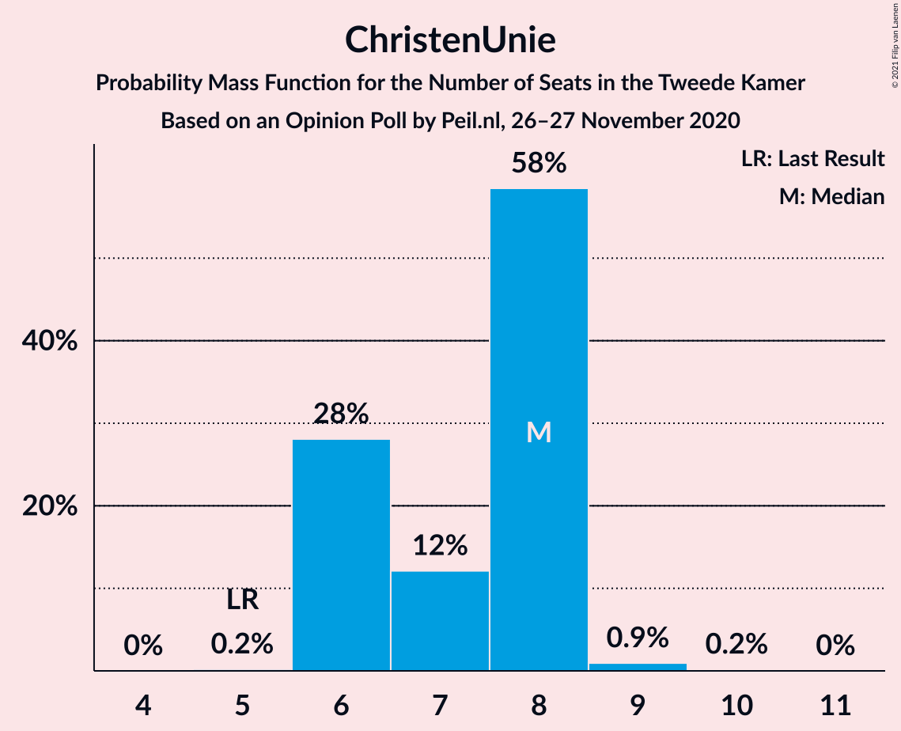

# Opinion Poll by Peil.nl, 27 November 2020

<a href="#voting-intentions">Voting Intentions</a> | <a href="#seats">Seats</a> | <a href="#coalitions">Coalitions</a> | <a href="#technical-information">Technical Information</a>

## Voting Intentions

### Confidence Intervals

| Party | Last Result | Poll Result | 80% Confidence Interval | 90% Confidence Interval | 95% Confidence Interval | 99% Confidence Interval |
|:-----:|:-----------:|:-----------:|:-----------------------:|:-----------------------:|:-----------------------:|:-----------------------:|
| Volkspartij voor Vrijheid en Democratie | 21.3% | 22.9% | 22.0–23.9% |21.7–24.2% |21.5–24.5% |21.0–25.0% |
| Partij voor de Vrijheid | 13.1% | 17.8% | 17.0–18.8% |16.7–19.0% |16.5–19.3% |16.1–19.7% |
| Christen-Democratisch Appèl | 12.4% | 8.9% | 8.3–9.6% |8.1–9.8% |8.0–10.0% |7.7–10.4% |
| Partij van de Arbeid | 5.7% | 8.3% | 7.7–8.9% |7.5–9.1% |7.3–9.3% |7.0–9.6% |
| Democraten 66 | 12.2% | 7.6% | 7.0–8.3% |6.9–8.5% |6.7–8.6% |6.5–9.0% |
| GroenLinks | 9.1% | 7.0% | 6.4–7.6% |6.3–7.8% |6.1–8.0% |5.9–8.3% |
| Socialistische Partij | 9.1% | 6.4% | 5.8–7.0% |5.7–7.1% |5.5–7.3% |5.3–7.6% |
| ChristenUnie | 3.4% | 4.5% | 4.0–5.0% |3.9–5.1% |3.8–5.3% |3.6–5.5% |
| Partij voor de Dieren | 3.2% | 3.8% | 3.4–4.3% |3.3–4.5% |3.2–4.6% |3.0–4.8% |
| Staatkundig Gereformeerde Partij | 2.1% | 1.9% | 1.6–2.3% |1.5–2.4% |1.5–2.5% |1.3–2.7% |
| DENK | 2.1% | 1.9% | 1.6–2.3% |1.5–2.4% |1.5–2.5% |1.3–2.7% |
| Forum voor Democratie | 1.8% | 1.9% | 1.6–2.3% |1.5–2.4% |1.5–2.5% |1.3–2.7% |
| 50Plus | 3.1% | 1.3% | 1.0–1.6% |1.0–1.7% |0.9–1.7% |0.8–1.9% |
| Partij voor de Toekomst | 0.0% | 0.6% | 0.5–0.9% |0.4–0.9% |0.4–1.0% |0.3–1.1% |

*Note:* The poll result column reflects the actual value used in the calculations. Published results may vary slightly, and in addition be rounded to fewer digits.

## Seats

### Confidence Intervals

| Party | Last Result | Median | 80% Confidence Interval | 90% Confidence Interval | 95% Confidence Interval | 99% Confidence Interval |
|:-----:|:-----------:|:------:|:-----------------------:|:-----------------------:|:-----------------------:|:-----------------------:|
| <a href="#volkspartij-voor-vrijheid-en-democratie">Volkspartij voor Vrijheid en Democratie</a> | 33 | 34 | 33–38 |33–39 |33–39 |32–39 |
| <a href="#partij-voor-de-vrijheid">Partij voor de Vrijheid</a> | 20 | 27 | 26–29 |25–29 |25–31 |25–32 |
| <a href="#christen-democratisch-appèl">Christen-Democratisch Appèl</a> | 19 | 13 | 12–15 |12–15 |12–15 |11–16 |
| <a href="#partij-van-de-arbeid">Partij van de Arbeid</a> | 9 | 12 | 11–13 |11–14 |11–14 |11–15 |
| <a href="#democraten-66">Democraten 66</a> | 19 | 12 | 11–12 |10–13 |10–13 |10–14 |
| <a href="#groenlinks">GroenLinks</a> | 14 | 11 | 10–12 |10–12 |10–12 |9–12 |
| <a href="#socialistische-partij">Socialistische Partij</a> | 14 | 10 | 8–10 |8–11 |8–11 |8–11 |
| <a href="#christenunie">ChristenUnie</a> | 5 | 7 | 6–8 |6–8 |6–8 |5–9 |
| <a href="#partij-voor-de-dieren">Partij voor de Dieren</a> | 5 | 6 | 5–7 |5–7 |5–7 |4–7 |
| <a href="#staatkundig-gereformeerde-partij">Staatkundig Gereformeerde Partij</a> | 3 | 3 | 2–3 |2–3 |2–3 |2–3 |
| <a href="#denk">DENK</a> | 3 | 3 | 2–3 |2–3 |2–4 |2–4 |
| <a href="#forum-voor-democratie">Forum voor Democratie</a> | 2 | 3 | 2–3 |2–3 |2–3 |2–4 |
| <a href="#50plus">50Plus</a> | 4 | 1 | 1–2 |1–2 |1–2 |1–3 |
| <a href="#partij-voor-de-toekomst">Partij voor de Toekomst</a> | 0 | 0 | 0–1 |0–1 |0–1 |0–2 |

### Volkspartij voor Vrijheid en Democratie

*For a full overview of the results for this party, see the [Volkspartij voor Vrijheid en Democratie](party-volkspartijvoorvrijheidendemocratie.html) page.*

| Number of Seats | Probability | Accumulated | Special Marks |
|:---------------:|:-----------:|:-----------:|:-------------:|
| 32 | 1.1% | 100% |  |
| 33 | 18% | 98.9% | Last Result |
| 34 | 38% | 80% | Median |
| 35 | 15% | 43% |  |
| 36 | 9% | 27% |  |
| 37 | 4% | 19% |  |
| 38 | 10% | 15% |  |
| 39 | 5% | 5% |  |
| 40 | 0.1% | 0.2% |  |
| 41 | 0% | 0% |  |

### Partij voor de Vrijheid

*For a full overview of the results for this party, see the [Partij voor de Vrijheid](party-partijvoordevrijheid.html) page.*

| Number of Seats | Probability | Accumulated | Special Marks |
|:---------------:|:-----------:|:-----------:|:-------------:|
| 20 | 0% | 100% | Last Result |
| 21 | 0% | 100% |  |
| 22 | 0% | 100% |  |
| 23 | 0% | 100% |  |
| 24 | 0.1% | 100% |  |
| 25 | 10% | 99.9% |  |
| 26 | 37% | 90% |  |
| 27 | 26% | 53% | Median |
| 28 | 17% | 27% |  |
| 29 | 6% | 11% |  |
| 30 | 1.2% | 5% |  |
| 31 | 3% | 4% |  |
| 32 | 1.1% | 1.1% |  |
| 33 | 0% | 0% |  |

### Christen-Democratisch Appèl

*For a full overview of the results for this party, see the [Christen-Democratisch Appèl](party-christen-democratischappèl.html) page.*

| Number of Seats | Probability | Accumulated | Special Marks |
|:---------------:|:-----------:|:-----------:|:-------------:|
| 11 | 0.5% | 100% |  |
| 12 | 29% | 99.5% |  |
| 13 | 40% | 70% | Median |
| 14 | 10% | 30% |  |
| 15 | 18% | 20% |  |
| 16 | 2% | 2% |  |
| 17 | 0% | 0% |  |
| 18 | 0% | 0% |  |
| 19 | 0% | 0% | Last Result |

### Partij van de Arbeid

*For a full overview of the results for this party, see the [Partij van de Arbeid](party-partijvandearbeid.html) page.*

| Number of Seats | Probability | Accumulated | Special Marks |
|:---------------:|:-----------:|:-----------:|:-------------:|
| 9 | 0% | 100% | Last Result |
| 10 | 0.1% | 100% |  |
| 11 | 15% | 99.9% |  |
| 12 | 39% | 85% | Median |
| 13 | 39% | 45% |  |
| 14 | 5% | 6% |  |
| 15 | 0.8% | 0.9% |  |
| 16 | 0% | 0% |  |

### Democraten 66

*For a full overview of the results for this party, see the [Democraten 66](party-democraten66.html) page.*

| Number of Seats | Probability | Accumulated | Special Marks |
|:---------------:|:-----------:|:-----------:|:-------------:|
| 9 | 0.3% | 100% |  |
| 10 | 8% | 99.7% |  |
| 11 | 20% | 91% |  |
| 12 | 65% | 71% | Median |
| 13 | 5% | 6% |  |
| 14 | 1.0% | 1.0% |  |
| 15 | 0% | 0% |  |
| 16 | 0% | 0% |  |
| 17 | 0% | 0% |  |
| 18 | 0% | 0% |  |
| 19 | 0% | 0% | Last Result |

### GroenLinks

*For a full overview of the results for this party, see the [GroenLinks](party-groenlinks.html) page.*

| Number of Seats | Probability | Accumulated | Special Marks |
|:---------------:|:-----------:|:-----------:|:-------------:|
| 9 | 2% | 100% |  |
| 10 | 19% | 98% |  |
| 11 | 67% | 79% | Median |
| 12 | 12% | 12% |  |
| 13 | 0.3% | 0.3% |  |
| 14 | 0% | 0% | Last Result |

### Socialistische Partij

*For a full overview of the results for this party, see the [Socialistische Partij](party-socialistischepartij.html) page.*

| Number of Seats | Probability | Accumulated | Special Marks |
|:---------------:|:-----------:|:-----------:|:-------------:|
| 8 | 14% | 100% |  |
| 9 | 27% | 86% |  |
| 10 | 51% | 59% | Median |
| 11 | 8% | 8% |  |
| 12 | 0.2% | 0.2% |  |
| 13 | 0% | 0% |  |
| 14 | 0% | 0% | Last Result |

### ChristenUnie

*For a full overview of the results for this party, see the [ChristenUnie](party-christenunie.html) page.*

| Number of Seats | Probability | Accumulated | Special Marks |
|:---------------:|:-----------:|:-----------:|:-------------:|
| 5 | 1.3% | 100% | Last Result |
| 6 | 48% | 98.7% |  |
| 7 | 26% | 50% | Median |
| 8 | 24% | 24% |  |
| 9 | 0.6% | 0.6% |  |
| 10 | 0% | 0% |  |

### Partij voor de Dieren

*For a full overview of the results for this party, see the [Partij voor de Dieren](party-partijvoordedieren.html) page.*

| Number of Seats | Probability | Accumulated | Special Marks |
|:---------------:|:-----------:|:-----------:|:-------------:|
| 4 | 2% | 100% |  |
| 5 | 32% | 98% | Last Result |
| 6 | 54% | 66% | Median |
| 7 | 12% | 12% |  |
| 8 | 0% | 0% |  |

### Staatkundig Gereformeerde Partij

*For a full overview of the results for this party, see the [Staatkundig Gereformeerde Partij](party-staatkundiggereformeerdepartij.html) page.*

| Number of Seats | Probability | Accumulated | Special Marks |
|:---------------:|:-----------:|:-----------:|:-------------:|
| 1 | 0.5% | 100% |  |
| 2 | 30% | 99.5% |  |
| 3 | 69% | 70% | Last Result, Median |
| 4 | 0.2% | 0.2% |  |
| 5 | 0% | 0% |  |

### DENK

*For a full overview of the results for this party, see the [DENK](party-denk.html) page.*

| Number of Seats | Probability | Accumulated | Special Marks |
|:---------------:|:-----------:|:-----------:|:-------------:|
| 2 | 26% | 100% |  |
| 3 | 71% | 74% | Last Result, Median |
| 4 | 4% | 4% |  |
| 5 | 0% | 0% |  |

### Forum voor Democratie

*For a full overview of the results for this party, see the [Forum voor Democratie](party-forumvoordemocratie.html) page.*

| Number of Seats | Probability | Accumulated | Special Marks |
|:---------------:|:-----------:|:-----------:|:-------------:|
| 2 | 14% | 100% | Last Result |
| 3 | 85% | 86% | Median |
| 4 | 1.1% | 1.1% |  |
| 5 | 0% | 0% |  |

### 50Plus

*For a full overview of the results for this party, see the [50Plus](party-50plus.html) page.*

| Number of Seats | Probability | Accumulated | Special Marks |
|:---------------:|:-----------:|:-----------:|:-------------:|
| 1 | 54% | 100% | Median |
| 2 | 46% | 46% |  |
| 3 | 0.6% | 0.6% |  |
| 4 | 0% | 0% | Last Result |

### Partij voor de Toekomst

*For a full overview of the results for this party, see the [Partij voor de Toekomst](party-partijvoordetoekomst.html) page.*

| Number of Seats | Probability | Accumulated | Special Marks |
|:---------------:|:-----------:|:-----------:|:-------------:|
| 0 | 54% | 100% | Last Result, Median |
| 1 | 46% | 46% |  |
| 2 | 0.8% | 0.8% |  |
| 3 | 0% | 0% |  |

## Coalitions

### Confidence Intervals

| Coalition | Last Result | Median | Majority? | 80% Confidence Interval | 90% Confidence Interval | 95% Confidence Interval | 99% Confidence Interval |
|:---------:|:-----------:|:------:|:---------:|:-----------------------:|:-----------------------:|:-----------------------:|:-----------------------:|
| Volkspartij voor Vrijheid en Democratie – Partij voor de Vrijheid – Christen-Democratisch Appèl – Forum voor Democratie – Staatkundig Gereformeerde Partij | 77 | 80 | 100% | 79–84 | 79–84 | 79–85 | 78–86 |
| Volkspartij voor Vrijheid en Democratie – Partij voor de Vrijheid – Christen-Democratisch Appèl – Forum voor Democratie | 74 | 77 | 98% | 76–81 | 76–82 | 76–83 | 75–83 |
| Volkspartij voor Vrijheid en Democratie – Christen-Democratisch Appèl – Partij van de Arbeid – Democraten 66 – ChristenUnie | 85 | 79 | 94% | 77–82 | 75–83 | 75–83 | 75–83 |
| Volkspartij voor Vrijheid en Democratie – Christen-Democratisch Appèl – Democraten 66 – GroenLinks – ChristenUnie | 90 | 77 | 90% | 76–81 | 75–81 | 74–81 | 74–82 |
| Volkspartij voor Vrijheid en Democratie – Partij voor de Vrijheid – Christen-Democratisch Appèl | 72 | 75 | 27% | 73–78 | 73–79 | 73–80 | 72–80 |
| Volkspartij voor Vrijheid en Democratie – Christen-Democratisch Appèl – Democraten 66 – ChristenUnie | 76 | 66 | 0% | 65–70 | 64–70 | 64–70 | 63–71 |
| Christen-Democratisch Appèl – Partij van de Arbeid – Democraten 66 – GroenLinks – Socialistische Partij – ChristenUnie | 80 | 64 | 0% | 62–68 | 61–68 | 60–68 | 60–68 |
| Volkspartij voor Vrijheid en Democratie – Christen-Democratisch Appèl – Partij van de Arbeid | 61 | 61 | 0% | 58–63 | 58–64 | 58–64 | 57–65 |
| Volkspartij voor Vrijheid en Democratie – Christen-Democratisch Appèl – Democraten 66 | 71 | 60 | 0% | 58–62 | 58–62 | 57–63 | 57–64 |
| Volkspartij voor Vrijheid en Democratie – Partij van de Arbeid – Democraten 66 | 61 | 58 | 0% | 56–62 | 55–63 | 55–63 | 55–63 |
| Volkspartij voor Vrijheid en Democratie – Christen-Democratisch Appèl – Forum voor Democratie – Staatkundig Gereformeerde Partij – 50Plus | 61 | 55 | 0% | 53–57 | 53–58 | 53–58 | 52–59 |
| Christen-Democratisch Appèl – Partij van de Arbeid – Democraten 66 – GroenLinks – ChristenUnie | 66 | 54 | 0% | 52–58 | 52–58 | 51–58 | 51–58 |
| Volkspartij voor Vrijheid en Democratie – Christen-Democratisch Appèl – Forum voor Democratie – Staatkundig Gereformeerde Partij | 57 | 53 | 0% | 52–56 | 52–57 | 51–57 | 50–58 |
| Volkspartij voor Vrijheid en Democratie – Christen-Democratisch Appèl – Forum voor Democratie – 50Plus | 58 | 52 | 0% | 51–54 | 51–55 | 50–55 | 50–56 |
| Volkspartij voor Vrijheid en Democratie – Christen-Democratisch Appèl – Forum voor Democratie | 54 | 50 | 0% | 49–53 | 49–54 | 48–54 | 48–55 |
| Volkspartij voor Vrijheid en Democratie – Christen-Democratisch Appèl | 52 | 48 | 0% | 46–50 | 46–51 | 45–51 | 45–52 |
| Volkspartij voor Vrijheid en Democratie – Partij van de Arbeid | 42 | 46 | 0% | 46–50 | 44–51 | 44–51 | 44–51 |
| Christen-Democratisch Appèl – Partij van de Arbeid – Democraten 66 | 47 | 37 | 0% | 35–40 | 34–40 | 34–40 | 34–41 |
| Christen-Democratisch Appèl – Partij van de Arbeid – ChristenUnie | 33 | 32 | 0% | 31–34 | 30–35 | 29–36 | 29–36 |
| Christen-Democratisch Appèl – Partij van de Arbeid | 28 | 25 | 0% | 24–28 | 23–28 | 23–28 | 23–30 |
| Christen-Democratisch Appèl – Democraten 66 | 38 | 25 | 0% | 23–27 | 23–27 | 23–27 | 22–28 |

### Volkspartij voor Vrijheid en Democratie – Partij voor de Vrijheid – Christen-Democratisch Appèl – Forum voor Democratie – Staatkundig Gereformeerde Partij

| Number of Seats | Probability | Accumulated | Special Marks |
|:---------------:|:-----------:|:-----------:|:-------------:|
| 77 | 0% | 100% | Last Result |
| 78 | 2% | 100% |  |
| 79 | 34% | 98% |  |
| 80 | 23% | 65% | Median |
| 81 | 21% | 42% |  |
| 82 | 5% | 21% |  |
| 83 | 5% | 16% |  |
| 84 | 8% | 11% |  |
| 85 | 3% | 4% |  |
| 86 | 0.5% | 0.5% |  |
| 87 | 0% | 0% |  |

### Volkspartij voor Vrijheid en Democratie – Partij voor de Vrijheid – Christen-Democratisch Appèl – Forum voor Democratie

| Number of Seats | Probability | Accumulated | Special Marks |
|:---------------:|:-----------:|:-----------:|:-------------:|
| 74 | 0% | 100% | Last Result |
| 75 | 1.5% | 100% |  |
| 76 | 23% | 98% | Majority |
| 77 | 31% | 76% | Median |
| 78 | 18% | 45% |  |
| 79 | 7% | 27% |  |
| 80 | 7% | 20% |  |
| 81 | 8% | 13% |  |
| 82 | 2% | 6% |  |
| 83 | 3% | 3% |  |
| 84 | 0% | 0% |  |

### Volkspartij voor Vrijheid en Democratie – Christen-Democratisch Appèl – Partij van de Arbeid – Democraten 66 – ChristenUnie

| Number of Seats | Probability | Accumulated | Special Marks |
|:---------------:|:-----------:|:-----------:|:-------------:|
| 75 | 6% | 100% |  |
| 76 | 3% | 94% | Majority |
| 77 | 24% | 91% |  |
| 78 | 13% | 67% | Median |
| 79 | 14% | 54% |  |
| 80 | 20% | 40% |  |
| 81 | 5% | 19% |  |
| 82 | 5% | 14% |  |
| 83 | 9% | 9% |  |
| 84 | 0.1% | 0.2% |  |
| 85 | 0.2% | 0.2% | Last Result |
| 86 | 0% | 0% |  |

### Volkspartij voor Vrijheid en Democratie – Christen-Democratisch Appèl – Democraten 66 – GroenLinks – ChristenUnie

| Number of Seats | Probability | Accumulated | Special Marks |
|:---------------:|:-----------:|:-----------:|:-------------:|
| 72 | 0.4% | 100% |  |
| 73 | 0% | 99.6% |  |
| 74 | 3% | 99.5% |  |
| 75 | 7% | 97% |  |
| 76 | 33% | 90% | Majority |
| 77 | 9% | 58% | Median |
| 78 | 29% | 49% |  |
| 79 | 4% | 20% |  |
| 80 | 6% | 17% |  |
| 81 | 9% | 10% |  |
| 82 | 1.2% | 1.2% |  |
| 83 | 0% | 0% |  |
| 84 | 0% | 0% |  |
| 85 | 0% | 0% |  |
| 86 | 0% | 0% |  |
| 87 | 0% | 0% |  |
| 88 | 0% | 0% |  |
| 89 | 0% | 0% |  |
| 90 | 0% | 0% | Last Result |

### Volkspartij voor Vrijheid en Democratie – Partij voor de Vrijheid – Christen-Democratisch Appèl

| Number of Seats | Probability | Accumulated | Special Marks |
|:---------------:|:-----------:|:-----------:|:-------------:|
| 72 | 1.5% | 100% | Last Result |
| 73 | 23% | 98% |  |
| 74 | 21% | 76% | Median |
| 75 | 28% | 55% |  |
| 76 | 7% | 27% | Majority |
| 77 | 7% | 20% |  |
| 78 | 7% | 14% |  |
| 79 | 2% | 6% |  |
| 80 | 4% | 4% |  |
| 81 | 0.2% | 0.2% |  |
| 82 | 0% | 0% |  |

### Volkspartij voor Vrijheid en Democratie – Christen-Democratisch Appèl – Democraten 66 – ChristenUnie

| Number of Seats | Probability | Accumulated | Special Marks |
|:---------------:|:-----------:|:-----------:|:-------------:|
| 62 | 0.4% | 100% |  |
| 63 | 2% | 99.6% |  |
| 64 | 7% | 98% |  |
| 65 | 21% | 91% |  |
| 66 | 29% | 69% | Median |
| 67 | 16% | 40% |  |
| 68 | 7% | 25% |  |
| 69 | 7% | 18% |  |
| 70 | 9% | 11% |  |
| 71 | 1.4% | 1.4% |  |
| 72 | 0% | 0% |  |
| 73 | 0% | 0% |  |
| 74 | 0% | 0% |  |
| 75 | 0% | 0% |  |
| 76 | 0% | 0% | Last Result, Majority |

### Christen-Democratisch Appèl – Partij van de Arbeid – Democraten 66 – GroenLinks – Socialistische Partij – ChristenUnie

| Number of Seats | Probability | Accumulated | Special Marks |
|:---------------:|:-----------:|:-----------:|:-------------:|
| 60 | 4% | 100% |  |
| 61 | 5% | 96% |  |
| 62 | 1.4% | 91% |  |
| 63 | 4% | 89% |  |
| 64 | 49% | 85% |  |
| 65 | 19% | 36% | Median |
| 66 | 2% | 18% |  |
| 67 | 2% | 15% |  |
| 68 | 13% | 13% |  |
| 69 | 0.3% | 0.3% |  |
| 70 | 0% | 0% |  |
| 71 | 0% | 0% |  |
| 72 | 0% | 0% |  |
| 73 | 0% | 0% |  |
| 74 | 0% | 0% |  |
| 75 | 0% | 0% |  |
| 76 | 0% | 0% | Majority |
| 77 | 0% | 0% |  |
| 78 | 0% | 0% |  |
| 79 | 0% | 0% |  |
| 80 | 0% | 0% | Last Result |

### Volkspartij voor Vrijheid en Democratie – Christen-Democratisch Appèl – Partij van de Arbeid

| Number of Seats | Probability | Accumulated | Special Marks |
|:---------------:|:-----------:|:-----------:|:-------------:|
| 57 | 1.1% | 100% |  |
| 58 | 15% | 98.9% |  |
| 59 | 22% | 84% | Median |
| 60 | 5% | 62% |  |
| 61 | 33% | 57% | Last Result |
| 62 | 9% | 24% |  |
| 63 | 10% | 15% |  |
| 64 | 5% | 5% |  |
| 65 | 0.4% | 0.5% |  |
| 66 | 0% | 0.2% |  |
| 67 | 0.2% | 0.2% |  |
| 68 | 0% | 0% |  |

### Volkspartij voor Vrijheid en Democratie – Christen-Democratisch Appèl – Democraten 66

| Number of Seats | Probability | Accumulated | Special Marks |
|:---------------:|:-----------:|:-----------:|:-------------:|
| 55 | 0.4% | 100% |  |
| 56 | 0% | 99.6% |  |
| 57 | 3% | 99.5% |  |
| 58 | 16% | 97% |  |
| 59 | 28% | 80% | Median |
| 60 | 28% | 53% |  |
| 61 | 5% | 24% |  |
| 62 | 17% | 20% |  |
| 63 | 1.1% | 3% |  |
| 64 | 2% | 2% |  |
| 65 | 0.1% | 0.1% |  |
| 66 | 0% | 0% |  |
| 67 | 0% | 0% |  |
| 68 | 0% | 0% |  |
| 69 | 0% | 0% |  |
| 70 | 0% | 0% |  |
| 71 | 0% | 0% | Last Result |

### Volkspartij voor Vrijheid en Democratie – Partij van de Arbeid – Democraten 66

| Number of Seats | Probability | Accumulated | Special Marks |
|:---------------:|:-----------:|:-----------:|:-------------:|
| 55 | 6% | 100% |  |
| 56 | 4% | 94% |  |
| 57 | 1.0% | 90% |  |
| 58 | 44% | 89% | Median |
| 59 | 10% | 44% |  |
| 60 | 13% | 35% |  |
| 61 | 10% | 21% | Last Result |
| 62 | 2% | 12% |  |
| 63 | 9% | 9% |  |
| 64 | 0.1% | 0.2% |  |
| 65 | 0.1% | 0.1% |  |
| 66 | 0% | 0% |  |

### Volkspartij voor Vrijheid en Democratie – Christen-Democratisch Appèl – Forum voor Democratie – Staatkundig Gereformeerde Partij – 50Plus

| Number of Seats | Probability | Accumulated | Special Marks |
|:---------------:|:-----------:|:-----------:|:-------------:|
| 51 | 0.1% | 100% |  |
| 52 | 1.0% | 99.9% |  |
| 53 | 13% | 98.9% |  |
| 54 | 12% | 86% | Median |
| 55 | 49% | 74% |  |
| 56 | 5% | 25% |  |
| 57 | 12% | 20% |  |
| 58 | 7% | 8% |  |
| 59 | 1.4% | 1.4% |  |
| 60 | 0% | 0% |  |
| 61 | 0% | 0% | Last Result |

### Christen-Democratisch Appèl – Partij van de Arbeid – Democraten 66 – GroenLinks – ChristenUnie

| Number of Seats | Probability | Accumulated | Special Marks |
|:---------------:|:-----------:|:-----------:|:-------------:|
| 50 | 0% | 100% |  |
| 51 | 3% | 99.9% |  |
| 52 | 7% | 97% |  |
| 53 | 8% | 90% |  |
| 54 | 34% | 81% |  |
| 55 | 5% | 48% | Median |
| 56 | 25% | 42% |  |
| 57 | 2% | 17% |  |
| 58 | 15% | 15% |  |
| 59 | 0.2% | 0.2% |  |
| 60 | 0% | 0% |  |
| 61 | 0% | 0% |  |
| 62 | 0% | 0% |  |
| 63 | 0% | 0% |  |
| 64 | 0% | 0% |  |
| 65 | 0% | 0% |  |
| 66 | 0% | 0% | Last Result |

### Volkspartij voor Vrijheid en Democratie – Christen-Democratisch Appèl – Forum voor Democratie – Staatkundig Gereformeerde Partij

| Number of Seats | Probability | Accumulated | Special Marks |
|:---------------:|:-----------:|:-----------:|:-------------:|
| 50 | 1.1% | 100% |  |
| 51 | 2% | 98.9% |  |
| 52 | 20% | 97% |  |
| 53 | 33% | 77% | Median |
| 54 | 21% | 44% |  |
| 55 | 5% | 23% |  |
| 56 | 12% | 18% |  |
| 57 | 6% | 7% | Last Result |
| 58 | 0.8% | 0.8% |  |
| 59 | 0% | 0% |  |

### Volkspartij voor Vrijheid en Democratie – Christen-Democratisch Appèl – Forum voor Democratie – 50Plus

| Number of Seats | Probability | Accumulated | Special Marks |
|:---------------:|:-----------:|:-----------:|:-------------:|
| 49 | 0.1% | 100% |  |
| 50 | 3% | 99.9% |  |
| 51 | 21% | 97% | Median |
| 52 | 40% | 76% |  |
| 53 | 12% | 36% |  |
| 54 | 14% | 24% |  |
| 55 | 8% | 10% |  |
| 56 | 1.4% | 2% |  |
| 57 | 0.2% | 0.2% |  |
| 58 | 0% | 0% | Last Result |

### Volkspartij voor Vrijheid en Democratie – Christen-Democratisch Appèl – Forum voor Democratie

| Number of Seats | Probability | Accumulated | Special Marks |
|:---------------:|:-----------:|:-----------:|:-------------:|
| 48 | 3% | 100% |  |
| 49 | 9% | 97% |  |
| 50 | 40% | 88% | Median |
| 51 | 16% | 48% |  |
| 52 | 10% | 32% |  |
| 53 | 14% | 22% |  |
| 54 | 7% | 8% | Last Result |
| 55 | 0.7% | 0.8% |  |
| 56 | 0.2% | 0.2% |  |
| 57 | 0% | 0% |  |

### Volkspartij voor Vrijheid en Democratie – Christen-Democratisch Appèl

| Number of Seats | Probability | Accumulated | Special Marks |
|:---------------:|:-----------:|:-----------:|:-------------:|
| 45 | 3% | 100% |  |
| 46 | 8% | 97% |  |
| 47 | 29% | 89% | Median |
| 48 | 28% | 60% |  |
| 49 | 9% | 32% |  |
| 50 | 15% | 23% |  |
| 51 | 7% | 8% |  |
| 52 | 1.0% | 1.2% | Last Result |
| 53 | 0.2% | 0.2% |  |
| 54 | 0% | 0% |  |

### Volkspartij voor Vrijheid en Democratie – Partij van de Arbeid

| Number of Seats | Probability | Accumulated | Special Marks |
|:---------------:|:-----------:|:-----------:|:-------------:|
| 42 | 0% | 100% | Last Result |
| 43 | 0% | 100% |  |
| 44 | 7% | 100% |  |
| 45 | 0.3% | 93% |  |
| 46 | 46% | 93% | Median |
| 47 | 3% | 47% |  |
| 48 | 21% | 44% |  |
| 49 | 6% | 22% |  |
| 50 | 7% | 16% |  |
| 51 | 9% | 9% |  |
| 52 | 0.3% | 0.5% |  |
| 53 | 0.1% | 0.2% |  |
| 54 | 0.1% | 0.1% |  |
| 55 | 0% | 0% |  |

### Christen-Democratisch Appèl – Partij van de Arbeid – Democraten 66

| Number of Seats | Probability | Accumulated | Special Marks |
|:---------------:|:-----------:|:-----------:|:-------------:|
| 34 | 8% | 100% |  |
| 35 | 4% | 92% |  |
| 36 | 16% | 88% |  |
| 37 | 37% | 72% | Median |
| 38 | 15% | 36% |  |
| 39 | 6% | 21% |  |
| 40 | 13% | 15% |  |
| 41 | 2% | 2% |  |
| 42 | 0% | 0% |  |
| 43 | 0% | 0% |  |
| 44 | 0% | 0% |  |
| 45 | 0% | 0% |  |
| 46 | 0% | 0% |  |
| 47 | 0% | 0% | Last Result |

### Christen-Democratisch Appèl – Partij van de Arbeid – ChristenUnie

| Number of Seats | Probability | Accumulated | Special Marks |
|:---------------:|:-----------:|:-----------:|:-------------:|
| 29 | 3% | 100% |  |
| 30 | 6% | 97% |  |
| 31 | 29% | 92% |  |
| 32 | 15% | 63% | Median |
| 33 | 24% | 47% | Last Result |
| 34 | 17% | 23% |  |
| 35 | 2% | 6% |  |
| 36 | 4% | 4% |  |
| 37 | 0% | 0% |  |

### Christen-Democratisch Appèl – Partij van de Arbeid

| Number of Seats | Probability | Accumulated | Special Marks |
|:---------------:|:-----------:|:-----------:|:-------------:|
| 23 | 8% | 100% |  |
| 24 | 10% | 92% |  |
| 25 | 42% | 82% | Median |
| 26 | 16% | 40% |  |
| 27 | 8% | 24% |  |
| 28 | 14% | 16% | Last Result |
| 29 | 0.2% | 2% |  |
| 30 | 2% | 2% |  |
| 31 | 0% | 0% |  |

### Christen-Democratisch Appèl – Democraten 66

| Number of Seats | Probability | Accumulated | Special Marks |
|:---------------:|:-----------:|:-----------:|:-------------:|
| 21 | 0.4% | 100% |  |
| 22 | 2% | 99.6% |  |
| 23 | 10% | 98% |  |
| 24 | 21% | 88% |  |
| 25 | 46% | 67% | Median |
| 26 | 5% | 21% |  |
| 27 | 15% | 16% |  |
| 28 | 1.0% | 1.1% |  |
| 29 | 0% | 0% |  |
| 30 | 0% | 0% |  |
| 31 | 0% | 0% |  |
| 32 | 0% | 0% |  |
| 33 | 0% | 0% |  |
| 34 | 0% | 0% |  |
| 35 | 0% | 0% |  |
| 36 | 0% | 0% |  |
| 37 | 0% | 0% |  |
| 38 | 0% | 0% | Last Result |

## Technical Information

### Opinion Poll

+ **Polling firm:** Peil.nl
+ **Commissioner(s):** —
+ **Fieldwork period:** 27 November 2020

### Calculations

+ **Sample size:** 3000
+ **Simulations done:** 1,048,576
+ **Error estimate:** 1.20%

