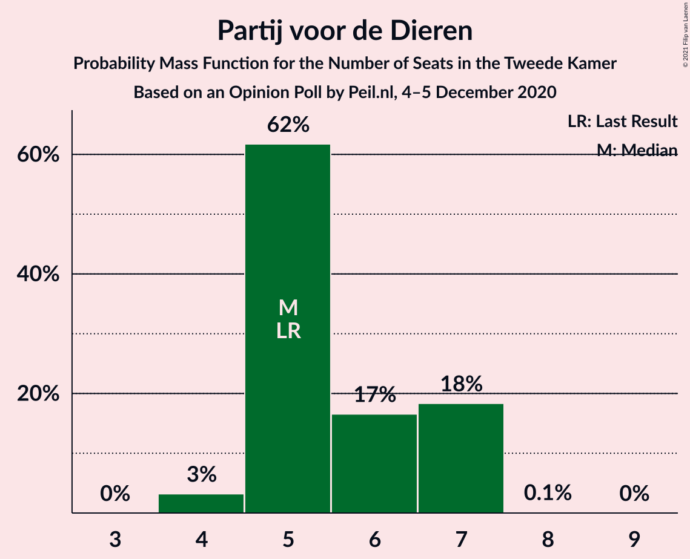
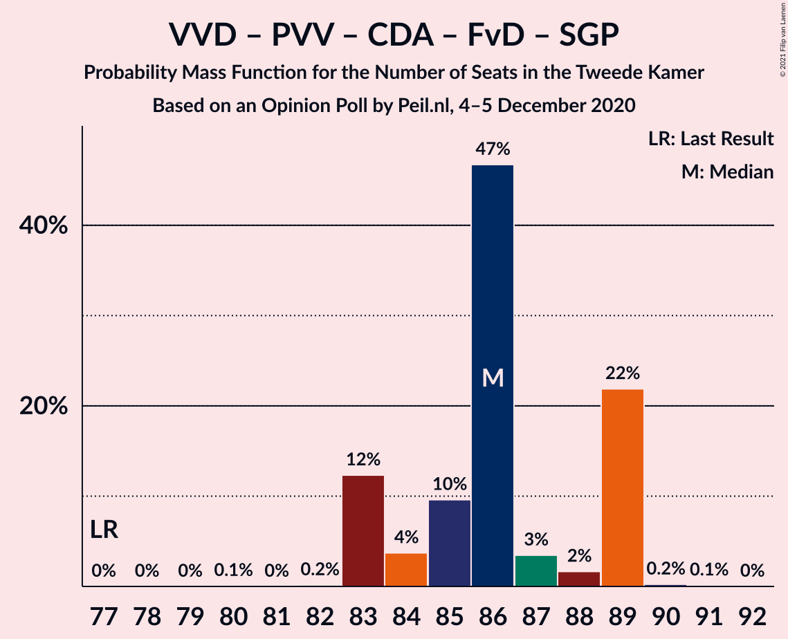
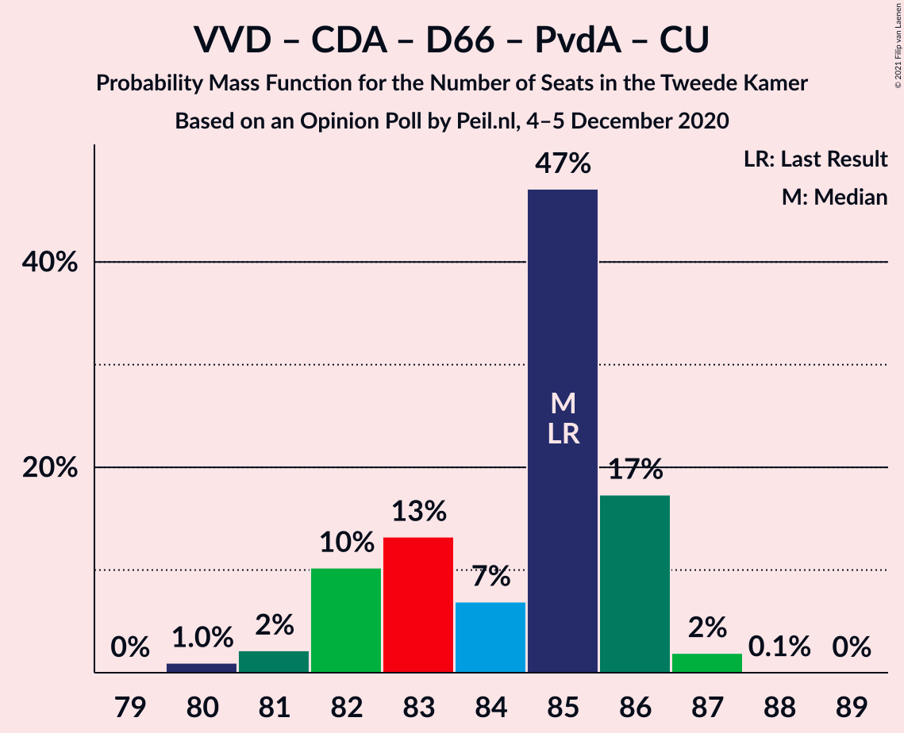
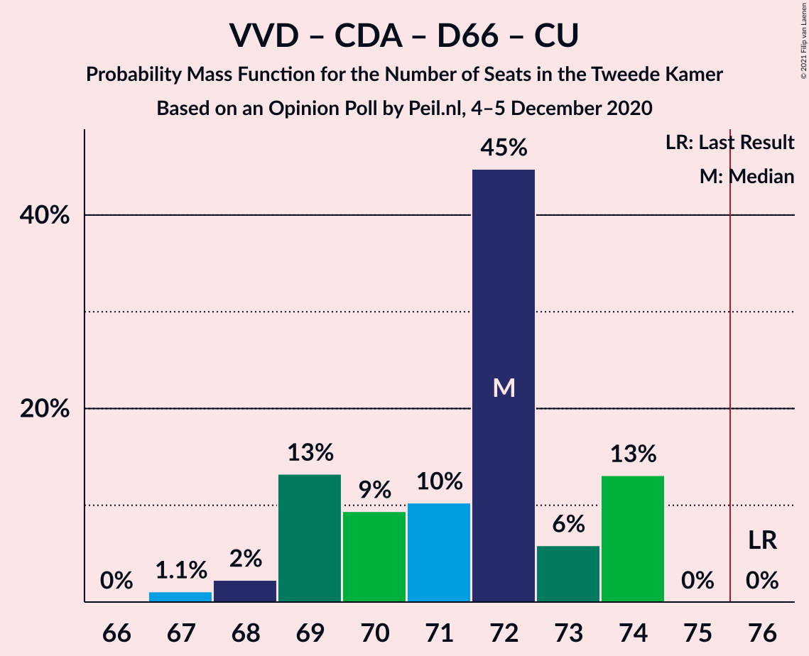
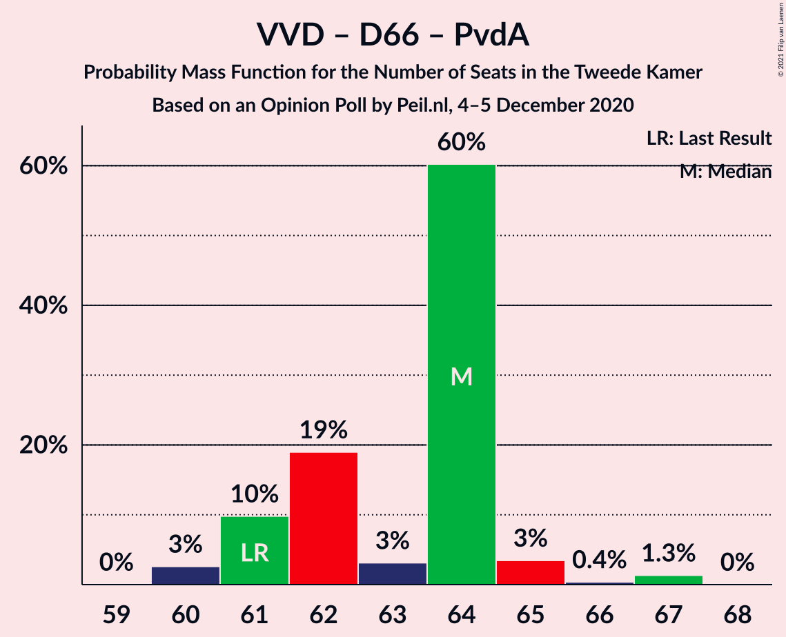
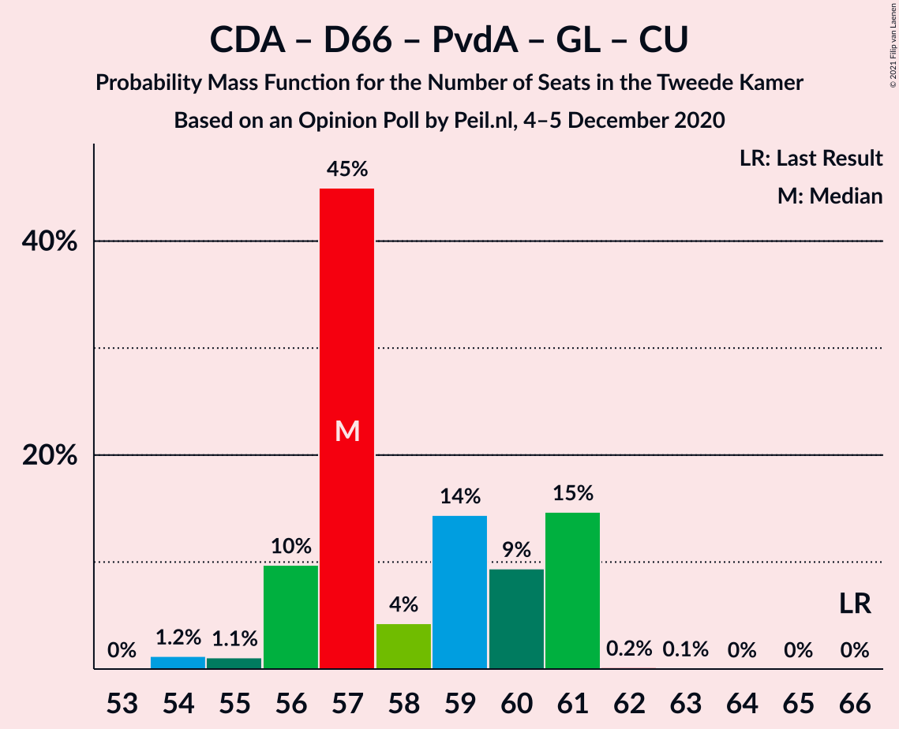

# Opinion Poll by Peil.nl, 5 December 2020

<a href="#voting-intentions">Voting Intentions</a> | <a href="#seats">Seats</a> | <a href="#coalitions">Coalitions</a> | <a href="#technical-information">Technical Information</a>

## Voting Intentions

### Confidence Intervals

| Party | Last Result | Poll Result | 80% Confidence Interval | 90% Confidence Interval | 95% Confidence Interval | 99% Confidence Interval |
|:-----:|:-----------:|:-----------:|:-----------------------:|:-----------------------:|:-----------------------:|:-----------------------:|
| Volkspartij voor Vrijheid en Democratie | 21.3% | 24.0% | 23.0–25.0% |22.7–25.3% |22.5–25.6% |22.0–26.1% |
| Partij voor de Vrijheid | 13.1% | 18.0% | 17.1–18.9% |16.9–19.2% |16.7–19.4% |16.2–19.9% |
| Christen-Democratisch Appèl | 12.4% | 9.3% | 8.7–10.1% |8.5–10.3% |8.3–10.4% |8.0–10.8% |
| Democraten 66 | 12.2% | 8.7% | 8.0–9.4% |7.8–9.6% |7.7–9.7% |7.4–10.1% |
| Partij van de Arbeid | 5.7% | 8.7% | 8.0–9.4% |7.8–9.6% |7.7–9.7% |7.4–10.1% |
| GroenLinks | 9.1% | 7.3% | 6.8–8.0% |6.6–8.2% |6.4–8.3% |6.2–8.6% |
| Socialistische Partij | 9.1% | 6.0% | 5.5–6.6% |5.3–6.8% |5.2–6.9% |5.0–7.2% |
| ChristenUnie | 3.4% | 4.7% | 4.2–5.2% |4.1–5.3% |4.0–5.5% |3.7–5.8% |
| Partij voor de Dieren | 3.2% | 4.0% | 3.6–4.5% |3.4–4.6% |3.4–4.8% |3.2–5.0% |
| Staatkundig Gereformeerde Partij | 2.1% | 2.7% | 2.3–3.1% |2.2–3.2% |2.1–3.3% |2.0–3.5% |
| Forum voor Democratie | 1.8% | 2.7% | 2.3–3.1% |2.2–3.2% |2.1–3.3% |2.0–3.5% |
| DENK | 2.1% | 2.0% | 1.7–2.4% |1.6–2.5% |1.6–2.6% |1.4–2.8% |
| 50Plus | 3.1% | 1.3% | 1.1–1.6% |1.0–1.7% |1.0–1.8% |0.9–2.0% |

*Note:* The poll result column reflects the actual value used in the calculations. Published results may vary slightly, and in addition be rounded to fewer digits.

## Seats

### Confidence Intervals

| Party | Last Result | Median | 80% Confidence Interval | 90% Confidence Interval | 95% Confidence Interval | 99% Confidence Interval |
|:-----:|:-----------:|:------:|:-----------------------:|:-----------------------:|:-----------------------:|:-----------------------:|
| <a href="#volkspartij-voor-vrijheid-en-democratie">Volkspartij voor Vrijheid en Democratie</a> | 33 | 36 | 35–39 |35–40 |34–40 |34–40 |
| <a href="#partij-voor-de-vrijheid">Partij voor de Vrijheid</a> | 20 | 28 | 26–28 |25–30 |25–30 |25–31 |
| <a href="#christen-democratisch-appèl">Christen-Democratisch Appèl</a> | 19 | 15 | 13–15 |13–16 |12–16 |12–16 |
| <a href="#democraten-66">Democraten 66</a> | 19 | 13 | 11–15 |11–15 |11–15 |11–15 |
| <a href="#partij-van-de-arbeid">Partij van de Arbeid</a> | 9 | 12 | 11–15 |11–15 |11–15 |11–16 |
| <a href="#groenlinks">GroenLinks</a> | 14 | 11 | 10–12 |9–12 |9–13 |9–13 |
| <a href="#socialistische-partij">Socialistische Partij</a> | 14 | 9 | 8–10 |8–10 |8–11 |7–11 |
| <a href="#christenunie">ChristenUnie</a> | 5 | 7 | 6–8 |6–8 |6–8 |5–9 |
| <a href="#partij-voor-de-dieren">Partij voor de Dieren</a> | 5 | 6 | 5–7 |5–7 |5–7 |4–7 |
| <a href="#staatkundig-gereformeerde-partij">Staatkundig Gereformeerde Partij</a> | 3 | 4 | 3–4 |3–5 |3–5 |2–5 |
| <a href="#forum-voor-democratie">Forum voor Democratie</a> | 2 | 4 | 3–4 |3–5 |3–5 |3–5 |
| <a href="#denk">DENK</a> | 3 | 3 | 2–3 |2–4 |2–4 |2–4 |
| <a href="#50plus">50Plus</a> | 4 | 2 | 1–2 |1–2 |1–2 |1–3 |

### Volkspartij voor Vrijheid en Democratie

*For a full overview of the results for this party, see the [Volkspartij voor Vrijheid en Democratie](party-volkspartijvoorvrijheidendemocratie.html) page.*

| Number of Seats | Probability | Accumulated | Special Marks |
|:---------------:|:-----------:|:-----------:|:-------------:|
| 33 | 0.5% | 100% | Last Result |
| 34 | 3% | 99.5% |  |
| 35 | 33% | 96% |  |
| 36 | 15% | 63% | Median |
| 37 | 19% | 48% |  |
| 38 | 15% | 28% |  |
| 39 | 6% | 14% |  |
| 40 | 8% | 8% |  |
| 41 | 0.2% | 0.3% |  |
| 42 | 0.1% | 0.1% |  |
| 43 | 0% | 0% |  |

### Partij voor de Vrijheid

*For a full overview of the results for this party, see the [Partij voor de Vrijheid](party-partijvoordevrijheid.html) page.*

| Number of Seats | Probability | Accumulated | Special Marks |
|:---------------:|:-----------:|:-----------:|:-------------:|
| 20 | 0% | 100% | Last Result |
| 21 | 0% | 100% |  |
| 22 | 0% | 100% |  |
| 23 | 0% | 100% |  |
| 24 | 0.3% | 100% |  |
| 25 | 6% | 99.7% |  |
| 26 | 14% | 94% |  |
| 27 | 14% | 80% |  |
| 28 | 57% | 66% | Median |
| 29 | 3% | 9% |  |
| 30 | 5% | 6% |  |
| 31 | 0.5% | 0.5% |  |
| 32 | 0.1% | 0.1% |  |
| 33 | 0% | 0% |  |

### Christen-Democratisch Appèl

*For a full overview of the results for this party, see the [Christen-Democratisch Appèl](party-christen-democratischappèl.html) page.*

| Number of Seats | Probability | Accumulated | Special Marks |
|:---------------:|:-----------:|:-----------:|:-------------:|
| 12 | 3% | 100% |  |
| 13 | 17% | 97% |  |
| 14 | 14% | 80% |  |
| 15 | 58% | 65% | Median |
| 16 | 8% | 8% |  |
| 17 | 0.1% | 0.1% |  |
| 18 | 0% | 0% |  |
| 19 | 0% | 0% | Last Result |

### Democraten 66

*For a full overview of the results for this party, see the [Democraten 66](party-democraten66.html) page.*

| Number of Seats | Probability | Accumulated | Special Marks |
|:---------------:|:-----------:|:-----------:|:-------------:|
| 11 | 13% | 100% |  |
| 12 | 16% | 87% |  |
| 13 | 47% | 72% | Median |
| 14 | 14% | 24% |  |
| 15 | 10% | 11% |  |
| 16 | 0.4% | 0.4% |  |
| 17 | 0% | 0% |  |
| 18 | 0% | 0% |  |
| 19 | 0% | 0% | Last Result |

### Partij van de Arbeid

*For a full overview of the results for this party, see the [Partij van de Arbeid](party-partijvandearbeid.html) page.*

| Number of Seats | Probability | Accumulated | Special Marks |
|:---------------:|:-----------:|:-----------:|:-------------:|
| 9 | 0% | 100% | Last Result |
| 10 | 0.1% | 100% |  |
| 11 | 28% | 99.9% |  |
| 12 | 22% | 72% | Median |
| 13 | 18% | 49% |  |
| 14 | 21% | 31% |  |
| 15 | 8% | 10% |  |
| 16 | 2% | 2% |  |
| 17 | 0% | 0% |  |

### GroenLinks

*For a full overview of the results for this party, see the [GroenLinks](party-groenlinks.html) page.*

| Number of Seats | Probability | Accumulated | Special Marks |
|:---------------:|:-----------:|:-----------:|:-------------:|
| 8 | 0.1% | 100% |  |
| 9 | 7% | 99.9% |  |
| 10 | 17% | 93% |  |
| 11 | 35% | 76% | Median |
| 12 | 36% | 40% |  |
| 13 | 5% | 5% |  |
| 14 | 0.2% | 0.2% | Last Result |
| 15 | 0% | 0% |  |

### Socialistische Partij

*For a full overview of the results for this party, see the [Socialistische Partij](party-socialistischepartij.html) page.*

| Number of Seats | Probability | Accumulated | Special Marks |
|:---------------:|:-----------:|:-----------:|:-------------:|
| 7 | 2% | 100% |  |
| 8 | 17% | 98% |  |
| 9 | 56% | 81% | Median |
| 10 | 20% | 25% |  |
| 11 | 4% | 4% |  |
| 12 | 0% | 0% |  |
| 13 | 0% | 0% |  |
| 14 | 0% | 0% | Last Result |

### ChristenUnie

*For a full overview of the results for this party, see the [ChristenUnie](party-christenunie.html) page.*

| Number of Seats | Probability | Accumulated | Special Marks |
|:---------------:|:-----------:|:-----------:|:-------------:|
| 5 | 2% | 100% | Last Result |
| 6 | 21% | 98% |  |
| 7 | 55% | 76% | Median |
| 8 | 21% | 22% |  |
| 9 | 0.8% | 0.8% |  |
| 10 | 0% | 0% |  |

### Partij voor de Dieren

*For a full overview of the results for this party, see the [Partij voor de Dieren](party-partijvoordedieren.html) page.*

| Number of Seats | Probability | Accumulated | Special Marks |
|:---------------:|:-----------:|:-----------:|:-------------:|
| 4 | 0.8% | 100% |  |
| 5 | 29% | 99.2% | Last Result |
| 6 | 36% | 70% | Median |
| 7 | 34% | 34% |  |
| 8 | 0.5% | 0.5% |  |
| 9 | 0% | 0% |  |

### Staatkundig Gereformeerde Partij

*For a full overview of the results for this party, see the [Staatkundig Gereformeerde Partij](party-staatkundiggereformeerdepartij.html) page.*

| Number of Seats | Probability | Accumulated | Special Marks |
|:---------------:|:-----------:|:-----------:|:-------------:|
| 2 | 1.1% | 100% |  |
| 3 | 24% | 98.9% | Last Result |
| 4 | 67% | 75% | Median |
| 5 | 8% | 8% |  |
| 6 | 0% | 0% |  |

### Forum voor Democratie

*For a full overview of the results for this party, see the [Forum voor Democratie](party-forumvoordemocratie.html) page.*

| Number of Seats | Probability | Accumulated | Special Marks |
|:---------------:|:-----------:|:-----------:|:-------------:|
| 2 | 0.5% | 100% | Last Result |
| 3 | 26% | 99.5% |  |
| 4 | 65% | 74% | Median |
| 5 | 9% | 9% |  |
| 6 | 0% | 0% |  |

### DENK

*For a full overview of the results for this party, see the [DENK](party-denk.html) page.*

| Number of Seats | Probability | Accumulated | Special Marks |
|:---------------:|:-----------:|:-----------:|:-------------:|
| 1 | 0.1% | 100% |  |
| 2 | 27% | 99.9% |  |
| 3 | 67% | 72% | Last Result, Median |
| 4 | 5% | 5% |  |
| 5 | 0% | 0% |  |

### 50Plus

*For a full overview of the results for this party, see the [50Plus](party-50plus.html) page.*

| Number of Seats | Probability | Accumulated | Special Marks |
|:---------------:|:-----------:|:-----------:|:-------------:|
| 1 | 25% | 100% |  |
| 2 | 74% | 75% | Median |
| 3 | 0.9% | 0.9% |  |
| 4 | 0% | 0% | Last Result |

## Coalitions

### Confidence Intervals

| Coalition | Last Result | Median | Majority? | 80% Confidence Interval | 90% Confidence Interval | 95% Confidence Interval | 99% Confidence Interval |
|:---------:|:-----------:|:------:|:---------:|:-----------------------:|:-----------------------:|:-----------------------:|:-----------------------:|
| Volkspartij voor Vrijheid en Democratie – Partij voor de Vrijheid – Christen-Democratisch Appèl – Forum voor Democratie – Staatkundig Gereformeerde Partij | 77 | 86 | 100% | 85–89 | 84–89 | 81–90 | 81–90 |
| Volkspartij voor Vrijheid en Democratie – Christen-Democratisch Appèl – Democraten 66 – Partij van de Arbeid – ChristenUnie | 85 | 83 | 100% | 81–87 | 81–87 | 81–88 | 80–88 |
| Volkspartij voor Vrijheid en Democratie – Christen-Democratisch Appèl – Democraten 66 – GroenLinks – ChristenUnie | 90 | 82 | 100% | 80–85 | 79–86 | 79–86 | 78–86 |
| Volkspartij voor Vrijheid en Democratie – Partij voor de Vrijheid – Christen-Democratisch Appèl – Forum voor Democratie | 74 | 82 | 100% | 81–85 | 80–86 | 78–86 | 78–86 |
| Volkspartij voor Vrijheid en Democratie – Partij voor de Vrijheid – Christen-Democratisch Appèl | 72 | 78 | 96% | 77–81 | 76–82 | 75–82 | 75–83 |
| Volkspartij voor Vrijheid en Democratie – Christen-Democratisch Appèl – Democraten 66 – ChristenUnie | 76 | 70 | 0.3% | 69–73 | 68–75 | 67–75 | 67–75 |
| Christen-Democratisch Appèl – Democraten 66 – Partij van de Arbeid – GroenLinks – Socialistische Partij – ChristenUnie | 80 | 67 | 0% | 65–69 | 64–71 | 63–72 | 62–73 |
| Volkspartij voor Vrijheid en Democratie – Christen-Democratisch Appèl – Partij van de Arbeid | 61 | 63 | 0% | 61–67 | 61–67 | 60–68 | 60–70 |
| Volkspartij voor Vrijheid en Democratie – Christen-Democratisch Appèl – Democraten 66 | 71 | 63 | 0% | 62–67 | 62–67 | 61–67 | 60–68 |
| Volkspartij voor Vrijheid en Democratie – Democraten 66 – Partij van de Arbeid | 61 | 63 | 0% | 59–66 | 59–67 | 58–67 | 58–67 |
| Volkspartij voor Vrijheid en Democratie – Christen-Democratisch Appèl – Forum voor Democratie – Staatkundig Gereformeerde Partij – 50Plus | 61 | 60 | 0% | 59–63 | 58–63 | 57–64 | 56–64 |
| Volkspartij voor Vrijheid en Democratie – Christen-Democratisch Appèl – Forum voor Democratie – Staatkundig Gereformeerde Partij | 57 | 58 | 0% | 57–61 | 56–61 | 56–62 | 54–63 |
| Christen-Democratisch Appèl – Democraten 66 – Partij van de Arbeid – GroenLinks – ChristenUnie | 66 | 58 | 0% | 56–61 | 55–61 | 55–62 | 53–62 |
| Volkspartij voor Vrijheid en Democratie – Christen-Democratisch Appèl – Forum voor Democratie – 50Plus | 58 | 57 | 0% | 55–59 | 54–59 | 53–60 | 52–61 |
| Volkspartij voor Vrijheid en Democratie – Christen-Democratisch Appèl – Forum voor Democratie | 54 | 55 | 0% | 53–57 | 53–57 | 52–59 | 50–59 |
| Volkspartij voor Vrijheid en Democratie – Christen-Democratisch Appèl | 52 | 51 | 0% | 50–53 | 49–54 | 48–55 | 47–55 |
| Volkspartij voor Vrijheid en Democratie – Partij van de Arbeid | 42 | 49 | 0% | 46–53 | 46–53 | 46–54 | 46–55 |
| Christen-Democratisch Appèl – Democraten 66 – Partij van de Arbeid | 47 | 40 | 0% | 38–43 | 38–43 | 37–43 | 36–45 |
| Christen-Democratisch Appèl – Partij van de Arbeid – ChristenUnie | 33 | 34 | 0% | 32–36 | 32–37 | 31–37 | 31–37 |
| Christen-Democratisch Appèl – Democraten 66 | 38 | 28 | 0% | 26–29 | 25–29 | 25–30 | 24–31 |
| Christen-Democratisch Appèl – Partij van de Arbeid | 28 | 27 | 0% | 25–29 | 25–30 | 25–30 | 24–31 |

### Volkspartij voor Vrijheid en Democratie – Partij voor de Vrijheid – Christen-Democratisch Appèl – Forum voor Democratie – Staatkundig Gereformeerde Partij

| Number of Seats | Probability | Accumulated | Special Marks |
|:---------------:|:-----------:|:-----------:|:-------------:|
| 77 | 0% | 100% | Last Result |
| 78 | 0% | 100% |  |
| 79 | 0% | 100% |  |
| 80 | 0.2% | 100% |  |
| 81 | 2% | 99.8% |  |
| 82 | 0.5% | 97% |  |
| 83 | 1.2% | 97% |  |
| 84 | 4% | 96% |  |
| 85 | 14% | 91% |  |
| 86 | 41% | 77% |  |
| 87 | 19% | 36% | Median |
| 88 | 7% | 17% |  |
| 89 | 5% | 10% |  |
| 90 | 4% | 5% |  |
| 91 | 0.3% | 0.3% |  |
| 92 | 0% | 0% |  |

### Volkspartij voor Vrijheid en Democratie – Christen-Democratisch Appèl – Democraten 66 – Partij van de Arbeid – ChristenUnie

| Number of Seats | Probability | Accumulated | Special Marks |
|:---------------:|:-----------:|:-----------:|:-------------:|
| 78 | 0% | 100% |  |
| 79 | 0.2% | 99.9% |  |
| 80 | 0.8% | 99.7% |  |
| 81 | 29% | 98.9% |  |
| 82 | 15% | 70% |  |
| 83 | 5% | 55% | Median |
| 84 | 9% | 50% |  |
| 85 | 13% | 41% | Last Result |
| 86 | 14% | 28% |  |
| 87 | 9% | 14% |  |
| 88 | 5% | 5% |  |
| 89 | 0.2% | 0.3% |  |
| 90 | 0% | 0.1% |  |
| 91 | 0% | 0% |  |

### Volkspartij voor Vrijheid en Democratie – Christen-Democratisch Appèl – Democraten 66 – GroenLinks – ChristenUnie

| Number of Seats | Probability | Accumulated | Special Marks |
|:---------------:|:-----------:|:-----------:|:-------------:|
| 77 | 0.1% | 100% |  |
| 78 | 0.8% | 99.9% |  |
| 79 | 7% | 99.1% |  |
| 80 | 9% | 92% |  |
| 81 | 12% | 83% |  |
| 82 | 40% | 71% | Median |
| 83 | 14% | 32% |  |
| 84 | 7% | 18% |  |
| 85 | 6% | 11% |  |
| 86 | 5% | 5% |  |
| 87 | 0.3% | 0.3% |  |
| 88 | 0% | 0% |  |
| 89 | 0% | 0% |  |
| 90 | 0% | 0% | Last Result |

### Volkspartij voor Vrijheid en Democratie – Partij voor de Vrijheid – Christen-Democratisch Appèl – Forum voor Democratie

| Number of Seats | Probability | Accumulated | Special Marks |
|:---------------:|:-----------:|:-----------:|:-------------:|
| 74 | 0% | 100% | Last Result |
| 75 | 0% | 100% |  |
| 76 | 0.2% | 100% | Majority |
| 77 | 0% | 99.8% |  |
| 78 | 3% | 99.8% |  |
| 79 | 2% | 97% |  |
| 80 | 4% | 95% |  |
| 81 | 9% | 91% |  |
| 82 | 38% | 82% |  |
| 83 | 25% | 44% | Median |
| 84 | 8% | 18% |  |
| 85 | 4% | 10% |  |
| 86 | 6% | 6% |  |
| 87 | 0.3% | 0.5% |  |
| 88 | 0.1% | 0.1% |  |
| 89 | 0% | 0% |  |

### Volkspartij voor Vrijheid en Democratie – Partij voor de Vrijheid – Christen-Democratisch Appèl

| Number of Seats | Probability | Accumulated | Special Marks |
|:---------------:|:-----------:|:-----------:|:-------------:|
| 72 | 0% | 100% | Last Result |
| 73 | 0.2% | 100% |  |
| 74 | 0.2% | 99.8% |  |
| 75 | 4% | 99.6% |  |
| 76 | 5% | 96% | Majority |
| 77 | 2% | 91% |  |
| 78 | 45% | 89% |  |
| 79 | 21% | 44% | Median |
| 80 | 10% | 23% |  |
| 81 | 8% | 13% |  |
| 82 | 4% | 5% |  |
| 83 | 0.8% | 0.9% |  |
| 84 | 0% | 0.1% |  |
| 85 | 0.1% | 0.1% |  |
| 86 | 0% | 0% |  |

### Volkspartij voor Vrijheid en Democratie – Christen-Democratisch Appèl – Democraten 66 – ChristenUnie

| Number of Seats | Probability | Accumulated | Special Marks |
|:---------------:|:-----------:|:-----------:|:-------------:|
| 66 | 0.5% | 100% |  |
| 67 | 2% | 99.5% |  |
| 68 | 4% | 97% |  |
| 69 | 6% | 93% |  |
| 70 | 38% | 87% |  |
| 71 | 11% | 49% | Median |
| 72 | 17% | 38% |  |
| 73 | 13% | 21% |  |
| 74 | 1.2% | 7% |  |
| 75 | 6% | 6% |  |
| 76 | 0.1% | 0.3% | Last Result, Majority |
| 77 | 0.2% | 0.2% |  |
| 78 | 0% | 0% |  |

### Christen-Democratisch Appèl – Democraten 66 – Partij van de Arbeid – GroenLinks – Socialistische Partij – ChristenUnie

| Number of Seats | Probability | Accumulated | Special Marks |
|:---------------:|:-----------:|:-----------:|:-------------:|
| 62 | 2% | 100% |  |
| 63 | 0.6% | 98% |  |
| 64 | 2% | 97% |  |
| 65 | 9% | 95% |  |
| 66 | 7% | 86% |  |
| 67 | 47% | 79% | Median |
| 68 | 14% | 33% |  |
| 69 | 10% | 19% |  |
| 70 | 4% | 9% |  |
| 71 | 3% | 5% |  |
| 72 | 0.2% | 3% |  |
| 73 | 2% | 2% |  |
| 74 | 0% | 0% |  |
| 75 | 0% | 0% |  |
| 76 | 0% | 0% | Majority |
| 77 | 0% | 0% |  |
| 78 | 0% | 0% |  |
| 79 | 0% | 0% |  |
| 80 | 0% | 0% | Last Result |

### Volkspartij voor Vrijheid en Democratie – Christen-Democratisch Appèl – Partij van de Arbeid

| Number of Seats | Probability | Accumulated | Special Marks |
|:---------------:|:-----------:|:-----------:|:-------------:|
| 59 | 0.4% | 100% |  |
| 60 | 2% | 99.5% |  |
| 61 | 26% | 97% | Last Result |
| 62 | 4% | 72% |  |
| 63 | 19% | 68% | Median |
| 64 | 8% | 48% |  |
| 65 | 14% | 41% |  |
| 66 | 14% | 27% |  |
| 67 | 9% | 13% |  |
| 68 | 2% | 3% |  |
| 69 | 0.7% | 1.3% |  |
| 70 | 0.5% | 0.6% |  |
| 71 | 0.1% | 0.1% |  |
| 72 | 0% | 0% |  |

### Volkspartij voor Vrijheid en Democratie – Christen-Democratisch Appèl – Democraten 66

| Number of Seats | Probability | Accumulated | Special Marks |
|:---------------:|:-----------:|:-----------:|:-------------:|
| 59 | 0.2% | 100% |  |
| 60 | 0.8% | 99.8% |  |
| 61 | 4% | 99.0% |  |
| 62 | 12% | 95% |  |
| 63 | 35% | 84% |  |
| 64 | 10% | 48% | Median |
| 65 | 16% | 38% |  |
| 66 | 11% | 22% |  |
| 67 | 9% | 11% |  |
| 68 | 2% | 2% |  |
| 69 | 0.3% | 0.3% |  |
| 70 | 0% | 0% |  |
| 71 | 0% | 0% | Last Result |

### Volkspartij voor Vrijheid en Democratie – Democraten 66 – Partij van de Arbeid

| Number of Seats | Probability | Accumulated | Special Marks |
|:---------------:|:-----------:|:-----------:|:-------------:|
| 58 | 3% | 100% |  |
| 59 | 32% | 97% |  |
| 60 | 2% | 66% |  |
| 61 | 3% | 63% | Last Result, Median |
| 62 | 9% | 60% |  |
| 63 | 18% | 52% |  |
| 64 | 7% | 33% |  |
| 65 | 14% | 26% |  |
| 66 | 7% | 12% |  |
| 67 | 5% | 5% |  |
| 68 | 0.3% | 0.3% |  |
| 69 | 0% | 0.1% |  |
| 70 | 0% | 0% |  |

### Volkspartij voor Vrijheid en Democratie – Christen-Democratisch Appèl – Forum voor Democratie – Staatkundig Gereformeerde Partij – 50Plus

| Number of Seats | Probability | Accumulated | Special Marks |
|:---------------:|:-----------:|:-----------:|:-------------:|
| 55 | 0.2% | 100% |  |
| 56 | 0.7% | 99.8% |  |
| 57 | 2% | 99.1% |  |
| 58 | 7% | 97% |  |
| 59 | 6% | 91% |  |
| 60 | 45% | 85% |  |
| 61 | 18% | 40% | Last Result, Median |
| 62 | 10% | 21% |  |
| 63 | 7% | 11% |  |
| 64 | 3% | 4% |  |
| 65 | 0.1% | 0.2% |  |
| 66 | 0% | 0% |  |

### Volkspartij voor Vrijheid en Democratie – Christen-Democratisch Appèl – Forum voor Democratie – Staatkundig Gereformeerde Partij

| Number of Seats | Probability | Accumulated | Special Marks |
|:---------------:|:-----------:|:-----------:|:-------------:|
| 53 | 0.2% | 100% |  |
| 54 | 0.6% | 99.8% |  |
| 55 | 0.5% | 99.2% |  |
| 56 | 5% | 98.7% |  |
| 57 | 5% | 93% | Last Result |
| 58 | 44% | 88% |  |
| 59 | 15% | 44% | Median |
| 60 | 16% | 29% |  |
| 61 | 9% | 13% |  |
| 62 | 2% | 4% |  |
| 63 | 2% | 2% |  |
| 64 | 0% | 0% |  |

### Christen-Democratisch Appèl – Democraten 66 – Partij van de Arbeid – GroenLinks – ChristenUnie

| Number of Seats | Probability | Accumulated | Special Marks |
|:---------------:|:-----------:|:-----------:|:-------------:|
| 53 | 2% | 100% |  |
| 54 | 0.2% | 98% |  |
| 55 | 3% | 98% |  |
| 56 | 6% | 95% |  |
| 57 | 14% | 89% |  |
| 58 | 43% | 75% | Median |
| 59 | 14% | 32% |  |
| 60 | 8% | 18% |  |
| 61 | 7% | 11% |  |
| 62 | 3% | 4% |  |
| 63 | 0.2% | 0.2% |  |
| 64 | 0.1% | 0.1% |  |
| 65 | 0% | 0% |  |
| 66 | 0% | 0% | Last Result |

### Volkspartij voor Vrijheid en Democratie – Christen-Democratisch Appèl – Forum voor Democratie – 50Plus

| Number of Seats | Probability | Accumulated | Special Marks |
|:---------------:|:-----------:|:-----------:|:-------------:|
| 51 | 0.2% | 100% |  |
| 52 | 0.5% | 99.8% |  |
| 53 | 3% | 99.4% |  |
| 54 | 2% | 96% |  |
| 55 | 9% | 94% |  |
| 56 | 35% | 85% |  |
| 57 | 30% | 50% | Median |
| 58 | 6% | 20% | Last Result |
| 59 | 10% | 14% |  |
| 60 | 3% | 4% |  |
| 61 | 0.9% | 1.0% |  |
| 62 | 0.1% | 0.1% |  |
| 63 | 0% | 0% |  |

### Volkspartij voor Vrijheid en Democratie – Christen-Democratisch Appèl – Forum voor Democratie

| Number of Seats | Probability | Accumulated | Special Marks |
|:---------------:|:-----------:|:-----------:|:-------------:|
| 49 | 0.2% | 100% |  |
| 50 | 0.4% | 99.8% |  |
| 51 | 0.7% | 99.4% |  |
| 52 | 3% | 98.7% |  |
| 53 | 8% | 95% |  |
| 54 | 33% | 87% | Last Result |
| 55 | 23% | 54% | Median |
| 56 | 16% | 31% |  |
| 57 | 10% | 15% |  |
| 58 | 2% | 5% |  |
| 59 | 3% | 3% |  |
| 60 | 0.1% | 0.1% |  |
| 61 | 0% | 0% |  |

### Volkspartij voor Vrijheid en Democratie – Christen-Democratisch Appèl

| Number of Seats | Probability | Accumulated | Special Marks |
|:---------------:|:-----------:|:-----------:|:-------------:|
| 46 | 0.5% | 100% |  |
| 47 | 0.4% | 99.5% |  |
| 48 | 3% | 99.1% |  |
| 49 | 3% | 96% |  |
| 50 | 37% | 93% |  |
| 51 | 21% | 56% | Median |
| 52 | 15% | 34% | Last Result |
| 53 | 13% | 19% |  |
| 54 | 3% | 6% |  |
| 55 | 3% | 3% |  |
| 56 | 0.1% | 0.1% |  |
| 57 | 0% | 0% |  |

### Volkspartij voor Vrijheid en Democratie – Partij van de Arbeid

| Number of Seats | Probability | Accumulated | Special Marks |
|:---------------:|:-----------:|:-----------:|:-------------:|
| 42 | 0% | 100% | Last Result |
| 43 | 0% | 100% |  |
| 44 | 0% | 100% |  |
| 45 | 0.1% | 100% |  |
| 46 | 25% | 99.9% |  |
| 47 | 6% | 75% |  |
| 48 | 10% | 68% | Median |
| 49 | 10% | 58% |  |
| 50 | 15% | 48% |  |
| 51 | 13% | 33% |  |
| 52 | 8% | 21% |  |
| 53 | 8% | 12% |  |
| 54 | 3% | 4% |  |
| 55 | 0.7% | 0.7% |  |
| 56 | 0% | 0% |  |

### Christen-Democratisch Appèl – Democraten 66 – Partij van de Arbeid

| Number of Seats | Probability | Accumulated | Special Marks |
|:---------------:|:-----------:|:-----------:|:-------------:|
| 36 | 0.6% | 100% |  |
| 37 | 2% | 99.4% |  |
| 38 | 11% | 97% |  |
| 39 | 31% | 86% |  |
| 40 | 19% | 55% | Median |
| 41 | 14% | 36% |  |
| 42 | 11% | 22% |  |
| 43 | 9% | 11% |  |
| 44 | 0.4% | 1.4% |  |
| 45 | 1.0% | 1.0% |  |
| 46 | 0% | 0% |  |
| 47 | 0% | 0% | Last Result |

### Christen-Democratisch Appèl – Partij van de Arbeid – ChristenUnie

| Number of Seats | Probability | Accumulated | Special Marks |
|:---------------:|:-----------:|:-----------:|:-------------:|
| 30 | 0.2% | 100% |  |
| 31 | 3% | 99.8% |  |
| 32 | 9% | 97% |  |
| 33 | 34% | 87% | Last Result |
| 34 | 13% | 53% | Median |
| 35 | 15% | 41% |  |
| 36 | 18% | 26% |  |
| 37 | 7% | 7% |  |
| 38 | 0.1% | 0.1% |  |
| 39 | 0% | 0% |  |

### Christen-Democratisch Appèl – Democraten 66

| Number of Seats | Probability | Accumulated | Special Marks |
|:---------------:|:-----------:|:-----------:|:-------------:|
| 24 | 2% | 100% |  |
| 25 | 5% | 98% |  |
| 26 | 18% | 93% |  |
| 27 | 17% | 75% |  |
| 28 | 43% | 58% | Median |
| 29 | 11% | 15% |  |
| 30 | 3% | 4% |  |
| 31 | 1.0% | 1.0% |  |
| 32 | 0.1% | 0.1% |  |
| 33 | 0% | 0% |  |
| 34 | 0% | 0% |  |
| 35 | 0% | 0% |  |
| 36 | 0% | 0% |  |
| 37 | 0% | 0% |  |
| 38 | 0% | 0% | Last Result |

### Christen-Democratisch Appèl – Partij van de Arbeid

| Number of Seats | Probability | Accumulated | Special Marks |
|:---------------:|:-----------:|:-----------:|:-------------:|
| 23 | 0% | 100% |  |
| 24 | 1.0% | 99.9% |  |
| 25 | 9% | 98.9% |  |
| 26 | 34% | 90% |  |
| 27 | 13% | 56% | Median |
| 28 | 25% | 43% | Last Result |
| 29 | 11% | 18% |  |
| 30 | 6% | 7% |  |
| 31 | 1.0% | 1.1% |  |
| 32 | 0% | 0% |  |

## Technical Information

### Opinion Poll

+ **Polling firm:** Peil.nl
+ **Commissioner(s):** —
+ **Fieldwork period:** 5 December 2020

### Calculations

+ **Sample size:** 3000
+ **Simulations done:** 1,048,576
+ **Error estimate:** 1.02%

