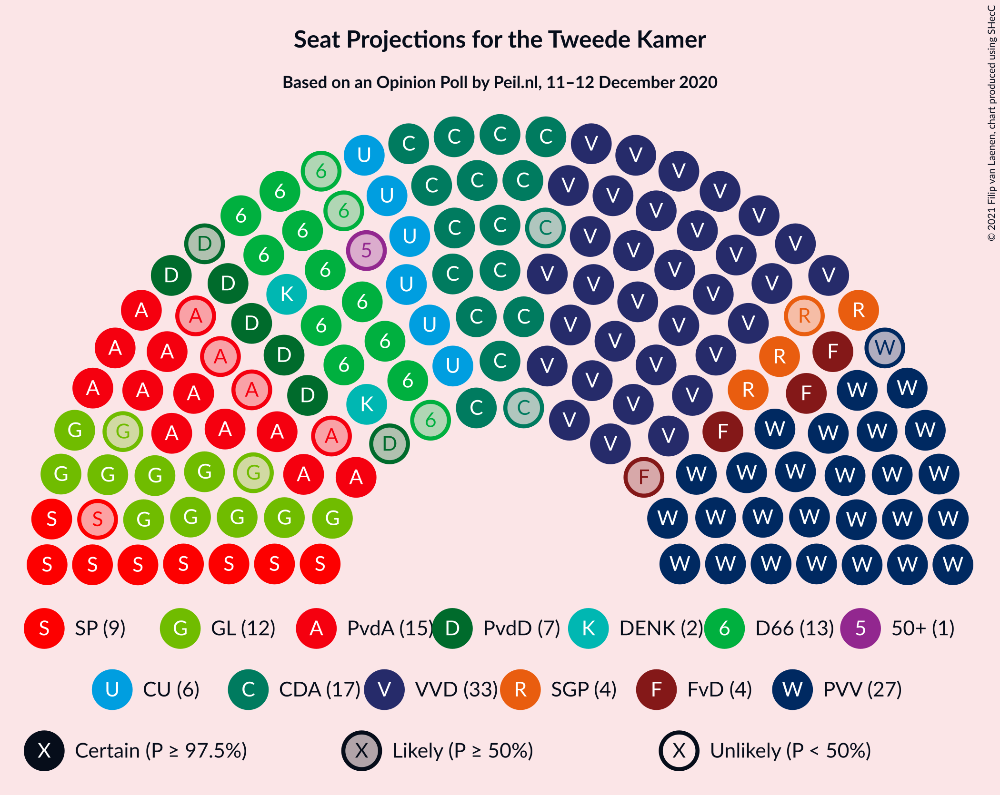
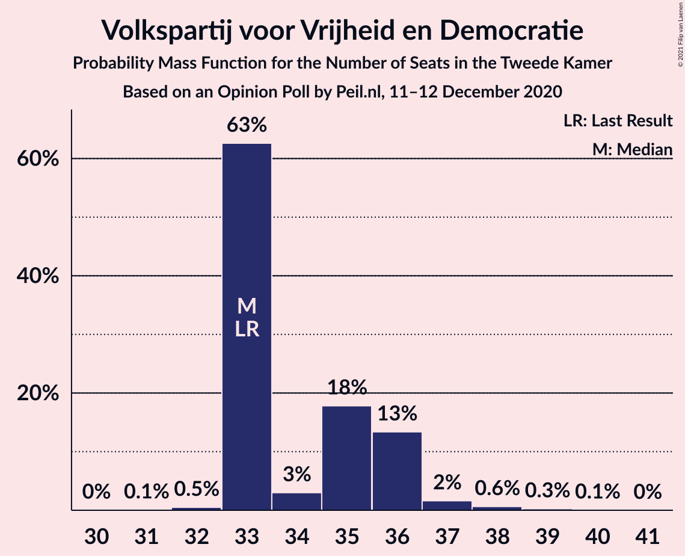
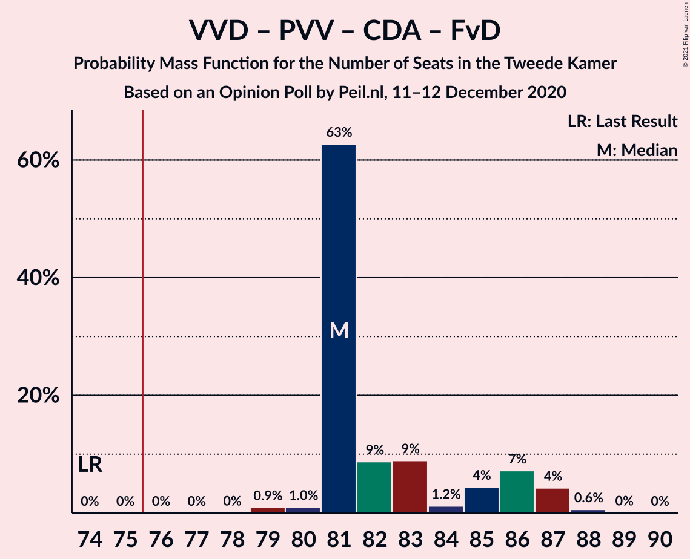

# Opinion Poll by Peil.nl, 11–12 December 2020

<a href="#voting-intentions">Voting Intentions</a> | <a href="#seats">Seats</a> | <a href="#coalitions">Coalitions</a> | <a href="#technical-information">Technical Information</a>

## Voting Intentions

### Confidence Intervals

| Party | Last Result | Poll Result | 80% Confidence Interval | 90% Confidence Interval | 95% Confidence Interval | 99% Confidence Interval |
|:-----:|:-----------:|:-----------:|:-----------------------:|:-----------------------:|:-----------------------:|:-----------------------:|
| Volkspartij voor Vrijheid en Democratie | 21.3% | 22.6% | 21.7–23.6% |21.4–23.9% |21.2–24.2% |20.7–24.7% |
| Partij voor de Vrijheid | 13.1% | 18.6% | 17.7–19.6% |17.5–19.8% |17.3–20.1% |16.9–20.5% |
| Christen-Democratisch Appèl | 12.4% | 10.6% | 9.9–11.4% |9.7–11.6% |9.6–11.8% |9.3–12.2% |
| Partij van de Arbeid | 5.7% | 9.3% | 8.7–10.1% |8.5–10.3% |8.3–10.4% |8.0–10.8% |
| Democraten 66 | 12.2% | 8.0% | 7.4–8.7% |7.2–8.9% |7.1–9.0% |6.8–9.4% |
| GroenLinks | 9.1% | 7.3% | 6.8–8.0% |6.6–8.2% |6.4–8.3% |6.2–8.6% |
| Socialistische Partij | 9.1% | 6.0% | 5.5–6.6% |5.3–6.8% |5.2–6.9% |5.0–7.2% |
| ChristenUnie | 3.4% | 4.7% | 4.2–5.2% |4.1–5.3% |4.0–5.5% |3.7–5.8% |
| Partij voor de Dieren | 3.2% | 4.0% | 3.6–4.5% |3.4–4.6% |3.4–4.8% |3.2–5.0% |
| Staatkundig Gereformeerde Partij | 2.1% | 2.7% | 2.3–3.1% |2.2–3.2% |2.1–3.3% |2.0–3.5% |
| Forum voor Democratie | 1.8% | 2.7% | 2.3–3.1% |2.2–3.2% |2.1–3.3% |2.0–3.5% |
| DENK | 2.1% | 2.0% | 1.7–2.4% |1.6–2.5% |1.6–2.6% |1.4–2.8% |
| 50Plus | 3.1% | 0.7% | 0.5–0.9% |0.5–1.0% |0.4–1.0% |0.4–1.2% |
| Code Oranje | 0.0% | 0.7% | 0.5–0.9% |0.5–1.0% |0.4–1.0% |0.4–1.2% |

*Note:* The poll result column reflects the actual value used in the calculations. Published results may vary slightly, and in addition be rounded to fewer digits.

## Seats

### Confidence Intervals

| Party | Last Result | Median | 80% Confidence Interval | 90% Confidence Interval | 95% Confidence Interval | 99% Confidence Interval |
|:-----:|:-----------:|:------:|:-----------------------:|:-----------------------:|:-----------------------:|:-----------------------:|
| <a href="#volkspartij-voor-vrijheid-en-democratie">Volkspartij voor Vrijheid en Democratie</a> | 33 | 35 | 34–36 |33–37 |33–38 |32–39 |
| <a href="#partij-voor-de-vrijheid">Partij voor de Vrijheid</a> | 20 | 29 | 28–31 |27–31 |26–31 |26–32 |
| <a href="#christen-democratisch-appèl">Christen-Democratisch Appèl</a> | 19 | 16 | 15–17 |14–17 |13–17 |13–18 |
| <a href="#partij-van-de-arbeid">Partij van de Arbeid</a> | 9 | 14 | 11–15 |11–15 |11–16 |11–16 |
| <a href="#democraten-66">Democraten 66</a> | 19 | 12 | 12–14 |11–14 |10–14 |10–14 |
| <a href="#groenlinks">GroenLinks</a> | 14 | 11 | 10–12 |10–13 |10–13 |9–13 |
| <a href="#socialistische-partij">Socialistische Partij</a> | 14 | 10 | 8–10 |7–10 |7–10 |7–10 |
| <a href="#christenunie">ChristenUnie</a> | 5 | 7 | 6–7 |6–8 |6–8 |6–9 |
| <a href="#partij-voor-de-dieren">Partij voor de Dieren</a> | 5 | 6 | 6–7 |5–7 |5–7 |5–7 |
| <a href="#staatkundig-gereformeerde-partij">Staatkundig Gereformeerde Partij</a> | 3 | 3 | 3–4 |3–5 |3–5 |3–5 |
| <a href="#forum-voor-democratie">Forum voor Democratie</a> | 2 | 4 | 3–5 |3–5 |3–5 |2–5 |
| <a href="#denk">DENK</a> | 3 | 3 | 2–3 |2–4 |2–4 |2–4 |
| <a href="#50plus">50Plus</a> | 4 | 0 | 0–1 |0–1 |0–1 |0–1 |
| <a href="#code-oranje">Code Oranje</a> | 0 | 0 | 0–1 |0–1 |0–1 |0–1 |

### Volkspartij voor Vrijheid en Democratie

*For a full overview of the results for this party, see the [Volkspartij voor Vrijheid en Democratie](party-volkspartijvoorvrijheidendemocratie.html) page.*

| Number of Seats | Probability | Accumulated | Special Marks |
|:---------------:|:-----------:|:-----------:|:-------------:|
| 30 | 0.3% | 100% |  |
| 31 | 0% | 99.7% |  |
| 32 | 2% | 99.7% |  |
| 33 | 7% | 98% | Last Result |
| 34 | 9% | 91% |  |
| 35 | 43% | 81% | Median |
| 36 | 34% | 39% |  |
| 37 | 1.3% | 5% |  |
| 38 | 3% | 4% |  |
| 39 | 0.9% | 0.9% |  |
| 40 | 0% | 0% |  |

### Partij voor de Vrijheid

*For a full overview of the results for this party, see the [Partij voor de Vrijheid](party-partijvoordevrijheid.html) page.*

| Number of Seats | Probability | Accumulated | Special Marks |
|:---------------:|:-----------:|:-----------:|:-------------:|
| 20 | 0% | 100% | Last Result |
| 21 | 0% | 100% |  |
| 22 | 0% | 100% |  |
| 23 | 0% | 100% |  |
| 24 | 0% | 100% |  |
| 25 | 0% | 100% |  |
| 26 | 4% | 100% |  |
| 27 | 3% | 96% |  |
| 28 | 41% | 92% |  |
| 29 | 15% | 52% | Median |
| 30 | 5% | 37% |  |
| 31 | 31% | 32% |  |
| 32 | 0.7% | 1.1% |  |
| 33 | 0% | 0.4% |  |
| 34 | 0.4% | 0.4% |  |
| 35 | 0% | 0% |  |

### Christen-Democratisch Appèl

*For a full overview of the results for this party, see the [Christen-Democratisch Appèl](party-christen-democratischappèl.html) page.*

| Number of Seats | Probability | Accumulated | Special Marks |
|:---------------:|:-----------:|:-----------:|:-------------:|
| 13 | 3% | 100% |  |
| 14 | 5% | 97% |  |
| 15 | 39% | 93% |  |
| 16 | 34% | 53% | Median |
| 17 | 18% | 19% |  |
| 18 | 0.9% | 1.1% |  |
| 19 | 0.1% | 0.2% | Last Result |
| 20 | 0.1% | 0.1% |  |
| 21 | 0% | 0% |  |

### Partij van de Arbeid

*For a full overview of the results for this party, see the [Partij van de Arbeid](party-partijvandearbeid.html) page.*

| Number of Seats | Probability | Accumulated | Special Marks |
|:---------------:|:-----------:|:-----------:|:-------------:|
| 9 | 0% | 100% | Last Result |
| 10 | 0% | 100% |  |
| 11 | 27% | 100% |  |
| 12 | 0.6% | 73% |  |
| 13 | 18% | 72% |  |
| 14 | 10% | 54% | Median |
| 15 | 40% | 44% |  |
| 16 | 3% | 4% |  |
| 17 | 0.3% | 0.3% |  |
| 18 | 0% | 0% |  |

### Democraten 66

*For a full overview of the results for this party, see the [Democraten 66](party-democraten66.html) page.*

| Number of Seats | Probability | Accumulated | Special Marks |
|:---------------:|:-----------:|:-----------:|:-------------:|
| 10 | 3% | 100% |  |
| 11 | 5% | 97% |  |
| 12 | 66% | 91% | Median |
| 13 | 15% | 25% |  |
| 14 | 10% | 10% |  |
| 15 | 0.2% | 0.2% |  |
| 16 | 0% | 0% |  |
| 17 | 0% | 0% |  |
| 18 | 0% | 0% |  |
| 19 | 0% | 0% | Last Result |

### GroenLinks

*For a full overview of the results for this party, see the [GroenLinks](party-groenlinks.html) page.*

| Number of Seats | Probability | Accumulated | Special Marks |
|:---------------:|:-----------:|:-----------:|:-------------:|
| 9 | 1.3% | 100% |  |
| 10 | 31% | 98.7% |  |
| 11 | 52% | 68% | Median |
| 12 | 9% | 16% |  |
| 13 | 7% | 7% |  |
| 14 | 0.1% | 0.1% | Last Result |
| 15 | 0% | 0% |  |

### Socialistische Partij

*For a full overview of the results for this party, see the [Socialistische Partij](party-socialistischepartij.html) page.*

| Number of Seats | Probability | Accumulated | Special Marks |
|:---------------:|:-----------:|:-----------:|:-------------:|
| 7 | 7% | 100% |  |
| 8 | 11% | 93% |  |
| 9 | 19% | 82% |  |
| 10 | 63% | 63% | Median |
| 11 | 0.1% | 0.5% |  |
| 12 | 0.4% | 0.4% |  |
| 13 | 0% | 0% |  |
| 14 | 0% | 0% | Last Result |

### ChristenUnie

*For a full overview of the results for this party, see the [ChristenUnie](party-christenunie.html) page.*

| Number of Seats | Probability | Accumulated | Special Marks |
|:---------------:|:-----------:|:-----------:|:-------------:|
| 5 | 0.2% | 100% | Last Result |
| 6 | 10% | 99.8% |  |
| 7 | 82% | 89% | Median |
| 8 | 7% | 7% |  |
| 9 | 0.5% | 0.5% |  |
| 10 | 0% | 0% |  |

### Partij voor de Dieren

*For a full overview of the results for this party, see the [Partij voor de Dieren](party-partijvoordedieren.html) page.*

| Number of Seats | Probability | Accumulated | Special Marks |
|:---------------:|:-----------:|:-----------:|:-------------:|
| 4 | 0.3% | 100% |  |
| 5 | 9% | 99.7% | Last Result |
| 6 | 74% | 91% | Median |
| 7 | 16% | 17% |  |
| 8 | 0.4% | 0.5% |  |
| 9 | 0% | 0% |  |

### Staatkundig Gereformeerde Partij

*For a full overview of the results for this party, see the [Staatkundig Gereformeerde Partij](party-staatkundiggereformeerdepartij.html) page.*

| Number of Seats | Probability | Accumulated | Special Marks |
|:---------------:|:-----------:|:-----------:|:-------------:|
| 3 | 56% | 100% | Last Result, Median |
| 4 | 37% | 44% |  |
| 5 | 8% | 8% |  |
| 6 | 0% | 0% |  |

### Forum voor Democratie

*For a full overview of the results for this party, see the [Forum voor Democratie](party-forumvoordemocratie.html) page.*

| Number of Seats | Probability | Accumulated | Special Marks |
|:---------------:|:-----------:|:-----------:|:-------------:|
| 2 | 0.5% | 100% | Last Result |
| 3 | 44% | 99.5% |  |
| 4 | 23% | 55% | Median |
| 5 | 32% | 32% |  |
| 6 | 0% | 0% |  |

### DENK

*For a full overview of the results for this party, see the [DENK](party-denk.html) page.*

| Number of Seats | Probability | Accumulated | Special Marks |
|:---------------:|:-----------:|:-----------:|:-------------:|
| 2 | 35% | 100% |  |
| 3 | 57% | 65% | Last Result, Median |
| 4 | 9% | 9% |  |
| 5 | 0% | 0% |  |

### 50Plus

*For a full overview of the results for this party, see the [50Plus](party-50plus.html) page.*

| Number of Seats | Probability | Accumulated | Special Marks |
|:---------------:|:-----------:|:-----------:|:-------------:|
| 0 | 54% | 100% | Median |
| 1 | 46% | 46% |  |
| 2 | 0.1% | 0.1% |  |
| 3 | 0% | 0% |  |
| 4 | 0% | 0% | Last Result |

### Code Oranje

*For a full overview of the results for this party, see the [Code Oranje](party-codeoranje.html) page.*

| Number of Seats | Probability | Accumulated | Special Marks |
|:---------------:|:-----------:|:-----------:|:-------------:|
| 0 | 57% | 100% | Last Result, Median |
| 1 | 43% | 43% |  |
| 2 | 0% | 0% |  |

## Coalitions

### Confidence Intervals

| Coalition | Last Result | Median | Majority? | 80% Confidence Interval | 90% Confidence Interval | 95% Confidence Interval | 99% Confidence Interval |
|:---------:|:-----------:|:------:|:---------:|:-----------------------:|:-----------------------:|:-----------------------:|:-----------------------:|
| Volkspartij voor Vrijheid en Democratie – Partij voor de Vrijheid – Christen-Democratisch Appèl – Forum voor Democratie – Staatkundig Gereformeerde Partij | 77 | 86 | 100% | 85–91 | 84–91 | 83–91 | 83–91 |
| Volkspartij voor Vrijheid en Democratie – Partij voor de Vrijheid – Christen-Democratisch Appèl – Forum voor Democratie | 74 | 83 | 100% | 81–87 | 81–87 | 80–87 | 80–88 |
| Volkspartij voor Vrijheid en Democratie – Christen-Democratisch Appèl – Partij van de Arbeid – Democraten 66 – ChristenUnie | 85 | 84 | 100% | 81–86 | 81–86 | 81–86 | 81–87 |
| Volkspartij voor Vrijheid en Democratie – Christen-Democratisch Appèl – Democraten 66 – GroenLinks – ChristenUnie | 90 | 81 | 100% | 80–84 | 79–84 | 79–84 | 77–84 |
| Volkspartij voor Vrijheid en Democratie – Partij voor de Vrijheid – Christen-Democratisch Appèl | 72 | 80 | 99.7% | 78–82 | 76–82 | 76–82 | 76–84 |
| Volkspartij voor Vrijheid en Democratie – Christen-Democratisch Appèl – Democraten 66 – ChristenUnie | 76 | 70 | 0% | 69–73 | 67–73 | 67–73 | 67–73 |
| Christen-Democratisch Appèl – Partij van de Arbeid – Democraten 66 – GroenLinks – Socialistische Partij – ChristenUnie | 80 | 70 | 0% | 66–71 | 66–73 | 64–73 | 64–73 |
| Volkspartij voor Vrijheid en Democratie – Christen-Democratisch Appèl – Partij van de Arbeid | 61 | 65 | 0% | 62–66 | 62–66 | 62–67 | 61–67 |
| Volkspartij voor Vrijheid en Democratie – Christen-Democratisch Appèl – Democraten 66 | 71 | 63 | 0% | 62–66 | 60–66 | 60–66 | 59–66 |
| Christen-Democratisch Appèl – Partij van de Arbeid – Democraten 66 – GroenLinks – ChristenUnie | 66 | 60 | 0% | 56–63 | 56–64 | 55–64 | 54–65 |
| Volkspartij voor Vrijheid en Democratie – Partij van de Arbeid – Democraten 66 | 61 | 62 | 0% | 58–63 | 58–63 | 58–63 | 57–64 |
| Volkspartij voor Vrijheid en Democratie – Christen-Democratisch Appèl – Forum voor Democratie – Staatkundig Gereformeerde Partij – 50Plus | 61 | 58 | 0% | 57–60 | 56–61 | 56–63 | 54–63 |
| Volkspartij voor Vrijheid en Democratie – Christen-Democratisch Appèl – Forum voor Democratie – Staatkundig Gereformeerde Partij | 57 | 58 | 0% | 57–60 | 56–61 | 56–62 | 54–62 |
| Volkspartij voor Vrijheid en Democratie – Christen-Democratisch Appèl – Forum voor Democratie – 50Plus | 58 | 55 | 0% | 54–56 | 52–58 | 52–58 | 51–59 |
| Volkspartij voor Vrijheid en Democratie – Christen-Democratisch Appèl – Forum voor Democratie | 54 | 54 | 0% | 54–56 | 52–57 | 52–57 | 51–59 |
| Volkspartij voor Vrijheid en Democratie – Christen-Democratisch Appèl | 52 | 51 | 0% | 49–52 | 49–53 | 49–53 | 47–54 |
| Volkspartij voor Vrijheid en Democratie – Partij van de Arbeid | 42 | 49 | 0% | 46–51 | 46–51 | 46–52 | 45–52 |
| Christen-Democratisch Appèl – Partij van de Arbeid – Democraten 66 | 47 | 42 | 0% | 39–44 | 39–44 | 38–44 | 38–46 |
| Christen-Democratisch Appèl – Partij van de Arbeid – ChristenUnie | 33 | 37 | 0% | 34–37 | 34–39 | 34–39 | 34–41 |
| Christen-Democratisch Appèl – Partij van de Arbeid | 28 | 30 | 0% | 27–31 | 27–31 | 27–31 | 27–33 |
| Christen-Democratisch Appèl – Democraten 66 | 38 | 28 | 0% | 27–31 | 25–31 | 24–31 | 24–31 |

### Volkspartij voor Vrijheid en Democratie – Partij voor de Vrijheid – Christen-Democratisch Appèl – Forum voor Democratie – Staatkundig Gereformeerde Partij

| Number of Seats | Probability | Accumulated | Special Marks |
|:---------------:|:-----------:|:-----------:|:-------------:|
| 77 | 0% | 100% | Last Result |
| 78 | 0% | 100% |  |
| 79 | 0% | 100% |  |
| 80 | 0% | 100% |  |
| 81 | 0% | 100% |  |
| 82 | 0.4% | 100% |  |
| 83 | 4% | 99.6% |  |
| 84 | 2% | 95% |  |
| 85 | 33% | 94% |  |
| 86 | 19% | 60% |  |
| 87 | 2% | 41% | Median |
| 88 | 3% | 40% |  |
| 89 | 3% | 36% |  |
| 90 | 0.6% | 33% |  |
| 91 | 32% | 32% |  |
| 92 | 0.3% | 0.3% |  |
| 93 | 0% | 0% |  |

### Volkspartij voor Vrijheid en Democratie – Partij voor de Vrijheid – Christen-Democratisch Appèl – Forum voor Democratie

| Number of Seats | Probability | Accumulated | Special Marks |
|:---------------:|:-----------:|:-----------:|:-------------:|
| 74 | 0% | 100% | Last Result |
| 75 | 0% | 100% |  |
| 76 | 0% | 100% | Majority |
| 77 | 0% | 100% |  |
| 78 | 0% | 100% |  |
| 79 | 0.4% | 100% |  |
| 80 | 4% | 99.6% |  |
| 81 | 7% | 95% |  |
| 82 | 31% | 88% |  |
| 83 | 18% | 57% |  |
| 84 | 5% | 40% | Median |
| 85 | 1.2% | 34% |  |
| 86 | 4% | 33% |  |
| 87 | 27% | 30% |  |
| 88 | 2% | 2% |  |
| 89 | 0.3% | 0.3% |  |
| 90 | 0% | 0% |  |

### Volkspartij voor Vrijheid en Democratie – Christen-Democratisch Appèl – Partij van de Arbeid – Democraten 66 – ChristenUnie

| Number of Seats | Probability | Accumulated | Special Marks |
|:---------------:|:-----------:|:-----------:|:-------------:|
| 79 | 0.4% | 100% |  |
| 80 | 0% | 99.6% |  |
| 81 | 30% | 99.6% |  |
| 82 | 6% | 70% |  |
| 83 | 8% | 64% |  |
| 84 | 8% | 55% | Median |
| 85 | 35% | 48% | Last Result |
| 86 | 11% | 13% |  |
| 87 | 1.0% | 1.2% |  |
| 88 | 0.1% | 0.2% |  |
| 89 | 0% | 0% |  |

### Volkspartij voor Vrijheid en Democratie – Christen-Democratisch Appèl – Democraten 66 – GroenLinks – ChristenUnie

| Number of Seats | Probability | Accumulated | Special Marks |
|:---------------:|:-----------:|:-----------:|:-------------:|
| 76 | 0.1% | 100% | Majority |
| 77 | 2% | 99.9% |  |
| 78 | 0.3% | 98% |  |
| 79 | 7% | 98% |  |
| 80 | 37% | 91% |  |
| 81 | 31% | 54% | Median |
| 82 | 7% | 23% |  |
| 83 | 6% | 17% |  |
| 84 | 10% | 10% |  |
| 85 | 0% | 0.1% |  |
| 86 | 0% | 0.1% |  |
| 87 | 0% | 0.1% |  |
| 88 | 0% | 0% |  |
| 89 | 0% | 0% |  |
| 90 | 0% | 0% | Last Result |

### Volkspartij voor Vrijheid en Democratie – Partij voor de Vrijheid – Christen-Democratisch Appèl

| Number of Seats | Probability | Accumulated | Special Marks |
|:---------------:|:-----------:|:-----------:|:-------------:|
| 72 | 0% | 100% | Last Result |
| 73 | 0% | 100% |  |
| 74 | 0% | 100% |  |
| 75 | 0.3% | 100% |  |
| 76 | 7% | 99.7% | Majority |
| 77 | 2% | 93% |  |
| 78 | 3% | 91% |  |
| 79 | 37% | 88% |  |
| 80 | 16% | 51% | Median |
| 81 | 2% | 35% |  |
| 82 | 30% | 32% |  |
| 83 | 1.2% | 2% |  |
| 84 | 0.7% | 0.9% |  |
| 85 | 0.3% | 0.3% |  |
| 86 | 0% | 0% |  |

### Volkspartij voor Vrijheid en Democratie – Christen-Democratisch Appèl – Democraten 66 – ChristenUnie

| Number of Seats | Probability | Accumulated | Special Marks |
|:---------------:|:-----------:|:-----------:|:-------------:|
| 66 | 0.5% | 100% |  |
| 67 | 5% | 99.5% |  |
| 68 | 4% | 94% |  |
| 69 | 14% | 91% |  |
| 70 | 58% | 76% | Median |
| 71 | 6% | 18% |  |
| 72 | 1.1% | 12% |  |
| 73 | 11% | 11% |  |
| 74 | 0% | 0.1% |  |
| 75 | 0% | 0.1% |  |
| 76 | 0% | 0% | Last Result, Majority |

### Christen-Democratisch Appèl – Partij van de Arbeid – Democraten 66 – GroenLinks – Socialistische Partij – ChristenUnie

| Number of Seats | Probability | Accumulated | Special Marks |
|:---------------:|:-----------:|:-----------:|:-------------:|
| 64 | 4% | 100% |  |
| 65 | 0% | 96% |  |
| 66 | 30% | 96% |  |
| 67 | 5% | 66% |  |
| 68 | 3% | 61% |  |
| 69 | 3% | 58% |  |
| 70 | 38% | 54% | Median |
| 71 | 10% | 16% |  |
| 72 | 0.1% | 6% |  |
| 73 | 5% | 6% |  |
| 74 | 0.2% | 0.5% |  |
| 75 | 0.2% | 0.2% |  |
| 76 | 0% | 0% | Majority |
| 77 | 0% | 0% |  |
| 78 | 0% | 0% |  |
| 79 | 0% | 0% |  |
| 80 | 0% | 0% | Last Result |

### Volkspartij voor Vrijheid en Democratie – Christen-Democratisch Appèl – Partij van de Arbeid

| Number of Seats | Probability | Accumulated | Special Marks |
|:---------------:|:-----------:|:-----------:|:-------------:|
| 60 | 0.4% | 100% |  |
| 61 | 1.4% | 99.6% | Last Result |
| 62 | 28% | 98% |  |
| 63 | 6% | 70% |  |
| 64 | 8% | 64% |  |
| 65 | 20% | 56% | Median |
| 66 | 34% | 37% |  |
| 67 | 2% | 3% |  |
| 68 | 0.1% | 0.3% |  |
| 69 | 0.1% | 0.2% |  |
| 70 | 0% | 0.1% |  |
| 71 | 0.1% | 0.1% |  |
| 72 | 0% | 0% |  |

### Volkspartij voor Vrijheid en Democratie – Christen-Democratisch Appèl – Democraten 66

| Number of Seats | Probability | Accumulated | Special Marks |
|:---------------:|:-----------:|:-----------:|:-------------:|
| 58 | 0.1% | 100% |  |
| 59 | 2% | 99.9% |  |
| 60 | 4% | 98% |  |
| 61 | 3% | 94% |  |
| 62 | 6% | 91% |  |
| 63 | 72% | 85% | Median |
| 64 | 0.7% | 13% |  |
| 65 | 1.1% | 13% |  |
| 66 | 11% | 11% |  |
| 67 | 0% | 0.1% |  |
| 68 | 0.1% | 0.1% |  |
| 69 | 0% | 0% |  |
| 70 | 0% | 0% |  |
| 71 | 0% | 0% | Last Result |

### Christen-Democratisch Appèl – Partij van de Arbeid – Democraten 66 – GroenLinks – ChristenUnie

| Number of Seats | Probability | Accumulated | Special Marks |
|:---------------:|:-----------:|:-----------:|:-------------:|
| 54 | 0.6% | 100% |  |
| 55 | 3% | 99.4% |  |
| 56 | 28% | 96% |  |
| 57 | 0.5% | 69% |  |
| 58 | 3% | 68% |  |
| 59 | 8% | 66% |  |
| 60 | 34% | 58% | Median |
| 61 | 0.6% | 23% |  |
| 62 | 10% | 23% |  |
| 63 | 7% | 12% |  |
| 64 | 5% | 6% |  |
| 65 | 0.6% | 0.9% |  |
| 66 | 0.3% | 0.3% | Last Result |
| 67 | 0% | 0% |  |

### Volkspartij voor Vrijheid en Democratie – Partij van de Arbeid – Democraten 66

| Number of Seats | Probability | Accumulated | Special Marks |
|:---------------:|:-----------:|:-----------:|:-------------:|
| 56 | 0.2% | 100% |  |
| 57 | 1.1% | 99.8% |  |
| 58 | 28% | 98.7% |  |
| 59 | 2% | 71% |  |
| 60 | 8% | 69% |  |
| 61 | 7% | 61% | Last Result, Median |
| 62 | 20% | 54% |  |
| 63 | 34% | 34% |  |
| 64 | 0.3% | 0.6% |  |
| 65 | 0.3% | 0.3% |  |
| 66 | 0% | 0% |  |

### Volkspartij voor Vrijheid en Democratie – Christen-Democratisch Appèl – Forum voor Democratie – Staatkundig Gereformeerde Partij – 50Plus

| Number of Seats | Probability | Accumulated | Special Marks |
|:---------------:|:-----------:|:-----------:|:-------------:|
| 53 | 0.2% | 100% |  |
| 54 | 0.6% | 99.8% |  |
| 55 | 1.4% | 99.1% |  |
| 56 | 3% | 98% |  |
| 57 | 8% | 94% |  |
| 58 | 47% | 87% | Median |
| 59 | 3% | 40% |  |
| 60 | 31% | 36% |  |
| 61 | 0.6% | 6% | Last Result |
| 62 | 2% | 5% |  |
| 63 | 3% | 3% |  |
| 64 | 0% | 0% |  |

### Volkspartij voor Vrijheid en Democratie – Christen-Democratisch Appèl – Forum voor Democratie – Staatkundig Gereformeerde Partij

| Number of Seats | Probability | Accumulated | Special Marks |
|:---------------:|:-----------:|:-----------:|:-------------:|
| 53 | 0.4% | 100% |  |
| 54 | 2% | 99.6% |  |
| 55 | 0% | 98% |  |
| 56 | 4% | 98% |  |
| 57 | 44% | 94% | Last Result |
| 58 | 12% | 50% | Median |
| 59 | 5% | 38% |  |
| 60 | 28% | 33% |  |
| 61 | 1.2% | 5% |  |
| 62 | 4% | 4% |  |
| 63 | 0% | 0.1% |  |
| 64 | 0% | 0% |  |

### Volkspartij voor Vrijheid en Democratie – Christen-Democratisch Appèl – Forum voor Democratie – 50Plus

| Number of Seats | Probability | Accumulated | Special Marks |
|:---------------:|:-----------:|:-----------:|:-------------:|
| 50 | 0.2% | 100% |  |
| 51 | 0.6% | 99.8% |  |
| 52 | 5% | 99.1% |  |
| 53 | 3% | 94% |  |
| 54 | 7% | 91% |  |
| 55 | 50% | 84% | Median |
| 56 | 28% | 34% |  |
| 57 | 0.1% | 6% |  |
| 58 | 4% | 5% | Last Result |
| 59 | 2% | 2% |  |
| 60 | 0% | 0% |  |

### Volkspartij voor Vrijheid en Democratie – Christen-Democratisch Appèl – Forum voor Democratie

| Number of Seats | Probability | Accumulated | Special Marks |
|:---------------:|:-----------:|:-----------:|:-------------:|
| 50 | 0.4% | 100% |  |
| 51 | 2% | 99.6% |  |
| 52 | 3% | 98% |  |
| 53 | 4% | 94% |  |
| 54 | 47% | 91% | Last Result |
| 55 | 11% | 44% | Median |
| 56 | 28% | 33% |  |
| 57 | 3% | 5% |  |
| 58 | 1.0% | 2% |  |
| 59 | 1.2% | 1.3% |  |
| 60 | 0% | 0% |  |

### Volkspartij voor Vrijheid en Democratie – Christen-Democratisch Appèl

| Number of Seats | Probability | Accumulated | Special Marks |
|:---------------:|:-----------:|:-----------:|:-------------:|
| 46 | 0.3% | 100% |  |
| 47 | 2% | 99.7% |  |
| 48 | 0.2% | 98% |  |
| 49 | 9% | 98% |  |
| 50 | 14% | 88% |  |
| 51 | 59% | 75% | Median |
| 52 | 10% | 16% | Last Result |
| 53 | 3% | 5% |  |
| 54 | 2% | 2% |  |
| 55 | 0.1% | 0.1% |  |
| 56 | 0% | 0% |  |

### Volkspartij voor Vrijheid en Democratie – Partij van de Arbeid

| Number of Seats | Probability | Accumulated | Special Marks |
|:---------------:|:-----------:|:-----------:|:-------------:|
| 42 | 0% | 100% | Last Result |
| 43 | 0% | 100% |  |
| 44 | 0% | 100% |  |
| 45 | 0.9% | 100% |  |
| 46 | 29% | 99.0% |  |
| 47 | 6% | 70% |  |
| 48 | 13% | 64% |  |
| 49 | 12% | 51% | Median |
| 50 | 2% | 39% |  |
| 51 | 33% | 37% |  |
| 52 | 4% | 4% |  |
| 53 | 0.1% | 0.2% |  |
| 54 | 0% | 0% |  |

### Christen-Democratisch Appèl – Partij van de Arbeid – Democraten 66

| Number of Seats | Probability | Accumulated | Special Marks |
|:---------------:|:-----------:|:-----------:|:-------------:|
| 38 | 3% | 100% |  |
| 39 | 29% | 97% |  |
| 40 | 7% | 68% |  |
| 41 | 3% | 61% |  |
| 42 | 35% | 59% | Median |
| 43 | 0.7% | 23% |  |
| 44 | 21% | 23% |  |
| 45 | 1.0% | 2% |  |
| 46 | 0.8% | 0.8% |  |
| 47 | 0% | 0.1% | Last Result |
| 48 | 0% | 0% |  |

### Christen-Democratisch Appèl – Partij van de Arbeid – ChristenUnie

| Number of Seats | Probability | Accumulated | Special Marks |
|:---------------:|:-----------:|:-----------:|:-------------:|
| 33 | 0.1% | 100% | Last Result |
| 34 | 31% | 99.9% |  |
| 35 | 5% | 69% |  |
| 36 | 5% | 63% |  |
| 37 | 50% | 58% | Median |
| 38 | 1.3% | 8% |  |
| 39 | 5% | 7% |  |
| 40 | 0.4% | 2% |  |
| 41 | 1.0% | 1.2% |  |
| 42 | 0.2% | 0.2% |  |
| 43 | 0% | 0% |  |

### Christen-Democratisch Appèl – Partij van de Arbeid

| Number of Seats | Probability | Accumulated | Special Marks |
|:---------------:|:-----------:|:-----------:|:-------------:|
| 27 | 27% | 100% |  |
| 28 | 10% | 73% | Last Result |
| 29 | 4% | 62% |  |
| 30 | 45% | 58% | Median |
| 31 | 11% | 14% |  |
| 32 | 1.3% | 2% |  |
| 33 | 0.6% | 1.0% |  |
| 34 | 0.2% | 0.3% |  |
| 35 | 0.1% | 0.1% |  |
| 36 | 0% | 0% |  |

### Christen-Democratisch Appèl – Democraten 66

| Number of Seats | Probability | Accumulated | Special Marks |
|:---------------:|:-----------:|:-----------:|:-------------:|
| 24 | 3% | 100% |  |
| 25 | 4% | 97% |  |
| 26 | 3% | 94% |  |
| 27 | 38% | 91% |  |
| 28 | 28% | 53% | Median |
| 29 | 8% | 25% |  |
| 30 | 5% | 16% |  |
| 31 | 11% | 11% |  |
| 32 | 0.2% | 0.2% |  |
| 33 | 0% | 0% |  |
| 34 | 0% | 0% |  |
| 35 | 0% | 0% |  |
| 36 | 0% | 0% |  |
| 37 | 0% | 0% |  |
| 38 | 0% | 0% | Last Result |

## Technical Information

### Opinion Poll

+ **Polling firm:** Peil.nl
+ **Commissioner(s):** —
+ **Fieldwork period:** 11–12 December 2020

### Calculations

+ **Sample size:** 3000
+ **Simulations done:** 262,144
+ **Error estimate:** 2.07%

