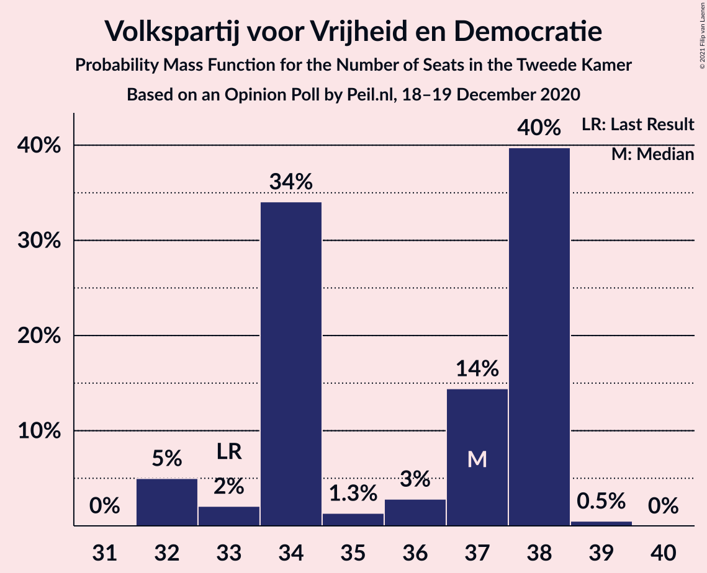
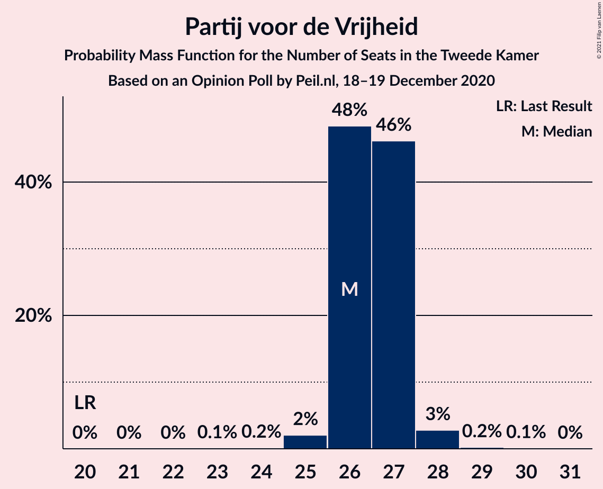
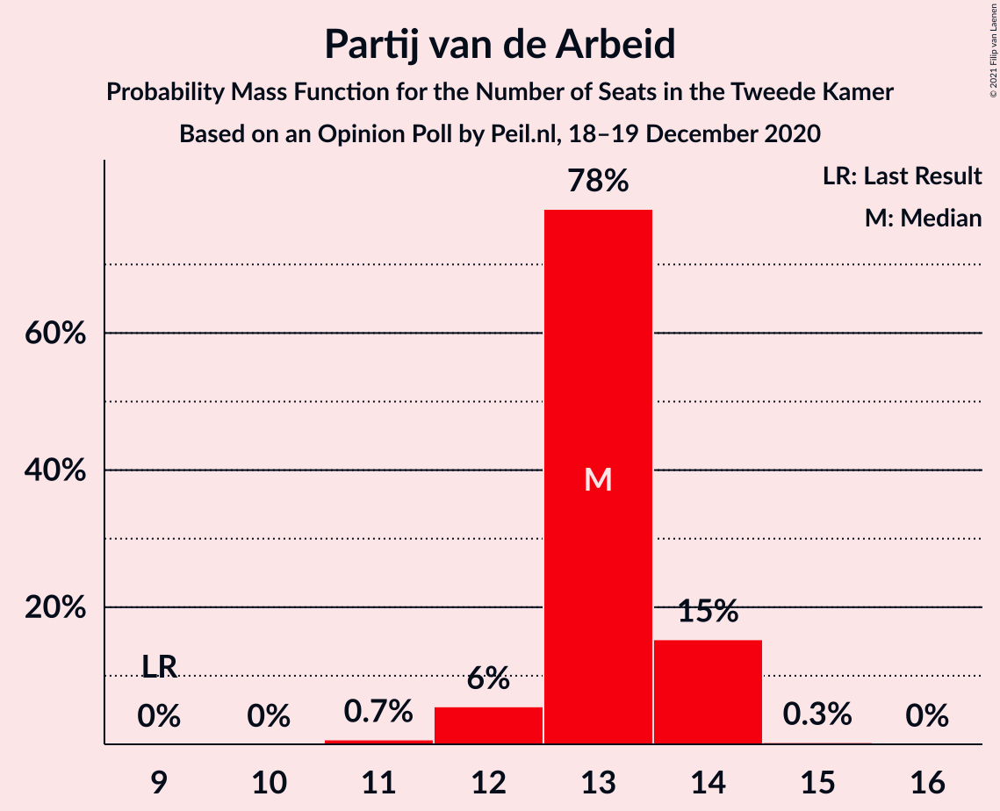
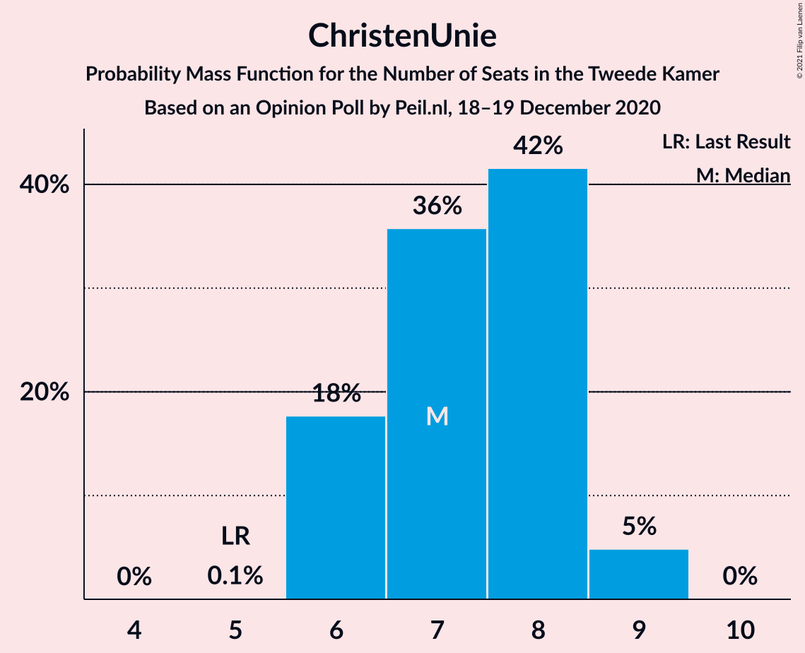
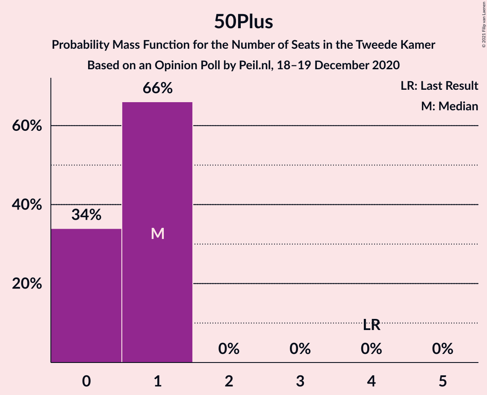
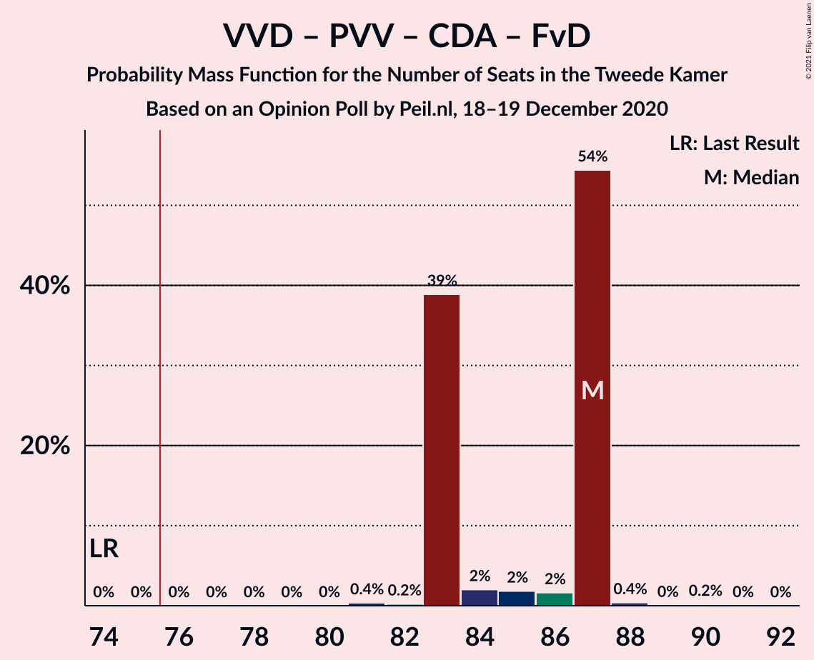
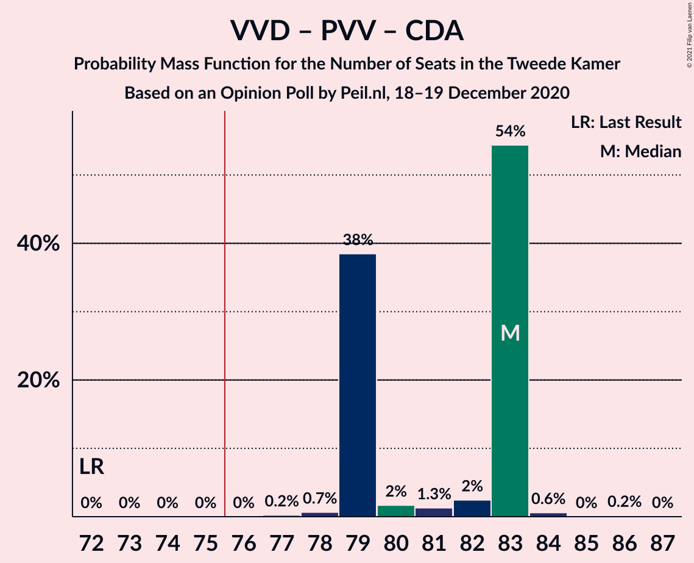
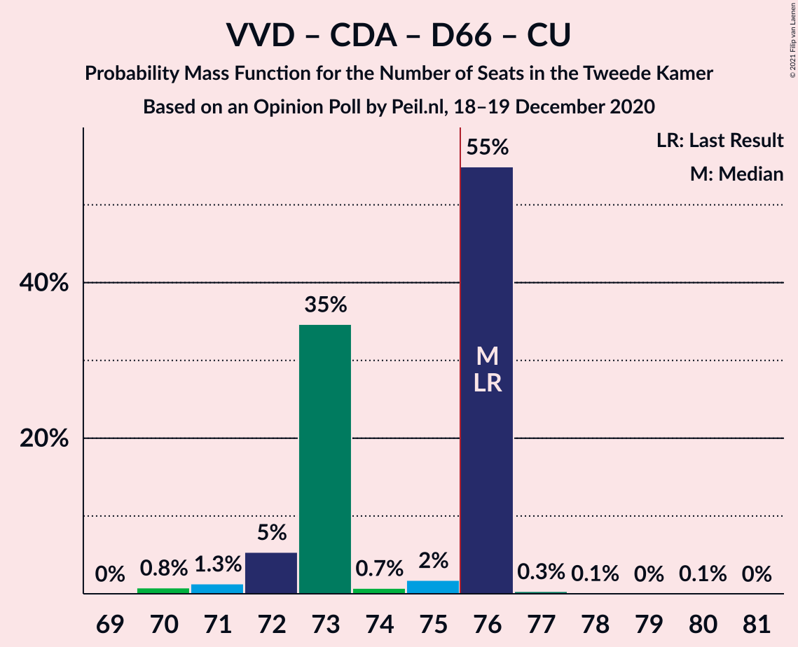
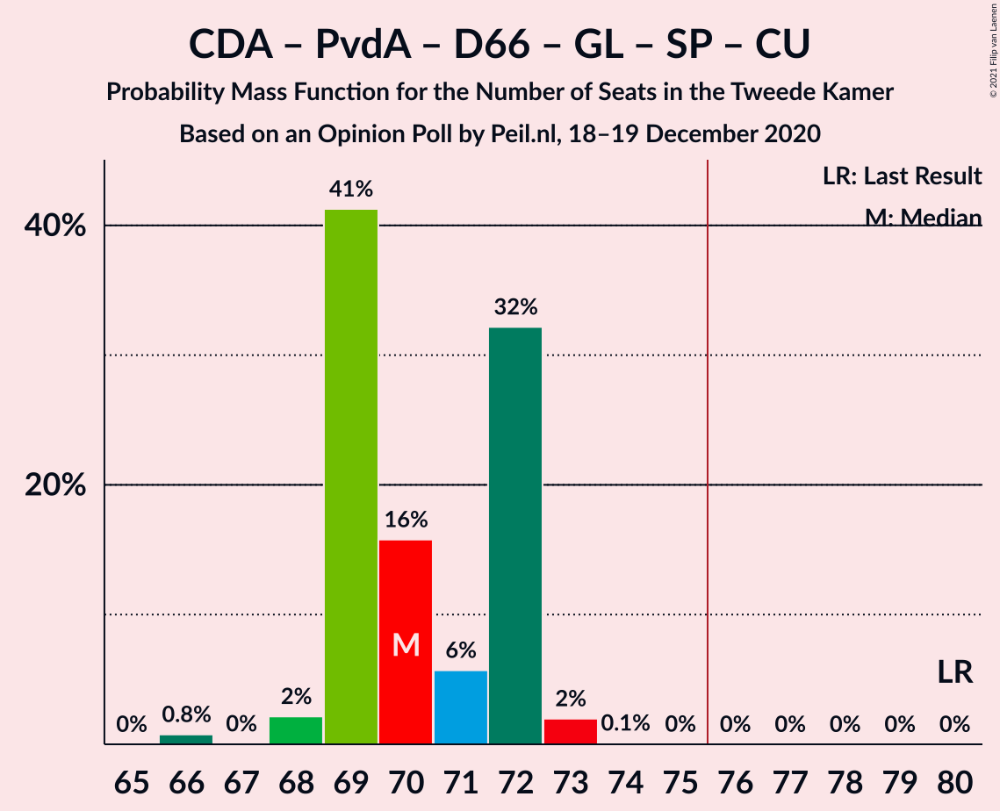
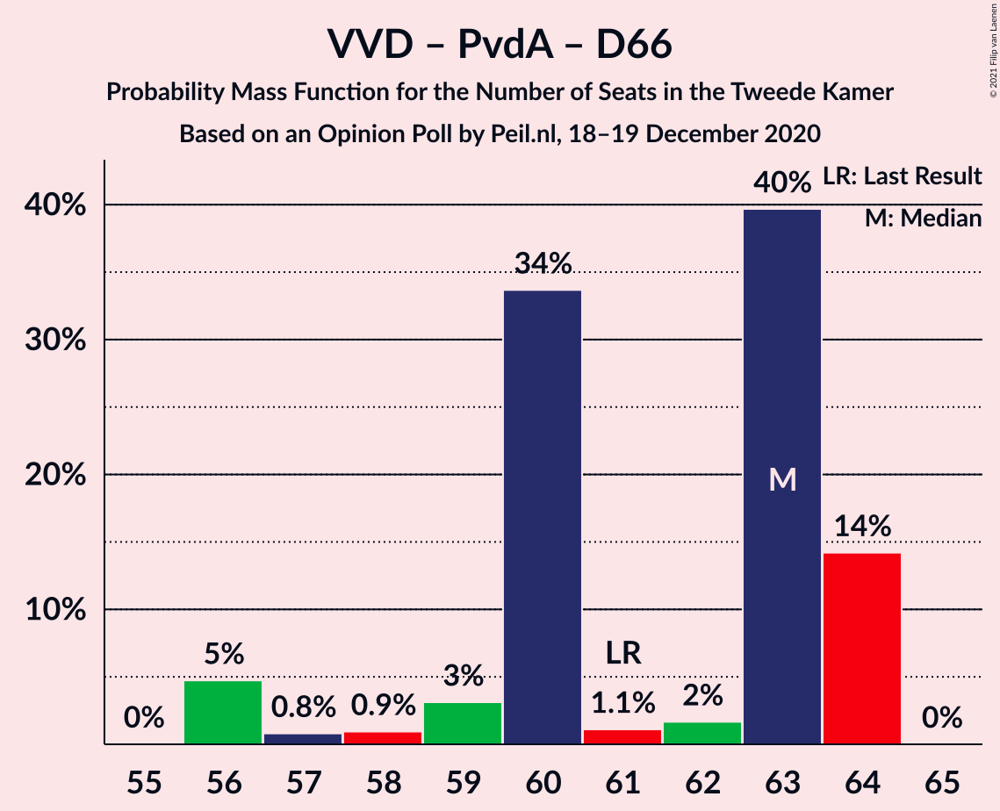

# Opinion Poll by Peil.nl, 18–19 December 2020

<a href="#voting-intentions">Voting Intentions</a> | <a href="#seats">Seats</a> | <a href="#coalitions">Coalitions</a> | <a href="#technical-information">Technical Information</a>

## Voting Intentions

### Confidence Intervals

| Party | Last Result | Poll Result | 80% Confidence Interval | 90% Confidence Interval | 95% Confidence Interval | 99% Confidence Interval |
|:-----:|:-----------:|:-----------:|:-----------------------:|:-----------------------:|:-----------------------:|:-----------------------:|
| Volkspartij voor Vrijheid en Democratie | 21.3% | 22.7% | 21.7–23.7% |21.4–24.0% |21.2–24.2% |20.7–24.7% |
| Partij voor de Vrijheid | 13.1% | 17.3% | 16.5–18.3% |16.2–18.5% |16.0–18.7% |15.6–19.2% |
| Christen-Democratisch Appèl | 12.4% | 12.7% | 11.9–13.5% |11.7–13.7% |11.5–13.9% |11.2–14.3% |
| Partij van de Arbeid | 5.7% | 8.7% | 8.0–9.4% |7.8–9.6% |7.7–9.7% |7.4–10.1% |
| Democraten 66 | 12.2% | 8.0% | 7.4–8.7% |7.2–8.9% |7.1–9.0% |6.8–9.4% |
| GroenLinks | 9.1% | 6.7% | 6.1–7.3% |6.0–7.5% |5.8–7.6% |5.6–7.9% |
| Socialistische Partij | 9.1% | 6.0% | 5.5–6.6% |5.3–6.8% |5.2–6.9% |5.0–7.2% |
| ChristenUnie | 3.4% | 4.7% | 4.2–5.2% |4.1–5.3% |4.0–5.5% |3.7–5.8% |
| Partij voor de Dieren | 3.2% | 4.0% | 3.6–4.5% |3.4–4.6% |3.4–4.8% |3.2–5.0% |
| Staatkundig Gereformeerde Partij | 2.1% | 2.7% | 2.3–3.1% |2.2–3.2% |2.1–3.3% |2.0–3.5% |
| Forum voor Democratie | 1.8% | 2.7% | 2.3–3.1% |2.2–3.2% |2.1–3.3% |2.0–3.5% |
| DENK | 2.1% | 2.0% | 1.7–2.4% |1.6–2.5% |1.6–2.6% |1.4–2.8% |
| 50Plus | 3.1% | 0.7% | 0.5–0.9% |0.5–1.0% |0.4–1.0% |0.4–1.2% |

*Note:* The poll result column reflects the actual value used in the calculations. Published results may vary slightly, and in addition be rounded to fewer digits.

## Seats

### Confidence Intervals

| Party | Last Result | Median | 80% Confidence Interval | 90% Confidence Interval | 95% Confidence Interval | 99% Confidence Interval |
|:-----:|:-----------:|:------:|:-----------------------:|:-----------------------:|:-----------------------:|:-----------------------:|
| <a href="#volkspartij-voor-vrijheid-en-democratie">Volkspartij voor Vrijheid en Democratie</a> | 33 | 35 | 34–36 |33–38 |33–38 |32–38 |
| <a href="#partij-voor-de-vrijheid">Partij voor de Vrijheid</a> | 20 | 26 | 26–28 |26–29 |25–29 |24–29 |
| <a href="#christen-democratisch-appèl">Christen-Democratisch Appèl</a> | 19 | 20 | 18–20 |18–20 |18–21 |17–22 |
| <a href="#partij-van-de-arbeid">Partij van de Arbeid</a> | 9 | 13 | 12–13 |12–14 |12–15 |11–15 |
| <a href="#democraten-66">Democraten 66</a> | 19 | 12 | 12–13 |11–13 |11–13 |11–14 |
| <a href="#groenlinks">GroenLinks</a> | 14 | 10 | 9–11 |9–11 |9–11 |9–12 |
| <a href="#socialistische-partij">Socialistische Partij</a> | 14 | 9 | 8–11 |8–11 |8–11 |8–11 |
| <a href="#christenunie">ChristenUnie</a> | 5 | 7 | 6–7 |6–7 |6–8 |5–9 |
| <a href="#partij-voor-de-dieren">Partij voor de Dieren</a> | 5 | 6 | 6–7 |5–7 |5–7 |5–7 |
| <a href="#staatkundig-gereformeerde-partij">Staatkundig Gereformeerde Partij</a> | 3 | 3 | 3–5 |3–5 |3–5 |3–5 |
| <a href="#forum-voor-democratie">Forum voor Democratie</a> | 2 | 3 | 3–4 |3–4 |3–4 |3–5 |
| <a href="#denk">DENK</a> | 3 | 2 | 2–3 |2–3 |2–3 |2–4 |
| <a href="#50plus">50Plus</a> | 4 | 1 | 0–1 |0–1 |0–1 |0–1 |

### Volkspartij voor Vrijheid en Democratie

*For a full overview of the results for this party, see the [Volkspartij voor Vrijheid en Democratie](party-volkspartijvoorvrijheidendemocratie.html) page.*

| Number of Seats | Probability | Accumulated | Special Marks |
|:---------------:|:-----------:|:-----------:|:-------------:|
| 31 | 0.1% | 100% |  |
| 32 | 1.3% | 99.9% |  |
| 33 | 4% | 98.6% | Last Result |
| 34 | 8% | 95% |  |
| 35 | 60% | 87% | Median |
| 36 | 19% | 27% |  |
| 37 | 2% | 8% |  |
| 38 | 6% | 6% |  |
| 39 | 0% | 0% |  |

### Partij voor de Vrijheid

*For a full overview of the results for this party, see the [Partij voor de Vrijheid](party-partijvoordevrijheid.html) page.*

| Number of Seats | Probability | Accumulated | Special Marks |
|:---------------:|:-----------:|:-----------:|:-------------:|
| 20 | 0% | 100% | Last Result |
| 21 | 0% | 100% |  |
| 22 | 0% | 100% |  |
| 23 | 0.5% | 100% |  |
| 24 | 0.6% | 99.5% |  |
| 25 | 2% | 98.9% |  |
| 26 | 57% | 96% | Median |
| 27 | 28% | 39% |  |
| 28 | 5% | 11% |  |
| 29 | 6% | 6% |  |
| 30 | 0.2% | 0.2% |  |
| 31 | 0% | 0% |  |

### Christen-Democratisch Appèl

*For a full overview of the results for this party, see the [Christen-Democratisch Appèl](party-christen-democratischappèl.html) page.*

| Number of Seats | Probability | Accumulated | Special Marks |
|:---------------:|:-----------:|:-----------:|:-------------:|
| 16 | 0.1% | 100% |  |
| 17 | 2% | 99.9% |  |
| 18 | 20% | 98% |  |
| 19 | 13% | 79% | Last Result |
| 20 | 61% | 65% | Median |
| 21 | 3% | 4% |  |
| 22 | 1.4% | 1.5% |  |
| 23 | 0% | 0% |  |

### Partij van de Arbeid

*For a full overview of the results for this party, see the [Partij van de Arbeid](party-partijvandearbeid.html) page.*

| Number of Seats | Probability | Accumulated | Special Marks |
|:---------------:|:-----------:|:-----------:|:-------------:|
| 9 | 0% | 100% | Last Result |
| 10 | 0.1% | 100% |  |
| 11 | 0.4% | 99.9% |  |
| 12 | 37% | 99.4% |  |
| 13 | 54% | 63% | Median |
| 14 | 5% | 9% |  |
| 15 | 4% | 4% |  |
| 16 | 0.2% | 0.2% |  |
| 17 | 0% | 0% |  |

### Democraten 66

*For a full overview of the results for this party, see the [Democraten 66](party-democraten66.html) page.*

| Number of Seats | Probability | Accumulated | Special Marks |
|:---------------:|:-----------:|:-----------:|:-------------:|
| 10 | 0.4% | 100% |  |
| 11 | 5% | 99.6% |  |
| 12 | 45% | 95% | Median |
| 13 | 49% | 50% |  |
| 14 | 0.5% | 0.5% |  |
| 15 | 0.1% | 0.1% |  |
| 16 | 0% | 0% |  |
| 17 | 0% | 0% |  |
| 18 | 0% | 0% |  |
| 19 | 0% | 0% | Last Result |

### GroenLinks

*For a full overview of the results for this party, see the [GroenLinks](party-groenlinks.html) page.*

| Number of Seats | Probability | Accumulated | Special Marks |
|:---------------:|:-----------:|:-----------:|:-------------:|
| 8 | 0.2% | 100% |  |
| 9 | 41% | 99.8% |  |
| 10 | 13% | 59% | Median |
| 11 | 44% | 45% |  |
| 12 | 0.9% | 0.9% |  |
| 13 | 0% | 0% |  |
| 14 | 0% | 0% | Last Result |

### Socialistische Partij

*For a full overview of the results for this party, see the [Socialistische Partij](party-socialistischepartij.html) page.*

| Number of Seats | Probability | Accumulated | Special Marks |
|:---------------:|:-----------:|:-----------:|:-------------:|
| 7 | 0.2% | 100% |  |
| 8 | 33% | 99.8% |  |
| 9 | 29% | 67% | Median |
| 10 | 4% | 38% |  |
| 11 | 34% | 34% |  |
| 12 | 0% | 0% |  |
| 13 | 0% | 0% |  |
| 14 | 0% | 0% | Last Result |

### ChristenUnie

*For a full overview of the results for this party, see the [ChristenUnie](party-christenunie.html) page.*

| Number of Seats | Probability | Accumulated | Special Marks |
|:---------------:|:-----------:|:-----------:|:-------------:|
| 5 | 1.4% | 100% | Last Result |
| 6 | 46% | 98.6% |  |
| 7 | 48% | 53% | Median |
| 8 | 4% | 4% |  |
| 9 | 0.6% | 0.6% |  |
| 10 | 0% | 0% |  |

### Partij voor de Dieren

*For a full overview of the results for this party, see the [Partij voor de Dieren](party-partijvoordedieren.html) page.*

| Number of Seats | Probability | Accumulated | Special Marks |
|:---------------:|:-----------:|:-----------:|:-------------:|
| 4 | 0.2% | 100% |  |
| 5 | 8% | 99.8% | Last Result |
| 6 | 57% | 92% | Median |
| 7 | 36% | 36% |  |
| 8 | 0.1% | 0.1% |  |
| 9 | 0% | 0% |  |

### Staatkundig Gereformeerde Partij

*For a full overview of the results for this party, see the [Staatkundig Gereformeerde Partij](party-staatkundiggereformeerdepartij.html) page.*

| Number of Seats | Probability | Accumulated | Special Marks |
|:---------------:|:-----------:|:-----------:|:-------------:|
| 2 | 0.1% | 100% |  |
| 3 | 55% | 99.9% | Last Result, Median |
| 4 | 17% | 45% |  |
| 5 | 29% | 29% |  |
| 6 | 0% | 0% |  |

### Forum voor Democratie

*For a full overview of the results for this party, see the [Forum voor Democratie](party-forumvoordemocratie.html) page.*

| Number of Seats | Probability | Accumulated | Special Marks |
|:---------------:|:-----------:|:-----------:|:-------------:|
| 2 | 0.1% | 100% | Last Result |
| 3 | 70% | 99.9% | Median |
| 4 | 28% | 30% |  |
| 5 | 2% | 2% |  |
| 6 | 0% | 0% |  |

### DENK

*For a full overview of the results for this party, see the [DENK](party-denk.html) page.*

| Number of Seats | Probability | Accumulated | Special Marks |
|:---------------:|:-----------:|:-----------:|:-------------:|
| 2 | 62% | 100% | Median |
| 3 | 36% | 38% | Last Result |
| 4 | 2% | 2% |  |
| 5 | 0% | 0% |  |

### 50Plus

*For a full overview of the results for this party, see the [50Plus](party-50plus.html) page.*

| Number of Seats | Probability | Accumulated | Special Marks |
|:---------------:|:-----------:|:-----------:|:-------------:|
| 0 | 40% | 100% |  |
| 1 | 60% | 60% | Median |
| 2 | 0.1% | 0.1% |  |
| 3 | 0% | 0% |  |
| 4 | 0% | 0% | Last Result |

## Coalitions

### Confidence Intervals

| Coalition | Last Result | Median | Majority? | 80% Confidence Interval | 90% Confidence Interval | 95% Confidence Interval | 99% Confidence Interval |
|:---------:|:-----------:|:------:|:---------:|:-----------------------:|:-----------------------:|:-----------------------:|:-----------------------:|
| Volkspartij voor Vrijheid en Democratie – Partij voor de Vrijheid – Christen-Democratisch Appèl – Forum voor Democratie – Staatkundig Gereformeerde Partij | 77 | 87 | 100% | 87–90 | 87–91 | 85–91 | 85–92 |
| Volkspartij voor Vrijheid en Democratie – Christen-Democratisch Appèl – Partij van de Arbeid – Democraten 66 – ChristenUnie | 85 | 86 | 100% | 86–88 | 84–88 | 84–89 | 83–90 |
| Volkspartij voor Vrijheid en Democratie – Partij voor de Vrijheid – Christen-Democratisch Appèl – Forum voor Democratie | 74 | 84 | 100% | 84–86 | 83–86 | 82–87 | 81–89 |
| Volkspartij voor Vrijheid en Democratie – Christen-Democratisch Appèl – Democraten 66 – GroenLinks – ChristenUnie | 90 | 84 | 100% | 83–85 | 82–85 | 81–85 | 80–86 |
| Volkspartij voor Vrijheid en Democratie – Partij voor de Vrijheid – Christen-Democratisch Appèl | 72 | 81 | 100% | 80–82 | 79–83 | 78–83 | 77–85 |
| Volkspartij voor Vrijheid en Democratie – Christen-Democratisch Appèl – Democraten 66 – ChristenUnie | 76 | 74 | 6% | 72–75 | 72–76 | 71–76 | 70–76 |
| Christen-Democratisch Appèl – Partij van de Arbeid – Democraten 66 – GroenLinks – Socialistische Partij – ChristenUnie | 80 | 70 | 0% | 69–72 | 68–72 | 68–73 | 67–74 |
| Volkspartij voor Vrijheid en Democratie – Christen-Democratisch Appèl – Partij van de Arbeid | 61 | 67 | 0% | 66–68 | 65–69 | 65–70 | 64–72 |
| Volkspartij voor Vrijheid en Democratie – Christen-Democratisch Appèl – Democraten 66 | 71 | 67 | 0% | 65–68 | 65–69 | 64–70 | 63–70 |
| Volkspartij voor Vrijheid en Democratie – Christen-Democratisch Appèl – Forum voor Democratie – Staatkundig Gereformeerde Partij – 50Plus | 61 | 62 | 0% | 62–64 | 61–64 | 60–64 | 58–65 |
| Christen-Democratisch Appèl – Partij van de Arbeid – Democraten 66 – GroenLinks – ChristenUnie | 66 | 61 | 0% | 60–62 | 59–63 | 59–64 | 59–65 |
| Volkspartij voor Vrijheid en Democratie – Christen-Democratisch Appèl – Forum voor Democratie – Staatkundig Gereformeerde Partij | 57 | 61 | 0% | 61–63 | 60–64 | 59–64 | 57–64 |
| Volkspartij voor Vrijheid en Democratie – Partij van de Arbeid – Democraten 66 | 61 | 60 | 0% | 59–62 | 58–63 | 58–63 | 57–64 |
| Volkspartij voor Vrijheid en Democratie – Christen-Democratisch Appèl – Forum voor Democratie – 50Plus | 58 | 59 | 0% | 57–60 | 57–60 | 56–61 | 54–61 |
| Volkspartij voor Vrijheid en Democratie – Christen-Democratisch Appèl – Forum voor Democratie | 54 | 58 | 0% | 57–59 | 57–60 | 55–60 | 54–61 |
| Volkspartij voor Vrijheid en Democratie – Christen-Democratisch Appèl | 52 | 55 | 0% | 53–55 | 53–57 | 52–57 | 51–57 |
| Volkspartij voor Vrijheid en Democratie – Partij van de Arbeid | 42 | 48 | 0% | 47–50 | 46–50 | 46–51 | 45–52 |
| Christen-Democratisch Appèl – Partij van de Arbeid – Democraten 66 | 47 | 45 | 0% | 43–45 | 43–47 | 43–47 | 42–48 |
| Christen-Democratisch Appèl – Partij van de Arbeid – ChristenUnie | 33 | 38 | 0% | 37–40 | 37–41 | 37–42 | 36–42 |
| Christen-Democratisch Appèl – Partij van de Arbeid | 28 | 32 | 0% | 31–33 | 31–34 | 30–35 | 30–35 |
| Christen-Democratisch Appèl – Democraten 66 | 38 | 32 | 0% | 31–33 | 30–33 | 29–33 | 29–34 |

### Volkspartij voor Vrijheid en Democratie – Partij voor de Vrijheid – Christen-Democratisch Appèl – Forum voor Democratie – Staatkundig Gereformeerde Partij

| Number of Seats | Probability | Accumulated | Special Marks |
|:---------------:|:-----------:|:-----------:|:-------------:|
| 77 | 0% | 100% | Last Result |
| 78 | 0% | 100% |  |
| 79 | 0% | 100% |  |
| 80 | 0% | 100% |  |
| 81 | 0% | 100% |  |
| 82 | 0% | 100% |  |
| 83 | 0.4% | 100% |  |
| 84 | 0% | 99.6% |  |
| 85 | 2% | 99.5% |  |
| 86 | 1.2% | 97% |  |
| 87 | 50% | 96% | Median |
| 88 | 4% | 46% |  |
| 89 | 6% | 43% |  |
| 90 | 30% | 37% |  |
| 91 | 6% | 7% |  |
| 92 | 1.3% | 1.3% |  |
| 93 | 0% | 0.1% |  |
| 94 | 0% | 0% |  |

### Volkspartij voor Vrijheid en Democratie – Christen-Democratisch Appèl – Partij van de Arbeid – Democraten 66 – ChristenUnie

| Number of Seats | Probability | Accumulated | Special Marks |
|:---------------:|:-----------:|:-----------:|:-------------:|
| 82 | 0.2% | 100% |  |
| 83 | 0.9% | 99.8% |  |
| 84 | 6% | 98.9% |  |
| 85 | 3% | 93% | Last Result |
| 86 | 43% | 90% |  |
| 87 | 36% | 47% | Median |
| 88 | 8% | 11% |  |
| 89 | 1.2% | 3% |  |
| 90 | 2% | 2% |  |
| 91 | 0% | 0.1% |  |
| 92 | 0% | 0% |  |

### Volkspartij voor Vrijheid en Democratie – Partij voor de Vrijheid – Christen-Democratisch Appèl – Forum voor Democratie

| Number of Seats | Probability | Accumulated | Special Marks |
|:---------------:|:-----------:|:-----------:|:-------------:|
| 74 | 0% | 100% | Last Result |
| 75 | 0% | 100% |  |
| 76 | 0% | 100% | Majority |
| 77 | 0% | 100% |  |
| 78 | 0% | 100% |  |
| 79 | 0.4% | 100% |  |
| 80 | 0% | 99.6% |  |
| 81 | 2% | 99.5% |  |
| 82 | 2% | 98% |  |
| 83 | 3% | 96% |  |
| 84 | 49% | 94% | Median |
| 85 | 31% | 45% |  |
| 86 | 12% | 14% |  |
| 87 | 0.4% | 3% |  |
| 88 | 0.9% | 2% |  |
| 89 | 1.2% | 1.2% |  |
| 90 | 0% | 0% |  |

### Volkspartij voor Vrijheid en Democratie – Christen-Democratisch Appèl – Democraten 66 – GroenLinks – ChristenUnie

| Number of Seats | Probability | Accumulated | Special Marks |
|:---------------:|:-----------:|:-----------:|:-------------:|
| 79 | 0.1% | 100% |  |
| 80 | 0.9% | 99.9% |  |
| 81 | 1.5% | 98.9% |  |
| 82 | 5% | 97% |  |
| 83 | 41% | 92% |  |
| 84 | 17% | 51% | Median |
| 85 | 32% | 34% |  |
| 86 | 0.8% | 1.3% |  |
| 87 | 0.3% | 0.4% |  |
| 88 | 0.2% | 0.2% |  |
| 89 | 0% | 0% |  |
| 90 | 0% | 0% | Last Result |

### Volkspartij voor Vrijheid en Democratie – Partij voor de Vrijheid – Christen-Democratisch Appèl

| Number of Seats | Probability | Accumulated | Special Marks |
|:---------------:|:-----------:|:-----------:|:-------------:|
| 72 | 0% | 100% | Last Result |
| 73 | 0% | 100% |  |
| 74 | 0% | 100% |  |
| 75 | 0% | 100% |  |
| 76 | 0.5% | 100% | Majority |
| 77 | 0.6% | 99.5% |  |
| 78 | 2% | 98.9% |  |
| 79 | 2% | 97% |  |
| 80 | 16% | 95% |  |
| 81 | 40% | 79% | Median |
| 82 | 30% | 39% |  |
| 83 | 8% | 9% |  |
| 84 | 0.2% | 1.4% |  |
| 85 | 1.2% | 1.2% |  |
| 86 | 0% | 0% |  |

### Volkspartij voor Vrijheid en Democratie – Christen-Democratisch Appèl – Democraten 66 – ChristenUnie

| Number of Seats | Probability | Accumulated | Special Marks |
|:---------------:|:-----------:|:-----------:|:-------------:|
| 68 | 0.1% | 100% |  |
| 69 | 0.4% | 99.9% |  |
| 70 | 1.0% | 99.5% |  |
| 71 | 1.4% | 98% |  |
| 72 | 9% | 97% |  |
| 73 | 18% | 88% |  |
| 74 | 58% | 70% | Median |
| 75 | 6% | 11% |  |
| 76 | 5% | 6% | Last Result, Majority |
| 77 | 0.3% | 0.3% |  |
| 78 | 0% | 0% |  |

### Christen-Democratisch Appèl – Partij van de Arbeid – Democraten 66 – GroenLinks – Socialistische Partij – ChristenUnie

| Number of Seats | Probability | Accumulated | Special Marks |
|:---------------:|:-----------:|:-----------:|:-------------:|
| 66 | 0% | 100% |  |
| 67 | 1.2% | 99.9% |  |
| 68 | 6% | 98.7% |  |
| 69 | 10% | 93% |  |
| 70 | 38% | 83% |  |
| 71 | 4% | 45% | Median |
| 72 | 36% | 41% |  |
| 73 | 2% | 5% |  |
| 74 | 2% | 2% |  |
| 75 | 0% | 0.1% |  |
| 76 | 0% | 0% | Majority |
| 77 | 0% | 0% |  |
| 78 | 0% | 0% |  |
| 79 | 0% | 0% |  |
| 80 | 0% | 0% | Last Result |

### Volkspartij voor Vrijheid en Democratie – Christen-Democratisch Appèl – Partij van de Arbeid

| Number of Seats | Probability | Accumulated | Special Marks |
|:---------------:|:-----------:|:-----------:|:-------------:|
| 61 | 0% | 100% | Last Result |
| 62 | 0% | 100% |  |
| 63 | 0.4% | 100% |  |
| 64 | 0.3% | 99.6% |  |
| 65 | 8% | 99.3% |  |
| 66 | 2% | 92% |  |
| 67 | 41% | 89% |  |
| 68 | 39% | 48% | Median |
| 69 | 6% | 9% |  |
| 70 | 1.5% | 3% |  |
| 71 | 0.1% | 2% |  |
| 72 | 2% | 2% |  |
| 73 | 0.1% | 0.1% |  |
| 74 | 0% | 0% |  |

### Volkspartij voor Vrijheid en Democratie – Christen-Democratisch Appèl – Democraten 66

| Number of Seats | Probability | Accumulated | Special Marks |
|:---------------:|:-----------:|:-----------:|:-------------:|
| 62 | 0.4% | 100% |  |
| 63 | 0.7% | 99.6% |  |
| 64 | 2% | 98.9% |  |
| 65 | 9% | 97% |  |
| 66 | 3% | 88% |  |
| 67 | 52% | 85% | Median |
| 68 | 25% | 33% |  |
| 69 | 3% | 8% |  |
| 70 | 5% | 5% |  |
| 71 | 0% | 0% | Last Result |

### Volkspartij voor Vrijheid en Democratie – Christen-Democratisch Appèl – Forum voor Democratie – Staatkundig Gereformeerde Partij – 50Plus

| Number of Seats | Probability | Accumulated | Special Marks |
|:---------------:|:-----------:|:-----------:|:-------------:|
| 57 | 0.5% | 100% |  |
| 58 | 0.2% | 99.5% |  |
| 59 | 0.6% | 99.3% |  |
| 60 | 3% | 98.7% |  |
| 61 | 2% | 95% | Last Result |
| 62 | 56% | 93% | Median |
| 63 | 27% | 37% |  |
| 64 | 8% | 10% |  |
| 65 | 2% | 2% |  |
| 66 | 0.2% | 0.2% |  |
| 67 | 0.1% | 0.1% |  |
| 68 | 0% | 0% |  |

### Christen-Democratisch Appèl – Partij van de Arbeid – Democraten 66 – GroenLinks – ChristenUnie

| Number of Seats | Probability | Accumulated | Special Marks |
|:---------------:|:-----------:|:-----------:|:-------------:|
| 57 | 0.1% | 100% |  |
| 58 | 0.4% | 99.9% |  |
| 59 | 6% | 99.5% |  |
| 60 | 6% | 94% |  |
| 61 | 54% | 87% |  |
| 62 | 24% | 34% | Median |
| 63 | 5% | 9% |  |
| 64 | 3% | 4% |  |
| 65 | 1.2% | 1.3% |  |
| 66 | 0% | 0% | Last Result |

### Volkspartij voor Vrijheid en Democratie – Christen-Democratisch Appèl – Forum voor Democratie – Staatkundig Gereformeerde Partij

| Number of Seats | Probability | Accumulated | Special Marks |
|:---------------:|:-----------:|:-----------:|:-------------:|
| 57 | 0.7% | 100% | Last Result |
| 58 | 0.2% | 99.3% |  |
| 59 | 2% | 99.1% |  |
| 60 | 3% | 97% |  |
| 61 | 49% | 94% | Median |
| 62 | 11% | 45% |  |
| 63 | 25% | 33% |  |
| 64 | 8% | 8% |  |
| 65 | 0.4% | 0.5% |  |
| 66 | 0.1% | 0.1% |  |
| 67 | 0% | 0% |  |

### Volkspartij voor Vrijheid en Democratie – Partij van de Arbeid – Democraten 66

| Number of Seats | Probability | Accumulated | Special Marks |
|:---------------:|:-----------:|:-----------:|:-------------:|
| 55 | 0.2% | 100% |  |
| 56 | 0.1% | 99.8% |  |
| 57 | 1.4% | 99.8% |  |
| 58 | 7% | 98% |  |
| 59 | 2% | 91% |  |
| 60 | 59% | 89% | Median |
| 61 | 7% | 30% | Last Result |
| 62 | 17% | 23% |  |
| 63 | 5% | 7% |  |
| 64 | 2% | 2% |  |
| 65 | 0.1% | 0.1% |  |
| 66 | 0% | 0% |  |

### Volkspartij voor Vrijheid en Democratie – Christen-Democratisch Appèl – Forum voor Democratie – 50Plus

| Number of Seats | Probability | Accumulated | Special Marks |
|:---------------:|:-----------:|:-----------:|:-------------:|
| 54 | 0.5% | 100% |  |
| 55 | 0.7% | 99.5% |  |
| 56 | 2% | 98.8% |  |
| 57 | 7% | 97% |  |
| 58 | 27% | 89% | Last Result |
| 59 | 51% | 62% | Median |
| 60 | 8% | 11% |  |
| 61 | 3% | 3% |  |
| 62 | 0.1% | 0.2% |  |
| 63 | 0% | 0.1% |  |
| 64 | 0% | 0% |  |

### Volkspartij voor Vrijheid en Democratie – Christen-Democratisch Appèl – Forum voor Democratie

| Number of Seats | Probability | Accumulated | Special Marks |
|:---------------:|:-----------:|:-----------:|:-------------:|
| 54 | 0.8% | 100% | Last Result |
| 55 | 2% | 99.2% |  |
| 56 | 1.4% | 97% |  |
| 57 | 8% | 95% |  |
| 58 | 75% | 87% | Median |
| 59 | 4% | 12% |  |
| 60 | 7% | 9% |  |
| 61 | 1.2% | 1.3% |  |
| 62 | 0% | 0.1% |  |
| 63 | 0% | 0.1% |  |
| 64 | 0% | 0% |  |

### Volkspartij voor Vrijheid en Democratie – Christen-Democratisch Appèl

| Number of Seats | Probability | Accumulated | Special Marks |
|:---------------:|:-----------:|:-----------:|:-------------:|
| 50 | 0.1% | 100% |  |
| 51 | 2% | 99.9% |  |
| 52 | 2% | 98% | Last Result |
| 53 | 7% | 96% |  |
| 54 | 20% | 89% |  |
| 55 | 60% | 69% | Median |
| 56 | 2% | 9% |  |
| 57 | 7% | 8% |  |
| 58 | 0.1% | 0.2% |  |
| 59 | 0.1% | 0.1% |  |
| 60 | 0% | 0% |  |

### Volkspartij voor Vrijheid en Democratie – Partij van de Arbeid

| Number of Seats | Probability | Accumulated | Special Marks |
|:---------------:|:-----------:|:-----------:|:-------------:|
| 42 | 0% | 100% | Last Result |
| 43 | 0.1% | 100% |  |
| 44 | 0% | 99.9% |  |
| 45 | 2% | 99.8% |  |
| 46 | 7% | 98% |  |
| 47 | 25% | 91% |  |
| 48 | 39% | 66% | Median |
| 49 | 16% | 27% |  |
| 50 | 7% | 10% |  |
| 51 | 1.3% | 3% |  |
| 52 | 2% | 2% |  |
| 53 | 0.1% | 0.1% |  |
| 54 | 0% | 0% |  |

### Christen-Democratisch Appèl – Partij van de Arbeid – Democraten 66

| Number of Seats | Probability | Accumulated | Special Marks |
|:---------------:|:-----------:|:-----------:|:-------------:|
| 41 | 0.4% | 100% |  |
| 42 | 1.0% | 99.6% |  |
| 43 | 10% | 98.5% |  |
| 44 | 21% | 89% |  |
| 45 | 61% | 68% | Median |
| 46 | 1.3% | 7% |  |
| 47 | 4% | 5% | Last Result |
| 48 | 1.2% | 1.3% |  |
| 49 | 0.1% | 0.1% |  |
| 50 | 0% | 0% |  |

### Christen-Democratisch Appèl – Partij van de Arbeid – ChristenUnie

| Number of Seats | Probability | Accumulated | Special Marks |
|:---------------:|:-----------:|:-----------:|:-------------:|
| 33 | 0% | 100% | Last Result |
| 34 | 0% | 100% |  |
| 35 | 0% | 100% |  |
| 36 | 0.5% | 100% |  |
| 37 | 22% | 99.5% |  |
| 38 | 29% | 77% |  |
| 39 | 4% | 48% |  |
| 40 | 36% | 44% | Median |
| 41 | 5% | 8% |  |
| 42 | 3% | 3% |  |
| 43 | 0.1% | 0.2% |  |
| 44 | 0% | 0.1% |  |
| 45 | 0.1% | 0.1% |  |
| 46 | 0% | 0% |  |

### Christen-Democratisch Appèl – Partij van de Arbeid

| Number of Seats | Probability | Accumulated | Special Marks |
|:---------------:|:-----------:|:-----------:|:-------------:|
| 28 | 0% | 100% | Last Result |
| 29 | 0.1% | 100% |  |
| 30 | 3% | 99.9% |  |
| 31 | 24% | 97% |  |
| 32 | 30% | 73% |  |
| 33 | 37% | 43% | Median |
| 34 | 2% | 6% |  |
| 35 | 4% | 4% |  |
| 36 | 0% | 0.2% |  |
| 37 | 0.1% | 0.1% |  |
| 38 | 0.1% | 0.1% |  |
| 39 | 0% | 0% |  |

### Christen-Democratisch Appèl – Democraten 66

| Number of Seats | Probability | Accumulated | Special Marks |
|:---------------:|:-----------:|:-----------:|:-------------:|
| 28 | 0.4% | 100% |  |
| 29 | 3% | 99.6% |  |
| 30 | 3% | 96% |  |
| 31 | 21% | 93% |  |
| 32 | 43% | 72% | Median |
| 33 | 27% | 29% |  |
| 34 | 2% | 2% |  |
| 35 | 0.1% | 0.1% |  |
| 36 | 0% | 0% |  |
| 37 | 0% | 0% |  |
| 38 | 0% | 0% | Last Result |

## Technical Information

### Opinion Poll

+ **Polling firm:** Peil.nl
+ **Commissioner(s):** —
+ **Fieldwork period:** 18–19 December 2020

### Calculations

+ **Sample size:** 3000
+ **Simulations done:** 1,048,576
+ **Error estimate:** 1.92%

