# Opinion Poll by Ipsos for EenVandaag, 18–21 December 2020

<a href="#voting-intentions">Voting Intentions</a> | <a href="#seats">Seats</a> | <a href="#coalitions">Coalitions</a> | <a href="#technical-information">Technical Information</a>

## Voting Intentions

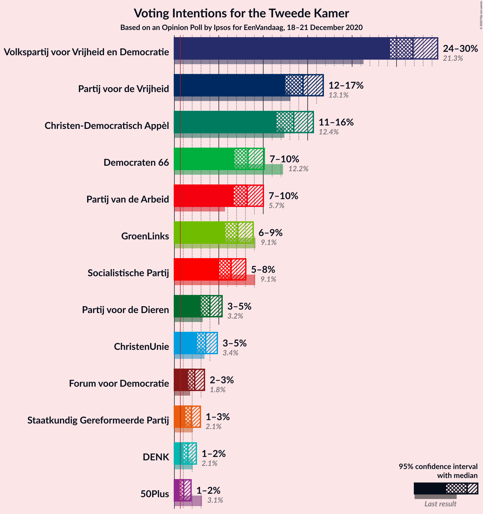

### Confidence Intervals

| Party | Last Result | Poll Result | 80% Confidence Interval | 90% Confidence Interval | 95% Confidence Interval | 99% Confidence Interval |
|:-----:|:-----------:|:-----------:|:-----------------------:|:-----------------------:|:-----------------------:|:-----------------------:|
| Volkspartij voor Vrijheid en Democratie | 21.3% | 26.9% | 25.1–28.7% |24.7–29.2% |24.3–29.6% |23.5–30.5% |
| Partij voor de Vrijheid | 13.1% | 14.5% | 13.2–16.0% |12.8–16.4% |12.5–16.8% |11.9–17.5% |
| Christen-Democratisch Appèl | 12.4% | 13.4% | 12.2–14.9% |11.8–15.3% |11.5–15.6% |10.9–16.3% |
| Democraten 66 | 12.2% | 8.3% | 7.3–9.5% |7.0–9.8% |6.8–10.1% |6.3–10.7% |
| Partij van de Arbeid | 5.7% | 8.2% | 7.2–9.4% |6.9–9.7% |6.7–10.0% |6.2–10.6% |
| GroenLinks | 9.1% | 7.1% | 6.2–8.3% |6.0–8.6% |5.7–8.9% |5.3–9.4% |
| Socialistische Partij | 9.1% | 6.4% | 5.5–7.5% |5.3–7.8% |5.0–8.0% |4.7–8.6% |
| Partij voor de Dieren | 3.2% | 4.0% | 3.3–4.9% |3.1–5.2% |3.0–5.4% |2.7–5.8% |
| ChristenUnie | 3.4% | 3.5% | 2.9–4.4% |2.7–4.6% |2.6–4.8% |2.3–5.3% |
| Forum voor Democratie | 1.8% | 2.3% | 1.8–3.0% |1.6–3.2% |1.5–3.4% |1.3–3.8% |
| Staatkundig Gereformeerde Partij | 2.1% | 1.9% | 1.5–2.6% |1.3–2.8% |1.2–2.9% |1.1–3.3% |
| DENK | 2.1% | 1.5% | 1.1–2.1% |1.0–2.3% |0.9–2.5% |0.8–2.8% |
| 50Plus | 3.1% | 1.0% | 0.7–1.6% |0.7–1.7% |0.6–1.9% |0.5–2.2% |

*Note:* The poll result column reflects the actual value used in the calculations. Published results may vary slightly, and in addition be rounded to fewer digits.

## Seats

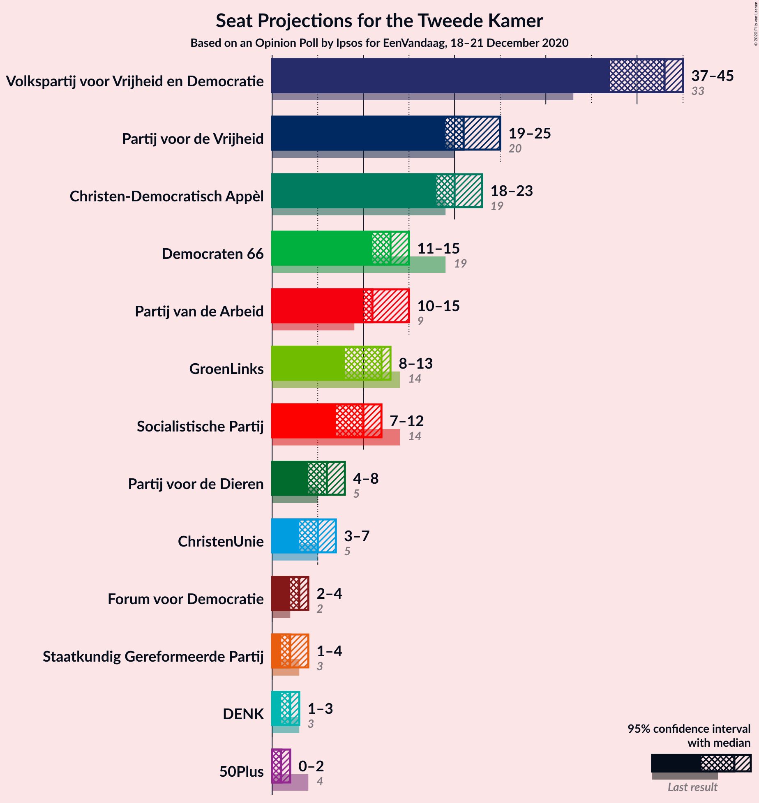

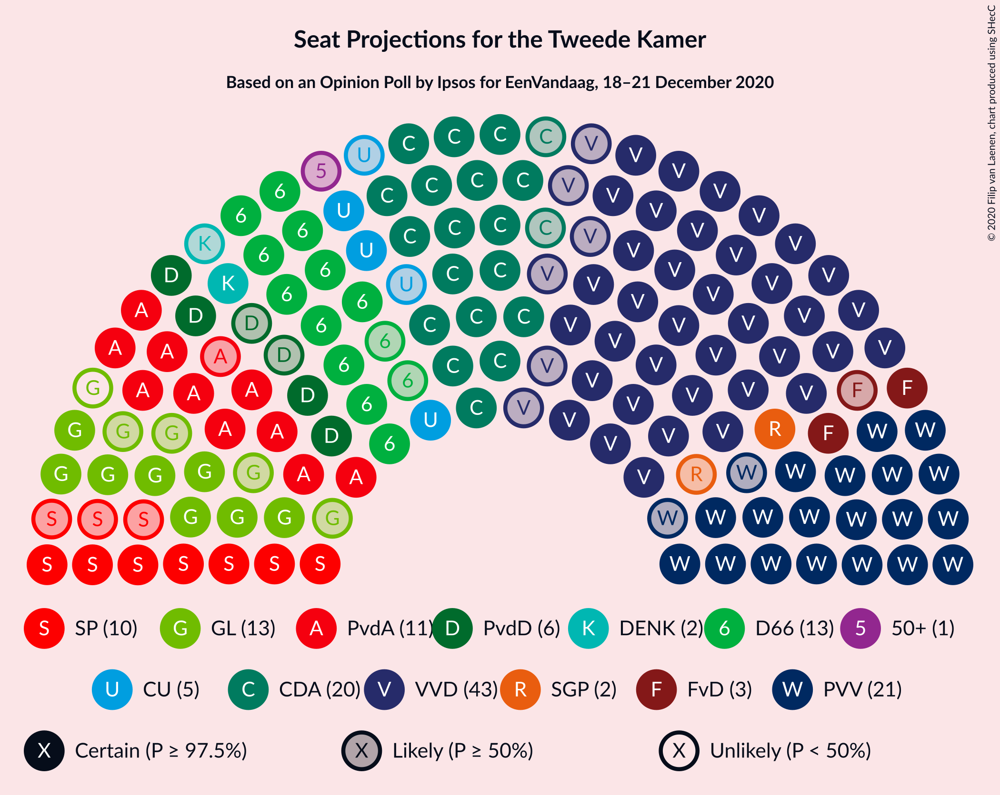

### Confidence Intervals

| Party | Last Result | Median | 80% Confidence Interval | 90% Confidence Interval | 95% Confidence Interval | 99% Confidence Interval |
|:-----:|:-----------:|:------:|:-----------------------:|:-----------------------:|:-----------------------:|:-----------------------:|
| <a href="#volkspartij-voor-vrijheid-en-democratie">Volkspartij voor Vrijheid en Democratie</a> | 33 | 43 | 38–45 |38–45 |37–45 |35–46 |
| <a href="#partij-voor-de-vrijheid">Partij voor de Vrijheid</a> | 20 | 21 | 20–23 |20–24 |19–25 |18–26 |
| <a href="#christen-democratisch-appèl">Christen-Democratisch Appèl</a> | 19 | 20 | 18–22 |18–23 |18–23 |17–25 |
| <a href="#democraten-66">Democraten 66</a> | 19 | 13 | 12–14 |11–15 |11–15 |9–16 |
| <a href="#partij-van-de-arbeid">Partij van de Arbeid</a> | 9 | 11 | 11–15 |11–15 |10–15 |9–16 |
| <a href="#groenlinks">GroenLinks</a> | 14 | 12 | 9–13 |9–13 |8–13 |8–15 |
| <a href="#socialistische-partij">Socialistische Partij</a> | 14 | 10 | 7–10 |7–11 |7–12 |7–13 |
| <a href="#partij-voor-de-dieren">Partij voor de Dieren</a> | 5 | 6 | 5–8 |5–8 |4–8 |3–8 |
| <a href="#christenunie">ChristenUnie</a> | 5 | 5 | 3–6 |3–7 |3–7 |3–8 |
| <a href="#forum-voor-democratie">Forum voor Democratie</a> | 2 | 3 | 3–4 |3–4 |2–4 |1–5 |
| <a href="#staatkundig-gereformeerde-partij">Staatkundig Gereformeerde Partij</a> | 3 | 2 | 2–3 |2–3 |1–4 |1–4 |
| <a href="#denk">DENK</a> | 3 | 2 | 1–3 |1–3 |1–3 |1–4 |
| <a href="#50plus">50Plus</a> | 4 | 1 | 1–2 |1–2 |0–2 |0–3 |

### Volkspartij voor Vrijheid en Democratie

*For a full overview of the results for this party, see the [Volkspartij voor Vrijheid en Democratie](party-volkspartijvoorvrijheidendemocratie.html) page.*

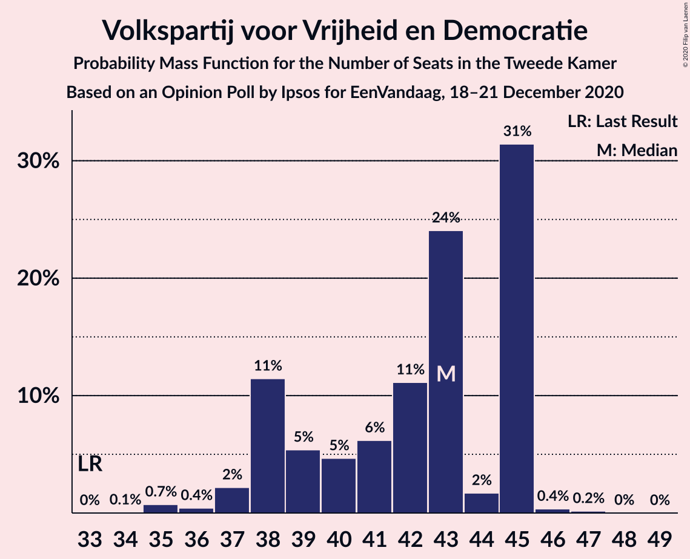

| Number of Seats | Probability | Accumulated | Special Marks |
|:---------------:|:-----------:|:-----------:|:-------------:|
| 33 | 0% | 100% | Last Result |
| 34 | 0.1% | 100% |  |
| 35 | 0.7% | 99.9% |  |
| 36 | 0.4% | 99.2% |  |
| 37 | 2% | 98.8% |  |
| 38 | 11% | 97% |  |
| 39 | 5% | 85% |  |
| 40 | 5% | 80% |  |
| 41 | 6% | 75% |  |
| 42 | 11% | 69% |  |
| 43 | 24% | 58% | Median |
| 44 | 2% | 34% |  |
| 45 | 31% | 32% |  |
| 46 | 0.4% | 0.6% |  |
| 47 | 0.2% | 0.2% |  |
| 48 | 0% | 0.1% |  |
| 49 | 0% | 0% |  |

### Partij voor de Vrijheid

*For a full overview of the results for this party, see the [Partij voor de Vrijheid](party-partijvoordevrijheid.html) page.*

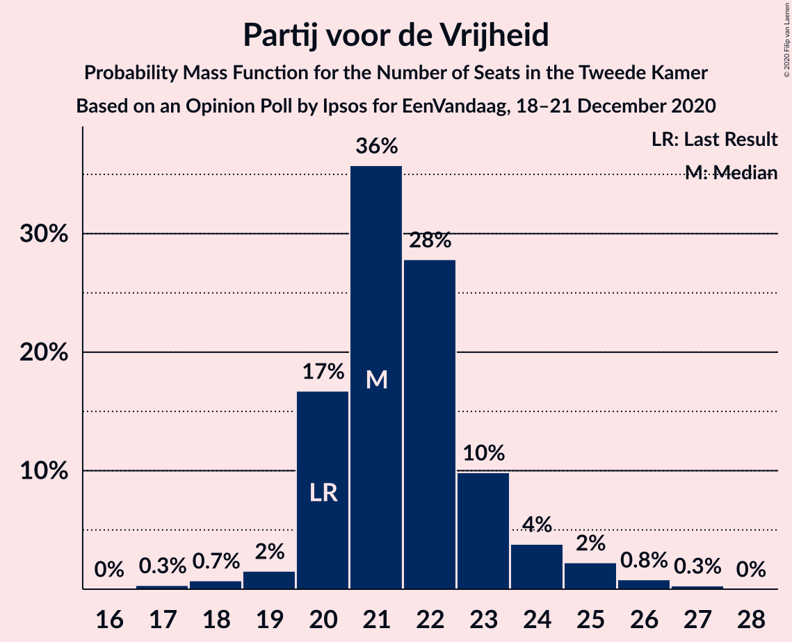

| Number of Seats | Probability | Accumulated | Special Marks |
|:---------------:|:-----------:|:-----------:|:-------------:|
| 17 | 0.3% | 100% |  |
| 18 | 0.7% | 99.6% |  |
| 19 | 2% | 98.9% |  |
| 20 | 17% | 97% | Last Result |
| 21 | 36% | 81% | Median |
| 22 | 28% | 45% |  |
| 23 | 10% | 17% |  |
| 24 | 4% | 7% |  |
| 25 | 2% | 3% |  |
| 26 | 0.8% | 1.1% |  |
| 27 | 0.3% | 0.3% |  |
| 28 | 0% | 0% |  |

### Christen-Democratisch Appèl

*For a full overview of the results for this party, see the [Christen-Democratisch Appèl](party-christen-democratischappèl.html) page.*

| Number of Seats | Probability | Accumulated | Special Marks |
|:---------------:|:-----------:|:-----------:|:-------------:|
| 15 | 0.1% | 100% |  |
| 16 | 0.2% | 99.9% |  |
| 17 | 0.9% | 99.8% |  |
| 18 | 39% | 98.9% |  |
| 19 | 4% | 60% | Last Result |
| 20 | 28% | 56% | Median |
| 21 | 17% | 28% |  |
| 22 | 4% | 11% |  |
| 23 | 5% | 7% |  |
| 24 | 1.4% | 2% |  |
| 25 | 0.6% | 0.7% |  |
| 26 | 0% | 0.1% |  |
| 27 | 0% | 0% |  |

### Democraten 66

*For a full overview of the results for this party, see the [Democraten 66](party-democraten66.html) page.*

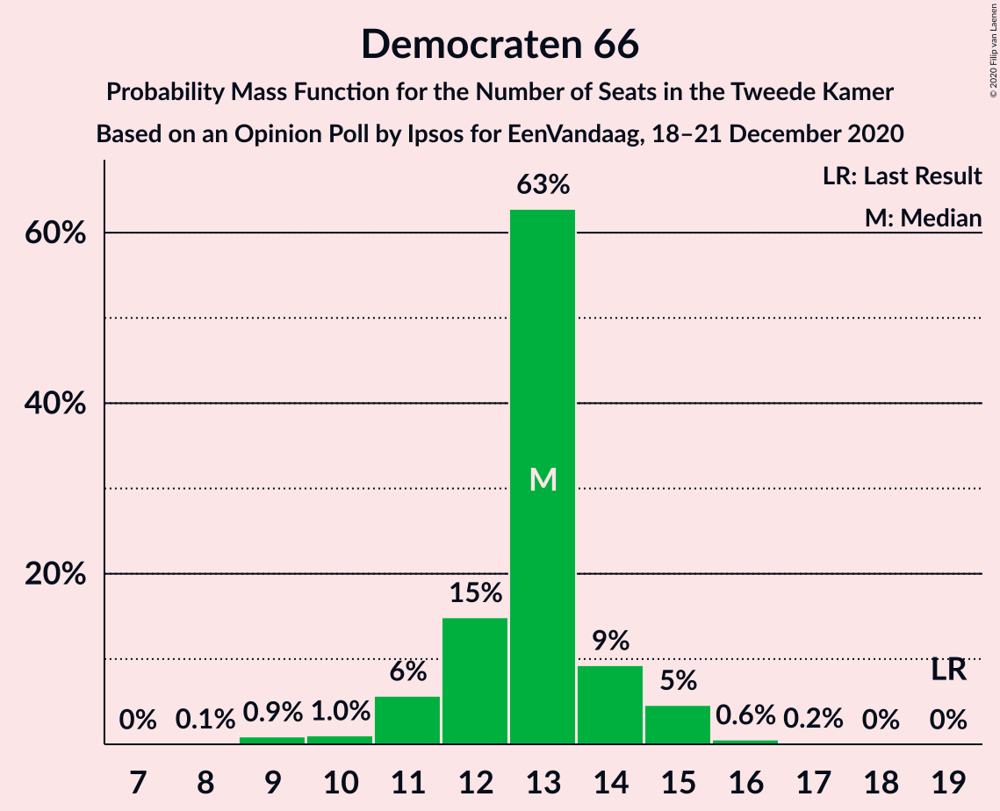

| Number of Seats | Probability | Accumulated | Special Marks |
|:---------------:|:-----------:|:-----------:|:-------------:|
| 8 | 0.1% | 100% |  |
| 9 | 0.9% | 99.9% |  |
| 10 | 1.0% | 99.0% |  |
| 11 | 6% | 98% |  |
| 12 | 15% | 92% |  |
| 13 | 63% | 77% | Median |
| 14 | 9% | 15% |  |
| 15 | 5% | 5% |  |
| 16 | 0.6% | 0.7% |  |
| 17 | 0.2% | 0.2% |  |
| 18 | 0% | 0% |  |
| 19 | 0% | 0% | Last Result |

### Partij van de Arbeid

*For a full overview of the results for this party, see the [Partij van de Arbeid](party-partijvandearbeid.html) page.*

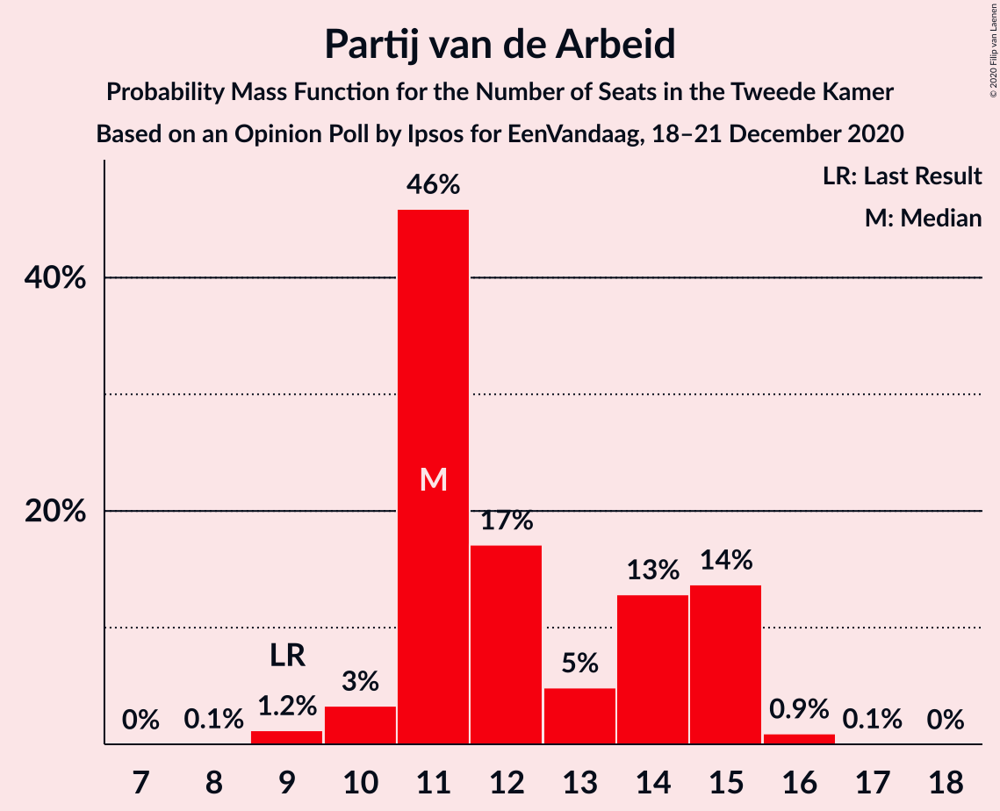

| Number of Seats | Probability | Accumulated | Special Marks |
|:---------------:|:-----------:|:-----------:|:-------------:|
| 8 | 0.1% | 100% |  |
| 9 | 1.2% | 99.9% | Last Result |
| 10 | 3% | 98.7% |  |
| 11 | 46% | 95% | Median |
| 12 | 17% | 50% |  |
| 13 | 5% | 32% |  |
| 14 | 13% | 28% |  |
| 15 | 14% | 15% |  |
| 16 | 0.9% | 1.0% |  |
| 17 | 0.1% | 0.1% |  |
| 18 | 0% | 0% |  |

### GroenLinks

*For a full overview of the results for this party, see the [GroenLinks](party-groenlinks.html) page.*

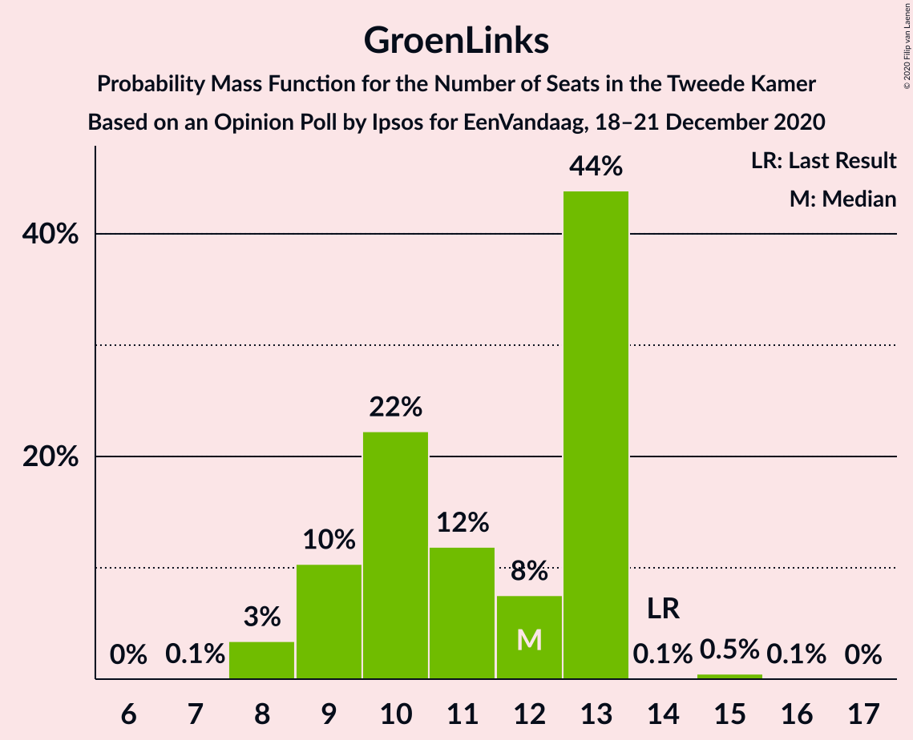

| Number of Seats | Probability | Accumulated | Special Marks |
|:---------------:|:-----------:|:-----------:|:-------------:|
| 7 | 0.1% | 100% |  |
| 8 | 3% | 99.9% |  |
| 9 | 10% | 97% |  |
| 10 | 22% | 86% |  |
| 11 | 12% | 64% |  |
| 12 | 8% | 52% | Median |
| 13 | 44% | 44% |  |
| 14 | 0.1% | 0.6% | Last Result |
| 15 | 0.5% | 0.5% |  |
| 16 | 0.1% | 0.1% |  |
| 17 | 0% | 0% |  |

### Socialistische Partij

*For a full overview of the results for this party, see the [Socialistische Partij](party-socialistischepartij.html) page.*

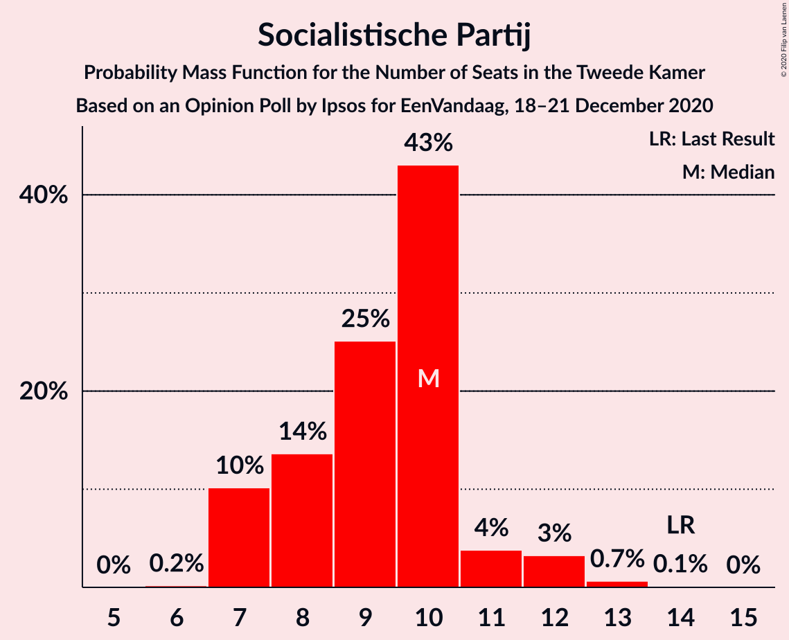

| Number of Seats | Probability | Accumulated | Special Marks |
|:---------------:|:-----------:|:-----------:|:-------------:|
| 6 | 0.2% | 100% |  |
| 7 | 10% | 99.8% |  |
| 8 | 14% | 90% |  |
| 9 | 25% | 76% |  |
| 10 | 43% | 51% | Median |
| 11 | 4% | 8% |  |
| 12 | 3% | 4% |  |
| 13 | 0.7% | 0.8% |  |
| 14 | 0.1% | 0.1% | Last Result |
| 15 | 0% | 0% |  |

### Partij voor de Dieren

*For a full overview of the results for this party, see the [Partij voor de Dieren](party-partijvoordedieren.html) page.*

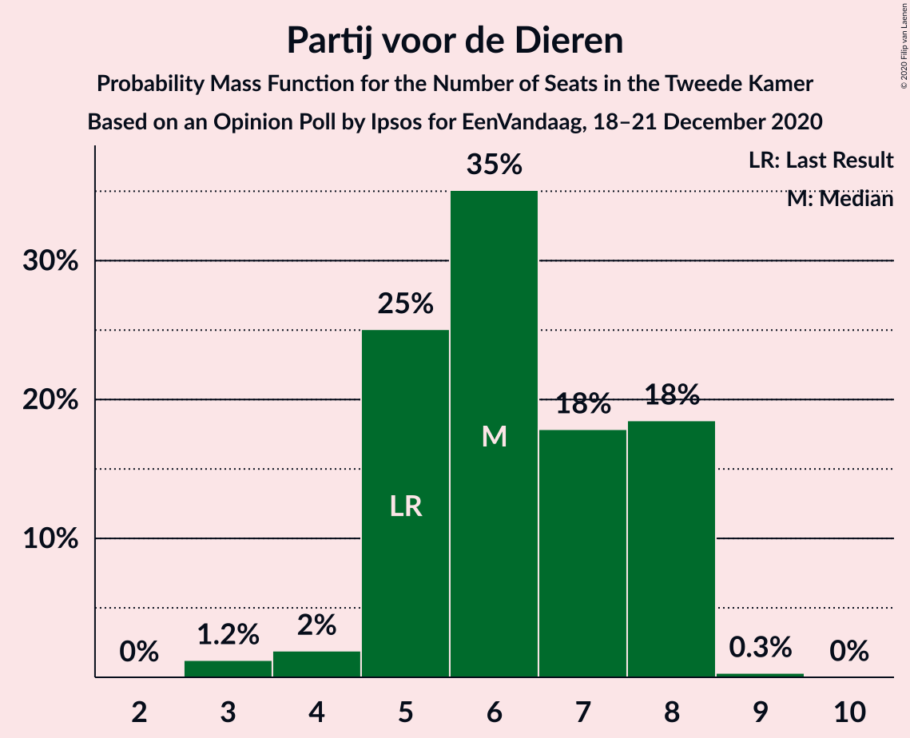

| Number of Seats | Probability | Accumulated | Special Marks |
|:---------------:|:-----------:|:-----------:|:-------------:|
| 3 | 1.2% | 100% |  |
| 4 | 2% | 98.8% |  |
| 5 | 25% | 97% | Last Result |
| 6 | 35% | 72% | Median |
| 7 | 18% | 37% |  |
| 8 | 18% | 19% |  |
| 9 | 0.3% | 0.4% |  |
| 10 | 0% | 0% |  |

### ChristenUnie

*For a full overview of the results for this party, see the [ChristenUnie](party-christenunie.html) page.*

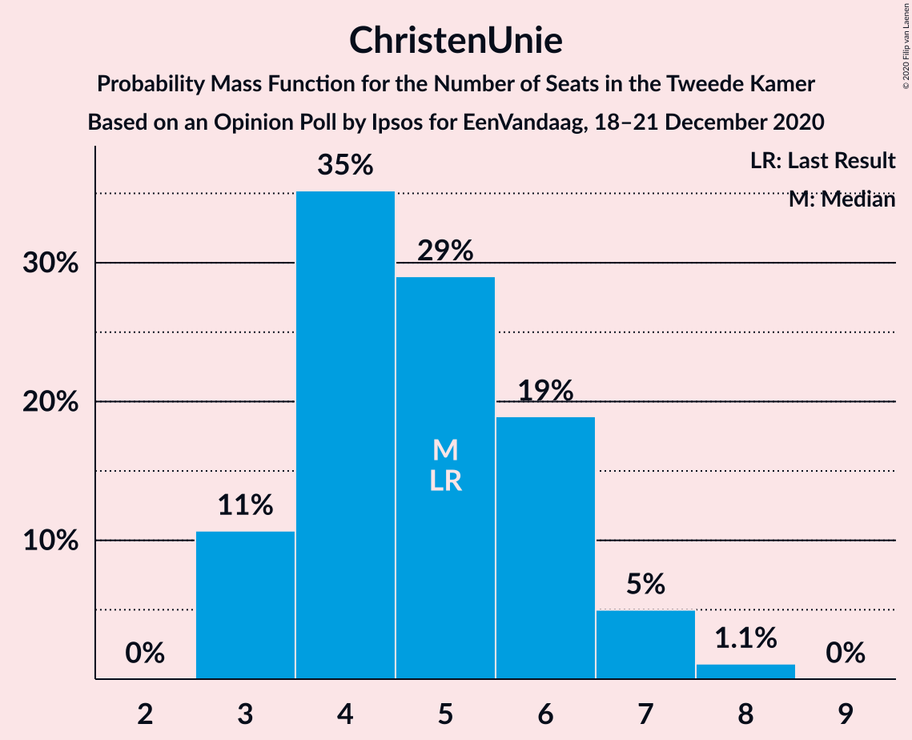

| Number of Seats | Probability | Accumulated | Special Marks |
|:---------------:|:-----------:|:-----------:|:-------------:|
| 3 | 11% | 100% |  |
| 4 | 35% | 89% |  |
| 5 | 29% | 54% | Last Result, Median |
| 6 | 19% | 25% |  |
| 7 | 5% | 6% |  |
| 8 | 1.1% | 1.1% |  |
| 9 | 0% | 0% |  |

### Forum voor Democratie

*For a full overview of the results for this party, see the [Forum voor Democratie](party-forumvoordemocratie.html) page.*

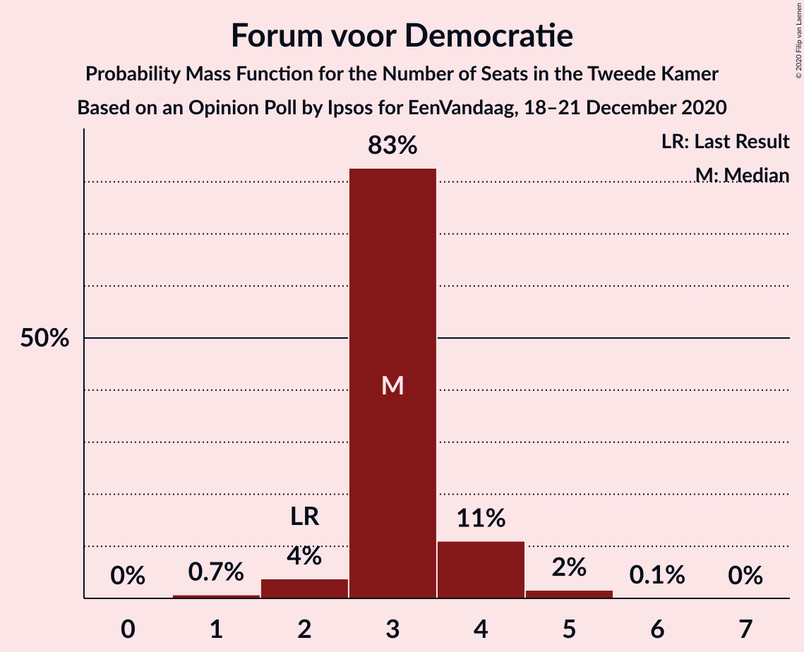

| Number of Seats | Probability | Accumulated | Special Marks |
|:---------------:|:-----------:|:-----------:|:-------------:|
| 1 | 0.7% | 100% |  |
| 2 | 4% | 99.3% | Last Result |
| 3 | 83% | 95% | Median |
| 4 | 11% | 13% |  |
| 5 | 2% | 2% |  |
| 6 | 0.1% | 0.2% |  |
| 7 | 0% | 0% |  |

### Staatkundig Gereformeerde Partij

*For a full overview of the results for this party, see the [Staatkundig Gereformeerde Partij](party-staatkundiggereformeerdepartij.html) page.*

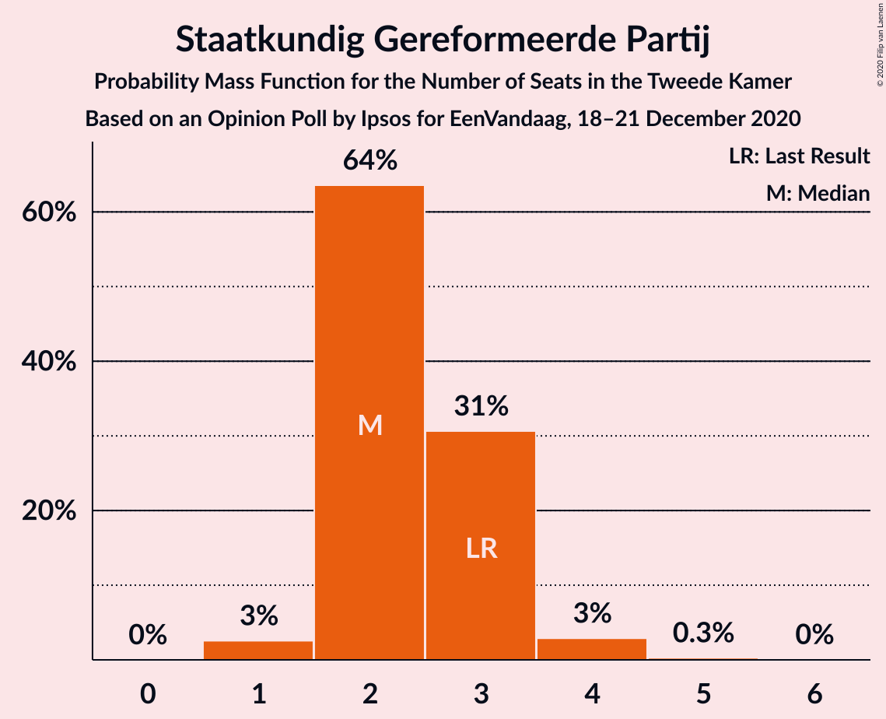

| Number of Seats | Probability | Accumulated | Special Marks |
|:---------------:|:-----------:|:-----------:|:-------------:|
| 1 | 3% | 100% |  |
| 2 | 64% | 97% | Median |
| 3 | 31% | 34% | Last Result |
| 4 | 3% | 3% |  |
| 5 | 0.3% | 0.3% |  |
| 6 | 0% | 0% |  |

### DENK

*For a full overview of the results for this party, see the [DENK](party-denk.html) page.*

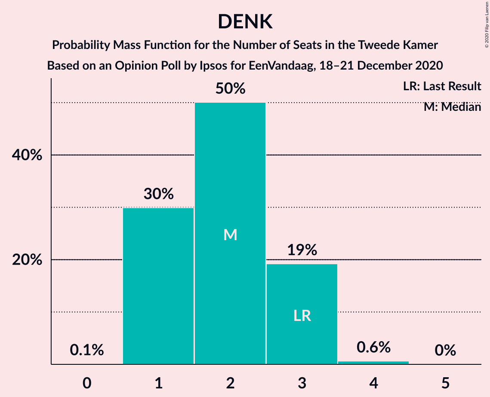

| Number of Seats | Probability | Accumulated | Special Marks |
|:---------------:|:-----------:|:-----------:|:-------------:|
| 0 | 0.1% | 100% |  |
| 1 | 30% | 99.9% |  |
| 2 | 50% | 70% | Median |
| 3 | 19% | 20% | Last Result |
| 4 | 0.6% | 0.7% |  |
| 5 | 0% | 0% |  |

### 50Plus

*For a full overview of the results for this party, see the [50Plus](party-50plus.html) page.*

| Number of Seats | Probability | Accumulated | Special Marks |
|:---------------:|:-----------:|:-----------:|:-------------:|
| 0 | 4% | 100% |  |
| 1 | 65% | 96% | Median |
| 2 | 30% | 31% |  |
| 3 | 1.4% | 1.4% |  |
| 4 | 0% | 0% | Last Result |

## Coalitions

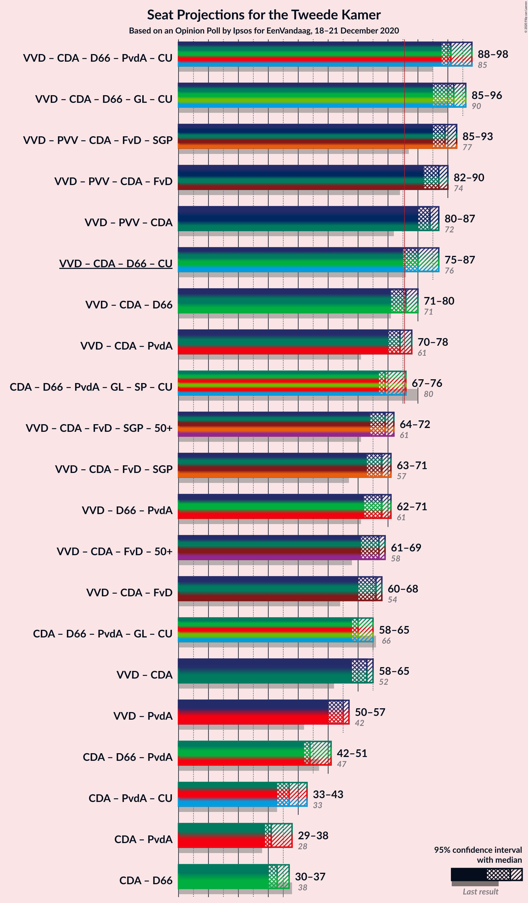

### Confidence Intervals

| Coalition | Last Result | Median | Majority? | 80% Confidence Interval | 90% Confidence Interval | 95% Confidence Interval | 99% Confidence Interval |
|:---------:|:-----------:|:------:|:---------:|:-----------------------:|:-----------------------:|:-----------------------:|:-----------------------:|
| Volkspartij voor Vrijheid en Democratie – Christen-Democratisch Appèl – Democraten 66 – Partij van de Arbeid – ChristenUnie | 85 | 91 | 100% | 90–94 | 90–95 | 88–98 | 86–98 |
| Volkspartij voor Vrijheid en Democratie – Christen-Democratisch Appèl – Democraten 66 – GroenLinks – ChristenUnie | 90 | 92 | 100% | 87–93 | 86–95 | 85–96 | 84–96 |
| Volkspartij voor Vrijheid en Democratie – Partij voor de Vrijheid – Christen-Democratisch Appèl – Forum voor Democratie – Staatkundig Gereformeerde Partij | 77 | 89 | 100% | 86–90 | 86–91 | 85–93 | 83–94 |
| Volkspartij voor Vrijheid en Democratie – Partij voor de Vrijheid – Christen-Democratisch Appèl – Forum voor Democratie | 74 | 87 | 100% | 84–88 | 83–89 | 82–90 | 80–92 |
| Volkspartij voor Vrijheid en Democratie – Partij voor de Vrijheid – Christen-Democratisch Appèl | 72 | 84 | 99.8% | 81–85 | 80–86 | 80–87 | 77–89 |
| Volkspartij voor Vrijheid en Democratie – Christen-Democratisch Appèl – Democraten 66 – ChristenUnie | 76 | 80 | 97% | 76–82 | 76–84 | 75–87 | 74–87 |
| Volkspartij voor Vrijheid en Democratie – Christen-Democratisch Appèl – Democraten 66 | 71 | 76 | 51% | 71–76 | 71–78 | 71–80 | 69–80 |
| Volkspartij voor Vrijheid en Democratie – Christen-Democratisch Appèl – Partij van de Arbeid | 61 | 74 | 19% | 72–77 | 71–78 | 70–78 | 68–79 |
| Christen-Democratisch Appèl – Democraten 66 – Partij van de Arbeid – GroenLinks – Socialistische Partij – ChristenUnie | 80 | 69 | 4% | 68–73 | 67–75 | 67–76 | 65–77 |
| Volkspartij voor Vrijheid en Democratie – Christen-Democratisch Appèl – Forum voor Democratie – Staatkundig Gereformeerde Partij – 50Plus | 61 | 69 | 0.1% | 65–71 | 65–71 | 64–72 | 62–74 |
| Volkspartij voor Vrijheid en Democratie – Christen-Democratisch Appèl – Forum voor Democratie – Staatkundig Gereformeerde Partij | 57 | 68 | 0% | 63–69 | 63–70 | 63–71 | 61–72 |
| Volkspartij voor Vrijheid en Democratie – Democraten 66 – Partij van de Arbeid | 61 | 68 | 0% | 65–69 | 64–69 | 62–71 | 60–73 |
| Volkspartij voor Vrijheid en Democratie – Christen-Democratisch Appèl – Forum voor Democratie – 50Plus | 58 | 67 | 0% | 63–68 | 63–69 | 61–69 | 60–71 |
| Volkspartij voor Vrijheid en Democratie – Christen-Democratisch Appèl – Forum voor Democratie | 54 | 66 | 0% | 61–66 | 61–68 | 60–68 | 59–69 |
| Christen-Democratisch Appèl – Democraten 66 – Partij van de Arbeid – GroenLinks – ChristenUnie | 66 | 60 | 0% | 59–65 | 58–65 | 58–65 | 55–68 |
| Volkspartij voor Vrijheid en Democratie – Christen-Democratisch Appèl | 52 | 63 | 0% | 58–63 | 58–65 | 58–65 | 56–67 |
| Volkspartij voor Vrijheid en Democratie – Partij van de Arbeid | 42 | 55 | 0% | 52–57 | 50–57 | 50–57 | 47–58 |
| Christen-Democratisch Appèl – Democraten 66 – Partij van de Arbeid | 47 | 44 | 0% | 42–48 | 42–49 | 42–51 | 40–51 |
| Christen-Democratisch Appèl – Partij van de Arbeid – ChristenUnie | 33 | 37 | 0% | 33–40 | 33–41 | 33–43 | 33–43 |
| Christen-Democratisch Appèl – Partij van de Arbeid | 28 | 31 | 0% | 29–36 | 29–36 | 29–38 | 29–38 |
| Christen-Democratisch Appèl – Democraten 66 | 38 | 33 | 0% | 31–35 | 31–36 | 30–37 | 28–39 |

### Volkspartij voor Vrijheid en Democratie – Christen-Democratisch Appèl – Democraten 66 – Partij van de Arbeid – ChristenUnie

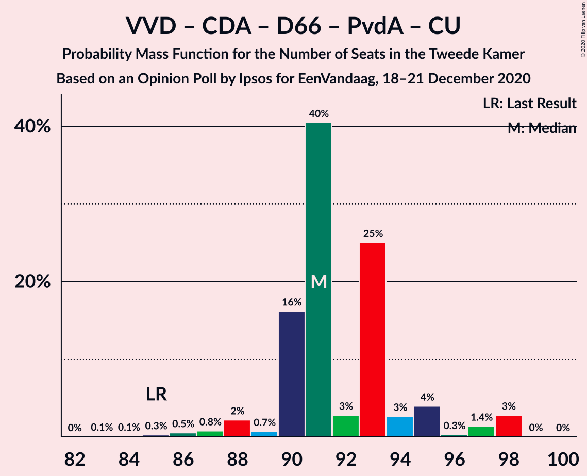

| Number of Seats | Probability | Accumulated | Special Marks |
|:---------------:|:-----------:|:-----------:|:-------------:|
| 83 | 0.1% | 100% |  |
| 84 | 0.1% | 99.9% |  |
| 85 | 0.3% | 99.9% | Last Result |
| 86 | 0.5% | 99.6% |  |
| 87 | 0.8% | 99.1% |  |
| 88 | 2% | 98% |  |
| 89 | 0.7% | 96% |  |
| 90 | 16% | 95% |  |
| 91 | 40% | 79% |  |
| 92 | 3% | 39% | Median |
| 93 | 25% | 36% |  |
| 94 | 3% | 11% |  |
| 95 | 4% | 8% |  |
| 96 | 0.3% | 4% |  |
| 97 | 1.4% | 4% |  |
| 98 | 3% | 3% |  |
| 99 | 0% | 0% |  |

### Volkspartij voor Vrijheid en Democratie – Christen-Democratisch Appèl – Democraten 66 – GroenLinks – ChristenUnie

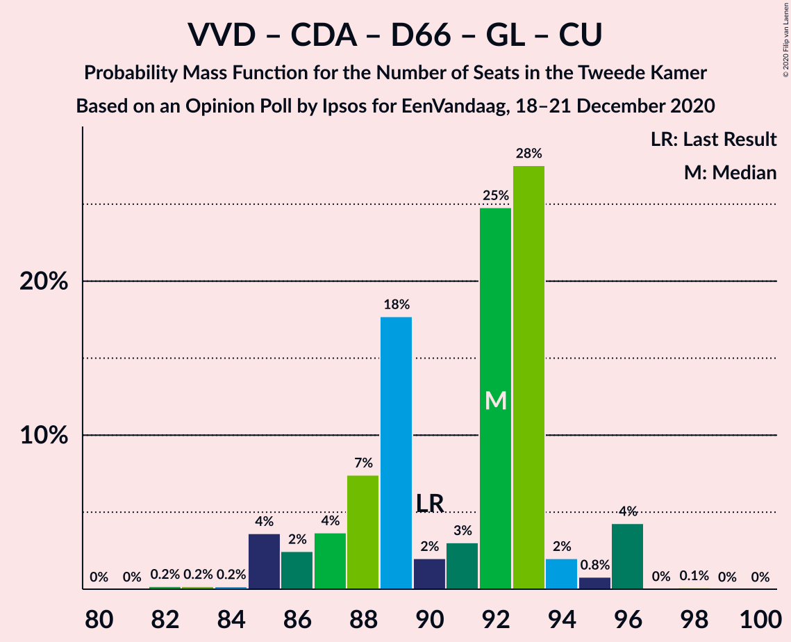

| Number of Seats | Probability | Accumulated | Special Marks |
|:---------------:|:-----------:|:-----------:|:-------------:|
| 82 | 0.2% | 100% |  |
| 83 | 0.2% | 99.8% |  |
| 84 | 0.2% | 99.6% |  |
| 85 | 4% | 99.4% |  |
| 86 | 2% | 96% |  |
| 87 | 4% | 93% |  |
| 88 | 7% | 90% |  |
| 89 | 18% | 82% |  |
| 90 | 2% | 65% | Last Result |
| 91 | 3% | 63% |  |
| 92 | 25% | 60% |  |
| 93 | 28% | 35% | Median |
| 94 | 2% | 7% |  |
| 95 | 0.8% | 5% |  |
| 96 | 4% | 4% |  |
| 97 | 0% | 0.1% |  |
| 98 | 0.1% | 0.1% |  |
| 99 | 0% | 0% |  |

### Volkspartij voor Vrijheid en Democratie – Partij voor de Vrijheid – Christen-Democratisch Appèl – Forum voor Democratie – Staatkundig Gereformeerde Partij

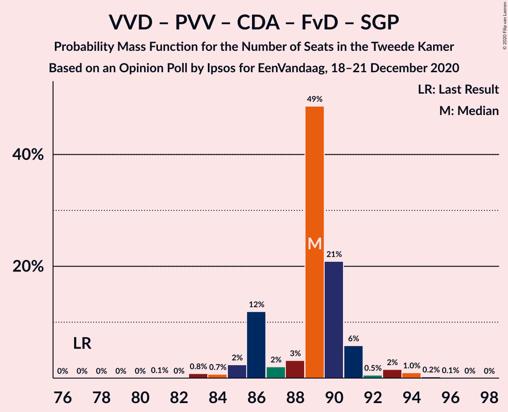

| Number of Seats | Probability | Accumulated | Special Marks |
|:---------------:|:-----------:|:-----------:|:-------------:|
| 77 | 0% | 100% | Last Result |
| 78 | 0% | 100% |  |
| 79 | 0% | 100% |  |
| 80 | 0% | 100% |  |
| 81 | 0.1% | 100% |  |
| 82 | 0% | 99.9% |  |
| 83 | 0.8% | 99.8% |  |
| 84 | 0.7% | 99.0% |  |
| 85 | 2% | 98% |  |
| 86 | 12% | 96% |  |
| 87 | 2% | 84% |  |
| 88 | 3% | 82% |  |
| 89 | 49% | 79% | Median |
| 90 | 21% | 30% |  |
| 91 | 6% | 9% |  |
| 92 | 0.5% | 3% |  |
| 93 | 2% | 3% |  |
| 94 | 1.0% | 1.4% |  |
| 95 | 0.2% | 0.4% |  |
| 96 | 0.1% | 0.2% |  |
| 97 | 0% | 0.1% |  |
| 98 | 0% | 0% |  |

### Volkspartij voor Vrijheid en Democratie – Partij voor de Vrijheid – Christen-Democratisch Appèl – Forum voor Democratie

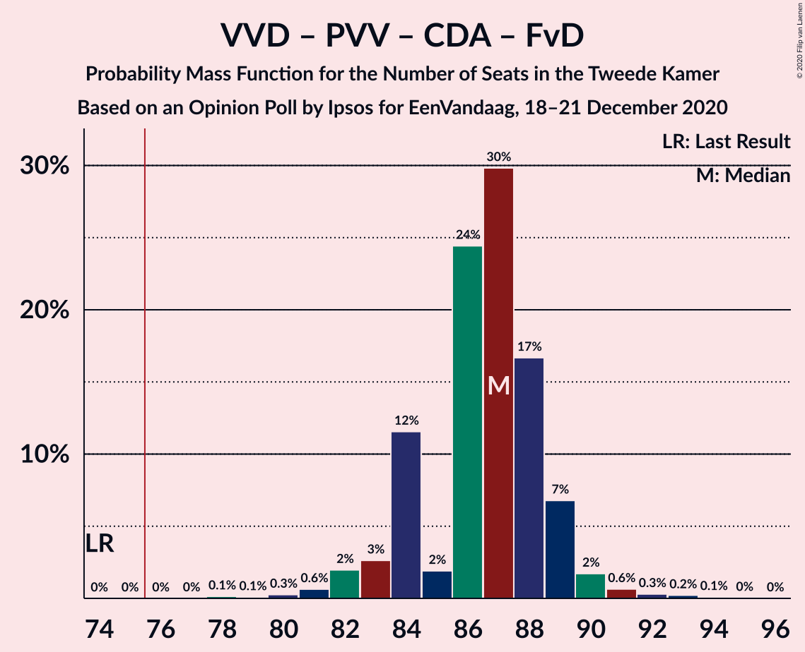

| Number of Seats | Probability | Accumulated | Special Marks |
|:---------------:|:-----------:|:-----------:|:-------------:|
| 74 | 0% | 100% | Last Result |
| 75 | 0% | 100% |  |
| 76 | 0% | 100% | Majority |
| 77 | 0% | 100% |  |
| 78 | 0.1% | 100% |  |
| 79 | 0.1% | 99.8% |  |
| 80 | 0.3% | 99.8% |  |
| 81 | 0.6% | 99.5% |  |
| 82 | 2% | 98.9% |  |
| 83 | 3% | 97% |  |
| 84 | 12% | 94% |  |
| 85 | 2% | 83% |  |
| 86 | 24% | 81% |  |
| 87 | 30% | 56% | Median |
| 88 | 17% | 27% |  |
| 89 | 7% | 10% |  |
| 90 | 2% | 3% |  |
| 91 | 0.6% | 1.3% |  |
| 92 | 0.3% | 0.7% |  |
| 93 | 0.2% | 0.4% |  |
| 94 | 0.1% | 0.2% |  |
| 95 | 0% | 0.1% |  |
| 96 | 0% | 0% |  |

### Volkspartij voor Vrijheid en Democratie – Partij voor de Vrijheid – Christen-Democratisch Appèl

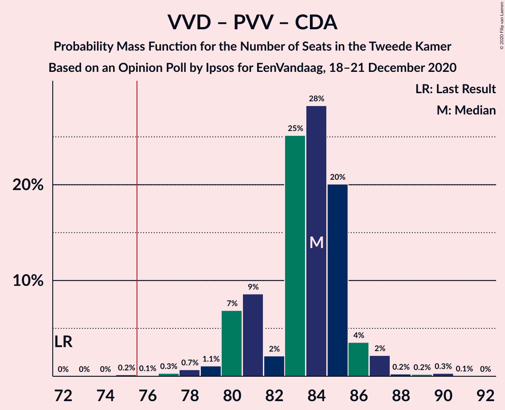

| Number of Seats | Probability | Accumulated | Special Marks |
|:---------------:|:-----------:|:-----------:|:-------------:|
| 72 | 0% | 100% | Last Result |
| 73 | 0% | 100% |  |
| 74 | 0% | 100% |  |
| 75 | 0.2% | 100% |  |
| 76 | 0.1% | 99.8% | Majority |
| 77 | 0.3% | 99.7% |  |
| 78 | 0.7% | 99.4% |  |
| 79 | 1.1% | 98.7% |  |
| 80 | 7% | 98% |  |
| 81 | 9% | 91% |  |
| 82 | 2% | 82% |  |
| 83 | 25% | 80% |  |
| 84 | 28% | 55% | Median |
| 85 | 20% | 27% |  |
| 86 | 4% | 7% |  |
| 87 | 2% | 3% |  |
| 88 | 0.2% | 0.8% |  |
| 89 | 0.2% | 0.6% |  |
| 90 | 0.3% | 0.4% |  |
| 91 | 0.1% | 0.1% |  |
| 92 | 0% | 0% |  |

### Volkspartij voor Vrijheid en Democratie – Christen-Democratisch Appèl – Democraten 66 – ChristenUnie

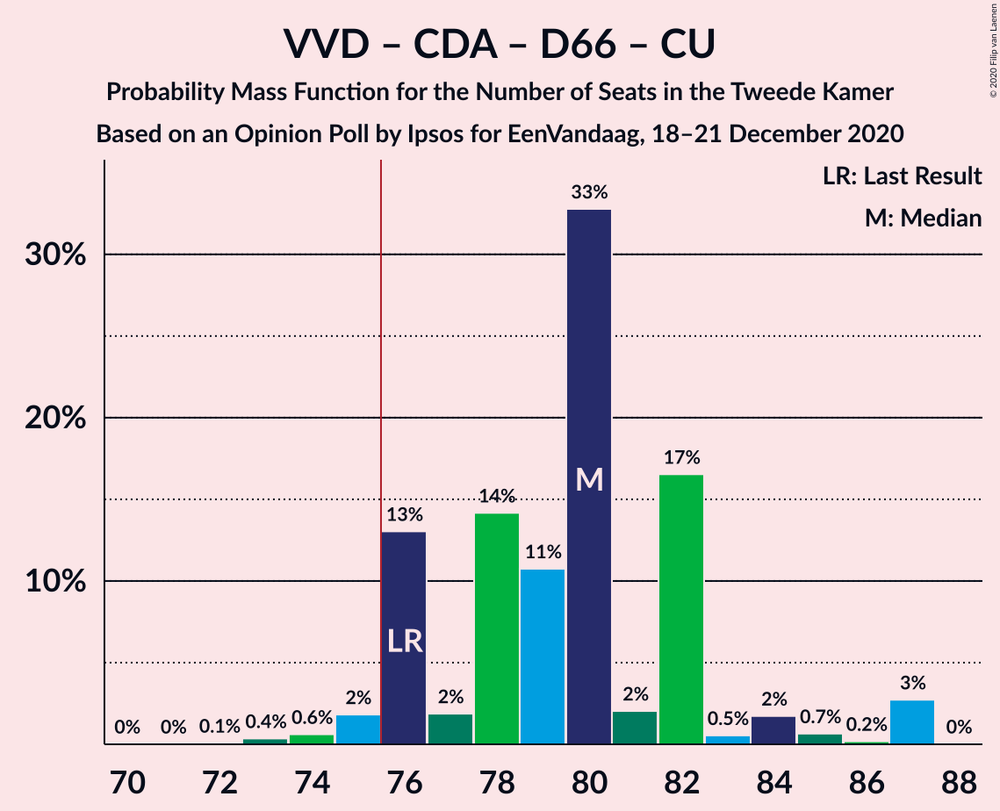

| Number of Seats | Probability | Accumulated | Special Marks |
|:---------------:|:-----------:|:-----------:|:-------------:|
| 72 | 0.1% | 100% |  |
| 73 | 0.4% | 99.9% |  |
| 74 | 0.6% | 99.5% |  |
| 75 | 2% | 98.9% |  |
| 76 | 13% | 97% | Last Result, Majority |
| 77 | 2% | 84% |  |
| 78 | 14% | 82% |  |
| 79 | 11% | 68% |  |
| 80 | 33% | 57% |  |
| 81 | 2% | 24% | Median |
| 82 | 17% | 22% |  |
| 83 | 0.5% | 6% |  |
| 84 | 2% | 5% |  |
| 85 | 0.7% | 4% |  |
| 86 | 0.2% | 3% |  |
| 87 | 3% | 3% |  |
| 88 | 0% | 0% |  |

### Volkspartij voor Vrijheid en Democratie – Christen-Democratisch Appèl – Democraten 66

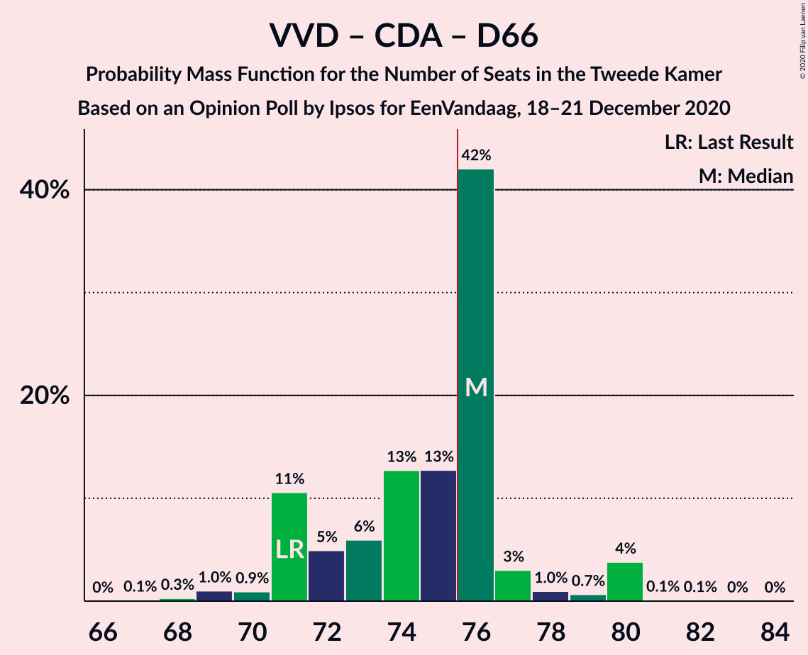

| Number of Seats | Probability | Accumulated | Special Marks |
|:---------------:|:-----------:|:-----------:|:-------------:|
| 67 | 0.1% | 100% |  |
| 68 | 0.3% | 99.8% |  |
| 69 | 1.0% | 99.6% |  |
| 70 | 0.9% | 98.6% |  |
| 71 | 11% | 98% | Last Result |
| 72 | 5% | 87% |  |
| 73 | 6% | 82% |  |
| 74 | 13% | 76% |  |
| 75 | 13% | 63% |  |
| 76 | 42% | 51% | Median, Majority |
| 77 | 3% | 9% |  |
| 78 | 1.0% | 6% |  |
| 79 | 0.7% | 5% |  |
| 80 | 4% | 4% |  |
| 81 | 0.1% | 0.2% |  |
| 82 | 0.1% | 0.1% |  |
| 83 | 0% | 0.1% |  |
| 84 | 0% | 0% |  |

### Volkspartij voor Vrijheid en Democratie – Christen-Democratisch Appèl – Partij van de Arbeid

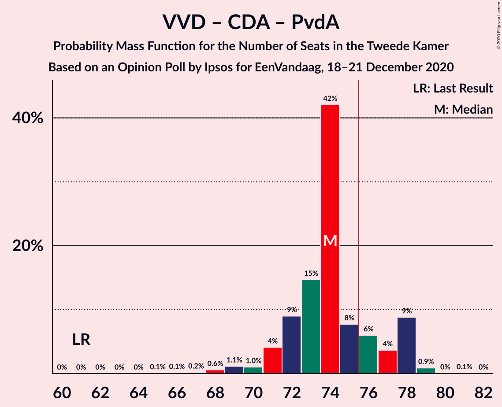

| Number of Seats | Probability | Accumulated | Special Marks |
|:---------------:|:-----------:|:-----------:|:-------------:|
| 61 | 0% | 100% | Last Result |
| 62 | 0% | 100% |  |
| 63 | 0% | 100% |  |
| 64 | 0% | 100% |  |
| 65 | 0.1% | 100% |  |
| 66 | 0.1% | 99.9% |  |
| 67 | 0.2% | 99.8% |  |
| 68 | 0.6% | 99.7% |  |
| 69 | 1.1% | 99.1% |  |
| 70 | 1.0% | 98% |  |
| 71 | 4% | 97% |  |
| 72 | 9% | 93% |  |
| 73 | 15% | 84% |  |
| 74 | 42% | 69% | Median |
| 75 | 8% | 27% |  |
| 76 | 6% | 19% | Majority |
| 77 | 4% | 13% |  |
| 78 | 9% | 10% |  |
| 79 | 0.9% | 1.0% |  |
| 80 | 0% | 0.1% |  |
| 81 | 0.1% | 0.1% |  |
| 82 | 0% | 0% |  |

### Christen-Democratisch Appèl – Democraten 66 – Partij van de Arbeid – GroenLinks – Socialistische Partij – ChristenUnie

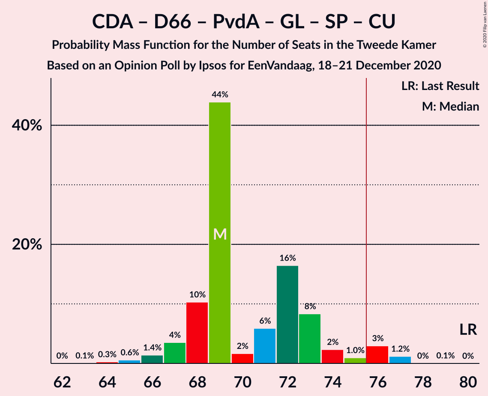

| Number of Seats | Probability | Accumulated | Special Marks |
|:---------------:|:-----------:|:-----------:|:-------------:|
| 63 | 0.1% | 100% |  |
| 64 | 0.3% | 99.9% |  |
| 65 | 0.6% | 99.6% |  |
| 66 | 1.4% | 99.1% |  |
| 67 | 4% | 98% |  |
| 68 | 10% | 94% |  |
| 69 | 44% | 84% |  |
| 70 | 2% | 40% |  |
| 71 | 6% | 38% | Median |
| 72 | 16% | 32% |  |
| 73 | 8% | 16% |  |
| 74 | 2% | 8% |  |
| 75 | 1.0% | 5% |  |
| 76 | 3% | 4% | Majority |
| 77 | 1.2% | 1.3% |  |
| 78 | 0% | 0.1% |  |
| 79 | 0.1% | 0.1% |  |
| 80 | 0% | 0% | Last Result |

### Volkspartij voor Vrijheid en Democratie – Christen-Democratisch Appèl – Forum voor Democratie – Staatkundig Gereformeerde Partij – 50Plus

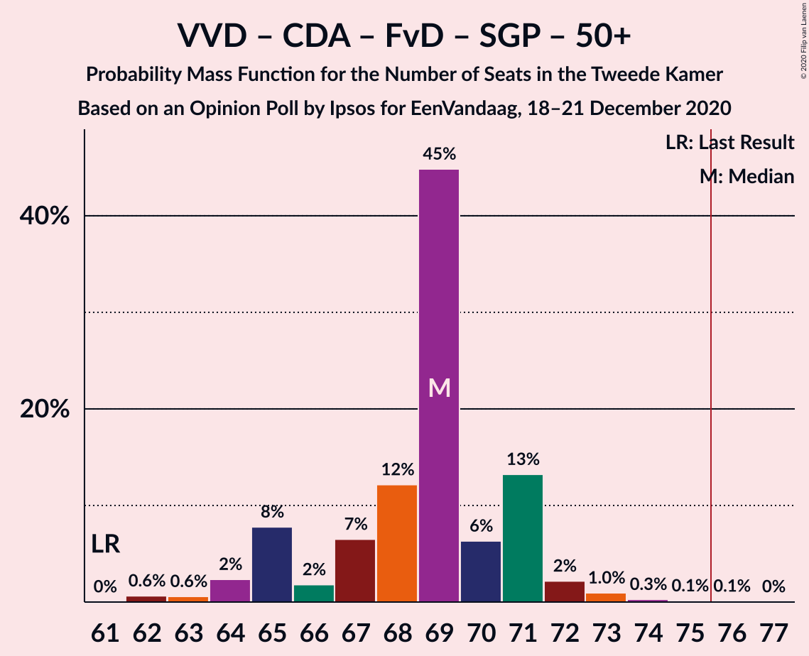

| Number of Seats | Probability | Accumulated | Special Marks |
|:---------------:|:-----------:|:-----------:|:-------------:|
| 61 | 0% | 100% | Last Result |
| 62 | 0.6% | 99.9% |  |
| 63 | 0.6% | 99.3% |  |
| 64 | 2% | 98.7% |  |
| 65 | 8% | 96% |  |
| 66 | 2% | 89% |  |
| 67 | 7% | 87% |  |
| 68 | 12% | 80% |  |
| 69 | 45% | 68% | Median |
| 70 | 6% | 23% |  |
| 71 | 13% | 17% |  |
| 72 | 2% | 4% |  |
| 73 | 1.0% | 2% |  |
| 74 | 0.3% | 0.6% |  |
| 75 | 0.1% | 0.3% |  |
| 76 | 0.1% | 0.1% | Majority |
| 77 | 0% | 0% |  |

### Volkspartij voor Vrijheid en Democratie – Christen-Democratisch Appèl – Forum voor Democratie – Staatkundig Gereformeerde Partij

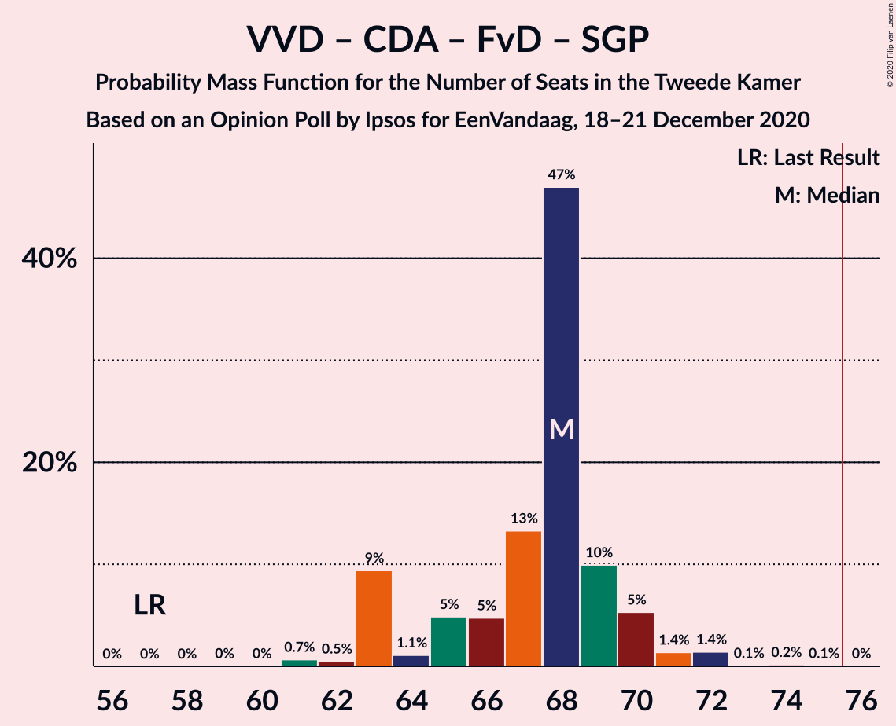

| Number of Seats | Probability | Accumulated | Special Marks |
|:---------------:|:-----------:|:-----------:|:-------------:|
| 57 | 0% | 100% | Last Result |
| 58 | 0% | 100% |  |
| 59 | 0% | 100% |  |
| 60 | 0% | 100% |  |
| 61 | 0.7% | 99.9% |  |
| 62 | 0.5% | 99.2% |  |
| 63 | 9% | 98.7% |  |
| 64 | 1.1% | 89% |  |
| 65 | 5% | 88% |  |
| 66 | 5% | 83% |  |
| 67 | 13% | 79% |  |
| 68 | 47% | 65% | Median |
| 69 | 10% | 18% |  |
| 70 | 5% | 8% |  |
| 71 | 1.4% | 3% |  |
| 72 | 1.4% | 2% |  |
| 73 | 0.1% | 0.3% |  |
| 74 | 0.2% | 0.3% |  |
| 75 | 0.1% | 0.1% |  |
| 76 | 0% | 0% | Majority |

### Volkspartij voor Vrijheid en Democratie – Democraten 66 – Partij van de Arbeid

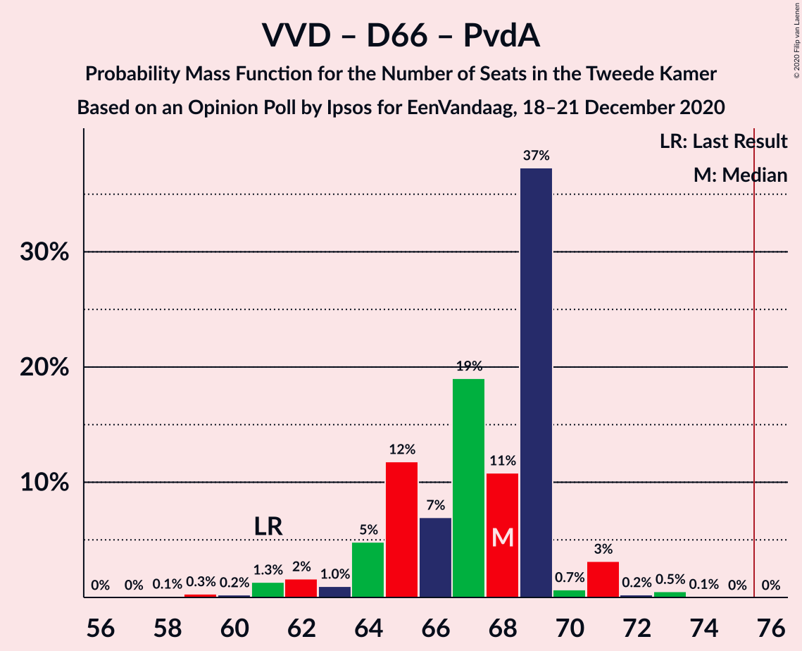

| Number of Seats | Probability | Accumulated | Special Marks |
|:---------------:|:-----------:|:-----------:|:-------------:|
| 58 | 0.1% | 100% |  |
| 59 | 0.3% | 99.9% |  |
| 60 | 0.2% | 99.6% |  |
| 61 | 1.3% | 99.3% | Last Result |
| 62 | 2% | 98% |  |
| 63 | 1.0% | 96% |  |
| 64 | 5% | 95% |  |
| 65 | 12% | 91% |  |
| 66 | 7% | 79% |  |
| 67 | 19% | 72% | Median |
| 68 | 11% | 53% |  |
| 69 | 37% | 42% |  |
| 70 | 0.7% | 5% |  |
| 71 | 3% | 4% |  |
| 72 | 0.2% | 0.9% |  |
| 73 | 0.5% | 0.6% |  |
| 74 | 0.1% | 0.1% |  |
| 75 | 0% | 0% |  |

### Volkspartij voor Vrijheid en Democratie – Christen-Democratisch Appèl – Forum voor Democratie – 50Plus

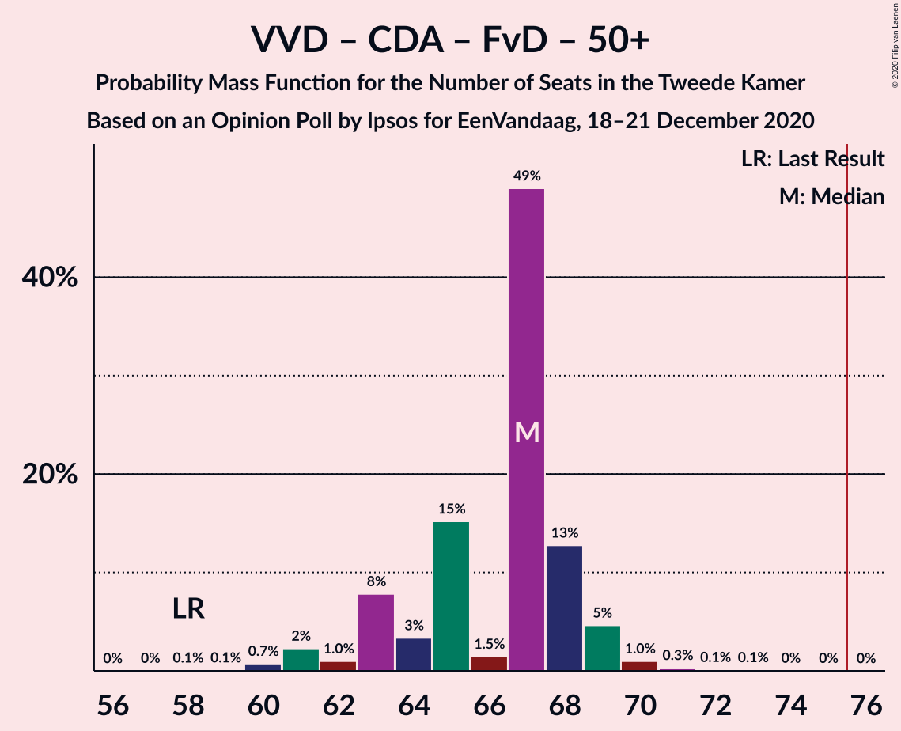

| Number of Seats | Probability | Accumulated | Special Marks |
|:---------------:|:-----------:|:-----------:|:-------------:|
| 58 | 0.1% | 100% | Last Result |
| 59 | 0.1% | 99.9% |  |
| 60 | 0.7% | 99.8% |  |
| 61 | 2% | 99.1% |  |
| 62 | 1.0% | 97% |  |
| 63 | 8% | 96% |  |
| 64 | 3% | 88% |  |
| 65 | 15% | 85% |  |
| 66 | 1.5% | 69% |  |
| 67 | 49% | 68% | Median |
| 68 | 13% | 19% |  |
| 69 | 5% | 6% |  |
| 70 | 1.0% | 2% |  |
| 71 | 0.3% | 0.6% |  |
| 72 | 0.1% | 0.3% |  |
| 73 | 0.1% | 0.2% |  |
| 74 | 0% | 0.1% |  |
| 75 | 0% | 0% |  |

### Volkspartij voor Vrijheid en Democratie – Christen-Democratisch Appèl – Forum voor Democratie

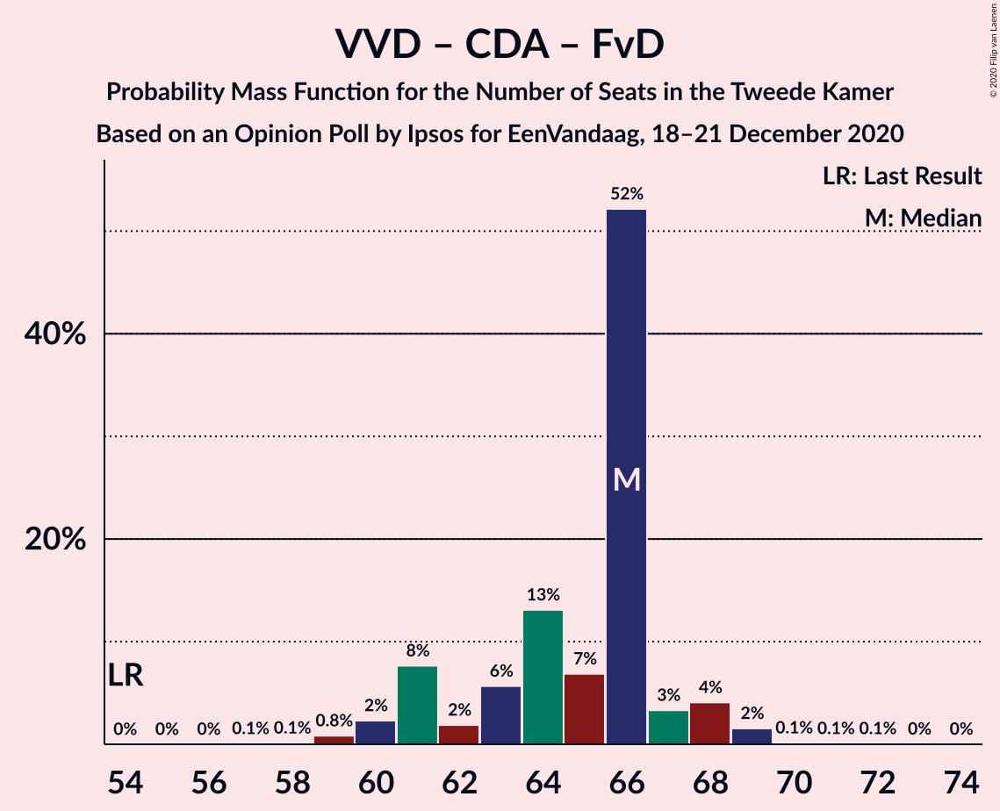

| Number of Seats | Probability | Accumulated | Special Marks |
|:---------------:|:-----------:|:-----------:|:-------------:|
| 54 | 0% | 100% | Last Result |
| 55 | 0% | 100% |  |
| 56 | 0% | 100% |  |
| 57 | 0.1% | 100% |  |
| 58 | 0.1% | 99.9% |  |
| 59 | 0.8% | 99.8% |  |
| 60 | 2% | 98.9% |  |
| 61 | 8% | 97% |  |
| 62 | 2% | 89% |  |
| 63 | 6% | 87% |  |
| 64 | 13% | 81% |  |
| 65 | 7% | 68% |  |
| 66 | 52% | 61% | Median |
| 67 | 3% | 9% |  |
| 68 | 4% | 6% |  |
| 69 | 2% | 2% |  |
| 70 | 0.1% | 0.4% |  |
| 71 | 0.1% | 0.2% |  |
| 72 | 0.1% | 0.1% |  |
| 73 | 0% | 0.1% |  |
| 74 | 0% | 0% |  |

### Christen-Democratisch Appèl – Democraten 66 – Partij van de Arbeid – GroenLinks – ChristenUnie

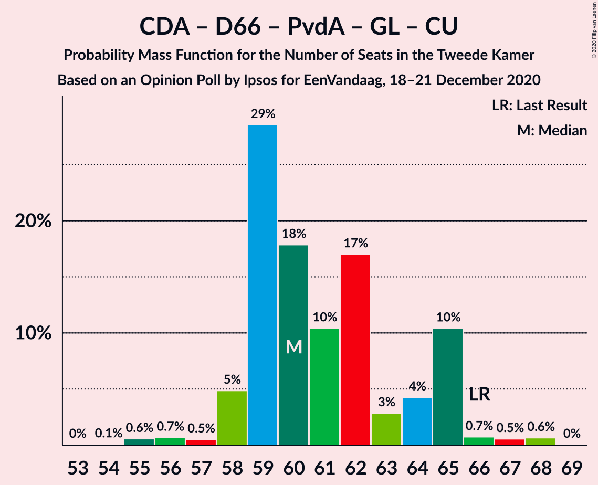

| Number of Seats | Probability | Accumulated | Special Marks |
|:---------------:|:-----------:|:-----------:|:-------------:|
| 54 | 0.1% | 100% |  |
| 55 | 0.6% | 99.9% |  |
| 56 | 0.7% | 99.3% |  |
| 57 | 0.5% | 98.7% |  |
| 58 | 5% | 98% |  |
| 59 | 29% | 93% |  |
| 60 | 18% | 65% |  |
| 61 | 10% | 47% | Median |
| 62 | 17% | 36% |  |
| 63 | 3% | 19% |  |
| 64 | 4% | 17% |  |
| 65 | 10% | 12% |  |
| 66 | 0.7% | 2% | Last Result |
| 67 | 0.5% | 1.2% |  |
| 68 | 0.6% | 0.7% |  |
| 69 | 0% | 0% |  |

### Volkspartij voor Vrijheid en Democratie – Christen-Democratisch Appèl

| Number of Seats | Probability | Accumulated | Special Marks |
|:---------------:|:-----------:|:-----------:|:-------------:|
| 52 | 0% | 100% | Last Result |
| 53 | 0% | 100% |  |
| 54 | 0.1% | 100% |  |
| 55 | 0.2% | 99.9% |  |
| 56 | 0.8% | 99.7% |  |
| 57 | 0.9% | 98.9% |  |
| 58 | 10% | 98% |  |
| 59 | 4% | 88% |  |
| 60 | 3% | 84% |  |
| 61 | 16% | 81% |  |
| 62 | 4% | 64% |  |
| 63 | 53% | 61% | Median |
| 64 | 2% | 8% |  |
| 65 | 3% | 6% |  |
| 66 | 1.3% | 2% |  |
| 67 | 0.7% | 0.9% |  |
| 68 | 0% | 0.1% |  |
| 69 | 0.1% | 0.1% |  |
| 70 | 0% | 0% |  |

### Volkspartij voor Vrijheid en Democratie – Partij van de Arbeid

| Number of Seats | Probability | Accumulated | Special Marks |
|:---------------:|:-----------:|:-----------:|:-------------:|
| 42 | 0% | 100% | Last Result |
| 43 | 0% | 100% |  |
| 44 | 0% | 100% |  |
| 45 | 0% | 100% |  |
| 46 | 0.2% | 100% |  |
| 47 | 0.6% | 99.8% |  |
| 48 | 0.3% | 99.2% |  |
| 49 | 0.8% | 98.9% |  |
| 50 | 4% | 98% |  |
| 51 | 3% | 94% |  |
| 52 | 11% | 90% |  |
| 53 | 3% | 79% |  |
| 54 | 20% | 77% | Median |
| 55 | 14% | 56% |  |
| 56 | 31% | 42% |  |
| 57 | 10% | 11% |  |
| 58 | 1.0% | 1.3% |  |
| 59 | 0.2% | 0.3% |  |
| 60 | 0.1% | 0.1% |  |
| 61 | 0% | 0.1% |  |
| 62 | 0% | 0% |  |

### Christen-Democratisch Appèl – Democraten 66 – Partij van de Arbeid

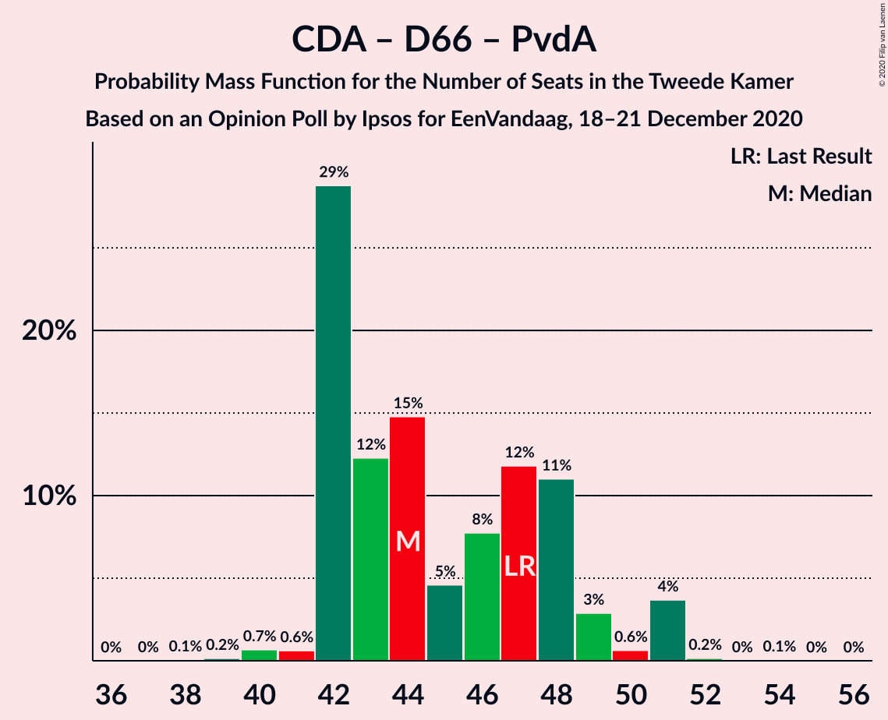

| Number of Seats | Probability | Accumulated | Special Marks |
|:---------------:|:-----------:|:-----------:|:-------------:|
| 38 | 0.1% | 100% |  |
| 39 | 0.2% | 99.9% |  |
| 40 | 0.7% | 99.8% |  |
| 41 | 0.6% | 99.1% |  |
| 42 | 29% | 98% |  |
| 43 | 12% | 70% |  |
| 44 | 15% | 57% | Median |
| 45 | 5% | 43% |  |
| 46 | 8% | 38% |  |
| 47 | 12% | 30% | Last Result |
| 48 | 11% | 18% |  |
| 49 | 3% | 7% |  |
| 50 | 0.6% | 5% |  |
| 51 | 4% | 4% |  |
| 52 | 0.2% | 0.2% |  |
| 53 | 0% | 0.1% |  |
| 54 | 0.1% | 0.1% |  |
| 55 | 0% | 0% |  |

### Christen-Democratisch Appèl – Partij van de Arbeid – ChristenUnie

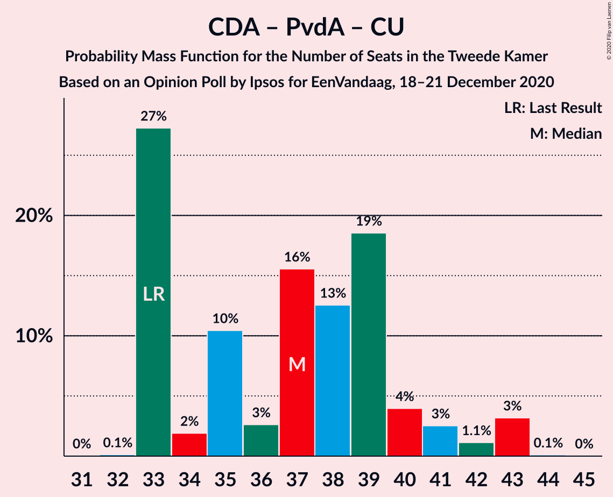

| Number of Seats | Probability | Accumulated | Special Marks |
|:---------------:|:-----------:|:-----------:|:-------------:|
| 32 | 0.1% | 100% |  |
| 33 | 27% | 99.8% | Last Result |
| 34 | 2% | 73% |  |
| 35 | 10% | 71% |  |
| 36 | 3% | 60% | Median |
| 37 | 16% | 58% |  |
| 38 | 13% | 42% |  |
| 39 | 19% | 29% |  |
| 40 | 4% | 11% |  |
| 41 | 3% | 7% |  |
| 42 | 1.1% | 4% |  |
| 43 | 3% | 3% |  |
| 44 | 0.1% | 0.1% |  |
| 45 | 0% | 0% |  |

### Christen-Democratisch Appèl – Partij van de Arbeid

| Number of Seats | Probability | Accumulated | Special Marks |
|:---------------:|:-----------:|:-----------:|:-------------:|
| 27 | 0.1% | 100% |  |
| 28 | 0.3% | 99.8% | Last Result |
| 29 | 29% | 99.6% |  |
| 30 | 10% | 71% |  |
| 31 | 20% | 60% | Median |
| 32 | 3% | 40% |  |
| 33 | 5% | 37% |  |
| 34 | 14% | 33% |  |
| 35 | 3% | 19% |  |
| 36 | 12% | 16% |  |
| 37 | 0.8% | 4% |  |
| 38 | 3% | 3% |  |
| 39 | 0.1% | 0.2% |  |
| 40 | 0% | 0% |  |

### Christen-Democratisch Appèl – Democraten 66

| Number of Seats | Probability | Accumulated | Special Marks |
|:---------------:|:-----------:|:-----------:|:-------------:|
| 27 | 0.1% | 100% |  |
| 28 | 0.5% | 99.9% |  |
| 29 | 0.5% | 99.4% |  |
| 30 | 3% | 98.9% |  |
| 31 | 40% | 96% |  |
| 32 | 3% | 56% |  |
| 33 | 35% | 53% | Median |
| 34 | 3% | 19% |  |
| 35 | 6% | 15% |  |
| 36 | 6% | 9% |  |
| 37 | 2% | 3% |  |
| 38 | 0.2% | 1.0% | Last Result |
| 39 | 0.7% | 0.8% |  |
| 40 | 0% | 0.1% |  |
| 41 | 0.1% | 0.1% |  |
| 42 | 0% | 0% |  |

## Technical Information

### Opinion Poll

+ **Polling firm:** Ipsos
+ **Commissioner(s):** EenVandaag
+ **Fieldwork period:** 18–21 December 2020

### Calculations

+ **Sample size:** 1050
+ **Simulations done:** 1,048,576
+ **Error estimate:** 1.92%

