# Opinion Poll by Kantar Public, 18–21 December 2020

<a href="#voting-intentions">Voting Intentions</a> | <a href="#seats">Seats</a> | <a href="#coalitions">Coalitions</a> | <a href="#technical-information">Technical Information</a>

## Voting Intentions

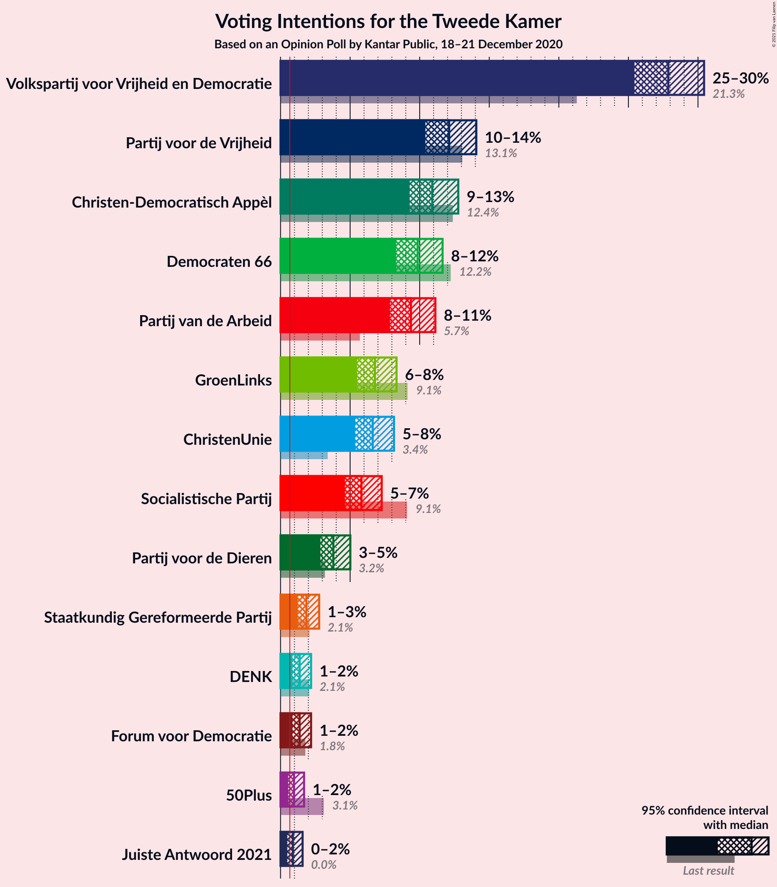

### Confidence Intervals

| Party | Last Result | Poll Result | 80% Confidence Interval | 90% Confidence Interval | 95% Confidence Interval | 99% Confidence Interval |
|:-----:|:-----------:|:-----------:|:-----------------------:|:-----------------------:|:-----------------------:|:-----------------------:|
| Volkspartij voor Vrijheid en Democratie | 21.3% | 27.9% | 26.3–29.6% |25.8–30.0% |25.4–30.4% |24.7–31.3% |
| Partij voor de Vrijheid | 13.1% | 12.1% | 11.0–13.4% |10.7–13.7% |10.4–14.1% |9.9–14.7% |
| Christen-Democratisch Appèl | 12.4% | 10.9% | 9.8–12.1% |9.5–12.5% |9.3–12.8% |8.8–13.4% |
| Democraten 66 | 12.2% | 9.9% | 8.8–11.0% |8.6–11.4% |8.3–11.6% |7.8–12.2% |
| Partij van de Arbeid | 5.7% | 9.4% | 8.4–10.5% |8.1–10.8% |7.9–11.1% |7.4–11.7% |
| GroenLinks | 9.1% | 6.8% | 5.9–7.8% |5.7–8.1% |5.5–8.3% |5.1–8.8% |
| ChristenUnie | 3.4% | 6.6% | 5.8–7.6% |5.6–7.9% |5.4–8.2% |5.0–8.7% |
| Socialistische Partij | 9.1% | 5.8% | 5.0–6.8% |4.8–7.0% |4.6–7.3% |4.3–7.7% |
| Partij voor de Dieren | 3.2% | 3.8% | 3.2–4.6% |3.0–4.8% |2.9–5.0% |2.6–5.4% |
| Staatkundig Gereformeerde Partij | 2.1% | 1.9% | 1.4–2.5% |1.3–2.6% |1.2–2.8% |1.1–3.1% |
| DENK | 2.1% | 1.4% | 1.0–1.9% |0.9–2.1% |0.9–2.2% |0.7–2.5% |
| Forum voor Democratie | 1.8% | 1.4% | 1.0–1.9% |0.9–2.1% |0.9–2.2% |0.7–2.5% |
| 50Plus | 3.1% | 1.0% | 0.7–1.4% |0.6–1.6% |0.5–1.7% |0.4–2.0% |

*Note:* The poll result column reflects the actual value used in the calculations. Published results may vary slightly, and in addition be rounded to fewer digits.

## Seats

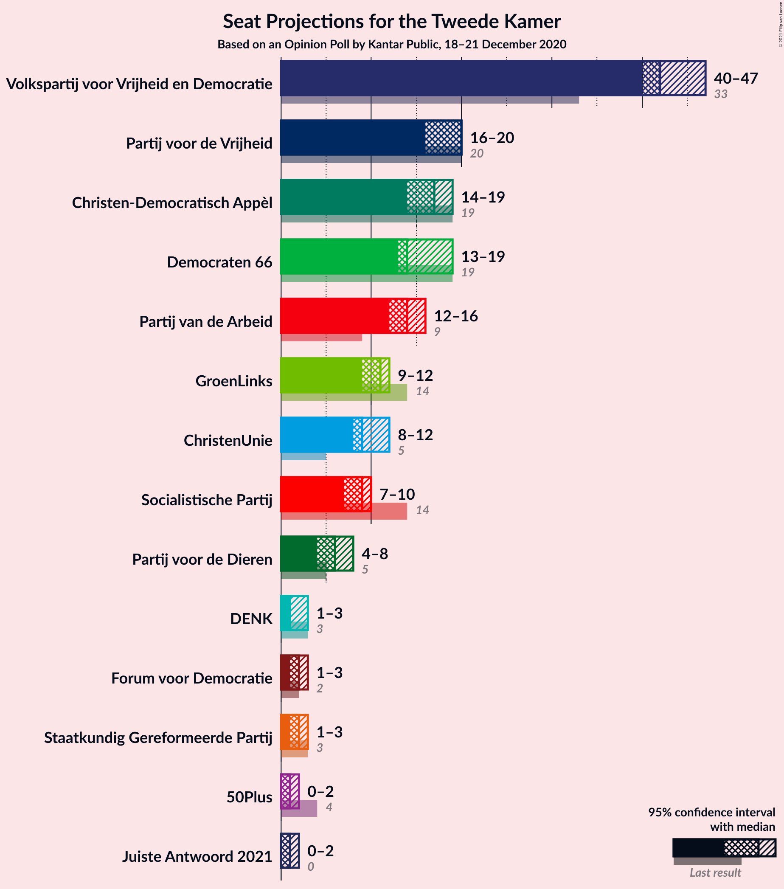

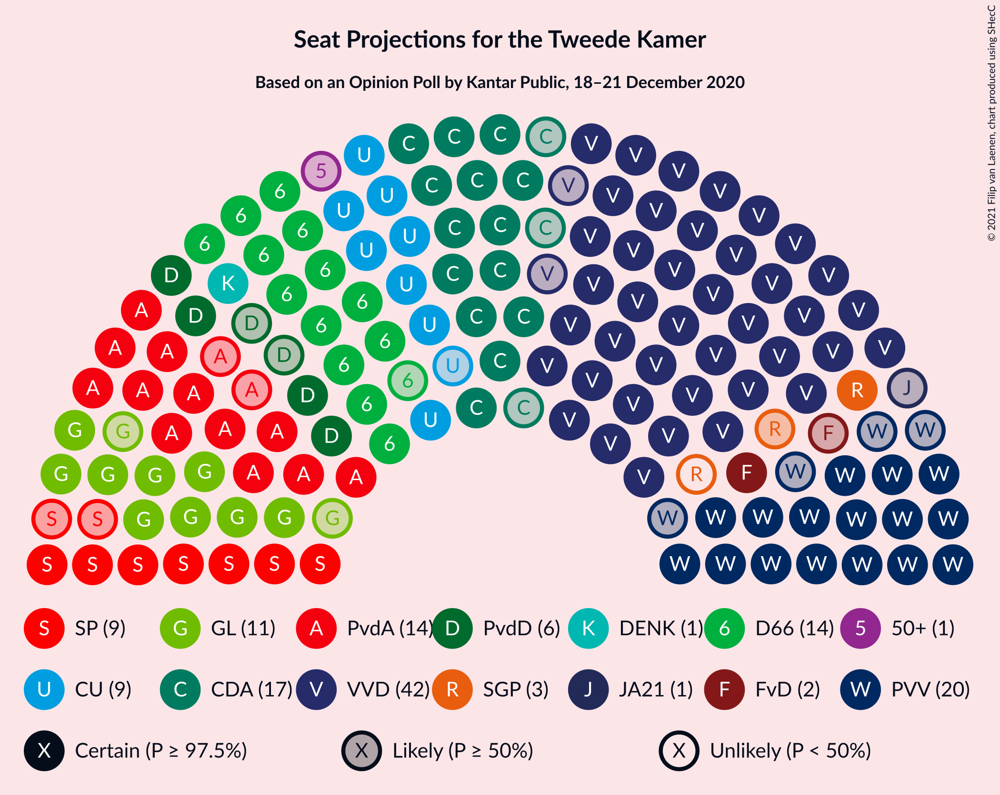

### Confidence Intervals

| Party | Last Result | Median | 80% Confidence Interval | 90% Confidence Interval | 95% Confidence Interval | 99% Confidence Interval |
|:-----:|:-----------:|:------:|:-----------------------:|:-----------------------:|:-----------------------:|:-----------------------:|
| <a href="#volkspartij-voor-vrijheid-en-democratie">Volkspartij voor Vrijheid en Democratie</a> | 33 | 43 | 39–45 |39–47 |39–48 |38–49 |
| <a href="#partij-voor-de-vrijheid">Partij voor de Vrijheid</a> | 20 | 19 | 16–21 |16–21 |16–21 |15–22 |
| <a href="#christen-democratisch-appèl">Christen-Democratisch Appèl</a> | 19 | 18 | 14–19 |14–19 |14–20 |13–21 |
| <a href="#democraten-66">Democraten 66</a> | 19 | 15 | 13–16 |13–17 |13–17 |12–19 |
| <a href="#partij-van-de-arbeid">Partij van de Arbeid</a> | 9 | 13 | 12–16 |12–16 |12–16 |11–18 |
| <a href="#groenlinks">GroenLinks</a> | 14 | 10 | 8–12 |8–12 |8–12 |7–14 |
| <a href="#christenunie">ChristenUnie</a> | 5 | 9 | 8–11 |8–12 |8–13 |7–13 |
| <a href="#socialistische-partij">Socialistische Partij</a> | 14 | 10 | 8–11 |7–11 |7–11 |6–12 |
| <a href="#partij-voor-de-dieren">Partij voor de Dieren</a> | 5 | 6 | 4–7 |4–7 |4–7 |4–8 |
| <a href="#staatkundig-gereformeerde-partij">Staatkundig Gereformeerde Partij</a> | 3 | 2 | 2–3 |1–4 |1–4 |1–4 |
| <a href="#denk">DENK</a> | 3 | 2 | 1–3 |1–3 |1–3 |0–3 |
| <a href="#forum-voor-democratie">Forum voor Democratie</a> | 2 | 2 | 1–3 |1–3 |1–3 |1–3 |
| <a href="#50plus">50Plus</a> | 4 | 1 | 0–2 |0–2 |0–3 |0–3 |

### Volkspartij voor Vrijheid en Democratie

*For a full overview of the results for this party, see the [Volkspartij voor Vrijheid en Democratie](party-volkspartijvoorvrijheidendemocratie.html) page.*

| Number of Seats | Probability | Accumulated | Special Marks |
|:---------------:|:-----------:|:-----------:|:-------------:|
| 33 | 0% | 100% | Last Result |
| 34 | 0% | 100% |  |
| 35 | 0% | 100% |  |
| 36 | 0.1% | 100% |  |
| 37 | 0.3% | 99.9% |  |
| 38 | 0.8% | 99.6% |  |
| 39 | 10% | 98.7% |  |
| 40 | 2% | 88% |  |
| 41 | 13% | 86% |  |
| 42 | 14% | 73% |  |
| 43 | 16% | 59% | Median |
| 44 | 31% | 43% |  |
| 45 | 5% | 12% |  |
| 46 | 1.3% | 6% |  |
| 47 | 2% | 5% |  |
| 48 | 2% | 3% |  |
| 49 | 0.5% | 0.5% |  |
| 50 | 0% | 0% |  |

### Partij voor de Vrijheid

*For a full overview of the results for this party, see the [Partij voor de Vrijheid](party-partijvoordevrijheid.html) page.*

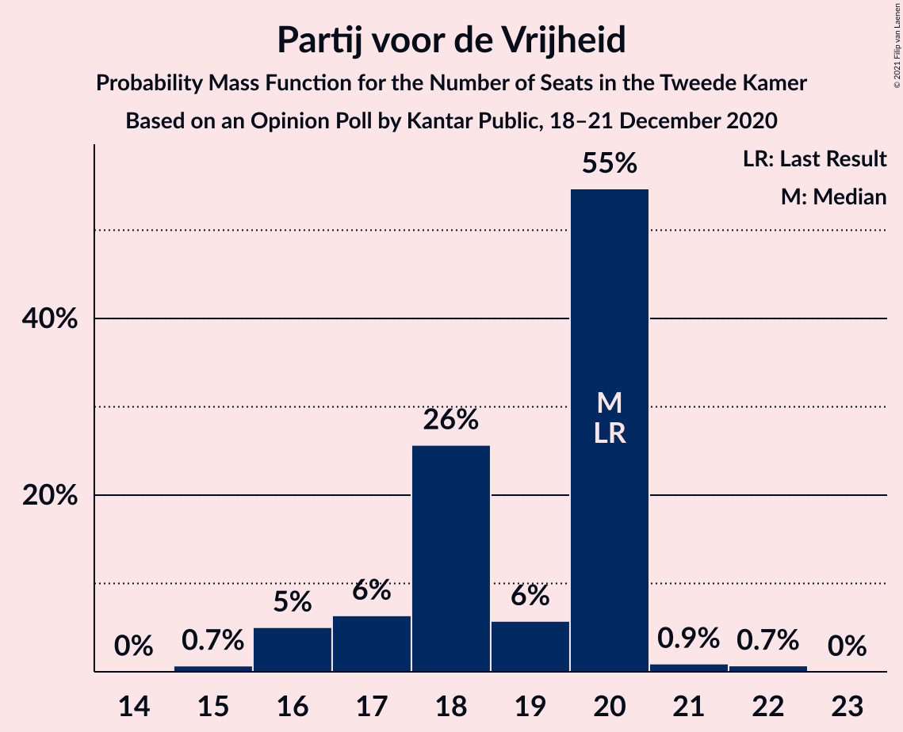

| Number of Seats | Probability | Accumulated | Special Marks |
|:---------------:|:-----------:|:-----------:|:-------------:|
| 13 | 0.1% | 100% |  |
| 14 | 0.4% | 99.9% |  |
| 15 | 2% | 99.6% |  |
| 16 | 30% | 98% |  |
| 17 | 11% | 68% |  |
| 18 | 6% | 57% |  |
| 19 | 20% | 51% | Median |
| 20 | 6% | 31% | Last Result |
| 21 | 24% | 25% |  |
| 22 | 1.0% | 1.4% |  |
| 23 | 0.4% | 0.4% |  |
| 24 | 0% | 0% |  |

### Christen-Democratisch Appèl

*For a full overview of the results for this party, see the [Christen-Democratisch Appèl](party-christen-democratischappèl.html) page.*

| Number of Seats | Probability | Accumulated | Special Marks |
|:---------------:|:-----------:|:-----------:|:-------------:|
| 12 | 0.3% | 100% |  |
| 13 | 0.3% | 99.7% |  |
| 14 | 10% | 99.4% |  |
| 15 | 9% | 90% |  |
| 16 | 17% | 81% |  |
| 17 | 14% | 64% |  |
| 18 | 38% | 50% | Median |
| 19 | 8% | 12% | Last Result |
| 20 | 3% | 4% |  |
| 21 | 1.4% | 1.5% |  |
| 22 | 0% | 0% |  |

### Democraten 66

*For a full overview of the results for this party, see the [Democraten 66](party-democraten66.html) page.*

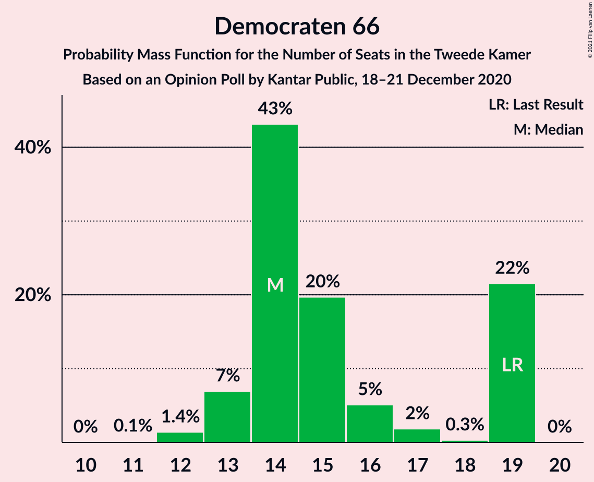

| Number of Seats | Probability | Accumulated | Special Marks |
|:---------------:|:-----------:|:-----------:|:-------------:|
| 11 | 0.2% | 100% |  |
| 12 | 0.8% | 99.7% |  |
| 13 | 14% | 98.9% |  |
| 14 | 17% | 85% |  |
| 15 | 49% | 67% | Median |
| 16 | 13% | 19% |  |
| 17 | 4% | 6% |  |
| 18 | 0.5% | 1.4% |  |
| 19 | 0.5% | 0.9% | Last Result |
| 20 | 0.4% | 0.4% |  |
| 21 | 0% | 0% |  |

### Partij van de Arbeid

*For a full overview of the results for this party, see the [Partij van de Arbeid](party-partijvandearbeid.html) page.*

| Number of Seats | Probability | Accumulated | Special Marks |
|:---------------:|:-----------:|:-----------:|:-------------:|
| 9 | 0% | 100% | Last Result |
| 10 | 0.1% | 100% |  |
| 11 | 0.8% | 99.9% |  |
| 12 | 14% | 99.1% |  |
| 13 | 43% | 85% | Median |
| 14 | 23% | 42% |  |
| 15 | 9% | 20% |  |
| 16 | 9% | 10% |  |
| 17 | 0.6% | 2% |  |
| 18 | 0.9% | 0.9% |  |
| 19 | 0% | 0.1% |  |
| 20 | 0% | 0% |  |

### GroenLinks

*For a full overview of the results for this party, see the [GroenLinks](party-groenlinks.html) page.*

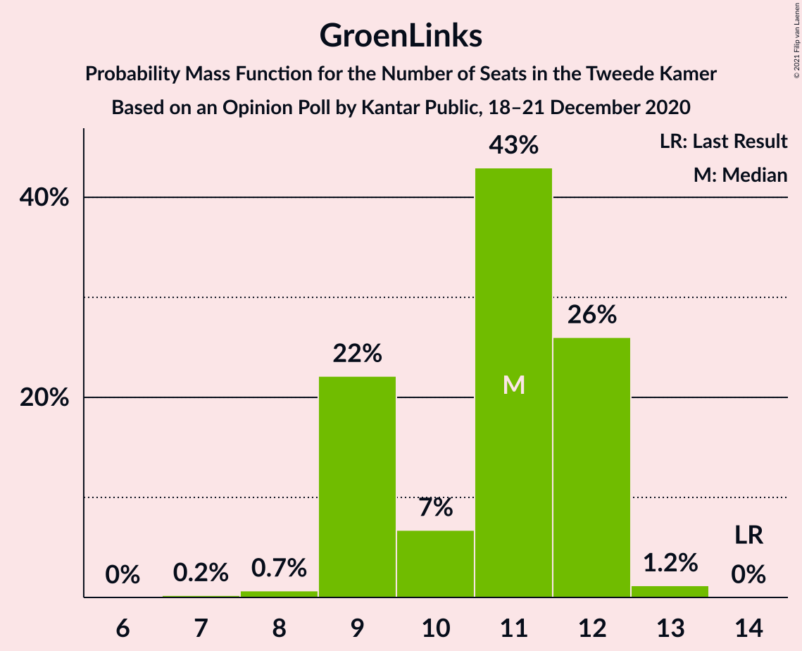

| Number of Seats | Probability | Accumulated | Special Marks |
|:---------------:|:-----------:|:-----------:|:-------------:|
| 7 | 0.7% | 100% |  |
| 8 | 12% | 99.3% |  |
| 9 | 13% | 88% |  |
| 10 | 43% | 75% | Median |
| 11 | 13% | 32% |  |
| 12 | 18% | 19% |  |
| 13 | 1.0% | 1.5% |  |
| 14 | 0.5% | 0.5% | Last Result |
| 15 | 0% | 0% |  |

### ChristenUnie

*For a full overview of the results for this party, see the [ChristenUnie](party-christenunie.html) page.*

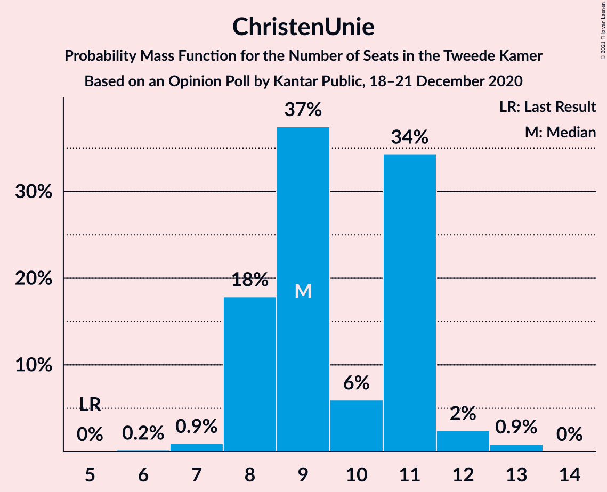

| Number of Seats | Probability | Accumulated | Special Marks |
|:---------------:|:-----------:|:-----------:|:-------------:|
| 5 | 0% | 100% | Last Result |
| 6 | 0% | 100% |  |
| 7 | 1.4% | 100% |  |
| 8 | 16% | 98.6% |  |
| 9 | 49% | 83% | Median |
| 10 | 21% | 34% |  |
| 11 | 8% | 13% |  |
| 12 | 3% | 5% |  |
| 13 | 2% | 3% |  |
| 14 | 0.1% | 0.1% |  |
| 15 | 0% | 0% |  |

### Socialistische Partij

*For a full overview of the results for this party, see the [Socialistische Partij](party-socialistischepartij.html) page.*

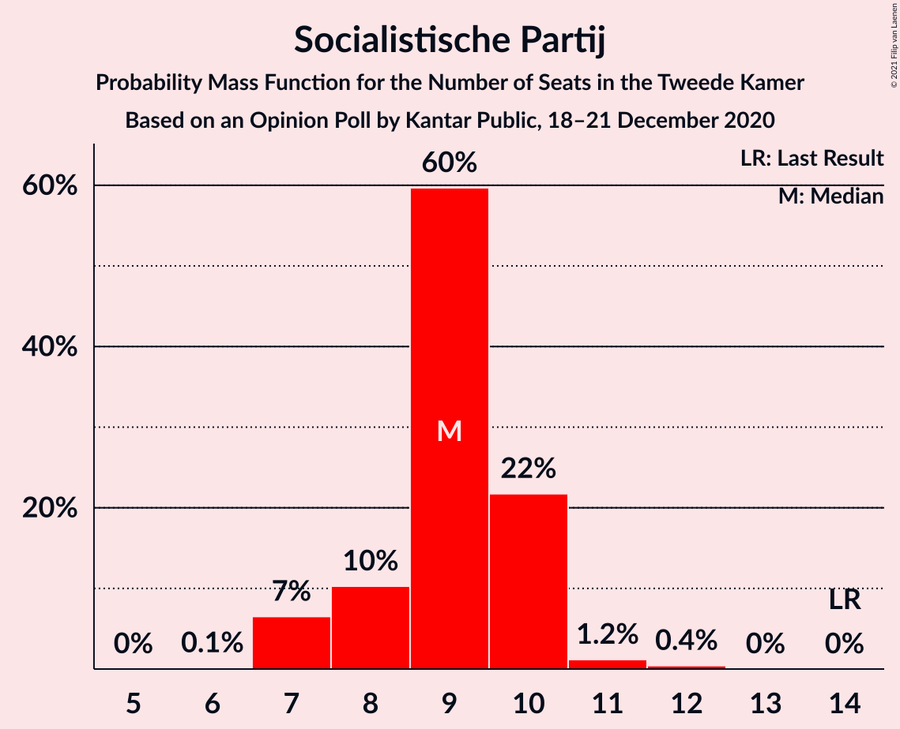

| Number of Seats | Probability | Accumulated | Special Marks |
|:---------------:|:-----------:|:-----------:|:-------------:|
| 5 | 0.1% | 100% |  |
| 6 | 0.6% | 99.9% |  |
| 7 | 5% | 99.3% |  |
| 8 | 17% | 95% |  |
| 9 | 23% | 78% |  |
| 10 | 20% | 54% | Median |
| 11 | 33% | 34% |  |
| 12 | 0.7% | 0.7% |  |
| 13 | 0% | 0% |  |
| 14 | 0% | 0% | Last Result |

### Partij voor de Dieren

*For a full overview of the results for this party, see the [Partij voor de Dieren](party-partijvoordedieren.html) page.*

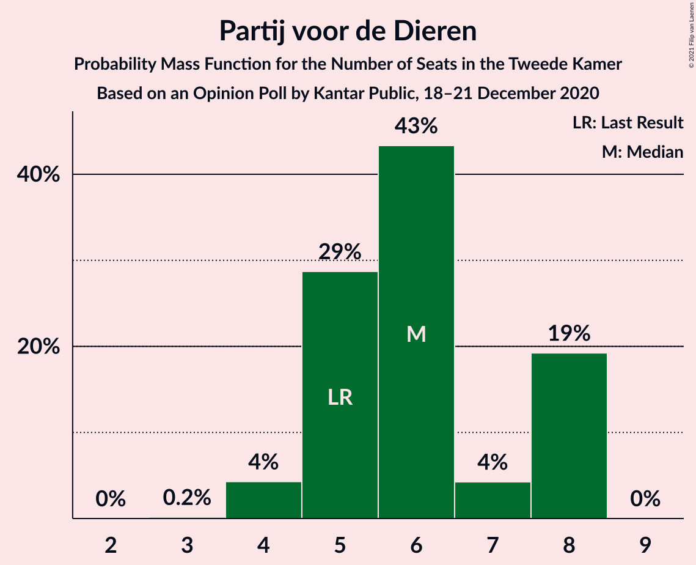

| Number of Seats | Probability | Accumulated | Special Marks |
|:---------------:|:-----------:|:-----------:|:-------------:|
| 3 | 0.2% | 100% |  |
| 4 | 14% | 99.8% |  |
| 5 | 22% | 86% | Last Result |
| 6 | 53% | 64% | Median |
| 7 | 9% | 11% |  |
| 8 | 2% | 2% |  |
| 9 | 0.4% | 0.4% |  |
| 10 | 0% | 0% |  |

### Staatkundig Gereformeerde Partij

*For a full overview of the results for this party, see the [Staatkundig Gereformeerde Partij](party-staatkundiggereformeerdepartij.html) page.*

| Number of Seats | Probability | Accumulated | Special Marks |
|:---------------:|:-----------:|:-----------:|:-------------:|
| 1 | 5% | 100% |  |
| 2 | 66% | 95% | Median |
| 3 | 21% | 29% | Last Result |
| 4 | 8% | 8% |  |
| 5 | 0.2% | 0.2% |  |
| 6 | 0% | 0% |  |

### DENK

*For a full overview of the results for this party, see the [DENK](party-denk.html) page.*

| Number of Seats | Probability | Accumulated | Special Marks |
|:---------------:|:-----------:|:-----------:|:-------------:|
| 0 | 1.0% | 100% |  |
| 1 | 44% | 99.0% |  |
| 2 | 44% | 55% | Median |
| 3 | 10% | 11% | Last Result |
| 4 | 0.4% | 0.4% |  |
| 5 | 0% | 0% |  |

### Forum voor Democratie

*For a full overview of the results for this party, see the [Forum voor Democratie](party-forumvoordemocratie.html) page.*

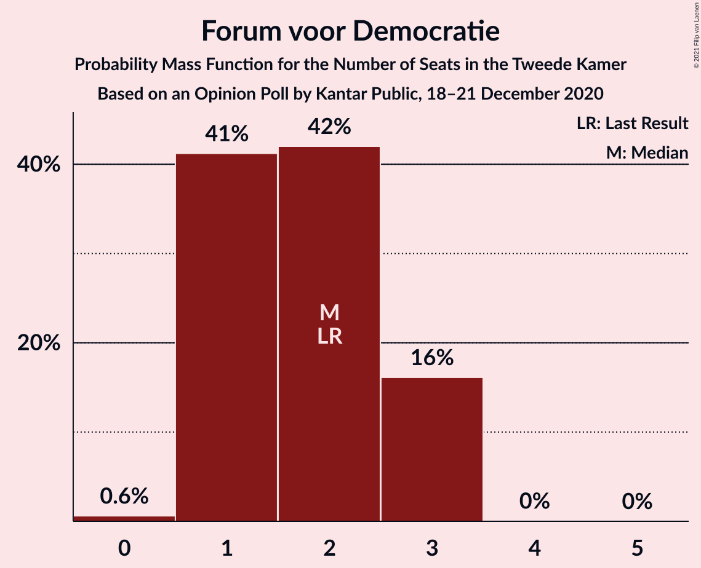

| Number of Seats | Probability | Accumulated | Special Marks |
|:---------------:|:-----------:|:-----------:|:-------------:|
| 0 | 0.2% | 100% |  |
| 1 | 25% | 99.8% |  |
| 2 | 60% | 75% | Last Result, Median |
| 3 | 15% | 15% |  |
| 4 | 0.3% | 0.3% |  |
| 5 | 0% | 0% |  |

### 50Plus

*For a full overview of the results for this party, see the [50Plus](party-50plus.html) page.*

| Number of Seats | Probability | Accumulated | Special Marks |
|:---------------:|:-----------:|:-----------:|:-------------:|
| 0 | 17% | 100% |  |
| 1 | 53% | 83% | Median |
| 2 | 27% | 30% |  |
| 3 | 3% | 3% |  |
| 4 | 0% | 0% | Last Result |

## Coalitions

### Confidence Intervals

| Coalition | Last Result | Median | Majority? | 80% Confidence Interval | 90% Confidence Interval | 95% Confidence Interval | 99% Confidence Interval |
|:---------:|:-----------:|:------:|:---------:|:-----------------------:|:-----------------------:|:-----------------------:|:-----------------------:|
| Volkspartij voor Vrijheid en Democratie – Christen-Democratisch Appèl – Democraten 66 – Partij van de Arbeid – ChristenUnie | 85 | 98 | 100% | 95–100 | 95–101 | 94–102 | 92–104 |
| Volkspartij voor Vrijheid en Democratie – Christen-Democratisch Appèl – Democraten 66 – GroenLinks – ChristenUnie | 90 | 94 | 100% | 91–97 | 89–98 | 89–99 | 88–100 |
| Volkspartij voor Vrijheid en Democratie – Christen-Democratisch Appèl – Democraten 66 – ChristenUnie | 76 | 84 | 100% | 81–87 | 80–88 | 80–88 | 78–90 |
| Volkspartij voor Vrijheid en Democratie – Partij voor de Vrijheid – Christen-Democratisch Appèl – Staatkundig Gereformeerde Partij – Forum voor Democratie | 77 | 82 | 99.8% | 80–85 | 79–87 | 78–88 | 76–88 |
| Volkspartij voor Vrijheid en Democratie – Partij voor de Vrijheid – Christen-Democratisch Appèl – Forum voor Democratie | 74 | 80 | 97% | 78–83 | 77–85 | 75–86 | 74–86 |
| Volkspartij voor Vrijheid en Democratie – Partij voor de Vrijheid – Christen-Democratisch Appèl | 72 | 78 | 92% | 76–81 | 75–83 | 74–84 | 72–84 |
| Volkspartij voor Vrijheid en Democratie – Christen-Democratisch Appèl – Democraten 66 | 71 | 74 | 39% | 72–77 | 70–78 | 70–79 | 68–81 |
| Christen-Democratisch Appèl – Democraten 66 – Partij van de Arbeid – GroenLinks – ChristenUnie – Socialistische Partij | 80 | 75 | 39% | 72–76 | 70–77 | 69–79 | 69–81 |
| Volkspartij voor Vrijheid en Democratie – Christen-Democratisch Appèl – Partij van de Arbeid | 61 | 73 | 11% | 70–76 | 70–77 | 69–78 | 68–79 |
| Volkspartij voor Vrijheid en Democratie – Democraten 66 – Partij van de Arbeid | 61 | 72 | 3% | 69–73 | 68–75 | 66–76 | 66–78 |
| Christen-Democratisch Appèl – Democraten 66 – Partij van de Arbeid – GroenLinks – ChristenUnie | 66 | 65 | 0% | 63–67 | 61–68 | 60–70 | 59–72 |
| Volkspartij voor Vrijheid en Democratie – Christen-Democratisch Appèl – Staatkundig Gereformeerde Partij – Forum voor Democratie – 50Plus | 61 | 66 | 0% | 61–67 | 60–69 | 59–70 | 59–71 |
| Volkspartij voor Vrijheid en Democratie – Christen-Democratisch Appèl – Staatkundig Gereformeerde Partij – Forum voor Democratie | 57 | 64 | 0% | 60–67 | 60–68 | 58–69 | 58–69 |
| Volkspartij voor Vrijheid en Democratie – Christen-Democratisch Appèl – Forum voor Democratie – 50Plus | 58 | 63 | 0% | 58–65 | 58–66 | 57–67 | 57–69 |
| Volkspartij voor Vrijheid en Democratie – Christen-Democratisch Appèl – Forum voor Democratie | 54 | 62 | 0% | 58–64 | 57–65 | 56–66 | 55–67 |
| Volkspartij voor Vrijheid en Democratie – Christen-Democratisch Appèl | 52 | 60 | 0% | 57–62 | 55–63 | 54–65 | 53–66 |
| Volkspartij voor Vrijheid en Democratie – Partij van de Arbeid | 42 | 56 | 0% | 55–58 | 53–60 | 53–61 | 52–63 |
| Christen-Democratisch Appèl – Democraten 66 – Partij van de Arbeid | 47 | 46 | 0% | 42–48 | 42–49 | 42–49 | 40–51 |
| Christen-Democratisch Appèl – Partij van de Arbeid – ChristenUnie | 33 | 40 | 0% | 37–43 | 37–43 | 37–44 | 36–47 |
| Christen-Democratisch Appèl – Democraten 66 | 38 | 32 | 0% | 30–33 | 29–34 | 28–35 | 28–38 |
| Christen-Democratisch Appèl – Partij van de Arbeid | 28 | 31 | 0% | 28–33 | 27–34 | 27–34 | 26–35 |

### Volkspartij voor Vrijheid en Democratie – Christen-Democratisch Appèl – Democraten 66 – Partij van de Arbeid – ChristenUnie

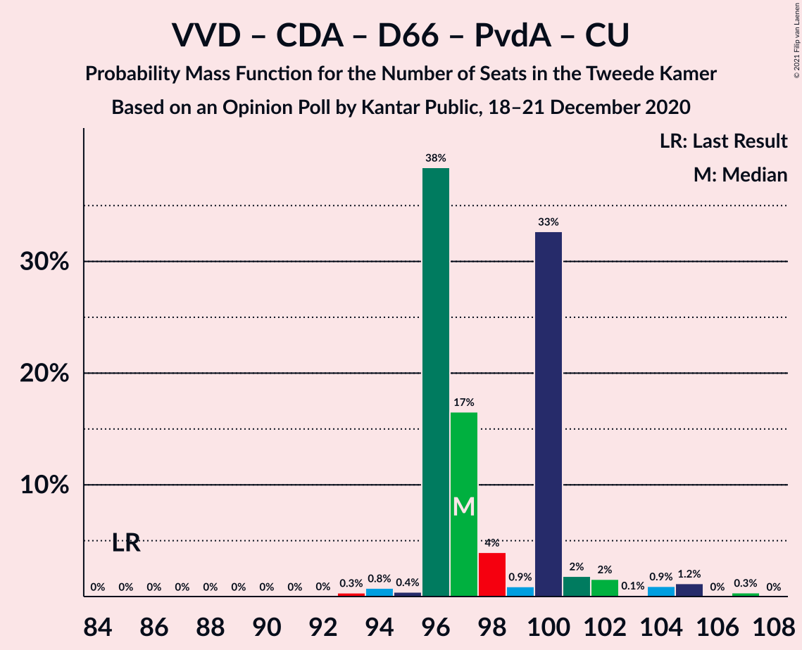

| Number of Seats | Probability | Accumulated | Special Marks |
|:---------------:|:-----------:|:-----------:|:-------------:|
| 85 | 0% | 100% | Last Result |
| 86 | 0% | 100% |  |
| 87 | 0% | 100% |  |
| 88 | 0% | 100% |  |
| 89 | 0% | 100% |  |
| 90 | 0.2% | 100% |  |
| 91 | 0.3% | 99.8% |  |
| 92 | 0.3% | 99.5% |  |
| 93 | 0.3% | 99.3% |  |
| 94 | 3% | 98.9% |  |
| 95 | 18% | 96% |  |
| 96 | 16% | 77% |  |
| 97 | 9% | 61% |  |
| 98 | 11% | 52% | Median |
| 99 | 29% | 42% |  |
| 100 | 7% | 13% |  |
| 101 | 3% | 6% |  |
| 102 | 0.8% | 3% |  |
| 103 | 2% | 2% |  |
| 104 | 0.5% | 0.7% |  |
| 105 | 0.2% | 0.2% |  |
| 106 | 0% | 0% |  |

### Volkspartij voor Vrijheid en Democratie – Christen-Democratisch Appèl – Democraten 66 – GroenLinks – ChristenUnie

| Number of Seats | Probability | Accumulated | Special Marks |
|:---------------:|:-----------:|:-----------:|:-------------:|
| 88 | 0.5% | 100% |  |
| 89 | 8% | 99.5% |  |
| 90 | 0.5% | 92% | Last Result |
| 91 | 12% | 91% |  |
| 92 | 6% | 79% |  |
| 93 | 17% | 73% |  |
| 94 | 6% | 56% |  |
| 95 | 8% | 50% | Median |
| 96 | 30% | 42% |  |
| 97 | 6% | 12% |  |
| 98 | 1.4% | 6% |  |
| 99 | 2% | 4% |  |
| 100 | 2% | 2% |  |
| 101 | 0.5% | 0.5% |  |
| 102 | 0% | 0% |  |

### Volkspartij voor Vrijheid en Democratie – Christen-Democratisch Appèl – Democraten 66 – ChristenUnie

| Number of Seats | Probability | Accumulated | Special Marks |
|:---------------:|:-----------:|:-----------:|:-------------:|
| 76 | 0.2% | 100% | Last Result, Majority |
| 77 | 0.1% | 99.8% |  |
| 78 | 0.4% | 99.7% |  |
| 79 | 0.5% | 99.2% |  |
| 80 | 6% | 98.7% |  |
| 81 | 18% | 93% |  |
| 82 | 8% | 75% |  |
| 83 | 16% | 67% |  |
| 84 | 6% | 51% |  |
| 85 | 8% | 45% | Median |
| 86 | 27% | 38% |  |
| 87 | 0.8% | 10% |  |
| 88 | 8% | 10% |  |
| 89 | 1.1% | 2% |  |
| 90 | 0.8% | 0.9% |  |
| 91 | 0.1% | 0.1% |  |
| 92 | 0% | 0% |  |

### Volkspartij voor Vrijheid en Democratie – Partij voor de Vrijheid – Christen-Democratisch Appèl – Staatkundig Gereformeerde Partij – Forum voor Democratie

| Number of Seats | Probability | Accumulated | Special Marks |
|:---------------:|:-----------:|:-----------:|:-------------:|
| 75 | 0.1% | 100% |  |
| 76 | 0.5% | 99.8% | Majority |
| 77 | 0.8% | 99.3% | Last Result |
| 78 | 1.4% | 98.5% |  |
| 79 | 5% | 97% |  |
| 80 | 3% | 92% |  |
| 81 | 17% | 89% |  |
| 82 | 44% | 72% |  |
| 83 | 10% | 29% |  |
| 84 | 6% | 19% | Median |
| 85 | 3% | 13% |  |
| 86 | 2% | 9% |  |
| 87 | 4% | 7% |  |
| 88 | 3% | 3% |  |
| 89 | 0.1% | 0.4% |  |
| 90 | 0.2% | 0.2% |  |
| 91 | 0% | 0% |  |

### Volkspartij voor Vrijheid en Democratie – Partij voor de Vrijheid – Christen-Democratisch Appèl – Forum voor Democratie

| Number of Seats | Probability | Accumulated | Special Marks |
|:---------------:|:-----------:|:-----------:|:-------------:|
| 72 | 0% | 100% |  |
| 73 | 0.2% | 99.9% |  |
| 74 | 0.8% | 99.7% | Last Result |
| 75 | 1.5% | 98.9% |  |
| 76 | 1.4% | 97% | Majority |
| 77 | 4% | 96% |  |
| 78 | 9% | 92% |  |
| 79 | 19% | 82% |  |
| 80 | 35% | 63% |  |
| 81 | 14% | 28% |  |
| 82 | 3% | 14% | Median |
| 83 | 5% | 11% |  |
| 84 | 0.3% | 6% |  |
| 85 | 2% | 5% |  |
| 86 | 3% | 3% |  |
| 87 | 0.3% | 0.3% |  |
| 88 | 0% | 0% |  |

### Volkspartij voor Vrijheid en Democratie – Partij voor de Vrijheid – Christen-Democratisch Appèl

| Number of Seats | Probability | Accumulated | Special Marks |
|:---------------:|:-----------:|:-----------:|:-------------:|
| 70 | 0.1% | 100% |  |
| 71 | 0.2% | 99.9% |  |
| 72 | 0.6% | 99.7% | Last Result |
| 73 | 0.6% | 99.1% |  |
| 74 | 3% | 98.5% |  |
| 75 | 3% | 95% |  |
| 76 | 12% | 92% | Majority |
| 77 | 8% | 80% |  |
| 78 | 47% | 72% |  |
| 79 | 7% | 25% |  |
| 80 | 8% | 18% | Median |
| 81 | 3% | 10% |  |
| 82 | 1.4% | 7% |  |
| 83 | 1.4% | 5% |  |
| 84 | 4% | 4% |  |
| 85 | 0% | 0.3% |  |
| 86 | 0.2% | 0.2% |  |
| 87 | 0% | 0% |  |

### Volkspartij voor Vrijheid en Democratie – Christen-Democratisch Appèl – Democraten 66

| Number of Seats | Probability | Accumulated | Special Marks |
|:---------------:|:-----------:|:-----------:|:-------------:|
| 66 | 0.1% | 100% |  |
| 67 | 0.1% | 99.9% |  |
| 68 | 0.5% | 99.8% |  |
| 69 | 2% | 99.3% |  |
| 70 | 3% | 98% |  |
| 71 | 3% | 95% | Last Result |
| 72 | 13% | 91% |  |
| 73 | 19% | 78% |  |
| 74 | 15% | 59% |  |
| 75 | 4% | 44% |  |
| 76 | 2% | 39% | Median, Majority |
| 77 | 28% | 37% |  |
| 78 | 6% | 9% |  |
| 79 | 1.2% | 3% |  |
| 80 | 1.3% | 2% |  |
| 81 | 0.7% | 0.7% |  |
| 82 | 0% | 0% |  |

### Christen-Democratisch Appèl – Democraten 66 – Partij van de Arbeid – GroenLinks – ChristenUnie – Socialistische Partij

| Number of Seats | Probability | Accumulated | Special Marks |
|:---------------:|:-----------:|:-----------:|:-------------:|
| 67 | 0% | 100% |  |
| 68 | 0.3% | 99.9% |  |
| 69 | 4% | 99.7% |  |
| 70 | 2% | 96% |  |
| 71 | 3% | 94% |  |
| 72 | 10% | 92% |  |
| 73 | 6% | 82% |  |
| 74 | 19% | 76% |  |
| 75 | 18% | 57% | Median |
| 76 | 33% | 39% | Majority |
| 77 | 1.3% | 6% |  |
| 78 | 2% | 5% |  |
| 79 | 2% | 3% |  |
| 80 | 0.5% | 1.0% | Last Result |
| 81 | 0.1% | 0.5% |  |
| 82 | 0.4% | 0.5% |  |
| 83 | 0% | 0% |  |

### Volkspartij voor Vrijheid en Democratie – Christen-Democratisch Appèl – Partij van de Arbeid

| Number of Seats | Probability | Accumulated | Special Marks |
|:---------------:|:-----------:|:-----------:|:-------------:|
| 61 | 0% | 100% | Last Result |
| 62 | 0% | 100% |  |
| 63 | 0% | 100% |  |
| 64 | 0% | 100% |  |
| 65 | 0% | 100% |  |
| 66 | 0.1% | 100% |  |
| 67 | 0.3% | 99.9% |  |
| 68 | 2% | 99.6% |  |
| 69 | 0.5% | 98% |  |
| 70 | 12% | 97% |  |
| 71 | 5% | 85% |  |
| 72 | 20% | 80% |  |
| 73 | 11% | 60% |  |
| 74 | 5% | 49% | Median |
| 75 | 33% | 44% |  |
| 76 | 6% | 11% | Majority |
| 77 | 1.1% | 5% |  |
| 78 | 2% | 4% |  |
| 79 | 2% | 2% |  |
| 80 | 0% | 0.2% |  |
| 81 | 0.1% | 0.2% |  |
| 82 | 0% | 0.1% |  |
| 83 | 0.1% | 0.1% |  |
| 84 | 0% | 0% |  |

### Volkspartij voor Vrijheid en Democratie – Democraten 66 – Partij van de Arbeid

| Number of Seats | Probability | Accumulated | Special Marks |
|:---------------:|:-----------:|:-----------:|:-------------:|
| 61 | 0% | 100% | Last Result |
| 62 | 0% | 100% |  |
| 63 | 0% | 100% |  |
| 64 | 0% | 100% |  |
| 65 | 0.2% | 100% |  |
| 66 | 2% | 99.8% |  |
| 67 | 2% | 97% |  |
| 68 | 5% | 95% |  |
| 69 | 12% | 90% |  |
| 70 | 14% | 78% |  |
| 71 | 11% | 65% | Median |
| 72 | 40% | 54% |  |
| 73 | 4% | 13% |  |
| 74 | 3% | 9% |  |
| 75 | 3% | 6% |  |
| 76 | 1.3% | 3% | Majority |
| 77 | 1.3% | 2% |  |
| 78 | 0.4% | 0.6% |  |
| 79 | 0.1% | 0.1% |  |
| 80 | 0% | 0% |  |

### Christen-Democratisch Appèl – Democraten 66 – Partij van de Arbeid – GroenLinks – ChristenUnie

| Number of Seats | Probability | Accumulated | Special Marks |
|:---------------:|:-----------:|:-----------:|:-------------:|
| 59 | 0.6% | 100% |  |
| 60 | 2% | 99.4% |  |
| 61 | 2% | 97% |  |
| 62 | 4% | 95% |  |
| 63 | 8% | 90% |  |
| 64 | 17% | 82% |  |
| 65 | 38% | 66% | Median |
| 66 | 12% | 27% | Last Result |
| 67 | 5% | 15% |  |
| 68 | 6% | 10% |  |
| 69 | 1.1% | 4% |  |
| 70 | 1.0% | 3% |  |
| 71 | 0.7% | 2% |  |
| 72 | 0.8% | 0.9% |  |
| 73 | 0.1% | 0.1% |  |
| 74 | 0% | 0% |  |

### Volkspartij voor Vrijheid en Democratie – Christen-Democratisch Appèl – Staatkundig Gereformeerde Partij – Forum voor Democratie – 50Plus

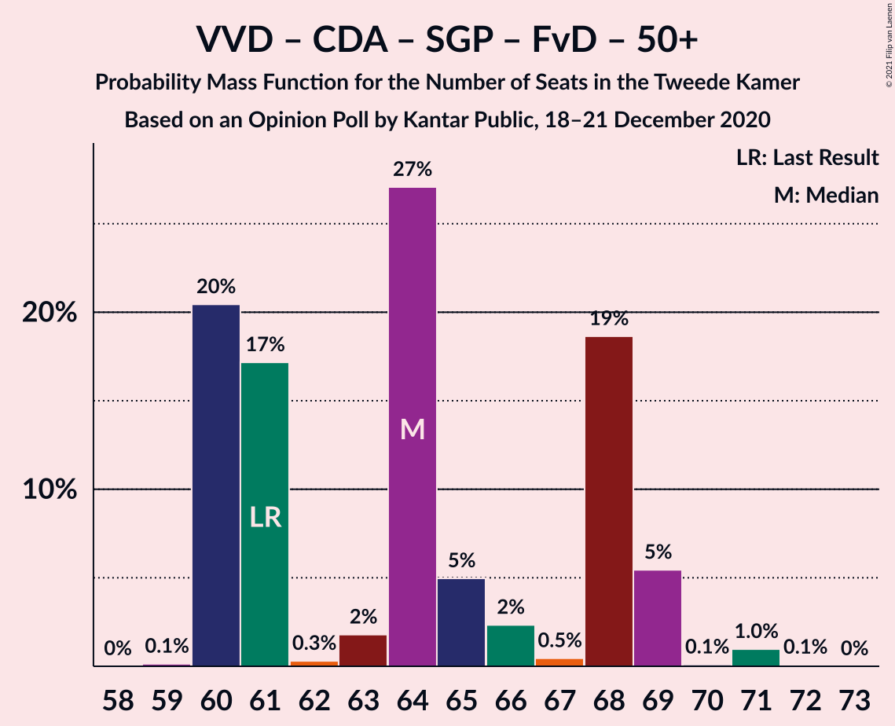

| Number of Seats | Probability | Accumulated | Special Marks |
|:---------------:|:-----------:|:-----------:|:-------------:|
| 57 | 0% | 100% |  |
| 58 | 0.1% | 99.9% |  |
| 59 | 2% | 99.9% |  |
| 60 | 6% | 97% |  |
| 61 | 2% | 91% | Last Result |
| 62 | 11% | 90% |  |
| 63 | 6% | 78% |  |
| 64 | 3% | 72% |  |
| 65 | 19% | 69% |  |
| 66 | 8% | 51% | Median |
| 67 | 33% | 43% |  |
| 68 | 2% | 10% |  |
| 69 | 4% | 8% |  |
| 70 | 3% | 4% |  |
| 71 | 0.7% | 0.7% |  |
| 72 | 0% | 0% |  |

### Volkspartij voor Vrijheid en Democratie – Christen-Democratisch Appèl – Staatkundig Gereformeerde Partij – Forum voor Democratie

| Number of Seats | Probability | Accumulated | Special Marks |
|:---------------:|:-----------:|:-----------:|:-------------:|
| 56 | 0% | 100% |  |
| 57 | 0.1% | 99.9% | Last Result |
| 58 | 3% | 99.9% |  |
| 59 | 2% | 97% |  |
| 60 | 9% | 95% |  |
| 61 | 8% | 86% |  |
| 62 | 3% | 78% |  |
| 63 | 18% | 75% |  |
| 64 | 10% | 57% |  |
| 65 | 8% | 47% | Median |
| 66 | 27% | 39% |  |
| 67 | 5% | 12% |  |
| 68 | 3% | 7% |  |
| 69 | 4% | 4% |  |
| 70 | 0.2% | 0.2% |  |
| 71 | 0% | 0% |  |

### Volkspartij voor Vrijheid en Democratie – Christen-Democratisch Appèl – Forum voor Democratie – 50Plus

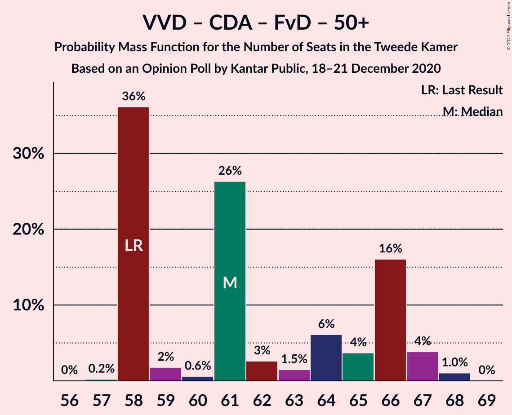

| Number of Seats | Probability | Accumulated | Special Marks |
|:---------------:|:-----------:|:-----------:|:-------------:|
| 54 | 0% | 100% |  |
| 55 | 0.1% | 99.9% |  |
| 56 | 0.2% | 99.9% |  |
| 57 | 3% | 99.7% |  |
| 58 | 7% | 97% | Last Result |
| 59 | 3% | 90% |  |
| 60 | 8% | 86% |  |
| 61 | 10% | 79% |  |
| 62 | 10% | 69% |  |
| 63 | 13% | 60% |  |
| 64 | 7% | 47% | Median |
| 65 | 31% | 40% |  |
| 66 | 5% | 9% |  |
| 67 | 2% | 4% |  |
| 68 | 2% | 2% |  |
| 69 | 0.5% | 0.5% |  |
| 70 | 0% | 0% |  |

### Volkspartij voor Vrijheid en Democratie – Christen-Democratisch Appèl – Forum voor Democratie

| Number of Seats | Probability | Accumulated | Special Marks |
|:---------------:|:-----------:|:-----------:|:-------------:|
| 53 | 0% | 100% |  |
| 54 | 0.1% | 99.9% | Last Result |
| 55 | 0.6% | 99.9% |  |
| 56 | 3% | 99.3% |  |
| 57 | 4% | 96% |  |
| 58 | 6% | 92% |  |
| 59 | 5% | 86% |  |
| 60 | 15% | 81% |  |
| 61 | 15% | 66% |  |
| 62 | 10% | 51% |  |
| 63 | 4% | 41% | Median |
| 64 | 27% | 37% |  |
| 65 | 5% | 10% |  |
| 66 | 2% | 5% |  |
| 67 | 2% | 2% |  |
| 68 | 0% | 0% |  |

### Volkspartij voor Vrijheid en Democratie – Christen-Democratisch Appèl

| Number of Seats | Probability | Accumulated | Special Marks |
|:---------------:|:-----------:|:-----------:|:-------------:|
| 51 | 0% | 100% |  |
| 52 | 0.1% | 99.9% | Last Result |
| 53 | 0.4% | 99.9% |  |
| 54 | 2% | 99.4% |  |
| 55 | 2% | 97% |  |
| 56 | 3% | 95% |  |
| 57 | 14% | 91% |  |
| 58 | 13% | 77% |  |
| 59 | 12% | 64% |  |
| 60 | 6% | 52% |  |
| 61 | 10% | 46% | Median |
| 62 | 26% | 36% |  |
| 63 | 5% | 9% |  |
| 64 | 2% | 5% |  |
| 65 | 0.8% | 3% |  |
| 66 | 2% | 2% |  |
| 67 | 0% | 0% |  |

### Volkspartij voor Vrijheid en Democratie – Partij van de Arbeid

| Number of Seats | Probability | Accumulated | Special Marks |
|:---------------:|:-----------:|:-----------:|:-------------:|
| 42 | 0% | 100% | Last Result |
| 43 | 0% | 100% |  |
| 44 | 0% | 100% |  |
| 45 | 0% | 100% |  |
| 46 | 0% | 100% |  |
| 47 | 0% | 100% |  |
| 48 | 0% | 100% |  |
| 49 | 0% | 100% |  |
| 50 | 0.2% | 100% |  |
| 51 | 0.3% | 99.8% |  |
| 52 | 1.2% | 99.5% |  |
| 53 | 5% | 98% |  |
| 54 | 2% | 93% |  |
| 55 | 22% | 91% |  |
| 56 | 23% | 68% | Median |
| 57 | 27% | 45% |  |
| 58 | 9% | 18% |  |
| 59 | 2% | 10% |  |
| 60 | 4% | 7% |  |
| 61 | 2% | 3% |  |
| 62 | 0.8% | 1.4% |  |
| 63 | 0.3% | 0.5% |  |
| 64 | 0.1% | 0.2% |  |
| 65 | 0% | 0% |  |

### Christen-Democratisch Appèl – Democraten 66 – Partij van de Arbeid

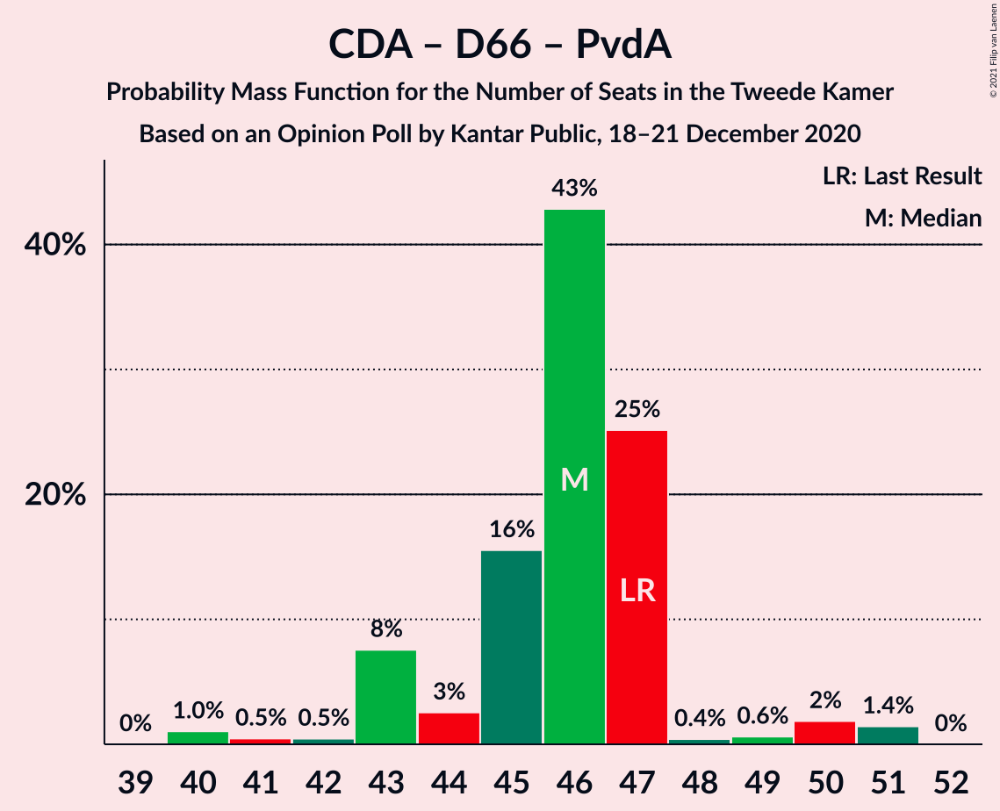

| Number of Seats | Probability | Accumulated | Special Marks |
|:---------------:|:-----------:|:-----------:|:-------------:|
| 39 | 0.2% | 100% |  |
| 40 | 0.4% | 99.8% |  |
| 41 | 0.9% | 99.4% |  |
| 42 | 9% | 98% |  |
| 43 | 14% | 90% |  |
| 44 | 7% | 76% |  |
| 45 | 13% | 69% |  |
| 46 | 33% | 56% | Median |
| 47 | 8% | 23% | Last Result |
| 48 | 6% | 15% |  |
| 49 | 7% | 9% |  |
| 50 | 1.1% | 2% |  |
| 51 | 0.3% | 0.7% |  |
| 52 | 0% | 0.4% |  |
| 53 | 0.3% | 0.4% |  |
| 54 | 0% | 0% |  |

### Christen-Democratisch Appèl – Partij van de Arbeid – ChristenUnie

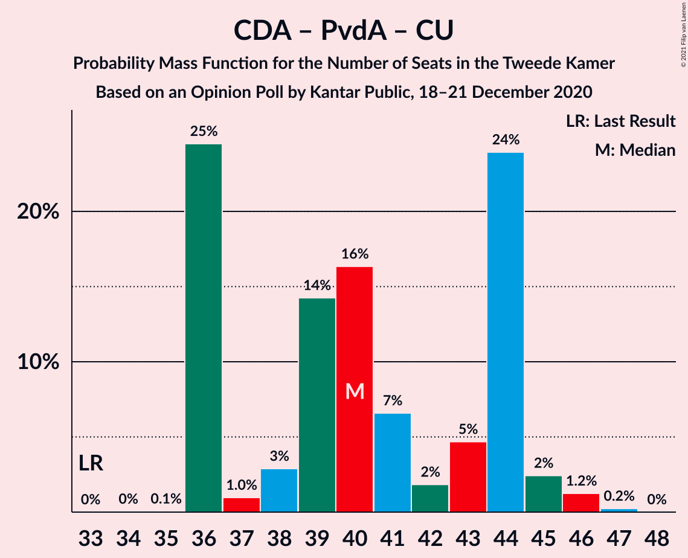

| Number of Seats | Probability | Accumulated | Special Marks |
|:---------------:|:-----------:|:-----------:|:-------------:|
| 33 | 0% | 100% | Last Result |
| 34 | 0.3% | 100% |  |
| 35 | 0.2% | 99.7% |  |
| 36 | 0.3% | 99.5% |  |
| 37 | 12% | 99.2% |  |
| 38 | 12% | 88% |  |
| 39 | 10% | 76% |  |
| 40 | 39% | 66% | Median |
| 41 | 5% | 27% |  |
| 42 | 8% | 22% |  |
| 43 | 9% | 13% |  |
| 44 | 4% | 5% |  |
| 45 | 0.4% | 1.3% |  |
| 46 | 0.3% | 0.9% |  |
| 47 | 0.4% | 0.5% |  |
| 48 | 0.1% | 0.1% |  |
| 49 | 0% | 0% |  |

### Christen-Democratisch Appèl – Democraten 66

| Number of Seats | Probability | Accumulated | Special Marks |
|:---------------:|:-----------:|:-----------:|:-------------:|
| 26 | 0.3% | 100% |  |
| 27 | 0.2% | 99.7% |  |
| 28 | 4% | 99.6% |  |
| 29 | 5% | 95% |  |
| 30 | 13% | 90% |  |
| 31 | 21% | 77% |  |
| 32 | 11% | 56% |  |
| 33 | 36% | 45% | Median |
| 34 | 6% | 10% |  |
| 35 | 3% | 4% |  |
| 36 | 0.4% | 0.9% |  |
| 37 | 0% | 0.6% |  |
| 38 | 0.5% | 0.5% | Last Result |
| 39 | 0% | 0% |  |

### Christen-Democratisch Appèl – Partij van de Arbeid

| Number of Seats | Probability | Accumulated | Special Marks |
|:---------------:|:-----------:|:-----------:|:-------------:|
| 24 | 0.2% | 100% |  |
| 25 | 0.1% | 99.8% |  |
| 26 | 0.3% | 99.7% |  |
| 27 | 9% | 99.4% |  |
| 28 | 10% | 91% | Last Result |
| 29 | 6% | 81% |  |
| 30 | 11% | 75% |  |
| 31 | 42% | 64% | Median |
| 32 | 6% | 23% |  |
| 33 | 8% | 17% |  |
| 34 | 7% | 9% |  |
| 35 | 1.3% | 2% |  |
| 36 | 0.2% | 0.3% |  |
| 37 | 0% | 0% |  |

## Technical Information

### Opinion Poll

+ **Polling firm:** Kantar Public
+ **Commissioner(s):** —
+ **Fieldwork period:** 18–21 December 2020

### Calculations

+ **Sample size:** 1238
+ **Simulations done:** 1,048,576
+ **Error estimate:** 2.26%

