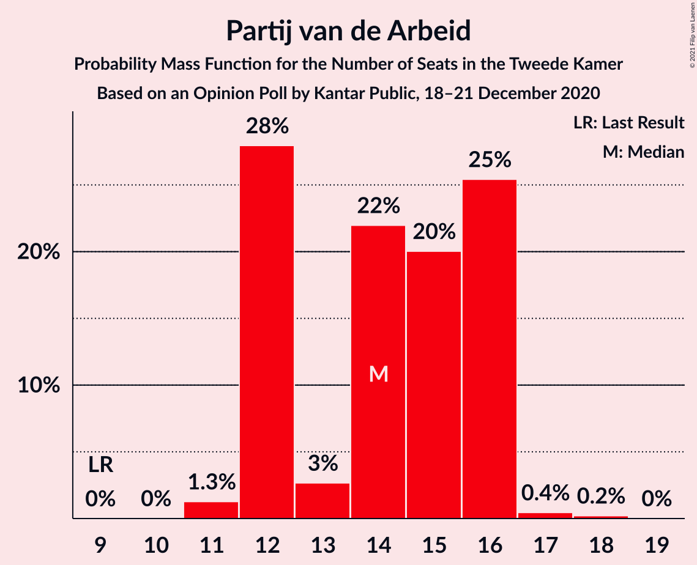
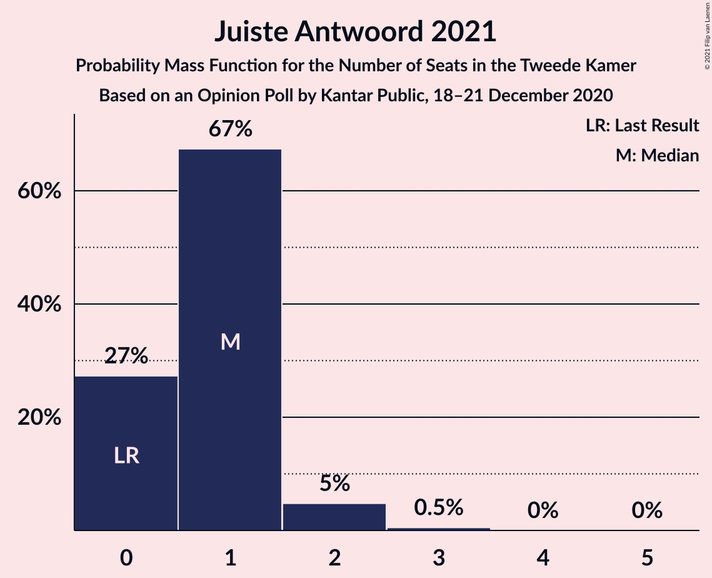
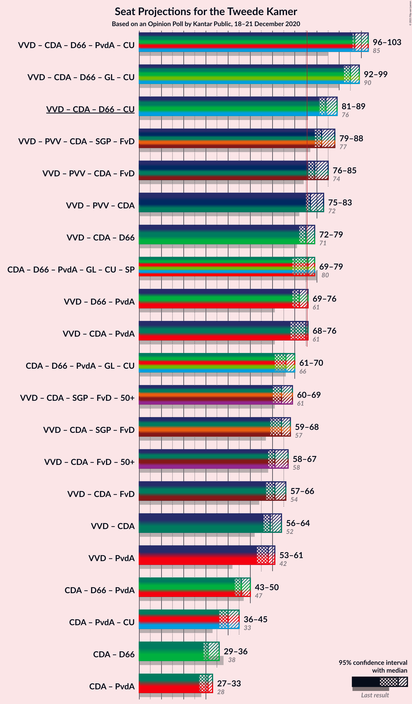
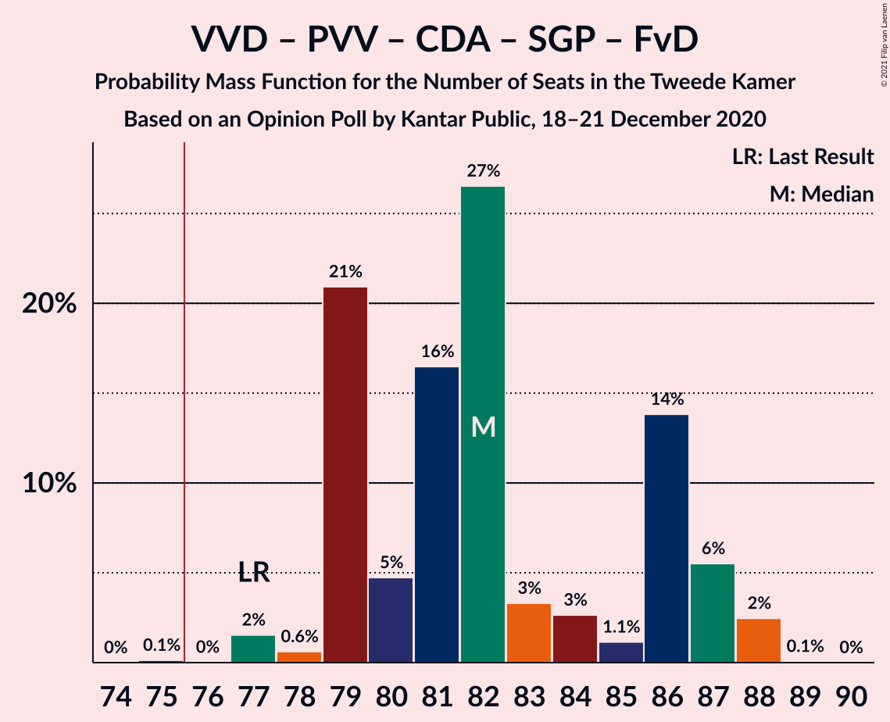
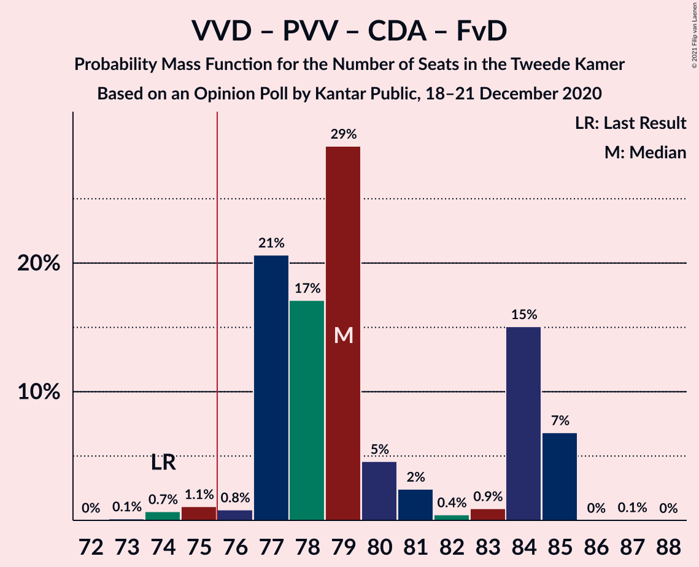
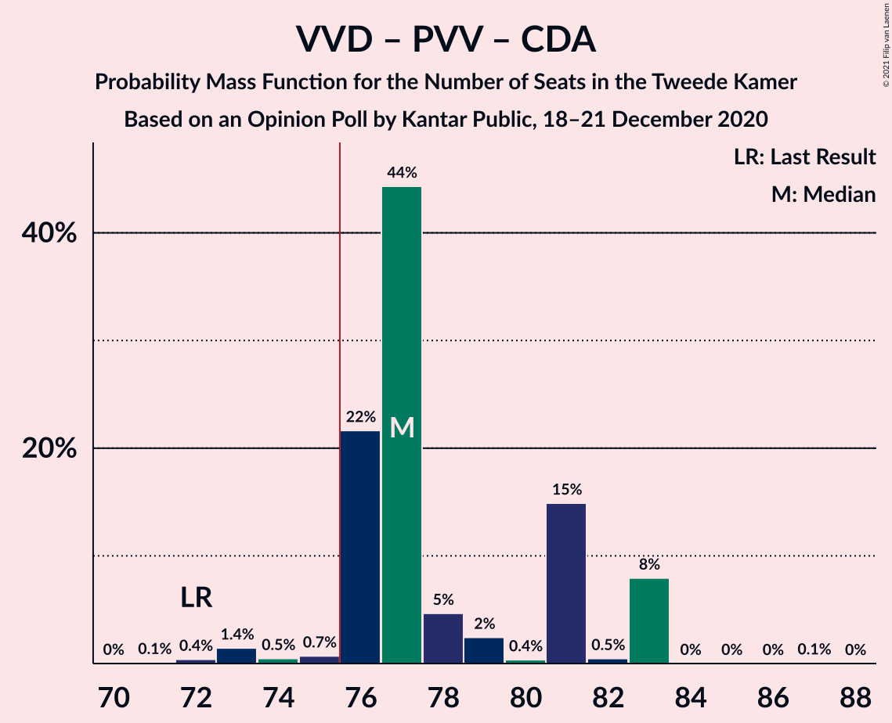
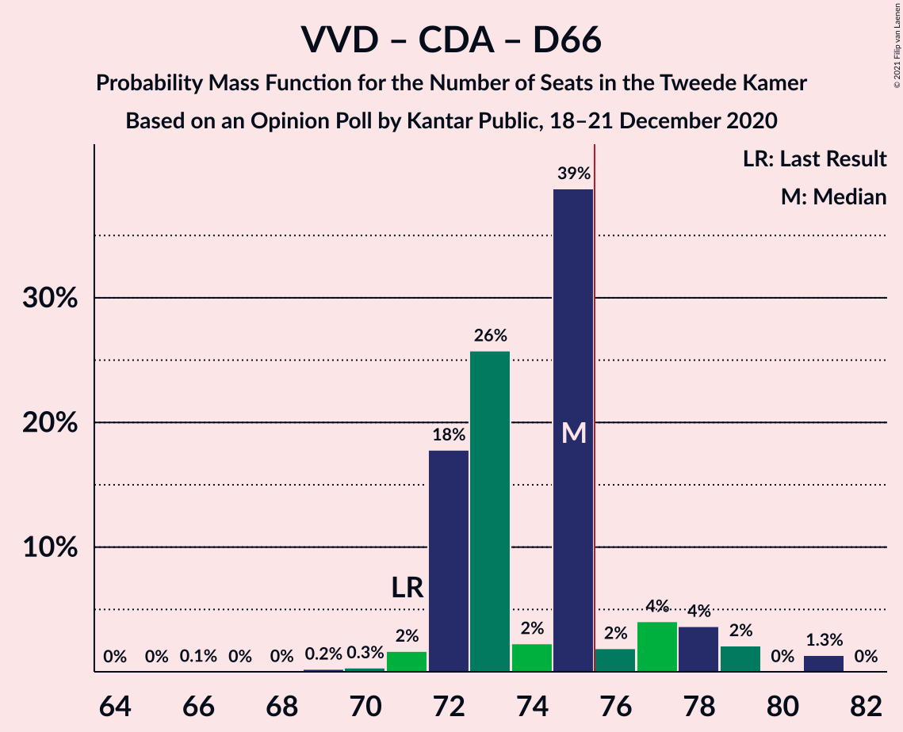
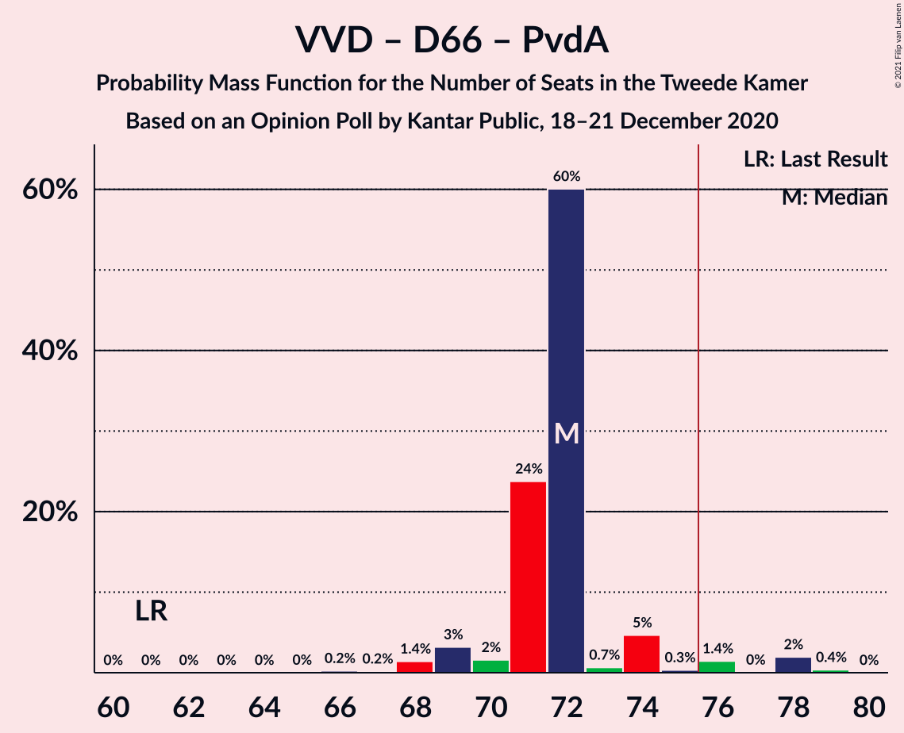
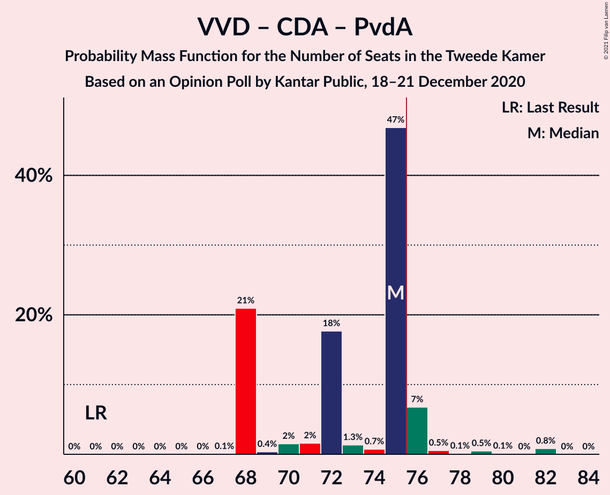

# Opinion Poll by Kantar Public, 18–21 December 2020

<a href="#voting-intentions">Voting Intentions</a> | <a href="#seats">Seats</a> | <a href="#coalitions">Coalitions</a> | <a href="#technical-information">Technical Information</a>

## Voting Intentions

### Confidence Intervals

| Party | Last Result | Poll Result | 80% Confidence Interval | 90% Confidence Interval | 95% Confidence Interval | 99% Confidence Interval |
|:-----:|:-----------:|:-----------:|:-----------------------:|:-----------------------:|:-----------------------:|:-----------------------:|
| Volkspartij voor Vrijheid en Democratie | 21.3% | 27.9% | 26.3–29.6% |25.8–30.0% |25.4–30.4% |24.7–31.3% |
| Partij voor de Vrijheid | 13.1% | 12.1% | 11.0–13.4% |10.7–13.7% |10.4–14.1% |9.9–14.7% |
| Christen-Democratisch Appèl | 12.4% | 10.9% | 9.8–12.1% |9.5–12.5% |9.3–12.8% |8.8–13.4% |
| Democraten 66 | 12.2% | 9.9% | 8.8–11.0% |8.6–11.4% |8.3–11.6% |7.8–12.2% |
| Partij van de Arbeid | 5.7% | 9.4% | 8.4–10.5% |8.1–10.8% |7.9–11.1% |7.4–11.7% |
| GroenLinks | 9.1% | 6.8% | 5.9–7.8% |5.7–8.1% |5.5–8.3% |5.1–8.8% |
| ChristenUnie | 3.4% | 6.6% | 5.8–7.6% |5.6–7.9% |5.4–8.2% |5.0–8.7% |
| Socialistische Partij | 9.1% | 5.8% | 5.0–6.8% |4.8–7.0% |4.6–7.3% |4.3–7.7% |
| Partij voor de Dieren | 3.2% | 3.8% | 3.2–4.6% |3.0–4.8% |2.9–5.0% |2.6–5.4% |
| Staatkundig Gereformeerde Partij | 2.1% | 1.9% | 1.4–2.5% |1.3–2.6% |1.2–2.8% |1.1–3.1% |
| DENK | 2.1% | 1.4% | 1.0–1.9% |0.9–2.1% |0.9–2.2% |0.7–2.5% |
| Forum voor Democratie | 1.8% | 1.4% | 1.0–1.9% |0.9–2.1% |0.9–2.2% |0.7–2.5% |
| 50Plus | 3.1% | 1.0% | 0.7–1.4% |0.6–1.6% |0.5–1.7% |0.4–2.0% |
| Juiste Antwoord 2021 | 0.0% | 0.9% | 0.6–1.3% |0.5–1.5% |0.5–1.6% |0.4–1.8% |

*Note:* The poll result column reflects the actual value used in the calculations. Published results may vary slightly, and in addition be rounded to fewer digits.

## Seats

### Confidence Intervals

| Party | Last Result | Median | 80% Confidence Interval | 90% Confidence Interval | 95% Confidence Interval | 99% Confidence Interval |
|:-----:|:-----------:|:------:|:-----------------------:|:-----------------------:|:-----------------------:|:-----------------------:|
| <a href="#volkspartij-voor-vrijheid-en-democratie">Volkspartij voor Vrijheid en Democratie</a> | 33 | 42 | 41–45 |40–46 |40–47 |39–49 |
| <a href="#partij-voor-de-vrijheid">Partij voor de Vrijheid</a> | 20 | 20 | 17–20 |16–20 |16–20 |15–22 |
| <a href="#christen-democratisch-appèl">Christen-Democratisch Appèl</a> | 19 | 17 | 15–18 |15–18 |14–19 |13–20 |
| <a href="#democraten-66">Democraten 66</a> | 19 | 14 | 14–19 |13–19 |13–19 |12–19 |
| <a href="#partij-van-de-arbeid">Partij van de Arbeid</a> | 9 | 14 | 12–16 |12–16 |12–16 |11–17 |
| <a href="#groenlinks">GroenLinks</a> | 14 | 11 | 9–12 |9–12 |9–12 |8–13 |
| <a href="#christenunie">ChristenUnie</a> | 5 | 9 | 8–11 |8–11 |8–12 |7–13 |
| <a href="#socialistische-partij">Socialistische Partij</a> | 14 | 9 | 8–10 |7–10 |7–10 |7–11 |
| <a href="#partij-voor-de-dieren">Partij voor de Dieren</a> | 5 | 6 | 5–8 |5–8 |4–8 |4–8 |
| <a href="#staatkundig-gereformeerde-partij">Staatkundig Gereformeerde Partij</a> | 3 | 2 | 2–3 |2–3 |1–3 |1–4 |
| <a href="#denk">DENK</a> | 3 | 1 | 1–2 |1–2 |1–3 |1–3 |
| <a href="#forum-voor-democratie">Forum voor Democratie</a> | 2 | 2 | 1–3 |1–3 |1–3 |0–3 |
| <a href="#50plus">50Plus</a> | 4 | 1 | 0–2 |0–2 |0–2 |0–3 |
| <a href="#juiste-antwoord-2021">Juiste Antwoord 2021</a> | 0 | 1 | 0–1 |0–2 |0–2 |0–3 |

### Volkspartij voor Vrijheid en Democratie

*For a full overview of the results for this party, see the [Volkspartij voor Vrijheid en Democratie](party-volkspartijvoorvrijheidendemocratie.html) page.*

| Number of Seats | Probability | Accumulated | Special Marks |
|:---------------:|:-----------:|:-----------:|:-------------:|
| 33 | 0% | 100% | Last Result |
| 34 | 0% | 100% |  |
| 35 | 0% | 100% |  |
| 36 | 0% | 100% |  |
| 37 | 0% | 100% |  |
| 38 | 0.3% | 100% |  |
| 39 | 0.6% | 99.7% |  |
| 40 | 4% | 99.0% |  |
| 41 | 36% | 95% |  |
| 42 | 27% | 59% | Median |
| 43 | 5% | 32% |  |
| 44 | 14% | 27% |  |
| 45 | 3% | 13% |  |
| 46 | 5% | 10% |  |
| 47 | 3% | 5% |  |
| 48 | 0.2% | 2% |  |
| 49 | 2% | 2% |  |
| 50 | 0% | 0% |  |

### Partij voor de Vrijheid

*For a full overview of the results for this party, see the [Partij voor de Vrijheid](party-partijvoordevrijheid.html) page.*

| Number of Seats | Probability | Accumulated | Special Marks |
|:---------------:|:-----------:|:-----------:|:-------------:|
| 14 | 0% | 100% |  |
| 15 | 0.7% | 99.9% |  |
| 16 | 5% | 99.2% |  |
| 17 | 6% | 94% |  |
| 18 | 26% | 88% |  |
| 19 | 6% | 62% |  |
| 20 | 55% | 56% | Last Result, Median |
| 21 | 0.9% | 2% |  |
| 22 | 0.7% | 0.7% |  |
| 23 | 0% | 0% |  |

### Christen-Democratisch Appèl

*For a full overview of the results for this party, see the [Christen-Democratisch Appèl](party-christen-democratischappèl.html) page.*

| Number of Seats | Probability | Accumulated | Special Marks |
|:---------------:|:-----------:|:-----------:|:-------------:|
| 13 | 0.5% | 100% |  |
| 14 | 3% | 99.4% |  |
| 15 | 22% | 97% |  |
| 16 | 21% | 75% |  |
| 17 | 41% | 54% | Median |
| 18 | 9% | 13% |  |
| 19 | 2% | 4% | Last Result |
| 20 | 2% | 2% |  |
| 21 | 0% | 0% |  |

### Democraten 66

*For a full overview of the results for this party, see the [Democraten 66](party-democraten66.html) page.*

| Number of Seats | Probability | Accumulated | Special Marks |
|:---------------:|:-----------:|:-----------:|:-------------:|
| 11 | 0.1% | 100% |  |
| 12 | 1.4% | 99.9% |  |
| 13 | 7% | 98% |  |
| 14 | 43% | 92% | Median |
| 15 | 20% | 48% |  |
| 16 | 5% | 29% |  |
| 17 | 2% | 24% |  |
| 18 | 0.3% | 22% |  |
| 19 | 22% | 22% | Last Result |
| 20 | 0% | 0% |  |

### Partij van de Arbeid

*For a full overview of the results for this party, see the [Partij van de Arbeid](party-partijvandearbeid.html) page.*

| Number of Seats | Probability | Accumulated | Special Marks |
|:---------------:|:-----------:|:-----------:|:-------------:|
| 9 | 0% | 100% | Last Result |
| 10 | 0% | 100% |  |
| 11 | 1.3% | 100% |  |
| 12 | 28% | 98.7% |  |
| 13 | 3% | 71% |  |
| 14 | 22% | 68% | Median |
| 15 | 20% | 46% |  |
| 16 | 25% | 26% |  |
| 17 | 0.4% | 0.7% |  |
| 18 | 0.2% | 0.2% |  |
| 19 | 0% | 0% |  |

### GroenLinks

*For a full overview of the results for this party, see the [GroenLinks](party-groenlinks.html) page.*

| Number of Seats | Probability | Accumulated | Special Marks |
|:---------------:|:-----------:|:-----------:|:-------------:|
| 7 | 0.2% | 100% |  |
| 8 | 0.7% | 99.8% |  |
| 9 | 22% | 99.1% |  |
| 10 | 7% | 77% |  |
| 11 | 43% | 70% | Median |
| 12 | 26% | 27% |  |
| 13 | 1.2% | 1.2% |  |
| 14 | 0% | 0% | Last Result |

### ChristenUnie

*For a full overview of the results for this party, see the [ChristenUnie](party-christenunie.html) page.*

| Number of Seats | Probability | Accumulated | Special Marks |
|:---------------:|:-----------:|:-----------:|:-------------:|
| 5 | 0% | 100% | Last Result |
| 6 | 0.2% | 100% |  |
| 7 | 0.9% | 99.8% |  |
| 8 | 18% | 98.9% |  |
| 9 | 37% | 81% | Median |
| 10 | 6% | 44% |  |
| 11 | 34% | 38% |  |
| 12 | 2% | 3% |  |
| 13 | 0.9% | 0.9% |  |
| 14 | 0% | 0% |  |

### Socialistische Partij

*For a full overview of the results for this party, see the [Socialistische Partij](party-socialistischepartij.html) page.*

| Number of Seats | Probability | Accumulated | Special Marks |
|:---------------:|:-----------:|:-----------:|:-------------:|
| 6 | 0.1% | 100% |  |
| 7 | 7% | 99.9% |  |
| 8 | 10% | 93% |  |
| 9 | 60% | 83% | Median |
| 10 | 22% | 23% |  |
| 11 | 1.2% | 2% |  |
| 12 | 0.4% | 0.4% |  |
| 13 | 0% | 0% |  |
| 14 | 0% | 0% | Last Result |

### Partij voor de Dieren

*For a full overview of the results for this party, see the [Partij voor de Dieren](party-partijvoordedieren.html) page.*

| Number of Seats | Probability | Accumulated | Special Marks |
|:---------------:|:-----------:|:-----------:|:-------------:|
| 3 | 0.2% | 100% |  |
| 4 | 4% | 99.8% |  |
| 5 | 29% | 96% | Last Result |
| 6 | 43% | 67% | Median |
| 7 | 4% | 24% |  |
| 8 | 19% | 19% |  |
| 9 | 0% | 0% |  |

### Staatkundig Gereformeerde Partij

*For a full overview of the results for this party, see the [Staatkundig Gereformeerde Partij](party-staatkundiggereformeerdepartij.html) page.*

| Number of Seats | Probability | Accumulated | Special Marks |
|:---------------:|:-----------:|:-----------:|:-------------:|
| 1 | 4% | 100% |  |
| 2 | 47% | 96% | Median |
| 3 | 48% | 50% | Last Result |
| 4 | 2% | 2% |  |
| 5 | 0.2% | 0.2% |  |
| 6 | 0% | 0% |  |

### DENK

*For a full overview of the results for this party, see the [DENK](party-denk.html) page.*

| Number of Seats | Probability | Accumulated | Special Marks |
|:---------------:|:-----------:|:-----------:|:-------------:|
| 1 | 63% | 100% | Median |
| 2 | 34% | 37% |  |
| 3 | 3% | 3% | Last Result |
| 4 | 0.1% | 0.1% |  |
| 5 | 0% | 0% |  |

### Forum voor Democratie

*For a full overview of the results for this party, see the [Forum voor Democratie](party-forumvoordemocratie.html) page.*

| Number of Seats | Probability | Accumulated | Special Marks |
|:---------------:|:-----------:|:-----------:|:-------------:|
| 0 | 0.6% | 100% |  |
| 1 | 41% | 99.4% |  |
| 2 | 42% | 58% | Last Result, Median |
| 3 | 16% | 16% |  |
| 4 | 0% | 0% |  |

### 50Plus

*For a full overview of the results for this party, see the [50Plus](party-50plus.html) page.*

| Number of Seats | Probability | Accumulated | Special Marks |
|:---------------:|:-----------:|:-----------:|:-------------:|
| 0 | 44% | 100% |  |
| 1 | 38% | 56% | Median |
| 2 | 16% | 18% |  |
| 3 | 2% | 2% |  |
| 4 | 0% | 0% | Last Result |

### Juiste Antwoord 2021

*For a full overview of the results for this party, see the [Juiste Antwoord 2021](party-juisteantwoord2021.html) page.*

| Number of Seats | Probability | Accumulated | Special Marks |
|:---------------:|:-----------:|:-----------:|:-------------:|
| 0 | 27% | 100% | Last Result |
| 1 | 67% | 73% | Median |
| 2 | 5% | 5% |  |
| 3 | 0.5% | 0.5% |  |
| 4 | 0% | 0% |  |

## Coalitions

### Confidence Intervals

| Coalition | Last Result | Median | Majority? | 80% Confidence Interval | 90% Confidence Interval | 95% Confidence Interval | 99% Confidence Interval |
|:---------:|:-----------:|:------:|:---------:|:-----------------------:|:-----------------------:|:-----------------------:|:-----------------------:|
| Volkspartij voor Vrijheid en Democratie – Christen-Democratisch Appèl – Democraten 66 – Partij van de Arbeid – ChristenUnie | 85 | 97 | 100% | 96–100 | 96–101 | 96–103 | 94–105 |
| Volkspartij voor Vrijheid en Democratie – Christen-Democratisch Appèl – Democraten 66 – GroenLinks – ChristenUnie | 90 | 95 | 100% | 92–96 | 92–99 | 92–99 | 90–101 |
| Volkspartij voor Vrijheid en Democratie – Christen-Democratisch Appèl – Democraten 66 – ChristenUnie | 76 | 84 | 100% | 81–86 | 81–88 | 81–89 | 80–91 |
| Volkspartij voor Vrijheid en Democratie – Partij voor de Vrijheid – Christen-Democratisch Appèl – Staatkundig Gereformeerde Partij – Forum voor Democratie | 77 | 82 | 99.8% | 79–86 | 79–87 | 79–88 | 77–88 |
| Volkspartij voor Vrijheid en Democratie – Partij voor de Vrijheid – Christen-Democratisch Appèl – Forum voor Democratie | 74 | 79 | 98% | 77–84 | 77–85 | 76–85 | 74–85 |
| Volkspartij voor Vrijheid en Democratie – Partij voor de Vrijheid – Christen-Democratisch Appèl | 72 | 77 | 97% | 76–81 | 76–83 | 75–83 | 72–83 |
| Volkspartij voor Vrijheid en Democratie – Christen-Democratisch Appèl – Democraten 66 | 71 | 75 | 13% | 72–77 | 72–78 | 72–79 | 70–81 |
| Christen-Democratisch Appèl – Democraten 66 – Partij van de Arbeid – GroenLinks – ChristenUnie – Socialistische Partij | 80 | 76 | 54% | 71–79 | 71–79 | 69–79 | 68–80 |
| Volkspartij voor Vrijheid en Democratie – Democraten 66 – Partij van de Arbeid | 61 | 72 | 4% | 71–72 | 69–74 | 69–76 | 68–78 |
| Volkspartij voor Vrijheid en Democratie – Christen-Democratisch Appèl – Partij van de Arbeid | 61 | 75 | 9% | 68–75 | 68–76 | 68–76 | 68–82 |
| Christen-Democratisch Appèl – Democraten 66 – Partij van de Arbeid – GroenLinks – ChristenUnie | 66 | 66 | 0% | 62–70 | 62–70 | 61–70 | 60–72 |
| Volkspartij voor Vrijheid en Democratie – Christen-Democratisch Appèl – Staatkundig Gereformeerde Partij – Forum voor Democratie – 50Plus | 61 | 64 | 0% | 60–68 | 60–69 | 60–69 | 60–71 |
| Volkspartij voor Vrijheid en Democratie – Christen-Democratisch Appèl – Staatkundig Gereformeerde Partij – Forum voor Democratie | 57 | 64 | 0% | 59–67 | 59–68 | 59–68 | 59–71 |
| Volkspartij voor Vrijheid en Democratie – Christen-Democratisch Appèl – Forum voor Democratie – 50Plus | 58 | 61 | 0% | 58–66 | 58–66 | 58–67 | 58–68 |
| Volkspartij voor Vrijheid en Democratie – Christen-Democratisch Appèl – Forum voor Democratie | 54 | 61 | 0% | 57–64 | 57–65 | 57–66 | 57–68 |
| Volkspartij voor Vrijheid en Democratie – Christen-Democratisch Appèl | 52 | 59 | 0% | 56–62 | 56–63 | 56–64 | 55–67 |
| Volkspartij voor Vrijheid en Democratie – Partij van de Arbeid | 42 | 58 | 0% | 53–58 | 53–59 | 53–61 | 52–64 |
| Christen-Democratisch Appèl – Democraten 66 – Partij van de Arbeid | 47 | 46 | 0% | 44–47 | 43–47 | 43–50 | 40–51 |
| Christen-Democratisch Appèl – Partij van de Arbeid – ChristenUnie | 33 | 40 | 0% | 36–44 | 36–44 | 36–45 | 36–46 |
| Christen-Democratisch Appèl – Democraten 66 | 38 | 31 | 0% | 31–34 | 30–34 | 29–36 | 28–36 |
| Christen-Democratisch Appèl – Partij van de Arbeid | 28 | 31 | 0% | 27–33 | 27–33 | 27–33 | 25–35 |

### Volkspartij voor Vrijheid en Democratie – Christen-Democratisch Appèl – Democraten 66 – Partij van de Arbeid – ChristenUnie

| Number of Seats | Probability | Accumulated | Special Marks |
|:---------------:|:-----------:|:-----------:|:-------------:|
| 85 | 0% | 100% | Last Result |
| 86 | 0% | 100% |  |
| 87 | 0% | 100% |  |
| 88 | 0% | 100% |  |
| 89 | 0% | 100% |  |
| 90 | 0% | 100% |  |
| 91 | 0% | 100% |  |
| 92 | 0% | 100% |  |
| 93 | 0.3% | 99.9% |  |
| 94 | 0.8% | 99.6% |  |
| 95 | 0.4% | 98.8% |  |
| 96 | 38% | 98% | Median |
| 97 | 17% | 60% |  |
| 98 | 4% | 43% |  |
| 99 | 0.9% | 40% |  |
| 100 | 33% | 39% |  |
| 101 | 2% | 6% |  |
| 102 | 2% | 4% |  |
| 103 | 0.1% | 3% |  |
| 104 | 0.9% | 2% |  |
| 105 | 1.2% | 2% |  |
| 106 | 0% | 0.4% |  |
| 107 | 0.3% | 0.3% |  |
| 108 | 0% | 0% |  |

### Volkspartij voor Vrijheid en Democratie – Christen-Democratisch Appèl – Democraten 66 – GroenLinks – ChristenUnie

| Number of Seats | Probability | Accumulated | Special Marks |
|:---------------:|:-----------:|:-----------:|:-------------:|
| 88 | 0.1% | 100% |  |
| 89 | 0.3% | 99.9% |  |
| 90 | 0.5% | 99.7% | Last Result |
| 91 | 0.6% | 99.2% |  |
| 92 | 32% | 98.6% |  |
| 93 | 1.4% | 67% | Median |
| 94 | 2% | 66% |  |
| 95 | 26% | 64% |  |
| 96 | 28% | 38% |  |
| 97 | 2% | 10% |  |
| 98 | 2% | 8% |  |
| 99 | 4% | 6% |  |
| 100 | 0.9% | 2% |  |
| 101 | 1.2% | 1.2% |  |
| 102 | 0% | 0.1% |  |
| 103 | 0% | 0% |  |

### Volkspartij voor Vrijheid en Democratie – Christen-Democratisch Appèl – Democraten 66 – ChristenUnie

| Number of Seats | Probability | Accumulated | Special Marks |
|:---------------:|:-----------:|:-----------:|:-------------:|
| 76 | 0% | 100% | Last Result, Majority |
| 77 | 0% | 100% |  |
| 78 | 0.1% | 100% |  |
| 79 | 0.3% | 99.9% |  |
| 80 | 1.3% | 99.6% |  |
| 81 | 17% | 98% |  |
| 82 | 1.5% | 81% | Median |
| 83 | 15% | 80% |  |
| 84 | 45% | 65% |  |
| 85 | 2% | 20% |  |
| 86 | 9% | 18% |  |
| 87 | 2% | 9% |  |
| 88 | 5% | 8% |  |
| 89 | 1.1% | 3% |  |
| 90 | 0.4% | 2% |  |
| 91 | 1.2% | 1.2% |  |
| 92 | 0% | 0% |  |

### Volkspartij voor Vrijheid en Democratie – Partij voor de Vrijheid – Christen-Democratisch Appèl – Staatkundig Gereformeerde Partij – Forum voor Democratie

| Number of Seats | Probability | Accumulated | Special Marks |
|:---------------:|:-----------:|:-----------:|:-------------:|
| 75 | 0.1% | 100% |  |
| 76 | 0% | 99.8% | Majority |
| 77 | 2% | 99.8% | Last Result |
| 78 | 0.6% | 98% |  |
| 79 | 21% | 98% |  |
| 80 | 5% | 77% |  |
| 81 | 16% | 72% |  |
| 82 | 27% | 56% |  |
| 83 | 3% | 29% | Median |
| 84 | 3% | 26% |  |
| 85 | 1.1% | 23% |  |
| 86 | 14% | 22% |  |
| 87 | 6% | 8% |  |
| 88 | 2% | 3% |  |
| 89 | 0.1% | 0.1% |  |
| 90 | 0% | 0% |  |

### Volkspartij voor Vrijheid en Democratie – Partij voor de Vrijheid – Christen-Democratisch Appèl – Forum voor Democratie

| Number of Seats | Probability | Accumulated | Special Marks |
|:---------------:|:-----------:|:-----------:|:-------------:|
| 73 | 0.1% | 100% |  |
| 74 | 0.7% | 99.8% | Last Result |
| 75 | 1.1% | 99.1% |  |
| 76 | 0.8% | 98% | Majority |
| 77 | 21% | 97% |  |
| 78 | 17% | 77% |  |
| 79 | 29% | 59% |  |
| 80 | 5% | 30% |  |
| 81 | 2% | 26% | Median |
| 82 | 0.4% | 23% |  |
| 83 | 0.9% | 23% |  |
| 84 | 15% | 22% |  |
| 85 | 7% | 7% |  |
| 86 | 0% | 0.1% |  |
| 87 | 0.1% | 0.1% |  |
| 88 | 0% | 0% |  |

### Volkspartij voor Vrijheid en Democratie – Partij voor de Vrijheid – Christen-Democratisch Appèl

| Number of Seats | Probability | Accumulated | Special Marks |
|:---------------:|:-----------:|:-----------:|:-------------:|
| 71 | 0.1% | 100% |  |
| 72 | 0.4% | 99.9% | Last Result |
| 73 | 1.4% | 99.5% |  |
| 74 | 0.5% | 98% |  |
| 75 | 0.7% | 98% |  |
| 76 | 22% | 97% | Majority |
| 77 | 44% | 75% |  |
| 78 | 5% | 31% |  |
| 79 | 2% | 26% | Median |
| 80 | 0.4% | 24% |  |
| 81 | 15% | 23% |  |
| 82 | 0.5% | 9% |  |
| 83 | 8% | 8% |  |
| 84 | 0% | 0.1% |  |
| 85 | 0% | 0.1% |  |
| 86 | 0% | 0.1% |  |
| 87 | 0.1% | 0.1% |  |
| 88 | 0% | 0% |  |

### Volkspartij voor Vrijheid en Democratie – Christen-Democratisch Appèl – Democraten 66

| Number of Seats | Probability | Accumulated | Special Marks |
|:---------------:|:-----------:|:-----------:|:-------------:|
| 66 | 0.1% | 100% |  |
| 67 | 0% | 99.9% |  |
| 68 | 0% | 99.9% |  |
| 69 | 0.2% | 99.9% |  |
| 70 | 0.3% | 99.7% |  |
| 71 | 2% | 99.3% | Last Result |
| 72 | 18% | 98% |  |
| 73 | 26% | 80% | Median |
| 74 | 2% | 54% |  |
| 75 | 39% | 52% |  |
| 76 | 2% | 13% | Majority |
| 77 | 4% | 11% |  |
| 78 | 4% | 7% |  |
| 79 | 2% | 3% |  |
| 80 | 0% | 1.4% |  |
| 81 | 1.3% | 1.4% |  |
| 82 | 0% | 0% |  |

### Christen-Democratisch Appèl – Democraten 66 – Partij van de Arbeid – GroenLinks – ChristenUnie – Socialistische Partij

| Number of Seats | Probability | Accumulated | Special Marks |
|:---------------:|:-----------:|:-----------:|:-------------:|
| 68 | 2% | 100% |  |
| 69 | 0.8% | 98% |  |
| 70 | 0.4% | 97% |  |
| 71 | 16% | 96% |  |
| 72 | 5% | 81% |  |
| 73 | 2% | 76% |  |
| 74 | 2% | 74% | Median |
| 75 | 19% | 72% |  |
| 76 | 25% | 54% | Majority |
| 77 | 3% | 29% |  |
| 78 | 0.3% | 26% |  |
| 79 | 25% | 26% |  |
| 80 | 0.2% | 0.7% | Last Result |
| 81 | 0.3% | 0.5% |  |
| 82 | 0.2% | 0.2% |  |
| 83 | 0% | 0% |  |

### Volkspartij voor Vrijheid en Democratie – Democraten 66 – Partij van de Arbeid

| Number of Seats | Probability | Accumulated | Special Marks |
|:---------------:|:-----------:|:-----------:|:-------------:|
| 61 | 0% | 100% | Last Result |
| 62 | 0% | 100% |  |
| 63 | 0% | 100% |  |
| 64 | 0% | 100% |  |
| 65 | 0% | 100% |  |
| 66 | 0.2% | 100% |  |
| 67 | 0.2% | 99.7% |  |
| 68 | 1.4% | 99.5% |  |
| 69 | 3% | 98% |  |
| 70 | 2% | 95% | Median |
| 71 | 24% | 93% |  |
| 72 | 60% | 70% |  |
| 73 | 0.7% | 10% |  |
| 74 | 5% | 9% |  |
| 75 | 0.3% | 4% |  |
| 76 | 1.4% | 4% | Majority |
| 77 | 0% | 2% |  |
| 78 | 2% | 2% |  |
| 79 | 0.4% | 0.4% |  |
| 80 | 0% | 0% |  |

### Volkspartij voor Vrijheid en Democratie – Christen-Democratisch Appèl – Partij van de Arbeid

| Number of Seats | Probability | Accumulated | Special Marks |
|:---------------:|:-----------:|:-----------:|:-------------:|
| 61 | 0% | 100% | Last Result |
| 62 | 0% | 100% |  |
| 63 | 0% | 100% |  |
| 64 | 0% | 100% |  |
| 65 | 0% | 100% |  |
| 66 | 0% | 100% |  |
| 67 | 0.1% | 100% |  |
| 68 | 21% | 99.9% |  |
| 69 | 0.4% | 79% |  |
| 70 | 2% | 79% |  |
| 71 | 2% | 77% |  |
| 72 | 18% | 75% |  |
| 73 | 1.3% | 58% | Median |
| 74 | 0.7% | 56% |  |
| 75 | 47% | 56% |  |
| 76 | 7% | 9% | Majority |
| 77 | 0.5% | 2% |  |
| 78 | 0.1% | 2% |  |
| 79 | 0.5% | 1.4% |  |
| 80 | 0.1% | 0.9% |  |
| 81 | 0% | 0.8% |  |
| 82 | 0.8% | 0.8% |  |
| 83 | 0% | 0% |  |

### Christen-Democratisch Appèl – Democraten 66 – Partij van de Arbeid – GroenLinks – ChristenUnie

| Number of Seats | Probability | Accumulated | Special Marks |
|:---------------:|:-----------:|:-----------:|:-------------:|
| 60 | 2% | 100% |  |
| 61 | 1.1% | 98% |  |
| 62 | 14% | 96% |  |
| 63 | 3% | 83% |  |
| 64 | 3% | 80% |  |
| 65 | 5% | 77% | Median |
| 66 | 37% | 72% | Last Result |
| 67 | 6% | 35% |  |
| 68 | 1.3% | 29% |  |
| 69 | 0.5% | 28% |  |
| 70 | 26% | 28% |  |
| 71 | 1.3% | 2% |  |
| 72 | 0.3% | 0.5% |  |
| 73 | 0.2% | 0.2% |  |
| 74 | 0% | 0% |  |

### Volkspartij voor Vrijheid en Democratie – Christen-Democratisch Appèl – Staatkundig Gereformeerde Partij – Forum voor Democratie – 50Plus

| Number of Seats | Probability | Accumulated | Special Marks |
|:---------------:|:-----------:|:-----------:|:-------------:|
| 59 | 0.1% | 100% |  |
| 60 | 20% | 99.8% |  |
| 61 | 17% | 79% | Last Result |
| 62 | 0.3% | 62% |  |
| 63 | 2% | 62% |  |
| 64 | 27% | 60% | Median |
| 65 | 5% | 33% |  |
| 66 | 2% | 28% |  |
| 67 | 0.5% | 26% |  |
| 68 | 19% | 25% |  |
| 69 | 5% | 7% |  |
| 70 | 0.1% | 1.2% |  |
| 71 | 1.0% | 1.1% |  |
| 72 | 0.1% | 0.1% |  |
| 73 | 0% | 0% |  |

### Volkspartij voor Vrijheid en Democratie – Christen-Democratisch Appèl – Staatkundig Gereformeerde Partij – Forum voor Democratie

| Number of Seats | Probability | Accumulated | Special Marks |
|:---------------:|:-----------:|:-----------:|:-------------:|
| 57 | 0% | 100% | Last Result |
| 58 | 0.4% | 99.9% |  |
| 59 | 21% | 99.6% |  |
| 60 | 2% | 79% |  |
| 61 | 16% | 78% |  |
| 62 | 1.2% | 61% |  |
| 63 | 3% | 60% | Median |
| 64 | 30% | 57% |  |
| 65 | 1.2% | 27% |  |
| 66 | 16% | 26% |  |
| 67 | 3% | 10% |  |
| 68 | 6% | 7% |  |
| 69 | 0.1% | 1.1% |  |
| 70 | 0.2% | 1.1% |  |
| 71 | 0.9% | 0.9% |  |
| 72 | 0% | 0% |  |

### Volkspartij voor Vrijheid en Democratie – Christen-Democratisch Appèl – Forum voor Democratie – 50Plus

| Number of Seats | Probability | Accumulated | Special Marks |
|:---------------:|:-----------:|:-----------:|:-------------:|
| 56 | 0% | 100% |  |
| 57 | 0.2% | 99.9% |  |
| 58 | 36% | 99.7% | Last Result |
| 59 | 2% | 64% |  |
| 60 | 0.6% | 62% |  |
| 61 | 26% | 61% |  |
| 62 | 3% | 35% | Median |
| 63 | 1.5% | 32% |  |
| 64 | 6% | 31% |  |
| 65 | 4% | 25% |  |
| 66 | 16% | 21% |  |
| 67 | 4% | 5% |  |
| 68 | 1.0% | 1.1% |  |
| 69 | 0% | 0% |  |

### Volkspartij voor Vrijheid en Democratie – Christen-Democratisch Appèl – Forum voor Democratie

| Number of Seats | Probability | Accumulated | Special Marks |
|:---------------:|:-----------:|:-----------:|:-------------:|
| 54 | 0% | 100% | Last Result |
| 55 | 0.1% | 100% |  |
| 56 | 0.4% | 99.9% |  |
| 57 | 21% | 99.5% |  |
| 58 | 17% | 79% |  |
| 59 | 1.2% | 62% |  |
| 60 | 1.5% | 61% |  |
| 61 | 27% | 59% | Median |
| 62 | 2% | 32% |  |
| 63 | 7% | 30% |  |
| 64 | 15% | 23% |  |
| 65 | 3% | 8% |  |
| 66 | 4% | 5% |  |
| 67 | 0.2% | 1.1% |  |
| 68 | 0.8% | 0.9% |  |
| 69 | 0% | 0% |  |

### Volkspartij voor Vrijheid en Democratie – Christen-Democratisch Appèl

| Number of Seats | Probability | Accumulated | Special Marks |
|:---------------:|:-----------:|:-----------:|:-------------:|
| 52 | 0% | 100% | Last Result |
| 53 | 0.1% | 100% |  |
| 54 | 0.1% | 99.9% |  |
| 55 | 0.4% | 99.8% |  |
| 56 | 23% | 99.4% |  |
| 57 | 17% | 77% |  |
| 58 | 0.9% | 60% |  |
| 59 | 25% | 59% | Median |
| 60 | 4% | 34% |  |
| 61 | 20% | 31% |  |
| 62 | 2% | 10% |  |
| 63 | 3% | 8% |  |
| 64 | 4% | 5% |  |
| 65 | 0.2% | 1.1% |  |
| 66 | 0.1% | 0.9% |  |
| 67 | 0.8% | 0.8% |  |
| 68 | 0% | 0% |  |

### Volkspartij voor Vrijheid en Democratie – Partij van de Arbeid

| Number of Seats | Probability | Accumulated | Special Marks |
|:---------------:|:-----------:|:-----------:|:-------------:|
| 42 | 0% | 100% | Last Result |
| 43 | 0% | 100% |  |
| 44 | 0% | 100% |  |
| 45 | 0% | 100% |  |
| 46 | 0% | 100% |  |
| 47 | 0% | 100% |  |
| 48 | 0% | 100% |  |
| 49 | 0% | 100% |  |
| 50 | 0% | 100% |  |
| 51 | 0.2% | 100% |  |
| 52 | 0.5% | 99.8% |  |
| 53 | 21% | 99.3% |  |
| 54 | 2% | 78% |  |
| 55 | 4% | 77% |  |
| 56 | 18% | 73% | Median |
| 57 | 5% | 55% |  |
| 58 | 42% | 50% |  |
| 59 | 4% | 8% |  |
| 60 | 0.8% | 4% |  |
| 61 | 1.2% | 3% |  |
| 62 | 0.9% | 2% |  |
| 63 | 0.4% | 1.2% |  |
| 64 | 0.9% | 0.9% |  |
| 65 | 0% | 0% |  |

### Christen-Democratisch Appèl – Democraten 66 – Partij van de Arbeid

| Number of Seats | Probability | Accumulated | Special Marks |
|:---------------:|:-----------:|:-----------:|:-------------:|
| 40 | 1.0% | 100% |  |
| 41 | 0.5% | 98.9% |  |
| 42 | 0.5% | 98% |  |
| 43 | 8% | 98% |  |
| 44 | 3% | 90% |  |
| 45 | 16% | 88% | Median |
| 46 | 43% | 72% |  |
| 47 | 25% | 30% | Last Result |
| 48 | 0.4% | 4% |  |
| 49 | 0.6% | 4% |  |
| 50 | 2% | 3% |  |
| 51 | 1.4% | 1.5% |  |
| 52 | 0% | 0% |  |

### Christen-Democratisch Appèl – Partij van de Arbeid – ChristenUnie

| Number of Seats | Probability | Accumulated | Special Marks |
|:---------------:|:-----------:|:-----------:|:-------------:|
| 33 | 0% | 100% | Last Result |
| 34 | 0% | 100% |  |
| 35 | 0.1% | 100% |  |
| 36 | 25% | 99.9% |  |
| 37 | 1.0% | 75% |  |
| 38 | 3% | 74% |  |
| 39 | 14% | 72% |  |
| 40 | 16% | 57% | Median |
| 41 | 7% | 41% |  |
| 42 | 2% | 34% |  |
| 43 | 5% | 33% |  |
| 44 | 24% | 28% |  |
| 45 | 2% | 4% |  |
| 46 | 1.2% | 1.5% |  |
| 47 | 0.2% | 0.2% |  |
| 48 | 0% | 0% |  |

### Christen-Democratisch Appèl – Democraten 66

| Number of Seats | Probability | Accumulated | Special Marks |
|:---------------:|:-----------:|:-----------:|:-------------:|
| 26 | 0% | 100% |  |
| 27 | 0.1% | 99.9% |  |
| 28 | 2% | 99.8% |  |
| 29 | 2% | 98% |  |
| 30 | 3% | 96% |  |
| 31 | 61% | 93% | Median |
| 32 | 7% | 33% |  |
| 33 | 0.8% | 26% |  |
| 34 | 21% | 25% |  |
| 35 | 1.2% | 4% |  |
| 36 | 3% | 3% |  |
| 37 | 0.3% | 0.3% |  |
| 38 | 0% | 0% | Last Result |

### Christen-Democratisch Appèl – Partij van de Arbeid

| Number of Seats | Probability | Accumulated | Special Marks |
|:---------------:|:-----------:|:-----------:|:-------------:|
| 25 | 1.0% | 100% |  |
| 26 | 0.2% | 99.0% |  |
| 27 | 22% | 98.8% |  |
| 28 | 4% | 77% | Last Result |
| 29 | 0.5% | 73% |  |
| 30 | 7% | 73% |  |
| 31 | 31% | 66% | Median |
| 32 | 5% | 35% |  |
| 33 | 27% | 30% |  |
| 34 | 0.6% | 2% |  |
| 35 | 1.5% | 1.5% |  |
| 36 | 0% | 0% |  |

## Technical Information

### Opinion Poll

+ **Polling firm:** Kantar Public
+ **Commissioner(s):** —
+ **Fieldwork period:** 18–21 December 2020

### Calculations

+ **Sample size:** 1238
+ **Simulations done:** 1,048,576
+ **Error estimate:** 3.03%

