# Opinion Poll by Peil.nl, 1–2 January 2021

<a href="#voting-intentions">Voting Intentions</a> | <a href="#seats">Seats</a> | <a href="#coalitions">Coalitions</a> | <a href="#technical-information">Technical Information</a>

## Voting Intentions

### Confidence Intervals

| Party | Last Result | Poll Result | 80% Confidence Interval | 90% Confidence Interval | 95% Confidence Interval | 99% Confidence Interval |
|:-----:|:-----------:|:-----------:|:-----------------------:|:-----------------------:|:-----------------------:|:-----------------------:|
| Volkspartij voor Vrijheid en Democratie | 21.3% | 22.0% | 21.0–23.0% |20.7–23.2% |20.5–23.5% |20.1–24.0% |
| Partij voor de Vrijheid | 13.1% | 16.6% | 15.8–17.5% |15.5–17.8% |15.3–18.0% |14.9–18.5% |
| Christen-Democratisch Appèl | 12.4% | 12.0% | 11.2–12.8% |11.0–13.0% |10.9–13.2% |10.5–13.6% |
| Democraten 66 | 12.2% | 8.7% | 8.0–9.4% |7.8–9.6% |7.7–9.7% |7.4–10.1% |
| Partij van de Arbeid | 5.7% | 8.0% | 7.4–8.7% |7.2–8.9% |7.1–9.0% |6.8–9.4% |
| GroenLinks | 9.1% | 6.7% | 6.1–7.3% |6.0–7.5% |5.8–7.6% |5.6–7.9% |
| Socialistische Partij | 9.1% | 6.0% | 5.5–6.6% |5.3–6.8% |5.2–6.9% |5.0–7.2% |
| ChristenUnie | 3.4% | 5.3% | 4.8–5.9% |4.7–6.1% |4.6–6.2% |4.4–6.5% |
| Partij voor de Dieren | 3.2% | 4.0% | 3.6–4.5% |3.4–4.6% |3.4–4.8% |3.2–5.0% |
| Staatkundig Gereformeerde Partij | 2.1% | 2.7% | 2.3–3.1% |2.2–3.2% |2.1–3.3% |2.0–3.5% |
| Forum voor Democratie | 1.8% | 2.7% | 2.3–3.1% |2.2–3.2% |2.1–3.3% |2.0–3.5% |
| DENK | 2.1% | 2.0% | 1.7–2.4% |1.6–2.5% |1.6–2.6% |1.4–2.8% |
| Juiste Antwoord 2021 | 0.0% | 1.3% | 1.1–1.6% |1.0–1.7% |1.0–1.8% |0.9–2.0% |
| 50Plus | 3.1% | 0.7% | 0.5–0.9% |0.5–1.0% |0.4–1.0% |0.4–1.2% |
| Bij1 | 0.3% | 0.7% | 0.5–0.9% |0.5–1.0% |0.4–1.0% |0.4–1.2% |
| Code Oranje | 0.0% | 0.7% | 0.5–0.9% |0.5–1.0% |0.4–1.0% |0.4–1.2% |

*Note:* The poll result column reflects the actual value used in the calculations. Published results may vary slightly, and in addition be rounded to fewer digits.

## Seats

### Confidence Intervals

| Party | Last Result | Median | 80% Confidence Interval | 90% Confidence Interval | 95% Confidence Interval | 99% Confidence Interval |
|:-----:|:-----------:|:------:|:-----------------------:|:-----------------------:|:-----------------------:|:-----------------------:|
| <a href="#volkspartij-voor-vrijheid-en-democratie">Volkspartij voor Vrijheid en Democratie</a> | 33 | 34 | 32–35 |32–36 |31–37 |31–38 |
| <a href="#partij-voor-de-vrijheid">Partij voor de Vrijheid</a> | 20 | 26 | 25–28 |24–29 |24–29 |22–29 |
| <a href="#christen-democratisch-appèl">Christen-Democratisch Appèl</a> | 19 | 18 | 17–20 |17–21 |17–21 |16–21 |
| <a href="#democraten-66">Democraten 66</a> | 19 | 13 | 12–14 |12–15 |11–15 |11–16 |
| <a href="#partij-van-de-arbeid">Partij van de Arbeid</a> | 9 | 12 | 11–13 |11–14 |11–14 |10–14 |
| <a href="#groenlinks">GroenLinks</a> | 14 | 11 | 9–12 |9–12 |9–12 |8–12 |
| <a href="#socialistische-partij">Socialistische Partij</a> | 14 | 10 | 8–11 |7–11 |7–11 |7–11 |
| <a href="#christenunie">ChristenUnie</a> | 5 | 7 | 6–9 |6–9 |6–9 |6–9 |
| <a href="#partij-voor-de-dieren">Partij voor de Dieren</a> | 5 | 6 | 5–7 |5–7 |4–7 |4–8 |
| <a href="#staatkundig-gereformeerde-partij">Staatkundig Gereformeerde Partij</a> | 3 | 3 | 3–4 |3–4 |3–5 |2–5 |
| <a href="#forum-voor-democratie">Forum voor Democratie</a> | 2 | 4 | 3–5 |3–5 |3–5 |2–5 |
| <a href="#denk">DENK</a> | 3 | 3 | 2–3 |2–3 |2–3 |2–4 |
| <a href="#juiste-antwoord-2021">Juiste Antwoord 2021</a> | 0 | 2 | 1–3 |1–3 |1–3 |1–3 |
| <a href="#50plus">50Plus</a> | 4 | 1 | 0–1 |0–1 |0–1 |0–2 |
| <a href="#bij1">Bij1</a> | 0 | 1 | 0–1 |0–1 |0–1 |0–1 |
| <a href="#code-oranje">Code Oranje</a> | 0 | 0 | 0–1 |0–1 |0–1 |0–1 |

### Volkspartij voor Vrijheid en Democratie

*For a full overview of the results for this party, see the [Volkspartij voor Vrijheid en Democratie](party-volkspartijvoorvrijheidendemocratie.html) page.*

| Number of Seats | Probability | Accumulated | Special Marks |
|:---------------:|:-----------:|:-----------:|:-------------:|
| 30 | 0.1% | 100% |  |
| 31 | 3% | 99.9% |  |
| 32 | 18% | 97% |  |
| 33 | 24% | 79% | Last Result |
| 34 | 43% | 54% | Median |
| 35 | 5% | 11% |  |
| 36 | 3% | 6% |  |
| 37 | 3% | 3% |  |
| 38 | 0.4% | 0.5% |  |
| 39 | 0.1% | 0.1% |  |
| 40 | 0% | 0% |  |

### Partij voor de Vrijheid

*For a full overview of the results for this party, see the [Partij voor de Vrijheid](party-partijvoordevrijheid.html) page.*

| Number of Seats | Probability | Accumulated | Special Marks |
|:---------------:|:-----------:|:-----------:|:-------------:|
| 20 | 0% | 100% | Last Result |
| 21 | 0% | 100% |  |
| 22 | 0.5% | 100% |  |
| 23 | 2% | 99.5% |  |
| 24 | 6% | 98% |  |
| 25 | 12% | 91% |  |
| 26 | 40% | 79% | Median |
| 27 | 28% | 39% |  |
| 28 | 6% | 11% |  |
| 29 | 5% | 6% |  |
| 30 | 0.3% | 0.3% |  |
| 31 | 0% | 0% |  |

### Christen-Democratisch Appèl

*For a full overview of the results for this party, see the [Christen-Democratisch Appèl](party-christen-democratischappèl.html) page.*

| Number of Seats | Probability | Accumulated | Special Marks |
|:---------------:|:-----------:|:-----------:|:-------------:|
| 15 | 0.1% | 100% |  |
| 16 | 2% | 99.9% |  |
| 17 | 34% | 98% |  |
| 18 | 45% | 64% | Median |
| 19 | 2% | 19% | Last Result |
| 20 | 10% | 17% |  |
| 21 | 8% | 8% |  |
| 22 | 0.3% | 0.3% |  |
| 23 | 0% | 0% |  |

### Democraten 66

*For a full overview of the results for this party, see the [Democraten 66](party-democraten66.html) page.*

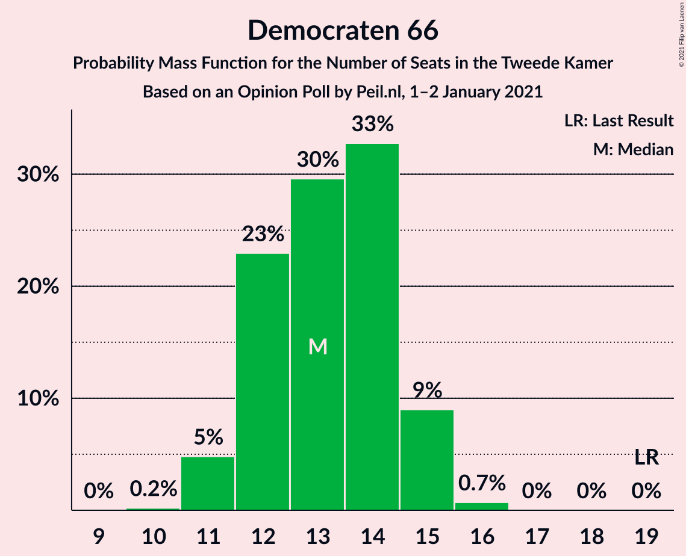

| Number of Seats | Probability | Accumulated | Special Marks |
|:---------------:|:-----------:|:-----------:|:-------------:|
| 10 | 0.2% | 100% |  |
| 11 | 5% | 99.8% |  |
| 12 | 23% | 95% |  |
| 13 | 30% | 72% | Median |
| 14 | 33% | 42% |  |
| 15 | 9% | 10% |  |
| 16 | 0.7% | 0.7% |  |
| 17 | 0% | 0% |  |
| 18 | 0% | 0% |  |
| 19 | 0% | 0% | Last Result |

### Partij van de Arbeid

*For a full overview of the results for this party, see the [Partij van de Arbeid](party-partijvandearbeid.html) page.*

| Number of Seats | Probability | Accumulated | Special Marks |
|:---------------:|:-----------:|:-----------:|:-------------:|
| 9 | 0.1% | 100% | Last Result |
| 10 | 2% | 99.9% |  |
| 11 | 46% | 98% |  |
| 12 | 37% | 52% | Median |
| 13 | 7% | 15% |  |
| 14 | 7% | 8% |  |
| 15 | 0.4% | 0.4% |  |
| 16 | 0% | 0% |  |

### GroenLinks

*For a full overview of the results for this party, see the [GroenLinks](party-groenlinks.html) page.*

| Number of Seats | Probability | Accumulated | Special Marks |
|:---------------:|:-----------:|:-----------:|:-------------:|
| 8 | 2% | 100% |  |
| 9 | 31% | 98% |  |
| 10 | 9% | 67% |  |
| 11 | 32% | 58% | Median |
| 12 | 26% | 26% |  |
| 13 | 0.1% | 0.1% |  |
| 14 | 0% | 0% | Last Result |

### Socialistische Partij

*For a full overview of the results for this party, see the [Socialistische Partij](party-socialistischepartij.html) page.*

| Number of Seats | Probability | Accumulated | Special Marks |
|:---------------:|:-----------:|:-----------:|:-------------:|
| 7 | 5% | 100% |  |
| 8 | 16% | 95% |  |
| 9 | 21% | 78% |  |
| 10 | 33% | 58% | Median |
| 11 | 24% | 24% |  |
| 12 | 0.1% | 0.1% |  |
| 13 | 0% | 0% |  |
| 14 | 0% | 0% | Last Result |

### ChristenUnie

*For a full overview of the results for this party, see the [ChristenUnie](party-christenunie.html) page.*

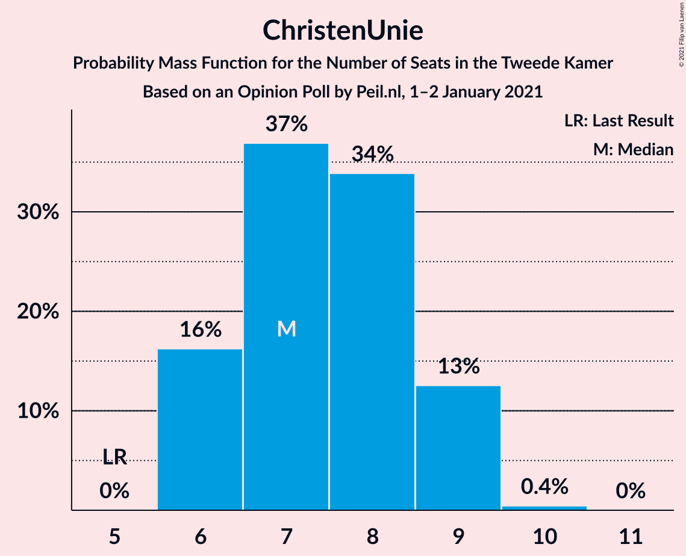

| Number of Seats | Probability | Accumulated | Special Marks |
|:---------------:|:-----------:|:-----------:|:-------------:|
| 5 | 0% | 100% | Last Result |
| 6 | 16% | 100% |  |
| 7 | 37% | 84% | Median |
| 8 | 34% | 47% |  |
| 9 | 13% | 13% |  |
| 10 | 0.4% | 0.4% |  |
| 11 | 0% | 0% |  |

### Partij voor de Dieren

*For a full overview of the results for this party, see the [Partij voor de Dieren](party-partijvoordedieren.html) page.*

| Number of Seats | Probability | Accumulated | Special Marks |
|:---------------:|:-----------:|:-----------:|:-------------:|
| 4 | 4% | 100% |  |
| 5 | 14% | 96% | Last Result |
| 6 | 43% | 82% | Median |
| 7 | 39% | 39% |  |
| 8 | 0.6% | 0.7% |  |
| 9 | 0.1% | 0.1% |  |
| 10 | 0% | 0% |  |

### Staatkundig Gereformeerde Partij

*For a full overview of the results for this party, see the [Staatkundig Gereformeerde Partij](party-staatkundiggereformeerdepartij.html) page.*

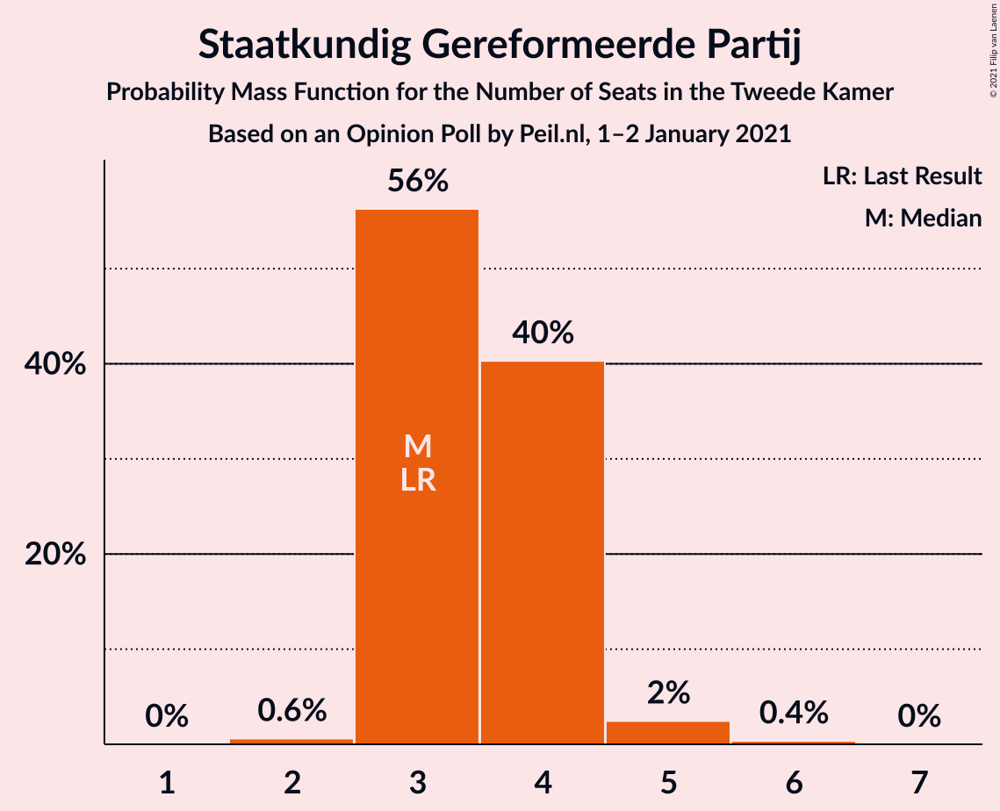

| Number of Seats | Probability | Accumulated | Special Marks |
|:---------------:|:-----------:|:-----------:|:-------------:|
| 2 | 0.6% | 100% |  |
| 3 | 56% | 99.4% | Last Result, Median |
| 4 | 40% | 43% |  |
| 5 | 2% | 3% |  |
| 6 | 0.4% | 0.4% |  |
| 7 | 0% | 0% |  |

### Forum voor Democratie

*For a full overview of the results for this party, see the [Forum voor Democratie](party-forumvoordemocratie.html) page.*

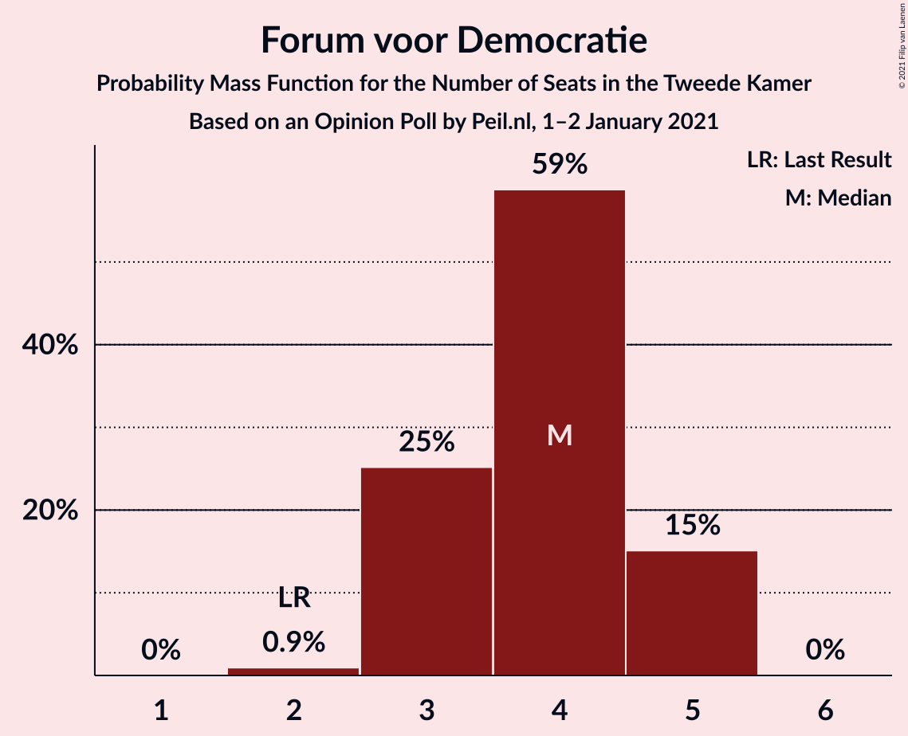

| Number of Seats | Probability | Accumulated | Special Marks |
|:---------------:|:-----------:|:-----------:|:-------------:|
| 2 | 0.9% | 100% | Last Result |
| 3 | 25% | 99.1% |  |
| 4 | 59% | 74% | Median |
| 5 | 15% | 15% |  |
| 6 | 0% | 0% |  |

### DENK

*For a full overview of the results for this party, see the [DENK](party-denk.html) page.*

| Number of Seats | Probability | Accumulated | Special Marks |
|:---------------:|:-----------:|:-----------:|:-------------:|
| 1 | 0.1% | 100% |  |
| 2 | 29% | 99.9% |  |
| 3 | 69% | 71% | Last Result, Median |
| 4 | 2% | 2% |  |
| 5 | 0% | 0% |  |

### Juiste Antwoord 2021

*For a full overview of the results for this party, see the [Juiste Antwoord 2021](party-juisteantwoord2021.html) page.*

| Number of Seats | Probability | Accumulated | Special Marks |
|:---------------:|:-----------:|:-----------:|:-------------:|
| 0 | 0% | 100% | Last Result |
| 1 | 29% | 100% |  |
| 2 | 60% | 71% | Median |
| 3 | 10% | 10% |  |
| 4 | 0% | 0% |  |

### 50Plus

*For a full overview of the results for this party, see the [50Plus](party-50plus.html) page.*

| Number of Seats | Probability | Accumulated | Special Marks |
|:---------------:|:-----------:|:-----------:|:-------------:|
| 0 | 31% | 100% |  |
| 1 | 68% | 69% | Median |
| 2 | 1.0% | 1.0% |  |
| 3 | 0% | 0% |  |
| 4 | 0% | 0% | Last Result |

### Bij1

*For a full overview of the results for this party, see the [Bij1](party-bij1.html) page.*

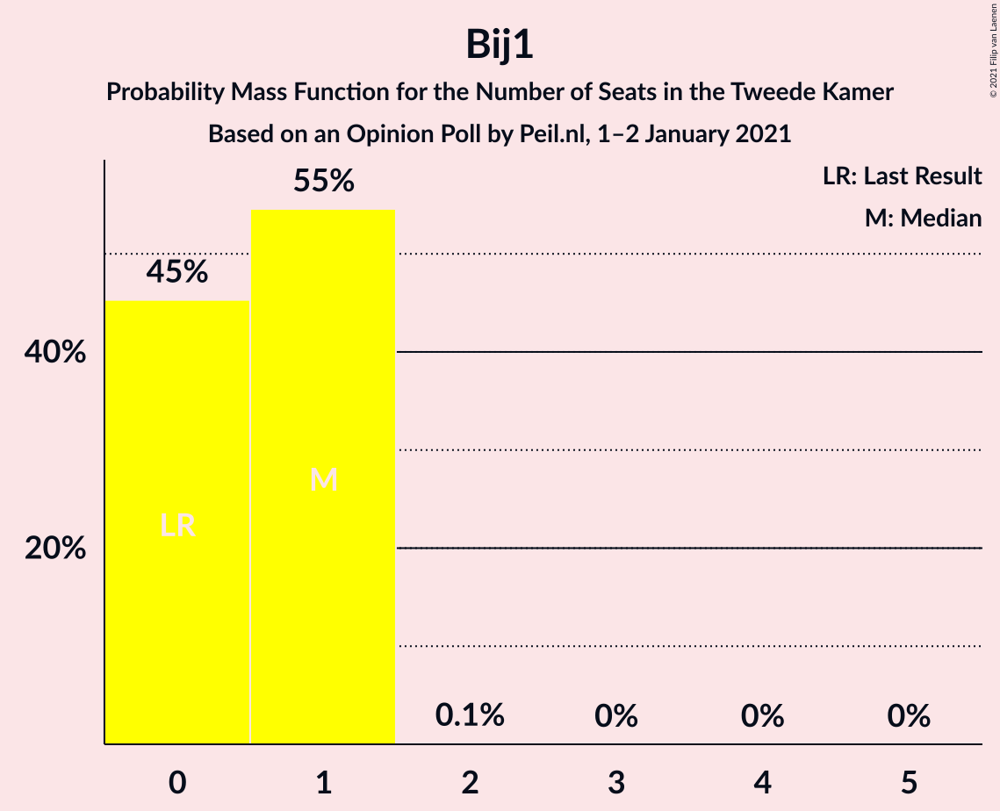

| Number of Seats | Probability | Accumulated | Special Marks |
|:---------------:|:-----------:|:-----------:|:-------------:|
| 0 | 45% | 100% | Last Result |
| 1 | 55% | 55% | Median |
| 2 | 0.1% | 0.1% |  |
| 3 | 0% | 0% |  |

### Code Oranje

*For a full overview of the results for this party, see the [Code Oranje](party-codeoranje.html) page.*

| Number of Seats | Probability | Accumulated | Special Marks |
|:---------------:|:-----------:|:-----------:|:-------------:|
| 0 | 52% | 100% | Last Result, Median |
| 1 | 48% | 48% |  |
| 2 | 0.1% | 0.1% |  |
| 3 | 0% | 0% |  |

## Coalitions

### Confidence Intervals

| Coalition | Last Result | Median | Majority? | 80% Confidence Interval | 90% Confidence Interval | 95% Confidence Interval | 99% Confidence Interval |
|:---------:|:-----------:|:------:|:---------:|:-----------------------:|:-----------------------:|:-----------------------:|:-----------------------:|
| Volkspartij voor Vrijheid en Democratie – Partij voor de Vrijheid – Christen-Democratisch Appèl – Forum voor Democratie – Staatkundig Gereformeerde Partij | 77 | 85 | 100% | 83–88 | 83–89 | 83–89 | 82–93 |
| Volkspartij voor Vrijheid en Democratie – Christen-Democratisch Appèl – Democraten 66 – Partij van de Arbeid – ChristenUnie | 85 | 84 | 100% | 81–88 | 81–89 | 81–89 | 81–90 |
| Volkspartij voor Vrijheid en Democratie – Christen-Democratisch Appèl – Democraten 66 – GroenLinks – ChristenUnie | 90 | 82 | 100% | 80–85 | 80–85 | 80–86 | 79–88 |
| Volkspartij voor Vrijheid en Democratie – Partij voor de Vrijheid – Christen-Democratisch Appèl – Forum voor Democratie | 74 | 81 | 100% | 80–84 | 80–85 | 79–86 | 78–89 |
| Volkspartij voor Vrijheid en Democratie – Partij voor de Vrijheid – Christen-Democratisch Appèl | 72 | 77 | 96% | 76–79 | 76–81 | 75–82 | 74–85 |
| Volkspartij voor Vrijheid en Democratie – Christen-Democratisch Appèl – Democraten 66 – ChristenUnie | 76 | 73 | 5% | 70–75 | 70–75 | 69–76 | 69–77 |
| Christen-Democratisch Appèl – Democraten 66 – Partij van de Arbeid – GroenLinks – Socialistische Partij – ChristenUnie | 80 | 70 | 0.5% | 69–72 | 68–72 | 66–74 | 66–76 |
| Volkspartij voor Vrijheid en Democratie – Christen-Democratisch Appèl – Democraten 66 | 71 | 65 | 0% | 63–68 | 62–68 | 61–69 | 61–70 |
| Volkspartij voor Vrijheid en Democratie – Christen-Democratisch Appèl – Partij van de Arbeid | 61 | 63 | 0% | 61–66 | 60–69 | 60–69 | 60–70 |
| Volkspartij voor Vrijheid en Democratie – Christen-Democratisch Appèl – Forum voor Democratie – Staatkundig Gereformeerde Partij – 50Plus | 61 | 60 | 0% | 57–62 | 57–65 | 57–65 | 56–65 |
| Christen-Democratisch Appèl – Democraten 66 – Partij van de Arbeid – GroenLinks – ChristenUnie | 66 | 60 | 0% | 58–64 | 58–64 | 58–64 | 58–66 |
| Volkspartij voor Vrijheid en Democratie – Christen-Democratisch Appèl – Forum voor Democratie – Staatkundig Gereformeerde Partij | 57 | 59 | 0% | 57–62 | 57–64 | 56–64 | 55–65 |
| Volkspartij voor Vrijheid en Democratie – Democraten 66 – Partij van de Arbeid | 61 | 59 | 0% | 56–61 | 56–62 | 56–63 | 56–64 |
| Volkspartij voor Vrijheid en Democratie – Christen-Democratisch Appèl – Forum voor Democratie – 50Plus | 58 | 56 | 0% | 54–58 | 54–61 | 53–61 | 53–61 |
| Volkspartij voor Vrijheid en Democratie – Christen-Democratisch Appèl – Forum voor Democratie | 54 | 55 | 0% | 54–58 | 53–60 | 52–60 | 52–61 |
| Volkspartij voor Vrijheid en Democratie – Christen-Democratisch Appèl | 52 | 51 | 0% | 50–54 | 49–55 | 49–55 | 48–57 |
| Volkspartij voor Vrijheid en Democratie – Partij van de Arbeid | 42 | 45 | 0% | 43–48 | 43–48 | 43–49 | 42–50 |
| Christen-Democratisch Appèl – Democraten 66 – Partij van de Arbeid | 47 | 43 | 0% | 41–45 | 41–48 | 39–48 | 39–48 |
| Christen-Democratisch Appèl – Partij van de Arbeid – ChristenUnie | 33 | 37 | 0% | 36–40 | 36–42 | 35–42 | 34–42 |
| Christen-Democratisch Appèl – Partij van de Arbeid | 28 | 29 | 0% | 28–32 | 28–35 | 28–35 | 27–35 |
| Christen-Democratisch Appèl – Democraten 66 | 38 | 31 | 0% | 30–34 | 29–34 | 28–34 | 28–36 |

### Volkspartij voor Vrijheid en Democratie – Partij voor de Vrijheid – Christen-Democratisch Appèl – Forum voor Democratie – Staatkundig Gereformeerde Partij

| Number of Seats | Probability | Accumulated | Special Marks |
|:---------------:|:-----------:|:-----------:|:-------------:|
| 77 | 0% | 100% | Last Result |
| 78 | 0% | 100% |  |
| 79 | 0% | 100% |  |
| 80 | 0.1% | 100% |  |
| 81 | 0.3% | 99.9% |  |
| 82 | 1.0% | 99.7% |  |
| 83 | 15% | 98.7% |  |
| 84 | 27% | 83% |  |
| 85 | 16% | 56% | Median |
| 86 | 24% | 40% |  |
| 87 | 3% | 16% |  |
| 88 | 7% | 13% |  |
| 89 | 5% | 6% |  |
| 90 | 0.1% | 0.6% |  |
| 91 | 0% | 0.6% |  |
| 92 | 0% | 0.6% |  |
| 93 | 0.6% | 0.6% |  |
| 94 | 0% | 0% |  |

### Volkspartij voor Vrijheid en Democratie – Christen-Democratisch Appèl – Democraten 66 – Partij van de Arbeid – ChristenUnie

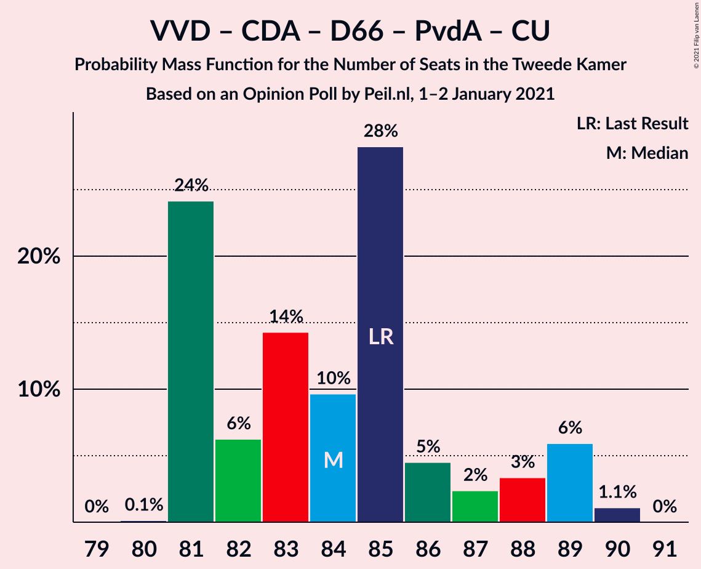

| Number of Seats | Probability | Accumulated | Special Marks |
|:---------------:|:-----------:|:-----------:|:-------------:|
| 80 | 0.1% | 100% |  |
| 81 | 24% | 99.9% |  |
| 82 | 6% | 76% |  |
| 83 | 14% | 69% |  |
| 84 | 10% | 55% | Median |
| 85 | 28% | 46% | Last Result |
| 86 | 5% | 17% |  |
| 87 | 2% | 13% |  |
| 88 | 3% | 10% |  |
| 89 | 6% | 7% |  |
| 90 | 1.1% | 1.1% |  |
| 91 | 0% | 0% |  |

### Volkspartij voor Vrijheid en Democratie – Christen-Democratisch Appèl – Democraten 66 – GroenLinks – ChristenUnie

| Number of Seats | Probability | Accumulated | Special Marks |
|:---------------:|:-----------:|:-----------:|:-------------:|
| 79 | 1.0% | 100% |  |
| 80 | 15% | 98.9% |  |
| 81 | 7% | 84% |  |
| 82 | 35% | 77% |  |
| 83 | 2% | 42% | Median |
| 84 | 19% | 40% |  |
| 85 | 17% | 21% |  |
| 86 | 2% | 4% |  |
| 87 | 1.1% | 2% |  |
| 88 | 0.3% | 0.7% |  |
| 89 | 0.4% | 0.4% |  |
| 90 | 0% | 0% | Last Result |

### Volkspartij voor Vrijheid en Democratie – Partij voor de Vrijheid – Christen-Democratisch Appèl – Forum voor Democratie

| Number of Seats | Probability | Accumulated | Special Marks |
|:---------------:|:-----------:|:-----------:|:-------------:|
| 74 | 0% | 100% | Last Result |
| 75 | 0% | 100% |  |
| 76 | 0% | 100% | Majority |
| 77 | 0.3% | 100% |  |
| 78 | 0.5% | 99.7% |  |
| 79 | 4% | 99.2% |  |
| 80 | 19% | 95% |  |
| 81 | 36% | 77% |  |
| 82 | 8% | 41% | Median |
| 83 | 20% | 33% |  |
| 84 | 6% | 13% |  |
| 85 | 4% | 7% |  |
| 86 | 3% | 3% |  |
| 87 | 0% | 0.6% |  |
| 88 | 0% | 0.6% |  |
| 89 | 0.6% | 0.6% |  |
| 90 | 0% | 0% |  |

### Volkspartij voor Vrijheid en Democratie – Partij voor de Vrijheid – Christen-Democratisch Appèl

| Number of Seats | Probability | Accumulated | Special Marks |
|:---------------:|:-----------:|:-----------:|:-------------:|
| 72 | 0% | 100% | Last Result |
| 73 | 0.1% | 100% |  |
| 74 | 1.0% | 99.9% |  |
| 75 | 3% | 98.9% |  |
| 76 | 13% | 96% | Majority |
| 77 | 35% | 83% |  |
| 78 | 13% | 47% | Median |
| 79 | 25% | 35% |  |
| 80 | 1.3% | 9% |  |
| 81 | 4% | 8% |  |
| 82 | 3% | 4% |  |
| 83 | 0% | 0.6% |  |
| 84 | 0% | 0.6% |  |
| 85 | 0.6% | 0.6% |  |
| 86 | 0% | 0% |  |

### Volkspartij voor Vrijheid en Democratie – Christen-Democratisch Appèl – Democraten 66 – ChristenUnie

| Number of Seats | Probability | Accumulated | Special Marks |
|:---------------:|:-----------:|:-----------:|:-------------:|
| 68 | 0.2% | 100% |  |
| 69 | 3% | 99.8% |  |
| 70 | 25% | 97% |  |
| 71 | 18% | 72% |  |
| 72 | 2% | 55% | Median |
| 73 | 28% | 52% |  |
| 74 | 10% | 24% |  |
| 75 | 10% | 14% |  |
| 76 | 3% | 5% | Last Result, Majority |
| 77 | 2% | 2% |  |
| 78 | 0.2% | 0.3% |  |
| 79 | 0% | 0% |  |

### Christen-Democratisch Appèl – Democraten 66 – Partij van de Arbeid – GroenLinks – Socialistische Partij – ChristenUnie

| Number of Seats | Probability | Accumulated | Special Marks |
|:---------------:|:-----------:|:-----------:|:-------------:|
| 65 | 0.3% | 100% |  |
| 66 | 3% | 99.7% |  |
| 67 | 2% | 97% |  |
| 68 | 1.3% | 96% |  |
| 69 | 24% | 94% |  |
| 70 | 22% | 70% |  |
| 71 | 18% | 49% | Median |
| 72 | 27% | 31% |  |
| 73 | 1.0% | 4% |  |
| 74 | 1.0% | 3% |  |
| 75 | 1.3% | 2% |  |
| 76 | 0.5% | 0.5% | Majority |
| 77 | 0% | 0% |  |
| 78 | 0% | 0% |  |
| 79 | 0% | 0% |  |
| 80 | 0% | 0% | Last Result |

### Volkspartij voor Vrijheid en Democratie – Christen-Democratisch Appèl – Democraten 66

| Number of Seats | Probability | Accumulated | Special Marks |
|:---------------:|:-----------:|:-----------:|:-------------:|
| 60 | 0.3% | 100% |  |
| 61 | 3% | 99.6% |  |
| 62 | 4% | 97% |  |
| 63 | 25% | 93% |  |
| 64 | 8% | 68% |  |
| 65 | 32% | 60% | Median |
| 66 | 14% | 29% |  |
| 67 | 3% | 15% |  |
| 68 | 9% | 12% |  |
| 69 | 3% | 3% |  |
| 70 | 0.6% | 0.6% |  |
| 71 | 0% | 0% | Last Result |

### Volkspartij voor Vrijheid en Democratie – Christen-Democratisch Appèl – Partij van de Arbeid

| Number of Seats | Probability | Accumulated | Special Marks |
|:---------------:|:-----------:|:-----------:|:-------------:|
| 59 | 0.4% | 100% |  |
| 60 | 5% | 99.5% |  |
| 61 | 7% | 94% | Last Result |
| 62 | 25% | 88% |  |
| 63 | 29% | 63% |  |
| 64 | 14% | 33% | Median |
| 65 | 6% | 20% |  |
| 66 | 5% | 13% |  |
| 67 | 2% | 8% |  |
| 68 | 0.8% | 6% |  |
| 69 | 5% | 6% |  |
| 70 | 0.6% | 0.6% |  |
| 71 | 0% | 0% |  |

### Volkspartij voor Vrijheid en Democratie – Christen-Democratisch Appèl – Forum voor Democratie – Staatkundig Gereformeerde Partij – 50Plus

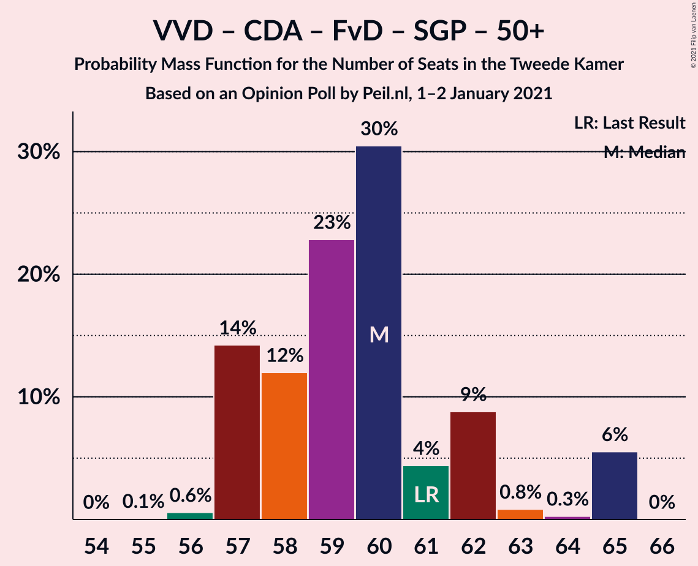

| Number of Seats | Probability | Accumulated | Special Marks |
|:---------------:|:-----------:|:-----------:|:-------------:|
| 55 | 0.1% | 100% |  |
| 56 | 0.6% | 99.9% |  |
| 57 | 14% | 99.3% |  |
| 58 | 12% | 85% |  |
| 59 | 23% | 73% |  |
| 60 | 30% | 50% | Median |
| 61 | 4% | 20% | Last Result |
| 62 | 9% | 15% |  |
| 63 | 0.8% | 7% |  |
| 64 | 0.3% | 6% |  |
| 65 | 6% | 6% |  |
| 66 | 0% | 0% |  |

### Christen-Democratisch Appèl – Democraten 66 – Partij van de Arbeid – GroenLinks – ChristenUnie

| Number of Seats | Probability | Accumulated | Special Marks |
|:---------------:|:-----------:|:-----------:|:-------------:|
| 56 | 0.3% | 100% |  |
| 57 | 0.1% | 99.7% |  |
| 58 | 14% | 99.6% |  |
| 59 | 6% | 85% |  |
| 60 | 36% | 79% |  |
| 61 | 2% | 43% | Median |
| 62 | 18% | 41% |  |
| 63 | 8% | 23% |  |
| 64 | 13% | 16% |  |
| 65 | 0.5% | 2% |  |
| 66 | 1.3% | 2% | Last Result |
| 67 | 0.4% | 0.4% |  |
| 68 | 0% | 0% |  |

### Volkspartij voor Vrijheid en Democratie – Christen-Democratisch Appèl – Forum voor Democratie – Staatkundig Gereformeerde Partij

| Number of Seats | Probability | Accumulated | Special Marks |
|:---------------:|:-----------:|:-----------:|:-------------:|
| 55 | 0.6% | 100% |  |
| 56 | 2% | 99.4% |  |
| 57 | 22% | 97% | Last Result |
| 58 | 23% | 75% |  |
| 59 | 25% | 52% | Median |
| 60 | 10% | 27% |  |
| 61 | 6% | 17% |  |
| 62 | 5% | 11% |  |
| 63 | 0.8% | 6% |  |
| 64 | 5% | 6% |  |
| 65 | 0.6% | 0.6% |  |
| 66 | 0% | 0% |  |

### Volkspartij voor Vrijheid en Democratie – Democraten 66 – Partij van de Arbeid

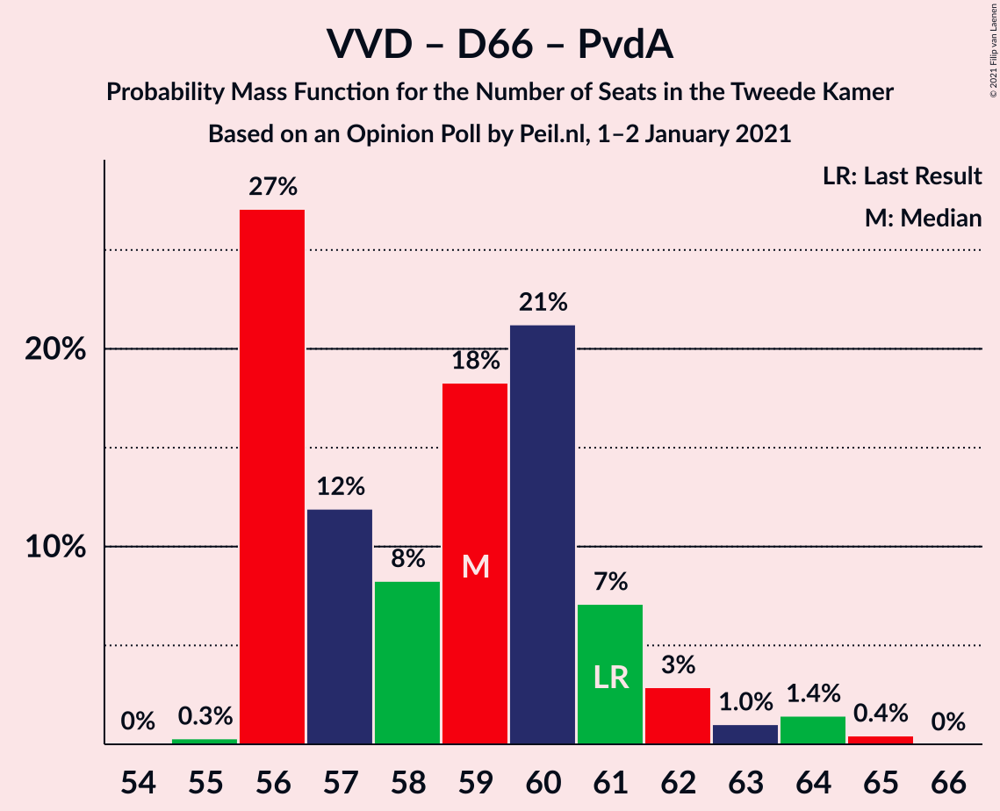

| Number of Seats | Probability | Accumulated | Special Marks |
|:---------------:|:-----------:|:-----------:|:-------------:|
| 55 | 0.3% | 100% |  |
| 56 | 27% | 99.7% |  |
| 57 | 12% | 73% |  |
| 58 | 8% | 61% |  |
| 59 | 18% | 52% | Median |
| 60 | 21% | 34% |  |
| 61 | 7% | 13% | Last Result |
| 62 | 3% | 6% |  |
| 63 | 1.0% | 3% |  |
| 64 | 1.4% | 2% |  |
| 65 | 0.4% | 0.4% |  |
| 66 | 0% | 0% |  |

### Volkspartij voor Vrijheid en Democratie – Christen-Democratisch Appèl – Forum voor Democratie – 50Plus

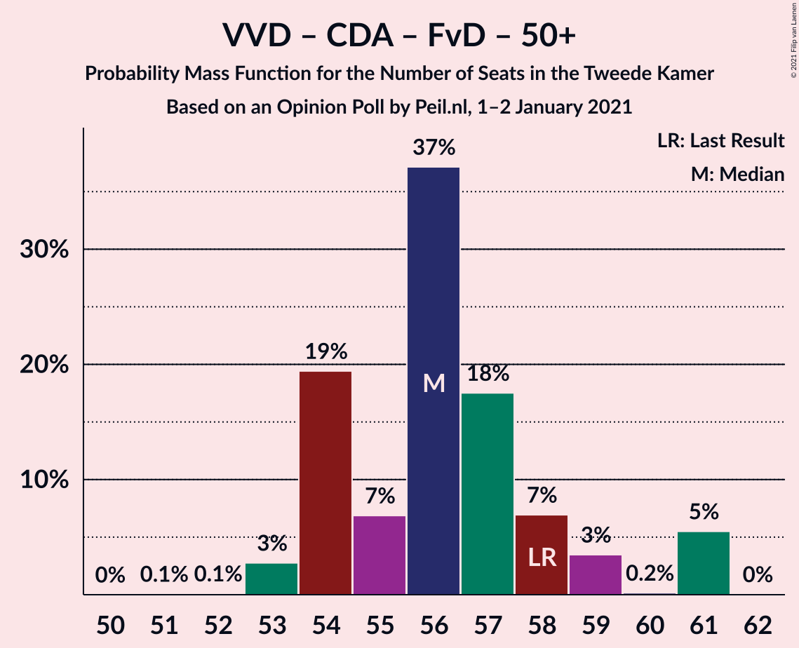

| Number of Seats | Probability | Accumulated | Special Marks |
|:---------------:|:-----------:|:-----------:|:-------------:|
| 51 | 0.1% | 100% |  |
| 52 | 0.1% | 99.9% |  |
| 53 | 3% | 99.8% |  |
| 54 | 19% | 97% |  |
| 55 | 7% | 78% |  |
| 56 | 37% | 71% |  |
| 57 | 18% | 34% | Median |
| 58 | 7% | 16% | Last Result |
| 59 | 3% | 9% |  |
| 60 | 0.2% | 6% |  |
| 61 | 5% | 6% |  |
| 62 | 0% | 0% |  |

### Volkspartij voor Vrijheid en Democratie – Christen-Democratisch Appèl – Forum voor Democratie

| Number of Seats | Probability | Accumulated | Special Marks |
|:---------------:|:-----------:|:-----------:|:-------------:|
| 51 | 0.1% | 100% |  |
| 52 | 3% | 99.9% |  |
| 53 | 6% | 97% |  |
| 54 | 20% | 91% | Last Result |
| 55 | 30% | 71% |  |
| 56 | 21% | 41% | Median |
| 57 | 9% | 20% |  |
| 58 | 3% | 11% |  |
| 59 | 3% | 8% |  |
| 60 | 5% | 6% |  |
| 61 | 0.6% | 0.6% |  |
| 62 | 0% | 0% |  |

### Volkspartij voor Vrijheid en Democratie – Christen-Democratisch Appèl

| Number of Seats | Probability | Accumulated | Special Marks |
|:---------------:|:-----------:|:-----------:|:-------------:|
| 47 | 0.1% | 100% |  |
| 48 | 2% | 99.9% |  |
| 49 | 6% | 98% |  |
| 50 | 6% | 91% |  |
| 51 | 43% | 85% |  |
| 52 | 24% | 42% | Last Result, Median |
| 53 | 5% | 18% |  |
| 54 | 4% | 13% |  |
| 55 | 9% | 9% |  |
| 56 | 0.1% | 0.7% |  |
| 57 | 0.6% | 0.6% |  |
| 58 | 0% | 0% |  |

### Volkspartij voor Vrijheid en Democratie – Partij van de Arbeid

| Number of Seats | Probability | Accumulated | Special Marks |
|:---------------:|:-----------:|:-----------:|:-------------:|
| 42 | 0.8% | 100% | Last Result |
| 43 | 17% | 99.2% |  |
| 44 | 23% | 82% |  |
| 45 | 10% | 59% |  |
| 46 | 32% | 49% | Median |
| 47 | 5% | 17% |  |
| 48 | 9% | 12% |  |
| 49 | 0.9% | 3% |  |
| 50 | 1.5% | 2% |  |
| 51 | 0.5% | 0.5% |  |
| 52 | 0% | 0% |  |

### Christen-Democratisch Appèl – Democraten 66 – Partij van de Arbeid

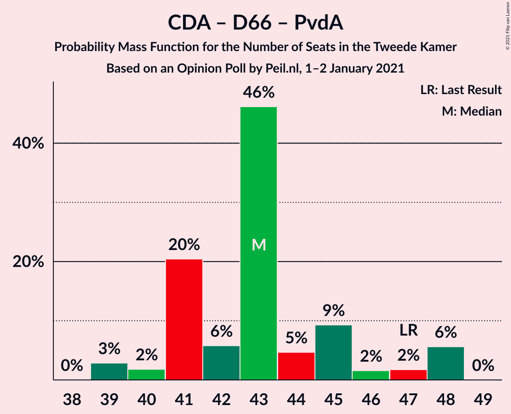

| Number of Seats | Probability | Accumulated | Special Marks |
|:---------------:|:-----------:|:-----------:|:-------------:|
| 39 | 3% | 100% |  |
| 40 | 2% | 97% |  |
| 41 | 20% | 95% |  |
| 42 | 6% | 75% |  |
| 43 | 46% | 69% | Median |
| 44 | 5% | 23% |  |
| 45 | 9% | 18% |  |
| 46 | 2% | 9% |  |
| 47 | 2% | 7% | Last Result |
| 48 | 6% | 6% |  |
| 49 | 0% | 0% |  |

### Christen-Democratisch Appèl – Partij van de Arbeid – ChristenUnie

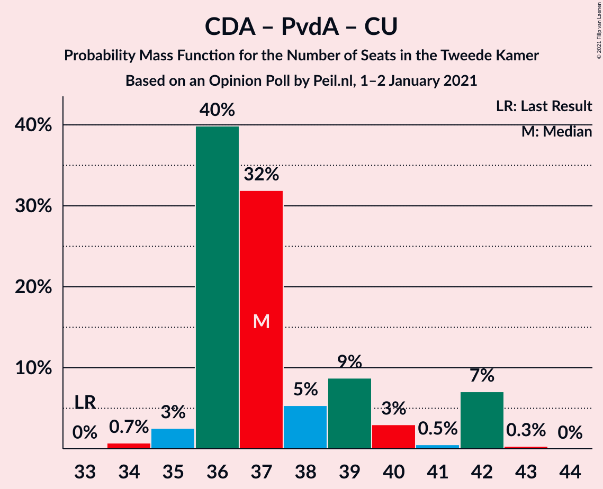

| Number of Seats | Probability | Accumulated | Special Marks |
|:---------------:|:-----------:|:-----------:|:-------------:|
| 33 | 0% | 100% | Last Result |
| 34 | 0.7% | 100% |  |
| 35 | 3% | 99.3% |  |
| 36 | 40% | 97% |  |
| 37 | 32% | 57% | Median |
| 38 | 5% | 25% |  |
| 39 | 9% | 20% |  |
| 40 | 3% | 11% |  |
| 41 | 0.5% | 8% |  |
| 42 | 7% | 7% |  |
| 43 | 0.3% | 0.3% |  |
| 44 | 0% | 0% |  |

### Christen-Democratisch Appèl – Partij van de Arbeid

| Number of Seats | Probability | Accumulated | Special Marks |
|:---------------:|:-----------:|:-----------:|:-------------:|
| 27 | 0.8% | 100% |  |
| 28 | 10% | 99.2% | Last Result |
| 29 | 47% | 89% |  |
| 30 | 22% | 42% | Median |
| 31 | 9% | 19% |  |
| 32 | 2% | 11% |  |
| 33 | 1.3% | 8% |  |
| 34 | 2% | 7% |  |
| 35 | 5% | 5% |  |
| 36 | 0% | 0% |  |

### Christen-Democratisch Appèl – Democraten 66

| Number of Seats | Probability | Accumulated | Special Marks |
|:---------------:|:-----------:|:-----------:|:-------------:|
| 27 | 0.2% | 100% |  |
| 28 | 4% | 99.8% |  |
| 29 | 0.7% | 95% |  |
| 30 | 24% | 95% |  |
| 31 | 39% | 70% | Median |
| 32 | 14% | 31% |  |
| 33 | 1.5% | 17% |  |
| 34 | 15% | 16% |  |
| 35 | 0.3% | 1.1% |  |
| 36 | 0.6% | 0.8% |  |
| 37 | 0.2% | 0.2% |  |
| 38 | 0% | 0% | Last Result |

## Technical Information

### Opinion Poll

+ **Polling firm:** Peil.nl
+ **Commissioner(s):** —
+ **Fieldwork period:** 1–2 January 2021

### Calculations

+ **Sample size:** 3000
+ **Simulations done:** 1,048,576
+ **Error estimate:** 1.11%

