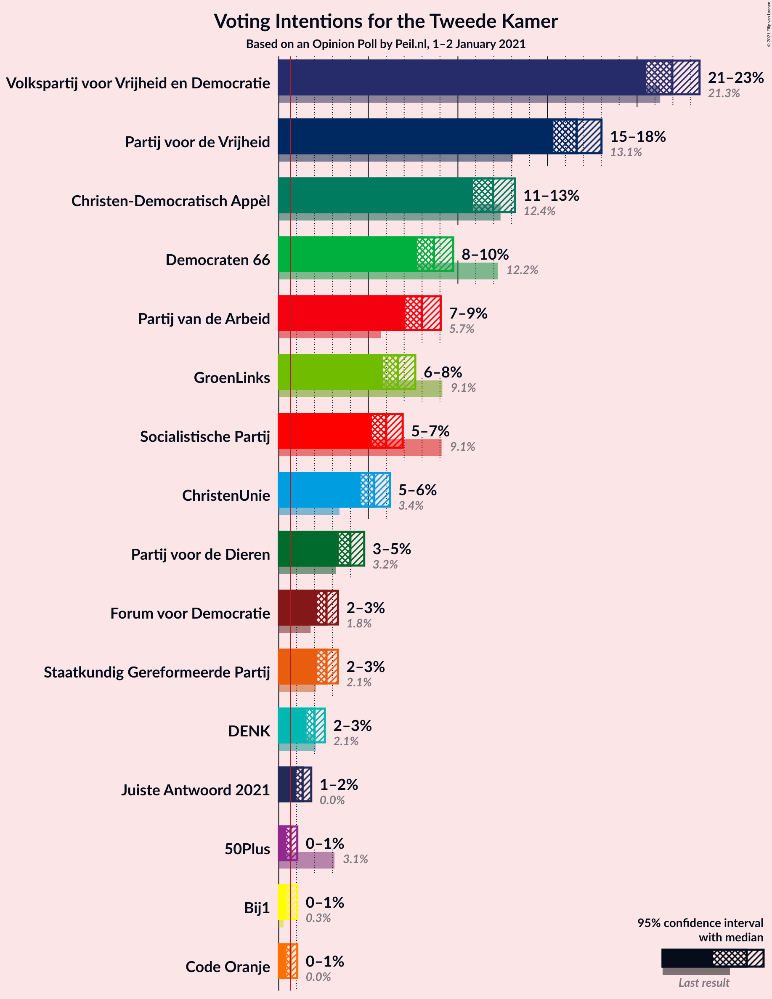
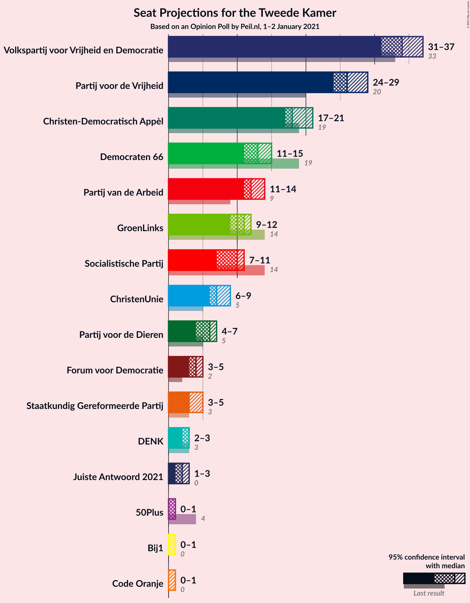
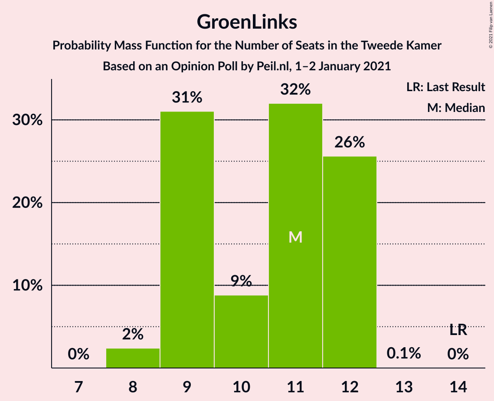
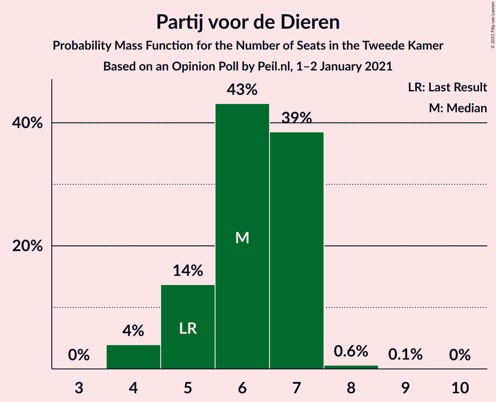
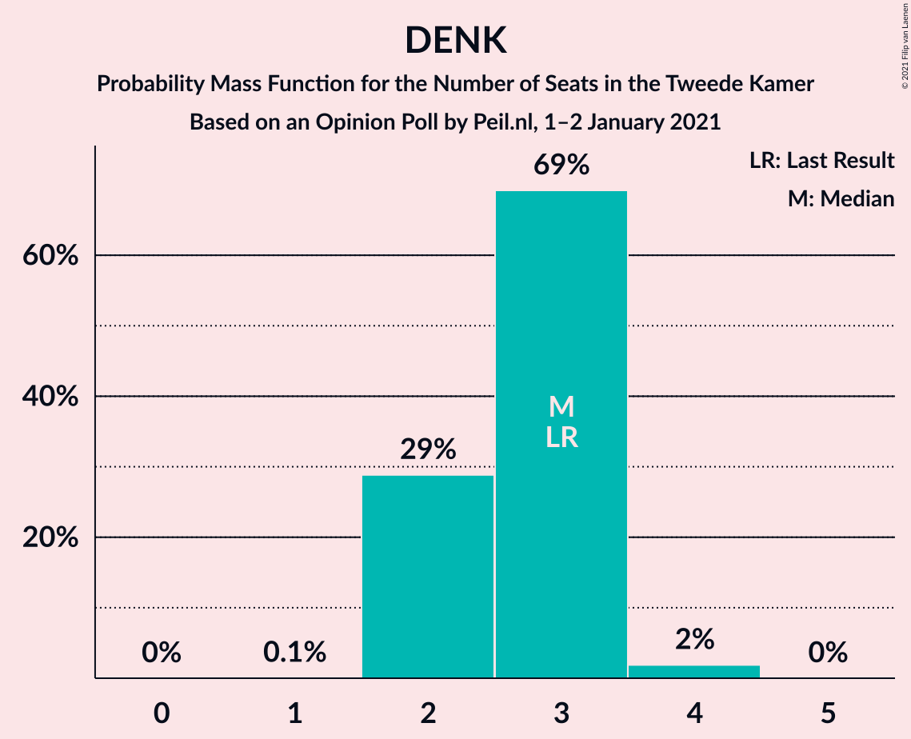
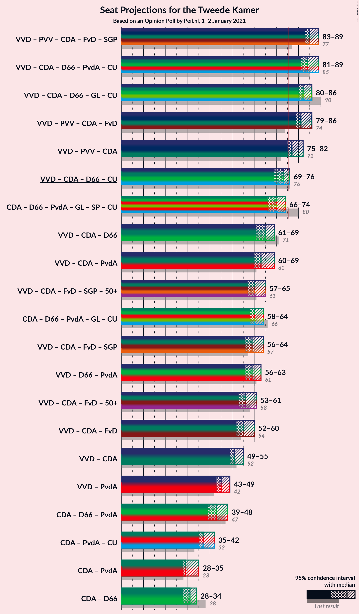
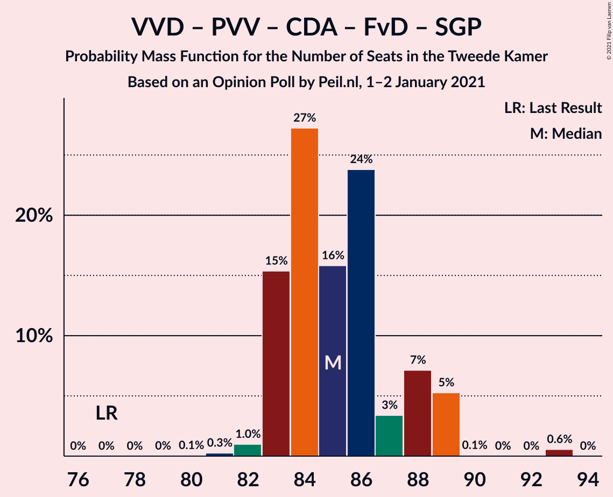
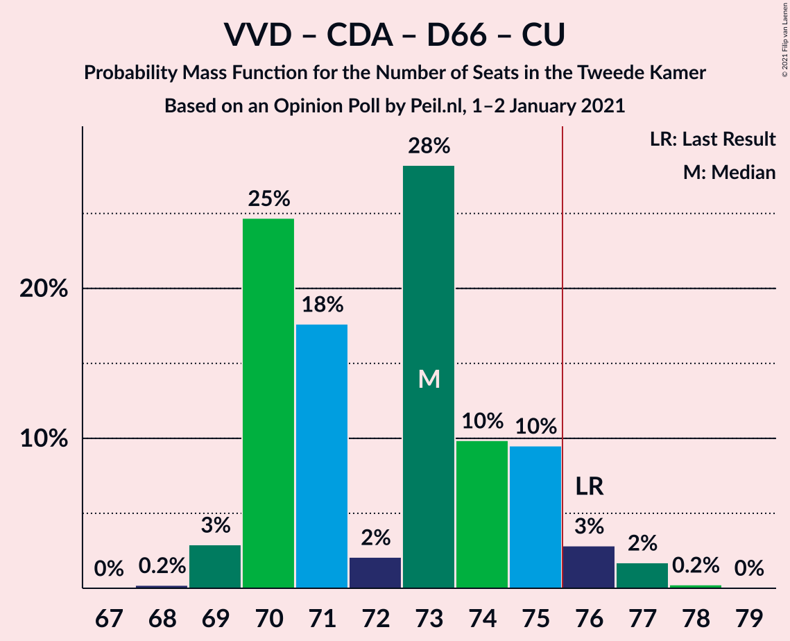
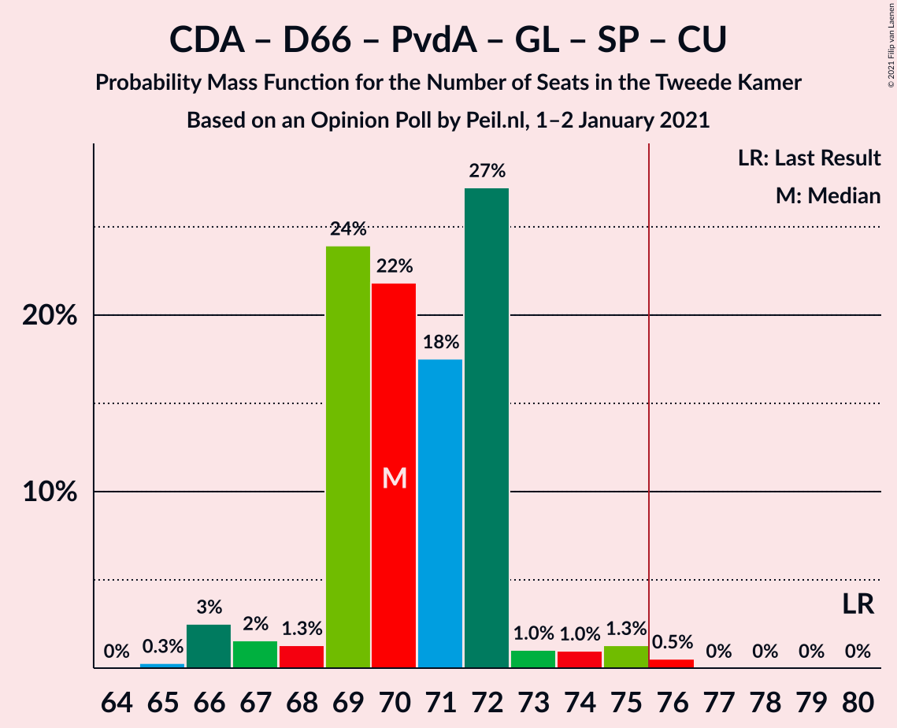

# Opinion Poll by Peil.nl, 1–2 January 2021

<a href="#voting-intentions">Voting Intentions</a> | <a href="#seats">Seats</a> | <a href="#coalitions">Coalitions</a> | <a href="#technical-information">Technical Information</a>

## Voting Intentions

### Confidence Intervals

| Party | Last Result | Poll Result | 80% Confidence Interval | 90% Confidence Interval | 95% Confidence Interval | 99% Confidence Interval |
|:-----:|:-----------:|:-----------:|:-----------------------:|:-----------------------:|:-----------------------:|:-----------------------:|
| Volkspartij voor Vrijheid en Democratie | 21.3% | 22.0% | 21.0–23.0% |20.8–23.3% |20.5–23.5% |20.1–24.0% |
| Partij voor de Vrijheid | 13.1% | 16.7% | 15.8–17.6% |15.6–17.8% |15.4–18.0% |15.0–18.5% |
| Christen-Democratisch Appèl | 12.4% | 12.0% | 11.3–12.8% |11.1–13.0% |10.9–13.2% |10.5–13.6% |
| Democraten 66 | 12.2% | 8.7% | 8.0–9.4% |7.8–9.6% |7.7–9.7% |7.4–10.1% |
| Partij van de Arbeid | 5.7% | 8.0% | 7.4–8.7% |7.2–8.9% |7.1–9.0% |6.8–9.4% |
| GroenLinks | 9.1% | 6.7% | 6.1–7.3% |6.0–7.5% |5.8–7.6% |5.6–7.9% |
| Socialistische Partij | 9.1% | 6.0% | 5.5–6.6% |5.3–6.8% |5.2–6.9% |5.0–7.2% |
| ChristenUnie | 3.4% | 5.3% | 4.8–5.9% |4.7–6.1% |4.6–6.2% |4.4–6.5% |
| Partij voor de Dieren | 3.2% | 4.0% | 3.6–4.5% |3.4–4.6% |3.4–4.8% |3.2–5.0% |
| Staatkundig Gereformeerde Partij | 2.1% | 2.7% | 2.3–3.1% |2.2–3.2% |2.1–3.3% |2.0–3.5% |
| Forum voor Democratie | 1.8% | 2.7% | 2.3–3.1% |2.2–3.2% |2.1–3.3% |2.0–3.5% |
| DENK | 2.1% | 2.0% | 1.7–2.4% |1.6–2.5% |1.6–2.6% |1.4–2.8% |
| 50Plus | 3.1% | 0.7% | 0.5–0.9% |0.5–1.0% |0.4–1.0% |0.4–1.2% |

*Note:* The poll result column reflects the actual value used in the calculations. Published results may vary slightly, and in addition be rounded to fewer digits.

## Seats

### Confidence Intervals

| Party | Last Result | Median | 80% Confidence Interval | 90% Confidence Interval | 95% Confidence Interval | 99% Confidence Interval |
|:-----:|:-----------:|:------:|:-----------------------:|:-----------------------:|:-----------------------:|:-----------------------:|
| <a href="#volkspartij-voor-vrijheid-en-democratie">Volkspartij voor Vrijheid en Democratie</a> | 33 | 34 | 33–35 |33–35 |33–37 |31–37 |
| <a href="#partij-voor-de-vrijheid">Partij voor de Vrijheid</a> | 20 | 26 | 25–27 |24–28 |24–28 |23–28 |
| <a href="#christen-democratisch-appèl">Christen-Democratisch Appèl</a> | 19 | 17 | 17–18 |17–20 |17–20 |16–20 |
| <a href="#democraten-66">Democraten 66</a> | 19 | 14 | 13–14 |12–14 |12–14 |11–15 |
| <a href="#partij-van-de-arbeid">Partij van de Arbeid</a> | 9 | 12 | 12–13 |11–13 |11–13 |11–14 |
| <a href="#groenlinks">GroenLinks</a> | 14 | 9 | 9–10 |9–10 |9–12 |9–12 |
| <a href="#socialistische-partij">Socialistische Partij</a> | 14 | 10 | 9–10 |8–10 |8–10 |8–11 |
| <a href="#christenunie">ChristenUnie</a> | 5 | 7 | 7–8 |7–9 |7–9 |7–9 |
| <a href="#partij-voor-de-dieren">Partij voor de Dieren</a> | 5 | 6 | 5–6 |5–7 |5–7 |4–7 |
| <a href="#staatkundig-gereformeerde-partij">Staatkundig Gereformeerde Partij</a> | 3 | 3 | 3–4 |3–5 |3–5 |3–5 |
| <a href="#forum-voor-democratie">Forum voor Democratie</a> | 2 | 3 | 3–4 |3–4 |3–4 |3–5 |
| <a href="#denk">DENK</a> | 3 | 3 | 2–3 |2–3 |2–3 |2–3 |
| <a href="#50plus">50Plus</a> | 4 | 1 | 0–1 |0–1 |0–1 |0–1 |

### Volkspartij voor Vrijheid en Democratie

*For a full overview of the results for this party, see the [Volkspartij voor Vrijheid en Democratie](party-volkspartijvoorvrijheidendemocratie.html) page.*

| Number of Seats | Probability | Accumulated | Special Marks |
|:---------------:|:-----------:|:-----------:|:-------------:|
| 31 | 1.0% | 100% |  |
| 32 | 1.2% | 99.0% |  |
| 33 | 19% | 98% | Last Result |
| 34 | 63% | 79% | Median |
| 35 | 12% | 16% |  |
| 36 | 1.1% | 4% |  |
| 37 | 3% | 3% |  |
| 38 | 0% | 0% |  |

### Partij voor de Vrijheid

*For a full overview of the results for this party, see the [Partij voor de Vrijheid](party-partijvoordevrijheid.html) page.*

| Number of Seats | Probability | Accumulated | Special Marks |
|:---------------:|:-----------:|:-----------:|:-------------:|
| 20 | 0% | 100% | Last Result |
| 21 | 0% | 100% |  |
| 22 | 0% | 100% |  |
| 23 | 2% | 100% |  |
| 24 | 4% | 98% |  |
| 25 | 15% | 94% |  |
| 26 | 66% | 79% | Median |
| 27 | 6% | 13% |  |
| 28 | 7% | 7% |  |
| 29 | 0% | 0% |  |

### Christen-Democratisch Appèl

*For a full overview of the results for this party, see the [Christen-Democratisch Appèl](party-christen-democratischappèl.html) page.*

| Number of Seats | Probability | Accumulated | Special Marks |
|:---------------:|:-----------:|:-----------:|:-------------:|
| 15 | 0.1% | 100% |  |
| 16 | 2% | 99.9% |  |
| 17 | 58% | 98% | Median |
| 18 | 31% | 41% |  |
| 19 | 5% | 10% | Last Result |
| 20 | 5% | 5% |  |
| 21 | 0.3% | 0.3% |  |
| 22 | 0% | 0% |  |

### Democraten 66

*For a full overview of the results for this party, see the [Democraten 66](party-democraten66.html) page.*

| Number of Seats | Probability | Accumulated | Special Marks |
|:---------------:|:-----------:|:-----------:|:-------------:|
| 11 | 2% | 100% |  |
| 12 | 8% | 98% |  |
| 13 | 19% | 91% |  |
| 14 | 70% | 71% | Median |
| 15 | 1.3% | 1.3% |  |
| 16 | 0.1% | 0.1% |  |
| 17 | 0% | 0% |  |
| 18 | 0% | 0% |  |
| 19 | 0% | 0% | Last Result |

### Partij van de Arbeid

*For a full overview of the results for this party, see the [Partij van de Arbeid](party-partijvandearbeid.html) page.*

| Number of Seats | Probability | Accumulated | Special Marks |
|:---------------:|:-----------:|:-----------:|:-------------:|
| 9 | 0% | 100% | Last Result |
| 10 | 0.2% | 100% |  |
| 11 | 8% | 99.8% |  |
| 12 | 72% | 92% | Median |
| 13 | 19% | 21% |  |
| 14 | 2% | 2% |  |
| 15 | 0.1% | 0.1% |  |
| 16 | 0% | 0% |  |

### GroenLinks

*For a full overview of the results for this party, see the [GroenLinks](party-groenlinks.html) page.*

| Number of Seats | Probability | Accumulated | Special Marks |
|:---------------:|:-----------:|:-----------:|:-------------:|
| 8 | 0.2% | 100% |  |
| 9 | 70% | 99.8% | Median |
| 10 | 25% | 29% |  |
| 11 | 0.5% | 5% |  |
| 12 | 4% | 4% |  |
| 13 | 0% | 0% |  |
| 14 | 0% | 0% | Last Result |

### Socialistische Partij

*For a full overview of the results for this party, see the [Socialistische Partij](party-socialistischepartij.html) page.*

| Number of Seats | Probability | Accumulated | Special Marks |
|:---------------:|:-----------:|:-----------:|:-------------:|
| 7 | 0.2% | 100% |  |
| 8 | 10% | 99.8% |  |
| 9 | 30% | 90% |  |
| 10 | 60% | 60% | Median |
| 11 | 0.7% | 0.7% |  |
| 12 | 0% | 0% |  |
| 13 | 0% | 0% |  |
| 14 | 0% | 0% | Last Result |

### ChristenUnie

*For a full overview of the results for this party, see the [ChristenUnie](party-christenunie.html) page.*

| Number of Seats | Probability | Accumulated | Special Marks |
|:---------------:|:-----------:|:-----------:|:-------------:|
| 5 | 0% | 100% | Last Result |
| 6 | 0.3% | 100% |  |
| 7 | 67% | 99.7% | Median |
| 8 | 24% | 33% |  |
| 9 | 9% | 9% |  |
| 10 | 0.1% | 0.1% |  |
| 11 | 0% | 0% |  |

### Partij voor de Dieren

*For a full overview of the results for this party, see the [Partij voor de Dieren](party-partijvoordedieren.html) page.*

| Number of Seats | Probability | Accumulated | Special Marks |
|:---------------:|:-----------:|:-----------:|:-------------:|
| 4 | 0.7% | 100% |  |
| 5 | 18% | 99.3% | Last Result |
| 6 | 75% | 81% | Median |
| 7 | 6% | 6% |  |
| 8 | 0% | 0% |  |

### Staatkundig Gereformeerde Partij

*For a full overview of the results for this party, see the [Staatkundig Gereformeerde Partij](party-staatkundiggereformeerdepartij.html) page.*

| Number of Seats | Probability | Accumulated | Special Marks |
|:---------------:|:-----------:|:-----------:|:-------------:|
| 3 | 80% | 100% | Last Result, Median |
| 4 | 14% | 20% |  |
| 5 | 6% | 6% |  |
| 6 | 0% | 0% |  |

### Forum voor Democratie

*For a full overview of the results for this party, see the [Forum voor Democratie](party-forumvoordemocratie.html) page.*

| Number of Seats | Probability | Accumulated | Special Marks |
|:---------------:|:-----------:|:-----------:|:-------------:|
| 2 | 0.1% | 100% | Last Result |
| 3 | 73% | 99.9% | Median |
| 4 | 25% | 27% |  |
| 5 | 2% | 2% |  |
| 6 | 0% | 0% |  |

### DENK

*For a full overview of the results for this party, see the [DENK](party-denk.html) page.*

| Number of Seats | Probability | Accumulated | Special Marks |
|:---------------:|:-----------:|:-----------:|:-------------:|
| 2 | 11% | 100% |  |
| 3 | 88% | 89% | Last Result, Median |
| 4 | 0.5% | 0.5% |  |
| 5 | 0% | 0% |  |

### 50Plus

*For a full overview of the results for this party, see the [50Plus](party-50plus.html) page.*

| Number of Seats | Probability | Accumulated | Special Marks |
|:---------------:|:-----------:|:-----------:|:-------------:|
| 0 | 22% | 100% |  |
| 1 | 78% | 78% | Median |
| 2 | 0% | 0% |  |
| 3 | 0% | 0% |  |
| 4 | 0% | 0% | Last Result |

## Coalitions

### Confidence Intervals

| Coalition | Last Result | Median | Majority? | 80% Confidence Interval | 90% Confidence Interval | 95% Confidence Interval | 99% Confidence Interval |
|:---------:|:-----------:|:------:|:---------:|:-----------------------:|:-----------------------:|:-----------------------:|:-----------------------:|
| Volkspartij voor Vrijheid en Democratie – Christen-Democratisch Appèl – Democraten 66 – Partij van de Arbeid – ChristenUnie | 85 | 84 | 100% | 84–88 | 83–88 | 83–88 | 81–89 |
| Volkspartij voor Vrijheid en Democratie – Partij voor de Vrijheid – Christen-Democratisch Appèl – Forum voor Democratie – Staatkundig Gereformeerde Partij | 77 | 83 | 100% | 83–86 | 83–87 | 83–88 | 81–88 |
| Volkspartij voor Vrijheid en Democratie – Christen-Democratisch Appèl – Democraten 66 – GroenLinks – ChristenUnie | 90 | 81 | 100% | 81–85 | 81–85 | 81–85 | 80–86 |
| Volkspartij voor Vrijheid en Democratie – Partij voor de Vrijheid – Christen-Democratisch Appèl – Forum voor Democratie | 74 | 80 | 100% | 80–82 | 80–83 | 79–85 | 78–85 |
| Volkspartij voor Vrijheid en Democratie – Partij voor de Vrijheid – Christen-Democratisch Appèl | 72 | 77 | 98% | 77–79 | 77–80 | 76–81 | 75–81 |
| Volkspartij voor Vrijheid en Democratie – Christen-Democratisch Appèl – Democraten 66 – ChristenUnie | 76 | 72 | 2% | 72–75 | 71–75 | 71–75 | 70–76 |
| Christen-Democratisch Appèl – Democraten 66 – Partij van de Arbeid – GroenLinks – Socialistische Partij – ChristenUnie | 80 | 69 | 0% | 68–72 | 68–72 | 67–73 | 67–74 |
| Volkspartij voor Vrijheid en Democratie – Christen-Democratisch Appèl – Democraten 66 | 71 | 65 | 0% | 64–67 | 64–67 | 63–68 | 62–69 |
| Volkspartij voor Vrijheid en Democratie – Christen-Democratisch Appèl – Partij van de Arbeid | 61 | 63 | 0% | 63–66 | 63–66 | 62–66 | 59–69 |
| Christen-Democratisch Appèl – Democraten 66 – Partij van de Arbeid – GroenLinks – ChristenUnie | 66 | 59 | 0% | 59–63 | 59–63 | 59–64 | 58–65 |
| Volkspartij voor Vrijheid en Democratie – Christen-Democratisch Appèl – Forum voor Democratie – Staatkundig Gereformeerde Partij – 50Plus | 61 | 58 | 0% | 58–60 | 58–62 | 58–63 | 57–64 |
| Volkspartij voor Vrijheid en Democratie – Christen-Democratisch Appèl – Forum voor Democratie – Staatkundig Gereformeerde Partij | 57 | 57 | 0% | 57–60 | 57–61 | 57–62 | 57–63 |
| Volkspartij voor Vrijheid en Democratie – Democraten 66 – Partij van de Arbeid | 61 | 60 | 0% | 58–62 | 58–62 | 57–62 | 55–62 |
| Volkspartij voor Vrijheid en Democratie – Christen-Democratisch Appèl – Forum voor Democratie – 50Plus | 58 | 55 | 0% | 55–57 | 55–58 | 54–60 | 52–61 |
| Volkspartij voor Vrijheid en Democratie – Christen-Democratisch Appèl – Forum voor Democratie | 54 | 54 | 0% | 54–57 | 54–58 | 54–59 | 52–60 |
| Volkspartij voor Vrijheid en Democratie – Christen-Democratisch Appèl | 52 | 51 | 0% | 51–53 | 51–54 | 50–55 | 48–56 |
| Volkspartij voor Vrijheid en Democratie – Partij van de Arbeid | 42 | 46 | 0% | 45–48 | 45–48 | 44–48 | 42–49 |
| Christen-Democratisch Appèl – Democraten 66 – Partij van de Arbeid | 47 | 43 | 0% | 42–45 | 42–45 | 41–45 | 41–46 |
| Christen-Democratisch Appèl – Partij van de Arbeid – ChristenUnie | 33 | 36 | 0% | 36–40 | 36–40 | 36–40 | 35–41 |
| Christen-Democratisch Appèl – Democraten 66 | 38 | 31 | 0% | 31–32 | 30–32 | 30–33 | 29–34 |
| Christen-Democratisch Appèl – Partij van de Arbeid | 28 | 29 | 0% | 29–31 | 29–32 | 29–33 | 27–33 |

### Volkspartij voor Vrijheid en Democratie – Christen-Democratisch Appèl – Democraten 66 – Partij van de Arbeid – ChristenUnie

| Number of Seats | Probability | Accumulated | Special Marks |
|:---------------:|:-----------:|:-----------:|:-------------:|
| 81 | 0.7% | 100% |  |
| 82 | 1.2% | 99.3% |  |
| 83 | 6% | 98% |  |
| 84 | 60% | 92% | Median |
| 85 | 7% | 31% | Last Result |
| 86 | 11% | 25% |  |
| 87 | 1.2% | 13% |  |
| 88 | 11% | 12% |  |
| 89 | 0.7% | 0.8% |  |
| 90 | 0.1% | 0.1% |  |
| 91 | 0% | 0% |  |

### Volkspartij voor Vrijheid en Democratie – Partij voor de Vrijheid – Christen-Democratisch Appèl – Forum voor Democratie – Staatkundig Gereformeerde Partij

| Number of Seats | Probability | Accumulated | Special Marks |
|:---------------:|:-----------:|:-----------:|:-------------:|
| 77 | 0% | 100% | Last Result |
| 78 | 0% | 100% |  |
| 79 | 0% | 100% |  |
| 80 | 0% | 100% |  |
| 81 | 0.8% | 100% |  |
| 82 | 0.2% | 99.1% |  |
| 83 | 58% | 98.9% | Median |
| 84 | 9% | 40% |  |
| 85 | 14% | 31% |  |
| 86 | 8% | 17% |  |
| 87 | 5% | 9% |  |
| 88 | 4% | 4% |  |
| 89 | 0.3% | 0.3% |  |
| 90 | 0% | 0% |  |

### Volkspartij voor Vrijheid en Democratie – Christen-Democratisch Appèl – Democraten 66 – GroenLinks – ChristenUnie

| Number of Seats | Probability | Accumulated | Special Marks |
|:---------------:|:-----------:|:-----------:|:-------------:|
| 79 | 0.1% | 100% |  |
| 80 | 2% | 99.8% |  |
| 81 | 67% | 98% | Median |
| 82 | 8% | 31% |  |
| 83 | 2% | 23% |  |
| 84 | 2% | 22% |  |
| 85 | 17% | 19% |  |
| 86 | 2% | 2% |  |
| 87 | 0.1% | 0.1% |  |
| 88 | 0% | 0% |  |
| 89 | 0% | 0% |  |
| 90 | 0% | 0% | Last Result |

### Volkspartij voor Vrijheid en Democratie – Partij voor de Vrijheid – Christen-Democratisch Appèl – Forum voor Democratie

| Number of Seats | Probability | Accumulated | Special Marks |
|:---------------:|:-----------:|:-----------:|:-------------:|
| 74 | 0% | 100% | Last Result |
| 75 | 0% | 100% |  |
| 76 | 0% | 100% | Majority |
| 77 | 0% | 100% |  |
| 78 | 1.4% | 99.9% |  |
| 79 | 1.1% | 98.5% |  |
| 80 | 62% | 97% | Median |
| 81 | 7% | 36% |  |
| 82 | 22% | 28% |  |
| 83 | 2% | 6% |  |
| 84 | 1.2% | 5% |  |
| 85 | 3% | 3% |  |
| 86 | 0% | 0% |  |

### Volkspartij voor Vrijheid en Democratie – Partij voor de Vrijheid – Christen-Democratisch Appèl

| Number of Seats | Probability | Accumulated | Special Marks |
|:---------------:|:-----------:|:-----------:|:-------------:|
| 72 | 0% | 100% | Last Result |
| 73 | 0% | 100% |  |
| 74 | 0.2% | 100% |  |
| 75 | 2% | 99.7% |  |
| 76 | 2% | 98% | Majority |
| 77 | 69% | 96% | Median |
| 78 | 12% | 27% |  |
| 79 | 9% | 15% |  |
| 80 | 2% | 6% |  |
| 81 | 3% | 3% |  |
| 82 | 0.2% | 0.2% |  |
| 83 | 0% | 0% |  |

### Volkspartij voor Vrijheid en Democratie – Christen-Democratisch Appèl – Democraten 66 – ChristenUnie

| Number of Seats | Probability | Accumulated | Special Marks |
|:---------------:|:-----------:|:-----------:|:-------------:|
| 69 | 0.1% | 100% |  |
| 70 | 2% | 99.9% |  |
| 71 | 8% | 98% |  |
| 72 | 61% | 91% | Median |
| 73 | 10% | 29% |  |
| 74 | 2% | 19% |  |
| 75 | 16% | 17% |  |
| 76 | 1.1% | 2% | Last Result, Majority |
| 77 | 0.3% | 0.4% |  |
| 78 | 0% | 0% |  |

### Christen-Democratisch Appèl – Democraten 66 – Partij van de Arbeid – GroenLinks – Socialistische Partij – ChristenUnie

| Number of Seats | Probability | Accumulated | Special Marks |
|:---------------:|:-----------:|:-----------:|:-------------:|
| 65 | 0.1% | 100% |  |
| 66 | 0.1% | 99.9% |  |
| 67 | 3% | 99.8% |  |
| 68 | 10% | 97% |  |
| 69 | 57% | 87% | Median |
| 70 | 3% | 29% |  |
| 71 | 11% | 27% |  |
| 72 | 12% | 16% |  |
| 73 | 3% | 4% |  |
| 74 | 1.3% | 1.3% |  |
| 75 | 0% | 0% |  |
| 76 | 0% | 0% | Majority |
| 77 | 0% | 0% |  |
| 78 | 0% | 0% |  |
| 79 | 0% | 0% |  |
| 80 | 0% | 0% | Last Result |

### Volkspartij voor Vrijheid en Democratie – Christen-Democratisch Appèl – Democraten 66

| Number of Seats | Probability | Accumulated | Special Marks |
|:---------------:|:-----------:|:-----------:|:-------------:|
| 61 | 0.1% | 100% |  |
| 62 | 2% | 99.9% |  |
| 63 | 2% | 98% |  |
| 64 | 16% | 96% |  |
| 65 | 61% | 80% | Median |
| 66 | 1.1% | 18% |  |
| 67 | 14% | 17% |  |
| 68 | 3% | 4% |  |
| 69 | 0.9% | 0.9% |  |
| 70 | 0% | 0% |  |
| 71 | 0% | 0% | Last Result |

### Volkspartij voor Vrijheid en Democratie – Christen-Democratisch Appèl – Partij van de Arbeid

| Number of Seats | Probability | Accumulated | Special Marks |
|:---------------:|:-----------:|:-----------:|:-------------:|
| 59 | 0.7% | 100% |  |
| 60 | 0.1% | 99.3% |  |
| 61 | 0.9% | 99.2% | Last Result |
| 62 | 0.9% | 98% |  |
| 63 | 64% | 97% | Median |
| 64 | 12% | 33% |  |
| 65 | 4% | 21% |  |
| 66 | 15% | 17% |  |
| 67 | 0.5% | 1.3% |  |
| 68 | 0.2% | 0.8% |  |
| 69 | 0.6% | 0.6% |  |
| 70 | 0% | 0% |  |

### Christen-Democratisch Appèl – Democraten 66 – Partij van de Arbeid – GroenLinks – ChristenUnie

| Number of Seats | Probability | Accumulated | Special Marks |
|:---------------:|:-----------:|:-----------:|:-------------:|
| 56 | 0.1% | 100% |  |
| 57 | 0% | 99.9% |  |
| 58 | 0.5% | 99.8% |  |
| 59 | 65% | 99.3% | Median |
| 60 | 6% | 35% |  |
| 61 | 1.2% | 29% |  |
| 62 | 11% | 27% |  |
| 63 | 12% | 16% |  |
| 64 | 3% | 4% |  |
| 65 | 0.9% | 1.0% |  |
| 66 | 0.1% | 0.1% | Last Result |
| 67 | 0% | 0% |  |

### Volkspartij voor Vrijheid en Democratie – Christen-Democratisch Appèl – Forum voor Democratie – Staatkundig Gereformeerde Partij – 50Plus

| Number of Seats | Probability | Accumulated | Special Marks |
|:---------------:|:-----------:|:-----------:|:-------------:|
| 56 | 0.1% | 100% |  |
| 57 | 2% | 99.9% |  |
| 58 | 58% | 98% | Median |
| 59 | 13% | 40% |  |
| 60 | 18% | 27% |  |
| 61 | 2% | 9% | Last Result |
| 62 | 3% | 7% |  |
| 63 | 4% | 5% |  |
| 64 | 0.8% | 0.8% |  |
| 65 | 0% | 0% |  |

### Volkspartij voor Vrijheid en Democratie – Christen-Democratisch Appèl – Forum voor Democratie – Staatkundig Gereformeerde Partij

| Number of Seats | Probability | Accumulated | Special Marks |
|:---------------:|:-----------:|:-----------:|:-------------:|
| 56 | 0.2% | 100% |  |
| 57 | 60% | 99.8% | Last Result, Median |
| 58 | 12% | 40% |  |
| 59 | 2% | 28% |  |
| 60 | 18% | 26% |  |
| 61 | 4% | 8% |  |
| 62 | 4% | 5% |  |
| 63 | 1.1% | 1.1% |  |
| 64 | 0% | 0% |  |

### Volkspartij voor Vrijheid en Democratie – Democraten 66 – Partij van de Arbeid

| Number of Seats | Probability | Accumulated | Special Marks |
|:---------------:|:-----------:|:-----------:|:-------------:|
| 55 | 0.6% | 100% |  |
| 56 | 0.3% | 99.4% |  |
| 57 | 4% | 99.1% |  |
| 58 | 14% | 95% |  |
| 59 | 9% | 82% |  |
| 60 | 59% | 73% | Median |
| 61 | 3% | 15% | Last Result |
| 62 | 11% | 12% |  |
| 63 | 0.1% | 0.2% |  |
| 64 | 0.1% | 0.1% |  |
| 65 | 0% | 0% |  |

### Volkspartij voor Vrijheid en Democratie – Christen-Democratisch Appèl – Forum voor Democratie – 50Plus

| Number of Seats | Probability | Accumulated | Special Marks |
|:---------------:|:-----------:|:-----------:|:-------------:|
| 52 | 0.8% | 100% |  |
| 53 | 0.4% | 99.2% |  |
| 54 | 2% | 98.8% |  |
| 55 | 67% | 97% | Median |
| 56 | 10% | 30% |  |
| 57 | 12% | 20% |  |
| 58 | 3% | 7% | Last Result |
| 59 | 2% | 5% |  |
| 60 | 2% | 3% |  |
| 61 | 0.6% | 0.6% |  |
| 62 | 0% | 0% |  |

### Volkspartij voor Vrijheid en Democratie – Christen-Democratisch Appèl – Forum voor Democratie

| Number of Seats | Probability | Accumulated | Special Marks |
|:---------------:|:-----------:|:-----------:|:-------------:|
| 52 | 0.8% | 100% |  |
| 53 | 1.2% | 99.2% |  |
| 54 | 64% | 98% | Last Result, Median |
| 55 | 12% | 34% |  |
| 56 | 4% | 23% |  |
| 57 | 13% | 19% |  |
| 58 | 2% | 5% |  |
| 59 | 3% | 3% |  |
| 60 | 0.6% | 0.7% |  |
| 61 | 0% | 0% |  |

### Volkspartij voor Vrijheid en Democratie – Christen-Democratisch Appèl

| Number of Seats | Probability | Accumulated | Special Marks |
|:---------------:|:-----------:|:-----------:|:-------------:|
| 48 | 0.8% | 100% |  |
| 49 | 0.9% | 99.2% |  |
| 50 | 0.8% | 98% |  |
| 51 | 69% | 97% | Median |
| 52 | 9% | 28% | Last Result |
| 53 | 14% | 20% |  |
| 54 | 2% | 6% |  |
| 55 | 3% | 4% |  |
| 56 | 0.7% | 0.7% |  |
| 57 | 0% | 0% |  |

### Volkspartij voor Vrijheid en Democratie – Partij van de Arbeid

| Number of Seats | Probability | Accumulated | Special Marks |
|:---------------:|:-----------:|:-----------:|:-------------:|
| 42 | 0.5% | 100% | Last Result |
| 43 | 1.0% | 99.5% |  |
| 44 | 2% | 98% |  |
| 45 | 11% | 97% |  |
| 46 | 69% | 86% | Median |
| 47 | 2% | 17% |  |
| 48 | 14% | 15% |  |
| 49 | 0.8% | 1.0% |  |
| 50 | 0.2% | 0.2% |  |
| 51 | 0% | 0% |  |

### Christen-Democratisch Appèl – Democraten 66 – Partij van de Arbeid

| Number of Seats | Probability | Accumulated | Special Marks |
|:---------------:|:-----------:|:-----------:|:-------------:|
| 39 | 0.1% | 100% |  |
| 40 | 0.2% | 99.9% |  |
| 41 | 2% | 99.7% |  |
| 42 | 8% | 97% |  |
| 43 | 63% | 90% | Median |
| 44 | 12% | 27% |  |
| 45 | 13% | 15% |  |
| 46 | 1.4% | 2% |  |
| 47 | 0.3% | 0.4% | Last Result |
| 48 | 0% | 0% |  |

### Christen-Democratisch Appèl – Partij van de Arbeid – ChristenUnie

| Number of Seats | Probability | Accumulated | Special Marks |
|:---------------:|:-----------:|:-----------:|:-------------:|
| 33 | 0% | 100% | Last Result |
| 34 | 0% | 100% |  |
| 35 | 1.4% | 100% |  |
| 36 | 60% | 98.6% | Median |
| 37 | 6% | 39% |  |
| 38 | 7% | 33% |  |
| 39 | 15% | 27% |  |
| 40 | 10% | 12% |  |
| 41 | 2% | 2% |  |
| 42 | 0.1% | 0.1% |  |
| 43 | 0% | 0% |  |

### Christen-Democratisch Appèl – Democraten 66

| Number of Seats | Probability | Accumulated | Special Marks |
|:---------------:|:-----------:|:-----------:|:-------------:|
| 27 | 0.1% | 100% |  |
| 28 | 0% | 99.9% |  |
| 29 | 1.3% | 99.9% |  |
| 30 | 8% | 98.6% |  |
| 31 | 70% | 91% | Median |
| 32 | 16% | 20% |  |
| 33 | 2% | 4% |  |
| 34 | 2% | 2% |  |
| 35 | 0.1% | 0.1% |  |
| 36 | 0% | 0% |  |
| 37 | 0% | 0% |  |
| 38 | 0% | 0% | Last Result |

### Christen-Democratisch Appèl – Partij van de Arbeid

| Number of Seats | Probability | Accumulated | Special Marks |
|:---------------:|:-----------:|:-----------:|:-------------:|
| 27 | 0.8% | 100% |  |
| 28 | 2% | 99.2% | Last Result |
| 29 | 59% | 98% | Median |
| 30 | 13% | 38% |  |
| 31 | 19% | 25% |  |
| 32 | 3% | 6% |  |
| 33 | 3% | 3% |  |
| 34 | 0.1% | 0.1% |  |
| 35 | 0% | 0% |  |

## Technical Information

### Opinion Poll

+ **Polling firm:** Peil.nl
+ **Commissioner(s):** —
+ **Fieldwork period:** 1–2 January 2021

### Calculations

+ **Sample size:** 3000
+ **Simulations done:** 1,048,576
+ **Error estimate:** 1.08%

