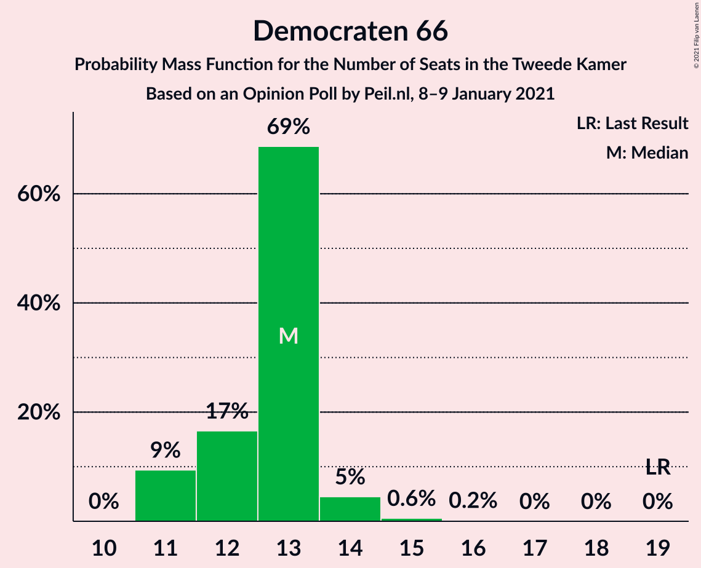
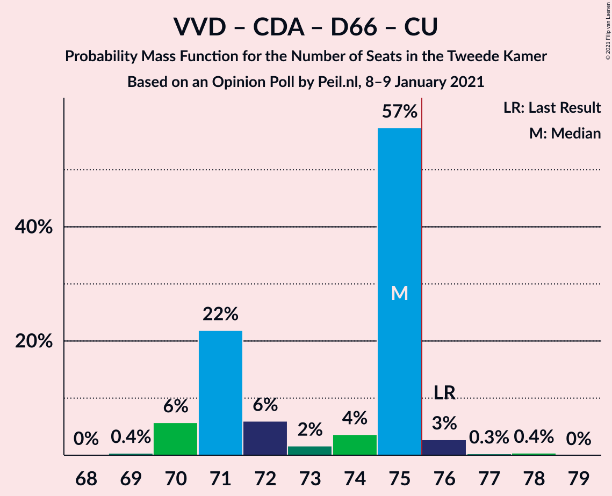

# Opinion Poll by Peil.nl, 8–9 January 2021

<a href="#voting-intentions">Voting Intentions</a> | <a href="#seats">Seats</a> | <a href="#coalitions">Coalitions</a> | <a href="#technical-information">Technical Information</a>

## Voting Intentions

### Confidence Intervals

| Party | Last Result | Poll Result | 80% Confidence Interval | 90% Confidence Interval | 95% Confidence Interval | 99% Confidence Interval |
|:-----:|:-----------:|:-----------:|:-----------------------:|:-----------------------:|:-----------------------:|:-----------------------:|
| Volkspartij voor Vrijheid en Democratie | 21.3% | 22.0% | 21.0–23.0% |20.7–23.2% |20.5–23.5% |20.1–24.0% |
| Partij voor de Vrijheid | 13.1% | 16.6% | 15.8–17.5% |15.5–17.8% |15.3–18.0% |14.9–18.5% |
| Christen-Democratisch Appèl | 12.4% | 12.0% | 11.2–12.8% |11.0–13.0% |10.9–13.2% |10.5–13.6% |
| Democraten 66 | 12.2% | 8.7% | 8.0–9.4% |7.8–9.6% |7.7–9.7% |7.4–10.1% |
| Partij van de Arbeid | 5.7% | 7.3% | 6.8–8.0% |6.6–8.2% |6.4–8.3% |6.2–8.6% |
| GroenLinks | 9.1% | 6.7% | 6.1–7.3% |6.0–7.5% |5.8–7.6% |5.6–7.9% |
| Socialistische Partij | 9.1% | 6.0% | 5.5–6.6% |5.3–6.8% |5.2–6.9% |5.0–7.2% |
| ChristenUnie | 3.4% | 5.3% | 4.8–5.9% |4.7–6.1% |4.6–6.2% |4.4–6.5% |
| Partij voor de Dieren | 3.2% | 4.7% | 4.2–5.2% |4.1–5.3% |4.0–5.5% |3.7–5.8% |
| Staatkundig Gereformeerde Partij | 2.1% | 2.7% | 2.3–3.1% |2.2–3.2% |2.1–3.3% |2.0–3.5% |
| Forum voor Democratie | 1.8% | 2.7% | 2.3–3.1% |2.2–3.2% |2.1–3.3% |2.0–3.5% |
| DENK | 2.1% | 2.0% | 1.7–2.4% |1.6–2.5% |1.6–2.6% |1.4–2.8% |
| Juiste Antwoord 2021 | 0.0% | 2.0% | 1.7–2.4% |1.6–2.5% |1.6–2.6% |1.4–2.8% |
| 50Plus | 3.1% | 0.7% | 0.5–0.9% |0.5–1.0% |0.4–1.0% |0.4–1.2% |
| Bij1 | 0.3% | 0.7% | 0.5–0.9% |0.5–1.0% |0.4–1.0% |0.4–1.2% |

*Note:* The poll result column reflects the actual value used in the calculations. Published results may vary slightly, and in addition be rounded to fewer digits.

## Seats

### Confidence Intervals

| Party | Last Result | Median | 80% Confidence Interval | 90% Confidence Interval | 95% Confidence Interval | 99% Confidence Interval |
|:-----:|:-----------:|:------:|:-----------------------:|:-----------------------:|:-----------------------:|:-----------------------:|
| <a href="#volkspartij-voor-vrijheid-en-democratie">Volkspartij voor Vrijheid en Democratie</a> | 33 | 33 | 32–34 |32–35 |32–37 |31–38 |
| <a href="#partij-voor-de-vrijheid">Partij voor de Vrijheid</a> | 20 | 24 | 24–28 |24–28 |24–28 |24–28 |
| <a href="#christen-democratisch-appèl">Christen-Democratisch Appèl</a> | 19 | 21 | 18–21 |16–21 |16–21 |16–21 |
| <a href="#democraten-66">Democraten 66</a> | 19 | 13 | 12–13 |11–14 |11–14 |11–15 |
| <a href="#partij-van-de-arbeid">Partij van de Arbeid</a> | 9 | 10 | 10–13 |10–13 |10–13 |9–13 |
| <a href="#groenlinks">GroenLinks</a> | 14 | 10 | 9–11 |9–11 |9–12 |8–12 |
| <a href="#socialistische-partij">Socialistische Partij</a> | 14 | 9 | 8–9 |7–9 |7–10 |7–12 |
| <a href="#christenunie">ChristenUnie</a> | 5 | 8 | 8–9 |7–9 |7–9 |6–9 |
| <a href="#partij-voor-de-dieren">Partij voor de Dieren</a> | 5 | 7 | 7–8 |6–8 |6–8 |6–9 |
| <a href="#staatkundig-gereformeerde-partij">Staatkundig Gereformeerde Partij</a> | 3 | 4 | 4 |4 |3–5 |2–5 |
| <a href="#forum-voor-democratie">Forum voor Democratie</a> | 2 | 3 | 3–4 |3–5 |3–5 |3–5 |
| <a href="#denk">DENK</a> | 3 | 3 | 2–3 |2–3 |2–3 |2–4 |
| <a href="#juiste-antwoord-2021">Juiste Antwoord 2021</a> | 0 | 3 | 2–3 |2–3 |2–3 |2–4 |
| <a href="#50plus">50Plus</a> | 4 | 1 | 0–1 |0–1 |0–1 |0–1 |
| <a href="#bij1">Bij1</a> | 0 | 1 | 0–1 |0–1 |0–1 |0–1 |

### Volkspartij voor Vrijheid en Democratie

*For a full overview of the results for this party, see the [Volkspartij voor Vrijheid en Democratie](party-volkspartijvoorvrijheidendemocratie.html) page.*

| Number of Seats | Probability | Accumulated | Special Marks |
|:---------------:|:-----------:|:-----------:|:-------------:|
| 30 | 0.1% | 100% |  |
| 31 | 0.4% | 99.9% |  |
| 32 | 17% | 99.5% |  |
| 33 | 69% | 82% | Last Result, Median |
| 34 | 4% | 14% |  |
| 35 | 6% | 10% |  |
| 36 | 0.8% | 3% |  |
| 37 | 2% | 3% |  |
| 38 | 1.0% | 1.0% |  |
| 39 | 0% | 0% |  |

### Partij voor de Vrijheid

*For a full overview of the results for this party, see the [Partij voor de Vrijheid](party-partijvoordevrijheid.html) page.*

| Number of Seats | Probability | Accumulated | Special Marks |
|:---------------:|:-----------:|:-----------:|:-------------:|
| 20 | 0% | 100% | Last Result |
| 21 | 0% | 100% |  |
| 22 | 0.1% | 100% |  |
| 23 | 0.2% | 99.9% |  |
| 24 | 56% | 99.7% | Median |
| 25 | 15% | 44% |  |
| 26 | 4% | 29% |  |
| 27 | 2% | 25% |  |
| 28 | 23% | 23% |  |
| 29 | 0% | 0% |  |

### Christen-Democratisch Appèl

*For a full overview of the results for this party, see the [Christen-Democratisch Appèl](party-christen-democratischappèl.html) page.*

| Number of Seats | Probability | Accumulated | Special Marks |
|:---------------:|:-----------:|:-----------:|:-------------:|
| 15 | 0.1% | 100% |  |
| 16 | 5% | 99.9% |  |
| 17 | 3% | 95% |  |
| 18 | 26% | 91% |  |
| 19 | 8% | 65% | Last Result |
| 20 | 4% | 57% |  |
| 21 | 53% | 53% | Median |
| 22 | 0% | 0.1% |  |
| 23 | 0% | 0% |  |

### Democraten 66

*For a full overview of the results for this party, see the [Democraten 66](party-democraten66.html) page.*

| Number of Seats | Probability | Accumulated | Special Marks |
|:---------------:|:-----------:|:-----------:|:-------------:|
| 11 | 9% | 100% |  |
| 12 | 17% | 91% |  |
| 13 | 69% | 74% | Median |
| 14 | 5% | 5% |  |
| 15 | 0.6% | 0.8% |  |
| 16 | 0.2% | 0.2% |  |
| 17 | 0% | 0% |  |
| 18 | 0% | 0% |  |
| 19 | 0% | 0% | Last Result |

### Partij van de Arbeid

*For a full overview of the results for this party, see the [Partij van de Arbeid](party-partijvandearbeid.html) page.*

| Number of Seats | Probability | Accumulated | Special Marks |
|:---------------:|:-----------:|:-----------:|:-------------:|
| 8 | 0.2% | 100% |  |
| 9 | 2% | 99.8% | Last Result |
| 10 | 60% | 98% | Median |
| 11 | 7% | 38% |  |
| 12 | 13% | 31% |  |
| 13 | 18% | 18% |  |
| 14 | 0% | 0% |  |

### GroenLinks

*For a full overview of the results for this party, see the [GroenLinks](party-groenlinks.html) page.*

| Number of Seats | Probability | Accumulated | Special Marks |
|:---------------:|:-----------:|:-----------:|:-------------:|
| 8 | 2% | 100% |  |
| 9 | 29% | 98% |  |
| 10 | 59% | 70% | Median |
| 11 | 7% | 11% |  |
| 12 | 3% | 3% |  |
| 13 | 0.2% | 0.2% |  |
| 14 | 0% | 0% | Last Result |

### Socialistische Partij

*For a full overview of the results for this party, see the [Socialistische Partij](party-socialistischepartij.html) page.*

| Number of Seats | Probability | Accumulated | Special Marks |
|:---------------:|:-----------:|:-----------:|:-------------:|
| 7 | 5% | 100% |  |
| 8 | 24% | 95% |  |
| 9 | 66% | 70% | Median |
| 10 | 2% | 4% |  |
| 11 | 0.5% | 1.4% |  |
| 12 | 1.0% | 1.0% |  |
| 13 | 0% | 0% |  |
| 14 | 0% | 0% | Last Result |

### ChristenUnie

*For a full overview of the results for this party, see the [ChristenUnie](party-christenunie.html) page.*

| Number of Seats | Probability | Accumulated | Special Marks |
|:---------------:|:-----------:|:-----------:|:-------------:|
| 5 | 0% | 100% | Last Result |
| 6 | 0.9% | 100% |  |
| 7 | 6% | 99.1% |  |
| 8 | 70% | 93% | Median |
| 9 | 23% | 23% |  |
| 10 | 0.2% | 0.2% |  |
| 11 | 0% | 0% |  |

### Partij voor de Dieren

*For a full overview of the results for this party, see the [Partij voor de Dieren](party-partijvoordedieren.html) page.*

| Number of Seats | Probability | Accumulated | Special Marks |
|:---------------:|:-----------:|:-----------:|:-------------:|
| 5 | 0.4% | 100% | Last Result |
| 6 | 5% | 99.6% |  |
| 7 | 78% | 95% | Median |
| 8 | 15% | 17% |  |
| 9 | 1.4% | 1.4% |  |
| 10 | 0% | 0% |  |

### Staatkundig Gereformeerde Partij

*For a full overview of the results for this party, see the [Staatkundig Gereformeerde Partij](party-staatkundiggereformeerdepartij.html) page.*

| Number of Seats | Probability | Accumulated | Special Marks |
|:---------------:|:-----------:|:-----------:|:-------------:|
| 2 | 0.7% | 100% |  |
| 3 | 4% | 99.3% | Last Result |
| 4 | 92% | 95% | Median |
| 5 | 3% | 3% |  |
| 6 | 0% | 0% |  |

### Forum voor Democratie

*For a full overview of the results for this party, see the [Forum voor Democratie](party-forumvoordemocratie.html) page.*

| Number of Seats | Probability | Accumulated | Special Marks |
|:---------------:|:-----------:|:-----------:|:-------------:|
| 2 | 0.3% | 100% | Last Result |
| 3 | 61% | 99.7% | Median |
| 4 | 31% | 39% |  |
| 5 | 7% | 7% |  |
| 6 | 0% | 0% |  |

### DENK

*For a full overview of the results for this party, see the [DENK](party-denk.html) page.*

| Number of Seats | Probability | Accumulated | Special Marks |
|:---------------:|:-----------:|:-----------:|:-------------:|
| 2 | 28% | 100% |  |
| 3 | 71% | 72% | Last Result, Median |
| 4 | 1.4% | 2% |  |
| 5 | 0.4% | 0.4% |  |
| 6 | 0% | 0% |  |

### Juiste Antwoord 2021

*For a full overview of the results for this party, see the [Juiste Antwoord 2021](party-juisteantwoord2021.html) page.*

| Number of Seats | Probability | Accumulated | Special Marks |
|:---------------:|:-----------:|:-----------:|:-------------:|
| 0 | 0% | 100% | Last Result |
| 1 | 0% | 100% |  |
| 2 | 13% | 100% |  |
| 3 | 85% | 87% | Median |
| 4 | 2% | 2% |  |
| 5 | 0% | 0% |  |

### 50Plus

*For a full overview of the results for this party, see the [50Plus](party-50plus.html) page.*

| Number of Seats | Probability | Accumulated | Special Marks |
|:---------------:|:-----------:|:-----------:|:-------------:|
| 0 | 10% | 100% |  |
| 1 | 89% | 90% | Median |
| 2 | 0.1% | 0.1% |  |
| 3 | 0% | 0% |  |
| 4 | 0% | 0% | Last Result |

### Bij1

*For a full overview of the results for this party, see the [Bij1](party-bij1.html) page.*

| Number of Seats | Probability | Accumulated | Special Marks |
|:---------------:|:-----------:|:-----------:|:-------------:|
| 0 | 30% | 100% | Last Result |
| 1 | 70% | 70% | Median |
| 2 | 0.3% | 0.3% |  |
| 3 | 0% | 0% |  |

## Coalitions

### Confidence Intervals

| Coalition | Last Result | Median | Majority? | 80% Confidence Interval | 90% Confidence Interval | 95% Confidence Interval | 99% Confidence Interval |
|:---------:|:-----------:|:------:|:---------:|:-----------------------:|:-----------------------:|:-----------------------:|:-----------------------:|
| Volkspartij voor Vrijheid en Democratie – Partij voor de Vrijheid – Christen-Democratisch Appèl – Forum voor Democratie – Staatkundig Gereformeerde Partij | 77 | 85 | 100% | 84–87 | 83–88 | 83–89 | 83–91 |
| Volkspartij voor Vrijheid en Democratie – Christen-Democratisch Appèl – Democraten 66 – Partij van de Arbeid – ChristenUnie | 85 | 85 | 100% | 83–85 | 81–86 | 81–87 | 81–89 |
| Volkspartij voor Vrijheid en Democratie – Christen-Democratisch Appèl – Democraten 66 – GroenLinks – ChristenUnie | 90 | 85 | 100% | 80–85 | 80–85 | 80–86 | 78–87 |
| Volkspartij voor Vrijheid en Democratie – Partij voor de Vrijheid – Christen-Democratisch Appèl – Forum voor Democratie | 74 | 81 | 100% | 80–83 | 79–84 | 79–84 | 79–87 |
| Volkspartij voor Vrijheid en Democratie – Partij voor de Vrijheid – Christen-Democratisch Appèl | 72 | 78 | 95% | 76–79 | 74–80 | 74–80 | 74–84 |
| Volkspartij voor Vrijheid en Democratie – Christen-Democratisch Appèl – Democraten 66 – ChristenUnie | 76 | 75 | 3% | 71–75 | 70–75 | 70–76 | 70–77 |
| Christen-Democratisch Appèl – Democraten 66 – Partij van de Arbeid – GroenLinks – Socialistische Partij – ChristenUnie | 80 | 71 | 0% | 67–71 | 67–71 | 66–72 | 66–72 |
| Volkspartij voor Vrijheid en Democratie – Christen-Democratisch Appèl – Democraten 66 | 71 | 67 | 0% | 62–67 | 62–67 | 62–69 | 62–69 |
| Volkspartij voor Vrijheid en Democratie – Christen-Democratisch Appèl – Partij van de Arbeid | 61 | 64 | 0% | 63–64 | 60–66 | 60–66 | 60–68 |
| Volkspartij voor Vrijheid en Democratie – Christen-Democratisch Appèl – Forum voor Democratie – Staatkundig Gereformeerde Partij – 50Plus | 61 | 62 | 0% | 59–62 | 59–63 | 59–65 | 57–65 |
| Christen-Democratisch Appèl – Democraten 66 – Partij van de Arbeid – GroenLinks – ChristenUnie | 66 | 62 | 0% | 59–62 | 59–62 | 58–64 | 57–64 |
| Volkspartij voor Vrijheid en Democratie – Christen-Democratisch Appèl – Forum voor Democratie – Staatkundig Gereformeerde Partij | 57 | 61 | 0% | 58–61 | 58–62 | 58–64 | 57–64 |
| Volkspartij voor Vrijheid en Democratie – Democraten 66 – Partij van de Arbeid | 61 | 56 | 0% | 56–58 | 56–60 | 56–61 | 55–64 |
| Volkspartij voor Vrijheid en Democratie – Christen-Democratisch Appèl – Forum voor Democratie – 50Plus | 58 | 58 | 0% | 55–58 | 55–59 | 55–60 | 54–61 |
| Volkspartij voor Vrijheid en Democratie – Christen-Democratisch Appèl – Forum voor Democratie | 54 | 57 | 0% | 54–57 | 54–59 | 54–59 | 53–60 |
| Volkspartij voor Vrijheid en Democratie – Christen-Democratisch Appèl | 52 | 54 | 0% | 50–54 | 49–55 | 49–55 | 49–56 |
| Volkspartij voor Vrijheid en Democratie – Partij van de Arbeid | 42 | 43 | 0% | 43–45 | 43–47 | 43–48 | 42–50 |
| Christen-Democratisch Appèl – Democraten 66 – Partij van de Arbeid | 47 | 44 | 0% | 41–44 | 40–44 | 40–45 | 40–46 |
| Christen-Democratisch Appèl – Partij van de Arbeid – ChristenUnie | 33 | 39 | 0% | 36–40 | 35–40 | 35–40 | 35–41 |
| Christen-Democratisch Appèl – Democraten 66 | 38 | 34 | 0% | 29–34 | 29–34 | 29–34 | 29–34 |
| Christen-Democratisch Appèl – Partij van de Arbeid | 28 | 31 | 0% | 29–31 | 27–31 | 27–32 | 27–32 |

### Volkspartij voor Vrijheid en Democratie – Partij voor de Vrijheid – Christen-Democratisch Appèl – Forum voor Democratie – Staatkundig Gereformeerde Partij

| Number of Seats | Probability | Accumulated | Special Marks |
|:---------------:|:-----------:|:-----------:|:-------------:|
| 77 | 0% | 100% | Last Result |
| 78 | 0% | 100% |  |
| 79 | 0% | 100% |  |
| 80 | 0% | 100% |  |
| 81 | 0% | 100% |  |
| 82 | 0.3% | 99.9% |  |
| 83 | 8% | 99.7% |  |
| 84 | 4% | 91% |  |
| 85 | 54% | 87% | Median |
| 86 | 17% | 33% |  |
| 87 | 11% | 16% |  |
| 88 | 1.0% | 5% |  |
| 89 | 3% | 4% |  |
| 90 | 0.2% | 1.2% |  |
| 91 | 1.0% | 1.0% |  |
| 92 | 0% | 0% |  |

### Volkspartij voor Vrijheid en Democratie – Christen-Democratisch Appèl – Democraten 66 – Partij van de Arbeid – ChristenUnie

| Number of Seats | Probability | Accumulated | Special Marks |
|:---------------:|:-----------:|:-----------:|:-------------:|
| 79 | 0.1% | 100% |  |
| 80 | 0.1% | 99.9% |  |
| 81 | 6% | 99.8% |  |
| 82 | 2% | 94% |  |
| 83 | 12% | 92% |  |
| 84 | 13% | 80% |  |
| 85 | 60% | 67% | Last Result, Median |
| 86 | 2% | 7% |  |
| 87 | 3% | 5% |  |
| 88 | 1.0% | 2% |  |
| 89 | 0.1% | 0.5% |  |
| 90 | 0% | 0.4% |  |
| 91 | 0.4% | 0.4% |  |
| 92 | 0% | 0% |  |

### Volkspartij voor Vrijheid en Democratie – Christen-Democratisch Appèl – Democraten 66 – GroenLinks – ChristenUnie

| Number of Seats | Probability | Accumulated | Special Marks |
|:---------------:|:-----------:|:-----------:|:-------------:|
| 78 | 1.0% | 100% |  |
| 79 | 0.3% | 99.0% |  |
| 80 | 21% | 98.7% |  |
| 81 | 10% | 78% |  |
| 82 | 2% | 69% |  |
| 83 | 3% | 67% |  |
| 84 | 0.9% | 64% |  |
| 85 | 59% | 63% | Median |
| 86 | 3% | 4% |  |
| 87 | 0.5% | 0.6% |  |
| 88 | 0.1% | 0.1% |  |
| 89 | 0% | 0% |  |
| 90 | 0% | 0% | Last Result |

### Volkspartij voor Vrijheid en Democratie – Partij voor de Vrijheid – Christen-Democratisch Appèl – Forum voor Democratie

| Number of Seats | Probability | Accumulated | Special Marks |
|:---------------:|:-----------:|:-----------:|:-------------:|
| 74 | 0% | 100% | Last Result |
| 75 | 0% | 100% |  |
| 76 | 0% | 100% | Majority |
| 77 | 0% | 100% |  |
| 78 | 0.3% | 99.9% |  |
| 79 | 6% | 99.6% |  |
| 80 | 6% | 93% |  |
| 81 | 54% | 87% | Median |
| 82 | 17% | 33% |  |
| 83 | 10% | 17% |  |
| 84 | 5% | 6% |  |
| 85 | 0.4% | 2% |  |
| 86 | 0.2% | 1.3% |  |
| 87 | 1.0% | 1.1% |  |
| 88 | 0% | 0% |  |

### Volkspartij voor Vrijheid en Democratie – Partij voor de Vrijheid – Christen-Democratisch Appèl

| Number of Seats | Probability | Accumulated | Special Marks |
|:---------------:|:-----------:|:-----------:|:-------------:|
| 72 | 0% | 100% | Last Result |
| 73 | 0.1% | 100% |  |
| 74 | 5% | 99.9% |  |
| 75 | 0.2% | 95% |  |
| 76 | 6% | 95% | Majority |
| 77 | 3% | 89% |  |
| 78 | 67% | 86% | Median |
| 79 | 13% | 19% |  |
| 80 | 5% | 7% |  |
| 81 | 0.1% | 1.4% |  |
| 82 | 0% | 1.3% |  |
| 83 | 0.2% | 1.2% |  |
| 84 | 1.0% | 1.0% |  |
| 85 | 0% | 0% |  |

### Volkspartij voor Vrijheid en Democratie – Christen-Democratisch Appèl – Democraten 66 – ChristenUnie

| Number of Seats | Probability | Accumulated | Special Marks |
|:---------------:|:-----------:|:-----------:|:-------------:|
| 69 | 0.4% | 100% |  |
| 70 | 6% | 99.6% |  |
| 71 | 22% | 94% |  |
| 72 | 6% | 72% |  |
| 73 | 2% | 66% |  |
| 74 | 4% | 64% |  |
| 75 | 57% | 61% | Median |
| 76 | 3% | 3% | Last Result, Majority |
| 77 | 0.3% | 0.7% |  |
| 78 | 0.4% | 0.4% |  |
| 79 | 0% | 0% |  |

### Christen-Democratisch Appèl – Democraten 66 – Partij van de Arbeid – GroenLinks – Socialistische Partij – ChristenUnie

| Number of Seats | Probability | Accumulated | Special Marks |
|:---------------:|:-----------:|:-----------:|:-------------:|
| 64 | 0% | 100% |  |
| 65 | 0.1% | 99.9% |  |
| 66 | 3% | 99.9% |  |
| 67 | 13% | 97% |  |
| 68 | 7% | 84% |  |
| 69 | 13% | 77% |  |
| 70 | 0.4% | 64% |  |
| 71 | 61% | 63% | Median |
| 72 | 2% | 3% |  |
| 73 | 0.2% | 0.4% |  |
| 74 | 0% | 0.2% |  |
| 75 | 0.1% | 0.1% |  |
| 76 | 0% | 0% | Majority |
| 77 | 0% | 0% |  |
| 78 | 0% | 0% |  |
| 79 | 0% | 0% |  |
| 80 | 0% | 0% | Last Result |

### Volkspartij voor Vrijheid en Democratie – Christen-Democratisch Appèl – Democraten 66

| Number of Seats | Probability | Accumulated | Special Marks |
|:---------------:|:-----------:|:-----------:|:-------------:|
| 61 | 0.3% | 100% |  |
| 62 | 26% | 99.7% |  |
| 63 | 1.2% | 74% |  |
| 64 | 5% | 73% |  |
| 65 | 3% | 67% |  |
| 66 | 5% | 65% |  |
| 67 | 56% | 60% | Median |
| 68 | 1.0% | 4% |  |
| 69 | 2% | 3% |  |
| 70 | 0.4% | 0.4% |  |
| 71 | 0% | 0% | Last Result |

### Volkspartij voor Vrijheid en Democratie – Christen-Democratisch Appèl – Partij van de Arbeid

| Number of Seats | Probability | Accumulated | Special Marks |
|:---------------:|:-----------:|:-----------:|:-------------:|
| 59 | 0.3% | 100% |  |
| 60 | 5% | 99.7% |  |
| 61 | 3% | 94% | Last Result |
| 62 | 2% | 92% |  |
| 63 | 23% | 90% |  |
| 64 | 59% | 67% | Median |
| 65 | 3% | 9% |  |
| 66 | 4% | 6% |  |
| 67 | 0.8% | 2% |  |
| 68 | 0.3% | 0.7% |  |
| 69 | 0.4% | 0.4% |  |
| 70 | 0% | 0% |  |

### Volkspartij voor Vrijheid en Democratie – Christen-Democratisch Appèl – Forum voor Democratie – Staatkundig Gereformeerde Partij – 50Plus

| Number of Seats | Probability | Accumulated | Special Marks |
|:---------------:|:-----------:|:-----------:|:-------------:|
| 55 | 0.1% | 100% |  |
| 56 | 0.3% | 99.9% |  |
| 57 | 0.9% | 99.7% |  |
| 58 | 0.8% | 98.7% |  |
| 59 | 23% | 98% |  |
| 60 | 9% | 75% |  |
| 61 | 5% | 65% | Last Result |
| 62 | 55% | 60% | Median |
| 63 | 2% | 5% |  |
| 64 | 0% | 3% |  |
| 65 | 3% | 3% |  |
| 66 | 0% | 0% |  |

### Christen-Democratisch Appèl – Democraten 66 – Partij van de Arbeid – GroenLinks – ChristenUnie

| Number of Seats | Probability | Accumulated | Special Marks |
|:---------------:|:-----------:|:-----------:|:-------------:|
| 56 | 0% | 100% |  |
| 57 | 2% | 99.9% |  |
| 58 | 2% | 98% |  |
| 59 | 16% | 96% |  |
| 60 | 5% | 80% |  |
| 61 | 13% | 74% |  |
| 62 | 57% | 61% | Median |
| 63 | 1.1% | 4% |  |
| 64 | 3% | 3% |  |
| 65 | 0.2% | 0.2% |  |
| 66 | 0% | 0% | Last Result |

### Volkspartij voor Vrijheid en Democratie – Christen-Democratisch Appèl – Forum voor Democratie – Staatkundig Gereformeerde Partij

| Number of Seats | Probability | Accumulated | Special Marks |
|:---------------:|:-----------:|:-----------:|:-------------:|
| 55 | 0.3% | 100% |  |
| 56 | 0.2% | 99.7% |  |
| 57 | 2% | 99.5% | Last Result |
| 58 | 19% | 98% |  |
| 59 | 14% | 79% |  |
| 60 | 3% | 66% |  |
| 61 | 56% | 62% | Median |
| 62 | 2% | 6% |  |
| 63 | 2% | 5% |  |
| 64 | 3% | 3% |  |
| 65 | 0% | 0% |  |

### Volkspartij voor Vrijheid en Democratie – Democraten 66 – Partij van de Arbeid

| Number of Seats | Probability | Accumulated | Special Marks |
|:---------------:|:-----------:|:-----------:|:-------------:|
| 54 | 0.2% | 100% |  |
| 55 | 0.6% | 99.8% |  |
| 56 | 64% | 99.1% | Median |
| 57 | 22% | 35% |  |
| 58 | 6% | 13% |  |
| 59 | 0.7% | 7% |  |
| 60 | 2% | 6% |  |
| 61 | 3% | 4% | Last Result |
| 62 | 0.4% | 2% |  |
| 63 | 0.4% | 1.2% |  |
| 64 | 0.8% | 0.8% |  |
| 65 | 0% | 0% |  |

### Volkspartij voor Vrijheid en Democratie – Christen-Democratisch Appèl – Forum voor Democratie – 50Plus

| Number of Seats | Probability | Accumulated | Special Marks |
|:---------------:|:-----------:|:-----------:|:-------------:|
| 51 | 0.1% | 100% |  |
| 52 | 0.2% | 99.9% |  |
| 53 | 0.2% | 99.7% |  |
| 54 | 1.5% | 99.5% |  |
| 55 | 22% | 98% |  |
| 56 | 11% | 76% |  |
| 57 | 5% | 65% |  |
| 58 | 55% | 61% | Last Result, Median |
| 59 | 2% | 6% |  |
| 60 | 3% | 4% |  |
| 61 | 0.4% | 0.5% |  |
| 62 | 0.1% | 0.1% |  |
| 63 | 0% | 0% |  |

### Volkspartij voor Vrijheid en Democratie – Christen-Democratisch Appèl – Forum voor Democratie

| Number of Seats | Probability | Accumulated | Special Marks |
|:---------------:|:-----------:|:-----------:|:-------------:|
| 51 | 0.3% | 100% |  |
| 52 | 0.2% | 99.7% |  |
| 53 | 0.7% | 99.5% |  |
| 54 | 19% | 98.9% | Last Result |
| 55 | 13% | 80% |  |
| 56 | 4% | 67% |  |
| 57 | 56% | 63% | Median |
| 58 | 1.5% | 7% |  |
| 59 | 4% | 5% |  |
| 60 | 0.8% | 0.9% |  |
| 61 | 0.1% | 0.1% |  |
| 62 | 0% | 0% |  |

### Volkspartij voor Vrijheid en Democratie – Christen-Democratisch Appèl

| Number of Seats | Probability | Accumulated | Special Marks |
|:---------------:|:-----------:|:-----------:|:-------------:|
| 48 | 0.3% | 100% |  |
| 49 | 5% | 99.7% |  |
| 50 | 13% | 94% |  |
| 51 | 14% | 81% |  |
| 52 | 4% | 67% | Last Result |
| 53 | 3% | 64% |  |
| 54 | 54% | 60% | Median |
| 55 | 4% | 6% |  |
| 56 | 2% | 2% |  |
| 57 | 0% | 0% |  |

### Volkspartij voor Vrijheid en Democratie – Partij van de Arbeid

| Number of Seats | Probability | Accumulated | Special Marks |
|:---------------:|:-----------:|:-----------:|:-------------:|
| 41 | 0.2% | 100% |  |
| 42 | 2% | 99.8% | Last Result |
| 43 | 55% | 98% | Median |
| 44 | 6% | 43% |  |
| 45 | 30% | 37% |  |
| 46 | 1.1% | 7% |  |
| 47 | 2% | 6% |  |
| 48 | 2% | 4% |  |
| 49 | 0.5% | 1.4% |  |
| 50 | 0.9% | 0.9% |  |
| 51 | 0% | 0% |  |

### Christen-Democratisch Appèl – Democraten 66 – Partij van de Arbeid

| Number of Seats | Probability | Accumulated | Special Marks |
|:---------------:|:-----------:|:-----------:|:-------------:|
| 38 | 0% | 100% |  |
| 39 | 0.1% | 99.9% |  |
| 40 | 6% | 99.8% |  |
| 41 | 11% | 94% |  |
| 42 | 8% | 83% |  |
| 43 | 15% | 75% |  |
| 44 | 56% | 60% | Median |
| 45 | 4% | 5% |  |
| 46 | 0.3% | 0.8% |  |
| 47 | 0.5% | 0.5% | Last Result |
| 48 | 0% | 0% |  |

### Christen-Democratisch Appèl – Partij van de Arbeid – ChristenUnie

| Number of Seats | Probability | Accumulated | Special Marks |
|:---------------:|:-----------:|:-----------:|:-------------:|
| 33 | 0.1% | 100% | Last Result |
| 34 | 0.2% | 99.9% |  |
| 35 | 7% | 99.7% |  |
| 36 | 5% | 92% |  |
| 37 | 0.9% | 88% |  |
| 38 | 6% | 87% |  |
| 39 | 65% | 81% | Median |
| 40 | 15% | 16% |  |
| 41 | 0.7% | 0.7% |  |
| 42 | 0% | 0% |  |

### Christen-Democratisch Appèl – Democraten 66

| Number of Seats | Probability | Accumulated | Special Marks |
|:---------------:|:-----------:|:-----------:|:-------------:|
| 28 | 0.1% | 100% |  |
| 29 | 14% | 99.9% |  |
| 30 | 14% | 86% |  |
| 31 | 7% | 72% |  |
| 32 | 10% | 65% |  |
| 33 | 1.3% | 56% |  |
| 34 | 54% | 54% | Median |
| 35 | 0.2% | 0.2% |  |
| 36 | 0% | 0% |  |
| 37 | 0% | 0% |  |
| 38 | 0% | 0% | Last Result |

### Christen-Democratisch Appèl – Partij van de Arbeid

| Number of Seats | Probability | Accumulated | Special Marks |
|:---------------:|:-----------:|:-----------:|:-------------:|
| 26 | 0.1% | 100% |  |
| 27 | 7% | 99.8% |  |
| 28 | 1.0% | 93% | Last Result |
| 29 | 7% | 92% |  |
| 30 | 14% | 86% |  |
| 31 | 68% | 72% | Median |
| 32 | 4% | 4% |  |
| 33 | 0.4% | 0.4% |  |
| 34 | 0% | 0% |  |

## Technical Information

### Opinion Poll

+ **Polling firm:** Peil.nl
+ **Commissioner(s):** —
+ **Fieldwork period:** 8–9 January 2021

### Calculations

+ **Sample size:** 3000
+ **Simulations done:** 1,048,576
+ **Error estimate:** 2.16%

