# Opinion Poll by Peil.nl, 10 January 2021

<a href="#voting-intentions">Voting Intentions</a> | <a href="#seats">Seats</a> | <a href="#coalitions">Coalitions</a> | <a href="#technical-information">Technical Information</a>

## Voting Intentions

### Confidence Intervals

| Party | Last Result | Poll Result | 80% Confidence Interval | 90% Confidence Interval | 95% Confidence Interval | 99% Confidence Interval |
|:-----:|:-----------:|:-----------:|:-----------------------:|:-----------------------:|:-----------------------:|:-----------------------:|
| Volkspartij voor Vrijheid en Democratie | 21.3% | 22.0% | 21.0–23.0% |20.8–23.3% |20.5–23.5% |20.1–24.0% |
| Partij voor de Vrijheid | 13.1% | 16.7% | 15.8–17.6% |15.6–17.8% |15.4–18.0% |15.0–18.5% |
| Christen-Democratisch Appèl | 12.4% | 12.0% | 11.3–12.8% |11.1–13.0% |10.9–13.2% |10.5–13.6% |
| Democraten 66 | 12.2% | 8.7% | 8.0–9.4% |7.8–9.6% |7.7–9.7% |7.4–10.1% |
| Partij van de Arbeid | 5.7% | 7.3% | 6.8–8.0% |6.6–8.2% |6.4–8.3% |6.2–8.6% |
| GroenLinks | 9.1% | 6.7% | 6.1–7.3% |6.0–7.5% |5.8–7.6% |5.6–7.9% |
| Socialistische Partij | 9.1% | 6.0% | 5.5–6.6% |5.3–6.8% |5.2–6.9% |5.0–7.2% |
| ChristenUnie | 3.4% | 5.3% | 4.8–5.9% |4.7–6.1% |4.6–6.2% |4.4–6.5% |
| Partij voor de Dieren | 3.2% | 4.7% | 4.2–5.2% |4.1–5.3% |4.0–5.5% |3.7–5.8% |
| Staatkundig Gereformeerde Partij | 2.1% | 2.7% | 2.3–3.1% |2.2–3.2% |2.1–3.3% |2.0–3.5% |
| Forum voor Democratie | 1.8% | 2.7% | 2.3–3.1% |2.2–3.2% |2.1–3.3% |2.0–3.5% |
| DENK | 2.1% | 2.0% | 1.7–2.4% |1.6–2.5% |1.6–2.6% |1.4–2.8% |
| 50Plus | 3.1% | 0.7% | 0.5–0.9% |0.5–1.0% |0.4–1.0% |0.4–1.2% |

*Note:* The poll result column reflects the actual value used in the calculations. Published results may vary slightly, and in addition be rounded to fewer digits.

## Seats

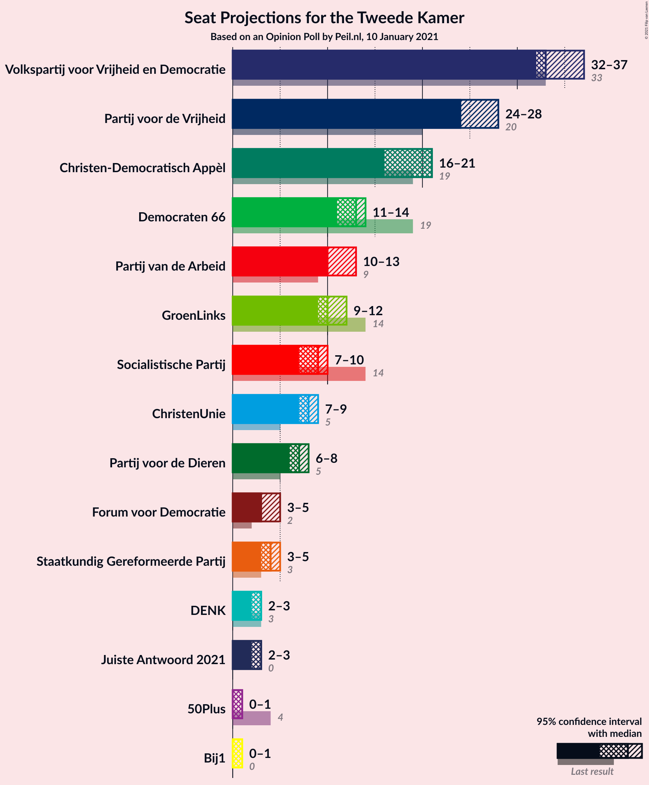

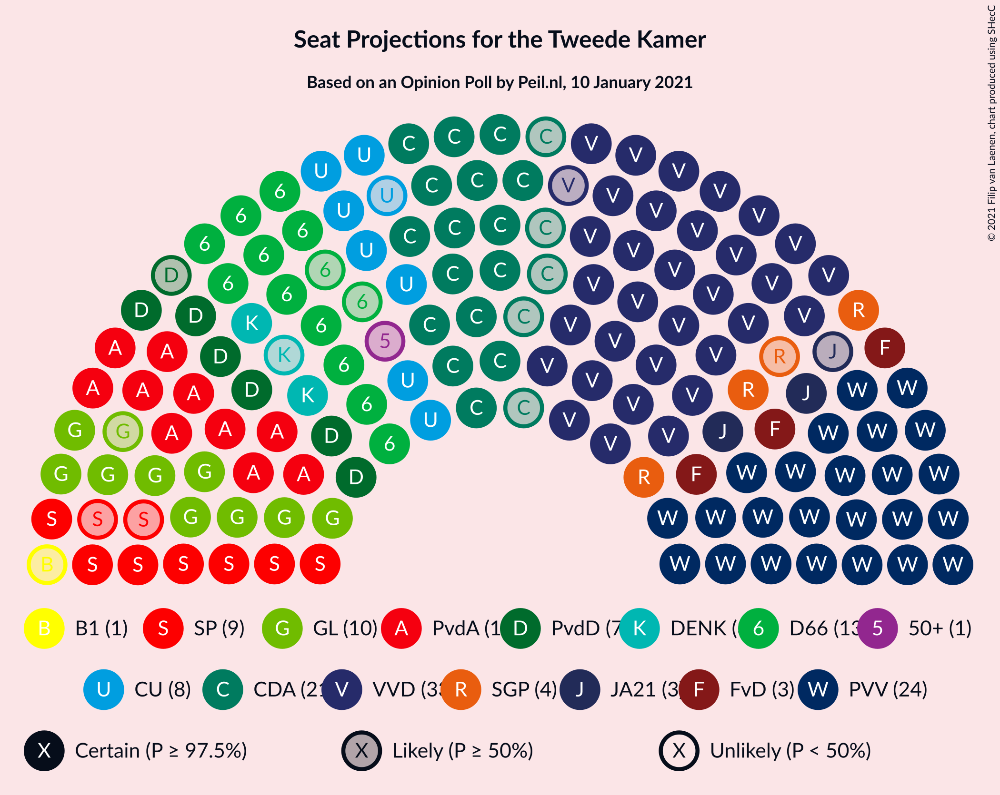

### Confidence Intervals

| Party | Last Result | Median | 80% Confidence Interval | 90% Confidence Interval | 95% Confidence Interval | 99% Confidence Interval |
|:-----:|:-----------:|:------:|:-----------------------:|:-----------------------:|:-----------------------:|:-----------------------:|
| <a href="#volkspartij-voor-vrijheid-en-democratie">Volkspartij voor Vrijheid en Democratie</a> | 33 | 33 | 33–35 |32–36 |32–36 |31–37 |
| <a href="#partij-voor-de-vrijheid">Partij voor de Vrijheid</a> | 20 | 26 | 24–26 |24–27 |24–28 |23–28 |
| <a href="#christen-democratisch-appèl">Christen-Democratisch Appèl</a> | 19 | 20 | 17–20 |17–20 |17–20 |16–21 |
| <a href="#democraten-66">Democraten 66</a> | 19 | 14 | 12–15 |11–15 |11–15 |11–15 |
| <a href="#partij-van-de-arbeid">Partij van de Arbeid</a> | 9 | 11 | 10–12 |10–12 |10–12 |10–13 |
| <a href="#groenlinks">GroenLinks</a> | 14 | 10 | 9–10 |9–11 |9–11 |8–11 |
| <a href="#socialistische-partij">Socialistische Partij</a> | 14 | 9 | 8–10 |8–10 |8–10 |7–12 |
| <a href="#christenunie">ChristenUnie</a> | 5 | 8 | 7–9 |7–9 |7–9 |7–9 |
| <a href="#partij-voor-de-dieren">Partij voor de Dieren</a> | 5 | 7 | 6–8 |6–8 |6–8 |6–8 |
| <a href="#staatkundig-gereformeerde-partij">Staatkundig Gereformeerde Partij</a> | 3 | 4 | 3–4 |3–4 |3–4 |3–5 |
| <a href="#forum-voor-democratie">Forum voor Democratie</a> | 2 | 3 | 3–4 |3–4 |3–4 |2–5 |
| <a href="#denk">DENK</a> | 3 | 2 | 2–3 |2–3 |2–3 |2–4 |
| <a href="#50plus">50Plus</a> | 4 | 1 | 0–1 |0–1 |0–1 |0–1 |

### Volkspartij voor Vrijheid en Democratie

*For a full overview of the results for this party, see the [Volkspartij voor Vrijheid en Democratie](party-volkspartijvoorvrijheidendemocratie.html) page.*

| Number of Seats | Probability | Accumulated | Special Marks |
|:---------------:|:-----------:|:-----------:|:-------------:|
| 30 | 0.1% | 100% |  |
| 31 | 0.4% | 99.9% |  |
| 32 | 7% | 99.5% |  |
| 33 | 54% | 92% | Last Result, Median |
| 34 | 28% | 39% |  |
| 35 | 4% | 11% |  |
| 36 | 6% | 7% |  |
| 37 | 0.7% | 0.7% |  |
| 38 | 0% | 0% |  |

### Partij voor de Vrijheid

*For a full overview of the results for this party, see the [Partij voor de Vrijheid](party-partijvoordevrijheid.html) page.*

| Number of Seats | Probability | Accumulated | Special Marks |
|:---------------:|:-----------:|:-----------:|:-------------:|
| 20 | 0% | 100% | Last Result |
| 21 | 0% | 100% |  |
| 22 | 0.5% | 100% |  |
| 23 | 0.9% | 99.5% |  |
| 24 | 15% | 98.6% |  |
| 25 | 32% | 84% |  |
| 26 | 43% | 52% | Median |
| 27 | 5% | 9% |  |
| 28 | 4% | 4% |  |
| 29 | 0% | 0% |  |

### Christen-Democratisch Appèl

*For a full overview of the results for this party, see the [Christen-Democratisch Appèl](party-christen-democratischappèl.html) page.*

| Number of Seats | Probability | Accumulated | Special Marks |
|:---------------:|:-----------:|:-----------:|:-------------:|
| 16 | 1.0% | 100% |  |
| 17 | 12% | 98.9% |  |
| 18 | 13% | 87% |  |
| 19 | 18% | 74% | Last Result |
| 20 | 55% | 56% | Median |
| 21 | 0.5% | 0.5% |  |
| 22 | 0% | 0% |  |

### Democraten 66

*For a full overview of the results for this party, see the [Democraten 66](party-democraten66.html) page.*

| Number of Seats | Probability | Accumulated | Special Marks |
|:---------------:|:-----------:|:-----------:|:-------------:|
| 11 | 5% | 100% |  |
| 12 | 6% | 95% |  |
| 13 | 13% | 89% |  |
| 14 | 54% | 75% | Median |
| 15 | 21% | 21% |  |
| 16 | 0.2% | 0.2% |  |
| 17 | 0% | 0% |  |
| 18 | 0% | 0% |  |
| 19 | 0% | 0% | Last Result |

### Partij van de Arbeid

*For a full overview of the results for this party, see the [Partij van de Arbeid](party-partijvandearbeid.html) page.*

| Number of Seats | Probability | Accumulated | Special Marks |
|:---------------:|:-----------:|:-----------:|:-------------:|
| 9 | 0.2% | 100% | Last Result |
| 10 | 40% | 99.8% |  |
| 11 | 44% | 60% | Median |
| 12 | 14% | 16% |  |
| 13 | 2% | 2% |  |
| 14 | 0.1% | 0.1% |  |
| 15 | 0% | 0% |  |

### GroenLinks

*For a full overview of the results for this party, see the [GroenLinks](party-groenlinks.html) page.*

| Number of Seats | Probability | Accumulated | Special Marks |
|:---------------:|:-----------:|:-----------:|:-------------:|
| 8 | 2% | 100% |  |
| 9 | 34% | 98% |  |
| 10 | 57% | 64% | Median |
| 11 | 7% | 7% |  |
| 12 | 0.5% | 0.5% |  |
| 13 | 0% | 0% |  |
| 14 | 0% | 0% | Last Result |

### Socialistische Partij

*For a full overview of the results for this party, see the [Socialistische Partij](party-socialistischepartij.html) page.*

| Number of Seats | Probability | Accumulated | Special Marks |
|:---------------:|:-----------:|:-----------:|:-------------:|
| 7 | 2% | 100% |  |
| 8 | 23% | 98% |  |
| 9 | 57% | 75% | Median |
| 10 | 17% | 18% |  |
| 11 | 0.3% | 0.9% |  |
| 12 | 0.6% | 0.6% |  |
| 13 | 0% | 0% |  |
| 14 | 0% | 0% | Last Result |

### ChristenUnie

*For a full overview of the results for this party, see the [ChristenUnie](party-christenunie.html) page.*

| Number of Seats | Probability | Accumulated | Special Marks |
|:---------------:|:-----------:|:-----------:|:-------------:|
| 5 | 0% | 100% | Last Result |
| 6 | 0.2% | 100% |  |
| 7 | 27% | 99.8% |  |
| 8 | 59% | 73% | Median |
| 9 | 14% | 14% |  |
| 10 | 0.1% | 0.1% |  |
| 11 | 0% | 0% |  |

### Partij voor de Dieren

*For a full overview of the results for this party, see the [Partij voor de Dieren](party-partijvoordedieren.html) page.*

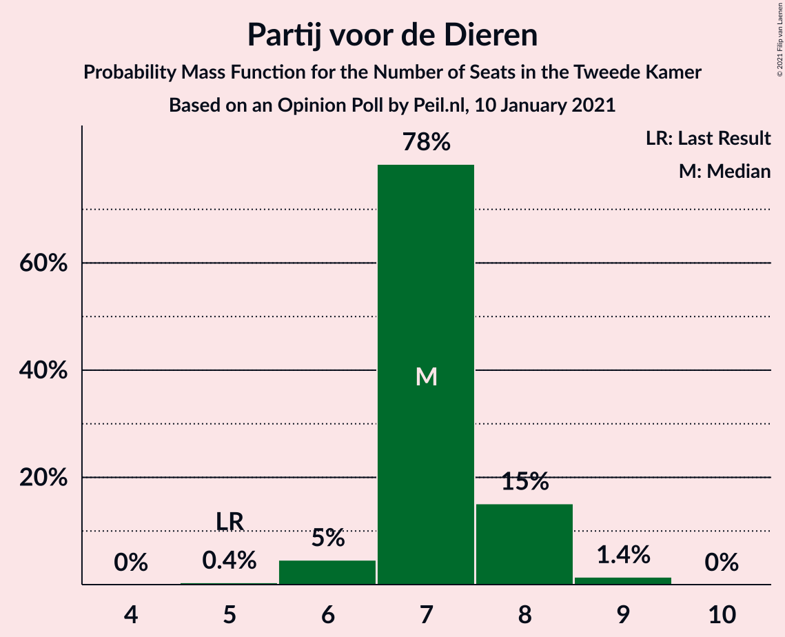

| Number of Seats | Probability | Accumulated | Special Marks |
|:---------------:|:-----------:|:-----------:|:-------------:|
| 5 | 0.4% | 100% | Last Result |
| 6 | 19% | 99.6% |  |
| 7 | 70% | 81% | Median |
| 8 | 11% | 11% |  |
| 9 | 0.2% | 0.2% |  |
| 10 | 0% | 0% |  |

### Staatkundig Gereformeerde Partij

*For a full overview of the results for this party, see the [Staatkundig Gereformeerde Partij](party-staatkundiggereformeerdepartij.html) page.*

| Number of Seats | Probability | Accumulated | Special Marks |
|:---------------:|:-----------:|:-----------:|:-------------:|
| 3 | 15% | 100% | Last Result |
| 4 | 83% | 85% | Median |
| 5 | 2% | 2% |  |
| 6 | 0% | 0% |  |

### Forum voor Democratie

*For a full overview of the results for this party, see the [Forum voor Democratie](party-forumvoordemocratie.html) page.*

| Number of Seats | Probability | Accumulated | Special Marks |
|:---------------:|:-----------:|:-----------:|:-------------:|
| 2 | 0.5% | 100% | Last Result |
| 3 | 50% | 99.5% | Median |
| 4 | 47% | 49% |  |
| 5 | 2% | 2% |  |
| 6 | 0% | 0% |  |

### DENK

*For a full overview of the results for this party, see the [DENK](party-denk.html) page.*

| Number of Seats | Probability | Accumulated | Special Marks |
|:---------------:|:-----------:|:-----------:|:-------------:|
| 1 | 0.1% | 100% |  |
| 2 | 51% | 99.9% | Median |
| 3 | 48% | 49% | Last Result |
| 4 | 0.7% | 0.7% |  |
| 5 | 0% | 0% |  |

### 50Plus

*For a full overview of the results for this party, see the [50Plus](party-50plus.html) page.*

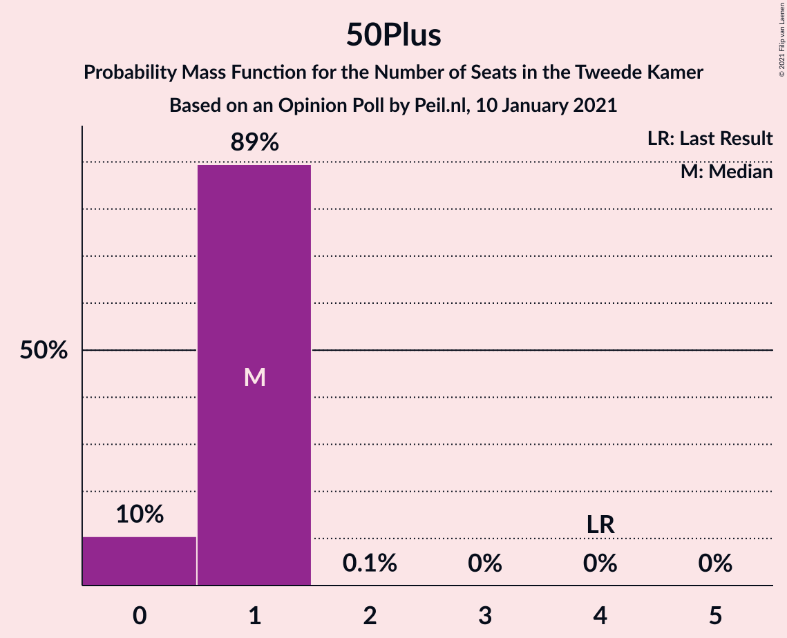

| Number of Seats | Probability | Accumulated | Special Marks |
|:---------------:|:-----------:|:-----------:|:-------------:|
| 0 | 24% | 100% |  |
| 1 | 76% | 76% | Median |
| 2 | 0% | 0% |  |
| 3 | 0% | 0% |  |
| 4 | 0% | 0% | Last Result |

## Coalitions

### Confidence Intervals

| Coalition | Last Result | Median | Majority? | 80% Confidence Interval | 90% Confidence Interval | 95% Confidence Interval | 99% Confidence Interval |
|:---------:|:-----------:|:------:|:---------:|:-----------------------:|:-----------------------:|:-----------------------:|:-----------------------:|
| Volkspartij voor Vrijheid en Democratie – Christen-Democratisch Appèl – Democraten 66 – Partij van de Arbeid – ChristenUnie | 85 | 85 | 100% | 82–86 | 82–87 | 82–87 | 81–88 |
| Volkspartij voor Vrijheid en Democratie – Partij voor de Vrijheid – Christen-Democratisch Appèl – Forum voor Democratie – Staatkundig Gereformeerde Partij | 77 | 86 | 100% | 84–87 | 82–87 | 82–87 | 82–88 |
| Volkspartij voor Vrijheid en Democratie – Christen-Democratisch Appèl – Democraten 66 – GroenLinks – ChristenUnie | 90 | 84 | 100% | 81–85 | 81–86 | 81–86 | 80–87 |
| Volkspartij voor Vrijheid en Democratie – Partij voor de Vrijheid – Christen-Democratisch Appèl – Forum voor Democratie | 74 | 82 | 100% | 80–83 | 79–83 | 79–83 | 78–85 |
| Volkspartij voor Vrijheid en Democratie – Partij voor de Vrijheid – Christen-Democratisch Appèl | 72 | 79 | 93% | 76–79 | 75–79 | 75–79 | 74–82 |
| Volkspartij voor Vrijheid en Democratie – Christen-Democratisch Appèl – Democraten 66 – ChristenUnie | 76 | 75 | 8% | 71–75 | 71–76 | 70–76 | 70–77 |
| Christen-Democratisch Appèl – Democraten 66 – Partij van de Arbeid – GroenLinks – Socialistische Partij – ChristenUnie | 80 | 70 | 0% | 69–72 | 68–72 | 68–73 | 67–73 |
| Volkspartij voor Vrijheid en Democratie – Christen-Democratisch Appèl – Democraten 66 | 71 | 67 | 0% | 63–68 | 63–68 | 62–68 | 62–69 |
| Volkspartij voor Vrijheid en Democratie – Christen-Democratisch Appèl – Partij van de Arbeid | 61 | 63 | 0% | 62–65 | 61–65 | 61–65 | 59–66 |
| Christen-Democratisch Appèl – Democraten 66 – Partij van de Arbeid – GroenLinks – ChristenUnie | 66 | 61 | 0% | 59–63 | 59–63 | 59–64 | 57–64 |
| Volkspartij voor Vrijheid en Democratie – Christen-Democratisch Appèl – Forum voor Democratie – Staatkundig Gereformeerde Partij – 50Plus | 61 | 61 | 0% | 59–63 | 58–63 | 58–63 | 57–64 |
| Volkspartij voor Vrijheid en Democratie – Christen-Democratisch Appèl – Forum voor Democratie – Staatkundig Gereformeerde Partij | 57 | 60 | 0% | 58–62 | 57–62 | 57–62 | 57–63 |
| Volkspartij voor Vrijheid en Democratie – Democraten 66 – Partij van de Arbeid | 61 | 58 | 0% | 57–59 | 57–60 | 57–60 | 55–62 |
| Volkspartij voor Vrijheid en Democratie – Christen-Democratisch Appèl – Forum voor Democratie – 50Plus | 58 | 57 | 0% | 55–59 | 55–59 | 54–59 | 54–60 |
| Volkspartij voor Vrijheid en Democratie – Christen-Democratisch Appèl – Forum voor Democratie | 54 | 56 | 0% | 55–58 | 54–58 | 54–58 | 53–59 |
| Volkspartij voor Vrijheid en Democratie – Christen-Democratisch Appèl | 52 | 53 | 0% | 51–54 | 50–54 | 50–54 | 49–55 |
| Volkspartij voor Vrijheid en Democratie – Partij van de Arbeid | 42 | 44 | 0% | 43–46 | 42–46 | 42–46 | 42–48 |
| Christen-Democratisch Appèl – Democraten 66 – Partij van de Arbeid | 47 | 44 | 0% | 41–45 | 41–45 | 40–45 | 40–46 |
| Christen-Democratisch Appèl – Partij van de Arbeid – ChristenUnie | 33 | 38 | 0% | 36–39 | 36–40 | 35–41 | 35–41 |
| Christen-Democratisch Appèl – Democraten 66 | 38 | 34 | 0% | 30–34 | 30–34 | 28–35 | 28–35 |
| Christen-Democratisch Appèl – Partij van de Arbeid | 28 | 30 | 0% | 28–31 | 28–31 | 28–32 | 27–32 |

### Volkspartij voor Vrijheid en Democratie – Christen-Democratisch Appèl – Democraten 66 – Partij van de Arbeid – ChristenUnie

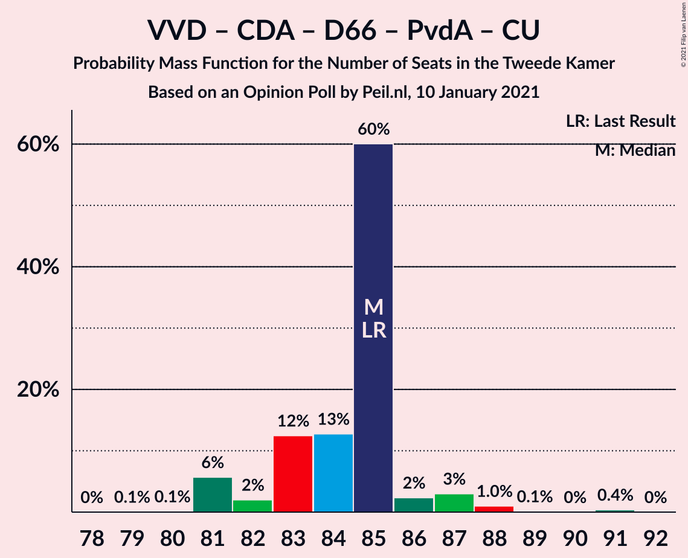

| Number of Seats | Probability | Accumulated | Special Marks |
|:---------------:|:-----------:|:-----------:|:-------------:|
| 80 | 0% | 100% |  |
| 81 | 2% | 99.9% |  |
| 82 | 8% | 98% |  |
| 83 | 2% | 89% |  |
| 84 | 7% | 87% |  |
| 85 | 34% | 80% | Last Result |
| 86 | 39% | 46% | Median |
| 87 | 6% | 7% |  |
| 88 | 1.2% | 1.3% |  |
| 89 | 0.1% | 0.1% |  |
| 90 | 0% | 0% |  |

### Volkspartij voor Vrijheid en Democratie – Partij voor de Vrijheid – Christen-Democratisch Appèl – Forum voor Democratie – Staatkundig Gereformeerde Partij

| Number of Seats | Probability | Accumulated | Special Marks |
|:---------------:|:-----------:|:-----------:|:-------------:|
| 77 | 0% | 100% | Last Result |
| 78 | 0% | 100% |  |
| 79 | 0% | 100% |  |
| 80 | 0% | 100% |  |
| 81 | 0.1% | 100% |  |
| 82 | 5% | 99.9% |  |
| 83 | 1.2% | 94% |  |
| 84 | 8% | 93% |  |
| 85 | 32% | 85% |  |
| 86 | 33% | 53% | Median |
| 87 | 19% | 21% |  |
| 88 | 1.2% | 2% |  |
| 89 | 0% | 0.4% |  |
| 90 | 0.4% | 0.4% |  |
| 91 | 0% | 0% |  |

### Volkspartij voor Vrijheid en Democratie – Christen-Democratisch Appèl – Democraten 66 – GroenLinks – ChristenUnie

| Number of Seats | Probability | Accumulated | Special Marks |
|:---------------:|:-----------:|:-----------:|:-------------:|
| 79 | 0.3% | 100% |  |
| 80 | 0.5% | 99.7% |  |
| 81 | 10% | 99.2% |  |
| 82 | 3% | 89% |  |
| 83 | 9% | 86% |  |
| 84 | 34% | 77% |  |
| 85 | 38% | 43% | Median |
| 86 | 4% | 5% |  |
| 87 | 1.1% | 1.1% |  |
| 88 | 0% | 0% |  |
| 89 | 0% | 0% |  |
| 90 | 0% | 0% | Last Result |

### Volkspartij voor Vrijheid en Democratie – Partij voor de Vrijheid – Christen-Democratisch Appèl – Forum voor Democratie

| Number of Seats | Probability | Accumulated | Special Marks |
|:---------------:|:-----------:|:-----------:|:-------------:|
| 74 | 0% | 100% | Last Result |
| 75 | 0% | 100% |  |
| 76 | 0% | 100% | Majority |
| 77 | 0% | 100% |  |
| 78 | 2% | 100% |  |
| 79 | 5% | 98% |  |
| 80 | 7% | 93% |  |
| 81 | 25% | 86% |  |
| 82 | 41% | 61% | Median |
| 83 | 18% | 20% |  |
| 84 | 0.5% | 2% |  |
| 85 | 1.1% | 1.4% |  |
| 86 | 0% | 0.4% |  |
| 87 | 0.3% | 0.3% |  |
| 88 | 0% | 0% |  |

### Volkspartij voor Vrijheid en Democratie – Partij voor de Vrijheid – Christen-Democratisch Appèl

| Number of Seats | Probability | Accumulated | Special Marks |
|:---------------:|:-----------:|:-----------:|:-------------:|
| 72 | 0% | 100% | Last Result |
| 73 | 0% | 100% |  |
| 74 | 1.4% | 100% |  |
| 75 | 5% | 98.6% |  |
| 76 | 7% | 93% | Majority |
| 77 | 8% | 86% |  |
| 78 | 27% | 78% |  |
| 79 | 48% | 51% | Median |
| 80 | 0.7% | 2% |  |
| 81 | 0.3% | 2% |  |
| 82 | 1.0% | 1.4% |  |
| 83 | 0.4% | 0.4% |  |
| 84 | 0% | 0% |  |

### Volkspartij voor Vrijheid en Democratie – Christen-Democratisch Appèl – Democraten 66 – ChristenUnie

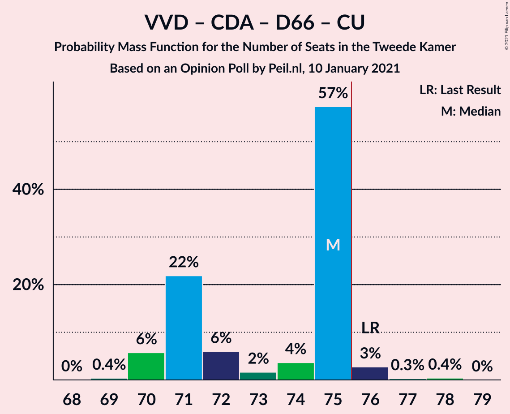

| Number of Seats | Probability | Accumulated | Special Marks |
|:---------------:|:-----------:|:-----------:|:-------------:|
| 69 | 0.2% | 100% |  |
| 70 | 5% | 99.8% |  |
| 71 | 6% | 95% |  |
| 72 | 3% | 89% |  |
| 73 | 6% | 86% |  |
| 74 | 6% | 79% |  |
| 75 | 65% | 73% | Median |
| 76 | 6% | 8% | Last Result, Majority |
| 77 | 1.3% | 1.4% |  |
| 78 | 0% | 0% |  |

### Christen-Democratisch Appèl – Democraten 66 – Partij van de Arbeid – GroenLinks – Socialistische Partij – ChristenUnie

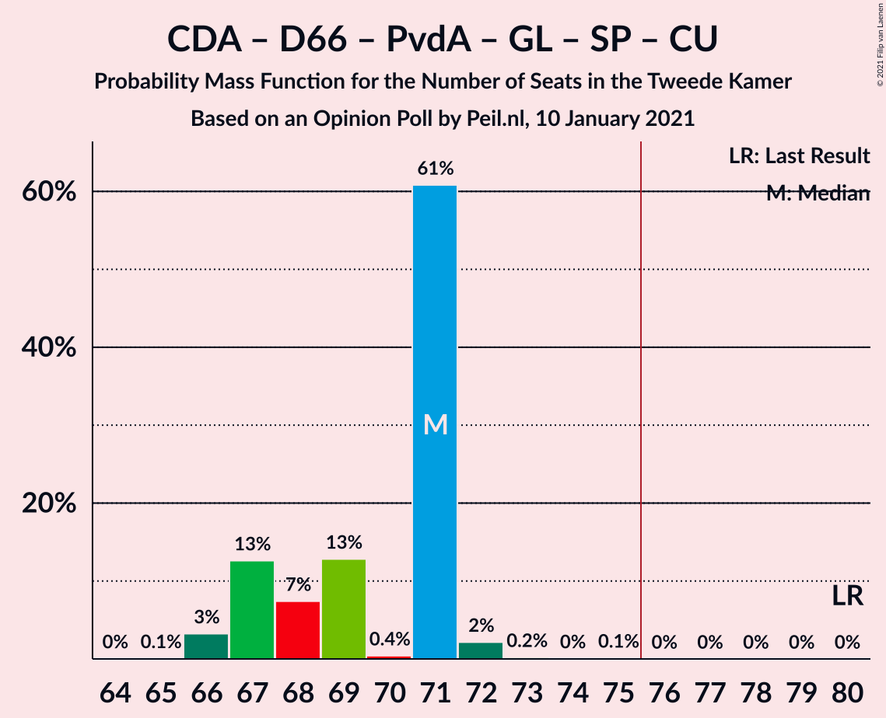

| Number of Seats | Probability | Accumulated | Special Marks |
|:---------------:|:-----------:|:-----------:|:-------------:|
| 65 | 0.1% | 100% |  |
| 66 | 0.2% | 99.9% |  |
| 67 | 1.1% | 99.6% |  |
| 68 | 7% | 98.6% |  |
| 69 | 9% | 91% |  |
| 70 | 52% | 82% |  |
| 71 | 12% | 30% |  |
| 72 | 14% | 18% | Median |
| 73 | 3% | 4% |  |
| 74 | 0.1% | 0.2% |  |
| 75 | 0.1% | 0.1% |  |
| 76 | 0% | 0% | Majority |
| 77 | 0% | 0% |  |
| 78 | 0% | 0% |  |
| 79 | 0% | 0% |  |
| 80 | 0% | 0% | Last Result |

### Volkspartij voor Vrijheid en Democratie – Christen-Democratisch Appèl – Democraten 66

| Number of Seats | Probability | Accumulated | Special Marks |
|:---------------:|:-----------:|:-----------:|:-------------:|
| 61 | 0.1% | 100% |  |
| 62 | 4% | 99.9% |  |
| 63 | 6% | 96% |  |
| 64 | 6% | 89% |  |
| 65 | 4% | 83% |  |
| 66 | 6% | 79% |  |
| 67 | 50% | 73% | Median |
| 68 | 23% | 24% |  |
| 69 | 0.6% | 0.6% |  |
| 70 | 0% | 0% |  |
| 71 | 0% | 0% | Last Result |

### Volkspartij voor Vrijheid en Democratie – Christen-Democratisch Appèl – Partij van de Arbeid

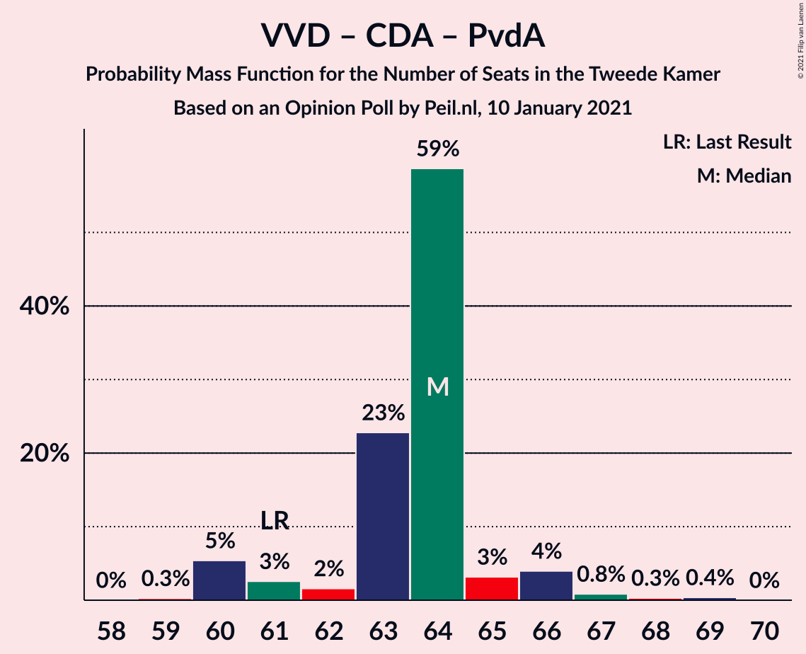

| Number of Seats | Probability | Accumulated | Special Marks |
|:---------------:|:-----------:|:-----------:|:-------------:|
| 59 | 1.4% | 100% |  |
| 60 | 0.6% | 98.6% |  |
| 61 | 5% | 98% | Last Result |
| 62 | 6% | 93% |  |
| 63 | 49% | 87% |  |
| 64 | 13% | 38% | Median |
| 65 | 23% | 25% |  |
| 66 | 2% | 2% |  |
| 67 | 0.1% | 0.2% |  |
| 68 | 0% | 0% |  |

### Christen-Democratisch Appèl – Democraten 66 – Partij van de Arbeid – GroenLinks – ChristenUnie

| Number of Seats | Probability | Accumulated | Special Marks |
|:---------------:|:-----------:|:-----------:|:-------------:|
| 56 | 0.2% | 100% |  |
| 57 | 0.6% | 99.8% |  |
| 58 | 1.4% | 99.2% |  |
| 59 | 13% | 98% |  |
| 60 | 5% | 85% |  |
| 61 | 35% | 80% |  |
| 62 | 23% | 44% |  |
| 63 | 17% | 21% | Median |
| 64 | 4% | 4% |  |
| 65 | 0.1% | 0.3% |  |
| 66 | 0.1% | 0.1% | Last Result |
| 67 | 0% | 0% |  |

### Volkspartij voor Vrijheid en Democratie – Christen-Democratisch Appèl – Forum voor Democratie – Staatkundig Gereformeerde Partij – 50Plus

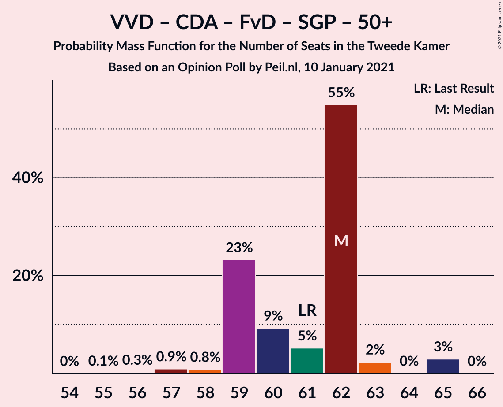

| Number of Seats | Probability | Accumulated | Special Marks |
|:---------------:|:-----------:|:-----------:|:-------------:|
| 56 | 0.1% | 100% |  |
| 57 | 0.4% | 99.9% |  |
| 58 | 7% | 99.4% |  |
| 59 | 20% | 92% |  |
| 60 | 6% | 73% |  |
| 61 | 39% | 66% | Last Result, Median |
| 62 | 7% | 27% |  |
| 63 | 19% | 20% |  |
| 64 | 1.0% | 1.0% |  |
| 65 | 0% | 0% |  |

### Volkspartij voor Vrijheid en Democratie – Christen-Democratisch Appèl – Forum voor Democratie – Staatkundig Gereformeerde Partij

| Number of Seats | Probability | Accumulated | Special Marks |
|:---------------:|:-----------:|:-----------:|:-------------:|
| 55 | 0.1% | 100% |  |
| 56 | 0.4% | 99.9% |  |
| 57 | 6% | 99.5% | Last Result |
| 58 | 6% | 93% |  |
| 59 | 16% | 88% |  |
| 60 | 43% | 71% | Median |
| 61 | 9% | 29% |  |
| 62 | 18% | 20% |  |
| 63 | 1.4% | 1.4% |  |
| 64 | 0% | 0.1% |  |
| 65 | 0% | 0% |  |

### Volkspartij voor Vrijheid en Democratie – Democraten 66 – Partij van de Arbeid

| Number of Seats | Probability | Accumulated | Special Marks |
|:---------------:|:-----------:|:-----------:|:-------------:|
| 54 | 0.4% | 100% |  |
| 55 | 0.2% | 99.6% |  |
| 56 | 2% | 99.4% |  |
| 57 | 43% | 98% |  |
| 58 | 10% | 54% | Median |
| 59 | 37% | 45% |  |
| 60 | 6% | 8% |  |
| 61 | 0.4% | 2% | Last Result |
| 62 | 1.3% | 1.4% |  |
| 63 | 0.1% | 0.1% |  |
| 64 | 0% | 0% |  |

### Volkspartij voor Vrijheid en Democratie – Christen-Democratisch Appèl – Forum voor Democratie – 50Plus

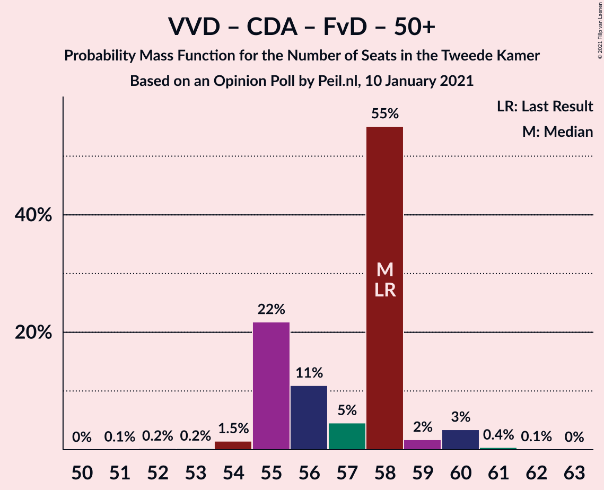

| Number of Seats | Probability | Accumulated | Special Marks |
|:---------------:|:-----------:|:-----------:|:-------------:|
| 51 | 0.1% | 100% |  |
| 52 | 0% | 99.9% |  |
| 53 | 0.4% | 99.9% |  |
| 54 | 3% | 99.5% |  |
| 55 | 20% | 97% |  |
| 56 | 11% | 77% |  |
| 57 | 38% | 66% | Median |
| 58 | 5% | 28% | Last Result |
| 59 | 22% | 23% |  |
| 60 | 0.7% | 0.7% |  |
| 61 | 0% | 0% |  |

### Volkspartij voor Vrijheid en Democratie – Christen-Democratisch Appèl – Forum voor Democratie

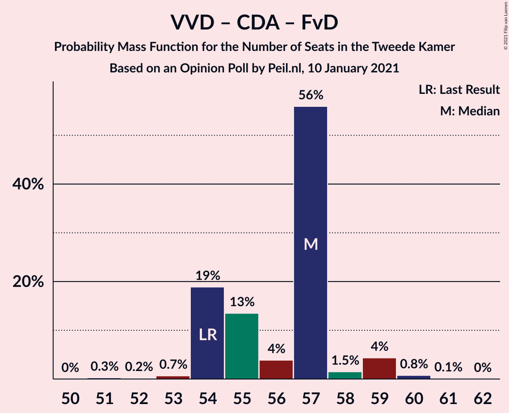

| Number of Seats | Probability | Accumulated | Special Marks |
|:---------------:|:-----------:|:-----------:|:-------------:|
| 51 | 0.1% | 100% |  |
| 52 | 0.2% | 99.9% |  |
| 53 | 2% | 99.7% |  |
| 54 | 6% | 98% | Last Result |
| 55 | 21% | 92% |  |
| 56 | 42% | 71% | Median |
| 57 | 5% | 29% |  |
| 58 | 23% | 24% |  |
| 59 | 0.3% | 0.7% |  |
| 60 | 0.4% | 0.4% |  |
| 61 | 0% | 0% |  |

### Volkspartij voor Vrijheid en Democratie – Christen-Democratisch Appèl

| Number of Seats | Probability | Accumulated | Special Marks |
|:---------------:|:-----------:|:-----------:|:-------------:|
| 48 | 0.1% | 100% |  |
| 49 | 2% | 99.8% |  |
| 50 | 6% | 98% |  |
| 51 | 6% | 92% |  |
| 52 | 26% | 86% | Last Result |
| 53 | 33% | 60% | Median |
| 54 | 25% | 27% |  |
| 55 | 2% | 2% |  |
| 56 | 0.4% | 0.4% |  |
| 57 | 0% | 0% |  |

### Volkspartij voor Vrijheid en Democratie – Partij van de Arbeid

| Number of Seats | Probability | Accumulated | Special Marks |
|:---------------:|:-----------:|:-----------:|:-------------:|
| 41 | 0.1% | 100% |  |
| 42 | 6% | 99.9% | Last Result |
| 43 | 28% | 94% |  |
| 44 | 21% | 65% | Median |
| 45 | 24% | 44% |  |
| 46 | 17% | 20% |  |
| 47 | 2% | 2% |  |
| 48 | 0.7% | 0.9% |  |
| 49 | 0.1% | 0.1% |  |
| 50 | 0% | 0% |  |

### Christen-Democratisch Appèl – Democraten 66 – Partij van de Arbeid

| Number of Seats | Probability | Accumulated | Special Marks |
|:---------------:|:-----------:|:-----------:|:-------------:|
| 39 | 0.2% | 100% |  |
| 40 | 4% | 99.8% |  |
| 41 | 10% | 95% |  |
| 42 | 10% | 86% |  |
| 43 | 3% | 76% |  |
| 44 | 31% | 73% |  |
| 45 | 42% | 43% | Median |
| 46 | 0.3% | 0.5% |  |
| 47 | 0.2% | 0.2% | Last Result |
| 48 | 0% | 0% |  |

### Christen-Democratisch Appèl – Partij van de Arbeid – ChristenUnie

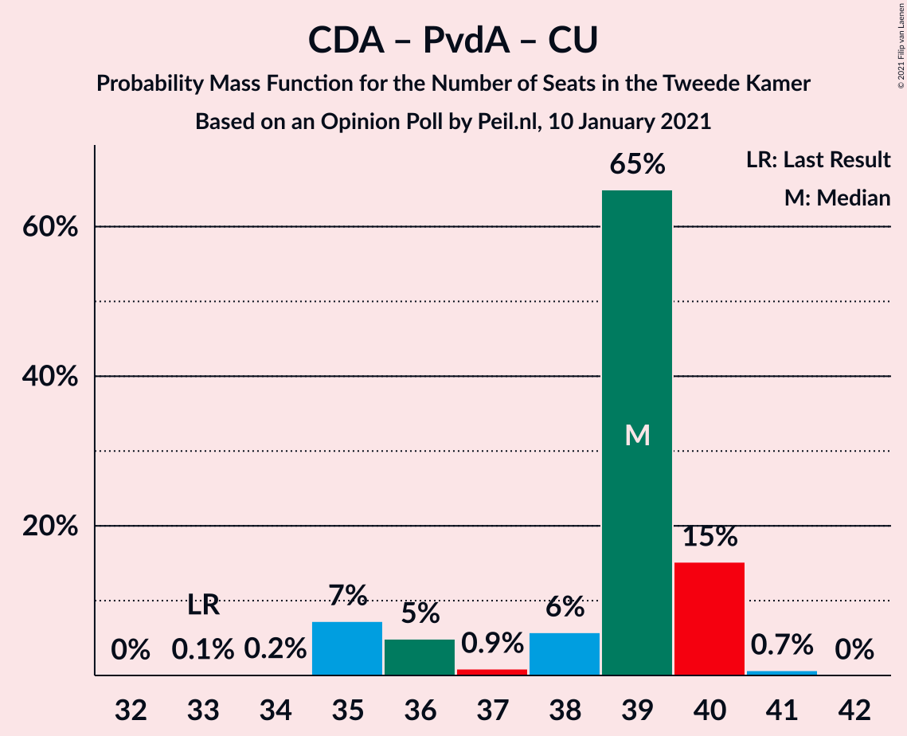

| Number of Seats | Probability | Accumulated | Special Marks |
|:---------------:|:-----------:|:-----------:|:-------------:|
| 33 | 0% | 100% | Last Result |
| 34 | 0.2% | 100% |  |
| 35 | 3% | 99.8% |  |
| 36 | 10% | 97% |  |
| 37 | 13% | 88% |  |
| 38 | 63% | 75% |  |
| 39 | 5% | 11% | Median |
| 40 | 3% | 6% |  |
| 41 | 3% | 3% |  |
| 42 | 0% | 0% |  |

### Christen-Democratisch Appèl – Democraten 66

| Number of Seats | Probability | Accumulated | Special Marks |
|:---------------:|:-----------:|:-----------:|:-------------:|
| 28 | 4% | 100% |  |
| 29 | 0.9% | 96% |  |
| 30 | 10% | 95% |  |
| 31 | 8% | 85% |  |
| 32 | 6% | 77% |  |
| 33 | 6% | 72% |  |
| 34 | 60% | 65% | Median |
| 35 | 5% | 5% |  |
| 36 | 0% | 0% |  |
| 37 | 0% | 0% |  |
| 38 | 0% | 0% | Last Result |

### Christen-Democratisch Appèl – Partij van de Arbeid

| Number of Seats | Probability | Accumulated | Special Marks |
|:---------------:|:-----------:|:-----------:|:-------------:|
| 26 | 0.1% | 100% |  |
| 27 | 2% | 99.9% |  |
| 28 | 12% | 98% | Last Result |
| 29 | 7% | 86% |  |
| 30 | 55% | 80% |  |
| 31 | 21% | 25% | Median |
| 32 | 4% | 4% |  |
| 33 | 0.2% | 0.2% |  |
| 34 | 0% | 0% |  |

## Technical Information

### Opinion Poll

+ **Polling firm:** Peil.nl
+ **Commissioner(s):** —
+ **Fieldwork period:** 10 January 2021

### Calculations

+ **Sample size:** 3000
+ **Simulations done:** 1,048,576
+ **Error estimate:** 0.55%

