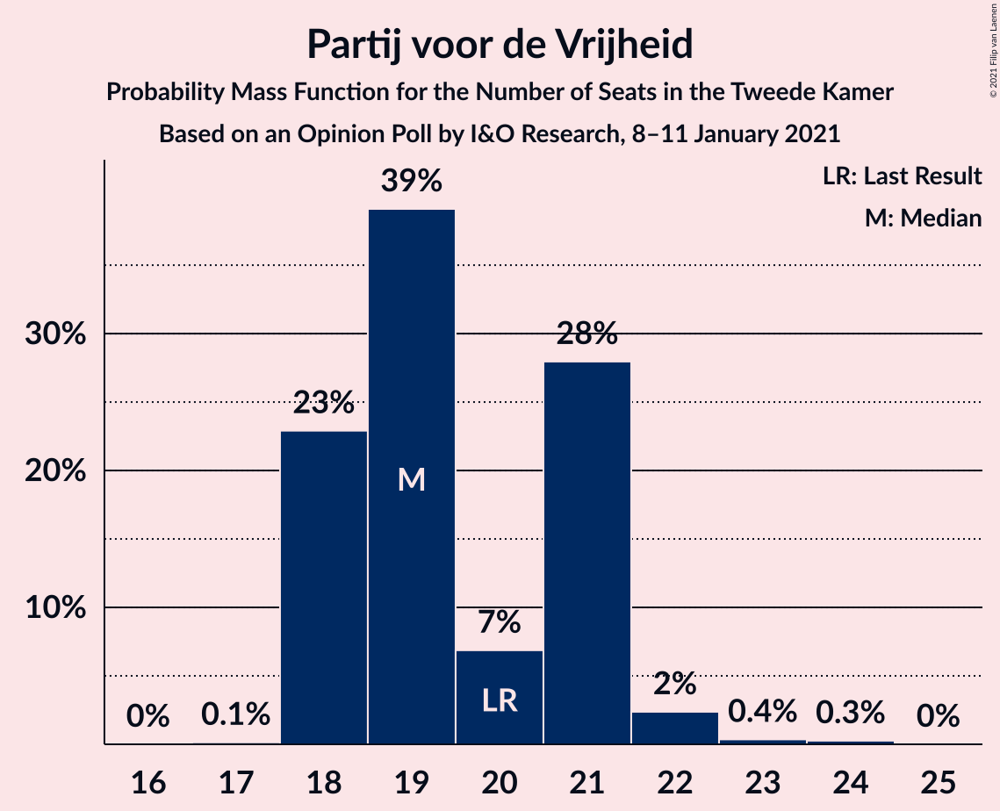
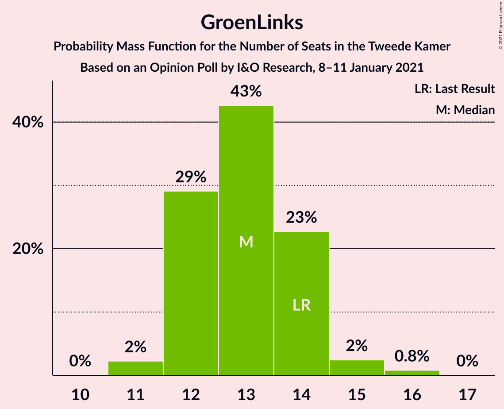
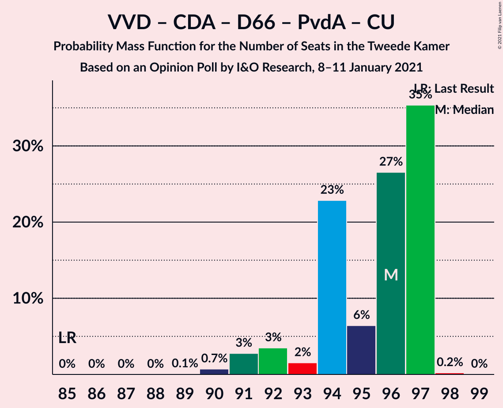

# Opinion Poll by I&O Research, 8–11 January 2021

<a href="#voting-intentions">Voting Intentions</a> | <a href="#seats">Seats</a> | <a href="#coalitions">Coalitions</a> | <a href="#technical-information">Technical Information</a>

## Voting Intentions

### Confidence Intervals

| Party | Last Result | Poll Result | 80% Confidence Interval | 90% Confidence Interval | 95% Confidence Interval | 99% Confidence Interval |
|:-----:|:-----------:|:-----------:|:-----------------------:|:-----------------------:|:-----------------------:|:-----------------------:|
| Volkspartij voor Vrijheid en Democratie | 21.3% | 28.6% | 27.5–29.9% |27.1–30.2% |26.8–30.5% |26.3–31.1% |
| Partij voor de Vrijheid | 13.1% | 13.3% | 12.4–14.3% |12.2–14.5% |12.0–14.8% |11.6–15.2% |
| Christen-Democratisch Appèl | 12.4% | 12.0% | 11.2–12.9% |10.9–13.2% |10.7–13.4% |10.3–13.8% |
| Democraten 66 | 12.2% | 8.6% | 7.9–9.4% |7.7–9.7% |7.6–9.9% |7.2–10.3% |
| GroenLinks | 9.1% | 8.6% | 7.9–9.4% |7.7–9.7% |7.6–9.9% |7.2–10.3% |
| Partij van de Arbeid | 5.7% | 7.3% | 6.7–8.1% |6.5–8.3% |6.3–8.5% |6.0–8.8% |
| Socialistische Partij | 9.1% | 6.6% | 6.0–7.3% |5.8–7.5% |5.7–7.7% |5.4–8.1% |
| ChristenUnie | 3.4% | 4.7% | 4.1–5.3% |4.0–5.5% |3.9–5.6% |3.6–5.9% |
| Partij voor de Dieren | 3.2% | 2.7% | 2.3–3.1% |2.2–3.3% |2.1–3.4% |1.9–3.6% |
| Forum voor Democratie | 1.8% | 2.7% | 2.3–3.1% |2.2–3.3% |2.1–3.4% |1.9–3.6% |
| Staatkundig Gereformeerde Partij | 2.1% | 2.0% | 1.7–2.4% |1.6–2.6% |1.5–2.7% |1.4–2.9% |
| Juiste Antwoord 2021 | 0.0% | 1.3% | 1.1–1.7% |1.0–1.8% |0.9–1.9% |0.8–2.1% |
| 50Plus | 3.1% | 0.7% | 0.5–1.0% |0.5–1.1% |0.4–1.1% |0.4–1.3% |
| DENK | 2.1% | 0.7% | 0.5–1.0% |0.5–1.1% |0.4–1.1% |0.4–1.3% |

*Note:* The poll result column reflects the actual value used in the calculations. Published results may vary slightly, and in addition be rounded to fewer digits.

## Seats

### Confidence Intervals

| Party | Last Result | Median | 80% Confidence Interval | 90% Confidence Interval | 95% Confidence Interval | 99% Confidence Interval |
|:-----:|:-----------:|:------:|:-----------------------:|:-----------------------:|:-----------------------:|:-----------------------:|
| <a href="#volkspartij-voor-vrijheid-en-democratie">Volkspartij voor Vrijheid en Democratie</a> | 33 | 49 | 45–49 |42–49 |41–49 |41–49 |
| <a href="#partij-voor-de-vrijheid">Partij voor de Vrijheid</a> | 20 | 19 | 19 |18–19 |18–21 |18–22 |
| <a href="#christen-democratisch-appèl">Christen-Democratisch Appèl</a> | 19 | 18 | 18 |18 |18–19 |17–19 |
| <a href="#democraten-66">Democraten 66</a> | 19 | 12 | 12–13 |12–14 |12–14 |12–14 |
| <a href="#groenlinks">GroenLinks</a> | 14 | 13 | 13 |13–14 |12–15 |11–16 |
| <a href="#partij-van-de-arbeid">Partij van de Arbeid</a> | 9 | 12 | 11–12 |10–12 |10–13 |10–13 |
| <a href="#socialistische-partij">Socialistische Partij</a> | 14 | 9 | 9–10 |9–11 |9–11 |9–11 |
| <a href="#christenunie">ChristenUnie</a> | 5 | 6 | 6–7 |6–9 |6–9 |6–9 |
| <a href="#partij-voor-de-dieren">Partij voor de Dieren</a> | 5 | 4 | 4 |3–4 |3–5 |3–5 |
| <a href="#forum-voor-democratie">Forum voor Democratie</a> | 2 | 3 | 3–4 |3–4 |3–4 |3–5 |
| <a href="#staatkundig-gereformeerde-partij">Staatkundig Gereformeerde Partij</a> | 3 | 2 | 2 |2–3 |2–3 |2–4 |
| <a href="#juiste-antwoord-2021">Juiste Antwoord 2021</a> | 0 | 2 | 2 |1–2 |1–2 |0–2 |
| <a href="#50plus">50Plus</a> | 4 | 1 | 1 |0–1 |0–1 |0–2 |
| <a href="#denk">DENK</a> | 3 | 0 | 0–1 |0–1 |0–1 |0–1 |

### Volkspartij voor Vrijheid en Democratie

*For a full overview of the results for this party, see the [Volkspartij voor Vrijheid en Democratie](party-volkspartijvoorvrijheidendemocratie.html) page.*

| Number of Seats | Probability | Accumulated | Special Marks |
|:---------------:|:-----------:|:-----------:|:-------------:|
| 33 | 0% | 100% | Last Result |
| 34 | 0% | 100% |  |
| 35 | 0% | 100% |  |
| 36 | 0% | 100% |  |
| 37 | 0% | 100% |  |
| 38 | 0% | 100% |  |
| 39 | 0.1% | 100% |  |
| 40 | 0.1% | 99.9% |  |
| 41 | 4% | 99.8% |  |
| 42 | 1.4% | 96% |  |
| 43 | 1.1% | 95% |  |
| 44 | 0.1% | 93% |  |
| 45 | 10% | 93% |  |
| 46 | 0.2% | 84% |  |
| 47 | 0.2% | 83% |  |
| 48 | 0.1% | 83% |  |
| 49 | 83% | 83% | Median |
| 50 | 0% | 0% |  |

### Partij voor de Vrijheid

*For a full overview of the results for this party, see the [Partij voor de Vrijheid](party-partijvoordevrijheid.html) page.*

| Number of Seats | Probability | Accumulated | Special Marks |
|:---------------:|:-----------:|:-----------:|:-------------:|
| 17 | 0.2% | 100% |  |
| 18 | 8% | 99.8% |  |
| 19 | 89% | 92% | Median |
| 20 | 0.4% | 4% | Last Result |
| 21 | 0.9% | 3% |  |
| 22 | 2% | 2% |  |
| 23 | 0.3% | 0.3% |  |
| 24 | 0% | 0% |  |

### Christen-Democratisch Appèl

*For a full overview of the results for this party, see the [Christen-Democratisch Appèl](party-christen-democratischappèl.html) page.*

| Number of Seats | Probability | Accumulated | Special Marks |
|:---------------:|:-----------:|:-----------:|:-------------:|
| 15 | 0.1% | 100% |  |
| 16 | 0.2% | 99.9% |  |
| 17 | 1.3% | 99.7% |  |
| 18 | 96% | 98% | Median |
| 19 | 2% | 3% | Last Result |
| 20 | 0.3% | 0.4% |  |
| 21 | 0.1% | 0.1% |  |
| 22 | 0% | 0% |  |

### Democraten 66

*For a full overview of the results for this party, see the [Democraten 66](party-democraten66.html) page.*

| Number of Seats | Probability | Accumulated | Special Marks |
|:---------------:|:-----------:|:-----------:|:-------------:|
| 10 | 0.3% | 100% |  |
| 11 | 0.2% | 99.7% |  |
| 12 | 85% | 99.5% | Median |
| 13 | 8% | 15% |  |
| 14 | 6% | 7% |  |
| 15 | 0.2% | 0.3% |  |
| 16 | 0.1% | 0.1% |  |
| 17 | 0% | 0% |  |
| 18 | 0% | 0% |  |
| 19 | 0% | 0% | Last Result |

### GroenLinks

*For a full overview of the results for this party, see the [GroenLinks](party-groenlinks.html) page.*

| Number of Seats | Probability | Accumulated | Special Marks |
|:---------------:|:-----------:|:-----------:|:-------------:|
| 10 | 0.1% | 100% |  |
| 11 | 2% | 99.9% |  |
| 12 | 1.2% | 98% |  |
| 13 | 92% | 97% | Median |
| 14 | 0.5% | 5% | Last Result |
| 15 | 4% | 5% |  |
| 16 | 0.9% | 0.9% |  |
| 17 | 0% | 0% |  |

### Partij van de Arbeid

*For a full overview of the results for this party, see the [Partij van de Arbeid](party-partijvandearbeid.html) page.*

| Number of Seats | Probability | Accumulated | Special Marks |
|:---------------:|:-----------:|:-----------:|:-------------:|
| 9 | 0.1% | 100% | Last Result |
| 10 | 9% | 99.9% |  |
| 11 | 2% | 91% |  |
| 12 | 85% | 89% | Median |
| 13 | 4% | 4% |  |
| 14 | 0.1% | 0.1% |  |
| 15 | 0% | 0% |  |

### Socialistische Partij

*For a full overview of the results for this party, see the [Socialistische Partij](party-socialistischepartij.html) page.*

| Number of Seats | Probability | Accumulated | Special Marks |
|:---------------:|:-----------:|:-----------:|:-------------:|
| 8 | 0.4% | 100% |  |
| 9 | 86% | 99.6% | Median |
| 10 | 6% | 14% |  |
| 11 | 8% | 8% |  |
| 12 | 0% | 0.1% |  |
| 13 | 0% | 0% |  |
| 14 | 0% | 0% | Last Result |

### ChristenUnie

*For a full overview of the results for this party, see the [ChristenUnie](party-christenunie.html) page.*

| Number of Seats | Probability | Accumulated | Special Marks |
|:---------------:|:-----------:|:-----------:|:-------------:|
| 5 | 0.1% | 100% | Last Result |
| 6 | 90% | 99.9% | Median |
| 7 | 2% | 10% |  |
| 8 | 0.8% | 8% |  |
| 9 | 7% | 7% |  |
| 10 | 0% | 0% |  |

### Partij voor de Dieren

*For a full overview of the results for this party, see the [Partij voor de Dieren](party-partijvoordedieren.html) page.*

| Number of Seats | Probability | Accumulated | Special Marks |
|:---------------:|:-----------:|:-----------:|:-------------:|
| 2 | 0.1% | 100% |  |
| 3 | 8% | 99.9% |  |
| 4 | 87% | 92% | Median |
| 5 | 4% | 4% | Last Result |
| 6 | 0% | 0% |  |

### Forum voor Democratie

*For a full overview of the results for this party, see the [Forum voor Democratie](party-forumvoordemocratie.html) page.*

| Number of Seats | Probability | Accumulated | Special Marks |
|:---------------:|:-----------:|:-----------:|:-------------:|
| 2 | 0% | 100% | Last Result |
| 3 | 84% | 100% | Median |
| 4 | 13% | 16% |  |
| 5 | 2% | 2% |  |
| 6 | 0.2% | 0.2% |  |
| 7 | 0% | 0% |  |

### Staatkundig Gereformeerde Partij

*For a full overview of the results for this party, see the [Staatkundig Gereformeerde Partij](party-staatkundiggereformeerdepartij.html) page.*

| Number of Seats | Probability | Accumulated | Special Marks |
|:---------------:|:-----------:|:-----------:|:-------------:|
| 2 | 91% | 100% | Median |
| 3 | 8% | 9% | Last Result |
| 4 | 1.0% | 1.0% |  |
| 5 | 0% | 0% |  |

### Juiste Antwoord 2021

*For a full overview of the results for this party, see the [Juiste Antwoord 2021](party-juisteantwoord2021.html) page.*

| Number of Seats | Probability | Accumulated | Special Marks |
|:---------------:|:-----------:|:-----------:|:-------------:|
| 0 | 0.5% | 100% | Last Result |
| 1 | 5% | 99.5% |  |
| 2 | 94% | 94% | Median |
| 3 | 0.1% | 0.1% |  |
| 4 | 0% | 0% |  |

### 50Plus

*For a full overview of the results for this party, see the [50Plus](party-50plus.html) page.*

| Number of Seats | Probability | Accumulated | Special Marks |
|:---------------:|:-----------:|:-----------:|:-------------:|
| 0 | 6% | 100% |  |
| 1 | 93% | 94% | Median |
| 2 | 0.9% | 0.9% |  |
| 3 | 0% | 0% |  |
| 4 | 0% | 0% | Last Result |

### DENK

*For a full overview of the results for this party, see the [DENK](party-denk.html) page.*

| Number of Seats | Probability | Accumulated | Special Marks |
|:---------------:|:-----------:|:-----------:|:-------------:|
| 0 | 86% | 100% | Median |
| 1 | 14% | 14% |  |
| 2 | 0% | 0% |  |
| 3 | 0% | 0% | Last Result |

## Coalitions

### Confidence Intervals

| Coalition | Last Result | Median | Majority? | 80% Confidence Interval | 90% Confidence Interval | 95% Confidence Interval | 99% Confidence Interval |
|:---------:|:-----------:|:------:|:---------:|:-----------------------:|:-----------------------:|:-----------------------:|:-----------------------:|
| Volkspartij voor Vrijheid en Democratie – Christen-Democratisch Appèl – Democraten 66 – GroenLinks – ChristenUnie | 90 | 98 | 100% | 98 | 94–98 | 94–98 | 93–98 |
| Volkspartij voor Vrijheid en Democratie – Christen-Democratisch Appèl – Democraten 66 – Partij van de Arbeid – ChristenUnie | 85 | 97 | 100% | 95–97 | 92–97 | 92–97 | 90–97 |
| Volkspartij voor Vrijheid en Democratie – Partij voor de Vrijheid – Christen-Democratisch Appèl – Forum voor Democratie – Staatkundig Gereformeerde Partij | 77 | 91 | 100% | 87–91 | 87–91 | 85–91 | 85–92 |
| Volkspartij voor Vrijheid en Democratie – Partij voor de Vrijheid – Christen-Democratisch Appèl – Forum voor Democratie | 74 | 89 | 100% | 85–89 | 85–89 | 82–89 | 82–89 |
| Volkspartij voor Vrijheid en Democratie – Partij voor de Vrijheid – Christen-Democratisch Appèl | 72 | 86 | 100% | 81–86 | 81–86 | 78–86 | 78–86 |
| Volkspartij voor Vrijheid en Democratie – Christen-Democratisch Appèl – Democraten 66 – ChristenUnie | 76 | 85 | 100% | 85 | 79–85 | 79–85 | 78–85 |
| Volkspartij voor Vrijheid en Democratie – Christen-Democratisch Appèl – Democraten 66 | 71 | 79 | 93% | 76–79 | 73–79 | 73–79 | 71–79 |
| Volkspartij voor Vrijheid en Democratie – Christen-Democratisch Appèl – Partij van de Arbeid | 61 | 79 | 84% | 73–79 | 72–79 | 72–79 | 71–79 |
| Christen-Democratisch Appèl – Democraten 66 – GroenLinks – Partij van de Arbeid – Socialistische Partij – ChristenUnie | 80 | 70 | 4% | 70–74 | 70–74 | 70–76 | 69–76 |
| Volkspartij voor Vrijheid en Democratie – Democraten 66 – Partij van de Arbeid | 61 | 73 | 0% | 68–73 | 68–73 | 67–73 | 66–73 |
| Volkspartij voor Vrijheid en Democratie – Christen-Democratisch Appèl – Forum voor Democratie – Staatkundig Gereformeerde Partij – 50Plus | 61 | 73 | 0% | 70–73 | 68–73 | 66–73 | 66–73 |
| Volkspartij voor Vrijheid en Democratie – Christen-Democratisch Appèl – Forum voor Democratie – Staatkundig Gereformeerde Partij | 57 | 72 | 0% | 69–72 | 68–72 | 66–72 | 66–72 |
| Volkspartij voor Vrijheid en Democratie – Christen-Democratisch Appèl – Forum voor Democratie – 50Plus | 58 | 71 | 0% | 68–71 | 65–71 | 63–71 | 63–71 |
| Volkspartij voor Vrijheid en Democratie – Christen-Democratisch Appèl – Forum voor Democratie | 54 | 70 | 0% | 67–70 | 64–70 | 63–70 | 63–70 |
| Volkspartij voor Vrijheid en Democratie – Christen-Democratisch Appèl | 52 | 67 | 0% | 63–67 | 60–67 | 59–67 | 59–67 |
| Christen-Democratisch Appèl – Democraten 66 – GroenLinks – Partij van de Arbeid – ChristenUnie | 66 | 61 | 0% | 61–63 | 61–64 | 61–66 | 60–66 |
| Volkspartij voor Vrijheid en Democratie – Partij van de Arbeid | 42 | 61 | 0% | 55–61 | 54–61 | 54–61 | 53–61 |
| Christen-Democratisch Appèl – Democraten 66 – Partij van de Arbeid | 47 | 42 | 0% | 42 | 41–44 | 41–45 | 41–45 |
| Christen-Democratisch Appèl – Partij van de Arbeid – ChristenUnie | 33 | 36 | 0% | 36–37 | 36–37 | 36–37 | 34–39 |
| Christen-Democratisch Appèl – Democraten 66 | 38 | 30 | 0% | 30–31 | 30–32 | 30–32 | 29–33 |
| Christen-Democratisch Appèl – Partij van de Arbeid | 28 | 30 | 0% | 29–30 | 28–30 | 28–31 | 28–31 |

### Volkspartij voor Vrijheid en Democratie – Christen-Democratisch Appèl – Democraten 66 – GroenLinks – ChristenUnie

| Number of Seats | Probability | Accumulated | Special Marks |
|:---------------:|:-----------:|:-----------:|:-------------:|
| 90 | 0.1% | 100% | Last Result |
| 91 | 0% | 99.9% |  |
| 92 | 0.3% | 99.9% |  |
| 93 | 1.2% | 99.6% |  |
| 94 | 5% | 98% |  |
| 95 | 2% | 94% |  |
| 96 | 0.8% | 92% |  |
| 97 | 0.2% | 91% |  |
| 98 | 91% | 91% | Median |
| 99 | 0% | 0.1% |  |
| 100 | 0% | 0.1% |  |
| 101 | 0% | 0% |  |

### Volkspartij voor Vrijheid en Democratie – Christen-Democratisch Appèl – Democraten 66 – Partij van de Arbeid – ChristenUnie

| Number of Seats | Probability | Accumulated | Special Marks |
|:---------------:|:-----------:|:-----------:|:-------------:|
| 85 | 0% | 100% | Last Result |
| 86 | 0% | 100% |  |
| 87 | 0% | 100% |  |
| 88 | 0% | 100% |  |
| 89 | 0% | 100% |  |
| 90 | 1.0% | 100% |  |
| 91 | 1.0% | 99.0% |  |
| 92 | 4% | 98% |  |
| 93 | 0.8% | 94% |  |
| 94 | 0.5% | 93% |  |
| 95 | 9% | 93% |  |
| 96 | 0.2% | 84% |  |
| 97 | 83% | 83% | Median |
| 98 | 0.1% | 0.1% |  |
| 99 | 0% | 0% |  |

### Volkspartij voor Vrijheid en Democratie – Partij voor de Vrijheid – Christen-Democratisch Appèl – Forum voor Democratie – Staatkundig Gereformeerde Partij

| Number of Seats | Probability | Accumulated | Special Marks |
|:---------------:|:-----------:|:-----------:|:-------------:|
| 77 | 0% | 100% | Last Result |
| 78 | 0% | 100% |  |
| 79 | 0% | 100% |  |
| 80 | 0% | 100% |  |
| 81 | 0% | 100% |  |
| 82 | 0% | 100% |  |
| 83 | 0% | 100% |  |
| 84 | 0.1% | 100% |  |
| 85 | 4% | 99.9% |  |
| 86 | 0.2% | 96% |  |
| 87 | 7% | 96% |  |
| 88 | 1.2% | 88% |  |
| 89 | 0.3% | 87% |  |
| 90 | 0.4% | 87% |  |
| 91 | 85% | 86% | Median |
| 92 | 0.8% | 1.1% |  |
| 93 | 0.1% | 0.3% |  |
| 94 | 0.1% | 0.2% |  |
| 95 | 0% | 0% |  |

### Volkspartij voor Vrijheid en Democratie – Partij voor de Vrijheid – Christen-Democratisch Appèl – Forum voor Democratie

| Number of Seats | Probability | Accumulated | Special Marks |
|:---------------:|:-----------:|:-----------:|:-------------:|
| 74 | 0% | 100% | Last Result |
| 75 | 0% | 100% |  |
| 76 | 0% | 100% | Majority |
| 77 | 0% | 100% |  |
| 78 | 0% | 100% |  |
| 79 | 0% | 100% |  |
| 80 | 0% | 100% |  |
| 81 | 0.1% | 100% |  |
| 82 | 4% | 99.9% |  |
| 83 | 0% | 96% |  |
| 84 | 0.2% | 96% |  |
| 85 | 8% | 96% |  |
| 86 | 0.4% | 87% |  |
| 87 | 0.3% | 87% |  |
| 88 | 3% | 86% |  |
| 89 | 84% | 84% | Median |
| 90 | 0.1% | 0.3% |  |
| 91 | 0.1% | 0.2% |  |
| 92 | 0.1% | 0.1% |  |
| 93 | 0% | 0% |  |

### Volkspartij voor Vrijheid en Democratie – Partij voor de Vrijheid – Christen-Democratisch Appèl

| Number of Seats | Probability | Accumulated | Special Marks |
|:---------------:|:-----------:|:-----------:|:-------------:|
| 72 | 0% | 100% | Last Result |
| 73 | 0% | 100% |  |
| 74 | 0% | 100% |  |
| 75 | 0% | 100% |  |
| 76 | 0% | 100% | Majority |
| 77 | 0% | 100% |  |
| 78 | 4% | 100% |  |
| 79 | 0.2% | 96% |  |
| 80 | 0.1% | 96% |  |
| 81 | 9% | 96% |  |
| 82 | 0.3% | 87% |  |
| 83 | 2% | 87% |  |
| 84 | 0.8% | 85% |  |
| 85 | 0.3% | 84% |  |
| 86 | 83% | 84% | Median |
| 87 | 0.1% | 0.2% |  |
| 88 | 0.1% | 0.1% |  |
| 89 | 0% | 0% |  |

### Volkspartij voor Vrijheid en Democratie – Christen-Democratisch Appèl – Democraten 66 – ChristenUnie

| Number of Seats | Probability | Accumulated | Special Marks |
|:---------------:|:-----------:|:-----------:|:-------------:|
| 76 | 0% | 100% | Last Result, Majority |
| 77 | 0.1% | 100% |  |
| 78 | 1.2% | 99.9% |  |
| 79 | 4% | 98.7% |  |
| 80 | 0.1% | 95% |  |
| 81 | 1.2% | 95% |  |
| 82 | 0.3% | 94% |  |
| 83 | 1.0% | 93% |  |
| 84 | 1.4% | 92% |  |
| 85 | 91% | 91% | Median |
| 86 | 0.1% | 0.2% |  |
| 87 | 0% | 0.1% |  |
| 88 | 0% | 0% |  |

### Volkspartij voor Vrijheid en Democratie – Christen-Democratisch Appèl – Democraten 66

| Number of Seats | Probability | Accumulated | Special Marks |
|:---------------:|:-----------:|:-----------:|:-------------:|
| 69 | 0.1% | 100% |  |
| 70 | 0% | 99.9% |  |
| 71 | 0.9% | 99.9% | Last Result |
| 72 | 0.3% | 99.0% |  |
| 73 | 4% | 98.7% |  |
| 74 | 0.4% | 95% |  |
| 75 | 1.1% | 94% |  |
| 76 | 8% | 93% | Majority |
| 77 | 0.1% | 85% |  |
| 78 | 1.5% | 85% |  |
| 79 | 83% | 83% | Median |
| 80 | 0% | 0.1% |  |
| 81 | 0% | 0% |  |

### Volkspartij voor Vrijheid en Democratie – Christen-Democratisch Appèl – Partij van de Arbeid

| Number of Seats | Probability | Accumulated | Special Marks |
|:---------------:|:-----------:|:-----------:|:-------------:|
| 61 | 0% | 100% | Last Result |
| 62 | 0% | 100% |  |
| 63 | 0% | 100% |  |
| 64 | 0% | 100% |  |
| 65 | 0% | 100% |  |
| 66 | 0% | 100% |  |
| 67 | 0% | 100% |  |
| 68 | 0% | 100% |  |
| 69 | 0% | 100% |  |
| 70 | 0.2% | 100% |  |
| 71 | 2% | 99.8% |  |
| 72 | 4% | 98% |  |
| 73 | 8% | 94% |  |
| 74 | 0.6% | 86% |  |
| 75 | 2% | 85% |  |
| 76 | 0% | 84% | Majority |
| 77 | 0.1% | 83% |  |
| 78 | 0.1% | 83% |  |
| 79 | 83% | 83% | Median |
| 80 | 0% | 0% |  |

### Christen-Democratisch Appèl – Democraten 66 – GroenLinks – Partij van de Arbeid – Socialistische Partij – ChristenUnie

| Number of Seats | Probability | Accumulated | Special Marks |
|:---------------:|:-----------:|:-----------:|:-------------:|
| 67 | 0% | 100% |  |
| 68 | 0.1% | 99.9% |  |
| 69 | 0.8% | 99.8% |  |
| 70 | 84% | 99.0% | Median |
| 71 | 2% | 15% |  |
| 72 | 0.1% | 13% |  |
| 73 | 1.4% | 13% |  |
| 74 | 8% | 12% |  |
| 75 | 0.2% | 4% |  |
| 76 | 4% | 4% | Majority |
| 77 | 0% | 0% |  |
| 78 | 0% | 0% |  |
| 79 | 0% | 0% |  |
| 80 | 0% | 0% | Last Result |

### Volkspartij voor Vrijheid en Democratie – Democraten 66 – Partij van de Arbeid

| Number of Seats | Probability | Accumulated | Special Marks |
|:---------------:|:-----------:|:-----------:|:-------------:|
| 61 | 0% | 100% | Last Result |
| 62 | 0% | 100% |  |
| 63 | 0% | 100% |  |
| 64 | 0.1% | 100% |  |
| 65 | 0.3% | 99.9% |  |
| 66 | 1.1% | 99.6% |  |
| 67 | 1.0% | 98.5% |  |
| 68 | 12% | 97% |  |
| 69 | 0.1% | 85% |  |
| 70 | 2% | 85% |  |
| 71 | 0.1% | 84% |  |
| 72 | 0.1% | 83% |  |
| 73 | 83% | 83% | Median |
| 74 | 0.1% | 0.1% |  |
| 75 | 0% | 0% |  |

### Volkspartij voor Vrijheid en Democratie – Christen-Democratisch Appèl – Forum voor Democratie – Staatkundig Gereformeerde Partij – 50Plus

| Number of Seats | Probability | Accumulated | Special Marks |
|:---------------:|:-----------:|:-----------:|:-------------:|
| 61 | 0% | 100% | Last Result |
| 62 | 0% | 100% |  |
| 63 | 0% | 100% |  |
| 64 | 0% | 100% |  |
| 65 | 0.1% | 100% |  |
| 66 | 5% | 99.9% |  |
| 67 | 0.1% | 95% |  |
| 68 | 0.2% | 95% |  |
| 69 | 0.9% | 95% |  |
| 70 | 8% | 94% |  |
| 71 | 1.4% | 86% |  |
| 72 | 0.1% | 85% |  |
| 73 | 85% | 85% | Median |
| 74 | 0% | 0.2% |  |
| 75 | 0.1% | 0.1% |  |
| 76 | 0% | 0% | Majority |

### Volkspartij voor Vrijheid en Democratie – Christen-Democratisch Appèl – Forum voor Democratie – Staatkundig Gereformeerde Partij

| Number of Seats | Probability | Accumulated | Special Marks |
|:---------------:|:-----------:|:-----------:|:-------------:|
| 57 | 0% | 100% | Last Result |
| 58 | 0% | 100% |  |
| 59 | 0% | 100% |  |
| 60 | 0% | 100% |  |
| 61 | 0% | 100% |  |
| 62 | 0% | 100% |  |
| 63 | 0% | 100% |  |
| 64 | 0% | 100% |  |
| 65 | 0.2% | 100% |  |
| 66 | 5% | 99.8% |  |
| 67 | 0.1% | 95% |  |
| 68 | 0.9% | 95% |  |
| 69 | 8% | 94% |  |
| 70 | 0.2% | 86% |  |
| 71 | 0.6% | 86% |  |
| 72 | 85% | 85% | Median |
| 73 | 0.1% | 0.2% |  |
| 74 | 0% | 0.1% |  |
| 75 | 0% | 0% |  |

### Volkspartij voor Vrijheid en Democratie – Christen-Democratisch Appèl – Forum voor Democratie – 50Plus

| Number of Seats | Probability | Accumulated | Special Marks |
|:---------------:|:-----------:|:-----------:|:-------------:|
| 58 | 0% | 100% | Last Result |
| 59 | 0% | 100% |  |
| 60 | 0% | 100% |  |
| 61 | 0% | 100% |  |
| 62 | 0.1% | 100% |  |
| 63 | 5% | 99.9% |  |
| 64 | 0.2% | 95% |  |
| 65 | 0.2% | 95% |  |
| 66 | 0.6% | 95% |  |
| 67 | 0.9% | 94% |  |
| 68 | 8% | 93% |  |
| 69 | 0.1% | 85% |  |
| 70 | 1.5% | 85% |  |
| 71 | 83% | 83% | Median |
| 72 | 0.1% | 0.1% |  |
| 73 | 0% | 0% |  |

### Volkspartij voor Vrijheid en Democratie – Christen-Democratisch Appèl – Forum voor Democratie

| Number of Seats | Probability | Accumulated | Special Marks |
|:---------------:|:-----------:|:-----------:|:-------------:|
| 54 | 0% | 100% | Last Result |
| 55 | 0% | 100% |  |
| 56 | 0% | 100% |  |
| 57 | 0% | 100% |  |
| 58 | 0% | 100% |  |
| 59 | 0% | 100% |  |
| 60 | 0% | 100% |  |
| 61 | 0.1% | 100% |  |
| 62 | 0.1% | 99.9% |  |
| 63 | 5% | 99.9% |  |
| 64 | 0.4% | 95% |  |
| 65 | 0.6% | 95% |  |
| 66 | 1.0% | 94% |  |
| 67 | 8% | 93% |  |
| 68 | 0.1% | 85% |  |
| 69 | 1.5% | 85% |  |
| 70 | 83% | 83% | Median |
| 71 | 0.1% | 0.1% |  |
| 72 | 0% | 0% |  |

### Volkspartij voor Vrijheid en Democratie – Christen-Democratisch Appèl

| Number of Seats | Probability | Accumulated | Special Marks |
|:---------------:|:-----------:|:-----------:|:-------------:|
| 52 | 0% | 100% | Last Result |
| 53 | 0% | 100% |  |
| 54 | 0% | 100% |  |
| 55 | 0% | 100% |  |
| 56 | 0% | 100% |  |
| 57 | 0.1% | 100% |  |
| 58 | 0% | 99.9% |  |
| 59 | 5% | 99.9% |  |
| 60 | 0.2% | 95% |  |
| 61 | 1.0% | 95% |  |
| 62 | 0.8% | 94% |  |
| 63 | 8% | 93% |  |
| 64 | 1.5% | 85% |  |
| 65 | 0% | 83% |  |
| 66 | 0.1% | 83% |  |
| 67 | 83% | 83% | Median |
| 68 | 0% | 0% |  |

### Christen-Democratisch Appèl – Democraten 66 – GroenLinks – Partij van de Arbeid – ChristenUnie

| Number of Seats | Probability | Accumulated | Special Marks |
|:---------------:|:-----------:|:-----------:|:-------------:|
| 58 | 0.1% | 100% |  |
| 59 | 0.1% | 99.9% |  |
| 60 | 0.9% | 99.8% |  |
| 61 | 85% | 98.9% | Median |
| 62 | 0.4% | 14% |  |
| 63 | 8% | 13% |  |
| 64 | 1.1% | 5% |  |
| 65 | 0.2% | 4% |  |
| 66 | 4% | 4% | Last Result |
| 67 | 0.2% | 0.2% |  |
| 68 | 0% | 0% |  |

### Volkspartij voor Vrijheid en Democratie – Partij van de Arbeid

| Number of Seats | Probability | Accumulated | Special Marks |
|:---------------:|:-----------:|:-----------:|:-------------:|
| 42 | 0% | 100% | Last Result |
| 43 | 0% | 100% |  |
| 44 | 0% | 100% |  |
| 45 | 0% | 100% |  |
| 46 | 0% | 100% |  |
| 47 | 0% | 100% |  |
| 48 | 0% | 100% |  |
| 49 | 0% | 100% |  |
| 50 | 0% | 100% |  |
| 51 | 0.1% | 100% |  |
| 52 | 0.2% | 99.9% |  |
| 53 | 0.8% | 99.7% |  |
| 54 | 5% | 98.9% |  |
| 55 | 9% | 94% |  |
| 56 | 2% | 86% |  |
| 57 | 0.3% | 84% |  |
| 58 | 0.3% | 84% |  |
| 59 | 0.1% | 83% |  |
| 60 | 0% | 83% |  |
| 61 | 83% | 83% | Median |
| 62 | 0% | 0% |  |

### Christen-Democratisch Appèl – Democraten 66 – Partij van de Arbeid

| Number of Seats | Probability | Accumulated | Special Marks |
|:---------------:|:-----------:|:-----------:|:-------------:|
| 38 | 0.1% | 100% |  |
| 39 | 0% | 99.9% |  |
| 40 | 0.1% | 99.9% |  |
| 41 | 9% | 99.8% |  |
| 42 | 84% | 91% | Median |
| 43 | 0.7% | 7% |  |
| 44 | 2% | 6% |  |
| 45 | 4% | 4% |  |
| 46 | 0.1% | 0.1% |  |
| 47 | 0% | 0% | Last Result |

### Christen-Democratisch Appèl – Partij van de Arbeid – ChristenUnie

| Number of Seats | Probability | Accumulated | Special Marks |
|:---------------:|:-----------:|:-----------:|:-------------:|
| 33 | 0.1% | 100% | Last Result |
| 34 | 0.8% | 99.9% |  |
| 35 | 0.9% | 99.0% |  |
| 36 | 86% | 98% | Median |
| 37 | 11% | 13% |  |
| 38 | 0.2% | 1.1% |  |
| 39 | 0.9% | 0.9% |  |
| 40 | 0% | 0% |  |

### Christen-Democratisch Appèl – Democraten 66

| Number of Seats | Probability | Accumulated | Special Marks |
|:---------------:|:-----------:|:-----------:|:-------------:|
| 27 | 0.1% | 100% |  |
| 28 | 0% | 99.9% |  |
| 29 | 1.0% | 99.9% |  |
| 30 | 84% | 98.9% | Median |
| 31 | 8% | 15% |  |
| 32 | 5% | 7% |  |
| 33 | 2% | 2% |  |
| 34 | 0.2% | 0.2% |  |
| 35 | 0% | 0.1% |  |
| 36 | 0% | 0% |  |
| 37 | 0% | 0% |  |
| 38 | 0% | 0% | Last Result |

### Christen-Democratisch Appèl – Partij van de Arbeid

| Number of Seats | Probability | Accumulated | Special Marks |
|:---------------:|:-----------:|:-----------:|:-------------:|
| 26 | 0.1% | 100% |  |
| 27 | 0.1% | 99.9% |  |
| 28 | 9% | 99.8% | Last Result |
| 29 | 1.2% | 91% |  |
| 30 | 85% | 90% | Median |
| 31 | 4% | 5% |  |
| 32 | 0.1% | 0.4% |  |
| 33 | 0.3% | 0.3% |  |
| 34 | 0% | 0% |  |

## Technical Information

### Opinion Poll

+ **Polling firm:** I&O Research
+ **Commissioner(s):** —
+ **Fieldwork period:** 8–11 January 2021

### Calculations

+ **Sample size:** 2336
+ **Simulations done:** 262,144
+ **Error estimate:** 5.32%

