# Opinion Poll by I&O Research, 22–25 January 2021

<a href="#voting-intentions">Voting Intentions</a> | <a href="#seats">Seats</a> | <a href="#coalitions">Coalitions</a> | <a href="#technical-information">Technical Information</a>

## Voting Intentions

### Confidence Intervals

| Party | Last Result | Poll Result | 80% Confidence Interval | 90% Confidence Interval | 95% Confidence Interval | 99% Confidence Interval |
|:-----:|:-----------:|:-----------:|:-----------------------:|:-----------------------:|:-----------------------:|:-----------------------:|
| Volkspartij voor Vrijheid en Democratie | 21.3% | 28.0% | 26.7–29.2% |26.4–29.6% |26.1–29.9% |25.6–30.5% |
| Partij voor de Vrijheid | 13.1% | 12.6% | 11.8–13.6% |11.5–13.9% |11.3–14.1% |10.9–14.6% |
| Christen-Democratisch Appèl | 12.4% | 11.3% | 10.5–12.2% |10.3–12.5% |10.1–12.7% |9.7–13.2% |
| Democraten 66 | 12.2% | 9.3% | 8.6–10.2% |8.4–10.4% |8.2–10.6% |7.8–11.0% |
| GroenLinks | 9.1% | 8.6% | 7.9–9.5% |7.7–9.7% |7.5–9.9% |7.2–10.3% |
| Partij van de Arbeid | 5.7% | 8.0% | 7.3–8.8% |7.1–9.0% |6.9–9.2% |6.6–9.6% |
| Socialistische Partij | 9.1% | 7.3% | 6.6–8.1% |6.4–8.3% |6.3–8.5% |6.0–8.8% |
| ChristenUnie | 3.4% | 4.7% | 4.1–5.3% |4.0–5.5% |3.9–5.6% |3.6–5.9% |
| Partij voor de Dieren | 3.2% | 2.6% | 2.3–3.1% |2.1–3.3% |2.0–3.4% |1.9–3.7% |
| Forum voor Democratie | 1.8% | 2.6% | 2.3–3.1% |2.1–3.3% |2.0–3.4% |1.9–3.7% |
| Staatkundig Gereformeerde Partij | 2.1% | 2.0% | 1.7–2.5% |1.6–2.6% |1.5–2.7% |1.4–2.9% |
| Juiste Antwoord 2021 | 0.0% | 1.3% | 1.1–1.7% |1.0–1.8% |0.9–1.9% |0.8–2.1% |
| 50Plus | 3.1% | 0.7% | 0.5–1.0% |0.4–1.0% |0.4–1.1% |0.3–1.3% |
| DENK | 2.1% | 0.7% | 0.5–1.0% |0.4–1.0% |0.4–1.1% |0.3–1.3% |

*Note:* The poll result column reflects the actual value used in the calculations. Published results may vary slightly, and in addition be rounded to fewer digits.

## Seats

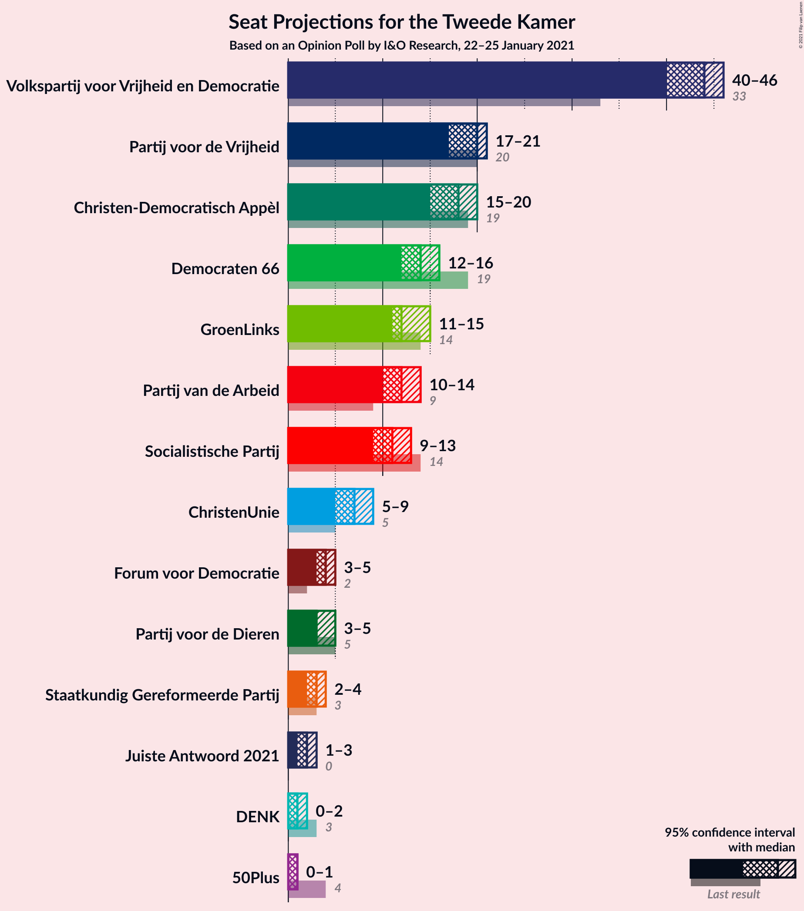

### Confidence Intervals

| Party | Last Result | Median | 80% Confidence Interval | 90% Confidence Interval | 95% Confidence Interval | 99% Confidence Interval |
|:-----:|:-----------:|:------:|:-----------------------:|:-----------------------:|:-----------------------:|:-----------------------:|
| <a href="#volkspartij-voor-vrijheid-en-democratie">Volkspartij voor Vrijheid en Democratie</a> | 33 | 41 | 40–46 |40–47 |40–47 |39–48 |
| <a href="#partij-voor-de-vrijheid">Partij voor de Vrijheid</a> | 20 | 20 | 17–21 |17–21 |16–21 |15–22 |
| <a href="#christen-democratisch-appèl">Christen-Democratisch Appèl</a> | 19 | 18 | 17–18 |17–19 |16–20 |15–20 |
| <a href="#democraten-66">Democraten 66</a> | 19 | 14 | 12–14 |12–15 |12–16 |12–16 |
| <a href="#groenlinks">GroenLinks</a> | 14 | 13 | 12–15 |12–15 |12–15 |10–15 |
| <a href="#partij-van-de-arbeid">Partij van de Arbeid</a> | 9 | 11 | 11–13 |11–13 |11–13 |10–14 |
| <a href="#socialistische-partij">Socialistische Partij</a> | 14 | 12 | 9–13 |9–13 |8–14 |8–14 |
| <a href="#christenunie">ChristenUnie</a> | 5 | 8 | 6–8 |6–8 |6–8 |4–9 |
| <a href="#partij-voor-de-dieren">Partij voor de Dieren</a> | 5 | 3 | 3–4 |2–5 |2–5 |2–6 |
| <a href="#forum-voor-democratie">Forum voor Democratie</a> | 2 | 5 | 3–5 |3–5 |3–5 |3–5 |
| <a href="#staatkundig-gereformeerde-partij">Staatkundig Gereformeerde Partij</a> | 3 | 3 | 2–3 |2–3 |2–3 |2–4 |
| <a href="#juiste-antwoord-2021">Juiste Antwoord 2021</a> | 0 | 2 | 2 |1–2 |1–2 |1–3 |
| <a href="#50plus">50Plus</a> | 4 | 1 | 0–1 |0–1 |0–1 |0–1 |
| <a href="#denk">DENK</a> | 3 | 1 | 1 |0–1 |0–1 |0–1 |

### Volkspartij voor Vrijheid en Democratie

*For a full overview of the results for this party, see the [Volkspartij voor Vrijheid en Democratie](party-volkspartijvoorvrijheidendemocratie.html) page.*

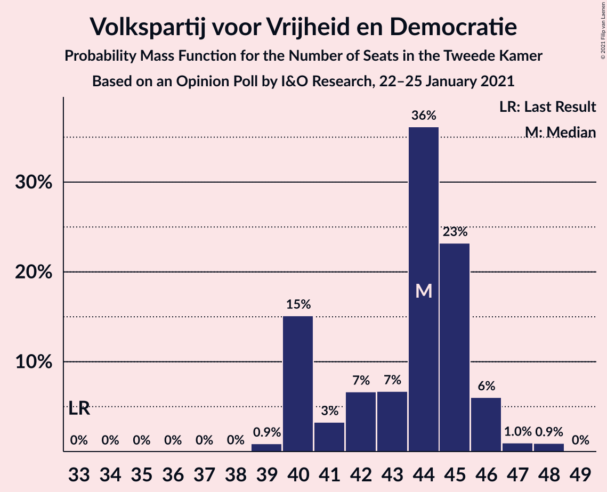

| Number of Seats | Probability | Accumulated | Special Marks |
|:---------------:|:-----------:|:-----------:|:-------------:|
| 33 | 0% | 100% | Last Result |
| 34 | 0% | 100% |  |
| 35 | 0% | 100% |  |
| 36 | 0% | 100% |  |
| 37 | 0% | 100% |  |
| 38 | 0% | 100% |  |
| 39 | 2% | 100% |  |
| 40 | 41% | 98% |  |
| 41 | 15% | 56% | Median |
| 42 | 0.3% | 42% |  |
| 43 | 22% | 41% |  |
| 44 | 4% | 20% |  |
| 45 | 1.3% | 15% |  |
| 46 | 6% | 14% |  |
| 47 | 7% | 8% |  |
| 48 | 1.0% | 1.0% |  |
| 49 | 0.1% | 0.1% |  |
| 50 | 0% | 0% |  |

### Partij voor de Vrijheid

*For a full overview of the results for this party, see the [Partij voor de Vrijheid](party-partijvoordevrijheid.html) page.*

| Number of Seats | Probability | Accumulated | Special Marks |
|:---------------:|:-----------:|:-----------:|:-------------:|
| 15 | 0.6% | 100% |  |
| 16 | 3% | 99.4% |  |
| 17 | 27% | 97% |  |
| 18 | 4% | 70% |  |
| 19 | 0.6% | 65% |  |
| 20 | 50% | 65% | Last Result, Median |
| 21 | 14% | 15% |  |
| 22 | 0.6% | 0.6% |  |
| 23 | 0% | 0% |  |

### Christen-Democratisch Appèl

*For a full overview of the results for this party, see the [Christen-Democratisch Appèl](party-christen-democratischappèl.html) page.*

| Number of Seats | Probability | Accumulated | Special Marks |
|:---------------:|:-----------:|:-----------:|:-------------:|
| 14 | 0.2% | 100% |  |
| 15 | 2% | 99.8% |  |
| 16 | 3% | 98% |  |
| 17 | 42% | 95% |  |
| 18 | 47% | 53% | Median |
| 19 | 2% | 6% | Last Result |
| 20 | 4% | 4% |  |
| 21 | 0% | 0.1% |  |
| 22 | 0% | 0% |  |

### Democraten 66

*For a full overview of the results for this party, see the [Democraten 66](party-democraten66.html) page.*

| Number of Seats | Probability | Accumulated | Special Marks |
|:---------------:|:-----------:|:-----------:|:-------------:|
| 12 | 14% | 100% |  |
| 13 | 5% | 86% |  |
| 14 | 75% | 81% | Median |
| 15 | 2% | 7% |  |
| 16 | 5% | 5% |  |
| 17 | 0% | 0.1% |  |
| 18 | 0% | 0% |  |
| 19 | 0% | 0% | Last Result |

### GroenLinks

*For a full overview of the results for this party, see the [GroenLinks](party-groenlinks.html) page.*

| Number of Seats | Probability | Accumulated | Special Marks |
|:---------------:|:-----------:|:-----------:|:-------------:|
| 10 | 2% | 100% |  |
| 11 | 0.5% | 98% |  |
| 12 | 47% | 98% |  |
| 13 | 17% | 50% | Median |
| 14 | 10% | 33% | Last Result |
| 15 | 24% | 24% |  |
| 16 | 0% | 0% |  |

### Partij van de Arbeid

*For a full overview of the results for this party, see the [Partij van de Arbeid](party-partijvandearbeid.html) page.*

| Number of Seats | Probability | Accumulated | Special Marks |
|:---------------:|:-----------:|:-----------:|:-------------:|
| 9 | 0.1% | 100% | Last Result |
| 10 | 2% | 99.9% |  |
| 11 | 77% | 98% | Median |
| 12 | 10% | 21% |  |
| 13 | 10% | 10% |  |
| 14 | 0.8% | 0.8% |  |
| 15 | 0% | 0% |  |

### Socialistische Partij

*For a full overview of the results for this party, see the [Socialistische Partij](party-socialistischepartij.html) page.*

| Number of Seats | Probability | Accumulated | Special Marks |
|:---------------:|:-----------:|:-----------:|:-------------:|
| 8 | 5% | 100% |  |
| 9 | 22% | 95% |  |
| 10 | 4% | 73% |  |
| 11 | 3% | 69% |  |
| 12 | 21% | 66% | Median |
| 13 | 42% | 45% |  |
| 14 | 3% | 3% | Last Result |
| 15 | 0% | 0% |  |

### ChristenUnie

*For a full overview of the results for this party, see the [ChristenUnie](party-christenunie.html) page.*

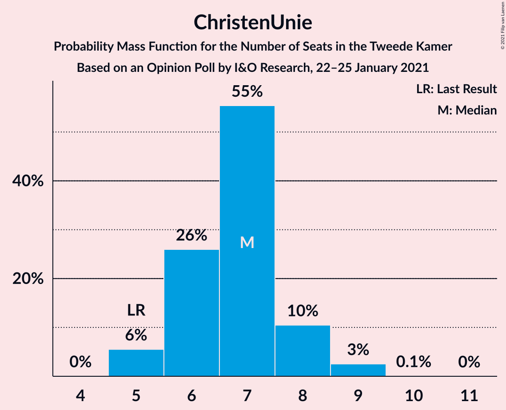

| Number of Seats | Probability | Accumulated | Special Marks |
|:---------------:|:-----------:|:-----------:|:-------------:|
| 4 | 0.5% | 100% |  |
| 5 | 2% | 99.5% | Last Result |
| 6 | 14% | 98% |  |
| 7 | 27% | 84% |  |
| 8 | 55% | 56% | Median |
| 9 | 1.4% | 1.4% |  |
| 10 | 0% | 0% |  |

### Partij voor de Dieren

*For a full overview of the results for this party, see the [Partij voor de Dieren](party-partijvoordedieren.html) page.*

| Number of Seats | Probability | Accumulated | Special Marks |
|:---------------:|:-----------:|:-----------:|:-------------:|
| 2 | 8% | 100% |  |
| 3 | 46% | 92% | Median |
| 4 | 37% | 46% |  |
| 5 | 8% | 9% | Last Result |
| 6 | 0.8% | 0.8% |  |
| 7 | 0% | 0% |  |

### Forum voor Democratie

*For a full overview of the results for this party, see the [Forum voor Democratie](party-forumvoordemocratie.html) page.*

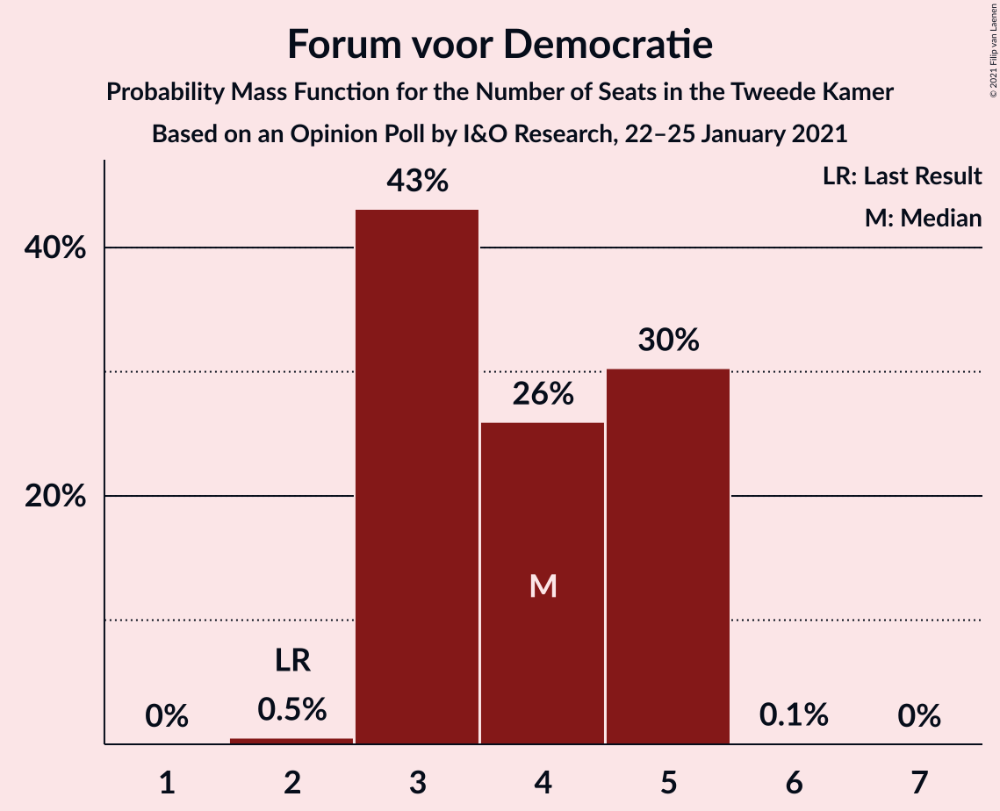

| Number of Seats | Probability | Accumulated | Special Marks |
|:---------------:|:-----------:|:-----------:|:-------------:|
| 2 | 0.2% | 100% | Last Result |
| 3 | 31% | 99.8% |  |
| 4 | 4% | 69% |  |
| 5 | 64% | 64% | Median |
| 6 | 0% | 0% |  |

### Staatkundig Gereformeerde Partij

*For a full overview of the results for this party, see the [Staatkundig Gereformeerde Partij](party-staatkundiggereformeerdepartij.html) page.*

| Number of Seats | Probability | Accumulated | Special Marks |
|:---------------:|:-----------:|:-----------:|:-------------:|
| 2 | 16% | 100% |  |
| 3 | 84% | 84% | Last Result, Median |
| 4 | 0.5% | 0.5% |  |
| 5 | 0% | 0% |  |

### Juiste Antwoord 2021

*For a full overview of the results for this party, see the [Juiste Antwoord 2021](party-juisteantwoord2021.html) page.*

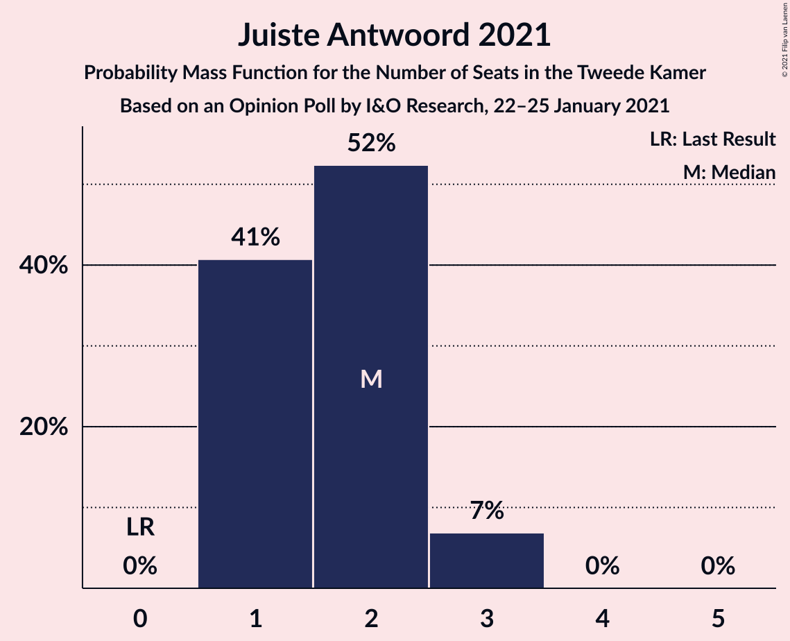

| Number of Seats | Probability | Accumulated | Special Marks |
|:---------------:|:-----------:|:-----------:|:-------------:|
| 0 | 0% | 100% | Last Result |
| 1 | 7% | 100% |  |
| 2 | 91% | 93% | Median |
| 3 | 1.4% | 1.4% |  |
| 4 | 0% | 0% |  |

### 50Plus

*For a full overview of the results for this party, see the [50Plus](party-50plus.html) page.*

| Number of Seats | Probability | Accumulated | Special Marks |
|:---------------:|:-----------:|:-----------:|:-------------:|
| 0 | 16% | 100% |  |
| 1 | 84% | 84% | Median |
| 2 | 0.2% | 0.2% |  |
| 3 | 0% | 0% |  |
| 4 | 0% | 0% | Last Result |

### DENK

*For a full overview of the results for this party, see the [DENK](party-denk.html) page.*

| Number of Seats | Probability | Accumulated | Special Marks |
|:---------------:|:-----------:|:-----------:|:-------------:|
| 0 | 6% | 100% |  |
| 1 | 94% | 94% | Median |
| 2 | 0% | 0% |  |
| 3 | 0% | 0% | Last Result |

## Coalitions

### Confidence Intervals

| Coalition | Last Result | Median | Majority? | 80% Confidence Interval | 90% Confidence Interval | 95% Confidence Interval | 99% Confidence Interval |
|:---------:|:-----------:|:------:|:---------:|:-----------------------:|:-----------------------:|:-----------------------:|:-----------------------:|
| Volkspartij voor Vrijheid en Democratie – Christen-Democratisch Appèl – Democraten 66 – GroenLinks – ChristenUnie | 90 | 92 | 100% | 91–97 | 91–99 | 91–99 | 89–100 |
| Volkspartij voor Vrijheid en Democratie – Christen-Democratisch Appèl – Democraten 66 – Partij van de Arbeid – ChristenUnie | 85 | 90 | 100% | 90–97 | 90–98 | 90–98 | 90–98 |
| Volkspartij voor Vrijheid en Democratie – Partij voor de Vrijheid – Christen-Democratisch Appèl – Forum voor Democratie – Staatkundig Gereformeerde Partij | 77 | 86 | 100% | 85–88 | 84–89 | 83–89 | 81–91 |
| Volkspartij voor Vrijheid en Democratie – Partij voor de Vrijheid – Christen-Democratisch Appèl – Forum voor Democratie | 74 | 83 | 100% | 82–85 | 82–87 | 80–87 | 78–89 |
| Volkspartij voor Vrijheid en Democratie – Christen-Democratisch Appèl – Democraten 66 – ChristenUnie | 76 | 79 | 99.9% | 79–85 | 79–85 | 79–85 | 77–86 |
| Volkspartij voor Vrijheid en Democratie – Partij voor de Vrijheid – Christen-Democratisch Appèl | 72 | 78 | 98.7% | 77–82 | 77–84 | 77–84 | 74–84 |
| Volkspartij voor Vrijheid en Democratie – Christen-Democratisch Appèl – Democraten 66 | 71 | 71 | 17% | 71–78 | 71–79 | 71–79 | 70–80 |
| Volkspartij voor Vrijheid en Democratie – Christen-Democratisch Appèl – Partij van de Arbeid | 61 | 70 | 14% | 68–76 | 68–78 | 68–78 | 68–78 |
| Christen-Democratisch Appèl – Democraten 66 – GroenLinks – Partij van de Arbeid – Socialistische Partij – ChristenUnie | 80 | 75 | 10% | 74–76 | 71–77 | 71–77 | 71–79 |
| Volkspartij voor Vrijheid en Democratie – Democraten 66 – Partij van de Arbeid | 61 | 65 | 0% | 64–72 | 64–74 | 64–74 | 64–75 |
| Volkspartij voor Vrijheid en Democratie – Christen-Democratisch Appèl – Forum voor Democratie – Staatkundig Gereformeerde Partij – 50Plus | 61 | 66 | 0% | 66–70 | 66–70 | 65–71 | 63–72 |
| Volkspartij voor Vrijheid en Democratie – Christen-Democratisch Appèl – Forum voor Democratie – Staatkundig Gereformeerde Partij | 57 | 65 | 0% | 65–69 | 65–70 | 64–71 | 63–72 |
| Volkspartij voor Vrijheid en Democratie – Christen-Democratisch Appèl – Forum voor Democratie – 50Plus | 58 | 63 | 0% | 63–68 | 63–68 | 62–69 | 61–70 |
| Volkspartij voor Vrijheid en Democratie – Christen-Democratisch Appèl – Forum voor Democratie | 54 | 62 | 0% | 62–67 | 62–68 | 61–68 | 60–70 |
| Christen-Democratisch Appèl – Democraten 66 – GroenLinks – Partij van de Arbeid – ChristenUnie | 66 | 62 | 0% | 62–65 | 62–65 | 60–66 | 59–69 |
| Volkspartij voor Vrijheid en Democratie – Christen-Democratisch Appèl | 52 | 59 | 0% | 57–64 | 57–65 | 57–65 | 56–65 |
| Volkspartij voor Vrijheid en Democratie – Partij van de Arbeid | 42 | 52 | 0% | 51–58 | 51–60 | 51–60 | 51–60 |
| Christen-Democratisch Appèl – Democraten 66 – Partij van de Arbeid | 47 | 42 | 0% | 41–45 | 41–45 | 41–46 | 41–49 |
| Christen-Democratisch Appèl – Partij van de Arbeid – ChristenUnie | 33 | 36 | 0% | 36–37 | 35–38 | 34–39 | 33–39 |
| Christen-Democratisch Appèl – Democraten 66 | 38 | 31 | 0% | 30–32 | 30–33 | 30–34 | 28–36 |
| Christen-Democratisch Appèl – Partij van de Arbeid | 28 | 29 | 0% | 28–31 | 28–31 | 27–33 | 26–33 |

### Volkspartij voor Vrijheid en Democratie – Christen-Democratisch Appèl – Democraten 66 – GroenLinks – ChristenUnie

| Number of Seats | Probability | Accumulated | Special Marks |
|:---------------:|:-----------:|:-----------:|:-------------:|
| 89 | 0.9% | 100% |  |
| 90 | 0.8% | 99.1% | Last Result |
| 91 | 42% | 98% |  |
| 92 | 13% | 56% |  |
| 93 | 1.2% | 43% |  |
| 94 | 3% | 42% | Median |
| 95 | 3% | 40% |  |
| 96 | 2% | 36% |  |
| 97 | 25% | 35% |  |
| 98 | 0.5% | 10% |  |
| 99 | 7% | 9% |  |
| 100 | 2% | 2% |  |
| 101 | 0% | 0% |  |

### Volkspartij voor Vrijheid en Democratie – Christen-Democratisch Appèl – Democraten 66 – Partij van de Arbeid – ChristenUnie

| Number of Seats | Probability | Accumulated | Special Marks |
|:---------------:|:-----------:|:-----------:|:-------------:|
| 85 | 0% | 100% | Last Result |
| 86 | 0% | 100% |  |
| 87 | 0% | 100% |  |
| 88 | 0.3% | 100% |  |
| 89 | 0% | 99.7% |  |
| 90 | 54% | 99.7% |  |
| 91 | 5% | 46% |  |
| 92 | 0.7% | 41% | Median |
| 93 | 21% | 40% |  |
| 94 | 2% | 20% |  |
| 95 | 3% | 17% |  |
| 96 | 2% | 14% |  |
| 97 | 6% | 12% |  |
| 98 | 6% | 7% |  |
| 99 | 0.3% | 0.3% |  |
| 100 | 0% | 0% |  |

### Volkspartij voor Vrijheid en Democratie – Partij voor de Vrijheid – Christen-Democratisch Appèl – Forum voor Democratie – Staatkundig Gereformeerde Partij

| Number of Seats | Probability | Accumulated | Special Marks |
|:---------------:|:-----------:|:-----------:|:-------------:|
| 77 | 0% | 100% | Last Result |
| 78 | 0% | 100% |  |
| 79 | 0% | 100% |  |
| 80 | 0% | 100% |  |
| 81 | 1.3% | 100% |  |
| 82 | 0.2% | 98.7% |  |
| 83 | 2% | 98.6% |  |
| 84 | 1.4% | 96% |  |
| 85 | 42% | 95% |  |
| 86 | 34% | 52% |  |
| 87 | 8% | 18% | Median |
| 88 | 4% | 11% |  |
| 89 | 5% | 7% |  |
| 90 | 0.3% | 2% |  |
| 91 | 1.2% | 1.3% |  |
| 92 | 0% | 0% |  |

### Volkspartij voor Vrijheid en Democratie – Partij voor de Vrijheid – Christen-Democratisch Appèl – Forum voor Democratie

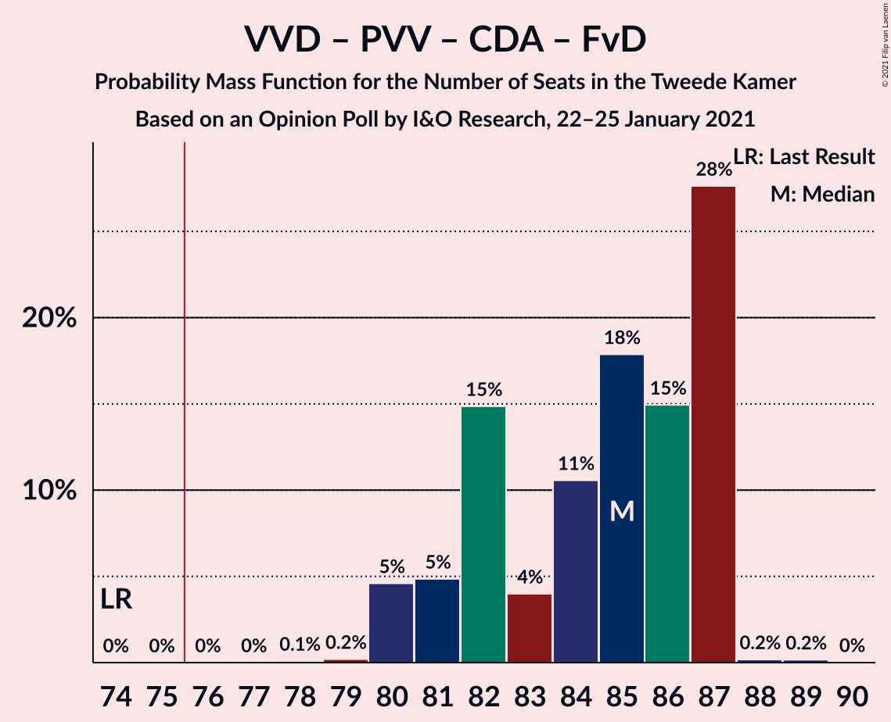

| Number of Seats | Probability | Accumulated | Special Marks |
|:---------------:|:-----------:|:-----------:|:-------------:|
| 74 | 0% | 100% | Last Result |
| 75 | 0% | 100% |  |
| 76 | 0% | 100% | Majority |
| 77 | 0% | 100% |  |
| 78 | 1.2% | 100% |  |
| 79 | 0.2% | 98.8% |  |
| 80 | 3% | 98.6% |  |
| 81 | 0.3% | 96% |  |
| 82 | 43% | 96% |  |
| 83 | 35% | 53% |  |
| 84 | 1.3% | 18% | Median |
| 85 | 9% | 17% |  |
| 86 | 1.4% | 8% |  |
| 87 | 5% | 6% |  |
| 88 | 0% | 1.3% |  |
| 89 | 1.2% | 1.3% |  |
| 90 | 0% | 0% |  |

### Volkspartij voor Vrijheid en Democratie – Christen-Democratisch Appèl – Democraten 66 – ChristenUnie

| Number of Seats | Probability | Accumulated | Special Marks |
|:---------------:|:-----------:|:-----------:|:-------------:|
| 75 | 0.1% | 100% |  |
| 76 | 0.2% | 99.9% | Last Result, Majority |
| 77 | 0.4% | 99.7% |  |
| 78 | 0.4% | 99.3% |  |
| 79 | 56% | 98.9% |  |
| 80 | 0.6% | 43% |  |
| 81 | 5% | 43% | Median |
| 82 | 21% | 38% |  |
| 83 | 3% | 17% |  |
| 84 | 0.8% | 14% |  |
| 85 | 12% | 13% |  |
| 86 | 1.0% | 1.0% |  |
| 87 | 0% | 0% |  |

### Volkspartij voor Vrijheid en Democratie – Partij voor de Vrijheid – Christen-Democratisch Appèl

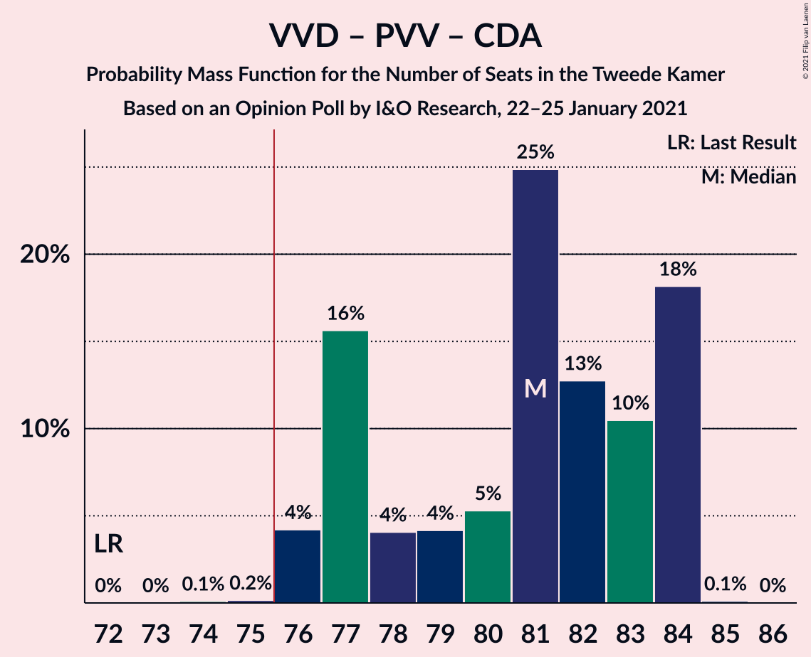

| Number of Seats | Probability | Accumulated | Special Marks |
|:---------------:|:-----------:|:-----------:|:-------------:|
| 72 | 0% | 100% | Last Result |
| 73 | 0% | 100% |  |
| 74 | 1.2% | 100% |  |
| 75 | 0% | 98.8% |  |
| 76 | 0.3% | 98.7% | Majority |
| 77 | 43% | 98% |  |
| 78 | 22% | 55% |  |
| 79 | 1.2% | 34% | Median |
| 80 | 16% | 32% |  |
| 81 | 2% | 17% |  |
| 82 | 9% | 15% |  |
| 83 | 0.3% | 6% |  |
| 84 | 6% | 6% |  |
| 85 | 0% | 0% |  |

### Volkspartij voor Vrijheid en Democratie – Christen-Democratisch Appèl – Democraten 66

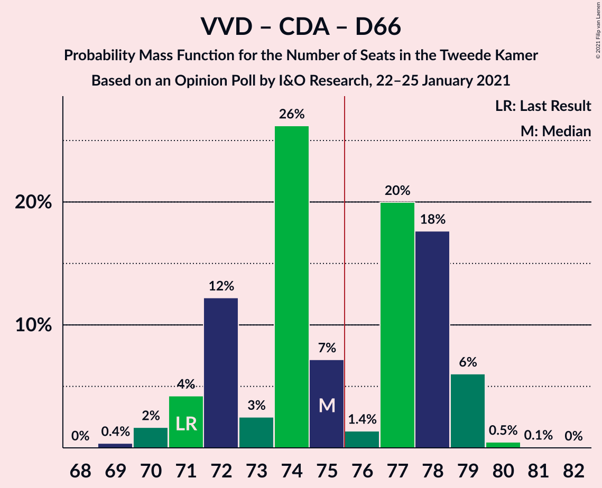

| Number of Seats | Probability | Accumulated | Special Marks |
|:---------------:|:-----------:|:-----------:|:-------------:|
| 69 | 0.5% | 100% |  |
| 70 | 1.4% | 99.5% |  |
| 71 | 54% | 98% | Last Result |
| 72 | 0.7% | 45% |  |
| 73 | 0.6% | 44% | Median |
| 74 | 0.4% | 43% |  |
| 75 | 26% | 43% |  |
| 76 | 2% | 17% | Majority |
| 77 | 2% | 16% |  |
| 78 | 6% | 14% |  |
| 79 | 6% | 8% |  |
| 80 | 2% | 2% |  |
| 81 | 0% | 0% |  |

### Volkspartij voor Vrijheid en Democratie – Christen-Democratisch Appèl – Partij van de Arbeid

| Number of Seats | Probability | Accumulated | Special Marks |
|:---------------:|:-----------:|:-----------:|:-------------:|
| 61 | 0% | 100% | Last Result |
| 62 | 0% | 100% |  |
| 63 | 0% | 100% |  |
| 64 | 0% | 100% |  |
| 65 | 0% | 100% |  |
| 66 | 0% | 100% |  |
| 67 | 0.2% | 100% |  |
| 68 | 42% | 99.8% |  |
| 69 | 0.3% | 58% |  |
| 70 | 14% | 58% | Median |
| 71 | 0.2% | 44% |  |
| 72 | 26% | 43% |  |
| 73 | 1.0% | 17% |  |
| 74 | 0.2% | 16% |  |
| 75 | 2% | 16% |  |
| 76 | 7% | 14% | Majority |
| 77 | 0.1% | 7% |  |
| 78 | 6% | 7% |  |
| 79 | 0.1% | 0.1% |  |
| 80 | 0% | 0% |  |

### Christen-Democratisch Appèl – Democraten 66 – GroenLinks – Partij van de Arbeid – Socialistische Partij – ChristenUnie

| Number of Seats | Probability | Accumulated | Special Marks |
|:---------------:|:-----------:|:-----------:|:-------------:|
| 69 | 0.2% | 100% |  |
| 70 | 0.1% | 99.8% |  |
| 71 | 6% | 99.7% |  |
| 72 | 1.0% | 94% |  |
| 73 | 2% | 93% |  |
| 74 | 37% | 91% |  |
| 75 | 44% | 54% |  |
| 76 | 2% | 10% | Median, Majority |
| 77 | 6% | 9% |  |
| 78 | 0% | 2% |  |
| 79 | 2% | 2% |  |
| 80 | 0% | 0% | Last Result |

### Volkspartij voor Vrijheid en Democratie – Democraten 66 – Partij van de Arbeid

| Number of Seats | Probability | Accumulated | Special Marks |
|:---------------:|:-----------:|:-----------:|:-------------:|
| 61 | 0% | 100% | Last Result |
| 62 | 0% | 100% |  |
| 63 | 0% | 100% |  |
| 64 | 13% | 100% |  |
| 65 | 41% | 87% |  |
| 66 | 0% | 46% | Median |
| 67 | 4% | 46% |  |
| 68 | 24% | 42% |  |
| 69 | 1.4% | 18% |  |
| 70 | 0.1% | 16% |  |
| 71 | 1.0% | 16% |  |
| 72 | 7% | 15% |  |
| 73 | 0.2% | 8% |  |
| 74 | 7% | 8% |  |
| 75 | 1.0% | 1.0% |  |
| 76 | 0% | 0% | Majority |

### Volkspartij voor Vrijheid en Democratie – Christen-Democratisch Appèl – Forum voor Democratie – Staatkundig Gereformeerde Partij – 50Plus

| Number of Seats | Probability | Accumulated | Special Marks |
|:---------------:|:-----------:|:-----------:|:-------------:|
| 61 | 0% | 100% | Last Result |
| 62 | 0% | 100% |  |
| 63 | 0.6% | 100% |  |
| 64 | 1.2% | 99.4% |  |
| 65 | 0.9% | 98% |  |
| 66 | 56% | 97% |  |
| 67 | 0.6% | 41% |  |
| 68 | 2% | 41% | Median |
| 69 | 8% | 39% |  |
| 70 | 27% | 31% |  |
| 71 | 2% | 4% |  |
| 72 | 1.4% | 2% |  |
| 73 | 0% | 0.2% |  |
| 74 | 0.1% | 0.1% |  |
| 75 | 0% | 0% |  |

### Volkspartij voor Vrijheid en Democratie – Christen-Democratisch Appèl – Forum voor Democratie – Staatkundig Gereformeerde Partij

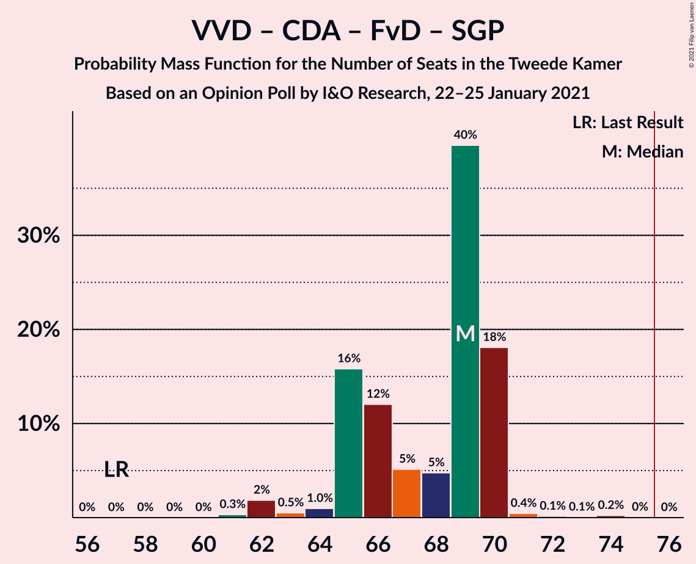

| Number of Seats | Probability | Accumulated | Special Marks |
|:---------------:|:-----------:|:-----------:|:-------------:|
| 57 | 0% | 100% | Last Result |
| 58 | 0% | 100% |  |
| 59 | 0% | 100% |  |
| 60 | 0% | 100% |  |
| 61 | 0% | 100% |  |
| 62 | 0.4% | 100% |  |
| 63 | 1.4% | 99.6% |  |
| 64 | 0.7% | 98% |  |
| 65 | 56% | 97% |  |
| 66 | 0.1% | 41% |  |
| 67 | 2% | 41% | Median |
| 68 | 3% | 40% |  |
| 69 | 27% | 37% |  |
| 70 | 7% | 10% |  |
| 71 | 2% | 3% |  |
| 72 | 1.1% | 1.3% |  |
| 73 | 0.1% | 0.1% |  |
| 74 | 0% | 0% |  |

### Volkspartij voor Vrijheid en Democratie – Christen-Democratisch Appèl – Forum voor Democratie – 50Plus

| Number of Seats | Probability | Accumulated | Special Marks |
|:---------------:|:-----------:|:-----------:|:-------------:|
| 58 | 0% | 100% | Last Result |
| 59 | 0.1% | 100% |  |
| 60 | 0.1% | 99.9% |  |
| 61 | 2% | 99.8% |  |
| 62 | 0.7% | 98% |  |
| 63 | 56% | 97% |  |
| 64 | 0.1% | 41% |  |
| 65 | 2% | 41% | Median |
| 66 | 2% | 39% |  |
| 67 | 26% | 37% |  |
| 68 | 8% | 10% |  |
| 69 | 1.3% | 3% |  |
| 70 | 1.2% | 1.3% |  |
| 71 | 0.1% | 0.1% |  |
| 72 | 0% | 0% |  |

### Volkspartij voor Vrijheid en Democratie – Christen-Democratisch Appèl – Forum voor Democratie

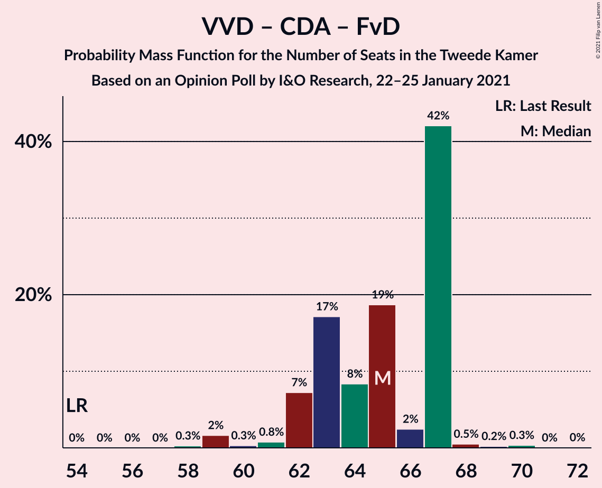

| Number of Seats | Probability | Accumulated | Special Marks |
|:---------------:|:-----------:|:-----------:|:-------------:|
| 54 | 0% | 100% | Last Result |
| 55 | 0% | 100% |  |
| 56 | 0% | 100% |  |
| 57 | 0% | 100% |  |
| 58 | 0.1% | 100% |  |
| 59 | 0% | 99.9% |  |
| 60 | 2% | 99.9% |  |
| 61 | 0.9% | 98% |  |
| 62 | 56% | 97% |  |
| 63 | 0.1% | 41% |  |
| 64 | 1.2% | 41% | Median |
| 65 | 3% | 40% |  |
| 66 | 21% | 37% |  |
| 67 | 7% | 16% |  |
| 68 | 6% | 9% |  |
| 69 | 1.2% | 2% |  |
| 70 | 1.2% | 1.3% |  |
| 71 | 0% | 0% |  |

### Christen-Democratisch Appèl – Democraten 66 – GroenLinks – Partij van de Arbeid – ChristenUnie

| Number of Seats | Probability | Accumulated | Special Marks |
|:---------------:|:-----------:|:-----------:|:-------------:|
| 58 | 0.2% | 100% |  |
| 59 | 0.5% | 99.8% |  |
| 60 | 3% | 99.3% |  |
| 61 | 1.2% | 96% |  |
| 62 | 55% | 95% |  |
| 63 | 7% | 40% |  |
| 64 | 2% | 33% | Median |
| 65 | 28% | 31% |  |
| 66 | 0.4% | 3% | Last Result |
| 67 | 0% | 2% |  |
| 68 | 0% | 2% |  |
| 69 | 2% | 2% |  |
| 70 | 0% | 0% |  |

### Volkspartij voor Vrijheid en Democratie – Christen-Democratisch Appèl

| Number of Seats | Probability | Accumulated | Special Marks |
|:---------------:|:-----------:|:-----------:|:-------------:|
| 52 | 0% | 100% | Last Result |
| 53 | 0% | 100% |  |
| 54 | 0.1% | 100% |  |
| 55 | 0% | 99.9% |  |
| 56 | 1.2% | 99.9% |  |
| 57 | 41% | 98.7% |  |
| 58 | 0.8% | 57% |  |
| 59 | 15% | 57% | Median |
| 60 | 1.4% | 41% |  |
| 61 | 21% | 40% |  |
| 62 | 3% | 19% |  |
| 63 | 0.8% | 15% |  |
| 64 | 7% | 15% |  |
| 65 | 7% | 8% |  |
| 66 | 0.1% | 0.2% |  |
| 67 | 0% | 0% |  |

### Volkspartij voor Vrijheid en Democratie – Partij van de Arbeid

| Number of Seats | Probability | Accumulated | Special Marks |
|:---------------:|:-----------:|:-----------:|:-------------:|
| 42 | 0% | 100% | Last Result |
| 43 | 0% | 100% |  |
| 44 | 0% | 100% |  |
| 45 | 0% | 100% |  |
| 46 | 0% | 100% |  |
| 47 | 0% | 100% |  |
| 48 | 0% | 100% |  |
| 49 | 0% | 100% |  |
| 50 | 0% | 100% |  |
| 51 | 41% | 100% |  |
| 52 | 16% | 59% | Median |
| 53 | 2% | 44% |  |
| 54 | 23% | 41% |  |
| 55 | 0.6% | 18% |  |
| 56 | 2% | 17% |  |
| 57 | 1.2% | 15% |  |
| 58 | 5% | 14% |  |
| 59 | 2% | 9% |  |
| 60 | 6% | 6% |  |
| 61 | 0% | 0.1% |  |
| 62 | 0% | 0.1% |  |
| 63 | 0.1% | 0.1% |  |
| 64 | 0% | 0% |  |

### Christen-Democratisch Appèl – Democraten 66 – Partij van de Arbeid

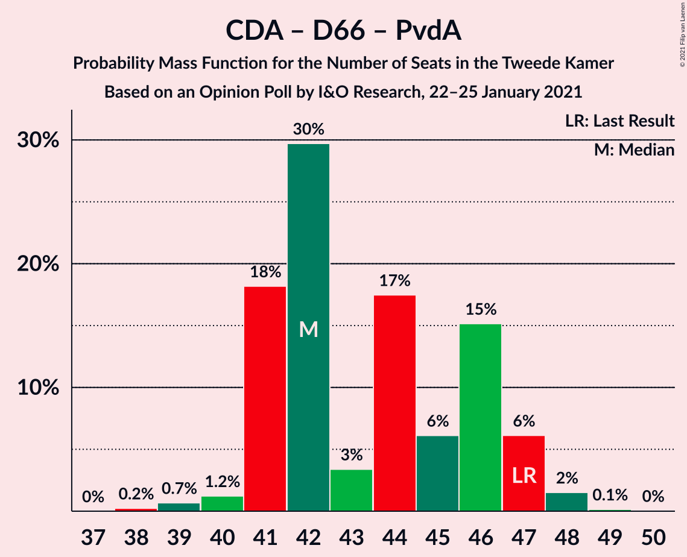

| Number of Seats | Probability | Accumulated | Special Marks |
|:---------------:|:-----------:|:-----------:|:-------------:|
| 39 | 0.2% | 100% |  |
| 40 | 0.1% | 99.8% |  |
| 41 | 16% | 99.7% |  |
| 42 | 42% | 83% |  |
| 43 | 24% | 42% | Median |
| 44 | 7% | 18% |  |
| 45 | 9% | 11% |  |
| 46 | 0.4% | 3% |  |
| 47 | 0% | 2% | Last Result |
| 48 | 0% | 2% |  |
| 49 | 2% | 2% |  |
| 50 | 0% | 0% |  |

### Christen-Democratisch Appèl – Partij van de Arbeid – ChristenUnie

| Number of Seats | Probability | Accumulated | Special Marks |
|:---------------:|:-----------:|:-----------:|:-------------:|
| 32 | 0.4% | 100% |  |
| 33 | 1.0% | 99.6% | Last Result |
| 34 | 4% | 98.7% |  |
| 35 | 3% | 95% |  |
| 36 | 63% | 92% |  |
| 37 | 24% | 29% | Median |
| 38 | 2% | 5% |  |
| 39 | 3% | 3% |  |
| 40 | 0.1% | 0.3% |  |
| 41 | 0.3% | 0.3% |  |
| 42 | 0% | 0% |  |

### Christen-Democratisch Appèl – Democraten 66

| Number of Seats | Probability | Accumulated | Special Marks |
|:---------------:|:-----------:|:-----------:|:-------------:|
| 27 | 0.2% | 100% |  |
| 28 | 0.4% | 99.8% |  |
| 29 | 2% | 99.4% |  |
| 30 | 14% | 98% |  |
| 31 | 45% | 84% |  |
| 32 | 34% | 39% | Median |
| 33 | 2% | 5% |  |
| 34 | 1.2% | 4% |  |
| 35 | 0.1% | 2% |  |
| 36 | 2% | 2% |  |
| 37 | 0% | 0% |  |
| 38 | 0% | 0% | Last Result |

### Christen-Democratisch Appèl – Partij van de Arbeid

| Number of Seats | Probability | Accumulated | Special Marks |
|:---------------:|:-----------:|:-----------:|:-------------:|
| 25 | 0.2% | 100% |  |
| 26 | 0.4% | 99.8% |  |
| 27 | 2% | 99.5% |  |
| 28 | 45% | 97% | Last Result |
| 29 | 34% | 53% | Median |
| 30 | 8% | 18% |  |
| 31 | 6% | 10% |  |
| 32 | 1.3% | 4% |  |
| 33 | 3% | 3% |  |
| 34 | 0% | 0% |  |

## Technical Information

### Opinion Poll

+ **Polling firm:** I&O Research
+ **Commissioner(s):** —
+ **Fieldwork period:** 22–25 January 2021

### Calculations

+ **Sample size:** 2232
+ **Simulations done:** 131,072
+ **Error estimate:** 3.67%

