# Opinion Poll by Kantar Public, 23–26 January 2021

<a href="#voting-intentions">Voting Intentions</a> | <a href="#seats">Seats</a> | <a href="#coalitions">Coalitions</a> | <a href="#technical-information">Technical Information</a>

## Voting Intentions

### Confidence Intervals

| Party | Last Result | Poll Result | 80% Confidence Interval | 90% Confidence Interval | 95% Confidence Interval | 99% Confidence Interval |
|:-----:|:-----------:|:-----------:|:-----------------------:|:-----------------------:|:-----------------------:|:-----------------------:|
| Volkspartij voor Vrijheid en Democratie | 21.3% | 27.9% | 26.3–29.6% |25.8–30.1% |25.5–30.5% |24.7–31.4% |
| Christen-Democratisch Appèl | 12.4% | 12.0% | 10.8–13.3% |10.5–13.6% |10.3–13.9% |9.7–14.6% |
| Partij voor de Vrijheid | 13.1% | 11.3% | 10.2–12.6% |9.9–12.9% |9.6–13.2% |9.1–13.9% |
| Democraten 66 | 12.2% | 9.3% | 8.3–10.5% |8.0–10.8% |7.8–11.1% |7.3–11.7% |
| GroenLinks | 9.1% | 8.6% | 7.7–9.8% |7.4–10.1% |7.2–10.4% |6.8–10.9% |
| Partij van de Arbeid | 5.7% | 8.0% | 7.1–9.1% |6.8–9.4% |6.6–9.7% |6.2–10.2% |
| Socialistische Partij | 9.1% | 7.3% | 6.4–8.4% |6.2–8.7% |6.0–8.9% |5.6–9.5% |
| ChristenUnie | 3.4% | 3.3% | 2.7–4.1% |2.6–4.3% |2.5–4.5% |2.2–4.9% |
| Partij voor de Dieren | 3.2% | 3.3% | 2.7–4.1% |2.6–4.3% |2.5–4.5% |2.2–4.9% |
| 50Plus | 3.1% | 2.0% | 1.6–2.6% |1.4–2.8% |1.3–3.0% |1.2–3.3% |
| Staatkundig Gereformeerde Partij | 2.1% | 2.0% | 1.6–2.6% |1.4–2.8% |1.3–3.0% |1.2–3.3% |
| DENK | 2.1% | 2.0% | 1.6–2.6% |1.4–2.8% |1.3–3.0% |1.2–3.3% |
| Forum voor Democratie | 1.8% | 2.0% | 1.6–2.6% |1.4–2.8% |1.3–3.0% |1.2–3.3% |
| Juiste Antwoord 2021 | 0.0% | 0.7% | 0.4–1.1% |0.4–1.2% |0.3–1.3% |0.3–1.5% |

*Note:* The poll result column reflects the actual value used in the calculations. Published results may vary slightly, and in addition be rounded to fewer digits.

## Seats

### Confidence Intervals

| Party | Last Result | Median | 80% Confidence Interval | 90% Confidence Interval | 95% Confidence Interval | 99% Confidence Interval |
|:-----:|:-----------:|:------:|:-----------------------:|:-----------------------:|:-----------------------:|:-----------------------:|
| <a href="#volkspartij-voor-vrijheid-en-democratie">Volkspartij voor Vrijheid en Democratie</a> | 33 | 46 | 43–46 |42–46 |40–46 |40–47 |
| <a href="#christen-democratisch-appèl">Christen-Democratisch Appèl</a> | 19 | 18 | 18–19 |17–20 |17–20 |15–20 |
| <a href="#partij-voor-de-vrijheid">Partij voor de Vrijheid</a> | 20 | 17 | 16–17 |16–17 |16–20 |14–20 |
| <a href="#democraten-66">Democraten 66</a> | 19 | 13 | 13–14 |12–14 |11–14 |11–16 |
| <a href="#groenlinks">GroenLinks</a> | 14 | 13 | 13–14 |13–14 |13–16 |12–16 |
| <a href="#partij-van-de-arbeid">Partij van de Arbeid</a> | 9 | 11 | 11–12 |10–12 |10–13 |10–13 |
| <a href="#socialistische-partij">Socialistische Partij</a> | 14 | 9 | 9–11 |9–12 |9–12 |9–14 |
| <a href="#christenunie">ChristenUnie</a> | 5 | 6 | 4–6 |4–6 |3–6 |3–6 |
| <a href="#partij-voor-de-dieren">Partij voor de Dieren</a> | 5 | 4 | 4–5 |4–6 |4–6 |3–6 |
| <a href="#50plus">50Plus</a> | 4 | 3 | 3 |2–3 |2–3 |2–4 |
| <a href="#staatkundig-gereformeerde-partij">Staatkundig Gereformeerde Partij</a> | 3 | 3 | 3–4 |3–5 |2–5 |1–5 |
| <a href="#denk">DENK</a> | 3 | 3 | 2–3 |2–3 |2–4 |2–5 |
| <a href="#forum-voor-democratie">Forum voor Democratie</a> | 2 | 3 | 3 |2–3 |2–3 |2–4 |
| <a href="#juiste-antwoord-2021">Juiste Antwoord 2021</a> | 0 | 1 | 1 |0–1 |0–1 |0–1 |

### Volkspartij voor Vrijheid en Democratie

*For a full overview of the results for this party, see the [Volkspartij voor Vrijheid en Democratie](party-volkspartijvoorvrijheidendemocratie.html) page.*

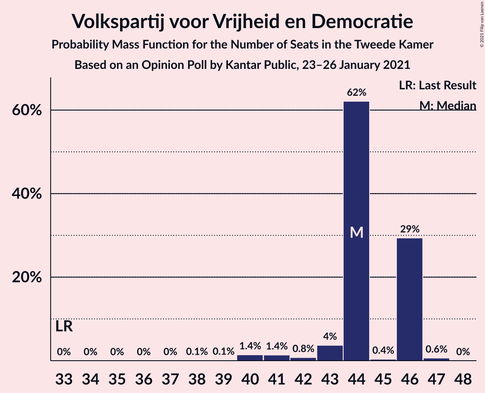

| Number of Seats | Probability | Accumulated | Special Marks |
|:---------------:|:-----------:|:-----------:|:-------------:|
| 33 | 0% | 100% | Last Result |
| 34 | 0% | 100% |  |
| 35 | 0% | 100% |  |
| 36 | 0% | 100% |  |
| 37 | 0% | 100% |  |
| 38 | 0.1% | 100% |  |
| 39 | 0% | 99.9% |  |
| 40 | 3% | 99.9% |  |
| 41 | 0.7% | 97% |  |
| 42 | 2% | 96% |  |
| 43 | 8% | 94% |  |
| 44 | 4% | 86% |  |
| 45 | 0.2% | 82% |  |
| 46 | 80% | 82% | Median |
| 47 | 2% | 2% |  |
| 48 | 0% | 0% |  |

### Christen-Democratisch Appèl

*For a full overview of the results for this party, see the [Christen-Democratisch Appèl](party-christen-democratischappèl.html) page.*

| Number of Seats | Probability | Accumulated | Special Marks |
|:---------------:|:-----------:|:-----------:|:-------------:|
| 15 | 0.7% | 100% |  |
| 16 | 0.2% | 99.2% |  |
| 17 | 5% | 99.0% |  |
| 18 | 81% | 94% | Median |
| 19 | 7% | 12% | Last Result |
| 20 | 5% | 5% |  |
| 21 | 0.1% | 0.1% |  |
| 22 | 0% | 0% |  |

### Partij voor de Vrijheid

*For a full overview of the results for this party, see the [Partij voor de Vrijheid](party-partijvoordevrijheid.html) page.*

| Number of Seats | Probability | Accumulated | Special Marks |
|:---------------:|:-----------:|:-----------:|:-------------:|
| 14 | 0.6% | 100% |  |
| 15 | 0.3% | 99.4% |  |
| 16 | 11% | 99.1% |  |
| 17 | 84% | 88% | Median |
| 18 | 0.3% | 4% |  |
| 19 | 0.2% | 4% |  |
| 20 | 3% | 3% | Last Result |
| 21 | 0% | 0.1% |  |
| 22 | 0.1% | 0.1% |  |
| 23 | 0% | 0% |  |

### Democraten 66

*For a full overview of the results for this party, see the [Democraten 66](party-democraten66.html) page.*

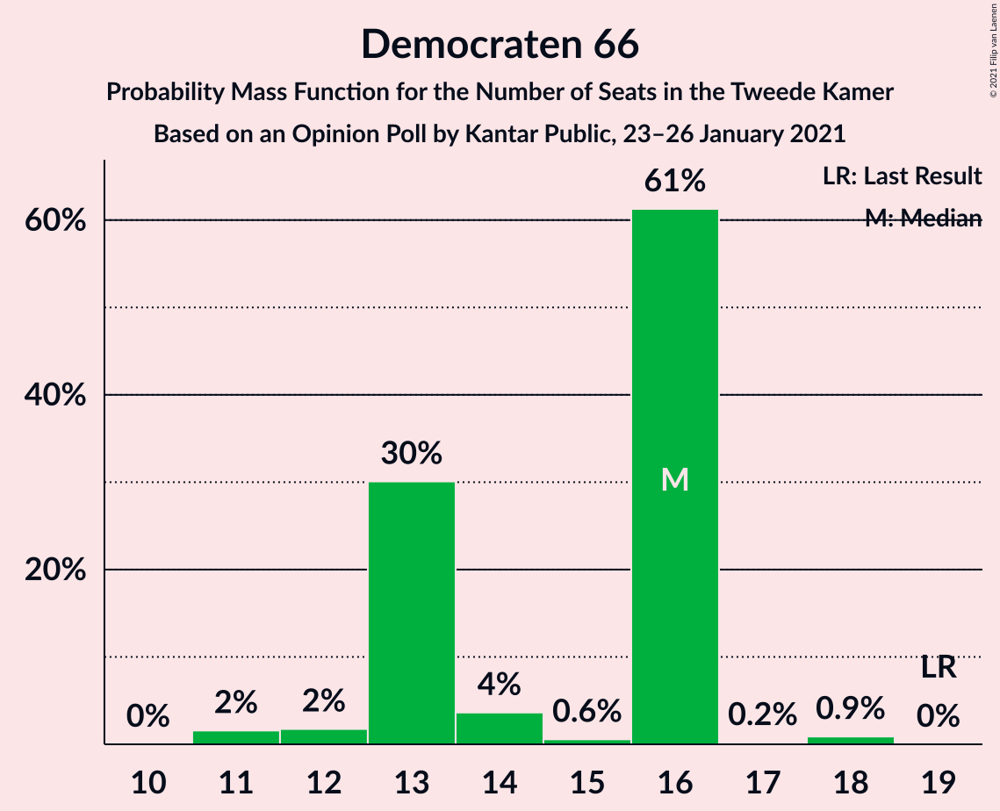

| Number of Seats | Probability | Accumulated | Special Marks |
|:---------------:|:-----------:|:-----------:|:-------------:|
| 11 | 4% | 100% |  |
| 12 | 4% | 96% |  |
| 13 | 81% | 92% | Median |
| 14 | 9% | 11% |  |
| 15 | 0.4% | 2% |  |
| 16 | 2% | 2% |  |
| 17 | 0.1% | 0.2% |  |
| 18 | 0.1% | 0.1% |  |
| 19 | 0% | 0% | Last Result |

### GroenLinks

*For a full overview of the results for this party, see the [GroenLinks](party-groenlinks.html) page.*

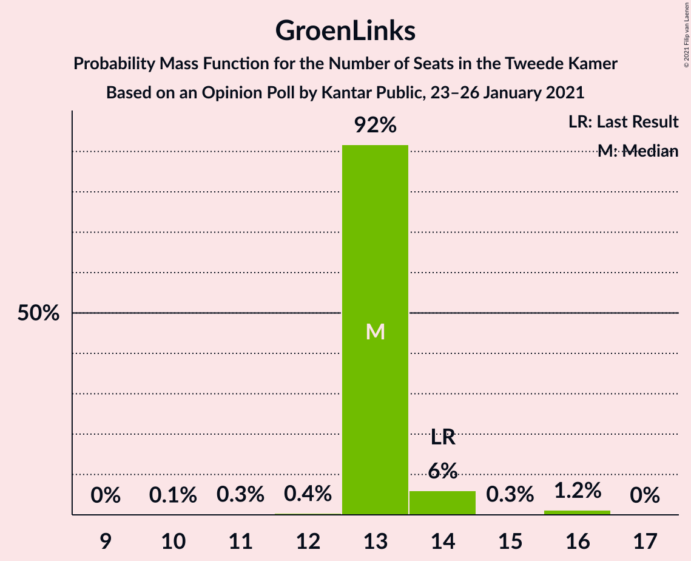

| Number of Seats | Probability | Accumulated | Special Marks |
|:---------------:|:-----------:|:-----------:|:-------------:|
| 10 | 0.1% | 100% |  |
| 11 | 0.1% | 99.9% |  |
| 12 | 0.4% | 99.8% |  |
| 13 | 82% | 99.4% | Median |
| 14 | 15% | 18% | Last Result |
| 15 | 0.1% | 3% |  |
| 16 | 3% | 3% |  |
| 17 | 0% | 0% |  |

### Partij van de Arbeid

*For a full overview of the results for this party, see the [Partij van de Arbeid](party-partijvandearbeid.html) page.*

| Number of Seats | Probability | Accumulated | Special Marks |
|:---------------:|:-----------:|:-----------:|:-------------:|
| 9 | 0.1% | 100% | Last Result |
| 10 | 6% | 99.8% |  |
| 11 | 83% | 93% | Median |
| 12 | 6% | 10% |  |
| 13 | 4% | 4% |  |
| 14 | 0.4% | 0.5% |  |
| 15 | 0.1% | 0.1% |  |
| 16 | 0% | 0% |  |

### Socialistische Partij

*For a full overview of the results for this party, see the [Socialistische Partij](party-socialistischepartij.html) page.*

| Number of Seats | Probability | Accumulated | Special Marks |
|:---------------:|:-----------:|:-----------:|:-------------:|
| 8 | 0.1% | 100% |  |
| 9 | 85% | 99.9% | Median |
| 10 | 2% | 15% |  |
| 11 | 4% | 14% |  |
| 12 | 8% | 9% |  |
| 13 | 0.3% | 1.2% |  |
| 14 | 0.9% | 0.9% | Last Result |
| 15 | 0% | 0% |  |

### ChristenUnie

*For a full overview of the results for this party, see the [ChristenUnie](party-christenunie.html) page.*

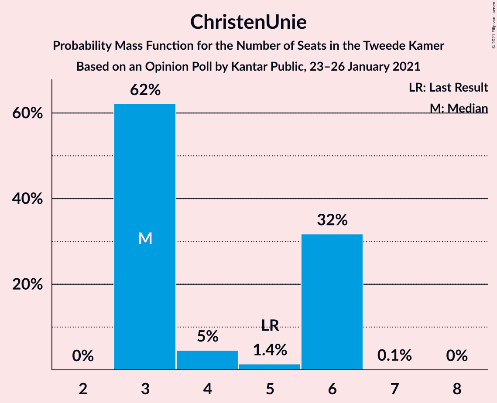

| Number of Seats | Probability | Accumulated | Special Marks |
|:---------------:|:-----------:|:-----------:|:-------------:|
| 3 | 4% | 100% |  |
| 4 | 9% | 96% |  |
| 5 | 1.3% | 87% | Last Result |
| 6 | 85% | 85% | Median |
| 7 | 0.1% | 0.1% |  |
| 8 | 0.1% | 0.1% |  |
| 9 | 0% | 0% |  |

### Partij voor de Dieren

*For a full overview of the results for this party, see the [Partij voor de Dieren](party-partijvoordedieren.html) page.*

| Number of Seats | Probability | Accumulated | Special Marks |
|:---------------:|:-----------:|:-----------:|:-------------:|
| 3 | 0.7% | 100% |  |
| 4 | 87% | 99.3% | Median |
| 5 | 7% | 13% | Last Result |
| 6 | 5% | 6% |  |
| 7 | 0.2% | 0.2% |  |
| 8 | 0% | 0% |  |

### 50Plus

*For a full overview of the results for this party, see the [50Plus](party-50plus.html) page.*

| Number of Seats | Probability | Accumulated | Special Marks |
|:---------------:|:-----------:|:-----------:|:-------------:|
| 1 | 0.1% | 100% |  |
| 2 | 6% | 99.9% |  |
| 3 | 93% | 93% | Median |
| 4 | 0.7% | 0.8% | Last Result |
| 5 | 0.1% | 0.1% |  |
| 6 | 0% | 0% |  |

### Staatkundig Gereformeerde Partij

*For a full overview of the results for this party, see the [Staatkundig Gereformeerde Partij](party-staatkundiggereformeerdepartij.html) page.*

| Number of Seats | Probability | Accumulated | Special Marks |
|:---------------:|:-----------:|:-----------:|:-------------:|
| 1 | 0.6% | 100% |  |
| 2 | 3% | 99.4% |  |
| 3 | 84% | 96% | Last Result, Median |
| 4 | 3% | 12% |  |
| 5 | 9% | 9% |  |
| 6 | 0% | 0% |  |

### DENK

*For a full overview of the results for this party, see the [DENK](party-denk.html) page.*

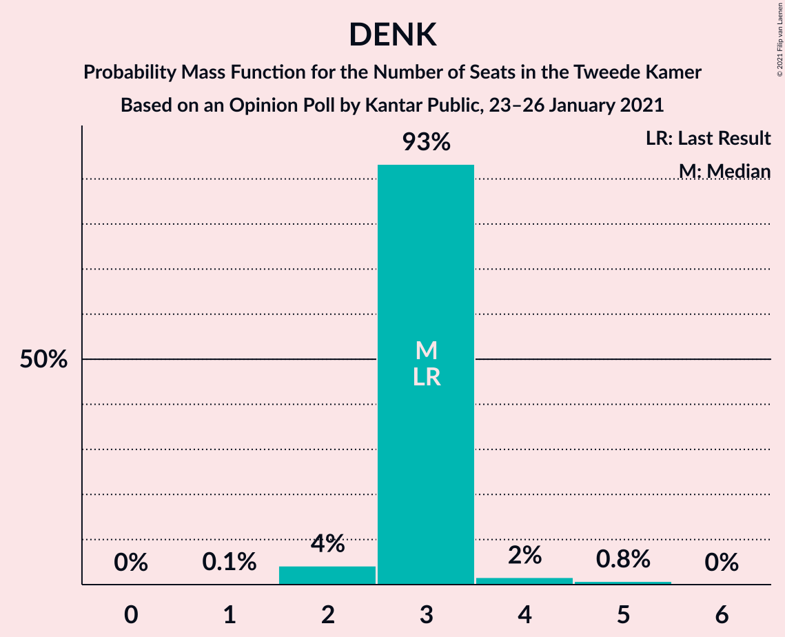

| Number of Seats | Probability | Accumulated | Special Marks |
|:---------------:|:-----------:|:-----------:|:-------------:|
| 1 | 0.2% | 100% |  |
| 2 | 10% | 99.8% |  |
| 3 | 86% | 90% | Last Result, Median |
| 4 | 3% | 4% |  |
| 5 | 1.4% | 1.4% |  |
| 6 | 0% | 0% |  |

### Forum voor Democratie

*For a full overview of the results for this party, see the [Forum voor Democratie](party-forumvoordemocratie.html) page.*

| Number of Seats | Probability | Accumulated | Special Marks |
|:---------------:|:-----------:|:-----------:|:-------------:|
| 1 | 0.1% | 100% |  |
| 2 | 6% | 99.9% | Last Result |
| 3 | 93% | 94% | Median |
| 4 | 0.8% | 0.9% |  |
| 5 | 0.1% | 0.1% |  |
| 6 | 0% | 0% |  |

### Juiste Antwoord 2021

*For a full overview of the results for this party, see the [Juiste Antwoord 2021](party-juisteantwoord2021.html) page.*

| Number of Seats | Probability | Accumulated | Special Marks |
|:---------------:|:-----------:|:-----------:|:-------------:|
| 0 | 6% | 100% | Last Result |
| 1 | 94% | 94% | Median |
| 2 | 0.2% | 0.2% |  |
| 3 | 0% | 0% |  |

## Coalitions

### Confidence Intervals

| Coalition | Last Result | Median | Majority? | 80% Confidence Interval | 90% Confidence Interval | 95% Confidence Interval | 99% Confidence Interval |
|:---------:|:-----------:|:------:|:---------:|:-----------------------:|:-----------------------:|:-----------------------:|:-----------------------:|
| Volkspartij voor Vrijheid en Democratie – Christen-Democratisch Appèl – Democraten 66 – GroenLinks – ChristenUnie | 90 | 96 | 100% | 93–96 | 92–96 | 91–96 | 91–96 |
| Volkspartij voor Vrijheid en Democratie – Christen-Democratisch Appèl – Democraten 66 – Partij van de Arbeid – ChristenUnie | 85 | 94 | 100% | 89–94 | 89–94 | 88–94 | 88–94 |
| Volkspartij voor Vrijheid en Democratie – Christen-Democratisch Appèl – Partij voor de Vrijheid – Forum voor Democratie – Staatkundig Gereformeerde Partij | 77 | 87 | 100% | 86–87 | 81–87 | 80–87 | 79–87 |
| Volkspartij voor Vrijheid en Democratie – Christen-Democratisch Appèl – Partij voor de Vrijheid – Forum voor Democratie | 74 | 84 | 99.9% | 82–84 | 78–84 | 78–84 | 76–84 |
| Volkspartij voor Vrijheid en Democratie – Christen-Democratisch Appèl – Democraten 66 – ChristenUnie | 76 | 83 | 99.9% | 79–83 | 77–83 | 76–83 | 76–83 |
| Volkspartij voor Vrijheid en Democratie – Christen-Democratisch Appèl – Partij voor de Vrijheid | 72 | 81 | 98% | 79–81 | 76–81 | 76–81 | 73–81 |
| Christen-Democratisch Appèl – Democraten 66 – GroenLinks – Partij van de Arbeid – Socialistische Partij – ChristenUnie | 80 | 70 | 4% | 70–73 | 70–73 | 70–77 | 69–77 |
| Volkspartij voor Vrijheid en Democratie – Christen-Democratisch Appèl – Democraten 66 | 71 | 77 | 85% | 75–77 | 74–77 | 70–77 | 70–77 |
| Volkspartij voor Vrijheid en Democratie – Christen-Democratisch Appèl – Partij van de Arbeid | 61 | 75 | 0.2% | 73–75 | 71–75 | 71–75 | 69–75 |
| Volkspartij voor Vrijheid en Democratie – Christen-Democratisch Appèl – 50Plus – Forum voor Democratie – Staatkundig Gereformeerde Partij | 61 | 73 | 0% | 71–73 | 68–74 | 65–74 | 65–74 |
| Volkspartij voor Vrijheid en Democratie – Christen-Democratisch Appèl – Forum voor Democratie – Staatkundig Gereformeerde Partij | 57 | 70 | 0% | 69–70 | 65–71 | 63–71 | 63–71 |
| Volkspartij voor Vrijheid en Democratie – Democraten 66 – Partij van de Arbeid | 61 | 70 | 0% | 68–70 | 66–70 | 64–70 | 64–73 |
| Volkspartij voor Vrijheid en Democratie – Christen-Democratisch Appèl – 50Plus – Forum voor Democratie | 58 | 70 | 0% | 68–70 | 64–70 | 63–70 | 63–70 |
| Volkspartij voor Vrijheid en Democratie – Christen-Democratisch Appèl – Forum voor Democratie | 54 | 67 | 0% | 66–67 | 62–67 | 61–67 | 61–67 |
| Christen-Democratisch Appèl – Democraten 66 – GroenLinks – Partij van de Arbeid – ChristenUnie | 66 | 61 | 0% | 61–63 | 59–64 | 59–65 | 57–65 |
| Volkspartij voor Vrijheid en Democratie – Christen-Democratisch Appèl | 52 | 64 | 0% | 62–64 | 59–64 | 59–64 | 59–64 |
| Volkspartij voor Vrijheid en Democratie – Partij van de Arbeid | 42 | 57 | 0% | 54–57 | 53–57 | 53–57 | 52–60 |
| Christen-Democratisch Appèl – Democraten 66 – Partij van de Arbeid | 47 | 42 | 0% | 42–43 | 41–46 | 41–46 | 38–46 |
| Christen-Democratisch Appèl – Partij van de Arbeid – ChristenUnie | 33 | 35 | 0% | 33–35 | 33–36 | 31–38 | 31–38 |
| Christen-Democratisch Appèl – Democraten 66 | 38 | 31 | 0% | 31 | 31–34 | 30–34 | 28–34 |
| Christen-Democratisch Appèl – Partij van de Arbeid | 28 | 29 | 0% | 29 | 28–32 | 28–32 | 27–32 |

### Volkspartij voor Vrijheid en Democratie – Christen-Democratisch Appèl – Democraten 66 – GroenLinks – ChristenUnie

| Number of Seats | Probability | Accumulated | Special Marks |
|:---------------:|:-----------:|:-----------:|:-------------:|
| 87 | 0% | 100% |  |
| 88 | 0% | 99.9% |  |
| 89 | 0% | 99.9% |  |
| 90 | 0.1% | 99.9% | Last Result |
| 91 | 4% | 99.8% |  |
| 92 | 4% | 96% |  |
| 93 | 5% | 92% |  |
| 94 | 1.0% | 87% |  |
| 95 | 6% | 86% |  |
| 96 | 80% | 80% | Median |
| 97 | 0% | 0.1% |  |
| 98 | 0% | 0.1% |  |
| 99 | 0% | 0.1% |  |
| 100 | 0% | 0% |  |

### Volkspartij voor Vrijheid en Democratie – Christen-Democratisch Appèl – Democraten 66 – Partij van de Arbeid – ChristenUnie

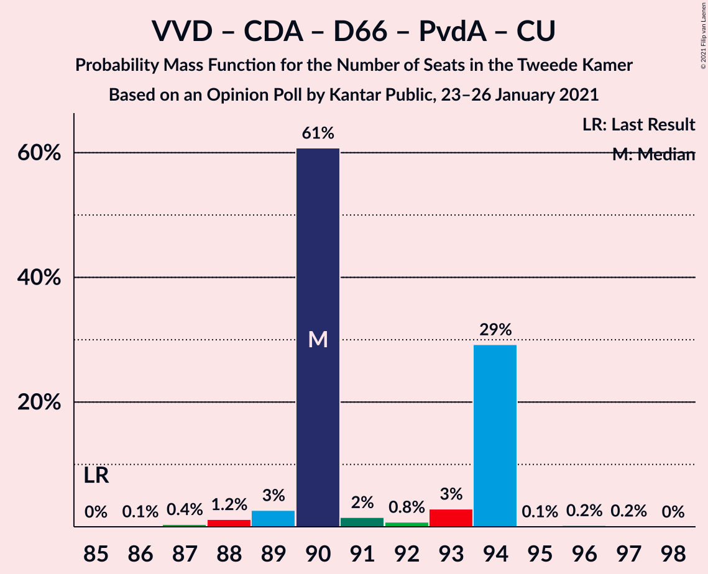

| Number of Seats | Probability | Accumulated | Special Marks |
|:---------------:|:-----------:|:-----------:|:-------------:|
| 85 | 0% | 100% | Last Result |
| 86 | 0% | 100% |  |
| 87 | 0% | 100% |  |
| 88 | 3% | 100% |  |
| 89 | 7% | 97% |  |
| 90 | 0.9% | 90% |  |
| 91 | 3% | 89% |  |
| 92 | 0.5% | 86% |  |
| 93 | 5% | 85% |  |
| 94 | 80% | 80% | Median |
| 95 | 0.1% | 0.3% |  |
| 96 | 0.1% | 0.2% |  |
| 97 | 0.1% | 0.1% |  |
| 98 | 0% | 0.1% |  |
| 99 | 0% | 0% |  |

### Volkspartij voor Vrijheid en Democratie – Christen-Democratisch Appèl – Partij voor de Vrijheid – Forum voor Democratie – Staatkundig Gereformeerde Partij

| Number of Seats | Probability | Accumulated | Special Marks |
|:---------------:|:-----------:|:-----------:|:-------------:|
| 77 | 0% | 100% | Last Result |
| 78 | 0.1% | 100% |  |
| 79 | 0.6% | 99.9% |  |
| 80 | 3% | 99.3% |  |
| 81 | 1.3% | 96% |  |
| 82 | 0.1% | 95% |  |
| 83 | 0.5% | 95% |  |
| 84 | 0.1% | 94% |  |
| 85 | 0.9% | 94% |  |
| 86 | 4% | 93% |  |
| 87 | 89% | 89% | Median |
| 88 | 0.1% | 0.2% |  |
| 89 | 0.1% | 0.1% |  |
| 90 | 0% | 0% |  |

### Volkspartij voor Vrijheid en Democratie – Christen-Democratisch Appèl – Partij voor de Vrijheid – Forum voor Democratie

| Number of Seats | Probability | Accumulated | Special Marks |
|:---------------:|:-----------:|:-----------:|:-------------:|
| 74 | 0% | 100% | Last Result |
| 75 | 0.1% | 100% |  |
| 76 | 0.6% | 99.9% | Majority |
| 77 | 0% | 99.3% |  |
| 78 | 4% | 99.3% |  |
| 79 | 0.2% | 95% |  |
| 80 | 0.2% | 95% |  |
| 81 | 0.1% | 95% |  |
| 82 | 13% | 94% |  |
| 83 | 2% | 82% |  |
| 84 | 80% | 80% | Median |
| 85 | 0% | 0.2% |  |
| 86 | 0.1% | 0.2% |  |
| 87 | 0% | 0% |  |

### Volkspartij voor Vrijheid en Democratie – Christen-Democratisch Appèl – Democraten 66 – ChristenUnie

| Number of Seats | Probability | Accumulated | Special Marks |
|:---------------:|:-----------:|:-----------:|:-------------:|
| 74 | 0% | 100% |  |
| 75 | 0.1% | 99.9% |  |
| 76 | 3% | 99.9% | Last Result, Majority |
| 77 | 3% | 97% |  |
| 78 | 2% | 94% |  |
| 79 | 5% | 92% |  |
| 80 | 0.3% | 88% |  |
| 81 | 7% | 87% |  |
| 82 | 0% | 80% |  |
| 83 | 80% | 80% | Median |
| 84 | 0.1% | 0.2% |  |
| 85 | 0% | 0.1% |  |
| 86 | 0% | 0% |  |

### Volkspartij voor Vrijheid en Democratie – Christen-Democratisch Appèl – Partij voor de Vrijheid

| Number of Seats | Probability | Accumulated | Special Marks |
|:---------------:|:-----------:|:-----------:|:-------------:|
| 72 | 0% | 100% | Last Result |
| 73 | 0.7% | 100% |  |
| 74 | 0% | 99.3% |  |
| 75 | 1.5% | 99.2% |  |
| 76 | 3% | 98% | Majority |
| 77 | 0.1% | 95% |  |
| 78 | 0.4% | 95% |  |
| 79 | 10% | 94% |  |
| 80 | 4% | 84% |  |
| 81 | 80% | 80% | Median |
| 82 | 0.1% | 0.2% |  |
| 83 | 0% | 0.1% |  |
| 84 | 0% | 0% |  |

### Christen-Democratisch Appèl – Democraten 66 – GroenLinks – Partij van de Arbeid – Socialistische Partij – ChristenUnie

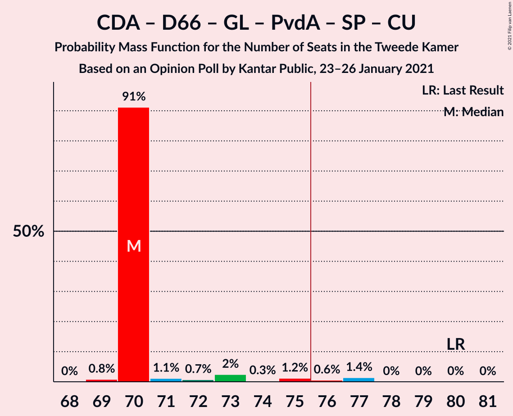

| Number of Seats | Probability | Accumulated | Special Marks |
|:---------------:|:-----------:|:-----------:|:-------------:|
| 68 | 0% | 100% |  |
| 69 | 2% | 99.9% |  |
| 70 | 84% | 98% | Median |
| 71 | 3% | 14% |  |
| 72 | 0.4% | 11% |  |
| 73 | 6% | 11% |  |
| 74 | 0.3% | 5% |  |
| 75 | 0.2% | 4% |  |
| 76 | 0.6% | 4% | Majority |
| 77 | 3% | 4% |  |
| 78 | 0% | 0.1% |  |
| 79 | 0% | 0.1% |  |
| 80 | 0.1% | 0.1% | Last Result |
| 81 | 0% | 0% |  |

### Volkspartij voor Vrijheid en Democratie – Christen-Democratisch Appèl – Democraten 66

| Number of Seats | Probability | Accumulated | Special Marks |
|:---------------:|:-----------:|:-----------:|:-------------:|
| 70 | 3% | 100% |  |
| 71 | 0.1% | 97% | Last Result |
| 72 | 0.1% | 97% |  |
| 73 | 0.8% | 97% |  |
| 74 | 4% | 96% |  |
| 75 | 7% | 92% |  |
| 76 | 0.1% | 85% | Majority |
| 77 | 85% | 85% | Median |
| 78 | 0.2% | 0.4% |  |
| 79 | 0% | 0.2% |  |
| 80 | 0.1% | 0.2% |  |
| 81 | 0% | 0.1% |  |
| 82 | 0% | 0% |  |

### Volkspartij voor Vrijheid en Democratie – Christen-Democratisch Appèl – Partij van de Arbeid

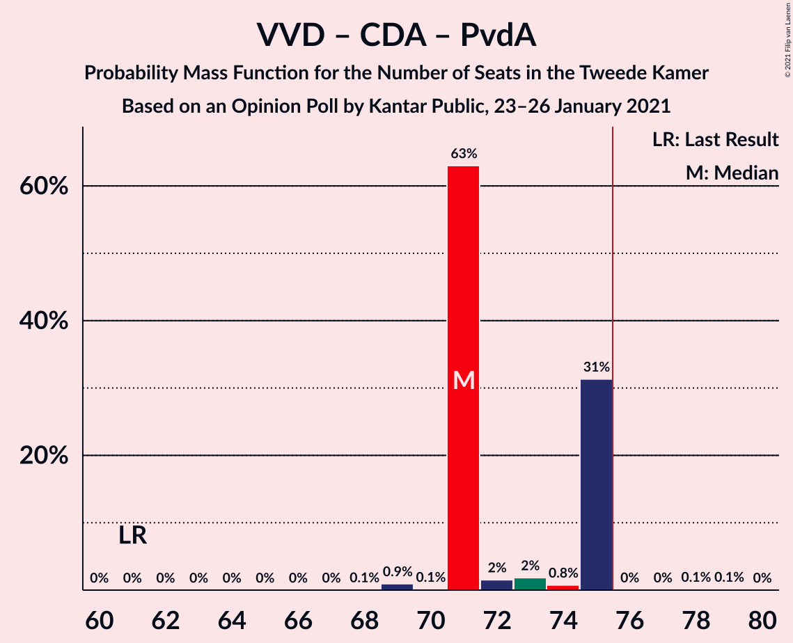

| Number of Seats | Probability | Accumulated | Special Marks |
|:---------------:|:-----------:|:-----------:|:-------------:|
| 61 | 0% | 100% | Last Result |
| 62 | 0% | 100% |  |
| 63 | 0% | 100% |  |
| 64 | 0% | 100% |  |
| 65 | 0% | 100% |  |
| 66 | 0% | 100% |  |
| 67 | 0% | 100% |  |
| 68 | 0% | 100% |  |
| 69 | 1.3% | 99.9% |  |
| 70 | 0.2% | 98.6% |  |
| 71 | 4% | 98% |  |
| 72 | 3% | 95% |  |
| 73 | 5% | 92% |  |
| 74 | 1.3% | 87% |  |
| 75 | 85% | 86% | Median |
| 76 | 0% | 0.2% | Majority |
| 77 | 0.1% | 0.2% |  |
| 78 | 0.1% | 0.1% |  |
| 79 | 0% | 0% |  |

### Volkspartij voor Vrijheid en Democratie – Christen-Democratisch Appèl – 50Plus – Forum voor Democratie – Staatkundig Gereformeerde Partij

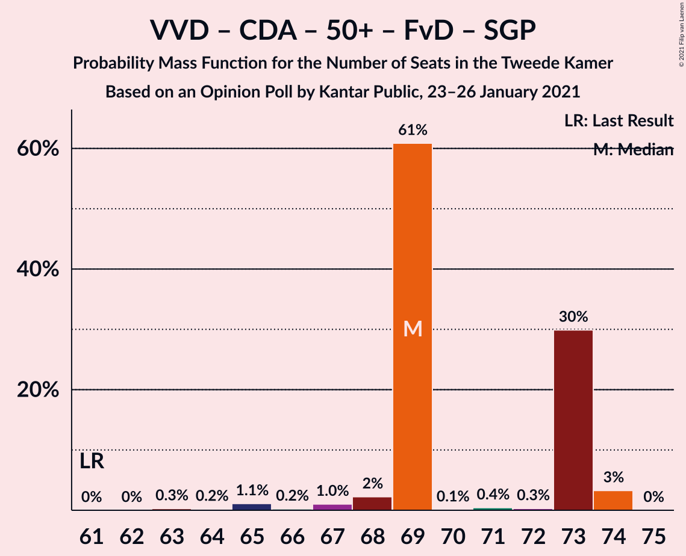

| Number of Seats | Probability | Accumulated | Special Marks |
|:---------------:|:-----------:|:-----------:|:-------------:|
| 61 | 0% | 100% | Last Result |
| 62 | 0% | 100% |  |
| 63 | 0% | 100% |  |
| 64 | 0% | 100% |  |
| 65 | 3% | 99.9% |  |
| 66 | 0.1% | 97% |  |
| 67 | 0.1% | 97% |  |
| 68 | 4% | 97% |  |
| 69 | 1.3% | 92% |  |
| 70 | 0.2% | 91% |  |
| 71 | 1.0% | 91% |  |
| 72 | 0.1% | 90% |  |
| 73 | 81% | 90% | Median |
| 74 | 9% | 9% |  |
| 75 | 0% | 0% |  |

### Volkspartij voor Vrijheid en Democratie – Christen-Democratisch Appèl – Forum voor Democratie – Staatkundig Gereformeerde Partij

| Number of Seats | Probability | Accumulated | Special Marks |
|:---------------:|:-----------:|:-----------:|:-------------:|
| 57 | 0% | 100% | Last Result |
| 58 | 0% | 100% |  |
| 59 | 0% | 100% |  |
| 60 | 0% | 100% |  |
| 61 | 0% | 100% |  |
| 62 | 0% | 99.9% |  |
| 63 | 3% | 99.9% |  |
| 64 | 0.2% | 97% |  |
| 65 | 2% | 97% |  |
| 66 | 4% | 95% |  |
| 67 | 0.2% | 91% |  |
| 68 | 0.8% | 91% |  |
| 69 | 0.2% | 90% |  |
| 70 | 81% | 90% | Median |
| 71 | 9% | 9% |  |
| 72 | 0% | 0% |  |

### Volkspartij voor Vrijheid en Democratie – Democraten 66 – Partij van de Arbeid

| Number of Seats | Probability | Accumulated | Special Marks |
|:---------------:|:-----------:|:-----------:|:-------------:|
| 61 | 0% | 100% | Last Result |
| 62 | 0% | 100% |  |
| 63 | 0% | 100% |  |
| 64 | 3% | 100% |  |
| 65 | 0.1% | 97% |  |
| 66 | 4% | 97% |  |
| 67 | 0.6% | 93% |  |
| 68 | 6% | 92% |  |
| 69 | 5% | 86% |  |
| 70 | 80% | 81% | Median |
| 71 | 0.3% | 1.3% |  |
| 72 | 0.1% | 1.0% |  |
| 73 | 0.8% | 0.9% |  |
| 74 | 0.1% | 0.1% |  |
| 75 | 0% | 0% |  |

### Volkspartij voor Vrijheid en Democratie – Christen-Democratisch Appèl – 50Plus – Forum voor Democratie

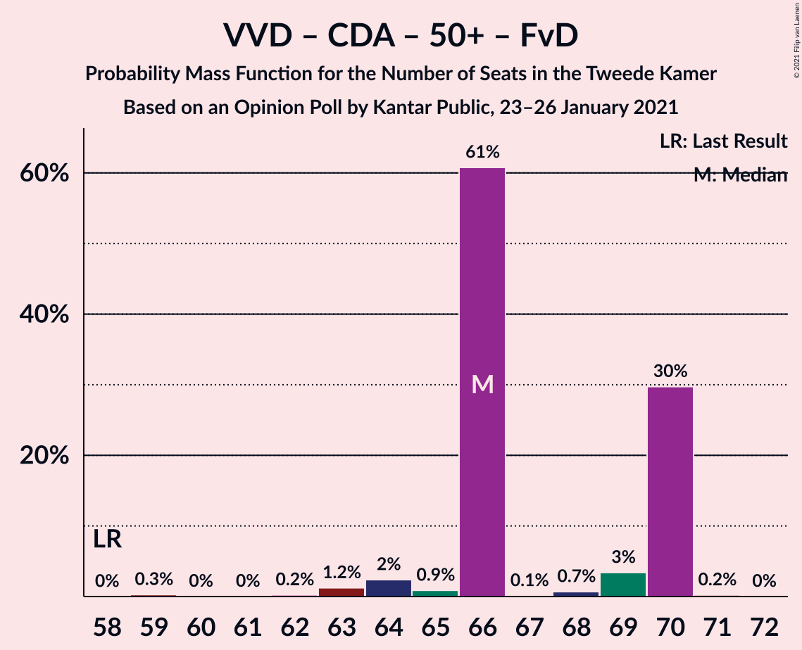

| Number of Seats | Probability | Accumulated | Special Marks |
|:---------------:|:-----------:|:-----------:|:-------------:|
| 58 | 0% | 100% | Last Result |
| 59 | 0% | 100% |  |
| 60 | 0% | 100% |  |
| 61 | 0% | 100% |  |
| 62 | 0% | 99.9% |  |
| 63 | 3% | 99.9% |  |
| 64 | 3% | 97% |  |
| 65 | 2% | 94% |  |
| 66 | 0.8% | 92% |  |
| 67 | 0.2% | 91% |  |
| 68 | 1.4% | 91% |  |
| 69 | 9% | 90% |  |
| 70 | 81% | 81% | Median |
| 71 | 0.1% | 0.2% |  |
| 72 | 0% | 0.1% |  |
| 73 | 0% | 0% |  |

### Volkspartij voor Vrijheid en Democratie – Christen-Democratisch Appèl – Forum voor Democratie

| Number of Seats | Probability | Accumulated | Special Marks |
|:---------------:|:-----------:|:-----------:|:-------------:|
| 54 | 0% | 100% | Last Result |
| 55 | 0% | 100% |  |
| 56 | 0% | 100% |  |
| 57 | 0% | 100% |  |
| 58 | 0% | 100% |  |
| 59 | 0% | 100% |  |
| 60 | 0% | 99.9% |  |
| 61 | 3% | 99.9% |  |
| 62 | 5% | 97% |  |
| 63 | 0.6% | 92% |  |
| 64 | 0.1% | 91% |  |
| 65 | 1.1% | 91% |  |
| 66 | 9% | 90% |  |
| 67 | 81% | 81% | Median |
| 68 | 0.2% | 0.3% |  |
| 69 | 0% | 0% |  |

### Christen-Democratisch Appèl – Democraten 66 – GroenLinks – Partij van de Arbeid – ChristenUnie

| Number of Seats | Probability | Accumulated | Special Marks |
|:---------------:|:-----------:|:-----------:|:-------------:|
| 57 | 2% | 100% |  |
| 58 | 0.2% | 98% |  |
| 59 | 7% | 98% |  |
| 60 | 0.2% | 91% |  |
| 61 | 80% | 91% | Median |
| 62 | 0.7% | 11% |  |
| 63 | 2% | 10% |  |
| 64 | 5% | 8% |  |
| 65 | 3% | 3% |  |
| 66 | 0.1% | 0.3% | Last Result |
| 67 | 0.1% | 0.2% |  |
| 68 | 0% | 0.1% |  |
| 69 | 0% | 0% |  |

### Volkspartij voor Vrijheid en Democratie – Christen-Democratisch Appèl

| Number of Seats | Probability | Accumulated | Special Marks |
|:---------------:|:-----------:|:-----------:|:-------------:|
| 52 | 0% | 100% | Last Result |
| 53 | 0% | 100% |  |
| 54 | 0% | 100% |  |
| 55 | 0% | 100% |  |
| 56 | 0% | 99.9% |  |
| 57 | 0% | 99.9% |  |
| 58 | 0.2% | 99.9% |  |
| 59 | 5% | 99.7% |  |
| 60 | 3% | 95% |  |
| 61 | 0.7% | 92% |  |
| 62 | 0.9% | 91% |  |
| 63 | 9% | 90% |  |
| 64 | 81% | 81% | Median |
| 65 | 0.1% | 0.1% |  |
| 66 | 0% | 0.1% |  |
| 67 | 0% | 0% |  |

### Volkspartij voor Vrijheid en Democratie – Partij van de Arbeid

| Number of Seats | Probability | Accumulated | Special Marks |
|:---------------:|:-----------:|:-----------:|:-------------:|
| 42 | 0% | 100% | Last Result |
| 43 | 0% | 100% |  |
| 44 | 0% | 100% |  |
| 45 | 0% | 100% |  |
| 46 | 0% | 100% |  |
| 47 | 0% | 100% |  |
| 48 | 0% | 100% |  |
| 49 | 0% | 100% |  |
| 50 | 0% | 100% |  |
| 51 | 0.3% | 99.9% |  |
| 52 | 1.3% | 99.6% |  |
| 53 | 3% | 98% |  |
| 54 | 7% | 95% |  |
| 55 | 5% | 88% |  |
| 56 | 0.3% | 82% |  |
| 57 | 81% | 82% | Median |
| 58 | 0.2% | 1.0% |  |
| 59 | 0.1% | 0.8% |  |
| 60 | 0.7% | 0.8% |  |
| 61 | 0% | 0% |  |

### Christen-Democratisch Appèl – Democraten 66 – Partij van de Arbeid

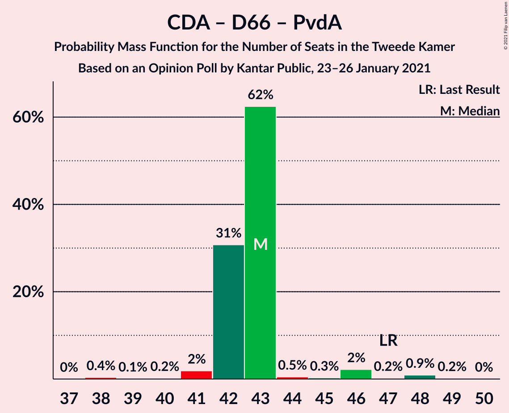

| Number of Seats | Probability | Accumulated | Special Marks |
|:---------------:|:-----------:|:-----------:|:-------------:|
| 38 | 1.0% | 100% |  |
| 39 | 0% | 99.0% |  |
| 40 | 0% | 99.0% |  |
| 41 | 5% | 98.9% |  |
| 42 | 83% | 94% | Median |
| 43 | 5% | 11% |  |
| 44 | 0.7% | 7% |  |
| 45 | 0.2% | 6% |  |
| 46 | 5% | 6% |  |
| 47 | 0.2% | 0.4% | Last Result |
| 48 | 0.1% | 0.2% |  |
| 49 | 0.1% | 0.1% |  |
| 50 | 0.1% | 0.1% |  |
| 51 | 0% | 0% |  |

### Christen-Democratisch Appèl – Partij van de Arbeid – ChristenUnie

| Number of Seats | Probability | Accumulated | Special Marks |
|:---------------:|:-----------:|:-----------:|:-------------:|
| 31 | 4% | 100% |  |
| 32 | 0% | 96% |  |
| 33 | 7% | 96% | Last Result |
| 34 | 0.3% | 89% |  |
| 35 | 81% | 89% | Median |
| 36 | 5% | 8% |  |
| 37 | 0.2% | 3% |  |
| 38 | 3% | 3% |  |
| 39 | 0.1% | 0.1% |  |
| 40 | 0% | 0% |  |

### Christen-Democratisch Appèl – Democraten 66

| Number of Seats | Probability | Accumulated | Special Marks |
|:---------------:|:-----------:|:-----------:|:-------------:|
| 27 | 0.1% | 100% |  |
| 28 | 2% | 99.9% |  |
| 29 | 0.1% | 98% |  |
| 30 | 3% | 98% |  |
| 31 | 87% | 95% | Median |
| 32 | 0.7% | 8% |  |
| 33 | 2% | 7% |  |
| 34 | 5% | 5% |  |
| 35 | 0.1% | 0.3% |  |
| 36 | 0.2% | 0.2% |  |
| 37 | 0% | 0.1% |  |
| 38 | 0% | 0% | Last Result |

### Christen-Democratisch Appèl – Partij van de Arbeid

| Number of Seats | Probability | Accumulated | Special Marks |
|:---------------:|:-----------:|:-----------:|:-------------:|
| 26 | 0% | 100% |  |
| 27 | 2% | 99.9% |  |
| 28 | 4% | 98% | Last Result |
| 29 | 84% | 94% | Median |
| 30 | 1.5% | 10% |  |
| 31 | 0.3% | 8% |  |
| 32 | 8% | 8% |  |
| 33 | 0.1% | 0.3% |  |
| 34 | 0.1% | 0.2% |  |
| 35 | 0% | 0% |  |

## Technical Information

### Opinion Poll

+ **Polling firm:** Kantar Public
+ **Commissioner(s):** —
+ **Fieldwork period:** 23–26 January 2021

### Calculations

+ **Sample size:** 1203
+ **Simulations done:** 524,288
+ **Error estimate:** 2.58%

