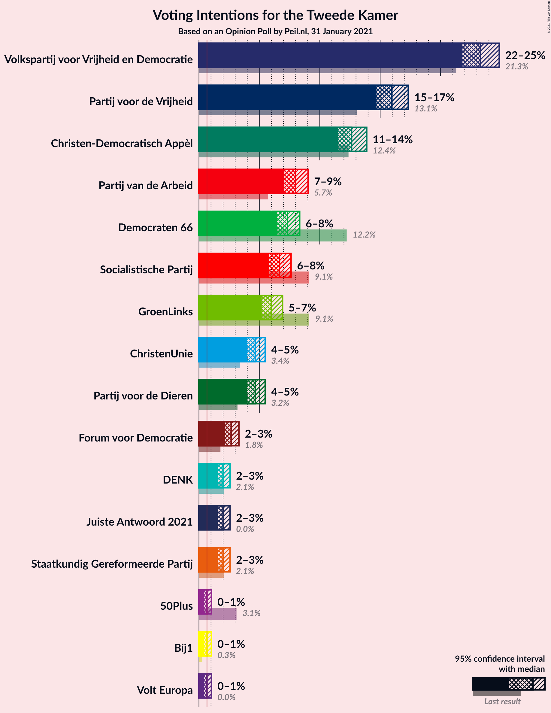
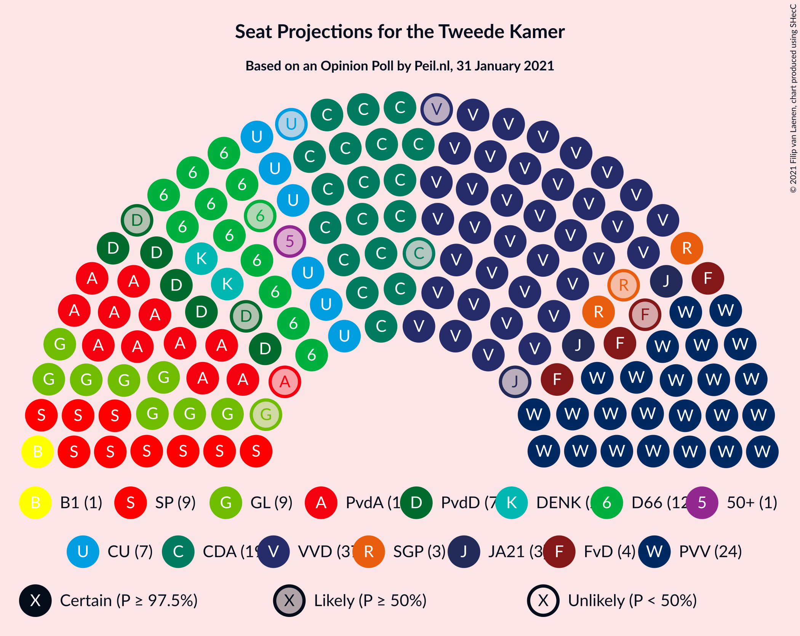
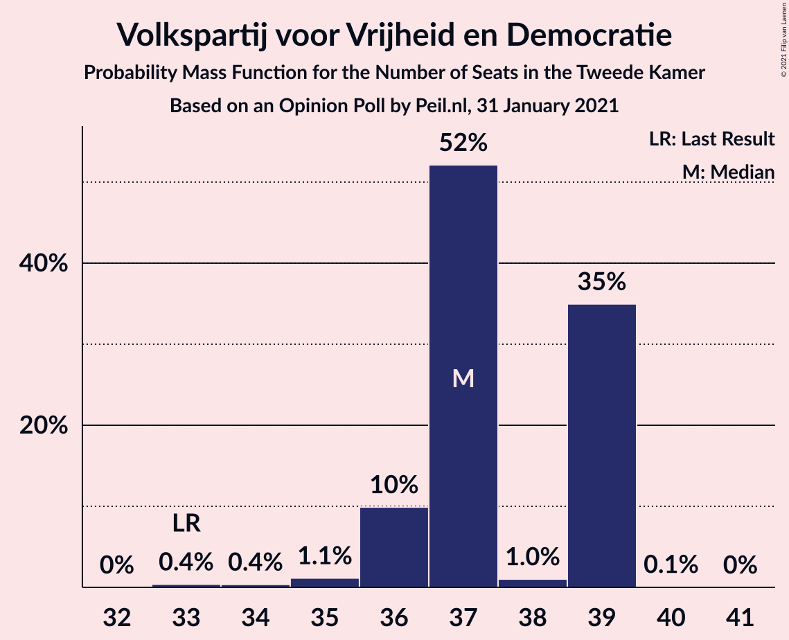
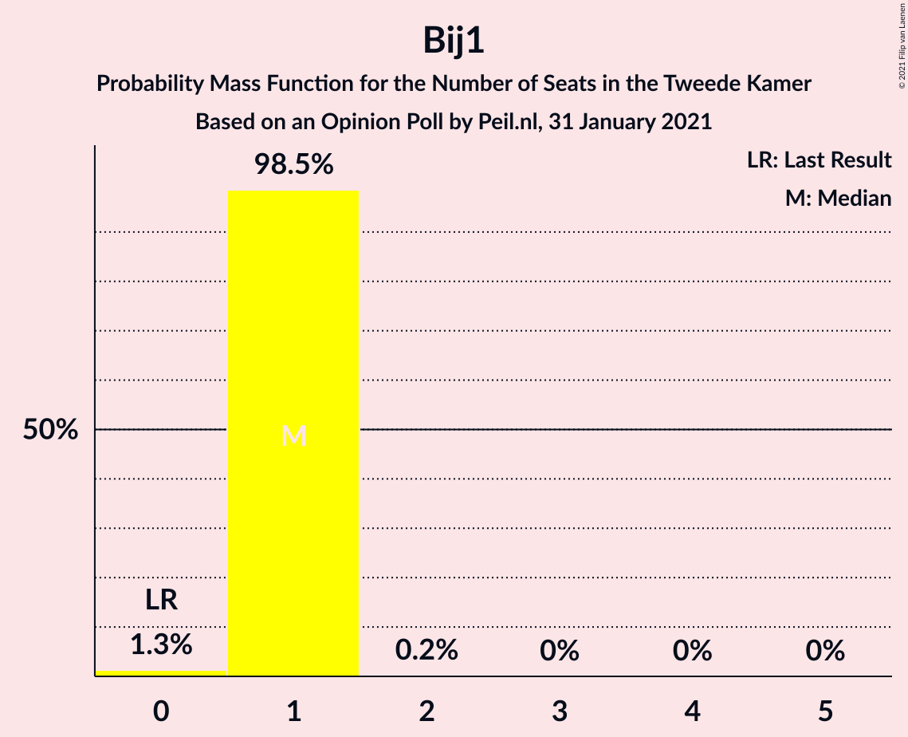
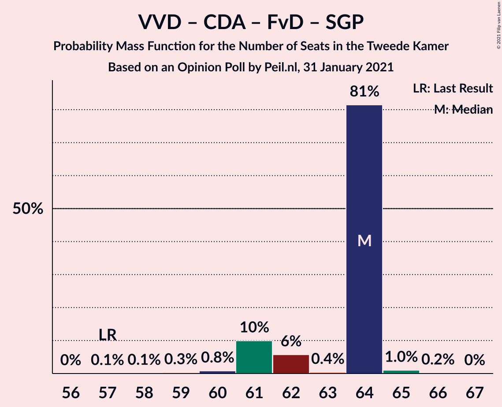
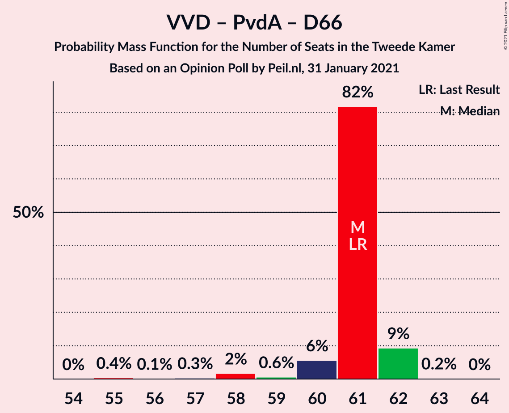
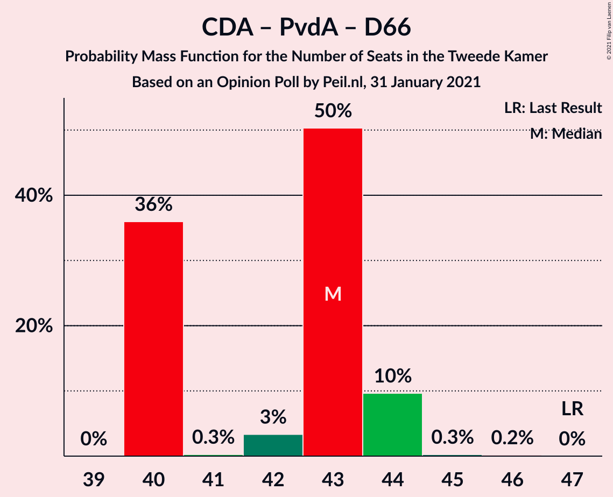

# Opinion Poll by Peil.nl, 31 January 2021

<a href="#voting-intentions">Voting Intentions</a> | <a href="#seats">Seats</a> | <a href="#coalitions">Coalitions</a> | <a href="#technical-information">Technical Information</a>

## Voting Intentions

### Confidence Intervals

| Party | Last Result | Poll Result | 80% Confidence Interval | 90% Confidence Interval | 95% Confidence Interval | 99% Confidence Interval |
|:-----:|:-----------:|:-----------:|:-----------------------:|:-----------------------:|:-----------------------:|:-----------------------:|
| Volkspartij voor Vrijheid en Democratie | 21.3% | 23.3% | 22.4–24.4% |22.1–24.6% |21.8–24.9% |21.4–25.4% |
| Partij voor de Vrijheid | 13.1% | 16.0% | 15.2–16.9% |14.9–17.1% |14.7–17.4% |14.3–17.8% |
| Christen-Democratisch Appèl | 12.4% | 12.7% | 11.9–13.5% |11.7–13.7% |11.5–13.9% |11.2–14.3% |
| Partij van de Arbeid | 5.7% | 8.0% | 7.4–8.7% |7.2–8.9% |7.1–9.0% |6.8–9.4% |
| Democraten 66 | 12.2% | 7.3% | 6.8–8.0% |6.6–8.2% |6.4–8.3% |6.2–8.6% |
| Socialistische Partij | 9.1% | 6.7% | 6.1–7.3% |6.0–7.5% |5.8–7.6% |5.6–7.9% |
| GroenLinks | 9.1% | 6.0% | 5.5–6.6% |5.3–6.8% |5.2–6.9% |5.0–7.2% |
| ChristenUnie | 3.4% | 4.7% | 4.2–5.2% |4.1–5.3% |4.0–5.5% |3.7–5.8% |
| Partij voor de Dieren | 3.2% | 4.7% | 4.2–5.2% |4.1–5.3% |4.0–5.5% |3.7–5.8% |
| Forum voor Democratie | 1.8% | 2.7% | 2.3–3.1% |2.2–3.2% |2.1–3.3% |2.0–3.5% |
| Staatkundig Gereformeerde Partij | 2.1% | 2.0% | 1.7–2.4% |1.6–2.5% |1.6–2.6% |1.4–2.8% |
| DENK | 2.1% | 2.0% | 1.7–2.4% |1.6–2.5% |1.6–2.6% |1.4–2.8% |
| Juiste Antwoord 2021 | 0.0% | 2.0% | 1.7–2.4% |1.6–2.5% |1.6–2.6% |1.4–2.8% |
| 50Plus | 3.1% | 0.7% | 0.5–0.9% |0.5–1.0% |0.4–1.0% |0.4–1.2% |
| Bij1 | 0.3% | 0.7% | 0.5–0.9% |0.5–1.0% |0.4–1.0% |0.4–1.2% |

*Note:* The poll result column reflects the actual value used in the calculations. Published results may vary slightly, and in addition be rounded to fewer digits.

## Seats

### Confidence Intervals

| Party | Last Result | Median | 80% Confidence Interval | 90% Confidence Interval | 95% Confidence Interval | 99% Confidence Interval |
|:-----:|:-----------:|:------:|:-----------------------:|:-----------------------:|:-----------------------:|:-----------------------:|
| <a href="#volkspartij-voor-vrijheid-en-democratie">Volkspartij voor Vrijheid en Democratie</a> | 33 | 38 | 35–38 |35–39 |35–39 |34–39 |
| <a href="#partij-voor-de-vrijheid">Partij voor de Vrijheid</a> | 20 | 27 | 23–27 |23–27 |23–27 |22–28 |
| <a href="#christen-democratisch-appèl">Christen-Democratisch Appèl</a> | 19 | 19 | 18–21 |18–22 |18–23 |17–23 |
| <a href="#partij-van-de-arbeid">Partij van de Arbeid</a> | 9 | 11 | 11–12 |11–14 |11–14 |10–14 |
| <a href="#democraten-66">Democraten 66</a> | 19 | 11 | 9–13 |9–13 |9–13 |9–13 |
| <a href="#socialistische-partij">Socialistische Partij</a> | 14 | 9 | 9–11 |9–11 |9–11 |8–12 |
| <a href="#groenlinks">GroenLinks</a> | 14 | 8 | 8–10 |8–10 |8–12 |7–12 |
| <a href="#christenunie">ChristenUnie</a> | 5 | 6 | 6–7 |6–8 |6–8 |6–9 |
| <a href="#partij-voor-de-dieren">Partij voor de Dieren</a> | 5 | 6 | 6–8 |6–8 |6–8 |5–9 |
| <a href="#forum-voor-democratie">Forum voor Democratie</a> | 2 | 5 | 3–5 |3–5 |3–5 |3–5 |
| <a href="#staatkundig-gereformeerde-partij">Staatkundig Gereformeerde Partij</a> | 3 | 3 | 2–3 |2–4 |2–4 |2–4 |
| <a href="#denk">DENK</a> | 3 | 3 | 3 |2–3 |2–3 |2–4 |
| <a href="#juiste-antwoord-2021">Juiste Antwoord 2021</a> | 0 | 3 | 2–3 |2–4 |2–4 |2–4 |
| <a href="#50plus">50Plus</a> | 4 | 0 | 0–1 |0–1 |0–1 |0–1 |
| <a href="#bij1">Bij1</a> | 0 | 0 | 0–1 |0–1 |0–1 |0–2 |

### Volkspartij voor Vrijheid en Democratie

*For a full overview of the results for this party, see the [Volkspartij voor Vrijheid en Democratie](party-volkspartijvoorvrijheidendemocratie.html) page.*

| Number of Seats | Probability | Accumulated | Special Marks |
|:---------------:|:-----------:|:-----------:|:-------------:|
| 33 | 0.2% | 100% | Last Result |
| 34 | 1.3% | 99.8% |  |
| 35 | 14% | 98% |  |
| 36 | 31% | 85% |  |
| 37 | 3% | 54% |  |
| 38 | 45% | 51% | Median |
| 39 | 5% | 6% |  |
| 40 | 0.2% | 0.5% |  |
| 41 | 0.1% | 0.2% |  |
| 42 | 0.1% | 0.1% |  |
| 43 | 0% | 0% |  |

### Partij voor de Vrijheid

*For a full overview of the results for this party, see the [Partij voor de Vrijheid](party-partijvoordevrijheid.html) page.*

| Number of Seats | Probability | Accumulated | Special Marks |
|:---------------:|:-----------:|:-----------:|:-------------:|
| 20 | 0% | 100% | Last Result |
| 21 | 0.1% | 100% |  |
| 22 | 2% | 99.9% |  |
| 23 | 22% | 98% |  |
| 24 | 18% | 77% |  |
| 25 | 6% | 59% |  |
| 26 | 3% | 53% |  |
| 27 | 50% | 50% | Median |
| 28 | 0.5% | 0.5% |  |
| 29 | 0% | 0% |  |

### Christen-Democratisch Appèl

*For a full overview of the results for this party, see the [Christen-Democratisch Appèl](party-christen-democratischappèl.html) page.*

| Number of Seats | Probability | Accumulated | Special Marks |
|:---------------:|:-----------:|:-----------:|:-------------:|
| 16 | 0.2% | 100% |  |
| 17 | 0.9% | 99.8% |  |
| 18 | 9% | 98.9% |  |
| 19 | 55% | 89% | Last Result, Median |
| 20 | 18% | 35% |  |
| 21 | 11% | 17% |  |
| 22 | 2% | 6% |  |
| 23 | 4% | 4% |  |
| 24 | 0% | 0% |  |

### Partij van de Arbeid

*For a full overview of the results for this party, see the [Partij van de Arbeid](party-partijvandearbeid.html) page.*

| Number of Seats | Probability | Accumulated | Special Marks |
|:---------------:|:-----------:|:-----------:|:-------------:|
| 9 | 0% | 100% | Last Result |
| 10 | 1.3% | 100% |  |
| 11 | 51% | 98.7% | Median |
| 12 | 38% | 47% |  |
| 13 | 3% | 10% |  |
| 14 | 7% | 7% |  |
| 15 | 0.1% | 0.1% |  |
| 16 | 0% | 0% |  |

### Democraten 66

*For a full overview of the results for this party, see the [Democraten 66](party-democraten66.html) page.*

| Number of Seats | Probability | Accumulated | Special Marks |
|:---------------:|:-----------:|:-----------:|:-------------:|
| 9 | 10% | 100% |  |
| 10 | 16% | 90% |  |
| 11 | 57% | 74% | Median |
| 12 | 4% | 17% |  |
| 13 | 13% | 13% |  |
| 14 | 0% | 0% |  |
| 15 | 0% | 0% |  |
| 16 | 0% | 0% |  |
| 17 | 0% | 0% |  |
| 18 | 0% | 0% |  |
| 19 | 0% | 0% | Last Result |

### Socialistische Partij

*For a full overview of the results for this party, see the [Socialistische Partij](party-socialistischepartij.html) page.*

| Number of Seats | Probability | Accumulated | Special Marks |
|:---------------:|:-----------:|:-----------:|:-------------:|
| 8 | 2% | 100% |  |
| 9 | 61% | 98% | Median |
| 10 | 22% | 36% |  |
| 11 | 14% | 15% |  |
| 12 | 1.2% | 1.3% |  |
| 13 | 0.1% | 0.1% |  |
| 14 | 0% | 0% | Last Result |

### GroenLinks

*For a full overview of the results for this party, see the [GroenLinks](party-groenlinks.html) page.*

| Number of Seats | Probability | Accumulated | Special Marks |
|:---------------:|:-----------:|:-----------:|:-------------:|
| 7 | 1.2% | 100% |  |
| 8 | 54% | 98.8% | Median |
| 9 | 19% | 45% |  |
| 10 | 23% | 26% |  |
| 11 | 0.1% | 3% |  |
| 12 | 3% | 3% |  |
| 13 | 0% | 0% |  |
| 14 | 0% | 0% | Last Result |

### ChristenUnie

*For a full overview of the results for this party, see the [ChristenUnie](party-christenunie.html) page.*

| Number of Seats | Probability | Accumulated | Special Marks |
|:---------------:|:-----------:|:-----------:|:-------------:|
| 5 | 0.2% | 100% | Last Result |
| 6 | 56% | 99.8% | Median |
| 7 | 34% | 44% |  |
| 8 | 9% | 9% |  |
| 9 | 0.5% | 0.5% |  |
| 10 | 0% | 0% |  |

### Partij voor de Dieren

*For a full overview of the results for this party, see the [Partij voor de Dieren](party-partijvoordedieren.html) page.*

| Number of Seats | Probability | Accumulated | Special Marks |
|:---------------:|:-----------:|:-----------:|:-------------:|
| 5 | 0.7% | 100% | Last Result |
| 6 | 52% | 99.3% | Median |
| 7 | 34% | 48% |  |
| 8 | 13% | 14% |  |
| 9 | 0.5% | 0.5% |  |
| 10 | 0% | 0% |  |

### Forum voor Democratie

*For a full overview of the results for this party, see the [Forum voor Democratie](party-forumvoordemocratie.html) page.*

| Number of Seats | Probability | Accumulated | Special Marks |
|:---------------:|:-----------:|:-----------:|:-------------:|
| 2 | 0.1% | 100% | Last Result |
| 3 | 10% | 99.9% |  |
| 4 | 36% | 90% |  |
| 5 | 54% | 54% | Median |
| 6 | 0.4% | 0.4% |  |
| 7 | 0% | 0% |  |

### Staatkundig Gereformeerde Partij

*For a full overview of the results for this party, see the [Staatkundig Gereformeerde Partij](party-staatkundiggereformeerdepartij.html) page.*

| Number of Seats | Probability | Accumulated | Special Marks |
|:---------------:|:-----------:|:-----------:|:-------------:|
| 2 | 27% | 100% |  |
| 3 | 67% | 73% | Last Result, Median |
| 4 | 6% | 6% |  |
| 5 | 0% | 0% |  |

### DENK

*For a full overview of the results for this party, see the [DENK](party-denk.html) page.*

| Number of Seats | Probability | Accumulated | Special Marks |
|:---------------:|:-----------:|:-----------:|:-------------:|
| 1 | 0.1% | 100% |  |
| 2 | 8% | 99.9% |  |
| 3 | 90% | 91% | Last Result, Median |
| 4 | 0.9% | 0.9% |  |
| 5 | 0% | 0% |  |

### Juiste Antwoord 2021

*For a full overview of the results for this party, see the [Juiste Antwoord 2021](party-juisteantwoord2021.html) page.*

| Number of Seats | Probability | Accumulated | Special Marks |
|:---------------:|:-----------:|:-----------:|:-------------:|
| 0 | 0% | 100% | Last Result |
| 1 | 0% | 100% |  |
| 2 | 10% | 100% |  |
| 3 | 81% | 90% | Median |
| 4 | 9% | 9% |  |
| 5 | 0% | 0% |  |

### 50Plus

*For a full overview of the results for this party, see the [50Plus](party-50plus.html) page.*

| Number of Seats | Probability | Accumulated | Special Marks |
|:---------------:|:-----------:|:-----------:|:-------------:|
| 0 | 79% | 100% | Median |
| 1 | 21% | 21% |  |
| 2 | 0.1% | 0.1% |  |
| 3 | 0% | 0% |  |
| 4 | 0% | 0% | Last Result |

### Bij1

*For a full overview of the results for this party, see the [Bij1](party-bij1.html) page.*

| Number of Seats | Probability | Accumulated | Special Marks |
|:---------------:|:-----------:|:-----------:|:-------------:|
| 0 | 85% | 100% | Last Result, Median |
| 1 | 14% | 15% |  |
| 2 | 1.1% | 1.1% |  |
| 3 | 0% | 0% |  |

## Coalitions

### Confidence Intervals

| Coalition | Last Result | Median | Majority? | 80% Confidence Interval | 90% Confidence Interval | 95% Confidence Interval | 99% Confidence Interval |
|:---------:|:-----------:|:------:|:---------:|:-----------------------:|:-----------------------:|:-----------------------:|:-----------------------:|
| Volkspartij voor Vrijheid en Democratie – Partij voor de Vrijheid – Christen-Democratisch Appèl – Forum voor Democratie – Staatkundig Gereformeerde Partij | 77 | 91 | 100% | 85–92 | 84–92 | 84–92 | 82–92 |
| Volkspartij voor Vrijheid en Democratie – Christen-Democratisch Appèl – Partij van de Arbeid – Democraten 66 – ChristenUnie | 85 | 85 | 100% | 83–89 | 83–89 | 83–89 | 82–89 |
| Volkspartij voor Vrijheid en Democratie – Partij voor de Vrijheid – Christen-Democratisch Appèl – Forum voor Democratie | 74 | 88 | 100% | 82–89 | 82–89 | 81–89 | 80–89 |
| Volkspartij voor Vrijheid en Democratie – Christen-Democratisch Appèl – Democraten 66 – GroenLinks – ChristenUnie | 90 | 82 | 100% | 81–86 | 81–86 | 81–86 | 80–86 |
| Volkspartij voor Vrijheid en Democratie – Partij voor de Vrijheid – Christen-Democratisch Appèl | 72 | 84 | 100% | 79–84 | 78–84 | 78–84 | 77–85 |
| Volkspartij voor Vrijheid en Democratie – Christen-Democratisch Appèl – Democraten 66 – ChristenUnie | 76 | 74 | 19% | 72–76 | 72–76 | 71–77 | 71–77 |
| Volkspartij voor Vrijheid en Democratie – Christen-Democratisch Appèl – Partij van de Arbeid | 61 | 68 | 0% | 66–70 | 65–71 | 65–71 | 65–71 |
| Christen-Democratisch Appèl – Partij van de Arbeid – Democraten 66 – Socialistische Partij – GroenLinks – ChristenUnie | 80 | 67 | 0% | 64–71 | 64–71 | 64–71 | 64–72 |
| Volkspartij voor Vrijheid en Democratie – Christen-Democratisch Appèl – Democraten 66 | 71 | 68 | 0% | 65–69 | 65–69 | 65–70 | 64–70 |
| Volkspartij voor Vrijheid en Democratie – Christen-Democratisch Appèl – Forum voor Democratie – Staatkundig Gereformeerde Partij – 50Plus | 61 | 65 | 0% | 61–65 | 60–65 | 60–65 | 59–67 |
| Volkspartij voor Vrijheid en Democratie – Christen-Democratisch Appèl – Forum voor Democratie – Staatkundig Gereformeerde Partij | 57 | 64 | 0% | 60–65 | 60–65 | 60–65 | 58–66 |
| Volkspartij voor Vrijheid en Democratie – Christen-Democratisch Appèl – Forum voor Democratie – 50Plus | 58 | 62 | 0% | 58–63 | 58–63 | 58–63 | 56–64 |
| Volkspartij voor Vrijheid en Democratie – Christen-Democratisch Appèl – Forum voor Democratie | 54 | 62 | 0% | 58–62 | 58–63 | 58–63 | 56–63 |
| Volkspartij voor Vrijheid en Democratie – Partij van de Arbeid – Democraten 66 | 61 | 60 | 0% | 57–61 | 57–63 | 57–63 | 55–63 |
| Christen-Democratisch Appèl – Partij van de Arbeid – Democraten 66 – GroenLinks – ChristenUnie | 66 | 57 | 0% | 55–62 | 55–62 | 55–62 | 55–62 |
| Volkspartij voor Vrijheid en Democratie – Christen-Democratisch Appèl | 52 | 57 | 0% | 54–57 | 54–59 | 54–59 | 53–59 |
| Volkspartij voor Vrijheid en Democratie – Partij van de Arbeid | 42 | 49 | 0% | 47–50 | 46–52 | 46–53 | 45–53 |
| Christen-Democratisch Appèl – Partij van de Arbeid – Democraten 66 | 47 | 41 | 0% | 41–45 | 41–46 | 40–47 | 40–47 |
| Christen-Democratisch Appèl – Partij van de Arbeid – ChristenUnie | 33 | 37 | 0% | 36–40 | 36–42 | 36–42 | 34–42 |
| Christen-Democratisch Appèl – Partij van de Arbeid | 28 | 30 | 0% | 30–33 | 30–35 | 30–35 | 28–35 |
| Christen-Democratisch Appèl – Democraten 66 | 38 | 30 | 0% | 29–33 | 28–34 | 28–34 | 28–34 |

### Volkspartij voor Vrijheid en Democratie – Partij voor de Vrijheid – Christen-Democratisch Appèl – Forum voor Democratie – Staatkundig Gereformeerde Partij

| Number of Seats | Probability | Accumulated | Special Marks |
|:---------------:|:-----------:|:-----------:|:-------------:|
| 77 | 0% | 100% | Last Result |
| 78 | 0% | 100% |  |
| 79 | 0% | 100% |  |
| 80 | 0% | 100% |  |
| 81 | 0% | 100% |  |
| 82 | 1.4% | 100% |  |
| 83 | 0.6% | 98.6% |  |
| 84 | 7% | 98% |  |
| 85 | 5% | 91% |  |
| 86 | 15% | 86% |  |
| 87 | 11% | 72% |  |
| 88 | 3% | 60% |  |
| 89 | 6% | 57% |  |
| 90 | 0.5% | 51% |  |
| 91 | 10% | 50% |  |
| 92 | 40% | 41% | Median |
| 93 | 0% | 0.2% |  |
| 94 | 0.2% | 0.2% |  |
| 95 | 0% | 0% |  |

### Volkspartij voor Vrijheid en Democratie – Christen-Democratisch Appèl – Partij van de Arbeid – Democraten 66 – ChristenUnie

| Number of Seats | Probability | Accumulated | Special Marks |
|:---------------:|:-----------:|:-----------:|:-------------:|
| 81 | 0.2% | 100% |  |
| 82 | 1.2% | 99.8% |  |
| 83 | 10% | 98.6% |  |
| 84 | 11% | 89% |  |
| 85 | 48% | 78% | Last Result, Median |
| 86 | 3% | 29% |  |
| 87 | 3% | 27% |  |
| 88 | 14% | 24% |  |
| 89 | 10% | 10% |  |
| 90 | 0% | 0.2% |  |
| 91 | 0.2% | 0.2% |  |
| 92 | 0% | 0% |  |

### Volkspartij voor Vrijheid en Democratie – Partij voor de Vrijheid – Christen-Democratisch Appèl – Forum voor Democratie

| Number of Seats | Probability | Accumulated | Special Marks |
|:---------------:|:-----------:|:-----------:|:-------------:|
| 74 | 0% | 100% | Last Result |
| 75 | 0% | 100% |  |
| 76 | 0% | 100% | Majority |
| 77 | 0% | 100% |  |
| 78 | 0% | 100% |  |
| 79 | 0% | 100% |  |
| 80 | 1.4% | 100% |  |
| 81 | 1.0% | 98.5% |  |
| 82 | 11% | 97% |  |
| 83 | 16% | 86% |  |
| 84 | 10% | 70% |  |
| 85 | 2% | 60% |  |
| 86 | 3% | 58% |  |
| 87 | 4% | 55% |  |
| 88 | 0.4% | 50% |  |
| 89 | 50% | 50% | Median |
| 90 | 0.4% | 0.4% |  |
| 91 | 0% | 0% |  |

### Volkspartij voor Vrijheid en Democratie – Christen-Democratisch Appèl – Democraten 66 – GroenLinks – ChristenUnie

| Number of Seats | Probability | Accumulated | Special Marks |
|:---------------:|:-----------:|:-----------:|:-------------:|
| 78 | 0.1% | 100% |  |
| 79 | 0.4% | 99.9% |  |
| 80 | 2% | 99.5% |  |
| 81 | 14% | 98% |  |
| 82 | 49% | 84% | Median |
| 83 | 16% | 36% |  |
| 84 | 4% | 20% |  |
| 85 | 0.7% | 16% |  |
| 86 | 15% | 16% |  |
| 87 | 0.2% | 0.2% |  |
| 88 | 0% | 0% |  |
| 89 | 0% | 0% |  |
| 90 | 0% | 0% | Last Result |

### Volkspartij voor Vrijheid en Democratie – Partij voor de Vrijheid – Christen-Democratisch Appèl

| Number of Seats | Probability | Accumulated | Special Marks |
|:---------------:|:-----------:|:-----------:|:-------------:|
| 72 | 0% | 100% | Last Result |
| 73 | 0% | 100% |  |
| 74 | 0% | 100% |  |
| 75 | 0% | 100% |  |
| 76 | 0.2% | 100% | Majority |
| 77 | 2% | 99.8% |  |
| 78 | 7% | 98% |  |
| 79 | 24% | 91% |  |
| 80 | 7% | 67% |  |
| 81 | 0.9% | 60% |  |
| 82 | 3% | 59% |  |
| 83 | 6% | 56% |  |
| 84 | 50% | 50% | Median |
| 85 | 0.2% | 0.6% |  |
| 86 | 0.4% | 0.4% |  |
| 87 | 0% | 0% |  |

### Volkspartij voor Vrijheid en Democratie – Christen-Democratisch Appèl – Democraten 66 – ChristenUnie

| Number of Seats | Probability | Accumulated | Special Marks |
|:---------------:|:-----------:|:-----------:|:-------------:|
| 69 | 0.2% | 100% |  |
| 70 | 0.2% | 99.8% |  |
| 71 | 4% | 99.6% |  |
| 72 | 17% | 95% |  |
| 73 | 8% | 78% |  |
| 74 | 43% | 70% | Median |
| 75 | 8% | 27% |  |
| 76 | 14% | 19% | Last Result, Majority |
| 77 | 4% | 4% |  |
| 78 | 0% | 0.2% |  |
| 79 | 0.2% | 0.2% |  |
| 80 | 0% | 0% |  |

### Volkspartij voor Vrijheid en Democratie – Christen-Democratisch Appèl – Partij van de Arbeid

| Number of Seats | Probability | Accumulated | Special Marks |
|:---------------:|:-----------:|:-----------:|:-------------:|
| 61 | 0% | 100% | Last Result |
| 62 | 0% | 100% |  |
| 63 | 0.1% | 100% |  |
| 64 | 0.3% | 99.9% |  |
| 65 | 9% | 99.6% |  |
| 66 | 4% | 91% |  |
| 67 | 5% | 87% |  |
| 68 | 56% | 82% | Median |
| 69 | 12% | 26% |  |
| 70 | 4% | 13% |  |
| 71 | 9% | 9% |  |
| 72 | 0.2% | 0.2% |  |
| 73 | 0.1% | 0.1% |  |
| 74 | 0% | 0% |  |

### Christen-Democratisch Appèl – Partij van de Arbeid – Democraten 66 – Socialistische Partij – GroenLinks – ChristenUnie

| Number of Seats | Probability | Accumulated | Special Marks |
|:---------------:|:-----------:|:-----------:|:-------------:|
| 64 | 40% | 100% | Median |
| 65 | 0.5% | 60% |  |
| 66 | 1.2% | 59% |  |
| 67 | 20% | 58% |  |
| 68 | 5% | 38% |  |
| 69 | 13% | 33% |  |
| 70 | 2% | 20% |  |
| 71 | 16% | 18% |  |
| 72 | 2% | 2% |  |
| 73 | 0.1% | 0.1% |  |
| 74 | 0% | 0% |  |
| 75 | 0% | 0% |  |
| 76 | 0% | 0% | Majority |
| 77 | 0% | 0% |  |
| 78 | 0% | 0% |  |
| 79 | 0% | 0% |  |
| 80 | 0% | 0% | Last Result |

### Volkspartij voor Vrijheid en Democratie – Christen-Democratisch Appèl – Democraten 66

| Number of Seats | Probability | Accumulated | Special Marks |
|:---------------:|:-----------:|:-----------:|:-------------:|
| 62 | 0.1% | 100% |  |
| 63 | 0.3% | 99.9% |  |
| 64 | 1.0% | 99.6% |  |
| 65 | 13% | 98.6% |  |
| 66 | 16% | 86% |  |
| 67 | 7% | 70% |  |
| 68 | 45% | 63% | Median |
| 69 | 13% | 18% |  |
| 70 | 5% | 5% |  |
| 71 | 0% | 0.2% | Last Result |
| 72 | 0.2% | 0.2% |  |
| 73 | 0% | 0% |  |

### Volkspartij voor Vrijheid en Democratie – Christen-Democratisch Appèl – Forum voor Democratie – Staatkundig Gereformeerde Partij – 50Plus

| Number of Seats | Probability | Accumulated | Special Marks |
|:---------------:|:-----------:|:-----------:|:-------------:|
| 58 | 0.4% | 100% |  |
| 59 | 0.1% | 99.5% |  |
| 60 | 9% | 99.4% |  |
| 61 | 4% | 91% | Last Result |
| 62 | 4% | 87% |  |
| 63 | 15% | 83% |  |
| 64 | 9% | 68% |  |
| 65 | 57% | 59% | Median |
| 66 | 1.0% | 2% |  |
| 67 | 0.6% | 0.9% |  |
| 68 | 0.3% | 0.3% |  |
| 69 | 0% | 0% |  |

### Volkspartij voor Vrijheid en Democratie – Christen-Democratisch Appèl – Forum voor Democratie – Staatkundig Gereformeerde Partij

| Number of Seats | Probability | Accumulated | Special Marks |
|:---------------:|:-----------:|:-----------:|:-------------:|
| 57 | 0.2% | 100% | Last Result |
| 58 | 0.3% | 99.8% |  |
| 59 | 0.1% | 99.5% |  |
| 60 | 10% | 99.4% |  |
| 61 | 7% | 90% |  |
| 62 | 1.2% | 83% |  |
| 63 | 15% | 82% |  |
| 64 | 20% | 67% |  |
| 65 | 45% | 46% | Median |
| 66 | 0.6% | 1.0% |  |
| 67 | 0.5% | 0.5% |  |
| 68 | 0% | 0% |  |

### Volkspartij voor Vrijheid en Democratie – Christen-Democratisch Appèl – Forum voor Democratie – 50Plus

| Number of Seats | Probability | Accumulated | Special Marks |
|:---------------:|:-----------:|:-----------:|:-------------:|
| 56 | 0.5% | 100% |  |
| 57 | 0.8% | 99.5% |  |
| 58 | 12% | 98.6% | Last Result |
| 59 | 1.0% | 87% |  |
| 60 | 20% | 86% |  |
| 61 | 10% | 66% |  |
| 62 | 41% | 56% | Median |
| 63 | 15% | 16% |  |
| 64 | 0.6% | 0.9% |  |
| 65 | 0.2% | 0.3% |  |
| 66 | 0.1% | 0.1% |  |
| 67 | 0% | 0% |  |

### Volkspartij voor Vrijheid en Democratie – Christen-Democratisch Appèl – Forum voor Democratie

| Number of Seats | Probability | Accumulated | Special Marks |
|:---------------:|:-----------:|:-----------:|:-------------:|
| 54 | 0% | 100% | Last Result |
| 55 | 0.2% | 100% |  |
| 56 | 0.4% | 99.8% |  |
| 57 | 2% | 99.4% |  |
| 58 | 12% | 98% |  |
| 59 | 5% | 86% |  |
| 60 | 19% | 81% |  |
| 61 | 7% | 63% |  |
| 62 | 51% | 56% | Median |
| 63 | 5% | 5% |  |
| 64 | 0.2% | 0.3% |  |
| 65 | 0.1% | 0.1% |  |
| 66 | 0% | 0% |  |

### Volkspartij voor Vrijheid en Democratie – Partij van de Arbeid – Democraten 66

| Number of Seats | Probability | Accumulated | Special Marks |
|:---------------:|:-----------:|:-----------:|:-------------:|
| 55 | 0.9% | 100% |  |
| 56 | 0.2% | 99.1% |  |
| 57 | 18% | 98.8% |  |
| 58 | 7% | 81% |  |
| 59 | 7% | 74% |  |
| 60 | 48% | 67% | Median |
| 61 | 13% | 20% | Last Result |
| 62 | 2% | 7% |  |
| 63 | 5% | 5% |  |
| 64 | 0.1% | 0.2% |  |
| 65 | 0% | 0.1% |  |
| 66 | 0.1% | 0.1% |  |
| 67 | 0% | 0% |  |

### Christen-Democratisch Appèl – Partij van de Arbeid – Democraten 66 – GroenLinks – ChristenUnie

| Number of Seats | Probability | Accumulated | Special Marks |
|:---------------:|:-----------:|:-----------:|:-------------:|
| 54 | 0.2% | 100% |  |
| 55 | 41% | 99.8% | Median |
| 56 | 2% | 59% |  |
| 57 | 17% | 57% |  |
| 58 | 16% | 40% |  |
| 59 | 4% | 24% |  |
| 60 | 0.8% | 20% |  |
| 61 | 0.6% | 19% |  |
| 62 | 18% | 18% |  |
| 63 | 0.1% | 0.1% |  |
| 64 | 0% | 0% |  |
| 65 | 0% | 0% |  |
| 66 | 0% | 0% | Last Result |

### Volkspartij voor Vrijheid en Democratie – Christen-Democratisch Appèl

| Number of Seats | Probability | Accumulated | Special Marks |
|:---------------:|:-----------:|:-----------:|:-------------:|
| 51 | 0.1% | 100% |  |
| 52 | 0.3% | 99.9% | Last Result |
| 53 | 0.4% | 99.6% |  |
| 54 | 12% | 99.1% |  |
| 55 | 6% | 87% |  |
| 56 | 18% | 82% |  |
| 57 | 56% | 64% | Median |
| 58 | 3% | 8% |  |
| 59 | 5% | 5% |  |
| 60 | 0.4% | 0.4% |  |
| 61 | 0.1% | 0.1% |  |
| 62 | 0% | 0% |  |

### Volkspartij voor Vrijheid en Democratie – Partij van de Arbeid

| Number of Seats | Probability | Accumulated | Special Marks |
|:---------------:|:-----------:|:-----------:|:-------------:|
| 42 | 0% | 100% | Last Result |
| 43 | 0% | 100% |  |
| 44 | 0.1% | 100% |  |
| 45 | 1.0% | 99.9% |  |
| 46 | 7% | 98.9% |  |
| 47 | 6% | 92% |  |
| 48 | 32% | 86% |  |
| 49 | 42% | 54% | Median |
| 50 | 5% | 12% |  |
| 51 | 1.0% | 6% |  |
| 52 | 0.3% | 5% |  |
| 53 | 5% | 5% |  |
| 54 | 0.1% | 0.1% |  |
| 55 | 0% | 0% |  |

### Christen-Democratisch Appèl – Partij van de Arbeid – Democraten 66

| Number of Seats | Probability | Accumulated | Special Marks |
|:---------------:|:-----------:|:-----------:|:-------------:|
| 38 | 0.2% | 100% |  |
| 39 | 0.2% | 99.8% |  |
| 40 | 4% | 99.6% |  |
| 41 | 53% | 95% | Median |
| 42 | 20% | 42% |  |
| 43 | 2% | 22% |  |
| 44 | 1.2% | 20% |  |
| 45 | 12% | 19% |  |
| 46 | 4% | 7% |  |
| 47 | 3% | 3% | Last Result |
| 48 | 0% | 0% |  |

### Christen-Democratisch Appèl – Partij van de Arbeid – ChristenUnie

| Number of Seats | Probability | Accumulated | Special Marks |
|:---------------:|:-----------:|:-----------:|:-------------:|
| 33 | 0% | 100% | Last Result |
| 34 | 0.5% | 100% |  |
| 35 | 0.4% | 99.4% |  |
| 36 | 41% | 99.0% | Median |
| 37 | 14% | 58% |  |
| 38 | 4% | 44% |  |
| 39 | 27% | 40% |  |
| 40 | 7% | 13% |  |
| 41 | 0.4% | 6% |  |
| 42 | 6% | 6% |  |
| 43 | 0.1% | 0.1% |  |
| 44 | 0% | 0% |  |

### Christen-Democratisch Appèl – Partij van de Arbeid

| Number of Seats | Probability | Accumulated | Special Marks |
|:---------------:|:-----------:|:-----------:|:-------------:|
| 28 | 0.8% | 100% | Last Result |
| 29 | 1.2% | 99.2% |  |
| 30 | 51% | 98% | Median |
| 31 | 9% | 47% |  |
| 32 | 19% | 37% |  |
| 33 | 11% | 18% |  |
| 34 | 2% | 8% |  |
| 35 | 6% | 6% |  |
| 36 | 0% | 0% |  |

### Christen-Democratisch Appèl – Democraten 66

| Number of Seats | Probability | Accumulated | Special Marks |
|:---------------:|:-----------:|:-----------:|:-------------:|
| 26 | 0.1% | 100% |  |
| 27 | 0.2% | 99.9% |  |
| 28 | 8% | 99.7% |  |
| 29 | 5% | 91% |  |
| 30 | 64% | 87% | Median |
| 31 | 2% | 23% |  |
| 32 | 2% | 20% |  |
| 33 | 13% | 19% |  |
| 34 | 6% | 6% |  |
| 35 | 0% | 0% |  |
| 36 | 0% | 0% |  |
| 37 | 0% | 0% |  |
| 38 | 0% | 0% | Last Result |

## Technical Information

### Opinion Poll

+ **Polling firm:** Peil.nl
+ **Commissioner(s):** —
+ **Fieldwork period:** 31 January 2021

### Calculations

+ **Sample size:** 3000
+ **Simulations done:** 1,048,576
+ **Error estimate:** 2.29%

