# Opinion Poll by Peil.nl, 5–6 February 2021

<a href="#voting-intentions">Voting Intentions</a> | <a href="#seats">Seats</a> | <a href="#coalitions">Coalitions</a> | <a href="#technical-information">Technical Information</a>

## Voting Intentions

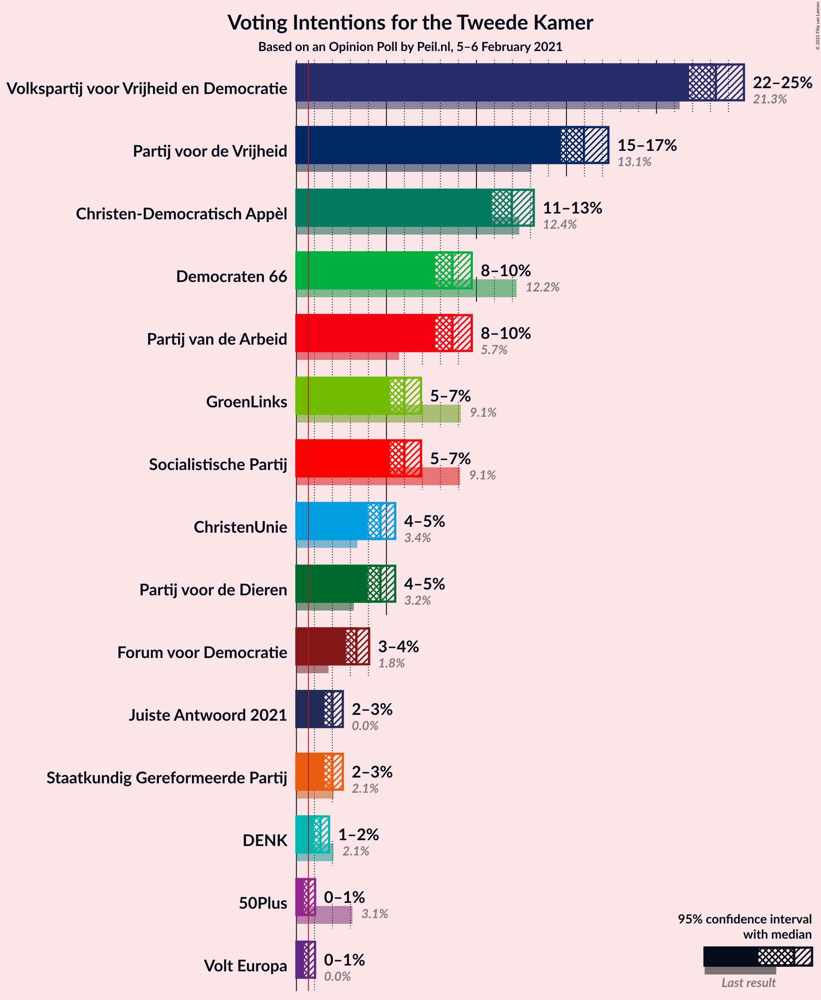

### Confidence Intervals

| Party | Last Result | Poll Result | 80% Confidence Interval | 90% Confidence Interval | 95% Confidence Interval | 99% Confidence Interval |
|:-----:|:-----------:|:-----------:|:-----------------------:|:-----------------------:|:-----------------------:|:-----------------------:|
| Volkspartij voor Vrijheid en Democratie | 21.3% | 23.3% | 22.3–24.3% |22.1–24.6% |21.8–24.9% |21.4–25.3% |
| Partij voor de Vrijheid | 13.1% | 16.0% | 15.1–16.9% |14.9–17.1% |14.7–17.3% |14.3–17.8% |
| Christen-Democratisch Appèl | 12.4% | 12.0% | 11.2–12.8% |11.0–13.0% |10.9–13.2% |10.5–13.6% |
| Democraten 66 | 12.2% | 8.7% | 8.0–9.4% |7.8–9.6% |7.7–9.7% |7.4–10.1% |
| Partij van de Arbeid | 5.7% | 8.7% | 8.0–9.4% |7.8–9.6% |7.7–9.7% |7.4–10.1% |
| GroenLinks | 9.1% | 6.0% | 5.5–6.6% |5.3–6.8% |5.2–6.9% |5.0–7.2% |
| Socialistische Partij | 9.1% | 6.0% | 5.5–6.6% |5.3–6.8% |5.2–6.9% |5.0–7.2% |
| ChristenUnie | 3.4% | 4.7% | 4.2–5.2% |4.1–5.3% |4.0–5.5% |3.7–5.8% |
| Partij voor de Dieren | 3.2% | 4.7% | 4.2–5.2% |4.1–5.3% |4.0–5.5% |3.7–5.8% |
| Forum voor Democratie | 1.8% | 3.3% | 2.9–3.8% |2.8–3.9% |2.7–4.0% |2.6–4.3% |
| Staatkundig Gereformeerde Partij | 2.1% | 2.0% | 1.7–2.4% |1.6–2.5% |1.6–2.6% |1.4–2.8% |
| Juiste Antwoord 2021 | 0.0% | 2.0% | 1.7–2.4% |1.6–2.5% |1.6–2.6% |1.4–2.8% |
| DENK | 2.1% | 1.3% | 1.1–1.6% |1.0–1.7% |1.0–1.8% |0.9–2.0% |
| 50Plus | 3.1% | 0.7% | 0.5–0.9% |0.5–1.0% |0.4–1.0% |0.4–1.2% |
| Volt Europa | 0.0% | 0.7% | 0.5–0.9% |0.5–1.0% |0.4–1.0% |0.4–1.2% |

*Note:* The poll result column reflects the actual value used in the calculations. Published results may vary slightly, and in addition be rounded to fewer digits.

## Seats

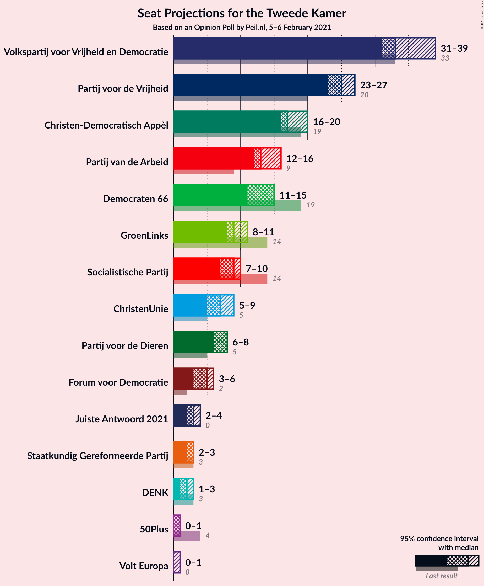

### Confidence Intervals

| Party | Last Result | Median | 80% Confidence Interval | 90% Confidence Interval | 95% Confidence Interval | 99% Confidence Interval |
|:-----:|:-----------:|:------:|:-----------------------:|:-----------------------:|:-----------------------:|:-----------------------:|
| <a href="#volkspartij-voor-vrijheid-en-democratie">Volkspartij voor Vrijheid en Democratie</a> | 33 | 33 | 33–37 |33–38 |31–39 |31–39 |
| <a href="#partij-voor-de-vrijheid">Partij voor de Vrijheid</a> | 20 | 25 | 24–26 |24–26 |23–27 |22–28 |
| <a href="#christen-democratisch-appèl">Christen-Democratisch Appèl</a> | 19 | 17 | 17–19 |17–19 |16–20 |16–20 |
| <a href="#democraten-66">Democraten 66</a> | 19 | 15 | 12–15 |12–15 |11–15 |11–15 |
| <a href="#partij-van-de-arbeid">Partij van de Arbeid</a> | 9 | 13 | 13–14 |12–15 |12–16 |11–16 |
| <a href="#groenlinks">GroenLinks</a> | 14 | 9 | 8–10 |8–11 |8–11 |8–11 |
| <a href="#socialistische-partij">Socialistische Partij</a> | 14 | 9 | 8–10 |8–10 |7–10 |7–11 |
| <a href="#christenunie">ChristenUnie</a> | 5 | 7 | 6–8 |6–8 |5–9 |5–9 |
| <a href="#partij-voor-de-dieren">Partij voor de Dieren</a> | 5 | 8 | 6–8 |6–8 |6–8 |6–8 |
| <a href="#forum-voor-democratie">Forum voor Democratie</a> | 2 | 5 | 4–5 |3–6 |3–6 |3–6 |
| <a href="#staatkundig-gereformeerde-partij">Staatkundig Gereformeerde Partij</a> | 3 | 3 | 2–3 |2–3 |2–3 |2–4 |
| <a href="#juiste-antwoord-2021">Juiste Antwoord 2021</a> | 0 | 3 | 2–3 |2–3 |2–4 |2–4 |
| <a href="#denk">DENK</a> | 3 | 2 | 2 |2–3 |1–3 |1–3 |
| <a href="#50plus">50Plus</a> | 4 | 1 | 0–1 |0–1 |0–1 |0–2 |
| <a href="#volt-europa">Volt Europa</a> | 0 | 0 | 0–1 |0–1 |0–1 |0–1 |

### Volkspartij voor Vrijheid en Democratie

*For a full overview of the results for this party, see the [Volkspartij voor Vrijheid en Democratie](party-volkspartijvoorvrijheidendemocratie.html) page.*

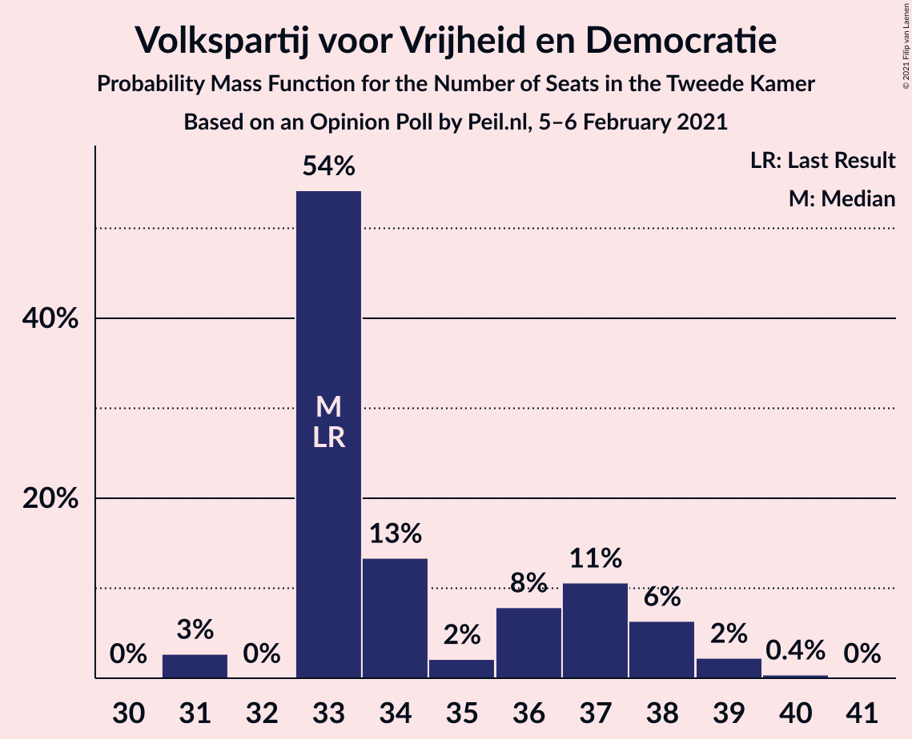

| Number of Seats | Probability | Accumulated | Special Marks |
|:---------------:|:-----------:|:-----------:|:-------------:|
| 31 | 3% | 100% |  |
| 32 | 0% | 97% |  |
| 33 | 54% | 97% | Last Result, Median |
| 34 | 13% | 43% |  |
| 35 | 2% | 30% |  |
| 36 | 8% | 28% |  |
| 37 | 11% | 20% |  |
| 38 | 6% | 9% |  |
| 39 | 2% | 3% |  |
| 40 | 0.4% | 0.4% |  |
| 41 | 0% | 0% |  |

### Partij voor de Vrijheid

*For a full overview of the results for this party, see the [Partij voor de Vrijheid](party-partijvoordevrijheid.html) page.*

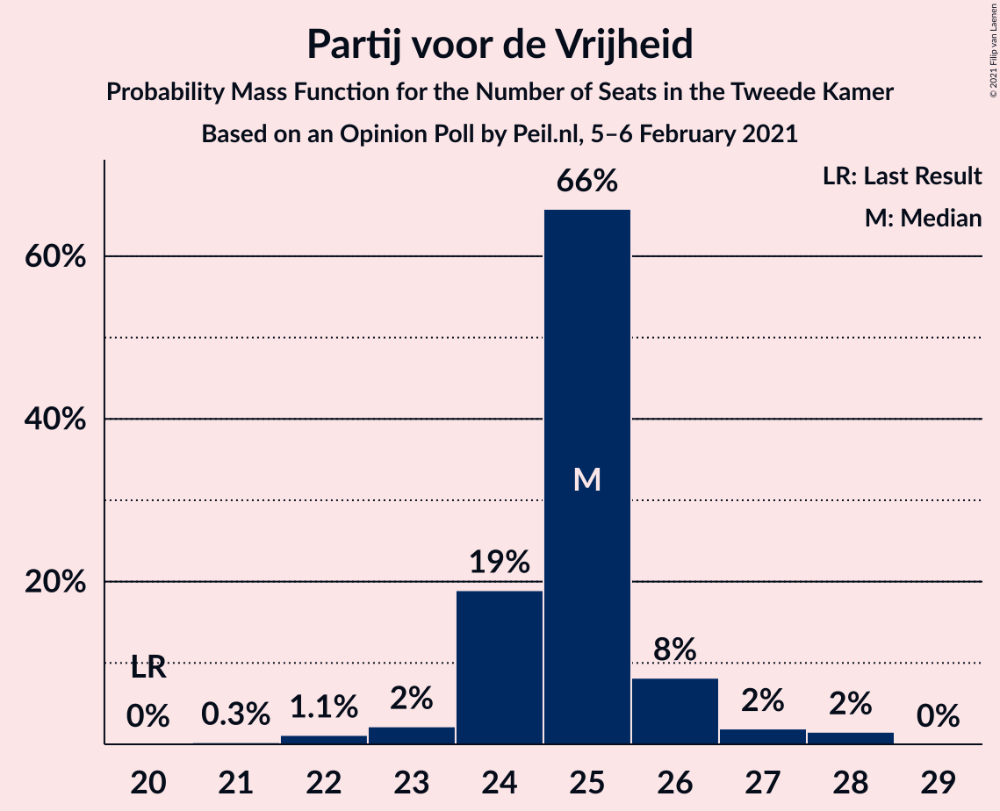

| Number of Seats | Probability | Accumulated | Special Marks |
|:---------------:|:-----------:|:-----------:|:-------------:|
| 20 | 0% | 100% | Last Result |
| 21 | 0.3% | 100% |  |
| 22 | 1.1% | 99.7% |  |
| 23 | 2% | 98.6% |  |
| 24 | 19% | 96% |  |
| 25 | 66% | 77% | Median |
| 26 | 8% | 12% |  |
| 27 | 2% | 3% |  |
| 28 | 2% | 2% |  |
| 29 | 0% | 0% |  |

### Christen-Democratisch Appèl

*For a full overview of the results for this party, see the [Christen-Democratisch Appèl](party-christen-democratischappèl.html) page.*

| Number of Seats | Probability | Accumulated | Special Marks |
|:---------------:|:-----------:|:-----------:|:-------------:|
| 15 | 0.1% | 100% |  |
| 16 | 3% | 99.9% |  |
| 17 | 61% | 97% | Median |
| 18 | 11% | 36% |  |
| 19 | 21% | 25% | Last Result |
| 20 | 4% | 4% |  |
| 21 | 0.3% | 0.3% |  |
| 22 | 0.1% | 0.1% |  |
| 23 | 0% | 0% |  |

### Democraten 66

*For a full overview of the results for this party, see the [Democraten 66](party-democraten66.html) page.*

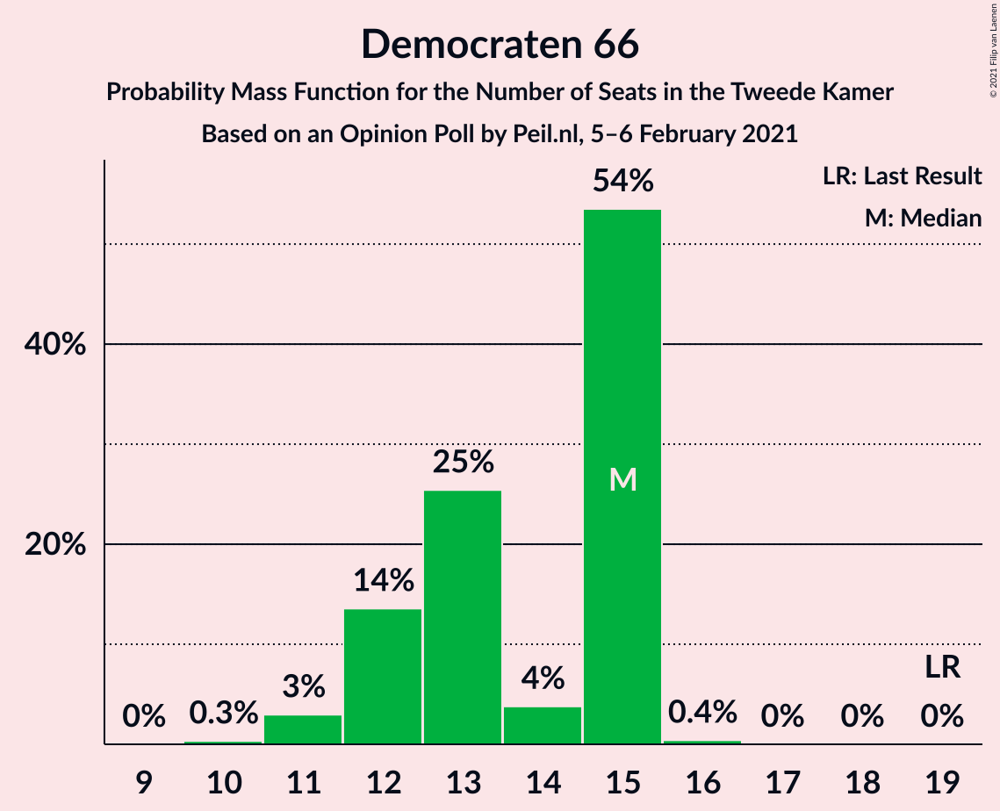

| Number of Seats | Probability | Accumulated | Special Marks |
|:---------------:|:-----------:|:-----------:|:-------------:|
| 10 | 0.3% | 100% |  |
| 11 | 3% | 99.7% |  |
| 12 | 14% | 97% |  |
| 13 | 25% | 83% |  |
| 14 | 4% | 58% |  |
| 15 | 54% | 54% | Median |
| 16 | 0.4% | 0.4% |  |
| 17 | 0% | 0% |  |
| 18 | 0% | 0% |  |
| 19 | 0% | 0% | Last Result |

### Partij van de Arbeid

*For a full overview of the results for this party, see the [Partij van de Arbeid](party-partijvandearbeid.html) page.*

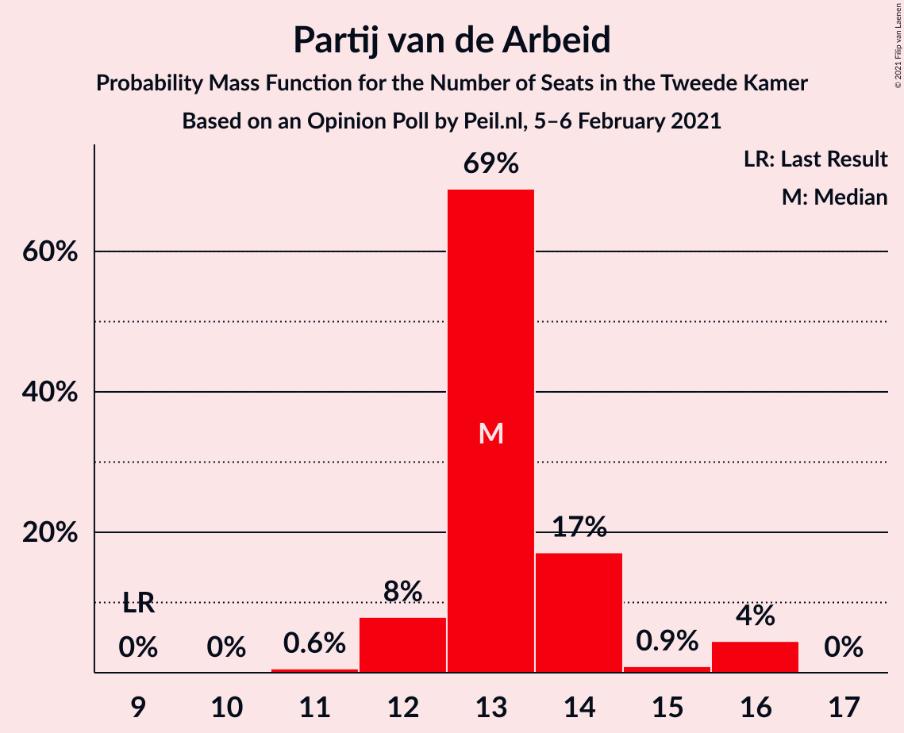

| Number of Seats | Probability | Accumulated | Special Marks |
|:---------------:|:-----------:|:-----------:|:-------------:|
| 9 | 0% | 100% | Last Result |
| 10 | 0% | 100% |  |
| 11 | 0.6% | 100% |  |
| 12 | 8% | 99.4% |  |
| 13 | 69% | 91% | Median |
| 14 | 17% | 23% |  |
| 15 | 0.9% | 5% |  |
| 16 | 4% | 5% |  |
| 17 | 0% | 0% |  |

### GroenLinks

*For a full overview of the results for this party, see the [GroenLinks](party-groenlinks.html) page.*

| Number of Seats | Probability | Accumulated | Special Marks |
|:---------------:|:-----------:|:-----------:|:-------------:|
| 7 | 0.2% | 100% |  |
| 8 | 15% | 99.8% |  |
| 9 | 67% | 85% | Median |
| 10 | 11% | 18% |  |
| 11 | 7% | 7% |  |
| 12 | 0% | 0% |  |
| 13 | 0% | 0% |  |
| 14 | 0% | 0% | Last Result |

### Socialistische Partij

*For a full overview of the results for this party, see the [Socialistische Partij](party-socialistischepartij.html) page.*

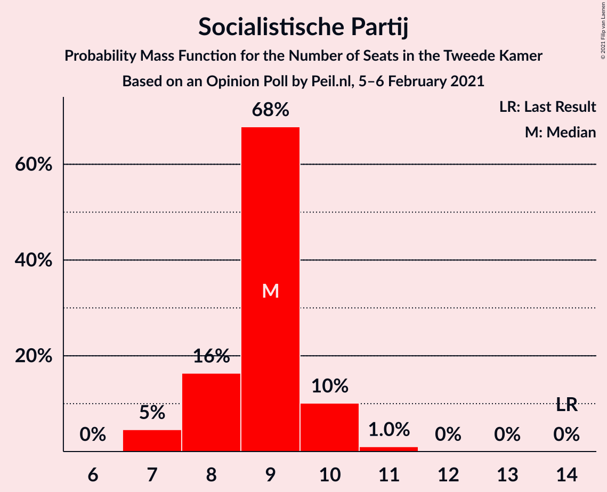

| Number of Seats | Probability | Accumulated | Special Marks |
|:---------------:|:-----------:|:-----------:|:-------------:|
| 7 | 5% | 100% |  |
| 8 | 16% | 95% |  |
| 9 | 68% | 79% | Median |
| 10 | 10% | 11% |  |
| 11 | 1.0% | 1.1% |  |
| 12 | 0% | 0% |  |
| 13 | 0% | 0% |  |
| 14 | 0% | 0% | Last Result |

### ChristenUnie

*For a full overview of the results for this party, see the [ChristenUnie](party-christenunie.html) page.*

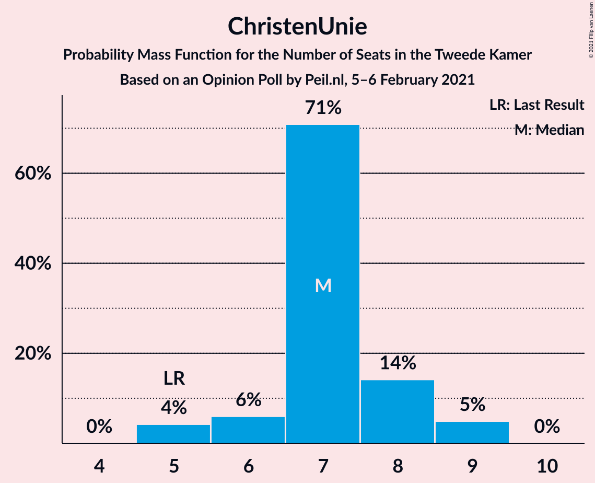

| Number of Seats | Probability | Accumulated | Special Marks |
|:---------------:|:-----------:|:-----------:|:-------------:|
| 5 | 4% | 100% | Last Result |
| 6 | 6% | 96% |  |
| 7 | 71% | 90% | Median |
| 8 | 14% | 19% |  |
| 9 | 5% | 5% |  |
| 10 | 0% | 0% |  |

### Partij voor de Dieren

*For a full overview of the results for this party, see the [Partij voor de Dieren](party-partijvoordedieren.html) page.*

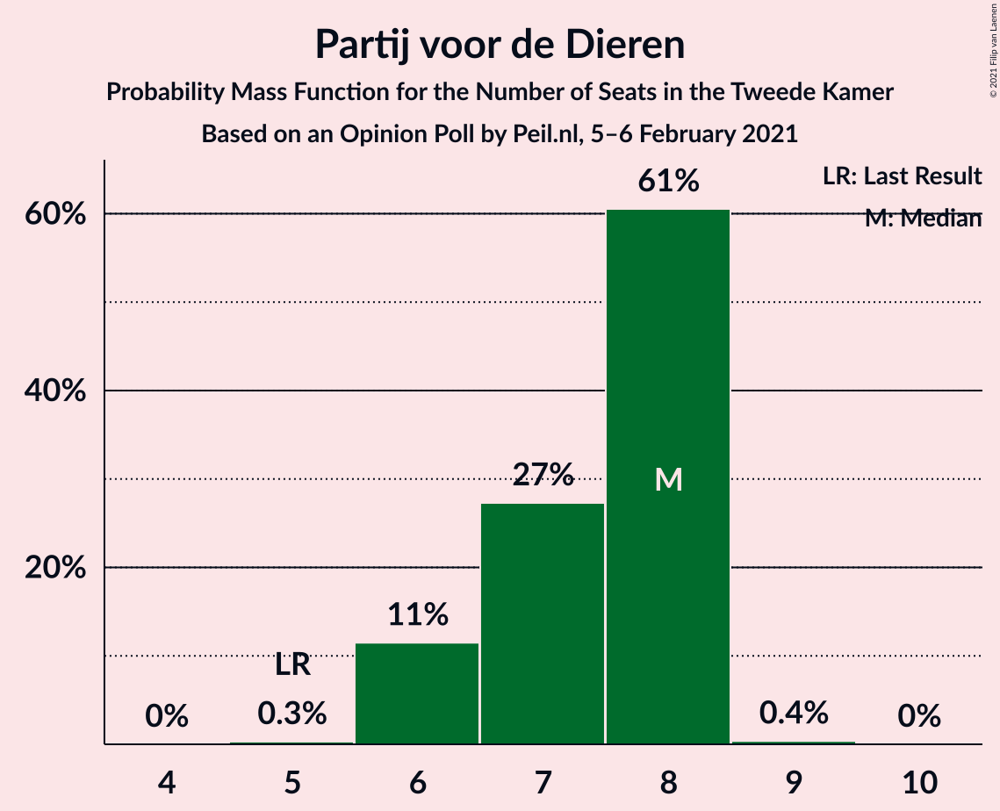

| Number of Seats | Probability | Accumulated | Special Marks |
|:---------------:|:-----------:|:-----------:|:-------------:|
| 5 | 0.3% | 100% | Last Result |
| 6 | 11% | 99.7% |  |
| 7 | 27% | 88% |  |
| 8 | 61% | 61% | Median |
| 9 | 0.4% | 0.4% |  |
| 10 | 0% | 0% |  |

### Forum voor Democratie

*For a full overview of the results for this party, see the [Forum voor Democratie](party-forumvoordemocratie.html) page.*

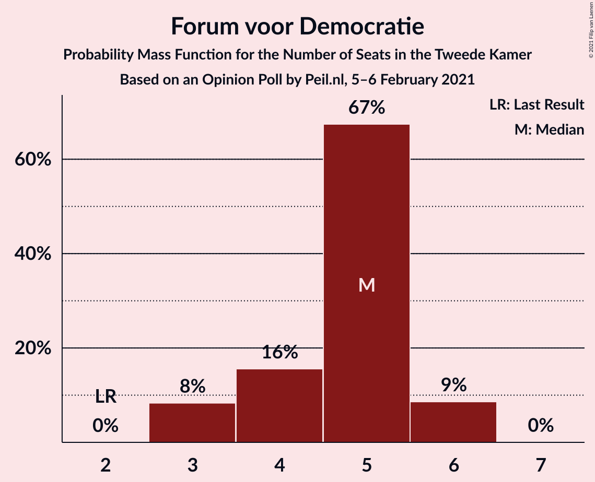

| Number of Seats | Probability | Accumulated | Special Marks |
|:---------------:|:-----------:|:-----------:|:-------------:|
| 2 | 0% | 100% | Last Result |
| 3 | 8% | 100% |  |
| 4 | 16% | 92% |  |
| 5 | 67% | 76% | Median |
| 6 | 9% | 9% |  |
| 7 | 0% | 0% |  |

### Staatkundig Gereformeerde Partij

*For a full overview of the results for this party, see the [Staatkundig Gereformeerde Partij](party-staatkundiggereformeerdepartij.html) page.*

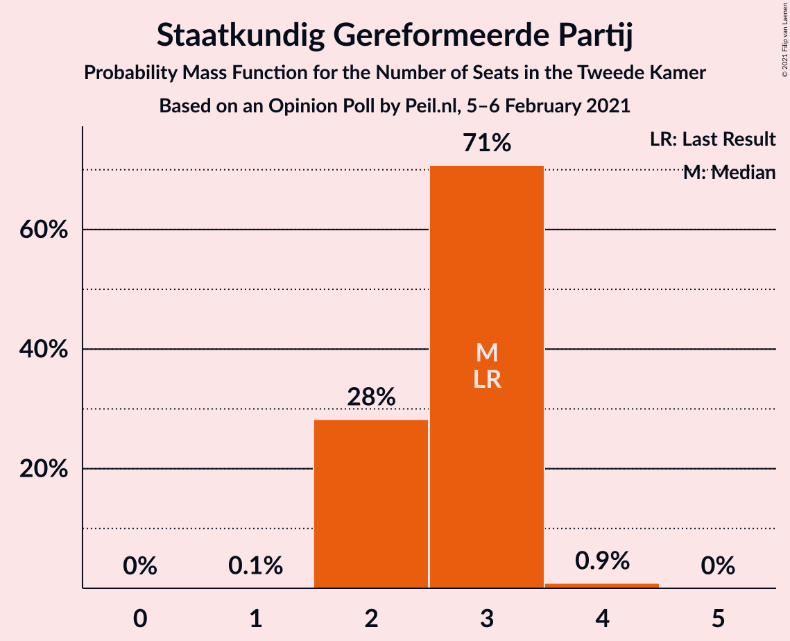

| Number of Seats | Probability | Accumulated | Special Marks |
|:---------------:|:-----------:|:-----------:|:-------------:|
| 1 | 0.1% | 100% |  |
| 2 | 28% | 99.9% |  |
| 3 | 71% | 72% | Last Result, Median |
| 4 | 0.9% | 0.9% |  |
| 5 | 0% | 0% |  |

### Juiste Antwoord 2021

*For a full overview of the results for this party, see the [Juiste Antwoord 2021](party-juisteantwoord2021.html) page.*

| Number of Seats | Probability | Accumulated | Special Marks |
|:---------------:|:-----------:|:-----------:|:-------------:|
| 0 | 0% | 100% | Last Result |
| 1 | 0% | 100% |  |
| 2 | 15% | 100% |  |
| 3 | 80% | 85% | Median |
| 4 | 4% | 4% |  |
| 5 | 0% | 0% |  |

### DENK

*For a full overview of the results for this party, see the [DENK](party-denk.html) page.*

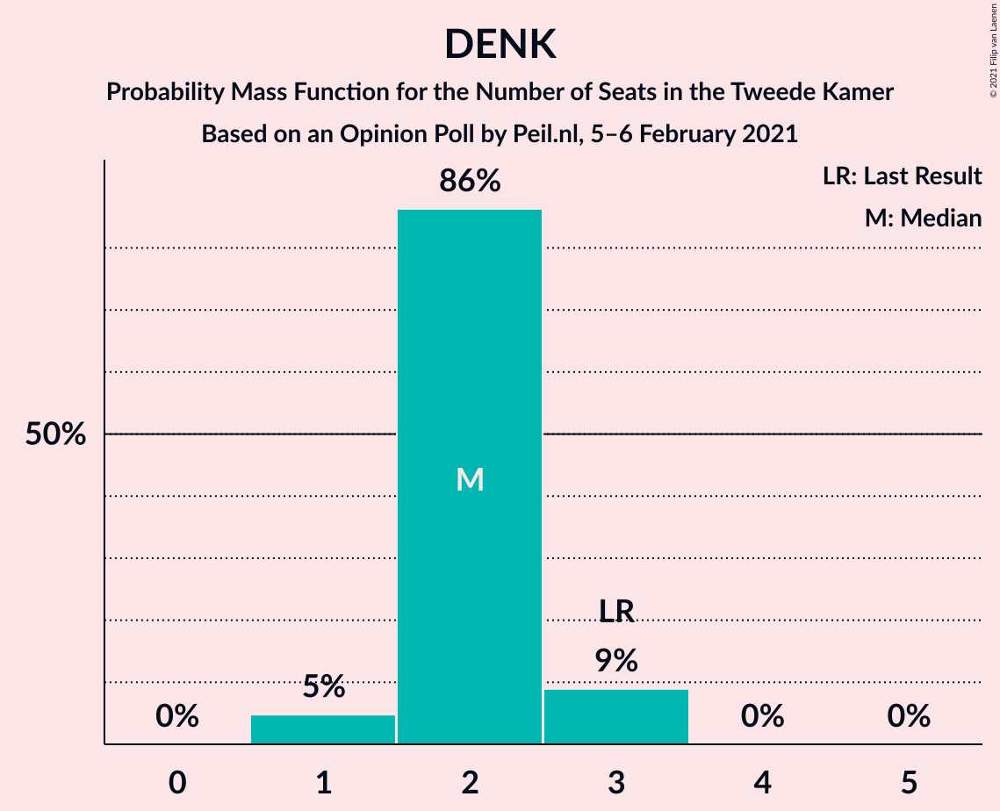

| Number of Seats | Probability | Accumulated | Special Marks |
|:---------------:|:-----------:|:-----------:|:-------------:|
| 1 | 5% | 100% |  |
| 2 | 86% | 95% | Median |
| 3 | 9% | 9% | Last Result |
| 4 | 0% | 0% |  |

### 50Plus

*For a full overview of the results for this party, see the [50Plus](party-50plus.html) page.*

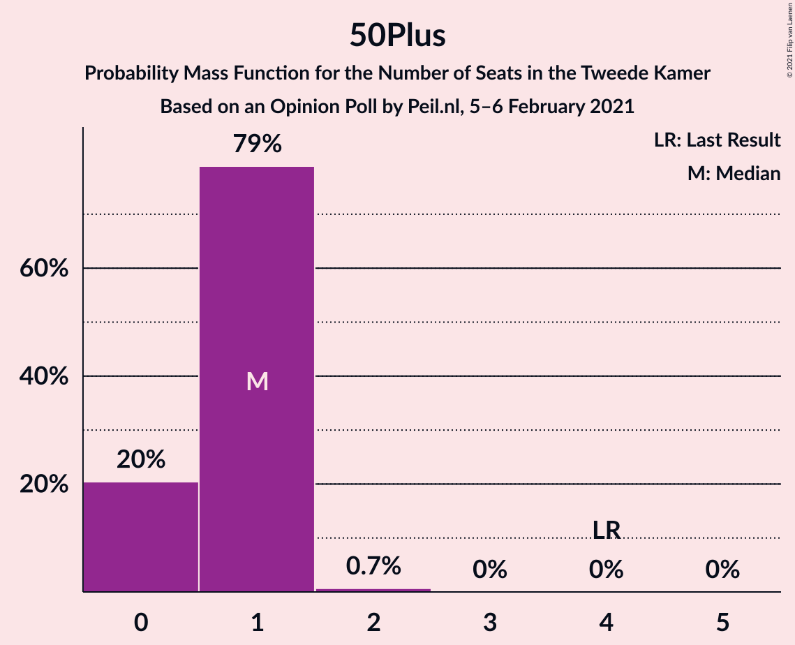

| Number of Seats | Probability | Accumulated | Special Marks |
|:---------------:|:-----------:|:-----------:|:-------------:|
| 0 | 20% | 100% |  |
| 1 | 79% | 80% | Median |
| 2 | 0.7% | 0.7% |  |
| 3 | 0% | 0% |  |
| 4 | 0% | 0% | Last Result |

### Volt Europa

*For a full overview of the results for this party, see the [Volt Europa](party-volteuropa.html) page.*

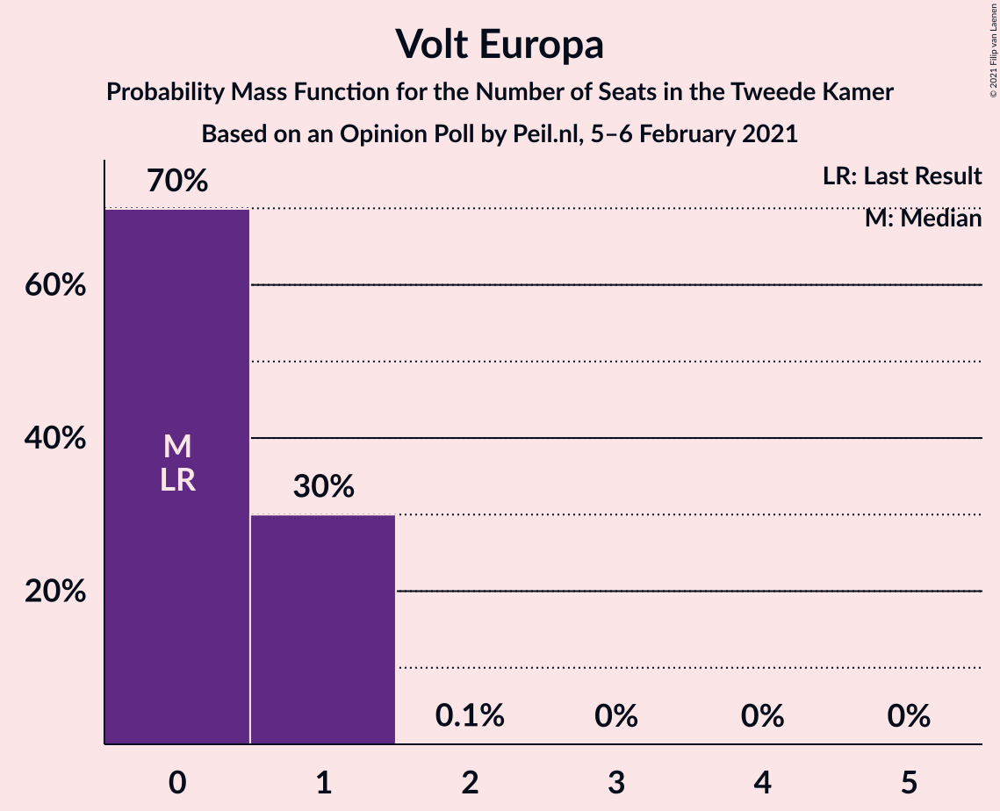

| Number of Seats | Probability | Accumulated | Special Marks |
|:---------------:|:-----------:|:-----------:|:-------------:|
| 0 | 70% | 100% | Last Result, Median |
| 1 | 30% | 30% |  |
| 2 | 0.1% | 0.1% |  |
| 3 | 0% | 0% |  |

## Coalitions

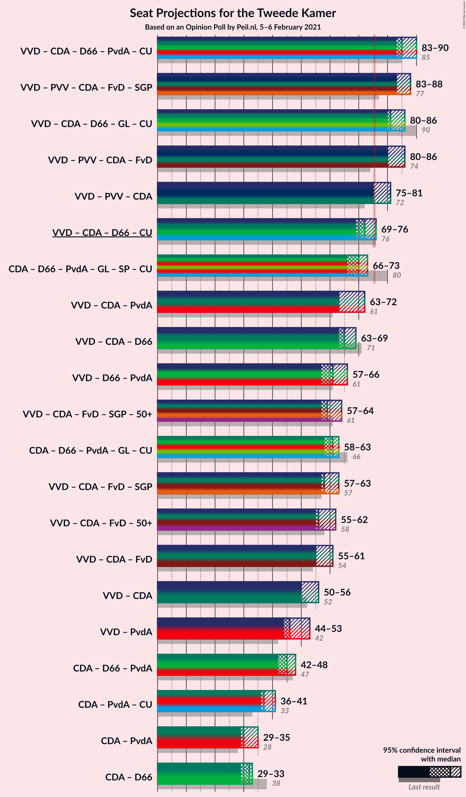

### Confidence Intervals

| Coalition | Last Result | Median | Majority? | 80% Confidence Interval | 90% Confidence Interval | 95% Confidence Interval | 99% Confidence Interval |
|:---------:|:-----------:|:------:|:---------:|:-----------------------:|:-----------------------:|:-----------------------:|:-----------------------:|
| Volkspartij voor Vrijheid en Democratie – Christen-Democratisch Appèl – Democraten 66 – Partij van de Arbeid – ChristenUnie | 85 | 85 | 100% | 85–90 | 85–90 | 83–90 | 82–90 |
| Volkspartij voor Vrijheid en Democratie – Partij voor de Vrijheid – Christen-Democratisch Appèl – Forum voor Democratie – Staatkundig Gereformeerde Partij | 77 | 83 | 100% | 83–87 | 83–88 | 83–88 | 82–89 |
| Volkspartij voor Vrijheid en Democratie – Christen-Democratisch Appèl – Democraten 66 – GroenLinks – ChristenUnie | 90 | 81 | 100% | 81–84 | 81–86 | 80–86 | 77–86 |
| Volkspartij voor Vrijheid en Democratie – Partij voor de Vrijheid – Christen-Democratisch Appèl – Forum voor Democratie | 74 | 80 | 100% | 80–84 | 80–86 | 80–86 | 79–86 |
| Volkspartij voor Vrijheid en Democratie – Partij voor de Vrijheid – Christen-Democratisch Appèl | 72 | 75 | 46% | 75–81 | 75–81 | 75–81 | 75–81 |
| Volkspartij voor Vrijheid en Democratie – Christen-Democratisch Appèl – Democraten 66 – ChristenUnie | 76 | 72 | 12% | 72–76 | 72–76 | 69–76 | 68–77 |
| Christen-Democratisch Appèl – Democraten 66 – Partij van de Arbeid – GroenLinks – Socialistische Partij – ChristenUnie | 80 | 70 | 0% | 67–72 | 66–72 | 66–73 | 65–74 |
| Volkspartij voor Vrijheid en Democratie – Christen-Democratisch Appèl – Partij van de Arbeid | 61 | 63 | 0% | 63–69 | 63–70 | 63–72 | 63–72 |
| Volkspartij voor Vrijheid en Democratie – Christen-Democratisch Appèl – Democraten 66 | 71 | 65 | 0% | 65–69 | 64–69 | 63–69 | 62–70 |
| Volkspartij voor Vrijheid en Democratie – Democraten 66 – Partij van de Arbeid | 61 | 61 | 0% | 60–64 | 58–66 | 57–66 | 57–66 |
| Volkspartij voor Vrijheid en Democratie – Christen-Democratisch Appèl – Forum voor Democratie – Staatkundig Gereformeerde Partij – 50Plus | 61 | 59 | 0% | 59–63 | 59–64 | 57–64 | 57–66 |
| Christen-Democratisch Appèl – Democraten 66 – Partij van de Arbeid – GroenLinks – ChristenUnie | 66 | 61 | 0% | 59–62 | 59–63 | 58–63 | 57–64 |
| Volkspartij voor Vrijheid en Democratie – Christen-Democratisch Appèl – Forum voor Democratie – Staatkundig Gereformeerde Partij | 57 | 58 | 0% | 58–62 | 58–63 | 57–63 | 57–65 |
| Volkspartij voor Vrijheid en Democratie – Christen-Democratisch Appèl – Forum voor Democratie – 50Plus | 58 | 56 | 0% | 56–60 | 56–61 | 55–62 | 55–63 |
| Volkspartij voor Vrijheid en Democratie – Christen-Democratisch Appèl – Forum voor Democratie | 54 | 55 | 0% | 55–60 | 55–60 | 55–61 | 55–62 |
| Volkspartij voor Vrijheid en Democratie – Christen-Democratisch Appèl | 52 | 50 | 0% | 50–56 | 50–56 | 50–56 | 50–57 |
| Volkspartij voor Vrijheid en Democratie – Partij van de Arbeid | 42 | 46 | 0% | 46–51 | 46–52 | 44–53 | 44–53 |
| Christen-Democratisch Appèl – Democraten 66 – Partij van de Arbeid | 47 | 45 | 0% | 43–46 | 42–47 | 42–48 | 42–48 |
| Christen-Democratisch Appèl – Partij van de Arbeid – ChristenUnie | 33 | 37 | 0% | 37–40 | 37–40 | 36–41 | 35–42 |
| Christen-Democratisch Appèl – Partij van de Arbeid | 28 | 30 | 0% | 30–33 | 30–34 | 29–35 | 29–35 |
| Christen-Democratisch Appèl – Democraten 66 | 38 | 32 | 0% | 30–32 | 29–32 | 29–33 | 28–35 |

### Volkspartij voor Vrijheid en Democratie – Christen-Democratisch Appèl – Democraten 66 – Partij van de Arbeid – ChristenUnie

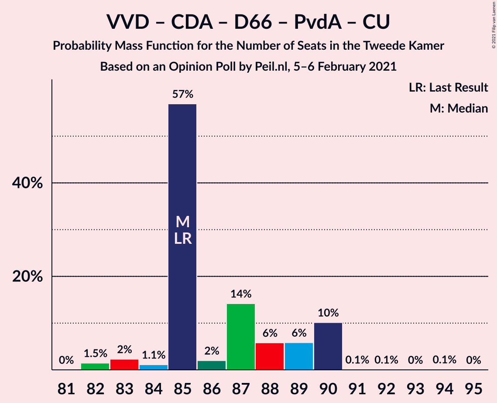

| Number of Seats | Probability | Accumulated | Special Marks |
|:---------------:|:-----------:|:-----------:|:-------------:|
| 82 | 1.5% | 100% |  |
| 83 | 2% | 98.5% |  |
| 84 | 1.1% | 96% |  |
| 85 | 57% | 95% | Last Result, Median |
| 86 | 2% | 38% |  |
| 87 | 14% | 36% |  |
| 88 | 6% | 22% |  |
| 89 | 6% | 16% |  |
| 90 | 10% | 10% |  |
| 91 | 0.1% | 0.3% |  |
| 92 | 0.1% | 0.2% |  |
| 93 | 0% | 0.1% |  |
| 94 | 0.1% | 0.1% |  |
| 95 | 0% | 0% |  |

### Volkspartij voor Vrijheid en Democratie – Partij voor de Vrijheid – Christen-Democratisch Appèl – Forum voor Democratie – Staatkundig Gereformeerde Partij

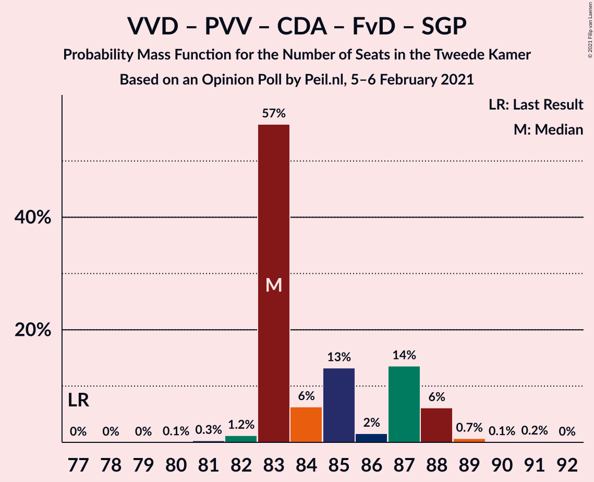

| Number of Seats | Probability | Accumulated | Special Marks |
|:---------------:|:-----------:|:-----------:|:-------------:|
| 77 | 0% | 100% | Last Result |
| 78 | 0% | 100% |  |
| 79 | 0% | 100% |  |
| 80 | 0.1% | 100% |  |
| 81 | 0.3% | 99.9% |  |
| 82 | 1.2% | 99.6% |  |
| 83 | 57% | 98% | Median |
| 84 | 6% | 42% |  |
| 85 | 13% | 36% |  |
| 86 | 2% | 22% |  |
| 87 | 14% | 21% |  |
| 88 | 6% | 7% |  |
| 89 | 0.7% | 1.0% |  |
| 90 | 0.1% | 0.3% |  |
| 91 | 0.2% | 0.2% |  |
| 92 | 0% | 0% |  |

### Volkspartij voor Vrijheid en Democratie – Christen-Democratisch Appèl – Democraten 66 – GroenLinks – ChristenUnie

| Number of Seats | Probability | Accumulated | Special Marks |
|:---------------:|:-----------:|:-----------:|:-------------:|
| 77 | 1.5% | 100% |  |
| 78 | 0.1% | 98.5% |  |
| 79 | 0.1% | 98% |  |
| 80 | 3% | 98% |  |
| 81 | 55% | 95% | Median |
| 82 | 12% | 40% |  |
| 83 | 2% | 28% |  |
| 84 | 16% | 26% |  |
| 85 | 4% | 9% |  |
| 86 | 5% | 6% |  |
| 87 | 0.3% | 0.4% |  |
| 88 | 0.1% | 0.2% |  |
| 89 | 0% | 0% |  |
| 90 | 0% | 0% | Last Result |

### Volkspartij voor Vrijheid en Democratie – Partij voor de Vrijheid – Christen-Democratisch Appèl – Forum voor Democratie

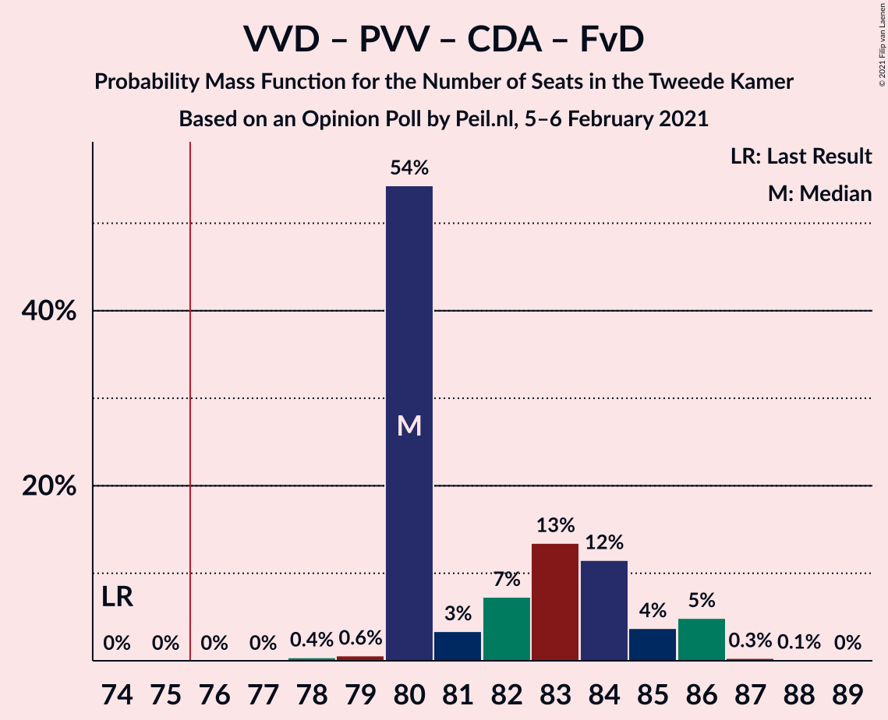

| Number of Seats | Probability | Accumulated | Special Marks |
|:---------------:|:-----------:|:-----------:|:-------------:|
| 74 | 0% | 100% | Last Result |
| 75 | 0% | 100% |  |
| 76 | 0% | 100% | Majority |
| 77 | 0% | 100% |  |
| 78 | 0.4% | 100% |  |
| 79 | 0.6% | 99.6% |  |
| 80 | 54% | 99.0% | Median |
| 81 | 3% | 45% |  |
| 82 | 7% | 41% |  |
| 83 | 13% | 34% |  |
| 84 | 12% | 21% |  |
| 85 | 4% | 9% |  |
| 86 | 5% | 5% |  |
| 87 | 0.3% | 0.5% |  |
| 88 | 0.1% | 0.2% |  |
| 89 | 0% | 0% |  |

### Volkspartij voor Vrijheid en Democratie – Partij voor de Vrijheid – Christen-Democratisch Appèl

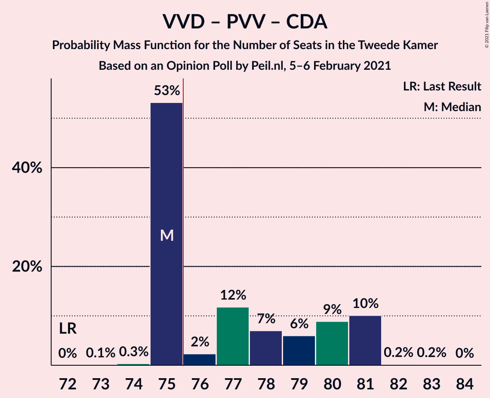

| Number of Seats | Probability | Accumulated | Special Marks |
|:---------------:|:-----------:|:-----------:|:-------------:|
| 72 | 0% | 100% | Last Result |
| 73 | 0.1% | 100% |  |
| 74 | 0.3% | 99.9% |  |
| 75 | 53% | 99.6% | Median |
| 76 | 2% | 46% | Majority |
| 77 | 12% | 44% |  |
| 78 | 7% | 32% |  |
| 79 | 6% | 25% |  |
| 80 | 9% | 19% |  |
| 81 | 10% | 10% |  |
| 82 | 0.2% | 0.4% |  |
| 83 | 0.2% | 0.2% |  |
| 84 | 0% | 0% |  |

### Volkspartij voor Vrijheid en Democratie – Christen-Democratisch Appèl – Democraten 66 – ChristenUnie

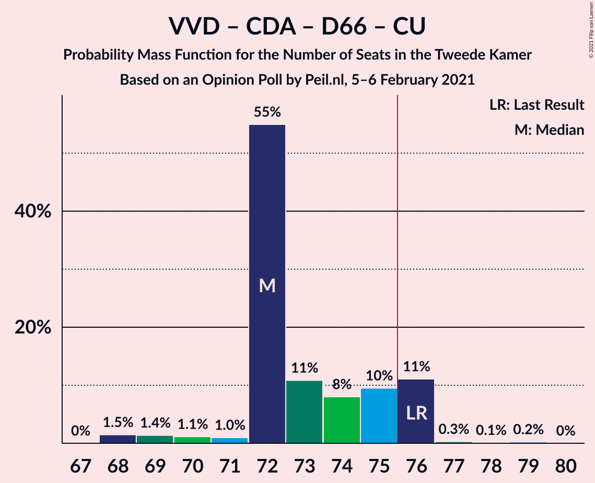

| Number of Seats | Probability | Accumulated | Special Marks |
|:---------------:|:-----------:|:-----------:|:-------------:|
| 68 | 1.5% | 100% |  |
| 69 | 1.4% | 98.5% |  |
| 70 | 1.1% | 97% |  |
| 71 | 1.0% | 96% |  |
| 72 | 55% | 95% | Median |
| 73 | 11% | 40% |  |
| 74 | 8% | 29% |  |
| 75 | 10% | 21% |  |
| 76 | 11% | 12% | Last Result, Majority |
| 77 | 0.3% | 0.6% |  |
| 78 | 0.1% | 0.4% |  |
| 79 | 0.2% | 0.2% |  |
| 80 | 0% | 0% |  |

### Christen-Democratisch Appèl – Democraten 66 – Partij van de Arbeid – GroenLinks – Socialistische Partij – ChristenUnie

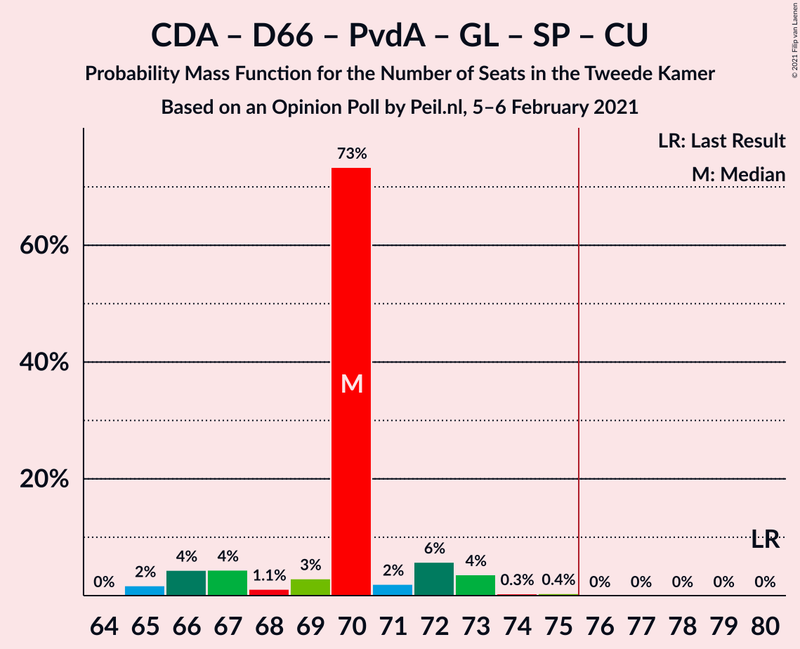

| Number of Seats | Probability | Accumulated | Special Marks |
|:---------------:|:-----------:|:-----------:|:-------------:|
| 65 | 2% | 100% |  |
| 66 | 4% | 98% |  |
| 67 | 4% | 94% |  |
| 68 | 1.1% | 89% |  |
| 69 | 3% | 88% |  |
| 70 | 73% | 85% | Median |
| 71 | 2% | 12% |  |
| 72 | 6% | 10% |  |
| 73 | 4% | 4% |  |
| 74 | 0.3% | 0.7% |  |
| 75 | 0.4% | 0.4% |  |
| 76 | 0% | 0% | Majority |
| 77 | 0% | 0% |  |
| 78 | 0% | 0% |  |
| 79 | 0% | 0% |  |
| 80 | 0% | 0% | Last Result |

### Volkspartij voor Vrijheid en Democratie – Christen-Democratisch Appèl – Partij van de Arbeid

| Number of Seats | Probability | Accumulated | Special Marks |
|:---------------:|:-----------:|:-----------:|:-------------:|
| 61 | 0% | 100% | Last Result |
| 62 | 0.1% | 100% |  |
| 63 | 51% | 99.9% | Median |
| 64 | 5% | 48% |  |
| 65 | 7% | 43% |  |
| 66 | 6% | 36% |  |
| 67 | 9% | 31% |  |
| 68 | 9% | 22% |  |
| 69 | 4% | 13% |  |
| 70 | 5% | 10% |  |
| 71 | 0.4% | 5% |  |
| 72 | 4% | 4% |  |
| 73 | 0% | 0.2% |  |
| 74 | 0% | 0.1% |  |
| 75 | 0.1% | 0.1% |  |
| 76 | 0% | 0% | Majority |

### Volkspartij voor Vrijheid en Democratie – Christen-Democratisch Appèl – Democraten 66

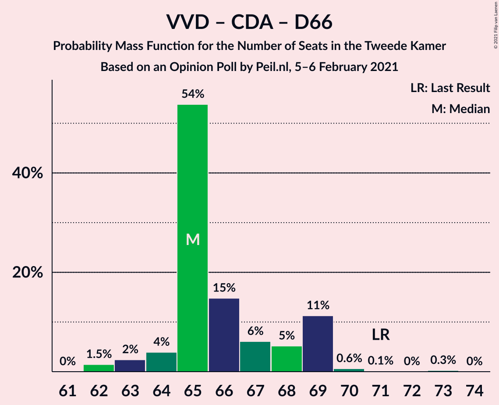

| Number of Seats | Probability | Accumulated | Special Marks |
|:---------------:|:-----------:|:-----------:|:-------------:|
| 62 | 1.5% | 100% |  |
| 63 | 2% | 98.5% |  |
| 64 | 4% | 96% |  |
| 65 | 54% | 92% | Median |
| 66 | 15% | 38% |  |
| 67 | 6% | 24% |  |
| 68 | 5% | 17% |  |
| 69 | 11% | 12% |  |
| 70 | 0.6% | 1.0% |  |
| 71 | 0.1% | 0.4% | Last Result |
| 72 | 0% | 0.3% |  |
| 73 | 0.3% | 0.3% |  |
| 74 | 0% | 0% |  |

### Volkspartij voor Vrijheid en Democratie – Democraten 66 – Partij van de Arbeid

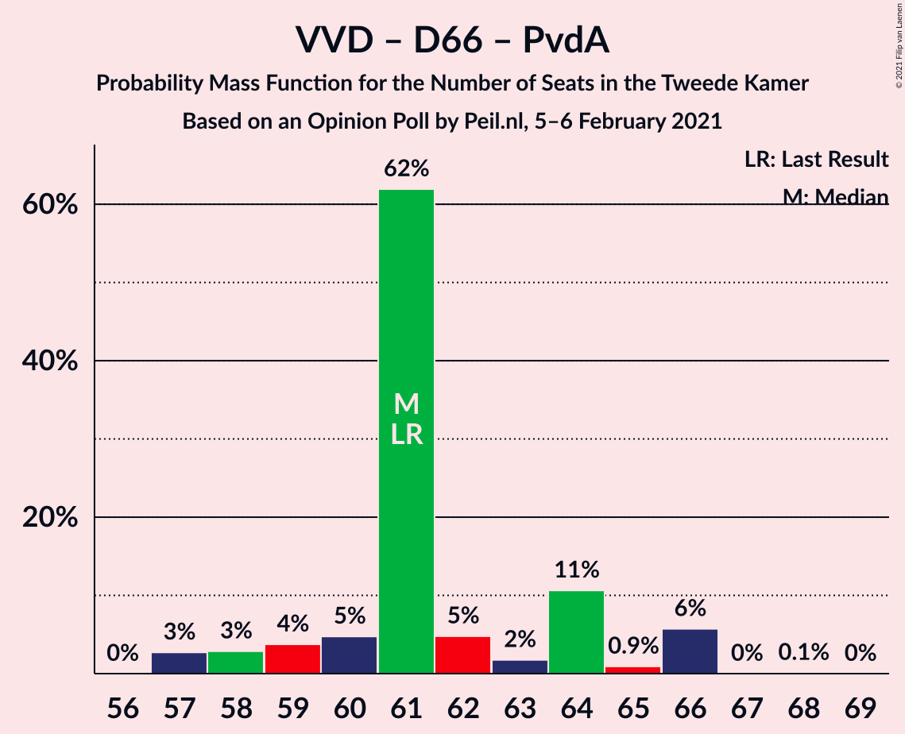

| Number of Seats | Probability | Accumulated | Special Marks |
|:---------------:|:-----------:|:-----------:|:-------------:|
| 57 | 3% | 100% |  |
| 58 | 3% | 97% |  |
| 59 | 4% | 94% |  |
| 60 | 5% | 91% |  |
| 61 | 62% | 86% | Last Result, Median |
| 62 | 5% | 24% |  |
| 63 | 2% | 19% |  |
| 64 | 11% | 17% |  |
| 65 | 0.9% | 7% |  |
| 66 | 6% | 6% |  |
| 67 | 0% | 0.1% |  |
| 68 | 0.1% | 0.1% |  |
| 69 | 0% | 0% |  |

### Volkspartij voor Vrijheid en Democratie – Christen-Democratisch Appèl – Forum voor Democratie – Staatkundig Gereformeerde Partij – 50Plus

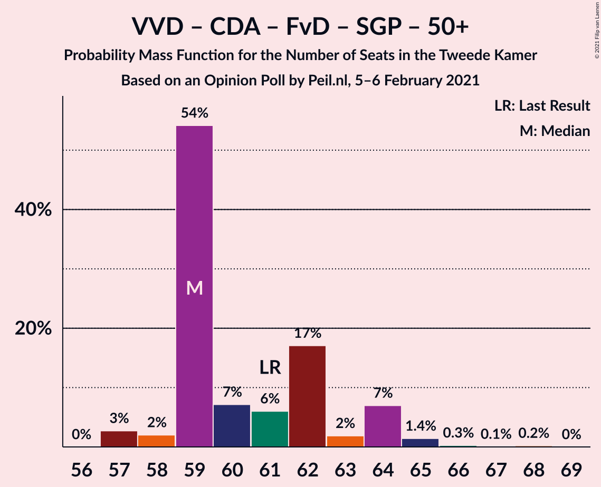

| Number of Seats | Probability | Accumulated | Special Marks |
|:---------------:|:-----------:|:-----------:|:-------------:|
| 57 | 3% | 100% |  |
| 58 | 2% | 97% |  |
| 59 | 54% | 95% | Median |
| 60 | 7% | 41% |  |
| 61 | 6% | 34% | Last Result |
| 62 | 17% | 28% |  |
| 63 | 2% | 11% |  |
| 64 | 7% | 9% |  |
| 65 | 1.4% | 2% |  |
| 66 | 0.3% | 0.5% |  |
| 67 | 0.1% | 0.3% |  |
| 68 | 0.2% | 0.2% |  |
| 69 | 0% | 0% |  |

### Christen-Democratisch Appèl – Democraten 66 – Partij van de Arbeid – GroenLinks – ChristenUnie

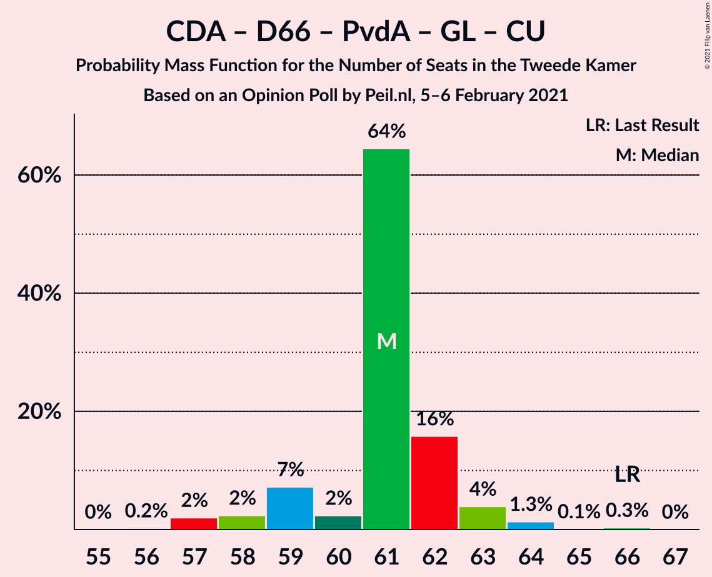

| Number of Seats | Probability | Accumulated | Special Marks |
|:---------------:|:-----------:|:-----------:|:-------------:|
| 56 | 0.2% | 100% |  |
| 57 | 2% | 99.8% |  |
| 58 | 2% | 98% |  |
| 59 | 7% | 95% |  |
| 60 | 2% | 88% |  |
| 61 | 64% | 86% | Median |
| 62 | 16% | 21% |  |
| 63 | 4% | 6% |  |
| 64 | 1.3% | 2% |  |
| 65 | 0.1% | 0.4% |  |
| 66 | 0.3% | 0.3% | Last Result |
| 67 | 0% | 0% |  |

### Volkspartij voor Vrijheid en Democratie – Christen-Democratisch Appèl – Forum voor Democratie – Staatkundig Gereformeerde Partij

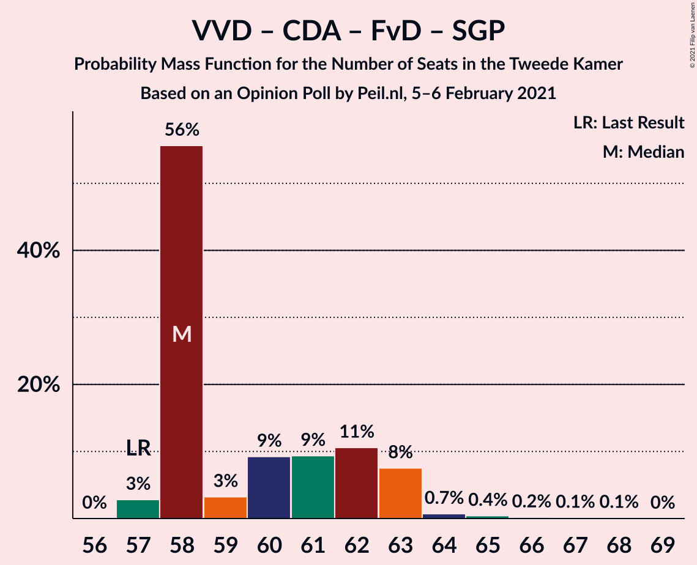

| Number of Seats | Probability | Accumulated | Special Marks |
|:---------------:|:-----------:|:-----------:|:-------------:|
| 57 | 3% | 100% | Last Result |
| 58 | 56% | 97% | Median |
| 59 | 3% | 42% |  |
| 60 | 9% | 38% |  |
| 61 | 9% | 29% |  |
| 62 | 11% | 20% |  |
| 63 | 8% | 9% |  |
| 64 | 0.7% | 2% |  |
| 65 | 0.4% | 0.9% |  |
| 66 | 0.2% | 0.4% |  |
| 67 | 0.1% | 0.3% |  |
| 68 | 0.1% | 0.1% |  |
| 69 | 0% | 0% |  |

### Volkspartij voor Vrijheid en Democratie – Christen-Democratisch Appèl – Forum voor Democratie – 50Plus

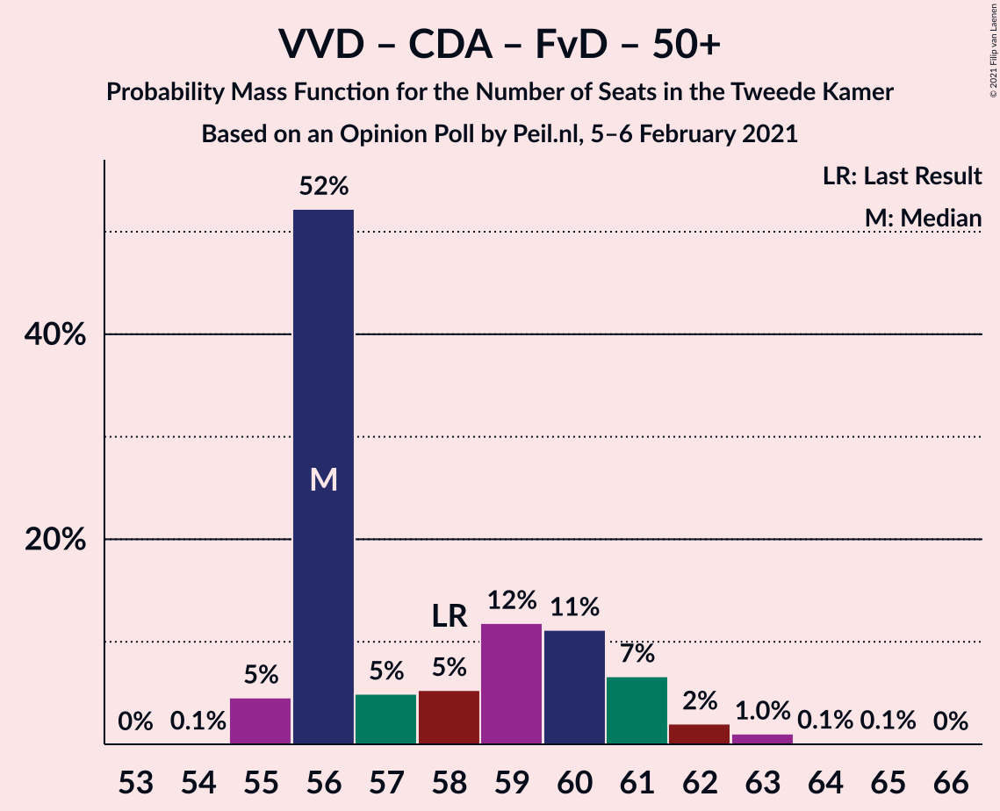

| Number of Seats | Probability | Accumulated | Special Marks |
|:---------------:|:-----------:|:-----------:|:-------------:|
| 54 | 0.1% | 100% |  |
| 55 | 5% | 99.9% |  |
| 56 | 52% | 95% | Median |
| 57 | 5% | 43% |  |
| 58 | 5% | 38% | Last Result |
| 59 | 12% | 33% |  |
| 60 | 11% | 21% |  |
| 61 | 7% | 10% |  |
| 62 | 2% | 3% |  |
| 63 | 1.0% | 1.3% |  |
| 64 | 0.1% | 0.3% |  |
| 65 | 0.1% | 0.1% |  |
| 66 | 0% | 0% |  |

### Volkspartij voor Vrijheid en Democratie – Christen-Democratisch Appèl – Forum voor Democratie

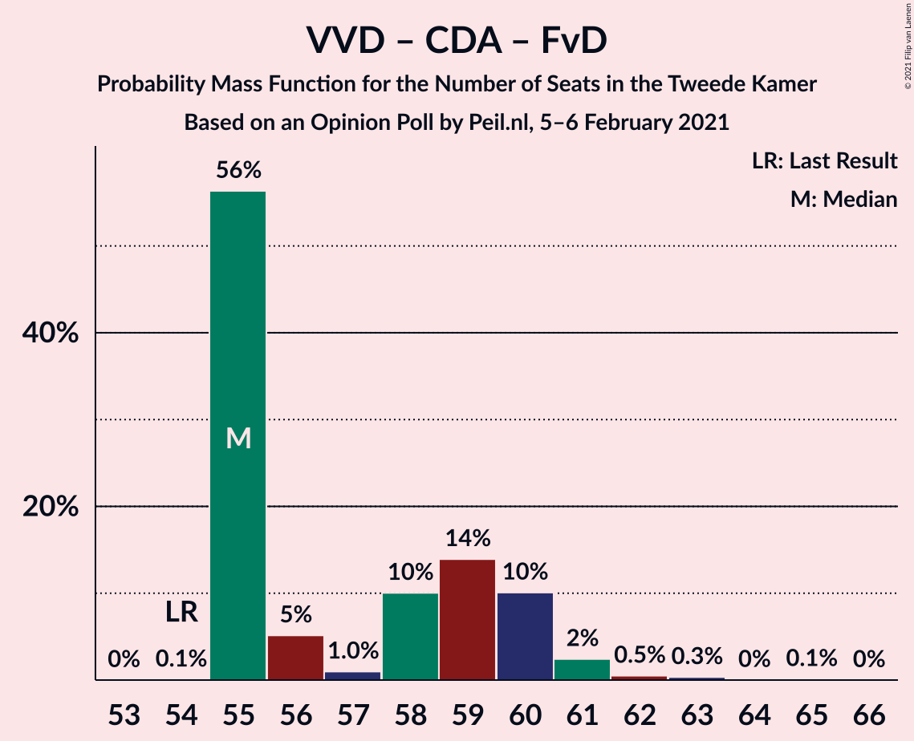

| Number of Seats | Probability | Accumulated | Special Marks |
|:---------------:|:-----------:|:-----------:|:-------------:|
| 54 | 0.1% | 100% | Last Result |
| 55 | 56% | 99.9% | Median |
| 56 | 5% | 44% |  |
| 57 | 1.0% | 38% |  |
| 58 | 10% | 37% |  |
| 59 | 14% | 27% |  |
| 60 | 10% | 13% |  |
| 61 | 2% | 3% |  |
| 62 | 0.5% | 1.0% |  |
| 63 | 0.3% | 0.5% |  |
| 64 | 0% | 0.1% |  |
| 65 | 0.1% | 0.1% |  |
| 66 | 0% | 0% |  |

### Volkspartij voor Vrijheid en Democratie – Christen-Democratisch Appèl

| Number of Seats | Probability | Accumulated | Special Marks |
|:---------------:|:-----------:|:-----------:|:-------------:|
| 50 | 51% | 100% | Median |
| 51 | 8% | 48% |  |
| 52 | 3% | 40% | Last Result |
| 53 | 10% | 37% |  |
| 54 | 6% | 27% |  |
| 55 | 8% | 21% |  |
| 56 | 12% | 13% |  |
| 57 | 0.8% | 1.3% |  |
| 58 | 0.3% | 0.5% |  |
| 59 | 0% | 0.1% |  |
| 60 | 0.1% | 0.1% |  |
| 61 | 0% | 0% |  |

### Volkspartij voor Vrijheid en Democratie – Partij van de Arbeid

| Number of Seats | Probability | Accumulated | Special Marks |
|:---------------:|:-----------:|:-----------:|:-------------:|
| 42 | 0% | 100% | Last Result |
| 43 | 0% | 100% |  |
| 44 | 3% | 100% |  |
| 45 | 0.1% | 97% |  |
| 46 | 55% | 97% | Median |
| 47 | 4% | 42% |  |
| 48 | 15% | 39% |  |
| 49 | 4% | 24% |  |
| 50 | 1.5% | 20% |  |
| 51 | 11% | 19% |  |
| 52 | 3% | 7% |  |
| 53 | 4% | 4% |  |
| 54 | 0% | 0.1% |  |
| 55 | 0.1% | 0.1% |  |
| 56 | 0% | 0% |  |

### Christen-Democratisch Appèl – Democraten 66 – Partij van de Arbeid

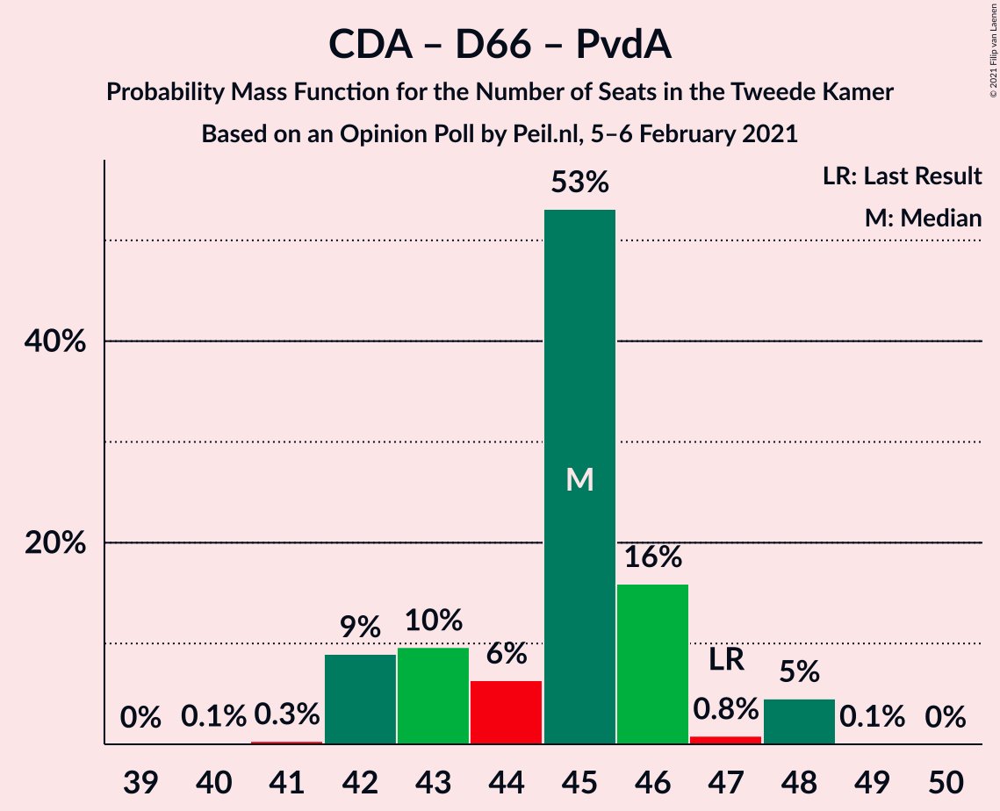

| Number of Seats | Probability | Accumulated | Special Marks |
|:---------------:|:-----------:|:-----------:|:-------------:|
| 40 | 0.1% | 100% |  |
| 41 | 0.3% | 99.9% |  |
| 42 | 9% | 99.5% |  |
| 43 | 10% | 91% |  |
| 44 | 6% | 81% |  |
| 45 | 53% | 75% | Median |
| 46 | 16% | 21% |  |
| 47 | 0.8% | 6% | Last Result |
| 48 | 5% | 5% |  |
| 49 | 0.1% | 0.1% |  |
| 50 | 0% | 0% |  |

### Christen-Democratisch Appèl – Partij van de Arbeid – ChristenUnie

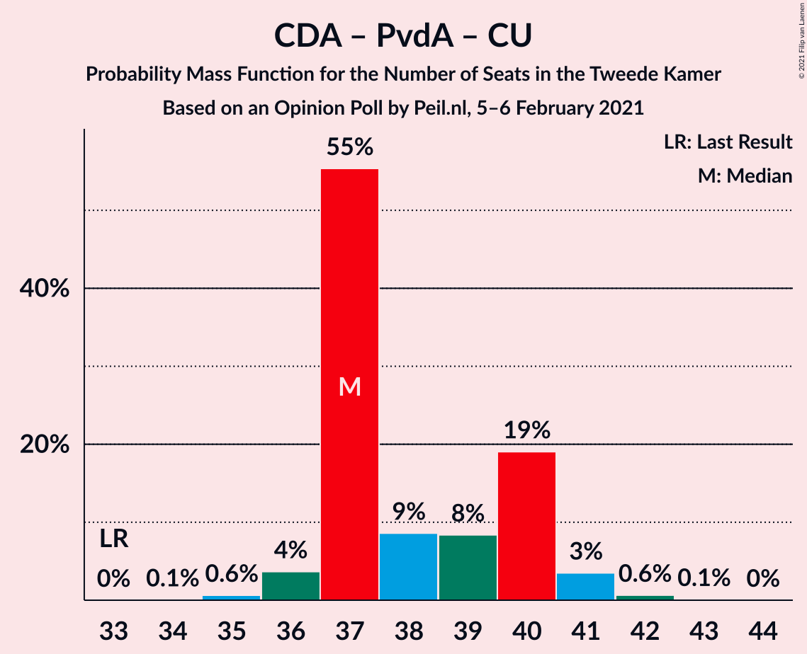

| Number of Seats | Probability | Accumulated | Special Marks |
|:---------------:|:-----------:|:-----------:|:-------------:|
| 33 | 0% | 100% | Last Result |
| 34 | 0.1% | 100% |  |
| 35 | 0.6% | 99.9% |  |
| 36 | 4% | 99.3% |  |
| 37 | 55% | 96% | Median |
| 38 | 9% | 40% |  |
| 39 | 8% | 32% |  |
| 40 | 19% | 23% |  |
| 41 | 3% | 4% |  |
| 42 | 0.6% | 0.8% |  |
| 43 | 0.1% | 0.1% |  |
| 44 | 0% | 0% |  |

### Christen-Democratisch Appèl – Partij van de Arbeid

| Number of Seats | Probability | Accumulated | Special Marks |
|:---------------:|:-----------:|:-----------:|:-------------:|
| 28 | 0.2% | 100% | Last Result |
| 29 | 3% | 99.7% |  |
| 30 | 63% | 97% | Median |
| 31 | 7% | 33% |  |
| 32 | 5% | 26% |  |
| 33 | 16% | 21% |  |
| 34 | 0.7% | 5% |  |
| 35 | 4% | 4% |  |
| 36 | 0.1% | 0.1% |  |
| 37 | 0% | 0% |  |

### Christen-Democratisch Appèl – Democraten 66

| Number of Seats | Probability | Accumulated | Special Marks |
|:---------------:|:-----------:|:-----------:|:-------------:|
| 28 | 2% | 100% |  |
| 29 | 4% | 98% |  |
| 30 | 13% | 94% |  |
| 31 | 7% | 81% |  |
| 32 | 70% | 74% | Median |
| 33 | 3% | 4% |  |
| 34 | 0.4% | 0.9% |  |
| 35 | 0.4% | 0.5% |  |
| 36 | 0.1% | 0.1% |  |
| 37 | 0% | 0% |  |
| 38 | 0% | 0% | Last Result |

## Technical Information

### Opinion Poll

+ **Polling firm:** Peil.nl
+ **Commissioner(s):** —
+ **Fieldwork period:** 5–6 February 2021

### Calculations

+ **Sample size:** 3000
+ **Simulations done:** 1,048,576
+ **Error estimate:** 1.19%

