# Opinion Poll by Peil.nl, 7 February 2021

<a href="#voting-intentions">Voting Intentions</a> | <a href="#seats">Seats</a> | <a href="#coalitions">Coalitions</a> | <a href="#technical-information">Technical Information</a>

## Voting Intentions

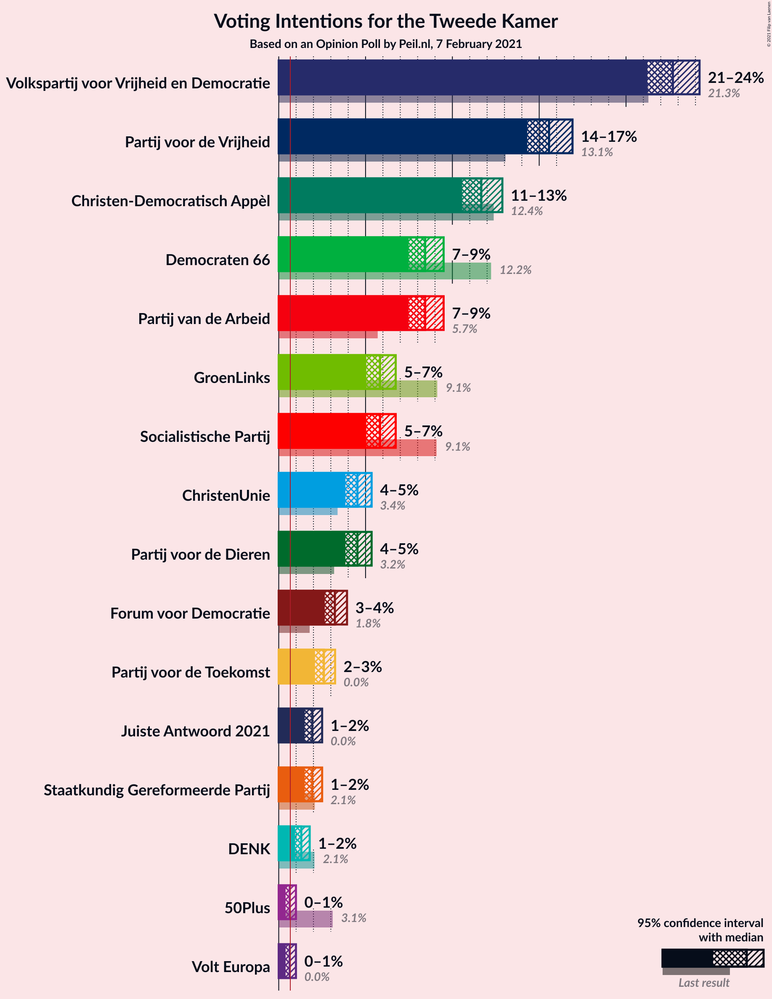

### Confidence Intervals

| Party | Last Result | Poll Result | 80% Confidence Interval | 90% Confidence Interval | 95% Confidence Interval | 99% Confidence Interval |
|:-----:|:-----------:|:-----------:|:-----------------------:|:-----------------------:|:-----------------------:|:-----------------------:|
| Volkspartij voor Vrijheid en Democratie | 21.3% | 22.7% | 21.7–23.7% |21.5–24.0% |21.2–24.2% |20.8–24.7% |
| Partij voor de Vrijheid | 13.1% | 15.6% | 14.7–16.4% |14.5–16.7% |14.3–16.9% |13.9–17.3% |
| Christen-Democratisch Appèl | 12.4% | 11.7% | 10.9–12.5% |10.7–12.7% |10.6–12.9% |10.2–13.3% |
| Democraten 66 | 12.2% | 8.4% | 7.8–9.1% |7.6–9.3% |7.5–9.5% |7.2–9.8% |
| Partij van de Arbeid | 5.7% | 8.4% | 7.8–9.1% |7.6–9.3% |7.5–9.5% |7.2–9.8% |
| GroenLinks | 9.1% | 5.8% | 5.3–6.4% |5.2–6.6% |5.0–6.7% |4.8–7.0% |
| Socialistische Partij | 9.1% | 5.8% | 5.3–6.4% |5.2–6.6% |5.0–6.7% |4.8–7.0% |
| ChristenUnie | 3.4% | 4.5% | 4.1–5.1% |3.9–5.2% |3.8–5.3% |3.6–5.6% |
| Partij voor de Dieren | 3.2% | 4.5% | 4.1–5.1% |3.9–5.2% |3.8–5.3% |3.6–5.6% |
| Forum voor Democratie | 1.8% | 3.2% | 2.9–3.7% |2.7–3.8% |2.7–3.9% |2.5–4.2% |
| Partij voor de Toekomst | 0.0% | 2.6% | 2.3–3.0% |2.2–3.1% |2.1–3.2% |1.9–3.4% |
| Staatkundig Gereformeerde Partij | 2.1% | 1.9% | 1.6–2.3% |1.6–2.4% |1.5–2.5% |1.4–2.7% |
| Juiste Antwoord 2021 | 0.0% | 1.9% | 1.6–2.3% |1.6–2.4% |1.5–2.5% |1.4–2.7% |
| DENK | 2.1% | 1.3% | 1.1–1.6% |1.0–1.7% |0.9–1.8% |0.9–1.9% |
| 50Plus | 3.1% | 0.6% | 0.5–0.9% |0.4–0.9% |0.4–1.0% |0.3–1.1% |
| Volt Europa | 0.0% | 0.6% | 0.5–0.9% |0.4–0.9% |0.4–1.0% |0.3–1.1% |

*Note:* The poll result column reflects the actual value used in the calculations. Published results may vary slightly, and in addition be rounded to fewer digits.

## Seats

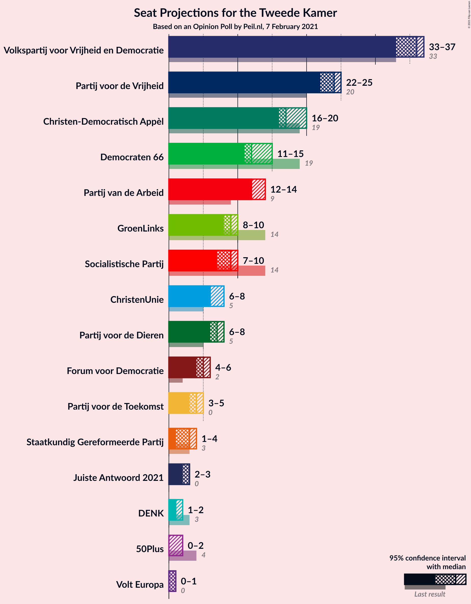

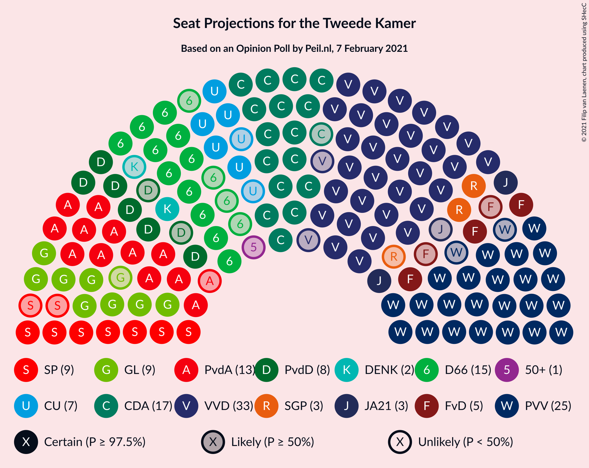

### Confidence Intervals

| Party | Last Result | Median | 80% Confidence Interval | 90% Confidence Interval | 95% Confidence Interval | 99% Confidence Interval |
|:-----:|:-----------:|:------:|:-----------------------:|:-----------------------:|:-----------------------:|:-----------------------:|
| <a href="#volkspartij-voor-vrijheid-en-democratie">Volkspartij voor Vrijheid en Democratie</a> | 33 | 35 | 35 |35–36 |35–38 |32–38 |
| <a href="#partij-voor-de-vrijheid">Partij voor de Vrijheid</a> | 20 | 22 | 22–25 |22–25 |22–26 |22–26 |
| <a href="#christen-democratisch-appèl">Christen-Democratisch Appèl</a> | 19 | 18 | 18–20 |17–20 |17–20 |16–20 |
| <a href="#democraten-66">Democraten 66</a> | 19 | 13 | 12–13 |12–13 |12–13 |12–14 |
| <a href="#partij-van-de-arbeid">Partij van de Arbeid</a> | 9 | 15 | 12–15 |12–15 |12–15 |12–15 |
| <a href="#groenlinks">GroenLinks</a> | 14 | 8 | 8–9 |8–9 |7–9 |7–10 |
| <a href="#socialistische-partij">Socialistische Partij</a> | 14 | 9 | 7–9 |7–9 |7–11 |6–11 |
| <a href="#christenunie">ChristenUnie</a> | 5 | 8 | 8 |7–8 |6–8 |6–8 |
| <a href="#partij-voor-de-dieren">Partij voor de Dieren</a> | 5 | 7 | 6–7 |6–7 |6–7 |5–8 |
| <a href="#forum-voor-democratie">Forum voor Democratie</a> | 2 | 5 | 5–6 |4–6 |4–6 |4–6 |
| <a href="#partij-voor-de-toekomst">Partij voor de Toekomst</a> | 0 | 4 | 3–4 |3–4 |3–4 |3–4 |
| <a href="#staatkundig-gereformeerde-partij">Staatkundig Gereformeerde Partij</a> | 3 | 2 | 2–3 |2–3 |2–4 |2–4 |
| <a href="#juiste-antwoord-2021">Juiste Antwoord 2021</a> | 0 | 2 | 2 |2–3 |2–3 |2–3 |
| <a href="#denk">DENK</a> | 3 | 1 | 1 |1–2 |1–2 |1–2 |
| <a href="#50plus">50Plus</a> | 4 | 1 | 1 |1 |0–1 |0–1 |
| <a href="#volt-europa">Volt Europa</a> | 0 | 0 | 0 |0–1 |0–1 |0–1 |

### Volkspartij voor Vrijheid en Democratie

*For a full overview of the results for this party, see the [Volkspartij voor Vrijheid en Democratie](party-volkspartijvoorvrijheidendemocratie.html) page.*

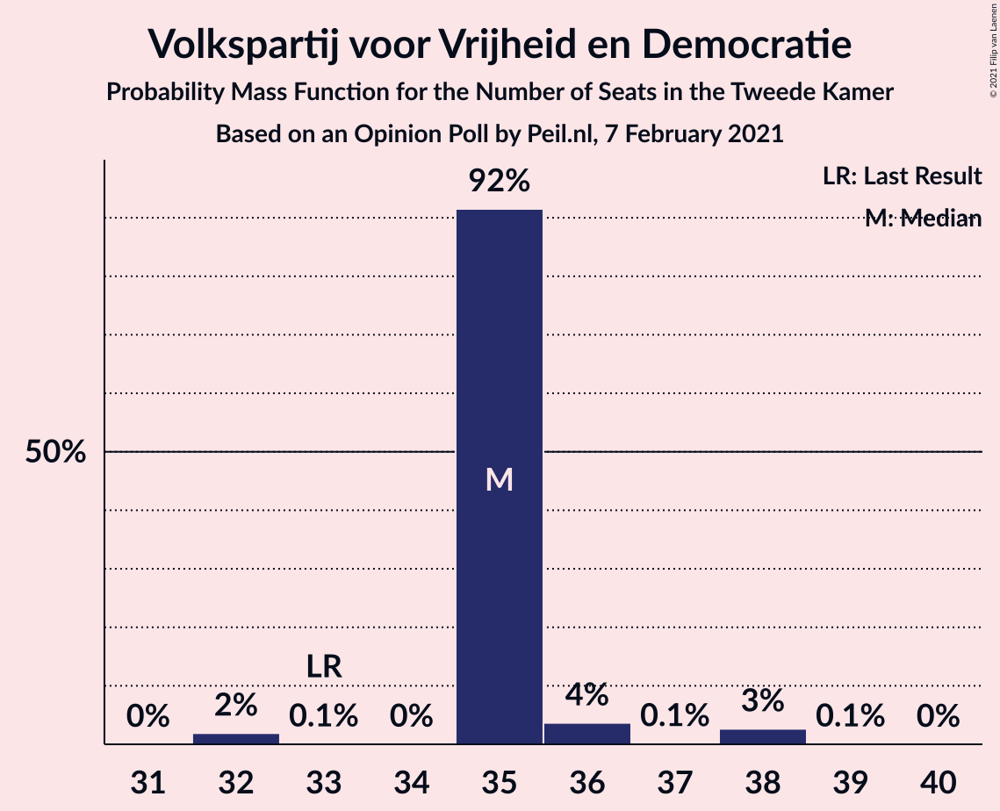

| Number of Seats | Probability | Accumulated | Special Marks |
|:---------------:|:-----------:|:-----------:|:-------------:|
| 32 | 2% | 100% |  |
| 33 | 0.1% | 98% | Last Result |
| 34 | 0% | 98% |  |
| 35 | 92% | 98% | Median |
| 36 | 4% | 6% |  |
| 37 | 0.1% | 3% |  |
| 38 | 3% | 3% |  |
| 39 | 0.1% | 0.1% |  |
| 40 | 0% | 0% |  |

### Partij voor de Vrijheid

*For a full overview of the results for this party, see the [Partij voor de Vrijheid](party-partijvoordevrijheid.html) page.*

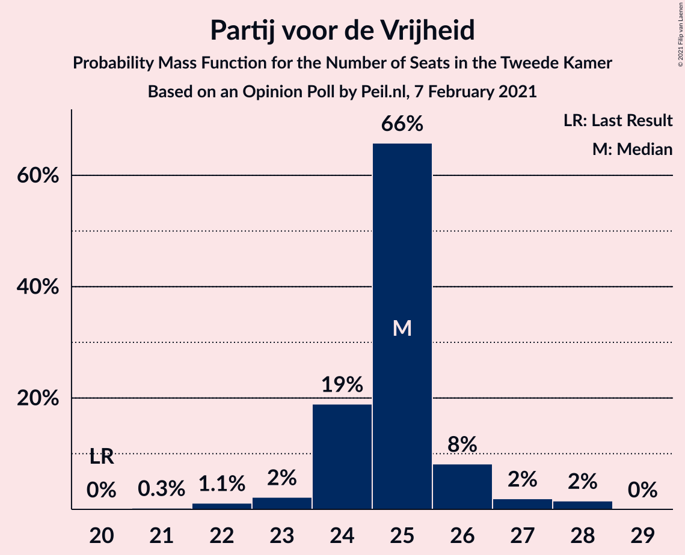

| Number of Seats | Probability | Accumulated | Special Marks |
|:---------------:|:-----------:|:-----------:|:-------------:|
| 20 | 0% | 100% | Last Result |
| 21 | 0.1% | 100% |  |
| 22 | 55% | 99.9% | Median |
| 23 | 0.1% | 45% |  |
| 24 | 0.4% | 44% |  |
| 25 | 41% | 44% |  |
| 26 | 3% | 3% |  |
| 27 | 0% | 0% |  |

### Christen-Democratisch Appèl

*For a full overview of the results for this party, see the [Christen-Democratisch Appèl](party-christen-democratischappèl.html) page.*

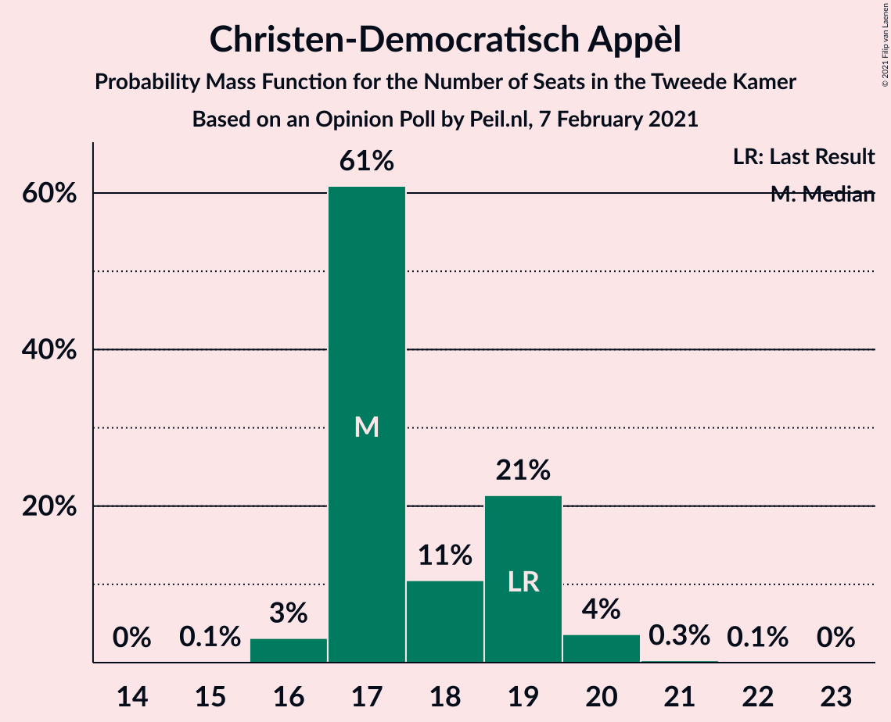

| Number of Seats | Probability | Accumulated | Special Marks |
|:---------------:|:-----------:|:-----------:|:-------------:|
| 16 | 0.7% | 100% |  |
| 17 | 5% | 99.3% |  |
| 18 | 53% | 94% | Median |
| 19 | 0% | 41% | Last Result |
| 20 | 41% | 41% |  |
| 21 | 0.3% | 0.3% |  |
| 22 | 0% | 0% |  |

### Democraten 66

*For a full overview of the results for this party, see the [Democraten 66](party-democraten66.html) page.*

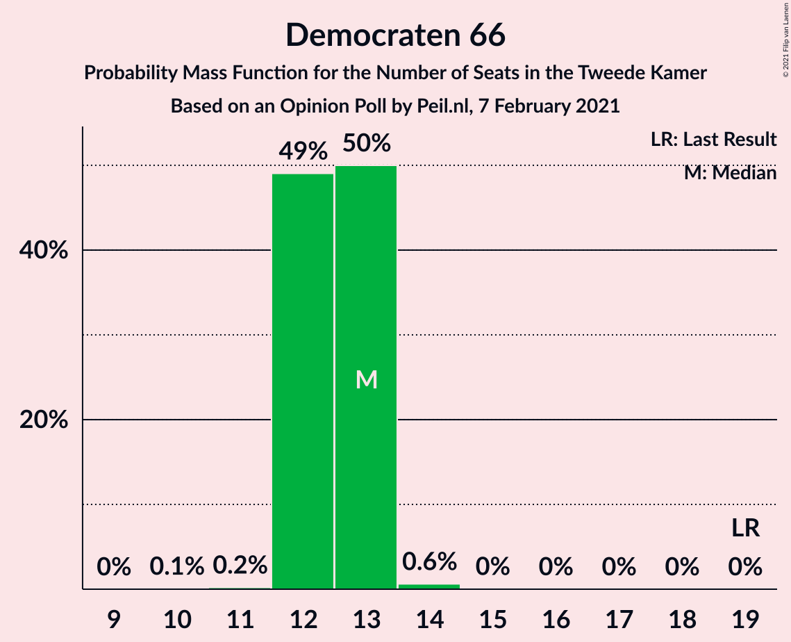

| Number of Seats | Probability | Accumulated | Special Marks |
|:---------------:|:-----------:|:-----------:|:-------------:|
| 10 | 0.1% | 100% |  |
| 11 | 0.2% | 99.9% |  |
| 12 | 49% | 99.7% |  |
| 13 | 50% | 51% | Median |
| 14 | 0.6% | 0.7% |  |
| 15 | 0% | 0.1% |  |
| 16 | 0% | 0% |  |
| 17 | 0% | 0% |  |
| 18 | 0% | 0% |  |
| 19 | 0% | 0% | Last Result |

### Partij van de Arbeid

*For a full overview of the results for this party, see the [Partij van de Arbeid](party-partijvandearbeid.html) page.*

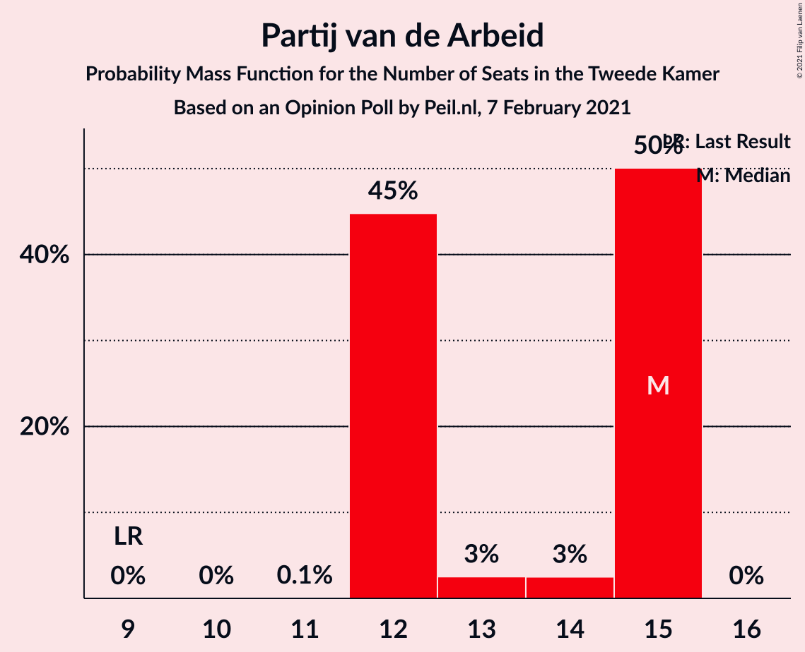

| Number of Seats | Probability | Accumulated | Special Marks |
|:---------------:|:-----------:|:-----------:|:-------------:|
| 9 | 0% | 100% | Last Result |
| 10 | 0% | 100% |  |
| 11 | 0.1% | 100% |  |
| 12 | 45% | 99.9% |  |
| 13 | 3% | 55% |  |
| 14 | 3% | 53% |  |
| 15 | 50% | 50% | Median |
| 16 | 0% | 0% |  |

### GroenLinks

*For a full overview of the results for this party, see the [GroenLinks](party-groenlinks.html) page.*

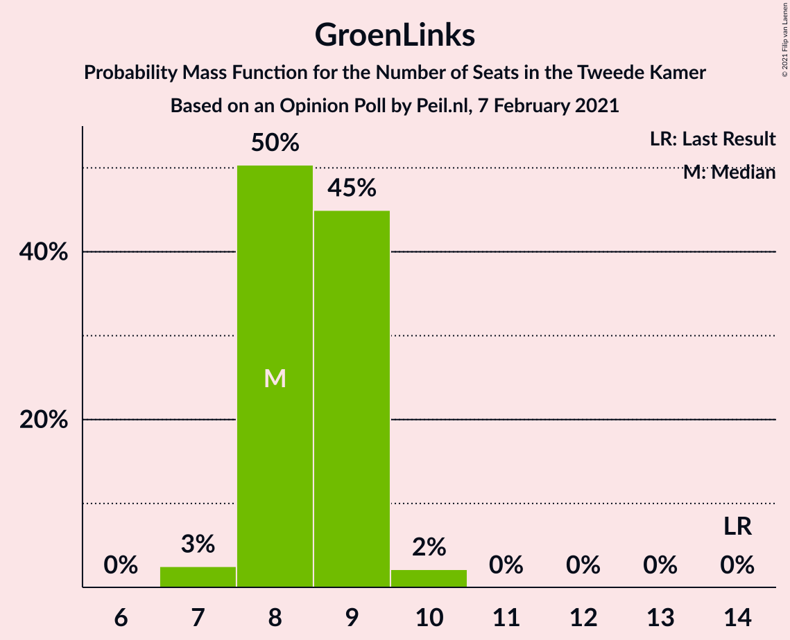

| Number of Seats | Probability | Accumulated | Special Marks |
|:---------------:|:-----------:|:-----------:|:-------------:|
| 7 | 3% | 100% |  |
| 8 | 50% | 97% | Median |
| 9 | 45% | 47% |  |
| 10 | 2% | 2% |  |
| 11 | 0% | 0% |  |
| 12 | 0% | 0% |  |
| 13 | 0% | 0% |  |
| 14 | 0% | 0% | Last Result |

### Socialistische Partij

*For a full overview of the results for this party, see the [Socialistische Partij](party-socialistischepartij.html) page.*

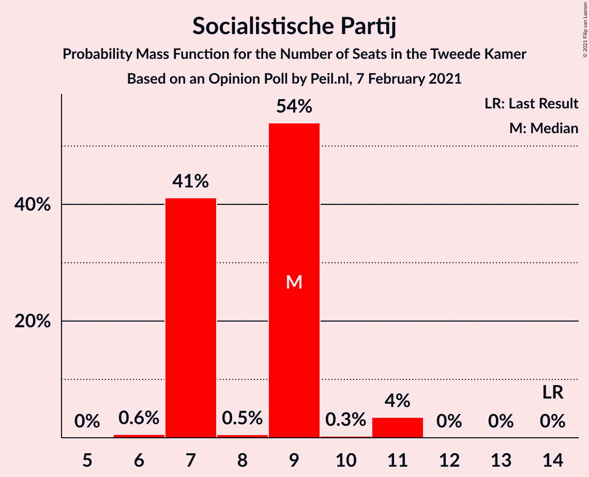

| Number of Seats | Probability | Accumulated | Special Marks |
|:---------------:|:-----------:|:-----------:|:-------------:|
| 6 | 0.6% | 100% |  |
| 7 | 41% | 99.4% |  |
| 8 | 0.5% | 58% |  |
| 9 | 54% | 58% | Median |
| 10 | 0.3% | 4% |  |
| 11 | 4% | 4% |  |
| 12 | 0% | 0% |  |
| 13 | 0% | 0% |  |
| 14 | 0% | 0% | Last Result |

### ChristenUnie

*For a full overview of the results for this party, see the [ChristenUnie](party-christenunie.html) page.*

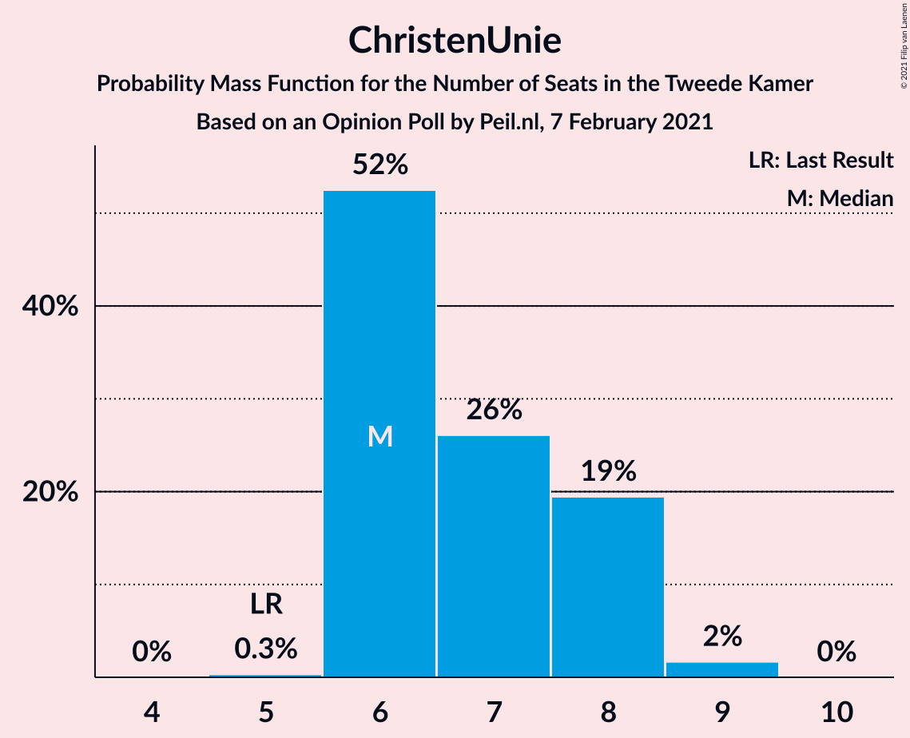

| Number of Seats | Probability | Accumulated | Special Marks |
|:---------------:|:-----------:|:-----------:|:-------------:|
| 5 | 0% | 100% | Last Result |
| 6 | 3% | 100% |  |
| 7 | 3% | 97% |  |
| 8 | 94% | 94% | Median |
| 9 | 0% | 0% |  |

### Partij voor de Dieren

*For a full overview of the results for this party, see the [Partij voor de Dieren](party-partijvoordedieren.html) page.*

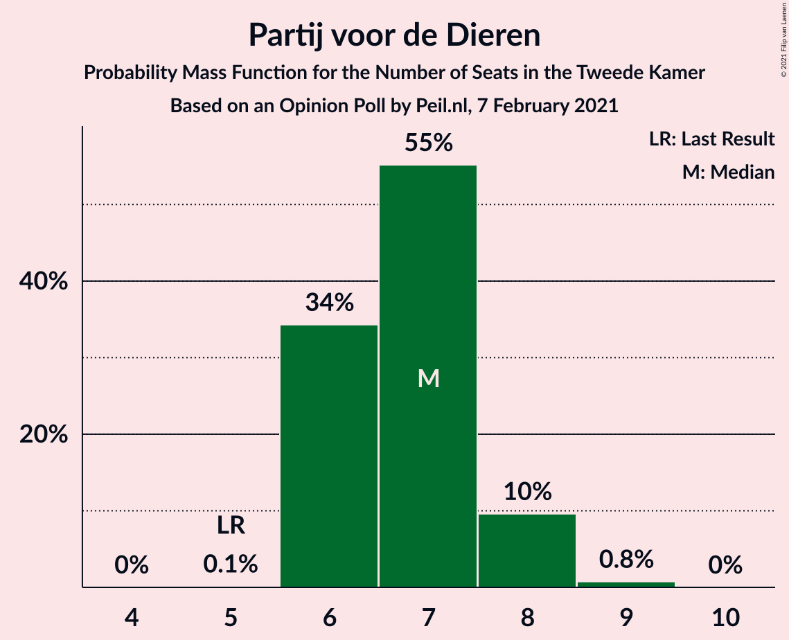

| Number of Seats | Probability | Accumulated | Special Marks |
|:---------------:|:-----------:|:-----------:|:-------------:|
| 4 | 0.4% | 100% |  |
| 5 | 0.2% | 99.6% | Last Result |
| 6 | 45% | 99.3% |  |
| 7 | 54% | 55% | Median |
| 8 | 0.7% | 0.7% |  |
| 9 | 0% | 0% |  |

### Forum voor Democratie

*For a full overview of the results for this party, see the [Forum voor Democratie](party-forumvoordemocratie.html) page.*

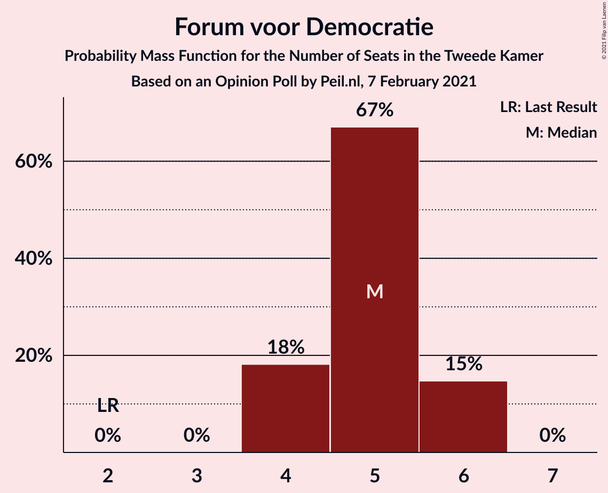

| Number of Seats | Probability | Accumulated | Special Marks |
|:---------------:|:-----------:|:-----------:|:-------------:|
| 2 | 0% | 100% | Last Result |
| 3 | 0% | 100% |  |
| 4 | 6% | 100% |  |
| 5 | 53% | 94% | Median |
| 6 | 41% | 41% |  |
| 7 | 0% | 0% |  |

### Partij voor de Toekomst

*For a full overview of the results for this party, see the [Partij voor de Toekomst](party-partijvoordetoekomst.html) page.*

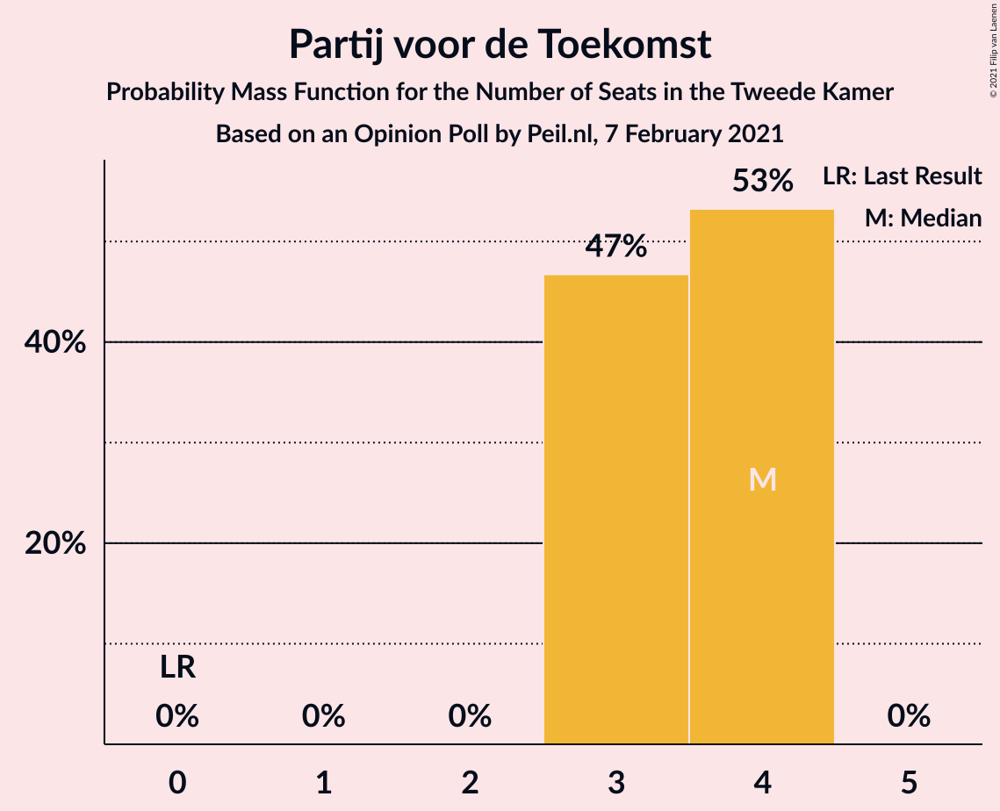

| Number of Seats | Probability | Accumulated | Special Marks |
|:---------------:|:-----------:|:-----------:|:-------------:|
| 0 | 0% | 100% | Last Result |
| 1 | 0% | 100% |  |
| 2 | 0% | 100% |  |
| 3 | 47% | 100% |  |
| 4 | 53% | 53% | Median |
| 5 | 0% | 0% |  |

### Staatkundig Gereformeerde Partij

*For a full overview of the results for this party, see the [Staatkundig Gereformeerde Partij](party-staatkundiggereformeerdepartij.html) page.*

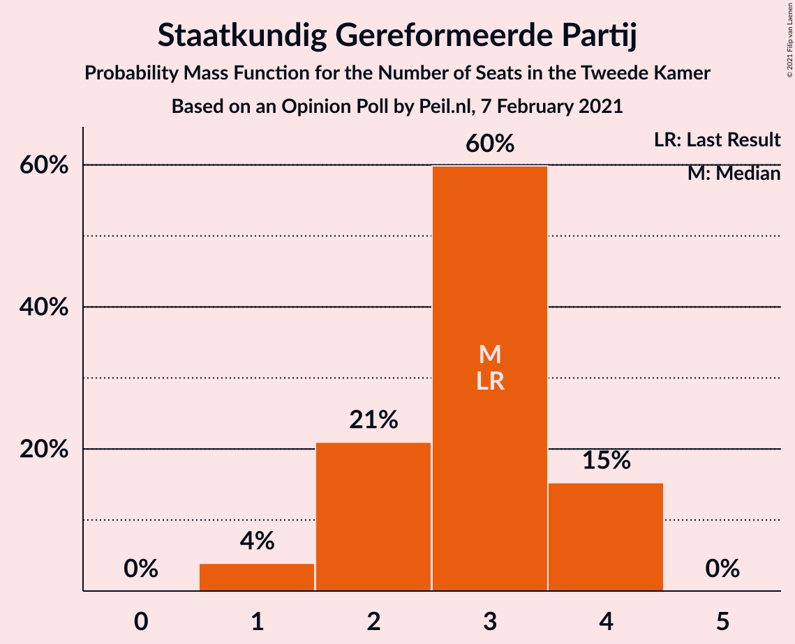

| Number of Seats | Probability | Accumulated | Special Marks |
|:---------------:|:-----------:|:-----------:|:-------------:|
| 2 | 50% | 100% | Median |
| 3 | 46% | 50% | Last Result |
| 4 | 4% | 4% |  |
| 5 | 0% | 0% |  |

### Juiste Antwoord 2021

*For a full overview of the results for this party, see the [Juiste Antwoord 2021](party-juisteantwoord2021.html) page.*

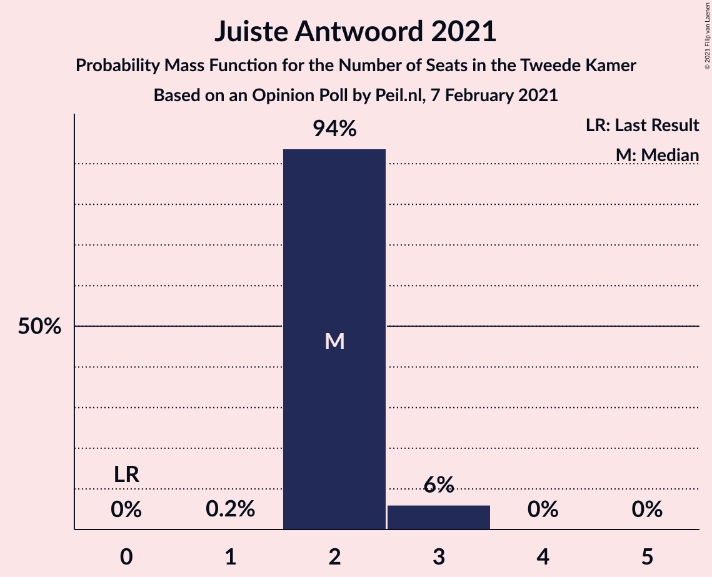

| Number of Seats | Probability | Accumulated | Special Marks |
|:---------------:|:-----------:|:-----------:|:-------------:|
| 0 | 0% | 100% | Last Result |
| 1 | 0.2% | 100% |  |
| 2 | 94% | 99.8% | Median |
| 3 | 6% | 6% |  |
| 4 | 0% | 0.1% |  |
| 5 | 0% | 0% |  |

### DENK

*For a full overview of the results for this party, see the [DENK](party-denk.html) page.*

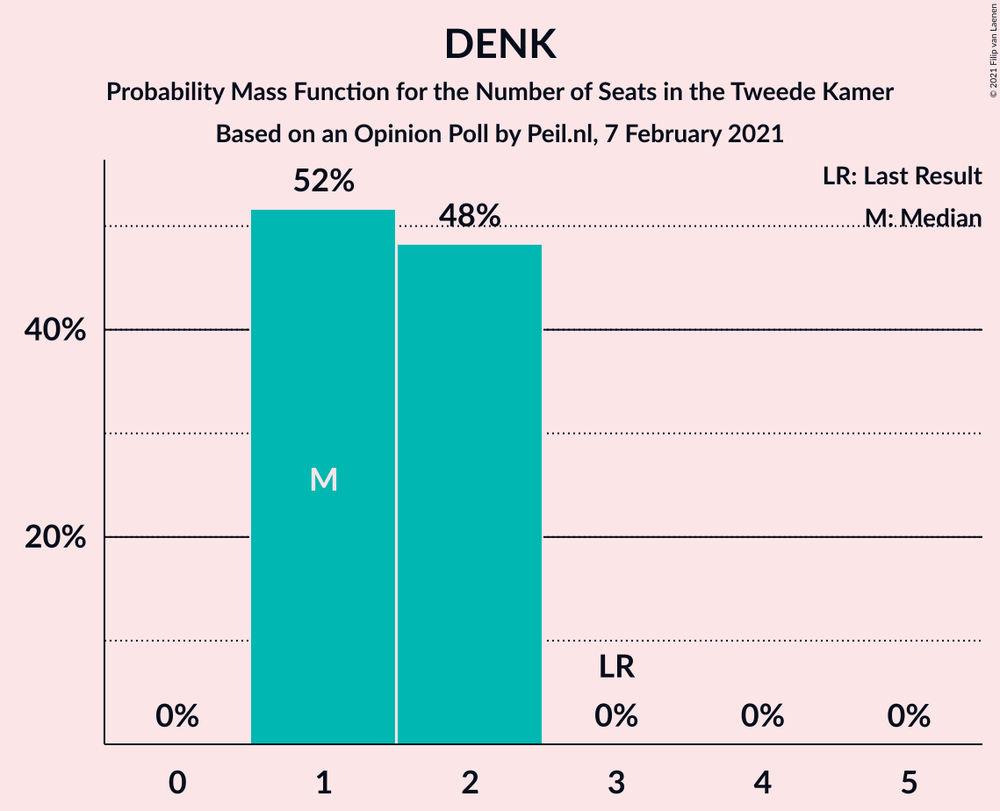

| Number of Seats | Probability | Accumulated | Special Marks |
|:---------------:|:-----------:|:-----------:|:-------------:|
| 1 | 92% | 100% | Median |
| 2 | 8% | 8% |  |
| 3 | 0% | 0% | Last Result |

### 50Plus

*For a full overview of the results for this party, see the [50Plus](party-50plus.html) page.*

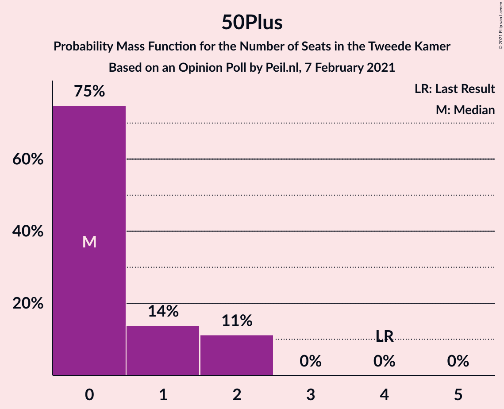

| Number of Seats | Probability | Accumulated | Special Marks |
|:---------------:|:-----------:|:-----------:|:-------------:|
| 0 | 3% | 100% |  |
| 1 | 97% | 97% | Median |
| 2 | 0% | 0% |  |
| 3 | 0% | 0% |  |
| 4 | 0% | 0% | Last Result |

### Volt Europa

*For a full overview of the results for this party, see the [Volt Europa](party-volteuropa.html) page.*

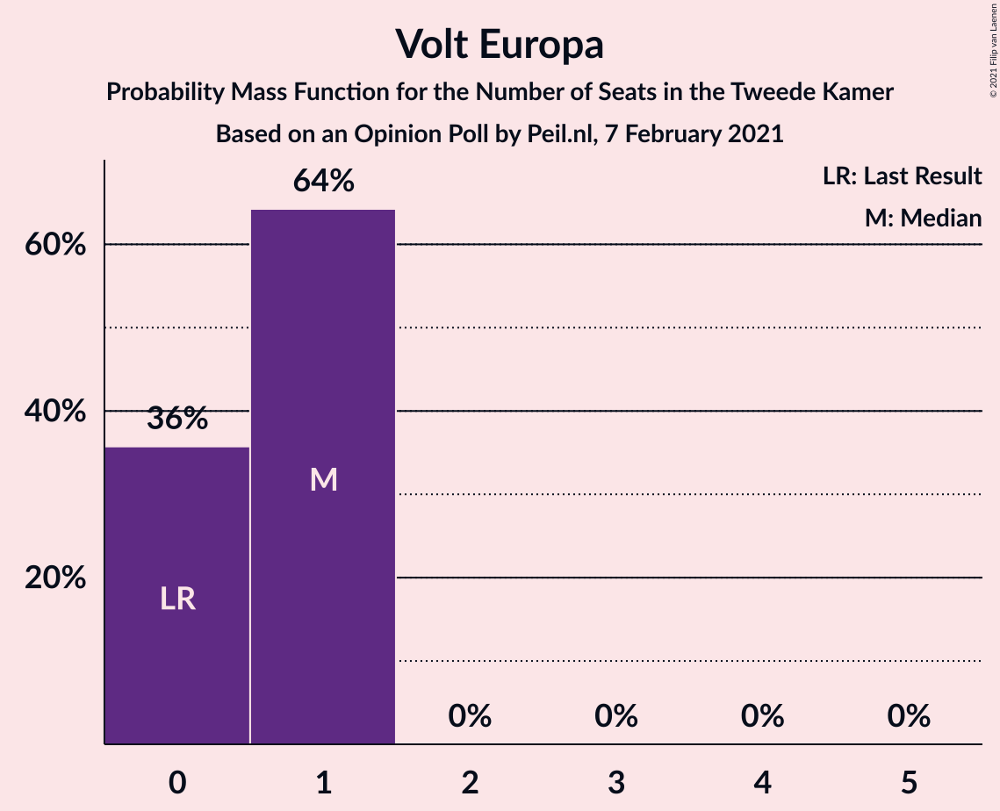

| Number of Seats | Probability | Accumulated | Special Marks |
|:---------------:|:-----------:|:-----------:|:-------------:|
| 0 | 95% | 100% | Last Result, Median |
| 1 | 5% | 5% |  |
| 2 | 0% | 0% |  |

## Coalitions

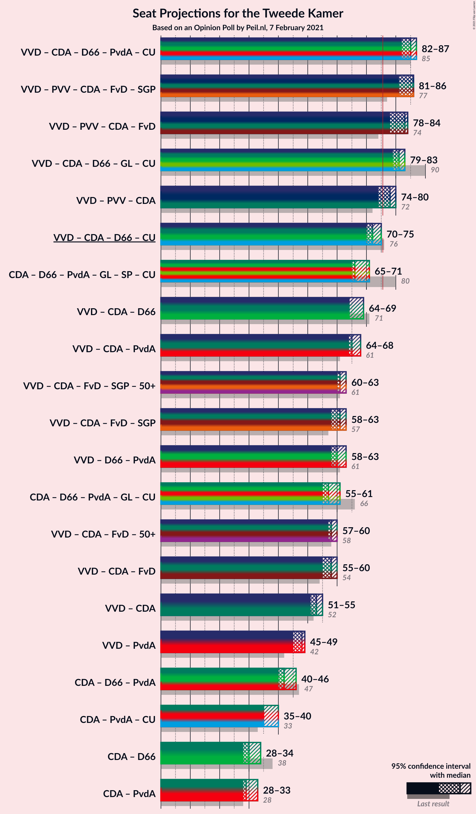

### Confidence Intervals

| Coalition | Last Result | Median | Majority? | 80% Confidence Interval | 90% Confidence Interval | 95% Confidence Interval | 99% Confidence Interval |
|:---------:|:-----------:|:------:|:---------:|:-----------------------:|:-----------------------:|:-----------------------:|:-----------------------:|
| Volkspartij voor Vrijheid en Democratie – Christen-Democratisch Appèl – Democraten 66 – Partij van de Arbeid – ChristenUnie | 85 | 88 | 100% | 87–89 | 85–89 | 85–89 | 82–89 |
| Volkspartij voor Vrijheid en Democratie – Partij voor de Vrijheid – Christen-Democratisch Appèl – Forum voor Democratie – Staatkundig Gereformeerde Partij | 77 | 82 | 100% | 82–89 | 82–89 | 82–89 | 82–89 |
| Volkspartij voor Vrijheid en Democratie – Partij voor de Vrijheid – Christen-Democratisch Appèl – Forum voor Democratie | 74 | 80 | 100% | 80–86 | 79–86 | 79–86 | 79–86 |
| Volkspartij voor Vrijheid en Democratie – Christen-Democratisch Appèl – Democraten 66 – GroenLinks – ChristenUnie | 90 | 82 | 100% | 82–84 | 81–84 | 80–84 | 78–84 |
| Volkspartij voor Vrijheid en Democratie – Partij voor de Vrijheid – Christen-Democratisch Appèl | 72 | 75 | 45% | 75–80 | 75–80 | 75–80 | 75–80 |
| Volkspartij voor Vrijheid en Democratie – Christen-Democratisch Appèl – Democraten 66 – ChristenUnie | 76 | 74 | 0.3% | 74–75 | 73–75 | 72–75 | 68–75 |
| Christen-Democratisch Appèl – Democraten 66 – Partij van de Arbeid – GroenLinks – Socialistische Partij – ChristenUnie | 80 | 70 | 0% | 68–71 | 68–71 | 65–71 | 65–71 |
| Volkspartij voor Vrijheid en Democratie – Christen-Democratisch Appèl – Partij van de Arbeid | 61 | 68 | 0% | 67–68 | 65–68 | 65–69 | 63–69 |
| Volkspartij voor Vrijheid en Democratie – Christen-Democratisch Appèl – Democraten 66 | 71 | 66 | 0% | 66–67 | 65–67 | 65–68 | 61–68 |
| Volkspartij voor Vrijheid en Democratie – Christen-Democratisch Appèl – Forum voor Democratie – Staatkundig Gereformeerde Partij – 50Plus | 61 | 61 | 0% | 61–65 | 61–65 | 59–65 | 56–65 |
| Volkspartij voor Vrijheid en Democratie – Christen-Democratisch Appèl – Forum voor Democratie – Staatkundig Gereformeerde Partij | 57 | 60 | 0% | 60–64 | 60–64 | 59–64 | 56–64 |
| Volkspartij voor Vrijheid en Democratie – Democraten 66 – Partij van de Arbeid | 61 | 63 | 0% | 59–63 | 59–63 | 59–63 | 58–63 |
| Volkspartij voor Vrijheid en Democratie – Christen-Democratisch Appèl – Forum voor Democratie – 50Plus | 58 | 59 | 0% | 59–62 | 58–62 | 56–62 | 53–62 |
| Christen-Democratisch Appèl – Democraten 66 – Partij van de Arbeid – GroenLinks – ChristenUnie | 66 | 61 | 0% | 61–62 | 58–62 | 56–62 | 56–62 |
| Volkspartij voor Vrijheid en Democratie – Christen-Democratisch Appèl – Forum voor Democratie | 54 | 58 | 0% | 58–61 | 57–61 | 56–61 | 53–61 |
| Volkspartij voor Vrijheid en Democratie – Christen-Democratisch Appèl | 52 | 53 | 0% | 53–55 | 53–55 | 51–56 | 49–56 |
| Volkspartij voor Vrijheid en Democratie – Partij van de Arbeid | 42 | 50 | 0% | 47–50 | 47–50 | 47–51 | 46–51 |
| Christen-Democratisch Appèl – Democraten 66 – Partij van de Arbeid | 47 | 45 | 0% | 44–46 | 43–46 | 41–46 | 41–46 |
| Christen-Democratisch Appèl – Partij van de Arbeid – ChristenUnie | 33 | 40 | 0% | 40–41 | 37–41 | 37–41 | 37–41 |
| Christen-Democratisch Appèl – Partij van de Arbeid | 28 | 33 | 0% | 32–33 | 31–33 | 29–33 | 29–33 |
| Christen-Democratisch Appèl – Democraten 66 | 38 | 31 | 0% | 31–32 | 29–32 | 29–32 | 29–32 |

### Volkspartij voor Vrijheid en Democratie – Christen-Democratisch Appèl – Democraten 66 – Partij van de Arbeid – ChristenUnie

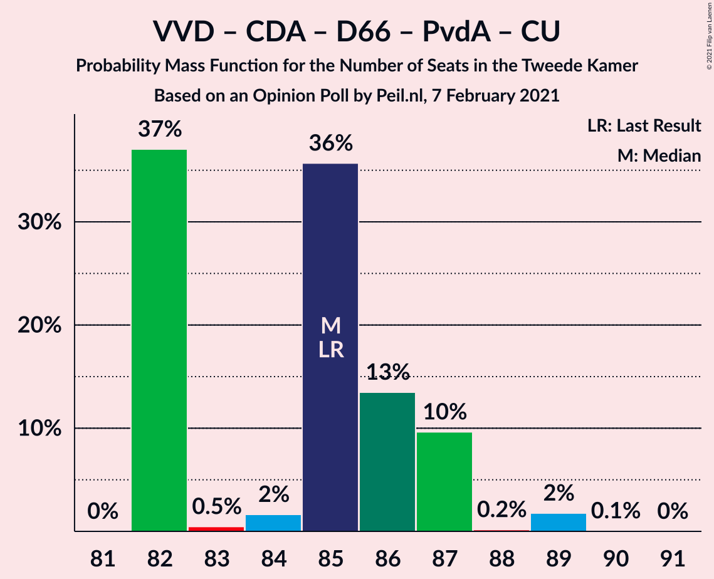

| Number of Seats | Probability | Accumulated | Special Marks |
|:---------------:|:-----------:|:-----------:|:-------------:|
| 82 | 2% | 100% |  |
| 83 | 0.1% | 98% |  |
| 84 | 0.1% | 98% |  |
| 85 | 3% | 98% | Last Result |
| 86 | 0.6% | 94% |  |
| 87 | 44% | 94% |  |
| 88 | 0.5% | 50% |  |
| 89 | 49% | 50% | Median |
| 90 | 0.2% | 0.2% |  |
| 91 | 0% | 0% |  |

### Volkspartij voor Vrijheid en Democratie – Partij voor de Vrijheid – Christen-Democratisch Appèl – Forum voor Democratie – Staatkundig Gereformeerde Partij

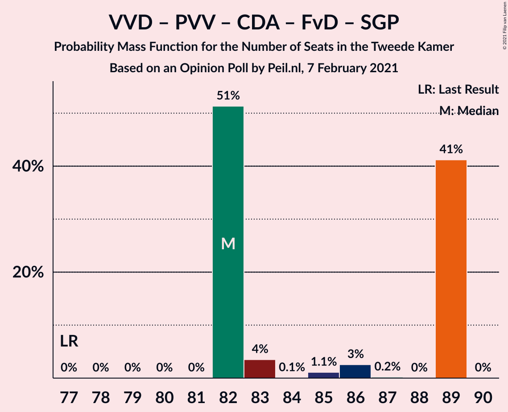

| Number of Seats | Probability | Accumulated | Special Marks |
|:---------------:|:-----------:|:-----------:|:-------------:|
| 77 | 0% | 100% | Last Result |
| 78 | 0% | 100% |  |
| 79 | 0% | 100% |  |
| 80 | 0% | 100% |  |
| 81 | 0% | 100% |  |
| 82 | 51% | 100% | Median |
| 83 | 4% | 49% |  |
| 84 | 0.1% | 45% |  |
| 85 | 1.1% | 45% |  |
| 86 | 3% | 44% |  |
| 87 | 0.2% | 41% |  |
| 88 | 0% | 41% |  |
| 89 | 41% | 41% |  |
| 90 | 0% | 0% |  |

### Volkspartij voor Vrijheid en Democratie – Partij voor de Vrijheid – Christen-Democratisch Appèl – Forum voor Democratie

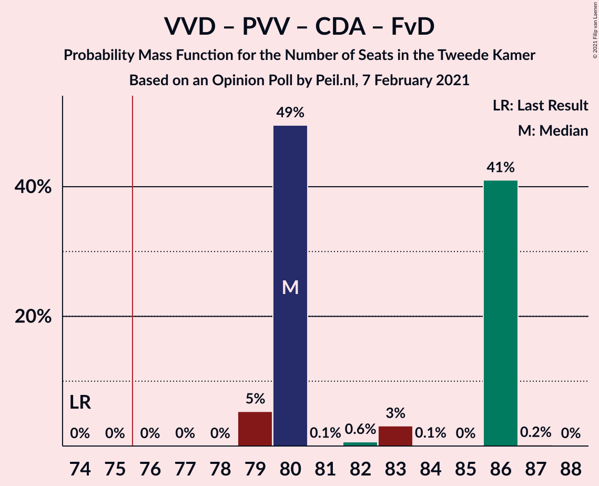

| Number of Seats | Probability | Accumulated | Special Marks |
|:---------------:|:-----------:|:-----------:|:-------------:|
| 74 | 0% | 100% | Last Result |
| 75 | 0% | 100% |  |
| 76 | 0% | 100% | Majority |
| 77 | 0% | 100% |  |
| 78 | 0% | 100% |  |
| 79 | 5% | 100% |  |
| 80 | 49% | 95% | Median |
| 81 | 0.1% | 45% |  |
| 82 | 0.6% | 45% |  |
| 83 | 3% | 44% |  |
| 84 | 0.1% | 41% |  |
| 85 | 0% | 41% |  |
| 86 | 41% | 41% |  |
| 87 | 0.2% | 0.2% |  |
| 88 | 0% | 0% |  |

### Volkspartij voor Vrijheid en Democratie – Christen-Democratisch Appèl – Democraten 66 – GroenLinks – ChristenUnie

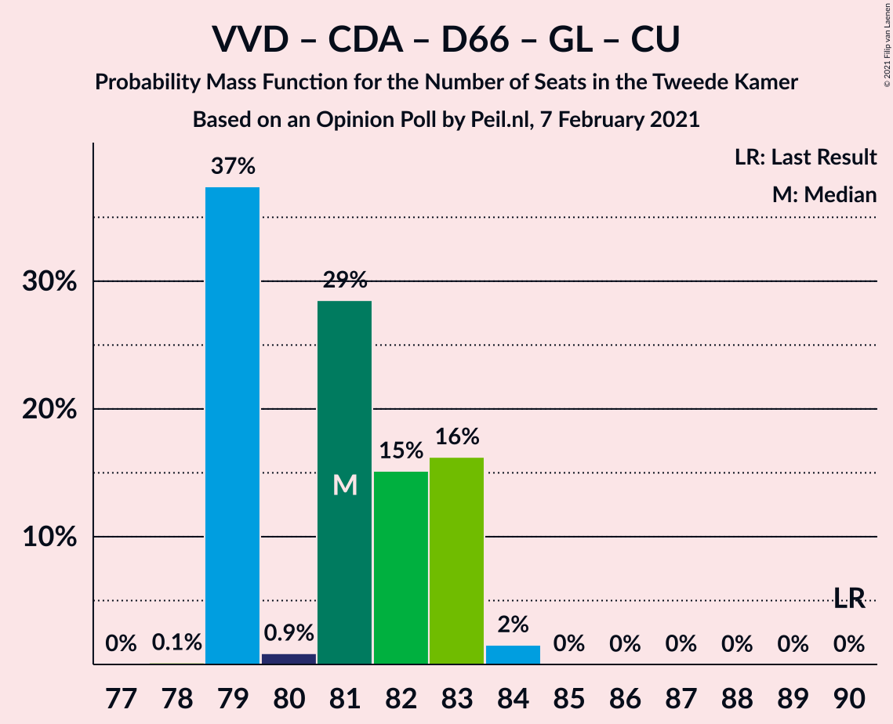

| Number of Seats | Probability | Accumulated | Special Marks |
|:---------------:|:-----------:|:-----------:|:-------------:|
| 78 | 2% | 100% |  |
| 79 | 0% | 98% |  |
| 80 | 0.6% | 98% |  |
| 81 | 3% | 97% |  |
| 82 | 54% | 95% | Median |
| 83 | 0.1% | 41% |  |
| 84 | 41% | 41% |  |
| 85 | 0% | 0.2% |  |
| 86 | 0.2% | 0.2% |  |
| 87 | 0% | 0% |  |
| 88 | 0% | 0% |  |
| 89 | 0% | 0% |  |
| 90 | 0% | 0% | Last Result |

### Volkspartij voor Vrijheid en Democratie – Partij voor de Vrijheid – Christen-Democratisch Appèl

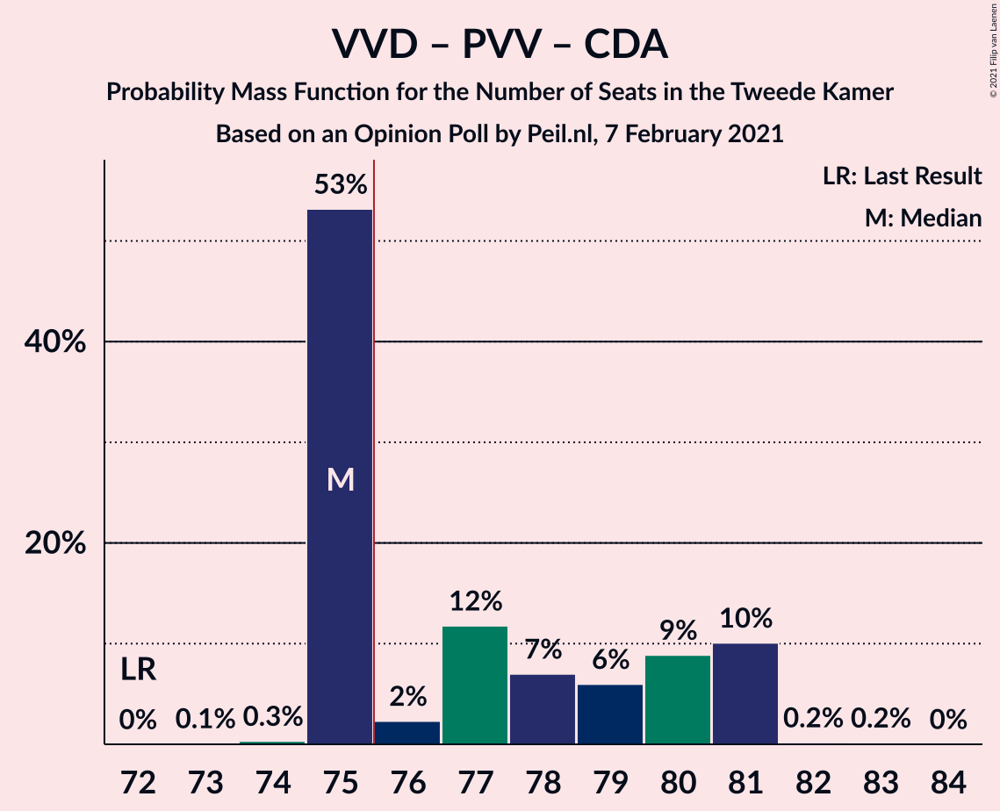

| Number of Seats | Probability | Accumulated | Special Marks |
|:---------------:|:-----------:|:-----------:|:-------------:|
| 72 | 0% | 100% | Last Result |
| 73 | 0% | 100% |  |
| 74 | 0% | 100% |  |
| 75 | 55% | 100% | Median |
| 76 | 0.1% | 45% | Majority |
| 77 | 0.7% | 45% |  |
| 78 | 3% | 44% |  |
| 79 | 0.5% | 42% |  |
| 80 | 41% | 41% |  |
| 81 | 0.1% | 0.2% |  |
| 82 | 0% | 0.2% |  |
| 83 | 0.2% | 0.2% |  |
| 84 | 0% | 0% |  |

### Volkspartij voor Vrijheid en Democratie – Christen-Democratisch Appèl – Democraten 66 – ChristenUnie

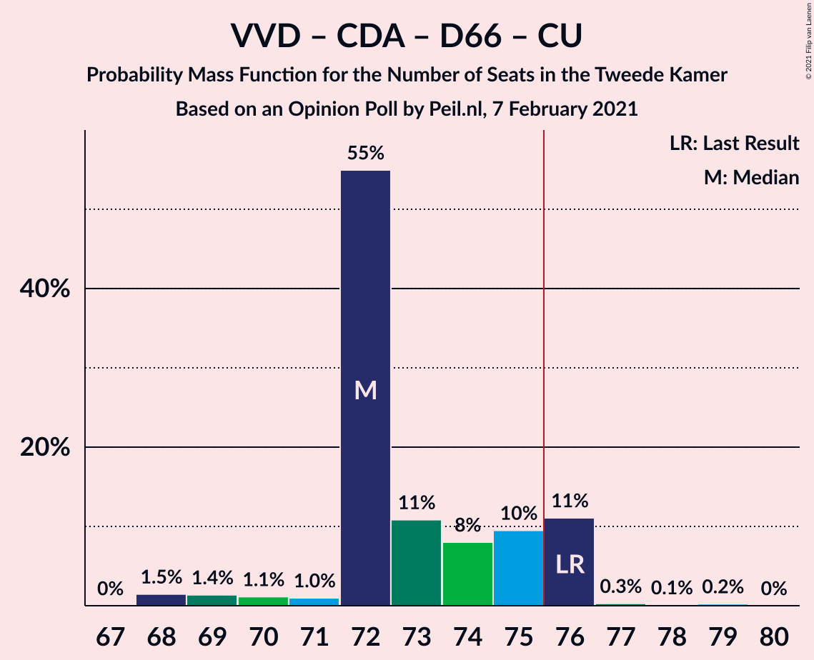

| Number of Seats | Probability | Accumulated | Special Marks |
|:---------------:|:-----------:|:-----------:|:-------------:|
| 68 | 2% | 100% |  |
| 69 | 0% | 98% |  |
| 70 | 0.1% | 98% |  |
| 71 | 0% | 98% |  |
| 72 | 0.8% | 98% |  |
| 73 | 4% | 97% |  |
| 74 | 52% | 93% | Median |
| 75 | 41% | 41% |  |
| 76 | 0% | 0.3% | Last Result, Majority |
| 77 | 0% | 0.2% |  |
| 78 | 0.2% | 0.2% |  |
| 79 | 0% | 0% |  |

### Christen-Democratisch Appèl – Democraten 66 – Partij van de Arbeid – GroenLinks – Socialistische Partij – ChristenUnie

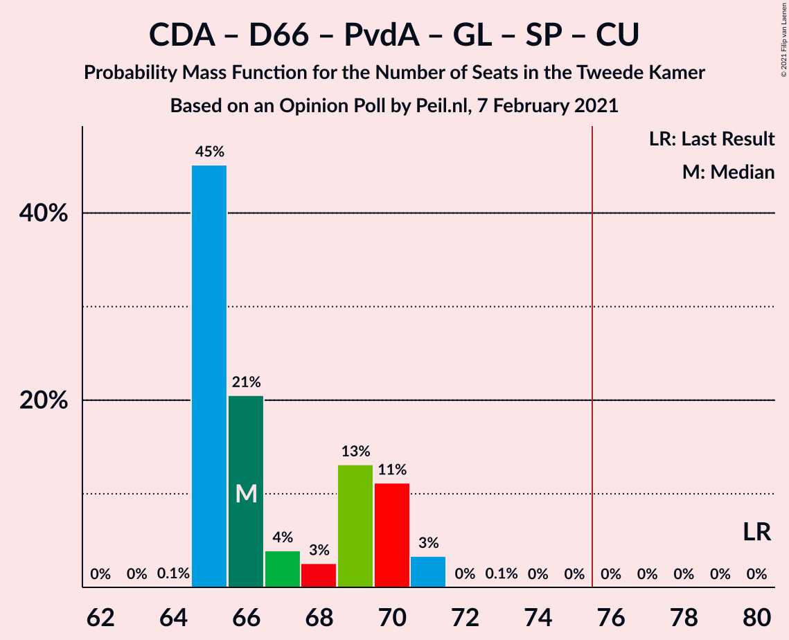

| Number of Seats | Probability | Accumulated | Special Marks |
|:---------------:|:-----------:|:-----------:|:-------------:|
| 64 | 0% | 100% |  |
| 65 | 3% | 99.9% |  |
| 66 | 0.1% | 97% |  |
| 67 | 0% | 97% |  |
| 68 | 41% | 97% |  |
| 69 | 5% | 56% |  |
| 70 | 0.7% | 50% |  |
| 71 | 49% | 49% | Median |
| 72 | 0% | 0% |  |
| 73 | 0% | 0% |  |
| 74 | 0% | 0% |  |
| 75 | 0% | 0% |  |
| 76 | 0% | 0% | Majority |
| 77 | 0% | 0% |  |
| 78 | 0% | 0% |  |
| 79 | 0% | 0% |  |
| 80 | 0% | 0% | Last Result |

### Volkspartij voor Vrijheid en Democratie – Christen-Democratisch Appèl – Partij van de Arbeid

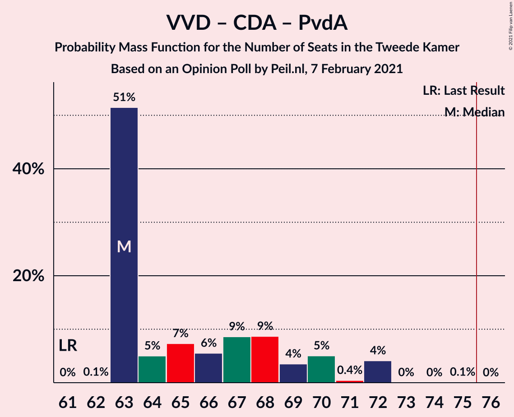

| Number of Seats | Probability | Accumulated | Special Marks |
|:---------------:|:-----------:|:-----------:|:-------------:|
| 61 | 0% | 100% | Last Result |
| 62 | 0% | 100% |  |
| 63 | 2% | 100% |  |
| 64 | 0% | 98% |  |
| 65 | 4% | 98% |  |
| 66 | 0.1% | 94% |  |
| 67 | 41% | 94% |  |
| 68 | 50% | 53% | Median |
| 69 | 3% | 3% |  |
| 70 | 0% | 0.3% |  |
| 71 | 0.2% | 0.2% |  |
| 72 | 0% | 0% |  |

### Volkspartij voor Vrijheid en Democratie – Christen-Democratisch Appèl – Democraten 66

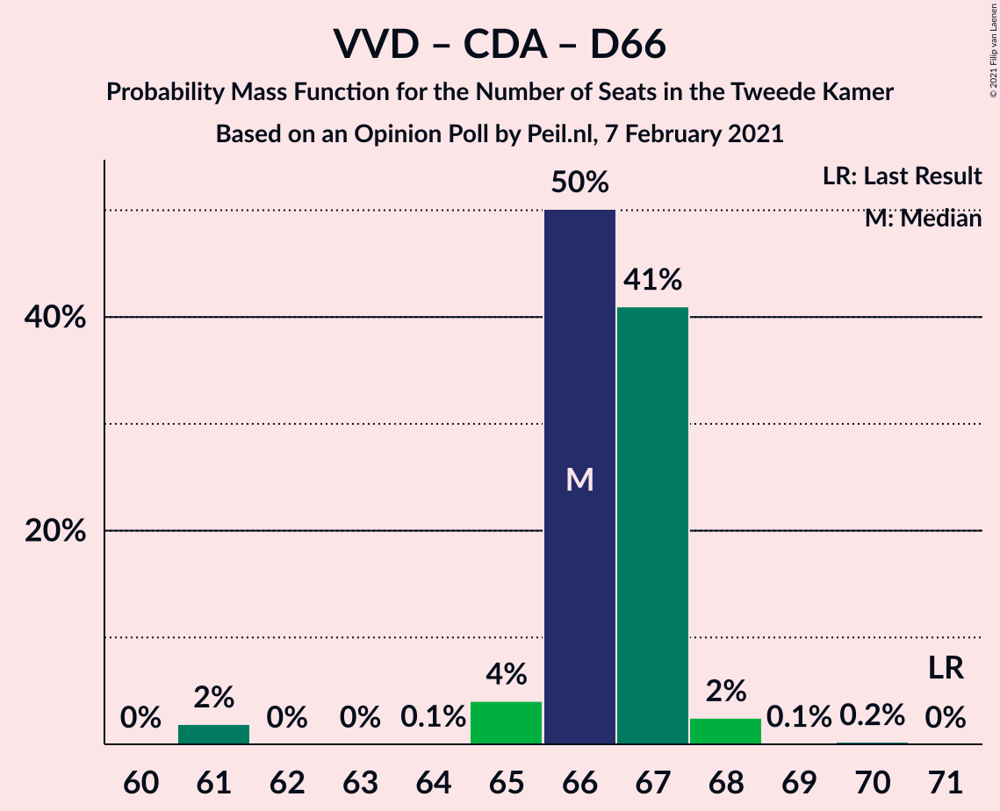

| Number of Seats | Probability | Accumulated | Special Marks |
|:---------------:|:-----------:|:-----------:|:-------------:|
| 61 | 2% | 100% |  |
| 62 | 0% | 98% |  |
| 63 | 0% | 98% |  |
| 64 | 0.1% | 98% |  |
| 65 | 4% | 98% |  |
| 66 | 50% | 94% | Median |
| 67 | 41% | 44% |  |
| 68 | 2% | 3% |  |
| 69 | 0.1% | 0.3% |  |
| 70 | 0.2% | 0.2% |  |
| 71 | 0% | 0% | Last Result |

### Volkspartij voor Vrijheid en Democratie – Christen-Democratisch Appèl – Forum voor Democratie – Staatkundig Gereformeerde Partij – 50Plus

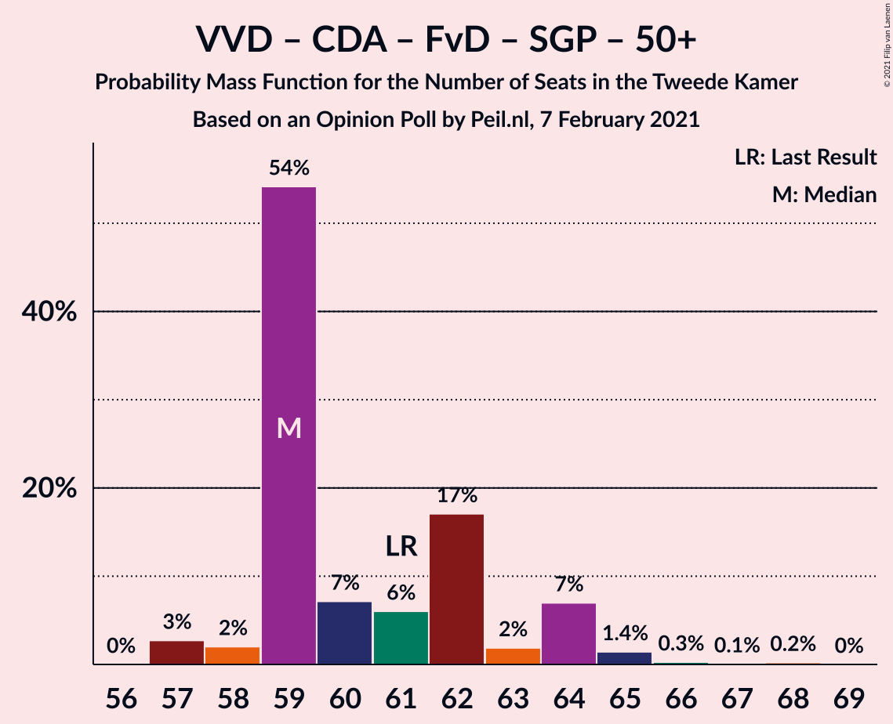

| Number of Seats | Probability | Accumulated | Special Marks |
|:---------------:|:-----------:|:-----------:|:-------------:|
| 56 | 2% | 100% |  |
| 57 | 0% | 98% |  |
| 58 | 0% | 98% |  |
| 59 | 0.6% | 98% |  |
| 60 | 0.5% | 97% |  |
| 61 | 49% | 97% | Last Result, Median |
| 62 | 3% | 47% |  |
| 63 | 0.2% | 44% |  |
| 64 | 0.1% | 44% |  |
| 65 | 44% | 44% |  |
| 66 | 0% | 0% |  |

### Volkspartij voor Vrijheid en Democratie – Christen-Democratisch Appèl – Forum voor Democratie – Staatkundig Gereformeerde Partij

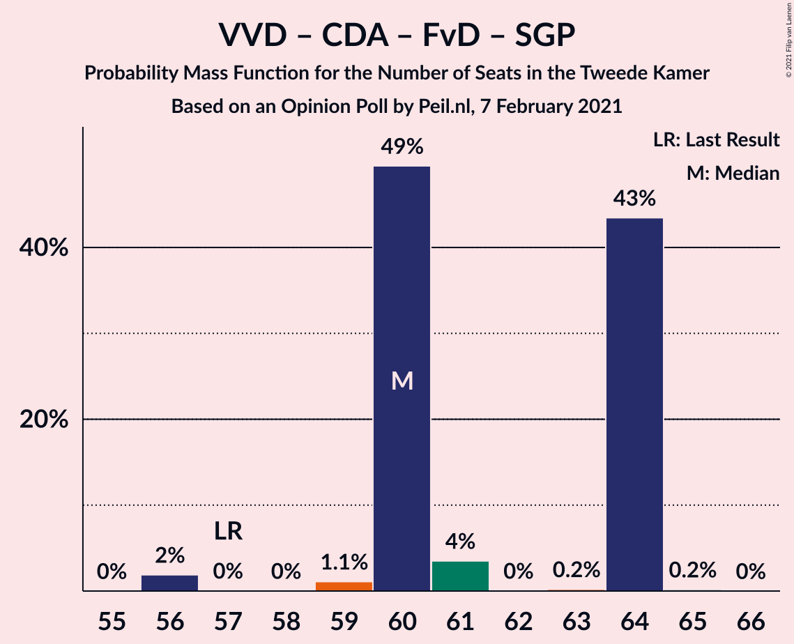

| Number of Seats | Probability | Accumulated | Special Marks |
|:---------------:|:-----------:|:-----------:|:-------------:|
| 56 | 2% | 100% |  |
| 57 | 0% | 98% | Last Result |
| 58 | 0% | 98% |  |
| 59 | 1.1% | 98% |  |
| 60 | 49% | 97% | Median |
| 61 | 4% | 47% |  |
| 62 | 0% | 44% |  |
| 63 | 0.2% | 44% |  |
| 64 | 43% | 44% |  |
| 65 | 0.2% | 0.2% |  |
| 66 | 0% | 0% |  |

### Volkspartij voor Vrijheid en Democratie – Democraten 66 – Partij van de Arbeid

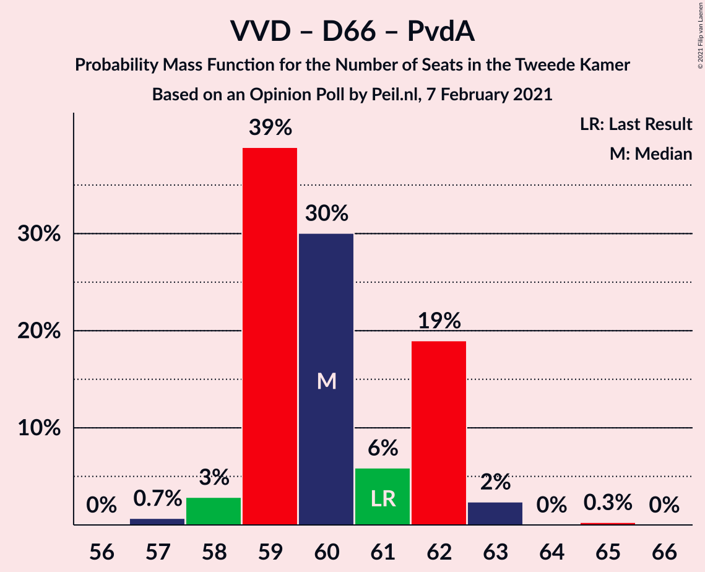

| Number of Seats | Probability | Accumulated | Special Marks |
|:---------------:|:-----------:|:-----------:|:-------------:|
| 58 | 2% | 100% |  |
| 59 | 41% | 98% |  |
| 60 | 4% | 57% |  |
| 61 | 0.3% | 53% | Last Result |
| 62 | 0% | 53% |  |
| 63 | 53% | 53% | Median |
| 64 | 0% | 0.1% |  |
| 65 | 0% | 0% |  |

### Volkspartij voor Vrijheid en Democratie – Christen-Democratisch Appèl – Forum voor Democratie – 50Plus

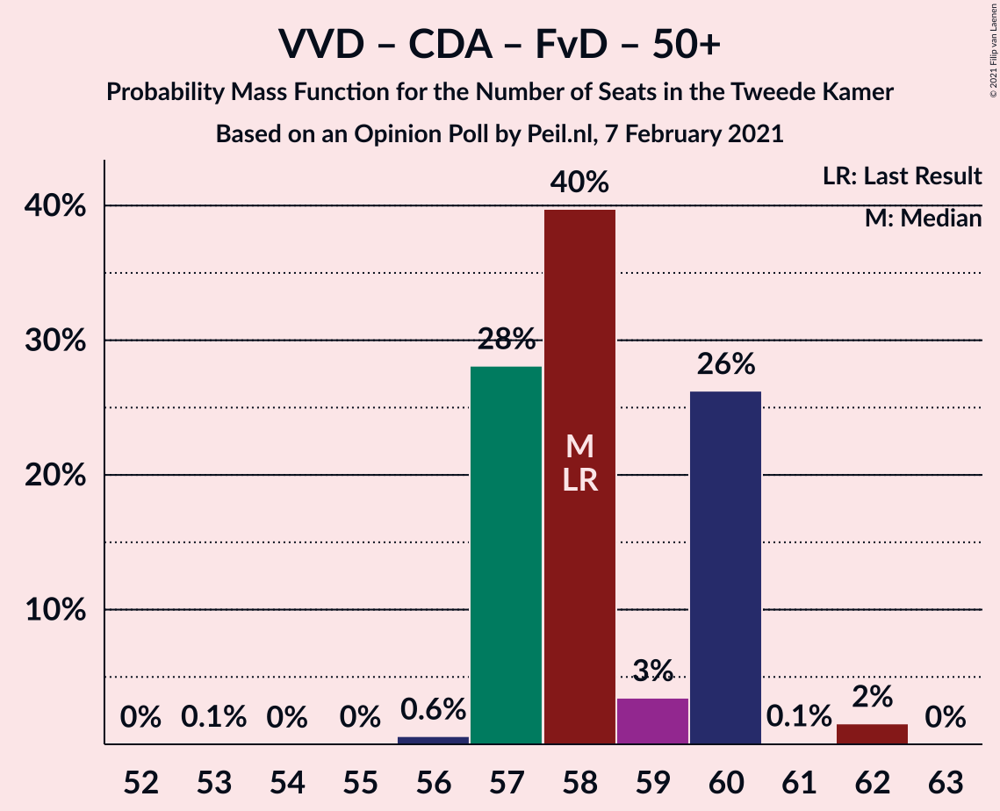

| Number of Seats | Probability | Accumulated | Special Marks |
|:---------------:|:-----------:|:-----------:|:-------------:|
| 53 | 2% | 100% |  |
| 54 | 0% | 98% |  |
| 55 | 0.1% | 98% |  |
| 56 | 0.6% | 98% |  |
| 57 | 0.1% | 97% |  |
| 58 | 4% | 97% | Last Result |
| 59 | 50% | 93% | Median |
| 60 | 0.1% | 44% |  |
| 61 | 0% | 44% |  |
| 62 | 43% | 44% |  |
| 63 | 0.2% | 0.2% |  |
| 64 | 0% | 0% |  |

### Christen-Democratisch Appèl – Democraten 66 – Partij van de Arbeid – GroenLinks – ChristenUnie

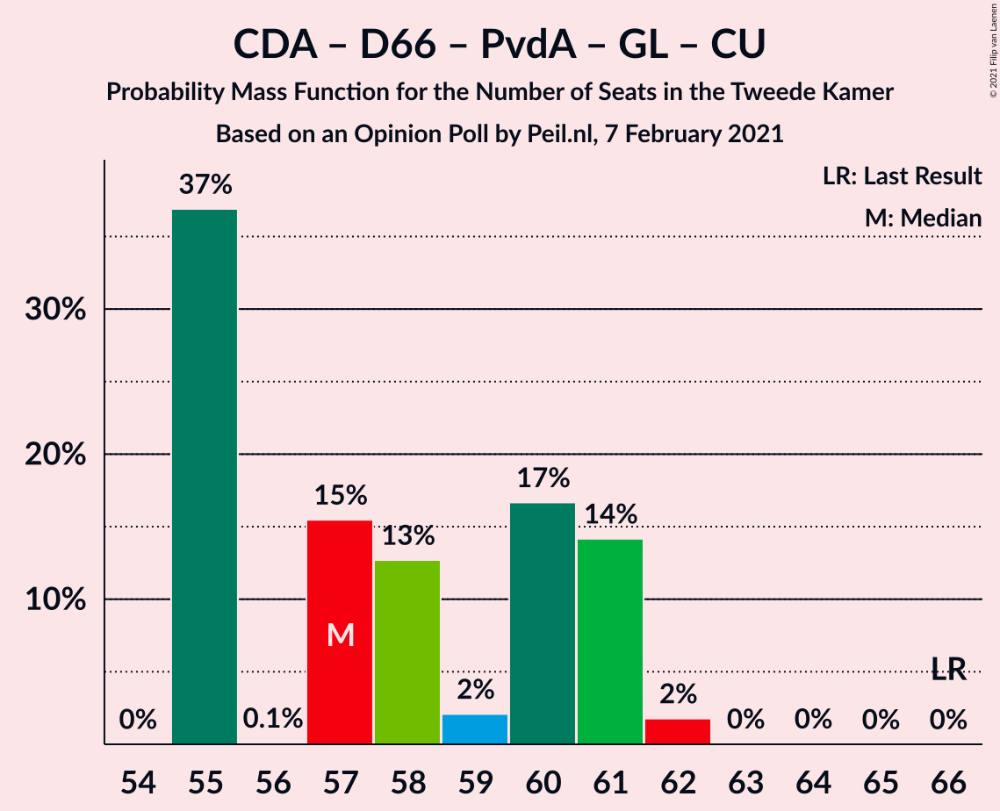

| Number of Seats | Probability | Accumulated | Special Marks |
|:---------------:|:-----------:|:-----------:|:-------------:|
| 55 | 0.1% | 100% |  |
| 56 | 2% | 99.9% |  |
| 57 | 0.1% | 97% |  |
| 58 | 4% | 97% |  |
| 59 | 0.6% | 94% |  |
| 60 | 2% | 93% |  |
| 61 | 41% | 91% |  |
| 62 | 50% | 50% | Median |
| 63 | 0% | 0% |  |
| 64 | 0% | 0% |  |
| 65 | 0% | 0% |  |
| 66 | 0% | 0% | Last Result |

### Volkspartij voor Vrijheid en Democratie – Christen-Democratisch Appèl – Forum voor Democratie

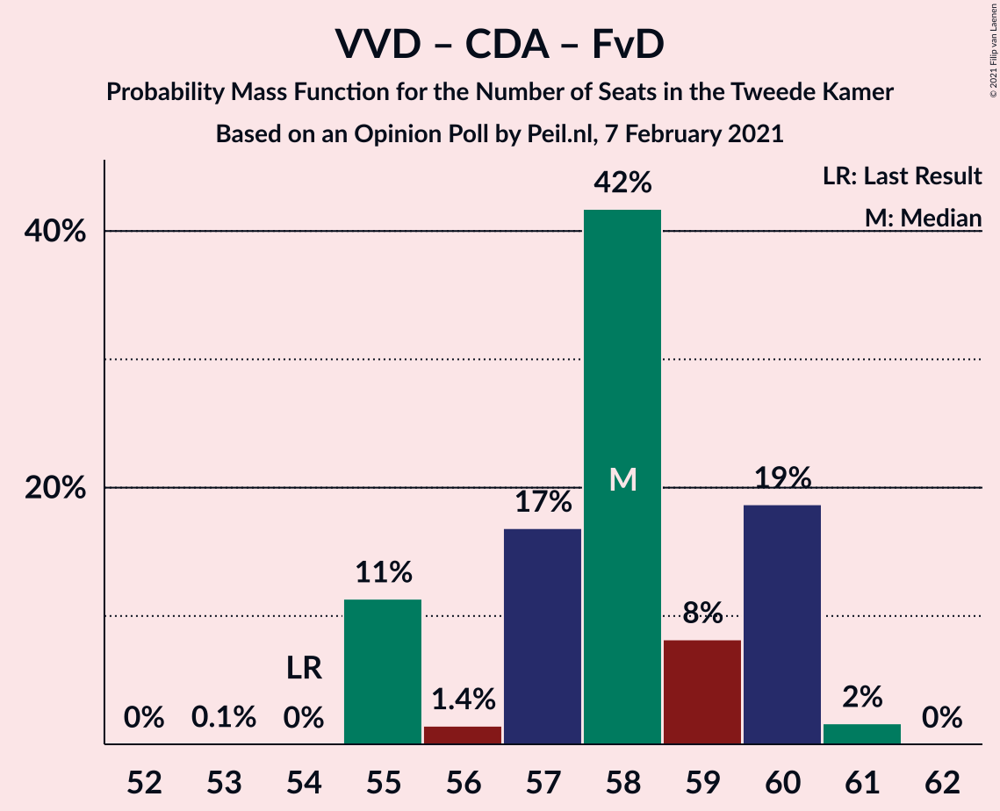

| Number of Seats | Probability | Accumulated | Special Marks |
|:---------------:|:-----------:|:-----------:|:-------------:|
| 53 | 2% | 100% |  |
| 54 | 0% | 98% | Last Result |
| 55 | 0.1% | 98% |  |
| 56 | 0.6% | 98% |  |
| 57 | 4% | 97% |  |
| 58 | 49% | 93% | Median |
| 59 | 0.2% | 44% |  |
| 60 | 0% | 44% |  |
| 61 | 43% | 44% |  |
| 62 | 0% | 0.3% |  |
| 63 | 0.2% | 0.2% |  |
| 64 | 0% | 0% |  |

### Volkspartij voor Vrijheid en Democratie – Christen-Democratisch Appèl

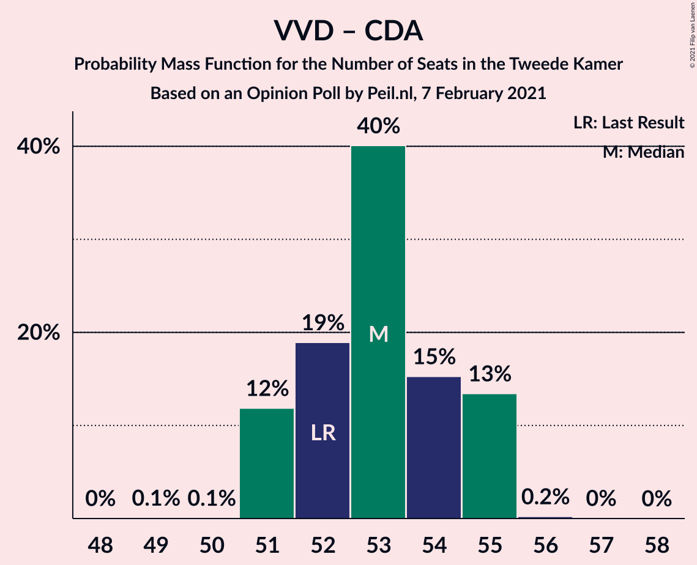

| Number of Seats | Probability | Accumulated | Special Marks |
|:---------------:|:-----------:|:-----------:|:-------------:|
| 49 | 2% | 100% |  |
| 50 | 0.1% | 98% |  |
| 51 | 0.6% | 98% |  |
| 52 | 0% | 97% | Last Result |
| 53 | 53% | 97% | Median |
| 54 | 0.3% | 44% |  |
| 55 | 41% | 44% |  |
| 56 | 3% | 3% |  |
| 57 | 0% | 0.3% |  |
| 58 | 0% | 0.2% |  |
| 59 | 0.2% | 0.2% |  |
| 60 | 0% | 0% |  |

### Volkspartij voor Vrijheid en Democratie – Partij van de Arbeid

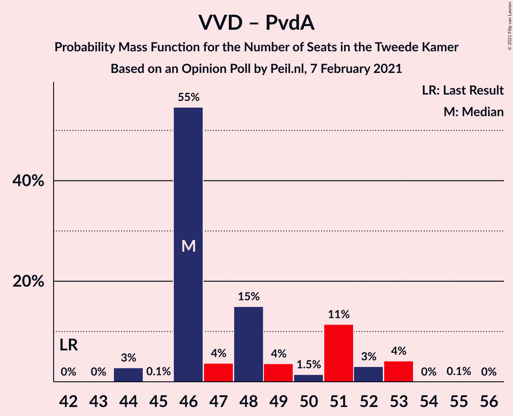

| Number of Seats | Probability | Accumulated | Special Marks |
|:---------------:|:-----------:|:-----------:|:-------------:|
| 42 | 0% | 100% | Last Result |
| 43 | 0% | 100% |  |
| 44 | 0% | 100% |  |
| 45 | 0% | 100% |  |
| 46 | 2% | 100% |  |
| 47 | 41% | 98% |  |
| 48 | 4% | 57% |  |
| 49 | 0.7% | 53% |  |
| 50 | 50% | 53% | Median |
| 51 | 3% | 3% |  |
| 52 | 0% | 0% |  |

### Christen-Democratisch Appèl – Democraten 66 – Partij van de Arbeid

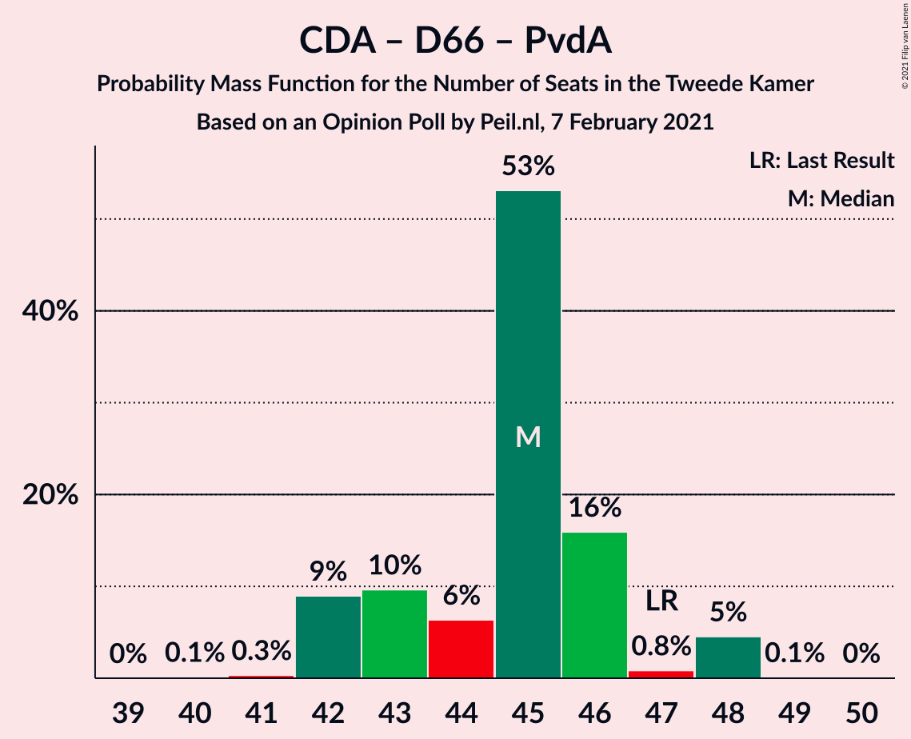

| Number of Seats | Probability | Accumulated | Special Marks |
|:---------------:|:-----------:|:-----------:|:-------------:|
| 40 | 0.1% | 100% |  |
| 41 | 4% | 99.9% |  |
| 42 | 0.1% | 96% |  |
| 43 | 4% | 96% |  |
| 44 | 42% | 92% |  |
| 45 | 0.2% | 50% |  |
| 46 | 50% | 50% | Median |
| 47 | 0% | 0% | Last Result |

### Christen-Democratisch Appèl – Partij van de Arbeid – ChristenUnie

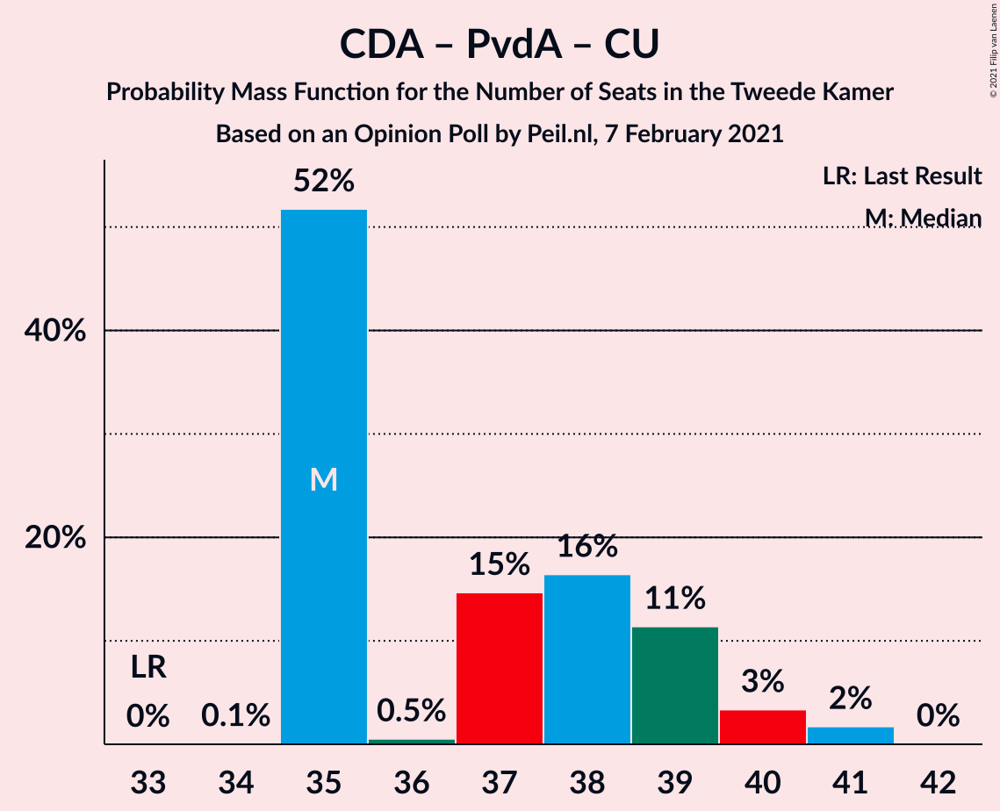

| Number of Seats | Probability | Accumulated | Special Marks |
|:---------------:|:-----------:|:-----------:|:-------------:|
| 33 | 0% | 100% | Last Result |
| 34 | 0% | 100% |  |
| 35 | 0.1% | 100% |  |
| 36 | 0.1% | 99.8% |  |
| 37 | 7% | 99.7% |  |
| 38 | 2% | 93% |  |
| 39 | 0.2% | 91% |  |
| 40 | 42% | 91% |  |
| 41 | 50% | 50% | Median |
| 42 | 0% | 0% |  |

### Christen-Democratisch Appèl – Partij van de Arbeid

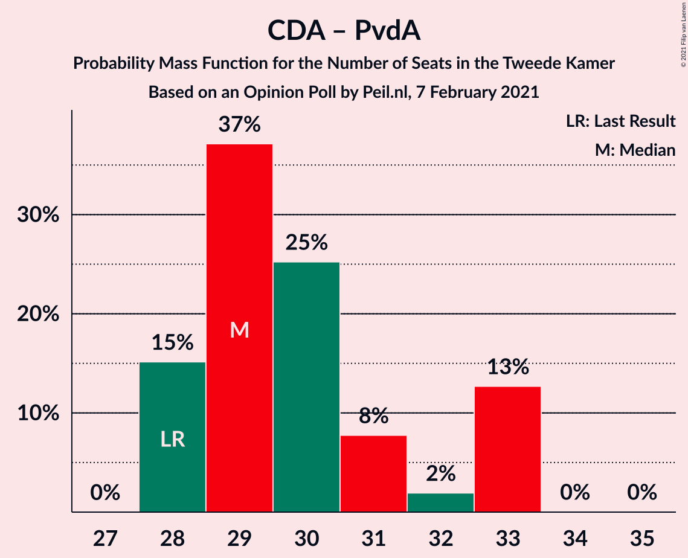

| Number of Seats | Probability | Accumulated | Special Marks |
|:---------------:|:-----------:|:-----------:|:-------------:|
| 28 | 0.1% | 100% | Last Result |
| 29 | 4% | 99.9% |  |
| 30 | 0.7% | 96% |  |
| 31 | 4% | 96% |  |
| 32 | 41% | 91% |  |
| 33 | 50% | 50% | Median |
| 34 | 0% | 0% |  |

### Christen-Democratisch Appèl – Democraten 66

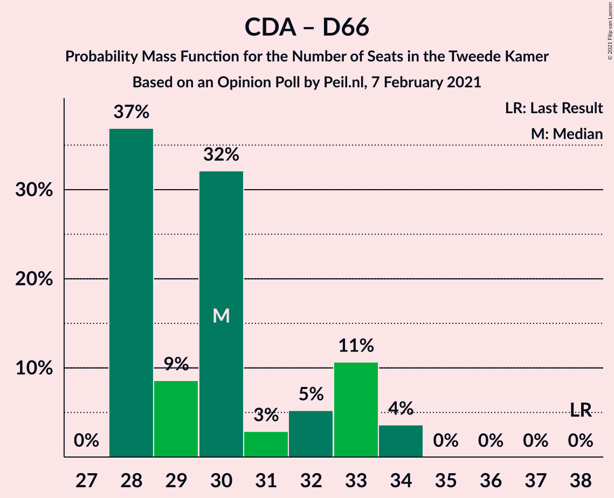

| Number of Seats | Probability | Accumulated | Special Marks |
|:---------------:|:-----------:|:-----------:|:-------------:|
| 29 | 5% | 100% |  |
| 30 | 3% | 95% |  |
| 31 | 50% | 91% | Median |
| 32 | 41% | 41% |  |
| 33 | 0% | 0% |  |
| 34 | 0% | 0% |  |
| 35 | 0% | 0% |  |
| 36 | 0% | 0% |  |
| 37 | 0% | 0% |  |
| 38 | 0% | 0% | Last Result |

## Technical Information

### Opinion Poll

+ **Polling firm:** Peil.nl
+ **Commissioner(s):** —
+ **Fieldwork period:** 7 February 2021

### Calculations

+ **Sample size:** 3000
+ **Simulations done:** 131,072
+ **Error estimate:** 1.94%

