# Opinion Poll by Peil.nl, 7 February 2021

<a href="#voting-intentions">Voting Intentions</a> | <a href="#seats">Seats</a> | <a href="#coalitions">Coalitions</a> | <a href="#technical-information">Technical Information</a>

## Voting Intentions

### Confidence Intervals

| Party | Last Result | Poll Result | 80% Confidence Interval | 90% Confidence Interval | 95% Confidence Interval | 99% Confidence Interval |
|:-----:|:-----------:|:-----------:|:-----------------------:|:-----------------------:|:-----------------------:|:-----------------------:|
| Volkspartij voor Vrijheid en Democratie | 21.3% | 22.7% | 21.7–23.7% |21.5–24.0% |21.2–24.2% |20.8–24.7% |
| Partij voor de Vrijheid | 13.1% | 15.6% | 14.7–16.4% |14.5–16.7% |14.3–16.9% |13.9–17.3% |
| Christen-Democratisch Appèl | 12.4% | 11.7% | 10.9–12.5% |10.7–12.7% |10.6–12.9% |10.2–13.3% |
| Democraten 66 | 12.2% | 8.4% | 7.8–9.1% |7.6–9.3% |7.5–9.5% |7.2–9.8% |
| Partij van de Arbeid | 5.7% | 8.4% | 7.8–9.1% |7.6–9.3% |7.5–9.5% |7.2–9.8% |
| GroenLinks | 9.1% | 5.8% | 5.3–6.4% |5.2–6.6% |5.0–6.7% |4.8–7.0% |
| Socialistische Partij | 9.1% | 5.8% | 5.3–6.4% |5.2–6.6% |5.0–6.7% |4.8–7.0% |
| ChristenUnie | 3.4% | 4.5% | 4.1–5.1% |3.9–5.2% |3.8–5.3% |3.6–5.6% |
| Partij voor de Dieren | 3.2% | 4.5% | 4.1–5.1% |3.9–5.2% |3.8–5.3% |3.6–5.6% |
| Forum voor Democratie | 1.8% | 3.2% | 2.9–3.7% |2.7–3.8% |2.7–3.9% |2.5–4.2% |
| Partij voor de Toekomst | 0.0% | 2.6% | 2.3–3.0% |2.2–3.1% |2.1–3.2% |1.9–3.4% |
| Staatkundig Gereformeerde Partij | 2.1% | 1.9% | 1.6–2.3% |1.6–2.4% |1.5–2.5% |1.4–2.7% |
| Juiste Antwoord 2021 | 0.0% | 1.9% | 1.6–2.3% |1.6–2.4% |1.5–2.5% |1.4–2.7% |
| DENK | 2.1% | 1.3% | 1.1–1.6% |1.0–1.7% |0.9–1.8% |0.9–1.9% |
| 50Plus | 3.1% | 0.6% | 0.5–0.9% |0.4–0.9% |0.4–1.0% |0.3–1.1% |
| Volt Europa | 0.0% | 0.6% | 0.5–0.9% |0.4–0.9% |0.4–1.0% |0.3–1.1% |

*Note:* The poll result column reflects the actual value used in the calculations. Published results may vary slightly, and in addition be rounded to fewer digits.

## Seats

### Confidence Intervals

| Party | Last Result | Median | 80% Confidence Interval | 90% Confidence Interval | 95% Confidence Interval | 99% Confidence Interval |
|:-----:|:-----------:|:------:|:-----------------------:|:-----------------------:|:-----------------------:|:-----------------------:|
| <a href="#volkspartij-voor-vrijheid-en-democratie">Volkspartij voor Vrijheid en Democratie</a> | 33 | 36 | 34–37 |34–37 |33–37 |33–37 |
| <a href="#partij-voor-de-vrijheid">Partij voor de Vrijheid</a> | 20 | 24 | 23–25 |23–25 |22–25 |22–26 |
| <a href="#christen-democratisch-appèl">Christen-Democratisch Appèl</a> | 19 | 17 | 16–20 |16–20 |16–20 |16–20 |
| <a href="#democraten-66">Democraten 66</a> | 19 | 12 | 11–14 |11–14 |11–15 |11–15 |
| <a href="#partij-van-de-arbeid">Partij van de Arbeid</a> | 9 | 12 | 12–13 |12–13 |12–14 |12–15 |
| <a href="#groenlinks">GroenLinks</a> | 14 | 9 | 8–9 |8–10 |8–10 |8–10 |
| <a href="#socialistische-partij">Socialistische Partij</a> | 14 | 9 | 7–10 |7–10 |7–10 |7–10 |
| <a href="#christenunie">ChristenUnie</a> | 5 | 6 | 6–8 |6–8 |6–8 |6–9 |
| <a href="#partij-voor-de-dieren">Partij voor de Dieren</a> | 5 | 7 | 6–8 |6–8 |6–8 |6–9 |
| <a href="#forum-voor-democratie">Forum voor Democratie</a> | 2 | 5 | 4–6 |4–6 |4–6 |4–6 |
| <a href="#partij-voor-de-toekomst">Partij voor de Toekomst</a> | 0 | 4 | 3–5 |3–5 |3–5 |3–5 |
| <a href="#staatkundig-gereformeerde-partij">Staatkundig Gereformeerde Partij</a> | 3 | 3 | 2–4 |2–4 |1–4 |1–4 |
| <a href="#juiste-antwoord-2021">Juiste Antwoord 2021</a> | 0 | 3 | 2–3 |2–3 |2–3 |2–3 |
| <a href="#denk">DENK</a> | 3 | 1 | 1–2 |1–2 |1–2 |1–2 |
| <a href="#50plus">50Plus</a> | 4 | 0 | 0–2 |0–2 |0–2 |0–2 |
| <a href="#volt-europa">Volt Europa</a> | 0 | 1 | 0–1 |0–1 |0–1 |0–1 |

### Volkspartij voor Vrijheid en Democratie

*For a full overview of the results for this party, see the [Volkspartij voor Vrijheid en Democratie](party-volkspartijvoorvrijheidendemocratie.html) page.*

| Number of Seats | Probability | Accumulated | Special Marks |
|:---------------:|:-----------:|:-----------:|:-------------:|
| 32 | 0.1% | 100% |  |
| 33 | 3% | 99.9% | Last Result |
| 34 | 23% | 97% |  |
| 35 | 9% | 74% |  |
| 36 | 53% | 65% | Median |
| 37 | 12% | 12% |  |
| 38 | 0.1% | 0.1% |  |
| 39 | 0% | 0% |  |

### Partij voor de Vrijheid

*For a full overview of the results for this party, see the [Partij voor de Vrijheid](party-partijvoordevrijheid.html) page.*

| Number of Seats | Probability | Accumulated | Special Marks |
|:---------------:|:-----------:|:-----------:|:-------------:|
| 20 | 0% | 100% | Last Result |
| 21 | 0.2% | 100% |  |
| 22 | 3% | 99.8% |  |
| 23 | 32% | 97% |  |
| 24 | 15% | 65% | Median |
| 25 | 48% | 49% |  |
| 26 | 2% | 2% |  |
| 27 | 0% | 0% |  |

### Christen-Democratisch Appèl

*For a full overview of the results for this party, see the [Christen-Democratisch Appèl](party-christen-democratischappèl.html) page.*

| Number of Seats | Probability | Accumulated | Special Marks |
|:---------------:|:-----------:|:-----------:|:-------------:|
| 16 | 15% | 100% |  |
| 17 | 50% | 85% | Median |
| 18 | 16% | 35% |  |
| 19 | 7% | 19% | Last Result |
| 20 | 12% | 12% |  |
| 21 | 0% | 0% |  |

### Democraten 66

*For a full overview of the results for this party, see the [Democraten 66](party-democraten66.html) page.*

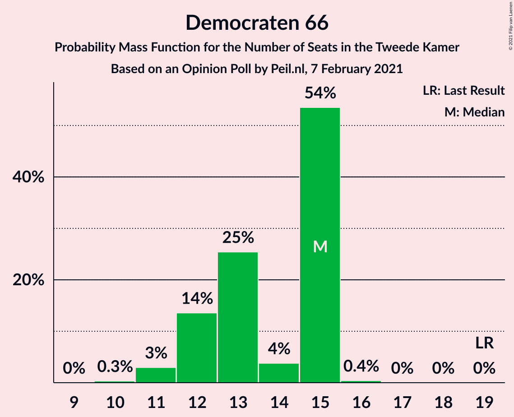

| Number of Seats | Probability | Accumulated | Special Marks |
|:---------------:|:-----------:|:-----------:|:-------------:|
| 10 | 0.3% | 100% |  |
| 11 | 45% | 99.7% |  |
| 12 | 8% | 55% | Median |
| 13 | 27% | 47% |  |
| 14 | 16% | 20% |  |
| 15 | 4% | 4% |  |
| 16 | 0% | 0% |  |
| 17 | 0% | 0% |  |
| 18 | 0% | 0% |  |
| 19 | 0% | 0% | Last Result |

### Partij van de Arbeid

*For a full overview of the results for this party, see the [Partij van de Arbeid](party-partijvandearbeid.html) page.*

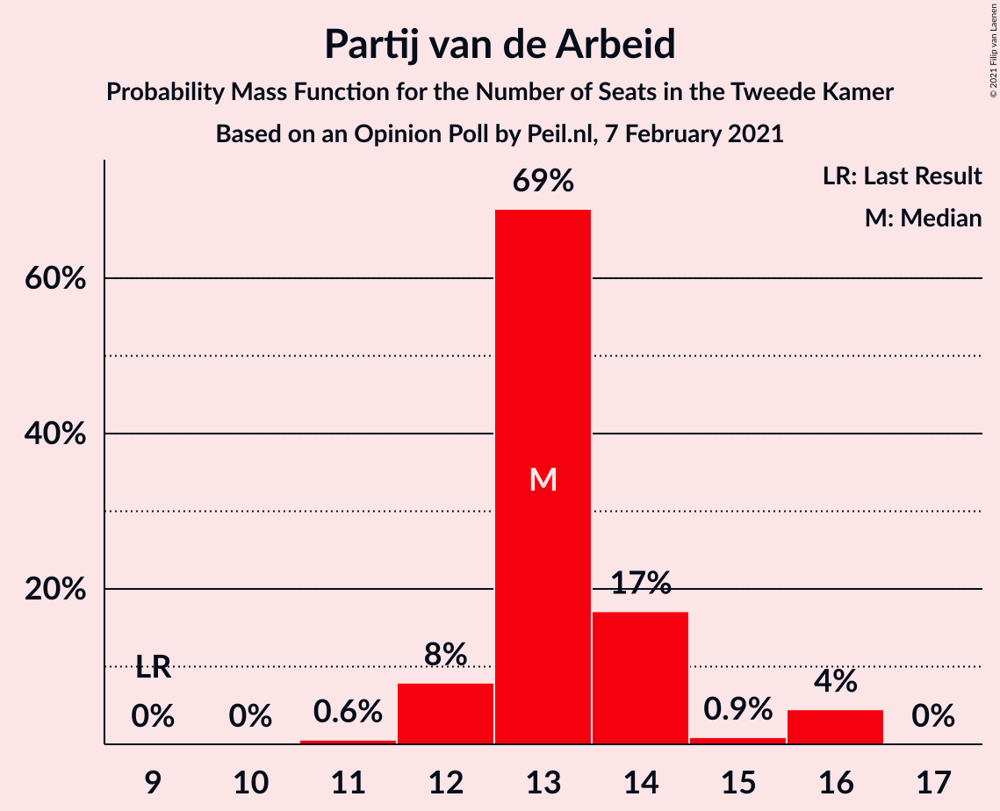

| Number of Seats | Probability | Accumulated | Special Marks |
|:---------------:|:-----------:|:-----------:|:-------------:|
| 9 | 0% | 100% | Last Result |
| 10 | 0% | 100% |  |
| 11 | 0.4% | 100% |  |
| 12 | 73% | 99.6% | Median |
| 13 | 23% | 26% |  |
| 14 | 0.6% | 3% |  |
| 15 | 2% | 2% |  |
| 16 | 0% | 0% |  |

### GroenLinks

*For a full overview of the results for this party, see the [GroenLinks](party-groenlinks.html) page.*

| Number of Seats | Probability | Accumulated | Special Marks |
|:---------------:|:-----------:|:-----------:|:-------------:|
| 7 | 0.2% | 100% |  |
| 8 | 28% | 99.8% |  |
| 9 | 63% | 72% | Median |
| 10 | 9% | 9% |  |
| 11 | 0% | 0% |  |
| 12 | 0% | 0% |  |
| 13 | 0% | 0% |  |
| 14 | 0% | 0% | Last Result |

### Socialistische Partij

*For a full overview of the results for this party, see the [Socialistische Partij](party-socialistischepartij.html) page.*

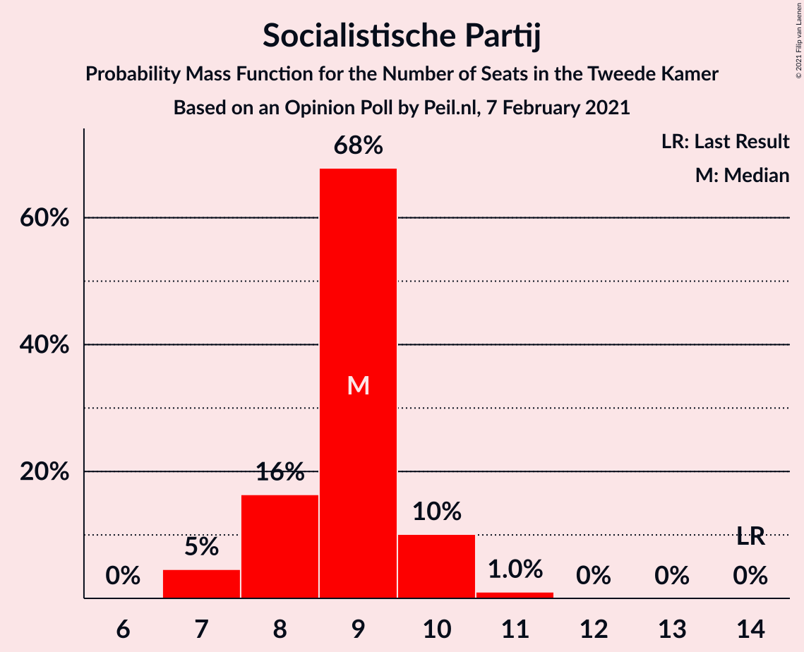

| Number of Seats | Probability | Accumulated | Special Marks |
|:---------------:|:-----------:|:-----------:|:-------------:|
| 7 | 15% | 100% |  |
| 8 | 5% | 85% |  |
| 9 | 40% | 80% | Median |
| 10 | 40% | 40% |  |
| 11 | 0.3% | 0.3% |  |
| 12 | 0% | 0% |  |
| 13 | 0% | 0% |  |
| 14 | 0% | 0% | Last Result |

### ChristenUnie

*For a full overview of the results for this party, see the [ChristenUnie](party-christenunie.html) page.*

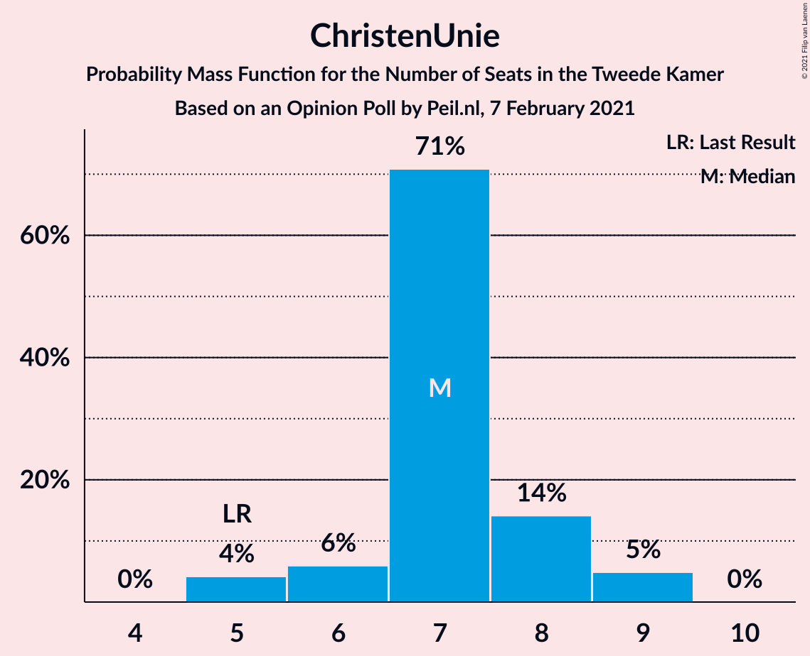

| Number of Seats | Probability | Accumulated | Special Marks |
|:---------------:|:-----------:|:-----------:|:-------------:|
| 5 | 0.3% | 100% | Last Result |
| 6 | 52% | 99.7% | Median |
| 7 | 26% | 47% |  |
| 8 | 19% | 21% |  |
| 9 | 2% | 2% |  |
| 10 | 0% | 0% |  |

### Partij voor de Dieren

*For a full overview of the results for this party, see the [Partij voor de Dieren](party-partijvoordedieren.html) page.*

| Number of Seats | Probability | Accumulated | Special Marks |
|:---------------:|:-----------:|:-----------:|:-------------:|
| 5 | 0.1% | 100% | Last Result |
| 6 | 34% | 99.8% |  |
| 7 | 55% | 66% | Median |
| 8 | 10% | 10% |  |
| 9 | 0.8% | 0.8% |  |
| 10 | 0% | 0% |  |

### Forum voor Democratie

*For a full overview of the results for this party, see the [Forum voor Democratie](party-forumvoordemocratie.html) page.*

| Number of Seats | Probability | Accumulated | Special Marks |
|:---------------:|:-----------:|:-----------:|:-------------:|
| 2 | 0% | 100% | Last Result |
| 3 | 0% | 100% |  |
| 4 | 18% | 100% |  |
| 5 | 67% | 82% | Median |
| 6 | 15% | 15% |  |
| 7 | 0% | 0% |  |

### Partij voor de Toekomst

*For a full overview of the results for this party, see the [Partij voor de Toekomst](party-partijvoordetoekomst.html) page.*

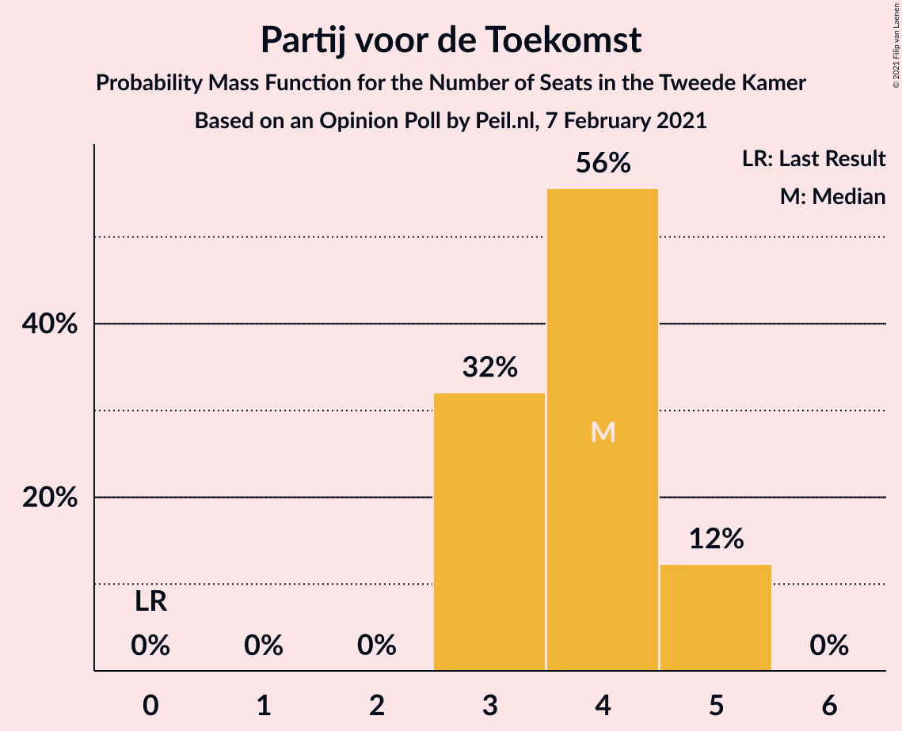

| Number of Seats | Probability | Accumulated | Special Marks |
|:---------------:|:-----------:|:-----------:|:-------------:|
| 0 | 0% | 100% | Last Result |
| 1 | 0% | 100% |  |
| 2 | 0% | 100% |  |
| 3 | 32% | 100% |  |
| 4 | 56% | 68% | Median |
| 5 | 12% | 12% |  |
| 6 | 0% | 0% |  |

### Staatkundig Gereformeerde Partij

*For a full overview of the results for this party, see the [Staatkundig Gereformeerde Partij](party-staatkundiggereformeerdepartij.html) page.*

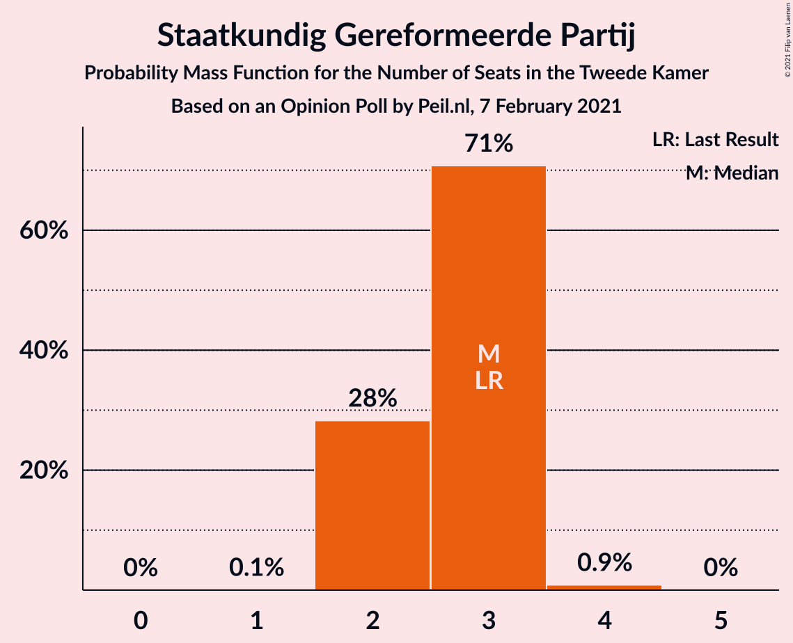

| Number of Seats | Probability | Accumulated | Special Marks |
|:---------------:|:-----------:|:-----------:|:-------------:|
| 1 | 4% | 100% |  |
| 2 | 21% | 96% |  |
| 3 | 60% | 75% | Last Result, Median |
| 4 | 15% | 15% |  |
| 5 | 0% | 0% |  |

### Juiste Antwoord 2021

*For a full overview of the results for this party, see the [Juiste Antwoord 2021](party-juisteantwoord2021.html) page.*

| Number of Seats | Probability | Accumulated | Special Marks |
|:---------------:|:-----------:|:-----------:|:-------------:|
| 0 | 0% | 100% | Last Result |
| 1 | 0% | 100% |  |
| 2 | 16% | 100% |  |
| 3 | 84% | 84% | Median |
| 4 | 0.2% | 0.2% |  |
| 5 | 0% | 0% |  |

### DENK

*For a full overview of the results for this party, see the [DENK](party-denk.html) page.*

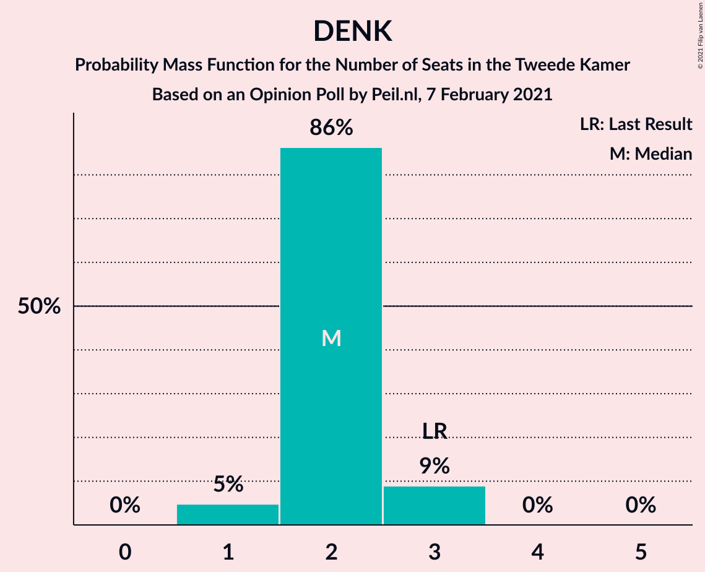

| Number of Seats | Probability | Accumulated | Special Marks |
|:---------------:|:-----------:|:-----------:|:-------------:|
| 1 | 52% | 100% | Median |
| 2 | 48% | 48% |  |
| 3 | 0% | 0.1% | Last Result |
| 4 | 0% | 0% |  |

### 50Plus

*For a full overview of the results for this party, see the [50Plus](party-50plus.html) page.*

| Number of Seats | Probability | Accumulated | Special Marks |
|:---------------:|:-----------:|:-----------:|:-------------:|
| 0 | 75% | 100% | Median |
| 1 | 14% | 25% |  |
| 2 | 11% | 11% |  |
| 3 | 0% | 0% |  |
| 4 | 0% | 0% | Last Result |

### Volt Europa

*For a full overview of the results for this party, see the [Volt Europa](party-volteuropa.html) page.*

| Number of Seats | Probability | Accumulated | Special Marks |
|:---------------:|:-----------:|:-----------:|:-------------:|
| 0 | 36% | 100% | Last Result |
| 1 | 64% | 64% | Median |
| 2 | 0% | 0% |  |

## Coalitions

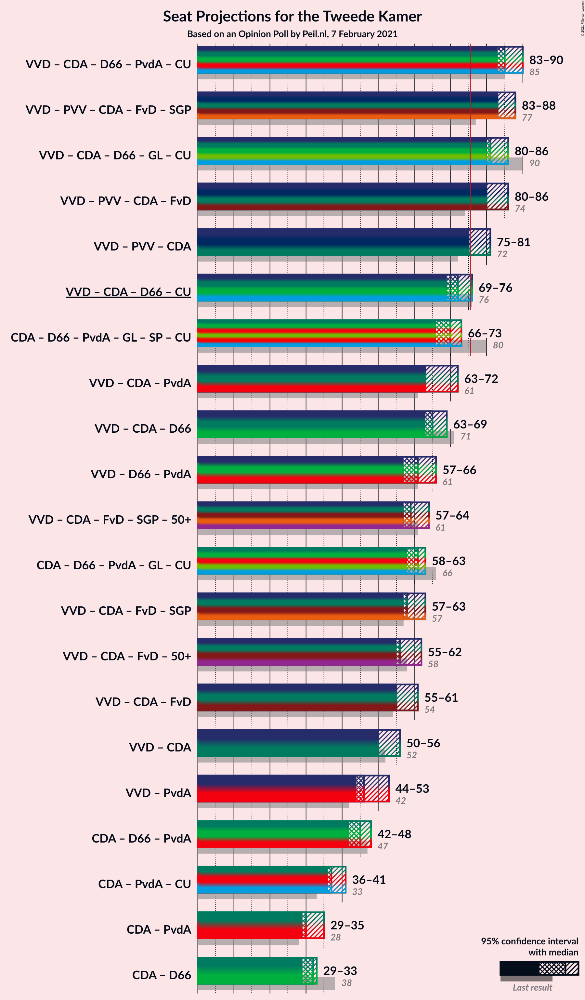

### Confidence Intervals

| Coalition | Last Result | Median | Majority? | 80% Confidence Interval | 90% Confidence Interval | 95% Confidence Interval | 99% Confidence Interval |
|:---------:|:-----------:|:------:|:---------:|:-----------------------:|:-----------------------:|:-----------------------:|:-----------------------:|
| Volkspartij voor Vrijheid en Democratie – Christen-Democratisch Appèl – Democraten 66 – Partij van de Arbeid – ChristenUnie | 85 | 85 | 100% | 82–87 | 82–87 | 82–87 | 82–89 |
| Volkspartij voor Vrijheid en Democratie – Partij voor de Vrijheid – Christen-Democratisch Appèl – Forum voor Democratie – Staatkundig Gereformeerde Partij | 77 | 86 | 100% | 81–86 | 81–86 | 81–86 | 81–89 |
| Volkspartij voor Vrijheid en Democratie – Partij voor de Vrijheid – Christen-Democratisch Appèl – Forum voor Democratie | 74 | 83 | 100% | 78–83 | 78–84 | 78–84 | 78–86 |
| Volkspartij voor Vrijheid en Democratie – Christen-Democratisch Appèl – Democraten 66 – GroenLinks – ChristenUnie | 90 | 81 | 100% | 79–83 | 79–83 | 79–83 | 79–84 |
| Volkspartij voor Vrijheid en Democratie – Partij voor de Vrijheid – Christen-Democratisch Appèl | 72 | 78 | 84% | 74–79 | 74–80 | 74–80 | 73–80 |
| Volkspartij voor Vrijheid en Democratie – Christen-Democratisch Appèl – Democraten 66 – ChristenUnie | 76 | 72 | 0.1% | 70–74 | 70–75 | 70–75 | 70–75 |
| Christen-Democratisch Appèl – Democraten 66 – Partij van de Arbeid – GroenLinks – Socialistische Partij – ChristenUnie | 80 | 66 | 0% | 65–70 | 65–70 | 65–71 | 65–71 |
| Volkspartij voor Vrijheid en Democratie – Christen-Democratisch Appèl – Democraten 66 | 71 | 64 | 0% | 64–67 | 64–67 | 64–69 | 64–69 |
| Volkspartij voor Vrijheid en Democratie – Christen-Democratisch Appèl – Partij van de Arbeid | 61 | 65 | 0% | 64–67 | 64–67 | 64–68 | 64–68 |
| Volkspartij voor Vrijheid en Democratie – Christen-Democratisch Appèl – Forum voor Democratie – Staatkundig Gereformeerde Partij – 50Plus | 61 | 61 | 0% | 60–62 | 60–63 | 60–63 | 58–65 |
| Volkspartij voor Vrijheid en Democratie – Christen-Democratisch Appèl – Forum voor Democratie – Staatkundig Gereformeerde Partij | 57 | 61 | 0% | 58–62 | 58–63 | 58–63 | 58–64 |
| Volkspartij voor Vrijheid en Democratie – Democraten 66 – Partij van de Arbeid | 61 | 60 | 0% | 59–62 | 59–62 | 58–63 | 57–63 |
| Christen-Democratisch Appèl – Democraten 66 – Partij van de Arbeid – GroenLinks – ChristenUnie | 66 | 57 | 0% | 55–61 | 55–61 | 55–61 | 55–62 |
| Volkspartij voor Vrijheid en Democratie – Christen-Democratisch Appèl – Forum voor Democratie – 50Plus | 58 | 58 | 0% | 57–60 | 57–60 | 57–60 | 56–62 |
| Volkspartij voor Vrijheid en Democratie – Christen-Democratisch Appèl – Forum voor Democratie | 54 | 58 | 0% | 55–60 | 55–60 | 55–60 | 55–61 |
| Volkspartij voor Vrijheid en Democratie – Christen-Democratisch Appèl | 52 | 53 | 0% | 51–55 | 51–55 | 51–55 | 51–55 |
| Volkspartij voor Vrijheid en Democratie – Partij van de Arbeid | 42 | 48 | 0% | 47–49 | 47–49 | 45–49 | 45–50 |
| Christen-Democratisch Appèl – Democraten 66 – Partij van de Arbeid | 47 | 42 | 0% | 40–46 | 40–46 | 40–46 | 40–46 |
| Christen-Democratisch Appèl – Partij van de Arbeid – ChristenUnie | 33 | 35 | 0% | 35–39 | 35–40 | 35–40 | 35–41 |
| Christen-Democratisch Appèl – Democraten 66 | 38 | 30 | 0% | 28–33 | 28–33 | 28–34 | 28–34 |
| Christen-Democratisch Appèl – Partij van de Arbeid | 28 | 29 | 0% | 28–33 | 28–33 | 28–33 | 28–33 |

### Volkspartij voor Vrijheid en Democratie – Christen-Democratisch Appèl – Democraten 66 – Partij van de Arbeid – ChristenUnie

| Number of Seats | Probability | Accumulated | Special Marks |
|:---------------:|:-----------:|:-----------:|:-------------:|
| 82 | 37% | 100% |  |
| 83 | 0.5% | 63% | Median |
| 84 | 2% | 62% |  |
| 85 | 36% | 61% | Last Result |
| 86 | 13% | 25% |  |
| 87 | 10% | 12% |  |
| 88 | 0.2% | 2% |  |
| 89 | 2% | 2% |  |
| 90 | 0.1% | 0.1% |  |
| 91 | 0% | 0% |  |

### Volkspartij voor Vrijheid en Democratie – Partij voor de Vrijheid – Christen-Democratisch Appèl – Forum voor Democratie – Staatkundig Gereformeerde Partij

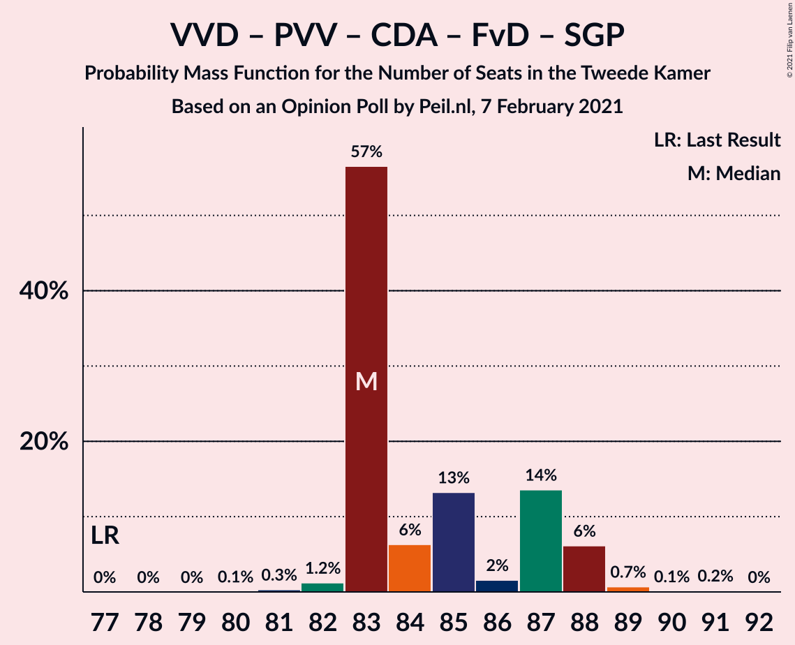

| Number of Seats | Probability | Accumulated | Special Marks |
|:---------------:|:-----------:|:-----------:|:-------------:|
| 77 | 0% | 100% | Last Result |
| 78 | 0% | 100% |  |
| 79 | 0% | 100% |  |
| 80 | 0.1% | 100% |  |
| 81 | 12% | 99.9% |  |
| 82 | 2% | 88% |  |
| 83 | 3% | 86% |  |
| 84 | 0.8% | 83% |  |
| 85 | 30% | 82% | Median |
| 86 | 50% | 52% |  |
| 87 | 0.2% | 2% |  |
| 88 | 0.2% | 2% |  |
| 89 | 1.4% | 1.5% |  |
| 90 | 0% | 0% |  |

### Volkspartij voor Vrijheid en Democratie – Partij voor de Vrijheid – Christen-Democratisch Appèl – Forum voor Democratie

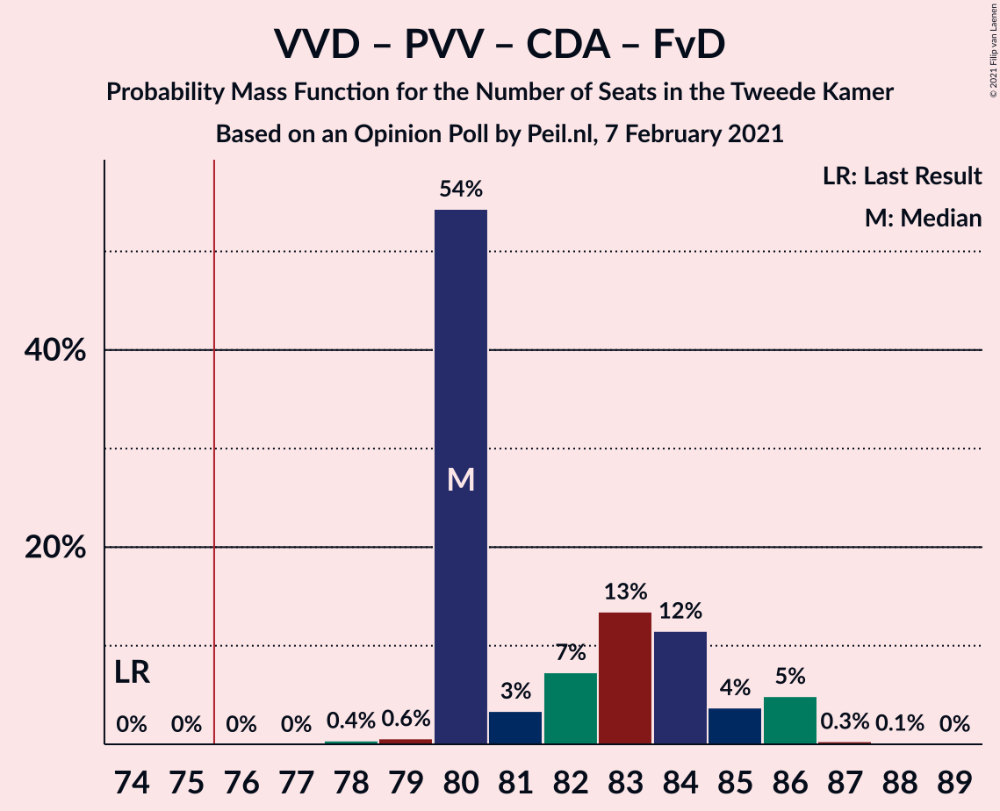

| Number of Seats | Probability | Accumulated | Special Marks |
|:---------------:|:-----------:|:-----------:|:-------------:|
| 74 | 0% | 100% | Last Result |
| 75 | 0% | 100% |  |
| 76 | 0% | 100% | Majority |
| 77 | 0% | 100% |  |
| 78 | 12% | 100% |  |
| 79 | 0.3% | 88% |  |
| 80 | 2% | 88% |  |
| 81 | 18% | 86% |  |
| 82 | 1.1% | 68% | Median |
| 83 | 57% | 67% |  |
| 84 | 8% | 10% |  |
| 85 | 0% | 2% |  |
| 86 | 1.4% | 1.5% |  |
| 87 | 0.1% | 0.1% |  |
| 88 | 0% | 0% |  |

### Volkspartij voor Vrijheid en Democratie – Christen-Democratisch Appèl – Democraten 66 – GroenLinks – ChristenUnie

| Number of Seats | Probability | Accumulated | Special Marks |
|:---------------:|:-----------:|:-----------:|:-------------:|
| 77 | 0% | 100% |  |
| 78 | 0.1% | 99.9% |  |
| 79 | 37% | 99.8% |  |
| 80 | 0.9% | 62% | Median |
| 81 | 29% | 62% |  |
| 82 | 15% | 33% |  |
| 83 | 16% | 18% |  |
| 84 | 2% | 2% |  |
| 85 | 0% | 0.1% |  |
| 86 | 0% | 0% |  |
| 87 | 0% | 0% |  |
| 88 | 0% | 0% |  |
| 89 | 0% | 0% |  |
| 90 | 0% | 0% | Last Result |

### Volkspartij voor Vrijheid en Democratie – Partij voor de Vrijheid – Christen-Democratisch Appèl

| Number of Seats | Probability | Accumulated | Special Marks |
|:---------------:|:-----------:|:-----------:|:-------------:|
| 72 | 0% | 100% | Last Result |
| 73 | 0.5% | 100% |  |
| 74 | 11% | 99.5% |  |
| 75 | 4% | 88% |  |
| 76 | 15% | 84% | Majority |
| 77 | 12% | 68% | Median |
| 78 | 45% | 56% |  |
| 79 | 5% | 11% |  |
| 80 | 6% | 6% |  |
| 81 | 0% | 0.1% |  |
| 82 | 0% | 0.1% |  |
| 83 | 0% | 0% |  |

### Volkspartij voor Vrijheid en Democratie – Christen-Democratisch Appèl – Democraten 66 – ChristenUnie

| Number of Seats | Probability | Accumulated | Special Marks |
|:---------------:|:-----------:|:-----------:|:-------------:|
| 68 | 0.1% | 100% |  |
| 69 | 0% | 99.9% |  |
| 70 | 37% | 99.9% |  |
| 71 | 1.0% | 62% | Median |
| 72 | 13% | 61% |  |
| 73 | 34% | 48% |  |
| 74 | 5% | 14% |  |
| 75 | 9% | 9% |  |
| 76 | 0% | 0.1% | Last Result, Majority |
| 77 | 0% | 0% |  |

### Christen-Democratisch Appèl – Democraten 66 – Partij van de Arbeid – GroenLinks – Socialistische Partij – ChristenUnie

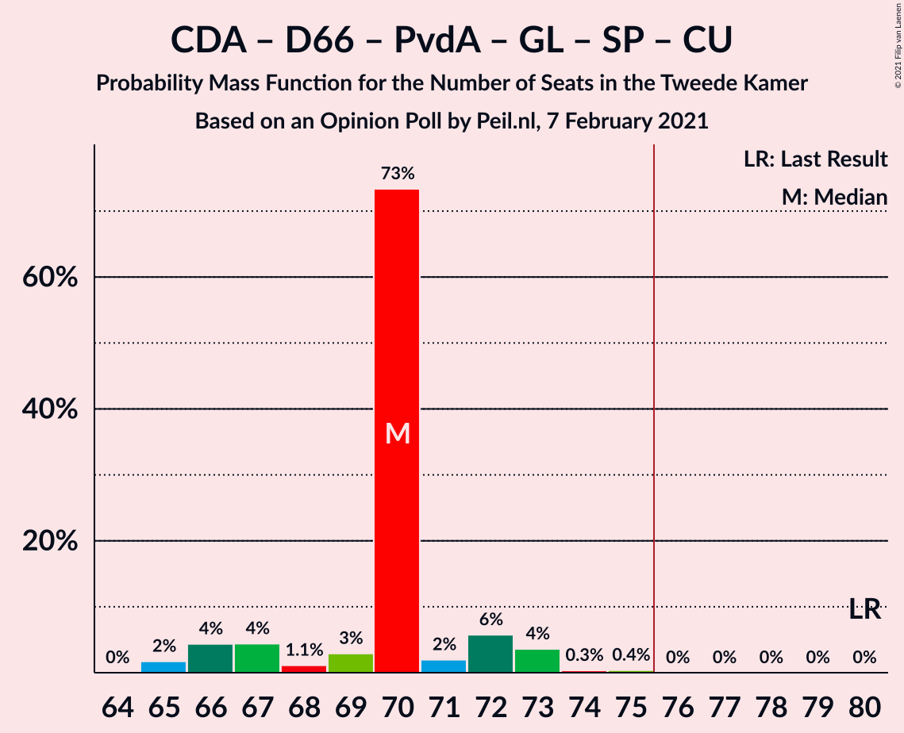

| Number of Seats | Probability | Accumulated | Special Marks |
|:---------------:|:-----------:|:-----------:|:-------------:|
| 64 | 0.1% | 100% |  |
| 65 | 45% | 99.9% | Median |
| 66 | 21% | 55% |  |
| 67 | 4% | 34% |  |
| 68 | 3% | 30% |  |
| 69 | 13% | 28% |  |
| 70 | 11% | 15% |  |
| 71 | 3% | 3% |  |
| 72 | 0% | 0.1% |  |
| 73 | 0.1% | 0.1% |  |
| 74 | 0% | 0% |  |
| 75 | 0% | 0% |  |
| 76 | 0% | 0% | Majority |
| 77 | 0% | 0% |  |
| 78 | 0% | 0% |  |
| 79 | 0% | 0% |  |
| 80 | 0% | 0% | Last Result |

### Volkspartij voor Vrijheid en Democratie – Christen-Democratisch Appèl – Democraten 66

| Number of Seats | Probability | Accumulated | Special Marks |
|:---------------:|:-----------:|:-----------:|:-------------:|
| 61 | 0.1% | 100% |  |
| 62 | 0% | 99.9% |  |
| 63 | 0.2% | 99.9% |  |
| 64 | 50% | 99.7% |  |
| 65 | 3% | 50% | Median |
| 66 | 26% | 47% |  |
| 67 | 17% | 21% |  |
| 68 | 0.3% | 4% |  |
| 69 | 4% | 4% |  |
| 70 | 0.1% | 0.1% |  |
| 71 | 0% | 0% | Last Result |

### Volkspartij voor Vrijheid en Democratie – Christen-Democratisch Appèl – Partij van de Arbeid

| Number of Seats | Probability | Accumulated | Special Marks |
|:---------------:|:-----------:|:-----------:|:-------------:|
| 61 | 0% | 100% | Last Result |
| 62 | 0% | 100% |  |
| 63 | 0.4% | 100% |  |
| 64 | 29% | 99.6% |  |
| 65 | 39% | 70% | Median |
| 66 | 4% | 31% |  |
| 67 | 25% | 27% |  |
| 68 | 2% | 3% |  |
| 69 | 0.1% | 0.2% |  |
| 70 | 0.1% | 0.1% |  |
| 71 | 0% | 0% |  |

### Volkspartij voor Vrijheid en Democratie – Christen-Democratisch Appèl – Forum voor Democratie – Staatkundig Gereformeerde Partij – 50Plus

| Number of Seats | Probability | Accumulated | Special Marks |
|:---------------:|:-----------:|:-----------:|:-------------:|
| 56 | 0.1% | 100% |  |
| 57 | 0% | 99.9% |  |
| 58 | 0.5% | 99.9% |  |
| 59 | 0.6% | 99.3% |  |
| 60 | 15% | 98.7% |  |
| 61 | 58% | 83% | Last Result, Median |
| 62 | 15% | 25% |  |
| 63 | 8% | 10% |  |
| 64 | 0.1% | 2% |  |
| 65 | 2% | 2% |  |
| 66 | 0% | 0% |  |

### Volkspartij voor Vrijheid en Democratie – Christen-Democratisch Appèl – Forum voor Democratie – Staatkundig Gereformeerde Partij

| Number of Seats | Probability | Accumulated | Special Marks |
|:---------------:|:-----------:|:-----------:|:-------------:|
| 56 | 0.1% | 100% |  |
| 57 | 0.1% | 99.9% | Last Result |
| 58 | 12% | 99.8% |  |
| 59 | 1.3% | 88% |  |
| 60 | 10% | 86% |  |
| 61 | 56% | 77% | Median |
| 62 | 11% | 21% |  |
| 63 | 8% | 10% |  |
| 64 | 2% | 2% |  |
| 65 | 0% | 0% |  |

### Volkspartij voor Vrijheid en Democratie – Democraten 66 – Partij van de Arbeid

| Number of Seats | Probability | Accumulated | Special Marks |
|:---------------:|:-----------:|:-----------:|:-------------:|
| 57 | 0.7% | 100% |  |
| 58 | 3% | 99.3% |  |
| 59 | 39% | 96% |  |
| 60 | 30% | 58% | Median |
| 61 | 6% | 28% | Last Result |
| 62 | 19% | 22% |  |
| 63 | 2% | 3% |  |
| 64 | 0% | 0.3% |  |
| 65 | 0.3% | 0.3% |  |
| 66 | 0% | 0% |  |

### Christen-Democratisch Appèl – Democraten 66 – Partij van de Arbeid – GroenLinks – ChristenUnie

| Number of Seats | Probability | Accumulated | Special Marks |
|:---------------:|:-----------:|:-----------:|:-------------:|
| 55 | 37% | 100% |  |
| 56 | 0.1% | 63% | Median |
| 57 | 15% | 63% |  |
| 58 | 13% | 47% |  |
| 59 | 2% | 35% |  |
| 60 | 17% | 33% |  |
| 61 | 14% | 16% |  |
| 62 | 2% | 2% |  |
| 63 | 0% | 0.1% |  |
| 64 | 0% | 0% |  |
| 65 | 0% | 0% |  |
| 66 | 0% | 0% | Last Result |

### Volkspartij voor Vrijheid en Democratie – Christen-Democratisch Appèl – Forum voor Democratie – 50Plus

| Number of Seats | Probability | Accumulated | Special Marks |
|:---------------:|:-----------:|:-----------:|:-------------:|
| 53 | 0.1% | 100% |  |
| 54 | 0% | 99.9% |  |
| 55 | 0% | 99.9% |  |
| 56 | 0.6% | 99.9% |  |
| 57 | 28% | 99.3% |  |
| 58 | 40% | 71% | Last Result, Median |
| 59 | 3% | 31% |  |
| 60 | 26% | 28% |  |
| 61 | 0.1% | 2% |  |
| 62 | 2% | 2% |  |
| 63 | 0% | 0% |  |

### Volkspartij voor Vrijheid en Democratie – Christen-Democratisch Appèl – Forum voor Democratie

| Number of Seats | Probability | Accumulated | Special Marks |
|:---------------:|:-----------:|:-----------:|:-------------:|
| 53 | 0.1% | 100% |  |
| 54 | 0% | 99.9% | Last Result |
| 55 | 11% | 99.9% |  |
| 56 | 1.4% | 89% |  |
| 57 | 17% | 87% |  |
| 58 | 42% | 70% | Median |
| 59 | 8% | 29% |  |
| 60 | 19% | 20% |  |
| 61 | 2% | 2% |  |
| 62 | 0% | 0% |  |

### Volkspartij voor Vrijheid en Democratie – Christen-Democratisch Appèl

| Number of Seats | Probability | Accumulated | Special Marks |
|:---------------:|:-----------:|:-----------:|:-------------:|
| 49 | 0.1% | 100% |  |
| 50 | 0.1% | 99.9% |  |
| 51 | 12% | 99.8% |  |
| 52 | 19% | 88% | Last Result |
| 53 | 40% | 69% | Median |
| 54 | 15% | 29% |  |
| 55 | 13% | 14% |  |
| 56 | 0.2% | 0.3% |  |
| 57 | 0% | 0.1% |  |
| 58 | 0% | 0% |  |

### Volkspartij voor Vrijheid en Democratie – Partij van de Arbeid

| Number of Seats | Probability | Accumulated | Special Marks |
|:---------------:|:-----------:|:-----------:|:-------------:|
| 42 | 0% | 100% | Last Result |
| 43 | 0% | 100% |  |
| 44 | 0% | 100% |  |
| 45 | 3% | 100% |  |
| 46 | 1.2% | 97% |  |
| 47 | 28% | 96% |  |
| 48 | 52% | 68% | Median |
| 49 | 14% | 16% |  |
| 50 | 2% | 2% |  |
| 51 | 0.2% | 0.3% |  |
| 52 | 0% | 0% |  |

### Christen-Democratisch Appèl – Democraten 66 – Partij van de Arbeid

| Number of Seats | Probability | Accumulated | Special Marks |
|:---------------:|:-----------:|:-----------:|:-------------:|
| 40 | 37% | 100% |  |
| 41 | 9% | 63% | Median |
| 42 | 19% | 55% |  |
| 43 | 13% | 35% |  |
| 44 | 5% | 22% |  |
| 45 | 1.1% | 17% |  |
| 46 | 16% | 16% |  |
| 47 | 0% | 0.1% | Last Result |
| 48 | 0% | 0% |  |

### Christen-Democratisch Appèl – Partij van de Arbeid – ChristenUnie

| Number of Seats | Probability | Accumulated | Special Marks |
|:---------------:|:-----------:|:-----------:|:-------------:|
| 33 | 0% | 100% | Last Result |
| 34 | 0.1% | 100% |  |
| 35 | 52% | 99.9% | Median |
| 36 | 0.5% | 48% |  |
| 37 | 15% | 48% |  |
| 38 | 16% | 33% |  |
| 39 | 11% | 17% |  |
| 40 | 3% | 5% |  |
| 41 | 2% | 2% |  |
| 42 | 0% | 0% |  |

### Christen-Democratisch Appèl – Democraten 66

| Number of Seats | Probability | Accumulated | Special Marks |
|:---------------:|:-----------:|:-----------:|:-------------:|
| 28 | 37% | 100% |  |
| 29 | 9% | 63% | Median |
| 30 | 32% | 54% |  |
| 31 | 3% | 22% |  |
| 32 | 5% | 20% |  |
| 33 | 11% | 14% |  |
| 34 | 4% | 4% |  |
| 35 | 0% | 0% |  |
| 36 | 0% | 0% |  |
| 37 | 0% | 0% |  |
| 38 | 0% | 0% | Last Result |

### Christen-Democratisch Appèl – Partij van de Arbeid

| Number of Seats | Probability | Accumulated | Special Marks |
|:---------------:|:-----------:|:-----------:|:-------------:|
| 28 | 15% | 100% | Last Result |
| 29 | 37% | 85% | Median |
| 30 | 25% | 48% |  |
| 31 | 8% | 22% |  |
| 32 | 2% | 15% |  |
| 33 | 13% | 13% |  |
| 34 | 0% | 0.1% |  |
| 35 | 0% | 0% |  |

## Technical Information

### Opinion Poll

+ **Polling firm:** Peil.nl
+ **Commissioner(s):** —
+ **Fieldwork period:** 7 February 2021

### Calculations

+ **Sample size:** 3000
+ **Simulations done:** 1,048,576
+ **Error estimate:** 2.10%

