# Opinion Poll by I&O Research, 12–15 February 2021

<a href="#voting-intentions">Voting Intentions</a> | <a href="#seats">Seats</a> | <a href="#coalitions">Coalitions</a> | <a href="#technical-information">Technical Information</a>

## Voting Intentions

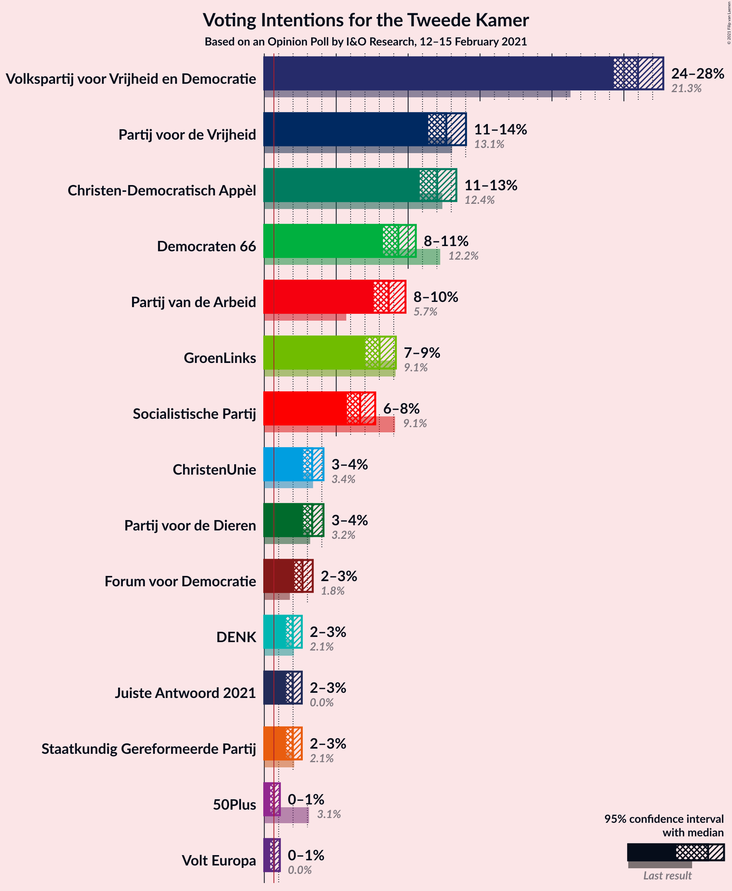

### Confidence Intervals

| Party | Last Result | Poll Result | 80% Confidence Interval | 90% Confidence Interval | 95% Confidence Interval | 99% Confidence Interval |
|:-----:|:-----------:|:-----------:|:-----------------------:|:-----------------------:|:-----------------------:|:-----------------------:|
| Volkspartij voor Vrijheid en Democratie | 21.3% | 26.0% | 24.9–27.1% |24.6–27.5% |24.3–27.7% |23.8–28.3% |
| Partij voor de Vrijheid | 13.1% | 12.7% | 11.8–13.5% |11.6–13.8% |11.4–14.0% |11.0–14.4% |
| Christen-Democratisch Appèl | 12.4% | 12.0% | 11.2–12.9% |11.0–13.1% |10.8–13.4% |10.4–13.8% |
| Democraten 66 | 12.2% | 9.3% | 8.6–10.1% |8.4–10.3% |8.2–10.5% |7.9–10.9% |
| Partij van de Arbeid | 5.7% | 8.6% | 8.0–9.4% |7.8–9.6% |7.6–9.8% |7.3–10.2% |
| GroenLinks | 9.1% | 8.0% | 7.3–8.7% |7.2–9.0% |7.0–9.1% |6.7–9.5% |
| Socialistische Partij | 9.1% | 6.7% | 6.1–7.3% |5.9–7.5% |5.7–7.7% |5.5–8.0% |
| ChristenUnie | 3.4% | 3.3% | 2.9–3.8% |2.8–4.0% |2.7–4.1% |2.5–4.4% |
| Partij voor de Dieren | 3.2% | 3.3% | 2.9–3.8% |2.8–4.0% |2.7–4.1% |2.5–4.4% |
| Forum voor Democratie | 1.8% | 2.7% | 2.3–3.1% |2.2–3.2% |2.1–3.4% |1.9–3.6% |
| Staatkundig Gereformeerde Partij | 2.1% | 2.0% | 1.7–2.4% |1.6–2.5% |1.5–2.6% |1.4–2.8% |
| DENK | 2.1% | 2.0% | 1.7–2.4% |1.6–2.5% |1.5–2.6% |1.4–2.8% |
| Juiste Antwoord 2021 | 0.0% | 2.0% | 1.7–2.4% |1.6–2.5% |1.5–2.6% |1.4–2.8% |
| 50Plus | 3.1% | 0.7% | 0.5–0.9% |0.5–1.0% |0.4–1.1% |0.4–1.2% |
| Volt Europa | 0.0% | 0.7% | 0.5–0.9% |0.5–1.0% |0.4–1.1% |0.4–1.2% |

*Note:* The poll result column reflects the actual value used in the calculations. Published results may vary slightly, and in addition be rounded to fewer digits.

## Seats

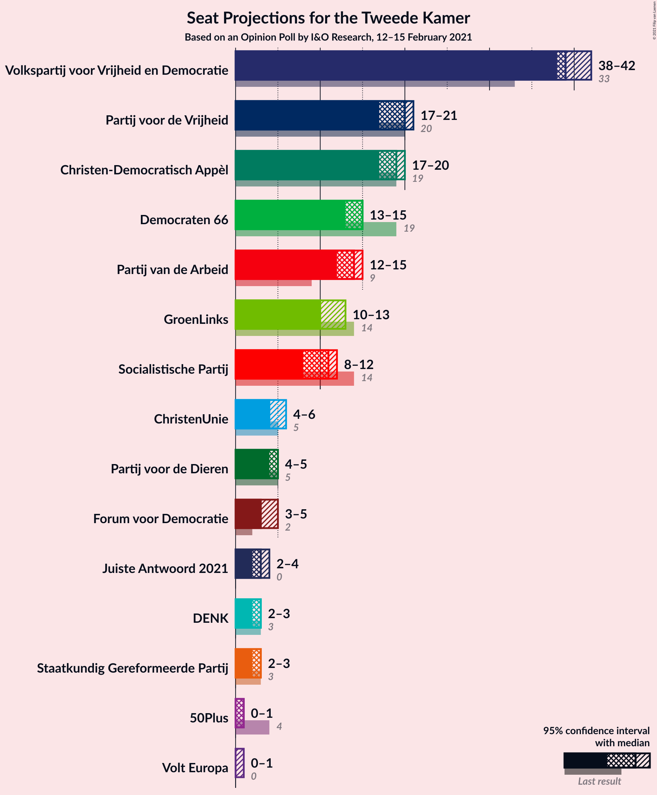

### Confidence Intervals

| Party | Last Result | Median | 80% Confidence Interval | 90% Confidence Interval | 95% Confidence Interval | 99% Confidence Interval |
|:-----:|:-----------:|:------:|:-----------------------:|:-----------------------:|:-----------------------:|:-----------------------:|
| <a href="#volkspartij-voor-vrijheid-en-democratie">Volkspartij voor Vrijheid en Democratie</a> | 33 | 39 | 39–42 |38–42 |38–42 |37–43 |
| <a href="#partij-voor-de-vrijheid">Partij voor de Vrijheid</a> | 20 | 20 | 18–20 |17–20 |17–21 |17–22 |
| <a href="#christen-democratisch-appèl">Christen-Democratisch Appèl</a> | 19 | 19 | 17–20 |17–20 |17–20 |15–21 |
| <a href="#democraten-66">Democraten 66</a> | 19 | 15 | 14–15 |13–15 |13–15 |11–17 |
| <a href="#partij-van-de-arbeid">Partij van de Arbeid</a> | 9 | 14 | 12–14 |12–14 |12–15 |10–15 |
| <a href="#groenlinks">GroenLinks</a> | 14 | 10 | 10–13 |10–13 |10–13 |10–13 |
| <a href="#socialistische-partij">Socialistische Partij</a> | 14 | 11 | 8–11 |8–11 |8–12 |8–13 |
| <a href="#christenunie">ChristenUnie</a> | 5 | 4 | 4–6 |4–6 |4–6 |4–6 |
| <a href="#partij-voor-de-dieren">Partij voor de Dieren</a> | 5 | 5 | 4–5 |4–5 |4–5 |4–6 |
| <a href="#forum-voor-democratie">Forum voor Democratie</a> | 2 | 3 | 3–4 |3–5 |3–5 |3–5 |
| <a href="#staatkundig-gereformeerde-partij">Staatkundig Gereformeerde Partij</a> | 3 | 3 | 3 |2–3 |2–3 |2–3 |
| <a href="#denk">DENK</a> | 3 | 3 | 2–3 |2–3 |2–3 |2–3 |
| <a href="#juiste-antwoord-2021">Juiste Antwoord 2021</a> | 0 | 3 | 2–3 |2–3 |2–4 |1–4 |
| <a href="#50plus">50Plus</a> | 4 | 1 | 0–1 |0–1 |0–1 |0–2 |
| <a href="#volt-europa">Volt Europa</a> | 0 | 0 | 0–1 |0–1 |0–1 |0–1 |

### Volkspartij voor Vrijheid en Democratie

*For a full overview of the results for this party, see the [Volkspartij voor Vrijheid en Democratie](party-volkspartijvoorvrijheidendemocratie.html) page.*

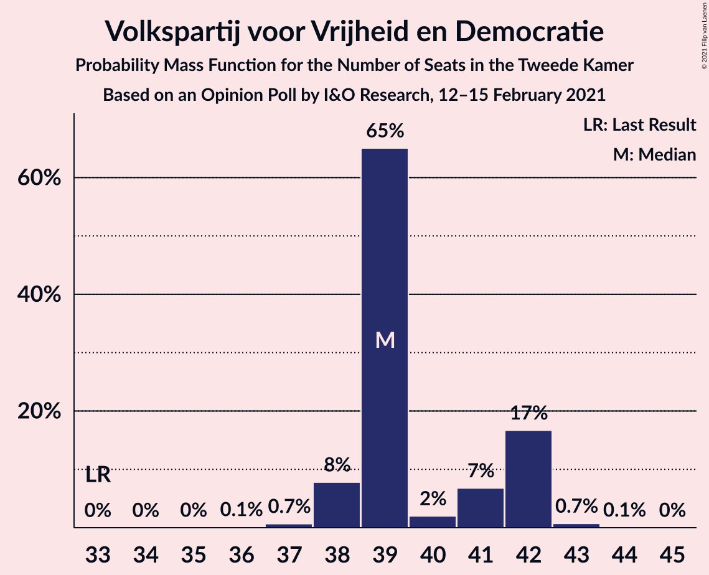

| Number of Seats | Probability | Accumulated | Special Marks |
|:---------------:|:-----------:|:-----------:|:-------------:|
| 33 | 0% | 100% | Last Result |
| 34 | 0% | 100% |  |
| 35 | 0% | 100% |  |
| 36 | 0.1% | 100% |  |
| 37 | 0.7% | 99.8% |  |
| 38 | 8% | 99.1% |  |
| 39 | 65% | 91% | Median |
| 40 | 2% | 26% |  |
| 41 | 7% | 24% |  |
| 42 | 17% | 17% |  |
| 43 | 0.7% | 0.8% |  |
| 44 | 0.1% | 0.1% |  |
| 45 | 0% | 0% |  |

### Partij voor de Vrijheid

*For a full overview of the results for this party, see the [Partij voor de Vrijheid](party-partijvoordevrijheid.html) page.*

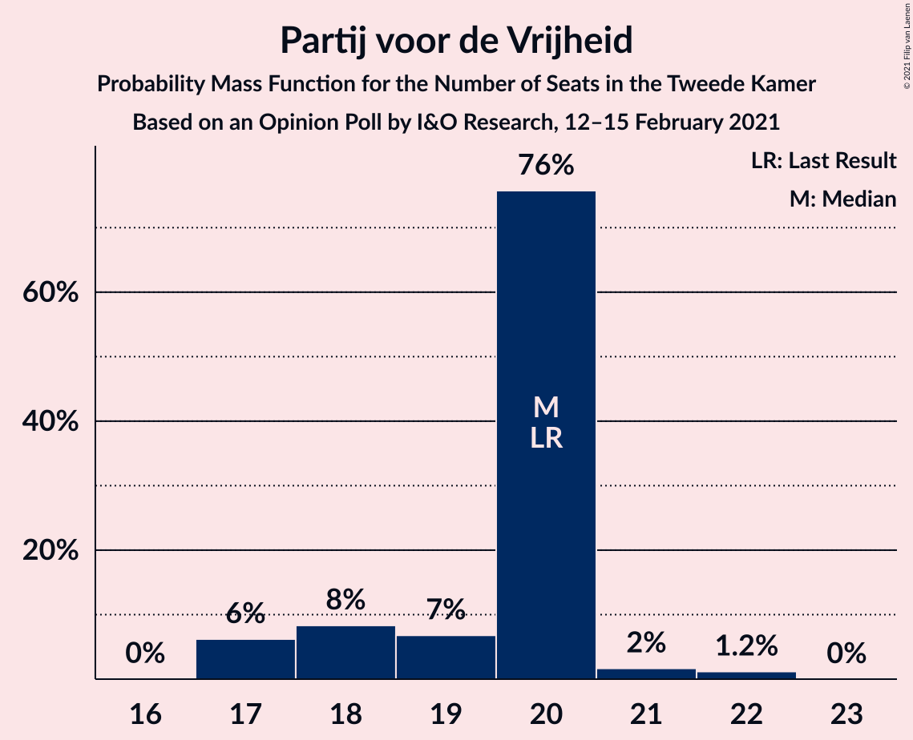

| Number of Seats | Probability | Accumulated | Special Marks |
|:---------------:|:-----------:|:-----------:|:-------------:|
| 17 | 6% | 100% |  |
| 18 | 8% | 94% |  |
| 19 | 7% | 85% |  |
| 20 | 76% | 79% | Last Result, Median |
| 21 | 2% | 3% |  |
| 22 | 1.2% | 1.2% |  |
| 23 | 0% | 0% |  |

### Christen-Democratisch Appèl

*For a full overview of the results for this party, see the [Christen-Democratisch Appèl](party-christen-democratischappèl.html) page.*

| Number of Seats | Probability | Accumulated | Special Marks |
|:---------------:|:-----------:|:-----------:|:-------------:|
| 15 | 0.6% | 100% |  |
| 16 | 0.6% | 99.4% |  |
| 17 | 11% | 98.8% |  |
| 18 | 7% | 88% |  |
| 19 | 71% | 81% | Last Result, Median |
| 20 | 9% | 10% |  |
| 21 | 0.6% | 0.6% |  |
| 22 | 0% | 0% |  |

### Democraten 66

*For a full overview of the results for this party, see the [Democraten 66](party-democraten66.html) page.*

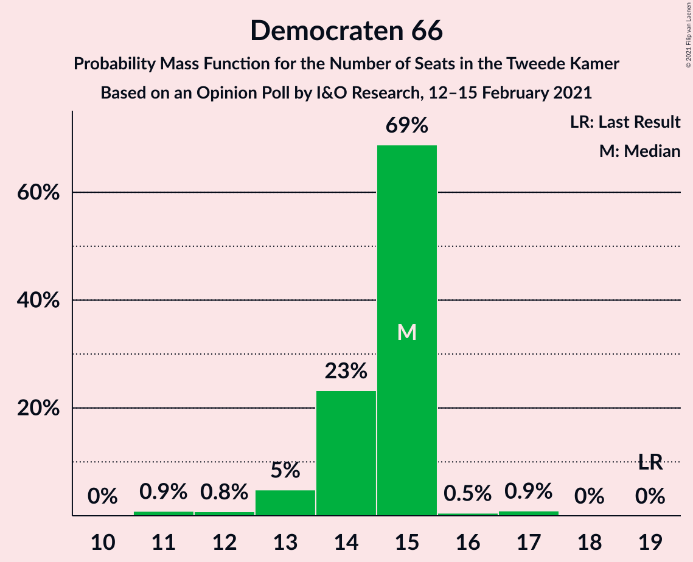

| Number of Seats | Probability | Accumulated | Special Marks |
|:---------------:|:-----------:|:-----------:|:-------------:|
| 11 | 0.9% | 100% |  |
| 12 | 0.8% | 99.1% |  |
| 13 | 5% | 98% |  |
| 14 | 23% | 94% |  |
| 15 | 69% | 70% | Median |
| 16 | 0.5% | 1.5% |  |
| 17 | 0.9% | 0.9% |  |
| 18 | 0% | 0% |  |
| 19 | 0% | 0% | Last Result |

### Partij van de Arbeid

*For a full overview of the results for this party, see the [Partij van de Arbeid](party-partijvandearbeid.html) page.*

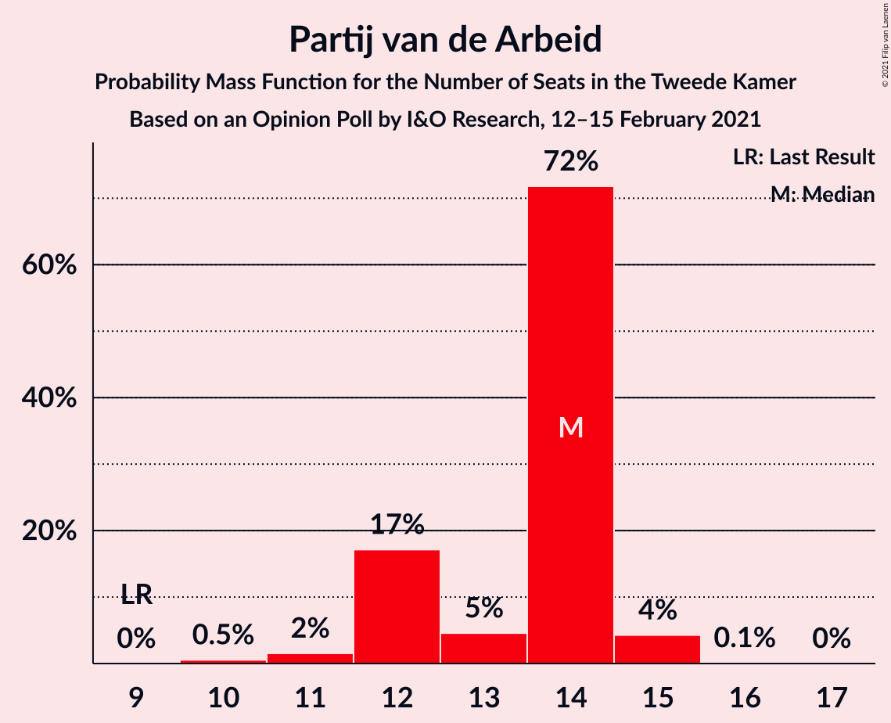

| Number of Seats | Probability | Accumulated | Special Marks |
|:---------------:|:-----------:|:-----------:|:-------------:|
| 9 | 0% | 100% | Last Result |
| 10 | 0.5% | 100% |  |
| 11 | 2% | 99.5% |  |
| 12 | 17% | 98% |  |
| 13 | 5% | 81% |  |
| 14 | 72% | 76% | Median |
| 15 | 4% | 4% |  |
| 16 | 0.1% | 0.1% |  |
| 17 | 0% | 0% |  |

### GroenLinks

*For a full overview of the results for this party, see the [GroenLinks](party-groenlinks.html) page.*

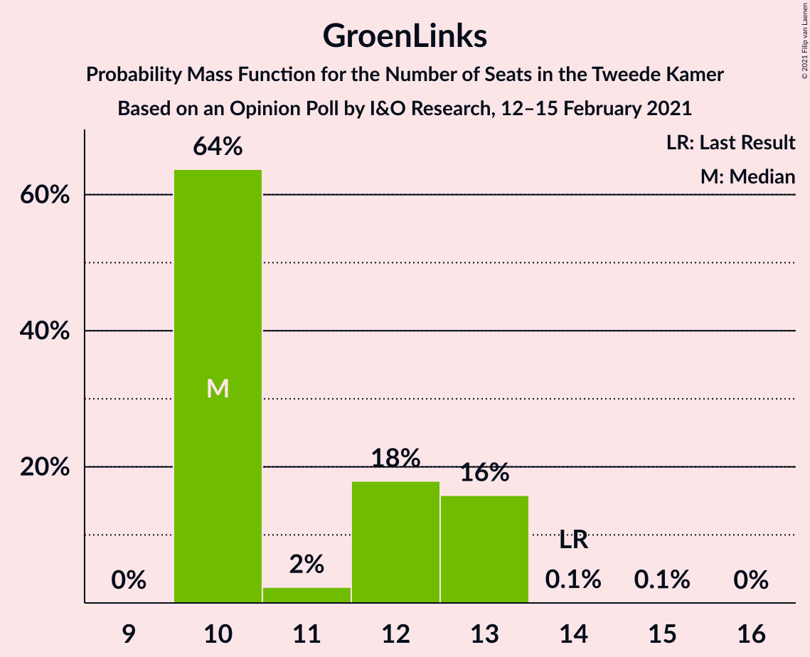

| Number of Seats | Probability | Accumulated | Special Marks |
|:---------------:|:-----------:|:-----------:|:-------------:|
| 10 | 64% | 100% | Median |
| 11 | 2% | 36% |  |
| 12 | 18% | 34% |  |
| 13 | 16% | 16% |  |
| 14 | 0.1% | 0.2% | Last Result |
| 15 | 0.1% | 0.1% |  |
| 16 | 0% | 0% |  |

### Socialistische Partij

*For a full overview of the results for this party, see the [Socialistische Partij](party-socialistischepartij.html) page.*

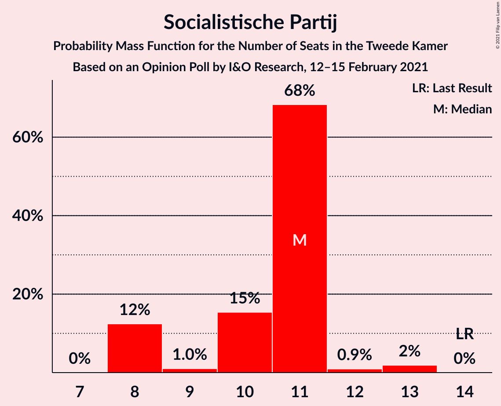

| Number of Seats | Probability | Accumulated | Special Marks |
|:---------------:|:-----------:|:-----------:|:-------------:|
| 8 | 12% | 100% |  |
| 9 | 1.0% | 88% |  |
| 10 | 15% | 87% |  |
| 11 | 68% | 71% | Median |
| 12 | 0.9% | 3% |  |
| 13 | 2% | 2% |  |
| 14 | 0% | 0% | Last Result |

### ChristenUnie

*For a full overview of the results for this party, see the [ChristenUnie](party-christenunie.html) page.*

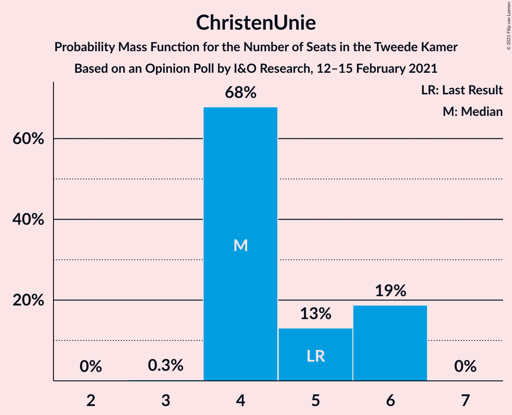

| Number of Seats | Probability | Accumulated | Special Marks |
|:---------------:|:-----------:|:-----------:|:-------------:|
| 3 | 0.3% | 100% |  |
| 4 | 68% | 99.7% | Median |
| 5 | 13% | 32% | Last Result |
| 6 | 19% | 19% |  |
| 7 | 0% | 0% |  |

### Partij voor de Dieren

*For a full overview of the results for this party, see the [Partij voor de Dieren](party-partijvoordedieren.html) page.*

| Number of Seats | Probability | Accumulated | Special Marks |
|:---------------:|:-----------:|:-----------:|:-------------:|
| 3 | 0.1% | 100% |  |
| 4 | 16% | 99.9% |  |
| 5 | 83% | 84% | Last Result, Median |
| 6 | 2% | 2% |  |
| 7 | 0.1% | 0.1% |  |
| 8 | 0% | 0% |  |

### Forum voor Democratie

*For a full overview of the results for this party, see the [Forum voor Democratie](party-forumvoordemocratie.html) page.*

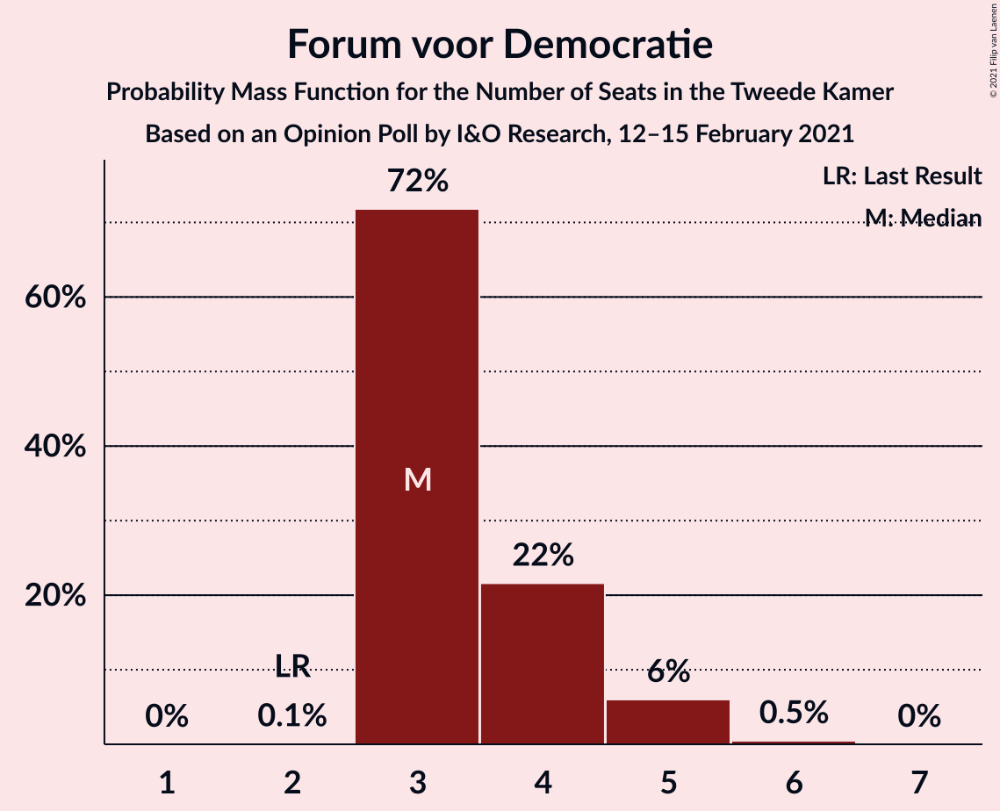

| Number of Seats | Probability | Accumulated | Special Marks |
|:---------------:|:-----------:|:-----------:|:-------------:|
| 2 | 0.1% | 100% | Last Result |
| 3 | 72% | 99.9% | Median |
| 4 | 22% | 28% |  |
| 5 | 6% | 6% |  |
| 6 | 0.5% | 0.5% |  |
| 7 | 0% | 0% |  |

### Staatkundig Gereformeerde Partij

*For a full overview of the results for this party, see the [Staatkundig Gereformeerde Partij](party-staatkundiggereformeerdepartij.html) page.*

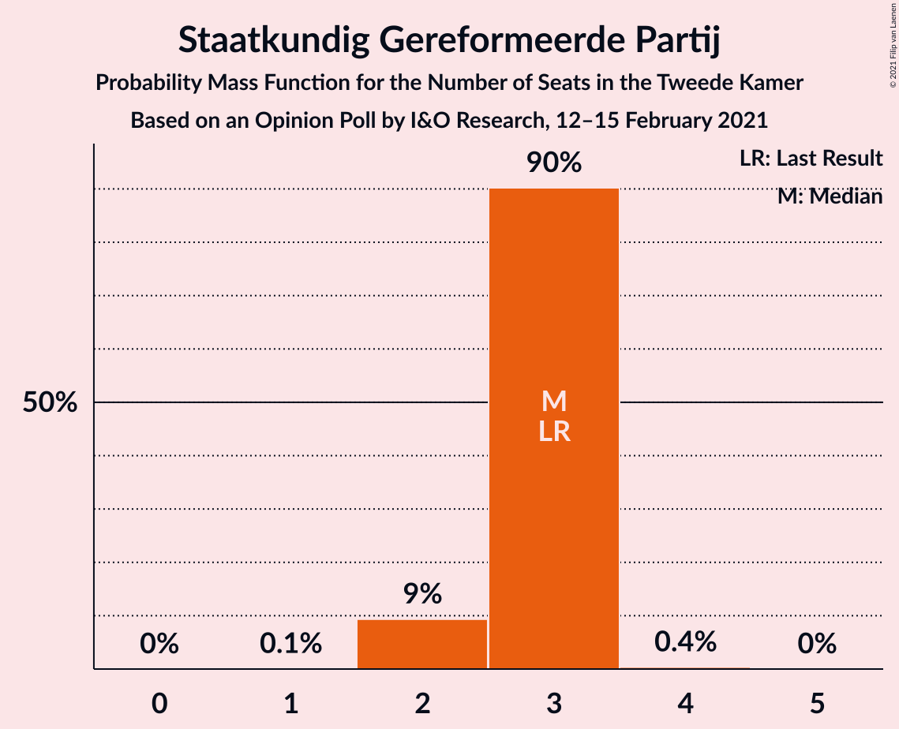

| Number of Seats | Probability | Accumulated | Special Marks |
|:---------------:|:-----------:|:-----------:|:-------------:|
| 1 | 0.1% | 100% |  |
| 2 | 9% | 99.9% |  |
| 3 | 90% | 91% | Last Result, Median |
| 4 | 0.4% | 0.4% |  |
| 5 | 0% | 0% |  |

### DENK

*For a full overview of the results for this party, see the [DENK](party-denk.html) page.*

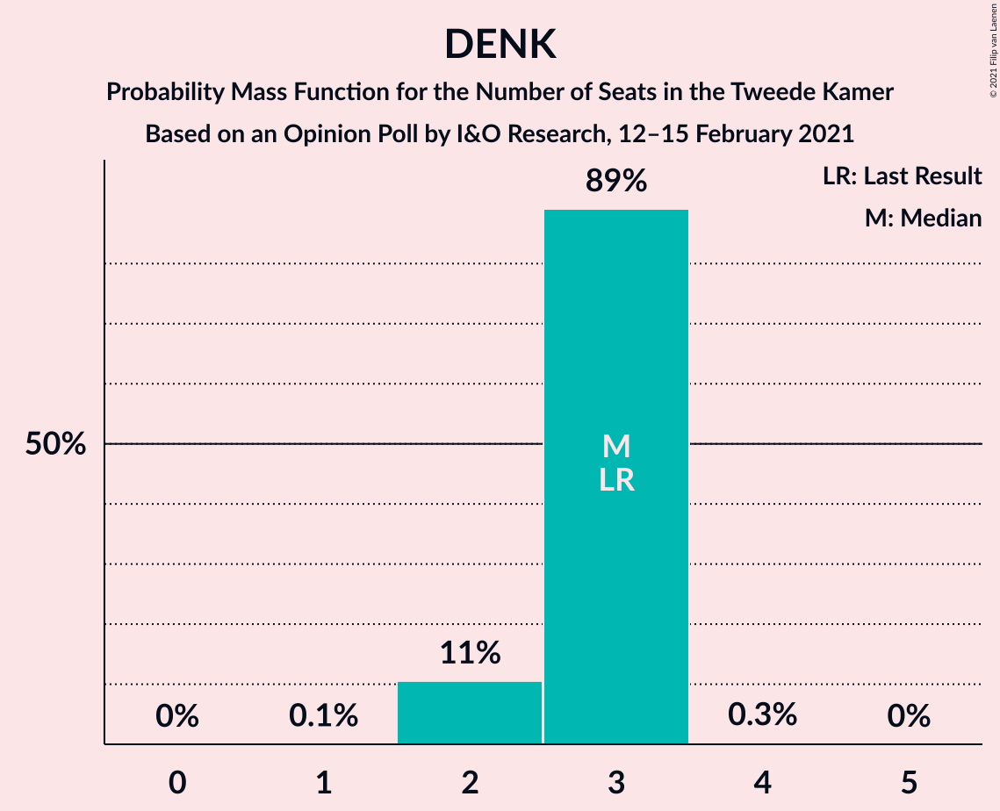

| Number of Seats | Probability | Accumulated | Special Marks |
|:---------------:|:-----------:|:-----------:|:-------------:|
| 1 | 0.1% | 100% |  |
| 2 | 11% | 99.9% |  |
| 3 | 89% | 89% | Last Result, Median |
| 4 | 0.3% | 0.3% |  |
| 5 | 0% | 0% |  |

### Juiste Antwoord 2021

*For a full overview of the results for this party, see the [Juiste Antwoord 2021](party-juisteantwoord2021.html) page.*

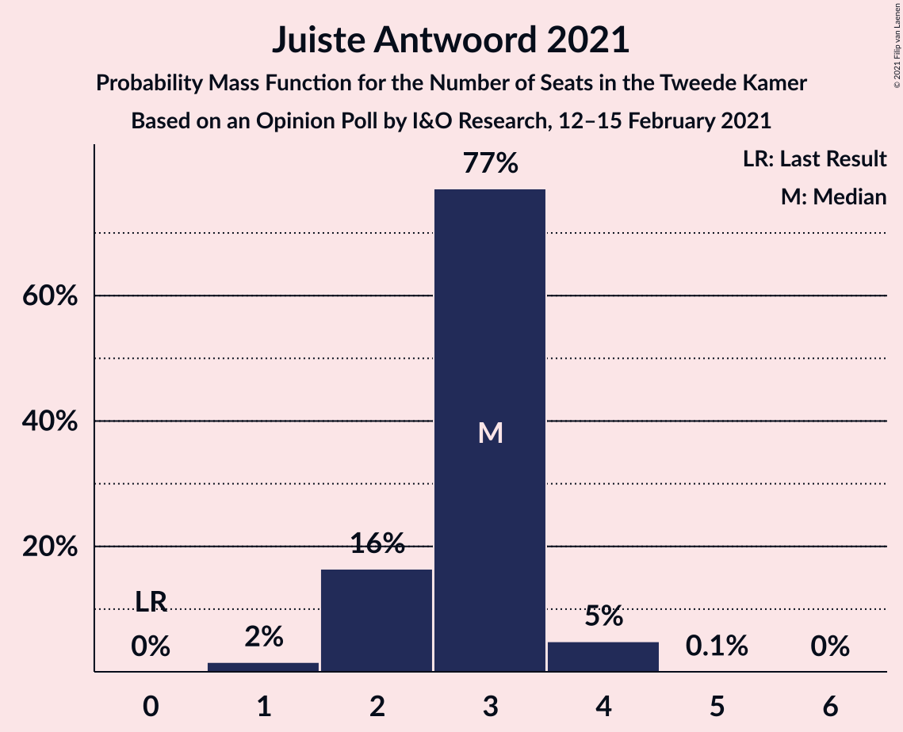

| Number of Seats | Probability | Accumulated | Special Marks |
|:---------------:|:-----------:|:-----------:|:-------------:|
| 0 | 0% | 100% | Last Result |
| 1 | 2% | 100% |  |
| 2 | 16% | 98% |  |
| 3 | 77% | 82% | Median |
| 4 | 5% | 5% |  |
| 5 | 0.1% | 0.1% |  |
| 6 | 0% | 0% |  |

### 50Plus

*For a full overview of the results for this party, see the [50Plus](party-50plus.html) page.*

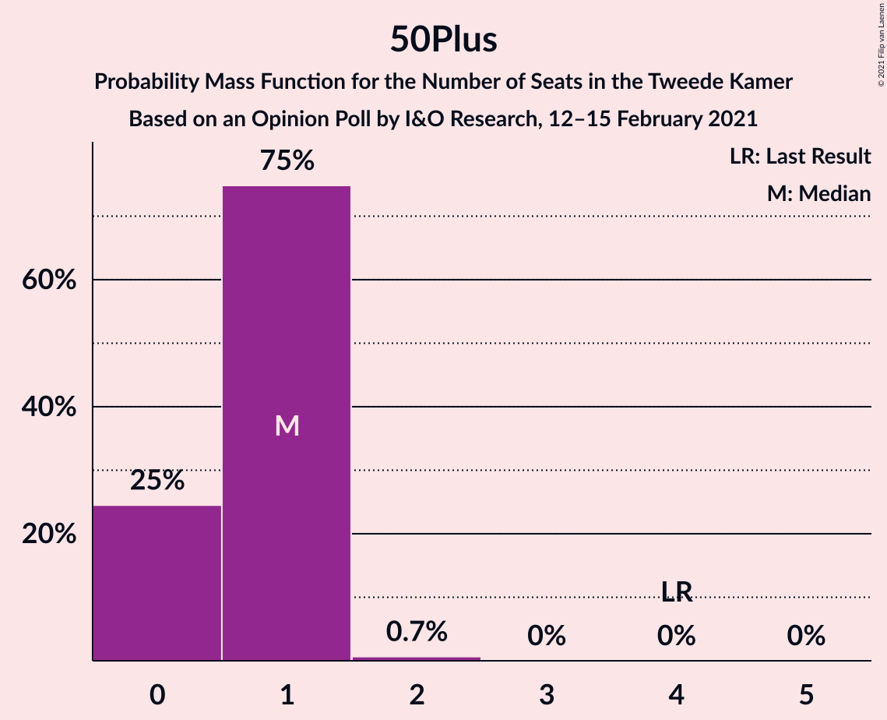

| Number of Seats | Probability | Accumulated | Special Marks |
|:---------------:|:-----------:|:-----------:|:-------------:|
| 0 | 25% | 100% |  |
| 1 | 75% | 75% | Median |
| 2 | 0.7% | 0.7% |  |
| 3 | 0% | 0% |  |
| 4 | 0% | 0% | Last Result |

### Volt Europa

*For a full overview of the results for this party, see the [Volt Europa](party-volteuropa.html) page.*

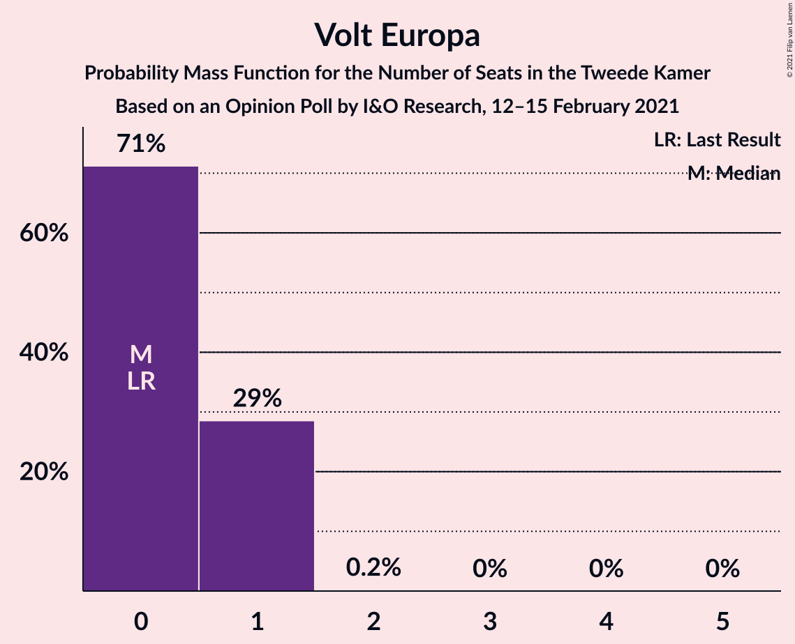

| Number of Seats | Probability | Accumulated | Special Marks |
|:---------------:|:-----------:|:-----------:|:-------------:|
| 0 | 71% | 100% | Last Result, Median |
| 1 | 29% | 29% |  |
| 2 | 0.2% | 0.2% |  |
| 3 | 0% | 0% |  |

## Coalitions

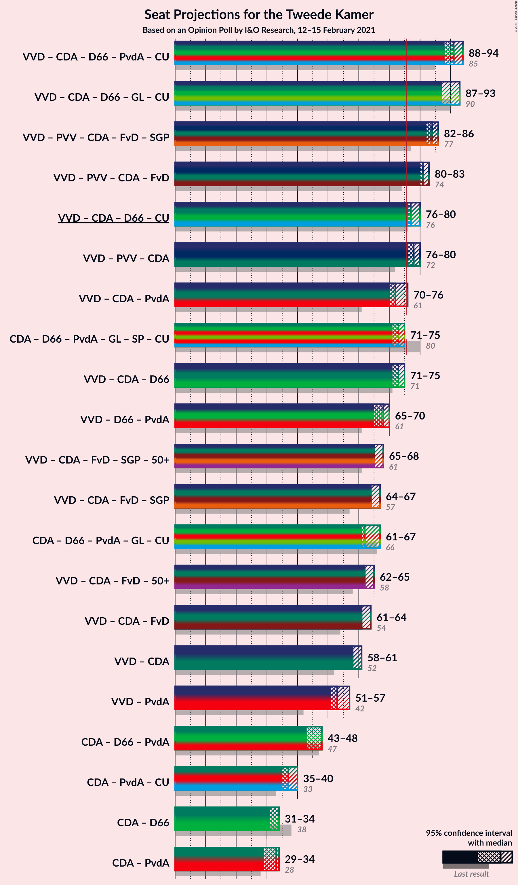

### Confidence Intervals

| Coalition | Last Result | Median | Majority? | 80% Confidence Interval | 90% Confidence Interval | 95% Confidence Interval | 99% Confidence Interval |
|:---------:|:-----------:|:------:|:---------:|:-----------------------:|:-----------------------:|:-----------------------:|:-----------------------:|
| Volkspartij voor Vrijheid en Democratie – Christen-Democratisch Appèl – Democraten 66 – Partij van de Arbeid – ChristenUnie | 85 | 91 | 100% | 91–92 | 90–93 | 88–94 | 87–94 |
| Volkspartij voor Vrijheid en Democratie – Christen-Democratisch Appèl – Democraten 66 – GroenLinks – ChristenUnie | 90 | 87 | 100% | 87–91 | 87–92 | 87–93 | 86–93 |
| Volkspartij voor Vrijheid en Democratie – Partij voor de Vrijheid – Christen-Democratisch Appèl – Forum voor Democratie – Staatkundig Gereformeerde Partij | 77 | 84 | 100% | 83–86 | 83–86 | 82–86 | 82–88 |
| Volkspartij voor Vrijheid en Democratie – Partij voor de Vrijheid – Christen-Democratisch Appèl – Forum voor Democratie | 74 | 81 | 100% | 80–83 | 80–83 | 80–83 | 79–86 |
| Volkspartij voor Vrijheid en Democratie – Christen-Democratisch Appèl – Democraten 66 – ChristenUnie | 76 | 77 | 98% | 77–79 | 77–79 | 76–80 | 74–81 |
| Volkspartij voor Vrijheid en Democratie – Partij voor de Vrijheid – Christen-Democratisch Appèl | 72 | 78 | 98.9% | 76–79 | 76–80 | 76–80 | 75–82 |
| Volkspartij voor Vrijheid en Democratie – Christen-Democratisch Appèl – Partij van de Arbeid | 61 | 72 | 4% | 71–72 | 71–73 | 70–76 | 68–76 |
| Christen-Democratisch Appèl – Democraten 66 – Partij van de Arbeid – GroenLinks – Socialistische Partij – ChristenUnie | 80 | 73 | 0.3% | 71–74 | 71–75 | 71–75 | 70–75 |
| Volkspartij voor Vrijheid en Democratie – Christen-Democratisch Appèl – Democraten 66 | 71 | 73 | 1.0% | 72–74 | 72–75 | 71–75 | 69–77 |
| Volkspartij voor Vrijheid en Democratie – Democraten 66 – Partij van de Arbeid | 61 | 68 | 0% | 66–68 | 66–70 | 65–70 | 62–70 |
| Volkspartij voor Vrijheid en Democratie – Christen-Democratisch Appèl – Forum voor Democratie – Staatkundig Gereformeerde Partij – 50Plus | 61 | 65 | 0% | 65–66 | 65–68 | 65–68 | 63–69 |
| Volkspartij voor Vrijheid en Democratie – Christen-Democratisch Appèl – Forum voor Democratie – Staatkundig Gereformeerde Partij | 57 | 64 | 0% | 64–66 | 64–67 | 64–67 | 63–67 |
| Christen-Democratisch Appèl – Democraten 66 – Partij van de Arbeid – GroenLinks – ChristenUnie | 66 | 62 | 0% | 61–65 | 61–67 | 61–67 | 59–67 |
| Volkspartij voor Vrijheid en Democratie – Christen-Democratisch Appèl – Forum voor Democratie – 50Plus | 58 | 62 | 0% | 62–64 | 62–65 | 62–65 | 60–66 |
| Volkspartij voor Vrijheid en Democratie – Christen-Democratisch Appèl – Forum voor Democratie | 54 | 61 | 0% | 61–64 | 61–64 | 61–64 | 60–65 |
| Volkspartij voor Vrijheid en Democratie – Christen-Democratisch Appèl | 52 | 58 | 0% | 58–60 | 58–60 | 58–61 | 55–61 |
| Volkspartij voor Vrijheid en Democratie – Partij van de Arbeid | 42 | 53 | 0% | 52–54 | 52–55 | 51–57 | 48–57 |
| Christen-Democratisch Appèl – Democraten 66 – Partij van de Arbeid | 47 | 48 | 0% | 43–48 | 43–48 | 43–48 | 42–48 |
| Christen-Democratisch Appèl – Partij van de Arbeid – ChristenUnie | 33 | 37 | 0% | 35–39 | 35–40 | 35–40 | 32–40 |
| Christen-Democratisch Appèl – Democraten 66 | 38 | 34 | 0% | 31–34 | 31–34 | 31–34 | 30–37 |
| Christen-Democratisch Appèl – Partij van de Arbeid | 28 | 33 | 0% | 29–34 | 29–34 | 29–34 | 27–34 |

### Volkspartij voor Vrijheid en Democratie – Christen-Democratisch Appèl – Democraten 66 – Partij van de Arbeid – ChristenUnie

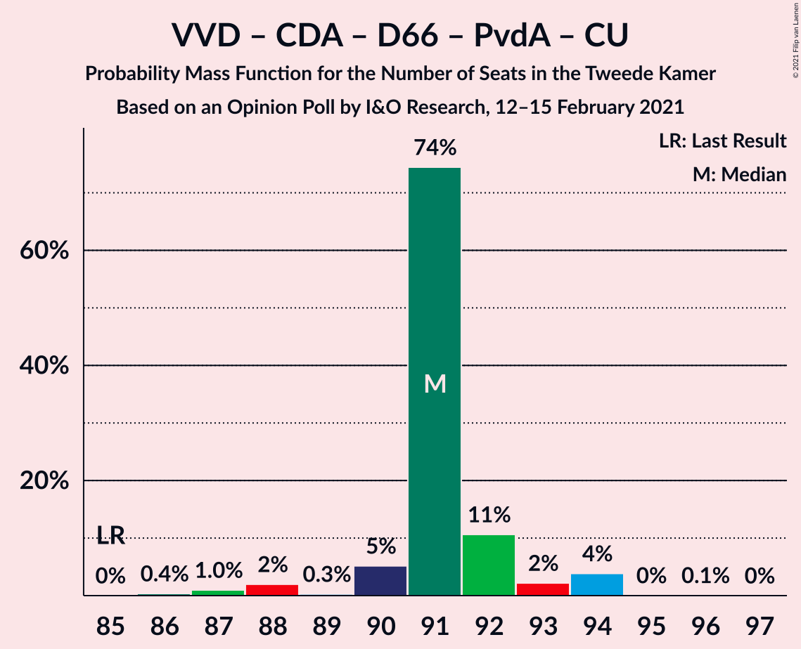

| Number of Seats | Probability | Accumulated | Special Marks |
|:---------------:|:-----------:|:-----------:|:-------------:|
| 85 | 0% | 100% | Last Result |
| 86 | 0.4% | 100% |  |
| 87 | 1.0% | 99.6% |  |
| 88 | 2% | 98.6% |  |
| 89 | 0.3% | 97% |  |
| 90 | 5% | 96% |  |
| 91 | 74% | 91% | Median |
| 92 | 11% | 17% |  |
| 93 | 2% | 6% |  |
| 94 | 4% | 4% |  |
| 95 | 0% | 0.1% |  |
| 96 | 0.1% | 0.1% |  |
| 97 | 0% | 0% |  |

### Volkspartij voor Vrijheid en Democratie – Christen-Democratisch Appèl – Democraten 66 – GroenLinks – ChristenUnie

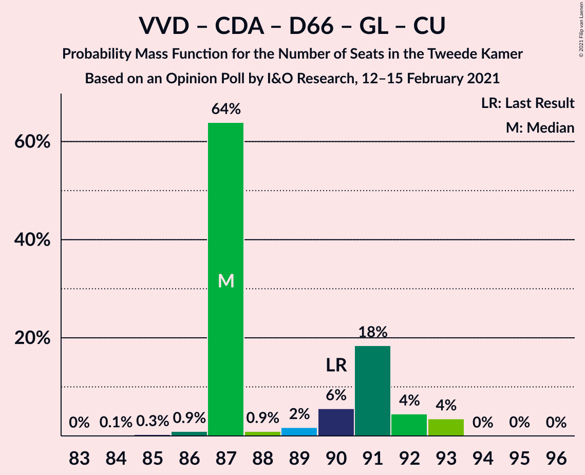

| Number of Seats | Probability | Accumulated | Special Marks |
|:---------------:|:-----------:|:-----------:|:-------------:|
| 84 | 0.1% | 100% |  |
| 85 | 0.3% | 99.9% |  |
| 86 | 0.9% | 99.6% |  |
| 87 | 64% | 98.7% | Median |
| 88 | 0.9% | 35% |  |
| 89 | 2% | 34% |  |
| 90 | 6% | 32% | Last Result |
| 91 | 18% | 26% |  |
| 92 | 4% | 8% |  |
| 93 | 4% | 4% |  |
| 94 | 0% | 0.1% |  |
| 95 | 0% | 0.1% |  |
| 96 | 0% | 0% |  |

### Volkspartij voor Vrijheid en Democratie – Partij voor de Vrijheid – Christen-Democratisch Appèl – Forum voor Democratie – Staatkundig Gereformeerde Partij

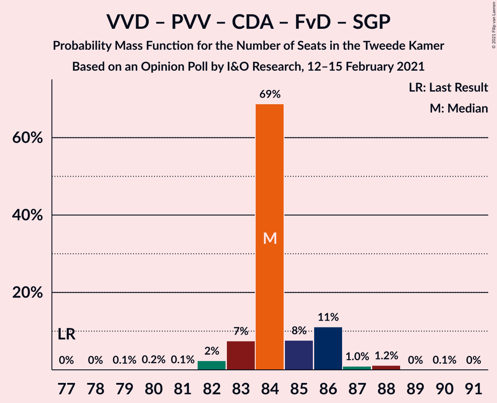

| Number of Seats | Probability | Accumulated | Special Marks |
|:---------------:|:-----------:|:-----------:|:-------------:|
| 77 | 0% | 100% | Last Result |
| 78 | 0% | 100% |  |
| 79 | 0.1% | 100% |  |
| 80 | 0.2% | 99.9% |  |
| 81 | 0.1% | 99.8% |  |
| 82 | 2% | 99.6% |  |
| 83 | 7% | 97% |  |
| 84 | 69% | 90% | Median |
| 85 | 8% | 21% |  |
| 86 | 11% | 13% |  |
| 87 | 1.0% | 2% |  |
| 88 | 1.2% | 1.3% |  |
| 89 | 0% | 0.1% |  |
| 90 | 0.1% | 0.1% |  |
| 91 | 0% | 0% |  |

### Volkspartij voor Vrijheid en Democratie – Partij voor de Vrijheid – Christen-Democratisch Appèl – Forum voor Democratie

| Number of Seats | Probability | Accumulated | Special Marks |
|:---------------:|:-----------:|:-----------:|:-------------:|
| 74 | 0% | 100% | Last Result |
| 75 | 0% | 100% |  |
| 76 | 0% | 100% | Majority |
| 77 | 0.2% | 100% |  |
| 78 | 0.1% | 99.8% |  |
| 79 | 0.2% | 99.6% |  |
| 80 | 10% | 99.5% |  |
| 81 | 69% | 90% | Median |
| 82 | 3% | 21% |  |
| 83 | 16% | 18% |  |
| 84 | 0.1% | 2% |  |
| 85 | 0.9% | 2% |  |
| 86 | 1.1% | 1.2% |  |
| 87 | 0% | 0.1% |  |
| 88 | 0.1% | 0.1% |  |
| 89 | 0% | 0% |  |

### Volkspartij voor Vrijheid en Democratie – Christen-Democratisch Appèl – Democraten 66 – ChristenUnie

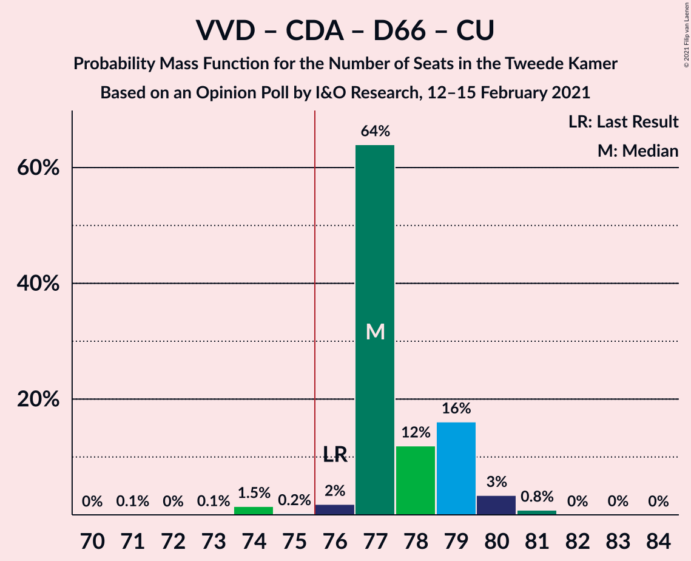

| Number of Seats | Probability | Accumulated | Special Marks |
|:---------------:|:-----------:|:-----------:|:-------------:|
| 71 | 0.1% | 100% |  |
| 72 | 0% | 99.9% |  |
| 73 | 0.1% | 99.9% |  |
| 74 | 1.5% | 99.9% |  |
| 75 | 0.2% | 98% |  |
| 76 | 2% | 98% | Last Result, Majority |
| 77 | 64% | 96% | Median |
| 78 | 12% | 32% |  |
| 79 | 16% | 20% |  |
| 80 | 3% | 4% |  |
| 81 | 0.8% | 0.9% |  |
| 82 | 0% | 0.1% |  |
| 83 | 0% | 0.1% |  |
| 84 | 0% | 0% |  |

### Volkspartij voor Vrijheid en Democratie – Partij voor de Vrijheid – Christen-Democratisch Appèl

| Number of Seats | Probability | Accumulated | Special Marks |
|:---------------:|:-----------:|:-----------:|:-------------:|
| 72 | 0% | 100% | Last Result |
| 73 | 0.1% | 100% |  |
| 74 | 0.3% | 99.9% |  |
| 75 | 0.6% | 99.6% |  |
| 76 | 11% | 98.9% | Majority |
| 77 | 3% | 88% |  |
| 78 | 65% | 84% | Median |
| 79 | 14% | 20% |  |
| 80 | 5% | 6% |  |
| 81 | 0.6% | 1.3% |  |
| 82 | 0.6% | 0.7% |  |
| 83 | 0% | 0.1% |  |
| 84 | 0.1% | 0.1% |  |
| 85 | 0% | 0% |  |

### Volkspartij voor Vrijheid en Democratie – Christen-Democratisch Appèl – Partij van de Arbeid

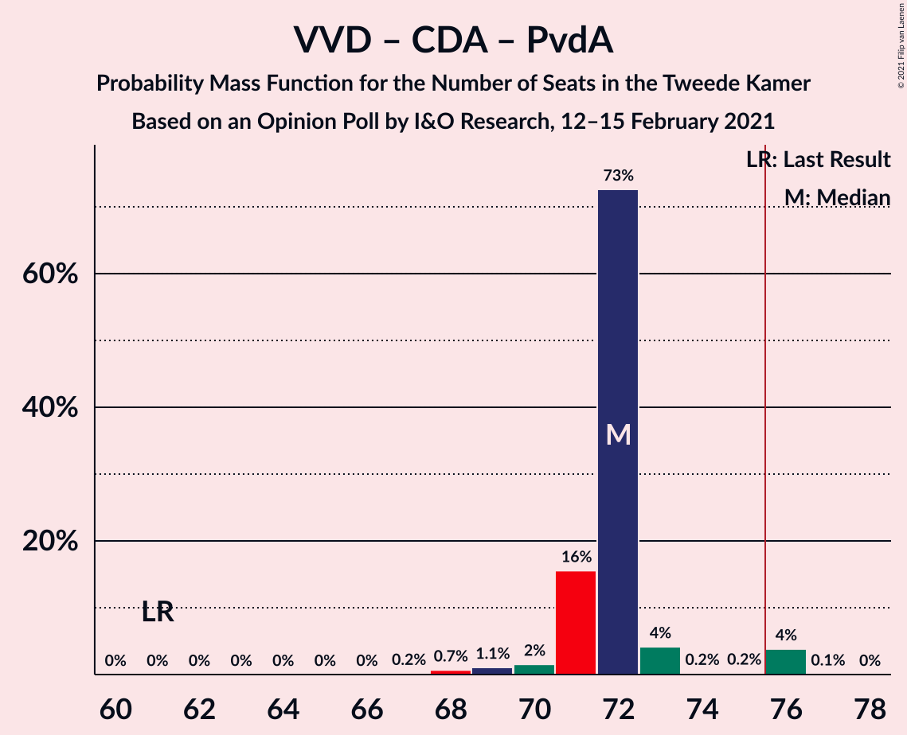

| Number of Seats | Probability | Accumulated | Special Marks |
|:---------------:|:-----------:|:-----------:|:-------------:|
| 61 | 0% | 100% | Last Result |
| 62 | 0% | 100% |  |
| 63 | 0% | 100% |  |
| 64 | 0% | 100% |  |
| 65 | 0% | 100% |  |
| 66 | 0% | 100% |  |
| 67 | 0.2% | 100% |  |
| 68 | 0.7% | 99.8% |  |
| 69 | 1.1% | 99.2% |  |
| 70 | 2% | 98% |  |
| 71 | 16% | 97% |  |
| 72 | 73% | 81% | Median |
| 73 | 4% | 8% |  |
| 74 | 0.2% | 4% |  |
| 75 | 0.2% | 4% |  |
| 76 | 4% | 4% | Majority |
| 77 | 0.1% | 0.1% |  |
| 78 | 0% | 0% |  |

### Christen-Democratisch Appèl – Democraten 66 – Partij van de Arbeid – GroenLinks – Socialistische Partij – ChristenUnie

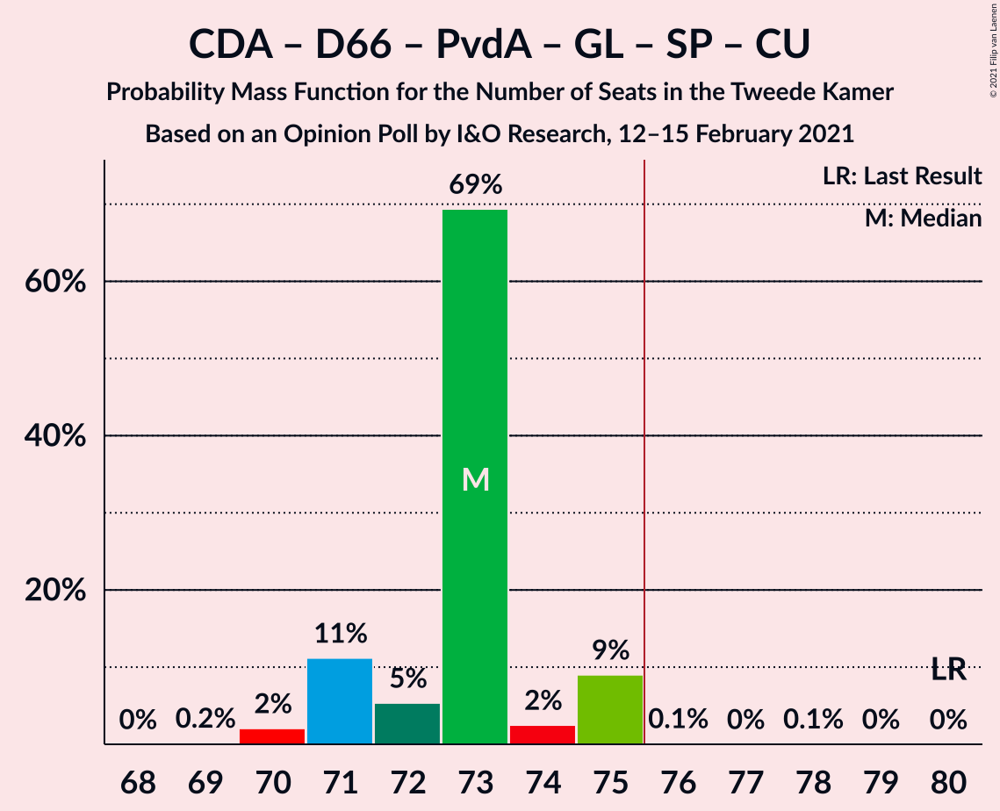

| Number of Seats | Probability | Accumulated | Special Marks |
|:---------------:|:-----------:|:-----------:|:-------------:|
| 69 | 0.2% | 100% |  |
| 70 | 2% | 99.8% |  |
| 71 | 11% | 98% |  |
| 72 | 5% | 87% |  |
| 73 | 69% | 81% | Median |
| 74 | 2% | 12% |  |
| 75 | 9% | 9% |  |
| 76 | 0.1% | 0.3% | Majority |
| 77 | 0% | 0.1% |  |
| 78 | 0.1% | 0.1% |  |
| 79 | 0% | 0% |  |
| 80 | 0% | 0% | Last Result |

### Volkspartij voor Vrijheid en Democratie – Christen-Democratisch Appèl – Democraten 66

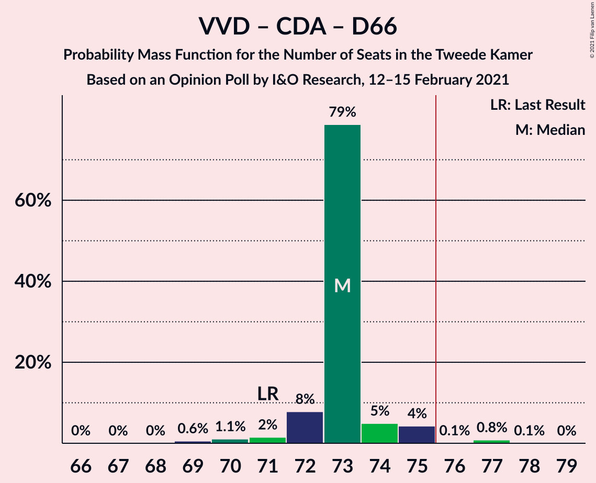

| Number of Seats | Probability | Accumulated | Special Marks |
|:---------------:|:-----------:|:-----------:|:-------------:|
| 66 | 0% | 100% |  |
| 67 | 0% | 99.9% |  |
| 68 | 0% | 99.9% |  |
| 69 | 0.6% | 99.9% |  |
| 70 | 1.1% | 99.3% |  |
| 71 | 2% | 98% | Last Result |
| 72 | 8% | 97% |  |
| 73 | 79% | 89% | Median |
| 74 | 5% | 10% |  |
| 75 | 4% | 5% |  |
| 76 | 0.1% | 1.0% | Majority |
| 77 | 0.8% | 0.9% |  |
| 78 | 0.1% | 0.1% |  |
| 79 | 0% | 0% |  |

### Volkspartij voor Vrijheid en Democratie – Democraten 66 – Partij van de Arbeid

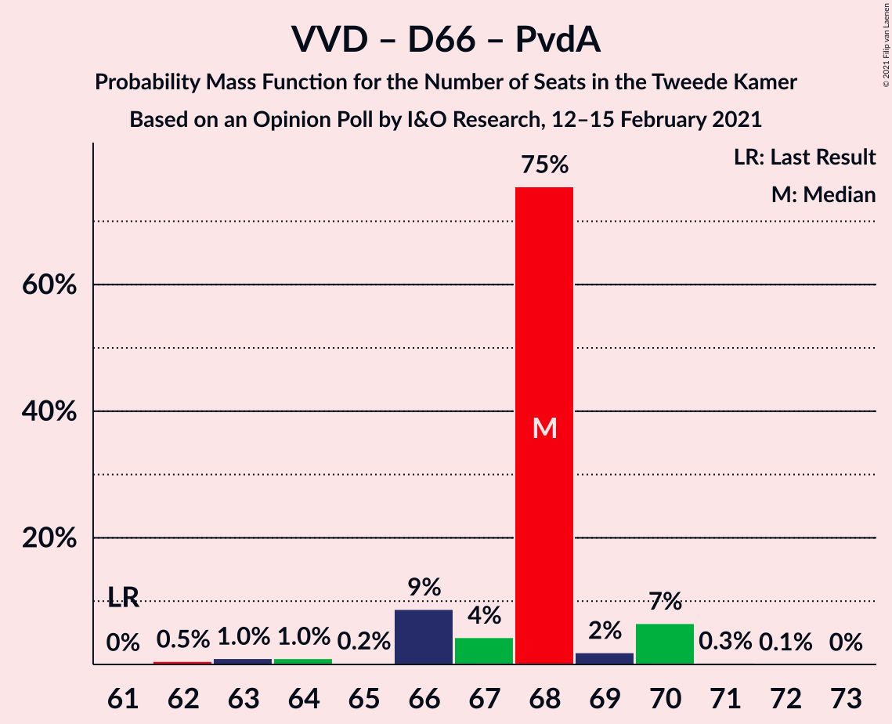

| Number of Seats | Probability | Accumulated | Special Marks |
|:---------------:|:-----------:|:-----------:|:-------------:|
| 61 | 0% | 100% | Last Result |
| 62 | 0.5% | 100% |  |
| 63 | 1.0% | 99.5% |  |
| 64 | 1.0% | 98% |  |
| 65 | 0.2% | 98% |  |
| 66 | 9% | 97% |  |
| 67 | 4% | 89% |  |
| 68 | 75% | 84% | Median |
| 69 | 2% | 9% |  |
| 70 | 7% | 7% |  |
| 71 | 0.3% | 0.4% |  |
| 72 | 0.1% | 0.1% |  |
| 73 | 0% | 0% |  |

### Volkspartij voor Vrijheid en Democratie – Christen-Democratisch Appèl – Forum voor Democratie – Staatkundig Gereformeerde Partij – 50Plus

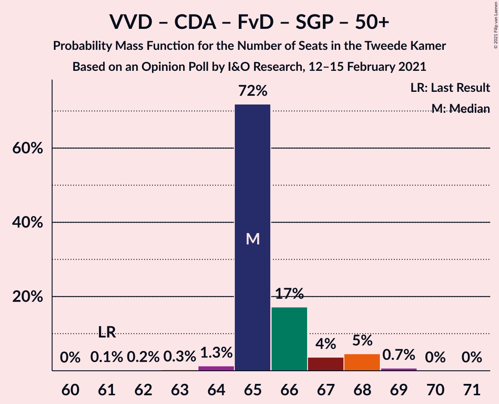

| Number of Seats | Probability | Accumulated | Special Marks |
|:---------------:|:-----------:|:-----------:|:-------------:|
| 61 | 0.1% | 100% | Last Result |
| 62 | 0.2% | 99.9% |  |
| 63 | 0.3% | 99.7% |  |
| 64 | 1.3% | 99.4% |  |
| 65 | 72% | 98% | Median |
| 66 | 17% | 26% |  |
| 67 | 4% | 9% |  |
| 68 | 5% | 5% |  |
| 69 | 0.7% | 0.8% |  |
| 70 | 0% | 0.1% |  |
| 71 | 0% | 0% |  |

### Volkspartij voor Vrijheid en Democratie – Christen-Democratisch Appèl – Forum voor Democratie – Staatkundig Gereformeerde Partij

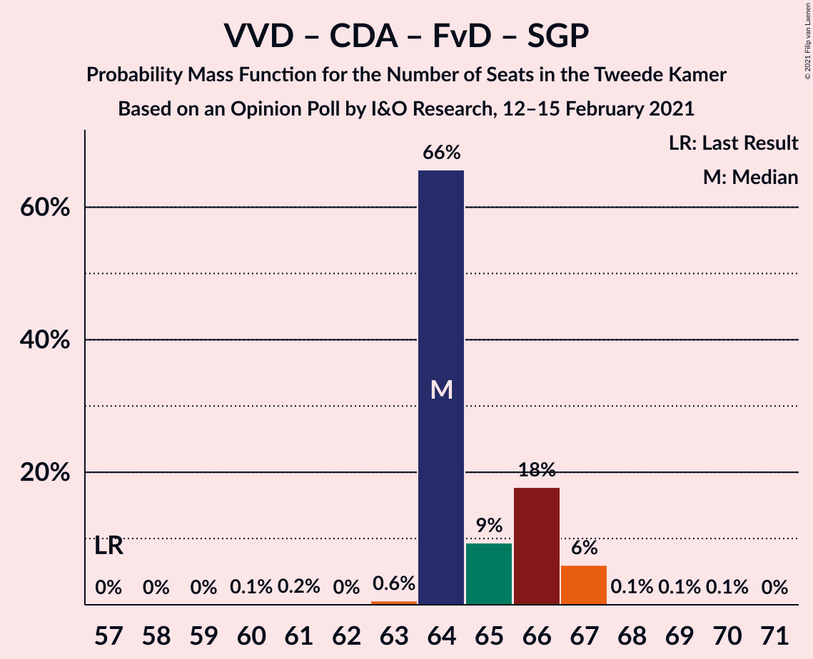

| Number of Seats | Probability | Accumulated | Special Marks |
|:---------------:|:-----------:|:-----------:|:-------------:|
| 57 | 0% | 100% | Last Result |
| 58 | 0% | 100% |  |
| 59 | 0% | 100% |  |
| 60 | 0.1% | 100% |  |
| 61 | 0.2% | 99.9% |  |
| 62 | 0% | 99.7% |  |
| 63 | 0.6% | 99.7% |  |
| 64 | 66% | 99.1% | Median |
| 65 | 9% | 33% |  |
| 66 | 18% | 24% |  |
| 67 | 6% | 6% |  |
| 68 | 0.1% | 0.3% |  |
| 69 | 0.1% | 0.1% |  |
| 70 | 0.1% | 0.1% |  |
| 71 | 0% | 0% |  |

### Christen-Democratisch Appèl – Democraten 66 – Partij van de Arbeid – GroenLinks – ChristenUnie

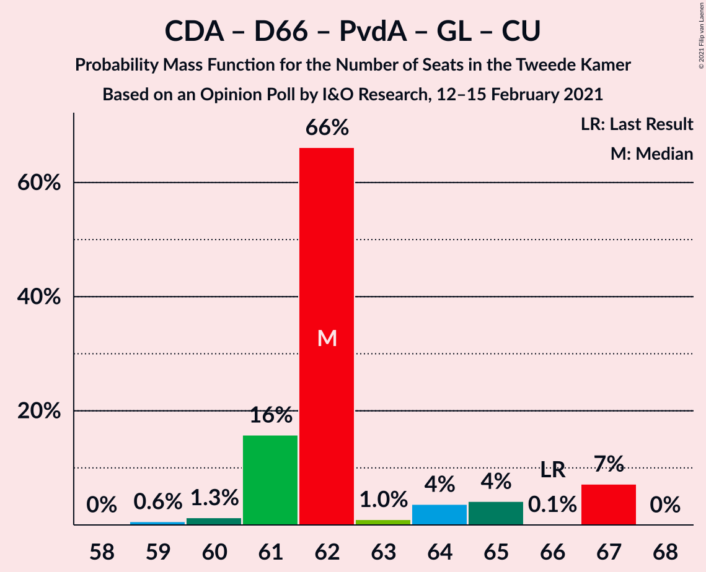

| Number of Seats | Probability | Accumulated | Special Marks |
|:---------------:|:-----------:|:-----------:|:-------------:|
| 58 | 0% | 100% |  |
| 59 | 0.6% | 99.9% |  |
| 60 | 1.3% | 99.3% |  |
| 61 | 16% | 98% |  |
| 62 | 66% | 82% | Median |
| 63 | 1.0% | 16% |  |
| 64 | 4% | 15% |  |
| 65 | 4% | 11% |  |
| 66 | 0.1% | 7% | Last Result |
| 67 | 7% | 7% |  |
| 68 | 0% | 0% |  |

### Volkspartij voor Vrijheid en Democratie – Christen-Democratisch Appèl – Forum voor Democratie – 50Plus

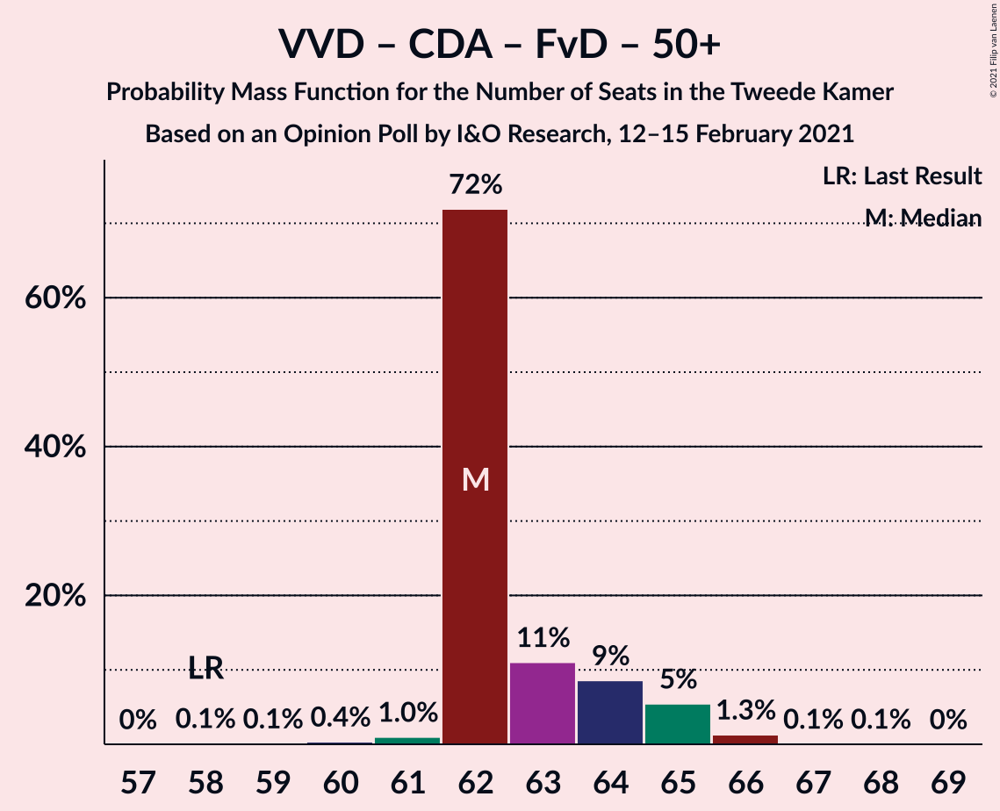

| Number of Seats | Probability | Accumulated | Special Marks |
|:---------------:|:-----------:|:-----------:|:-------------:|
| 58 | 0.1% | 100% | Last Result |
| 59 | 0.1% | 99.8% |  |
| 60 | 0.4% | 99.7% |  |
| 61 | 1.0% | 99.4% |  |
| 62 | 72% | 98% | Median |
| 63 | 11% | 26% |  |
| 64 | 9% | 15% |  |
| 65 | 5% | 7% |  |
| 66 | 1.3% | 1.4% |  |
| 67 | 0.1% | 0.1% |  |
| 68 | 0.1% | 0.1% |  |
| 69 | 0% | 0% |  |

### Volkspartij voor Vrijheid en Democratie – Christen-Democratisch Appèl – Forum voor Democratie

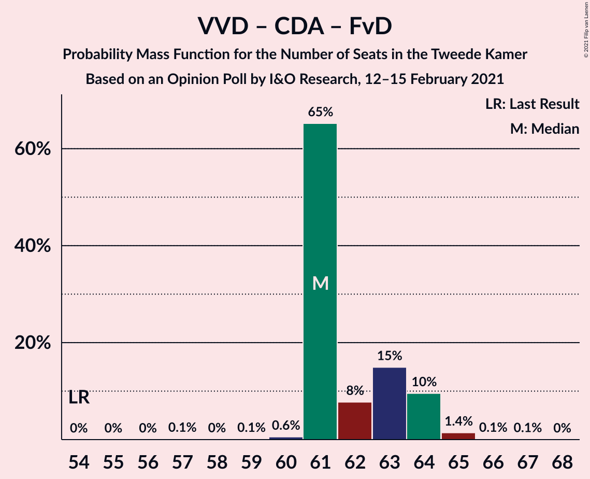

| Number of Seats | Probability | Accumulated | Special Marks |
|:---------------:|:-----------:|:-----------:|:-------------:|
| 54 | 0% | 100% | Last Result |
| 55 | 0% | 100% |  |
| 56 | 0% | 100% |  |
| 57 | 0.1% | 100% |  |
| 58 | 0% | 99.8% |  |
| 59 | 0.1% | 99.8% |  |
| 60 | 0.6% | 99.7% |  |
| 61 | 65% | 99.1% | Median |
| 62 | 8% | 34% |  |
| 63 | 15% | 26% |  |
| 64 | 10% | 11% |  |
| 65 | 1.4% | 2% |  |
| 66 | 0.1% | 0.2% |  |
| 67 | 0.1% | 0.1% |  |
| 68 | 0% | 0% |  |

### Volkspartij voor Vrijheid en Democratie – Christen-Democratisch Appèl

| Number of Seats | Probability | Accumulated | Special Marks |
|:---------------:|:-----------:|:-----------:|:-------------:|
| 52 | 0% | 100% | Last Result |
| 53 | 0.2% | 100% |  |
| 54 | 0% | 99.8% |  |
| 55 | 0.6% | 99.8% |  |
| 56 | 0.4% | 99.3% |  |
| 57 | 1.4% | 98.9% |  |
| 58 | 72% | 98% | Median |
| 59 | 15% | 26% |  |
| 60 | 7% | 11% |  |
| 61 | 4% | 4% |  |
| 62 | 0.1% | 0.2% |  |
| 63 | 0% | 0.1% |  |
| 64 | 0.1% | 0.1% |  |
| 65 | 0% | 0% |  |

### Volkspartij voor Vrijheid en Democratie – Partij van de Arbeid

| Number of Seats | Probability | Accumulated | Special Marks |
|:---------------:|:-----------:|:-----------:|:-------------:|
| 42 | 0% | 100% | Last Result |
| 43 | 0% | 100% |  |
| 44 | 0% | 100% |  |
| 45 | 0% | 100% |  |
| 46 | 0% | 100% |  |
| 47 | 0% | 100% |  |
| 48 | 0.5% | 100% |  |
| 49 | 0.1% | 99.5% |  |
| 50 | 0.6% | 99.3% |  |
| 51 | 2% | 98.8% |  |
| 52 | 8% | 97% |  |
| 53 | 69% | 89% | Median |
| 54 | 12% | 20% |  |
| 55 | 3% | 7% |  |
| 56 | 0.3% | 4% |  |
| 57 | 4% | 4% |  |
| 58 | 0.2% | 0.2% |  |
| 59 | 0% | 0% |  |

### Christen-Democratisch Appèl – Democraten 66 – Partij van de Arbeid

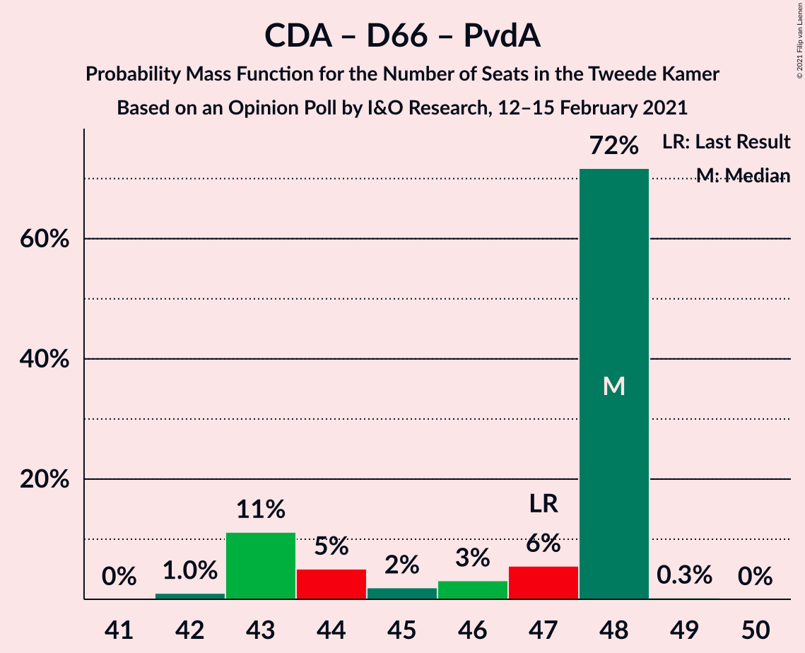

| Number of Seats | Probability | Accumulated | Special Marks |
|:---------------:|:-----------:|:-----------:|:-------------:|
| 42 | 1.0% | 100% |  |
| 43 | 11% | 98.9% |  |
| 44 | 5% | 88% |  |
| 45 | 2% | 83% |  |
| 46 | 3% | 81% |  |
| 47 | 6% | 78% | Last Result |
| 48 | 72% | 72% | Median |
| 49 | 0.3% | 0.3% |  |
| 50 | 0% | 0% |  |

### Christen-Democratisch Appèl – Partij van de Arbeid – ChristenUnie

| Number of Seats | Probability | Accumulated | Special Marks |
|:---------------:|:-----------:|:-----------:|:-------------:|
| 32 | 0.5% | 100% |  |
| 33 | 0.1% | 99.4% | Last Result |
| 34 | 1.5% | 99.4% |  |
| 35 | 16% | 98% |  |
| 36 | 5% | 82% |  |
| 37 | 65% | 77% | Median |
| 38 | 1.1% | 12% |  |
| 39 | 4% | 11% |  |
| 40 | 7% | 7% |  |
| 41 | 0% | 0% |  |

### Christen-Democratisch Appèl – Democraten 66

| Number of Seats | Probability | Accumulated | Special Marks |
|:---------------:|:-----------:|:-----------:|:-------------:|
| 28 | 0.2% | 100% |  |
| 29 | 0% | 99.8% |  |
| 30 | 2% | 99.8% |  |
| 31 | 11% | 98% |  |
| 32 | 9% | 87% |  |
| 33 | 3% | 78% |  |
| 34 | 74% | 75% | Median |
| 35 | 0.1% | 1.1% |  |
| 36 | 0.2% | 1.0% |  |
| 37 | 0.8% | 0.8% |  |
| 38 | 0% | 0% | Last Result |

### Christen-Democratisch Appèl – Partij van de Arbeid

| Number of Seats | Probability | Accumulated | Special Marks |
|:---------------:|:-----------:|:-----------:|:-------------:|
| 27 | 0.5% | 100% |  |
| 28 | 0.1% | 99.5% | Last Result |
| 29 | 11% | 99.4% |  |
| 30 | 5% | 88% |  |
| 31 | 5% | 83% |  |
| 32 | 3% | 79% |  |
| 33 | 65% | 76% | Median |
| 34 | 11% | 11% |  |
| 35 | 0% | 0.1% |  |
| 36 | 0% | 0% |  |

## Technical Information

### Opinion Poll

+ **Polling firm:** I&O Research
+ **Commissioner(s):** —
+ **Fieldwork period:** 12–15 February 2021

### Calculations

+ **Sample size:** 2521
+ **Simulations done:** 1,048,576
+ **Error estimate:** 2.00%

