# Opinion Poll by Kantar Public, 22–24 February 2021

<a href="#voting-intentions">Voting Intentions</a> | <a href="#seats">Seats</a> | <a href="#coalitions">Coalitions</a> | <a href="#technical-information">Technical Information</a>

## Voting Intentions

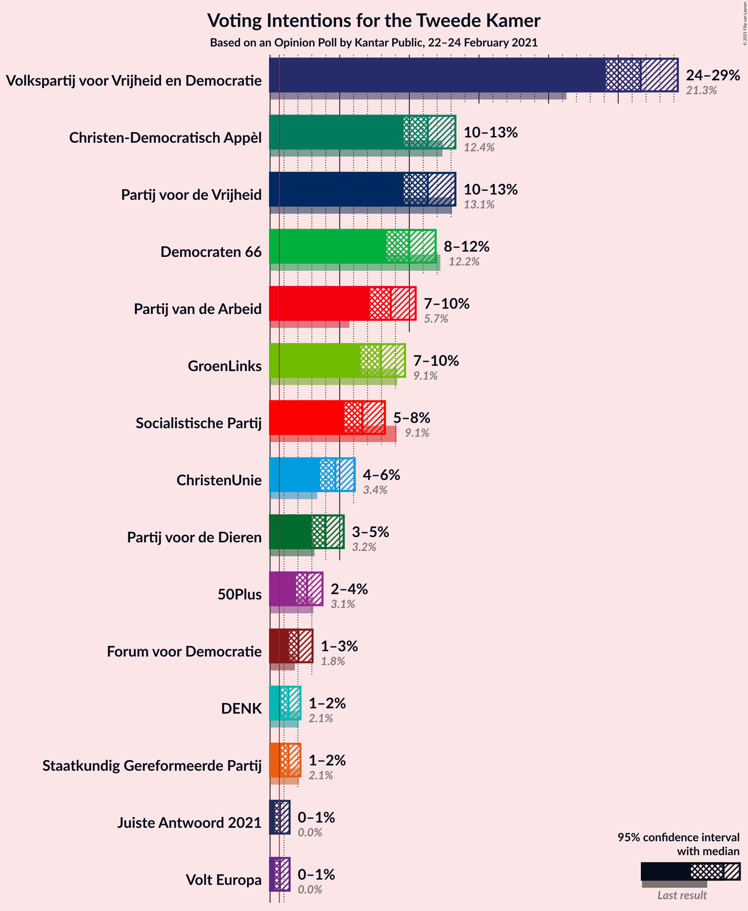

### Confidence Intervals

| Party | Last Result | Poll Result | 80% Confidence Interval | 90% Confidence Interval | 95% Confidence Interval | 99% Confidence Interval |
|:-----:|:-----------:|:-----------:|:-----------------------:|:-----------------------:|:-----------------------:|:-----------------------:|
| Volkspartij voor Vrijheid en Democratie | 21.3% | 26.6% | 25.0–28.3% |24.5–28.9% |24.1–29.3% |23.4–30.1% |
| Partij voor de Vrijheid | 13.1% | 11.3% | 10.2–12.6% |9.9–13.0% |9.6–13.3% |9.1–13.9% |
| Christen-Democratisch Appèl | 12.4% | 11.3% | 10.2–12.6% |9.9–13.0% |9.6–13.3% |9.1–13.9% |
| Democraten 66 | 12.2% | 10.0% | 8.9–11.2% |8.6–11.6% |8.4–11.9% |7.9–12.5% |
| Partij van de Arbeid | 5.7% | 8.7% | 7.7–9.8% |7.4–10.2% |7.2–10.5% |6.7–11.0% |
| GroenLinks | 9.1% | 8.0% | 7.0–9.1% |6.7–9.4% |6.5–9.7% |6.1–10.3% |
| Socialistische Partij | 9.1% | 6.6% | 5.8–7.7% |5.5–8.0% |5.3–8.2% |4.9–8.8% |
| ChristenUnie | 3.4% | 4.7% | 4.0–5.6% |3.8–5.9% |3.6–6.1% |3.3–6.6% |
| Partij voor de Dieren | 3.2% | 4.0% | 3.3–4.8% |3.1–5.1% |3.0–5.3% |2.7–5.7% |
| 50Plus | 3.1% | 2.7% | 2.1–3.4% |2.0–3.6% |1.9–3.8% |1.6–4.1% |
| Forum voor Democratie | 1.8% | 2.0% | 1.6–2.7% |1.5–2.9% |1.4–3.0% |1.2–3.4% |
| Staatkundig Gereformeerde Partij | 2.1% | 1.3% | 1.0–1.9% |0.9–2.0% |0.8–2.2% |0.7–2.5% |
| DENK | 2.1% | 1.3% | 1.0–1.9% |0.9–2.0% |0.8–2.2% |0.7–2.5% |
| Juiste Antwoord 2021 | 0.0% | 0.7% | 0.5–1.2% |0.4–1.3% |0.4–1.4% |0.3–1.6% |
| Volt Europa | 0.0% | 0.7% | 0.5–1.2% |0.4–1.3% |0.4–1.4% |0.3–1.6% |

*Note:* The poll result column reflects the actual value used in the calculations. Published results may vary slightly, and in addition be rounded to fewer digits.

## Seats

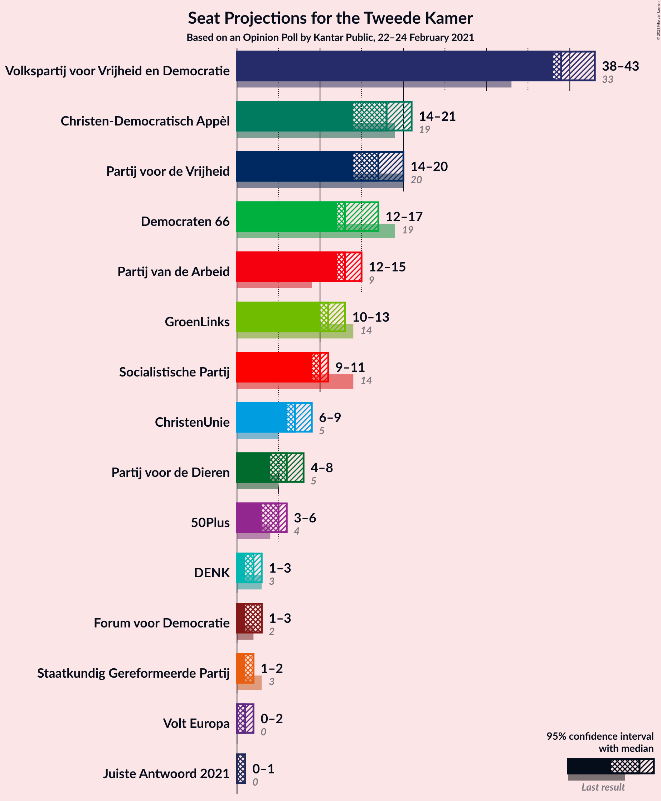

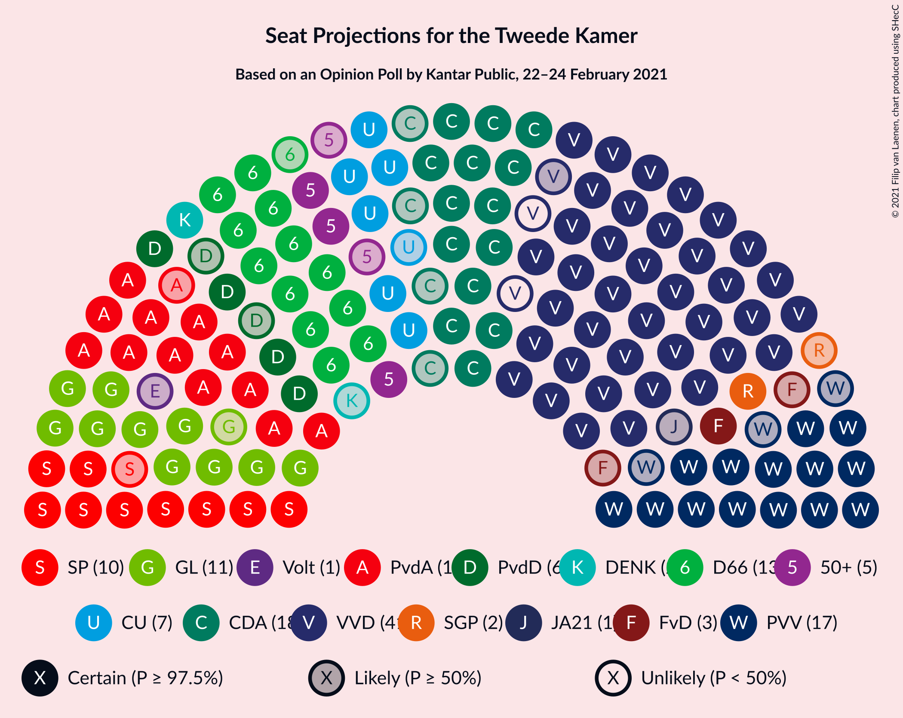

### Confidence Intervals

| Party | Last Result | Median | 80% Confidence Interval | 90% Confidence Interval | 95% Confidence Interval | 99% Confidence Interval |
|:-----:|:-----------:|:------:|:-----------------------:|:-----------------------:|:-----------------------:|:-----------------------:|
| <a href="#volkspartij-voor-vrijheid-en-democratie">Volkspartij voor Vrijheid en Democratie</a> | 33 | 39 | 38–41 |38–43 |38–43 |37–45 |
| <a href="#partij-voor-de-vrijheid">Partij voor de Vrijheid</a> | 20 | 17 | 14–19 |14–20 |14–20 |14–21 |
| <a href="#christen-democratisch-appèl">Christen-Democratisch Appèl</a> | 19 | 18 | 16–21 |14–21 |14–21 |14–21 |
| <a href="#democraten-66">Democraten 66</a> | 19 | 13 | 12–17 |12–17 |12–17 |12–18 |
| <a href="#partij-van-de-arbeid">Partij van de Arbeid</a> | 9 | 13 | 12–14 |12–14 |12–15 |11–16 |
| <a href="#groenlinks">GroenLinks</a> | 14 | 11 | 11–13 |10–13 |10–13 |9–15 |
| <a href="#socialistische-partij">Socialistische Partij</a> | 14 | 10 | 9–11 |9–11 |9–11 |7–13 |
| <a href="#christenunie">ChristenUnie</a> | 5 | 7 | 6–9 |6–9 |6–9 |5–10 |
| <a href="#partij-voor-de-dieren">Partij voor de Dieren</a> | 5 | 6 | 4–8 |4–8 |4–8 |4–9 |
| <a href="#50plus">50Plus</a> | 4 | 5 | 4–6 |4–6 |3–6 |3–6 |
| <a href="#forum-voor-democratie">Forum voor Democratie</a> | 2 | 3 | 2–3 |2–3 |1–3 |1–4 |
| <a href="#staatkundig-gereformeerde-partij">Staatkundig Gereformeerde Partij</a> | 3 | 2 | 1–2 |1–2 |1–2 |1–3 |
| <a href="#denk">DENK</a> | 3 | 2 | 1–3 |1–3 |1–3 |1–4 |
| <a href="#juiste-antwoord-2021">Juiste Antwoord 2021</a> | 0 | 1 | 1 |0–1 |0–1 |0–2 |
| <a href="#volt-europa">Volt Europa</a> | 0 | 1 | 1–2 |1–2 |0–2 |0–2 |

### Volkspartij voor Vrijheid en Democratie

*For a full overview of the results for this party, see the [Volkspartij voor Vrijheid en Democratie](party-volkspartijvoorvrijheidendemocratie.html) page.*

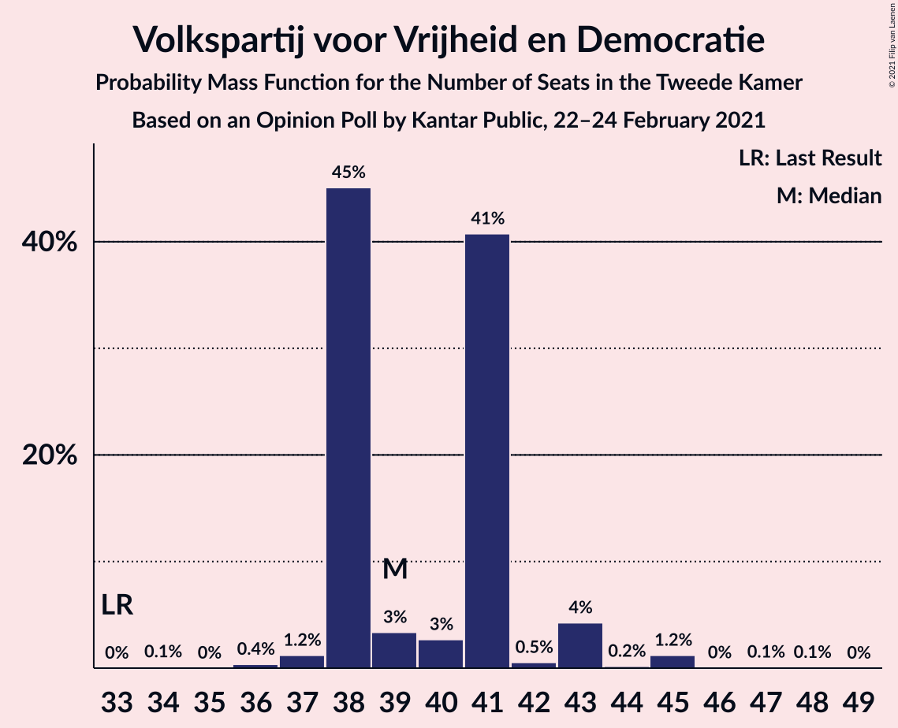

| Number of Seats | Probability | Accumulated | Special Marks |
|:---------------:|:-----------:|:-----------:|:-------------:|
| 33 | 0% | 100% | Last Result |
| 34 | 0.1% | 100% |  |
| 35 | 0% | 99.9% |  |
| 36 | 0.4% | 99.9% |  |
| 37 | 1.2% | 99.5% |  |
| 38 | 45% | 98% |  |
| 39 | 3% | 53% | Median |
| 40 | 3% | 50% |  |
| 41 | 41% | 47% |  |
| 42 | 0.5% | 6% |  |
| 43 | 4% | 6% |  |
| 44 | 0.2% | 2% |  |
| 45 | 1.2% | 1.4% |  |
| 46 | 0% | 0.2% |  |
| 47 | 0.1% | 0.2% |  |
| 48 | 0.1% | 0.1% |  |
| 49 | 0% | 0% |  |

### Partij voor de Vrijheid

*For a full overview of the results for this party, see the [Partij voor de Vrijheid](party-partijvoordevrijheid.html) page.*

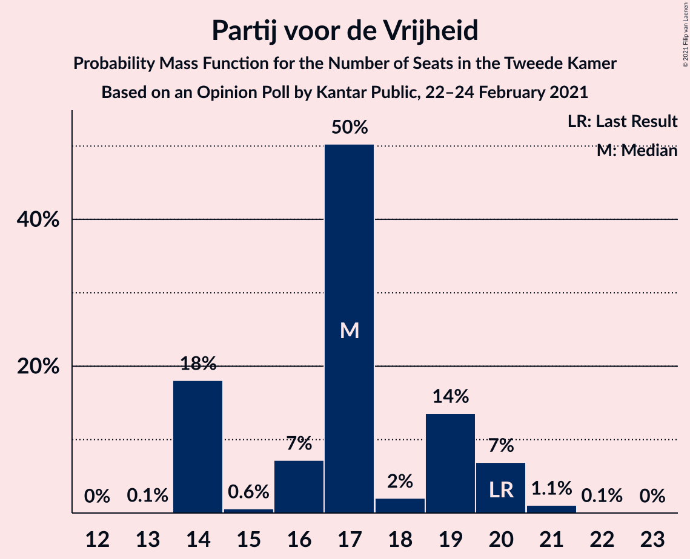

| Number of Seats | Probability | Accumulated | Special Marks |
|:---------------:|:-----------:|:-----------:|:-------------:|
| 13 | 0.1% | 100% |  |
| 14 | 18% | 99.9% |  |
| 15 | 0.6% | 82% |  |
| 16 | 7% | 81% |  |
| 17 | 50% | 74% | Median |
| 18 | 2% | 24% |  |
| 19 | 14% | 22% |  |
| 20 | 7% | 8% | Last Result |
| 21 | 1.1% | 1.2% |  |
| 22 | 0.1% | 0.1% |  |
| 23 | 0% | 0% |  |

### Christen-Democratisch Appèl

*For a full overview of the results for this party, see the [Christen-Democratisch Appèl](party-christen-democratischappèl.html) page.*

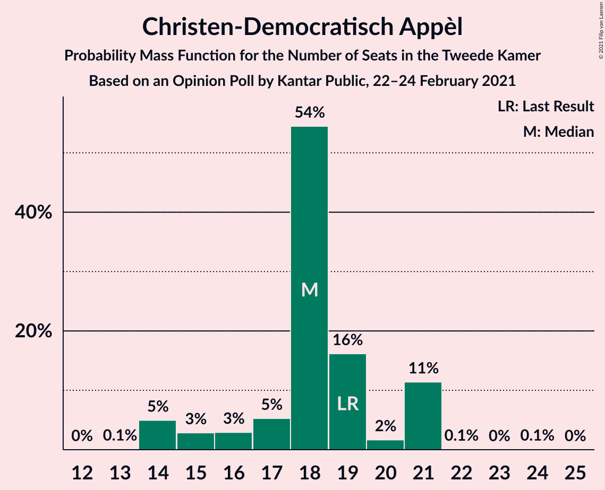

| Number of Seats | Probability | Accumulated | Special Marks |
|:---------------:|:-----------:|:-----------:|:-------------:|
| 13 | 0.1% | 100% |  |
| 14 | 5% | 99.9% |  |
| 15 | 3% | 95% |  |
| 16 | 3% | 92% |  |
| 17 | 5% | 89% |  |
| 18 | 54% | 84% | Median |
| 19 | 16% | 29% | Last Result |
| 20 | 2% | 13% |  |
| 21 | 11% | 12% |  |
| 22 | 0.1% | 0.2% |  |
| 23 | 0% | 0.1% |  |
| 24 | 0.1% | 0.1% |  |
| 25 | 0% | 0% |  |

### Democraten 66

*For a full overview of the results for this party, see the [Democraten 66](party-democraten66.html) page.*

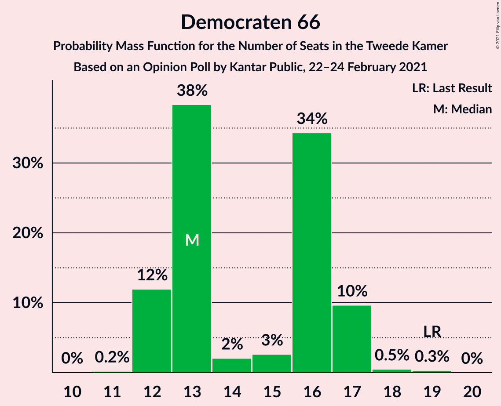

| Number of Seats | Probability | Accumulated | Special Marks |
|:---------------:|:-----------:|:-----------:|:-------------:|
| 11 | 0.2% | 100% |  |
| 12 | 12% | 99.8% |  |
| 13 | 38% | 88% | Median |
| 14 | 2% | 49% |  |
| 15 | 3% | 47% |  |
| 16 | 34% | 45% |  |
| 17 | 10% | 10% |  |
| 18 | 0.5% | 0.8% |  |
| 19 | 0.3% | 0.3% | Last Result |
| 20 | 0% | 0% |  |

### Partij van de Arbeid

*For a full overview of the results for this party, see the [Partij van de Arbeid](party-partijvandearbeid.html) page.*

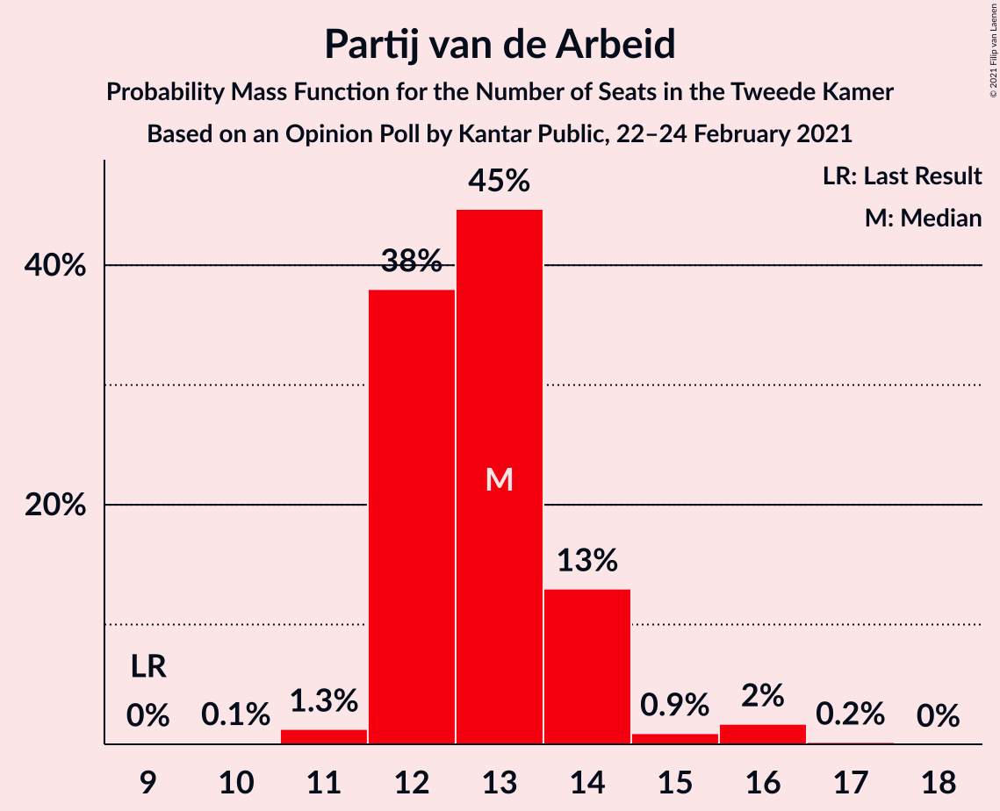

| Number of Seats | Probability | Accumulated | Special Marks |
|:---------------:|:-----------:|:-----------:|:-------------:|
| 9 | 0% | 100% | Last Result |
| 10 | 0.1% | 100% |  |
| 11 | 1.3% | 99.8% |  |
| 12 | 38% | 98.5% |  |
| 13 | 45% | 61% | Median |
| 14 | 13% | 16% |  |
| 15 | 0.9% | 3% |  |
| 16 | 2% | 2% |  |
| 17 | 0.2% | 0.2% |  |
| 18 | 0% | 0% |  |

### GroenLinks

*For a full overview of the results for this party, see the [GroenLinks](party-groenlinks.html) page.*

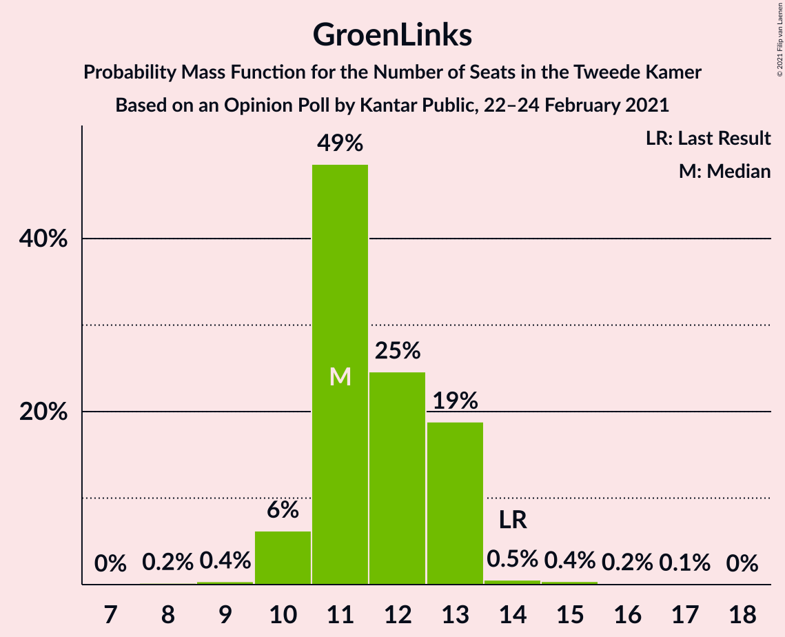

| Number of Seats | Probability | Accumulated | Special Marks |
|:---------------:|:-----------:|:-----------:|:-------------:|
| 8 | 0.2% | 100% |  |
| 9 | 0.4% | 99.8% |  |
| 10 | 6% | 99.5% |  |
| 11 | 49% | 93% | Median |
| 12 | 25% | 45% |  |
| 13 | 19% | 20% |  |
| 14 | 0.5% | 1.2% | Last Result |
| 15 | 0.4% | 0.6% |  |
| 16 | 0.2% | 0.3% |  |
| 17 | 0.1% | 0.1% |  |
| 18 | 0% | 0% |  |

### Socialistische Partij

*For a full overview of the results for this party, see the [Socialistische Partij](party-socialistischepartij.html) page.*

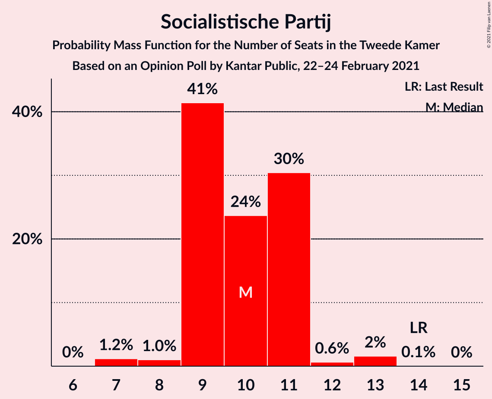

| Number of Seats | Probability | Accumulated | Special Marks |
|:---------------:|:-----------:|:-----------:|:-------------:|
| 7 | 1.2% | 100% |  |
| 8 | 1.0% | 98.8% |  |
| 9 | 41% | 98% |  |
| 10 | 24% | 56% | Median |
| 11 | 30% | 33% |  |
| 12 | 0.6% | 2% |  |
| 13 | 2% | 2% |  |
| 14 | 0.1% | 0.1% | Last Result |
| 15 | 0% | 0% |  |

### ChristenUnie

*For a full overview of the results for this party, see the [ChristenUnie](party-christenunie.html) page.*

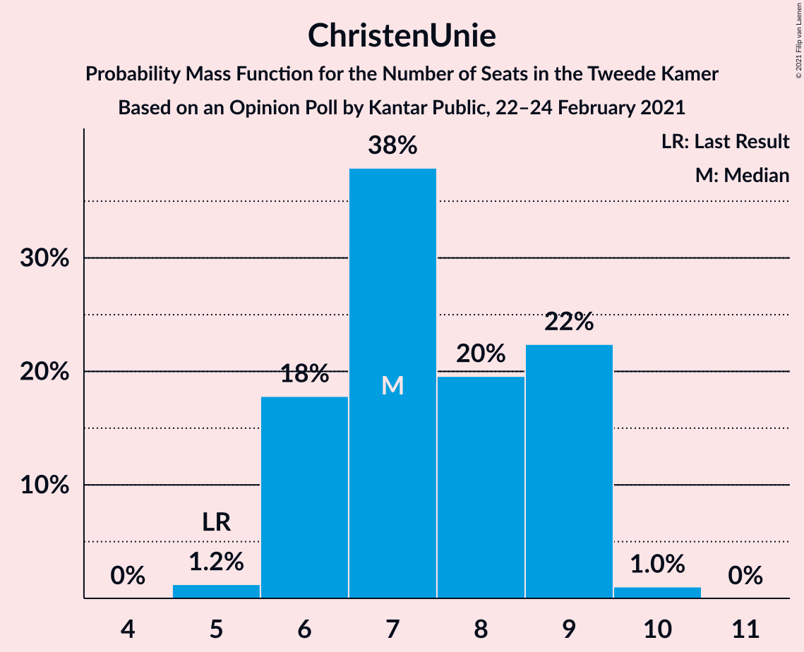

| Number of Seats | Probability | Accumulated | Special Marks |
|:---------------:|:-----------:|:-----------:|:-------------:|
| 5 | 1.2% | 100% | Last Result |
| 6 | 18% | 98.8% |  |
| 7 | 38% | 81% | Median |
| 8 | 20% | 43% |  |
| 9 | 22% | 23% |  |
| 10 | 1.0% | 1.0% |  |
| 11 | 0% | 0% |  |

### Partij voor de Dieren

*For a full overview of the results for this party, see the [Partij voor de Dieren](party-partijvoordedieren.html) page.*

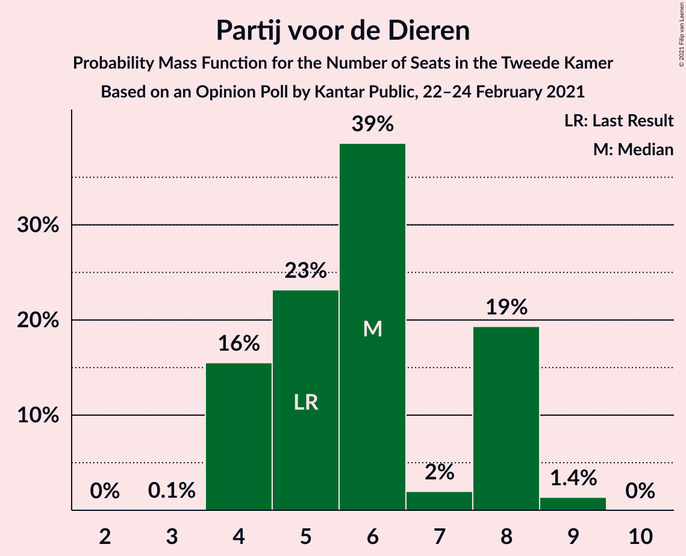

| Number of Seats | Probability | Accumulated | Special Marks |
|:---------------:|:-----------:|:-----------:|:-------------:|
| 3 | 0.1% | 100% |  |
| 4 | 16% | 99.9% |  |
| 5 | 23% | 84% | Last Result |
| 6 | 39% | 61% | Median |
| 7 | 2% | 23% |  |
| 8 | 19% | 21% |  |
| 9 | 1.4% | 1.4% |  |
| 10 | 0% | 0% |  |

### 50Plus

*For a full overview of the results for this party, see the [50Plus](party-50plus.html) page.*

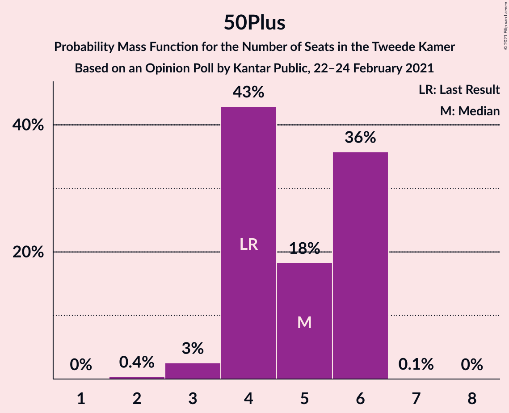

| Number of Seats | Probability | Accumulated | Special Marks |
|:---------------:|:-----------:|:-----------:|:-------------:|
| 2 | 0.4% | 100% |  |
| 3 | 3% | 99.6% |  |
| 4 | 43% | 97% | Last Result |
| 5 | 18% | 54% | Median |
| 6 | 36% | 36% |  |
| 7 | 0.1% | 0.1% |  |
| 8 | 0% | 0% |  |

### Forum voor Democratie

*For a full overview of the results for this party, see the [Forum voor Democratie](party-forumvoordemocratie.html) page.*

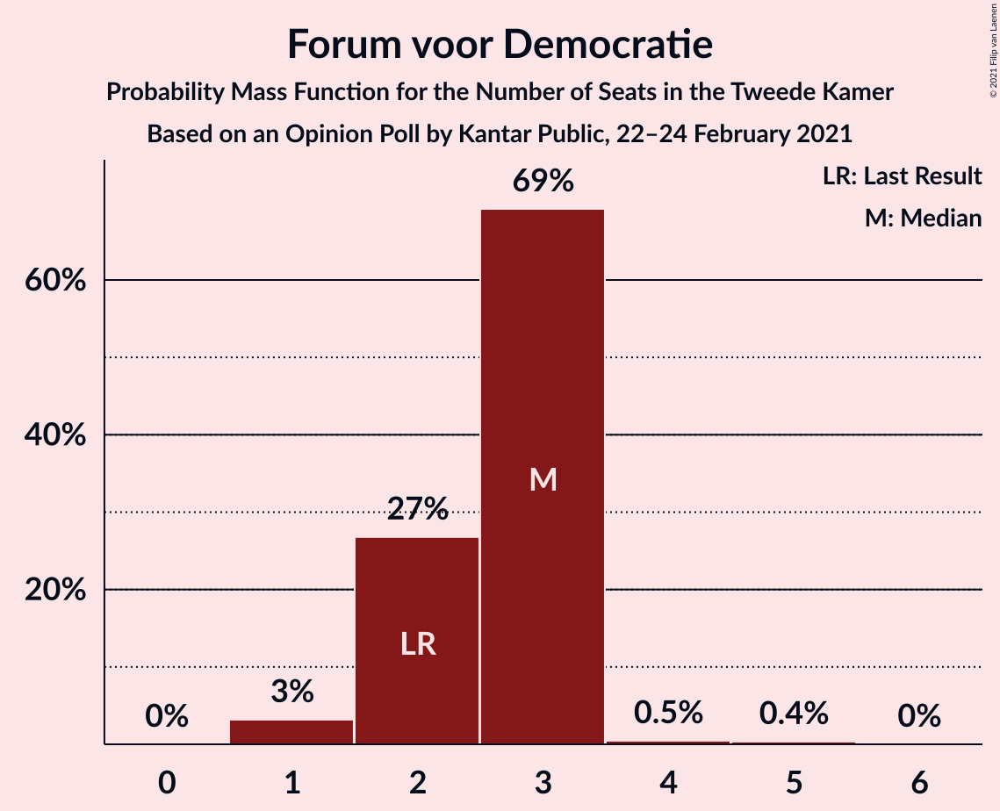

| Number of Seats | Probability | Accumulated | Special Marks |
|:---------------:|:-----------:|:-----------:|:-------------:|
| 1 | 3% | 100% |  |
| 2 | 27% | 97% | Last Result |
| 3 | 69% | 70% | Median |
| 4 | 0.5% | 0.8% |  |
| 5 | 0.4% | 0.4% |  |
| 6 | 0% | 0% |  |

### Staatkundig Gereformeerde Partij

*For a full overview of the results for this party, see the [Staatkundig Gereformeerde Partij](party-staatkundiggereformeerdepartij.html) page.*

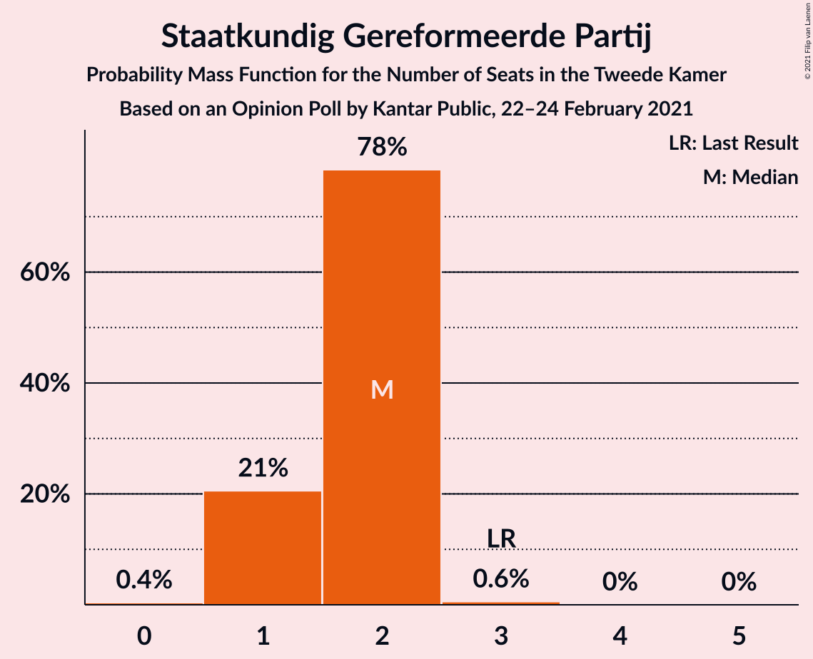

| Number of Seats | Probability | Accumulated | Special Marks |
|:---------------:|:-----------:|:-----------:|:-------------:|
| 0 | 0.4% | 100% |  |
| 1 | 21% | 99.6% |  |
| 2 | 78% | 79% | Median |
| 3 | 0.6% | 0.6% | Last Result |
| 4 | 0% | 0% |  |

### DENK

*For a full overview of the results for this party, see the [DENK](party-denk.html) page.*

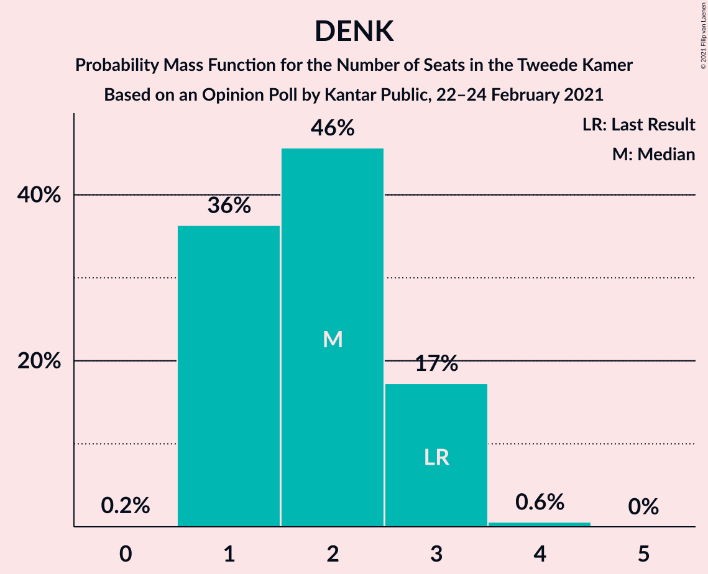

| Number of Seats | Probability | Accumulated | Special Marks |
|:---------------:|:-----------:|:-----------:|:-------------:|
| 0 | 0.2% | 100% |  |
| 1 | 36% | 99.8% |  |
| 2 | 46% | 64% | Median |
| 3 | 17% | 18% | Last Result |
| 4 | 0.6% | 0.6% |  |
| 5 | 0% | 0% |  |

### Juiste Antwoord 2021

*For a full overview of the results for this party, see the [Juiste Antwoord 2021](party-juisteantwoord2021.html) page.*

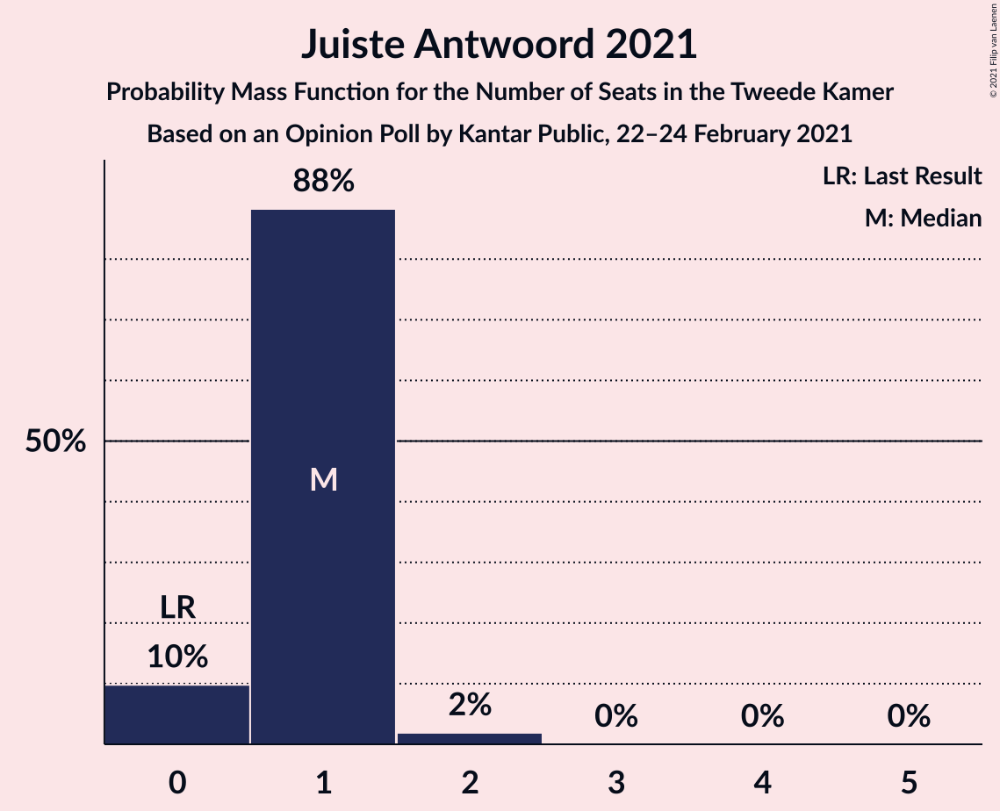

| Number of Seats | Probability | Accumulated | Special Marks |
|:---------------:|:-----------:|:-----------:|:-------------:|
| 0 | 10% | 100% | Last Result |
| 1 | 88% | 90% | Median |
| 2 | 2% | 2% |  |
| 3 | 0% | 0% |  |

### Volt Europa

*For a full overview of the results for this party, see the [Volt Europa](party-volteuropa.html) page.*

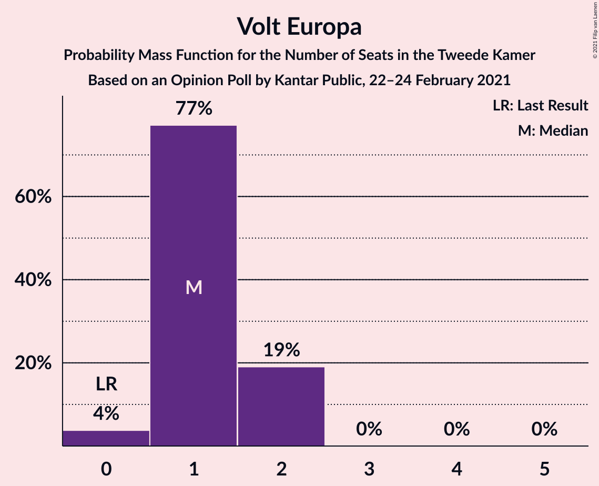

| Number of Seats | Probability | Accumulated | Special Marks |
|:---------------:|:-----------:|:-----------:|:-------------:|
| 0 | 4% | 100% | Last Result |
| 1 | 77% | 96% | Median |
| 2 | 19% | 19% |  |
| 3 | 0% | 0% |  |

## Coalitions

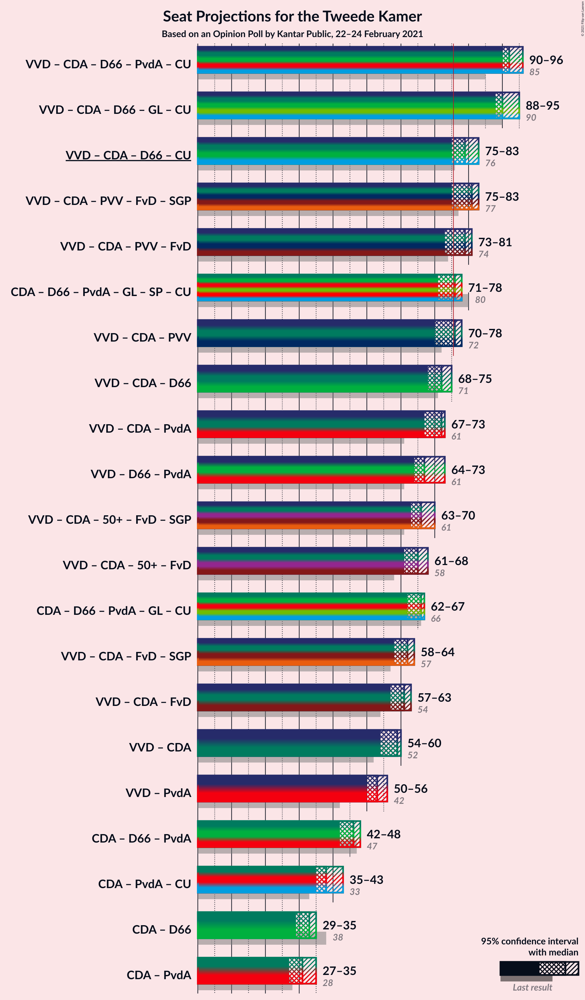

### Confidence Intervals

| Coalition | Last Result | Median | Majority? | 80% Confidence Interval | 90% Confidence Interval | 95% Confidence Interval | 99% Confidence Interval |
|:---------:|:-----------:|:------:|:---------:|:-----------------------:|:-----------------------:|:-----------------------:|:-----------------------:|
| Volkspartij voor Vrijheid en Democratie – Christen-Democratisch Appèl – Democraten 66 – Partij van de Arbeid – ChristenUnie | 85 | 92 | 100% | 91–95 | 91–96 | 90–96 | 87–97 |
| Volkspartij voor Vrijheid en Democratie – Christen-Democratisch Appèl – Democraten 66 – GroenLinks – ChristenUnie | 90 | 90 | 100% | 90–93 | 90–95 | 88–95 | 87–95 |
| Volkspartij voor Vrijheid en Democratie – Christen-Democratisch Appèl – Democraten 66 – ChristenUnie | 76 | 79 | 97% | 79–82 | 78–83 | 75–83 | 74–83 |
| Volkspartij voor Vrijheid en Democratie – Christen-Democratisch Appèl – Partij voor de Vrijheid – Forum voor Democratie – Staatkundig Gereformeerde Partij | 77 | 81 | 82% | 75–83 | 75–83 | 75–83 | 75–84 |
| Volkspartij voor Vrijheid en Democratie – Christen-Democratisch Appèl – Partij voor de Vrijheid – Forum voor Democratie | 74 | 79 | 78% | 73–81 | 73–81 | 73–81 | 73–83 |
| Christen-Democratisch Appèl – Democraten 66 – Partij van de Arbeid – GroenLinks – Socialistische Partij – ChristenUnie | 80 | 76 | 52% | 71–78 | 71–78 | 71–78 | 69–79 |
| Volkspartij voor Vrijheid en Democratie – Christen-Democratisch Appèl – Partij voor de Vrijheid | 72 | 76 | 56% | 70–78 | 70–78 | 70–78 | 70–80 |
| Volkspartij voor Vrijheid en Democratie – Christen-Democratisch Appèl – Democraten 66 | 71 | 72 | 1.5% | 71–74 | 71–75 | 68–75 | 67–77 |
| Volkspartij voor Vrijheid en Democratie – Christen-Democratisch Appèl – Partij van de Arbeid | 61 | 72 | 0.7% | 68–73 | 68–73 | 67–73 | 65–76 |
| Volkspartij voor Vrijheid en Democratie – Democraten 66 – Partij van de Arbeid | 61 | 67 | 0.1% | 64–70 | 64–71 | 64–73 | 64–73 |
| Volkspartij voor Vrijheid en Democratie – Christen-Democratisch Appèl – 50Plus – Forum voor Democratie – Staatkundig Gereformeerde Partij | 61 | 66 | 0.1% | 65–70 | 63–70 | 63–70 | 61–71 |
| Volkspartij voor Vrijheid en Democratie – Christen-Democratisch Appèl – 50Plus – Forum voor Democratie | 58 | 65 | 0% | 63–68 | 62–68 | 61–68 | 59–69 |
| Christen-Democratisch Appèl – Democraten 66 – Partij van de Arbeid – GroenLinks – ChristenUnie | 66 | 66 | 0% | 62–67 | 62–67 | 62–67 | 58–69 |
| Volkspartij voor Vrijheid en Democratie – Christen-Democratisch Appèl – Forum voor Democratie – Staatkundig Gereformeerde Partij | 57 | 62 | 0% | 60–64 | 59–64 | 58–64 | 57–66 |
| Volkspartij voor Vrijheid en Democratie – Christen-Democratisch Appèl – Forum voor Democratie | 54 | 61 | 0% | 59–62 | 58–62 | 57–63 | 55–64 |
| Volkspartij voor Vrijheid en Democratie – Christen-Democratisch Appèl | 52 | 59 | 0% | 56–59 | 55–59 | 54–60 | 54–62 |
| Volkspartij voor Vrijheid en Democratie – Partij van de Arbeid | 42 | 53 | 0% | 50–54 | 50–56 | 50–56 | 49–58 |
| Christen-Democratisch Appèl – Democraten 66 – Partij van de Arbeid | 47 | 46 | 0% | 44–47 | 44–47 | 42–48 | 41–51 |
| Christen-Democratisch Appèl – Partij van de Arbeid – ChristenUnie | 33 | 38 | 0% | 37–43 | 36–43 | 35–43 | 34–43 |
| Christen-Democratisch Appèl – Democraten 66 | 38 | 33 | 0% | 31–35 | 30–35 | 29–35 | 28–36 |
| Christen-Democratisch Appèl – Partij van de Arbeid | 28 | 31 | 0% | 29–35 | 27–35 | 27–35 | 25–35 |

### Volkspartij voor Vrijheid en Democratie – Christen-Democratisch Appèl – Democraten 66 – Partij van de Arbeid – ChristenUnie

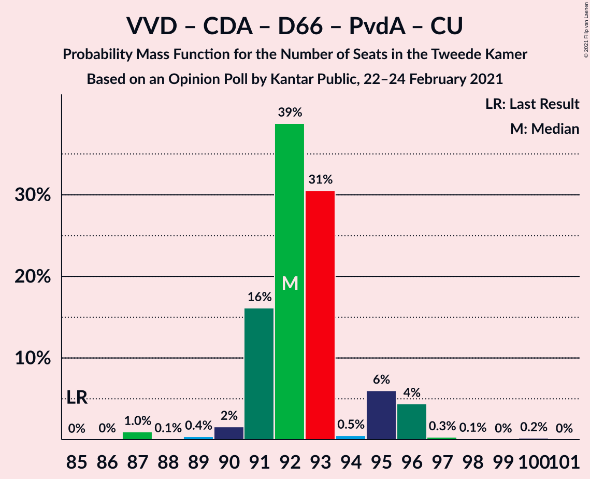

| Number of Seats | Probability | Accumulated | Special Marks |
|:---------------:|:-----------:|:-----------:|:-------------:|
| 85 | 0% | 100% | Last Result |
| 86 | 0% | 100% |  |
| 87 | 1.0% | 100% |  |
| 88 | 0.1% | 99.0% |  |
| 89 | 0.4% | 98.9% |  |
| 90 | 2% | 98.5% | Median |
| 91 | 16% | 97% |  |
| 92 | 39% | 81% |  |
| 93 | 31% | 42% |  |
| 94 | 0.5% | 12% |  |
| 95 | 6% | 11% |  |
| 96 | 4% | 5% |  |
| 97 | 0.3% | 0.7% |  |
| 98 | 0.1% | 0.4% |  |
| 99 | 0% | 0.2% |  |
| 100 | 0.2% | 0.2% |  |
| 101 | 0% | 0% |  |

### Volkspartij voor Vrijheid en Democratie – Christen-Democratisch Appèl – Democraten 66 – GroenLinks – ChristenUnie

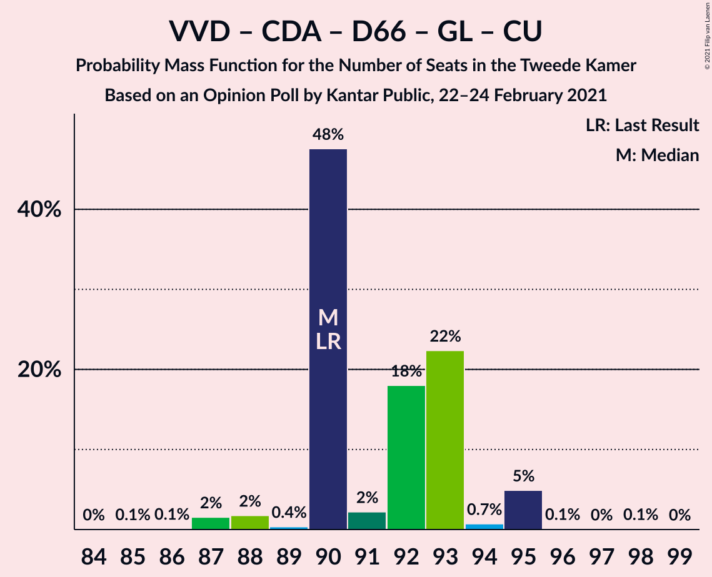

| Number of Seats | Probability | Accumulated | Special Marks |
|:---------------:|:-----------:|:-----------:|:-------------:|
| 85 | 0.1% | 100% |  |
| 86 | 0.1% | 99.9% |  |
| 87 | 2% | 99.8% |  |
| 88 | 2% | 98% | Median |
| 89 | 0.4% | 96% |  |
| 90 | 48% | 96% | Last Result |
| 91 | 2% | 49% |  |
| 92 | 18% | 46% |  |
| 93 | 22% | 28% |  |
| 94 | 0.7% | 6% |  |
| 95 | 5% | 5% |  |
| 96 | 0.1% | 0.3% |  |
| 97 | 0% | 0.2% |  |
| 98 | 0.1% | 0.1% |  |
| 99 | 0% | 0% |  |

### Volkspartij voor Vrijheid en Democratie – Christen-Democratisch Appèl – Democraten 66 – ChristenUnie

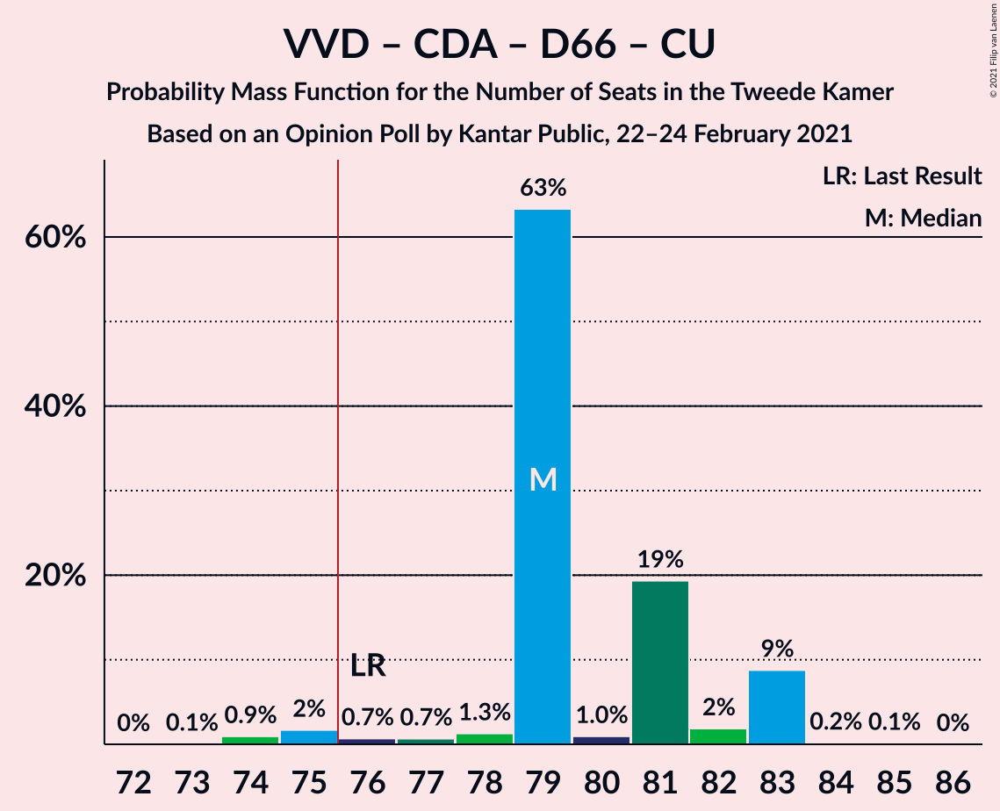

| Number of Seats | Probability | Accumulated | Special Marks |
|:---------------:|:-----------:|:-----------:|:-------------:|
| 73 | 0.1% | 100% |  |
| 74 | 0.9% | 99.9% |  |
| 75 | 2% | 99.0% |  |
| 76 | 0.7% | 97% | Last Result, Majority |
| 77 | 0.7% | 97% | Median |
| 78 | 1.3% | 96% |  |
| 79 | 63% | 95% |  |
| 80 | 1.0% | 31% |  |
| 81 | 19% | 30% |  |
| 82 | 2% | 11% |  |
| 83 | 9% | 9% |  |
| 84 | 0.2% | 0.4% |  |
| 85 | 0.1% | 0.2% |  |
| 86 | 0% | 0% |  |

### Volkspartij voor Vrijheid en Democratie – Christen-Democratisch Appèl – Partij voor de Vrijheid – Forum voor Democratie – Staatkundig Gereformeerde Partij

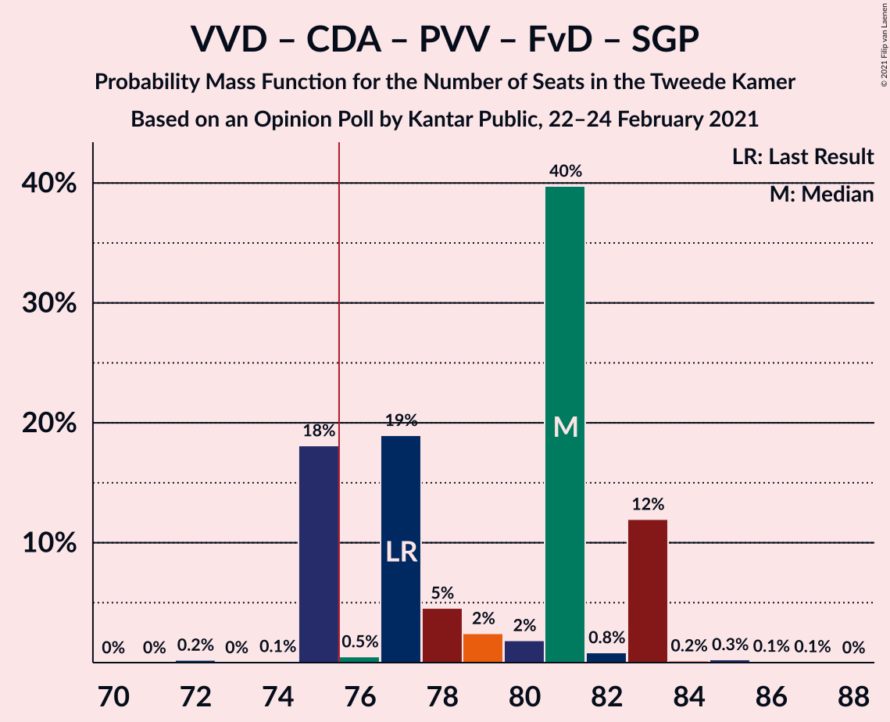

| Number of Seats | Probability | Accumulated | Special Marks |
|:---------------:|:-----------:|:-----------:|:-------------:|
| 72 | 0.2% | 100% |  |
| 73 | 0% | 99.8% |  |
| 74 | 0.1% | 99.8% |  |
| 75 | 18% | 99.6% |  |
| 76 | 0.5% | 82% | Majority |
| 77 | 19% | 81% | Last Result |
| 78 | 5% | 62% |  |
| 79 | 2% | 58% | Median |
| 80 | 2% | 55% |  |
| 81 | 40% | 53% |  |
| 82 | 0.8% | 13% |  |
| 83 | 12% | 13% |  |
| 84 | 0.2% | 0.7% |  |
| 85 | 0.3% | 0.5% |  |
| 86 | 0.1% | 0.2% |  |
| 87 | 0.1% | 0.1% |  |
| 88 | 0% | 0% |  |

### Volkspartij voor Vrijheid en Democratie – Christen-Democratisch Appèl – Partij voor de Vrijheid – Forum voor Democratie

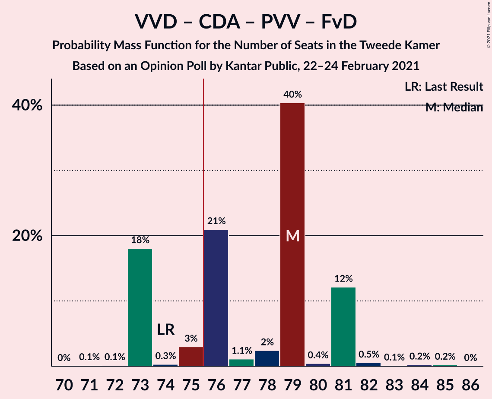

| Number of Seats | Probability | Accumulated | Special Marks |
|:---------------:|:-----------:|:-----------:|:-------------:|
| 71 | 0.1% | 100% |  |
| 72 | 0.1% | 99.9% |  |
| 73 | 18% | 99.7% |  |
| 74 | 0.3% | 82% | Last Result |
| 75 | 3% | 81% |  |
| 76 | 21% | 78% | Majority |
| 77 | 1.1% | 57% | Median |
| 78 | 2% | 56% |  |
| 79 | 40% | 54% |  |
| 80 | 0.4% | 14% |  |
| 81 | 12% | 13% |  |
| 82 | 0.5% | 1.0% |  |
| 83 | 0.1% | 0.5% |  |
| 84 | 0.2% | 0.4% |  |
| 85 | 0.2% | 0.2% |  |
| 86 | 0% | 0% |  |

### Christen-Democratisch Appèl – Democraten 66 – Partij van de Arbeid – GroenLinks – Socialistische Partij – ChristenUnie

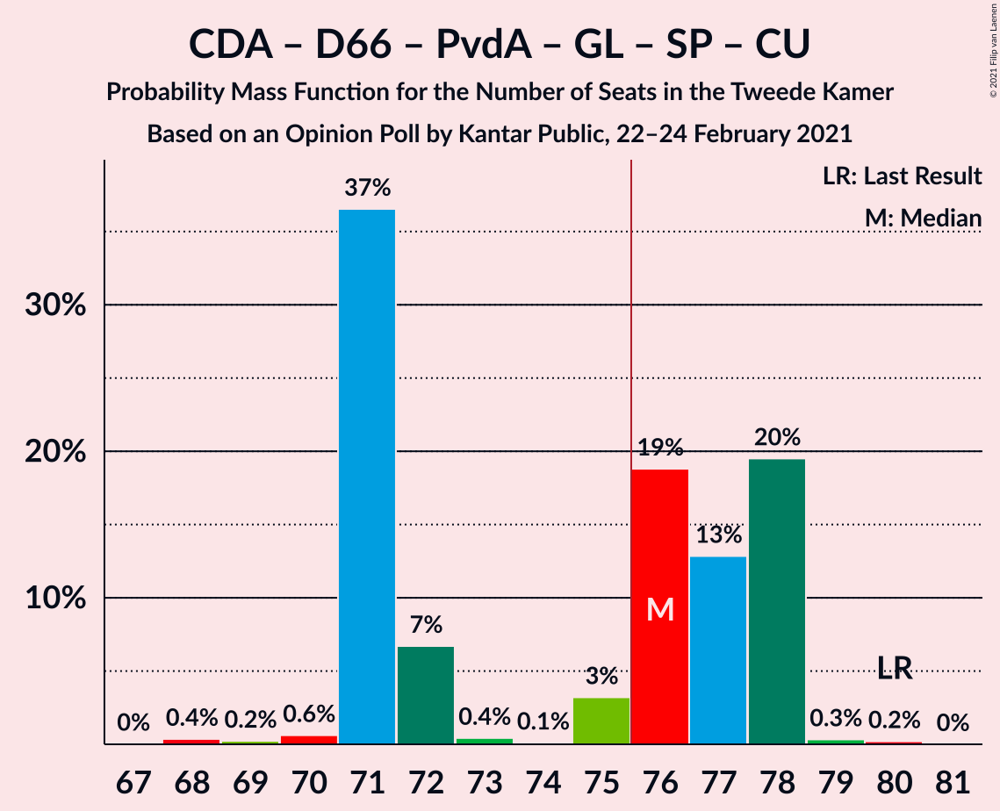

| Number of Seats | Probability | Accumulated | Special Marks |
|:---------------:|:-----------:|:-----------:|:-------------:|
| 68 | 0.4% | 100% |  |
| 69 | 0.2% | 99.6% |  |
| 70 | 0.6% | 99.4% |  |
| 71 | 37% | 98.7% |  |
| 72 | 7% | 62% | Median |
| 73 | 0.4% | 55% |  |
| 74 | 0.1% | 55% |  |
| 75 | 3% | 55% |  |
| 76 | 19% | 52% | Majority |
| 77 | 13% | 33% |  |
| 78 | 20% | 20% |  |
| 79 | 0.3% | 0.6% |  |
| 80 | 0.2% | 0.2% | Last Result |
| 81 | 0% | 0% |  |

### Volkspartij voor Vrijheid en Democratie – Christen-Democratisch Appèl – Partij voor de Vrijheid

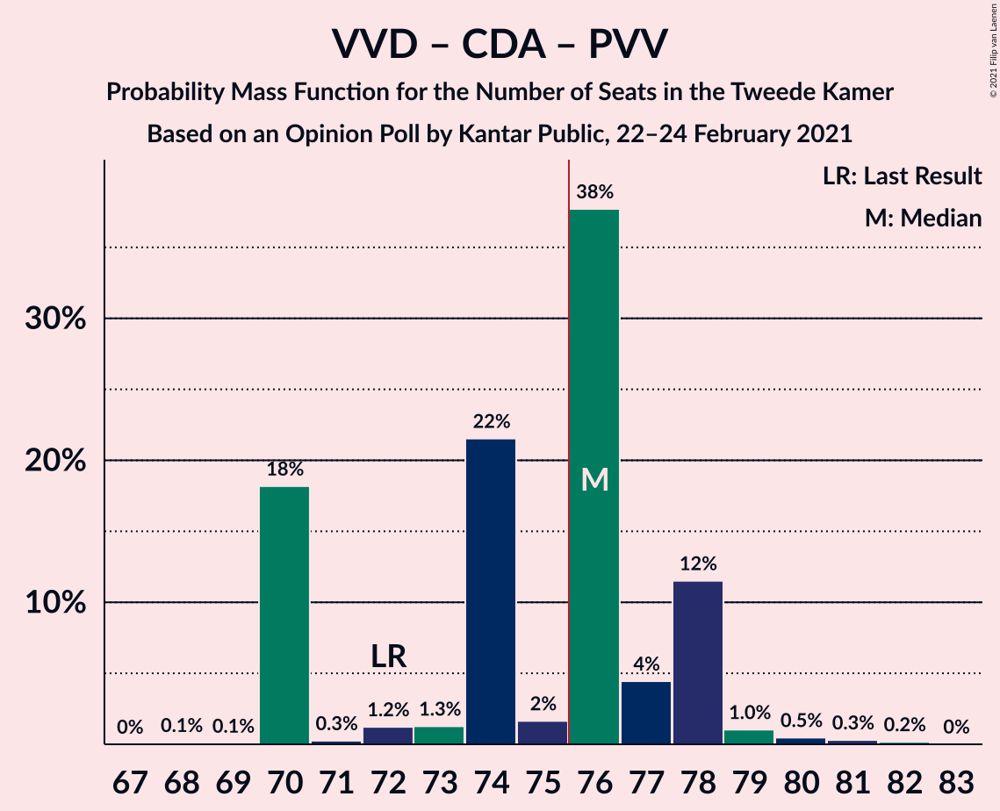

| Number of Seats | Probability | Accumulated | Special Marks |
|:---------------:|:-----------:|:-----------:|:-------------:|
| 68 | 0.1% | 100% |  |
| 69 | 0.1% | 99.9% |  |
| 70 | 18% | 99.8% |  |
| 71 | 0.3% | 82% |  |
| 72 | 1.2% | 81% | Last Result |
| 73 | 1.3% | 80% |  |
| 74 | 22% | 79% | Median |
| 75 | 2% | 57% |  |
| 76 | 38% | 56% | Majority |
| 77 | 4% | 18% |  |
| 78 | 12% | 14% |  |
| 79 | 1.0% | 2% |  |
| 80 | 0.5% | 1.0% |  |
| 81 | 0.3% | 0.5% |  |
| 82 | 0.2% | 0.2% |  |
| 83 | 0% | 0% |  |

### Volkspartij voor Vrijheid en Democratie – Christen-Democratisch Appèl – Democraten 66

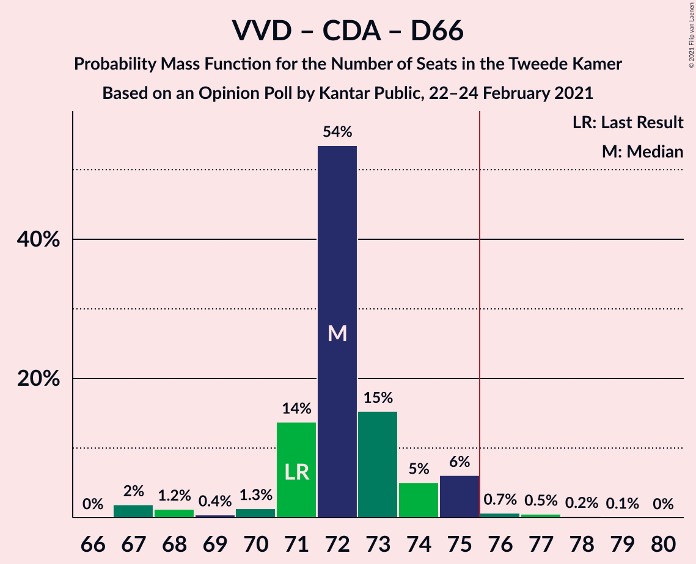

| Number of Seats | Probability | Accumulated | Special Marks |
|:---------------:|:-----------:|:-----------:|:-------------:|
| 67 | 2% | 100% |  |
| 68 | 1.2% | 98% |  |
| 69 | 0.4% | 97% |  |
| 70 | 1.3% | 96% | Median |
| 71 | 14% | 95% | Last Result |
| 72 | 54% | 81% |  |
| 73 | 15% | 28% |  |
| 74 | 5% | 13% |  |
| 75 | 6% | 8% |  |
| 76 | 0.7% | 1.5% | Majority |
| 77 | 0.5% | 0.8% |  |
| 78 | 0.2% | 0.3% |  |
| 79 | 0.1% | 0.1% |  |
| 80 | 0% | 0% |  |

### Volkspartij voor Vrijheid en Democratie – Christen-Democratisch Appèl – Partij van de Arbeid

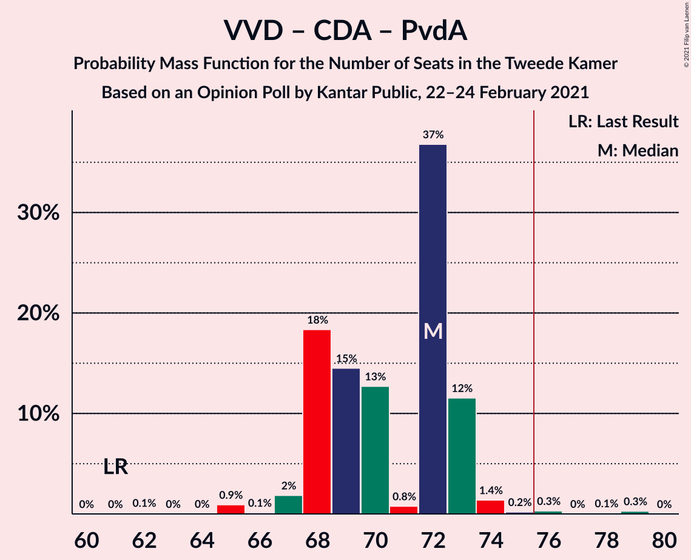

| Number of Seats | Probability | Accumulated | Special Marks |
|:---------------:|:-----------:|:-----------:|:-------------:|
| 61 | 0% | 100% | Last Result |
| 62 | 0.1% | 100% |  |
| 63 | 0% | 99.9% |  |
| 64 | 0% | 99.9% |  |
| 65 | 0.9% | 99.8% |  |
| 66 | 0.1% | 98.9% |  |
| 67 | 2% | 98.8% |  |
| 68 | 18% | 97% |  |
| 69 | 15% | 79% |  |
| 70 | 13% | 64% | Median |
| 71 | 0.8% | 51% |  |
| 72 | 37% | 51% |  |
| 73 | 12% | 14% |  |
| 74 | 1.4% | 2% |  |
| 75 | 0.2% | 0.9% |  |
| 76 | 0.3% | 0.7% | Majority |
| 77 | 0% | 0.4% |  |
| 78 | 0.1% | 0.4% |  |
| 79 | 0.3% | 0.3% |  |
| 80 | 0% | 0% |  |

### Volkspartij voor Vrijheid en Democratie – Democraten 66 – Partij van de Arbeid

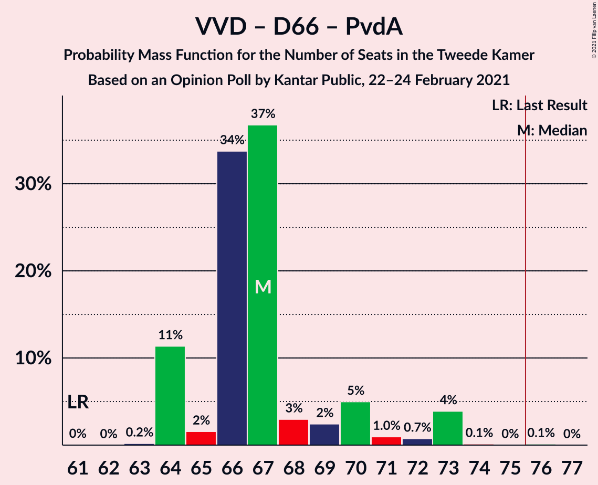

| Number of Seats | Probability | Accumulated | Special Marks |
|:---------------:|:-----------:|:-----------:|:-------------:|
| 61 | 0% | 100% | Last Result |
| 62 | 0% | 99.9% |  |
| 63 | 0.2% | 99.9% |  |
| 64 | 11% | 99.7% |  |
| 65 | 2% | 88% | Median |
| 66 | 34% | 87% |  |
| 67 | 37% | 53% |  |
| 68 | 3% | 16% |  |
| 69 | 2% | 13% |  |
| 70 | 5% | 11% |  |
| 71 | 1.0% | 6% |  |
| 72 | 0.7% | 5% |  |
| 73 | 4% | 4% |  |
| 74 | 0.1% | 0.3% |  |
| 75 | 0% | 0.2% |  |
| 76 | 0.1% | 0.1% | Majority |
| 77 | 0% | 0% |  |

### Volkspartij voor Vrijheid en Democratie – Christen-Democratisch Appèl – 50Plus – Forum voor Democratie – Staatkundig Gereformeerde Partij

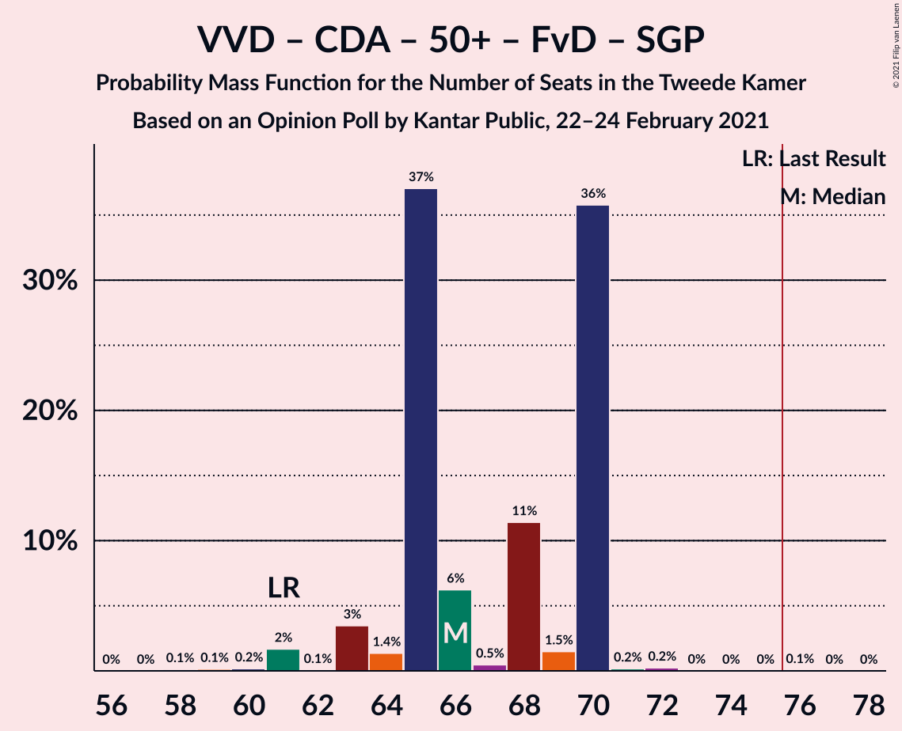

| Number of Seats | Probability | Accumulated | Special Marks |
|:---------------:|:-----------:|:-----------:|:-------------:|
| 58 | 0.1% | 100% |  |
| 59 | 0.1% | 99.9% |  |
| 60 | 0.2% | 99.7% |  |
| 61 | 2% | 99.6% | Last Result |
| 62 | 0.1% | 98% |  |
| 63 | 3% | 98% |  |
| 64 | 1.4% | 94% |  |
| 65 | 37% | 93% |  |
| 66 | 6% | 56% |  |
| 67 | 0.5% | 50% | Median |
| 68 | 11% | 49% |  |
| 69 | 1.5% | 38% |  |
| 70 | 36% | 36% |  |
| 71 | 0.2% | 0.5% |  |
| 72 | 0.2% | 0.3% |  |
| 73 | 0% | 0.1% |  |
| 74 | 0% | 0.1% |  |
| 75 | 0% | 0.1% |  |
| 76 | 0.1% | 0.1% | Majority |
| 77 | 0% | 0% |  |

### Volkspartij voor Vrijheid en Democratie – Christen-Democratisch Appèl – 50Plus – Forum voor Democratie

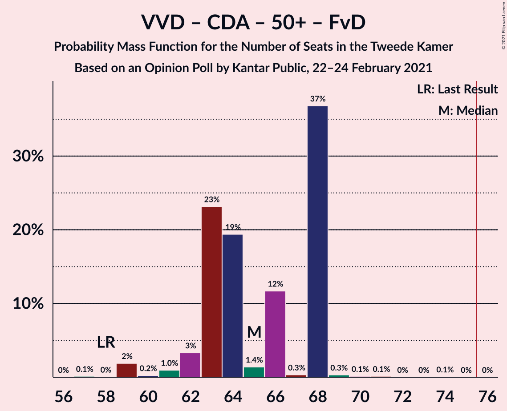

| Number of Seats | Probability | Accumulated | Special Marks |
|:---------------:|:-----------:|:-----------:|:-------------:|
| 57 | 0.1% | 100% |  |
| 58 | 0% | 99.9% | Last Result |
| 59 | 2% | 99.8% |  |
| 60 | 0.2% | 98% |  |
| 61 | 1.0% | 98% |  |
| 62 | 3% | 97% |  |
| 63 | 23% | 93% |  |
| 64 | 19% | 70% |  |
| 65 | 1.4% | 51% | Median |
| 66 | 12% | 49% |  |
| 67 | 0.3% | 38% |  |
| 68 | 37% | 37% |  |
| 69 | 0.3% | 0.7% |  |
| 70 | 0.1% | 0.3% |  |
| 71 | 0.1% | 0.2% |  |
| 72 | 0% | 0.1% |  |
| 73 | 0% | 0.1% |  |
| 74 | 0.1% | 0.1% |  |
| 75 | 0% | 0% |  |

### Christen-Democratisch Appèl – Democraten 66 – Partij van de Arbeid – GroenLinks – ChristenUnie

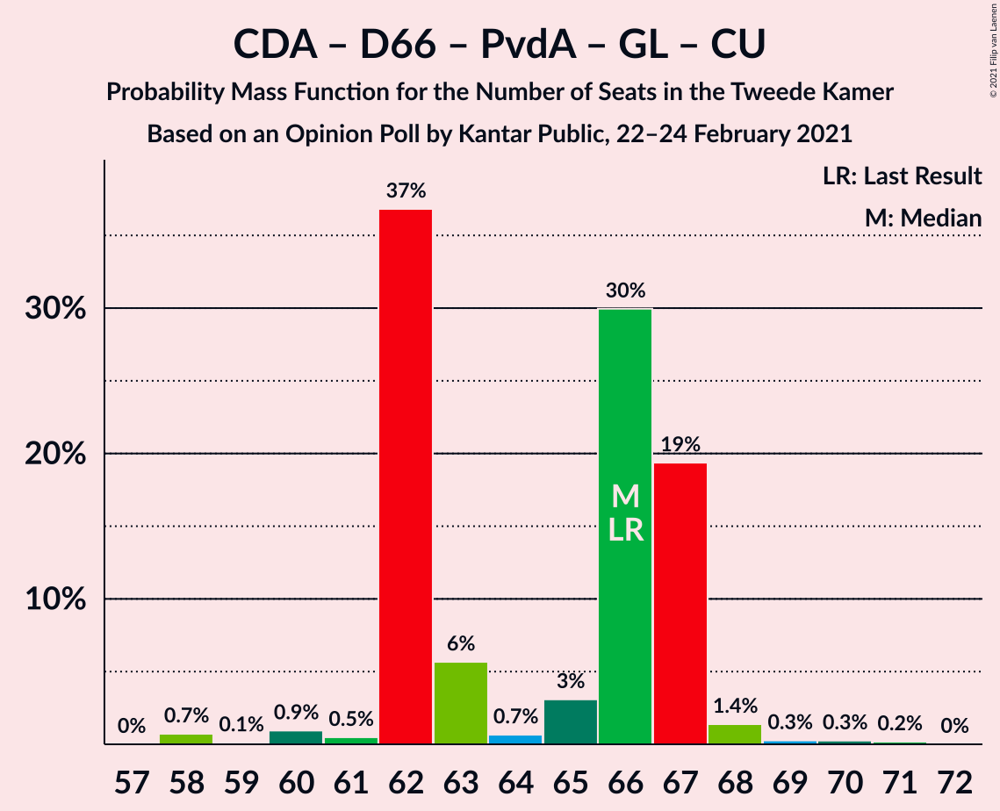

| Number of Seats | Probability | Accumulated | Special Marks |
|:---------------:|:-----------:|:-----------:|:-------------:|
| 58 | 0.7% | 100% |  |
| 59 | 0.1% | 99.2% |  |
| 60 | 0.9% | 99.1% |  |
| 61 | 0.5% | 98% |  |
| 62 | 37% | 98% | Median |
| 63 | 6% | 61% |  |
| 64 | 0.7% | 55% |  |
| 65 | 3% | 55% |  |
| 66 | 30% | 51% | Last Result |
| 67 | 19% | 21% |  |
| 68 | 1.4% | 2% |  |
| 69 | 0.3% | 0.7% |  |
| 70 | 0.3% | 0.5% |  |
| 71 | 0.2% | 0.2% |  |
| 72 | 0% | 0% |  |

### Volkspartij voor Vrijheid en Democratie – Christen-Democratisch Appèl – Forum voor Democratie – Staatkundig Gereformeerde Partij

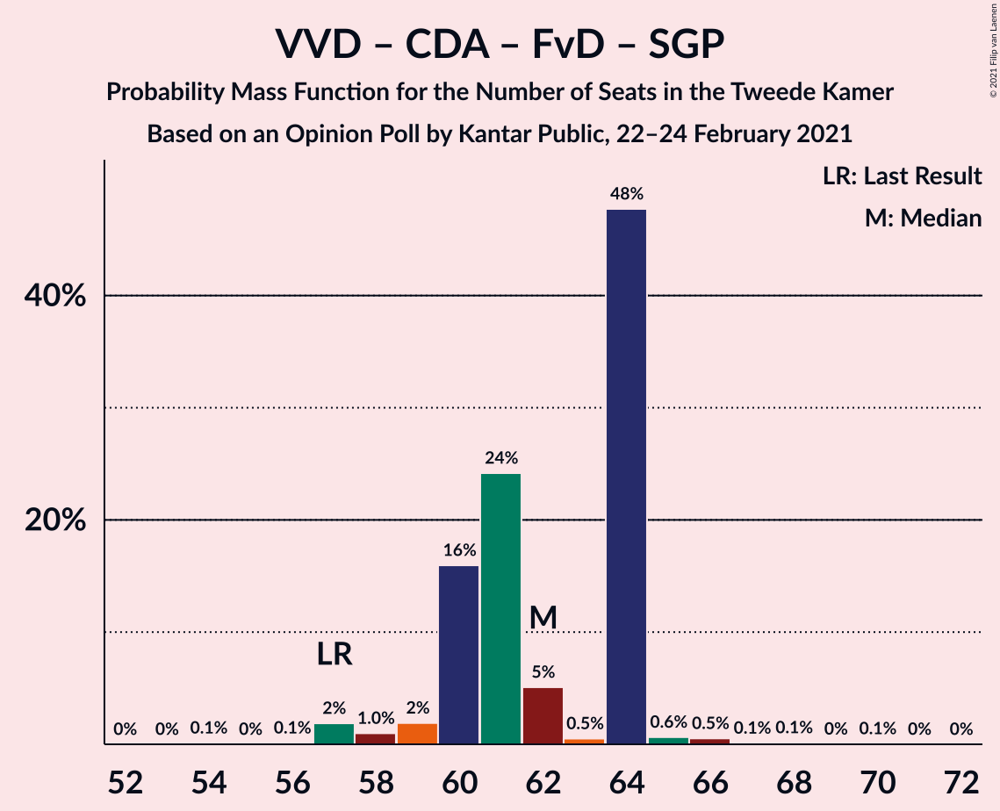

| Number of Seats | Probability | Accumulated | Special Marks |
|:---------------:|:-----------:|:-----------:|:-------------:|
| 54 | 0.1% | 100% |  |
| 55 | 0% | 99.9% |  |
| 56 | 0.1% | 99.9% |  |
| 57 | 2% | 99.7% | Last Result |
| 58 | 1.0% | 98% |  |
| 59 | 2% | 97% |  |
| 60 | 16% | 95% |  |
| 61 | 24% | 79% |  |
| 62 | 5% | 55% | Median |
| 63 | 0.5% | 50% |  |
| 64 | 48% | 49% |  |
| 65 | 0.6% | 2% |  |
| 66 | 0.5% | 0.9% |  |
| 67 | 0.1% | 0.4% |  |
| 68 | 0.1% | 0.3% |  |
| 69 | 0% | 0.1% |  |
| 70 | 0.1% | 0.1% |  |
| 71 | 0% | 0% |  |

### Volkspartij voor Vrijheid en Democratie – Christen-Democratisch Appèl – Forum voor Democratie

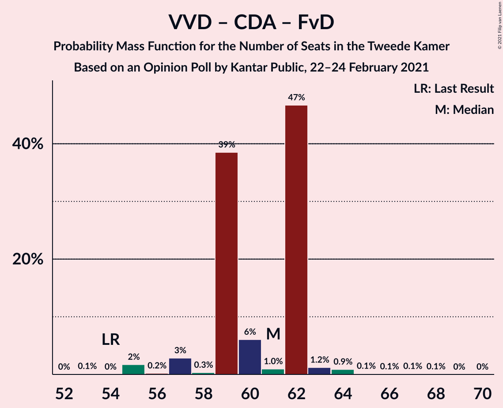

| Number of Seats | Probability | Accumulated | Special Marks |
|:---------------:|:-----------:|:-----------:|:-------------:|
| 53 | 0.1% | 100% |  |
| 54 | 0% | 99.9% | Last Result |
| 55 | 2% | 99.9% |  |
| 56 | 0.2% | 98% |  |
| 57 | 3% | 98% |  |
| 58 | 0.3% | 95% |  |
| 59 | 39% | 95% |  |
| 60 | 6% | 56% | Median |
| 61 | 1.0% | 50% |  |
| 62 | 47% | 49% |  |
| 63 | 1.2% | 3% |  |
| 64 | 0.9% | 1.3% |  |
| 65 | 0.1% | 0.4% |  |
| 66 | 0.1% | 0.3% |  |
| 67 | 0.1% | 0.2% |  |
| 68 | 0.1% | 0.1% |  |
| 69 | 0% | 0% |  |

### Volkspartij voor Vrijheid en Democratie – Christen-Democratisch Appèl

| Number of Seats | Probability | Accumulated | Special Marks |
|:---------------:|:-----------:|:-----------:|:-------------:|
| 50 | 0.1% | 100% |  |
| 51 | 0% | 99.9% |  |
| 52 | 0% | 99.9% | Last Result |
| 53 | 0% | 99.8% |  |
| 54 | 4% | 99.8% |  |
| 55 | 1.1% | 96% |  |
| 56 | 19% | 95% |  |
| 57 | 19% | 75% | Median |
| 58 | 5% | 56% |  |
| 59 | 48% | 51% |  |
| 60 | 0.7% | 3% |  |
| 61 | 1.0% | 2% |  |
| 62 | 0.8% | 1.1% |  |
| 63 | 0% | 0.3% |  |
| 64 | 0.2% | 0.2% |  |
| 65 | 0.1% | 0.1% |  |
| 66 | 0% | 0% |  |

### Volkspartij voor Vrijheid en Democratie – Partij van de Arbeid

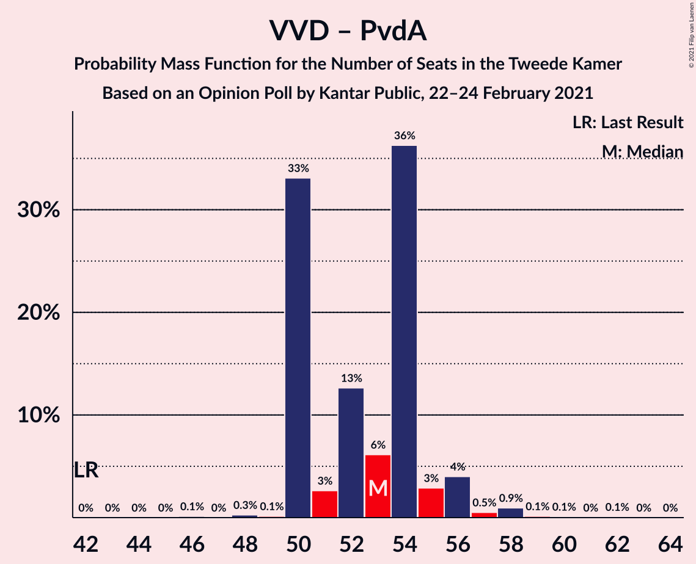

| Number of Seats | Probability | Accumulated | Special Marks |
|:---------------:|:-----------:|:-----------:|:-------------:|
| 42 | 0% | 100% | Last Result |
| 43 | 0% | 100% |  |
| 44 | 0% | 100% |  |
| 45 | 0% | 100% |  |
| 46 | 0.1% | 100% |  |
| 47 | 0% | 99.9% |  |
| 48 | 0.3% | 99.9% |  |
| 49 | 0.1% | 99.6% |  |
| 50 | 33% | 99.5% |  |
| 51 | 3% | 66% |  |
| 52 | 13% | 64% | Median |
| 53 | 6% | 51% |  |
| 54 | 36% | 45% |  |
| 55 | 3% | 9% |  |
| 56 | 4% | 6% |  |
| 57 | 0.5% | 2% |  |
| 58 | 0.9% | 1.3% |  |
| 59 | 0.1% | 0.3% |  |
| 60 | 0.1% | 0.2% |  |
| 61 | 0% | 0.1% |  |
| 62 | 0.1% | 0.1% |  |
| 63 | 0% | 0% |  |

### Christen-Democratisch Appèl – Democraten 66 – Partij van de Arbeid

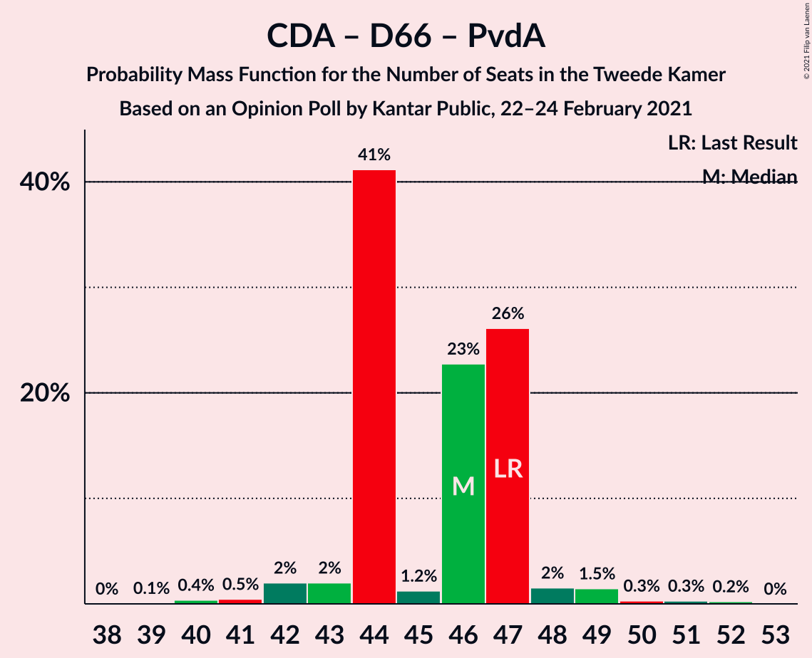

| Number of Seats | Probability | Accumulated | Special Marks |
|:---------------:|:-----------:|:-----------:|:-------------:|
| 39 | 0.1% | 100% |  |
| 40 | 0.4% | 99.9% |  |
| 41 | 0.5% | 99.5% |  |
| 42 | 2% | 99.1% |  |
| 43 | 2% | 97% |  |
| 44 | 41% | 95% | Median |
| 45 | 1.2% | 54% |  |
| 46 | 23% | 53% |  |
| 47 | 26% | 30% | Last Result |
| 48 | 2% | 4% |  |
| 49 | 1.5% | 2% |  |
| 50 | 0.3% | 0.8% |  |
| 51 | 0.3% | 0.5% |  |
| 52 | 0.2% | 0.2% |  |
| 53 | 0% | 0% |  |

### Christen-Democratisch Appèl – Partij van de Arbeid – ChristenUnie

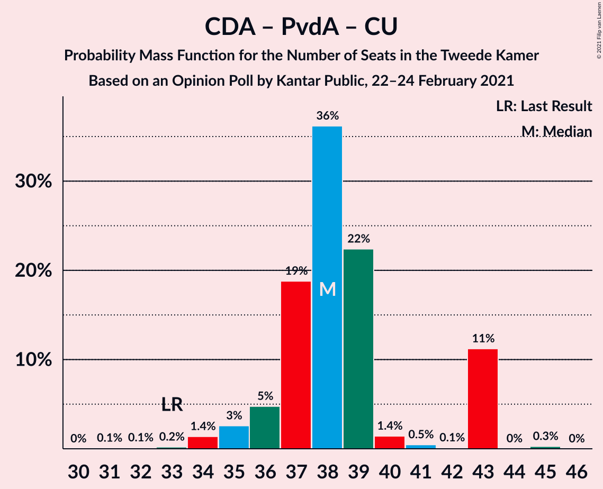

| Number of Seats | Probability | Accumulated | Special Marks |
|:---------------:|:-----------:|:-----------:|:-------------:|
| 31 | 0.1% | 100% |  |
| 32 | 0.1% | 99.9% |  |
| 33 | 0.2% | 99.8% | Last Result |
| 34 | 1.4% | 99.6% |  |
| 35 | 3% | 98% |  |
| 36 | 5% | 96% |  |
| 37 | 19% | 91% |  |
| 38 | 36% | 72% | Median |
| 39 | 22% | 36% |  |
| 40 | 1.4% | 13% |  |
| 41 | 0.5% | 12% |  |
| 42 | 0.1% | 12% |  |
| 43 | 11% | 11% |  |
| 44 | 0% | 0.3% |  |
| 45 | 0.3% | 0.3% |  |
| 46 | 0% | 0% |  |

### Christen-Democratisch Appèl – Democraten 66

| Number of Seats | Probability | Accumulated | Special Marks |
|:---------------:|:-----------:|:-----------:|:-------------:|
| 26 | 0% | 100% |  |
| 27 | 0.2% | 99.9% |  |
| 28 | 2% | 99.8% |  |
| 29 | 1.4% | 98% |  |
| 30 | 1.5% | 96% |  |
| 31 | 41% | 95% | Median |
| 32 | 0.7% | 54% |  |
| 33 | 12% | 53% |  |
| 34 | 23% | 40% |  |
| 35 | 16% | 18% |  |
| 36 | 2% | 2% |  |
| 37 | 0.1% | 0.3% |  |
| 38 | 0% | 0.1% | Last Result |
| 39 | 0.1% | 0.1% |  |
| 40 | 0% | 0% |  |

### Christen-Democratisch Appèl – Partij van de Arbeid

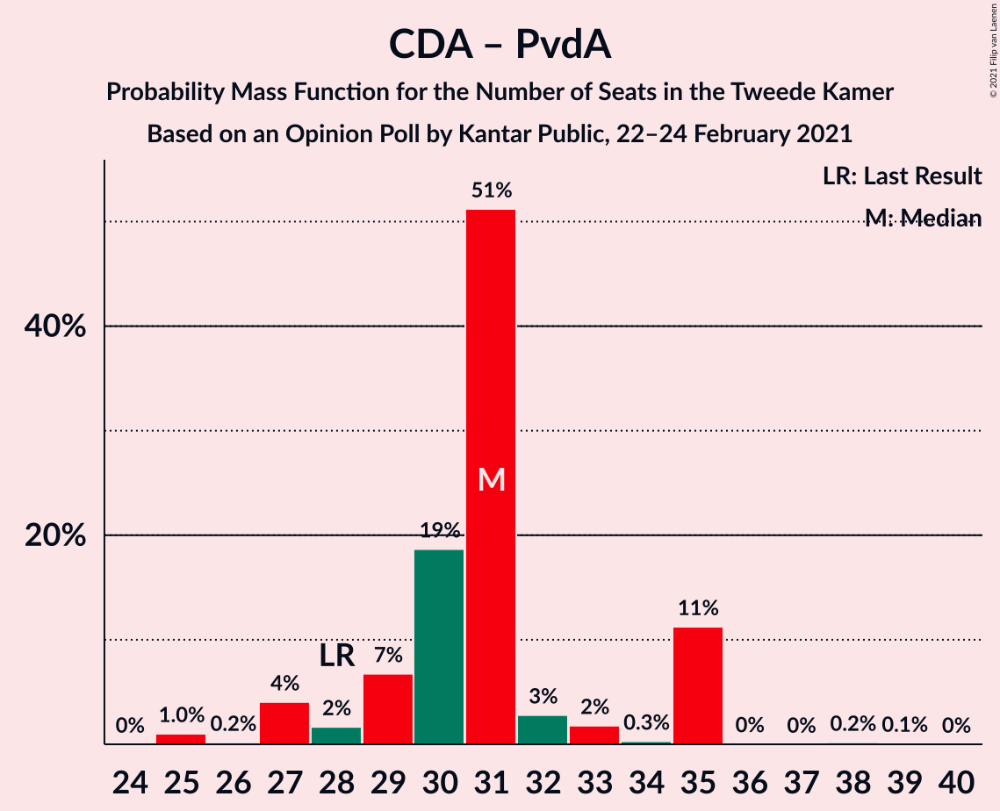

| Number of Seats | Probability | Accumulated | Special Marks |
|:---------------:|:-----------:|:-----------:|:-------------:|
| 25 | 1.0% | 100% |  |
| 26 | 0.2% | 99.0% |  |
| 27 | 4% | 98.8% |  |
| 28 | 2% | 95% | Last Result |
| 29 | 7% | 93% |  |
| 30 | 19% | 86% |  |
| 31 | 51% | 68% | Median |
| 32 | 3% | 16% |  |
| 33 | 2% | 14% |  |
| 34 | 0.3% | 12% |  |
| 35 | 11% | 12% |  |
| 36 | 0% | 0.3% |  |
| 37 | 0% | 0.3% |  |
| 38 | 0.2% | 0.3% |  |
| 39 | 0.1% | 0.1% |  |
| 40 | 0% | 0% |  |

## Technical Information

### Opinion Poll

+ **Polling firm:** Kantar Public
+ **Commissioner(s):** —
+ **Fieldwork period:** 22–24 February 2021

### Calculations

+ **Sample size:** 1131
+ **Simulations done:** 1,048,576
+ **Error estimate:** 2.51%

