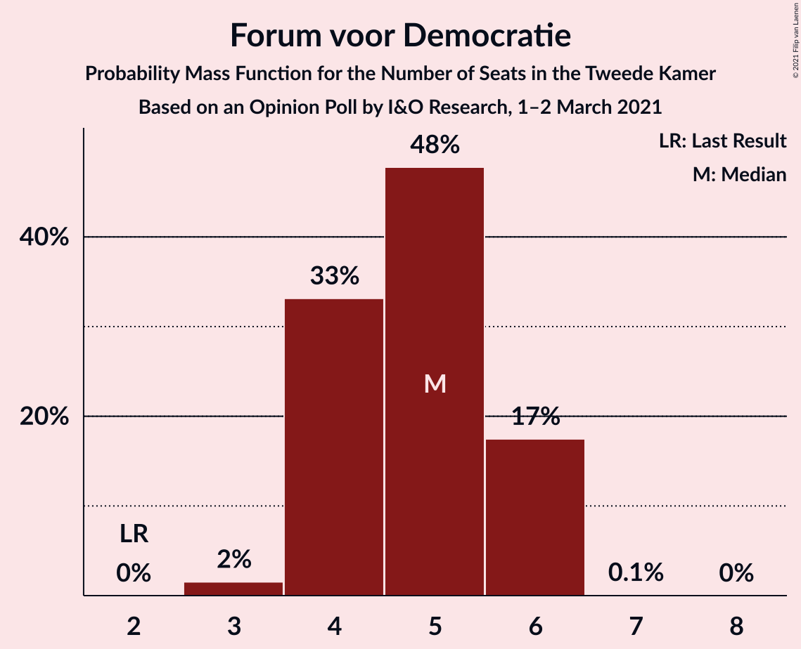

# Opinion Poll by I&O Research, 1–2 March 2021

<a href="#voting-intentions">Voting Intentions</a> | <a href="#seats">Seats</a> | <a href="#coalitions">Coalitions</a> | <a href="#technical-information">Technical Information</a>

## Voting Intentions

### Confidence Intervals

| Party | Last Result | Poll Result | 80% Confidence Interval | 90% Confidence Interval | 95% Confidence Interval | 99% Confidence Interval |
|:-----:|:-----------:|:-----------:|:-----------------------:|:-----------------------:|:-----------------------:|:-----------------------:|
| Volkspartij voor Vrijheid en Democratie | 21.3% | 23.5% | 22.4–24.5% |22.1–24.8% |21.9–25.1% |21.4–25.6% |
| Partij voor de Vrijheid | 13.1% | 11.8% | 11.1–12.7% |10.9–12.9% |10.7–13.1% |10.3–13.5% |
| Christen-Democratisch Appèl | 12.4% | 11.2% | 10.5–12.1% |10.3–12.3% |10.1–12.5% |9.8–12.9% |
| Democraten 66 | 12.2% | 9.4% | 8.7–10.2% |8.5–10.4% |8.4–10.6% |8.0–11.0% |
| Partij van de Arbeid | 5.7% | 8.1% | 7.5–8.8% |7.3–9.0% |7.1–9.2% |6.8–9.6% |
| GroenLinks | 9.1% | 7.5% | 6.9–8.2% |6.7–8.4% |6.6–8.6% |6.3–8.9% |
| Socialistische Partij | 9.1% | 6.2% | 5.7–6.9% |5.5–7.0% |5.4–7.2% |5.1–7.5% |
| Partij voor de Dieren | 3.2% | 3.9% | 3.5–4.4% |3.3–4.6% |3.2–4.7% |3.0–5.0% |
| ChristenUnie | 3.4% | 3.7% | 3.3–4.2% |3.2–4.4% |3.1–4.5% |2.9–4.8% |
| Forum voor Democratie | 1.8% | 3.2% | 2.8–3.7% |2.7–3.8% |2.6–3.9% |2.4–4.2% |
| Staatkundig Gereformeerde Partij | 2.1% | 2.6% | 2.2–3.0% |2.1–3.2% |2.1–3.3% |1.9–3.5% |
| DENK | 2.1% | 1.8% | 1.5–2.2% |1.4–2.3% |1.3–2.4% |1.2–2.6% |
| Juiste Antwoord 2021 | 0.0% | 1.7% | 1.4–2.1% |1.3–2.2% |1.3–2.3% |1.2–2.5% |
| 50Plus | 3.1% | 1.6% | 1.3–2.0% |1.2–2.1% |1.2–2.2% |1.1–2.3% |
| Volt Europa | 0.0% | 1.6% | 1.3–2.0% |1.2–2.1% |1.2–2.2% |1.1–2.3% |

*Note:* The poll result column reflects the actual value used in the calculations. Published results may vary slightly, and in addition be rounded to fewer digits.

## Seats

### Confidence Intervals

| Party | Last Result | Median | 80% Confidence Interval | 90% Confidence Interval | 95% Confidence Interval | 99% Confidence Interval |
|:-----:|:-----------:|:------:|:-----------------------:|:-----------------------:|:-----------------------:|:-----------------------:|
| <a href="#volkspartij-voor-vrijheid-en-democratie">Volkspartij voor Vrijheid en Democratie</a> | 33 | 37 | 33–38 |33–39 |33–39 |33–40 |
| <a href="#partij-voor-de-vrijheid">Partij voor de Vrijheid</a> | 20 | 18 | 17–21 |17–21 |17–21 |16–21 |
| <a href="#christen-democratisch-appèl">Christen-Democratisch Appèl</a> | 19 | 17 | 15–20 |15–20 |15–20 |14–20 |
| <a href="#democraten-66">Democraten 66</a> | 19 | 15 | 12–16 |12–16 |12–16 |11–17 |
| <a href="#partij-van-de-arbeid">Partij van de Arbeid</a> | 9 | 12 | 11–14 |10–14 |10–14 |10–16 |
| <a href="#groenlinks">GroenLinks</a> | 14 | 12 | 10–12 |10–13 |9–13 |9–14 |
| <a href="#socialistische-partij">Socialistische Partij</a> | 14 | 9 | 8–10 |8–10 |7–11 |7–11 |
| <a href="#partij-voor-de-dieren">Partij voor de Dieren</a> | 5 | 6 | 5–6 |5–7 |4–7 |4–8 |
| <a href="#christenunie">ChristenUnie</a> | 5 | 5 | 4–6 |4–7 |4–7 |3–7 |
| <a href="#forum-voor-democratie">Forum voor Democratie</a> | 2 | 5 | 4–6 |4–6 |4–6 |3–6 |
| <a href="#staatkundig-gereformeerde-partij">Staatkundig Gereformeerde Partij</a> | 3 | 4 | 3–5 |3–5 |3–5 |2–5 |
| <a href="#denk">DENK</a> | 3 | 2 | 2–3 |2–3 |1–3 |1–4 |
| <a href="#juiste-antwoord-2021">Juiste Antwoord 2021</a> | 0 | 2 | 2–3 |1–3 |1–3 |1–4 |
| <a href="#50plus">50Plus</a> | 4 | 2 | 1–3 |1–3 |1–3 |1–3 |
| <a href="#volt-europa">Volt Europa</a> | 0 | 2 | 1–3 |1–3 |1–3 |1–3 |

### Volkspartij voor Vrijheid en Democratie

*For a full overview of the results for this party, see the [Volkspartij voor Vrijheid en Democratie](party-volkspartijvoorvrijheidendemocratie.html) page.*

| Number of Seats | Probability | Accumulated | Special Marks |
|:---------------:|:-----------:|:-----------:|:-------------:|
| 32 | 0.3% | 100% |  |
| 33 | 10% | 99.6% | Last Result |
| 34 | 13% | 89% |  |
| 35 | 18% | 77% |  |
| 36 | 7% | 59% |  |
| 37 | 40% | 52% | Median |
| 38 | 6% | 12% |  |
| 39 | 5% | 7% |  |
| 40 | 1.1% | 1.2% |  |
| 41 | 0% | 0% |  |

### Partij voor de Vrijheid

*For a full overview of the results for this party, see the [Partij voor de Vrijheid](party-partijvoordevrijheid.html) page.*

| Number of Seats | Probability | Accumulated | Special Marks |
|:---------------:|:-----------:|:-----------:|:-------------:|
| 14 | 0.1% | 100% |  |
| 15 | 0.1% | 99.9% |  |
| 16 | 1.3% | 99.8% |  |
| 17 | 35% | 98% |  |
| 18 | 22% | 64% | Median |
| 19 | 8% | 42% |  |
| 20 | 23% | 34% | Last Result |
| 21 | 11% | 11% |  |
| 22 | 0.2% | 0.2% |  |
| 23 | 0% | 0% |  |

### Christen-Democratisch Appèl

*For a full overview of the results for this party, see the [Christen-Democratisch Appèl](party-christen-democratischappèl.html) page.*

| Number of Seats | Probability | Accumulated | Special Marks |
|:---------------:|:-----------:|:-----------:|:-------------:|
| 14 | 0.9% | 100% |  |
| 15 | 11% | 99.1% |  |
| 16 | 24% | 88% |  |
| 17 | 31% | 64% | Median |
| 18 | 19% | 33% |  |
| 19 | 4% | 15% | Last Result |
| 20 | 10% | 10% |  |
| 21 | 0% | 0% |  |

### Democraten 66

*For a full overview of the results for this party, see the [Democraten 66](party-democraten66.html) page.*

| Number of Seats | Probability | Accumulated | Special Marks |
|:---------------:|:-----------:|:-----------:|:-------------:|
| 11 | 2% | 100% |  |
| 12 | 15% | 98% |  |
| 13 | 16% | 83% |  |
| 14 | 18% | 68% |  |
| 15 | 20% | 50% | Median |
| 16 | 29% | 30% |  |
| 17 | 0.8% | 0.9% |  |
| 18 | 0.1% | 0.1% |  |
| 19 | 0% | 0% | Last Result |

### Partij van de Arbeid

*For a full overview of the results for this party, see the [Partij van de Arbeid](party-partijvandearbeid.html) page.*

| Number of Seats | Probability | Accumulated | Special Marks |
|:---------------:|:-----------:|:-----------:|:-------------:|
| 9 | 0% | 100% | Last Result |
| 10 | 5% | 100% |  |
| 11 | 10% | 95% |  |
| 12 | 45% | 84% | Median |
| 13 | 24% | 39% |  |
| 14 | 14% | 16% |  |
| 15 | 0.4% | 1.1% |  |
| 16 | 0.7% | 0.7% |  |
| 17 | 0% | 0% |  |

### GroenLinks

*For a full overview of the results for this party, see the [GroenLinks](party-groenlinks.html) page.*

| Number of Seats | Probability | Accumulated | Special Marks |
|:---------------:|:-----------:|:-----------:|:-------------:|
| 9 | 4% | 100% |  |
| 10 | 9% | 96% |  |
| 11 | 31% | 88% |  |
| 12 | 49% | 57% | Median |
| 13 | 7% | 8% |  |
| 14 | 0.6% | 0.6% | Last Result |
| 15 | 0% | 0% |  |

### Socialistische Partij

*For a full overview of the results for this party, see the [Socialistische Partij](party-socialistischepartij.html) page.*

| Number of Seats | Probability | Accumulated | Special Marks |
|:---------------:|:-----------:|:-----------:|:-------------:|
| 7 | 5% | 100% |  |
| 8 | 20% | 95% |  |
| 9 | 38% | 75% | Median |
| 10 | 34% | 37% |  |
| 11 | 3% | 3% |  |
| 12 | 0.3% | 0.3% |  |
| 13 | 0% | 0% |  |
| 14 | 0% | 0% | Last Result |

### Partij voor de Dieren

*For a full overview of the results for this party, see the [Partij voor de Dieren](party-partijvoordedieren.html) page.*

| Number of Seats | Probability | Accumulated | Special Marks |
|:---------------:|:-----------:|:-----------:|:-------------:|
| 3 | 0.1% | 100% |  |
| 4 | 3% | 99.9% |  |
| 5 | 25% | 96% | Last Result |
| 6 | 63% | 71% | Median |
| 7 | 8% | 8% |  |
| 8 | 0.6% | 0.6% |  |
| 9 | 0% | 0% |  |

### ChristenUnie

*For a full overview of the results for this party, see the [ChristenUnie](party-christenunie.html) page.*

| Number of Seats | Probability | Accumulated | Special Marks |
|:---------------:|:-----------:|:-----------:|:-------------:|
| 3 | 2% | 100% |  |
| 4 | 15% | 98% |  |
| 5 | 38% | 84% | Last Result, Median |
| 6 | 36% | 46% |  |
| 7 | 9% | 9% |  |
| 8 | 0.3% | 0.3% |  |
| 9 | 0% | 0% |  |

### Forum voor Democratie

*For a full overview of the results for this party, see the [Forum voor Democratie](party-forumvoordemocratie.html) page.*

| Number of Seats | Probability | Accumulated | Special Marks |
|:---------------:|:-----------:|:-----------:|:-------------:|
| 2 | 0% | 100% | Last Result |
| 3 | 2% | 100% |  |
| 4 | 33% | 98% |  |
| 5 | 48% | 65% | Median |
| 6 | 17% | 18% |  |
| 7 | 0.1% | 0.1% |  |
| 8 | 0% | 0% |  |

### Staatkundig Gereformeerde Partij

*For a full overview of the results for this party, see the [Staatkundig Gereformeerde Partij](party-staatkundiggereformeerdepartij.html) page.*

| Number of Seats | Probability | Accumulated | Special Marks |
|:---------------:|:-----------:|:-----------:|:-------------:|
| 2 | 0.8% | 100% |  |
| 3 | 26% | 99.2% | Last Result |
| 4 | 62% | 73% | Median |
| 5 | 11% | 11% |  |
| 6 | 0.1% | 0.1% |  |
| 7 | 0% | 0% |  |

### DENK

*For a full overview of the results for this party, see the [DENK](party-denk.html) page.*

| Number of Seats | Probability | Accumulated | Special Marks |
|:---------------:|:-----------:|:-----------:|:-------------:|
| 1 | 3% | 100% |  |
| 2 | 58% | 97% | Median |
| 3 | 37% | 39% | Last Result |
| 4 | 1.4% | 1.4% |  |
| 5 | 0% | 0% |  |

### Juiste Antwoord 2021

*For a full overview of the results for this party, see the [Juiste Antwoord 2021](party-juisteantwoord2021.html) page.*

| Number of Seats | Probability | Accumulated | Special Marks |
|:---------------:|:-----------:|:-----------:|:-------------:|
| 0 | 0% | 100% | Last Result |
| 1 | 9% | 100% |  |
| 2 | 74% | 91% | Median |
| 3 | 15% | 16% |  |
| 4 | 1.1% | 1.1% |  |
| 5 | 0% | 0% |  |

### 50Plus

*For a full overview of the results for this party, see the [50Plus](party-50plus.html) page.*

| Number of Seats | Probability | Accumulated | Special Marks |
|:---------------:|:-----------:|:-----------:|:-------------:|
| 1 | 22% | 100% |  |
| 2 | 42% | 78% | Median |
| 3 | 36% | 36% |  |
| 4 | 0.1% | 0.1% | Last Result |
| 5 | 0% | 0% |  |

### Volt Europa

*For a full overview of the results for this party, see the [Volt Europa](party-volteuropa.html) page.*

| Number of Seats | Probability | Accumulated | Special Marks |
|:---------------:|:-----------:|:-----------:|:-------------:|
| 0 | 0% | 100% | Last Result |
| 1 | 12% | 100% |  |
| 2 | 74% | 88% | Median |
| 3 | 14% | 14% |  |
| 4 | 0.3% | 0.3% |  |
| 5 | 0% | 0% |  |

## Coalitions

### Confidence Intervals

| Coalition | Last Result | Median | Majority? | 80% Confidence Interval | 90% Confidence Interval | 95% Confidence Interval | 99% Confidence Interval |
|:---------:|:-----------:|:------:|:---------:|:-----------------------:|:-----------------------:|:-----------------------:|:-----------------------:|
| Volkspartij voor Vrijheid en Democratie – Christen-Democratisch Appèl – Democraten 66 – Partij van de Arbeid – ChristenUnie | 85 | 85 | 100% | 82–88 | 82–88 | 82–88 | 81–89 |
| Volkspartij voor Vrijheid en Democratie – Christen-Democratisch Appèl – Democraten 66 – GroenLinks – ChristenUnie | 90 | 84 | 100% | 82–87 | 82–87 | 82–87 | 81–88 |
| Volkspartij voor Vrijheid en Democratie – Partij voor de Vrijheid – Christen-Democratisch Appèl – Forum voor Democratie – Staatkundig Gereformeerde Partij | 77 | 80 | 99.3% | 78–83 | 78–83 | 77–83 | 75–84 |
| Volkspartij voor Vrijheid en Democratie – Partij voor de Vrijheid – Christen-Democratisch Appèl – Forum voor Democratie | 74 | 76 | 69% | 74–79 | 74–79 | 74–80 | 72–80 |
| Volkspartij voor Vrijheid en Democratie – Christen-Democratisch Appèl – Democraten 66 – ChristenUnie | 76 | 72 | 16% | 70–76 | 70–76 | 70–76 | 69–77 |
| Volkspartij voor Vrijheid en Democratie – Partij voor de Vrijheid – Christen-Democratisch Appèl | 72 | 72 | 2% | 70–74 | 70–74 | 68–75 | 67–76 |
| Christen-Democratisch Appèl – Democraten 66 – Partij van de Arbeid – GroenLinks – Socialistische Partij – ChristenUnie | 80 | 70 | 0.1% | 68–72 | 66–72 | 66–72 | 65–75 |
| Volkspartij voor Vrijheid en Democratie – Christen-Democratisch Appèl – Democraten 66 | 71 | 67 | 0% | 65–70 | 65–70 | 65–70 | 64–71 |
| Volkspartij voor Vrijheid en Democratie – Christen-Democratisch Appèl – Partij van de Arbeid | 61 | 66 | 0% | 62–68 | 62–70 | 62–70 | 62–70 |
| Volkspartij voor Vrijheid en Democratie – Christen-Democratisch Appèl – Forum voor Democratie – Staatkundig Gereformeerde Partij – 50Plus | 61 | 64 | 0% | 61–67 | 61–68 | 61–69 | 60–69 |
| Volkspartij voor Vrijheid en Democratie – Democraten 66 – Partij van de Arbeid | 61 | 63 | 0% | 61–65 | 61–66 | 60–66 | 59–67 |
| Volkspartij voor Vrijheid en Democratie – Christen-Democratisch Appèl – Forum voor Democratie – Staatkundig Gereformeerde Partij | 57 | 62 | 0% | 58–65 | 58–65 | 58–66 | 58–66 |
| Volkspartij voor Vrijheid en Democratie – Christen-Democratisch Appèl – Forum voor Democratie – 50Plus | 58 | 60 | 0% | 57–63 | 57–65 | 57–65 | 56–65 |
| Christen-Democratisch Appèl – Democraten 66 – Partij van de Arbeid – GroenLinks – ChristenUnie | 66 | 61 | 0% | 58–63 | 58–64 | 58–64 | 56–65 |
| Volkspartij voor Vrijheid en Democratie – Christen-Democratisch Appèl – Forum voor Democratie | 54 | 58 | 0% | 54–61 | 54–62 | 54–62 | 54–62 |
| Volkspartij voor Vrijheid en Democratie – Christen-Democratisch Appèl | 52 | 53 | 0% | 50–56 | 50–57 | 50–57 | 50–58 |
| Volkspartij voor Vrijheid en Democratie – Partij van de Arbeid | 42 | 49 | 0% | 45–51 | 45–52 | 45–52 | 45–53 |
| Christen-Democratisch Appèl – Democraten 66 – Partij van de Arbeid | 47 | 44 | 0% | 41–46 | 41–47 | 41–47 | 39–47 |
| Christen-Democratisch Appèl – Partij van de Arbeid – ChristenUnie | 33 | 35 | 0% | 32–38 | 32–38 | 32–38 | 31–39 |
| Christen-Democratisch Appèl – Democraten 66 | 38 | 32 | 0% | 28–34 | 28–35 | 28–35 | 28–35 |
| Christen-Democratisch Appèl – Partij van de Arbeid | 28 | 30 | 0% | 27–32 | 27–32 | 27–32 | 26–33 |

### Volkspartij voor Vrijheid en Democratie – Christen-Democratisch Appèl – Democraten 66 – Partij van de Arbeid – ChristenUnie

| Number of Seats | Probability | Accumulated | Special Marks |
|:---------------:|:-----------:|:-----------:|:-------------:|
| 80 | 0.3% | 100% |  |
| 81 | 0.4% | 99.7% |  |
| 82 | 10% | 99.3% |  |
| 83 | 14% | 90% |  |
| 84 | 23% | 76% |  |
| 85 | 8% | 53% | Last Result |
| 86 | 14% | 44% | Median |
| 87 | 16% | 30% |  |
| 88 | 12% | 14% |  |
| 89 | 2% | 2% |  |
| 90 | 0.2% | 0.5% |  |
| 91 | 0.3% | 0.3% |  |
| 92 | 0% | 0% |  |

### Volkspartij voor Vrijheid en Democratie – Christen-Democratisch Appèl – Democraten 66 – GroenLinks – ChristenUnie

| Number of Seats | Probability | Accumulated | Special Marks |
|:---------------:|:-----------:|:-----------:|:-------------:|
| 79 | 0.1% | 100% |  |
| 80 | 0.1% | 99.9% |  |
| 81 | 1.1% | 99.8% |  |
| 82 | 15% | 98.7% |  |
| 83 | 33% | 83% |  |
| 84 | 11% | 50% |  |
| 85 | 7% | 40% |  |
| 86 | 13% | 32% | Median |
| 87 | 19% | 19% |  |
| 88 | 0.3% | 0.5% |  |
| 89 | 0.1% | 0.2% |  |
| 90 | 0% | 0.1% | Last Result |
| 91 | 0% | 0% |  |

### Volkspartij voor Vrijheid en Democratie – Partij voor de Vrijheid – Christen-Democratisch Appèl – Forum voor Democratie – Staatkundig Gereformeerde Partij

| Number of Seats | Probability | Accumulated | Special Marks |
|:---------------:|:-----------:|:-----------:|:-------------:|
| 75 | 0.7% | 100% |  |
| 76 | 0.7% | 99.3% | Majority |
| 77 | 2% | 98.5% | Last Result |
| 78 | 13% | 96% |  |
| 79 | 14% | 83% |  |
| 80 | 37% | 69% |  |
| 81 | 4% | 33% | Median |
| 82 | 18% | 29% |  |
| 83 | 10% | 11% |  |
| 84 | 0.8% | 0.9% |  |
| 85 | 0.1% | 0.1% |  |
| 86 | 0% | 0% |  |

### Volkspartij voor Vrijheid en Democratie – Partij voor de Vrijheid – Christen-Democratisch Appèl – Forum voor Democratie

| Number of Seats | Probability | Accumulated | Special Marks |
|:---------------:|:-----------:|:-----------:|:-------------:|
| 71 | 0.4% | 100% |  |
| 72 | 1.4% | 99.5% |  |
| 73 | 0.7% | 98% |  |
| 74 | 13% | 98% | Last Result |
| 75 | 15% | 84% |  |
| 76 | 22% | 69% | Majority |
| 77 | 25% | 47% | Median |
| 78 | 9% | 23% |  |
| 79 | 10% | 14% |  |
| 80 | 4% | 4% |  |
| 81 | 0.1% | 0.1% |  |
| 82 | 0% | 0% |  |

### Volkspartij voor Vrijheid en Democratie – Christen-Democratisch Appèl – Democraten 66 – ChristenUnie

| Number of Seats | Probability | Accumulated | Special Marks |
|:---------------:|:-----------:|:-----------:|:-------------:|
| 68 | 0.3% | 100% |  |
| 69 | 0.2% | 99.6% |  |
| 70 | 13% | 99.5% |  |
| 71 | 23% | 86% |  |
| 72 | 15% | 63% |  |
| 73 | 7% | 48% |  |
| 74 | 23% | 41% | Median |
| 75 | 2% | 18% |  |
| 76 | 14% | 16% | Last Result, Majority |
| 77 | 2% | 2% |  |
| 78 | 0.1% | 0.1% |  |
| 79 | 0% | 0% |  |

### Volkspartij voor Vrijheid en Democratie – Partij voor de Vrijheid – Christen-Democratisch Appèl

| Number of Seats | Probability | Accumulated | Special Marks |
|:---------------:|:-----------:|:-----------:|:-------------:|
| 66 | 0.3% | 100% |  |
| 67 | 0.4% | 99.7% |  |
| 68 | 2% | 99.2% |  |
| 69 | 1.3% | 97% |  |
| 70 | 35% | 96% |  |
| 71 | 10% | 61% |  |
| 72 | 26% | 51% | Last Result, Median |
| 73 | 6% | 25% |  |
| 74 | 16% | 20% |  |
| 75 | 2% | 4% |  |
| 76 | 2% | 2% | Majority |
| 77 | 0.2% | 0.2% |  |
| 78 | 0% | 0% |  |

### Christen-Democratisch Appèl – Democraten 66 – Partij van de Arbeid – GroenLinks – Socialistische Partij – ChristenUnie

| Number of Seats | Probability | Accumulated | Special Marks |
|:---------------:|:-----------:|:-----------:|:-------------:|
| 63 | 0.2% | 100% |  |
| 64 | 0.2% | 99.8% |  |
| 65 | 0.5% | 99.6% |  |
| 66 | 4% | 99.1% |  |
| 67 | 1.2% | 95% |  |
| 68 | 16% | 93% |  |
| 69 | 27% | 78% |  |
| 70 | 12% | 50% | Median |
| 71 | 21% | 39% |  |
| 72 | 16% | 18% |  |
| 73 | 0.6% | 1.4% |  |
| 74 | 0.2% | 0.7% |  |
| 75 | 0.4% | 0.5% |  |
| 76 | 0.1% | 0.1% | Majority |
| 77 | 0% | 0% |  |
| 78 | 0% | 0% |  |
| 79 | 0% | 0% |  |
| 80 | 0% | 0% | Last Result |

### Volkspartij voor Vrijheid en Democratie – Christen-Democratisch Appèl – Democraten 66

| Number of Seats | Probability | Accumulated | Special Marks |
|:---------------:|:-----------:|:-----------:|:-------------:|
| 63 | 0.4% | 100% |  |
| 64 | 0.3% | 99.6% |  |
| 65 | 15% | 99.3% |  |
| 66 | 24% | 85% |  |
| 67 | 23% | 60% |  |
| 68 | 6% | 37% |  |
| 69 | 9% | 31% | Median |
| 70 | 22% | 23% |  |
| 71 | 0.2% | 0.7% | Last Result |
| 72 | 0.4% | 0.5% |  |
| 73 | 0.1% | 0.1% |  |
| 74 | 0% | 0% |  |

### Volkspartij voor Vrijheid en Democratie – Christen-Democratisch Appèl – Partij van de Arbeid

| Number of Seats | Probability | Accumulated | Special Marks |
|:---------------:|:-----------:|:-----------:|:-------------:|
| 60 | 0.3% | 100% |  |
| 61 | 0.1% | 99.7% | Last Result |
| 62 | 20% | 99.7% |  |
| 63 | 3% | 79% |  |
| 64 | 16% | 77% |  |
| 65 | 7% | 61% |  |
| 66 | 12% | 54% | Median |
| 67 | 29% | 42% |  |
| 68 | 3% | 13% |  |
| 69 | 4% | 10% |  |
| 70 | 5% | 6% |  |
| 71 | 0.3% | 0.4% |  |
| 72 | 0.1% | 0.1% |  |
| 73 | 0% | 0% |  |

### Volkspartij voor Vrijheid en Democratie – Christen-Democratisch Appèl – Forum voor Democratie – Staatkundig Gereformeerde Partij – 50Plus

| Number of Seats | Probability | Accumulated | Special Marks |
|:---------------:|:-----------:|:-----------:|:-------------:|
| 59 | 0.1% | 100% |  |
| 60 | 2% | 99.9% |  |
| 61 | 13% | 98% | Last Result |
| 62 | 11% | 85% |  |
| 63 | 18% | 74% |  |
| 64 | 29% | 55% |  |
| 65 | 3% | 27% | Median |
| 66 | 14% | 24% |  |
| 67 | 3% | 10% |  |
| 68 | 3% | 7% |  |
| 69 | 4% | 4% |  |
| 70 | 0.1% | 0.1% |  |
| 71 | 0% | 0% |  |

### Volkspartij voor Vrijheid en Democratie – Democraten 66 – Partij van de Arbeid

| Number of Seats | Probability | Accumulated | Special Marks |
|:---------------:|:-----------:|:-----------:|:-------------:|
| 58 | 0.1% | 100% |  |
| 59 | 1.1% | 99.9% |  |
| 60 | 1.3% | 98.8% |  |
| 61 | 22% | 97% | Last Result |
| 62 | 24% | 76% |  |
| 63 | 32% | 51% |  |
| 64 | 7% | 19% | Median |
| 65 | 7% | 13% |  |
| 66 | 6% | 6% |  |
| 67 | 0.3% | 0.6% |  |
| 68 | 0.3% | 0.3% |  |
| 69 | 0% | 0% |  |

### Volkspartij voor Vrijheid en Democratie – Christen-Democratisch Appèl – Forum voor Democratie – Staatkundig Gereformeerde Partij

| Number of Seats | Probability | Accumulated | Special Marks |
|:---------------:|:-----------:|:-----------:|:-------------:|
| 57 | 0.3% | 100% | Last Result |
| 58 | 12% | 99.7% |  |
| 59 | 10% | 88% |  |
| 60 | 6% | 78% |  |
| 61 | 11% | 72% |  |
| 62 | 33% | 61% |  |
| 63 | 9% | 29% | Median |
| 64 | 0.9% | 20% |  |
| 65 | 14% | 19% |  |
| 66 | 4% | 4% |  |
| 67 | 0.1% | 0.2% |  |
| 68 | 0% | 0% |  |

### Volkspartij voor Vrijheid en Democratie – Christen-Democratisch Appèl – Forum voor Democratie – 50Plus

| Number of Seats | Probability | Accumulated | Special Marks |
|:---------------:|:-----------:|:-----------:|:-------------:|
| 55 | 0.2% | 100% |  |
| 56 | 0.6% | 99.7% |  |
| 57 | 12% | 99.1% |  |
| 58 | 5% | 87% | Last Result |
| 59 | 23% | 82% |  |
| 60 | 27% | 59% |  |
| 61 | 16% | 32% | Median |
| 62 | 6% | 16% |  |
| 63 | 2% | 10% |  |
| 64 | 3% | 8% |  |
| 65 | 5% | 6% |  |
| 66 | 0.1% | 0.1% |  |
| 67 | 0% | 0% |  |

### Christen-Democratisch Appèl – Democraten 66 – Partij van de Arbeid – GroenLinks – ChristenUnie

| Number of Seats | Probability | Accumulated | Special Marks |
|:---------------:|:-----------:|:-----------:|:-------------:|
| 55 | 0.4% | 100% |  |
| 56 | 0.3% | 99.6% |  |
| 57 | 2% | 99.3% |  |
| 58 | 16% | 98% |  |
| 59 | 17% | 82% |  |
| 60 | 13% | 65% |  |
| 61 | 12% | 51% | Median |
| 62 | 21% | 40% |  |
| 63 | 9% | 19% |  |
| 64 | 9% | 10% |  |
| 65 | 0.4% | 0.7% |  |
| 66 | 0.2% | 0.2% | Last Result |
| 67 | 0% | 0% |  |

### Volkspartij voor Vrijheid en Democratie – Christen-Democratisch Appèl – Forum voor Democratie

| Number of Seats | Probability | Accumulated | Special Marks |
|:---------------:|:-----------:|:-----------:|:-------------:|
| 53 | 0.3% | 100% |  |
| 54 | 11% | 99.6% | Last Result |
| 55 | 2% | 89% |  |
| 56 | 11% | 87% |  |
| 57 | 12% | 76% |  |
| 58 | 32% | 64% |  |
| 59 | 9% | 32% | Median |
| 60 | 13% | 23% |  |
| 61 | 3% | 10% |  |
| 62 | 7% | 7% |  |
| 63 | 0.2% | 0.2% |  |
| 64 | 0% | 0% |  |

### Volkspartij voor Vrijheid en Democratie – Christen-Democratisch Appèl

| Number of Seats | Probability | Accumulated | Special Marks |
|:---------------:|:-----------:|:-----------:|:-------------:|
| 48 | 0.3% | 100% |  |
| 49 | 0.2% | 99.7% |  |
| 50 | 11% | 99.5% |  |
| 51 | 11% | 89% |  |
| 52 | 14% | 77% | Last Result |
| 53 | 26% | 63% |  |
| 54 | 15% | 37% | Median |
| 55 | 11% | 22% |  |
| 56 | 4% | 11% |  |
| 57 | 6% | 7% |  |
| 58 | 1.1% | 1.2% |  |
| 59 | 0.1% | 0.1% |  |
| 60 | 0% | 0% |  |

### Volkspartij voor Vrijheid en Democratie – Partij van de Arbeid

| Number of Seats | Probability | Accumulated | Special Marks |
|:---------------:|:-----------:|:-----------:|:-------------:|
| 42 | 0% | 100% | Last Result |
| 43 | 0% | 100% |  |
| 44 | 0.3% | 100% |  |
| 45 | 19% | 99.7% |  |
| 46 | 8% | 81% |  |
| 47 | 18% | 73% |  |
| 48 | 1.2% | 55% |  |
| 49 | 15% | 54% | Median |
| 50 | 17% | 39% |  |
| 51 | 15% | 22% |  |
| 52 | 6% | 7% |  |
| 53 | 0.6% | 0.9% |  |
| 54 | 0.2% | 0.2% |  |
| 55 | 0% | 0% |  |

### Christen-Democratisch Appèl – Democraten 66 – Partij van de Arbeid

| Number of Seats | Probability | Accumulated | Special Marks |
|:---------------:|:-----------:|:-----------:|:-------------:|
| 38 | 0.1% | 100% |  |
| 39 | 0.4% | 99.9% |  |
| 40 | 0.8% | 99.4% |  |
| 41 | 12% | 98.7% |  |
| 42 | 16% | 86% |  |
| 43 | 11% | 70% |  |
| 44 | 22% | 59% | Median |
| 45 | 22% | 37% |  |
| 46 | 5% | 15% |  |
| 47 | 9% | 10% | Last Result |
| 48 | 0.3% | 0.3% |  |
| 49 | 0% | 0% |  |

### Christen-Democratisch Appèl – Partij van de Arbeid – ChristenUnie

| Number of Seats | Probability | Accumulated | Special Marks |
|:---------------:|:-----------:|:-----------:|:-------------:|
| 30 | 0.2% | 100% |  |
| 31 | 0.6% | 99.8% |  |
| 32 | 10% | 99.2% |  |
| 33 | 15% | 89% | Last Result |
| 34 | 22% | 75% | Median |
| 35 | 20% | 53% |  |
| 36 | 13% | 32% |  |
| 37 | 8% | 20% |  |
| 38 | 9% | 11% |  |
| 39 | 2% | 2% |  |
| 40 | 0.2% | 0.2% |  |
| 41 | 0% | 0% |  |

### Christen-Democratisch Appèl – Democraten 66

| Number of Seats | Probability | Accumulated | Special Marks |
|:---------------:|:-----------:|:-----------:|:-------------:|
| 27 | 0.2% | 100% |  |
| 28 | 13% | 99.8% |  |
| 29 | 14% | 86% |  |
| 30 | 11% | 72% |  |
| 31 | 9% | 61% |  |
| 32 | 9% | 52% | Median |
| 33 | 27% | 43% |  |
| 34 | 8% | 17% |  |
| 35 | 9% | 9% |  |
| 36 | 0.1% | 0.1% |  |
| 37 | 0% | 0% |  |
| 38 | 0% | 0% | Last Result |

### Christen-Democratisch Appèl – Partij van de Arbeid

| Number of Seats | Probability | Accumulated | Special Marks |
|:---------------:|:-----------:|:-----------:|:-------------:|
| 25 | 0.2% | 100% |  |
| 26 | 1.3% | 99.8% |  |
| 27 | 11% | 98% |  |
| 28 | 15% | 87% | Last Result |
| 29 | 22% | 72% | Median |
| 30 | 26% | 50% |  |
| 31 | 12% | 24% |  |
| 32 | 11% | 12% |  |
| 33 | 0.8% | 0.9% |  |
| 34 | 0.2% | 0.2% |  |
| 35 | 0% | 0% |  |

## Technical Information

### Opinion Poll

+ **Polling firm:** I&O Research
+ **Commissioner(s):** —
+ **Fieldwork period:** 1–2 March 2021

### Calculations

+ **Sample size:** 2685
+ **Simulations done:** 1,048,576
+ **Error estimate:** 2.82%

