# Opinion Poll by Peil.nl, 5–6 March 2021

<a href="#voting-intentions">Voting Intentions</a> | <a href="#seats">Seats</a> | <a href="#coalitions">Coalitions</a> | <a href="#technical-information">Technical Information</a>

## Voting Intentions

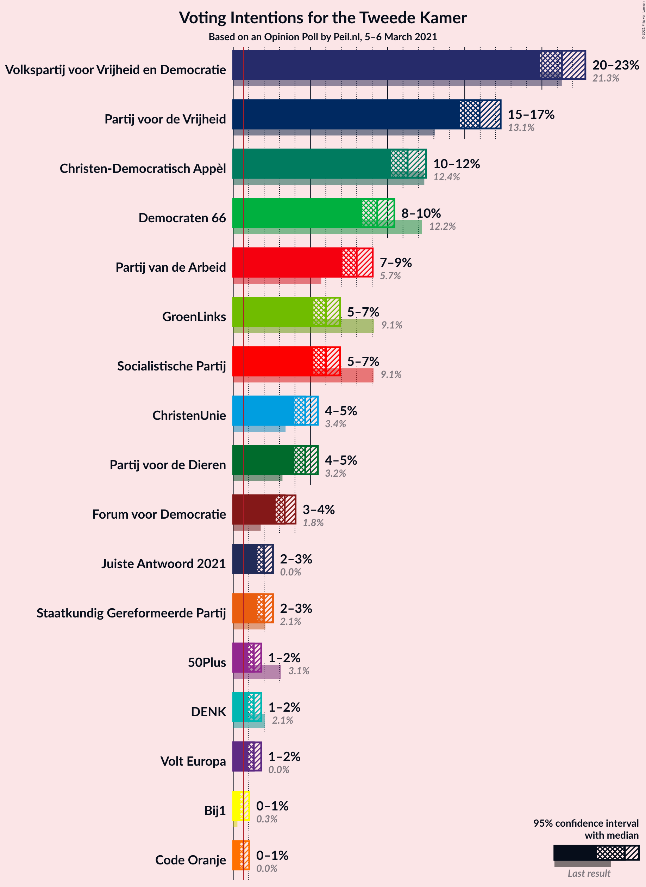

### Confidence Intervals

| Party | Last Result | Poll Result | 80% Confidence Interval | 90% Confidence Interval | 95% Confidence Interval | 99% Confidence Interval |
|:-----:|:-----------:|:-----------:|:-----------------------:|:-----------------------:|:-----------------------:|:-----------------------:|
| Volkspartij voor Vrijheid en Democratie | 21.3% | 21.3% | 20.4–22.3% |20.1–22.6% |19.9–22.8% |19.4–23.3% |
| Partij voor de Vrijheid | 13.1% | 16.0% | 15.1–16.9% |14.9–17.1% |14.7–17.3% |14.3–17.8% |
| Christen-Democratisch Appèl | 12.4% | 11.3% | 10.6–12.1% |10.4–12.3% |10.2–12.5% |9.9–12.9% |
| Democraten 66 | 12.2% | 9.3% | 8.7–10.1% |8.5–10.3% |8.3–10.4% |8.0–10.8% |
| Partij van de Arbeid | 5.7% | 8.0% | 7.4–8.7% |7.2–8.9% |7.1–9.0% |6.8–9.4% |
| GroenLinks | 9.1% | 6.0% | 5.5–6.6% |5.3–6.8% |5.2–6.9% |5.0–7.2% |
| Socialistische Partij | 9.1% | 6.0% | 5.5–6.6% |5.3–6.8% |5.2–6.9% |5.0–7.2% |
| ChristenUnie | 3.4% | 4.7% | 4.2–5.2% |4.1–5.3% |4.0–5.5% |3.7–5.8% |
| Partij voor de Dieren | 3.2% | 4.7% | 4.2–5.2% |4.1–5.3% |4.0–5.5% |3.7–5.8% |
| Forum voor Democratie | 1.8% | 3.3% | 2.9–3.8% |2.8–3.9% |2.7–4.0% |2.6–4.3% |
| Staatkundig Gereformeerde Partij | 2.1% | 2.0% | 1.7–2.4% |1.6–2.5% |1.6–2.6% |1.4–2.8% |
| Juiste Antwoord 2021 | 0.0% | 2.0% | 1.7–2.4% |1.6–2.5% |1.6–2.6% |1.4–2.8% |
| 50Plus | 3.1% | 1.3% | 1.1–1.6% |1.0–1.7% |1.0–1.8% |0.9–2.0% |
| DENK | 2.1% | 1.3% | 1.1–1.6% |1.0–1.7% |1.0–1.8% |0.9–2.0% |
| Volt Europa | 0.0% | 1.3% | 1.1–1.6% |1.0–1.7% |1.0–1.8% |0.9–2.0% |
| Bij1 | 0.3% | 0.7% | 0.5–0.9% |0.5–1.0% |0.4–1.0% |0.4–1.2% |
| Code Oranje | 0.0% | 0.7% | 0.5–0.9% |0.5–1.0% |0.4–1.0% |0.4–1.2% |

*Note:* The poll result column reflects the actual value used in the calculations. Published results may vary slightly, and in addition be rounded to fewer digits.

## Seats

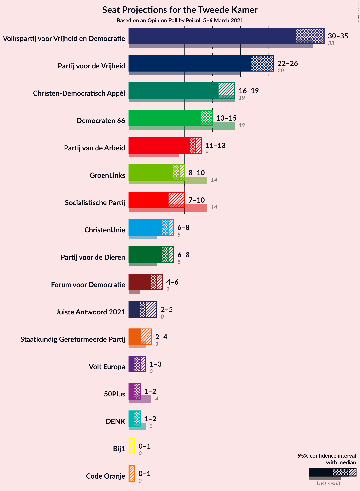

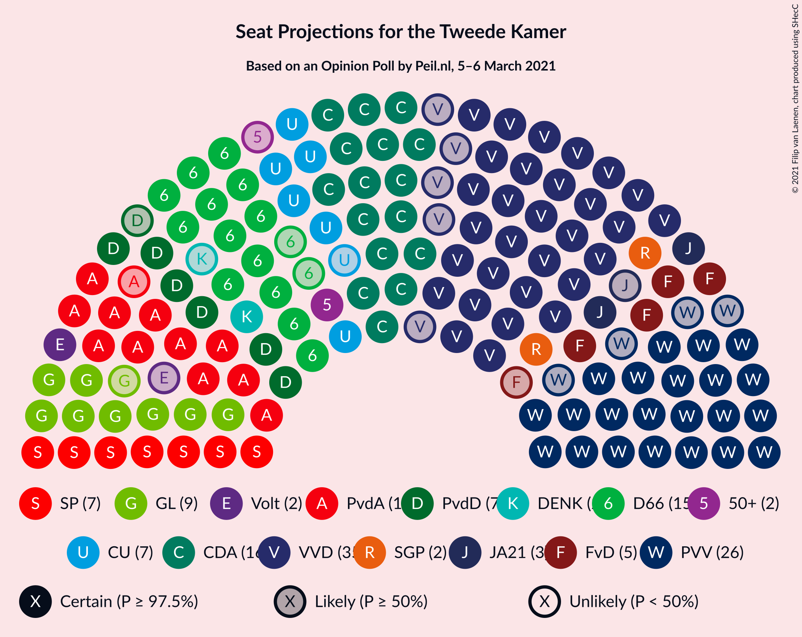

### Confidence Intervals

| Party | Last Result | Median | 80% Confidence Interval | 90% Confidence Interval | 95% Confidence Interval | 99% Confidence Interval |
|:-----:|:-----------:|:------:|:-----------------------:|:-----------------------:|:-----------------------:|:-----------------------:|
| <a href="#volkspartij-voor-vrijheid-en-democratie">Volkspartij voor Vrijheid en Democratie</a> | 33 | 35 | 31–35 |30–35 |30–35 |30–36 |
| <a href="#partij-voor-de-vrijheid">Partij voor de Vrijheid</a> | 20 | 26 | 24–26 |23–26 |22–26 |22–27 |
| <a href="#christen-democratisch-appèl">Christen-Democratisch Appèl</a> | 19 | 16 | 16–18 |16–18 |16–19 |15–19 |
| <a href="#democraten-66">Democraten 66</a> | 19 | 15 | 13–15 |13–15 |13–15 |12–16 |
| <a href="#partij-van-de-arbeid">Partij van de Arbeid</a> | 9 | 12 | 11–13 |11–13 |11–13 |11–14 |
| <a href="#groenlinks">GroenLinks</a> | 14 | 9 | 8–10 |8–10 |8–10 |8–11 |
| <a href="#socialistische-partij">Socialistische Partij</a> | 14 | 7 | 7–10 |7–10 |7–10 |7–11 |
| <a href="#christenunie">ChristenUnie</a> | 5 | 7 | 6–8 |6–8 |6–8 |6–9 |
| <a href="#partij-voor-de-dieren">Partij voor de Dieren</a> | 5 | 7 | 6–7 |6–8 |6–8 |6–8 |
| <a href="#forum-voor-democratie">Forum voor Democratie</a> | 2 | 5 | 5–6 |4–6 |4–6 |3–6 |
| <a href="#staatkundig-gereformeerde-partij">Staatkundig Gereformeerde Partij</a> | 3 | 2 | 2–4 |2–4 |2–4 |2–4 |
| <a href="#juiste-antwoord-2021">Juiste Antwoord 2021</a> | 0 | 3 | 2–5 |2–5 |2–5 |2–5 |
| <a href="#50plus">50Plus</a> | 4 | 2 | 2 |2 |1–2 |1–3 |
| <a href="#denk">DENK</a> | 3 | 2 | 1–2 |1–2 |1–2 |1–3 |
| <a href="#volt-europa">Volt Europa</a> | 0 | 2 | 1–2 |1–2 |1–3 |1–3 |
| <a href="#bij1">Bij1</a> | 0 | 0 | 0–1 |0–1 |0–1 |0–1 |
| <a href="#code-oranje">Code Oranje</a> | 0 | 0 | 0–1 |0–1 |0–1 |0–1 |

### Volkspartij voor Vrijheid en Democratie

*For a full overview of the results for this party, see the [Volkspartij voor Vrijheid en Democratie](party-volkspartijvoorvrijheidendemocratie.html) page.*

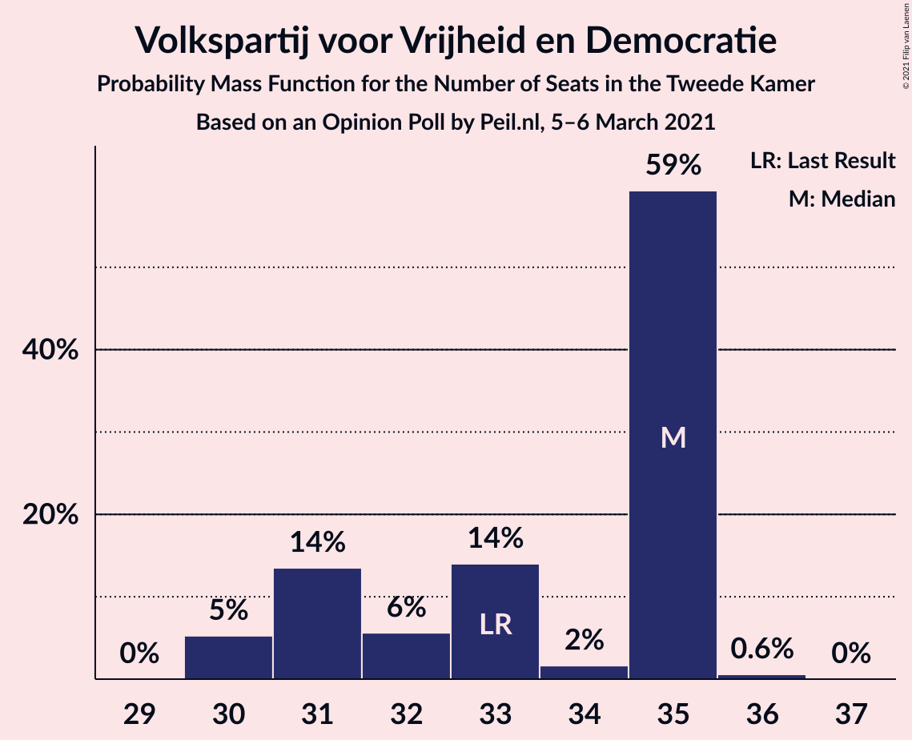

| Number of Seats | Probability | Accumulated | Special Marks |
|:---------------:|:-----------:|:-----------:|:-------------:|
| 30 | 5% | 100% |  |
| 31 | 14% | 95% |  |
| 32 | 6% | 81% |  |
| 33 | 14% | 76% | Last Result |
| 34 | 2% | 62% |  |
| 35 | 59% | 60% | Median |
| 36 | 0.6% | 0.6% |  |
| 37 | 0% | 0% |  |

### Partij voor de Vrijheid

*For a full overview of the results for this party, see the [Partij voor de Vrijheid](party-partijvoordevrijheid.html) page.*

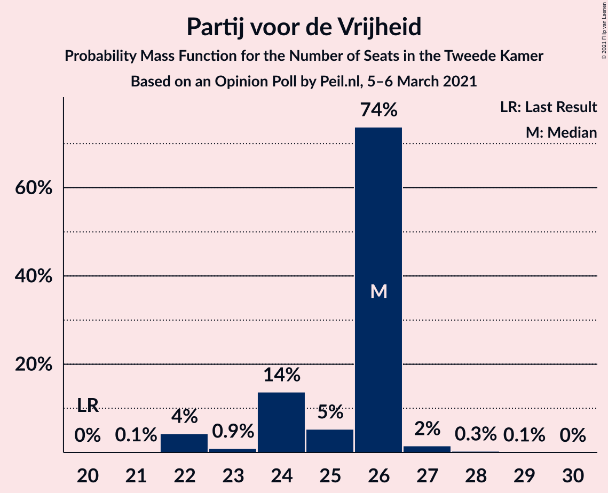

| Number of Seats | Probability | Accumulated | Special Marks |
|:---------------:|:-----------:|:-----------:|:-------------:|
| 20 | 0% | 100% | Last Result |
| 21 | 0.1% | 100% |  |
| 22 | 4% | 99.9% |  |
| 23 | 0.9% | 96% |  |
| 24 | 14% | 95% |  |
| 25 | 5% | 81% |  |
| 26 | 74% | 76% | Median |
| 27 | 2% | 2% |  |
| 28 | 0.3% | 0.4% |  |
| 29 | 0.1% | 0.1% |  |
| 30 | 0% | 0% |  |

### Christen-Democratisch Appèl

*For a full overview of the results for this party, see the [Christen-Democratisch Appèl](party-christen-democratischappèl.html) page.*

| Number of Seats | Probability | Accumulated | Special Marks |
|:---------------:|:-----------:|:-----------:|:-------------:|
| 15 | 0.5% | 100% |  |
| 16 | 69% | 99.5% | Median |
| 17 | 17% | 30% |  |
| 18 | 8% | 13% |  |
| 19 | 4% | 5% | Last Result |
| 20 | 0% | 0.5% |  |
| 21 | 0.4% | 0.4% |  |
| 22 | 0% | 0% |  |

### Democraten 66

*For a full overview of the results for this party, see the [Democraten 66](party-democraten66.html) page.*

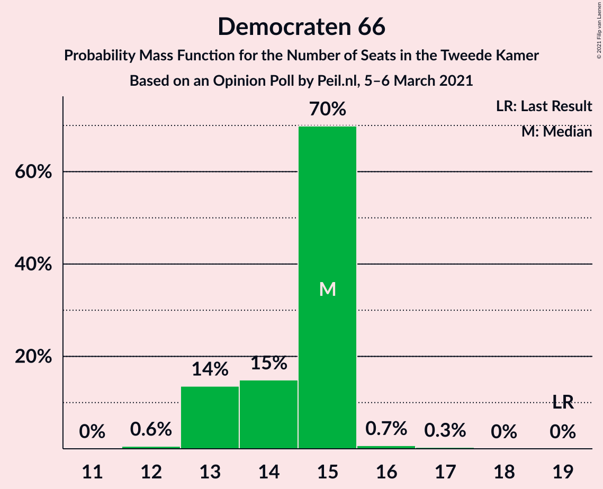

| Number of Seats | Probability | Accumulated | Special Marks |
|:---------------:|:-----------:|:-----------:|:-------------:|
| 12 | 0.6% | 100% |  |
| 13 | 14% | 99.4% |  |
| 14 | 15% | 86% |  |
| 15 | 70% | 71% | Median |
| 16 | 0.7% | 1.0% |  |
| 17 | 0.3% | 0.3% |  |
| 18 | 0% | 0% |  |
| 19 | 0% | 0% | Last Result |

### Partij van de Arbeid

*For a full overview of the results for this party, see the [Partij van de Arbeid](party-partijvandearbeid.html) page.*

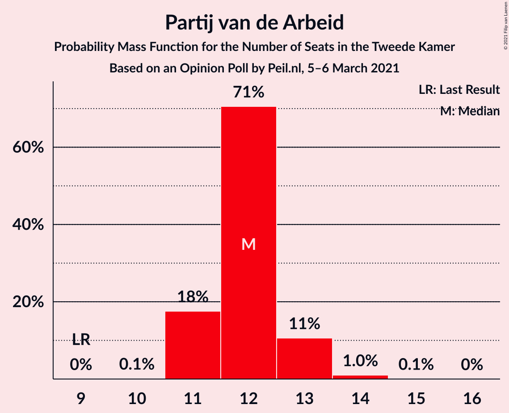

| Number of Seats | Probability | Accumulated | Special Marks |
|:---------------:|:-----------:|:-----------:|:-------------:|
| 9 | 0% | 100% | Last Result |
| 10 | 0.1% | 100% |  |
| 11 | 18% | 99.8% |  |
| 12 | 71% | 82% | Median |
| 13 | 11% | 12% |  |
| 14 | 1.0% | 1.1% |  |
| 15 | 0.1% | 0.1% |  |
| 16 | 0% | 0% |  |

### GroenLinks

*For a full overview of the results for this party, see the [GroenLinks](party-groenlinks.html) page.*

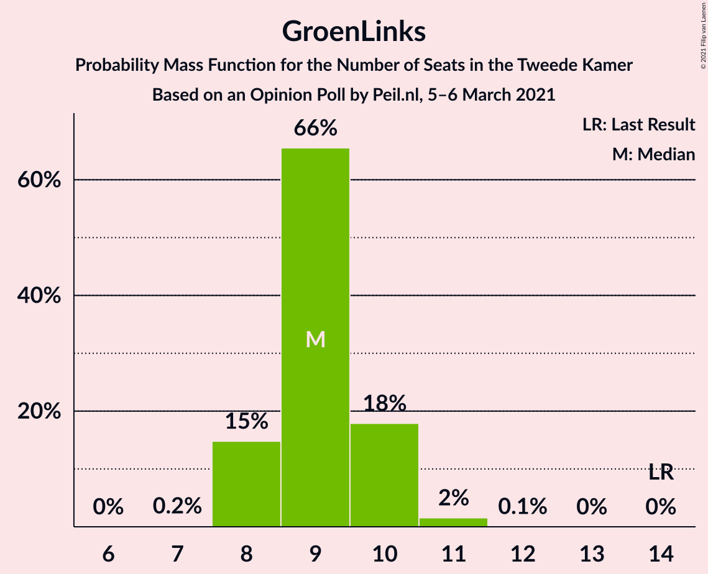

| Number of Seats | Probability | Accumulated | Special Marks |
|:---------------:|:-----------:|:-----------:|:-------------:|
| 7 | 0.2% | 100% |  |
| 8 | 15% | 99.8% |  |
| 9 | 66% | 85% | Median |
| 10 | 18% | 20% |  |
| 11 | 2% | 2% |  |
| 12 | 0.1% | 0.1% |  |
| 13 | 0% | 0% |  |
| 14 | 0% | 0% | Last Result |

### Socialistische Partij

*For a full overview of the results for this party, see the [Socialistische Partij](party-socialistischepartij.html) page.*

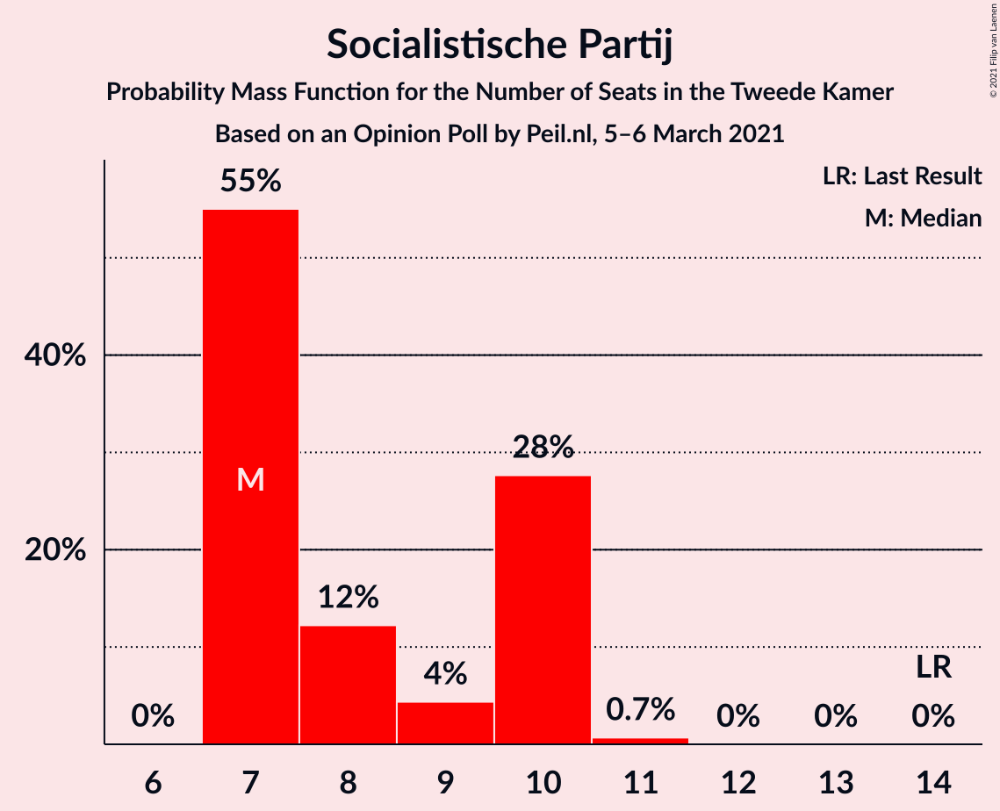

| Number of Seats | Probability | Accumulated | Special Marks |
|:---------------:|:-----------:|:-----------:|:-------------:|
| 7 | 55% | 100% | Median |
| 8 | 12% | 45% |  |
| 9 | 4% | 33% |  |
| 10 | 28% | 28% |  |
| 11 | 0.7% | 0.7% |  |
| 12 | 0% | 0% |  |
| 13 | 0% | 0% |  |
| 14 | 0% | 0% | Last Result |

### ChristenUnie

*For a full overview of the results for this party, see the [ChristenUnie](party-christenunie.html) page.*

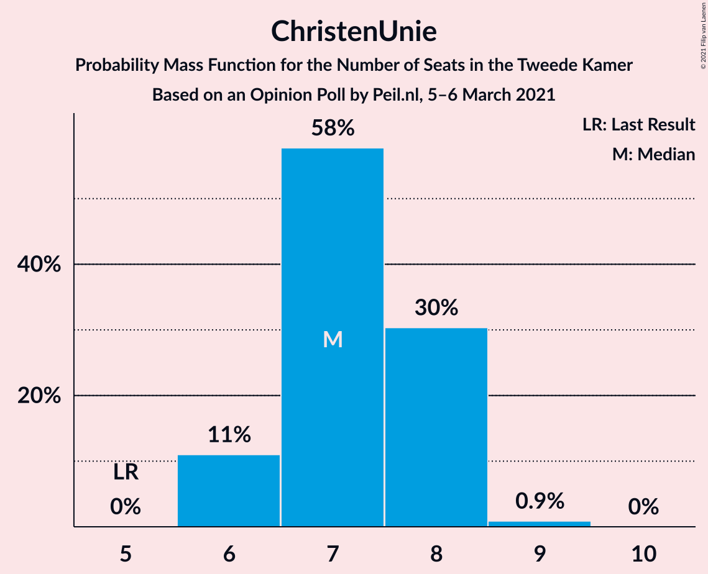

| Number of Seats | Probability | Accumulated | Special Marks |
|:---------------:|:-----------:|:-----------:|:-------------:|
| 5 | 0% | 100% | Last Result |
| 6 | 11% | 100% |  |
| 7 | 58% | 89% | Median |
| 8 | 30% | 31% |  |
| 9 | 0.9% | 0.9% |  |
| 10 | 0% | 0% |  |

### Partij voor de Dieren

*For a full overview of the results for this party, see the [Partij voor de Dieren](party-partijvoordedieren.html) page.*

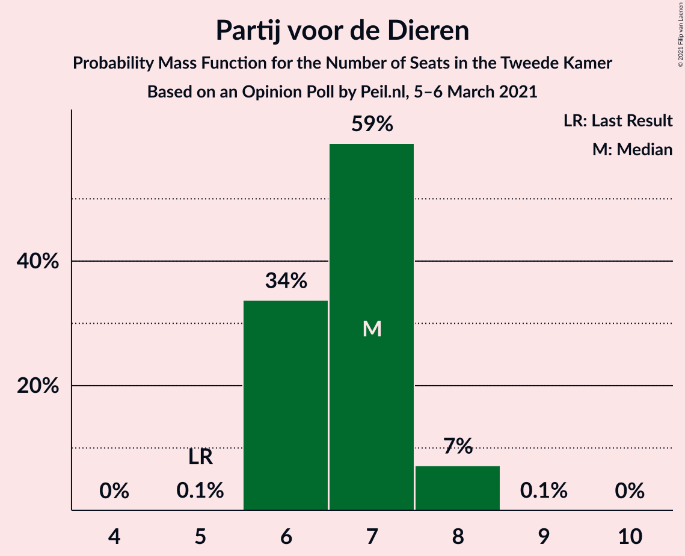

| Number of Seats | Probability | Accumulated | Special Marks |
|:---------------:|:-----------:|:-----------:|:-------------:|
| 5 | 0.1% | 100% | Last Result |
| 6 | 34% | 99.9% |  |
| 7 | 59% | 66% | Median |
| 8 | 7% | 7% |  |
| 9 | 0.1% | 0.1% |  |
| 10 | 0% | 0% |  |

### Forum voor Democratie

*For a full overview of the results for this party, see the [Forum voor Democratie](party-forumvoordemocratie.html) page.*

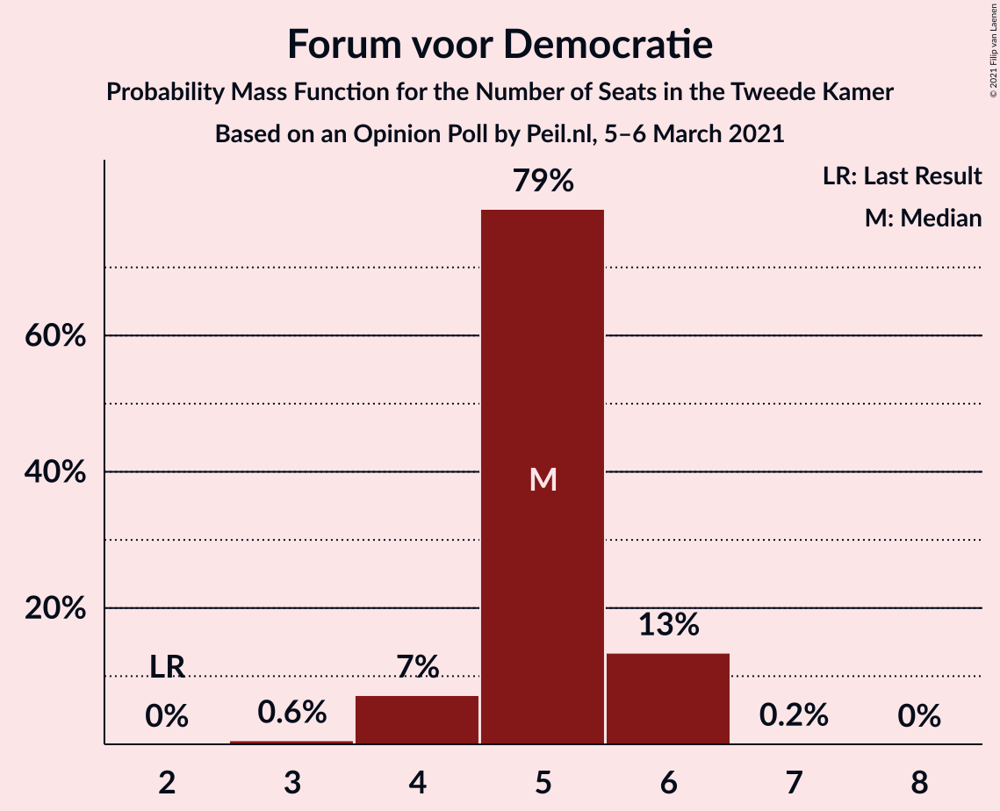

| Number of Seats | Probability | Accumulated | Special Marks |
|:---------------:|:-----------:|:-----------:|:-------------:|
| 2 | 0% | 100% | Last Result |
| 3 | 0.6% | 100% |  |
| 4 | 7% | 99.4% |  |
| 5 | 79% | 92% | Median |
| 6 | 13% | 14% |  |
| 7 | 0.2% | 0.2% |  |
| 8 | 0% | 0% |  |

### Staatkundig Gereformeerde Partij

*For a full overview of the results for this party, see the [Staatkundig Gereformeerde Partij](party-staatkundiggereformeerdepartij.html) page.*

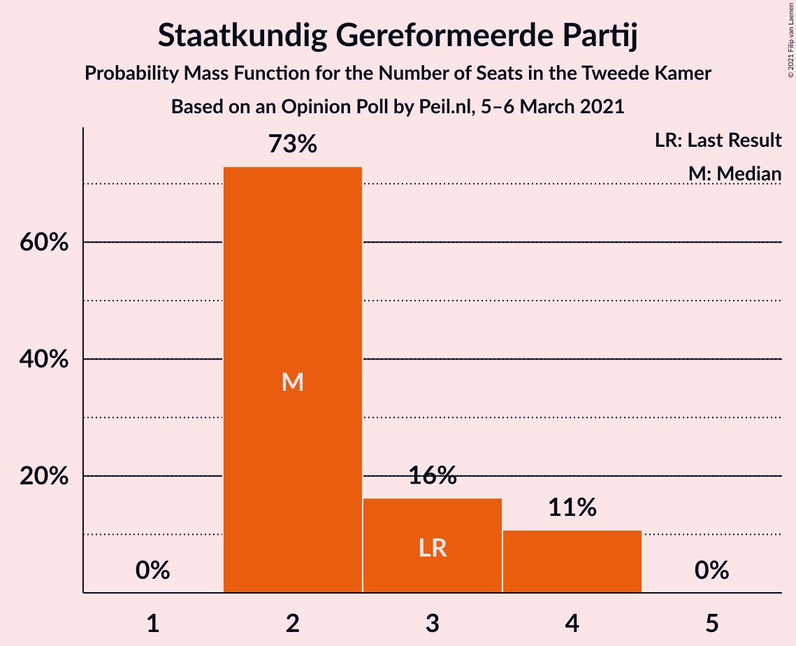

| Number of Seats | Probability | Accumulated | Special Marks |
|:---------------:|:-----------:|:-----------:|:-------------:|
| 2 | 73% | 100% | Median |
| 3 | 16% | 27% | Last Result |
| 4 | 11% | 11% |  |
| 5 | 0% | 0% |  |

### Juiste Antwoord 2021

*For a full overview of the results for this party, see the [Juiste Antwoord 2021](party-juisteantwoord2021.html) page.*

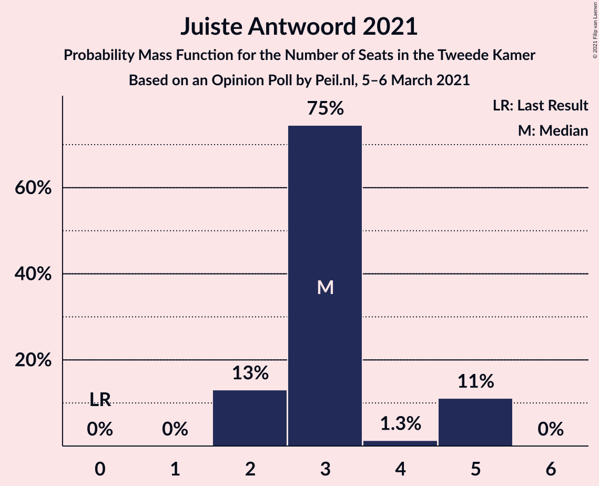

| Number of Seats | Probability | Accumulated | Special Marks |
|:---------------:|:-----------:|:-----------:|:-------------:|
| 0 | 0% | 100% | Last Result |
| 1 | 0% | 100% |  |
| 2 | 13% | 100% |  |
| 3 | 75% | 87% | Median |
| 4 | 1.3% | 12% |  |
| 5 | 11% | 11% |  |
| 6 | 0% | 0% |  |

### 50Plus

*For a full overview of the results for this party, see the [50Plus](party-50plus.html) page.*

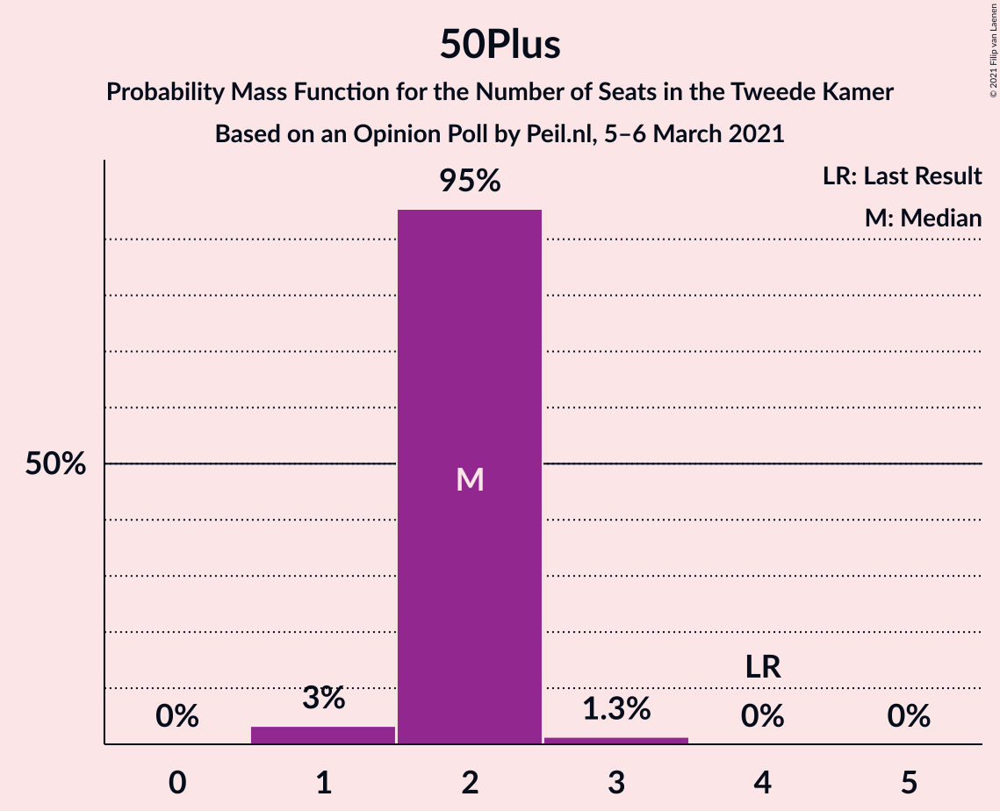

| Number of Seats | Probability | Accumulated | Special Marks |
|:---------------:|:-----------:|:-----------:|:-------------:|
| 1 | 3% | 100% |  |
| 2 | 95% | 97% | Median |
| 3 | 1.3% | 1.3% |  |
| 4 | 0% | 0% | Last Result |

### DENK

*For a full overview of the results for this party, see the [DENK](party-denk.html) page.*

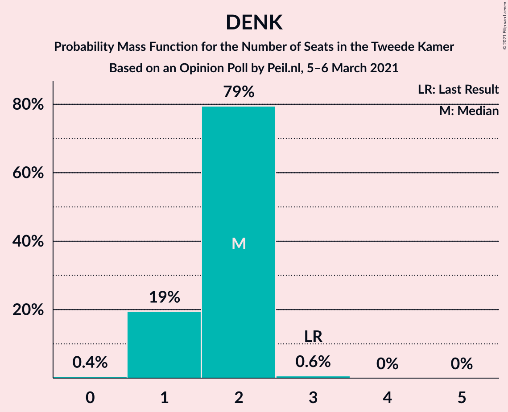

| Number of Seats | Probability | Accumulated | Special Marks |
|:---------------:|:-----------:|:-----------:|:-------------:|
| 0 | 0.4% | 100% |  |
| 1 | 19% | 99.6% |  |
| 2 | 79% | 80% | Median |
| 3 | 0.6% | 0.6% | Last Result |
| 4 | 0% | 0% |  |

### Volt Europa

*For a full overview of the results for this party, see the [Volt Europa](party-volteuropa.html) page.*

| Number of Seats | Probability | Accumulated | Special Marks |
|:---------------:|:-----------:|:-----------:|:-------------:|
| 0 | 0% | 100% | Last Result |
| 1 | 32% | 100% |  |
| 2 | 64% | 68% | Median |
| 3 | 4% | 4% |  |
| 4 | 0% | 0% |  |

### Bij1

*For a full overview of the results for this party, see the [Bij1](party-bij1.html) page.*

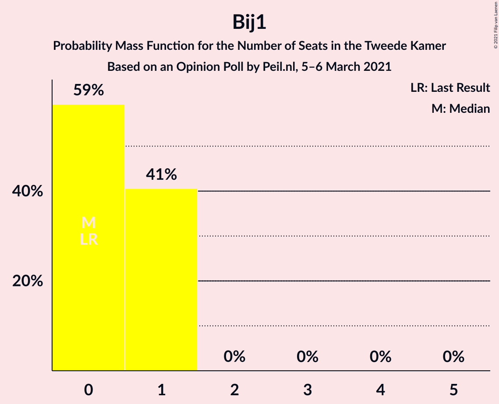

| Number of Seats | Probability | Accumulated | Special Marks |
|:---------------:|:-----------:|:-----------:|:-------------:|
| 0 | 59% | 100% | Last Result, Median |
| 1 | 41% | 41% |  |
| 2 | 0% | 0% |  |

### Code Oranje

*For a full overview of the results for this party, see the [Code Oranje](party-codeoranje.html) page.*

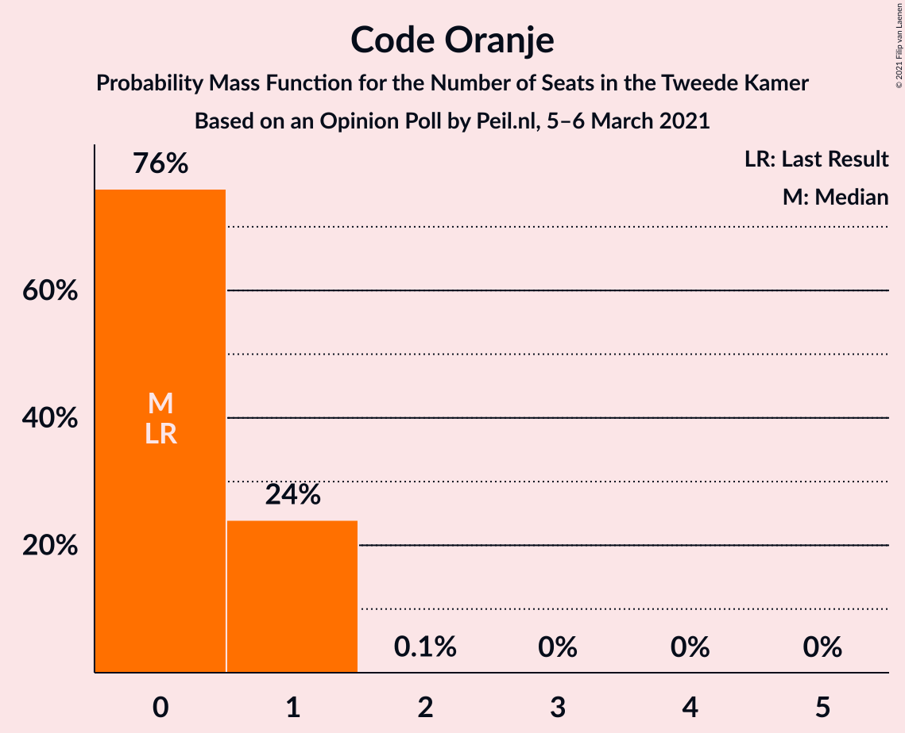

| Number of Seats | Probability | Accumulated | Special Marks |
|:---------------:|:-----------:|:-----------:|:-------------:|
| 0 | 76% | 100% | Last Result, Median |
| 1 | 24% | 24% |  |
| 2 | 0.1% | 0.1% |  |
| 3 | 0% | 0% |  |

## Coalitions

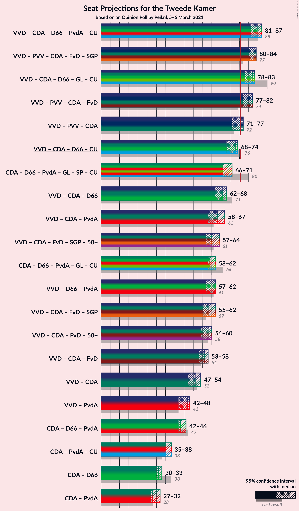

### Confidence Intervals

| Coalition | Last Result | Median | Majority? | 80% Confidence Interval | 90% Confidence Interval | 95% Confidence Interval | 99% Confidence Interval |
|:---------:|:-----------:|:------:|:---------:|:-----------------------:|:-----------------------:|:-----------------------:|:-----------------------:|
| Volkspartij voor Vrijheid en Democratie – Christen-Democratisch Appèl – Democraten 66 – Partij van de Arbeid – ChristenUnie | 85 | 85 | 100% | 81–85 | 81–86 | 81–87 | 79–87 |
| Volkspartij voor Vrijheid en Democratie – Partij voor de Vrijheid – Christen-Democratisch Appèl – Forum voor Democratie – Staatkundig Gereformeerde Partij | 77 | 84 | 100% | 80–84 | 80–84 | 80–84 | 80–88 |
| Volkspartij voor Vrijheid en Democratie – Christen-Democratisch Appèl – Democraten 66 – GroenLinks – ChristenUnie | 90 | 82 | 99.6% | 79–82 | 78–83 | 78–83 | 77–83 |
| Volkspartij voor Vrijheid en Democratie – Partij voor de Vrijheid – Christen-Democratisch Appèl – Forum voor Democratie | 74 | 82 | 100% | 77–82 | 77–82 | 77–82 | 77–84 |
| Volkspartij voor Vrijheid en Democratie – Partij voor de Vrijheid – Christen-Democratisch Appèl | 72 | 77 | 74% | 71–77 | 71–77 | 71–77 | 71–79 |
| Volkspartij voor Vrijheid en Democratie – Christen-Democratisch Appèl – Democraten 66 – ChristenUnie | 76 | 73 | 0.1% | 70–73 | 68–74 | 68–74 | 68–75 |
| Christen-Democratisch Appèl – Democraten 66 – Partij van de Arbeid – GroenLinks – Socialistische Partij – ChristenUnie | 80 | 66 | 0% | 66–70 | 66–70 | 66–71 | 64–72 |
| Volkspartij voor Vrijheid en Democratie – Christen-Democratisch Appèl – Democraten 66 | 71 | 66 | 0% | 62–66 | 62–67 | 62–68 | 60–68 |
| Volkspartij voor Vrijheid en Democratie – Christen-Democratisch Appèl – Partij van de Arbeid | 61 | 63 | 0% | 58–63 | 58–66 | 58–67 | 58–67 |
| Volkspartij voor Vrijheid en Democratie – Christen-Democratisch Appèl – Forum voor Democratie – Staatkundig Gereformeerde Partij – 50Plus | 61 | 60 | 0% | 58–60 | 58–62 | 57–64 | 56–64 |
| Christen-Democratisch Appèl – Democraten 66 – Partij van de Arbeid – GroenLinks – ChristenUnie | 66 | 59 | 0% | 58–61 | 58–61 | 58–62 | 56–63 |
| Volkspartij voor Vrijheid en Democratie – Democraten 66 – Partij van de Arbeid | 61 | 62 | 0% | 57–62 | 57–62 | 57–62 | 57–62 |
| Volkspartij voor Vrijheid en Democratie – Christen-Democratisch Appèl – Forum voor Democratie – Staatkundig Gereformeerde Partij | 57 | 58 | 0% | 56–58 | 56–61 | 55–62 | 54–62 |
| Volkspartij voor Vrijheid en Democratie – Christen-Democratisch Appèl – Forum voor Democratie – 50Plus | 58 | 58 | 0% | 55–58 | 55–59 | 54–60 | 53–60 |
| Volkspartij voor Vrijheid en Democratie – Christen-Democratisch Appèl – Forum voor Democratie | 54 | 56 | 0% | 53–56 | 53–57 | 53–58 | 51–58 |
| Volkspartij voor Vrijheid en Democratie – Christen-Democratisch Appèl | 52 | 51 | 0% | 47–51 | 47–53 | 47–54 | 46–54 |
| Volkspartij voor Vrijheid en Democratie – Partij van de Arbeid | 42 | 47 | 0% | 42–47 | 42–48 | 42–48 | 42–48 |
| Christen-Democratisch Appèl – Democraten 66 – Partij van de Arbeid | 47 | 43 | 0% | 42–45 | 42–46 | 42–46 | 41–47 |
| Christen-Democratisch Appèl – Partij van de Arbeid – ChristenUnie | 33 | 35 | 0% | 35–37 | 35–38 | 35–38 | 33–39 |
| Christen-Democratisch Appèl – Democraten 66 | 38 | 31 | 0% | 30–32 | 30–33 | 30–33 | 29–34 |
| Christen-Democratisch Appèl – Partij van de Arbeid | 28 | 28 | 0% | 27–31 | 27–32 | 27–32 | 27–33 |

### Volkspartij voor Vrijheid en Democratie – Christen-Democratisch Appèl – Democraten 66 – Partij van de Arbeid – ChristenUnie

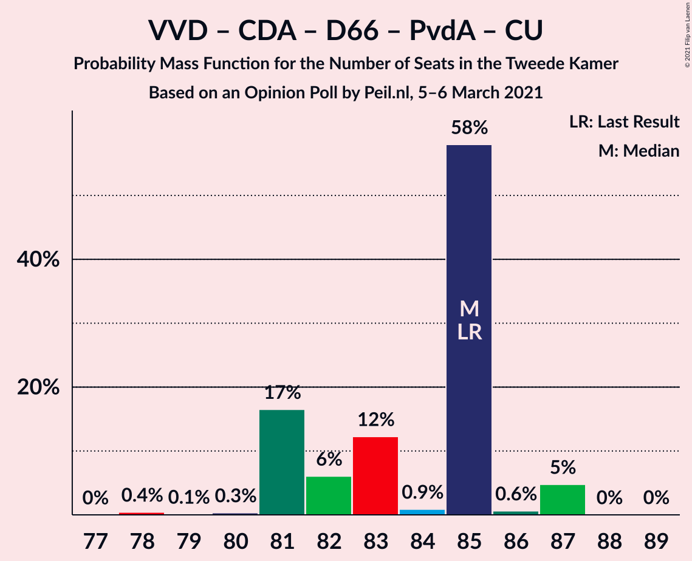

| Number of Seats | Probability | Accumulated | Special Marks |
|:---------------:|:-----------:|:-----------:|:-------------:|
| 78 | 0.4% | 100% |  |
| 79 | 0.1% | 99.6% |  |
| 80 | 0.3% | 99.5% |  |
| 81 | 17% | 99.1% |  |
| 82 | 6% | 83% |  |
| 83 | 12% | 77% |  |
| 84 | 0.9% | 64% |  |
| 85 | 58% | 63% | Last Result, Median |
| 86 | 0.6% | 5% |  |
| 87 | 5% | 5% |  |
| 88 | 0% | 0.1% |  |
| 89 | 0% | 0% |  |

### Volkspartij voor Vrijheid en Democratie – Partij voor de Vrijheid – Christen-Democratisch Appèl – Forum voor Democratie – Staatkundig Gereformeerde Partij

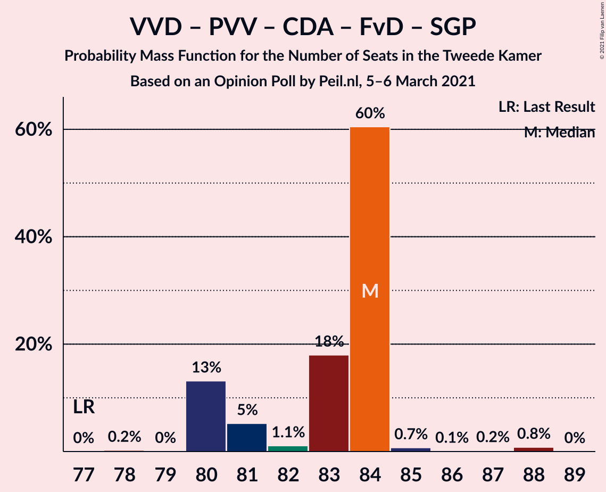

| Number of Seats | Probability | Accumulated | Special Marks |
|:---------------:|:-----------:|:-----------:|:-------------:|
| 77 | 0% | 100% | Last Result |
| 78 | 0.2% | 100% |  |
| 79 | 0% | 99.8% |  |
| 80 | 13% | 99.7% |  |
| 81 | 5% | 87% |  |
| 82 | 1.1% | 81% |  |
| 83 | 18% | 80% |  |
| 84 | 60% | 62% | Median |
| 85 | 0.7% | 2% |  |
| 86 | 0.1% | 1.1% |  |
| 87 | 0.2% | 1.0% |  |
| 88 | 0.8% | 0.8% |  |
| 89 | 0% | 0% |  |

### Volkspartij voor Vrijheid en Democratie – Christen-Democratisch Appèl – Democraten 66 – GroenLinks – ChristenUnie

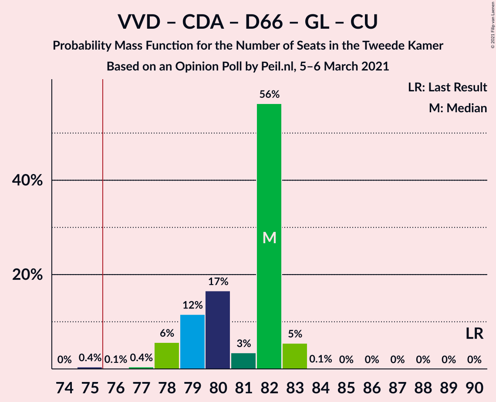

| Number of Seats | Probability | Accumulated | Special Marks |
|:---------------:|:-----------:|:-----------:|:-------------:|
| 75 | 0.4% | 100% |  |
| 76 | 0.1% | 99.6% | Majority |
| 77 | 0.4% | 99.5% |  |
| 78 | 6% | 99.1% |  |
| 79 | 12% | 93% |  |
| 80 | 17% | 82% |  |
| 81 | 3% | 65% |  |
| 82 | 56% | 62% | Median |
| 83 | 5% | 6% |  |
| 84 | 0.1% | 0.2% |  |
| 85 | 0% | 0% |  |
| 86 | 0% | 0% |  |
| 87 | 0% | 0% |  |
| 88 | 0% | 0% |  |
| 89 | 0% | 0% |  |
| 90 | 0% | 0% | Last Result |

### Volkspartij voor Vrijheid en Democratie – Partij voor de Vrijheid – Christen-Democratisch Appèl – Forum voor Democratie

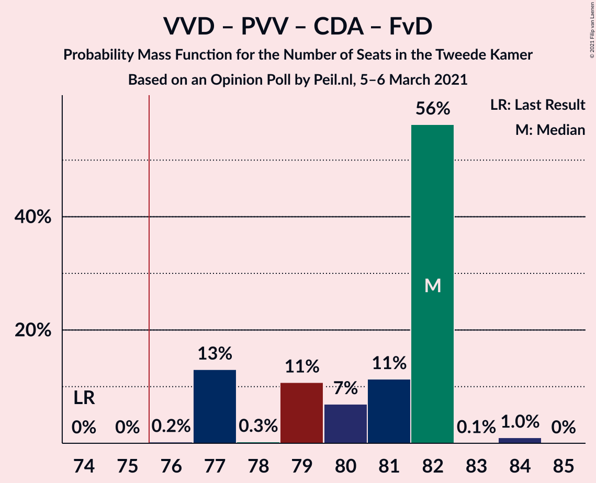

| Number of Seats | Probability | Accumulated | Special Marks |
|:---------------:|:-----------:|:-----------:|:-------------:|
| 74 | 0% | 100% | Last Result |
| 75 | 0% | 100% |  |
| 76 | 0.2% | 100% | Majority |
| 77 | 13% | 99.7% |  |
| 78 | 0.3% | 87% |  |
| 79 | 11% | 86% |  |
| 80 | 7% | 76% |  |
| 81 | 11% | 69% |  |
| 82 | 56% | 57% | Median |
| 83 | 0.1% | 1.1% |  |
| 84 | 1.0% | 1.0% |  |
| 85 | 0% | 0% |  |

### Volkspartij voor Vrijheid en Democratie – Partij voor de Vrijheid – Christen-Democratisch Appèl

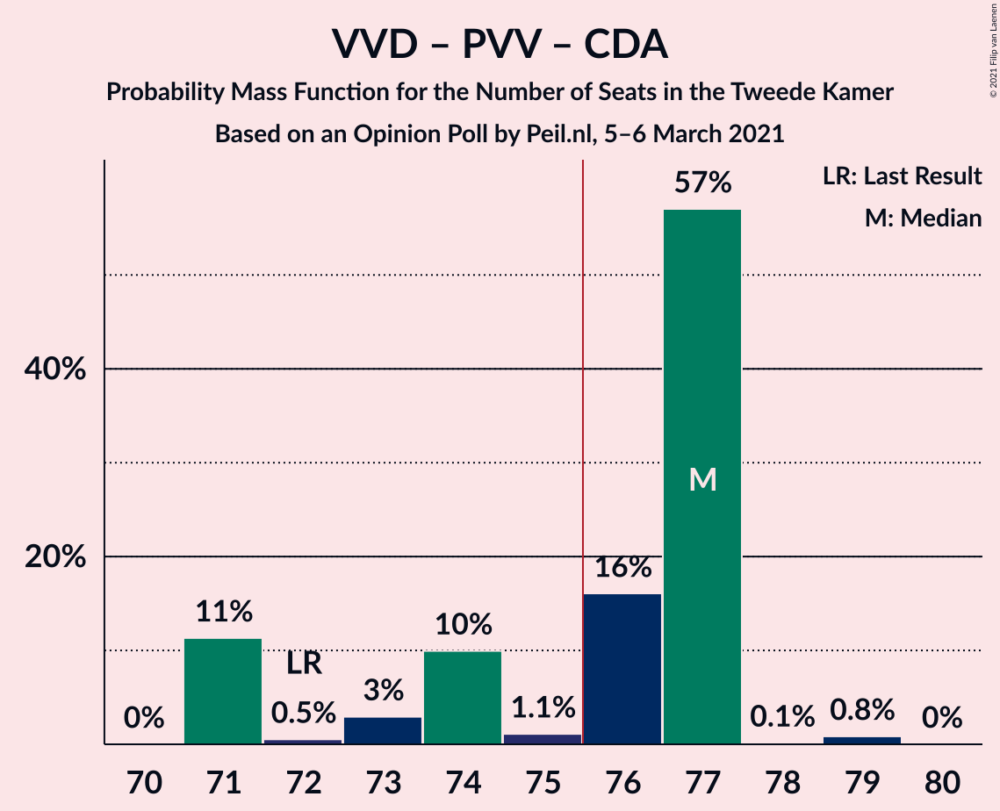

| Number of Seats | Probability | Accumulated | Special Marks |
|:---------------:|:-----------:|:-----------:|:-------------:|
| 71 | 11% | 100% |  |
| 72 | 0.5% | 89% | Last Result |
| 73 | 3% | 88% |  |
| 74 | 10% | 85% |  |
| 75 | 1.1% | 75% |  |
| 76 | 16% | 74% | Majority |
| 77 | 57% | 58% | Median |
| 78 | 0.1% | 1.0% |  |
| 79 | 0.8% | 0.9% |  |
| 80 | 0% | 0% |  |

### Volkspartij voor Vrijheid en Democratie – Christen-Democratisch Appèl – Democraten 66 – ChristenUnie

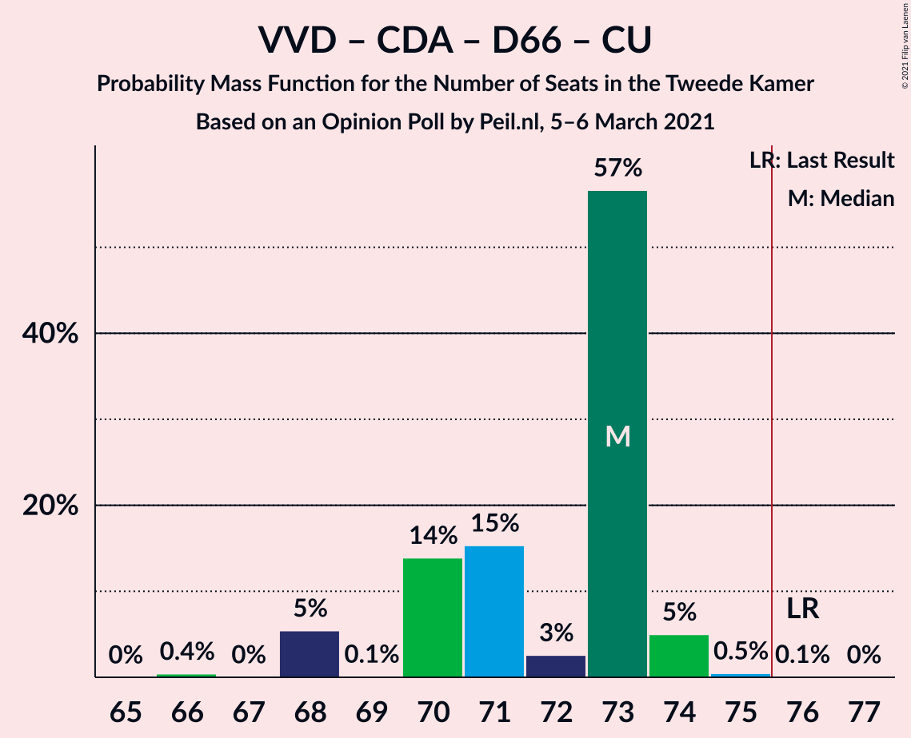

| Number of Seats | Probability | Accumulated | Special Marks |
|:---------------:|:-----------:|:-----------:|:-------------:|
| 66 | 0.4% | 100% |  |
| 67 | 0% | 99.6% |  |
| 68 | 5% | 99.6% |  |
| 69 | 0.1% | 94% |  |
| 70 | 14% | 94% |  |
| 71 | 15% | 80% |  |
| 72 | 3% | 65% |  |
| 73 | 57% | 62% | Median |
| 74 | 5% | 6% |  |
| 75 | 0.5% | 0.6% |  |
| 76 | 0.1% | 0.1% | Last Result, Majority |
| 77 | 0% | 0% |  |

### Christen-Democratisch Appèl – Democraten 66 – Partij van de Arbeid – GroenLinks – Socialistische Partij – ChristenUnie

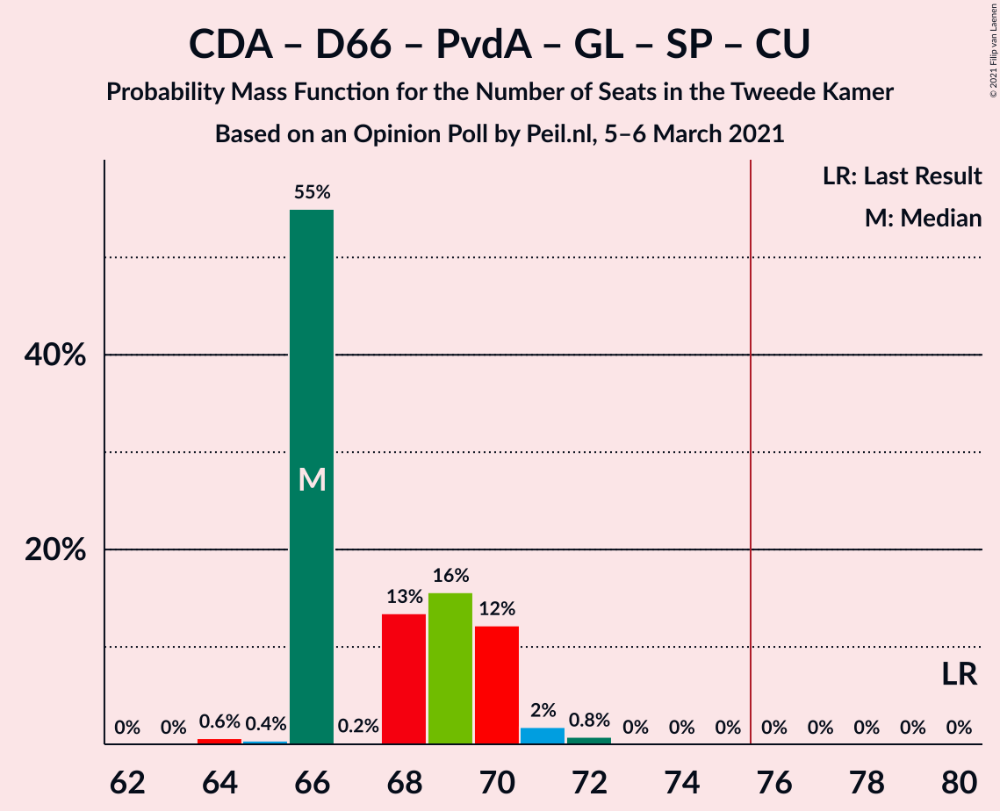

| Number of Seats | Probability | Accumulated | Special Marks |
|:---------------:|:-----------:|:-----------:|:-------------:|
| 64 | 0.6% | 100% |  |
| 65 | 0.4% | 99.4% |  |
| 66 | 55% | 99.0% | Median |
| 67 | 0.2% | 44% |  |
| 68 | 13% | 44% |  |
| 69 | 16% | 30% |  |
| 70 | 12% | 15% |  |
| 71 | 2% | 3% |  |
| 72 | 0.8% | 0.8% |  |
| 73 | 0% | 0% |  |
| 74 | 0% | 0% |  |
| 75 | 0% | 0% |  |
| 76 | 0% | 0% | Majority |
| 77 | 0% | 0% |  |
| 78 | 0% | 0% |  |
| 79 | 0% | 0% |  |
| 80 | 0% | 0% | Last Result |

### Volkspartij voor Vrijheid en Democratie – Christen-Democratisch Appèl – Democraten 66

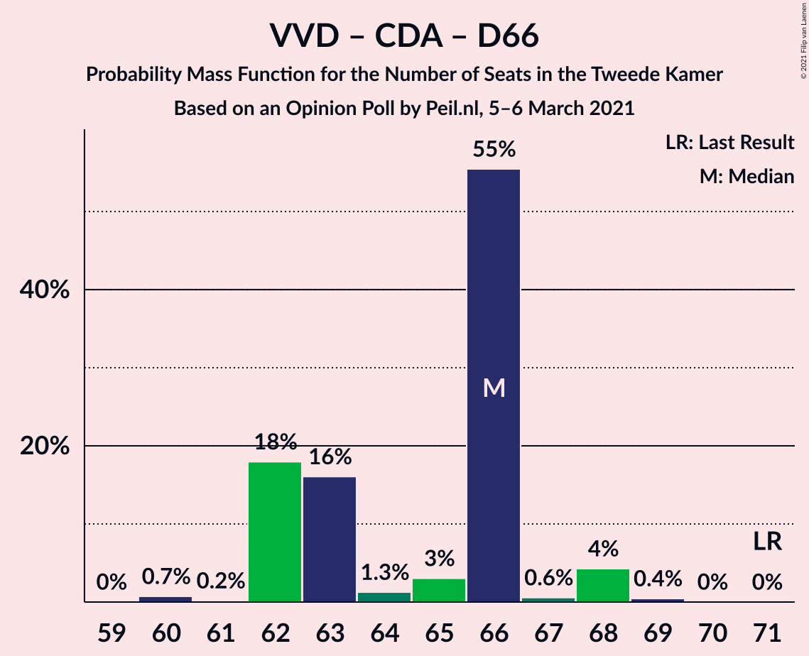

| Number of Seats | Probability | Accumulated | Special Marks |
|:---------------:|:-----------:|:-----------:|:-------------:|
| 60 | 0.7% | 100% |  |
| 61 | 0.2% | 99.3% |  |
| 62 | 18% | 99.1% |  |
| 63 | 16% | 81% |  |
| 64 | 1.3% | 65% |  |
| 65 | 3% | 64% |  |
| 66 | 55% | 61% | Median |
| 67 | 0.6% | 5% |  |
| 68 | 4% | 5% |  |
| 69 | 0.4% | 0.5% |  |
| 70 | 0% | 0% |  |
| 71 | 0% | 0% | Last Result |

### Volkspartij voor Vrijheid en Democratie – Christen-Democratisch Appèl – Partij van de Arbeid

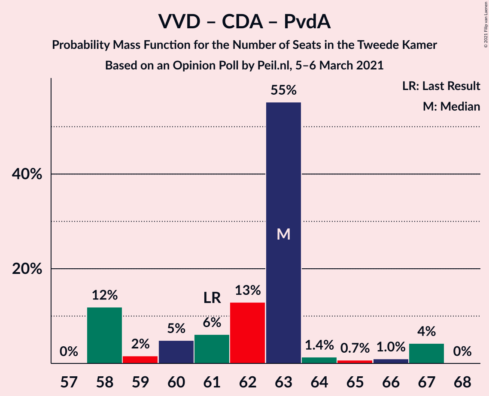

| Number of Seats | Probability | Accumulated | Special Marks |
|:---------------:|:-----------:|:-----------:|:-------------:|
| 58 | 12% | 100% |  |
| 59 | 2% | 88% |  |
| 60 | 5% | 86% |  |
| 61 | 6% | 82% | Last Result |
| 62 | 13% | 75% |  |
| 63 | 55% | 63% | Median |
| 64 | 1.4% | 7% |  |
| 65 | 0.7% | 6% |  |
| 66 | 1.0% | 5% |  |
| 67 | 4% | 4% |  |
| 68 | 0% | 0% |  |

### Volkspartij voor Vrijheid en Democratie – Christen-Democratisch Appèl – Forum voor Democratie – Staatkundig Gereformeerde Partij – 50Plus

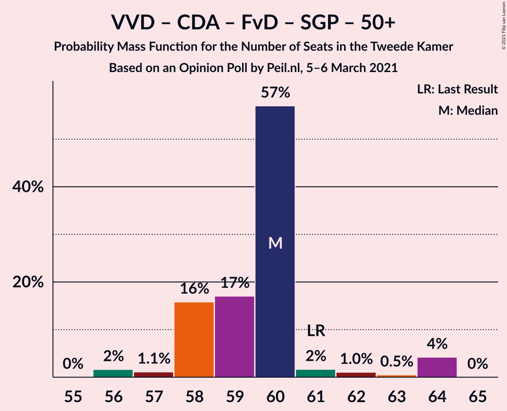

| Number of Seats | Probability | Accumulated | Special Marks |
|:---------------:|:-----------:|:-----------:|:-------------:|
| 56 | 2% | 100% |  |
| 57 | 1.1% | 98% |  |
| 58 | 16% | 97% |  |
| 59 | 17% | 81% |  |
| 60 | 57% | 64% | Median |
| 61 | 2% | 7% | Last Result |
| 62 | 1.0% | 6% |  |
| 63 | 0.5% | 5% |  |
| 64 | 4% | 4% |  |
| 65 | 0% | 0% |  |

### Christen-Democratisch Appèl – Democraten 66 – Partij van de Arbeid – GroenLinks – ChristenUnie

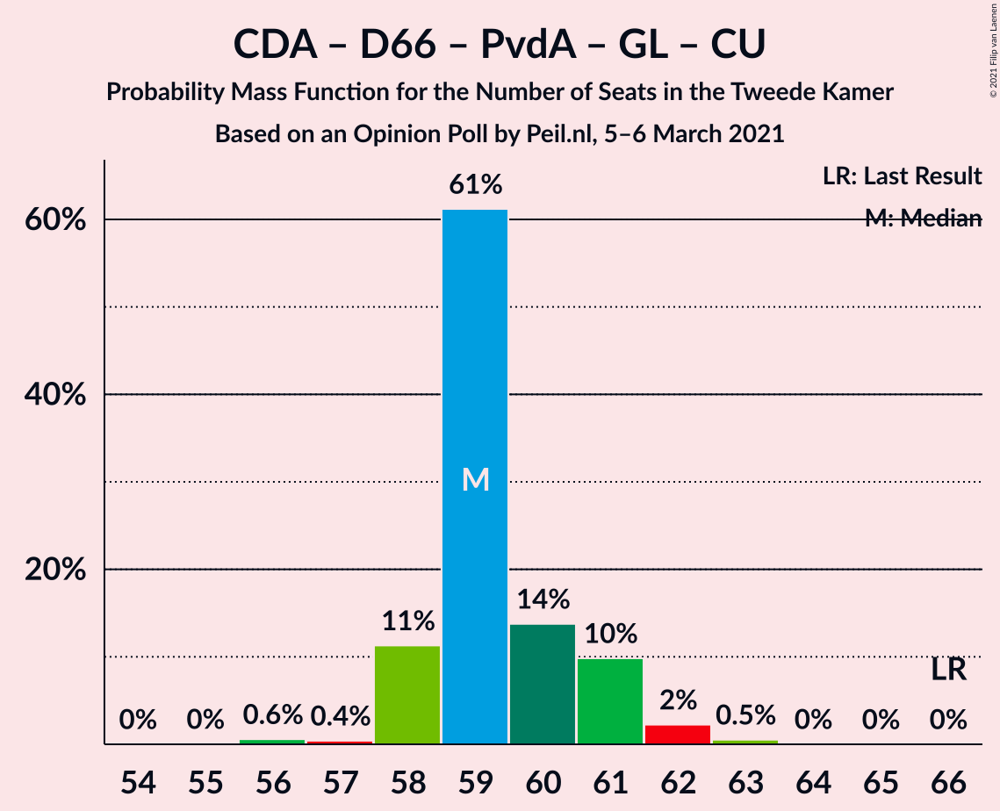

| Number of Seats | Probability | Accumulated | Special Marks |
|:---------------:|:-----------:|:-----------:|:-------------:|
| 54 | 0% | 100% |  |
| 55 | 0% | 99.9% |  |
| 56 | 0.6% | 99.9% |  |
| 57 | 0.4% | 99.3% |  |
| 58 | 11% | 98.9% |  |
| 59 | 61% | 88% | Median |
| 60 | 14% | 26% |  |
| 61 | 10% | 13% |  |
| 62 | 2% | 3% |  |
| 63 | 0.5% | 0.6% |  |
| 64 | 0% | 0% |  |
| 65 | 0% | 0% |  |
| 66 | 0% | 0% | Last Result |

### Volkspartij voor Vrijheid en Democratie – Democraten 66 – Partij van de Arbeid

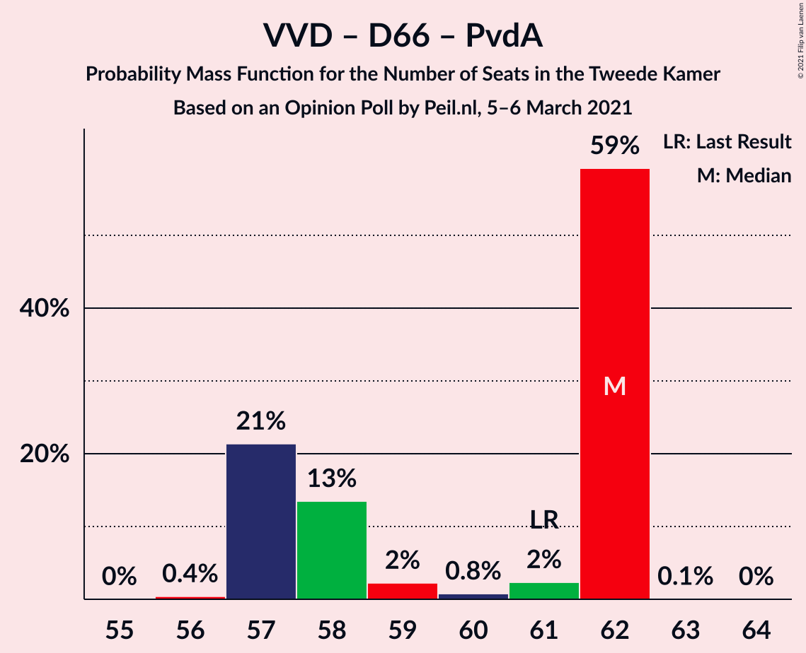

| Number of Seats | Probability | Accumulated | Special Marks |
|:---------------:|:-----------:|:-----------:|:-------------:|
| 56 | 0.4% | 100% |  |
| 57 | 21% | 99.6% |  |
| 58 | 13% | 78% |  |
| 59 | 2% | 65% |  |
| 60 | 0.8% | 62% |  |
| 61 | 2% | 62% | Last Result |
| 62 | 59% | 59% | Median |
| 63 | 0.1% | 0.1% |  |
| 64 | 0% | 0% |  |

### Volkspartij voor Vrijheid en Democratie – Christen-Democratisch Appèl – Forum voor Democratie – Staatkundig Gereformeerde Partij

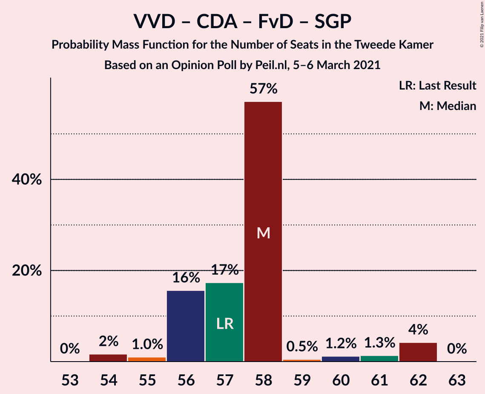

| Number of Seats | Probability | Accumulated | Special Marks |
|:---------------:|:-----------:|:-----------:|:-------------:|
| 54 | 2% | 100% |  |
| 55 | 1.0% | 98% |  |
| 56 | 16% | 97% |  |
| 57 | 17% | 82% | Last Result |
| 58 | 57% | 64% | Median |
| 59 | 0.5% | 7% |  |
| 60 | 1.2% | 7% |  |
| 61 | 1.3% | 6% |  |
| 62 | 4% | 4% |  |
| 63 | 0% | 0% |  |

### Volkspartij voor Vrijheid en Democratie – Christen-Democratisch Appèl – Forum voor Democratie – 50Plus

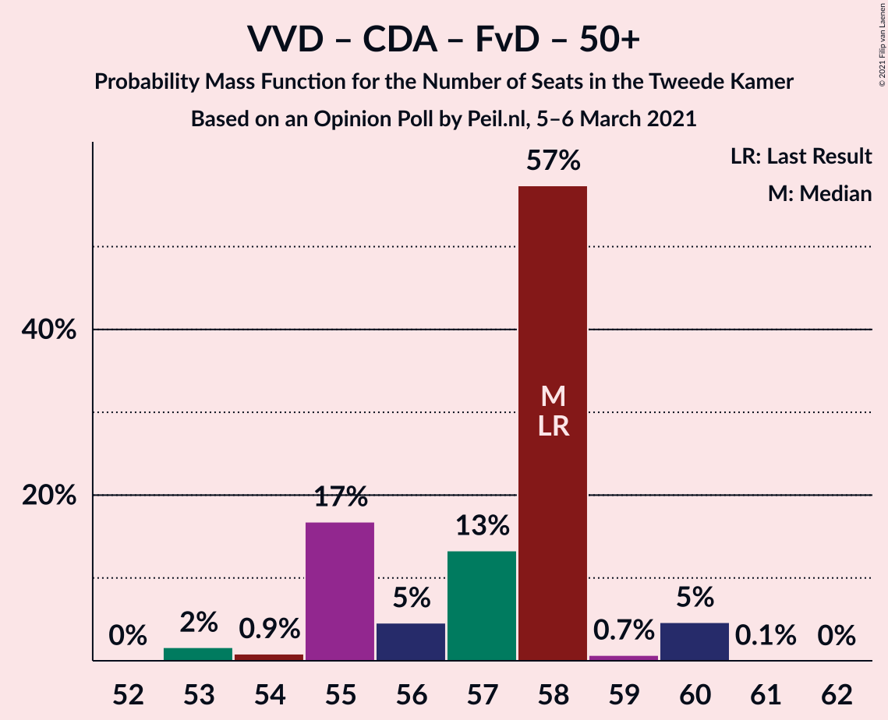

| Number of Seats | Probability | Accumulated | Special Marks |
|:---------------:|:-----------:|:-----------:|:-------------:|
| 53 | 2% | 100% |  |
| 54 | 0.9% | 98% |  |
| 55 | 17% | 97% |  |
| 56 | 5% | 81% |  |
| 57 | 13% | 76% |  |
| 58 | 57% | 63% | Last Result, Median |
| 59 | 0.7% | 5% |  |
| 60 | 5% | 5% |  |
| 61 | 0.1% | 0.1% |  |
| 62 | 0% | 0% |  |

### Volkspartij voor Vrijheid en Democratie – Christen-Democratisch Appèl – Forum voor Democratie

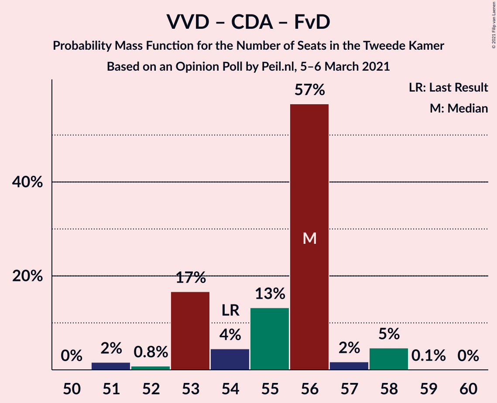

| Number of Seats | Probability | Accumulated | Special Marks |
|:---------------:|:-----------:|:-----------:|:-------------:|
| 51 | 2% | 100% |  |
| 52 | 0.8% | 98% |  |
| 53 | 17% | 98% |  |
| 54 | 4% | 81% | Last Result |
| 55 | 13% | 76% |  |
| 56 | 57% | 63% | Median |
| 57 | 2% | 6% |  |
| 58 | 5% | 5% |  |
| 59 | 0.1% | 0.1% |  |
| 60 | 0% | 0% |  |

### Volkspartij voor Vrijheid en Democratie – Christen-Democratisch Appèl

| Number of Seats | Probability | Accumulated | Special Marks |
|:---------------:|:-----------:|:-----------:|:-------------:|
| 46 | 0.5% | 100% |  |
| 47 | 13% | 99.5% |  |
| 48 | 6% | 87% |  |
| 49 | 5% | 81% |  |
| 50 | 13% | 75% |  |
| 51 | 56% | 63% | Median |
| 52 | 2% | 7% | Last Result |
| 53 | 0.5% | 5% |  |
| 54 | 5% | 5% |  |
| 55 | 0% | 0% |  |

### Volkspartij voor Vrijheid en Democratie – Partij van de Arbeid

| Number of Seats | Probability | Accumulated | Special Marks |
|:---------------:|:-----------:|:-----------:|:-------------:|
| 42 | 12% | 100% | Last Result |
| 43 | 11% | 88% |  |
| 44 | 3% | 77% |  |
| 45 | 12% | 74% |  |
| 46 | 2% | 63% |  |
| 47 | 55% | 61% | Median |
| 48 | 5% | 5% |  |
| 49 | 0.1% | 0.1% |  |
| 50 | 0% | 0% |  |

### Christen-Democratisch Appèl – Democraten 66 – Partij van de Arbeid

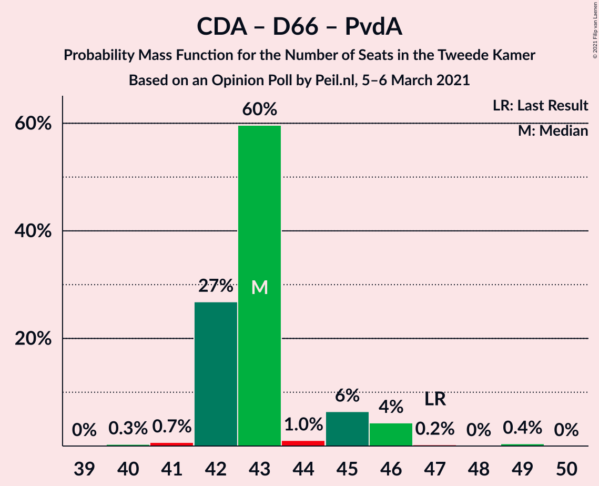

| Number of Seats | Probability | Accumulated | Special Marks |
|:---------------:|:-----------:|:-----------:|:-------------:|
| 39 | 0% | 100% |  |
| 40 | 0.3% | 99.9% |  |
| 41 | 0.7% | 99.6% |  |
| 42 | 27% | 98.9% |  |
| 43 | 60% | 72% | Median |
| 44 | 1.0% | 12% |  |
| 45 | 6% | 11% |  |
| 46 | 4% | 5% |  |
| 47 | 0.2% | 0.7% | Last Result |
| 48 | 0% | 0.4% |  |
| 49 | 0.4% | 0.4% |  |
| 50 | 0% | 0% |  |

### Christen-Democratisch Appèl – Partij van de Arbeid – ChristenUnie

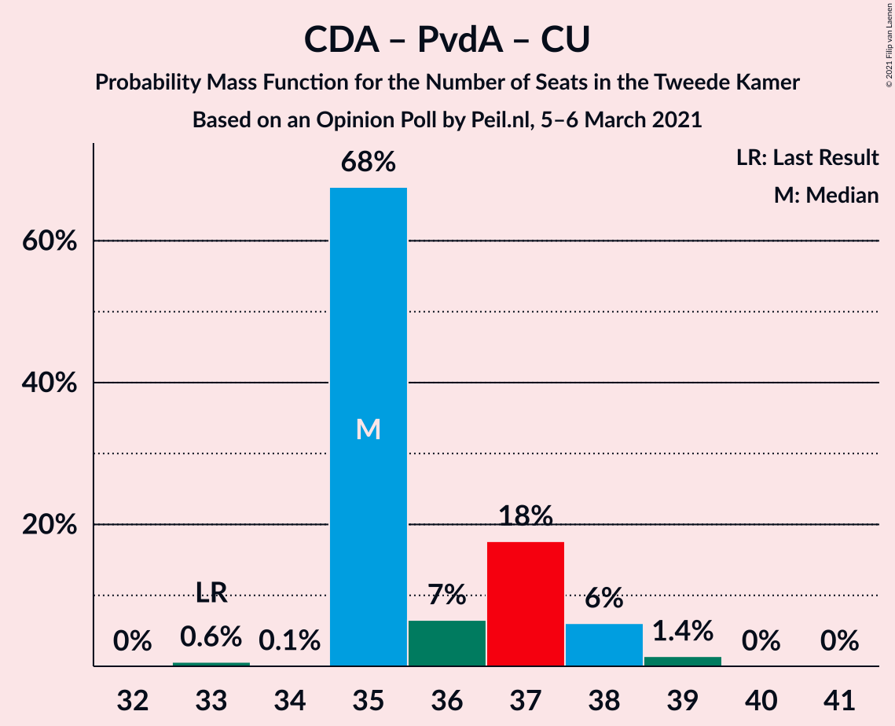

| Number of Seats | Probability | Accumulated | Special Marks |
|:---------------:|:-----------:|:-----------:|:-------------:|
| 33 | 0.6% | 100% | Last Result |
| 34 | 0.1% | 99.4% |  |
| 35 | 68% | 99.3% | Median |
| 36 | 7% | 32% |  |
| 37 | 18% | 25% |  |
| 38 | 6% | 8% |  |
| 39 | 1.4% | 1.5% |  |
| 40 | 0% | 0.1% |  |
| 41 | 0% | 0% |  |

### Christen-Democratisch Appèl – Democraten 66

| Number of Seats | Probability | Accumulated | Special Marks |
|:---------------:|:-----------:|:-----------:|:-------------:|
| 27 | 0% | 100% |  |
| 28 | 0.3% | 99.9% |  |
| 29 | 0.6% | 99.6% |  |
| 30 | 12% | 99.1% |  |
| 31 | 75% | 87% | Median |
| 32 | 7% | 12% |  |
| 33 | 5% | 5% |  |
| 34 | 0.3% | 0.8% |  |
| 35 | 0% | 0.5% |  |
| 36 | 0% | 0.4% |  |
| 37 | 0.4% | 0.4% |  |
| 38 | 0% | 0% | Last Result |

### Christen-Democratisch Appèl – Partij van de Arbeid

| Number of Seats | Probability | Accumulated | Special Marks |
|:---------------:|:-----------:|:-----------:|:-------------:|
| 26 | 0.1% | 100% |  |
| 27 | 12% | 99.8% |  |
| 28 | 62% | 88% | Last Result, Median |
| 29 | 13% | 26% |  |
| 30 | 2% | 13% |  |
| 31 | 5% | 11% |  |
| 32 | 5% | 6% |  |
| 33 | 0.5% | 0.5% |  |
| 34 | 0% | 0% |  |

## Technical Information

### Opinion Poll

+ **Polling firm:** Peil.nl
+ **Commissioner(s):** —
+ **Fieldwork period:** 5–6 March 2021

### Calculations

+ **Sample size:** 3000
+ **Simulations done:** 1,048,576
+ **Error estimate:** 2.44%

