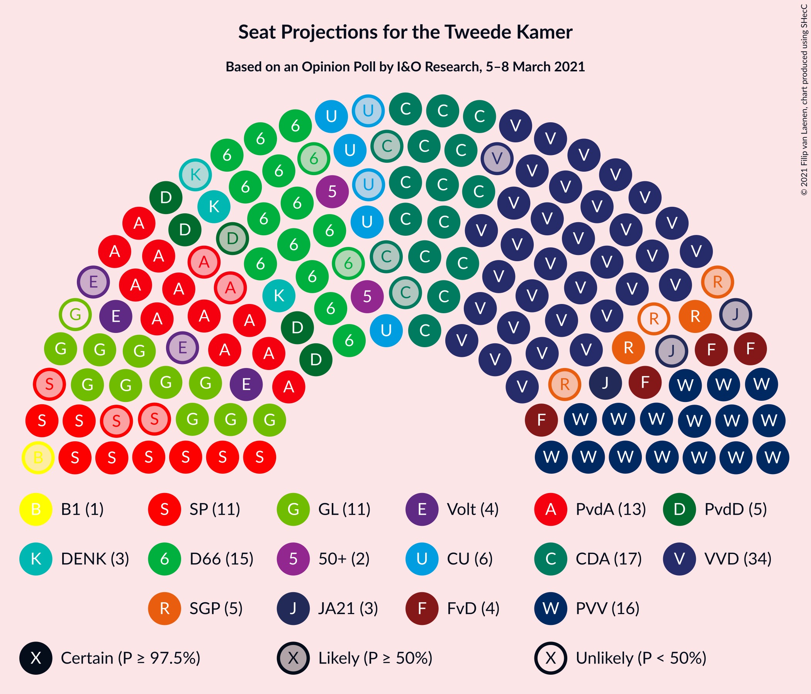
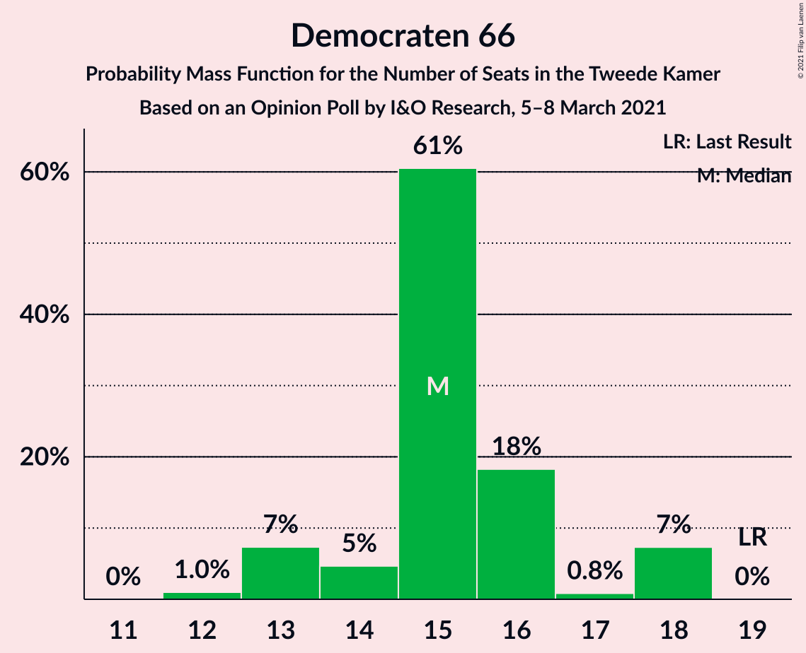
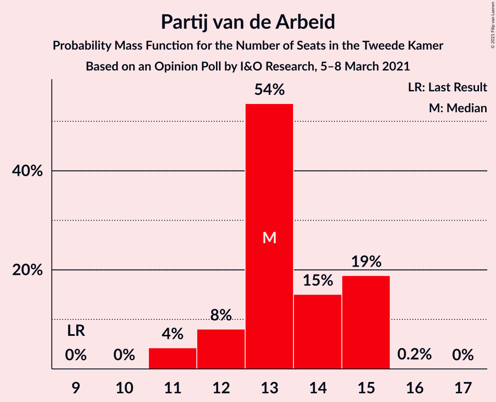
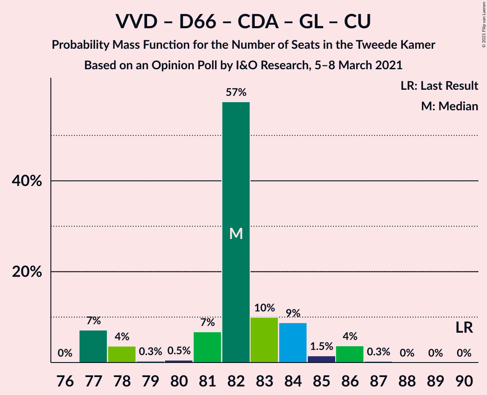
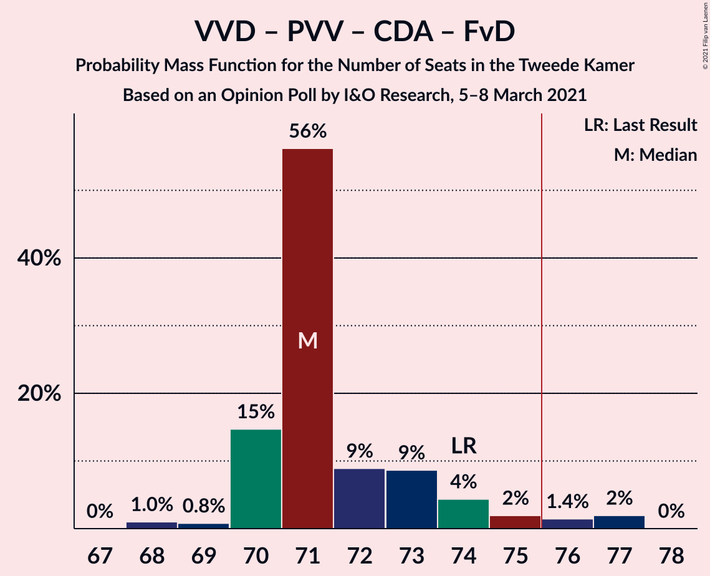
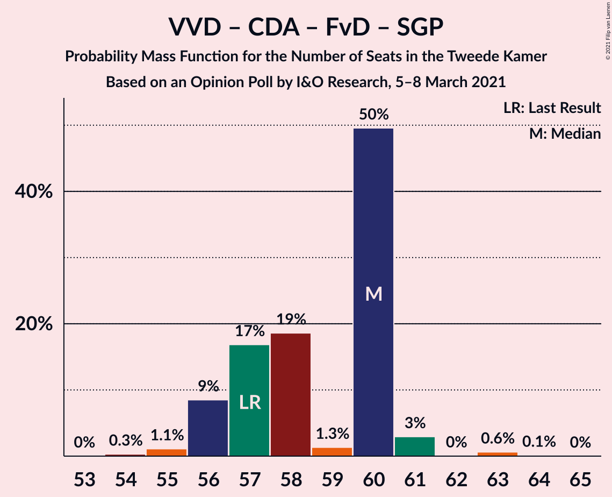

# Opinion Poll by I&O Research, 5–8 March 2021

<a href="#voting-intentions">Voting Intentions</a> | <a href="#seats">Seats</a> | <a href="#coalitions">Coalitions</a> | <a href="#technical-information">Technical Information</a>

## Voting Intentions

### Confidence Intervals

| Party | Last Result | Poll Result | 80% Confidence Interval | 90% Confidence Interval | 95% Confidence Interval | 99% Confidence Interval |
|:-----:|:-----------:|:-----------:|:-----------------------:|:-----------------------:|:-----------------------:|:-----------------------:|
| Volkspartij voor Vrijheid en Democratie | 21.3% | 22.7% | 21.6–23.8% |21.3–24.1% |21.1–24.3% |20.6–24.9% |
| Partij voor de Vrijheid | 13.1% | 11.9% | 11.1–12.7% |10.9–13.0% |10.7–13.2% |10.3–13.6% |
| Democraten 66 | 12.2% | 10.1% | 9.4–10.9% |9.2–11.1% |9.0–11.3% |8.6–11.7% |
| Christen-Democratisch Appèl | 12.4% | 10.0% | 9.3–10.8% |9.1–11.0% |8.9–11.2% |8.5–11.6% |
| Partij van de Arbeid | 5.7% | 8.6% | 7.9–9.3% |7.7–9.5% |7.5–9.7% |7.2–10.1% |
| GroenLinks | 9.1% | 7.4% | 6.8–8.1% |6.6–8.3% |6.4–8.5% |6.1–8.8% |
| Socialistische Partij | 9.1% | 6.5% | 5.9–7.1% |5.7–7.3% |5.6–7.5% |5.3–7.8% |
| ChristenUnie | 3.4% | 3.8% | 3.4–4.3% |3.2–4.5% |3.1–4.6% |2.9–4.9% |
| Partij voor de Dieren | 3.2% | 3.5% | 3.1–4.0% |2.9–4.2% |2.9–4.3% |2.7–4.5% |
| Forum voor Democratie | 1.8% | 2.9% | 2.5–3.4% |2.4–3.5% |2.3–3.6% |2.1–3.9% |
| Staatkundig Gereformeerde Partij | 2.1% | 2.5% | 2.1–2.9% |2.0–3.1% |2.0–3.2% |1.8–3.4% |
| Volt Europa | 0.0% | 2.3% | 2.0–2.7% |1.9–2.9% |1.8–3.0% |1.6–3.2% |
| DENK | 2.1% | 1.9% | 1.6–2.3% |1.5–2.4% |1.4–2.5% |1.3–2.7% |
| 50Plus | 3.1% | 1.8% | 1.5–2.2% |1.4–2.3% |1.3–2.4% |1.2–2.6% |
| Juiste Antwoord 2021 | 0.0% | 1.6% | 1.3–2.0% |1.2–2.1% |1.2–2.2% |1.1–2.3% |
| Bij1 | 0.3% | 0.7% | 0.5–1.0% |0.5–1.0% |0.4–1.1% |0.4–1.2% |
| Code Oranje | 0.0% | 0.4% | 0.3–0.6% |0.2–0.7% |0.2–0.7% |0.2–0.8% |
| Piratenpartij | 0.3% | 0.3% | 0.2–0.5% |0.2–0.6% |0.2–0.6% |0.1–0.7% |

*Note:* The poll result column reflects the actual value used in the calculations. Published results may vary slightly, and in addition be rounded to fewer digits.

## Seats

### Confidence Intervals

| Party | Last Result | Median | 80% Confidence Interval | 90% Confidence Interval | 95% Confidence Interval | 99% Confidence Interval |
|:-----:|:-----------:|:------:|:-----------------------:|:-----------------------:|:-----------------------:|:-----------------------:|
| <a href="#volkspartij-voor-vrijheid-en-democratie">Volkspartij voor Vrijheid en Democratie</a> | 33 | 34 | 34 |34 |34 |33–37 |
| <a href="#partij-voor-de-vrijheid">Partij voor de Vrijheid</a> | 20 | 18 | 18 |18 |18 |17–20 |
| <a href="#democraten-66">Democraten 66</a> | 19 | 16 | 16 |16 |15–16 |14–17 |
| <a href="#christen-democratisch-appèl">Christen-Democratisch Appèl</a> | 19 | 17 | 17 |17 |15–17 |14–17 |
| <a href="#partij-van-de-arbeid">Partij van de Arbeid</a> | 9 | 14 | 14 |14 |14 |13–14 |
| <a href="#groenlinks">GroenLinks</a> | 14 | 13 | 13 |13 |12–13 |11–13 |
| <a href="#socialistische-partij">Socialistische Partij</a> | 14 | 10 | 10 |10 |10 |9–11 |
| <a href="#christenunie">ChristenUnie</a> | 5 | 5 | 5 |5 |5 |4–6 |
| <a href="#partij-voor-de-dieren">Partij voor de Dieren</a> | 5 | 4 | 4 |4 |4–5 |4–6 |
| <a href="#forum-voor-democratie">Forum voor Democratie</a> | 2 | 4 | 4 |4 |4 |4–5 |
| <a href="#staatkundig-gereformeerde-partij">Staatkundig Gereformeerde Partij</a> | 3 | 4 | 4 |4 |4 |3–4 |
| <a href="#volt-europa">Volt Europa</a> | 0 | 3 | 3 |3 |3–4 |3–4 |
| <a href="#denk">DENK</a> | 3 | 2 | 2 |2 |2 |2–3 |
| <a href="#50plus">50Plus</a> | 4 | 2 | 2 |2 |2 |1–3 |
| <a href="#juiste-antwoord-2021">Juiste Antwoord 2021</a> | 0 | 1 | 1 |1 |1–2 |1–3 |
| <a href="#bij1">Bij1</a> | 0 | 1 | 1 |1 |1 |0–1 |
| <a href="#code-oranje">Code Oranje</a> | 0 | 0 | 0 |0 |0 |0–1 |
| <a href="#piratenpartij">Piratenpartij</a> | 0 | 0 | 0 |0 |0 |0 |

### Volkspartij voor Vrijheid en Democratie

*For a full overview of the results for this party, see the [Volkspartij voor Vrijheid en Democratie](party-volkspartijvoorvrijheidendemocratie.html) page.*

| Number of Seats | Probability | Accumulated | Special Marks |
|:---------------:|:-----------:|:-----------:|:-------------:|
| 31 | 0.1% | 100% |  |
| 32 | 0% | 99.9% |  |
| 33 | 0.4% | 99.9% | Last Result |
| 34 | 97% | 99.5% | Median |
| 35 | 0.4% | 2% |  |
| 36 | 0.2% | 2% |  |
| 37 | 1.3% | 1.4% |  |
| 38 | 0.1% | 0.1% |  |
| 39 | 0% | 0% |  |

### Partij voor de Vrijheid

*For a full overview of the results for this party, see the [Partij voor de Vrijheid](party-partijvoordevrijheid.html) page.*

| Number of Seats | Probability | Accumulated | Special Marks |
|:---------------:|:-----------:|:-----------:|:-------------:|
| 16 | 0.1% | 100% |  |
| 17 | 0.5% | 99.9% |  |
| 18 | 98% | 99.4% | Median |
| 19 | 0.1% | 2% |  |
| 20 | 1.4% | 2% | Last Result |
| 21 | 0.1% | 0.1% |  |
| 22 | 0% | 0% |  |

### Democraten 66

*For a full overview of the results for this party, see the [Democraten 66](party-democraten66.html) page.*

| Number of Seats | Probability | Accumulated | Special Marks |
|:---------------:|:-----------:|:-----------:|:-------------:|
| 13 | 0.1% | 100% |  |
| 14 | 1.1% | 99.9% |  |
| 15 | 2% | 98.8% |  |
| 16 | 96% | 97% | Median |
| 17 | 0.6% | 0.6% |  |
| 18 | 0% | 0% |  |
| 19 | 0% | 0% | Last Result |

### Christen-Democratisch Appèl

*For a full overview of the results for this party, see the [Christen-Democratisch Appèl](party-christen-democratischappèl.html) page.*

| Number of Seats | Probability | Accumulated | Special Marks |
|:---------------:|:-----------:|:-----------:|:-------------:|
| 14 | 0.7% | 100% |  |
| 15 | 2% | 99.3% |  |
| 16 | 0.4% | 97% |  |
| 17 | 97% | 97% | Median |
| 18 | 0.1% | 0.1% |  |
| 19 | 0% | 0% | Last Result |

### Partij van de Arbeid

*For a full overview of the results for this party, see the [Partij van de Arbeid](party-partijvandearbeid.html) page.*

| Number of Seats | Probability | Accumulated | Special Marks |
|:---------------:|:-----------:|:-----------:|:-------------:|
| 9 | 0% | 100% | Last Result |
| 10 | 0% | 100% |  |
| 11 | 0.1% | 100% |  |
| 12 | 0.2% | 99.9% |  |
| 13 | 1.4% | 99.7% |  |
| 14 | 98% | 98% | Median |
| 15 | 0.2% | 0.2% |  |
| 16 | 0% | 0% |  |

### GroenLinks

*For a full overview of the results for this party, see the [GroenLinks](party-groenlinks.html) page.*

| Number of Seats | Probability | Accumulated | Special Marks |
|:---------------:|:-----------:|:-----------:|:-------------:|
| 9 | 0.2% | 100% |  |
| 10 | 0.2% | 99.8% |  |
| 11 | 2% | 99.6% |  |
| 12 | 2% | 98% |  |
| 13 | 96% | 97% | Median |
| 14 | 0.3% | 0.3% | Last Result |
| 15 | 0% | 0% |  |

### Socialistische Partij

*For a full overview of the results for this party, see the [Socialistische Partij](party-socialistischepartij.html) page.*

| Number of Seats | Probability | Accumulated | Special Marks |
|:---------------:|:-----------:|:-----------:|:-------------:|
| 8 | 0.1% | 100% |  |
| 9 | 1.4% | 99.9% |  |
| 10 | 97% | 98% | Median |
| 11 | 1.0% | 1.1% |  |
| 12 | 0.1% | 0.1% |  |
| 13 | 0% | 0% |  |
| 14 | 0% | 0% | Last Result |

### ChristenUnie

*For a full overview of the results for this party, see the [ChristenUnie](party-christenunie.html) page.*

| Number of Seats | Probability | Accumulated | Special Marks |
|:---------------:|:-----------:|:-----------:|:-------------:|
| 4 | 2% | 100% |  |
| 5 | 96% | 98% | Last Result, Median |
| 6 | 1.1% | 1.4% |  |
| 7 | 0.3% | 0.3% |  |
| 8 | 0% | 0% |  |

### Partij voor de Dieren

*For a full overview of the results for this party, see the [Partij voor de Dieren](party-partijvoordedieren.html) page.*

| Number of Seats | Probability | Accumulated | Special Marks |
|:---------------:|:-----------:|:-----------:|:-------------:|
| 4 | 97% | 100% | Median |
| 5 | 2% | 3% | Last Result |
| 6 | 0.7% | 0.8% |  |
| 7 | 0.1% | 0.1% |  |
| 8 | 0% | 0% |  |

### Forum voor Democratie

*For a full overview of the results for this party, see the [Forum voor Democratie](party-forumvoordemocratie.html) page.*

| Number of Seats | Probability | Accumulated | Special Marks |
|:---------------:|:-----------:|:-----------:|:-------------:|
| 2 | 0% | 100% | Last Result |
| 3 | 0.5% | 100% |  |
| 4 | 98% | 99.5% | Median |
| 5 | 2% | 2% |  |
| 6 | 0.1% | 0.1% |  |
| 7 | 0% | 0% |  |

### Staatkundig Gereformeerde Partij

*For a full overview of the results for this party, see the [Staatkundig Gereformeerde Partij](party-staatkundiggereformeerdepartij.html) page.*

| Number of Seats | Probability | Accumulated | Special Marks |
|:---------------:|:-----------:|:-----------:|:-------------:|
| 2 | 0.1% | 100% |  |
| 3 | 1.4% | 99.9% | Last Result |
| 4 | 98% | 98.6% | Median |
| 5 | 0.1% | 0.1% |  |
| 6 | 0% | 0% |  |

### Volt Europa

*For a full overview of the results for this party, see the [Volt Europa](party-volteuropa.html) page.*

| Number of Seats | Probability | Accumulated | Special Marks |
|:---------------:|:-----------:|:-----------:|:-------------:|
| 0 | 0% | 100% | Last Result |
| 1 | 0% | 100% |  |
| 2 | 0.3% | 100% |  |
| 3 | 97% | 99.7% | Median |
| 4 | 3% | 3% |  |
| 5 | 0.2% | 0.2% |  |
| 6 | 0% | 0% |  |

### DENK

*For a full overview of the results for this party, see the [DENK](party-denk.html) page.*

| Number of Seats | Probability | Accumulated | Special Marks |
|:---------------:|:-----------:|:-----------:|:-------------:|
| 2 | 98% | 100% | Median |
| 3 | 2% | 2% | Last Result |
| 4 | 0.1% | 0.1% |  |
| 5 | 0% | 0% |  |

### 50Plus

*For a full overview of the results for this party, see the [50Plus](party-50plus.html) page.*

| Number of Seats | Probability | Accumulated | Special Marks |
|:---------------:|:-----------:|:-----------:|:-------------:|
| 1 | 0.6% | 100% |  |
| 2 | 98% | 99.4% | Median |
| 3 | 1.5% | 2% |  |
| 4 | 0.1% | 0.1% | Last Result |
| 5 | 0% | 0% |  |

### Juiste Antwoord 2021

*For a full overview of the results for this party, see the [Juiste Antwoord 2021](party-juisteantwoord2021.html) page.*

| Number of Seats | Probability | Accumulated | Special Marks |
|:---------------:|:-----------:|:-----------:|:-------------:|
| 0 | 0% | 100% | Last Result |
| 1 | 97% | 100% | Median |
| 2 | 1.1% | 3% |  |
| 3 | 2% | 2% |  |
| 4 | 0% | 0% |  |

### Bij1

*For a full overview of the results for this party, see the [Bij1](party-bij1.html) page.*

| Number of Seats | Probability | Accumulated | Special Marks |
|:---------------:|:-----------:|:-----------:|:-------------:|
| 0 | 2% | 100% | Last Result |
| 1 | 98% | 98% | Median |
| 2 | 0% | 0% |  |

### Code Oranje

*For a full overview of the results for this party, see the [Code Oranje](party-codeoranje.html) page.*

| Number of Seats | Probability | Accumulated | Special Marks |
|:---------------:|:-----------:|:-----------:|:-------------:|
| 0 | 98% | 100% | Last Result, Median |
| 1 | 2% | 2% |  |
| 2 | 0% | 0% |  |

### Piratenpartij

*For a full overview of the results for this party, see the [Piratenpartij](party-piratenpartij.html) page.*

| Number of Seats | Probability | Accumulated | Special Marks |
|:---------------:|:-----------:|:-----------:|:-------------:|
| 0 | 99.9% | 100% | Last Result, Median |
| 1 | 0.1% | 0.1% |  |
| 2 | 0% | 0% |  |

## Coalitions

### Confidence Intervals

| Coalition | Last Result | Median | Majority? | 80% Confidence Interval | 90% Confidence Interval | 95% Confidence Interval | 99% Confidence Interval |
|:---------:|:-----------:|:------:|:---------:|:-----------------------:|:-----------------------:|:-----------------------:|:-----------------------:|
| Volkspartij voor Vrijheid en Democratie – Democraten 66 – Christen-Democratisch Appèl – Partij van de Arbeid – ChristenUnie | 85 | 86 | 100% | 86 | 86 | 85–86 | 82–86 |
| Volkspartij voor Vrijheid en Democratie – Democraten 66 – Christen-Democratisch Appèl – GroenLinks – ChristenUnie | 90 | 85 | 100% | 85 | 85 | 83–85 | 80–85 |
| Volkspartij voor Vrijheid en Democratie – Partij voor de Vrijheid – Christen-Democratisch Appèl – Forum voor Democratie – Staatkundig Gereformeerde Partij | 77 | 77 | 99.4% | 77 | 77 | 77 | 75–79 |
| Democraten 66 – Christen-Democratisch Appèl – Partij van de Arbeid – GroenLinks – Socialistische Partij – ChristenUnie | 80 | 75 | 0.1% | 75 | 75 | 70–75 | 69–75 |
| Volkspartij voor Vrijheid en Democratie – Partij voor de Vrijheid – Christen-Democratisch Appèl – Forum voor Democratie | 74 | 73 | 0.8% | 73 | 73 | 73 | 72–76 |
| Volkspartij voor Vrijheid en Democratie – Democraten 66 – Christen-Democratisch Appèl – ChristenUnie | 76 | 72 | 0% | 72 | 72 | 72 | 68–72 |
| Volkspartij voor Vrijheid en Democratie – Partij voor de Vrijheid – Christen-Democratisch Appèl | 72 | 69 | 0% | 69 | 69 | 69 | 68–72 |
| Volkspartij voor Vrijheid en Democratie – Democraten 66 – Christen-Democratisch Appèl | 71 | 67 | 0% | 67 | 67 | 66–67 | 64–68 |
| Volkspartij voor Vrijheid en Democratie – Christen-Democratisch Appèl – Partij van de Arbeid | 61 | 65 | 0% | 65 | 65 | 65 | 62–67 |
| Democraten 66 – Christen-Democratisch Appèl – Partij van de Arbeid – GroenLinks – ChristenUnie | 66 | 65 | 0% | 65 | 65 | 60–65 | 59–65 |
| Volkspartij voor Vrijheid en Democratie – Democraten 66 – Partij van de Arbeid | 61 | 64 | 0% | 64 | 64 | 64 | 63–66 |
| Volkspartij voor Vrijheid en Democratie – Christen-Democratisch Appèl – Forum voor Democratie – Staatkundig Gereformeerde Partij – 50Plus | 61 | 61 | 0% | 61 | 61 | 61 | 60–64 |
| Volkspartij voor Vrijheid en Democratie – Christen-Democratisch Appèl – Forum voor Democratie – Staatkundig Gereformeerde Partij | 57 | 59 | 0% | 59 | 59 | 59 | 57–61 |
| Volkspartij voor Vrijheid en Democratie – Christen-Democratisch Appèl – Forum voor Democratie – 50Plus | 58 | 57 | 0% | 57 | 57 | 57 | 56–61 |
| Volkspartij voor Vrijheid en Democratie – Christen-Democratisch Appèl – Forum voor Democratie | 54 | 55 | 0% | 55 | 55 | 55 | 53–58 |
| Volkspartij voor Vrijheid en Democratie – Christen-Democratisch Appèl | 52 | 51 | 0% | 51 | 51 | 51 | 49–54 |
| Volkspartij voor Vrijheid en Democratie – Partij van de Arbeid | 42 | 48 | 0% | 48 | 48 | 48 | 47–51 |
| Democraten 66 – Christen-Democratisch Appèl – Partij van de Arbeid | 47 | 47 | 0% | 47 | 47 | 44–47 | 43–47 |
| Christen-Democratisch Appèl – Partij van de Arbeid – ChristenUnie | 33 | 36 | 0% | 36 | 36 | 34–36 | 32–36 |
| Democraten 66 – Christen-Democratisch Appèl | 38 | 33 | 0% | 33 | 33 | 31–33 | 29–33 |
| Christen-Democratisch Appèl – Partij van de Arbeid | 28 | 31 | 0% | 31 | 31 | 29–31 | 28–31 |

### Volkspartij voor Vrijheid en Democratie – Democraten 66 – Christen-Democratisch Appèl – Partij van de Arbeid – ChristenUnie

| Number of Seats | Probability | Accumulated | Special Marks |
|:---------------:|:-----------:|:-----------:|:-------------:|
| 81 | 0.1% | 100% |  |
| 82 | 2% | 99.9% |  |
| 83 | 0.1% | 98% |  |
| 84 | 0.2% | 98% |  |
| 85 | 1.3% | 98% | Last Result |
| 86 | 97% | 97% | Median |
| 87 | 0.1% | 0.2% |  |
| 88 | 0% | 0.1% |  |
| 89 | 0% | 0.1% |  |
| 90 | 0% | 0% |  |

### Volkspartij voor Vrijheid en Democratie – Democraten 66 – Christen-Democratisch Appèl – GroenLinks – ChristenUnie

| Number of Seats | Probability | Accumulated | Special Marks |
|:---------------:|:-----------:|:-----------:|:-------------:|
| 79 | 0.1% | 100% |  |
| 80 | 1.3% | 99.9% |  |
| 81 | 0.2% | 98.6% |  |
| 82 | 0.3% | 98% |  |
| 83 | 2% | 98% |  |
| 84 | 0.1% | 96% |  |
| 85 | 96% | 96% | Median |
| 86 | 0.1% | 0.1% |  |
| 87 | 0% | 0% |  |
| 88 | 0% | 0% |  |
| 89 | 0% | 0% |  |
| 90 | 0% | 0% | Last Result |

### Volkspartij voor Vrijheid en Democratie – Partij voor de Vrijheid – Christen-Democratisch Appèl – Forum voor Democratie – Staatkundig Gereformeerde Partij

| Number of Seats | Probability | Accumulated | Special Marks |
|:---------------:|:-----------:|:-----------:|:-------------:|
| 71 | 0.1% | 100% |  |
| 72 | 0% | 99.9% |  |
| 73 | 0.3% | 99.9% |  |
| 74 | 0.1% | 99.7% |  |
| 75 | 0.2% | 99.6% |  |
| 76 | 0.4% | 99.4% | Majority |
| 77 | 97% | 99.0% | Last Result, Median |
| 78 | 1.4% | 2% |  |
| 79 | 0.9% | 0.9% |  |
| 80 | 0% | 0.1% |  |
| 81 | 0% | 0% |  |

### Democraten 66 – Christen-Democratisch Appèl – Partij van de Arbeid – GroenLinks – Socialistische Partij – ChristenUnie

| Number of Seats | Probability | Accumulated | Special Marks |
|:---------------:|:-----------:|:-----------:|:-------------:|
| 67 | 0.1% | 100% |  |
| 68 | 0.1% | 99.9% |  |
| 69 | 1.3% | 99.8% |  |
| 70 | 1.3% | 98.5% |  |
| 71 | 0.2% | 97% |  |
| 72 | 0.5% | 97% |  |
| 73 | 0.3% | 96% |  |
| 74 | 0% | 96% |  |
| 75 | 96% | 96% | Median |
| 76 | 0.1% | 0.1% | Majority |
| 77 | 0% | 0% |  |
| 78 | 0% | 0% |  |
| 79 | 0% | 0% |  |
| 80 | 0% | 0% | Last Result |

### Volkspartij voor Vrijheid en Democratie – Partij voor de Vrijheid – Christen-Democratisch Appèl – Forum voor Democratie

| Number of Seats | Probability | Accumulated | Special Marks |
|:---------------:|:-----------:|:-----------:|:-------------:|
| 67 | 0.1% | 100% |  |
| 68 | 0% | 99.9% |  |
| 69 | 0% | 99.9% |  |
| 70 | 0.3% | 99.9% |  |
| 71 | 0.1% | 99.6% |  |
| 72 | 0.5% | 99.5% |  |
| 73 | 97% | 99.1% | Median |
| 74 | 1.4% | 2% | Last Result |
| 75 | 0.2% | 1.0% |  |
| 76 | 0.7% | 0.8% | Majority |
| 77 | 0% | 0.1% |  |
| 78 | 0% | 0% |  |

### Volkspartij voor Vrijheid en Democratie – Democraten 66 – Christen-Democratisch Appèl – ChristenUnie

| Number of Seats | Probability | Accumulated | Special Marks |
|:---------------:|:-----------:|:-----------:|:-------------:|
| 68 | 1.3% | 100% |  |
| 69 | 0.4% | 98.7% |  |
| 70 | 0.1% | 98% |  |
| 71 | 0.5% | 98% |  |
| 72 | 98% | 98% | Median |
| 73 | 0.1% | 0.2% |  |
| 74 | 0% | 0.2% |  |
| 75 | 0.1% | 0.1% |  |
| 76 | 0% | 0% | Last Result, Majority |

### Volkspartij voor Vrijheid en Democratie – Partij voor de Vrijheid – Christen-Democratisch Appèl

| Number of Seats | Probability | Accumulated | Special Marks |
|:---------------:|:-----------:|:-----------:|:-------------:|
| 64 | 0.1% | 100% |  |
| 65 | 0.3% | 99.9% |  |
| 66 | 0.1% | 99.7% |  |
| 67 | 0.1% | 99.6% |  |
| 68 | 0.3% | 99.5% |  |
| 69 | 98% | 99.3% | Median |
| 70 | 0.2% | 1.1% |  |
| 71 | 0.2% | 0.9% |  |
| 72 | 0.7% | 0.7% | Last Result |
| 73 | 0% | 0% |  |

### Volkspartij voor Vrijheid en Democratie – Democraten 66 – Christen-Democratisch Appèl

| Number of Seats | Probability | Accumulated | Special Marks |
|:---------------:|:-----------:|:-----------:|:-------------:|
| 62 | 0% | 100% |  |
| 63 | 0.1% | 99.9% |  |
| 64 | 1.3% | 99.9% |  |
| 65 | 0.8% | 98.5% |  |
| 66 | 0.6% | 98% |  |
| 67 | 96% | 97% | Median |
| 68 | 0.9% | 1.0% |  |
| 69 | 0.1% | 0.1% |  |
| 70 | 0% | 0% |  |
| 71 | 0% | 0% | Last Result |

### Volkspartij voor Vrijheid en Democratie – Christen-Democratisch Appèl – Partij van de Arbeid

| Number of Seats | Probability | Accumulated | Special Marks |
|:---------------:|:-----------:|:-----------:|:-------------:|
| 60 | 0.1% | 100% |  |
| 61 | 0.3% | 99.8% | Last Result |
| 62 | 0.1% | 99.6% |  |
| 63 | 1.3% | 99.4% |  |
| 64 | 0.4% | 98% |  |
| 65 | 97% | 98% | Median |
| 66 | 0.2% | 0.9% |  |
| 67 | 0.7% | 0.7% |  |
| 68 | 0% | 0% |  |

### Democraten 66 – Christen-Democratisch Appèl – Partij van de Arbeid – GroenLinks – ChristenUnie

| Number of Seats | Probability | Accumulated | Special Marks |
|:---------------:|:-----------:|:-----------:|:-------------:|
| 58 | 0.1% | 100% |  |
| 59 | 0.7% | 99.8% |  |
| 60 | 2% | 99.1% |  |
| 61 | 0.1% | 97% |  |
| 62 | 0.4% | 97% |  |
| 63 | 0.3% | 97% |  |
| 64 | 0.2% | 96% |  |
| 65 | 96% | 96% | Median |
| 66 | 0% | 0% | Last Result |

### Volkspartij voor Vrijheid en Democratie – Democraten 66 – Partij van de Arbeid

| Number of Seats | Probability | Accumulated | Special Marks |
|:---------------:|:-----------:|:-----------:|:-------------:|
| 61 | 0.3% | 100% | Last Result |
| 62 | 0.2% | 99.7% |  |
| 63 | 2% | 99.5% |  |
| 64 | 97% | 98% | Median |
| 65 | 0.1% | 0.9% |  |
| 66 | 0.7% | 0.8% |  |
| 67 | 0% | 0.1% |  |
| 68 | 0% | 0.1% |  |
| 69 | 0% | 0% |  |

### Volkspartij voor Vrijheid en Democratie – Christen-Democratisch Appèl – Forum voor Democratie – Staatkundig Gereformeerde Partij – 50Plus

| Number of Seats | Probability | Accumulated | Special Marks |
|:---------------:|:-----------:|:-----------:|:-------------:|
| 56 | 0.1% | 100% |  |
| 57 | 0% | 99.9% |  |
| 58 | 0% | 99.9% |  |
| 59 | 0.3% | 99.9% |  |
| 60 | 2% | 99.5% |  |
| 61 | 97% | 98% | Last Result, Median |
| 62 | 0.1% | 1.0% |  |
| 63 | 0.1% | 0.9% |  |
| 64 | 0.8% | 0.8% |  |
| 65 | 0% | 0% |  |

### Volkspartij voor Vrijheid en Democratie – Christen-Democratisch Appèl – Forum voor Democratie – Staatkundig Gereformeerde Partij

| Number of Seats | Probability | Accumulated | Special Marks |
|:---------------:|:-----------:|:-----------:|:-------------:|
| 54 | 0.1% | 100% |  |
| 55 | 0% | 99.9% |  |
| 56 | 0.3% | 99.9% |  |
| 57 | 0.3% | 99.6% | Last Result |
| 58 | 2% | 99.3% |  |
| 59 | 97% | 98% | Median |
| 60 | 0.2% | 1.0% |  |
| 61 | 0.8% | 0.8% |  |
| 62 | 0% | 0% |  |

### Volkspartij voor Vrijheid en Democratie – Christen-Democratisch Appèl – Forum voor Democratie – 50Plus

| Number of Seats | Probability | Accumulated | Special Marks |
|:---------------:|:-----------:|:-----------:|:-------------:|
| 52 | 0.1% | 100% |  |
| 53 | 0% | 99.9% |  |
| 54 | 0% | 99.9% |  |
| 55 | 0.1% | 99.8% |  |
| 56 | 2% | 99.8% |  |
| 57 | 97% | 98% | Median |
| 58 | 0.2% | 1.1% | Last Result |
| 59 | 0% | 0.9% |  |
| 60 | 0.1% | 0.8% |  |
| 61 | 0.7% | 0.8% |  |
| 62 | 0% | 0% |  |

### Volkspartij voor Vrijheid en Democratie – Christen-Democratisch Appèl – Forum voor Democratie

| Number of Seats | Probability | Accumulated | Special Marks |
|:---------------:|:-----------:|:-----------:|:-------------:|
| 50 | 0.1% | 100% |  |
| 51 | 0% | 99.9% |  |
| 52 | 0.1% | 99.9% |  |
| 53 | 0.3% | 99.8% |  |
| 54 | 2% | 99.5% | Last Result |
| 55 | 97% | 98% | Median |
| 56 | 0.2% | 1.1% |  |
| 57 | 0.1% | 0.9% |  |
| 58 | 0.7% | 0.8% |  |
| 59 | 0% | 0.1% |  |
| 60 | 0% | 0% |  |

### Volkspartij voor Vrijheid en Democratie – Christen-Democratisch Appèl

| Number of Seats | Probability | Accumulated | Special Marks |
|:---------------:|:-----------:|:-----------:|:-------------:|
| 47 | 0.1% | 100% |  |
| 48 | 0.4% | 99.9% |  |
| 49 | 1.3% | 99.5% |  |
| 50 | 0.1% | 98% |  |
| 51 | 97% | 98% | Median |
| 52 | 0.1% | 0.9% | Last Result |
| 53 | 0.1% | 0.8% |  |
| 54 | 0.7% | 0.7% |  |
| 55 | 0% | 0% |  |

### Volkspartij voor Vrijheid en Democratie – Partij van de Arbeid

| Number of Seats | Probability | Accumulated | Special Marks |
|:---------------:|:-----------:|:-----------:|:-------------:|
| 42 | 0% | 100% | Last Result |
| 43 | 0% | 100% |  |
| 44 | 0.1% | 100% |  |
| 45 | 0.1% | 99.9% |  |
| 46 | 0.3% | 99.8% |  |
| 47 | 0.3% | 99.5% |  |
| 48 | 97% | 99.2% | Median |
| 49 | 0.4% | 2% |  |
| 50 | 0.8% | 1.5% |  |
| 51 | 0.5% | 0.6% |  |
| 52 | 0.1% | 0.2% |  |
| 53 | 0% | 0% |  |

### Democraten 66 – Christen-Democratisch Appèl – Partij van de Arbeid

| Number of Seats | Probability | Accumulated | Special Marks |
|:---------------:|:-----------:|:-----------:|:-------------:|
| 41 | 0.1% | 100% |  |
| 42 | 0.1% | 99.9% |  |
| 43 | 0.7% | 99.8% |  |
| 44 | 2% | 99.1% |  |
| 45 | 0.7% | 97% |  |
| 46 | 0.2% | 96% |  |
| 47 | 96% | 96% | Last Result, Median |
| 48 | 0% | 0% |  |

### Christen-Democratisch Appèl – Partij van de Arbeid – ChristenUnie

| Number of Seats | Probability | Accumulated | Special Marks |
|:---------------:|:-----------:|:-----------:|:-------------:|
| 32 | 0.5% | 100% |  |
| 33 | 1.4% | 99.5% | Last Result |
| 34 | 1.3% | 98% |  |
| 35 | 0.2% | 97% |  |
| 36 | 97% | 97% | Median |
| 37 | 0% | 0.1% |  |
| 38 | 0.1% | 0.1% |  |
| 39 | 0% | 0% |  |

### Democraten 66 – Christen-Democratisch Appèl

| Number of Seats | Probability | Accumulated | Special Marks |
|:---------------:|:-----------:|:-----------:|:-------------:|
| 28 | 0.2% | 100% |  |
| 29 | 0.6% | 99.8% |  |
| 30 | 2% | 99.3% |  |
| 31 | 0.9% | 98% |  |
| 32 | 0.7% | 97% |  |
| 33 | 96% | 96% | Median |
| 34 | 0% | 0% |  |
| 35 | 0% | 0% |  |
| 36 | 0% | 0% |  |
| 37 | 0% | 0% |  |
| 38 | 0% | 0% | Last Result |

### Christen-Democratisch Appèl – Partij van de Arbeid

| Number of Seats | Probability | Accumulated | Special Marks |
|:---------------:|:-----------:|:-----------:|:-------------:|
| 26 | 0.1% | 100% |  |
| 27 | 0.2% | 99.9% |  |
| 28 | 1.0% | 99.7% | Last Result |
| 29 | 2% | 98.8% |  |
| 30 | 1.1% | 97% |  |
| 31 | 96% | 96% | Median |
| 32 | 0.1% | 0.1% |  |
| 33 | 0% | 0% |  |

## Technical Information

### Opinion Poll

+ **Polling firm:** I&O Research
+ **Commissioner(s):** —
+ **Fieldwork period:** 5–8 March 2021

### Calculations

+ **Sample size:** 2576
+ **Simulations done:** 1,048,576
+ **Error estimate:** 1.16%

