# Opinion Poll by I&O Research, 5–8 March 2021

<a href="#voting-intentions">Voting Intentions</a> | <a href="#seats">Seats</a> | <a href="#coalitions">Coalitions</a> | <a href="#technical-information">Technical Information</a>

## Voting Intentions

### Confidence Intervals

| Party | Last Result | Poll Result | 80% Confidence Interval | 90% Confidence Interval | 95% Confidence Interval | 99% Confidence Interval |
|:-----:|:-----------:|:-----------:|:-----------------------:|:-----------------------:|:-----------------------:|:-----------------------:|
| Volkspartij voor Vrijheid en Democratie | 21.3% | 22.6% | 21.5–23.6% |21.2–23.9% |21.0–24.2% |20.5–24.7% |
| Partij voor de Vrijheid | 13.1% | 11.8% | 11.0–12.7% |10.8–12.9% |10.6–13.1% |10.2–13.5% |
| Democraten 66 | 12.2% | 10.0% | 9.3–10.8% |9.1–11.1% |8.9–11.2% |8.6–11.6% |
| Christen-Democratisch Appèl | 12.4% | 9.9% | 9.2–10.7% |9.0–11.0% |8.8–11.2% |8.5–11.6% |
| Partij van de Arbeid | 5.7% | 8.5% | 7.9–9.3% |7.7–9.5% |7.5–9.7% |7.2–10.1% |
| GroenLinks | 9.1% | 7.3% | 6.7–8.0% |6.5–8.2% |6.4–8.4% |6.1–8.8% |
| Socialistische Partij | 9.1% | 6.4% | 5.9–7.1% |5.7–7.3% |5.5–7.5% |5.3–7.8% |
| ChristenUnie | 3.4% | 3.8% | 3.3–4.3% |3.2–4.5% |3.1–4.6% |2.9–4.8% |
| Partij voor de Dieren | 3.2% | 3.5% | 3.1–4.0% |2.9–4.2% |2.9–4.3% |2.7–4.5% |
| Forum voor Democratie | 1.8% | 2.9% | 2.5–3.4% |2.4–3.5% |2.3–3.6% |2.1–3.8% |
| Staatkundig Gereformeerde Partij | 2.1% | 2.5% | 2.1–2.9% |2.0–3.1% |2.0–3.2% |1.8–3.4% |
| Volt Europa | 0.0% | 2.3% | 2.0–2.7% |1.9–2.9% |1.8–3.0% |1.6–3.2% |
| DENK | 2.1% | 1.9% | 1.6–2.3% |1.5–2.4% |1.4–2.5% |1.3–2.7% |
| 50Plus | 3.1% | 1.8% | 1.5–2.2% |1.4–2.3% |1.3–2.4% |1.2–2.6% |
| Juiste Antwoord 2021 | 0.0% | 1.6% | 1.3–2.0% |1.2–2.1% |1.2–2.2% |1.1–2.3% |
| Bij1 | 0.3% | 0.7% | 0.5–1.0% |0.5–1.0% |0.4–1.1% |0.4–1.2% |
| BoerBurgerBeweging | 0.0% | 0.5% | 0.4–0.7% |0.3–0.8% |0.3–0.9% |0.2–1.0% |
| Code Oranje | 0.0% | 0.4% | 0.3–0.6% |0.2–0.7% |0.2–0.7% |0.2–0.8% |
| Piratenpartij | 0.3% | 0.3% | 0.2–0.5% |0.2–0.6% |0.2–0.6% |0.1–0.7% |

*Note:* The poll result column reflects the actual value used in the calculations. Published results may vary slightly, and in addition be rounded to fewer digits.

## Seats

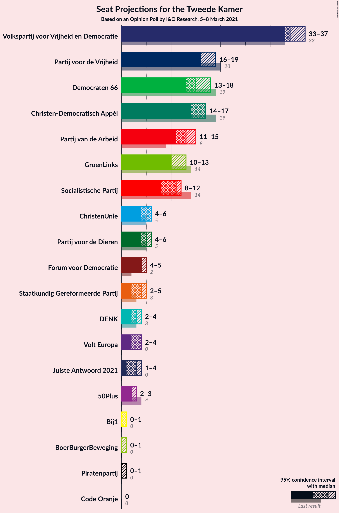

### Confidence Intervals

| Party | Last Result | Median | 80% Confidence Interval | 90% Confidence Interval | 95% Confidence Interval | 99% Confidence Interval |
|:-----:|:-----------:|:------:|:-----------------------:|:-----------------------:|:-----------------------:|:-----------------------:|
| <a href="#volkspartij-voor-vrijheid-en-democratie">Volkspartij voor Vrijheid en Democratie</a> | 33 | 34 | 34–36 |33–37 |33–37 |33–39 |
| <a href="#partij-voor-de-vrijheid">Partij voor de Vrijheid</a> | 20 | 16 | 16–19 |16–19 |16–19 |16–20 |
| <a href="#democraten-66">Democraten 66</a> | 19 | 15 | 14–16 |13–18 |13–18 |12–18 |
| <a href="#christen-democratisch-appèl">Christen-Democratisch Appèl</a> | 19 | 17 | 14–17 |14–17 |14–17 |13–18 |
| <a href="#partij-van-de-arbeid">Partij van de Arbeid</a> | 9 | 13 | 12–15 |12–15 |11–15 |11–15 |
| <a href="#groenlinks">GroenLinks</a> | 14 | 10 | 10–12 |10–12 |10–13 |9–14 |
| <a href="#socialistische-partij">Socialistische Partij</a> | 14 | 11 | 9–11 |9–11 |8–12 |8–12 |
| <a href="#christenunie">ChristenUnie</a> | 5 | 6 | 5–6 |5–6 |4–6 |4–7 |
| <a href="#partij-voor-de-dieren">Partij voor de Dieren</a> | 5 | 5 | 5–6 |5–6 |4–6 |4–7 |
| <a href="#forum-voor-democratie">Forum voor Democratie</a> | 2 | 4 | 4–5 |4–5 |4–5 |3–6 |
| <a href="#staatkundig-gereformeerde-partij">Staatkundig Gereformeerde Partij</a> | 3 | 4 | 3–5 |2–5 |2–5 |2–5 |
| <a href="#volt-europa">Volt Europa</a> | 0 | 4 | 3–4 |3–4 |2–4 |2–4 |
| <a href="#denk">DENK</a> | 3 | 3 | 3–4 |2–4 |2–4 |2–5 |
| <a href="#50plus">50Plus</a> | 4 | 2 | 2–3 |2–3 |2–3 |1–3 |
| <a href="#juiste-antwoord-2021">Juiste Antwoord 2021</a> | 0 | 3 | 2–3 |1–3 |1–4 |1–4 |
| <a href="#bij1">Bij1</a> | 0 | 1 | 0–1 |0–1 |0–1 |0–1 |
| <a href="#boerburgerbeweging">BoerBurgerBeweging</a> | 0 | 0 | 0–1 |0–1 |0–1 |0–1 |
| <a href="#code-oranje">Code Oranje</a> | 0 | 0 | 0 |0 |0 |0–1 |
| <a href="#piratenpartij">Piratenpartij</a> | 0 | 0 | 0 |0 |0–1 |0–1 |

### Volkspartij voor Vrijheid en Democratie

*For a full overview of the results for this party, see the [Volkspartij voor Vrijheid en Democratie](party-volkspartijvoorvrijheidendemocratie.html) page.*

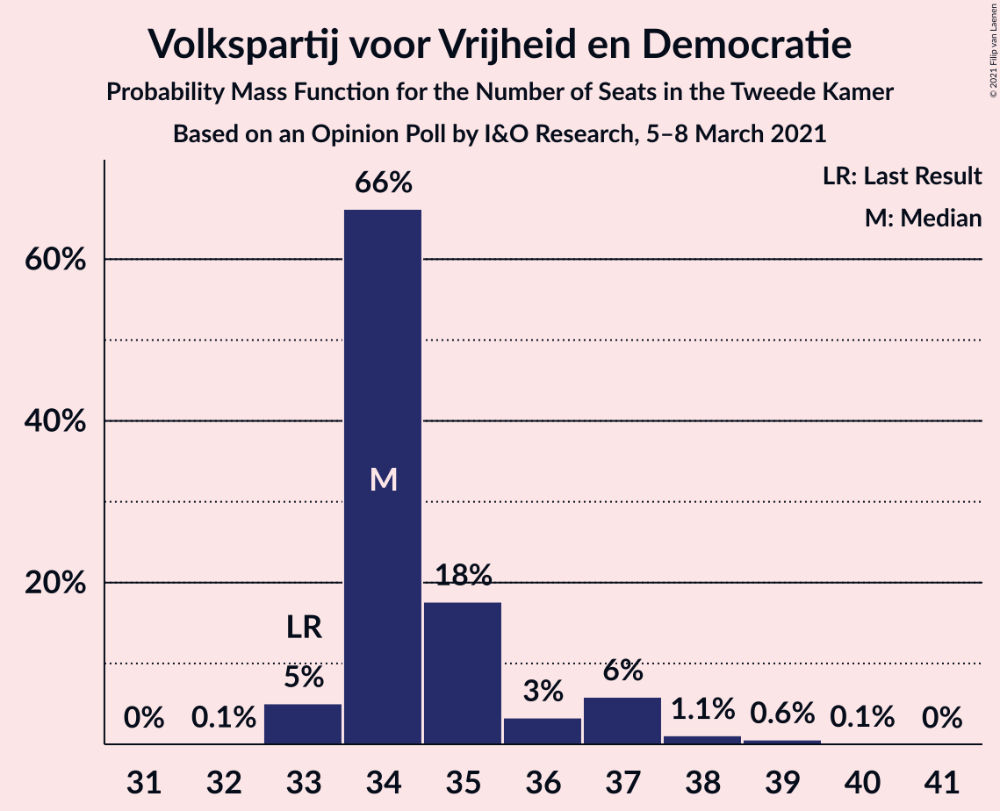

| Number of Seats | Probability | Accumulated | Special Marks |
|:---------------:|:-----------:|:-----------:|:-------------:|
| 32 | 0.1% | 100% |  |
| 33 | 5% | 99.9% | Last Result |
| 34 | 66% | 95% | Median |
| 35 | 18% | 29% |  |
| 36 | 3% | 11% |  |
| 37 | 6% | 8% |  |
| 38 | 1.1% | 2% |  |
| 39 | 0.6% | 0.7% |  |
| 40 | 0.1% | 0.1% |  |
| 41 | 0% | 0% |  |

### Partij voor de Vrijheid

*For a full overview of the results for this party, see the [Partij voor de Vrijheid](party-partijvoordevrijheid.html) page.*

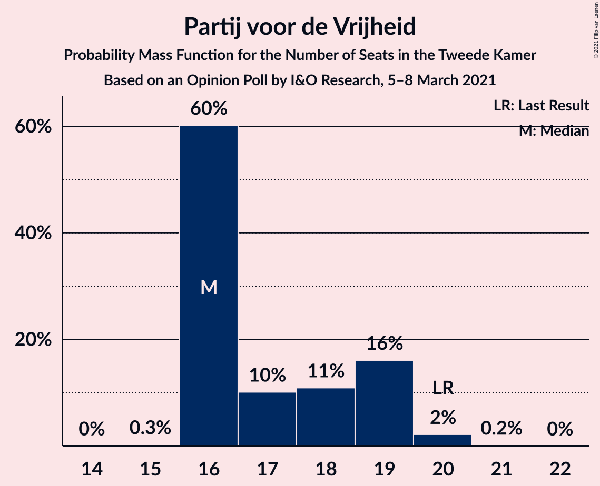

| Number of Seats | Probability | Accumulated | Special Marks |
|:---------------:|:-----------:|:-----------:|:-------------:|
| 15 | 0.3% | 100% |  |
| 16 | 60% | 99.7% | Median |
| 17 | 10% | 39% |  |
| 18 | 11% | 29% |  |
| 19 | 16% | 18% |  |
| 20 | 2% | 2% | Last Result |
| 21 | 0.2% | 0.2% |  |
| 22 | 0% | 0% |  |

### Democraten 66

*For a full overview of the results for this party, see the [Democraten 66](party-democraten66.html) page.*

| Number of Seats | Probability | Accumulated | Special Marks |
|:---------------:|:-----------:|:-----------:|:-------------:|
| 12 | 1.0% | 100% |  |
| 13 | 7% | 99.0% |  |
| 14 | 5% | 92% |  |
| 15 | 61% | 87% | Median |
| 16 | 18% | 26% |  |
| 17 | 0.8% | 8% |  |
| 18 | 7% | 7% |  |
| 19 | 0% | 0% | Last Result |

### Christen-Democratisch Appèl

*For a full overview of the results for this party, see the [Christen-Democratisch Appèl](party-christen-democratischappèl.html) page.*

| Number of Seats | Probability | Accumulated | Special Marks |
|:---------------:|:-----------:|:-----------:|:-------------:|
| 12 | 0.1% | 100% |  |
| 13 | 0.6% | 99.9% |  |
| 14 | 19% | 99.2% |  |
| 15 | 22% | 81% |  |
| 16 | 4% | 59% |  |
| 17 | 55% | 55% | Median |
| 18 | 0.2% | 0.6% |  |
| 19 | 0.4% | 0.4% | Last Result |
| 20 | 0% | 0% |  |

### Partij van de Arbeid

*For a full overview of the results for this party, see the [Partij van de Arbeid](party-partijvandearbeid.html) page.*

| Number of Seats | Probability | Accumulated | Special Marks |
|:---------------:|:-----------:|:-----------:|:-------------:|
| 9 | 0% | 100% | Last Result |
| 10 | 0% | 100% |  |
| 11 | 4% | 100% |  |
| 12 | 8% | 96% |  |
| 13 | 54% | 88% | Median |
| 14 | 15% | 34% |  |
| 15 | 19% | 19% |  |
| 16 | 0.2% | 0.2% |  |
| 17 | 0% | 0% |  |

### GroenLinks

*For a full overview of the results for this party, see the [GroenLinks](party-groenlinks.html) page.*

| Number of Seats | Probability | Accumulated | Special Marks |
|:---------------:|:-----------:|:-----------:|:-------------:|
| 9 | 0.6% | 100% |  |
| 10 | 50% | 99.4% | Median |
| 11 | 38% | 49% |  |
| 12 | 7% | 11% |  |
| 13 | 2% | 4% |  |
| 14 | 2% | 2% | Last Result |
| 15 | 0% | 0% |  |

### Socialistische Partij

*For a full overview of the results for this party, see the [Socialistische Partij](party-socialistischepartij.html) page.*

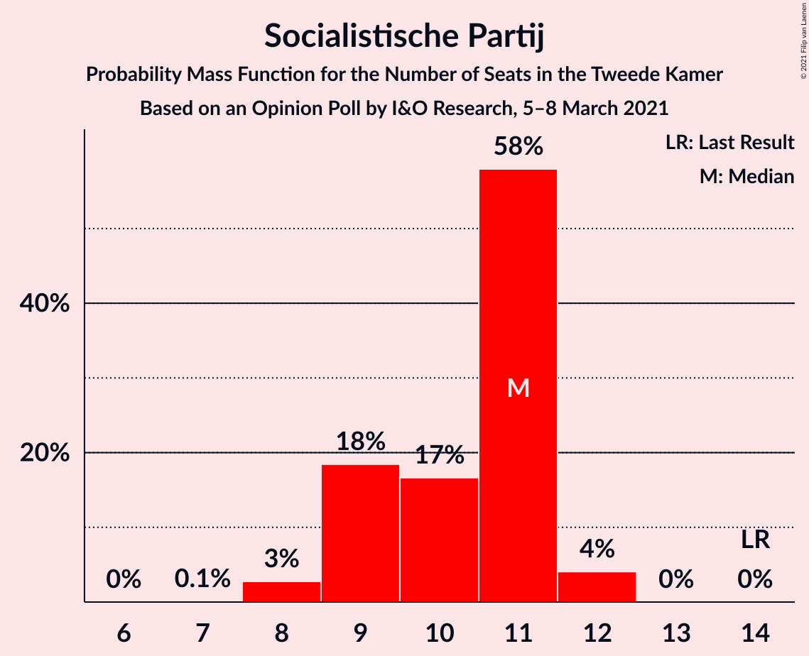

| Number of Seats | Probability | Accumulated | Special Marks |
|:---------------:|:-----------:|:-----------:|:-------------:|
| 7 | 0.1% | 100% |  |
| 8 | 3% | 99.9% |  |
| 9 | 18% | 97% |  |
| 10 | 17% | 79% |  |
| 11 | 58% | 62% | Median |
| 12 | 4% | 4% |  |
| 13 | 0% | 0% |  |
| 14 | 0% | 0% | Last Result |

### ChristenUnie

*For a full overview of the results for this party, see the [ChristenUnie](party-christenunie.html) page.*

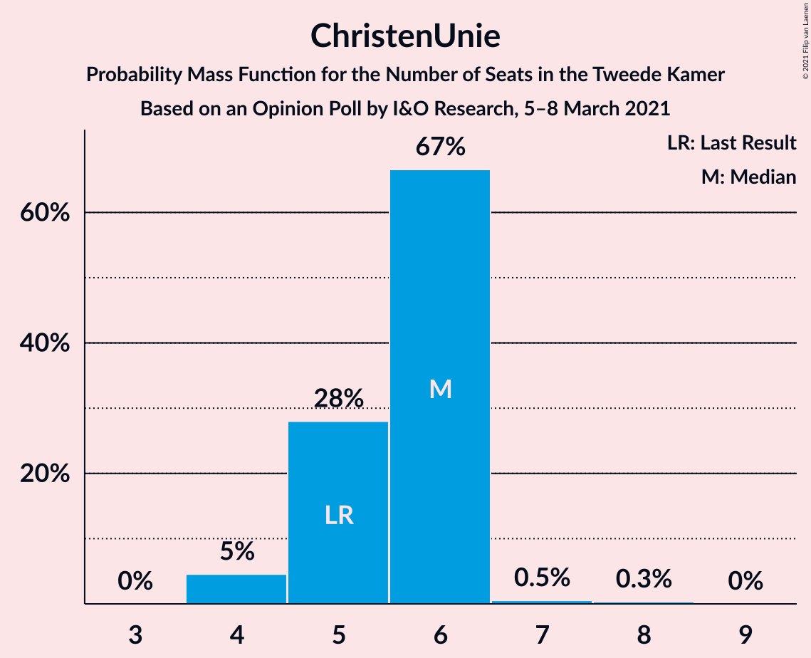

| Number of Seats | Probability | Accumulated | Special Marks |
|:---------------:|:-----------:|:-----------:|:-------------:|
| 4 | 5% | 100% |  |
| 5 | 28% | 95% | Last Result |
| 6 | 67% | 67% | Median |
| 7 | 0.5% | 0.9% |  |
| 8 | 0.3% | 0.3% |  |
| 9 | 0% | 0% |  |

### Partij voor de Dieren

*For a full overview of the results for this party, see the [Partij voor de Dieren](party-partijvoordedieren.html) page.*

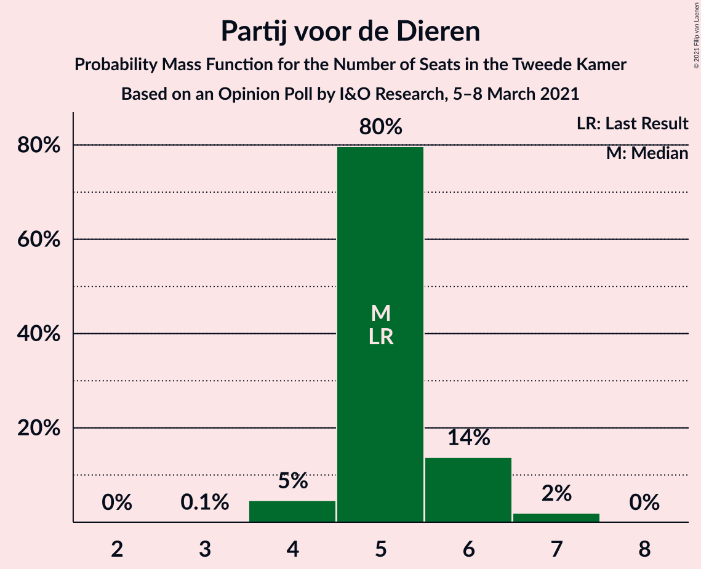

| Number of Seats | Probability | Accumulated | Special Marks |
|:---------------:|:-----------:|:-----------:|:-------------:|
| 3 | 0.1% | 100% |  |
| 4 | 5% | 99.9% |  |
| 5 | 80% | 95% | Last Result, Median |
| 6 | 14% | 16% |  |
| 7 | 2% | 2% |  |
| 8 | 0% | 0% |  |

### Forum voor Democratie

*For a full overview of the results for this party, see the [Forum voor Democratie](party-forumvoordemocratie.html) page.*

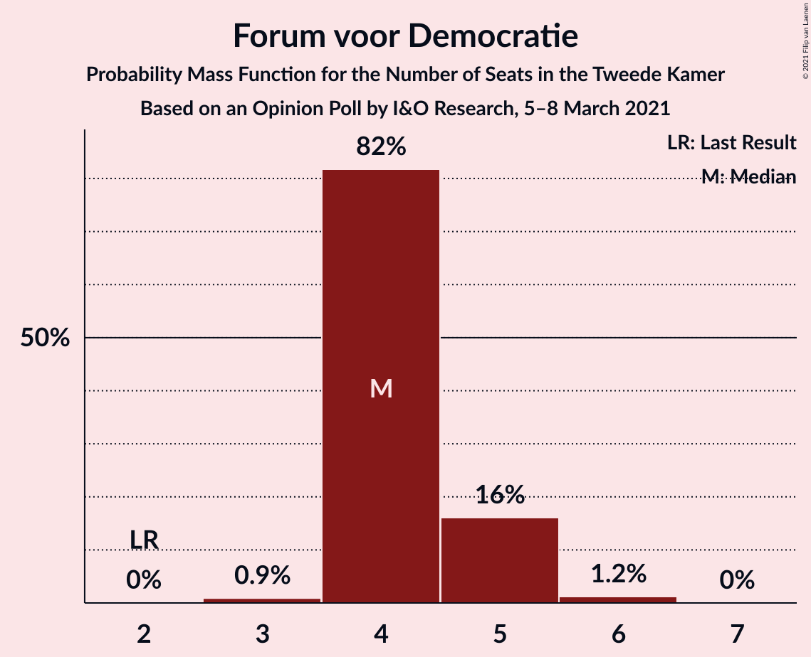

| Number of Seats | Probability | Accumulated | Special Marks |
|:---------------:|:-----------:|:-----------:|:-------------:|
| 2 | 0% | 100% | Last Result |
| 3 | 0.9% | 100% |  |
| 4 | 82% | 99.1% | Median |
| 5 | 16% | 17% |  |
| 6 | 1.2% | 1.2% |  |
| 7 | 0% | 0% |  |

### Staatkundig Gereformeerde Partij

*For a full overview of the results for this party, see the [Staatkundig Gereformeerde Partij](party-staatkundiggereformeerdepartij.html) page.*

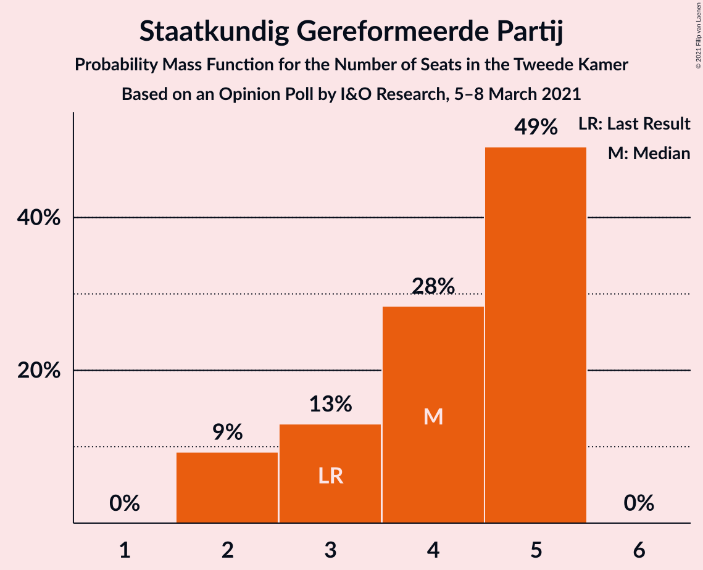

| Number of Seats | Probability | Accumulated | Special Marks |
|:---------------:|:-----------:|:-----------:|:-------------:|
| 2 | 9% | 100% |  |
| 3 | 13% | 91% | Last Result |
| 4 | 28% | 78% | Median |
| 5 | 49% | 49% |  |
| 6 | 0% | 0% |  |

### Volt Europa

*For a full overview of the results for this party, see the [Volt Europa](party-volteuropa.html) page.*

| Number of Seats | Probability | Accumulated | Special Marks |
|:---------------:|:-----------:|:-----------:|:-------------:|
| 0 | 0% | 100% | Last Result |
| 1 | 0% | 100% |  |
| 2 | 3% | 100% |  |
| 3 | 39% | 97% |  |
| 4 | 58% | 58% | Median |
| 5 | 0.1% | 0.1% |  |
| 6 | 0% | 0% |  |

### DENK

*For a full overview of the results for this party, see the [DENK](party-denk.html) page.*

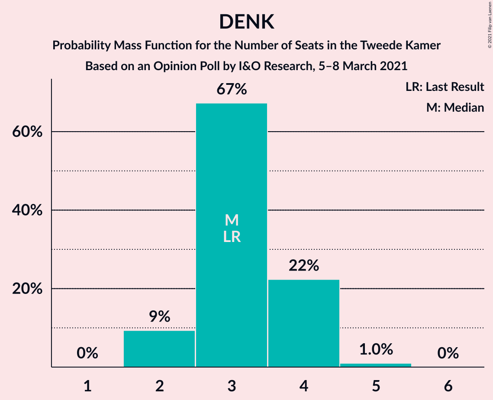

| Number of Seats | Probability | Accumulated | Special Marks |
|:---------------:|:-----------:|:-----------:|:-------------:|
| 2 | 9% | 100% |  |
| 3 | 67% | 91% | Last Result, Median |
| 4 | 22% | 23% |  |
| 5 | 1.0% | 1.0% |  |
| 6 | 0% | 0% |  |

### 50Plus

*For a full overview of the results for this party, see the [50Plus](party-50plus.html) page.*

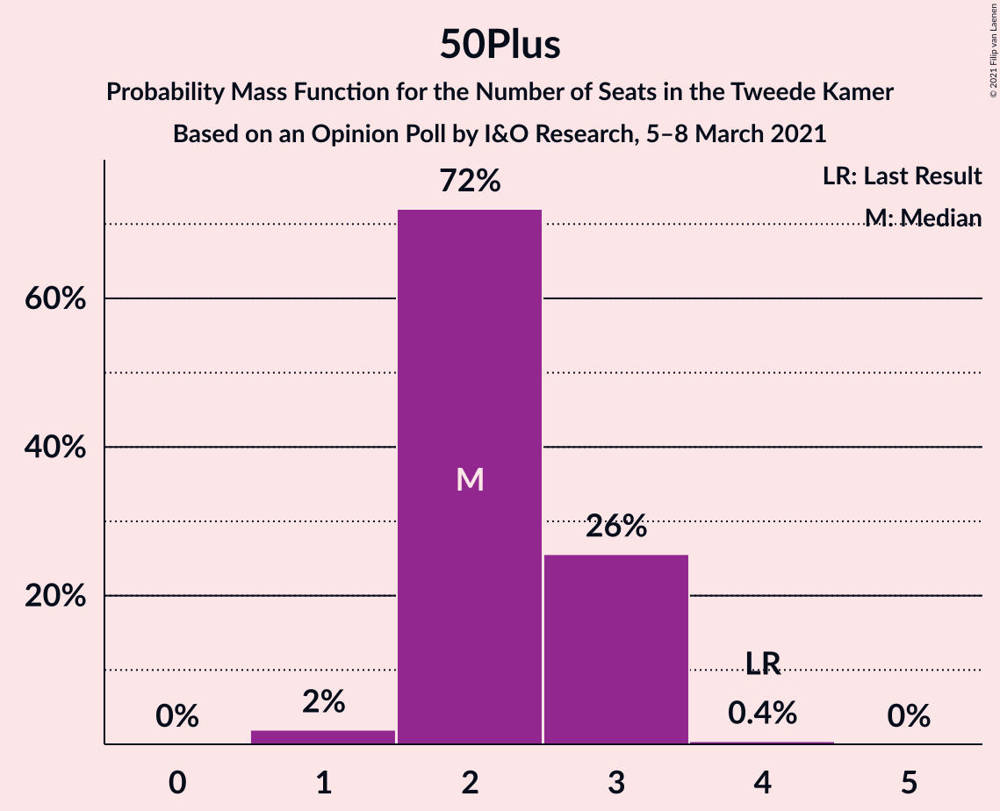

| Number of Seats | Probability | Accumulated | Special Marks |
|:---------------:|:-----------:|:-----------:|:-------------:|
| 1 | 2% | 100% |  |
| 2 | 72% | 98% | Median |
| 3 | 26% | 26% |  |
| 4 | 0.4% | 0.4% | Last Result |
| 5 | 0% | 0% |  |

### Juiste Antwoord 2021

*For a full overview of the results for this party, see the [Juiste Antwoord 2021](party-juisteantwoord2021.html) page.*

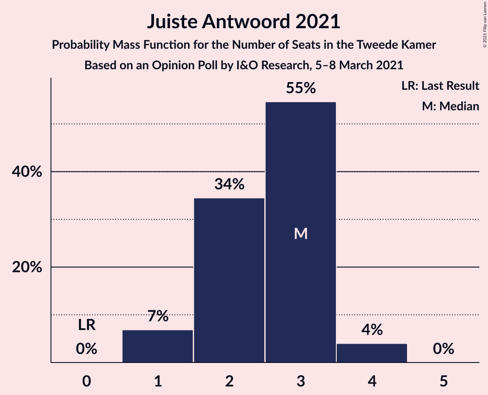

| Number of Seats | Probability | Accumulated | Special Marks |
|:---------------:|:-----------:|:-----------:|:-------------:|
| 0 | 0% | 100% | Last Result |
| 1 | 7% | 100% |  |
| 2 | 34% | 93% |  |
| 3 | 55% | 59% | Median |
| 4 | 4% | 4% |  |
| 5 | 0% | 0% |  |

### Bij1

*For a full overview of the results for this party, see the [Bij1](party-bij1.html) page.*

| Number of Seats | Probability | Accumulated | Special Marks |
|:---------------:|:-----------:|:-----------:|:-------------:|
| 0 | 18% | 100% | Last Result |
| 1 | 82% | 82% | Median |
| 2 | 0.2% | 0.2% |  |
| 3 | 0% | 0% |  |

### BoerBurgerBeweging

*For a full overview of the results for this party, see the [BoerBurgerBeweging](party-boerburgerbeweging.html) page.*

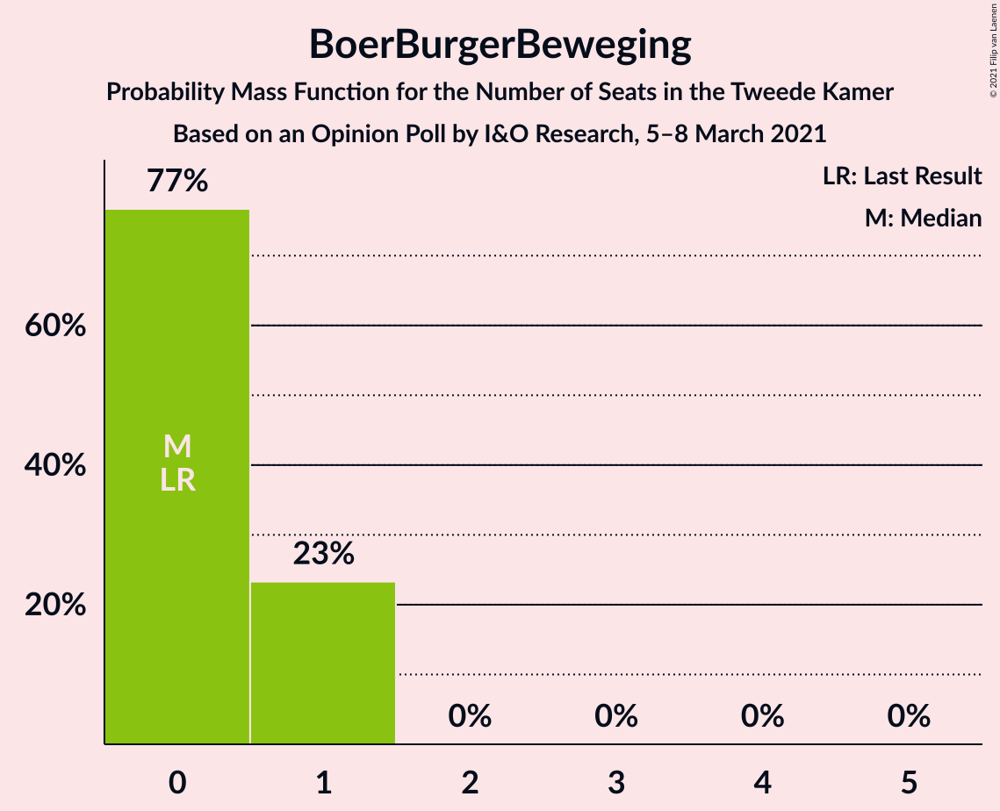

| Number of Seats | Probability | Accumulated | Special Marks |
|:---------------:|:-----------:|:-----------:|:-------------:|
| 0 | 77% | 100% | Last Result, Median |
| 1 | 23% | 23% |  |
| 2 | 0% | 0% |  |

### Code Oranje

*For a full overview of the results for this party, see the [Code Oranje](party-codeoranje.html) page.*

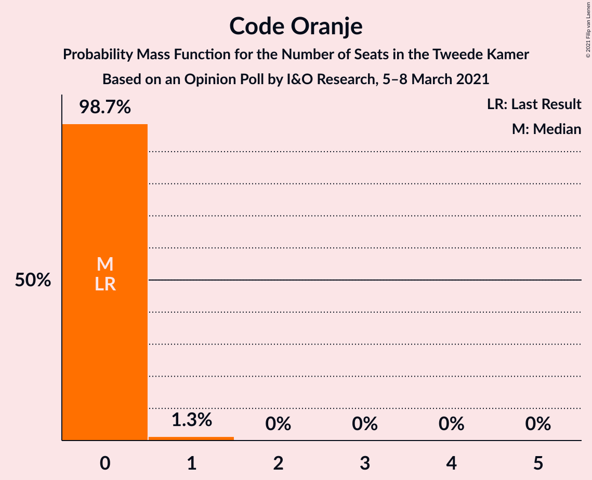

| Number of Seats | Probability | Accumulated | Special Marks |
|:---------------:|:-----------:|:-----------:|:-------------:|
| 0 | 98.7% | 100% | Last Result, Median |
| 1 | 1.3% | 1.3% |  |
| 2 | 0% | 0% |  |

### Piratenpartij

*For a full overview of the results for this party, see the [Piratenpartij](party-piratenpartij.html) page.*

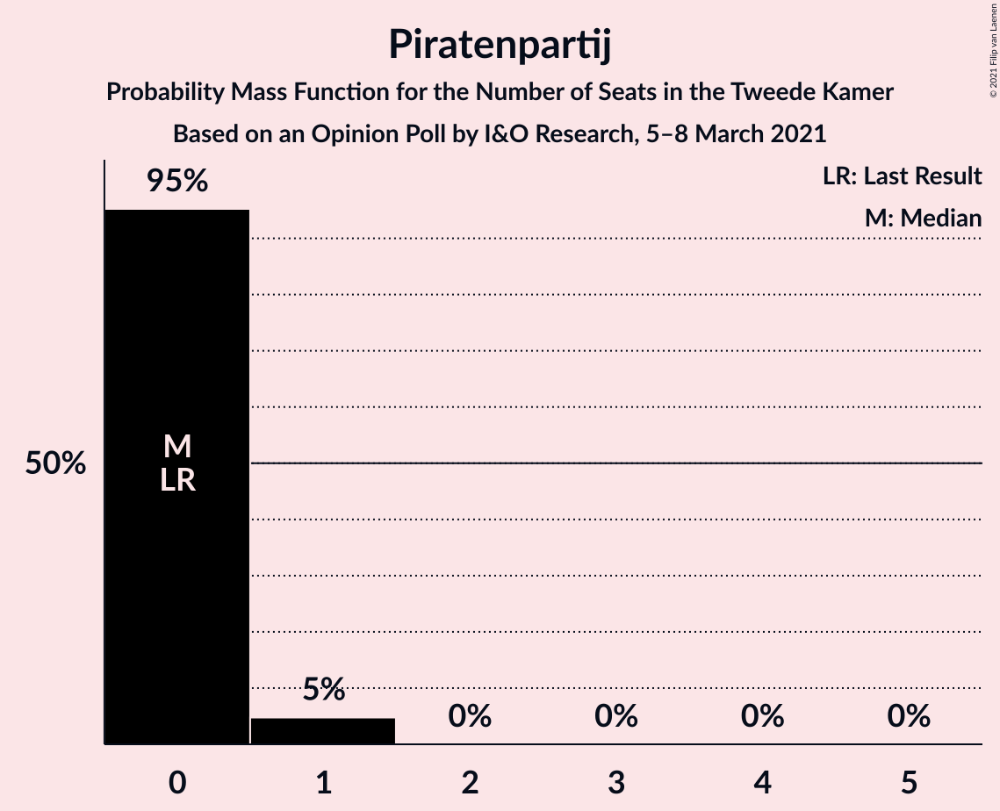

| Number of Seats | Probability | Accumulated | Special Marks |
|:---------------:|:-----------:|:-----------:|:-------------:|
| 0 | 95% | 100% | Last Result, Median |
| 1 | 5% | 5% |  |
| 2 | 0% | 0% |  |

## Coalitions

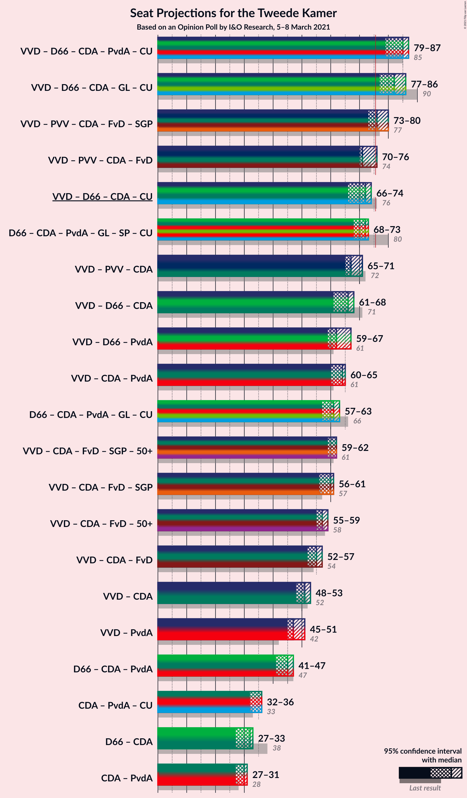

### Confidence Intervals

| Coalition | Last Result | Median | Majority? | 80% Confidence Interval | 90% Confidence Interval | 95% Confidence Interval | 99% Confidence Interval |
|:---------:|:-----------:|:------:|:---------:|:-----------------------:|:-----------------------:|:-----------------------:|:-----------------------:|
| Volkspartij voor Vrijheid en Democratie – Democraten 66 – Christen-Democratisch Appèl – Partij van de Arbeid – ChristenUnie | 85 | 85 | 100% | 81–87 | 81–87 | 79–87 | 79–88 |
| Volkspartij voor Vrijheid en Democratie – Democraten 66 – Christen-Democratisch Appèl – GroenLinks – ChristenUnie | 90 | 82 | 100% | 78–84 | 77–85 | 77–86 | 77–86 |
| Volkspartij voor Vrijheid en Democratie – Partij voor de Vrijheid – Christen-Democratisch Appèl – Forum voor Democratie – Staatkundig Gereformeerde Partij | 77 | 76 | 63% | 74–77 | 74–77 | 73–80 | 72–81 |
| Volkspartij voor Vrijheid en Democratie – Partij voor de Vrijheid – Christen-Democratisch Appèl – Forum voor Democratie | 74 | 71 | 3% | 70–73 | 70–75 | 70–76 | 68–77 |
| Volkspartij voor Vrijheid en Democratie – Democraten 66 – Christen-Democratisch Appèl – ChristenUnie | 76 | 72 | 0.2% | 67–73 | 66–73 | 66–74 | 66–74 |
| Democraten 66 – Christen-Democratisch Appèl – Partij van de Arbeid – GroenLinks – Socialistische Partij – ChristenUnie | 80 | 72 | 0.1% | 68–72 | 68–73 | 68–73 | 67–75 |
| Volkspartij voor Vrijheid en Democratie – Partij voor de Vrijheid – Christen-Democratisch Appèl | 72 | 67 | 0% | 66–70 | 66–70 | 65–71 | 64–73 |
| Volkspartij voor Vrijheid en Democratie – Democraten 66 – Christen-Democratisch Appèl | 71 | 66 | 0% | 62–68 | 61–68 | 61–68 | 61–69 |
| Volkspartij voor Vrijheid en Democratie – Democraten 66 – Partij van de Arbeid | 61 | 62 | 0% | 62–66 | 61–67 | 59–67 | 59–68 |
| Volkspartij voor Vrijheid en Democratie – Christen-Democratisch Appèl – Partij van de Arbeid | 61 | 64 | 0% | 62–65 | 61–65 | 60–65 | 60–69 |
| Democraten 66 – Christen-Democratisch Appèl – Partij van de Arbeid – GroenLinks – ChristenUnie | 66 | 61 | 0% | 58–63 | 57–63 | 57–63 | 56–67 |
| Volkspartij voor Vrijheid en Democratie – Christen-Democratisch Appèl – Forum voor Democratie – Staatkundig Gereformeerde Partij – 50Plus | 61 | 62 | 0% | 59–62 | 59–62 | 59–62 | 58–66 |
| Volkspartij voor Vrijheid en Democratie – Christen-Democratisch Appèl – Forum voor Democratie – Staatkundig Gereformeerde Partij | 57 | 60 | 0% | 57–60 | 56–60 | 56–61 | 55–63 |
| Volkspartij voor Vrijheid en Democratie – Christen-Democratisch Appèl – Forum voor Democratie – 50Plus | 58 | 57 | 0% | 55–58 | 55–58 | 55–59 | 54–62 |
| Volkspartij voor Vrijheid en Democratie – Christen-Democratisch Appèl – Forum voor Democratie | 54 | 55 | 0% | 53–55 | 52–56 | 52–57 | 51–59 |
| Volkspartij voor Vrijheid en Democratie – Christen-Democratisch Appèl | 52 | 51 | 0% | 48–51 | 48–52 | 48–53 | 47–54 |
| Volkspartij voor Vrijheid en Democratie – Partij van de Arbeid | 42 | 47 | 0% | 47–50 | 45–51 | 45–51 | 45–54 |
| Democraten 66 – Christen-Democratisch Appèl – Partij van de Arbeid | 47 | 45 | 0% | 42–46 | 41–47 | 41–47 | 39–47 |
| Christen-Democratisch Appèl – Partij van de Arbeid – ChristenUnie | 33 | 36 | 0% | 33–36 | 32–36 | 32–36 | 31–37 |
| Democraten 66 – Christen-Democratisch Appèl | 38 | 32 | 0% | 29–33 | 27–33 | 27–33 | 26–34 |
| Christen-Democratisch Appèl – Partij van de Arbeid | 28 | 30 | 0% | 27–30 | 27–30 | 27–31 | 26–31 |

### Volkspartij voor Vrijheid en Democratie – Democraten 66 – Christen-Democratisch Appèl – Partij van de Arbeid – ChristenUnie

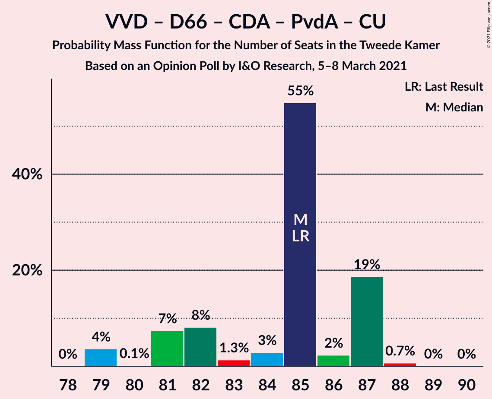

| Number of Seats | Probability | Accumulated | Special Marks |
|:---------------:|:-----------:|:-----------:|:-------------:|
| 79 | 4% | 100% |  |
| 80 | 0.1% | 96% |  |
| 81 | 7% | 96% |  |
| 82 | 8% | 89% |  |
| 83 | 1.3% | 81% |  |
| 84 | 3% | 79% |  |
| 85 | 55% | 77% | Last Result, Median |
| 86 | 2% | 22% |  |
| 87 | 19% | 19% |  |
| 88 | 0.7% | 0.7% |  |
| 89 | 0% | 0.1% |  |
| 90 | 0% | 0% |  |

### Volkspartij voor Vrijheid en Democratie – Democraten 66 – Christen-Democratisch Appèl – GroenLinks – ChristenUnie

| Number of Seats | Probability | Accumulated | Special Marks |
|:---------------:|:-----------:|:-----------:|:-------------:|
| 77 | 7% | 100% |  |
| 78 | 4% | 93% |  |
| 79 | 0.3% | 89% |  |
| 80 | 0.5% | 89% |  |
| 81 | 7% | 88% |  |
| 82 | 57% | 82% | Median |
| 83 | 10% | 24% |  |
| 84 | 9% | 14% |  |
| 85 | 1.5% | 5% |  |
| 86 | 4% | 4% |  |
| 87 | 0.3% | 0.3% |  |
| 88 | 0% | 0% |  |
| 89 | 0% | 0% |  |
| 90 | 0% | 0% | Last Result |

### Volkspartij voor Vrijheid en Democratie – Partij voor de Vrijheid – Christen-Democratisch Appèl – Forum voor Democratie – Staatkundig Gereformeerde Partij

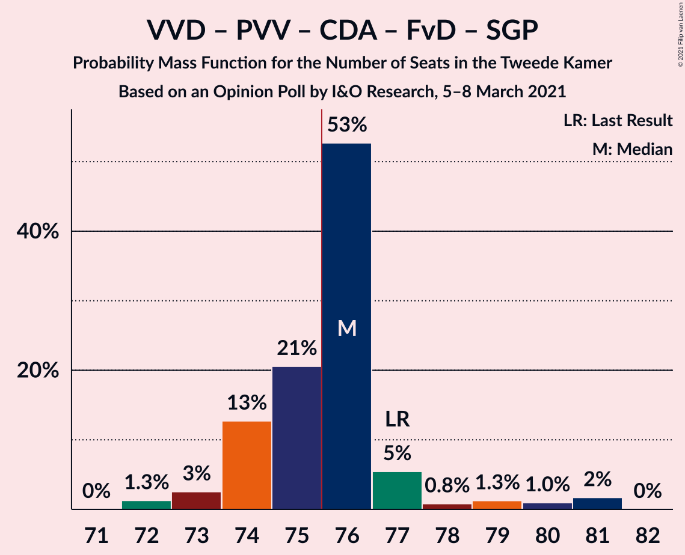

| Number of Seats | Probability | Accumulated | Special Marks |
|:---------------:|:-----------:|:-----------:|:-------------:|
| 72 | 1.3% | 100% |  |
| 73 | 3% | 98.7% |  |
| 74 | 13% | 96% |  |
| 75 | 21% | 83% | Median |
| 76 | 53% | 63% | Majority |
| 77 | 5% | 10% | Last Result |
| 78 | 0.8% | 5% |  |
| 79 | 1.3% | 4% |  |
| 80 | 1.0% | 3% |  |
| 81 | 2% | 2% |  |
| 82 | 0% | 0% |  |

### Volkspartij voor Vrijheid en Democratie – Partij voor de Vrijheid – Christen-Democratisch Appèl – Forum voor Democratie

| Number of Seats | Probability | Accumulated | Special Marks |
|:---------------:|:-----------:|:-----------:|:-------------:|
| 68 | 1.0% | 100% |  |
| 69 | 0.8% | 99.0% |  |
| 70 | 15% | 98% |  |
| 71 | 56% | 83% | Median |
| 72 | 9% | 27% |  |
| 73 | 9% | 18% |  |
| 74 | 4% | 10% | Last Result |
| 75 | 2% | 5% |  |
| 76 | 1.4% | 3% | Majority |
| 77 | 2% | 2% |  |
| 78 | 0% | 0% |  |

### Volkspartij voor Vrijheid en Democratie – Democraten 66 – Christen-Democratisch Appèl – ChristenUnie

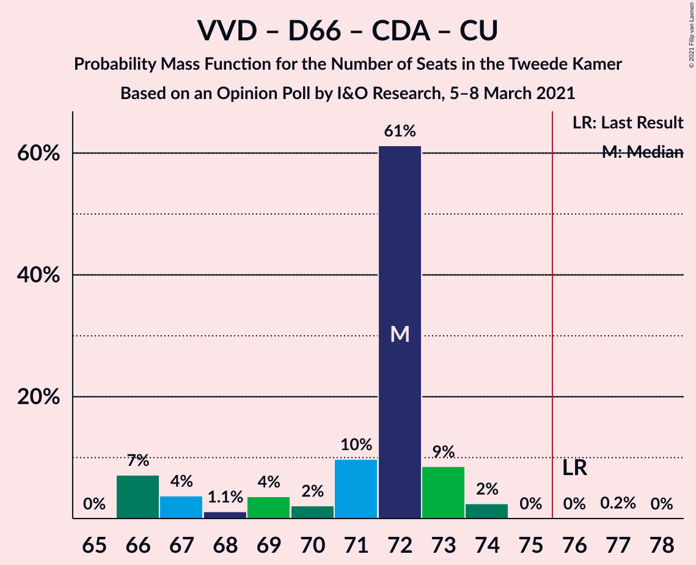

| Number of Seats | Probability | Accumulated | Special Marks |
|:---------------:|:-----------:|:-----------:|:-------------:|
| 66 | 7% | 100% |  |
| 67 | 4% | 93% |  |
| 68 | 1.1% | 89% |  |
| 69 | 4% | 88% |  |
| 70 | 2% | 84% |  |
| 71 | 10% | 82% |  |
| 72 | 61% | 73% | Median |
| 73 | 9% | 11% |  |
| 74 | 2% | 3% |  |
| 75 | 0% | 0.2% |  |
| 76 | 0% | 0.2% | Last Result, Majority |
| 77 | 0.2% | 0.2% |  |
| 78 | 0% | 0% |  |

### Democraten 66 – Christen-Democratisch Appèl – Partij van de Arbeid – GroenLinks – Socialistische Partij – ChristenUnie

| Number of Seats | Probability | Accumulated | Special Marks |
|:---------------:|:-----------:|:-----------:|:-------------:|
| 65 | 0% | 100% |  |
| 66 | 0.2% | 99.9% |  |
| 67 | 1.0% | 99.7% |  |
| 68 | 12% | 98.7% |  |
| 69 | 5% | 86% |  |
| 70 | 6% | 81% |  |
| 71 | 7% | 75% |  |
| 72 | 59% | 68% | Median |
| 73 | 7% | 10% |  |
| 74 | 0.3% | 2% |  |
| 75 | 2% | 2% |  |
| 76 | 0.1% | 0.1% | Majority |
| 77 | 0% | 0% |  |
| 78 | 0% | 0% |  |
| 79 | 0% | 0% |  |
| 80 | 0% | 0% | Last Result |

### Volkspartij voor Vrijheid en Democratie – Partij voor de Vrijheid – Christen-Democratisch Appèl

| Number of Seats | Probability | Accumulated | Special Marks |
|:---------------:|:-----------:|:-----------:|:-------------:|
| 64 | 1.0% | 100% |  |
| 65 | 4% | 99.0% |  |
| 66 | 12% | 95% |  |
| 67 | 60% | 83% | Median |
| 68 | 12% | 24% |  |
| 69 | 1.1% | 11% |  |
| 70 | 7% | 10% |  |
| 71 | 0.7% | 3% |  |
| 72 | 0.5% | 2% | Last Result |
| 73 | 2% | 2% |  |
| 74 | 0% | 0% |  |

### Volkspartij voor Vrijheid en Democratie – Democraten 66 – Christen-Democratisch Appèl

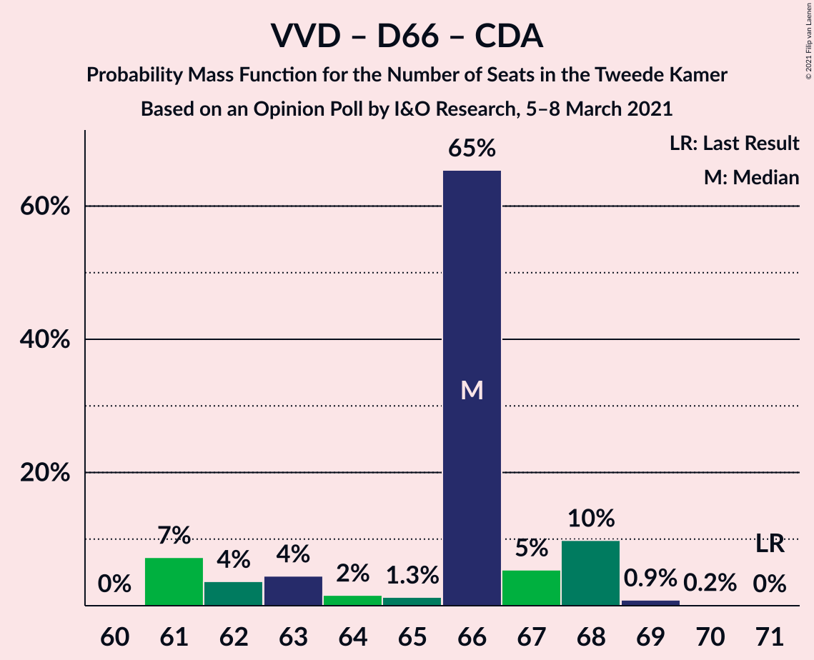

| Number of Seats | Probability | Accumulated | Special Marks |
|:---------------:|:-----------:|:-----------:|:-------------:|
| 61 | 7% | 100% |  |
| 62 | 4% | 93% |  |
| 63 | 4% | 89% |  |
| 64 | 2% | 85% |  |
| 65 | 1.3% | 83% |  |
| 66 | 65% | 82% | Median |
| 67 | 5% | 16% |  |
| 68 | 10% | 11% |  |
| 69 | 0.9% | 1.1% |  |
| 70 | 0.2% | 0.2% |  |
| 71 | 0% | 0% | Last Result |

### Volkspartij voor Vrijheid en Democratie – Democraten 66 – Partij van de Arbeid

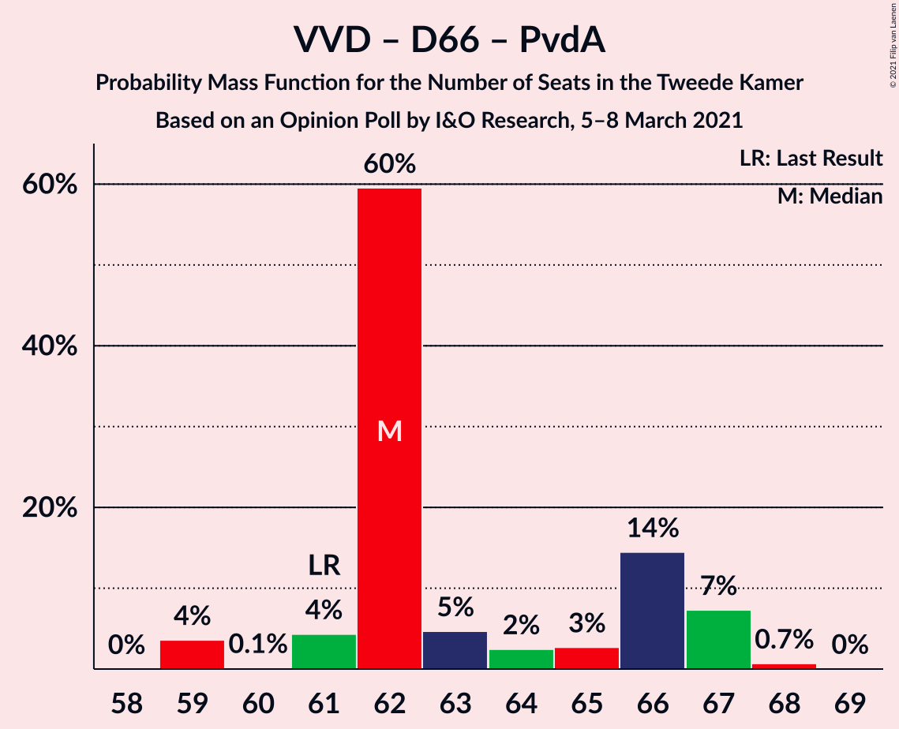

| Number of Seats | Probability | Accumulated | Special Marks |
|:---------------:|:-----------:|:-----------:|:-------------:|
| 59 | 4% | 100% |  |
| 60 | 0.1% | 96% |  |
| 61 | 4% | 96% | Last Result |
| 62 | 60% | 92% | Median |
| 63 | 5% | 32% |  |
| 64 | 2% | 28% |  |
| 65 | 3% | 25% |  |
| 66 | 14% | 23% |  |
| 67 | 7% | 8% |  |
| 68 | 0.7% | 0.7% |  |
| 69 | 0% | 0% |  |

### Volkspartij voor Vrijheid en Democratie – Christen-Democratisch Appèl – Partij van de Arbeid

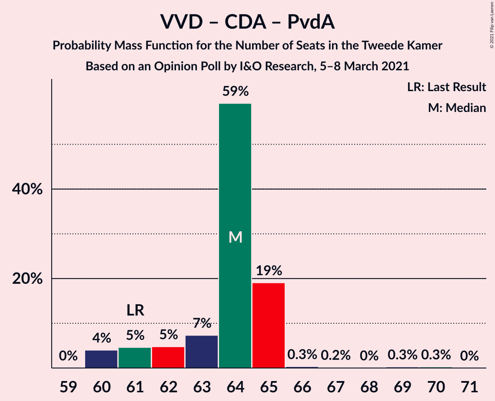

| Number of Seats | Probability | Accumulated | Special Marks |
|:---------------:|:-----------:|:-----------:|:-------------:|
| 60 | 4% | 100% |  |
| 61 | 5% | 96% | Last Result |
| 62 | 5% | 91% |  |
| 63 | 7% | 87% |  |
| 64 | 59% | 79% | Median |
| 65 | 19% | 20% |  |
| 66 | 0.3% | 1.0% |  |
| 67 | 0.2% | 0.7% |  |
| 68 | 0% | 0.5% |  |
| 69 | 0.3% | 0.5% |  |
| 70 | 0.3% | 0.3% |  |
| 71 | 0% | 0% |  |

### Democraten 66 – Christen-Democratisch Appèl – Partij van de Arbeid – GroenLinks – ChristenUnie

| Number of Seats | Probability | Accumulated | Special Marks |
|:---------------:|:-----------:|:-----------:|:-------------:|
| 55 | 0.1% | 100% |  |
| 56 | 1.1% | 99.9% |  |
| 57 | 4% | 98.8% |  |
| 58 | 7% | 95% |  |
| 59 | 10% | 87% |  |
| 60 | 4% | 77% |  |
| 61 | 51% | 73% | Median |
| 62 | 3% | 23% |  |
| 63 | 17% | 20% |  |
| 64 | 0.3% | 2% |  |
| 65 | 0.1% | 2% |  |
| 66 | 0% | 2% | Last Result |
| 67 | 2% | 2% |  |
| 68 | 0% | 0% |  |

### Volkspartij voor Vrijheid en Democratie – Christen-Democratisch Appèl – Forum voor Democratie – Staatkundig Gereformeerde Partij – 50Plus

| Number of Seats | Probability | Accumulated | Special Marks |
|:---------------:|:-----------:|:-----------:|:-------------:|
| 56 | 0.3% | 100% |  |
| 57 | 0% | 99.7% |  |
| 58 | 2% | 99.7% |  |
| 59 | 17% | 98% |  |
| 60 | 17% | 80% |  |
| 61 | 10% | 64% | Last Result, Median |
| 62 | 51% | 54% |  |
| 63 | 0.9% | 2% |  |
| 64 | 0.5% | 1.2% |  |
| 65 | 0.3% | 0.8% |  |
| 66 | 0.4% | 0.5% |  |
| 67 | 0.1% | 0.1% |  |
| 68 | 0% | 0% |  |

### Volkspartij voor Vrijheid en Democratie – Christen-Democratisch Appèl – Forum voor Democratie – Staatkundig Gereformeerde Partij

| Number of Seats | Probability | Accumulated | Special Marks |
|:---------------:|:-----------:|:-----------:|:-------------:|
| 54 | 0.3% | 100% |  |
| 55 | 1.1% | 99.7% |  |
| 56 | 9% | 98.6% |  |
| 57 | 17% | 90% | Last Result |
| 58 | 19% | 73% |  |
| 59 | 1.3% | 55% | Median |
| 60 | 50% | 53% |  |
| 61 | 3% | 4% |  |
| 62 | 0% | 0.8% |  |
| 63 | 0.6% | 0.8% |  |
| 64 | 0.1% | 0.1% |  |
| 65 | 0% | 0% |  |

### Volkspartij voor Vrijheid en Democratie – Christen-Democratisch Appèl – Forum voor Democratie – 50Plus

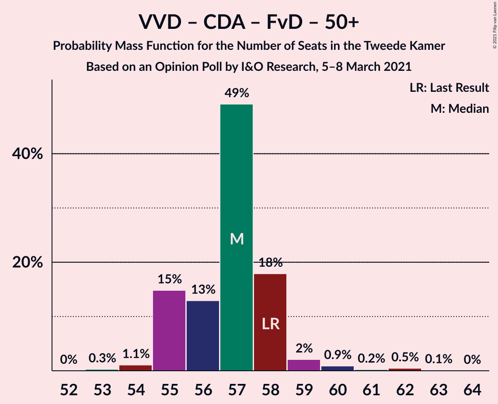

| Number of Seats | Probability | Accumulated | Special Marks |
|:---------------:|:-----------:|:-----------:|:-------------:|
| 53 | 0.3% | 100% |  |
| 54 | 1.1% | 99.7% |  |
| 55 | 15% | 98.6% |  |
| 56 | 13% | 84% |  |
| 57 | 49% | 71% | Median |
| 58 | 18% | 22% | Last Result |
| 59 | 2% | 4% |  |
| 60 | 0.9% | 2% |  |
| 61 | 0.2% | 0.8% |  |
| 62 | 0.5% | 0.6% |  |
| 63 | 0.1% | 0.1% |  |
| 64 | 0% | 0% |  |

### Volkspartij voor Vrijheid en Democratie – Christen-Democratisch Appèl – Forum voor Democratie

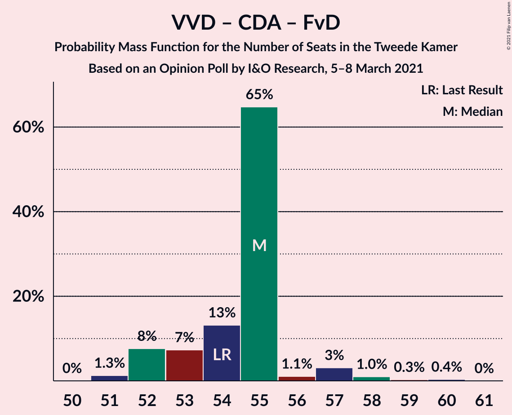

| Number of Seats | Probability | Accumulated | Special Marks |
|:---------------:|:-----------:|:-----------:|:-------------:|
| 51 | 1.3% | 100% |  |
| 52 | 8% | 98.7% |  |
| 53 | 7% | 91% |  |
| 54 | 13% | 84% | Last Result |
| 55 | 65% | 71% | Median |
| 56 | 1.1% | 6% |  |
| 57 | 3% | 5% |  |
| 58 | 1.0% | 2% |  |
| 59 | 0.3% | 0.6% |  |
| 60 | 0.4% | 0.4% |  |
| 61 | 0% | 0% |  |

### Volkspartij voor Vrijheid en Democratie – Christen-Democratisch Appèl

| Number of Seats | Probability | Accumulated | Special Marks |
|:---------------:|:-----------:|:-----------:|:-------------:|
| 47 | 1.1% | 100% |  |
| 48 | 15% | 98.9% |  |
| 49 | 0.2% | 84% |  |
| 50 | 20% | 84% |  |
| 51 | 58% | 63% | Median |
| 52 | 3% | 6% | Last Result |
| 53 | 2% | 3% |  |
| 54 | 0.6% | 0.8% |  |
| 55 | 0.3% | 0.3% |  |
| 56 | 0% | 0% |  |

### Volkspartij voor Vrijheid en Democratie – Partij van de Arbeid

| Number of Seats | Probability | Accumulated | Special Marks |
|:---------------:|:-----------:|:-----------:|:-------------:|
| 42 | 0% | 100% | Last Result |
| 43 | 0% | 100% |  |
| 44 | 0% | 100% |  |
| 45 | 8% | 100% |  |
| 46 | 0.8% | 92% |  |
| 47 | 54% | 91% | Median |
| 48 | 3% | 38% |  |
| 49 | 18% | 35% |  |
| 50 | 10% | 17% |  |
| 51 | 5% | 6% |  |
| 52 | 0.3% | 1.0% |  |
| 53 | 0.2% | 0.7% |  |
| 54 | 0.5% | 0.5% |  |
| 55 | 0% | 0% |  |

### Democraten 66 – Christen-Democratisch Appèl – Partij van de Arbeid

| Number of Seats | Probability | Accumulated | Special Marks |
|:---------------:|:-----------:|:-----------:|:-------------:|
| 39 | 1.0% | 100% |  |
| 40 | 0.3% | 99.0% |  |
| 41 | 4% | 98.7% |  |
| 42 | 12% | 95% |  |
| 43 | 6% | 83% |  |
| 44 | 7% | 77% |  |
| 45 | 50% | 70% | Median |
| 46 | 10% | 20% |  |
| 47 | 9% | 10% | Last Result |
| 48 | 0% | 0.1% |  |
| 49 | 0% | 0% |  |

### Christen-Democratisch Appèl – Partij van de Arbeid – ChristenUnie

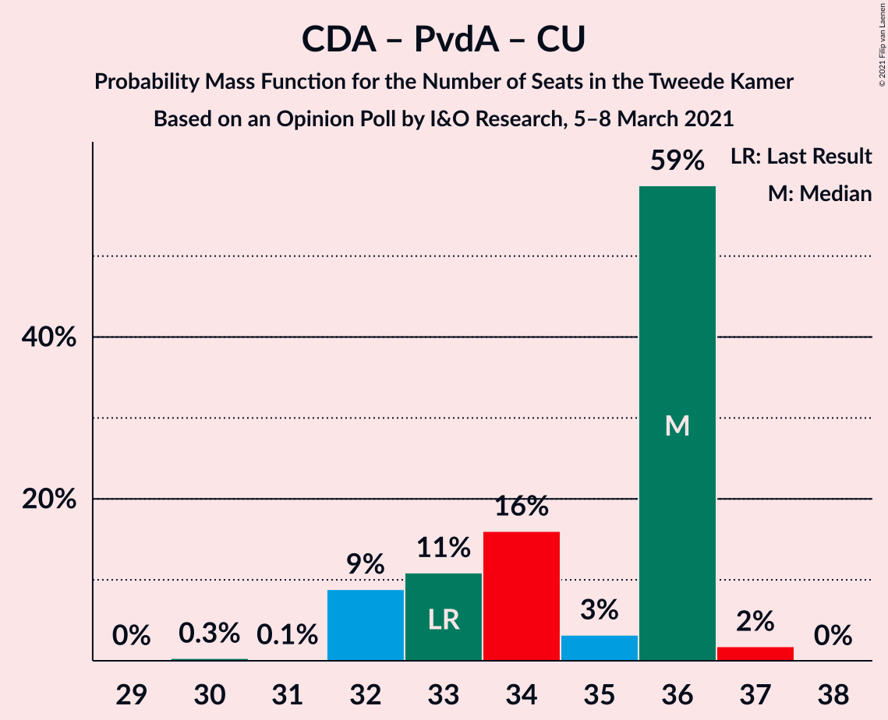

| Number of Seats | Probability | Accumulated | Special Marks |
|:---------------:|:-----------:|:-----------:|:-------------:|
| 30 | 0.3% | 100% |  |
| 31 | 0.1% | 99.6% |  |
| 32 | 9% | 99.5% |  |
| 33 | 11% | 91% | Last Result |
| 34 | 16% | 80% |  |
| 35 | 3% | 64% |  |
| 36 | 59% | 61% | Median |
| 37 | 2% | 2% |  |
| 38 | 0% | 0% |  |

### Democraten 66 – Christen-Democratisch Appèl

| Number of Seats | Probability | Accumulated | Special Marks |
|:---------------:|:-----------:|:-----------:|:-------------:|
| 26 | 1.0% | 100% |  |
| 27 | 8% | 99.0% |  |
| 28 | 0.4% | 91% |  |
| 29 | 12% | 91% |  |
| 30 | 3% | 79% |  |
| 31 | 10% | 75% |  |
| 32 | 53% | 65% | Median |
| 33 | 12% | 12% |  |
| 34 | 0.2% | 0.7% |  |
| 35 | 0.4% | 0.4% |  |
| 36 | 0% | 0% |  |
| 37 | 0% | 0% |  |
| 38 | 0% | 0% | Last Result |

### Christen-Democratisch Appèl – Partij van de Arbeid

| Number of Seats | Probability | Accumulated | Special Marks |
|:---------------:|:-----------:|:-----------:|:-------------:|
| 24 | 0% | 100% |  |
| 25 | 0.2% | 99.9% |  |
| 26 | 0.7% | 99.8% |  |
| 27 | 10% | 99.1% |  |
| 28 | 11% | 89% | Last Result |
| 29 | 17% | 79% |  |
| 30 | 59% | 62% | Median |
| 31 | 3% | 3% |  |
| 32 | 0% | 0% |  |

## Technical Information

### Opinion Poll

+ **Polling firm:** I&O Research
+ **Commissioner(s):** —
+ **Fieldwork period:** 5–8 March 2021

### Calculations

+ **Sample size:** 2576
+ **Simulations done:** 1,048,576
+ **Error estimate:** 1.46%

