# Opinion Poll by I&O Research, 12–15 March 2021

<a href="#voting-intentions">Voting Intentions</a> | <a href="#seats">Seats</a> | <a href="#coalitions">Coalitions</a> | <a href="#technical-information">Technical Information</a>

## Voting Intentions

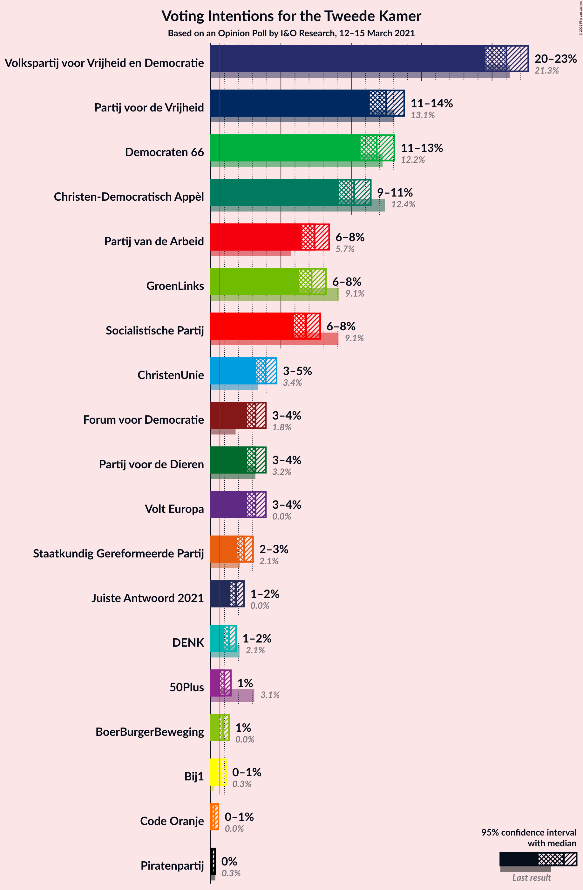

### Confidence Intervals

| Party | Last Result | Poll Result | 80% Confidence Interval | 90% Confidence Interval | 95% Confidence Interval | 99% Confidence Interval |
|:-----:|:-----------:|:-----------:|:-----------------------:|:-----------------------:|:-----------------------:|:-----------------------:|
| Volkspartij voor Vrijheid en Democratie | 21.3% | 21.0% | 20.0–22.0% |19.8–22.3% |19.5–22.6% |19.1–23.1% |
| Partij voor de Vrijheid | 13.1% | 12.5% | 11.7–13.3% |11.5–13.5% |11.3–13.8% |10.9–14.2% |
| Democraten 66 | 12.2% | 11.8% | 11.1–12.6% |10.8–12.9% |10.7–13.1% |10.3–13.5% |
| Christen-Democratisch Appèl | 12.4% | 10.2% | 9.5–11.0% |9.3–11.2% |9.1–11.4% |8.8–11.8% |
| Partij van de Arbeid | 5.7% | 7.4% | 6.8–8.1% |6.6–8.3% |6.5–8.4% |6.2–8.8% |
| GroenLinks | 9.1% | 7.2% | 6.6–7.8% |6.4–8.0% |6.3–8.2% |6.0–8.5% |
| Socialistische Partij | 9.1% | 6.8% | 6.2–7.5% |6.1–7.6% |5.9–7.8% |5.7–8.1% |
| ChristenUnie | 3.4% | 3.9% | 3.5–4.4% |3.4–4.6% |3.2–4.7% |3.0–5.0% |
| Partij voor de Dieren | 3.2% | 3.2% | 2.8–3.7% |2.7–3.8% |2.6–3.9% |2.4–4.2% |
| Forum voor Democratie | 1.8% | 3.2% | 2.8–3.7% |2.7–3.8% |2.6–3.9% |2.4–4.2% |
| Volt Europa | 0.0% | 3.2% | 2.8–3.7% |2.7–3.8% |2.6–3.9% |2.4–4.2% |
| Staatkundig Gereformeerde Partij | 2.1% | 2.4% | 2.0–2.8% |2.0–2.9% |1.9–3.0% |1.7–3.2% |
| Juiste Antwoord 2021 | 0.0% | 1.8% | 1.5–2.2% |1.4–2.3% |1.4–2.4% |1.2–2.6% |
| DENK | 2.1% | 1.3% | 1.1–1.6% |1.0–1.7% |0.9–1.8% |0.9–2.0% |
| 50Plus | 3.1% | 1.0% | 0.8–1.3% |0.7–1.4% |0.7–1.4% |0.6–1.6% |
| BoerBurgerBeweging | 0.0% | 0.9% | 0.7–1.2% |0.6–1.2% |0.6–1.3% |0.5–1.5% |
| Bij1 | 0.3% | 0.7% | 0.5–1.0% |0.5–1.0% |0.5–1.1% |0.4–1.2% |
| Code Oranje | 0.0% | 0.3% | 0.2–0.5% |0.2–0.5% |0.1–0.6% |0.1–0.7% |
| Piratenpartij | 0.3% | 0.1% | 0.1–0.2% |0.0–0.3% |0.0–0.3% |0.0–0.4% |

*Note:* The poll result column reflects the actual value used in the calculations. Published results may vary slightly, and in addition be rounded to fewer digits.

## Seats

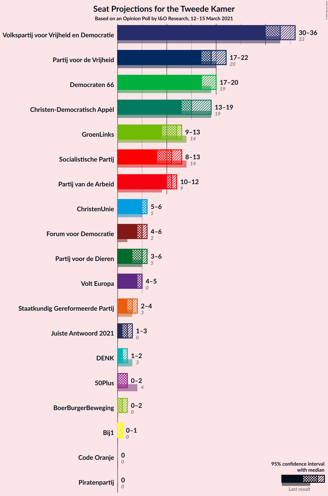

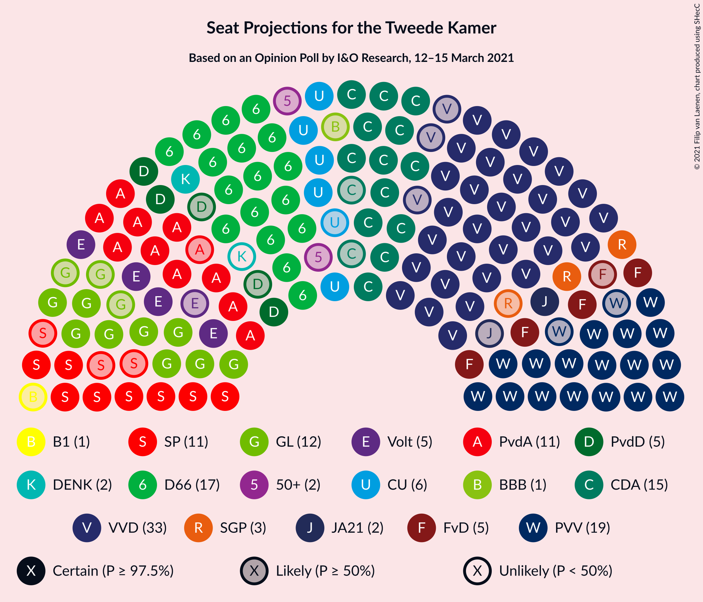

### Confidence Intervals

| Party | Last Result | Median | 80% Confidence Interval | 90% Confidence Interval | 95% Confidence Interval | 99% Confidence Interval |
|:-----:|:-----------:|:------:|:-----------------------:|:-----------------------:|:-----------------------:|:-----------------------:|
| <a href="#volkspartij-voor-vrijheid-en-democratie">Volkspartij voor Vrijheid en Democratie</a> | 33 | 33 | 31–34 |30–36 |30–36 |30–37 |
| <a href="#partij-voor-de-vrijheid">Partij voor de Vrijheid</a> | 20 | 19 | 18–22 |17–22 |17–22 |17–22 |
| <a href="#democraten-66">Democraten 66</a> | 19 | 17 | 17–19 |17–20 |17–20 |16–22 |
| <a href="#christen-democratisch-appèl">Christen-Democratisch Appèl</a> | 19 | 15 | 14–17 |13–19 |13–19 |13–19 |
| <a href="#partij-van-de-arbeid">Partij van de Arbeid</a> | 9 | 11 | 11 |11–12 |10–12 |9–13 |
| <a href="#groenlinks">GroenLinks</a> | 14 | 12 | 10–12 |10–13 |9–13 |9–13 |
| <a href="#socialistische-partij">Socialistische Partij</a> | 14 | 11 | 9–11 |8–13 |8–13 |8–13 |
| <a href="#christenunie">ChristenUnie</a> | 5 | 6 | 5–6 |5–6 |5–6 |4–7 |
| <a href="#partij-voor-de-dieren">Partij voor de Dieren</a> | 5 | 5 | 4–5 |3–5 |3–6 |3–6 |
| <a href="#forum-voor-democratie">Forum voor Democratie</a> | 2 | 5 | 4–5 |4–6 |4–6 |3–6 |
| <a href="#volt-europa">Volt Europa</a> | 0 | 5 | 4–5 |4–5 |4–5 |4–6 |
| <a href="#staatkundig-gereformeerde-partij">Staatkundig Gereformeerde Partij</a> | 3 | 3 | 3 |2–3 |2–4 |2–4 |
| <a href="#juiste-antwoord-2021">Juiste Antwoord 2021</a> | 0 | 2 | 2–3 |2–3 |1–3 |1–4 |
| <a href="#denk">DENK</a> | 3 | 1 | 1–2 |1–2 |1–2 |1–3 |
| <a href="#50plus">50Plus</a> | 4 | 2 | 1–2 |1–2 |0–2 |0–2 |
| <a href="#boerburgerbeweging">BoerBurgerBeweging</a> | 0 | 1 | 1–2 |1–2 |0–2 |0–2 |
| <a href="#bij1">Bij1</a> | 0 | 1 | 0–1 |0–1 |0–1 |0–2 |
| <a href="#code-oranje">Code Oranje</a> | 0 | 0 | 0 |0 |0 |0–1 |
| <a href="#piratenpartij">Piratenpartij</a> | 0 | 0 | 0 |0 |0 |0 |

### Volkspartij voor Vrijheid en Democratie

*For a full overview of the results for this party, see the [Volkspartij voor Vrijheid en Democratie](party-volkspartijvoorvrijheidendemocratie.html) page.*

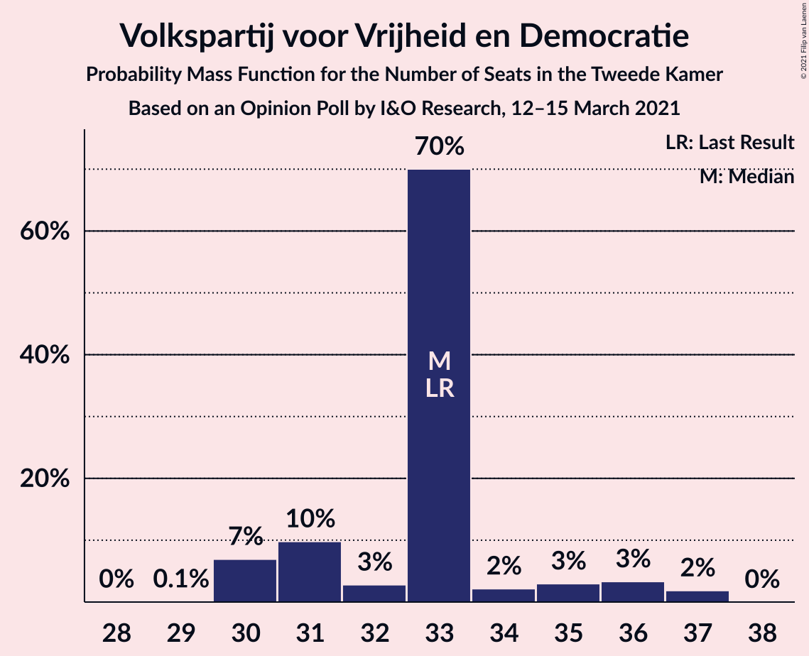

| Number of Seats | Probability | Accumulated | Special Marks |
|:---------------:|:-----------:|:-----------:|:-------------:|
| 28 | 0% | 100% |  |
| 29 | 0.1% | 99.9% |  |
| 30 | 7% | 99.9% |  |
| 31 | 10% | 93% |  |
| 32 | 3% | 83% |  |
| 33 | 70% | 80% | Last Result, Median |
| 34 | 2% | 10% |  |
| 35 | 3% | 8% |  |
| 36 | 3% | 5% |  |
| 37 | 2% | 2% |  |
| 38 | 0% | 0% |  |

### Partij voor de Vrijheid

*For a full overview of the results for this party, see the [Partij voor de Vrijheid](party-partijvoordevrijheid.html) page.*

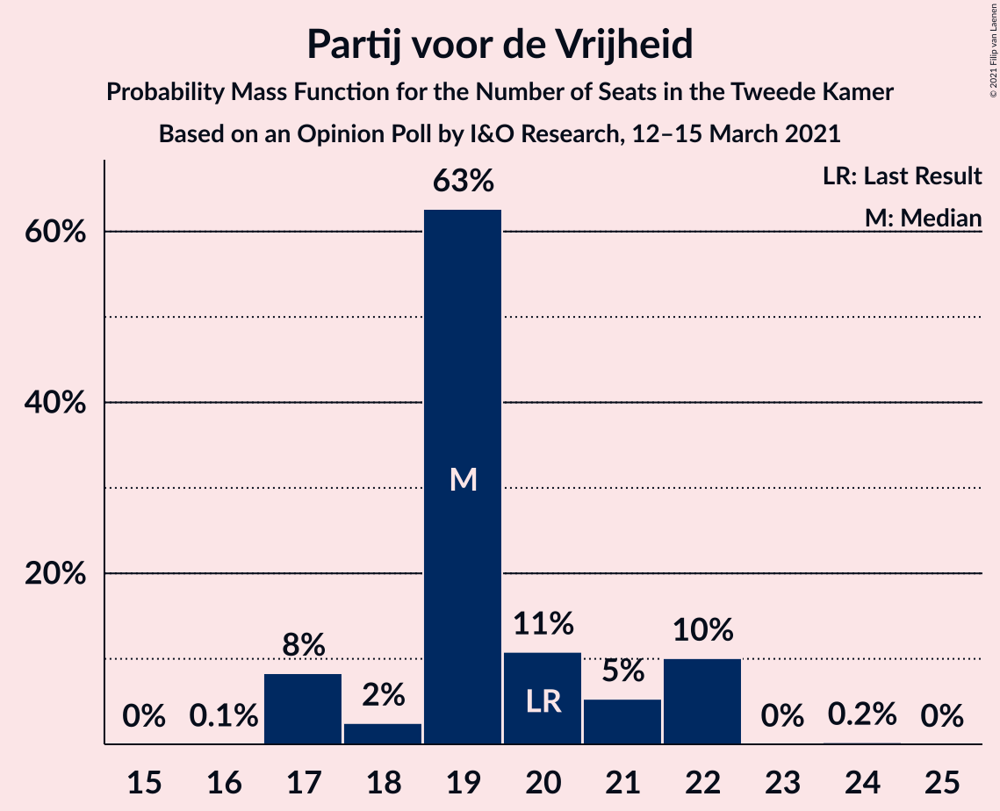

| Number of Seats | Probability | Accumulated | Special Marks |
|:---------------:|:-----------:|:-----------:|:-------------:|
| 16 | 0.1% | 100% |  |
| 17 | 8% | 99.9% |  |
| 18 | 2% | 92% |  |
| 19 | 63% | 89% | Median |
| 20 | 11% | 26% | Last Result |
| 21 | 5% | 16% |  |
| 22 | 10% | 10% |  |
| 23 | 0% | 0.3% |  |
| 24 | 0.2% | 0.2% |  |
| 25 | 0% | 0% |  |

### Democraten 66

*For a full overview of the results for this party, see the [Democraten 66](party-democraten66.html) page.*

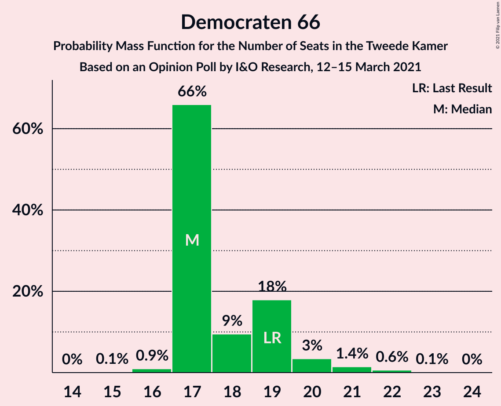

| Number of Seats | Probability | Accumulated | Special Marks |
|:---------------:|:-----------:|:-----------:|:-------------:|
| 15 | 0.1% | 100% |  |
| 16 | 0.9% | 99.9% |  |
| 17 | 66% | 98.9% | Median |
| 18 | 9% | 33% |  |
| 19 | 18% | 23% | Last Result |
| 20 | 3% | 6% |  |
| 21 | 1.4% | 2% |  |
| 22 | 0.6% | 0.7% |  |
| 23 | 0.1% | 0.1% |  |
| 24 | 0% | 0% |  |

### Christen-Democratisch Appèl

*For a full overview of the results for this party, see the [Christen-Democratisch Appèl](party-christen-democratischappèl.html) page.*

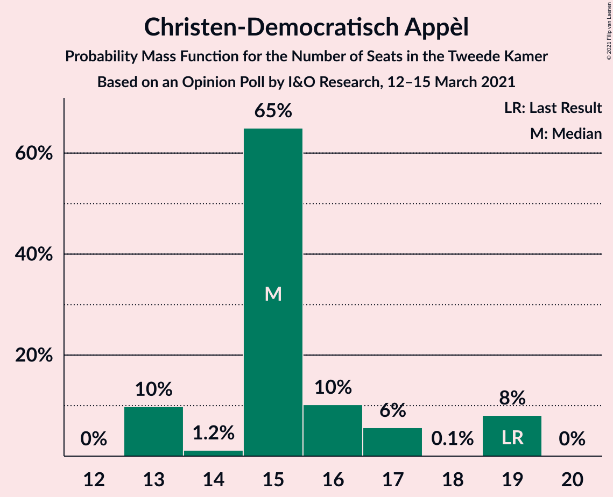

| Number of Seats | Probability | Accumulated | Special Marks |
|:---------------:|:-----------:|:-----------:|:-------------:|
| 13 | 10% | 100% |  |
| 14 | 1.2% | 90% |  |
| 15 | 65% | 89% | Median |
| 16 | 10% | 24% |  |
| 17 | 6% | 14% |  |
| 18 | 0.1% | 8% |  |
| 19 | 8% | 8% | Last Result |
| 20 | 0% | 0% |  |

### Partij van de Arbeid

*For a full overview of the results for this party, see the [Partij van de Arbeid](party-partijvandearbeid.html) page.*

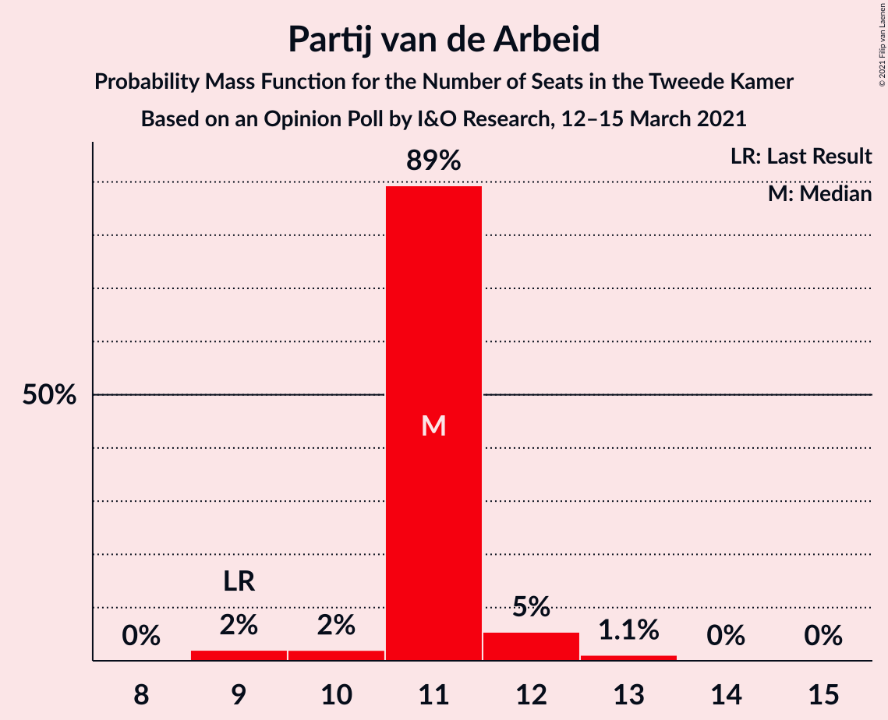

| Number of Seats | Probability | Accumulated | Special Marks |
|:---------------:|:-----------:|:-----------:|:-------------:|
| 9 | 2% | 100% | Last Result |
| 10 | 2% | 98% |  |
| 11 | 89% | 96% | Median |
| 12 | 5% | 7% |  |
| 13 | 1.1% | 1.2% |  |
| 14 | 0% | 0.1% |  |
| 15 | 0% | 0% |  |

### GroenLinks

*For a full overview of the results for this party, see the [GroenLinks](party-groenlinks.html) page.*

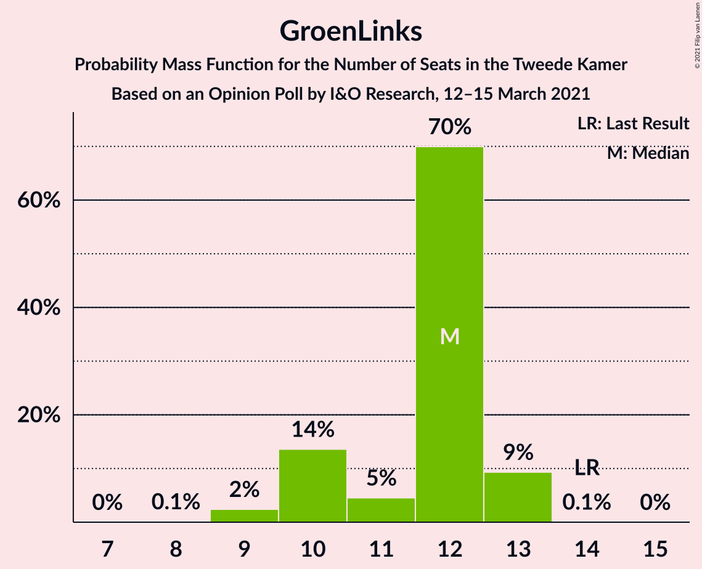

| Number of Seats | Probability | Accumulated | Special Marks |
|:---------------:|:-----------:|:-----------:|:-------------:|
| 8 | 0.1% | 100% |  |
| 9 | 2% | 99.9% |  |
| 10 | 14% | 97% |  |
| 11 | 5% | 84% |  |
| 12 | 70% | 79% | Median |
| 13 | 9% | 9% |  |
| 14 | 0.1% | 0.1% | Last Result |
| 15 | 0% | 0% |  |

### Socialistische Partij

*For a full overview of the results for this party, see the [Socialistische Partij](party-socialistischepartij.html) page.*

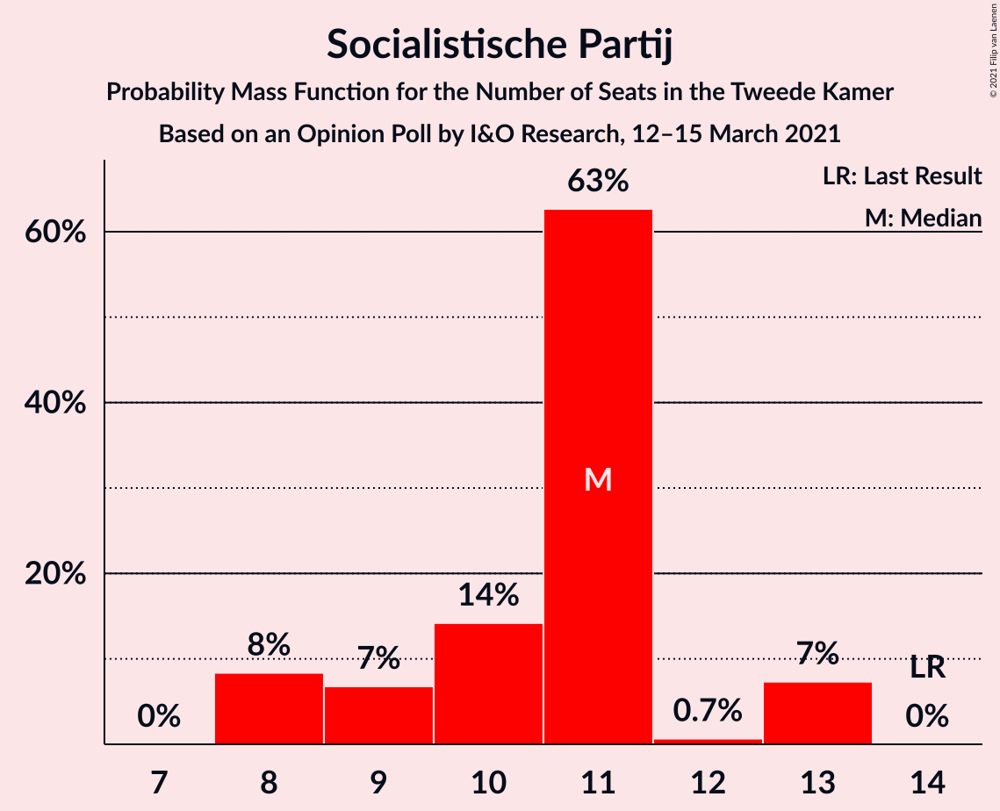

| Number of Seats | Probability | Accumulated | Special Marks |
|:---------------:|:-----------:|:-----------:|:-------------:|
| 8 | 8% | 100% |  |
| 9 | 7% | 92% |  |
| 10 | 14% | 85% |  |
| 11 | 63% | 71% | Median |
| 12 | 0.7% | 8% |  |
| 13 | 7% | 7% |  |
| 14 | 0% | 0% | Last Result |

### ChristenUnie

*For a full overview of the results for this party, see the [ChristenUnie](party-christenunie.html) page.*

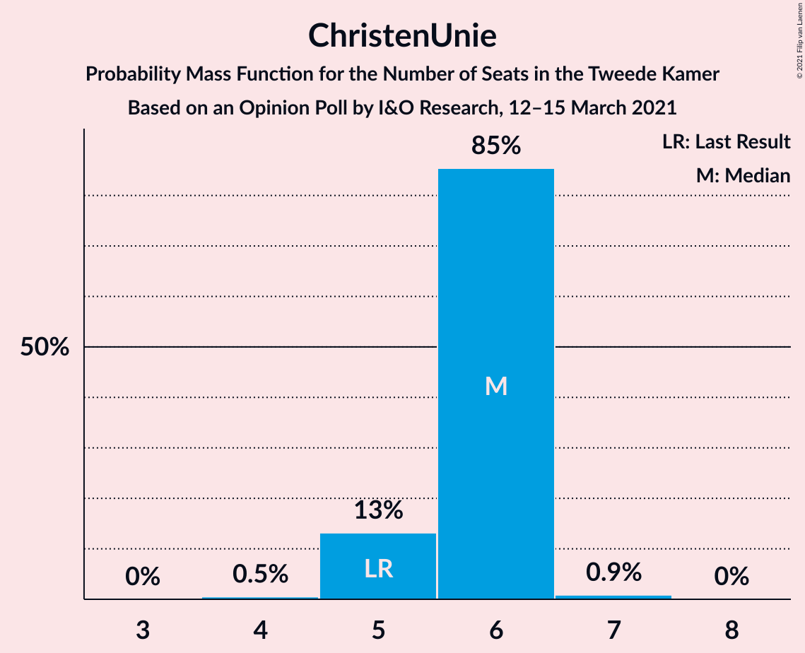

| Number of Seats | Probability | Accumulated | Special Marks |
|:---------------:|:-----------:|:-----------:|:-------------:|
| 4 | 0.5% | 100% |  |
| 5 | 13% | 99.5% | Last Result |
| 6 | 85% | 86% | Median |
| 7 | 0.9% | 0.9% |  |
| 8 | 0% | 0% |  |

### Partij voor de Dieren

*For a full overview of the results for this party, see the [Partij voor de Dieren](party-partijvoordedieren.html) page.*

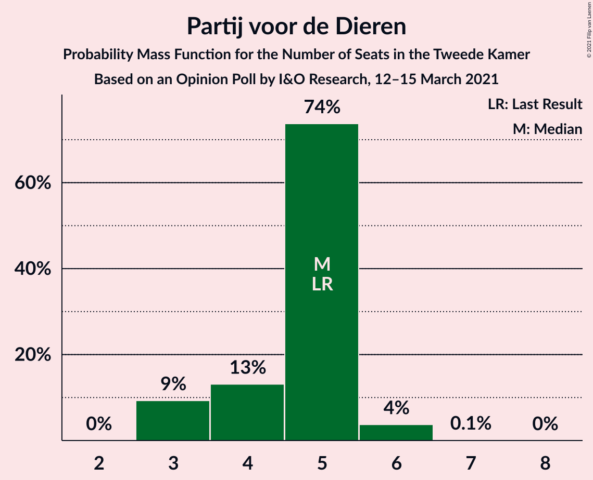

| Number of Seats | Probability | Accumulated | Special Marks |
|:---------------:|:-----------:|:-----------:|:-------------:|
| 3 | 9% | 100% |  |
| 4 | 13% | 91% |  |
| 5 | 74% | 78% | Last Result, Median |
| 6 | 4% | 4% |  |
| 7 | 0.1% | 0.1% |  |
| 8 | 0% | 0% |  |

### Forum voor Democratie

*For a full overview of the results for this party, see the [Forum voor Democratie](party-forumvoordemocratie.html) page.*

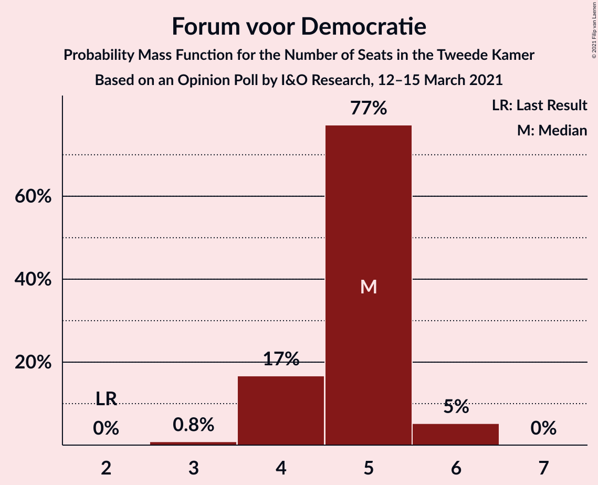

| Number of Seats | Probability | Accumulated | Special Marks |
|:---------------:|:-----------:|:-----------:|:-------------:|
| 2 | 0% | 100% | Last Result |
| 3 | 0.8% | 100% |  |
| 4 | 17% | 99.2% |  |
| 5 | 77% | 82% | Median |
| 6 | 5% | 5% |  |
| 7 | 0% | 0% |  |

### Volt Europa

*For a full overview of the results for this party, see the [Volt Europa](party-volteuropa.html) page.*

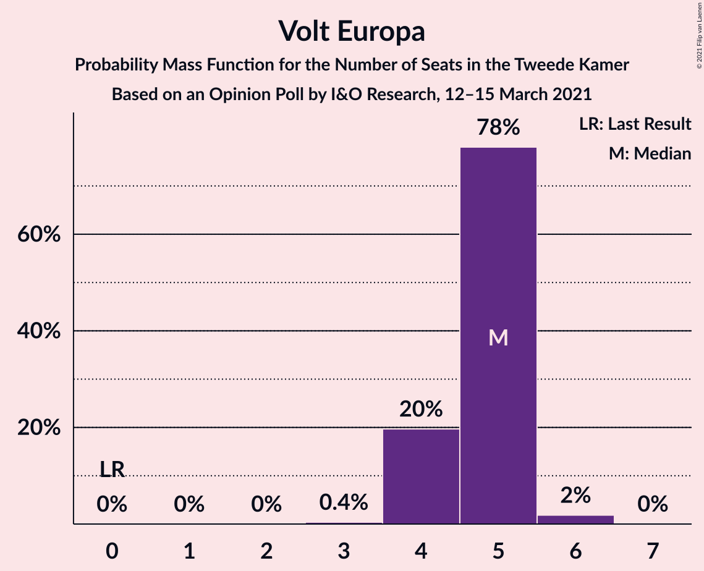

| Number of Seats | Probability | Accumulated | Special Marks |
|:---------------:|:-----------:|:-----------:|:-------------:|
| 0 | 0% | 100% | Last Result |
| 1 | 0% | 100% |  |
| 2 | 0% | 100% |  |
| 3 | 0.4% | 100% |  |
| 4 | 20% | 99.6% |  |
| 5 | 78% | 80% | Median |
| 6 | 2% | 2% |  |
| 7 | 0% | 0% |  |

### Staatkundig Gereformeerde Partij

*For a full overview of the results for this party, see the [Staatkundig Gereformeerde Partij](party-staatkundiggereformeerdepartij.html) page.*

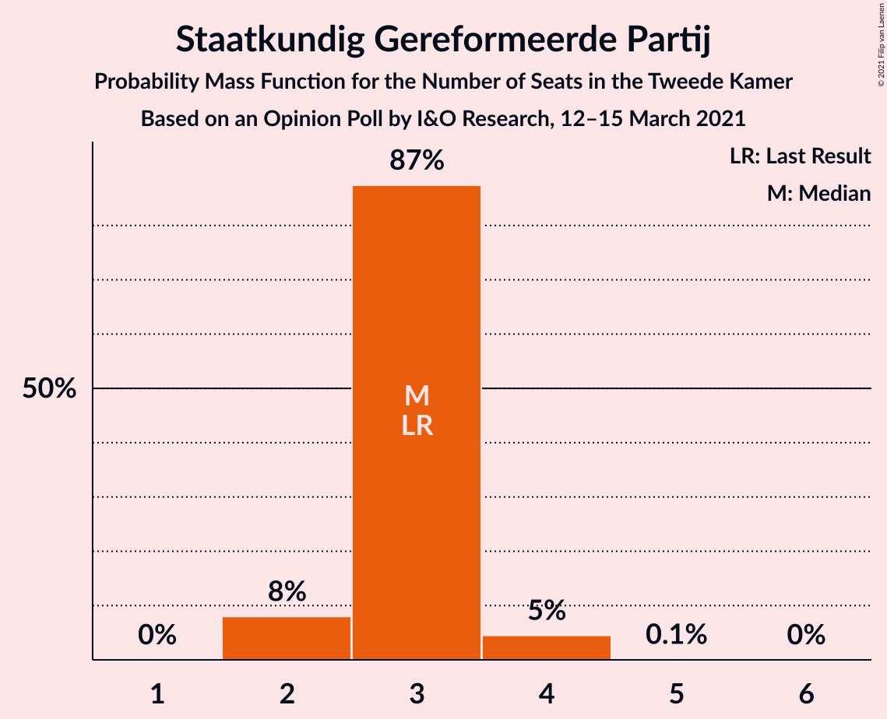

| Number of Seats | Probability | Accumulated | Special Marks |
|:---------------:|:-----------:|:-----------:|:-------------:|
| 2 | 8% | 100% |  |
| 3 | 87% | 92% | Last Result, Median |
| 4 | 5% | 5% |  |
| 5 | 0.1% | 0.1% |  |
| 6 | 0% | 0% |  |

### Juiste Antwoord 2021

*For a full overview of the results for this party, see the [Juiste Antwoord 2021](party-juisteantwoord2021.html) page.*

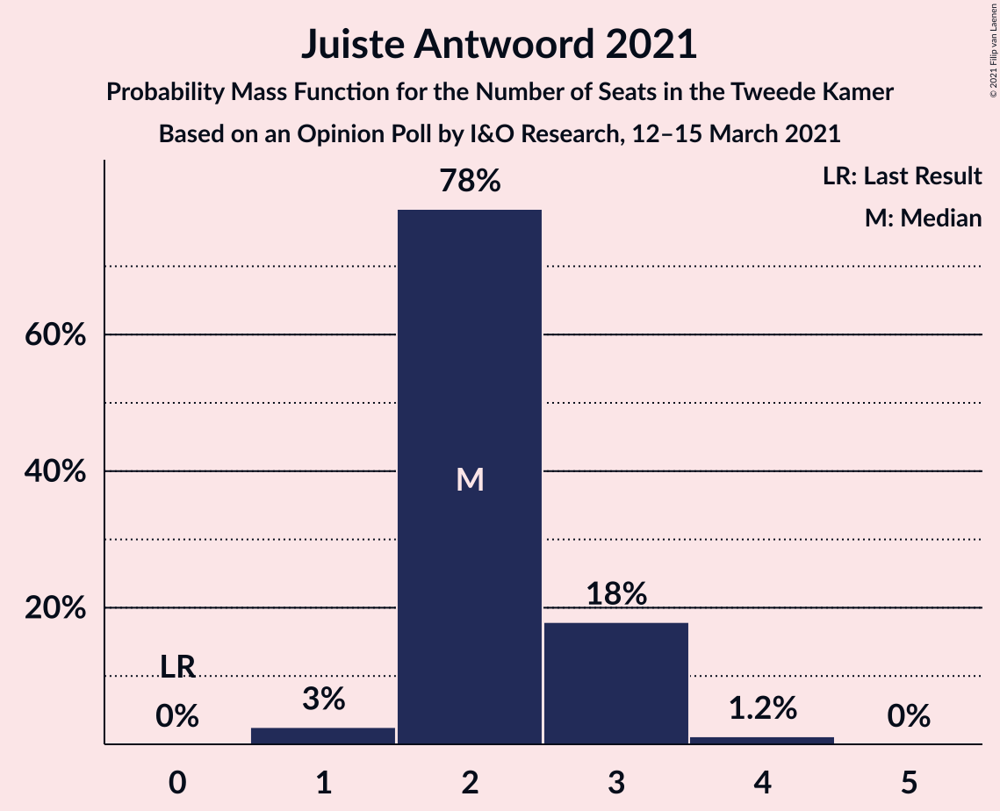

| Number of Seats | Probability | Accumulated | Special Marks |
|:---------------:|:-----------:|:-----------:|:-------------:|
| 0 | 0% | 100% | Last Result |
| 1 | 3% | 100% |  |
| 2 | 78% | 97% | Median |
| 3 | 18% | 19% |  |
| 4 | 1.2% | 1.2% |  |
| 5 | 0% | 0% |  |

### DENK

*For a full overview of the results for this party, see the [DENK](party-denk.html) page.*

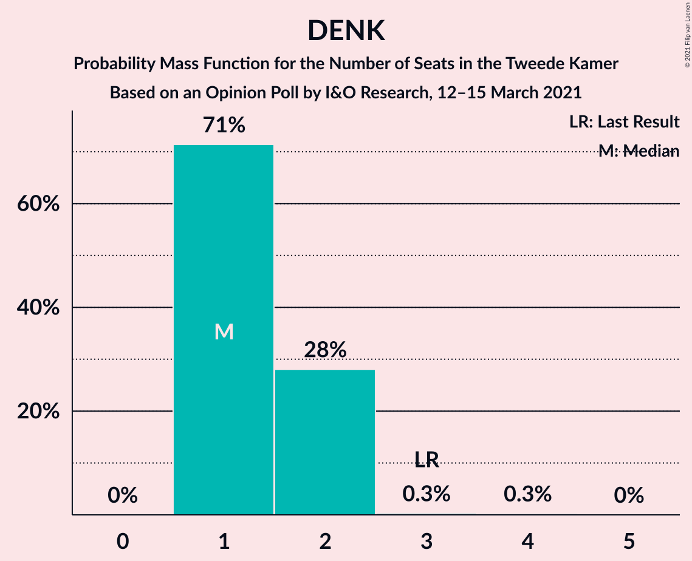

| Number of Seats | Probability | Accumulated | Special Marks |
|:---------------:|:-----------:|:-----------:|:-------------:|
| 1 | 71% | 100% | Median |
| 2 | 28% | 29% |  |
| 3 | 0.3% | 0.5% | Last Result |
| 4 | 0.3% | 0.3% |  |
| 5 | 0% | 0% |  |

### 50Plus

*For a full overview of the results for this party, see the [50Plus](party-50plus.html) page.*

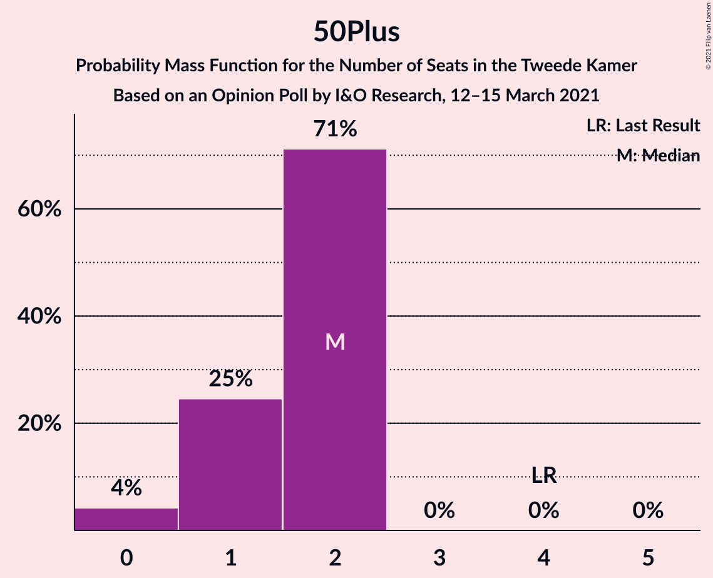

| Number of Seats | Probability | Accumulated | Special Marks |
|:---------------:|:-----------:|:-----------:|:-------------:|
| 0 | 4% | 100% |  |
| 1 | 25% | 96% |  |
| 2 | 71% | 71% | Median |
| 3 | 0% | 0% |  |
| 4 | 0% | 0% | Last Result |

### BoerBurgerBeweging

*For a full overview of the results for this party, see the [BoerBurgerBeweging](party-boerburgerbeweging.html) page.*

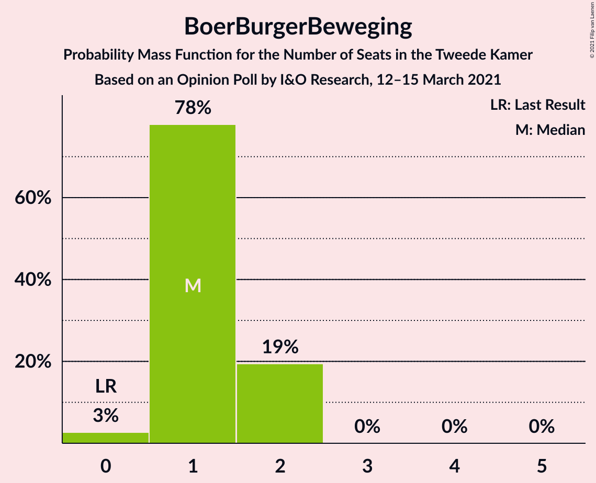

| Number of Seats | Probability | Accumulated | Special Marks |
|:---------------:|:-----------:|:-----------:|:-------------:|
| 0 | 3% | 100% | Last Result |
| 1 | 78% | 97% | Median |
| 2 | 19% | 19% |  |
| 3 | 0% | 0% |  |

### Bij1

*For a full overview of the results for this party, see the [Bij1](party-bij1.html) page.*

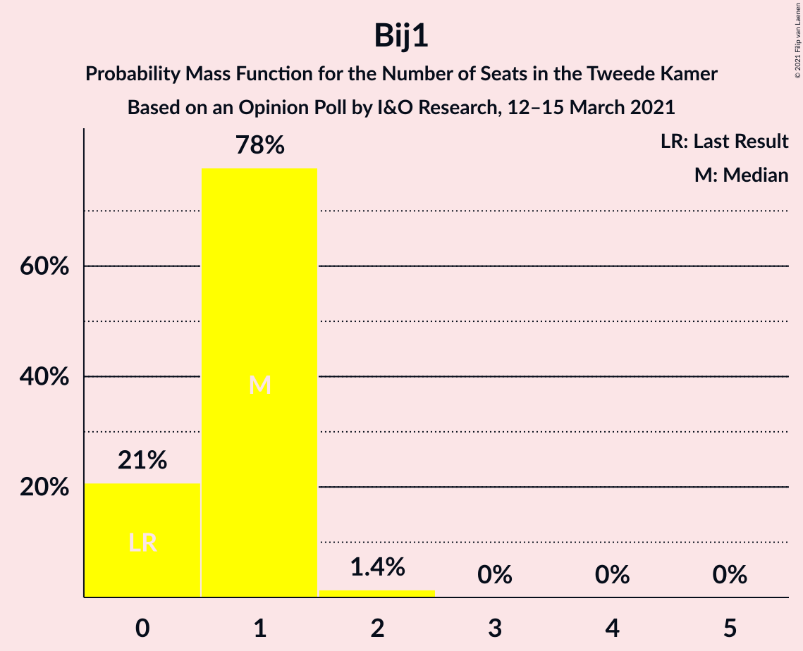

| Number of Seats | Probability | Accumulated | Special Marks |
|:---------------:|:-----------:|:-----------:|:-------------:|
| 0 | 21% | 100% | Last Result |
| 1 | 78% | 79% | Median |
| 2 | 1.4% | 1.4% |  |
| 3 | 0% | 0% |  |

### Code Oranje

*For a full overview of the results for this party, see the [Code Oranje](party-codeoranje.html) page.*

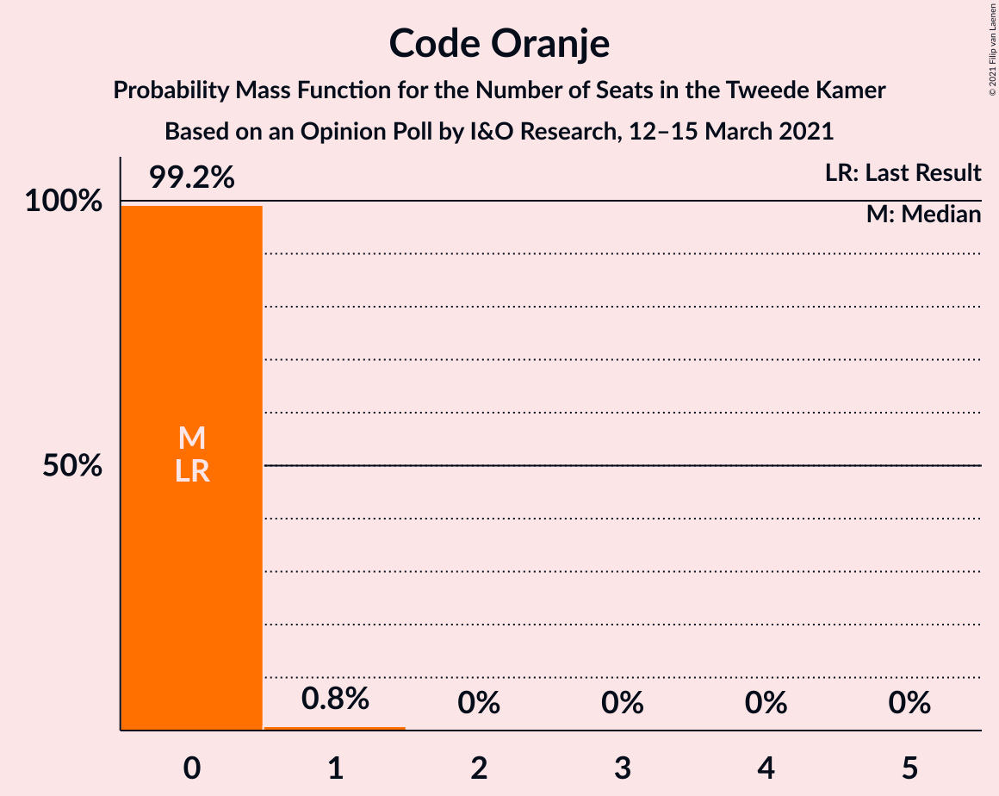

| Number of Seats | Probability | Accumulated | Special Marks |
|:---------------:|:-----------:|:-----------:|:-------------:|
| 0 | 99.2% | 100% | Last Result, Median |
| 1 | 0.8% | 0.8% |  |
| 2 | 0% | 0% |  |

### Piratenpartij

*For a full overview of the results for this party, see the [Piratenpartij](party-piratenpartij.html) page.*

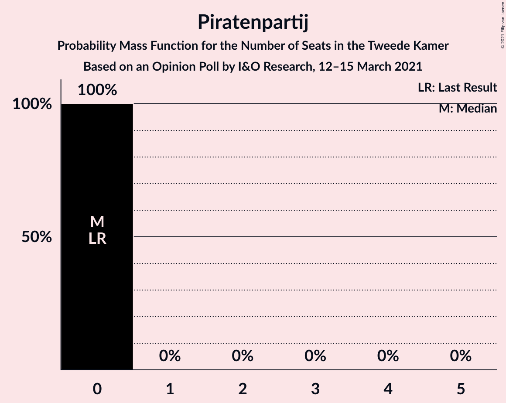

| Number of Seats | Probability | Accumulated | Special Marks |
|:---------------:|:-----------:|:-----------:|:-------------:|
| 0 | 100% | 100% | Last Result, Median |

## Coalitions

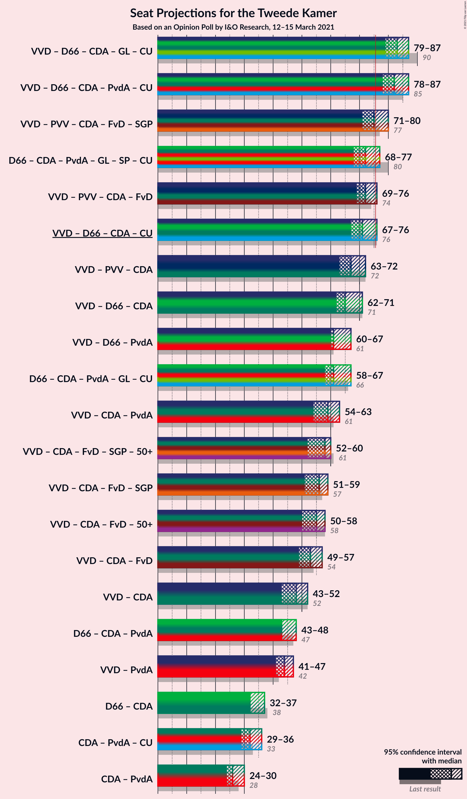

### Confidence Intervals

| Coalition | Last Result | Median | Majority? | 80% Confidence Interval | 90% Confidence Interval | 95% Confidence Interval | 99% Confidence Interval |
|:---------:|:-----------:|:------:|:---------:|:-----------------------:|:-----------------------:|:-----------------------:|:-----------------------:|
| Volkspartij voor Vrijheid en Democratie – Democraten 66 – Christen-Democratisch Appèl – GroenLinks – ChristenUnie | 90 | 83 | 100% | 83–86 | 79–87 | 79–87 | 78–87 |
| Volkspartij voor Vrijheid en Democratie – Democraten 66 – Christen-Democratisch Appèl – Partij van de Arbeid – ChristenUnie | 85 | 82 | 100% | 82–85 | 78–85 | 78–87 | 78–89 |
| Volkspartij voor Vrijheid en Democratie – Partij voor de Vrijheid – Christen-Democratisch Appèl – Forum voor Democratie – Staatkundig Gereformeerde Partij | 77 | 75 | 19% | 74–79 | 71–79 | 71–80 | 70–83 |
| Democraten 66 – Christen-Democratisch Appèl – Partij van de Arbeid – GroenLinks – Socialistische Partij – ChristenUnie | 80 | 72 | 10% | 70–75 | 69–77 | 68–77 | 68–77 |
| Volkspartij voor Vrijheid en Democratie – Partij voor de Vrijheid – Christen-Democratisch Appèl – Forum voor Democratie | 74 | 72 | 11% | 71–76 | 69–76 | 69–76 | 67–79 |
| Volkspartij voor Vrijheid en Democratie – Democraten 66 – Christen-Democratisch Appèl – ChristenUnie | 76 | 71 | 4% | 71–74 | 68–74 | 67–76 | 67–77 |
| Volkspartij voor Vrijheid en Democratie – Partij voor de Vrijheid – Christen-Democratisch Appèl | 72 | 67 | 0% | 67–71 | 63–71 | 63–72 | 63–74 |
| Volkspartij voor Vrijheid en Democratie – Democraten 66 – Christen-Democratisch Appèl | 71 | 65 | 0% | 65–68 | 62–69 | 62–71 | 62–71 |
| Volkspartij voor Vrijheid en Democratie – Democraten 66 – Partij van de Arbeid | 61 | 61 | 0% | 60–63 | 60–65 | 60–67 | 58–67 |
| Democraten 66 – Christen-Democratisch Appèl – Partij van de Arbeid – GroenLinks – ChristenUnie | 66 | 61 | 0% | 60–65 | 60–67 | 58–67 | 58–67 |
| Volkspartij voor Vrijheid en Democratie – Christen-Democratisch Appèl – Partij van de Arbeid | 61 | 59 | 0% | 58–61 | 55–62 | 54–63 | 54–64 |
| Volkspartij voor Vrijheid en Democratie – Christen-Democratisch Appèl – Forum voor Democratie – Staatkundig Gereformeerde Partij – 50Plus | 61 | 58 | 0% | 56–59 | 53–59 | 52–60 | 52–63 |
| Volkspartij voor Vrijheid en Democratie – Christen-Democratisch Appèl – Forum voor Democratie – Staatkundig Gereformeerde Partij | 57 | 56 | 0% | 55–57 | 52–58 | 51–59 | 51–63 |
| Volkspartij voor Vrijheid en Democratie – Christen-Democratisch Appèl – Forum voor Democratie – 50Plus | 58 | 55 | 0% | 53–56 | 50–56 | 50–58 | 50–59 |
| Volkspartij voor Vrijheid en Democratie – Christen-Democratisch Appèl – Forum voor Democratie | 54 | 53 | 0% | 52–54 | 49–54 | 49–57 | 49–59 |
| Volkspartij voor Vrijheid en Democratie – Christen-Democratisch Appèl | 52 | 48 | 0% | 47–50 | 44–50 | 43–52 | 43–54 |
| Democraten 66 – Christen-Democratisch Appèl – Partij van de Arbeid | 47 | 43 | 0% | 43–48 | 43–48 | 43–48 | 42–50 |
| Volkspartij voor Vrijheid en Democratie – Partij van de Arbeid | 42 | 44 | 0% | 42–45 | 41–46 | 41–47 | 41–47 |
| Democraten 66 – Christen-Democratisch Appèl | 38 | 32 | 0% | 32–37 | 32–37 | 32–37 | 31–38 |
| Christen-Democratisch Appèl – Partij van de Arbeid – ChristenUnie | 33 | 32 | 0% | 31–35 | 29–36 | 29–36 | 29–36 |
| Christen-Democratisch Appèl – Partij van de Arbeid | 28 | 26 | 0% | 25–29 | 24–30 | 24–30 | 23–30 |

### Volkspartij voor Vrijheid en Democratie – Democraten 66 – Christen-Democratisch Appèl – GroenLinks – ChristenUnie

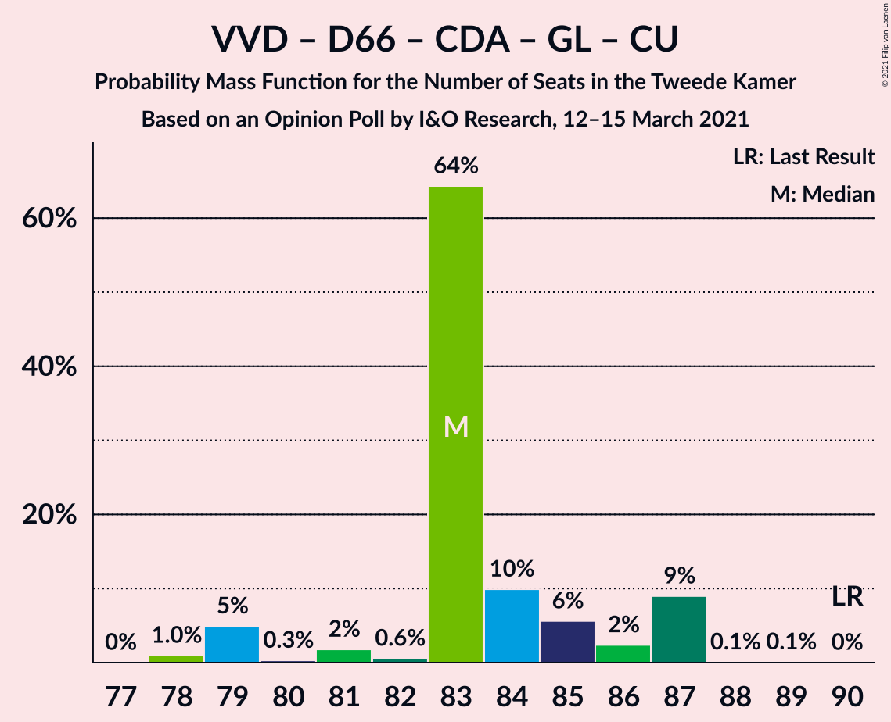

| Number of Seats | Probability | Accumulated | Special Marks |
|:---------------:|:-----------:|:-----------:|:-------------:|
| 78 | 1.0% | 100% |  |
| 79 | 5% | 99.0% |  |
| 80 | 0.3% | 94% |  |
| 81 | 2% | 94% |  |
| 82 | 0.6% | 92% |  |
| 83 | 64% | 91% | Median |
| 84 | 10% | 27% |  |
| 85 | 6% | 17% |  |
| 86 | 2% | 12% |  |
| 87 | 9% | 9% |  |
| 88 | 0.1% | 0.2% |  |
| 89 | 0.1% | 0.1% |  |
| 90 | 0% | 0% | Last Result |

### Volkspartij voor Vrijheid en Democratie – Democraten 66 – Christen-Democratisch Appèl – Partij van de Arbeid – ChristenUnie

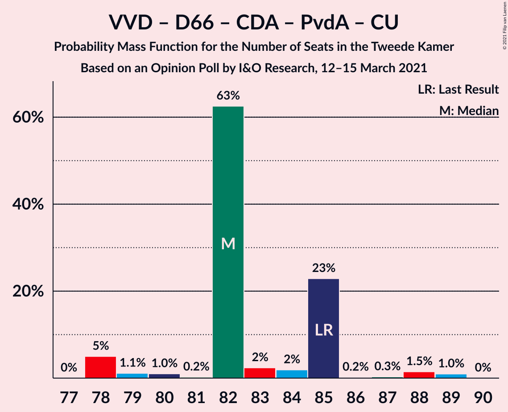

| Number of Seats | Probability | Accumulated | Special Marks |
|:---------------:|:-----------:|:-----------:|:-------------:|
| 78 | 5% | 100% |  |
| 79 | 1.1% | 95% |  |
| 80 | 1.0% | 94% |  |
| 81 | 0.2% | 93% |  |
| 82 | 63% | 93% | Median |
| 83 | 2% | 30% |  |
| 84 | 2% | 28% |  |
| 85 | 23% | 26% | Last Result |
| 86 | 0.2% | 3% |  |
| 87 | 0.3% | 3% |  |
| 88 | 1.5% | 2% |  |
| 89 | 1.0% | 1.0% |  |
| 90 | 0% | 0% |  |

### Volkspartij voor Vrijheid en Democratie – Partij voor de Vrijheid – Christen-Democratisch Appèl – Forum voor Democratie – Staatkundig Gereformeerde Partij

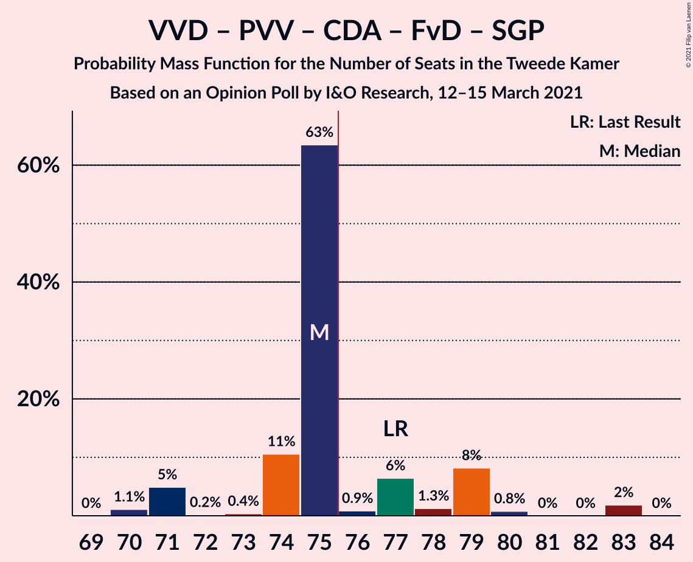

| Number of Seats | Probability | Accumulated | Special Marks |
|:---------------:|:-----------:|:-----------:|:-------------:|
| 70 | 1.1% | 100% |  |
| 71 | 5% | 98.9% |  |
| 72 | 0.2% | 94% |  |
| 73 | 0.4% | 94% |  |
| 74 | 11% | 93% |  |
| 75 | 63% | 83% | Median |
| 76 | 0.9% | 19% | Majority |
| 77 | 6% | 19% | Last Result |
| 78 | 1.3% | 12% |  |
| 79 | 8% | 11% |  |
| 80 | 0.8% | 3% |  |
| 81 | 0% | 2% |  |
| 82 | 0% | 2% |  |
| 83 | 2% | 2% |  |
| 84 | 0% | 0% |  |

### Democraten 66 – Christen-Democratisch Appèl – Partij van de Arbeid – GroenLinks – Socialistische Partij – ChristenUnie

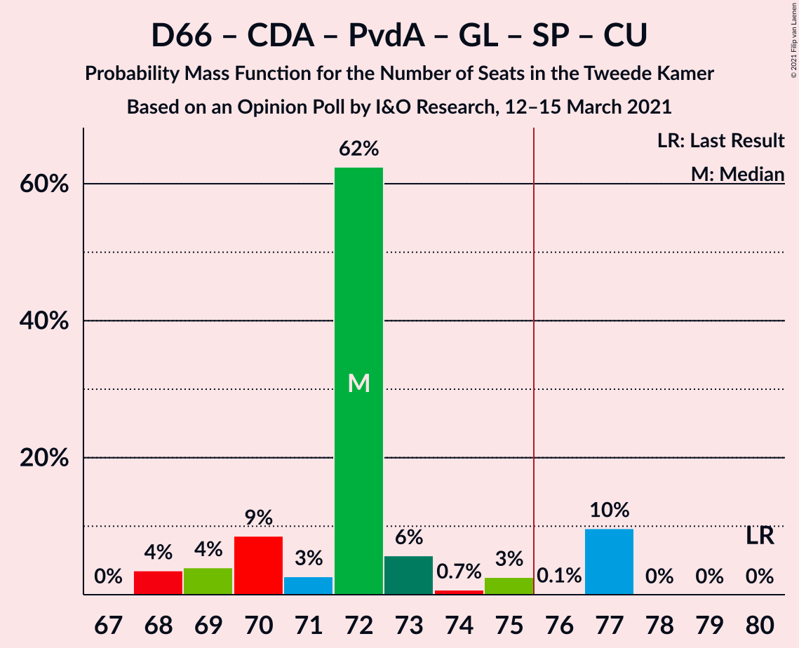

| Number of Seats | Probability | Accumulated | Special Marks |
|:---------------:|:-----------:|:-----------:|:-------------:|
| 68 | 4% | 100% |  |
| 69 | 4% | 96% |  |
| 70 | 9% | 92% |  |
| 71 | 3% | 84% |  |
| 72 | 62% | 81% | Median |
| 73 | 6% | 19% |  |
| 74 | 0.7% | 13% |  |
| 75 | 3% | 12% |  |
| 76 | 0.1% | 10% | Majority |
| 77 | 10% | 10% |  |
| 78 | 0% | 0% |  |
| 79 | 0% | 0% |  |
| 80 | 0% | 0% | Last Result |

### Volkspartij voor Vrijheid en Democratie – Partij voor de Vrijheid – Christen-Democratisch Appèl – Forum voor Democratie

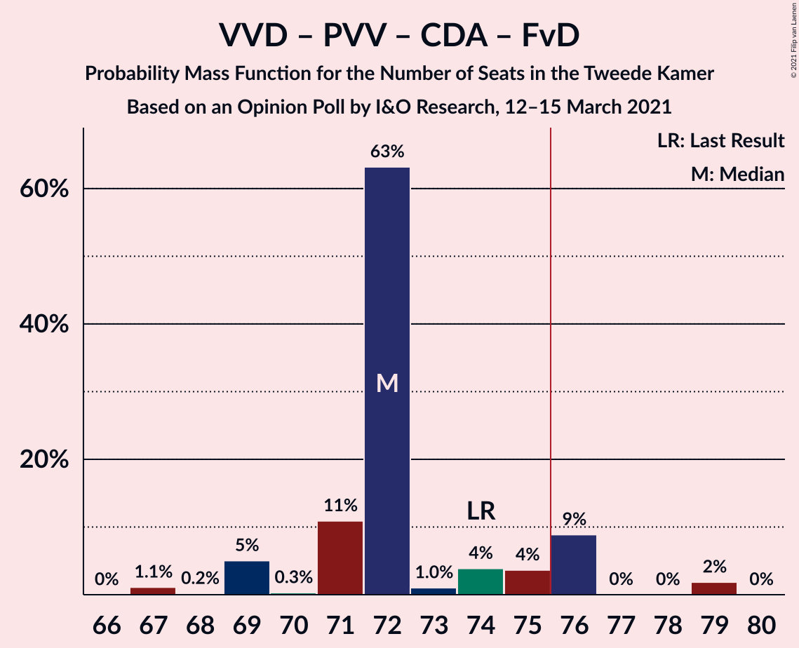

| Number of Seats | Probability | Accumulated | Special Marks |
|:---------------:|:-----------:|:-----------:|:-------------:|
| 67 | 1.1% | 100% |  |
| 68 | 0.2% | 98.9% |  |
| 69 | 5% | 98.7% |  |
| 70 | 0.3% | 94% |  |
| 71 | 11% | 93% |  |
| 72 | 63% | 82% | Median |
| 73 | 1.0% | 19% |  |
| 74 | 4% | 18% | Last Result |
| 75 | 4% | 14% |  |
| 76 | 9% | 11% | Majority |
| 77 | 0% | 2% |  |
| 78 | 0% | 2% |  |
| 79 | 2% | 2% |  |
| 80 | 0% | 0% |  |

### Volkspartij voor Vrijheid en Democratie – Democraten 66 – Christen-Democratisch Appèl – ChristenUnie

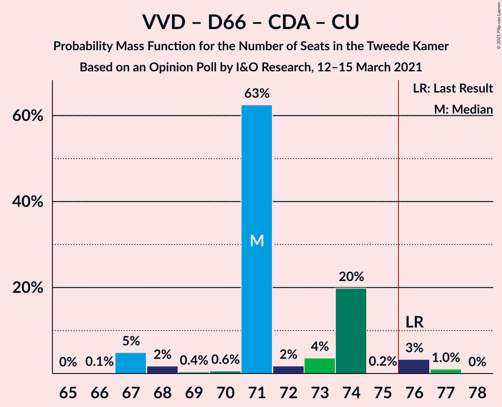

| Number of Seats | Probability | Accumulated | Special Marks |
|:---------------:|:-----------:|:-----------:|:-------------:|
| 66 | 0.1% | 100% |  |
| 67 | 5% | 99.9% |  |
| 68 | 2% | 95% |  |
| 69 | 0.4% | 93% |  |
| 70 | 0.6% | 93% |  |
| 71 | 63% | 92% | Median |
| 72 | 2% | 30% |  |
| 73 | 4% | 28% |  |
| 74 | 20% | 24% |  |
| 75 | 0.2% | 5% |  |
| 76 | 3% | 4% | Last Result, Majority |
| 77 | 1.0% | 1.1% |  |
| 78 | 0% | 0% |  |

### Volkspartij voor Vrijheid en Democratie – Partij voor de Vrijheid – Christen-Democratisch Appèl

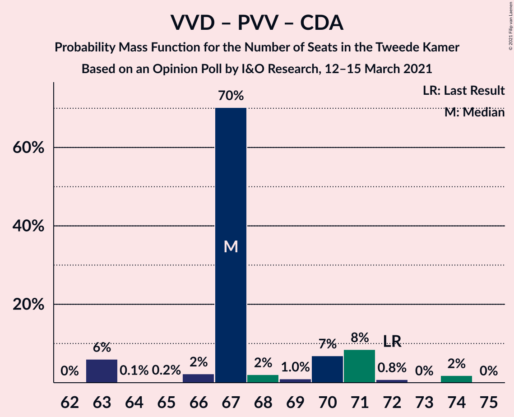

| Number of Seats | Probability | Accumulated | Special Marks |
|:---------------:|:-----------:|:-----------:|:-------------:|
| 63 | 6% | 100% |  |
| 64 | 0.1% | 94% |  |
| 65 | 0.2% | 94% |  |
| 66 | 2% | 94% |  |
| 67 | 70% | 91% | Median |
| 68 | 2% | 21% |  |
| 69 | 1.0% | 19% |  |
| 70 | 7% | 18% |  |
| 71 | 8% | 11% |  |
| 72 | 0.8% | 3% | Last Result |
| 73 | 0% | 2% |  |
| 74 | 2% | 2% |  |
| 75 | 0% | 0% |  |

### Volkspartij voor Vrijheid en Democratie – Democraten 66 – Christen-Democratisch Appèl

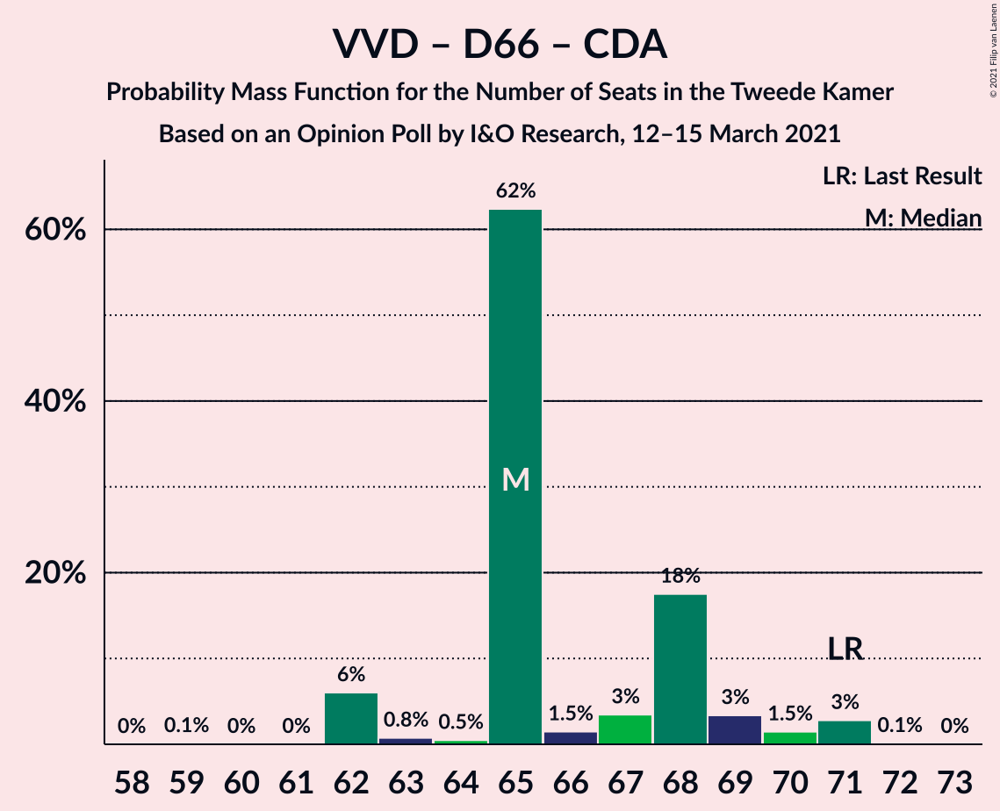

| Number of Seats | Probability | Accumulated | Special Marks |
|:---------------:|:-----------:|:-----------:|:-------------:|
| 59 | 0.1% | 100% |  |
| 60 | 0% | 99.9% |  |
| 61 | 0% | 99.9% |  |
| 62 | 6% | 99.9% |  |
| 63 | 0.8% | 94% |  |
| 64 | 0.5% | 93% |  |
| 65 | 62% | 93% | Median |
| 66 | 1.5% | 30% |  |
| 67 | 3% | 29% |  |
| 68 | 18% | 25% |  |
| 69 | 3% | 8% |  |
| 70 | 1.5% | 4% |  |
| 71 | 3% | 3% | Last Result |
| 72 | 0.1% | 0.1% |  |
| 73 | 0% | 0% |  |

### Volkspartij voor Vrijheid en Democratie – Democraten 66 – Partij van de Arbeid

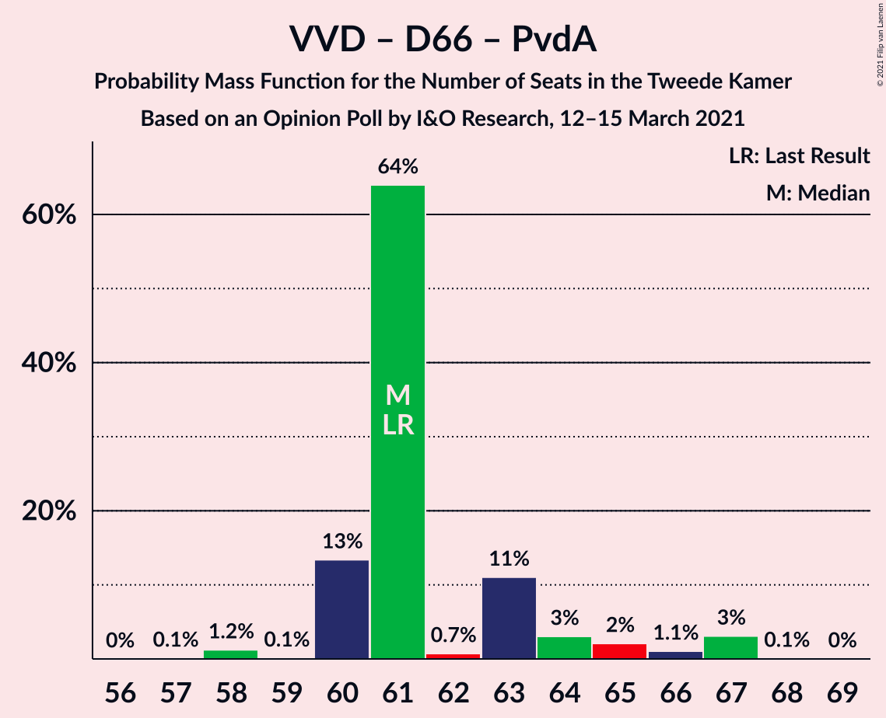

| Number of Seats | Probability | Accumulated | Special Marks |
|:---------------:|:-----------:|:-----------:|:-------------:|
| 57 | 0.1% | 100% |  |
| 58 | 1.2% | 99.9% |  |
| 59 | 0.1% | 98.7% |  |
| 60 | 13% | 98.5% |  |
| 61 | 64% | 85% | Last Result, Median |
| 62 | 0.7% | 21% |  |
| 63 | 11% | 20% |  |
| 64 | 3% | 9% |  |
| 65 | 2% | 6% |  |
| 66 | 1.1% | 4% |  |
| 67 | 3% | 3% |  |
| 68 | 0.1% | 0.1% |  |
| 69 | 0% | 0% |  |

### Democraten 66 – Christen-Democratisch Appèl – Partij van de Arbeid – GroenLinks – ChristenUnie

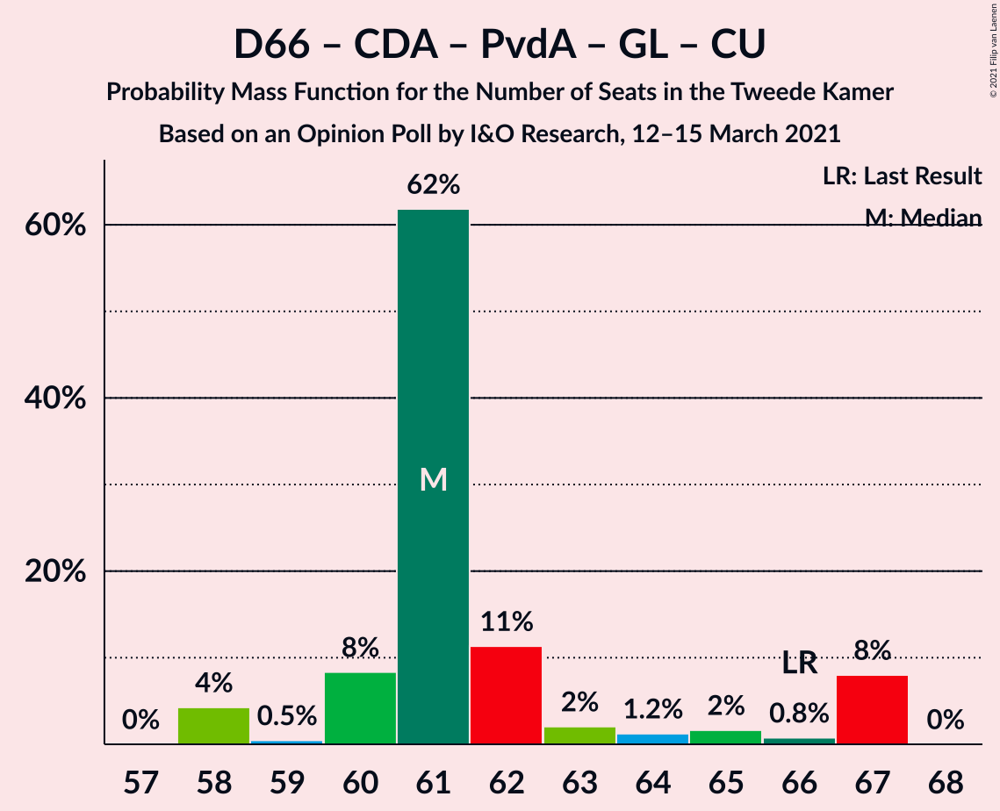

| Number of Seats | Probability | Accumulated | Special Marks |
|:---------------:|:-----------:|:-----------:|:-------------:|
| 58 | 4% | 100% |  |
| 59 | 0.5% | 96% |  |
| 60 | 8% | 95% |  |
| 61 | 62% | 87% | Median |
| 62 | 11% | 25% |  |
| 63 | 2% | 14% |  |
| 64 | 1.2% | 12% |  |
| 65 | 2% | 10% |  |
| 66 | 0.8% | 9% | Last Result |
| 67 | 8% | 8% |  |
| 68 | 0% | 0% |  |

### Volkspartij voor Vrijheid en Democratie – Christen-Democratisch Appèl – Partij van de Arbeid

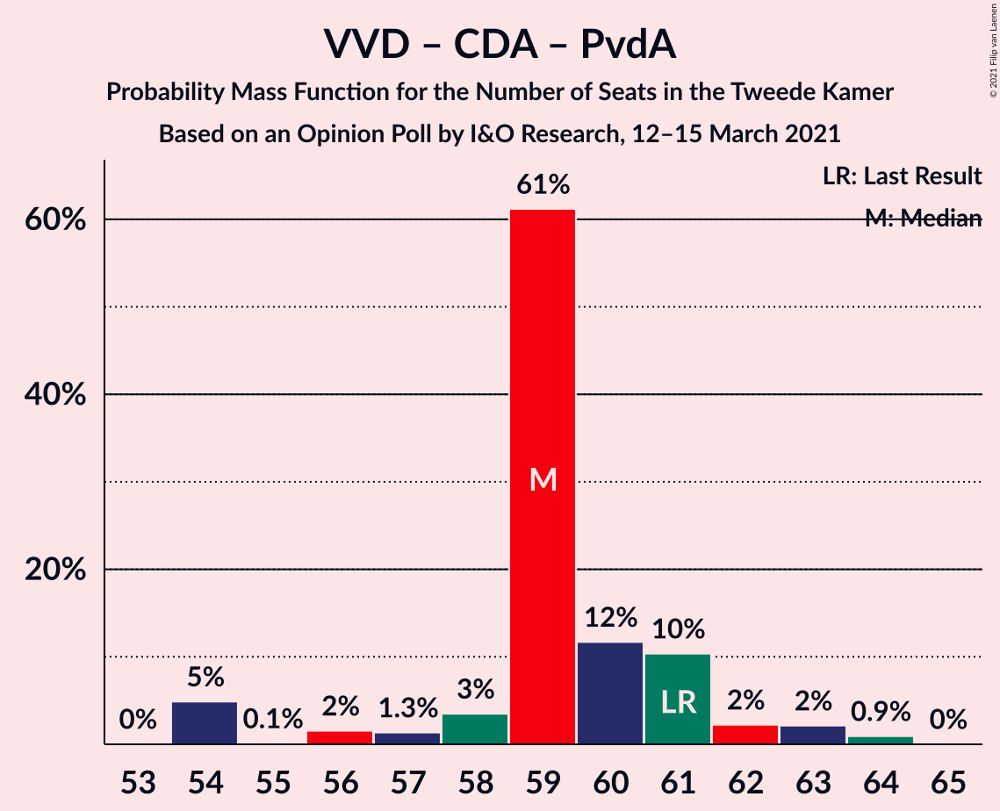

| Number of Seats | Probability | Accumulated | Special Marks |
|:---------------:|:-----------:|:-----------:|:-------------:|
| 54 | 5% | 100% |  |
| 55 | 0.1% | 95% |  |
| 56 | 2% | 95% |  |
| 57 | 1.3% | 93% |  |
| 58 | 3% | 92% |  |
| 59 | 61% | 89% | Median |
| 60 | 12% | 27% |  |
| 61 | 10% | 16% | Last Result |
| 62 | 2% | 5% |  |
| 63 | 2% | 3% |  |
| 64 | 0.9% | 1.0% |  |
| 65 | 0% | 0% |  |

### Volkspartij voor Vrijheid en Democratie – Christen-Democratisch Appèl – Forum voor Democratie – Staatkundig Gereformeerde Partij – 50Plus

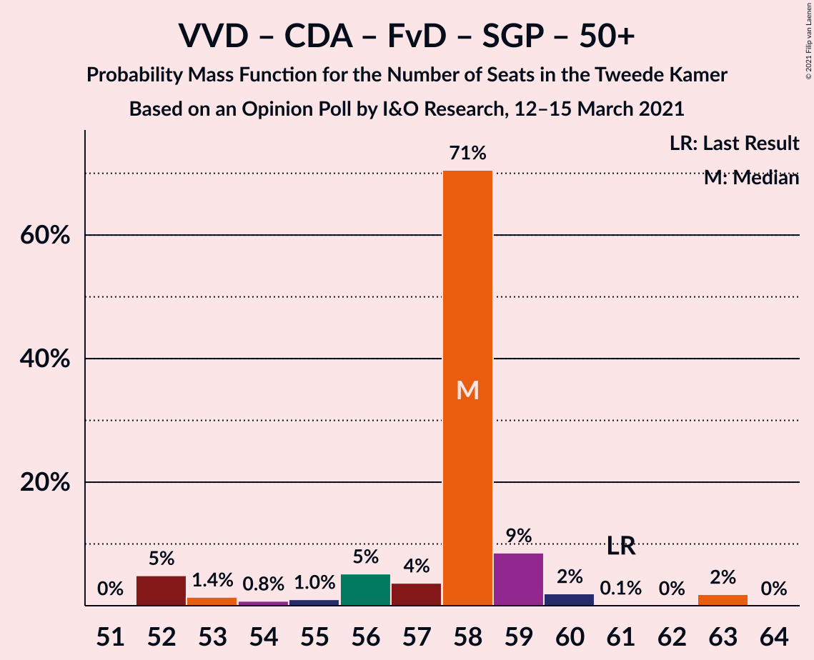

| Number of Seats | Probability | Accumulated | Special Marks |
|:---------------:|:-----------:|:-----------:|:-------------:|
| 52 | 5% | 100% |  |
| 53 | 1.4% | 95% |  |
| 54 | 0.8% | 94% |  |
| 55 | 1.0% | 93% |  |
| 56 | 5% | 92% |  |
| 57 | 4% | 87% |  |
| 58 | 71% | 83% | Median |
| 59 | 9% | 13% |  |
| 60 | 2% | 4% |  |
| 61 | 0.1% | 2% | Last Result |
| 62 | 0% | 2% |  |
| 63 | 2% | 2% |  |
| 64 | 0% | 0% |  |

### Volkspartij voor Vrijheid en Democratie – Christen-Democratisch Appèl – Forum voor Democratie – Staatkundig Gereformeerde Partij

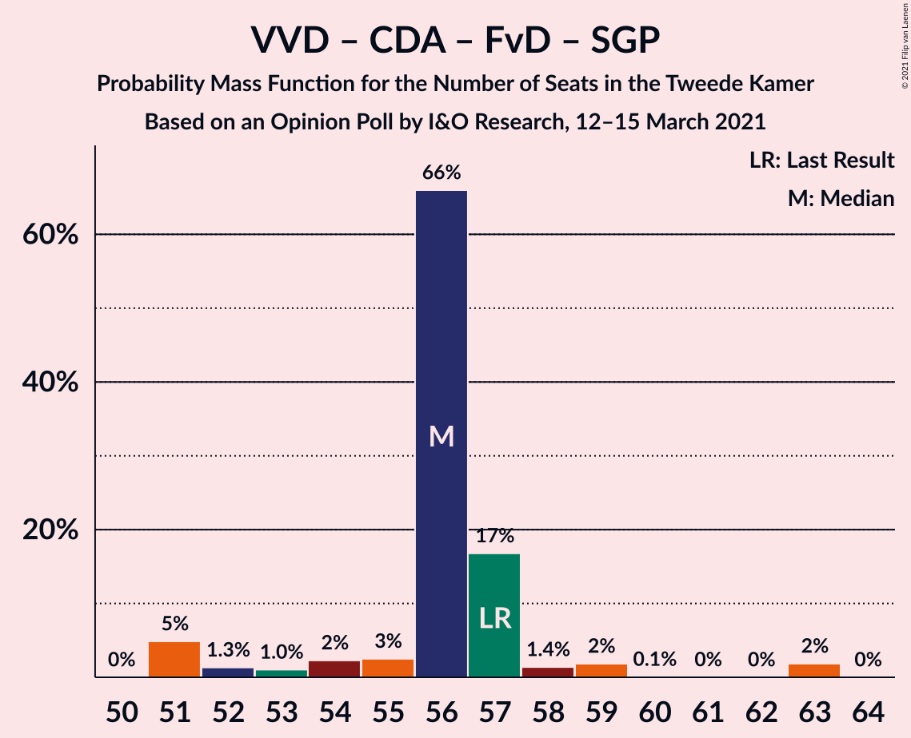

| Number of Seats | Probability | Accumulated | Special Marks |
|:---------------:|:-----------:|:-----------:|:-------------:|
| 51 | 5% | 100% |  |
| 52 | 1.3% | 95% |  |
| 53 | 1.0% | 94% |  |
| 54 | 2% | 93% |  |
| 55 | 3% | 90% |  |
| 56 | 66% | 88% | Median |
| 57 | 17% | 22% | Last Result |
| 58 | 1.4% | 5% |  |
| 59 | 2% | 4% |  |
| 60 | 0.1% | 2% |  |
| 61 | 0% | 2% |  |
| 62 | 0% | 2% |  |
| 63 | 2% | 2% |  |
| 64 | 0% | 0% |  |

### Volkspartij voor Vrijheid en Democratie – Christen-Democratisch Appèl – Forum voor Democratie – 50Plus

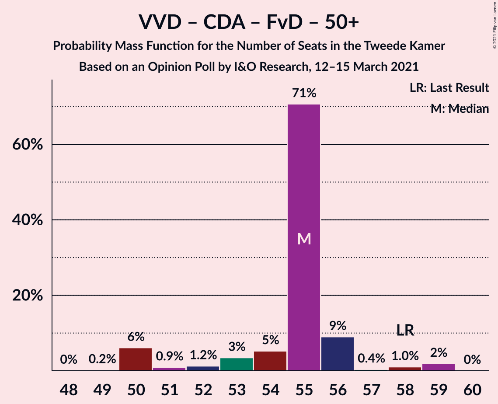

| Number of Seats | Probability | Accumulated | Special Marks |
|:---------------:|:-----------:|:-----------:|:-------------:|
| 49 | 0.2% | 100% |  |
| 50 | 6% | 99.8% |  |
| 51 | 0.9% | 94% |  |
| 52 | 1.2% | 93% |  |
| 53 | 3% | 92% |  |
| 54 | 5% | 88% |  |
| 55 | 71% | 83% | Median |
| 56 | 9% | 12% |  |
| 57 | 0.4% | 3% |  |
| 58 | 1.0% | 3% | Last Result |
| 59 | 2% | 2% |  |
| 60 | 0% | 0% |  |

### Volkspartij voor Vrijheid en Democratie – Christen-Democratisch Appèl – Forum voor Democratie

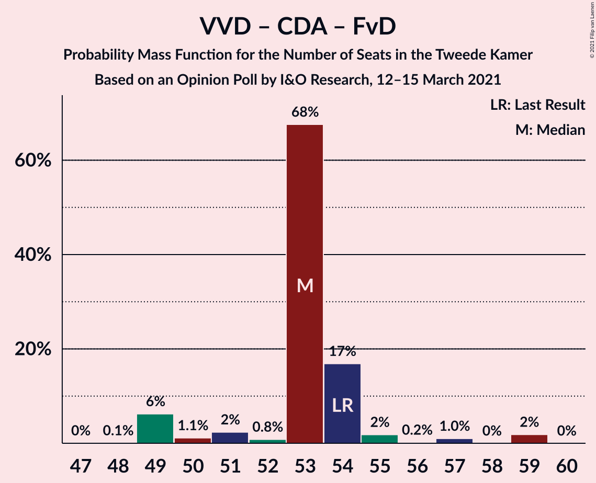

| Number of Seats | Probability | Accumulated | Special Marks |
|:---------------:|:-----------:|:-----------:|:-------------:|
| 48 | 0.1% | 100% |  |
| 49 | 6% | 99.9% |  |
| 50 | 1.1% | 94% |  |
| 51 | 2% | 93% |  |
| 52 | 0.8% | 90% |  |
| 53 | 68% | 89% | Median |
| 54 | 17% | 22% | Last Result |
| 55 | 2% | 5% |  |
| 56 | 0.2% | 3% |  |
| 57 | 1.0% | 3% |  |
| 58 | 0% | 2% |  |
| 59 | 2% | 2% |  |
| 60 | 0% | 0% |  |

### Volkspartij voor Vrijheid en Democratie – Christen-Democratisch Appèl

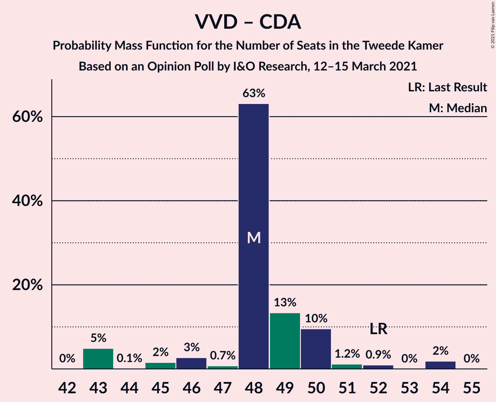

| Number of Seats | Probability | Accumulated | Special Marks |
|:---------------:|:-----------:|:-----------:|:-------------:|
| 43 | 5% | 100% |  |
| 44 | 0.1% | 95% |  |
| 45 | 2% | 95% |  |
| 46 | 3% | 93% |  |
| 47 | 0.7% | 91% |  |
| 48 | 63% | 90% | Median |
| 49 | 13% | 27% |  |
| 50 | 10% | 14% |  |
| 51 | 1.2% | 4% |  |
| 52 | 0.9% | 3% | Last Result |
| 53 | 0% | 2% |  |
| 54 | 2% | 2% |  |
| 55 | 0% | 0% |  |

### Democraten 66 – Christen-Democratisch Appèl – Partij van de Arbeid

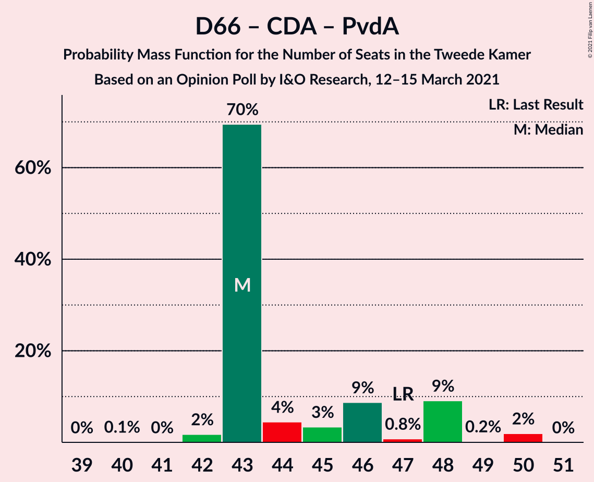

| Number of Seats | Probability | Accumulated | Special Marks |
|:---------------:|:-----------:|:-----------:|:-------------:|
| 40 | 0.1% | 100% |  |
| 41 | 0% | 99.9% |  |
| 42 | 2% | 99.9% |  |
| 43 | 70% | 98% | Median |
| 44 | 4% | 29% |  |
| 45 | 3% | 24% |  |
| 46 | 9% | 21% |  |
| 47 | 0.8% | 12% | Last Result |
| 48 | 9% | 11% |  |
| 49 | 0.2% | 2% |  |
| 50 | 2% | 2% |  |
| 51 | 0% | 0% |  |

### Volkspartij voor Vrijheid en Democratie – Partij van de Arbeid

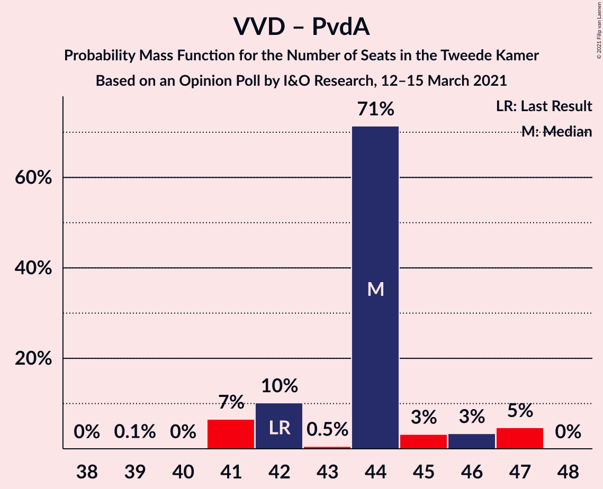

| Number of Seats | Probability | Accumulated | Special Marks |
|:---------------:|:-----------:|:-----------:|:-------------:|
| 39 | 0.1% | 100% |  |
| 40 | 0% | 99.9% |  |
| 41 | 7% | 99.9% |  |
| 42 | 10% | 93% | Last Result |
| 43 | 0.5% | 83% |  |
| 44 | 71% | 83% | Median |
| 45 | 3% | 11% |  |
| 46 | 3% | 8% |  |
| 47 | 5% | 5% |  |
| 48 | 0% | 0% |  |

### Democraten 66 – Christen-Democratisch Appèl

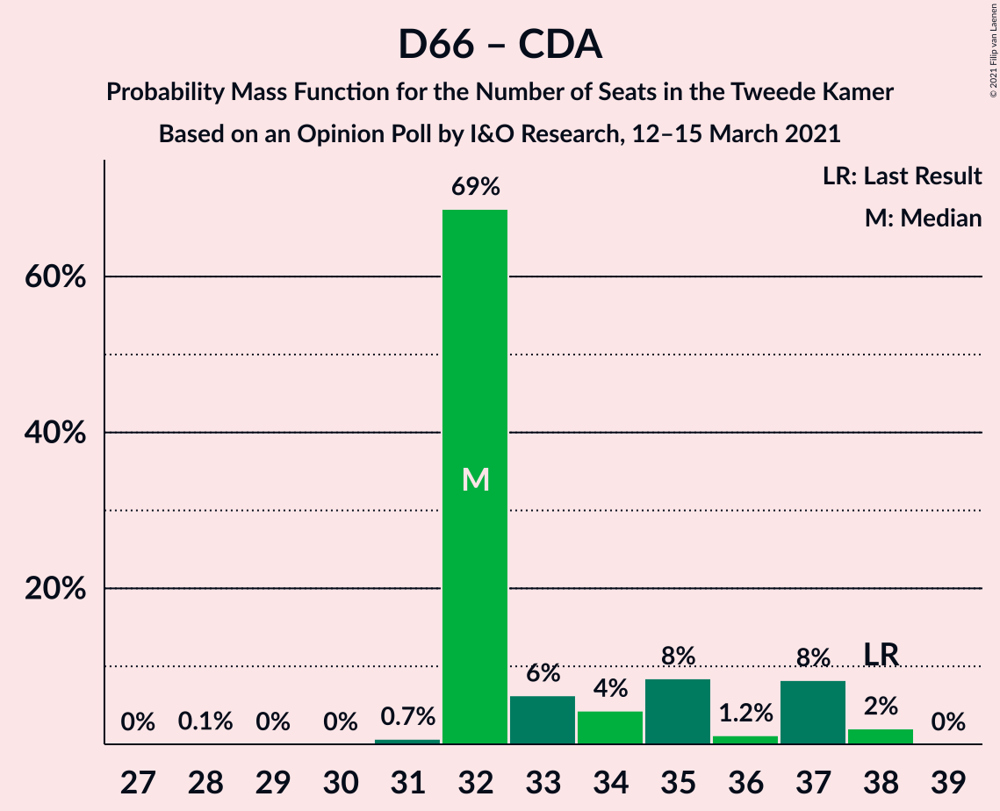

| Number of Seats | Probability | Accumulated | Special Marks |
|:---------------:|:-----------:|:-----------:|:-------------:|
| 28 | 0.1% | 100% |  |
| 29 | 0% | 99.9% |  |
| 30 | 0% | 99.9% |  |
| 31 | 0.7% | 99.9% |  |
| 32 | 69% | 99.1% | Median |
| 33 | 6% | 30% |  |
| 34 | 4% | 24% |  |
| 35 | 8% | 20% |  |
| 36 | 1.2% | 11% |  |
| 37 | 8% | 10% |  |
| 38 | 2% | 2% | Last Result |
| 39 | 0% | 0% |  |

### Christen-Democratisch Appèl – Partij van de Arbeid – ChristenUnie

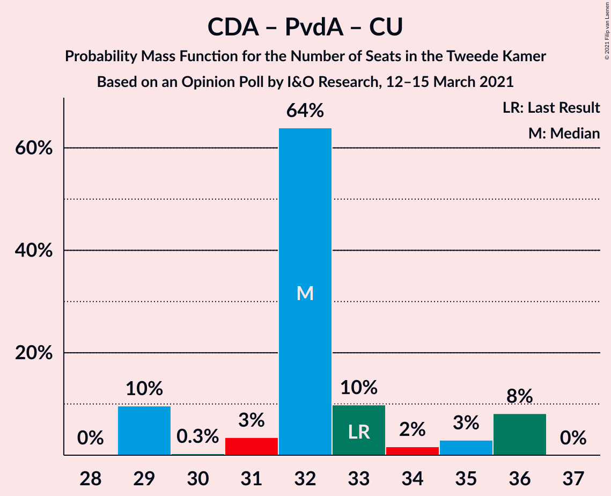

| Number of Seats | Probability | Accumulated | Special Marks |
|:---------------:|:-----------:|:-----------:|:-------------:|
| 29 | 10% | 100% |  |
| 30 | 0.3% | 90% |  |
| 31 | 3% | 90% |  |
| 32 | 64% | 87% | Median |
| 33 | 10% | 23% | Last Result |
| 34 | 2% | 13% |  |
| 35 | 3% | 11% |  |
| 36 | 8% | 8% |  |
| 37 | 0% | 0% |  |

### Christen-Democratisch Appèl – Partij van de Arbeid

| Number of Seats | Probability | Accumulated | Special Marks |
|:---------------:|:-----------:|:-----------:|:-------------:|
| 23 | 2% | 100% |  |
| 24 | 8% | 98% |  |
| 25 | 0.8% | 90% |  |
| 26 | 67% | 90% | Median |
| 27 | 9% | 23% |  |
| 28 | 3% | 14% | Last Result |
| 29 | 3% | 11% |  |
| 30 | 8% | 8% |  |
| 31 | 0% | 0% |  |

## Technical Information

### Opinion Poll

+ **Polling firm:** I&O Research
+ **Commissioner(s):** —
+ **Fieldwork period:** 12–15 March 2021

### Calculations

+ **Sample size:** 2812
+ **Simulations done:** 1,048,576
+ **Error estimate:** 2.12%

