# Opinion Poll by Ipsos for EenVandaag, 15–16 March 2021

<a href="#voting-intentions">Voting Intentions</a> | <a href="#seats">Seats</a> | <a href="#coalitions">Coalitions</a> | <a href="#technical-information">Technical Information</a>

## Voting Intentions

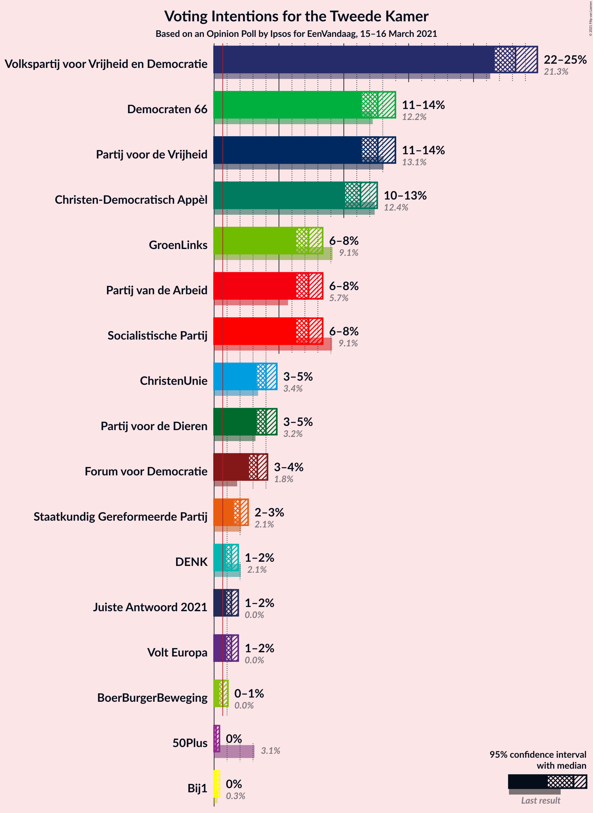

### Confidence Intervals

| Party | Last Result | Poll Result | 80% Confidence Interval | 90% Confidence Interval | 95% Confidence Interval | 99% Confidence Interval |
|:-----:|:-----------:|:-----------:|:-----------------------:|:-----------------------:|:-----------------------:|:-----------------------:|
| Volkspartij voor Vrijheid en Democratie | 21.3% | 23.2% | 22.2–24.3% |21.9–24.6% |21.6–24.9% |21.1–25.5% |
| Partij voor de Vrijheid | 13.1% | 12.6% | 11.8–13.5% |11.6–13.7% |11.4–14.0% |11.0–14.4% |
| Democraten 66 | 12.2% | 12.6% | 11.8–13.5% |11.6–13.7% |11.4–14.0% |11.0–14.4% |
| Christen-Democratisch Appèl | 12.4% | 11.3% | 10.5–12.1% |10.3–12.4% |10.1–12.6% |9.8–13.0% |
| GroenLinks | 9.1% | 7.3% | 6.7–8.0% |6.5–8.2% |6.3–8.4% |6.1–8.7% |
| Socialistische Partij | 9.1% | 7.3% | 6.7–8.0% |6.5–8.2% |6.3–8.4% |6.1–8.7% |
| Partij van de Arbeid | 5.7% | 7.3% | 6.7–8.0% |6.5–8.2% |6.3–8.4% |6.1–8.7% |
| ChristenUnie | 3.4% | 4.0% | 3.5–4.5% |3.4–4.7% |3.3–4.8% |3.1–5.1% |
| Partij voor de Dieren | 3.2% | 4.0% | 3.5–4.5% |3.4–4.7% |3.3–4.8% |3.1–5.1% |
| Forum voor Democratie | 1.8% | 3.3% | 2.9–3.8% |2.8–4.0% |2.7–4.1% |2.5–4.4% |
| Staatkundig Gereformeerde Partij | 2.1% | 2.0% | 1.7–2.4% |1.6–2.5% |1.5–2.6% |1.4–2.8% |
| DENK | 2.1% | 1.3% | 1.1–1.7% |1.0–1.8% |0.9–1.9% |0.8–2.0% |
| Juiste Antwoord 2021 | 0.0% | 1.3% | 1.1–1.7% |1.0–1.8% |0.9–1.9% |0.8–2.0% |
| Volt Europa | 0.0% | 1.3% | 1.1–1.7% |1.0–1.8% |0.9–1.9% |0.8–2.0% |
| BoerBurgerBeweging | 0.0% | 0.7% | 0.5–0.9% |0.4–1.0% |0.4–1.1% |0.4–1.2% |
| 50Plus | 3.1% | 0.2% | 0.1–0.3% |0.1–0.4% |0.1–0.4% |0.0–0.5% |
| Bij1 | 0.3% | 0.2% | 0.1–0.3% |0.1–0.4% |0.1–0.4% |0.0–0.5% |

*Note:* The poll result column reflects the actual value used in the calculations. Published results may vary slightly, and in addition be rounded to fewer digits.

## Seats

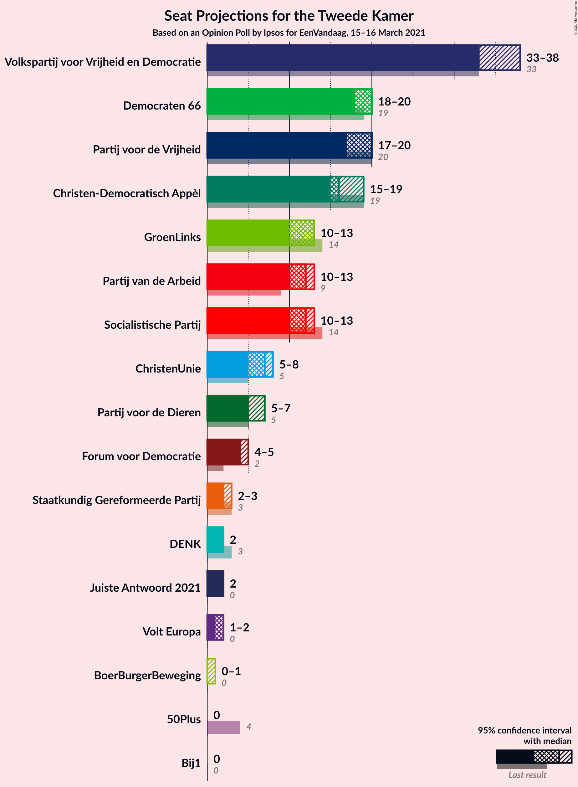

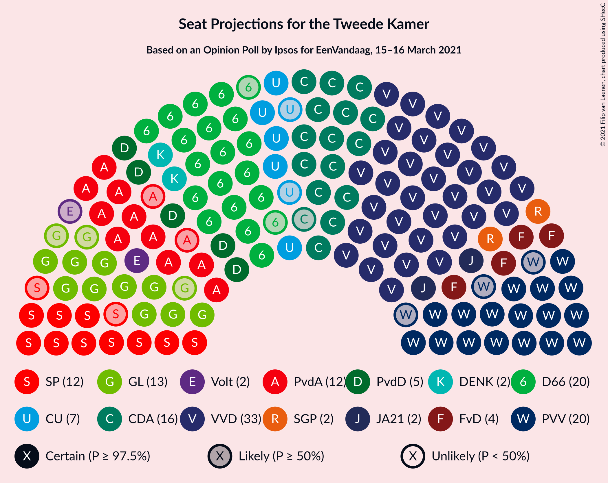

### Confidence Intervals

| Party | Last Result | Median | 80% Confidence Interval | 90% Confidence Interval | 95% Confidence Interval | 99% Confidence Interval |
|:-----:|:-----------:|:------:|:-----------------------:|:-----------------------:|:-----------------------:|:-----------------------:|
| <a href="#volkspartij-voor-vrijheid-en-democratie">Volkspartij voor Vrijheid en Democratie</a> | 33 | 33 | 33–38 |33–38 |33–38 |33–39 |
| <a href="#partij-voor-de-vrijheid">Partij voor de Vrijheid</a> | 20 | 20 | 18–20 |17–20 |17–20 |16–20 |
| <a href="#democraten-66">Democraten 66</a> | 19 | 20 | 19–20 |18–20 |18–20 |18–22 |
| <a href="#christen-democratisch-appèl">Christen-Democratisch Appèl</a> | 19 | 16 | 16–19 |16–19 |15–19 |15–19 |
| <a href="#groenlinks">GroenLinks</a> | 14 | 13 | 10–13 |10–13 |10–13 |9–13 |
| <a href="#socialistische-partij">Socialistische Partij</a> | 14 | 12 | 10–12 |10–12 |10–13 |10–13 |
| <a href="#partij-van-de-arbeid">Partij van de Arbeid</a> | 9 | 12 | 10–13 |10–13 |10–13 |10–13 |
| <a href="#christenunie">ChristenUnie</a> | 5 | 7 | 7–8 |6–8 |5–8 |4–8 |
| <a href="#partij-voor-de-dieren">Partij voor de Dieren</a> | 5 | 5 | 5–6 |5–6 |5–7 |5–7 |
| <a href="#forum-voor-democratie">Forum voor Democratie</a> | 2 | 4 | 4–5 |4–5 |4–5 |4–6 |
| <a href="#staatkundig-gereformeerde-partij">Staatkundig Gereformeerde Partij</a> | 3 | 2 | 2–3 |2–3 |2–3 |2–3 |
| <a href="#denk">DENK</a> | 3 | 2 | 2 |2 |2 |1–2 |
| <a href="#juiste-antwoord-2021">Juiste Antwoord 2021</a> | 0 | 2 | 2 |2 |2 |1–3 |
| <a href="#volt-europa">Volt Europa</a> | 0 | 2 | 1–2 |1–2 |1–2 |1–2 |
| <a href="#boerburgerbeweging">BoerBurgerBeweging</a> | 0 | 0 | 0 |0–1 |0–1 |0–1 |
| <a href="#50plus">50Plus</a> | 4 | 0 | 0 |0 |0 |0 |
| <a href="#bij1">Bij1</a> | 0 | 0 | 0 |0 |0 |0 |

### Volkspartij voor Vrijheid en Democratie

*For a full overview of the results for this party, see the [Volkspartij voor Vrijheid en Democratie](party-volkspartijvoorvrijheidendemocratie.html) page.*

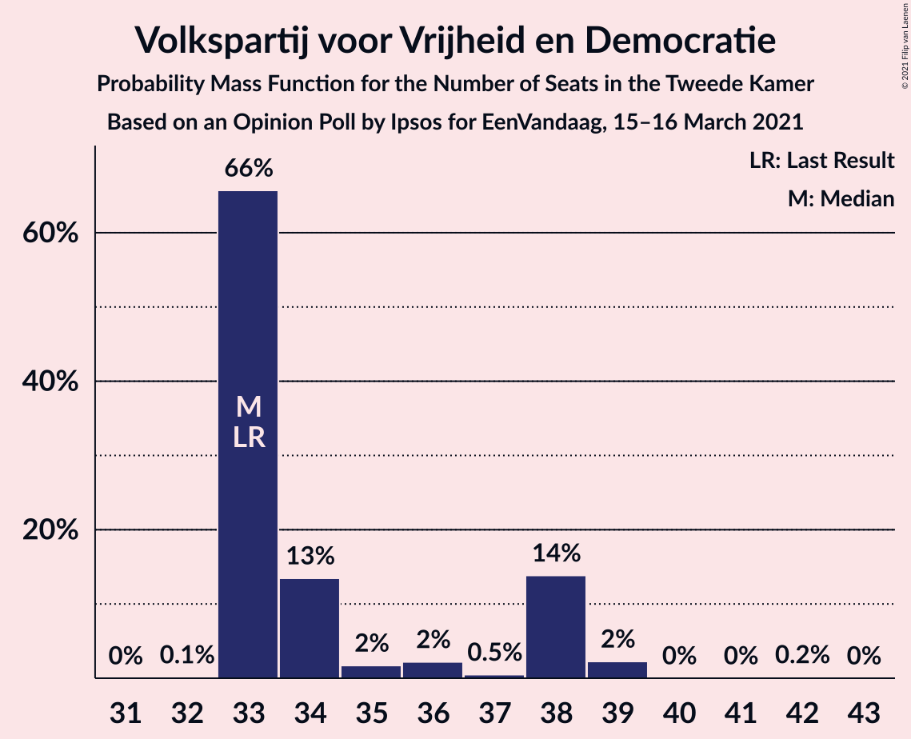

| Number of Seats | Probability | Accumulated | Special Marks |
|:---------------:|:-----------:|:-----------:|:-------------:|
| 32 | 0.1% | 100% |  |
| 33 | 66% | 99.9% | Last Result, Median |
| 34 | 13% | 34% |  |
| 35 | 2% | 21% |  |
| 36 | 2% | 19% |  |
| 37 | 0.5% | 17% |  |
| 38 | 14% | 16% |  |
| 39 | 2% | 2% |  |
| 40 | 0% | 0.2% |  |
| 41 | 0% | 0.2% |  |
| 42 | 0.2% | 0.2% |  |
| 43 | 0% | 0% |  |

### Partij voor de Vrijheid

*For a full overview of the results for this party, see the [Partij voor de Vrijheid](party-partijvoordevrijheid.html) page.*

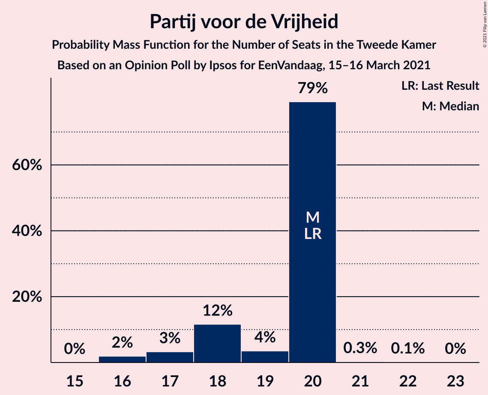

| Number of Seats | Probability | Accumulated | Special Marks |
|:---------------:|:-----------:|:-----------:|:-------------:|
| 16 | 2% | 100% |  |
| 17 | 3% | 98% |  |
| 18 | 12% | 95% |  |
| 19 | 4% | 83% |  |
| 20 | 79% | 80% | Last Result, Median |
| 21 | 0.3% | 0.5% |  |
| 22 | 0.1% | 0.2% |  |
| 23 | 0% | 0% |  |

### Democraten 66

*For a full overview of the results for this party, see the [Democraten 66](party-democraten66.html) page.*

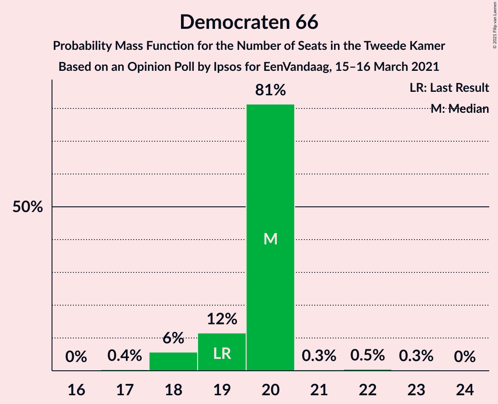

| Number of Seats | Probability | Accumulated | Special Marks |
|:---------------:|:-----------:|:-----------:|:-------------:|
| 17 | 0.4% | 100% |  |
| 18 | 6% | 99.6% |  |
| 19 | 12% | 94% | Last Result |
| 20 | 81% | 82% | Median |
| 21 | 0.3% | 1.1% |  |
| 22 | 0.5% | 0.8% |  |
| 23 | 0.3% | 0.3% |  |
| 24 | 0% | 0% |  |

### Christen-Democratisch Appèl

*For a full overview of the results for this party, see the [Christen-Democratisch Appèl](party-christen-democratischappèl.html) page.*

| Number of Seats | Probability | Accumulated | Special Marks |
|:---------------:|:-----------:|:-----------:|:-------------:|
| 14 | 0.1% | 100% |  |
| 15 | 3% | 99.9% |  |
| 16 | 78% | 97% | Median |
| 17 | 2% | 19% |  |
| 18 | 1.0% | 17% |  |
| 19 | 16% | 16% | Last Result |
| 20 | 0.3% | 0.3% |  |
| 21 | 0% | 0% |  |

### GroenLinks

*For a full overview of the results for this party, see the [GroenLinks](party-groenlinks.html) page.*

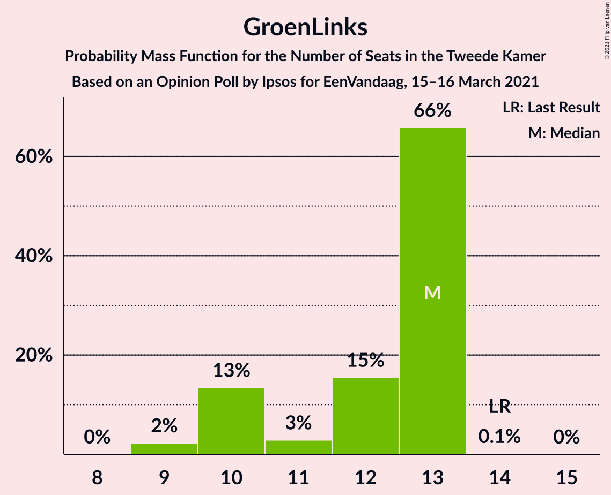

| Number of Seats | Probability | Accumulated | Special Marks |
|:---------------:|:-----------:|:-----------:|:-------------:|
| 9 | 2% | 100% |  |
| 10 | 13% | 98% |  |
| 11 | 3% | 84% |  |
| 12 | 15% | 81% |  |
| 13 | 66% | 66% | Median |
| 14 | 0.1% | 0.1% | Last Result |
| 15 | 0% | 0% |  |

### Socialistische Partij

*For a full overview of the results for this party, see the [Socialistische Partij](party-socialistischepartij.html) page.*

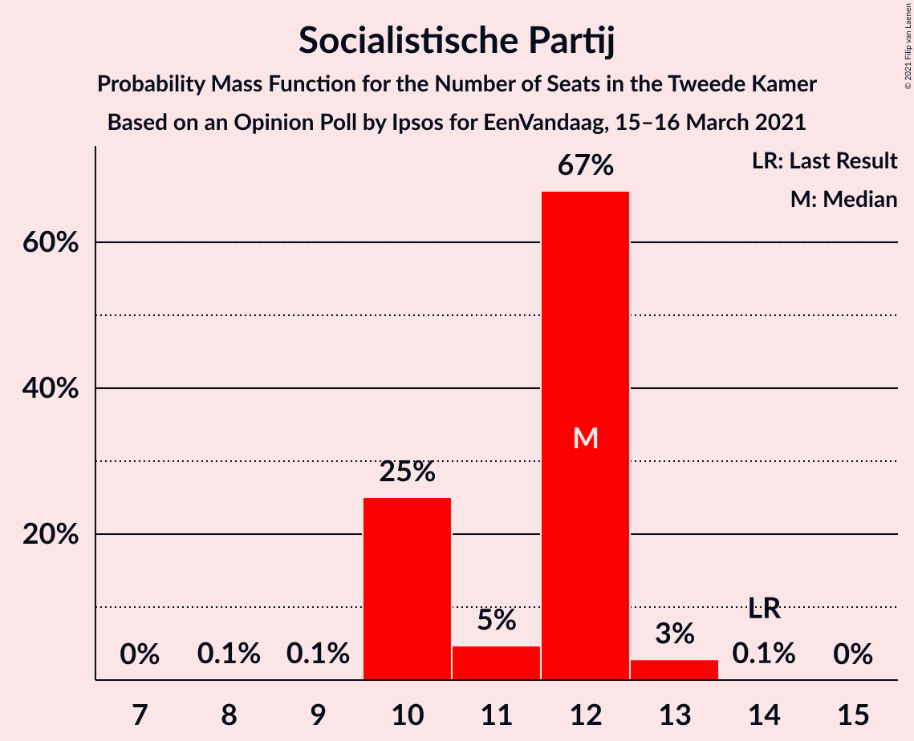

| Number of Seats | Probability | Accumulated | Special Marks |
|:---------------:|:-----------:|:-----------:|:-------------:|
| 8 | 0.1% | 100% |  |
| 9 | 0.1% | 99.9% |  |
| 10 | 25% | 99.8% |  |
| 11 | 5% | 75% |  |
| 12 | 67% | 70% | Median |
| 13 | 3% | 3% |  |
| 14 | 0.1% | 0.1% | Last Result |
| 15 | 0% | 0% |  |

### Partij van de Arbeid

*For a full overview of the results for this party, see the [Partij van de Arbeid](party-partijvandearbeid.html) page.*

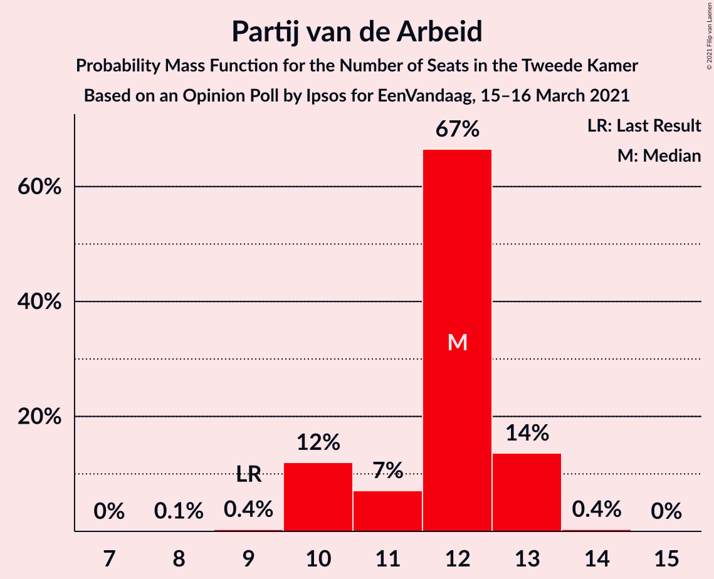

| Number of Seats | Probability | Accumulated | Special Marks |
|:---------------:|:-----------:|:-----------:|:-------------:|
| 8 | 0.1% | 100% |  |
| 9 | 0.4% | 99.9% | Last Result |
| 10 | 12% | 99.6% |  |
| 11 | 7% | 88% |  |
| 12 | 67% | 81% | Median |
| 13 | 14% | 14% |  |
| 14 | 0.4% | 0.4% |  |
| 15 | 0% | 0% |  |

### ChristenUnie

*For a full overview of the results for this party, see the [ChristenUnie](party-christenunie.html) page.*

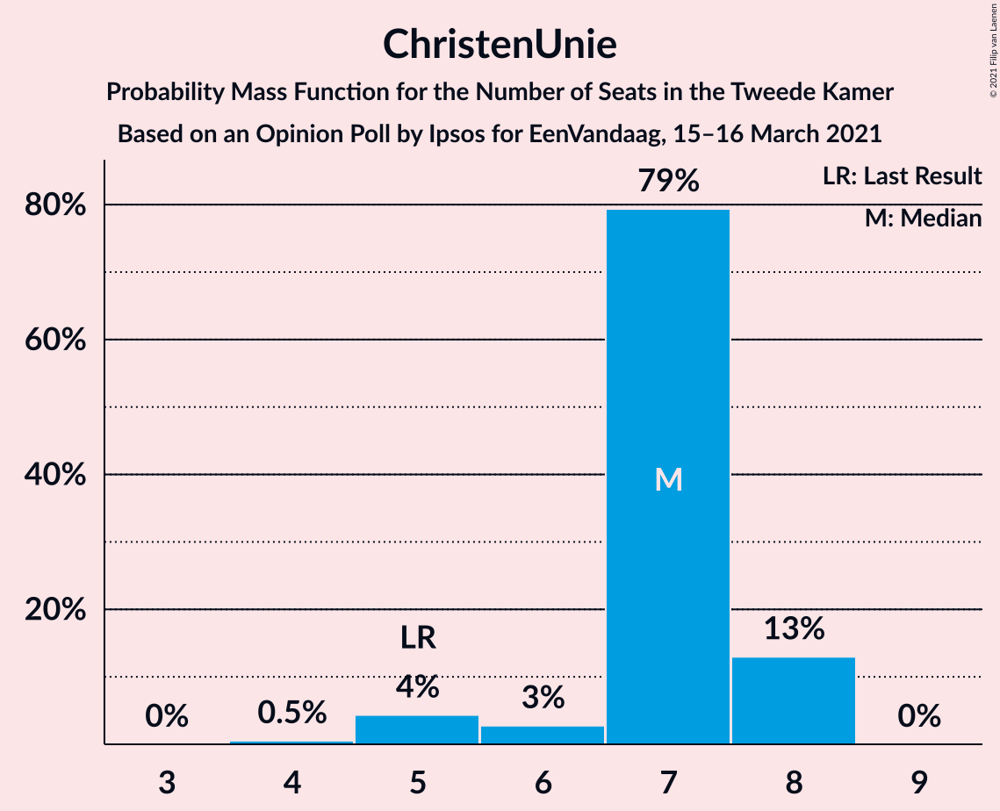

| Number of Seats | Probability | Accumulated | Special Marks |
|:---------------:|:-----------:|:-----------:|:-------------:|
| 4 | 0.5% | 100% |  |
| 5 | 4% | 99.5% | Last Result |
| 6 | 3% | 95% |  |
| 7 | 79% | 92% | Median |
| 8 | 13% | 13% |  |
| 9 | 0% | 0% |  |

### Partij voor de Dieren

*For a full overview of the results for this party, see the [Partij voor de Dieren](party-partijvoordedieren.html) page.*

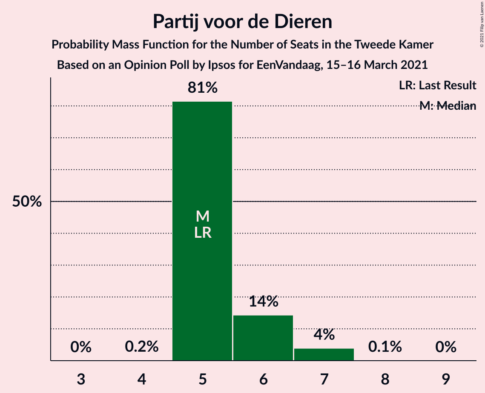

| Number of Seats | Probability | Accumulated | Special Marks |
|:---------------:|:-----------:|:-----------:|:-------------:|
| 4 | 0.2% | 100% |  |
| 5 | 81% | 99.8% | Last Result, Median |
| 6 | 14% | 18% |  |
| 7 | 4% | 4% |  |
| 8 | 0.1% | 0.1% |  |
| 9 | 0% | 0% |  |

### Forum voor Democratie

*For a full overview of the results for this party, see the [Forum voor Democratie](party-forumvoordemocratie.html) page.*

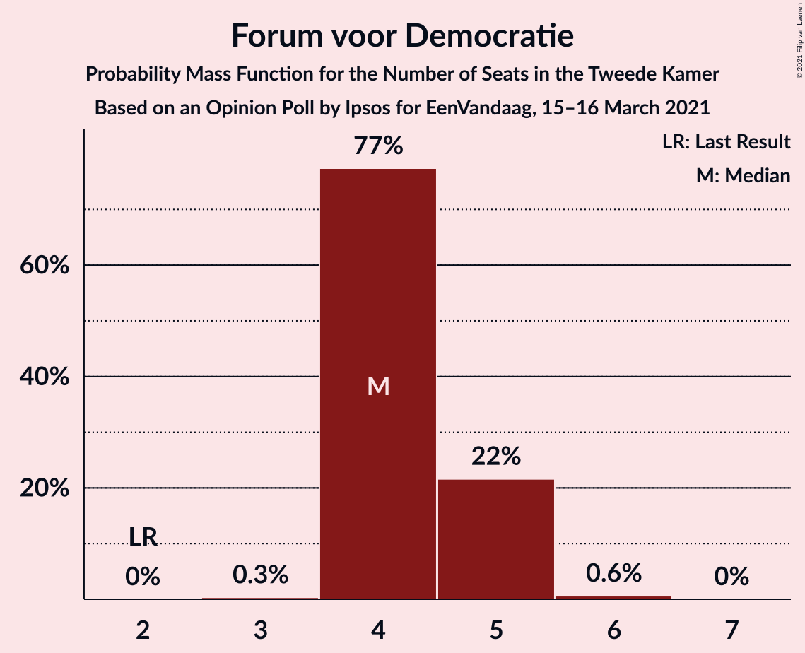

| Number of Seats | Probability | Accumulated | Special Marks |
|:---------------:|:-----------:|:-----------:|:-------------:|
| 2 | 0% | 100% | Last Result |
| 3 | 0.3% | 100% |  |
| 4 | 77% | 99.7% | Median |
| 5 | 22% | 22% |  |
| 6 | 0.6% | 0.6% |  |
| 7 | 0% | 0% |  |

### Staatkundig Gereformeerde Partij

*For a full overview of the results for this party, see the [Staatkundig Gereformeerde Partij](party-staatkundiggereformeerdepartij.html) page.*

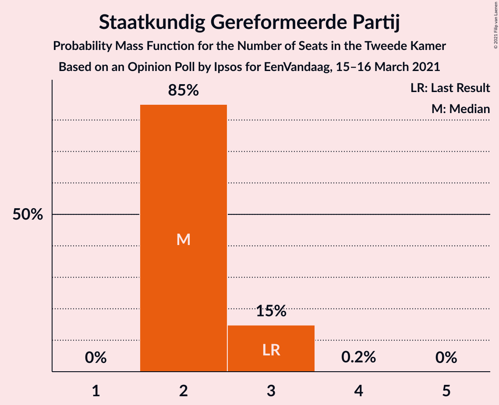

| Number of Seats | Probability | Accumulated | Special Marks |
|:---------------:|:-----------:|:-----------:|:-------------:|
| 2 | 85% | 100% | Median |
| 3 | 15% | 15% | Last Result |
| 4 | 0.2% | 0.2% |  |
| 5 | 0% | 0% |  |

### DENK

*For a full overview of the results for this party, see the [DENK](party-denk.html) page.*

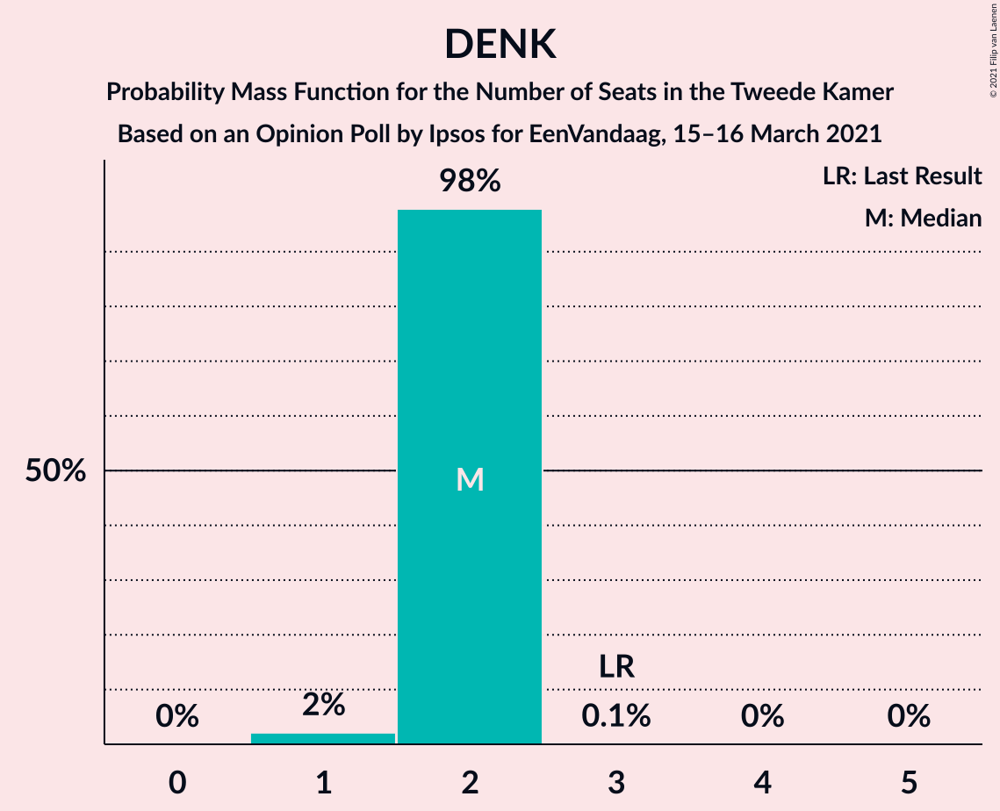

| Number of Seats | Probability | Accumulated | Special Marks |
|:---------------:|:-----------:|:-----------:|:-------------:|
| 1 | 2% | 100% |  |
| 2 | 98% | 98% | Median |
| 3 | 0.1% | 0.1% | Last Result |
| 4 | 0% | 0% |  |

### Juiste Antwoord 2021

*For a full overview of the results for this party, see the [Juiste Antwoord 2021](party-juisteantwoord2021.html) page.*

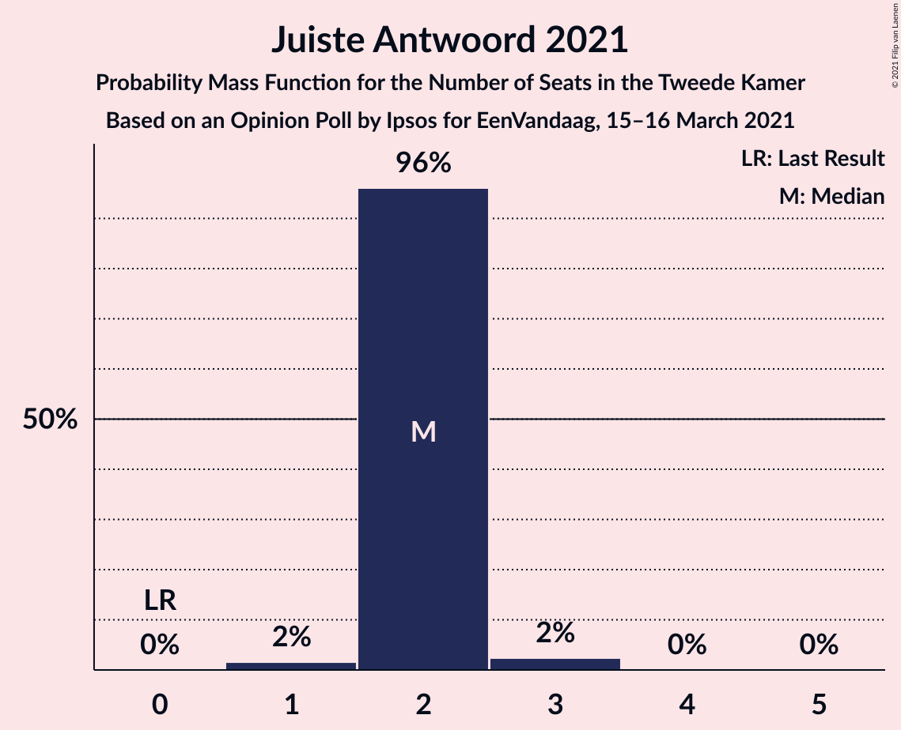

| Number of Seats | Probability | Accumulated | Special Marks |
|:---------------:|:-----------:|:-----------:|:-------------:|
| 0 | 0% | 100% | Last Result |
| 1 | 2% | 100% |  |
| 2 | 96% | 98% | Median |
| 3 | 2% | 2% |  |
| 4 | 0% | 0% |  |

### Volt Europa

*For a full overview of the results for this party, see the [Volt Europa](party-volteuropa.html) page.*

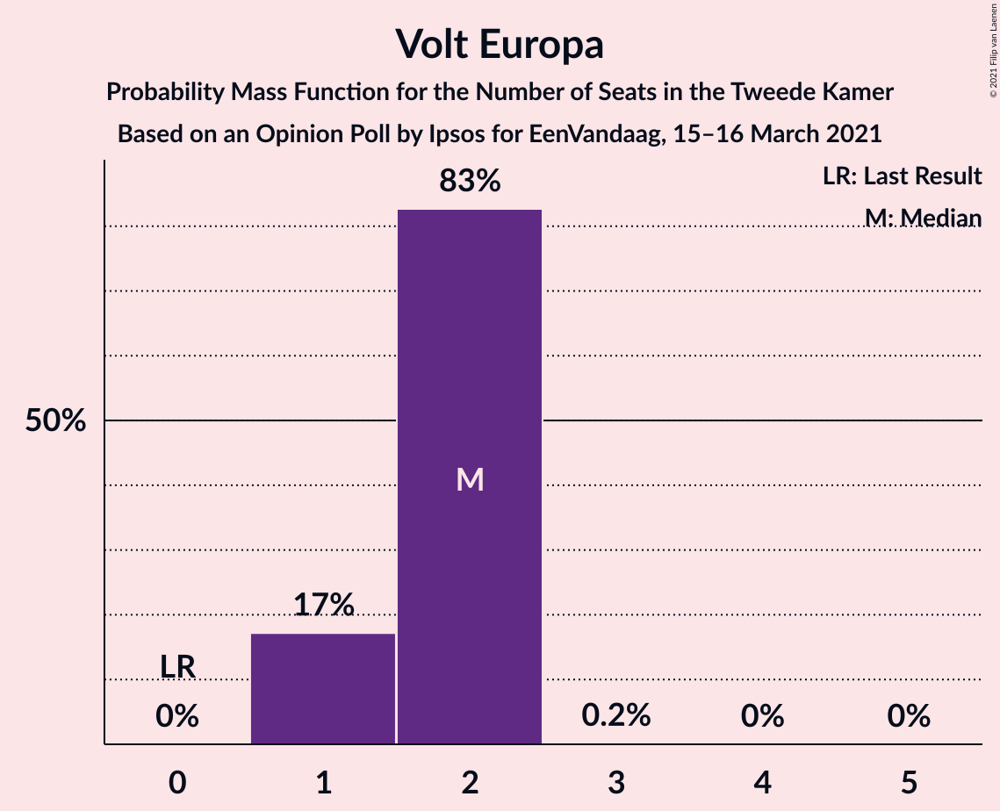

| Number of Seats | Probability | Accumulated | Special Marks |
|:---------------:|:-----------:|:-----------:|:-------------:|
| 0 | 0% | 100% | Last Result |
| 1 | 17% | 100% |  |
| 2 | 83% | 83% | Median |
| 3 | 0.2% | 0.2% |  |
| 4 | 0% | 0% |  |

### BoerBurgerBeweging

*For a full overview of the results for this party, see the [BoerBurgerBeweging](party-boerburgerbeweging.html) page.*

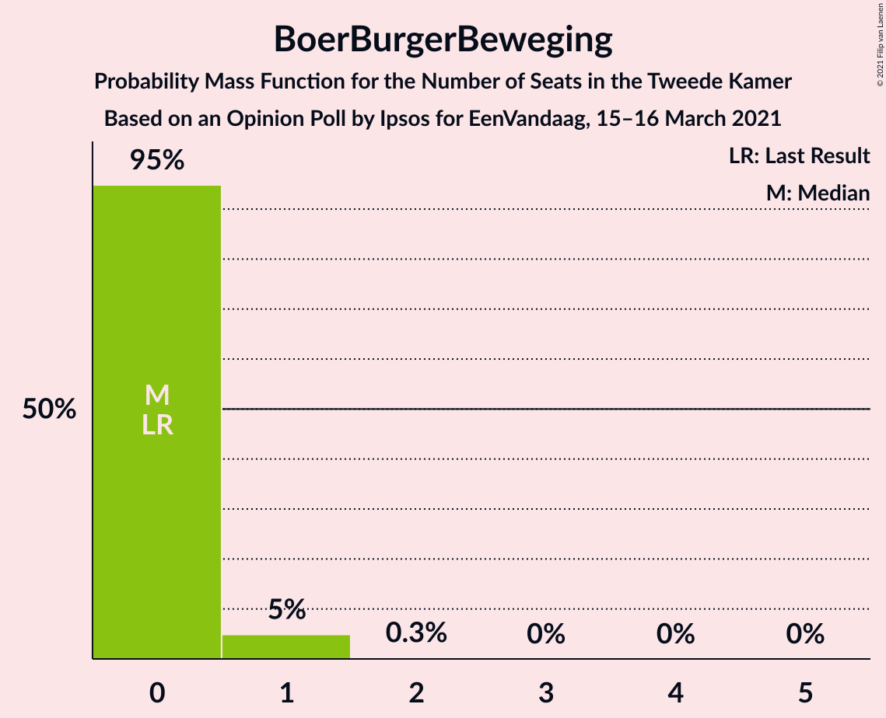

| Number of Seats | Probability | Accumulated | Special Marks |
|:---------------:|:-----------:|:-----------:|:-------------:|
| 0 | 95% | 100% | Last Result, Median |
| 1 | 5% | 5% |  |
| 2 | 0.3% | 0.3% |  |
| 3 | 0% | 0% |  |

### 50Plus

*For a full overview of the results for this party, see the [50Plus](party-50plus.html) page.*

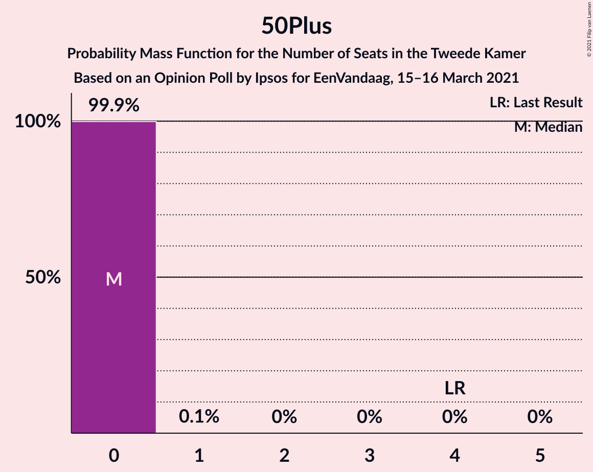

| Number of Seats | Probability | Accumulated | Special Marks |
|:---------------:|:-----------:|:-----------:|:-------------:|
| 0 | 99.9% | 100% | Median |
| 1 | 0.1% | 0.1% |  |
| 2 | 0% | 0% |  |
| 3 | 0% | 0% |  |
| 4 | 0% | 0% | Last Result |

### Bij1

*For a full overview of the results for this party, see the [Bij1](party-bij1.html) page.*

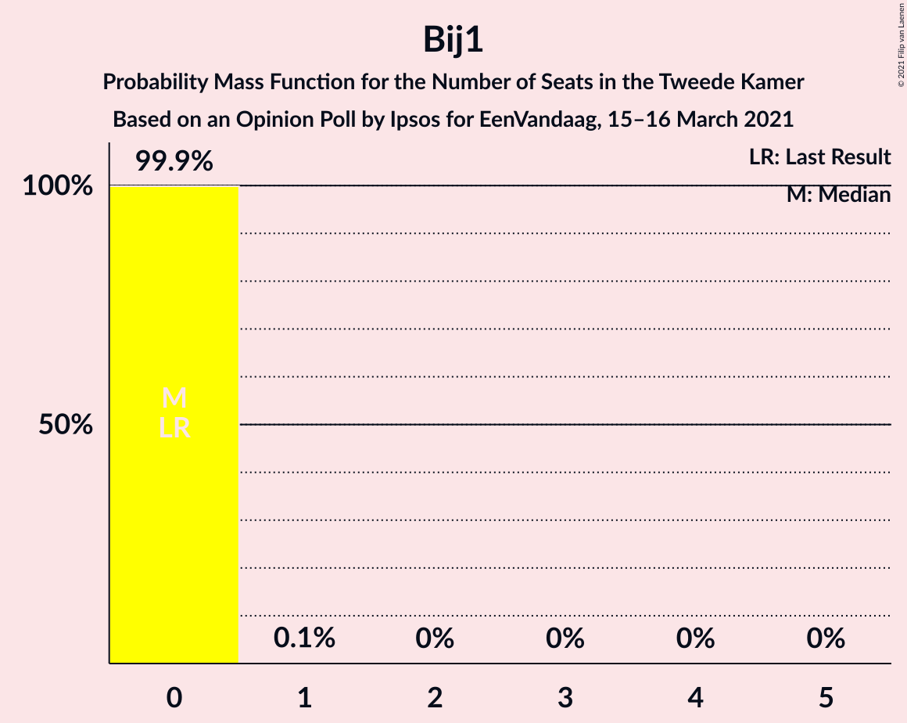

| Number of Seats | Probability | Accumulated | Special Marks |
|:---------------:|:-----------:|:-----------:|:-------------:|
| 0 | 99.9% | 100% | Last Result, Median |
| 1 | 0.1% | 0.1% |  |
| 2 | 0% | 0% |  |

## Coalitions

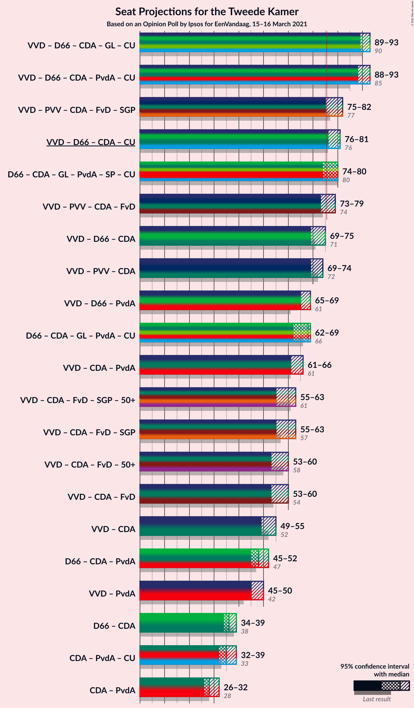

### Confidence Intervals

| Coalition | Last Result | Median | Majority? | 80% Confidence Interval | 90% Confidence Interval | 95% Confidence Interval | 99% Confidence Interval |
|:---------:|:-----------:|:------:|:---------:|:-----------------------:|:-----------------------:|:-----------------------:|:-----------------------:|
| Volkspartij voor Vrijheid en Democratie – Democraten 66 – Christen-Democratisch Appèl – GroenLinks – ChristenUnie | 90 | 89 | 100% | 89–93 | 89–93 | 89–93 | 86–93 |
| Volkspartij voor Vrijheid en Democratie – Democraten 66 – Christen-Democratisch Appèl – Partij van de Arbeid – ChristenUnie | 85 | 88 | 100% | 88–93 | 88–93 | 88–93 | 86–93 |
| Volkspartij voor Vrijheid en Democratie – Partij voor de Vrijheid – Christen-Democratisch Appèl – Forum voor Democratie – Staatkundig Gereformeerde Partij | 77 | 75 | 34% | 75–80 | 75–80 | 75–82 | 75–83 |
| Volkspartij voor Vrijheid en Democratie – Democraten 66 – Christen-Democratisch Appèl – ChristenUnie | 76 | 76 | 98.6% | 76–81 | 76–81 | 76–81 | 74–81 |
| Democraten 66 – Christen-Democratisch Appèl – GroenLinks – Partij van de Arbeid – Socialistische Partij – ChristenUnie | 80 | 80 | 82% | 75–80 | 75–80 | 74–80 | 72–81 |
| Volkspartij voor Vrijheid en Democratie – Partij voor de Vrijheid – Christen-Democratisch Appèl – Forum voor Democratie | 74 | 73 | 32% | 73–78 | 73–78 | 73–79 | 73–80 |
| Volkspartij voor Vrijheid en Democratie – Democraten 66 – Christen-Democratisch Appèl | 71 | 69 | 0.4% | 69–73 | 69–73 | 69–75 | 69–75 |
| Volkspartij voor Vrijheid en Democratie – Partij voor de Vrijheid – Christen-Democratisch Appèl | 72 | 69 | 0.2% | 69–73 | 69–73 | 69–74 | 69–75 |
| Volkspartij voor Vrijheid en Democratie – Democraten 66 – Partij van de Arbeid | 61 | 65 | 0% | 65–67 | 65–68 | 65–69 | 64–69 |
| Democraten 66 – Christen-Democratisch Appèl – GroenLinks – Partij van de Arbeid – ChristenUnie | 66 | 68 | 0% | 65–69 | 63–69 | 62–69 | 61–69 |
| Volkspartij voor Vrijheid en Democratie – Christen-Democratisch Appèl – Partij van de Arbeid | 61 | 61 | 0% | 61–66 | 61–66 | 61–66 | 61–67 |
| Volkspartij voor Vrijheid en Democratie – Christen-Democratisch Appèl – Forum voor Democratie – Staatkundig Gereformeerde Partij – 50Plus | 61 | 55 | 0% | 55–61 | 55–61 | 55–63 | 55–64 |
| Volkspartij voor Vrijheid en Democratie – Christen-Democratisch Appèl – Forum voor Democratie – Staatkundig Gereformeerde Partij | 57 | 55 | 0% | 55–61 | 55–61 | 55–63 | 55–64 |
| Volkspartij voor Vrijheid en Democratie – Christen-Democratisch Appèl – Forum voor Democratie – 50Plus | 58 | 53 | 0% | 53–58 | 53–59 | 53–60 | 53–62 |
| Volkspartij voor Vrijheid en Democratie – Christen-Democratisch Appèl – Forum voor Democratie | 54 | 53 | 0% | 53–58 | 53–59 | 53–60 | 53–62 |
| Volkspartij voor Vrijheid en Democratie – Christen-Democratisch Appèl | 52 | 49 | 0% | 49–54 | 49–55 | 49–55 | 49–56 |
| Democraten 66 – Christen-Democratisch Appèl – Partij van de Arbeid | 47 | 48 | 0% | 45–52 | 45–52 | 45–52 | 44–52 |
| Volkspartij voor Vrijheid en Democratie – Partij van de Arbeid | 42 | 45 | 0% | 45–48 | 45–49 | 45–50 | 45–50 |
| Democraten 66 – Christen-Democratisch Appèl | 38 | 36 | 0% | 35–39 | 35–39 | 34–39 | 33–40 |
| Christen-Democratisch Appèl – Partij van de Arbeid – ChristenUnie | 33 | 35 | 0% | 34–39 | 33–39 | 32–39 | 32–39 |
| Christen-Democratisch Appèl – Partij van de Arbeid | 28 | 28 | 0% | 26–32 | 26–32 | 26–32 | 26–32 |

### Volkspartij voor Vrijheid en Democratie – Democraten 66 – Christen-Democratisch Appèl – GroenLinks – ChristenUnie

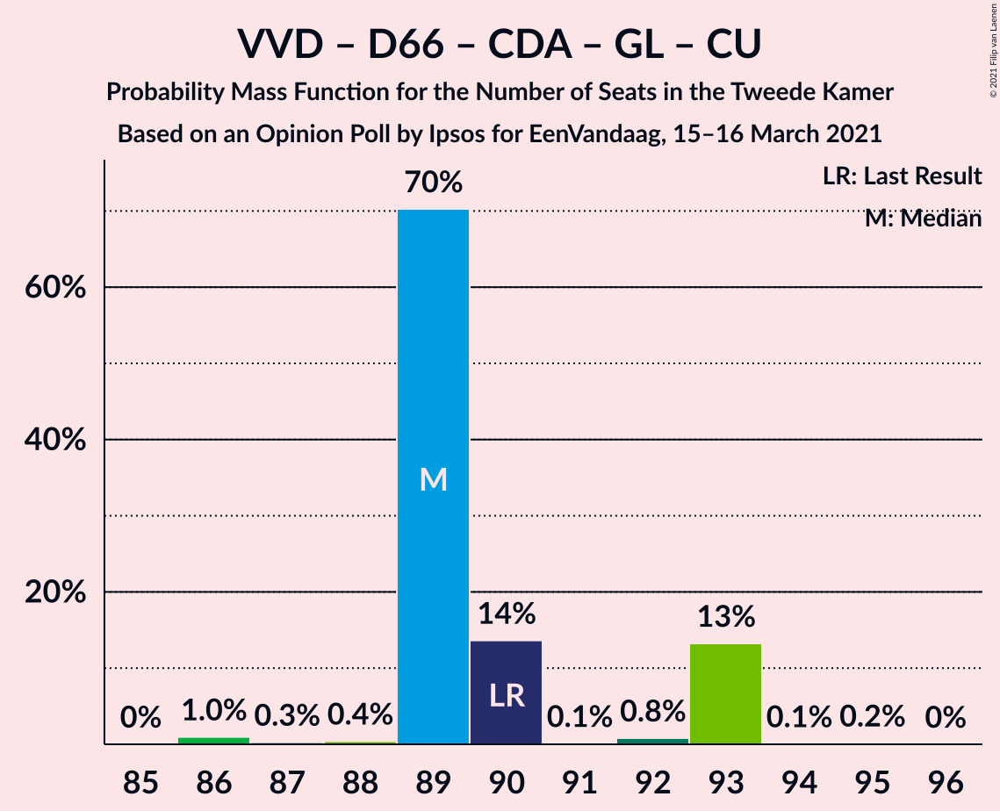

| Number of Seats | Probability | Accumulated | Special Marks |
|:---------------:|:-----------:|:-----------:|:-------------:|
| 86 | 1.0% | 100% |  |
| 87 | 0.3% | 99.0% |  |
| 88 | 0.4% | 98.7% |  |
| 89 | 70% | 98% | Median |
| 90 | 14% | 28% | Last Result |
| 91 | 0.1% | 14% |  |
| 92 | 0.8% | 14% |  |
| 93 | 13% | 13% |  |
| 94 | 0.1% | 0.2% |  |
| 95 | 0.2% | 0.2% |  |
| 96 | 0% | 0% |  |

### Volkspartij voor Vrijheid en Democratie – Democraten 66 – Christen-Democratisch Appèl – Partij van de Arbeid – ChristenUnie

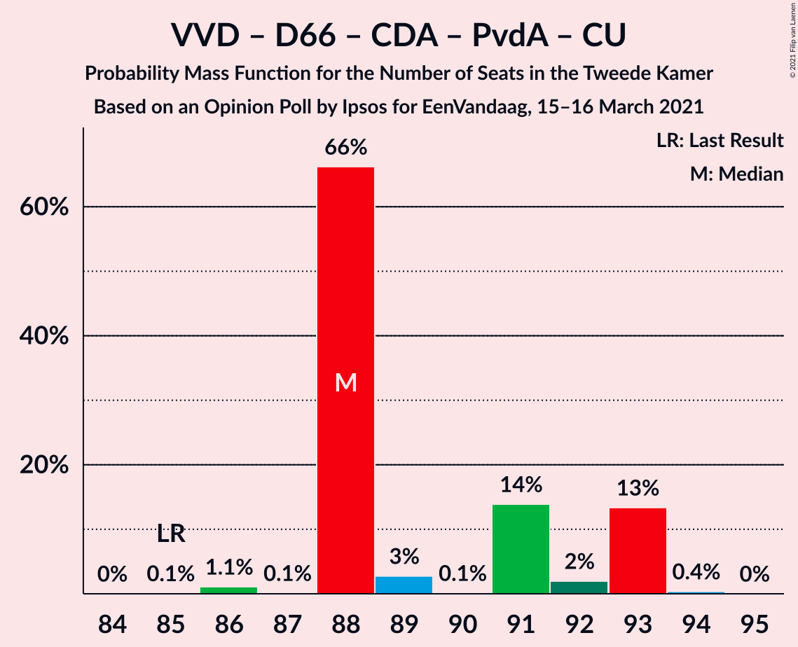

| Number of Seats | Probability | Accumulated | Special Marks |
|:---------------:|:-----------:|:-----------:|:-------------:|
| 85 | 0.1% | 100% | Last Result |
| 86 | 1.1% | 99.9% |  |
| 87 | 0.1% | 98.8% |  |
| 88 | 66% | 98.7% | Median |
| 89 | 3% | 32% |  |
| 90 | 0.1% | 30% |  |
| 91 | 14% | 30% |  |
| 92 | 2% | 16% |  |
| 93 | 13% | 14% |  |
| 94 | 0.4% | 0.4% |  |
| 95 | 0% | 0% |  |

### Volkspartij voor Vrijheid en Democratie – Partij voor de Vrijheid – Christen-Democratisch Appèl – Forum voor Democratie – Staatkundig Gereformeerde Partij

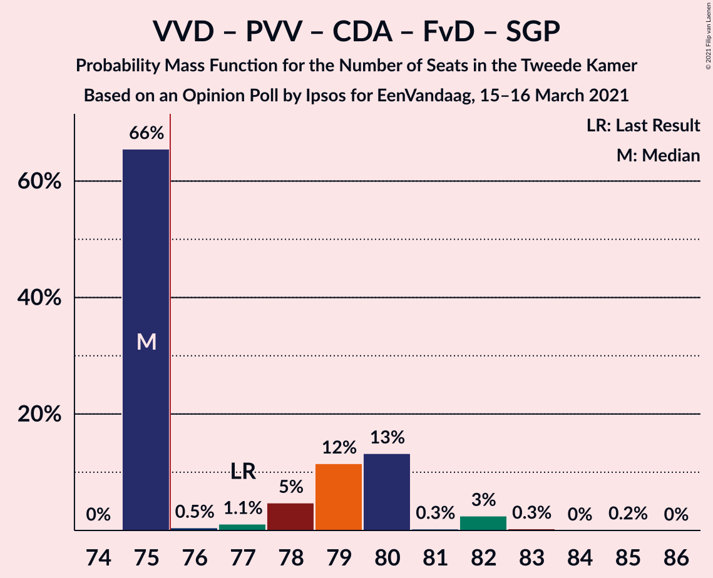

| Number of Seats | Probability | Accumulated | Special Marks |
|:---------------:|:-----------:|:-----------:|:-------------:|
| 75 | 66% | 100% | Median |
| 76 | 0.5% | 34% | Majority |
| 77 | 1.1% | 34% | Last Result |
| 78 | 5% | 33% |  |
| 79 | 12% | 28% |  |
| 80 | 13% | 17% |  |
| 81 | 0.3% | 3% |  |
| 82 | 3% | 3% |  |
| 83 | 0.3% | 0.5% |  |
| 84 | 0% | 0.2% |  |
| 85 | 0.2% | 0.2% |  |
| 86 | 0% | 0% |  |

### Volkspartij voor Vrijheid en Democratie – Democraten 66 – Christen-Democratisch Appèl – ChristenUnie

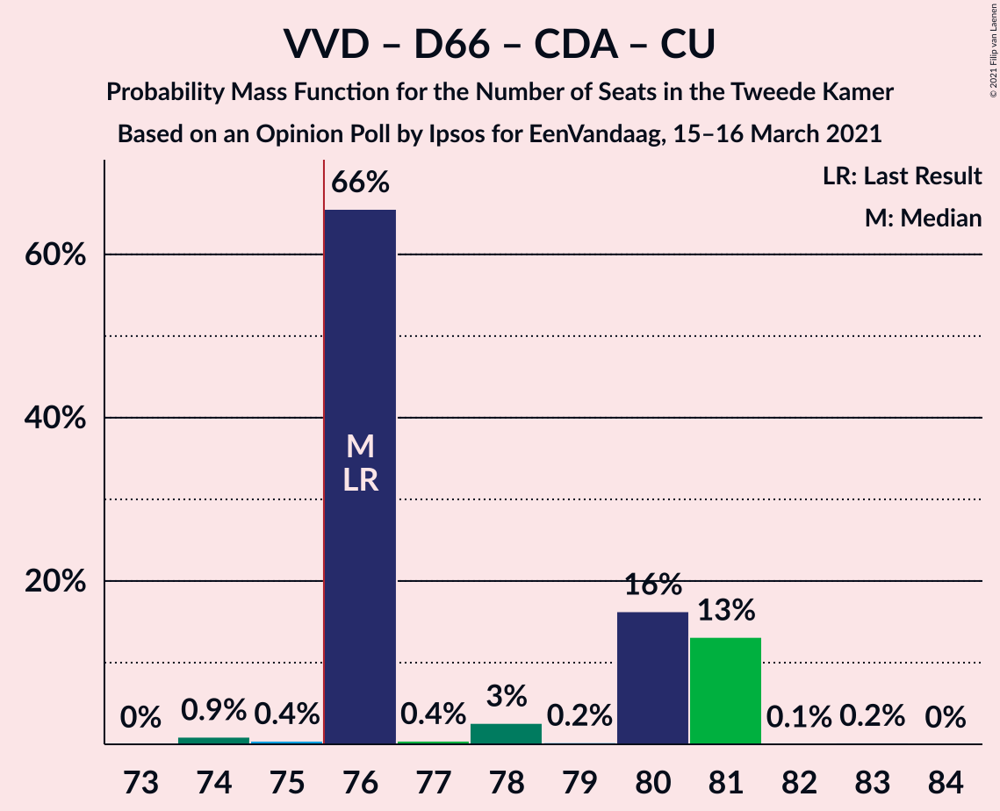

| Number of Seats | Probability | Accumulated | Special Marks |
|:---------------:|:-----------:|:-----------:|:-------------:|
| 74 | 0.9% | 100% |  |
| 75 | 0.4% | 99.1% |  |
| 76 | 66% | 98.6% | Last Result, Median, Majority |
| 77 | 0.4% | 33% |  |
| 78 | 3% | 33% |  |
| 79 | 0.2% | 30% |  |
| 80 | 16% | 30% |  |
| 81 | 13% | 13% |  |
| 82 | 0.1% | 0.3% |  |
| 83 | 0.2% | 0.2% |  |
| 84 | 0% | 0% |  |

### Democraten 66 – Christen-Democratisch Appèl – GroenLinks – Partij van de Arbeid – Socialistische Partij – ChristenUnie

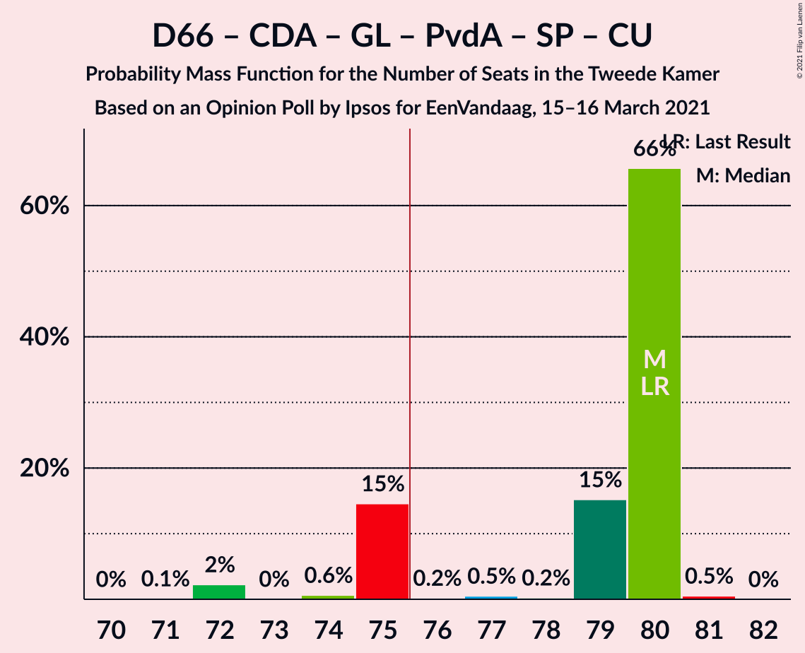

| Number of Seats | Probability | Accumulated | Special Marks |
|:---------------:|:-----------:|:-----------:|:-------------:|
| 71 | 0.1% | 100% |  |
| 72 | 2% | 99.9% |  |
| 73 | 0% | 98% |  |
| 74 | 0.6% | 98% |  |
| 75 | 15% | 97% |  |
| 76 | 0.2% | 82% | Majority |
| 77 | 0.5% | 82% |  |
| 78 | 0.2% | 82% |  |
| 79 | 15% | 81% |  |
| 80 | 66% | 66% | Last Result, Median |
| 81 | 0.5% | 0.5% |  |
| 82 | 0% | 0% |  |

### Volkspartij voor Vrijheid en Democratie – Partij voor de Vrijheid – Christen-Democratisch Appèl – Forum voor Democratie

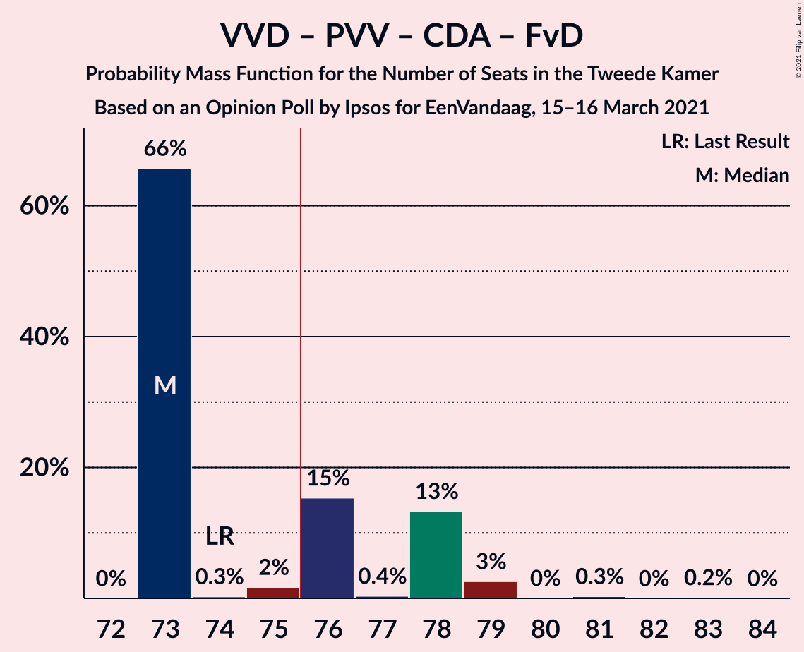

| Number of Seats | Probability | Accumulated | Special Marks |
|:---------------:|:-----------:|:-----------:|:-------------:|
| 73 | 66% | 100% | Median |
| 74 | 0.3% | 34% | Last Result |
| 75 | 2% | 34% |  |
| 76 | 15% | 32% | Majority |
| 77 | 0.4% | 17% |  |
| 78 | 13% | 16% |  |
| 79 | 3% | 3% |  |
| 80 | 0% | 0.5% |  |
| 81 | 0.3% | 0.5% |  |
| 82 | 0% | 0.2% |  |
| 83 | 0.2% | 0.2% |  |
| 84 | 0% | 0% |  |

### Volkspartij voor Vrijheid en Democratie – Democraten 66 – Christen-Democratisch Appèl

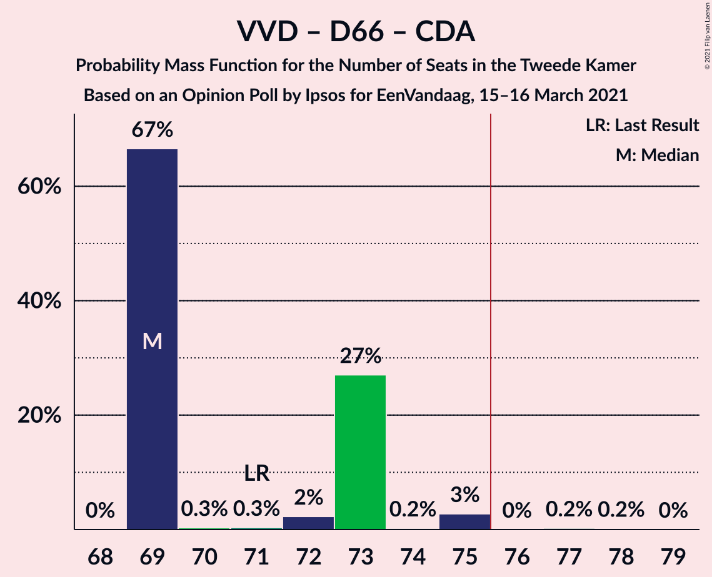

| Number of Seats | Probability | Accumulated | Special Marks |
|:---------------:|:-----------:|:-----------:|:-------------:|
| 69 | 67% | 100% | Median |
| 70 | 0.3% | 33% |  |
| 71 | 0.3% | 33% | Last Result |
| 72 | 2% | 33% |  |
| 73 | 27% | 30% |  |
| 74 | 0.2% | 3% |  |
| 75 | 3% | 3% |  |
| 76 | 0% | 0.4% | Majority |
| 77 | 0.2% | 0.4% |  |
| 78 | 0.2% | 0.2% |  |
| 79 | 0% | 0% |  |

### Volkspartij voor Vrijheid en Democratie – Partij voor de Vrijheid – Christen-Democratisch Appèl

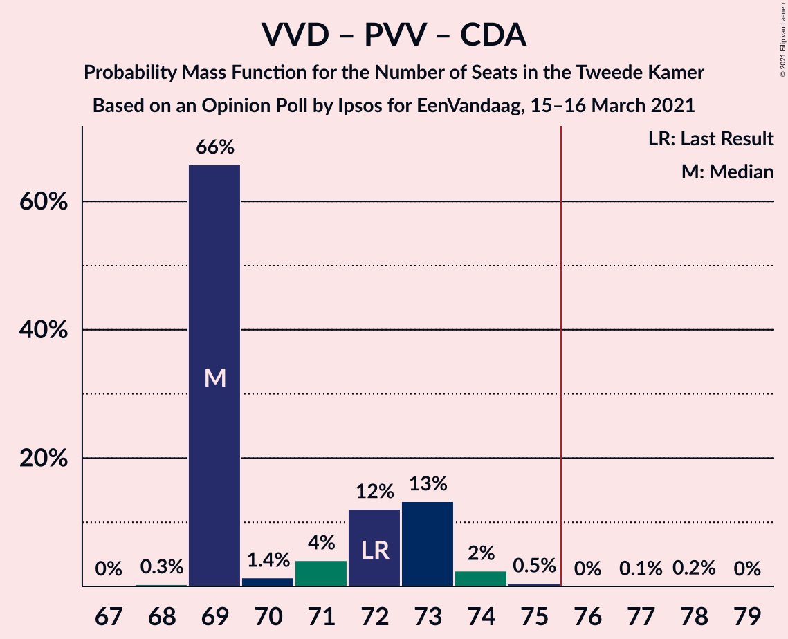

| Number of Seats | Probability | Accumulated | Special Marks |
|:---------------:|:-----------:|:-----------:|:-------------:|
| 68 | 0.3% | 100% |  |
| 69 | 66% | 99.7% | Median |
| 70 | 1.4% | 34% |  |
| 71 | 4% | 33% |  |
| 72 | 12% | 28% | Last Result |
| 73 | 13% | 16% |  |
| 74 | 2% | 3% |  |
| 75 | 0.5% | 0.7% |  |
| 76 | 0% | 0.2% | Majority |
| 77 | 0.1% | 0.2% |  |
| 78 | 0.2% | 0.2% |  |
| 79 | 0% | 0% |  |

### Volkspartij voor Vrijheid en Democratie – Democraten 66 – Partij van de Arbeid

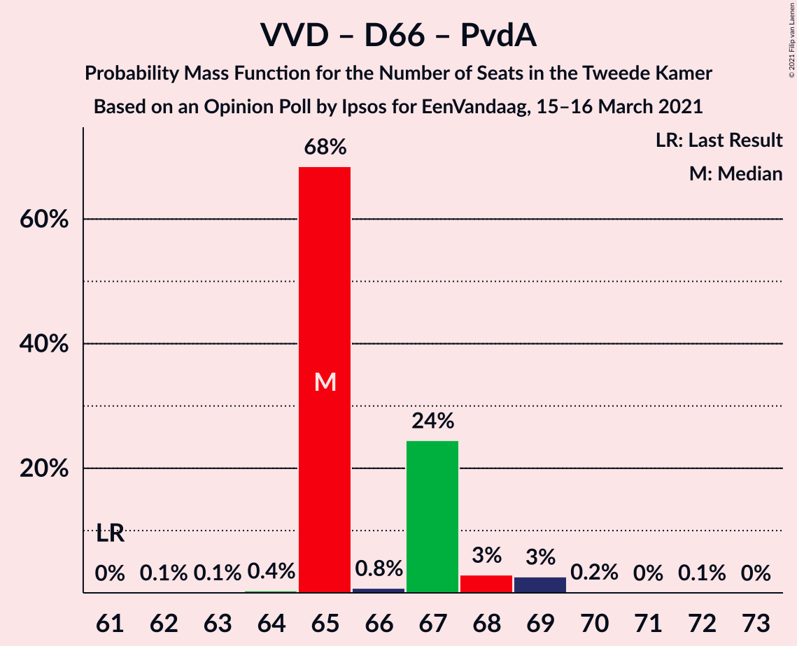

| Number of Seats | Probability | Accumulated | Special Marks |
|:---------------:|:-----------:|:-----------:|:-------------:|
| 61 | 0% | 100% | Last Result |
| 62 | 0.1% | 100% |  |
| 63 | 0.1% | 99.9% |  |
| 64 | 0.4% | 99.9% |  |
| 65 | 68% | 99.5% | Median |
| 66 | 0.8% | 31% |  |
| 67 | 24% | 30% |  |
| 68 | 3% | 6% |  |
| 69 | 3% | 3% |  |
| 70 | 0.2% | 0.3% |  |
| 71 | 0% | 0.1% |  |
| 72 | 0.1% | 0.1% |  |
| 73 | 0% | 0% |  |

### Democraten 66 – Christen-Democratisch Appèl – GroenLinks – Partij van de Arbeid – ChristenUnie

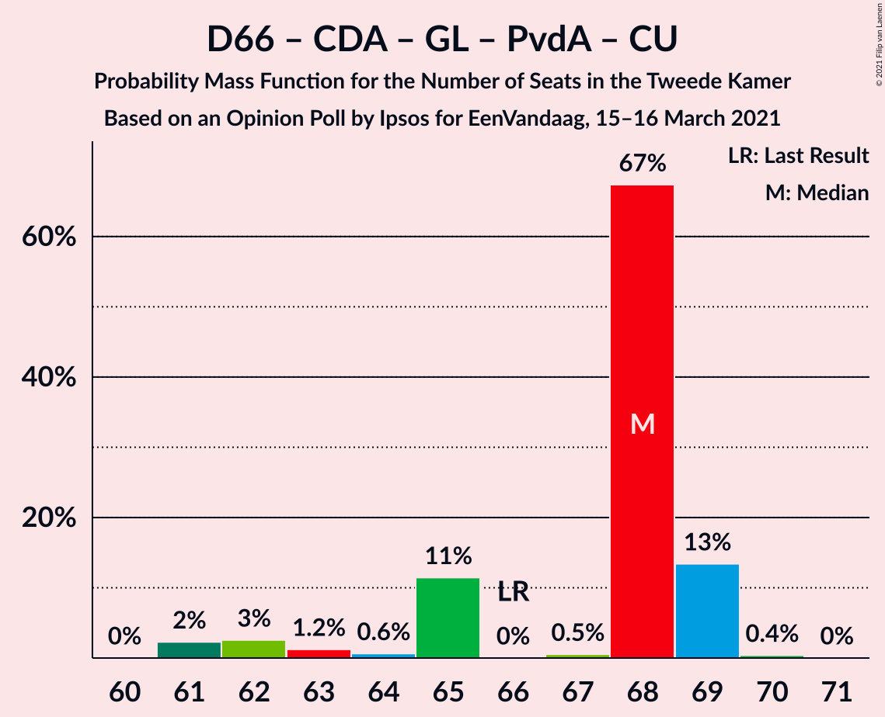

| Number of Seats | Probability | Accumulated | Special Marks |
|:---------------:|:-----------:|:-----------:|:-------------:|
| 61 | 2% | 100% |  |
| 62 | 3% | 98% |  |
| 63 | 1.2% | 95% |  |
| 64 | 0.6% | 94% |  |
| 65 | 11% | 93% |  |
| 66 | 0% | 82% | Last Result |
| 67 | 0.5% | 82% |  |
| 68 | 67% | 81% | Median |
| 69 | 13% | 14% |  |
| 70 | 0.4% | 0.4% |  |
| 71 | 0% | 0% |  |

### Volkspartij voor Vrijheid en Democratie – Christen-Democratisch Appèl – Partij van de Arbeid

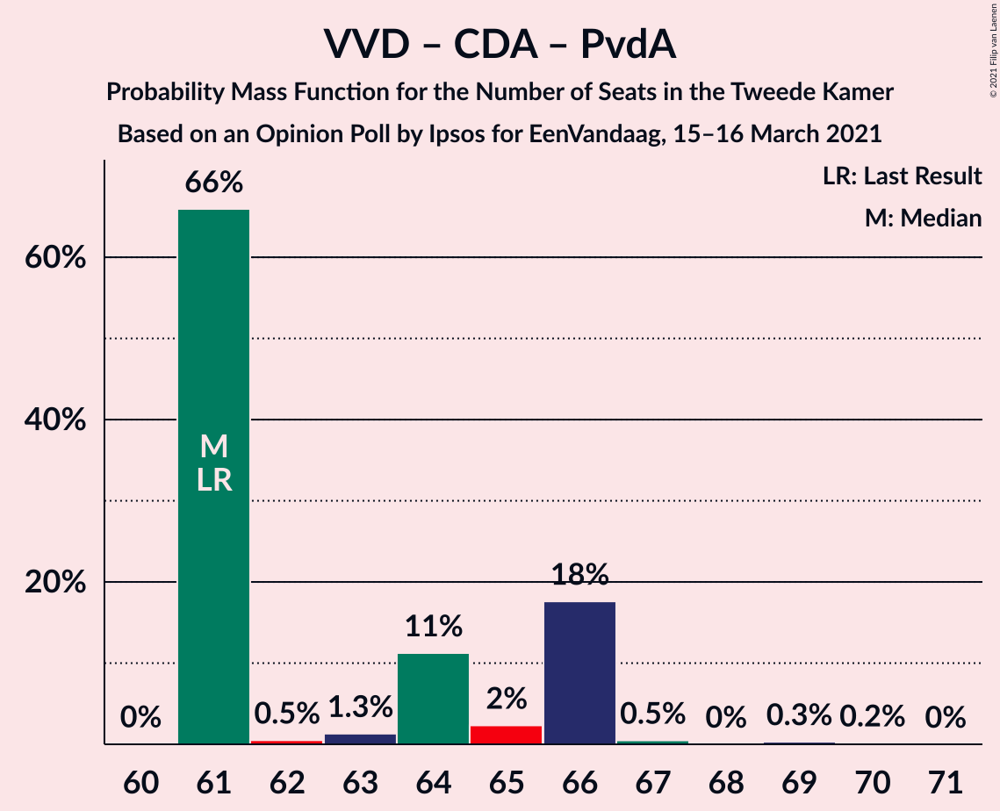

| Number of Seats | Probability | Accumulated | Special Marks |
|:---------------:|:-----------:|:-----------:|:-------------:|
| 60 | 0% | 100% |  |
| 61 | 66% | 99.9% | Last Result, Median |
| 62 | 0.5% | 34% |  |
| 63 | 1.3% | 33% |  |
| 64 | 11% | 32% |  |
| 65 | 2% | 21% |  |
| 66 | 18% | 19% |  |
| 67 | 0.5% | 1.0% |  |
| 68 | 0% | 0.5% |  |
| 69 | 0.3% | 0.5% |  |
| 70 | 0.2% | 0.2% |  |
| 71 | 0% | 0% |  |

### Volkspartij voor Vrijheid en Democratie – Christen-Democratisch Appèl – Forum voor Democratie – Staatkundig Gereformeerde Partij – 50Plus

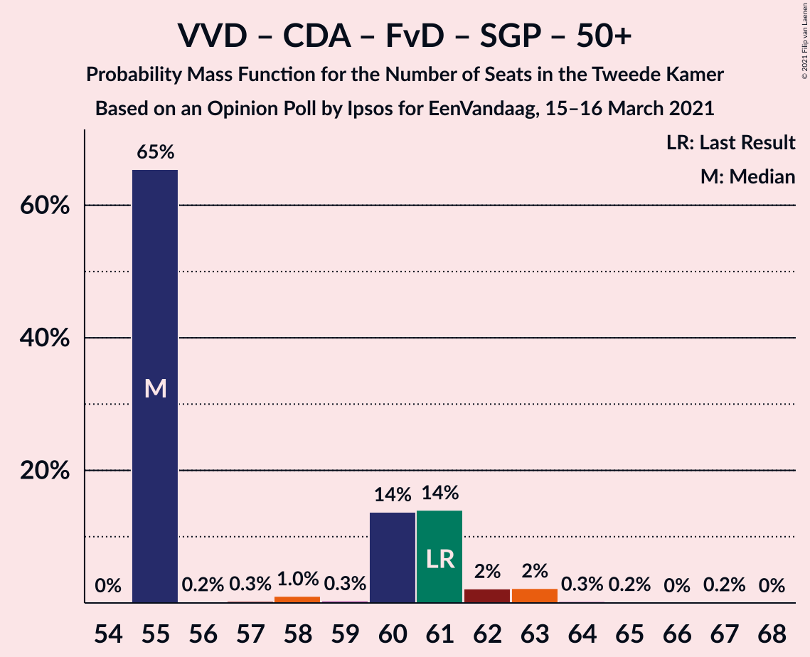

| Number of Seats | Probability | Accumulated | Special Marks |
|:---------------:|:-----------:|:-----------:|:-------------:|
| 55 | 65% | 100% | Median |
| 56 | 0.2% | 35% |  |
| 57 | 0.3% | 34% |  |
| 58 | 1.0% | 34% |  |
| 59 | 0.3% | 33% |  |
| 60 | 14% | 33% |  |
| 61 | 14% | 19% | Last Result |
| 62 | 2% | 5% |  |
| 63 | 2% | 3% |  |
| 64 | 0.3% | 0.6% |  |
| 65 | 0.2% | 0.4% |  |
| 66 | 0% | 0.2% |  |
| 67 | 0.2% | 0.2% |  |
| 68 | 0% | 0% |  |

### Volkspartij voor Vrijheid en Democratie – Christen-Democratisch Appèl – Forum voor Democratie – Staatkundig Gereformeerde Partij

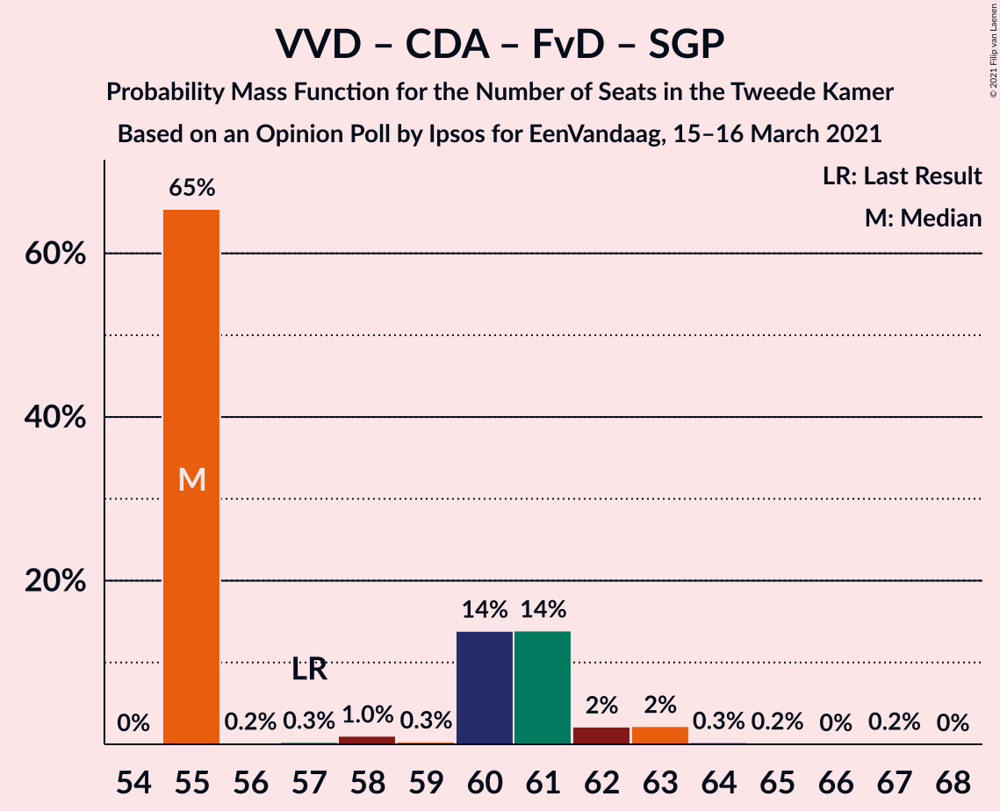

| Number of Seats | Probability | Accumulated | Special Marks |
|:---------------:|:-----------:|:-----------:|:-------------:|
| 55 | 65% | 100% | Median |
| 56 | 0.2% | 35% |  |
| 57 | 0.3% | 34% | Last Result |
| 58 | 1.0% | 34% |  |
| 59 | 0.3% | 33% |  |
| 60 | 14% | 33% |  |
| 61 | 14% | 19% |  |
| 62 | 2% | 5% |  |
| 63 | 2% | 3% |  |
| 64 | 0.3% | 0.6% |  |
| 65 | 0.2% | 0.4% |  |
| 66 | 0% | 0.2% |  |
| 67 | 0.2% | 0.2% |  |
| 68 | 0% | 0% |  |

### Volkspartij voor Vrijheid en Democratie – Christen-Democratisch Appèl – Forum voor Democratie – 50Plus

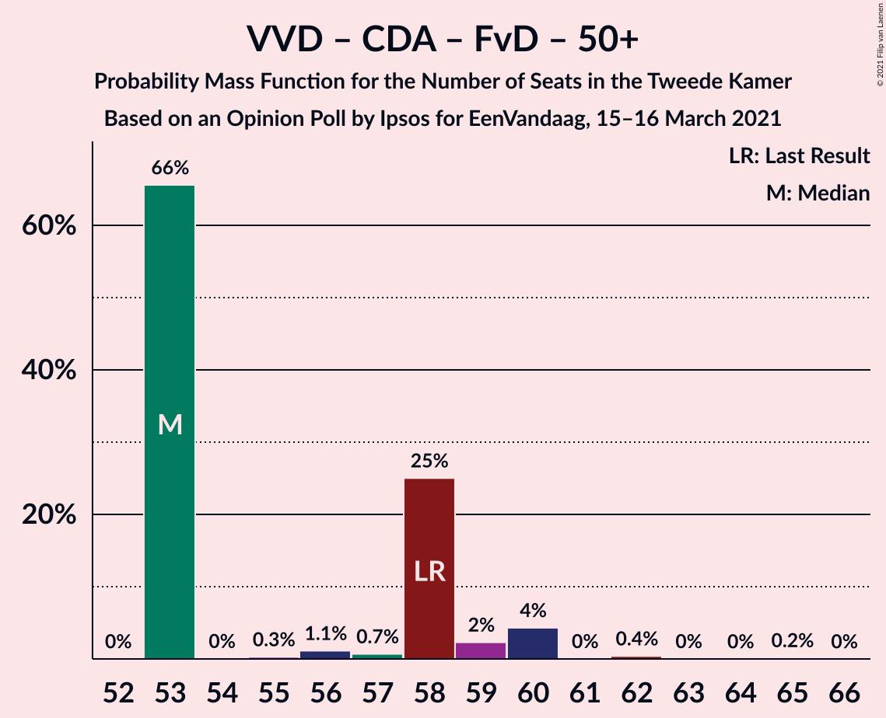

| Number of Seats | Probability | Accumulated | Special Marks |
|:---------------:|:-----------:|:-----------:|:-------------:|
| 53 | 66% | 100% | Median |
| 54 | 0% | 34% |  |
| 55 | 0.3% | 34% |  |
| 56 | 1.1% | 34% |  |
| 57 | 0.7% | 33% |  |
| 58 | 25% | 32% | Last Result |
| 59 | 2% | 7% |  |
| 60 | 4% | 5% |  |
| 61 | 0% | 0.6% |  |
| 62 | 0.4% | 0.6% |  |
| 63 | 0% | 0.2% |  |
| 64 | 0% | 0.2% |  |
| 65 | 0.2% | 0.2% |  |
| 66 | 0% | 0% |  |

### Volkspartij voor Vrijheid en Democratie – Christen-Democratisch Appèl – Forum voor Democratie

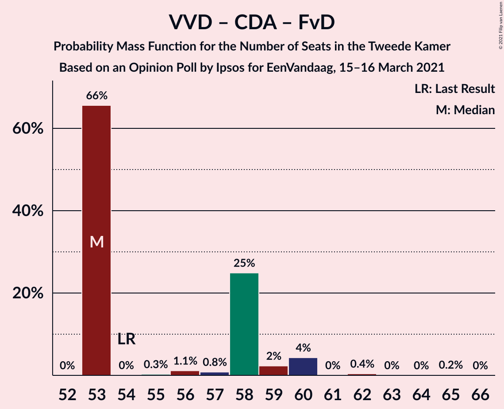

| Number of Seats | Probability | Accumulated | Special Marks |
|:---------------:|:-----------:|:-----------:|:-------------:|
| 53 | 66% | 100% | Median |
| 54 | 0% | 34% | Last Result |
| 55 | 0.3% | 34% |  |
| 56 | 1.1% | 34% |  |
| 57 | 0.8% | 33% |  |
| 58 | 25% | 32% |  |
| 59 | 2% | 7% |  |
| 60 | 4% | 5% |  |
| 61 | 0% | 0.6% |  |
| 62 | 0.4% | 0.6% |  |
| 63 | 0% | 0.2% |  |
| 64 | 0% | 0.2% |  |
| 65 | 0.2% | 0.2% |  |
| 66 | 0% | 0% |  |

### Volkspartij voor Vrijheid en Democratie – Christen-Democratisch Appèl

| Number of Seats | Probability | Accumulated | Special Marks |
|:---------------:|:-----------:|:-----------:|:-------------:|
| 49 | 66% | 100% | Median |
| 50 | 0.2% | 34% |  |
| 51 | 1.4% | 34% |  |
| 52 | 0.5% | 33% | Last Result |
| 53 | 14% | 32% |  |
| 54 | 14% | 19% |  |
| 55 | 5% | 5% |  |
| 56 | 0.2% | 0.6% |  |
| 57 | 0.2% | 0.4% |  |
| 58 | 0% | 0.2% |  |
| 59 | 0% | 0.2% |  |
| 60 | 0.2% | 0.2% |  |
| 61 | 0% | 0% |  |

### Democraten 66 – Christen-Democratisch Appèl – Partij van de Arbeid

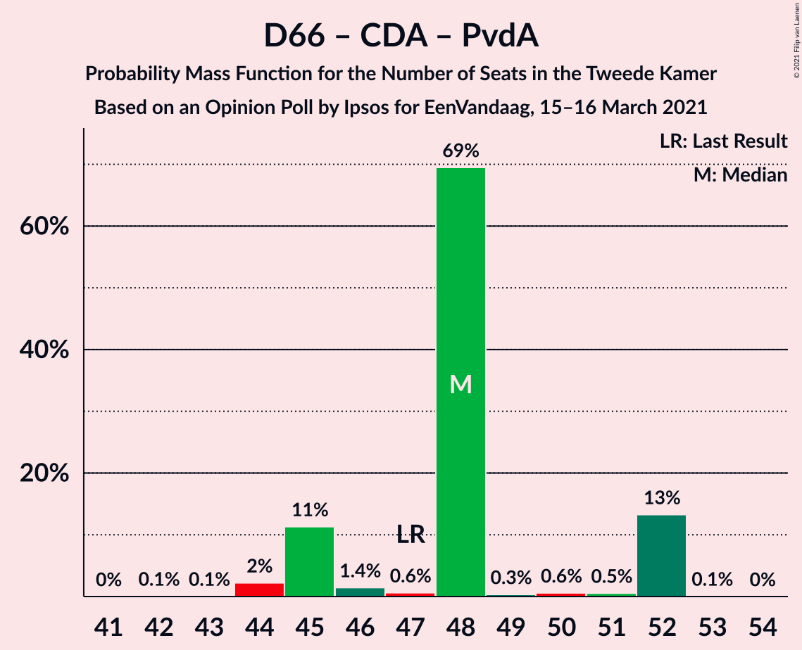

| Number of Seats | Probability | Accumulated | Special Marks |
|:---------------:|:-----------:|:-----------:|:-------------:|
| 42 | 0.1% | 100% |  |
| 43 | 0.1% | 99.9% |  |
| 44 | 2% | 99.9% |  |
| 45 | 11% | 98% |  |
| 46 | 1.4% | 86% |  |
| 47 | 0.6% | 85% | Last Result |
| 48 | 69% | 84% | Median |
| 49 | 0.3% | 15% |  |
| 50 | 0.6% | 14% |  |
| 51 | 0.5% | 14% |  |
| 52 | 13% | 13% |  |
| 53 | 0.1% | 0.1% |  |
| 54 | 0% | 0% |  |

### Volkspartij voor Vrijheid en Democratie – Partij van de Arbeid

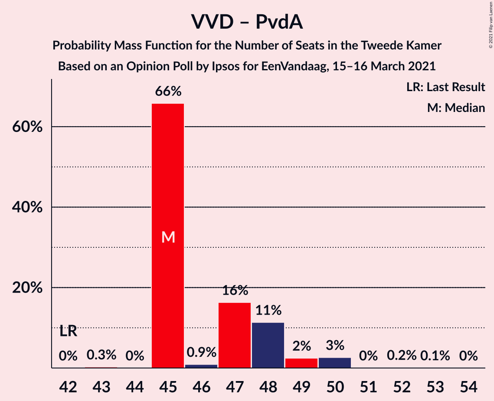

| Number of Seats | Probability | Accumulated | Special Marks |
|:---------------:|:-----------:|:-----------:|:-------------:|
| 42 | 0% | 100% | Last Result |
| 43 | 0.3% | 100% |  |
| 44 | 0% | 99.7% |  |
| 45 | 66% | 99.7% | Median |
| 46 | 0.9% | 34% |  |
| 47 | 16% | 33% |  |
| 48 | 11% | 17% |  |
| 49 | 2% | 5% |  |
| 50 | 3% | 3% |  |
| 51 | 0% | 0.2% |  |
| 52 | 0.2% | 0.2% |  |
| 53 | 0.1% | 0.1% |  |
| 54 | 0% | 0% |  |

### Democraten 66 – Christen-Democratisch Appèl

| Number of Seats | Probability | Accumulated | Special Marks |
|:---------------:|:-----------:|:-----------:|:-------------:|
| 33 | 2% | 100% |  |
| 34 | 1.1% | 98% |  |
| 35 | 12% | 97% |  |
| 36 | 66% | 85% | Median |
| 37 | 5% | 19% |  |
| 38 | 0.3% | 14% | Last Result |
| 39 | 14% | 14% |  |
| 40 | 0.5% | 0.6% |  |
| 41 | 0% | 0.1% |  |
| 42 | 0.1% | 0.1% |  |
| 43 | 0% | 0% |  |

### Christen-Democratisch Appèl – Partij van de Arbeid – ChristenUnie

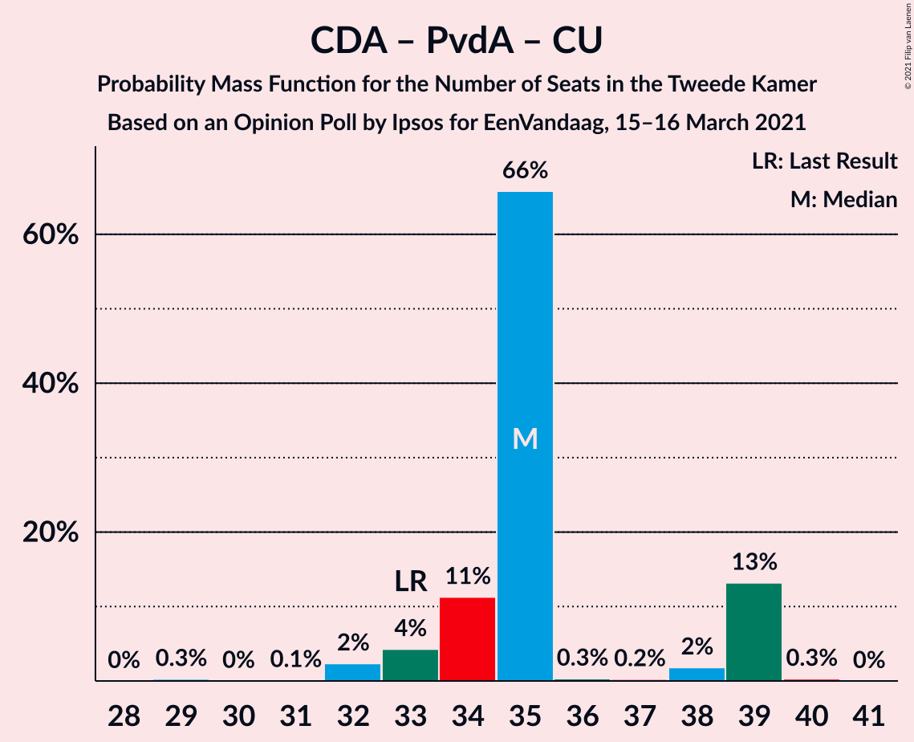

| Number of Seats | Probability | Accumulated | Special Marks |
|:---------------:|:-----------:|:-----------:|:-------------:|
| 29 | 0.3% | 100% |  |
| 30 | 0% | 99.7% |  |
| 31 | 0.1% | 99.7% |  |
| 32 | 2% | 99.6% |  |
| 33 | 4% | 97% | Last Result |
| 34 | 11% | 93% |  |
| 35 | 66% | 82% | Median |
| 36 | 0.3% | 16% |  |
| 37 | 0.2% | 16% |  |
| 38 | 2% | 15% |  |
| 39 | 13% | 13% |  |
| 40 | 0.3% | 0.3% |  |
| 41 | 0% | 0% |  |

### Christen-Democratisch Appèl – Partij van de Arbeid

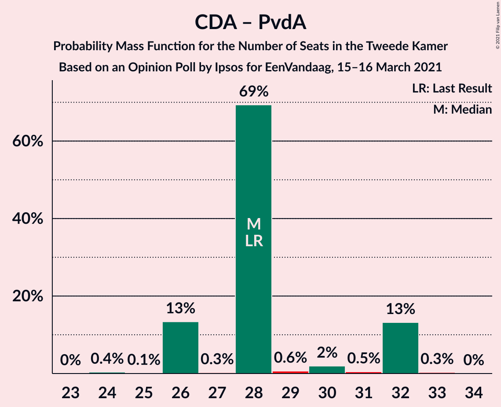

| Number of Seats | Probability | Accumulated | Special Marks |
|:---------------:|:-----------:|:-----------:|:-------------:|
| 24 | 0.4% | 100% |  |
| 25 | 0.1% | 99.6% |  |
| 26 | 13% | 99.5% |  |
| 27 | 0.3% | 86% |  |
| 28 | 69% | 86% | Last Result, Median |
| 29 | 0.6% | 17% |  |
| 30 | 2% | 16% |  |
| 31 | 0.5% | 14% |  |
| 32 | 13% | 13% |  |
| 33 | 0.3% | 0.3% |  |
| 34 | 0% | 0% |  |

## Technical Information

### Opinion Poll

+ **Polling firm:** Ipsos
+ **Commissioner(s):** EenVandaag
+ **Fieldwork period:** 15–16 March 2021

### Calculations

+ **Sample size:** 2552
+ **Simulations done:** 1,048,576
+ **Error estimate:** 2.93%

