# Opinion Poll by Kantar Public, 14–16 March 2021

<a href="#voting-intentions">Voting Intentions</a> | <a href="#seats">Seats</a> | <a href="#coalitions">Coalitions</a> | <a href="#technical-information">Technical Information</a>

## Voting Intentions

### Confidence Intervals

| Party | Last Result | Poll Result | 80% Confidence Interval | 90% Confidence Interval | 95% Confidence Interval | 99% Confidence Interval |
|:-----:|:-----------:|:-----------:|:-----------------------:|:-----------------------:|:-----------------------:|:-----------------------:|
| Volkspartij voor Vrijheid en Democratie | 21.3% | 24.0% | 23.0–25.0% |22.7–25.3% |22.4–25.6% |22.0–26.1% |
| Partij voor de Vrijheid | 13.1% | 12.0% | 11.2–12.8% |11.0–13.0% |10.8–13.2% |10.5–13.6% |
| Democraten 66 | 12.2% | 11.3% | 10.6–12.1% |10.4–12.3% |10.2–12.5% |9.9–12.9% |
| Christen-Democratisch Appèl | 12.4% | 10.0% | 9.3–10.8% |9.1–11.0% |8.9–11.2% |8.6–11.5% |
| Socialistische Partij | 9.1% | 8.0% | 7.4–8.7% |7.2–8.9% |7.1–9.1% |6.8–9.4% |
| Partij van de Arbeid | 5.7% | 8.0% | 7.4–8.7% |7.2–8.9% |7.1–9.1% |6.8–9.4% |
| GroenLinks | 9.1% | 6.0% | 5.5–6.6% |5.3–6.8% |5.2–6.9% |4.9–7.2% |
| ChristenUnie | 3.4% | 4.0% | 3.6–4.5% |3.4–4.7% |3.3–4.8% |3.1–5.0% |
| Partij voor de Dieren | 3.2% | 4.0% | 3.6–4.5% |3.4–4.7% |3.3–4.8% |3.1–5.0% |
| Forum voor Democratie | 1.8% | 3.3% | 2.9–3.8% |2.8–3.9% |2.7–4.1% |2.6–4.3% |
| Staatkundig Gereformeerde Partij | 2.1% | 2.0% | 1.7–2.4% |1.6–2.5% |1.5–2.6% |1.4–2.8% |
| Volt Europa | 0.0% | 2.0% | 1.7–2.4% |1.6–2.5% |1.5–2.6% |1.4–2.8% |
| DENK | 2.1% | 1.3% | 1.1–1.7% |1.0–1.8% |1.0–1.8% |0.9–2.0% |
| Juiste Antwoord 2021 | 0.0% | 1.3% | 1.1–1.7% |1.0–1.8% |1.0–1.8% |0.9–2.0% |
| 50Plus | 3.1% | 0.7% | 0.5–0.9% |0.5–1.0% |0.4–1.0% |0.4–1.2% |
| Bij1 | 0.3% | 0.7% | 0.5–0.9% |0.5–1.0% |0.4–1.0% |0.4–1.2% |
| BoerBurgerBeweging | 0.0% | 0.7% | 0.5–0.9% |0.5–1.0% |0.4–1.0% |0.4–1.2% |
| Splinter | 0.0% | 0.7% | 0.5–0.9% |0.5–1.0% |0.4–1.0% |0.4–1.2% |

*Note:* The poll result column reflects the actual value used in the calculations. Published results may vary slightly, and in addition be rounded to fewer digits.

## Seats

### Confidence Intervals

| Party | Last Result | Median | 80% Confidence Interval | 90% Confidence Interval | 95% Confidence Interval | 99% Confidence Interval |
|:-----:|:-----------:|:------:|:-----------------------:|:-----------------------:|:-----------------------:|:-----------------------:|
| <a href="#volkspartij-voor-vrijheid-en-democratie">Volkspartij voor Vrijheid en Democratie</a> | 33 | 39 | 35–41 |35–41 |35–41 |35–41 |
| <a href="#partij-voor-de-vrijheid">Partij voor de Vrijheid</a> | 20 | 18 | 16–22 |16–22 |16–22 |16–22 |
| <a href="#democraten-66">Democraten 66</a> | 19 | 18 | 15–20 |15–20 |15–20 |15–20 |
| <a href="#christen-democratisch-appèl">Christen-Democratisch Appèl</a> | 19 | 15 | 14–15 |13–16 |13–16 |13–17 |
| <a href="#socialistische-partij">Socialistische Partij</a> | 14 | 12 | 10–13 |10–14 |10–14 |10–14 |
| <a href="#partij-van-de-arbeid">Partij van de Arbeid</a> | 9 | 12 | 11–13 |11–14 |11–14 |10–14 |
| <a href="#groenlinks">GroenLinks</a> | 14 | 10 | 9–10 |9–10 |8–10 |7–11 |
| <a href="#christenunie">ChristenUnie</a> | 5 | 5 | 5–6 |5–7 |5–7 |5–7 |
| <a href="#partij-voor-de-dieren">Partij voor de Dieren</a> | 5 | 6 | 5–7 |4–7 |4–7 |4–7 |
| <a href="#forum-voor-democratie">Forum voor Democratie</a> | 2 | 5 | 4–6 |4–6 |4–6 |3–6 |
| <a href="#staatkundig-gereformeerde-partij">Staatkundig Gereformeerde Partij</a> | 3 | 3 | 2–4 |2–4 |2–4 |1–4 |
| <a href="#volt-europa">Volt Europa</a> | 0 | 3 | 2–3 |2–3 |2–4 |2–4 |
| <a href="#denk">DENK</a> | 3 | 2 | 1–2 |1–2 |1–2 |1–2 |
| <a href="#juiste-antwoord-2021">Juiste Antwoord 2021</a> | 0 | 2 | 1–2 |1–2 |1–2 |1–3 |
| <a href="#50plus">50Plus</a> | 4 | 1 | 0–1 |0–1 |0–1 |0–1 |
| <a href="#bij1">Bij1</a> | 0 | 1 | 0–1 |0–1 |0–1 |0–2 |
| <a href="#boerburgerbeweging">BoerBurgerBeweging</a> | 0 | 1 | 0–1 |0–1 |0–1 |0–1 |
| <a href="#splinter">Splinter</a> | 0 | 1 | 0–1 |0–1 |0–1 |0–1 |

### Volkspartij voor Vrijheid en Democratie

*For a full overview of the results for this party, see the [Volkspartij voor Vrijheid en Democratie](party-volkspartijvoorvrijheidendemocratie.html) page.*

| Number of Seats | Probability | Accumulated | Special Marks |
|:---------------:|:-----------:|:-----------:|:-------------:|
| 33 | 0.3% | 100% | Last Result |
| 34 | 0.1% | 99.7% |  |
| 35 | 22% | 99.6% |  |
| 36 | 3% | 78% |  |
| 37 | 1.4% | 75% |  |
| 38 | 7% | 73% |  |
| 39 | 33% | 66% | Median |
| 40 | 12% | 33% |  |
| 41 | 21% | 21% |  |
| 42 | 0.1% | 0.1% |  |
| 43 | 0% | 0% |  |

### Partij voor de Vrijheid

*For a full overview of the results for this party, see the [Partij voor de Vrijheid](party-partijvoordevrijheid.html) page.*

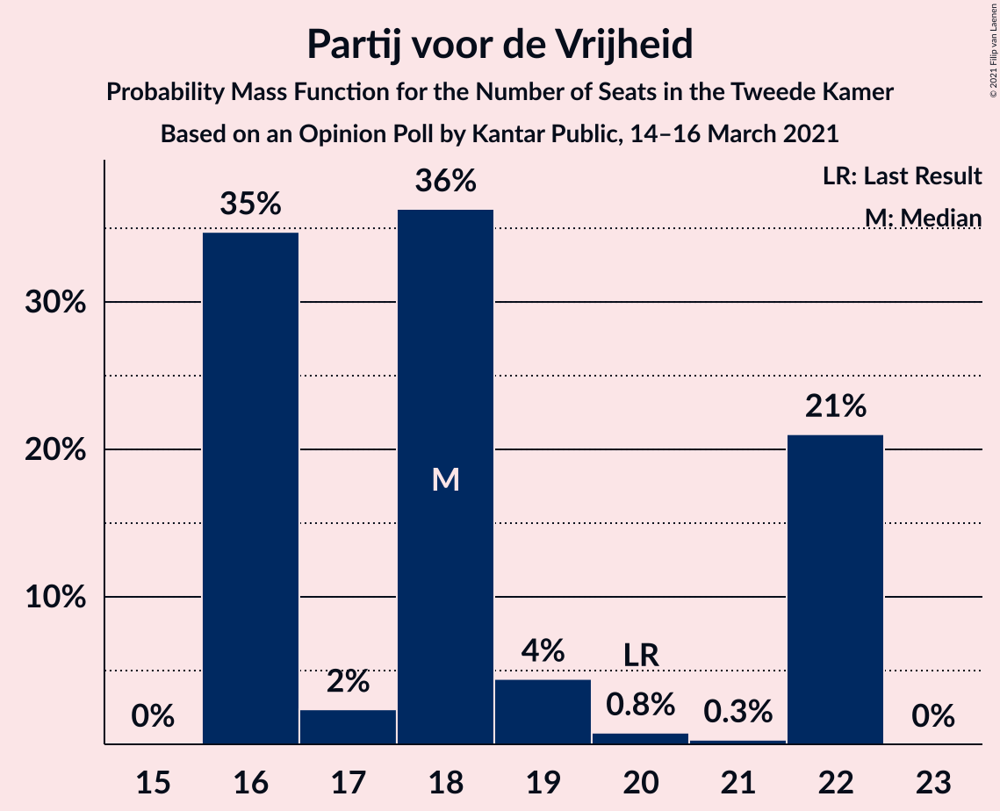

| Number of Seats | Probability | Accumulated | Special Marks |
|:---------------:|:-----------:|:-----------:|:-------------:|
| 16 | 35% | 100% |  |
| 17 | 2% | 65% |  |
| 18 | 36% | 63% | Median |
| 19 | 4% | 27% |  |
| 20 | 0.8% | 22% | Last Result |
| 21 | 0.3% | 21% |  |
| 22 | 21% | 21% |  |
| 23 | 0% | 0% |  |

### Democraten 66

*For a full overview of the results for this party, see the [Democraten 66](party-democraten66.html) page.*

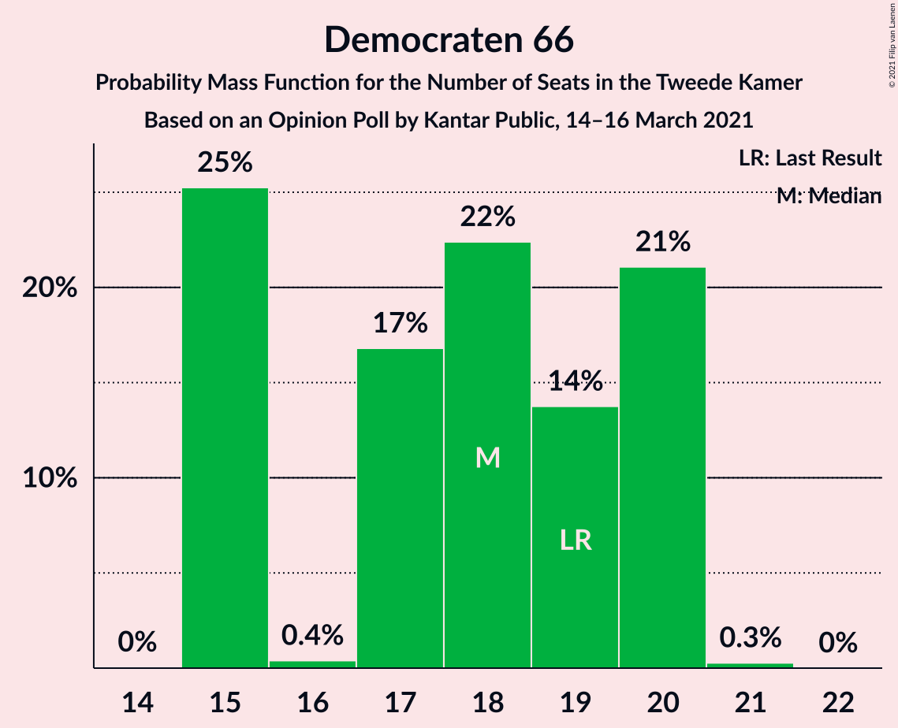

| Number of Seats | Probability | Accumulated | Special Marks |
|:---------------:|:-----------:|:-----------:|:-------------:|
| 15 | 25% | 100% |  |
| 16 | 0.4% | 75% |  |
| 17 | 17% | 74% |  |
| 18 | 22% | 58% | Median |
| 19 | 14% | 35% | Last Result |
| 20 | 21% | 21% |  |
| 21 | 0.3% | 0.3% |  |
| 22 | 0% | 0% |  |

### Christen-Democratisch Appèl

*For a full overview of the results for this party, see the [Christen-Democratisch Appèl](party-christen-democratischappèl.html) page.*

| Number of Seats | Probability | Accumulated | Special Marks |
|:---------------:|:-----------:|:-----------:|:-------------:|
| 12 | 0.3% | 100% |  |
| 13 | 5% | 99.7% |  |
| 14 | 39% | 94% |  |
| 15 | 48% | 55% | Median |
| 16 | 5% | 7% |  |
| 17 | 2% | 2% |  |
| 18 | 0.2% | 0.2% |  |
| 19 | 0% | 0% | Last Result |

### Socialistische Partij

*For a full overview of the results for this party, see the [Socialistische Partij](party-socialistischepartij.html) page.*

| Number of Seats | Probability | Accumulated | Special Marks |
|:---------------:|:-----------:|:-----------:|:-------------:|
| 10 | 26% | 100% |  |
| 11 | 20% | 74% |  |
| 12 | 37% | 54% | Median |
| 13 | 7% | 17% |  |
| 14 | 10% | 10% | Last Result |
| 15 | 0.3% | 0.3% |  |
| 16 | 0% | 0% |  |

### Partij van de Arbeid

*For a full overview of the results for this party, see the [Partij van de Arbeid](party-partijvandearbeid.html) page.*

| Number of Seats | Probability | Accumulated | Special Marks |
|:---------------:|:-----------:|:-----------:|:-------------:|
| 9 | 0% | 100% | Last Result |
| 10 | 2% | 100% |  |
| 11 | 37% | 98% |  |
| 12 | 25% | 61% | Median |
| 13 | 28% | 36% |  |
| 14 | 7% | 7% |  |
| 15 | 0.1% | 0.1% |  |
| 16 | 0% | 0% |  |

### GroenLinks

*For a full overview of the results for this party, see the [GroenLinks](party-groenlinks.html) page.*

| Number of Seats | Probability | Accumulated | Special Marks |
|:---------------:|:-----------:|:-----------:|:-------------:|
| 7 | 0.7% | 100% |  |
| 8 | 2% | 99.3% |  |
| 9 | 30% | 97% |  |
| 10 | 67% | 68% | Median |
| 11 | 0.3% | 0.5% |  |
| 12 | 0.2% | 0.2% |  |
| 13 | 0% | 0% |  |
| 14 | 0% | 0% | Last Result |

### ChristenUnie

*For a full overview of the results for this party, see the [ChristenUnie](party-christenunie.html) page.*

| Number of Seats | Probability | Accumulated | Special Marks |
|:---------------:|:-----------:|:-----------:|:-------------:|
| 4 | 0.5% | 100% |  |
| 5 | 51% | 99.5% | Last Result, Median |
| 6 | 40% | 49% |  |
| 7 | 9% | 9% |  |
| 8 | 0.1% | 0.1% |  |
| 9 | 0% | 0% |  |

### Partij voor de Dieren

*For a full overview of the results for this party, see the [Partij voor de Dieren](party-partijvoordedieren.html) page.*

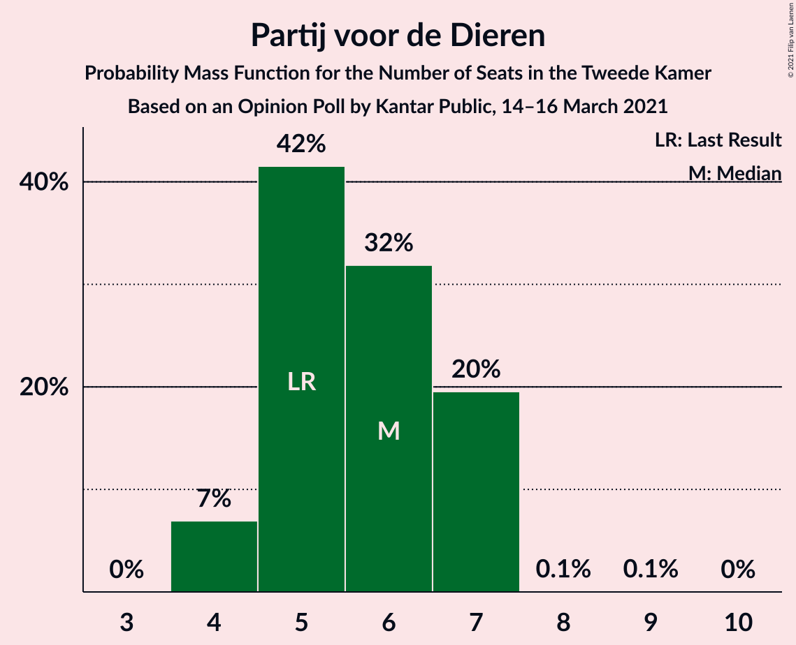

| Number of Seats | Probability | Accumulated | Special Marks |
|:---------------:|:-----------:|:-----------:|:-------------:|
| 4 | 7% | 100% |  |
| 5 | 42% | 93% | Last Result |
| 6 | 32% | 52% | Median |
| 7 | 20% | 20% |  |
| 8 | 0.1% | 0.1% |  |
| 9 | 0.1% | 0.1% |  |
| 10 | 0% | 0% |  |

### Forum voor Democratie

*For a full overview of the results for this party, see the [Forum voor Democratie](party-forumvoordemocratie.html) page.*

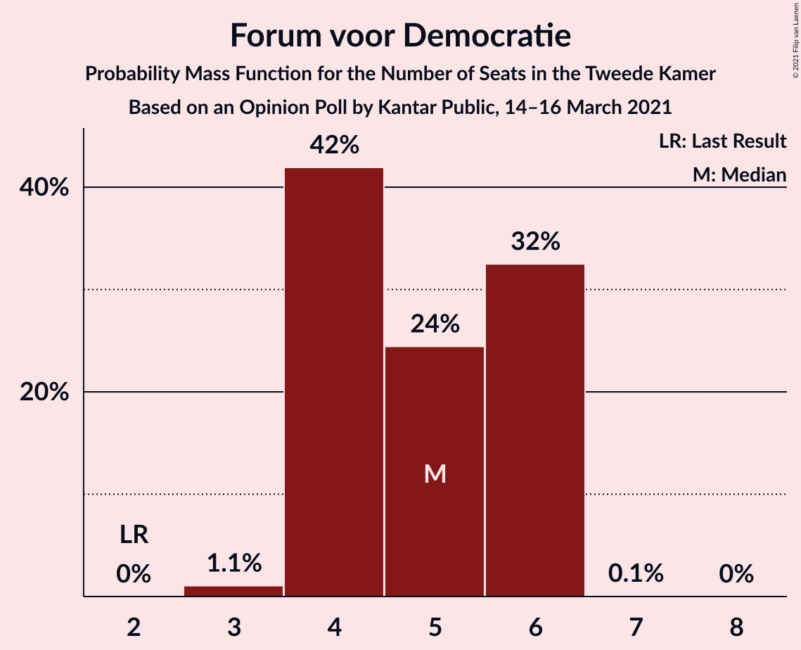

| Number of Seats | Probability | Accumulated | Special Marks |
|:---------------:|:-----------:|:-----------:|:-------------:|
| 2 | 0% | 100% | Last Result |
| 3 | 1.1% | 100% |  |
| 4 | 42% | 98.9% |  |
| 5 | 24% | 57% | Median |
| 6 | 32% | 33% |  |
| 7 | 0.1% | 0.1% |  |
| 8 | 0% | 0% |  |

### Staatkundig Gereformeerde Partij

*For a full overview of the results for this party, see the [Staatkundig Gereformeerde Partij](party-staatkundiggereformeerdepartij.html) page.*

| Number of Seats | Probability | Accumulated | Special Marks |
|:---------------:|:-----------:|:-----------:|:-------------:|
| 1 | 1.2% | 100% |  |
| 2 | 22% | 98.8% |  |
| 3 | 56% | 76% | Last Result, Median |
| 4 | 20% | 20% |  |
| 5 | 0% | 0% |  |

### Volt Europa

*For a full overview of the results for this party, see the [Volt Europa](party-volteuropa.html) page.*

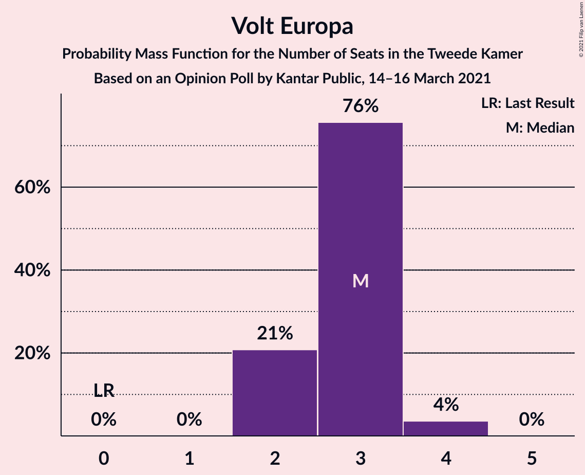

| Number of Seats | Probability | Accumulated | Special Marks |
|:---------------:|:-----------:|:-----------:|:-------------:|
| 0 | 0% | 100% | Last Result |
| 1 | 0% | 100% |  |
| 2 | 21% | 100% |  |
| 3 | 76% | 79% | Median |
| 4 | 4% | 4% |  |
| 5 | 0% | 0% |  |

### DENK

*For a full overview of the results for this party, see the [DENK](party-denk.html) page.*

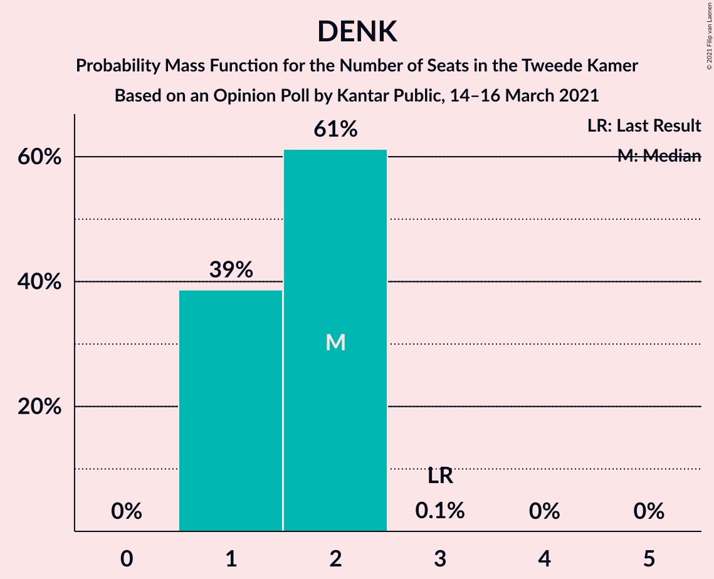

| Number of Seats | Probability | Accumulated | Special Marks |
|:---------------:|:-----------:|:-----------:|:-------------:|
| 1 | 39% | 100% |  |
| 2 | 61% | 61% | Median |
| 3 | 0.1% | 0.1% | Last Result |
| 4 | 0% | 0% |  |

### Juiste Antwoord 2021

*For a full overview of the results for this party, see the [Juiste Antwoord 2021](party-juisteantwoord2021.html) page.*

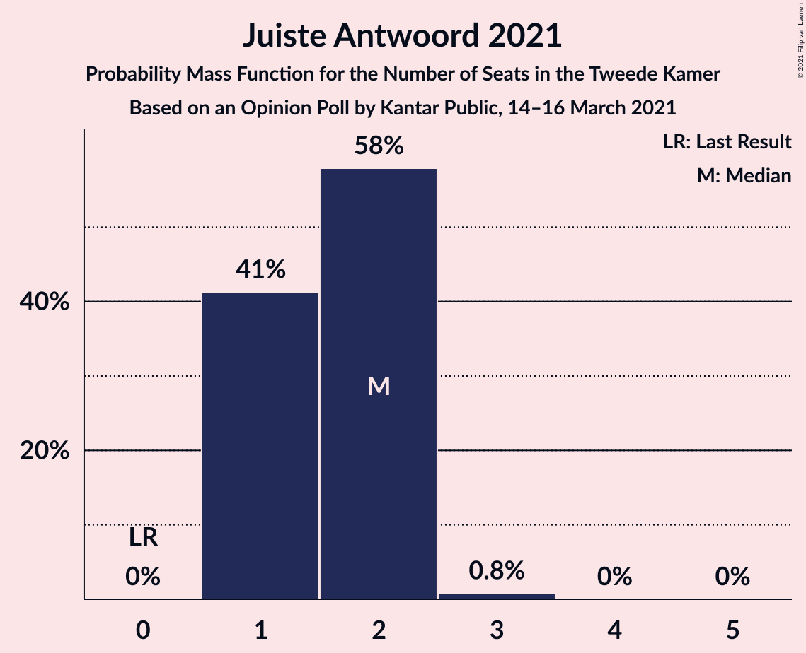

| Number of Seats | Probability | Accumulated | Special Marks |
|:---------------:|:-----------:|:-----------:|:-------------:|
| 0 | 0% | 100% | Last Result |
| 1 | 41% | 100% |  |
| 2 | 58% | 59% | Median |
| 3 | 0.8% | 0.8% |  |
| 4 | 0% | 0% |  |

### 50Plus

*For a full overview of the results for this party, see the [50Plus](party-50plus.html) page.*

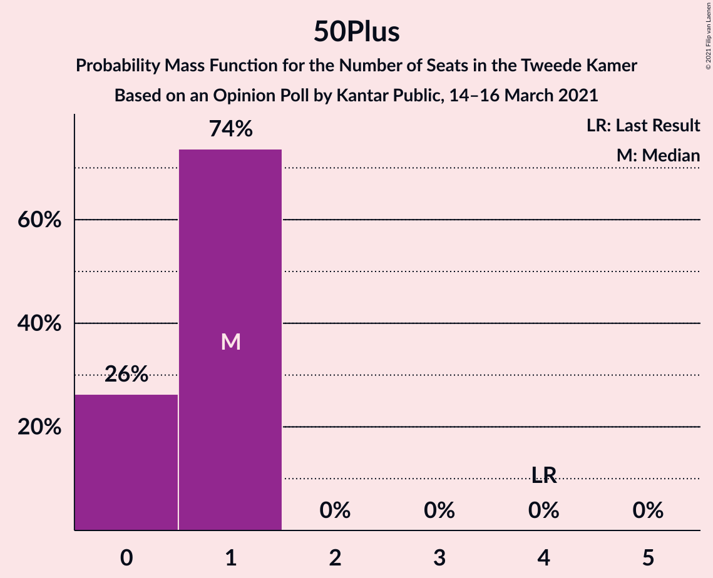

| Number of Seats | Probability | Accumulated | Special Marks |
|:---------------:|:-----------:|:-----------:|:-------------:|
| 0 | 26% | 100% |  |
| 1 | 74% | 74% | Median |
| 2 | 0% | 0% |  |
| 3 | 0% | 0% |  |
| 4 | 0% | 0% | Last Result |

### Bij1

*For a full overview of the results for this party, see the [Bij1](party-bij1.html) page.*

| Number of Seats | Probability | Accumulated | Special Marks |
|:---------------:|:-----------:|:-----------:|:-------------:|
| 0 | 27% | 100% | Last Result |
| 1 | 72% | 73% | Median |
| 2 | 0.6% | 0.6% |  |
| 3 | 0% | 0% |  |

### BoerBurgerBeweging

*For a full overview of the results for this party, see the [BoerBurgerBeweging](party-boerburgerbeweging.html) page.*

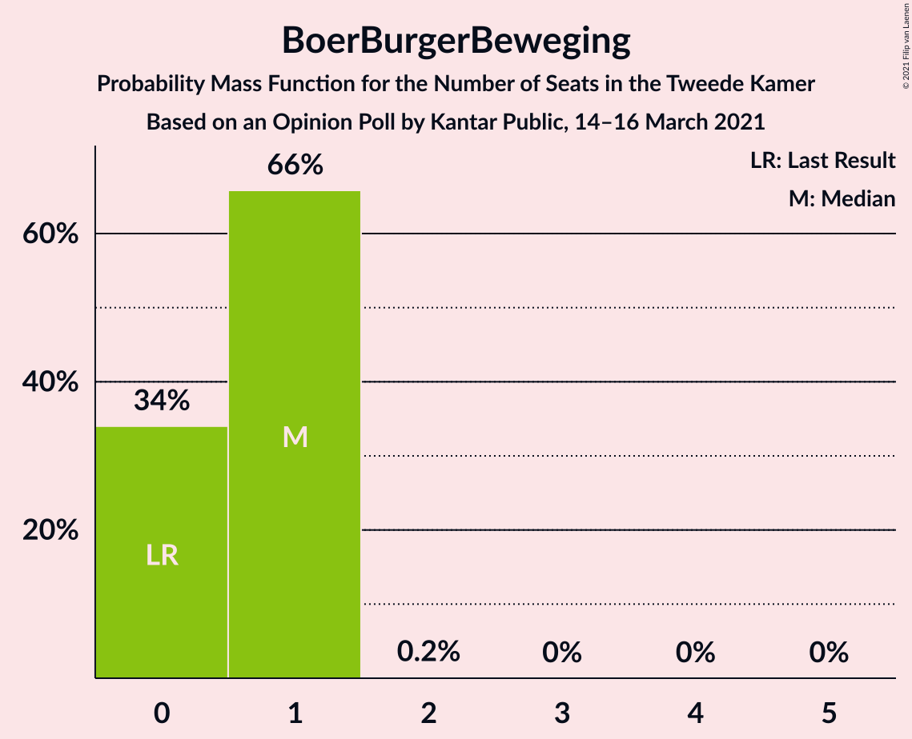

| Number of Seats | Probability | Accumulated | Special Marks |
|:---------------:|:-----------:|:-----------:|:-------------:|
| 0 | 34% | 100% | Last Result |
| 1 | 66% | 66% | Median |
| 2 | 0.2% | 0.2% |  |
| 3 | 0% | 0% |  |

### Splinter

*For a full overview of the results for this party, see the [Splinter](party-splinter.html) page.*

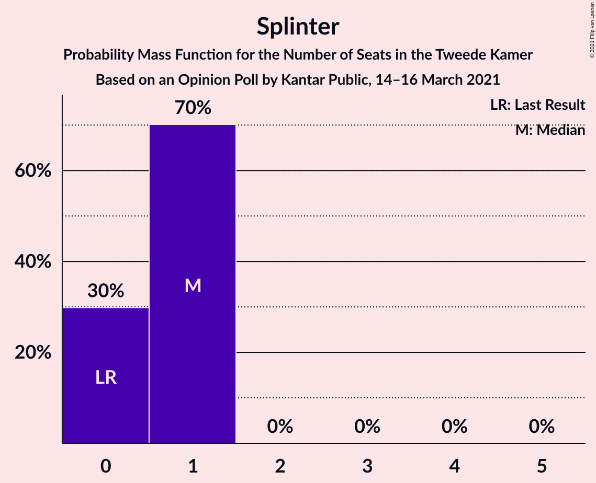

| Number of Seats | Probability | Accumulated | Special Marks |
|:---------------:|:-----------:|:-----------:|:-------------:|
| 0 | 30% | 100% | Last Result |
| 1 | 70% | 70% | Median |
| 2 | 0% | 0% |  |

## Coalitions

### Confidence Intervals

| Coalition | Last Result | Median | Majority? | 80% Confidence Interval | 90% Confidence Interval | 95% Confidence Interval | 99% Confidence Interval |
|:---------:|:-----------:|:------:|:---------:|:-----------------------:|:-----------------------:|:-----------------------:|:-----------------------:|
| Volkspartij voor Vrijheid en Democratie – Democraten 66 – Christen-Democratisch Appèl – Partij van de Arbeid – ChristenUnie | 85 | 88 | 100% | 87–90 | 85–90 | 85–91 | 84–91 |
| Volkspartij voor Vrijheid en Democratie – Democraten 66 – Christen-Democratisch Appèl – GroenLinks – ChristenUnie | 90 | 85 | 100% | 85–89 | 83–89 | 83–89 | 82–89 |
| Volkspartij voor Vrijheid en Democratie – Partij voor de Vrijheid – Christen-Democratisch Appèl – Forum voor Democratie – Staatkundig Gereformeerde Partij | 77 | 79 | 99.3% | 76–81 | 76–81 | 76–81 | 75–81 |
| Volkspartij voor Vrijheid en Democratie – Democraten 66 – Christen-Democratisch Appèl – ChristenUnie | 76 | 75 | 45% | 75–79 | 74–79 | 74–79 | 72–79 |
| Volkspartij voor Vrijheid en Democratie – Partij voor de Vrijheid – Christen-Democratisch Appèl – Forum voor Democratie | 74 | 76 | 77% | 74–78 | 74–78 | 74–78 | 71–78 |
| Democraten 66 – Christen-Democratisch Appèl – Partij van de Arbeid – Socialistische Partij – GroenLinks – ChristenUnie | 80 | 70 | 3% | 68–74 | 68–74 | 68–76 | 68–76 |
| Volkspartij voor Vrijheid en Democratie – Democraten 66 – Christen-Democratisch Appèl | 71 | 70 | 0% | 69–73 | 69–73 | 69–73 | 67–73 |
| Volkspartij voor Vrijheid en Democratie – Partij voor de Vrijheid – Christen-Democratisch Appèl | 72 | 72 | 0.1% | 70–72 | 70–72 | 69–73 | 66–74 |
| Volkspartij voor Vrijheid en Democratie – Democraten 66 – Partij van de Arbeid | 61 | 67 | 0% | 67–70 | 66–70 | 65–70 | 65–70 |
| Volkspartij voor Vrijheid en Democratie – Christen-Democratisch Appèl – Partij van de Arbeid | 61 | 66 | 0% | 62–67 | 62–67 | 62–67 | 61–68 |
| Volkspartij voor Vrijheid en Democratie – Christen-Democratisch Appèl – Forum voor Democratie – Staatkundig Gereformeerde Partij – 50Plus | 61 | 61 | 0% | 57–65 | 57–65 | 57–65 | 57–65 |
| Volkspartij voor Vrijheid en Democratie – Christen-Democratisch Appèl – Forum voor Democratie – Staatkundig Gereformeerde Partij | 57 | 61 | 0% | 57–64 | 57–64 | 57–64 | 57–64 |
| Democraten 66 – Christen-Democratisch Appèl – Partij van de Arbeid – GroenLinks – ChristenUnie | 66 | 59 | 0% | 57–62 | 56–62 | 56–62 | 56–64 |
| Volkspartij voor Vrijheid en Democratie – Christen-Democratisch Appèl – Forum voor Democratie – 50Plus | 58 | 59 | 0% | 54–61 | 54–61 | 54–61 | 54–62 |
| Volkspartij voor Vrijheid en Democratie – Christen-Democratisch Appèl – Forum voor Democratie | 54 | 59 | 0% | 54–60 | 54–60 | 54–60 | 53–61 |
| Volkspartij voor Vrijheid en Democratie – Christen-Democratisch Appèl | 52 | 54 | 0% | 50–55 | 50–55 | 50–55 | 48–56 |
| Volkspartij voor Vrijheid en Democratie – Partij van de Arbeid | 42 | 52 | 0% | 47–52 | 47–53 | 47–53 | 47–54 |
| Democraten 66 – Christen-Democratisch Appèl – Partij van de Arbeid | 47 | 44 | 0% | 43–47 | 42–47 | 42–47 | 41–48 |
| Christen-Democratisch Appèl – Partij van de Arbeid – ChristenUnie | 33 | 32 | 0% | 30–34 | 30–34 | 30–35 | 30–35 |
| Democraten 66 – Christen-Democratisch Appèl | 38 | 32 | 0% | 30–35 | 30–35 | 30–35 | 28–36 |
| Christen-Democratisch Appèl – Partij van de Arbeid | 28 | 27 | 0% | 25–28 | 25–28 | 25–30 | 25–30 |

### Volkspartij voor Vrijheid en Democratie – Democraten 66 – Christen-Democratisch Appèl – Partij van de Arbeid – ChristenUnie

| Number of Seats | Probability | Accumulated | Special Marks |
|:---------------:|:-----------:|:-----------:|:-------------:|
| 84 | 0.9% | 100% |  |
| 85 | 5% | 99.1% | Last Result |
| 86 | 0.4% | 94% |  |
| 87 | 22% | 94% |  |
| 88 | 29% | 72% |  |
| 89 | 24% | 43% | Median |
| 90 | 17% | 20% |  |
| 91 | 2% | 3% |  |
| 92 | 0.5% | 0.5% |  |
| 93 | 0% | 0% |  |

### Volkspartij voor Vrijheid en Democratie – Democraten 66 – Christen-Democratisch Appèl – GroenLinks – ChristenUnie

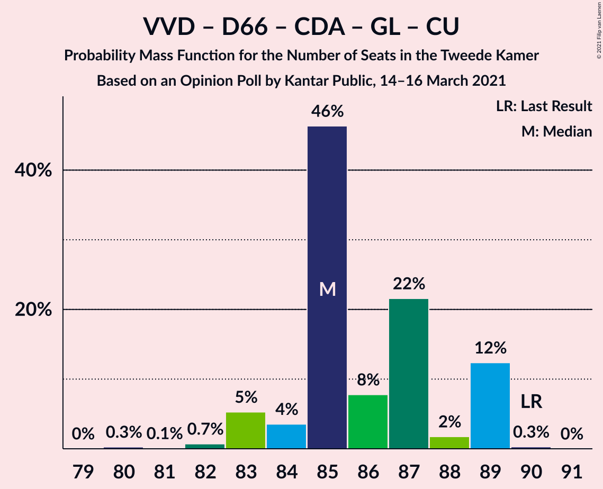

| Number of Seats | Probability | Accumulated | Special Marks |
|:---------------:|:-----------:|:-----------:|:-------------:|
| 80 | 0.3% | 100% |  |
| 81 | 0.1% | 99.7% |  |
| 82 | 0.7% | 99.6% |  |
| 83 | 5% | 98.9% |  |
| 84 | 4% | 94% |  |
| 85 | 46% | 90% |  |
| 86 | 8% | 44% |  |
| 87 | 22% | 36% | Median |
| 88 | 2% | 14% |  |
| 89 | 12% | 13% |  |
| 90 | 0.3% | 0.3% | Last Result |
| 91 | 0% | 0% |  |

### Volkspartij voor Vrijheid en Democratie – Partij voor de Vrijheid – Christen-Democratisch Appèl – Forum voor Democratie – Staatkundig Gereformeerde Partij

| Number of Seats | Probability | Accumulated | Special Marks |
|:---------------:|:-----------:|:-----------:|:-------------:|
| 73 | 0.3% | 100% |  |
| 74 | 0% | 99.7% |  |
| 75 | 0.4% | 99.7% |  |
| 76 | 13% | 99.3% | Majority |
| 77 | 7% | 86% | Last Result |
| 78 | 8% | 79% |  |
| 79 | 24% | 71% |  |
| 80 | 22% | 47% | Median |
| 81 | 25% | 25% |  |
| 82 | 0.1% | 0.3% |  |
| 83 | 0.1% | 0.2% |  |
| 84 | 0% | 0.1% |  |
| 85 | 0% | 0.1% |  |
| 86 | 0% | 0% |  |

### Volkspartij voor Vrijheid en Democratie – Democraten 66 – Christen-Democratisch Appèl – ChristenUnie

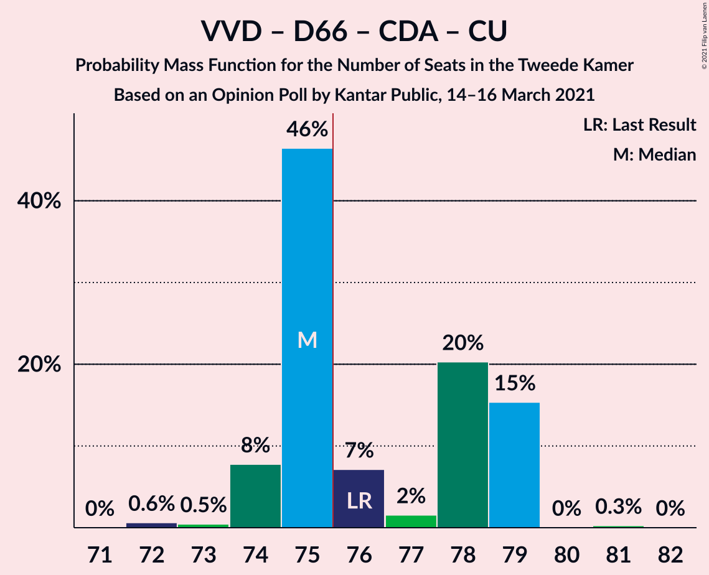

| Number of Seats | Probability | Accumulated | Special Marks |
|:---------------:|:-----------:|:-----------:|:-------------:|
| 72 | 0.6% | 100% |  |
| 73 | 0.5% | 99.4% |  |
| 74 | 8% | 98.9% |  |
| 75 | 46% | 91% |  |
| 76 | 7% | 45% | Last Result, Majority |
| 77 | 2% | 38% | Median |
| 78 | 20% | 36% |  |
| 79 | 15% | 16% |  |
| 80 | 0% | 0.3% |  |
| 81 | 0.3% | 0.3% |  |
| 82 | 0% | 0% |  |

### Volkspartij voor Vrijheid en Democratie – Partij voor de Vrijheid – Christen-Democratisch Appèl – Forum voor Democratie

| Number of Seats | Probability | Accumulated | Special Marks |
|:---------------:|:-----------:|:-----------:|:-------------:|
| 71 | 0.6% | 100% |  |
| 72 | 0.3% | 99.4% |  |
| 73 | 0.7% | 99.1% |  |
| 74 | 17% | 98% | Last Result |
| 75 | 4% | 81% |  |
| 76 | 47% | 77% | Majority |
| 77 | 3% | 30% | Median |
| 78 | 26% | 27% |  |
| 79 | 0.3% | 0.4% |  |
| 80 | 0% | 0.1% |  |
| 81 | 0.1% | 0.1% |  |
| 82 | 0% | 0.1% |  |
| 83 | 0% | 0% |  |

### Democraten 66 – Christen-Democratisch Appèl – Partij van de Arbeid – Socialistische Partij – GroenLinks – ChristenUnie

| Number of Seats | Probability | Accumulated | Special Marks |
|:---------------:|:-----------:|:-----------:|:-------------:|
| 68 | 20% | 100% |  |
| 69 | 25% | 80% |  |
| 70 | 7% | 55% |  |
| 71 | 0.8% | 48% |  |
| 72 | 15% | 47% | Median |
| 73 | 0.7% | 32% |  |
| 74 | 29% | 32% |  |
| 75 | 0.4% | 3% |  |
| 76 | 2% | 3% | Majority |
| 77 | 0.5% | 0.5% |  |
| 78 | 0% | 0% |  |
| 79 | 0% | 0% |  |
| 80 | 0% | 0% | Last Result |

### Volkspartij voor Vrijheid en Democratie – Democraten 66 – Christen-Democratisch Appèl

| Number of Seats | Probability | Accumulated | Special Marks |
|:---------------:|:-----------:|:-----------:|:-------------:|
| 67 | 1.3% | 100% |  |
| 68 | 0.2% | 98.7% |  |
| 69 | 37% | 98% |  |
| 70 | 23% | 61% |  |
| 71 | 1.0% | 38% | Last Result |
| 72 | 4% | 37% | Median |
| 73 | 33% | 33% |  |
| 74 | 0% | 0.4% |  |
| 75 | 0.3% | 0.4% |  |
| 76 | 0% | 0% | Majority |

### Volkspartij voor Vrijheid en Democratie – Partij voor de Vrijheid – Christen-Democratisch Appèl

| Number of Seats | Probability | Accumulated | Special Marks |
|:---------------:|:-----------:|:-----------:|:-------------:|
| 66 | 0.5% | 100% |  |
| 67 | 0.1% | 99.5% |  |
| 68 | 1.1% | 99.3% |  |
| 69 | 2% | 98% |  |
| 70 | 22% | 96% |  |
| 71 | 23% | 74% |  |
| 72 | 49% | 52% | Last Result, Median |
| 73 | 2% | 3% |  |
| 74 | 0.9% | 1.1% |  |
| 75 | 0.1% | 0.2% |  |
| 76 | 0.1% | 0.1% | Majority |
| 77 | 0% | 0.1% |  |
| 78 | 0% | 0% |  |

### Volkspartij voor Vrijheid en Democratie – Democraten 66 – Partij van de Arbeid

| Number of Seats | Probability | Accumulated | Special Marks |
|:---------------:|:-----------:|:-----------:|:-------------:|
| 61 | 0% | 100% | Last Result |
| 62 | 0.1% | 100% |  |
| 63 | 0.2% | 99.9% |  |
| 64 | 0.1% | 99.7% |  |
| 65 | 2% | 99.6% |  |
| 66 | 6% | 97% |  |
| 67 | 49% | 92% |  |
| 68 | 1.0% | 43% |  |
| 69 | 4% | 42% | Median |
| 70 | 37% | 37% |  |
| 71 | 0% | 0% |  |

### Volkspartij voor Vrijheid en Democratie – Christen-Democratisch Appèl – Partij van de Arbeid

| Number of Seats | Probability | Accumulated | Special Marks |
|:---------------:|:-----------:|:-----------:|:-------------:|
| 60 | 0.3% | 100% |  |
| 61 | 1.0% | 99.7% | Last Result |
| 62 | 21% | 98.7% |  |
| 63 | 5% | 78% |  |
| 64 | 0.2% | 72% |  |
| 65 | 15% | 72% |  |
| 66 | 30% | 57% | Median |
| 67 | 26% | 27% |  |
| 68 | 0.7% | 0.8% |  |
| 69 | 0% | 0.1% |  |
| 70 | 0% | 0.1% |  |
| 71 | 0% | 0.1% |  |
| 72 | 0% | 0% |  |

### Volkspartij voor Vrijheid en Democratie – Christen-Democratisch Appèl – Forum voor Democratie – Staatkundig Gereformeerde Partij – 50Plus

| Number of Seats | Probability | Accumulated | Special Marks |
|:---------------:|:-----------:|:-----------:|:-------------:|
| 55 | 0.3% | 100% |  |
| 56 | 0% | 99.7% |  |
| 57 | 22% | 99.7% |  |
| 58 | 0.4% | 78% |  |
| 59 | 1.1% | 78% |  |
| 60 | 9% | 77% |  |
| 61 | 19% | 68% | Last Result |
| 62 | 3% | 49% |  |
| 63 | 0.6% | 47% | Median |
| 64 | 26% | 46% |  |
| 65 | 20% | 20% |  |
| 66 | 0% | 0.1% |  |
| 67 | 0.1% | 0.1% |  |
| 68 | 0% | 0% |  |

### Volkspartij voor Vrijheid en Democratie – Christen-Democratisch Appèl – Forum voor Democratie – Staatkundig Gereformeerde Partij

| Number of Seats | Probability | Accumulated | Special Marks |
|:---------------:|:-----------:|:-----------:|:-------------:|
| 55 | 0.3% | 100% |  |
| 56 | 0% | 99.7% |  |
| 57 | 22% | 99.7% | Last Result |
| 58 | 1.0% | 78% |  |
| 59 | 7% | 77% |  |
| 60 | 18% | 69% |  |
| 61 | 4% | 51% |  |
| 62 | 1.3% | 47% | Median |
| 63 | 26% | 46% |  |
| 64 | 20% | 20% |  |
| 65 | 0% | 0.1% |  |
| 66 | 0% | 0.1% |  |
| 67 | 0% | 0% |  |

### Democraten 66 – Christen-Democratisch Appèl – Partij van de Arbeid – GroenLinks – ChristenUnie

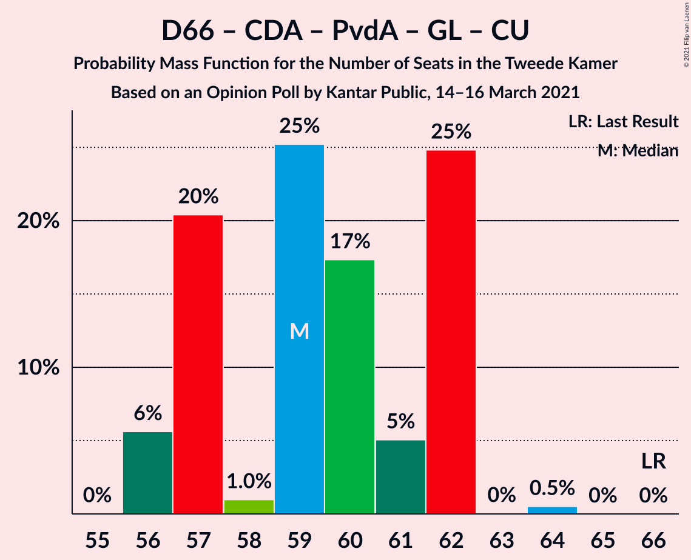

| Number of Seats | Probability | Accumulated | Special Marks |
|:---------------:|:-----------:|:-----------:|:-------------:|
| 56 | 6% | 100% |  |
| 57 | 20% | 94% |  |
| 58 | 1.0% | 74% |  |
| 59 | 25% | 73% |  |
| 60 | 17% | 48% | Median |
| 61 | 5% | 30% |  |
| 62 | 25% | 25% |  |
| 63 | 0% | 0.5% |  |
| 64 | 0.5% | 0.5% |  |
| 65 | 0% | 0% |  |
| 66 | 0% | 0% | Last Result |

### Volkspartij voor Vrijheid en Democratie – Christen-Democratisch Appèl – Forum voor Democratie – 50Plus

| Number of Seats | Probability | Accumulated | Special Marks |
|:---------------:|:-----------:|:-----------:|:-------------:|
| 53 | 0.3% | 100% |  |
| 54 | 22% | 99.7% |  |
| 55 | 0.3% | 78% |  |
| 56 | 0.2% | 77% |  |
| 57 | 8% | 77% |  |
| 58 | 1.5% | 69% | Last Result |
| 59 | 19% | 68% |  |
| 60 | 1.0% | 48% | Median |
| 61 | 47% | 47% |  |
| 62 | 0.4% | 0.5% |  |
| 63 | 0% | 0.1% |  |
| 64 | 0.1% | 0.1% |  |
| 65 | 0% | 0% |  |

### Volkspartij voor Vrijheid en Democratie – Christen-Democratisch Appèl – Forum voor Democratie

| Number of Seats | Probability | Accumulated | Special Marks |
|:---------------:|:-----------:|:-----------:|:-------------:|
| 53 | 0.6% | 100% |  |
| 54 | 22% | 99.4% | Last Result |
| 55 | 0.1% | 78% |  |
| 56 | 8% | 77% |  |
| 57 | 0.3% | 70% |  |
| 58 | 18% | 69% |  |
| 59 | 3% | 51% | Median |
| 60 | 47% | 48% |  |
| 61 | 0.5% | 0.6% |  |
| 62 | 0% | 0.1% |  |
| 63 | 0% | 0.1% |  |
| 64 | 0% | 0% |  |

### Volkspartij voor Vrijheid en Democratie – Christen-Democratisch Appèl

| Number of Seats | Probability | Accumulated | Special Marks |
|:---------------:|:-----------:|:-----------:|:-------------:|
| 48 | 0.6% | 100% |  |
| 49 | 0.7% | 99.4% |  |
| 50 | 21% | 98.8% |  |
| 51 | 0% | 77% |  |
| 52 | 12% | 77% | Last Result |
| 53 | 3% | 65% |  |
| 54 | 39% | 62% | Median |
| 55 | 22% | 23% |  |
| 56 | 0.7% | 0.8% |  |
| 57 | 0% | 0.1% |  |
| 58 | 0% | 0.1% |  |
| 59 | 0% | 0% |  |

### Volkspartij voor Vrijheid en Democratie – Partij van de Arbeid

| Number of Seats | Probability | Accumulated | Special Marks |
|:---------------:|:-----------:|:-----------:|:-------------:|
| 42 | 0% | 100% | Last Result |
| 43 | 0% | 100% |  |
| 44 | 0% | 100% |  |
| 45 | 0.3% | 100% |  |
| 46 | 0.1% | 99.7% |  |
| 47 | 22% | 99.6% |  |
| 48 | 2% | 78% |  |
| 49 | 7% | 76% |  |
| 50 | 3% | 69% |  |
| 51 | 14% | 66% | Median |
| 52 | 46% | 52% |  |
| 53 | 5% | 6% |  |
| 54 | 0.8% | 0.8% |  |
| 55 | 0% | 0% |  |

### Democraten 66 – Christen-Democratisch Appèl – Partij van de Arbeid

| Number of Seats | Probability | Accumulated | Special Marks |
|:---------------:|:-----------:|:-----------:|:-------------:|
| 41 | 0.8% | 100% |  |
| 42 | 5% | 99.2% |  |
| 43 | 44% | 94% |  |
| 44 | 22% | 50% |  |
| 45 | 2% | 28% | Median |
| 46 | 0.9% | 26% |  |
| 47 | 24% | 25% | Last Result |
| 48 | 1.1% | 1.1% |  |
| 49 | 0% | 0% |  |

### Christen-Democratisch Appèl – Partij van de Arbeid – ChristenUnie

| Number of Seats | Probability | Accumulated | Special Marks |
|:---------------:|:-----------:|:-----------:|:-------------:|
| 30 | 24% | 100% |  |
| 31 | 13% | 76% |  |
| 32 | 23% | 62% | Median |
| 33 | 3% | 40% | Last Result |
| 34 | 33% | 36% |  |
| 35 | 3% | 3% |  |
| 36 | 0.1% | 0.1% |  |
| 37 | 0% | 0.1% |  |
| 38 | 0% | 0.1% |  |
| 39 | 0.1% | 0.1% |  |
| 40 | 0% | 0% |  |

### Democraten 66 – Christen-Democratisch Appèl

| Number of Seats | Probability | Accumulated | Special Marks |
|:---------------:|:-----------:|:-----------:|:-------------:|
| 28 | 0.7% | 100% |  |
| 29 | 0% | 99.3% |  |
| 30 | 29% | 99.2% |  |
| 31 | 7% | 70% |  |
| 32 | 21% | 63% |  |
| 33 | 16% | 41% | Median |
| 34 | 2% | 25% |  |
| 35 | 22% | 23% |  |
| 36 | 0.7% | 0.7% |  |
| 37 | 0% | 0% |  |
| 38 | 0% | 0% | Last Result |

### Christen-Democratisch Appèl – Partij van de Arbeid

| Number of Seats | Probability | Accumulated | Special Marks |
|:---------------:|:-----------:|:-----------:|:-------------:|
| 25 | 37% | 100% |  |
| 26 | 2% | 63% |  |
| 27 | 32% | 62% | Median |
| 28 | 26% | 30% | Last Result |
| 29 | 0.8% | 3% |  |
| 30 | 2% | 3% |  |
| 31 | 0% | 0.1% |  |
| 32 | 0% | 0.1% |  |
| 33 | 0.1% | 0.1% |  |
| 34 | 0% | 0% |  |

## Technical Information

### Opinion Poll

+ **Polling firm:** Kantar Public
+ **Commissioner(s):** —
+ **Fieldwork period:** 14–16 March 2021

### Calculations

+ **Sample size:** 2900
+ **Simulations done:** 1,048,576
+ **Error estimate:** 2.51%

