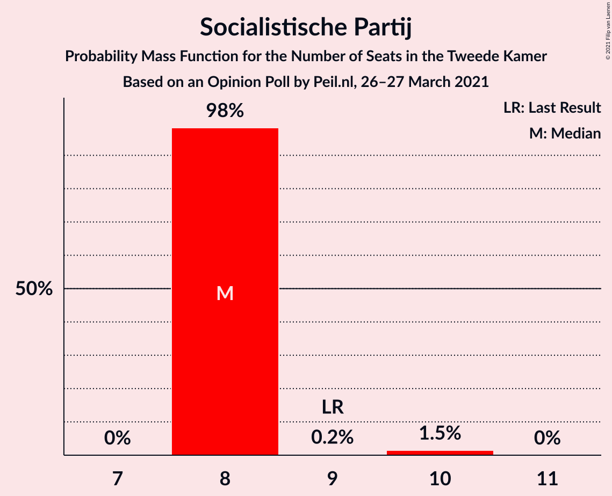
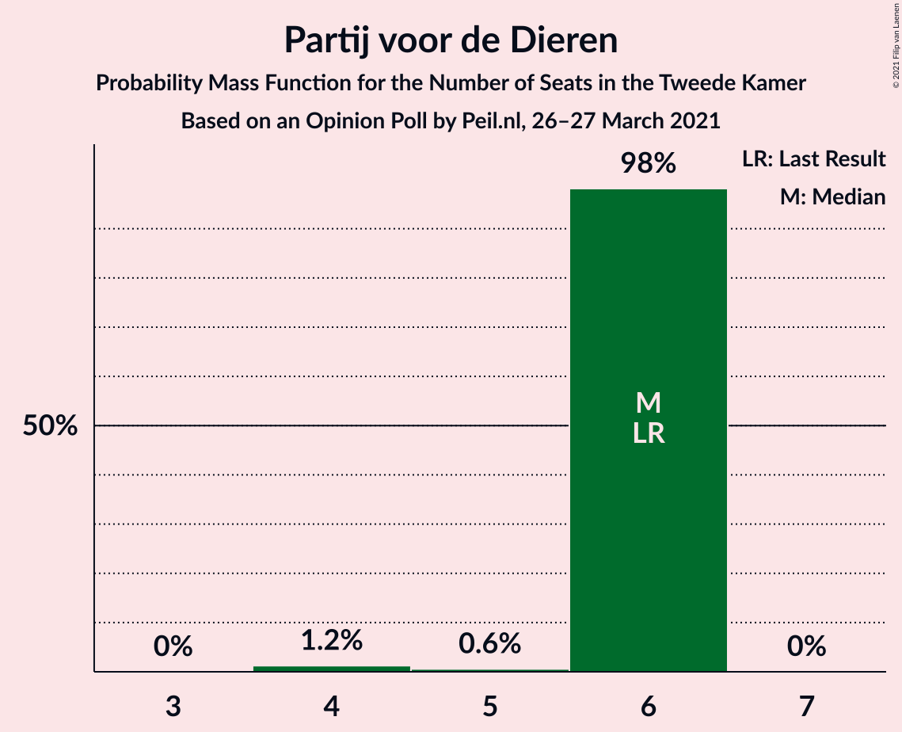
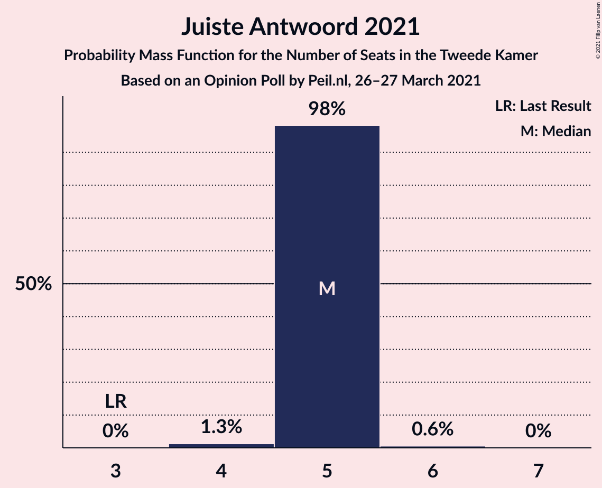
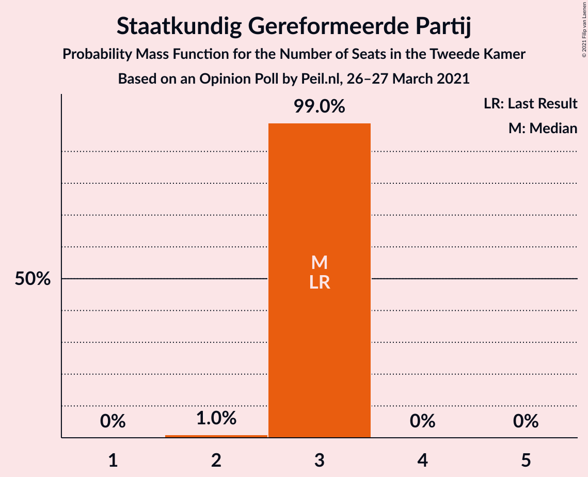
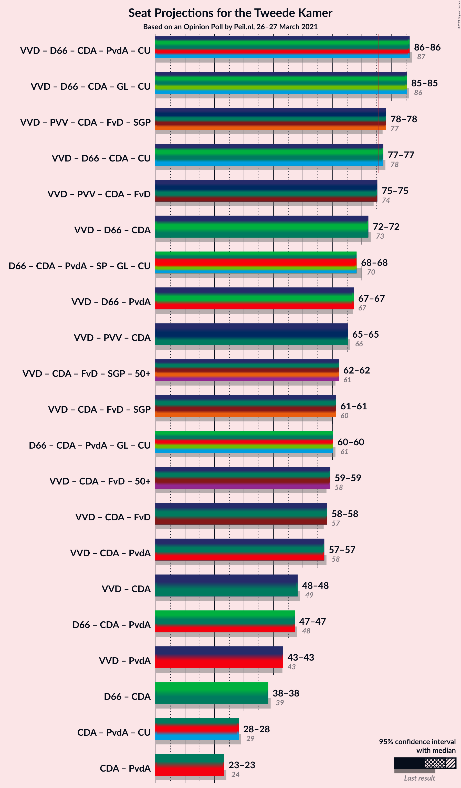
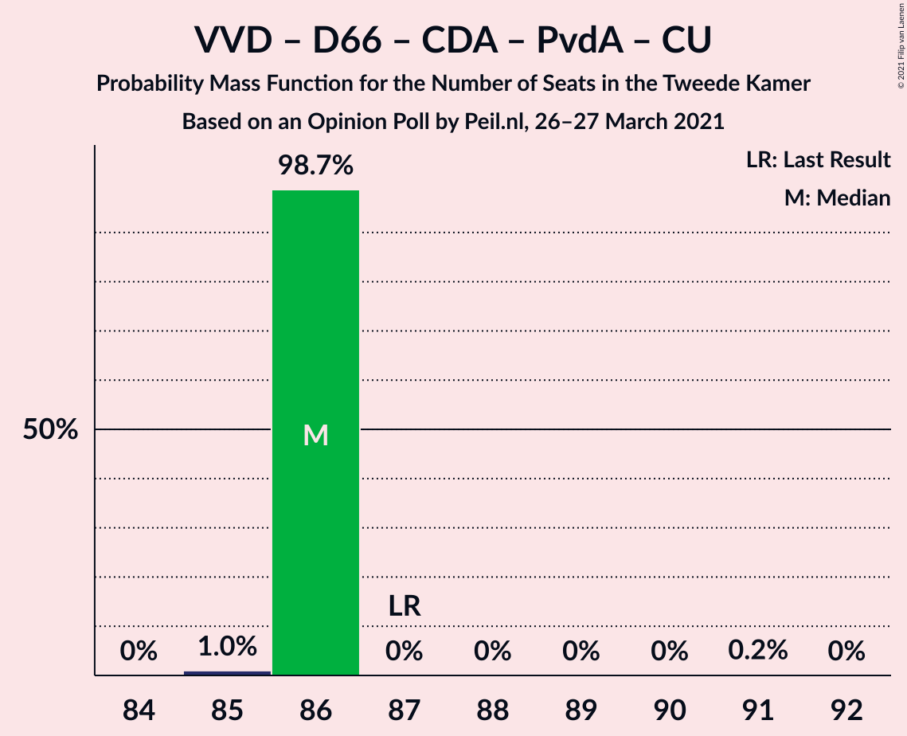
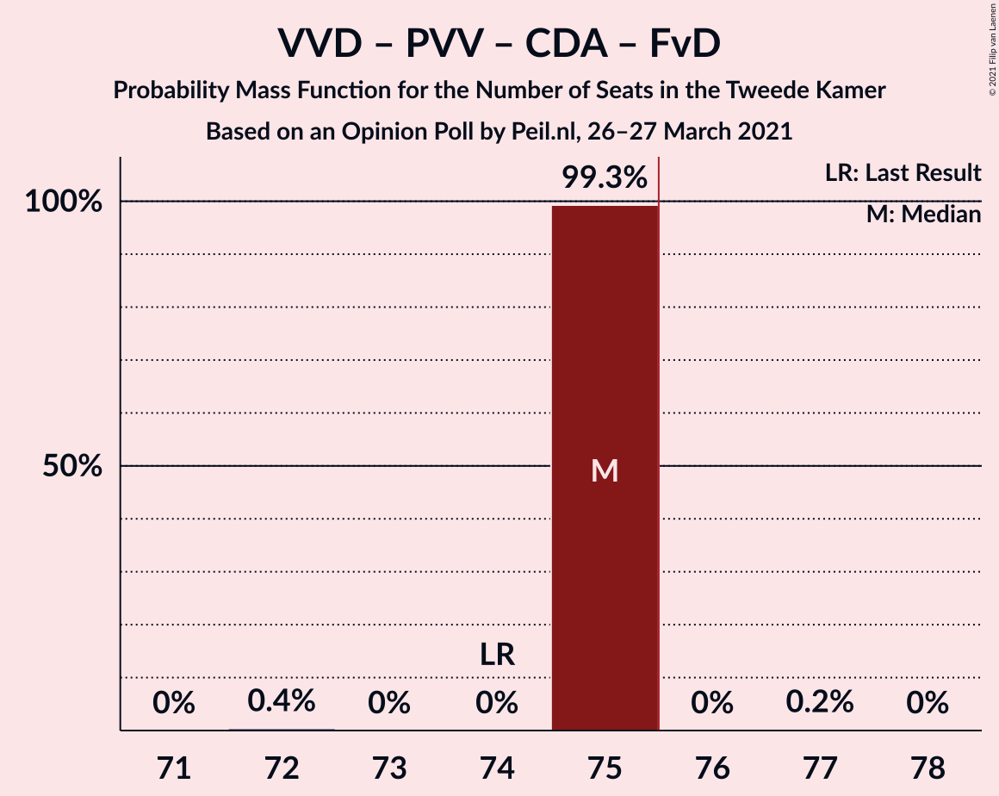

# Opinion Poll by Peil.nl, 26–27 March 2021

<a href="#voting-intentions">Voting Intentions</a> | <a href="#seats">Seats</a> | <a href="#coalitions">Coalitions</a> | <a href="#technical-information">Technical Information</a>

## Voting Intentions

### Confidence Intervals

| Party | Last Result | Poll Result | 80% Confidence Interval | 90% Confidence Interval | 95% Confidence Interval | 99% Confidence Interval |
|:-----:|:-----------:|:-----------:|:-----------------------:|:-----------------------:|:-----------------------:|:-----------------------:|
| Volkspartij voor Vrijheid en Democratie | 21.9% | 22.0% | 21.0–23.0% |20.7–23.2% |20.5–23.5% |20.1–24.0% |
| Democraten 66 | 15.0% | 16.0% | 15.1–16.9% |14.9–17.1% |14.7–17.3% |14.3–17.8% |
| Partij voor de Vrijheid | 10.8% | 10.6% | 9.9–11.4% |9.7–11.6% |9.6–11.8% |9.3–12.2% |
| Christen-Democratisch Appèl | 9.5% | 9.3% | 8.7–10.1% |8.5–10.3% |8.3–10.4% |8.0–10.8% |
| Socialistische Partij | 6.0% | 6.0% | 5.5–6.6% |5.3–6.8% |5.2–6.9% |5.0–7.2% |
| Partij van de Arbeid | 5.7% | 6.0% | 5.5–6.6% |5.3–6.8% |5.2–6.9% |5.0–7.2% |
| Forum voor Democratie | 5.0% | 6.0% | 5.5–6.6% |5.3–6.8% |5.2–6.9% |5.0–7.2% |
| GroenLinks | 5.2% | 4.7% | 4.2–5.2% |4.1–5.3% |4.0–5.5% |3.7–5.8% |
| Partij voor de Dieren | 3.8% | 4.0% | 3.6–4.5% |3.4–4.6% |3.4–4.8% |3.2–5.0% |
| ChristenUnie | 3.4% | 3.3% | 2.9–3.8% |2.8–3.9% |2.7–4.0% |2.6–4.3% |
| Juiste Antwoord 2021 | 2.4% | 3.3% | 2.9–3.8% |2.8–3.9% |2.7–4.0% |2.6–4.3% |
| Volt Europa | 2.4% | 2.7% | 2.3–3.1% |2.2–3.2% |2.1–3.3% |2.0–3.5% |
| Staatkundig Gereformeerde Partij | 2.1% | 2.0% | 1.7–2.4% |1.6–2.5% |1.6–2.6% |1.4–2.8% |
| DENK | 2.0% | 2.0% | 1.7–2.4% |1.6–2.5% |1.6–2.6% |1.4–2.8% |
| 50Plus | 1.0% | 0.7% | 0.5–0.9% |0.5–1.0% |0.4–1.0% |0.4–1.2% |
| Bij1 | 0.8% | 0.7% | 0.5–0.9% |0.5–1.0% |0.4–1.0% |0.4–1.2% |
| BoerBurgerBeweging | 1.0% | 0.7% | 0.5–0.9% |0.5–1.0% |0.4–1.0% |0.4–1.2% |

*Note:* The poll result column reflects the actual value used in the calculations. Published results may vary slightly, and in addition be rounded to fewer digits.

## Seats

### Confidence Intervals

| Party | Last Result | Median | 80% Confidence Interval | 90% Confidence Interval | 95% Confidence Interval | 99% Confidence Interval |
|:-----:|:-----------:|:------:|:-----------------------:|:-----------------------:|:-----------------------:|:-----------------------:|
| <a href="#volkspartij-voor-vrijheid-en-democratie">Volkspartij voor Vrijheid en Democratie</a> | 34 | 35 | 32–37 |32–37 |32–37 |32–37 |
| <a href="#democraten-66">Democraten 66</a> | 24 | 24 | 22–26 |22–26 |22–27 |22–27 |
| <a href="#partij-voor-de-vrijheid">Partij voor de Vrijheid</a> | 17 | 15 | 13–18 |13–19 |13–19 |13–19 |
| <a href="#christen-democratisch-appèl">Christen-Democratisch Appèl</a> | 15 | 14 | 13–16 |12–16 |12–16 |12–17 |
| <a href="#socialistische-partij">Socialistische Partij</a> | 9 | 9 | 7–10 |7–12 |7–12 |7–12 |
| <a href="#partij-van-de-arbeid">Partij van de Arbeid</a> | 9 | 9 | 8–10 |8–10 |8–10 |6–11 |
| <a href="#forum-voor-democratie">Forum voor Democratie</a> | 8 | 9 | 8–10 |8–10 |7–10 |7–10 |
| <a href="#groenlinks">GroenLinks</a> | 8 | 7 | 6–8 |6–8 |6–8 |5–9 |
| <a href="#partij-voor-de-dieren">Partij voor de Dieren</a> | 6 | 6 | 5–7 |5–8 |5–8 |5–8 |
| <a href="#christenunie">ChristenUnie</a> | 5 | 5 | 4–6 |4–6 |4–6 |4–7 |
| <a href="#juiste-antwoord-2021">Juiste Antwoord 2021</a> | 3 | 4 | 4–5 |4–6 |4–6 |4–6 |
| <a href="#volt-europa">Volt Europa</a> | 3 | 4 | 3–5 |3–5 |3–5 |2–5 |
| <a href="#staatkundig-gereformeerde-partij">Staatkundig Gereformeerde Partij</a> | 3 | 3 | 1–4 |1–4 |1–4 |1–4 |
| <a href="#denk">DENK</a> | 3 | 2 | 2–3 |2–3 |2–3 |2–3 |
| <a href="#50plus">50Plus</a> | 1 | 0 | 0–1 |0–1 |0–1 |0–2 |
| <a href="#bij1">Bij1</a> | 1 | 1 | 1–2 |0–2 |0–2 |0–2 |
| <a href="#boerburgerbeweging">BoerBurgerBeweging</a> | 1 | 1 | 0–1 |0–1 |0–1 |0–1 |

### Volkspartij voor Vrijheid en Democratie

*For a full overview of the results for this party, see the [Volkspartij voor Vrijheid en Democratie](party-volkspartijvoorvrijheidendemocratie.html) page.*

| Number of Seats | Probability | Accumulated | Special Marks |
|:---------------:|:-----------:|:-----------:|:-------------:|
| 31 | 0.2% | 100% |  |
| 32 | 24% | 99.7% |  |
| 33 | 4% | 76% |  |
| 34 | 0.4% | 72% | Last Result |
| 35 | 40% | 72% | Median |
| 36 | 15% | 32% |  |
| 37 | 17% | 17% |  |
| 38 | 0% | 0% |  |

### Democraten 66

*For a full overview of the results for this party, see the [Democraten 66](party-democraten66.html) page.*

| Number of Seats | Probability | Accumulated | Special Marks |
|:---------------:|:-----------:|:-----------:|:-------------:|
| 22 | 14% | 100% |  |
| 23 | 1.0% | 86% |  |
| 24 | 38% | 85% | Last Result, Median |
| 25 | 3% | 47% |  |
| 26 | 42% | 45% |  |
| 27 | 3% | 3% |  |
| 28 | 0.1% | 0.2% |  |
| 29 | 0.2% | 0.2% |  |
| 30 | 0% | 0% |  |

### Partij voor de Vrijheid

*For a full overview of the results for this party, see the [Partij voor de Vrijheid](party-partijvoordevrijheid.html) page.*

| Number of Seats | Probability | Accumulated | Special Marks |
|:---------------:|:-----------:|:-----------:|:-------------:|
| 13 | 31% | 100% |  |
| 14 | 15% | 69% |  |
| 15 | 11% | 54% | Median |
| 16 | 30% | 43% |  |
| 17 | 0.7% | 14% | Last Result |
| 18 | 3% | 13% |  |
| 19 | 10% | 10% |  |
| 20 | 0.2% | 0.2% |  |
| 21 | 0% | 0% |  |

### Christen-Democratisch Appèl

*For a full overview of the results for this party, see the [Christen-Democratisch Appèl](party-christen-democratischappèl.html) page.*

| Number of Seats | Probability | Accumulated | Special Marks |
|:---------------:|:-----------:|:-----------:|:-------------:|
| 12 | 8% | 100% |  |
| 13 | 19% | 92% |  |
| 14 | 49% | 73% | Median |
| 15 | 13% | 24% | Last Result |
| 16 | 10% | 11% |  |
| 17 | 0.9% | 1.1% |  |
| 18 | 0.2% | 0.2% |  |
| 19 | 0% | 0% |  |

### Socialistische Partij

*For a full overview of the results for this party, see the [Socialistische Partij](party-socialistischepartij.html) page.*

| Number of Seats | Probability | Accumulated | Special Marks |
|:---------------:|:-----------:|:-----------:|:-------------:|
| 7 | 15% | 100% |  |
| 8 | 9% | 85% |  |
| 9 | 34% | 76% | Last Result, Median |
| 10 | 36% | 42% |  |
| 11 | 0.1% | 5% |  |
| 12 | 5% | 5% |  |
| 13 | 0% | 0% |  |

### Partij van de Arbeid

*For a full overview of the results for this party, see the [Partij van de Arbeid](party-partijvandearbeid.html) page.*

| Number of Seats | Probability | Accumulated | Special Marks |
|:---------------:|:-----------:|:-----------:|:-------------:|
| 6 | 0.7% | 100% |  |
| 7 | 0.1% | 99.3% |  |
| 8 | 20% | 99.3% |  |
| 9 | 41% | 79% | Last Result, Median |
| 10 | 37% | 38% |  |
| 11 | 1.1% | 1.2% |  |
| 12 | 0% | 0% |  |

### Forum voor Democratie

*For a full overview of the results for this party, see the [Forum voor Democratie](party-forumvoordemocratie.html) page.*

| Number of Seats | Probability | Accumulated | Special Marks |
|:---------------:|:-----------:|:-----------:|:-------------:|
| 7 | 5% | 100% |  |
| 8 | 16% | 95% | Last Result |
| 9 | 61% | 79% | Median |
| 10 | 18% | 18% |  |
| 11 | 0% | 0.1% |  |
| 12 | 0.1% | 0.1% |  |
| 13 | 0% | 0% |  |

### GroenLinks

*For a full overview of the results for this party, see the [GroenLinks](party-groenlinks.html) page.*

| Number of Seats | Probability | Accumulated | Special Marks |
|:---------------:|:-----------:|:-----------:|:-------------:|
| 5 | 1.1% | 100% |  |
| 6 | 31% | 98.9% |  |
| 7 | 27% | 68% | Median |
| 8 | 40% | 41% | Last Result |
| 9 | 0.8% | 0.8% |  |
| 10 | 0% | 0% |  |

### Partij voor de Dieren

*For a full overview of the results for this party, see the [Partij voor de Dieren](party-partijvoordedieren.html) page.*

| Number of Seats | Probability | Accumulated | Special Marks |
|:---------------:|:-----------:|:-----------:|:-------------:|
| 5 | 28% | 100% |  |
| 6 | 39% | 72% | Last Result, Median |
| 7 | 23% | 33% |  |
| 8 | 10% | 10% |  |
| 9 | 0% | 0% |  |

### ChristenUnie

*For a full overview of the results for this party, see the [ChristenUnie](party-christenunie.html) page.*

| Number of Seats | Probability | Accumulated | Special Marks |
|:---------------:|:-----------:|:-----------:|:-------------:|
| 3 | 0.1% | 100% |  |
| 4 | 42% | 99.9% |  |
| 5 | 34% | 58% | Last Result, Median |
| 6 | 21% | 23% |  |
| 7 | 2% | 2% |  |
| 8 | 0% | 0% |  |

### Juiste Antwoord 2021

*For a full overview of the results for this party, see the [Juiste Antwoord 2021](party-juisteantwoord2021.html) page.*

| Number of Seats | Probability | Accumulated | Special Marks |
|:---------------:|:-----------:|:-----------:|:-------------:|
| 3 | 0% | 100% | Last Result |
| 4 | 78% | 100% | Median |
| 5 | 14% | 22% |  |
| 6 | 8% | 8% |  |
| 7 | 0.3% | 0.3% |  |
| 8 | 0% | 0% |  |

### Volt Europa

*For a full overview of the results for this party, see the [Volt Europa](party-volteuropa.html) page.*

| Number of Seats | Probability | Accumulated | Special Marks |
|:---------------:|:-----------:|:-----------:|:-------------:|
| 2 | 0.6% | 100% |  |
| 3 | 14% | 99.4% | Last Result |
| 4 | 37% | 86% | Median |
| 5 | 48% | 48% |  |
| 6 | 0% | 0% |  |

### Staatkundig Gereformeerde Partij

*For a full overview of the results for this party, see the [Staatkundig Gereformeerde Partij](party-staatkundiggereformeerdepartij.html) page.*

| Number of Seats | Probability | Accumulated | Special Marks |
|:---------------:|:-----------:|:-----------:|:-------------:|
| 1 | 15% | 100% |  |
| 2 | 10% | 85% |  |
| 3 | 58% | 75% | Last Result, Median |
| 4 | 17% | 17% |  |
| 5 | 0% | 0% |  |

### DENK

*For a full overview of the results for this party, see the [DENK](party-denk.html) page.*

| Number of Seats | Probability | Accumulated | Special Marks |
|:---------------:|:-----------:|:-----------:|:-------------:|
| 1 | 0.1% | 100% |  |
| 2 | 51% | 99.9% | Median |
| 3 | 49% | 49% | Last Result |
| 4 | 0.4% | 0.4% |  |
| 5 | 0% | 0% |  |

### 50Plus

*For a full overview of the results for this party, see the [50Plus](party-50plus.html) page.*

| Number of Seats | Probability | Accumulated | Special Marks |
|:---------------:|:-----------:|:-----------:|:-------------:|
| 0 | 52% | 100% | Median |
| 1 | 47% | 48% | Last Result |
| 2 | 0.9% | 0.9% |  |
| 3 | 0% | 0% |  |

### Bij1

*For a full overview of the results for this party, see the [Bij1](party-bij1.html) page.*

| Number of Seats | Probability | Accumulated | Special Marks |
|:---------------:|:-----------:|:-----------:|:-------------:|
| 0 | 10% | 100% |  |
| 1 | 67% | 90% | Last Result, Median |
| 2 | 23% | 23% |  |
| 3 | 0% | 0% |  |

### BoerBurgerBeweging

*For a full overview of the results for this party, see the [BoerBurgerBeweging](party-boerburgerbeweging.html) page.*

| Number of Seats | Probability | Accumulated | Special Marks |
|:---------------:|:-----------:|:-----------:|:-------------:|
| 0 | 24% | 100% |  |
| 1 | 76% | 76% | Last Result, Median |
| 2 | 0.4% | 0.4% |  |
| 3 | 0% | 0% |  |

## Coalitions

### Confidence Intervals

| Coalition | Last Result | Median | Majority? | 80% Confidence Interval | 90% Confidence Interval | 95% Confidence Interval | 99% Confidence Interval |
|:---------:|:-----------:|:------:|:---------:|:-----------------------:|:-----------------------:|:-----------------------:|:-----------------------:|
| Volkspartij voor Vrijheid en Democratie – Democraten 66 – Christen-Democratisch Appèl – Partij van de Arbeid – ChristenUnie | 87 | 87 | 100% | 84–91 | 83–91 | 83–91 | 83–91 |
| Volkspartij voor Vrijheid en Democratie – Democraten 66 – Christen-Democratisch Appèl – GroenLinks – ChristenUnie | 86 | 85 | 100% | 81–89 | 81–89 | 80–89 | 80–89 |
| Volkspartij voor Vrijheid en Democratie – Democraten 66 – Christen-Democratisch Appèl – ChristenUnie | 78 | 77 | 87% | 74–83 | 74–83 | 74–83 | 74–83 |
| Volkspartij voor Vrijheid en Democratie – Partij voor de Vrijheid – Christen-Democratisch Appèl – Forum voor Democratie – Staatkundig Gereformeerde Partij | 77 | 75 | 28% | 73–79 | 73–79 | 73–80 | 73–80 |
| Volkspartij voor Vrijheid en Democratie – Partij voor de Vrijheid – Christen-Democratisch Appèl – Forum voor Democratie | 74 | 72 | 10% | 71–76 | 71–77 | 71–77 | 71–77 |
| Volkspartij voor Vrijheid en Democratie – Democraten 66 – Christen-Democratisch Appèl | 73 | 73 | 18% | 69–77 | 69–77 | 68–77 | 68–77 |
| Democraten 66 – Christen-Democratisch Appèl – Partij van de Arbeid – Socialistische Partij – GroenLinks – ChristenUnie | 70 | 69 | 0.2% | 67–70 | 64–71 | 64–73 | 64–74 |
| Volkspartij voor Vrijheid en Democratie – Democraten 66 – Partij van de Arbeid | 67 | 69 | 0% | 65–71 | 65–71 | 65–71 | 64–71 |
| Volkspartij voor Vrijheid en Democratie – Partij voor de Vrijheid – Christen-Democratisch Appèl | 66 | 63 | 0% | 62–67 | 62–67 | 62–67 | 62–69 |
| Volkspartij voor Vrijheid en Democratie – Christen-Democratisch Appèl – Forum voor Democratie – Staatkundig Gereformeerde Partij – 50Plus | 61 | 60 | 0% | 59–63 | 59–63 | 58–63 | 56–65 |
| Volkspartij voor Vrijheid en Democratie – Christen-Democratisch Appèl – Forum voor Democratie – Staatkundig Gereformeerde Partij | 60 | 60 | 0% | 59–63 | 58–63 | 57–63 | 56–65 |
| Democraten 66 – Christen-Democratisch Appèl – Partij van de Arbeid – GroenLinks – ChristenUnie | 61 | 60 | 0% | 57–61 | 55–62 | 55–63 | 55–64 |
| Volkspartij voor Vrijheid en Democratie – Christen-Democratisch Appèl – Forum voor Democratie – 50Plus | 58 | 58 | 0% | 57–59 | 56–59 | 55–59 | 53–61 |
| Volkspartij voor Vrijheid en Democratie – Christen-Democratisch Appèl – Partij van de Arbeid | 58 | 58 | 0% | 56–59 | 56–59 | 55–59 | 54–61 |
| Volkspartij voor Vrijheid en Democratie – Christen-Democratisch Appèl – Forum voor Democratie | 57 | 58 | 0% | 56–59 | 55–59 | 54–59 | 53–61 |
| Volkspartij voor Vrijheid en Democratie – Christen-Democratisch Appèl | 49 | 49 | 0% | 47–51 | 46–51 | 46–51 | 46–52 |
| Democraten 66 – Christen-Democratisch Appèl – Partij van de Arbeid | 48 | 48 | 0% | 45–50 | 43–50 | 43–51 | 43–53 |
| Volkspartij voor Vrijheid en Democratie – Partij van de Arbeid | 43 | 45 | 0% | 41–45 | 41–45 | 40–45 | 40–48 |
| Democraten 66 – Christen-Democratisch Appèl | 39 | 39 | 0% | 35–41 | 34–41 | 34–43 | 34–43 |
| Christen-Democratisch Appèl – Partij van de Arbeid – ChristenUnie | 29 | 28 | 0% | 27–29 | 26–30 | 26–31 | 26–31 |
| Christen-Democratisch Appèl – Partij van de Arbeid | 24 | 24 | 0% | 22–25 | 21–25 | 21–25 | 21–26 |

### Volkspartij voor Vrijheid en Democratie – Democraten 66 – Christen-Democratisch Appèl – Partij van de Arbeid – ChristenUnie

| Number of Seats | Probability | Accumulated | Special Marks |
|:---------------:|:-----------:|:-----------:|:-------------:|
| 83 | 8% | 100% |  |
| 84 | 3% | 92% |  |
| 85 | 10% | 89% |  |
| 86 | 0.3% | 79% |  |
| 87 | 43% | 79% | Last Result, Median |
| 88 | 2% | 35% |  |
| 89 | 18% | 34% |  |
| 90 | 0.9% | 16% |  |
| 91 | 15% | 15% |  |
| 92 | 0% | 0.2% |  |
| 93 | 0.1% | 0.1% |  |
| 94 | 0% | 0% |  |

### Volkspartij voor Vrijheid en Democratie – Democraten 66 – Christen-Democratisch Appèl – GroenLinks – ChristenUnie

| Number of Seats | Probability | Accumulated | Special Marks |
|:---------------:|:-----------:|:-----------:|:-------------:|
| 80 | 3% | 100% |  |
| 81 | 11% | 97% |  |
| 82 | 0.1% | 87% |  |
| 83 | 0.3% | 87% |  |
| 84 | 17% | 86% |  |
| 85 | 32% | 69% | Median |
| 86 | 3% | 38% | Last Result |
| 87 | 18% | 34% |  |
| 88 | 0.8% | 16% |  |
| 89 | 15% | 15% |  |
| 90 | 0% | 0.2% |  |
| 91 | 0% | 0.2% |  |
| 92 | 0% | 0.2% |  |
| 93 | 0% | 0.1% |  |
| 94 | 0.1% | 0.1% |  |
| 95 | 0% | 0% |  |

### Volkspartij voor Vrijheid en Democratie – Democraten 66 – Christen-Democratisch Appèl – ChristenUnie

| Number of Seats | Probability | Accumulated | Special Marks |
|:---------------:|:-----------:|:-----------:|:-------------:|
| 74 | 11% | 100% |  |
| 75 | 2% | 89% |  |
| 76 | 8% | 87% | Majority |
| 77 | 31% | 79% |  |
| 78 | 11% | 48% | Last Result, Median |
| 79 | 4% | 37% |  |
| 80 | 16% | 33% |  |
| 81 | 0.9% | 17% |  |
| 82 | 0.8% | 16% |  |
| 83 | 15% | 15% |  |
| 84 | 0% | 0.1% |  |
| 85 | 0.1% | 0.1% |  |
| 86 | 0% | 0% |  |

### Volkspartij voor Vrijheid en Democratie – Partij voor de Vrijheid – Christen-Democratisch Appèl – Forum voor Democratie – Staatkundig Gereformeerde Partij

| Number of Seats | Probability | Accumulated | Special Marks |
|:---------------:|:-----------:|:-----------:|:-------------:|
| 71 | 0.1% | 100% |  |
| 72 | 0.1% | 99.9% |  |
| 73 | 15% | 99.9% |  |
| 74 | 34% | 85% |  |
| 75 | 23% | 51% |  |
| 76 | 0.2% | 28% | Median, Majority |
| 77 | 3% | 28% | Last Result |
| 78 | 0.4% | 25% |  |
| 79 | 22% | 25% |  |
| 80 | 2% | 3% |  |
| 81 | 0% | 0.1% |  |
| 82 | 0% | 0.1% |  |
| 83 | 0.1% | 0.1% |  |
| 84 | 0% | 0% |  |

### Volkspartij voor Vrijheid en Democratie – Partij voor de Vrijheid – Christen-Democratisch Appèl – Forum voor Democratie

| Number of Seats | Probability | Accumulated | Special Marks |
|:---------------:|:-----------:|:-----------:|:-------------:|
| 69 | 0.1% | 100% |  |
| 70 | 0% | 99.9% |  |
| 71 | 34% | 99.9% |  |
| 72 | 38% | 66% |  |
| 73 | 0.2% | 28% | Median |
| 74 | 1.0% | 28% | Last Result |
| 75 | 17% | 27% |  |
| 76 | 2% | 10% | Majority |
| 77 | 7% | 8% |  |
| 78 | 0.3% | 0.4% |  |
| 79 | 0% | 0.1% |  |
| 80 | 0.1% | 0.1% |  |
| 81 | 0% | 0% |  |

### Volkspartij voor Vrijheid en Democratie – Democraten 66 – Christen-Democratisch Appèl

| Number of Seats | Probability | Accumulated | Special Marks |
|:---------------:|:-----------:|:-----------:|:-------------:|
| 68 | 3% | 100% |  |
| 69 | 10% | 97% |  |
| 70 | 0% | 87% |  |
| 71 | 0.5% | 87% |  |
| 72 | 10% | 86% |  |
| 73 | 42% | 76% | Last Result, Median |
| 74 | 0.1% | 35% |  |
| 75 | 17% | 35% |  |
| 76 | 2% | 18% | Majority |
| 77 | 15% | 16% |  |
| 78 | 0.1% | 0.4% |  |
| 79 | 0.1% | 0.3% |  |
| 80 | 0.1% | 0.1% |  |
| 81 | 0% | 0% |  |

### Democraten 66 – Christen-Democratisch Appèl – Partij van de Arbeid – Socialistische Partij – GroenLinks – ChristenUnie

| Number of Seats | Probability | Accumulated | Special Marks |
|:---------------:|:-----------:|:-----------:|:-------------:|
| 64 | 8% | 100% |  |
| 65 | 0.2% | 92% |  |
| 66 | 0.2% | 92% |  |
| 67 | 17% | 92% |  |
| 68 | 0.4% | 74% | Median |
| 69 | 26% | 74% |  |
| 70 | 40% | 48% | Last Result |
| 71 | 3% | 8% |  |
| 72 | 0.3% | 5% |  |
| 73 | 2% | 4% |  |
| 74 | 2% | 2% |  |
| 75 | 0% | 0.2% |  |
| 76 | 0% | 0.2% | Majority |
| 77 | 0.1% | 0.1% |  |
| 78 | 0% | 0% |  |

### Volkspartij voor Vrijheid en Democratie – Democraten 66 – Partij van de Arbeid

| Number of Seats | Probability | Accumulated | Special Marks |
|:---------------:|:-----------:|:-----------:|:-------------:|
| 64 | 2% | 100% |  |
| 65 | 10% | 98% |  |
| 66 | 12% | 87% |  |
| 67 | 10% | 76% | Last Result |
| 68 | 1.1% | 66% | Median |
| 69 | 33% | 65% |  |
| 70 | 1.3% | 32% |  |
| 71 | 31% | 31% |  |
| 72 | 0.1% | 0.1% |  |
| 73 | 0% | 0% |  |

### Volkspartij voor Vrijheid en Democratie – Partij voor de Vrijheid – Christen-Democratisch Appèl

| Number of Seats | Probability | Accumulated | Special Marks |
|:---------------:|:-----------:|:-----------:|:-------------:|
| 60 | 0.1% | 100% |  |
| 61 | 0.2% | 99.9% |  |
| 62 | 43% | 99.7% |  |
| 63 | 26% | 57% |  |
| 64 | 0.2% | 31% | Median |
| 65 | 3% | 31% |  |
| 66 | 3% | 28% | Last Result |
| 67 | 23% | 25% |  |
| 68 | 0.4% | 2% |  |
| 69 | 1.4% | 2% |  |
| 70 | 0.2% | 0.2% |  |
| 71 | 0% | 0% |  |

### Volkspartij voor Vrijheid en Democratie – Christen-Democratisch Appèl – Forum voor Democratie – Staatkundig Gereformeerde Partij – 50Plus

| Number of Seats | Probability | Accumulated | Special Marks |
|:---------------:|:-----------:|:-----------:|:-------------:|
| 55 | 0.1% | 100% |  |
| 56 | 2% | 99.9% |  |
| 57 | 0.1% | 98% |  |
| 58 | 0.5% | 98% |  |
| 59 | 18% | 97% |  |
| 60 | 30% | 79% |  |
| 61 | 0.6% | 50% | Last Result, Median |
| 62 | 32% | 49% |  |
| 63 | 16% | 17% |  |
| 64 | 0.1% | 1.0% |  |
| 65 | 0.8% | 0.9% |  |
| 66 | 0.1% | 0.1% |  |
| 67 | 0% | 0% |  |

### Volkspartij voor Vrijheid en Democratie – Christen-Democratisch Appèl – Forum voor Democratie – Staatkundig Gereformeerde Partij

| Number of Seats | Probability | Accumulated | Special Marks |
|:---------------:|:-----------:|:-----------:|:-------------:|
| 55 | 0.1% | 100% |  |
| 56 | 2% | 99.9% |  |
| 57 | 0.3% | 98% |  |
| 58 | 3% | 97% |  |
| 59 | 28% | 94% |  |
| 60 | 17% | 66% | Last Result |
| 61 | 32% | 49% | Median |
| 62 | 1.4% | 17% |  |
| 63 | 15% | 16% |  |
| 64 | 0.1% | 0.9% |  |
| 65 | 0.7% | 0.8% |  |
| 66 | 0.1% | 0.1% |  |
| 67 | 0% | 0% |  |

### Democraten 66 – Christen-Democratisch Appèl – Partij van de Arbeid – GroenLinks – ChristenUnie

| Number of Seats | Probability | Accumulated | Special Marks |
|:---------------:|:-----------:|:-----------:|:-------------:|
| 55 | 8% | 100% |  |
| 56 | 0.2% | 92% |  |
| 57 | 4% | 92% |  |
| 58 | 0.4% | 88% |  |
| 59 | 4% | 87% | Median |
| 60 | 61% | 83% |  |
| 61 | 17% | 23% | Last Result |
| 62 | 0.8% | 6% |  |
| 63 | 3% | 5% |  |
| 64 | 2% | 2% |  |
| 65 | 0.2% | 0.4% |  |
| 66 | 0% | 0.2% |  |
| 67 | 0% | 0.1% |  |
| 68 | 0.1% | 0.1% |  |
| 69 | 0% | 0% |  |

### Volkspartij voor Vrijheid en Democratie – Christen-Democratisch Appèl – Forum voor Democratie – 50Plus

| Number of Seats | Probability | Accumulated | Special Marks |
|:---------------:|:-----------:|:-----------:|:-------------:|
| 52 | 0.1% | 100% |  |
| 53 | 2% | 99.9% |  |
| 54 | 0% | 98% |  |
| 55 | 0.5% | 98% |  |
| 56 | 3% | 97% |  |
| 57 | 21% | 94% |  |
| 58 | 25% | 73% | Last Result, Median |
| 59 | 46% | 48% |  |
| 60 | 1.0% | 2% |  |
| 61 | 1.0% | 1.2% |  |
| 62 | 0.1% | 0.2% |  |
| 63 | 0.2% | 0.2% |  |
| 64 | 0% | 0% |  |

### Volkspartij voor Vrijheid en Democratie – Christen-Democratisch Appèl – Partij van de Arbeid

| Number of Seats | Probability | Accumulated | Special Marks |
|:---------------:|:-----------:|:-----------:|:-------------:|
| 52 | 0.1% | 100% |  |
| 53 | 0% | 99.9% |  |
| 54 | 2% | 99.9% |  |
| 55 | 0.4% | 98% |  |
| 56 | 21% | 97% |  |
| 57 | 11% | 77% |  |
| 58 | 18% | 66% | Last Result, Median |
| 59 | 47% | 48% |  |
| 60 | 0.5% | 2% |  |
| 61 | 0.9% | 1.0% |  |
| 62 | 0.1% | 0.1% |  |
| 63 | 0% | 0% |  |

### Volkspartij voor Vrijheid en Democratie – Christen-Democratisch Appèl – Forum voor Democratie

| Number of Seats | Probability | Accumulated | Special Marks |
|:---------------:|:-----------:|:-----------:|:-------------:|
| 52 | 0.1% | 100% |  |
| 53 | 2% | 99.9% |  |
| 54 | 0.3% | 98% |  |
| 55 | 3% | 97% |  |
| 56 | 11% | 94% |  |
| 57 | 12% | 83% | Last Result |
| 58 | 55% | 71% | Median |
| 59 | 15% | 16% |  |
| 60 | 0.1% | 1.2% |  |
| 61 | 1.0% | 1.1% |  |
| 62 | 0.1% | 0.2% |  |
| 63 | 0.1% | 0.1% |  |
| 64 | 0% | 0% |  |

### Volkspartij voor Vrijheid en Democratie – Christen-Democratisch Appèl

| Number of Seats | Probability | Accumulated | Special Marks |
|:---------------:|:-----------:|:-----------:|:-------------:|
| 43 | 0.1% | 100% |  |
| 44 | 0% | 99.9% |  |
| 45 | 0% | 99.9% |  |
| 46 | 5% | 99.9% |  |
| 47 | 21% | 95% |  |
| 48 | 9% | 74% |  |
| 49 | 46% | 65% | Last Result, Median |
| 50 | 0.9% | 18% |  |
| 51 | 16% | 18% |  |
| 52 | 0.9% | 1.1% |  |
| 53 | 0.2% | 0.2% |  |
| 54 | 0% | 0% |  |

### Democraten 66 – Christen-Democratisch Appèl – Partij van de Arbeid

| Number of Seats | Probability | Accumulated | Special Marks |
|:---------------:|:-----------:|:-----------:|:-------------:|
| 43 | 8% | 100% |  |
| 44 | 0.1% | 92% |  |
| 45 | 3% | 92% |  |
| 46 | 0.2% | 89% |  |
| 47 | 5% | 89% | Median |
| 48 | 63% | 84% | Last Result |
| 49 | 8% | 21% |  |
| 50 | 10% | 13% |  |
| 51 | 0.9% | 3% |  |
| 52 | 0.1% | 2% |  |
| 53 | 2% | 2% |  |
| 54 | 0.1% | 0.1% |  |
| 55 | 0% | 0% |  |

### Volkspartij voor Vrijheid en Democratie – Partij van de Arbeid

| Number of Seats | Probability | Accumulated | Special Marks |
|:---------------:|:-----------:|:-----------:|:-------------:|
| 40 | 3% | 100% |  |
| 41 | 19% | 97% |  |
| 42 | 5% | 79% |  |
| 43 | 3% | 74% | Last Result |
| 44 | 9% | 71% | Median |
| 45 | 62% | 63% |  |
| 46 | 0% | 0.9% |  |
| 47 | 0% | 0.8% |  |
| 48 | 0.8% | 0.8% |  |
| 49 | 0% | 0% |  |

### Democraten 66 – Christen-Democratisch Appèl

| Number of Seats | Probability | Accumulated | Special Marks |
|:---------------:|:-----------:|:-----------:|:-------------:|
| 34 | 8% | 100% |  |
| 35 | 3% | 92% |  |
| 36 | 1.0% | 89% |  |
| 37 | 2% | 88% |  |
| 38 | 31% | 86% | Median |
| 39 | 17% | 55% | Last Result |
| 40 | 25% | 38% |  |
| 41 | 10% | 13% |  |
| 42 | 0.8% | 4% |  |
| 43 | 3% | 3% |  |
| 44 | 0% | 0.3% |  |
| 45 | 0.1% | 0.3% |  |
| 46 | 0.1% | 0.1% |  |
| 47 | 0% | 0% |  |

### Christen-Democratisch Appèl – Partij van de Arbeid – ChristenUnie

| Number of Seats | Probability | Accumulated | Special Marks |
|:---------------:|:-----------:|:-----------:|:-------------:|
| 26 | 9% | 100% |  |
| 27 | 16% | 90% |  |
| 28 | 46% | 75% | Median |
| 29 | 23% | 29% | Last Result |
| 30 | 3% | 6% |  |
| 31 | 3% | 3% |  |
| 32 | 0% | 0% |  |

### Christen-Democratisch Appèl – Partij van de Arbeid

| Number of Seats | Probability | Accumulated | Special Marks |
|:---------------:|:-----------:|:-----------:|:-------------:|
| 21 | 8% | 100% |  |
| 22 | 33% | 92% |  |
| 23 | 4% | 58% | Median |
| 24 | 43% | 55% | Last Result |
| 25 | 10% | 12% |  |
| 26 | 2% | 2% |  |
| 27 | 0.1% | 0.1% |  |
| 28 | 0% | 0% |  |

## Technical Information

### Opinion Poll

+ **Polling firm:** Peil.nl
+ **Commissioner(s):** —
+ **Fieldwork period:** 26–27 March 2021

### Calculations

+ **Sample size:** 3000
+ **Simulations done:** 131,072
+ **Error estimate:** 2.09%

